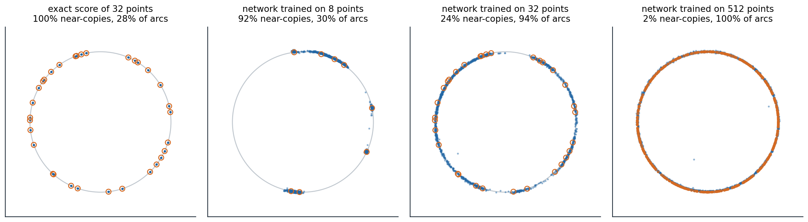

[Background Notes](../README.md) › [Generative AI](README.md)

# 15. The Theory of Diffusion Models

> [!WARNING]
> Work in progress: this part of the notes is still being revised.

[← 14. Generative Models for Science and Control](14-generative-models-for-science-and-control.md)

## <a id="what-theory-asks"></a>What theory asks

Diffusion models work far better than a naive reading of their ingredients suggests. They sample distributions with many modes that Langevin dynamics cannot ([chapter 6](06-energy-based-models-and-score-matching.md#why-langevin-sampling-struggles)), they are trained on finite datasets by a loss whose exact minimizer reproduces the training set, and they generate images coarse to fine without being told to. This optional chapter collects what is understood about three questions. Given an accurate score, how accurately and how quickly does a sampler produce the target distribution? Given only a finite training set, why do trained networks produce new samples rather than copies? And what property of images makes denoising a good way to generate them? A final section connects diffusion to optimal transport through the Schrödinger bridge.

## <a id="sampling-with-an-accurate-score"></a>Sampling with an accurate score

### <a id="convergence-guarantees"></a>Convergence guarantees

Suppose the score of every noisy marginal is known up to an error $`\varepsilon_{\text{score}}`$ in mean square. [Chen et al. (2023)](https://arxiv.org/abs/2209.11215) showed that the DDPM sampler then produces a distribution close to the data in total variation, with a number of steps polynomial in the dimension and the accuracy, under two mild assumptions: the score of every forward marginal is $`L`$-Lipschitz, and the data have a finite second moment. For the variance-preserving process run to time $`T`$ with step size $`h`$, the bound has three terms,

```math
\operatorname{TV}\lesssim\underbrace{\sqrt{D_{\mathrm{KL}}(q\,\|\,\gamma)}\,e^{-T}}_{\text{initialization}}+\underbrace{\bigl(L\sqrt{dh}+Lm_2h\bigr)\sqrt T}_{\text{discretization}}+\underbrace{\varepsilon_{\text{score}}\sqrt T}_{\text{score error}},
```

where $`\gamma`$ is the standard Gaussian, $`d`$ the dimension, and $`m_2`$ the data's second moment: the first term because the process is started from a Gaussian rather than the true noisy marginal, the second from the finite steps, the third from the learned score ([Appendix B](#block-gen15-appendix-b)). With a small enough score error, about $`L^2d/\varepsilon^2`$ steps give accuracy $`\varepsilon`$. The striking part is what is not assumed: no log-concavity, no isoperimetric inequality, nothing that excludes separated modes. Langevin dynamics needs such conditions because it must travel between modes at a single noise level; the diffusion sampler never has to, since it starts at a noise level where the modes have merged and follows them as they separate, the annealing of chapter 6 made continuous. [Benton et al. (2024)](https://arxiv.org/abs/2308.03686) sharpened the bound to about $`d\log^2(1/\delta)/\varepsilon^2`$ steps, linear in the dimension up to logarithms, assuming only a finite second moment, for the data smoothed by Gaussian noise of variance $`\delta`$. The smoothing, which corresponds to stopping the sampler slightly before $`\sigma=0`$, is needed when the data lie on a lower-dimensional manifold, where the score of the clean data does not exist, a setting analyzed by [De Bortoli (2022)](https://arxiv.org/abs/2208.05314).

### <a id="the-deterministic-sampler"></a>The deterministic sampler

The same guarantees are harder to prove for the probability-flow ODE of [chapter 8](08-diffusion-sdes-and-fast-sampling.md#the-probability-flow-ode). The reverse SDE contains a Langevin component that pulls samples back toward the current marginal and so corrects errors made earlier; the ODE has no such contraction, and an error in the score moves every later point along with it. [Chen et al. (2023)](https://arxiv.org/abs/2305.11798) proved polynomial guarantees for the ODE when each step is followed by a few steps of Langevin correction, and with an underdamped Langevin corrector the step count scaled as $`\sqrt d`$ rather than $`d`$, a better dependence on the dimension than the analysis of the stochastic sampler gives. The code measures the difference in sensitivity directly, sampling the mixture of chapters 6 and 8 with its exact score plus an oscillating error of relative size $`\varepsilon`$.

```python
import numpy as np

rng = np.random.default_rng(0)
w, m, s = np.array([0.8, 0.2]), np.array([-4.0, 4.0]), 0.5   # the mixture of chapters 6 and 8


def score(x, sigma, eps):                                  # exact score of the noisy mixture, plus an error
    v = s ** 2 + sigma ** 2
    logits = np.log(w) - (x[:, None] - m) ** 2 / (2 * v)
    r = np.exp(logits - logits.max(1, keepdims=True))
    r /= r.sum(1, keepdims=True)
    exact = (r * (m - x[:, None])).sum(1) / v
    return exact + eps * np.sin(2 * x) / np.sqrt(v)     # the error has size eps relative to the score's scale


def ode(eps, n=20000, steps=200):                         # probability-flow ODE in sigma, Heun's method
    sig = np.append((80 ** (1 / 7) + np.linspace(0, 1, steps) * (0.002 ** (1 / 7) - 80 ** (1 / 7))) ** 7, 0)
    x = 80 * rng.standard_normal(n)
    for s0, s1 in zip(sig[:-1], sig[1:]):
        d0 = -s0 * score(x, s0, eps)
        x_e = x + (s1 - s0) * d0
        x = x_e if s1 == 0 else x + (s1 - s0) * 0.5 * (d0 - s1 * score(x_e, s1, eps))
    return x


def sde(eps, n=20000, steps=1000):                        # reverse-time SDE, Euler-Maruyama
    levels = np.append(np.geomspace(80, 0.002, steps), 0)
    x = 80 * rng.standard_normal(n)
    for s0, s1 in zip(levels[:-1], levels[1:]):
        x = x + (s0 ** 2 - s1 ** 2) * score(x, s0, eps) + np.sqrt(s0 ** 2 - s1 ** 2) * rng.standard_normal(n)
    return x


edges = np.linspace(-7, 7, 141)
centers = (edges[:-1] + edges[1:]) / 2
true = (w * np.exp(-(centers[:, None] - m) ** 2 / (2 * s ** 2))).sum(1)
true /= true.sum()
tv = lambda x: 0.5 * np.abs(np.histogram(x, edges)[0] / len(x) - true).sum()
print("score error   total variation from the target      share in the left mode (target 0.800)")
print("                ODE        SDE                          ODE        SDE")
for eps in [0.0, 0.1, 0.3, 1.0]:
    xo, xs = ode(eps), sde(eps)
    print(f"  {eps:4.1f}        {tv(xo):.3f}      {tv(xs):.3f}                        {np.mean(xo < 0):.3f}      {np.mean(xs < 0):.3f}")
# score error   total variation from the target      share in the left mode (target 0.800)
#                 ODE        SDE                          ODE        SDE
#    0.0        0.024      0.021                        0.789      0.799
#    0.1        0.174      0.034                        0.785      0.793
#    0.3        0.478      0.091                        0.722      0.790
#    1.0        0.865      0.279                        0.493      0.790
```

With the exact score, both samplers reach the target up to sampling noise, a total variation of about 0.02. With an error of relative size 0.3, the ODE's samples are 0.478 from the target in total variation and the SDE's 0.091, and with an error of size 1, the ODE even loses the weights of the modes, 49.3% in the left mode against the target's 80%, while the SDE keeps them. Stochastic sampling tolerates imperfect scores better, which is why the samplers of chapter 8 add some noise when the network is imperfect and why deterministic samplers are paired with correctors in theory.

### <a id="estimating-the-score"></a>Estimating the score

The guarantees above assume an accurate score; how accurately a score can be learned from $`n`$ samples is a question of statistics. For densities of smoothness $`s`$ in $`d`$ dimensions, a diffusion model with a suitable network and training reaches the minimax rate of density estimation, about $`n^{-s/(2s+d)}`$ in total variation, up to logarithmic factors ([Oko, Akiyama, and Suzuki, 2023](https://arxiv.org/abs/2303.01861)), the same curse of dimensionality that faces any nonparametric estimator ([ML chapter 17](../ml/17-smoothing-density-estimation-and-basis-expansions.md)). When the data lie on an unknown low-dimensional linear subspace, the rate depends on the subspace's dimension rather than the ambient one ([Chen et al., 2023](https://arxiv.org/abs/2302.07194)). Such results explain why diffusion is not doomed in high dimensions but not why it works as well as it does on images, whose structure is richer than a subspace; the next section takes up what the networks actually learn.

## <a id="memorization-and-generalization"></a>Memorization and generalization

### <a id="the-optimal-denoiser-memorizes"></a>The optimal denoiser memorizes

The denoising loss on a training set $`\{x_i\}_{i=1}^N`$ is minimized exactly by the denoiser of the **empirical distribution**, which puts mass $`1/N`$ on each training point. Its noisy version is a mixture of Gaussians centered on the training points, so its optimal denoiser is a softmax-weighted average of them,

```math
D^\star(x;\sigma)=\sum_{i=1}^N\frac{\exp\bigl(-\|x-x_i\|^2/2\sigma^2\bigr)}{\sum_j\exp\bigl(-\|x-x_j\|^2/2\sigma^2\bigr)}\,x_i,
```

and a sampler that follows it ends, at $`\sigma=0`$, exactly on a training point ([Appendix A](#block-gen15-appendix-a)). A perfectly trained diffusion model is a lookup table of its training set. The code samples a 16-dimensional Gaussian from its exact score and from the empirical score of training sets of three sizes, and records the noise level below which each trajectory has committed to one training point, with more than 90% of the posterior weight.

```python
import numpy as np

rng = np.random.default_rng(0)
d = 16                                                    # data: a standard Gaussian in 16 dimensions
sig = np.append((80 ** (1 / 7) + np.linspace(0, 1, 80) * (0.002 ** (1 / 7) - 80 ** (1 / 7))) ** 7, 0.0)


def denoiser_empirical(x, s, train, h=0.0):
    """E[x0 | x] when x0 is a training point (plus Gaussian smoothing of width h) and x = x0 + s * noise."""
    v = h ** 2 + s ** 2
    logits = (2 * x @ train.T - (train ** 2).sum(1)) / (2 * v)   # -|x - t|^2 / 2v, up to a constant in t
    r = np.exp(logits - logits.max(1, keepdims=True))
    r /= r.sum(1, keepdims=True)
    return (r @ train) * (s ** 2 / v) + x * (h ** 2 / v), r.max(1)


def sample(denoise, n=400):                               # Heun's method on dx/dsigma = (x - D(x)) / sigma
    x = sig[0] * rng.standard_normal((n, d))
    top = []
    for s0, s1 in zip(sig[:-1], sig[1:]):
        dx, w = denoise(x, s0)
        top.append(np.median(w))
        x_e = x + (s1 - s0) * (x - dx) / s0
        x = x_e if s1 == 0 else x + (s1 - s0) * 0.5 * ((x - dx) / s0 + (x_e - denoise(x_e, s1)[0]) / s1)
    return x, np.array(top)


def nearest(x, train):
    d2 = (x ** 2).sum(1)[:, None] - 2 * x @ train.T + (train ** 2).sum(1)
    return np.sqrt(np.maximum(d2.min(1), 0))


print("training points   sampler                    median distance to nearest   share within 0.01   collapse at sigma")
for N in [100, 1000, 10000]:
    train = rng.standard_normal((N, d))
    fresh = rng.standard_normal((400, d))                 # new draws from the true distribution, for reference
    rows = [("exact score of the data", lambda x, s: (x / (1 + s ** 2), np.ones(len(x)))),
            ("empirical score", lambda x, s: denoiser_empirical(x, s, train)),
            ("empirical, smoothed h=0.5", lambda x, s: denoiser_empirical(x, s, train, 0.5))]
    for name, den in rows:
        x, top = sample(den)
        collapse = f"{sig[:-1][np.argmax(top > 0.9)]:6.2f}" if name != rows[0][0] else "     -"
        print(f"{N:8d}          {name:26s} {np.median(nearest(x, train)):8.3f}                {np.mean(nearest(x, train) < 0.01):.3f}"
              f"             {collapse}")
    print(f"{N:8d}          (fresh draws from the data) {np.median(nearest(fresh, train)):7.3f}")
# training points   sampler                    median distance to nearest   share within 0.01   collapse at sigma
#      100          exact score of the data       3.365                0.000                  -
#      100          empirical score               0.000                1.000               0.89
#      100          empirical, smoothed h=0.5     1.916                0.000               0.78
#      100          (fresh draws from the data)   3.460
#     1000          exact score of the data       2.925                0.000                  -
#     1000          empirical score               0.000                1.000               0.78
#     1000          empirical, smoothed h=0.5     1.932                0.000               0.60
#     1000          (fresh draws from the data)   2.940
#    10000          exact score of the data       2.478                0.000                  -
#    10000          empirical score               0.000                1.000               0.60
#    10000          empirical, smoothed h=0.5     1.981                0.000               0.33
#    10000          (fresh draws from the data)   2.468
```

Samples from the exact score of the data lie as far from the training points as fresh draws do. Every sample from the empirical score is a training point, whatever the size of the training set. Smoothing the empirical score, which amounts to a kernel density estimate with bandwidth 0.5, moves the samples off the training points but only by the bandwidth: they are still copies with noise added, closer to the training points than fresh data are. The noise level at which trajectories commit to a training point falls only slowly as the training set grows, from 0.89 with 100 points to 0.60 with 10,000. [Biroli et al. (2024)](https://arxiv.org/abs/2402.18491) analyzed this **collapse** for the exact empirical score. At high noise, trajectories first undergo a **speciation**, when they decide which large-scale class they belong to, at a time set by the largest variance of the data; later they collapse onto a single training point, and avoiding the collapse until the end would require a number of training points exponential in the dimension. A model that learned the optimal denoiser of its training set would therefore memorize any realistic dataset.

### <a id="why-trained-networks-generalize"></a>Why trained networks generalize

Trained networks do not learn the optimal denoiser. [Kadkhodaie et al. (2024)](https://arxiv.org/abs/2310.02557), in a paper that received an outstanding paper award at ICLR 2024, trained denoisers on faces from CelebA at $`80\times80`$ with training sets of 1 to 100,000 images. With up to 100 images, the models memorized, generating their training images. With 1,000, they generated images similar to training examples with distortions. With 100,000, two networks trained on disjoint halves of the data generated nearly identical images from the same noise, images that resembled neither training set, and their denoising errors on training and test images were equal. The networks had stopped memorizing because, with enough data, they converged to the same function, determined by the distribution and the network's inductive biases rather than by the particular samples. Kadkhodaie et al. described that function as shrinkage in a basis adapted to the image, oscillating along its contours and in its smooth regions, which they called **geometry-adaptive harmonic bases**. The figure shows the same transition for points on a circle.



*Samples, blue, of diffusion models of points on a circle of radius 2, with the training points circled in orange. Near-copies are samples within a tenth of the mean gap between training points of one of them; about 20% of new points on the circle would be. Arcs are the share of 100 equal arcs of the circle that contain samples. The exact score of 32 training points returns only the training points. A small network with the preconditioning of chapter 8, trained for 4,000 steps, memorizes 8 points, 91.7% near-copies with samples on 30% of the arcs, spreading a little along the arcs between nearby points; trained on 32 points it generalizes, 24.1% near-copies and 94% of the arcs; trained on 512 points, it covers the whole circle, with 1.8% near-copies because its samples lie slightly off the circle, farther from the densely packed training points than a tenth of their gap.*

### <a id="inductive-biases-of-the-denoiser"></a>Inductive biases of the denoiser

What determines the function a network learns in place of the empirical denoiser? For convolutional denoisers, two biases go a long way. A convolutional network sees each output pixel through a limited receptive field, **locality**, and applies the same computation at every position, **equivariance** to translations. [Kamb and Ganguli (2025)](https://arxiv.org/abs/2412.20292) built the optimal denoiser under exactly these constraints, the **equivariant local score machine**, which denoises each patch as the average of training patches from anywhere in any training image, weighted by how well they match. Without any training, it predicted the outputs of trained convolutional diffusion models from the same noise with median $`r^2`$ of 0.95 on CIFAR-10, 0.94 on FashionMNIST and MNIST, and 0.96 on CelebA, and explained their creativity as the assembly of **locally consistent patch mosaics**: new images whose patches each resemble some training patch. Models with self-attention, which is not local, were predicted less well, with a median $`r^2`$ of about 0.77 on CIFAR-10. [Niedoba et al. (2025)](https://arxiv.org/abs/2411.19339) found a similar local, patch-based structure across architectures.

A second simplification holds at high noise. There, the learned score is close to that of a single Gaussian with the mean and covariance of the data, whose denoiser is linear ([Wang and Vastola, 2023](https://arxiv.org/abs/2311.10892)); replacing the network by this Gaussian model for the first steps of sampling saved 15 to 30% of the network evaluations for less than a 3% increase in FID. [Li, Dai, and Qu (2024)](https://arxiv.org/abs/2410.24060) found that as models move from memorization to generalization, their denoisers become increasingly linear across noise levels and approach the optimal denoisers of that Gaussian. Memorization in practice, near-copies of duplicated training images ([chapter 13](13-evaluating-generative-models.md#memorization-and-copying)), is consistent with this picture: an image repeated many times is effectively a small training set of its own, and the network fits its empirical score.

## <a id="diffusion-as-spectral-autoregression"></a>Diffusion as spectral autoregression

The power spectra of natural images fall approximately as a power law in frequency, $`P(k)\propto k^{-\alpha}`$ with $`\alpha`$ near 2: [van der Schaaf and van Hateren (1996)](https://www.sciencedirect.com/science/article/pii/0042698996000028) measured a mean exponent of 1.88 over 276 images. Gaussian white noise has a flat spectrum. Adding noise of a given variance therefore drowns the high frequencies, whose power is small, long before the low frequencies, and each noise level has a frequency below which the signal dominates and above which the noise does. As the noise decreases in the reverse process, that frequency rises, and the model generates the image from coarse to fine structure, a soft **autoregression over frequency** ([Dieleman, 2024](https://sander.ai/2024/09/02/spectral-autoregression.html)). The code finds the crossing frequency for random images with a $`1/k^2`$ spectrum.

```python
import numpy as np

rng = np.random.default_rng(0)
n = 128
k = np.sqrt(np.add.outer(np.fft.fftfreq(n) ** 2, np.fft.fftfreq(n) ** 2)) * n   # radial frequency, cycles/image
k[0, 0] = 1.0
# Random images whose power spectrum falls as 1 / k^2, like natural images; unit variance per pixel.
spectrum = np.fft.fft2(rng.standard_normal((200, n, n))) / k
images = np.real(np.fft.ifft2(spectrum))
images = (images - images.mean((1, 2), keepdims=True)) / images.std()

bins = np.unique(np.round(np.geomspace(1, n / 2, 25)))


def radial_power(x):                                      # power spectral density averaged over rings of frequency
    p = (np.abs(np.fft.fft2(x)) ** 2).mean(0)
    return np.array([p[(k >= lo) & (k < hi)].mean() for lo, hi in zip(bins[:-1], bins[1:])])


signal = radial_power(images)
print("noise sd   frequency where signal = noise   share of image variance at lower frequencies")
for sd in [0.5, 1.0, 2.0, 4.0, 8.0]:
    noise = radial_power(sd * rng.standard_normal((200, n, n)))
    ratio = signal / noise
    idx = np.argmax(ratio < 1) if (ratio < 1).any() else len(ratio)
    kc = bins[idx]
    variance_below = (np.abs(np.fft.fft2(images)) ** 2)[:, (k < kc)].sum() / (np.abs(np.fft.fft2(images)) ** 2).sum()
    print(f"{sd:6.2f}      {kc:5.0f} cycles per image                {variance_below:.3f}")
# noise sd   frequency where signal = noise   share of image variance at lower frequencies
#   0.50         45 cycles per image                0.901
#   1.00         23 cycles per image                0.757
#   2.00         11 cycles per image                0.598
#   4.00          6 cycles per image                0.466
#   8.00          3 cycles per image                0.311
```

Each doubling of the noise's standard deviation halves the frequency at which signal and noise are equal, from 45 cycles per image at a noise of 0.5 to 3 at a noise of 8, as the power law predicts ([Appendix C](#block-gen15-appendix-c)). Even at the largest noise, the frequencies still above the noise carry 31% of the image's variance: the coarse layout survives far into the forward process, and it is decided early in the reverse process, as in the digits of [chapter 7](07-denoising-diffusion-models.md#a-diffusion-model-of-digits). The picture holds for spectra averaged over many images, not exactly for each, and the transition between signal and noise at each level spans a wide band of frequencies. It explains several practical facts: why the resolution of an image shifts the schedule it needs ([chapter 11](11-latent-diffusion-and-large-scale-generation.md#larger-images-need-more-noise)), why weighting the loss toward low noise emphasizes imperceptible fine detail ([chapter 7](07-denoising-diffusion-models.md#weighting-the-noise-levels)), and why a process that blurs images instead of noising them, **inverse heat dissipation** ([Rissanen, Heinonen, and Solin, 2023](https://arxiv.org/abs/2206.13397)), can also generate them.

## <a id="schrodinger-bridges-and-optimal-transport"></a>Schrödinger bridges and optimal transport

A diffusion model transports the Gaussian to the data along a process fixed in advance, and it needs the forward process to have almost destroyed the data by time $`T`$. The **Schrödinger bridge** problem, posed by Schrödinger in 1931 and 1932, asks instead for the stochastic process that has two prescribed marginals, at the start and at the end, and is as close as possible, in KL divergence over paths, to a reference process such as Brownian motion. It is equivalent to optimal transport with an entropy regularization ([Léonard, 2014](https://arxiv.org/abs/1308.0215)), and as the noise of the reference process vanishes, the bridge becomes the optimal-transport map between the marginals, whose straight paths chapter 9 approximated with minibatch couplings ([chapter 9](09-flow-matching.md#optimal-transport-couplings)). **Diffusion Schrödinger bridges** ([De Bortoli et al., 2021](https://arxiv.org/abs/2106.01357)) compute the bridge between the data and the Gaussian, or between two data distributions, by iterative proportional fitting: alternately learn a backward process that turns the second marginal into the first by score matching, and a forward process that does the reverse, each fitted to trajectories of the other; it is the continuous analogue of the Sinkhorn algorithm, and its first iteration is an ordinary diffusion model. Later work fits bridges by **iterative Markovian fitting** ([Shi et al., 2023](https://arxiv.org/abs/2303.16852)), related to reflow, and uses bridges between paired distributions for image restoration ([Liu et al., 2023](https://arxiv.org/abs/2302.05872)). Bridges connect the families of this module: diffusion, flow matching, stochastic interpolants, and optimal transport are all ways of choosing a path between two distributions, differing in whether the path is fixed or learned and whether it is deterministic or stochastic.

## <a id="appendices"></a>Appendices


<details>
<summary><a id="block-gen15-appendix-a"></a><b>A. The empirical denoiser and where its sampler ends</b></summary>


**The denoiser.** With $`x=x_0+\sigma\epsilon`$ and $`x_0`$ uniform over the training points, the posterior probability of point $`i`$ is proportional to $`\exp(-\|x-x_i\|^2/2\sigma^2)`$, and $`D^\star(x;\sigma)=\mathbb E[x_0\mid x]`$ is the posterior-weighted average of the points, the formula in the text. The score of the noisy empirical distribution is $`(D^\star(x;\sigma)-x)/\sigma^2`$.

**The endpoint.** As $`\sigma\to0`$, the weights concentrate on the nearest training point, so near the end of the probability-flow ODE, $`dx/d\sigma=(x-D^\star)/\sigma`$ has the solution $`x(\sigma)\approx x_i+c\,\sigma`$ approaching the nearest point $`x_i`$ linearly. Every trajectory ends on a training point, and the sampler's output distribution is a weighted set of training points, with weights given by the Gaussian measure of each point's basin of attraction at high noise; for the exact empirical score these weights are $`1/N`$ each, since the procedure samples the empirical distribution exactly. The collapse happens once $`\sigma`$ is small compared with the gaps between a trajectory's nearest training points; in $`d`$ dimensions, the gaps between random points shrink only as $`N^{-1/d}`$, so the collapse noise level decreases very slowly with the number of points: for $`d=16`$, a hundredfold increase in $`N`$ shrinks the gaps by a factor of about $`100^{1/16}\approx1.33`$, close to what the code measures.

</details>


<details>
<summary><a id="block-gen15-appendix-b"></a><b>B. Where the three terms of the bound come from</b></summary>


Compare two processes on paths: the true reverse process, which starts at the true noisy marginal $`q_T`$ and follows the true score, and the sampler, which starts at the Gaussian $`\gamma`$ and follows the estimated score with discretization. By the data-processing inequality, the KL divergence between their final distributions is at most that between their path distributions. By Girsanov's theorem, the latter is the KL divergence of the starting points plus $`\frac12\int\mathbb E\|g(t)(s_t-\hat s_t)\|^2dt`$, half the integrated squared difference of the drifts. The starting term is $`D_{\mathrm{KL}}(q_T\|\gamma)`$, which the forward process shrinks as $`e^{-2T}`$ times the initial divergence. The drift difference splits into the score error, whose integral over $`T`$ units of time gives $`\varepsilon_{\text{score}}^2T`$, and the discretization error, the change of the true score over a step of length $`h`$, controlled by the Lipschitz constant. Pinsker's inequality converts KL divergences into total variation by a square root, which produces the square roots in the bound. The analysis avoids log-concavity because it never needs the sampler to mix: it only compares it with the exact reverse process, which is known to end at the data.

</details>


<details>
<summary><a id="block-gen15-appendix-c"></a><b>C. The crossing frequency under white noise</b></summary>


Let an image of $`n\times n`$ pixels have a power spectrum $`P(k)=Ck^{-\alpha}`$ per frequency, and add independent Gaussian noise of variance $`\sigma^2`$ per pixel, whose power is $`\sigma^2`$ at every frequency in the same normalization. The signal-to-noise ratio at frequency $`k`$ is $`Ck^{-\alpha}/\sigma^2`$, which equals one at

```math
k_c=\Bigl(\frac C{\sigma^2}\Bigr)^{1/\alpha}\propto\sigma^{-2/\alpha}.
```

For $`\alpha=2`$, $`k_c\propto1/\sigma`$: doubling the noise halves the crossing frequency, as in the code. The variance below $`k_c`$ is $`\int_1^{k_c}Ck^{-\alpha}\,2\pi k\,dk`$, which for $`\alpha=2`$ grows as $`\log k_c`$, so each halving of $`k_c`$ removes the same amount of variance from the part of the image that survives, a constant share per octave of frequency. Coarse structure is not only more powerful than fine structure; under this spectrum each octave carries equal variance, and noise removes the octaves one at a time from the top.

</details>

---

[← 14. Generative Models for Science and Control](14-generative-models-for-science-and-control.md)
