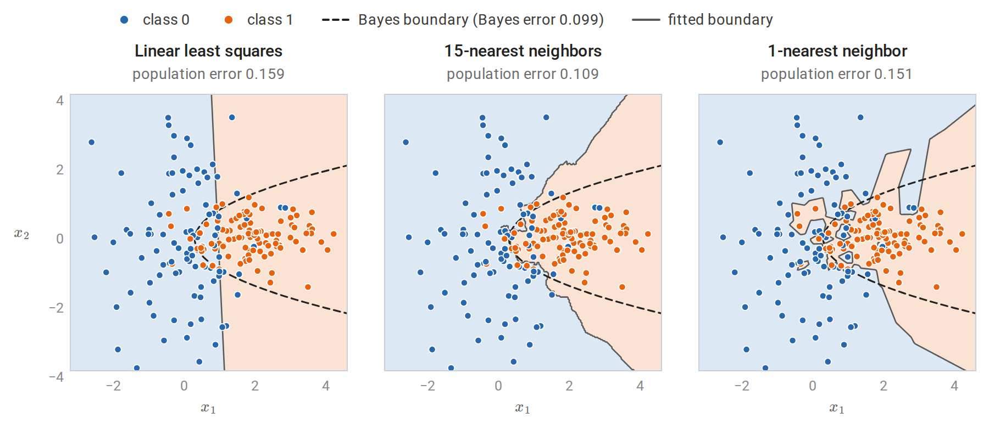
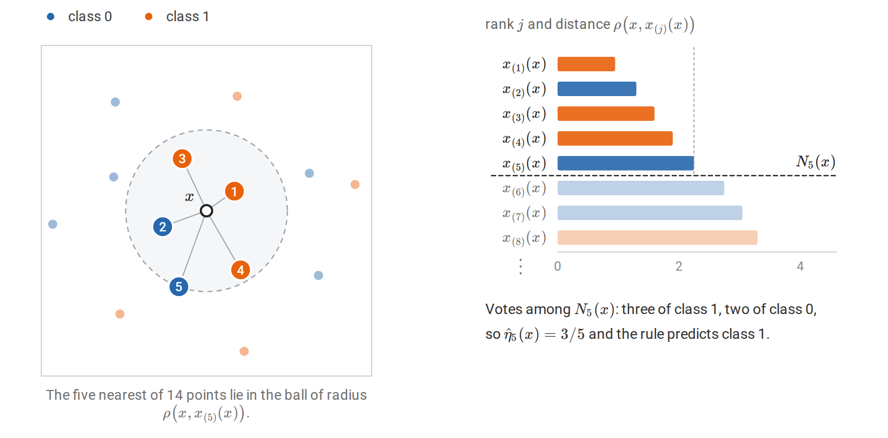
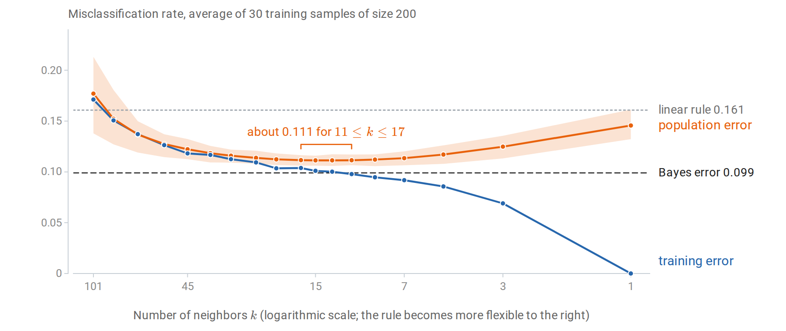
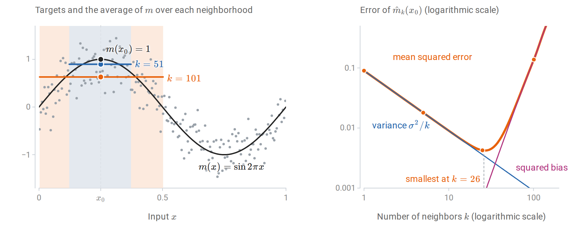
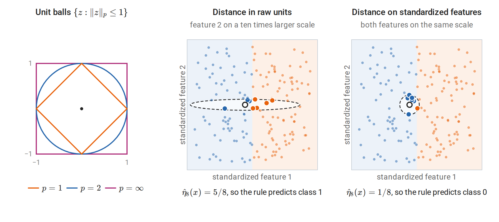
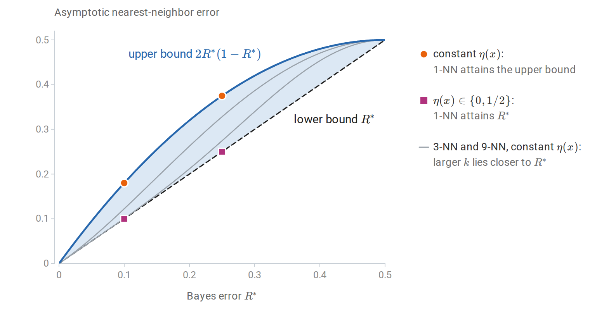
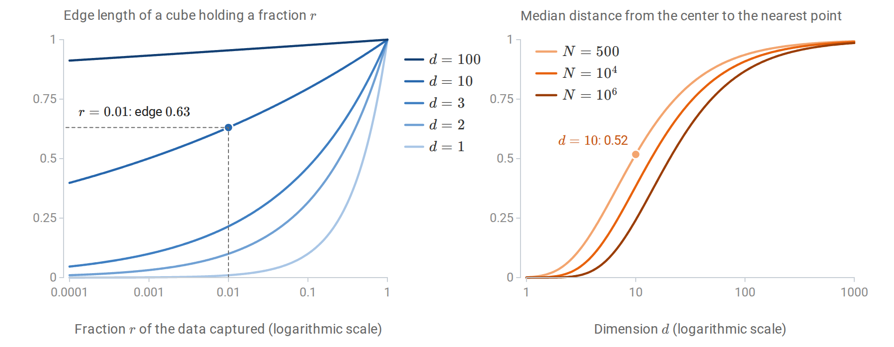
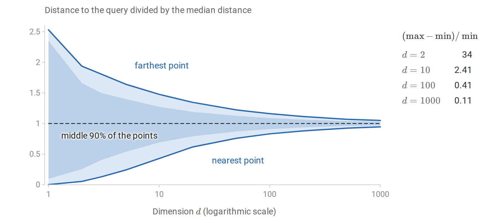
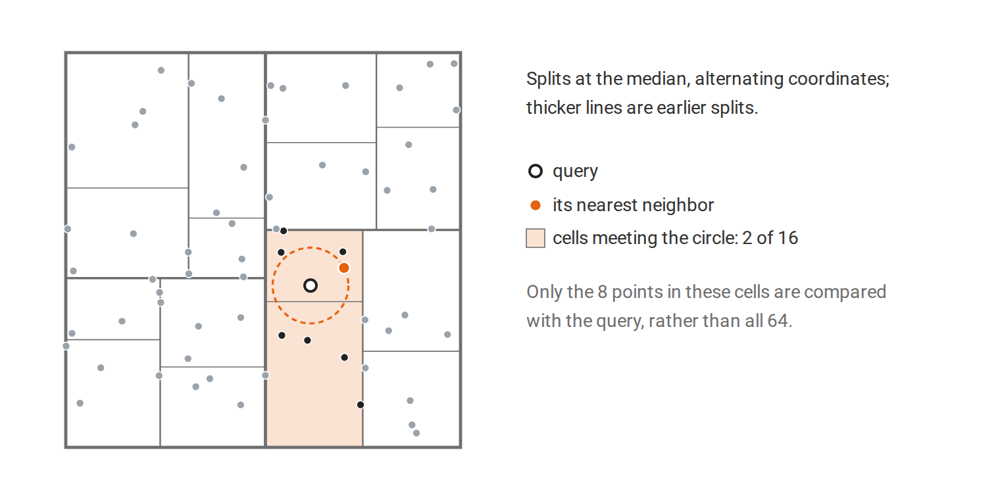

[ML Mastery Notes](../README.md) › [Machine Learning](README.md)

# 1. Learning Problems and Nearest Neighbors

[2. The Perceptron and Linear Separation →](02-the-perceptron-and-linear-separation.md)

## <a id="the-prediction-problem"></a>The prediction problem

### <a id="data-rules-and-risk"></a>Data, rules, and risk

Supervised learning begins with observations of input–target pairs. Throughout the ML module,

```math
D=\{(x_i,y_i)\}_{i=1}^n,\qquad (X_i,Y_i)\stackrel{\mathrm{iid}}{\sim}P,
```

where $`x_i\in\mathcal X`$ is an input, usually a feature vector in $`\mathbb R^d`$, and $`y_i\in\mathcal Y`$ is its target. In **regression** the target is numerical, $`\mathcal Y\subseteq\mathbb R`$. In **classification** it is one of $`K`$ labels. The design matrix $`X\in\mathbb R^{n\times d}`$ stores the inputs as rows $`x_i^\top`$, following the conventions in Foundations.

A **prediction rule** is a function $`f:\mathcal X\to\widehat{\mathcal Y}`$. A **loss** $`\ell(y,\hat y)`$, with the target first, measures the cost of predicting $`\hat y`$ when the target is $`y`$. The quantity a learning method ultimately cares about is the **population risk**

```math
R(f)=\mathbb E_{(X,Y)\sim P}\,\ell\bigl(Y,f(X)\bigr),
```

the expected loss on a fresh observation from the same law. The data supply only the **empirical risk**

```math
\widehat R_n(f)=\frac1n\sum_{i=1}^n\ell\bigl(y_i,f(x_i)\bigr).
```

These are the objects written $`R_\ast`$ and $`\widehat R_n`$ in Information and Learning Theory; the subscript on the law is dropped in this module. A **learning algorithm** maps the sample to a rule, $`\hat f=\mathcal A(D)`$. The rule is then applied to new inputs, and its quality is judged by $`R(\hat f)`$, a random quantity because $`\hat f`$ depends on $`D`$. The terminology of tasks, models, algorithms, and data splits is developed in Terminology and Mathematical Language.

Three losses recur:

| Task | Loss $`\ell(y,\hat y)`$ | Risk-minimizing prediction at $`x`$ |
| --- | --- | --- |
| Regression | Squared error $`(y-\hat y)^2`$ | Conditional mean $`m(x)=\mathbb E[Y\mid X=x]`$ |
| Regression | Absolute error $`\lvert y-\hat y\rvert`$ | A conditional median of $`Y`$ given $`X=x`$ |
| Classification | Zero–one loss $`\mathbf 1\{y\ne\hat y\}`$ | A label $`k`$ maximizing $`P(Y=k\mid X=x)`$ |

Each entry follows by minimizing the conditional expected loss $`\mathbb E[\ell(Y,a)\mid X=x]`$ separately for every $`x`$. The resulting rule is the **Bayes predictor**, and its risk $`R^\ast=\inf_fR(f)`$ is the **Bayes risk**, written $`R_\ast^{\mathrm{Bayes}}`$ in Information and Learning Theory. No method can do better on average under $`P`$, and when the target is noisy given the input, $`R^\ast`$ is positive. Probability and Statistics states the three results, and its decision-theory section gives the same three answers for choosing an action under a posterior distribution and proves the squared-error case. That section uses *Bayes risk* differently, for risk averaged over a prior; here the name refers to the optimal decision under the true law.

For binary classification with labels $`\{0,1\}`$, write

```math
\eta(x)=P(Y=1\mid X=x).
```

The **Bayes classifier** predicts $`1`$ exactly when $`\eta(x)\ge1/2`$, and its error is

```math
R^*=\mathbb E\bigl[\min\{\eta(X),1-\eta(X)\}\bigr].
```

Thus both regression and classification reduce, at the population level, to knowledge of a conditional distribution. For squared error one needs its mean; for zero–one loss one needs to know which side of $`1/2`$ the class probability lies on. The Bayes predictor is a benchmark, not an algorithm: it requires the unknown law $`P`$.

### <a id="two-ways-to-estimate-a-conditional-average"></a>Two ways to estimate a conditional average

Suppose the target is the regression function $`m(x)=\mathbb E[Y\mid X=x]`$. If many observations shared exactly the input $`x`$, averaging their targets would estimate $`m(x)`$ directly. With continuous inputs, repeated inputs are rare. A method must therefore decide which observations are informative about a new input. There are two broad answers.

A **global parametric** method assumes a functional form, such as $`m(x)\approx w^\top x+b`$, and fits its few parameters using all the data. Every observation influences the prediction at every input, through the fitted coefficients. The assumption buys statistical efficiency when it is approximately right; when it is wrong, no amount of data removes the resulting approximation error.

A **local nonparametric** method instead averages targets of observations whose inputs are *near* $`x`$. It assumes only that $`m`$ changes gradually, so that nearby inputs have similar conditional means. Its flexibility grows with the amount of data, but it needs enough observations in every neighborhood where predictions are required.

The contrast is visible on a simulated two-class problem whose Bayes classifier is known exactly. The two classes are equally likely and Gaussian, with different shapes: class 0 is $`\mathcal N\bigl((0,0)^\top,\operatorname{diag}(1,4)\bigr)`$, spread out vertically, and class 1 is $`\mathcal N\bigl((2,0)^\top,\operatorname{diag}(1,1/4)\bigr)`$, flattened. Writing $`p_0`$ and $`p_1`$ for the two class densities, the log ratio

```math
\ln\frac{p_1(x)}{p_0(x)}=2x_1-2+\ln4-\tfrac{15}{8}x_2^2
```

is positive exactly when $`\eta(x)>1/2`$. The Bayes boundary is therefore the parabola $`x_1=1-\ln2+\tfrac{15}{16}x_2^2`$, which curves around class 1. It is curved rather than straight because the two covariance matrices differ, as Generative Classifiers explains. The Bayes error is $`0.099`$. Fitting a least-squares linear function to the $`0/1`$ labels and thresholding it at $`1/2`$ gives a single straight boundary. Nearest-neighbor rules, defined in the next section, instead follow the data locally.



*Three rules fitted to the same 200 training points. Shading shows the class each rule predicts, the solid curve is its decision boundary, and the dashed curve is the Bayes boundary. The linear rule cannot bend with the Bayes boundary, while the 1-nearest-neighbor rule follows individual noisy labels and carves out small islands. The population error of each rule is computed from the known class densities, by numerical integration over a fine grid, rather than estimated from a test sample.*

| | Linear model | $`k`$-nearest neighbors |
| --- | --- | --- |
| Assumption | $`m`$ is approximately affine | $`m`$ is approximately constant on small neighborhoods |
| Parameters | $`d+1`$ coefficients, fixed in advance | None; the stored sample is the model |
| Fitting cost | One least-squares solve | None beyond storing the data |
| Prediction cost | $`O(d)`$ per input | $`O(nd)`$ per input by brute force |
| Main source of error | Approximation (bias) when the form is wrong | Variance for small $`k`$; bias for large $`k`$ and in high dimension |

Every method in the ML module can be located between these extremes: it specifies how observations are pooled to form a prediction. Linear models, trees, kernels, and ensembles pool differently, and their assumptions determine where they succeed. [*The Elements of Statistical Learning*, §§2.3–2.5](https://hastie.su.domains/ElemStatLearn/) develops this comparison.

### <a id="inductive-bias"></a>Inductive bias

A finite sample is consistent with infinitely many functions that differ away from the observed inputs. A learning method must therefore prefer some functions to others before seeing the data. This preference is its **inductive bias**. A linear model prefers affine functions; a nearest-neighbor rule prefers functions that are locally constant with respect to a chosen distance; a regularized method prefers small norms. The no-free-lunch argument shows that some such preference is unavoidable: without one, the observed labels say nothing about unobserved inputs.

The word *bias* here refers to an assumption, not yet to the statistical bias of an estimator. The two are connected: a strong inductive bias typically produces an estimator with low variance and, if the assumption is wrong, high statistical bias.

## <a id="nearest-neighbor-prediction"></a>Nearest-neighbor prediction

### <a id="the-k-nearest-neighbor-rule"></a>The k-nearest-neighbor rule

Fix a distance $`\rho`$ on $`\mathcal X`$, usually Euclidean distance on standardized features. Given a query input $`x`$, rank the training inputs by their distance to $`x`$. Write $`x_{(1)}(x)`$ for the closest training input, $`x_{(2)}(x)`$ for the second closest, and in general $`x_{(j)}(x)`$ for the one of rank $`j`$, so that

```math
\rho\bigl(x,x_{(1)}(x)\bigr)\le\rho\bigl(x,x_{(2)}(x)\bigr)\le\cdots\le\rho\bigl(x,x_{(n)}(x)\bigr).
```

The subscript in parentheses is a rank, as in the order statistics $`X_{(1)}\le\cdots\le X_{(n)}`$ of Probability and Statistics, and the argument $`x`$ records that the ranking depends on the query: a different query reorders the same sample. Thus $`\rho\bigl(x,x_{(j)}(x)\bigr)`$ is the $`j`$th smallest of the distances $`\rho(x,x_1),\ldots,\rho(x,x_n)`$. Let $`y_{(j)}(x)`$ be the target paired with $`x_{(j)}(x)`$, and let $`N_k(x)`$ be the set of indices of the $`k`$ inputs of rank $`1`$ to $`k`$, the **$`k`$ nearest neighbors** of $`x`$. The **$`k`$-nearest-neighbor ($`k`$-NN) regression estimate** is the local average

```math
\hat m_k(x)=\frac1k\sum_{j=1}^k y_{(j)}(x)=\frac1k\sum_{i\in N_k(x)}y_i.
```

For classification, the **$`k`$-NN classifier** predicts the most frequent label among the neighbors,

```math
\hat f_k(x)\in\operatorname*{arg\,max}_{c}\ \sum_{i\in N_k(x)}\mathbf 1\{y_i=c\}.
```

With binary labels in $`\{0,1\}`$, this is the plug-in rule that thresholds the local estimate $`\hat\eta_k(x)=\hat m_k(x)`$ at $`1/2`$. The classifier and the regression estimate therefore share one construction: estimate a conditional expectation by a local average, then apply the Bayes decision to that estimate.



*The 5-NN rule at one query $`x`$. Left: the numbers on the five highlighted points are their ranks $`j`$, and the dashed circle is the smallest ball around $`x`$ that contains all five. Right: the eight nearest points in order of distance; the first five form $`N_5(x)`$. This ordering is what the notation $`x_{(j)}(x)`$ records.*

Two tie conventions must be specified. **Distance ties** occur when several training points are equally far from $`x`$, so the ranking is not determined by distance alone; a stable sort by index, or random tie breaking, fixes the ranks and hence which points enter $`N_k(x)`$. **Vote ties** occur when two labels are equally frequent among the neighbors; choosing an odd $`k`$ avoids them in binary problems but not with three or more classes. Neither convention matters in the asymptotic theory below, where ties have probability zero, but both affect particular predictions.

The rule stores the training sample and does no fitting. It is sometimes called a *lazy* or *memory-based* learner, because all computation is deferred to prediction time. Its apparent lack of parameters is not a lack of choices: $`k`$, the distance, and the feature representation determine the predictor as completely as coefficients determine a linear model.

**Weighted neighbors.** The average can weight neighbors unequally, for example by $`w_i\propto1/\rho(x,x_i)`$, or by a decreasing kernel of the distance:

```math
\hat m(x)=\frac{\sum_iK\bigl(\rho(x,x_i)/h\bigr)y_i}{\sum_iK\bigl(\rho(x,x_i)/h\bigr)}.
```

With a fixed bandwidth $`h`$ instead of a fixed number of neighbors, this is the **Nadaraya–Watson** kernel smoother. The $`k`$-NN rule is the special case with a uniform kernel whose bandwidth adapts to the local density of the data: in sparse regions the $`k`$th neighbor is farther away, so the neighborhood widens automatically. Kernel smoothing and local polynomial regression are developed in Smoothing, Density Estimation, and Basis Expansions.

### <a id="a-worked-example"></a>A worked example

The [UCI wine data](https://archive.ics.uci.edu/dataset/109/wine), distributed with scikit-learn, contain 13 chemical measurements for wines from three cultivars. The following code implements the $`k`$-NN classifier directly and compares it with [`KNeighborsClassifier`](https://scikit-learn.org/stable/modules/generated/sklearn.neighbors.KNeighborsClassifier.html).

```python
import numpy as np
from sklearn.datasets import load_wine
from sklearn.model_selection import train_test_split
from sklearn.neighbors import KNeighborsClassifier

X, y = load_wine(return_X_y=True)
X_train, X_test, y_train, y_test = train_test_split(
    X, y, test_size=0.3, stratify=y, random_state=0)

def knn_predict(X_train, y_train, X_query, k):
    # Squared Euclidean distances, shape (n_query, n_train).
    d2 = ((X_query[:, None, :] - X_train[None, :, :]) ** 2).sum(axis=2)
    neighbors = np.argsort(d2, axis=1, kind="stable")[:, :k]
    votes = y_train[neighbors]                       # (n_query, k)
    counts = np.apply_along_axis(np.bincount, 1, votes, minlength=3)
    return counts.argmax(axis=1)                     # vote ties -> smallest label

mean, scale = X_train.mean(axis=0), X_train.std(axis=0)
Z_train, Z_test = (X_train - mean) / scale, (X_test - mean) / scale

for name, A, B in [("raw", X_train, X_test), ("standardized", Z_train, Z_test)]:
    pred = knn_predict(A, y_train, B, k=5)
    ref = KNeighborsClassifier(n_neighbors=5).fit(A, y_train).predict(B)
    print(f"{name:>12}: test accuracy {np.mean(pred == y_test):.3f}, "
          f"agrees with scikit-learn: {np.array_equal(pred, ref)}")
print("feature standard deviations:", np.round(scale[[0, 7, 12]], 3).tolist())
#          raw: test accuracy 0.722, agrees with scikit-learn: True
# standardized: test accuracy 0.963, agrees with scikit-learn: True
# feature standard deviations: [0.823, 0.121, 325.392]
```

The last line of output shows why the raw distances perform poorly. Proline, the thirteenth feature, has a standard deviation of about 325 in its measurement units, while nonflavanoid phenols have about 0.12. Squared Euclidean distance adds squared coordinate differences, so proline alone essentially determines which wines are neighbors. Standardizing each feature by its training-set standard deviation gives every feature comparable influence, and accuracy rises from 0.72 to 0.96 on these 54 test wines.

The function `knn_predict` computes all query-to-training distances at once by broadcasting a `(q, 1, d)` array against a `(1, n, d)` array. This materializes a $`q\times n\times d`$ array of differences, which is harmless here but not for large data; [Computing nearest neighbors](#computing-nearest-neighbors) describes the alternatives.

The standardization constants are computed from the training inputs only and then applied unchanged to the test inputs. They are part of the fitted predictor, as in the complete example of Numerical Computing with NumPy and PyTorch. Computing them from all the data would let the test inputs influence the predictor, a mild form of the leakage discussed in Losses, Model Selection, and Evaluation.

### <a id="choosing-k-flexibility-and-its-cost"></a>Choosing k: flexibility and its cost

The number of neighbors controls how local the average is. With $`k=1`$, every training point is its own nearest neighbor, so the **training error is zero** whenever no two identical inputs carry different labels. That zero says nothing about new inputs: the 1-NN rule reproduces every noisy label, including those that fall on the wrong side of the Bayes boundary. At the other extreme, $`k=n`$ predicts the overall majority class everywhere.

A useful heuristic count is that $`k`$-NN has about $`n/k`$ **effective parameters**: if the neighborhoods did not overlap, there would be $`n/k`$ of them, each contributing one fitted average. Decreasing $`k`$ increases this count and the flexibility of the rule.



*Training and population error of $`k`$-NN on the problem of the first figure, averaged over 30 training samples of size 200. Because $`k`$ decreases to the right, the rule becomes more flexible from left to right. The band shows the middle 80% of the population errors across samples. Training error falls to zero at $`k=1`$, while population error is flat at about $`0.111`$ for $`k`$ from 11 to 17 and stays above the Bayes error. On average every $`k`$ up to 85 beats the linear rule.*

The pattern is the prototypical tradeoff between fitting the observed sample and generalizing to new observations. Training error decreases with flexibility, apart from small fluctuations, while population error first decreases and then increases: from $`0.177`$ at $`k=101`$ it falls to about $`0.111`$ for $`k`$ between 11 and 17 and rises again to $`0.146`$ at $`k=1`$. Within that range the averages differ by less than $`0.0005`$, far less than the spread between training samples, so no single $`k`$ there is meaningfully best. The same spread explains why the 15-NN rule of the first figure has population error $`0.109`$, slightly below the average $`0.111`$: that figure shows one particular training sample. In practice the population error is unknown and must be estimated. Error on a test set cannot be used to *choose* $`k`$ without contaminating it as a performance estimate; a separate validation set, or cross-validation, estimates the risk for each candidate $`k`$; selection procedures are the subject of Losses, Model Selection, and Evaluation.

### <a id="bias-and-variance-at-a-point"></a>Bias and variance at a point

Regression makes the tradeoff exact. Treat the training inputs as fixed and suppose

```math
y_i=m(x_i)+\varepsilon_i,\qquad \mathbb E\varepsilon_i=0,\quad \operatorname{Var}(\varepsilon_i)=\sigma^2,
```

with independent noise. At a fixed query $`x_0`$, the neighbor set $`N_k(x_0)`$ depends only on the inputs, so the estimate is an average of $`k`$ independent noisy targets:

```math
\hat m_k(x_0)=\frac1k\sum_{i\in N_k(x_0)}m(x_i)+\frac1k\sum_{i\in N_k(x_0)}\varepsilon_i.
```

Its expectation is the average of $`m`$ over the neighbors, and its variance is $`\sigma^2/k`$. Expanding the square therefore gives

```math
\boxed{
\mathbb E\bigl[(\hat m_k(x_0)-m(x_0))^2\bigr]
=\underbrace{\Bigl(\frac1k\sum_{i\in N_k(x_0)}m(x_i)-m(x_0)\Bigr)^2}_{\text{squared bias}}
+\underbrace{\frac{\sigma^2}{k}}_{\text{variance}}.
}
```

This is the decomposition of mean squared error into squared bias and variance from Probability and Statistics, applied to the estimator $`\hat m_k(x_0)`$ of the number $`m(x_0)`$. Increasing $`k`$ reduces variance but averages over neighbors farther from $`x_0`$, whose conditional means may differ from $`m(x_0)`$. For a new observation $`Y_0=m(x_0)+\varepsilon_0`$, the expected squared prediction error adds the irreducible $`\sigma^2`$. The decomposition for a whole predictor, rather than one query, is studied in Losses, Model Selection, and Evaluation.

A simulation makes both terms visible. It uses 200 equally spaced inputs on $`[0,1]`$, the regression function $`m(x)=\sin(2\pi x)`$, noise standard deviation $`0.3`$, and the query $`x_0=0.25`$, where $`m`$ peaks at $`1`$. Every other input has a smaller conditional mean than the peak, so the local average always lies below $`m(x_0)`$; the shortfall is negligible for small $`k`$ and grows quickly once the neighborhood reaches the slopes on either side.



*Left: one noisy sample, with the neighborhoods of $`x_0`$ for $`k=51`$ and $`k=101`$ shaded. Each horizontal segment is the average of $`m`$ over its neighborhood, which is the expected value of $`\hat m_k(x_0)`$, so its gap below $`m(x_0)=1`$ is the bias. Right: the exact squared bias, variance, and their sum as functions of $`k`$. The dashed line marks the smallest sum, at $`k=26`$, and the dots mark the four values of $`k`$ in the table below.*

The following code estimates the mean squared error by simulation for four values of $`k`$ and compares it with the formula.

```python
import numpy as np

rng = np.random.default_rng(0)
n, sigma, x0 = 200, 0.3, 0.25
x = (np.arange(n) + 0.5) / n                      # fixed design on [0, 1]
f = lambda t: np.sin(2 * np.pi * t)
order = np.argsort(np.abs(x - x0), kind="stable")

print(" k   bias^2   variance  simulated MSE  formula MSE")
for k in [1, 5, 25, 101]:
    nbrs = order[:k]
    bias = f(x[nbrs]).mean() - f(x0)
    noise = rng.normal(0, sigma, size=(20_000, k))  # only the neighbors' noise matters
    fhat = f(x[nbrs]).mean() + noise.mean(axis=1)
    mse = np.mean((fhat - f(x0)) ** 2)
    print(f"{k:3d}  {bias**2:.5f}  {sigma**2 / k:.5f}   {mse:.5f}      {bias**2 + sigma**2 / k:.5f}")
#  k   bias^2   variance  simulated MSE  formula MSE
#   1  0.00000  0.09000   0.08929      0.09000
#   5  0.00000  0.01800   0.01802      0.01800
#  25  0.00065  0.00360   0.00417      0.00425
# 101  0.13676  0.00089   0.13772      0.13765
```

For small $`k`$ the error is almost entirely variance; for $`k=101`$, half the sample, it is almost entirely bias. The simulated and formula columns differ only by Monte Carlo error. Over all $`k`$, the formula is smallest at $`k=26`$, where the squared bias is $`0.0008`$ and the variance $`0.0035`$. Near a peak the bias is proportional to the squared width of the neighborhood, so the squared bias grows like $`k^4`$; balancing it against $`\sigma^2/k`$ places the optimum where the squared bias is about a quarter of the variance. In practice $`m`$ is unknown, so neither term can be computed from data; the decomposition explains the shape of the error curve rather than supplying a way to choose $`k`$.

## <a id="distances-scaling-and-representation"></a>Distances, scaling, and representation

### <a id="the-distance-is-a-modeling-choice"></a>The distance is a modeling choice

A nearest-neighbor rule is only as good as its notion of similarity. Common choices for numerical features are the Minkowski distances $`\|x-z\|_p`$ built from the norms of Linear Algebra, with $`p=2`$ (Euclidean) and $`p=1`$ (Manhattan) most frequent. Their unit balls, drawn in the left panel of the figure in the next subsection, show which points each distance treats as equally near: the Euclidean ball is round, the $`\ell_1`$ ball is a diamond that favors changes along a single coordinate, and the $`\ell_\infty`$ ball is a square that looks only at the largest coordinate difference. The **Mahalanobis distance**

```math
\rho_\Sigma(x,z)=\sqrt{(x-z)^\top\Sigma^{-1}(x-z)}
```

is Euclidean distance after whitening by a covariance matrix $`\Sigma`$; see Whitening and Mahalanobis distance. With $`\Sigma`$ diagonal it reduces to standardization of each feature.

Other data call for other distances. Binary or categorical attributes can use the **Hamming distance**, the number of disagreeing attributes. Word-count vectors of documents are often compared by cosine similarity, which ignores document length. Mixed data need a rule for combining heterogeneous coordinates. Each choice encodes a claim about which differences between inputs matter for the target.

### <a id="scaling-and-irrelevant-features"></a>Scaling and irrelevant features

Squared Euclidean distance is a sum over coordinates, $`\|x-z\|_2^2=\sum_j(x_j-z_j)^2`$. Two consequences follow.

First, **units matter**. Multiplying one feature by 1000, for instance by recording a length in millimeters instead of meters, multiplies its contribution to squared distance by $`10^6`$. Standardization, $`z_j=(x_j-\mu_j)/s_j`$ with training-set mean and standard deviation, is the usual default. Robust alternatives use the median and interquartile range. Standardization is itself an assumption: it gives every feature equal *a priori* weight, including features that are irrelevant to the target.

Second, **irrelevant features add noise to every distance**. If $`q`$ of the $`d`$ standardized features are unrelated to $`Y`$, their squared differences contribute an amount of order $`q`$ to every squared distance, independent of the target. When $`q`$ is large, neighbors are chosen largely by the irrelevant coordinates.



*Left: unit balls of three Minkowski distances. Middle and right: both panels plot the standardized features; the class depends only on feature 1, with class 1 (orange) where it is positive, and the eight nearest neighbors of the query (black ring) are enlarged. Measured in raw units, where feature 2 is recorded on a ten times larger scale, a small difference in the irrelevant feature 2 outweighs a large difference in feature 1. The neighborhood becomes a long flat ellipse that reaches far into class 1, and the vote goes the wrong way. After standardization it is a small disk, and the vote is correct.*

The two effects compound. Rescaling a feature is equivalent to changing the shape of the neighborhood, and an irrelevant feature with a large scale is the worst case: it decides which points are neighbors while carrying no information about the target. Feature selection, feature weighting, and learned representations address this. **Metric learning** fits a matrix $`M\succeq0`$ in $`\rho_M(x,z)^2=(x-z)^\top M(x-z)`$ so that same-class points are close; neighborhood components analysis ([Goldberger et al., 2004](https://proceedings.neurips.cc/paper/2004/hash/42fe880812925e520249e808937738d2-Abstract.html)) is one such method.

The same issues arise for every distance-based method in this module, including kernel methods, clustering, and Gaussian processes.

## <a id="consistency-and-the-bayes-error"></a>Consistency and the Bayes error

The empirical behavior of $`k`$-NN raises a theoretical question: with unlimited data, how close can the rule get to the Bayes classifier? The answers are among the oldest results of statistical learning theory, and they illustrate what a nonparametric method can and cannot promise.

### <a id="the-nearest-neighbor-converges-to-the-query"></a>The nearest neighbor converges to the query

Let $`X`$ have law $`\mu`$ on $`\mathbb R^d`$ and let $`x`$ be in the **support** of $`\mu`$, meaning that every open ball around $`x`$ has positive probability. If $`X_1,\ldots,X_n`$ are iid from $`\mu`$, write $`X_{(j)}(x)`$ for the $`j`$th nearest of them to $`x`$. Then

```math
\rho\bigl(x,X_{(1)}(x)\bigr)\longrightarrow0\quad\text{almost surely as }n\to\infty.
```

Indeed, for any $`r>0`$ the ball $`B(x,r)`$ has probability $`p_r>0`$, so the chance that none of $`n`$ observations lands in it is $`(1-p_r)^n`$, which tends to zero. This is the formula $`P(X_{(1)}>t)=[1-F(t)]^n`$ for the smallest order statistic, applied to the distances $`\rho(x,X_i)`$. The nearest distance is nonincreasing in $`n`$, so convergence in probability upgrades to almost-sure convergence. The same holds for the $`k`$th nearest neighbor with $`k`$ fixed. Since $`X`$ itself lies in the support with probability one, the nearest neighbor of a random query converges to that query.

### <a id="the-coverhart-theorem"></a>The Cover–Hart theorem

Assume binary labels and that $`\eta`$ is continuous; the conclusion holds more generally, but continuity keeps the argument short. Condition on the query $`X=x`$ and its nearest neighbor $`X_{(1)}(x)=x'`$. The test label $`Y`$ and the neighbor's label $`Y'`$ are then independent Bernoulli variables with parameters $`\eta(x)`$ and $`\eta(x')`$. The 1-NN rule errs when they differ:

```math
P(Y\ne Y'\mid x,x')=\eta(x)\bigl(1-\eta(x')\bigr)+\bigl(1-\eta(x)\bigr)\eta(x').
```

As $`n\to\infty`$, $`x'\to x`$ and continuity gives the limit $`2\eta(x)(1-\eta(x))`$. The conditional error is bounded by one, so dominated convergence yields the asymptotic 1-NN risk

```math
R_{\mathrm{1NN}}=\lim_{n\to\infty}\mathbb E\,R(\hat f_{1,n})=\mathbb E\bigl[2\eta(X)\bigl(1-\eta(X)\bigr)\bigr].
```

This is the probability that two independent labels drawn at the same input disagree. It lies between the Bayes risk and twice the Bayes risk.

**Theorem (Cover and Hart, 1967).** Under the assumptions above,

```math
\boxed{R^*\le R_{\mathrm{1NN}}\le2R^*(1-R^*)\le2R^*.}
```

**Proof.** Let $`r(x)=\min\{\eta(x),1-\eta(x)\}`$, so $`R^\ast=\mathbb Er(X)`$ and $`2\eta(1-\eta)=2r(1-r)`$ pointwise. Since $`r\le1/2`$, $`2r(1-r)\ge r`$, giving the lower bound. For the upper bound,

```math
R_{\mathrm{1NN}}=2\mathbb E r(X)-2\mathbb E r(X)^2\le2R^*-2(R^*)^2,
```

because $`\mathbb E r^2\ge(\mathbb Er)^2`$. $`\square`$



*The asymptotic 1-NN error lies in the shaded region, and both bounds are attained. If $`\eta`$ is constant, Jensen's inequality is an equality and the 1-NN error equals $`2R^\ast(1-R^\ast)`$. If $`\eta`$ takes only the values $`0`$ and $`1/2`$, the 1-NN error equals $`R^\ast`$. The gray curves are the asymptotic errors of 3-NN and 9-NN for constant $`\eta`$, computed in [Appendix A](#block-nn-appendix-a): a vote over more neighbors comes closer to the Bayes error.*

The result has a striking interpretation: half of the classification information in an infinite sample is contained in the label of the single nearest neighbor. It also marks a limit. A 1-NN rule remains inconsistent whenever $`0<\eta(x)<1/2`$ on a set of positive probability, because it copies a single noisy label instead of estimating $`\eta(x)`$. The original paper is [Cover and Hart, *Nearest Neighbor Pattern Classification* (1967)](https://doi.org/10.1109/TIT.1967.1053964). The multiclass bound and the fixed-$`k`$ limit are in [Appendix A](#block-nn-appendix-a).

### <a id="universal-consistency"></a>Universal consistency

Averaging more neighbors removes the noise that 1-NN copies. Let $`k=k_n`$ grow with the sample size. **Stone's theorem** states that if

```math
k_n\to\infty\qquad\text{and}\qquad k_n/n\to0,
```

then $`\mathbb E R(\hat f_{k_n})\to R^\ast`$ for **every** distribution of $`(X,Y)`$ on $`\mathbb R^d\times\{0,1\}`$, with ties broken randomly. The rule is **universally consistent**. The first condition makes the average of the neighbors' labels concentrate around its mean; the second keeps the neighbors close to the query, so that their mean approaches $`\eta(x)`$. See [Stone, *Consistent Nonparametric Regression* (1977)](https://doi.org/10.1214/aos/1176343886) and [Devroye, Györfi, and Lugosi, *A Probabilistic Theory of Pattern Recognition*](https://doi.org/10.1007/978-1-4612-0711-5), which develops these results in detail.

Universal consistency is a limit statement. It says nothing about how large $`n`$ must be. Without assumptions on $`P`$, no rate is possible: for every rule and every sequence decreasing to zero, however slowly, some distribution makes the rule's excess risk decrease more slowly still. This is a sharper form of the no-free-lunch principle. Useful rates require assumptions, such as smoothness of $`\eta`$ or $`m`$.

### <a id="rates-under-smoothness"></a>Rates under smoothness

Suppose the inputs lie in a bounded set in $`\mathbb R^d`$, the regression function is $`L`$-Lipschitz, and the noise variance is at most $`\sigma^2`$. The $`k`$ nearest neighbors of a typical query lie within distance of order $`(k/n)^{1/d}`$, because a ball of that radius has probability of order $`k/n`$. Inserting this into the pointwise decomposition gives a bound of the form

```math
\mathbb E\bigl[(\hat m_k(X)-m(X))^2\bigr]
\lesssim\frac{\sigma^2}{k}+L^2\Bigl(\frac kn\Bigr)^{2/d},
```

valid for $`d\ge3`$ with a constant depending on $`d`$ and the input distribution. Balancing the two terms gives $`k\asymp n^{2/(d+2)}`$ and

```math
\mathbb E\bigl[(\hat m_k(X)-m(X))^2\bigr]\lesssim n^{-2/(d+2)}.
```

A precise statement and proof are in [Györfi, Kohler, Krzyżak, and Walk, *A Distribution-Free Theory of Nonparametric Regression*](https://doi.org/10.1007/b97848), Chapter 6. The exponent cannot be improved by any method under a Lipschitz assumption alone: [Stone (1982)](https://doi.org/10.1214/aos/1176345969) showed that $`n^{-2/(d+2)}`$ is the minimax rate for this class. Analogous rates for classification depend on smoothness of $`\eta`$ and on how much probability lies near the boundary $`\eta=1/2`$; see [Chaudhuri and Dasgupta (2014)](https://arxiv.org/abs/1407.0067).

The dimension enters the exponent. To halve the mean squared error, a one-dimensional problem needs about $`2^{3/2}\approx2.8`$ times as many observations; a twenty-dimensional problem needs about $`2^{11}=2048`$ times as many.

## <a id="the-curse-of-dimensionality"></a>The curse of dimensionality

The exponent $`2/(d+2)`$ is one expression of the **curse of dimensionality**: local methods need exponentially many observations, in the dimension, to keep their neighborhoods small. Several elementary calculations make this concrete.

**Neighborhoods must be wide.** For inputs uniform on the unit cube $`[0,1]^d`$, a subcube capturing a fraction $`r`$ of the observations has edge length $`r^{1/d}`$. In ten dimensions, a neighborhood containing 1% of the data has edge length $`0.01^{1/10}\approx0.63`$: it spans most of the range of every coordinate. A "local" average in high dimension is an average over a large, heterogeneous region.

**The nearest point is far away.** For $`N`$ points uniform in the unit ball of $`\mathbb R^d`$, the median distance from the center to the nearest point is

```math
\operatorname{med}=\Bigl(1-2^{-1/N}\Bigr)^{1/d},
```

because $`P(\text{all }N\text{ points farther than }r)=(1-r^d)^N`$. With $`N=500`$:

```python
import numpy as np

N = 500
for d in [1, 2, 10, 100]:
    median_nn = (1 - 0.5 ** (1 / N)) ** (1 / d)
    print(f"d = {d:3d}: median distance to the nearest of {N} points = {median_nn:.3f}")

rng = np.random.default_rng(1)            # Monte Carlo check for d = 10
d, reps = 10, 2000
g = rng.normal(size=(reps, N, d))
r = rng.uniform(size=(reps, N, 1)) ** (1 / d)
points = g / np.linalg.norm(g, axis=2, keepdims=True) * r   # uniform in the unit ball
print("simulated, d = 10:", np.median(np.linalg.norm(points, axis=2).min(axis=1)).round(3))
# d =   1: median distance to the nearest of 500 points = 0.001
# d =   2: median distance to the nearest of 500 points = 0.037
# d =  10: median distance to the nearest of 500 points = 0.518
# d = 100: median distance to the nearest of 500 points = 0.936
# simulated, d = 10: 0.518
```

The sampling construction scales a uniformly random direction, obtained by normalizing a Gaussian vector, by a radius distributed as $`U^{1/d}`$. In ten dimensions the nearest of 500 points is typically more than halfway to the boundary, and more data helps only slowly: the formula is $`\bigl(1-2^{-1/N}\bigr)^{1/d}\approx(\ln 2/N)^{1/d}`$ for large $`N`$, so multiplying the sample size by a factor $`c`$ divides the typical nearest distance only by $`c^{1/d}`$.



*Left: the edge length $`r^{1/d}`$ of a subcube of $`[0,1]^d`$ that holds a fraction $`r`$ of uniformly distributed data. Right: the median distance from the center of the unit ball to the nearest of $`N`$ uniform points, $`\bigl(1-2^{-1/N}\bigr)^{1/d}`$. Even a million points leave the nearest one far from the center once $`d`$ reaches a few dozen.*

**Distances concentrate.** For a query and data points with iid coordinates, the squared distance from the query to a point is a sum of $`d`$ independent terms. By the law of large numbers, such a sum stays close to $`d`$ times the mean term, and its relative spread shrinks like $`d^{-1/2}`$, so the nearest and farthest points become almost equally far away. The ratio $`(\max-\min)/\min`$ of distances to a query tends to zero in probability under mild conditions; [Beyer et al., *When Is "Nearest Neighbor" Meaningful?* (1999)](https://minds.wisconsin.edu/handle/1793/60174) analyze when this happens.



*Distances from a uniform query to 500 uniform points in $`[0,1]^d`$, divided by their median and averaged over 20 repetitions. In two dimensions the relative contrast $`(\max-\min)/\min`$ has median 34 over the repetitions, so the farthest point is about 35 times as far as the nearest; in a thousand dimensions every point lies within about 5% of the median distance.*

These calculations assume that the data fill the space. Real high-dimensional data rarely do. Images, sounds, and measurements typically concentrate near lower-dimensional structures, and the rates of $`k`$-NN then depend on this **intrinsic dimension** rather than the ambient one; see [Kpotufe (2011)](https://proceedings.neurips.cc/paper/2011/hash/05f971b5ec196b8c65b75d2ef8267331-Abstract.html). Many irrelevant coordinates, however, do fill the space and damage distances. The practical conclusion is not that local methods fail in high dimension, but that their success depends on a representation in which Euclidean distance reflects similarity of targets. Constructing such representations is a central concern of dimensionality reduction (chapter 12) and of representation learning in deep learning.

Global assumptions are the other response. A linear model in $`d`$ dimensions has estimation error of order $`\sigma^2d/n`$ when correctly specified, which does not deteriorate exponentially with $`d`$. The curse is avoided by assuming more.

## <a id="computing-nearest-neighbors"></a>Computing nearest neighbors

A brute-force query computes all $`n`$ distances in $`O(nd)`$ time and selects the $`k`$ smallest in $`O(n)`$ expected time with a partial selection such as `np.argpartition`. For a batch of $`q`$ queries, the squared distances can be formed with one matrix product,

```math
\|x-z\|_2^2=\|x\|_2^2+\|z\|_2^2-2x^\top z,
```

which is how many libraries compute them. This expansion subtracts large, nearly equal quantities when the two points are close relative to their norms, so tiny distances can lose relative accuracy or even become slightly negative in floating point. The expansion needs only the $`q\times n`$ matrix of inner products instead of the $`q\times n\times d`$ array of differences; Numerical Computing with NumPy and PyTorch discusses this tradeoff between memory and accuracy. Centering the data first reduces the problem; exact ties may need a direct recomputation.

The full $`q\times n`$ distance matrix can be too large to store. Processing queries in blocks bounds memory while retaining the vectorized products. For low-dimensional data, **k-d trees** and **ball trees** partition space so that many points can be excluded without computing their distances. A k-d tree splits the sample at the median of one coordinate, splits each half at the median of the next coordinate, and continues until each cell holds a few points. A search finds a candidate neighbor in the query's own cell; a closer point would have to lie inside the ball through that candidate, so only the cells meeting that ball need to be inspected.



*A k-d tree with 16 cells on 64 points. The nearest neighbor lies in the query's own cell, and the circle through it meets only one other cell, so 8 of the 64 points are compared with the query.*

In high dimension these savings disappear. Because distances concentrate, the ball through the best candidate is barely smaller than the ball through a typical point, and it meets most cells. **Approximate** nearest-neighbor methods then trade exactness for speed. Search structures are developed in Smoothing, Density Estimation, and Basis Expansions.

## <a id="appendices"></a>Appendices


<details>
<summary><a id="block-nn-appendix-a"></a><b>A. The multiclass Cover–Hart bound and fixed-k limits</b></summary>

### <a id="multiclass-bound"></a>Multiclass bound

With $`K`$ classes and class probabilities $`\eta_c(x)=P(Y=c\mid X=x)`$, the same conditioning argument gives the asymptotic 1-NN risk

```math
R_{\mathrm{1NN}}=\mathbb E\Bigl[1-\sum_{c=1}^K\eta_c(X)^2\Bigr],
```

the probability that two independent labels at the same input differ. The Bayes risk is $`R^\ast=\mathbb E[1-\max_c\eta_c(X)]`$. At a fixed $`x`$, write $`r=1-\max_c\eta_c`$. The sum of squares $`\sum_c\eta_c^2`$ is smallest, subject to the largest probability being $`1-r`$, when the remaining mass $`r`$ is spread equally over the other $`K-1`$ classes. Hence

```math
1-\sum_c\eta_c^2\le1-(1-r)^2-\frac{r^2}{K-1}=2r-\frac K{K-1}r^2.
```

Taking expectations and using $`\mathbb Er^2\ge(\mathbb Er)^2`$,

```math
R^*\le R_{\mathrm{1NN}}\le R^*\Bigl(2-\frac K{K-1}R^*\Bigr).
```

For $`K=2`$ this is the binary bound.

### <a id="fixed-odd-k"></a>Fixed odd k

For fixed $`k`$ and binary labels, the $`k`$ nearest neighbors of $`x`$ converge to $`x`$, and their labels become independent $`\operatorname{Bernoulli}(\eta(x))`$ variables, independent of the test label. A majority vote of $`k`$ such labels disagrees with an independent test label with probability

```math
\alpha_k(p)=p\,P\Bigl(B\le\tfrac{k-1}2\Bigr)+(1-p)\,P\Bigl(B\ge\tfrac{k+1}2\Bigr),\qquad B\sim\operatorname{Binomial}(k,p),
```

at $`p=\eta(x)`$. Under the continuity assumption, the asymptotic $`k`$-NN risk is $`\mathbb E\,\alpha_k(\eta(X))`$. The law of large numbers gives $`\alpha_k(p)\to\min\{p,1-p\}`$ as $`k\to\infty`$, recovering the Bayes risk only in the limit. Numerical values show how slowly this happens when $`\eta(x)`$ is near $`1/2`$:

| $`\eta(x)`$ | $`k=1`$ | $`k=3`$ | $`k=5`$ | $`k=9`$ | $`k=25`$ | $`k=101`$ | Bayes |
| --- | --- | --- | --- | --- | --- | --- | --- |
| $`0.10`$ | 0.180 | 0.122 | 0.107 | 0.101 | 0.100 | 0.100 | 0.100 |
| $`0.25`$ | 0.375 | 0.328 | 0.302 | 0.274 | 0.252 | 0.250 | 0.250 |
| $`0.40`$ | 0.480 | 0.470 | 0.463 | 0.453 | 0.431 | 0.404 | 0.400 |

Inputs whose class probability is close to $`1/2`$ need many neighbors before a majority vote reliably identifies the more probable class. Those neighbors must also remain close to $`x`$, which is the role of the condition $`k/n\to0`$.

### <a id="why-continuity-can-be-dropped"></a>Why continuity can be dropped

Continuity of $`\eta`$ was used only to pass from $`\eta\bigl(X_{(1)}(X)\bigr)`$ to $`\eta(X)`$. A measurable function can be approximated in $`L^1(\mu)`$ by continuous functions with compact support, and the nearest-neighbor map does not distort $`\mu`$ too much: for points in $`\mathbb R^d`$, a fixed point can be the nearest neighbor of at most a constant number $`\gamma_d`$ of the others, depending only on $`d`$. Combining these facts shows $`\mathbb E\bigl|\eta\bigl(X_{(1)}(X)\bigr)-\eta(X)\bigr|\to0`$ for every measurable $`\eta`$, and the Cover–Hart limit holds without continuity. Devroye, Györfi, and Lugosi give this argument and the corresponding proof of Stone's theorem.

</details>

---

[2. The Perceptron and Linear Separation →](02-the-perceptron-and-linear-separation.md)
