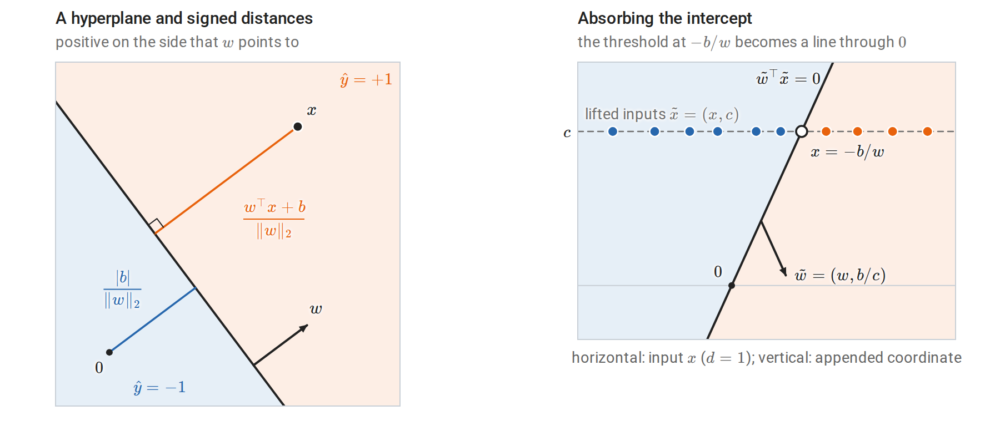
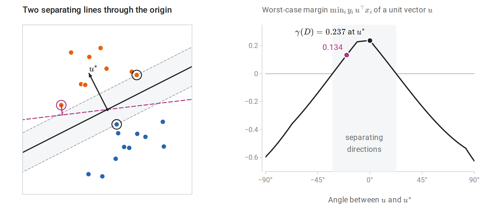
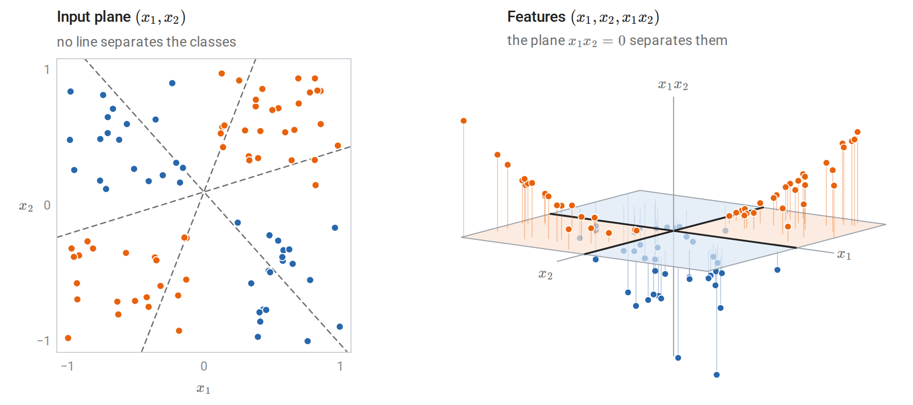
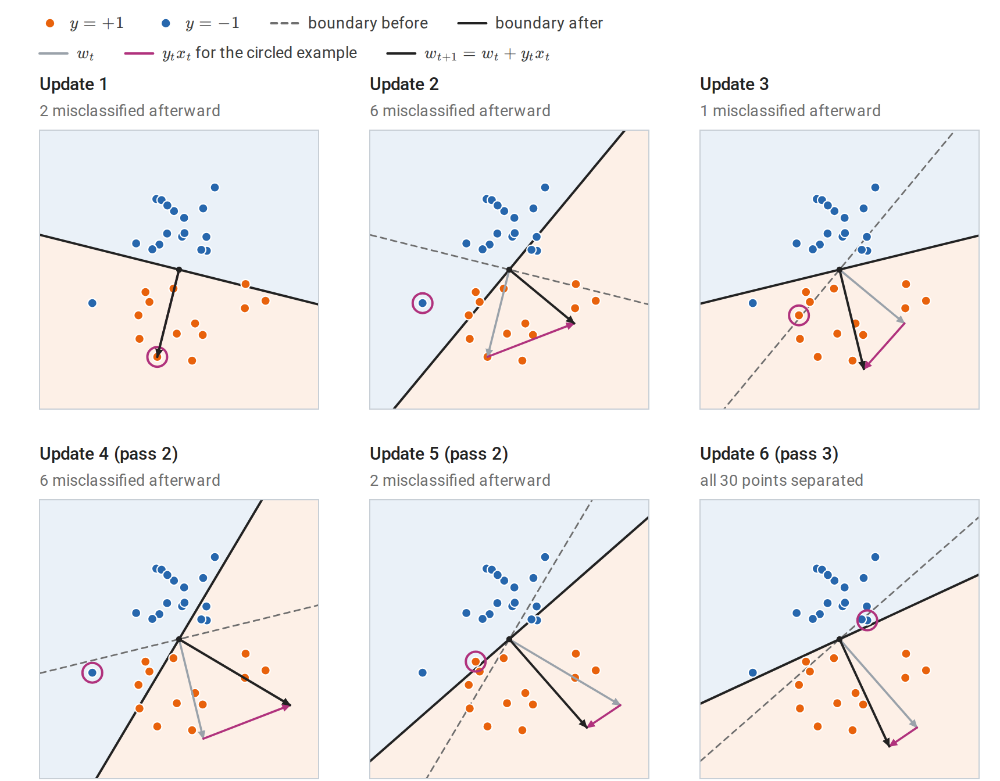
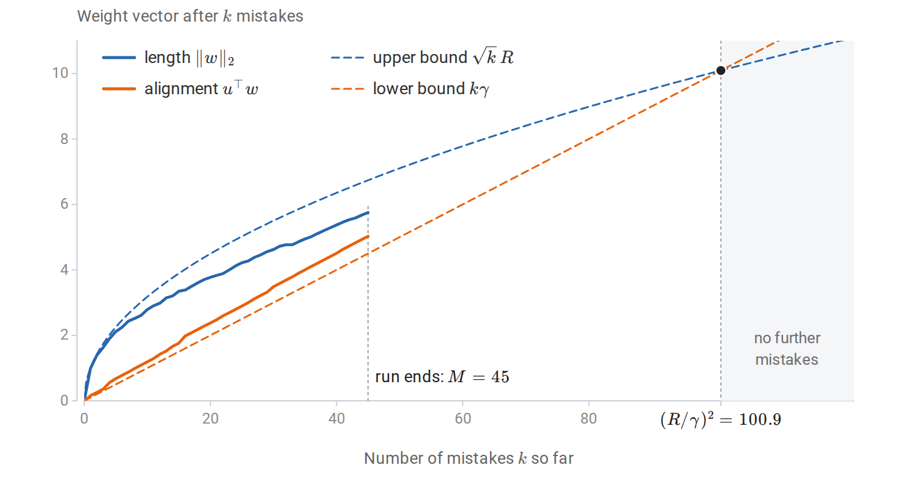
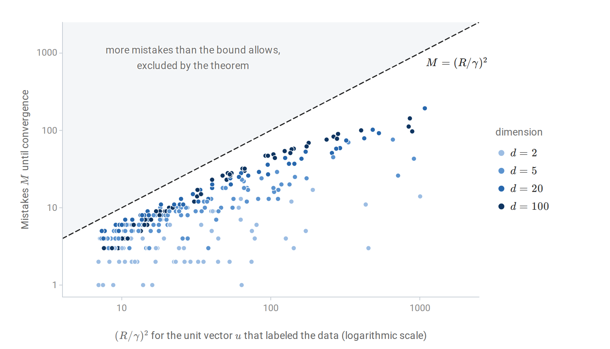
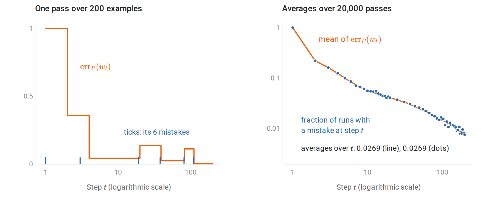
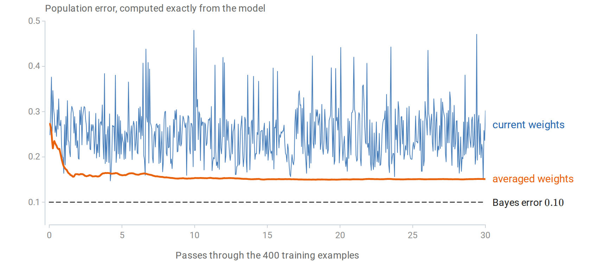
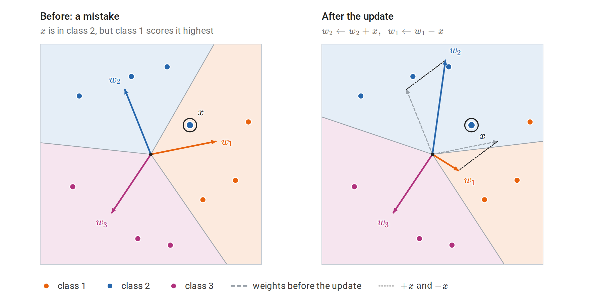

[Background Notes](../README.md) › [Machine Learning](README.md)

# 2. The Perceptron and Linear Separation

[← 1. Learning Problems and Nearest Neighbors](01-learning-problems-and-nearest-neighbors.md) · [3. Linear Regression and Regularization →](03-linear-regression-and-regularization.md)

## <a id="linear-classifiers"></a>Linear classifiers

### <a id="hyperplanes-and-signed-labels"></a>Hyperplanes and signed labels

A **linear classifier** predicts a label from the sign of an affine score. For binary classification it is convenient to encode labels as $`y\in\{-1,+1\}`$ rather than $`\{0,1\}`$; the map $`y\mapsto2y-1`$ converts the second coding into the first. With weight vector $`w\in\mathbb R^d`$ and intercept $`b\in\mathbb R`$, the classifier computes the **score** $`f(x)`$ and predicts its sign:

```math
f(x)=w^\top x+b,\qquad \hat y(x)=\operatorname{sign}\bigl(f(x)\bigr).
```

A score of exactly zero puts $`x`$ on the boundary between the two predictions. Which label such a point receives is a convention; the perceptron below treats it as a mistake.

The set $`\{x:w^\top x+b=0\}`$ is a **hyperplane**, the classifier's decision boundary. The weight vector is normal to it: if $`x`$ and $`x'`$ both lie on the hyperplane, then $`w^\top(x-x')=0`$, so $`w`$ is orthogonal to every direction within the hyperplane, and moving from a point on the boundary in the direction of $`w`$ increases the score. For $`w\ne0`$, the signed Euclidean distance from $`x`$ to the hyperplane is

```math
\frac{w^\top x+b}{\|w\|_2},
```

which follows by projecting onto the direction $`w/\|w\|_2`$; see orthogonal projections. Pick any point $`x_0`$ on the hyperplane, so that $`w^\top x_0=-b`$. The component of $`x-x_0`$ along the unit normal is $`w^\top(x-x_0)/\|w\|_2=(w^\top x+b)/\|w\|_2`$; it is positive on the side to which $`w`$ points and negative on the other. In particular, the origin is at distance $`\lvert b\rvert/\|w\|_2`$ from the boundary. The score $`f(x)`$ is therefore a distance measured in units of $`1/\|w\|_2`$. Multiplying $`(w,b)`$ by a positive constant rescales every score without changing any prediction.

With signed labels, a prediction is correct exactly when the label and the score agree in sign:

```math
y\,f(x)>0.
```

The product $`y f(x)`$ is the **functional margin** of the example. Dividing by $`\|w\|_2`$ gives the **geometric margin**, the signed distance of the example from the boundary, positive on the correct side. Unlike the functional margin, the geometric margin does not change when $`(w,b)`$ is multiplied by a positive constant. Margins recur throughout the module: they define the perceptron's update rule, the support vector machine's objective (chapter 8), and the margin theory of boosting (chapter 11).

**Absorbing the intercept.** Appending a constant coordinate $`c>0`$ to every input, $`\tilde x=(x,c)`$, and setting $`\tilde w=(w,b/c)`$ gives $`\tilde w^\top\tilde x=w^\top x+b`$. An affine classifier in $`\mathbb R^d`$ is therefore a **homogeneous** linear classifier, whose boundary passes through the origin, in $`\mathbb R^{d+1}`$. The algorithms below are stated in homogeneous form. The choice of $`c`$ does not affect which classifiers are representable, but it does affect the geometry used in mistake bounds: it changes the norms of the lifted inputs and of the lifted weight vector, a trade-off worked out in [The cost of an intercept](#the-cost-of-an-intercept).



*Left: the boundary of a classifier in the plane with its normal vector $`w`$. The orange segment is the signed distance of a point $`x`$ on the positive side; the blue segment is the distance of the origin, which lies on the negative side because $`b<0`$. Right: inputs on a line, lifted to height $`c`$. The homogeneous boundary with normal $`\tilde w`$ passes through the origin and crosses the lifted inputs exactly where the threshold rule on the line changes its prediction, so the two rules classify every input alike.*

### <a id="linear-separability-and-the-margin-of-a-dataset"></a>Linear separability and the margin of a dataset

A labeled sample $`\{(x_i,y_i)\}_{i=1}^n`$ is **linearly separable** if some $`w`$ satisfies $`y_iw^\top x_i>0`$ for every $`i`$ (in homogeneous form). For a unit vector $`u`$, the smallest of the geometric margins $`y_i\,u^\top x_i`$ is the margin of the worst-placed example: when every example is on the correct side of the hyperplane $`u^\top x=0`$, it is the distance from the hyperplane to the nearest example, and otherwise it is zero or negative. The **margin** of the sample $`D`$ is the best achievable worst case,

```math
\gamma(D)=\max_{\|u\|_2=1}\ \min_{1\le i\le n}\ y_i\,u^\top x_i.
```

The maximum exists because the worst-case margin is a continuous function of $`u`$ on the compact unit sphere. The data are separable exactly when $`\gamma(D)>0`$: a separating $`w`$, divided by its norm, has a positive margin on each of the finitely many examples. The maximizing direction, written $`u^\ast`$, is unique for separable data. Indeed, writing $`v=u/\gamma`$ for a unit vector $`u`$ with worst-case margin $`\gamma>0`$ turns the problem into minimizing $`\|v\|_2^2`$ subject to $`y_iv^\top x_i\ge1`$ for every $`i`$, a strictly convex objective over a convex set, and the solution gives $`\gamma(D)=1/\|v\|_2`$; the implementation below computes the margin this way.

The hyperplane $`u^{\ast\top}x=0`$ is the **maximum-margin separator**. The hard-margin SVM of chapter 8 computes the same kind of object, except that it keeps the intercept separate instead of absorbing it, so that the intercept does not count toward the norm. A large margin means that the two classes are far apart relative to the scale of the inputs; a small margin means that every separating hyperplane passes close to some example.



*Left: 20 separable points. The solid line is the maximum-margin separator through the origin, and the shaded band around it, of half-width $`\gamma(D)`$, contains no points; its edges pass through the two circled examples, one from each class. The dashed magenta line also separates the data, but its nearest example, joined to it by the magenta segment, is much closer. Right: the worst-case margin of each unit vector $`u`$, plotted against its angle from $`u^\ast`$. It is positive exactly on the shaded arc of separating directions, and its maximum is $`\gamma(D)`$.*

Separability is a property of a representation. The **exclusive-or** pattern, with one class in the first and third quadrants and the other in the second and fourth, is not linearly separable in $`(x_1,x_2)`$. The four points $`(\pm1,\pm1)`$ with these labels are the smallest example: each class is a diagonal of the square, and the two diagonals cross, so no line separates them. Information and Learning Theory uses such crossing groups, which Radon's theorem provides for any four points, to show that halfspaces in the plane cannot shatter four points; their VC dimension is therefore at most three. Adding the product feature $`x_1x_2`$ makes the pattern separable by the linear rule $`\operatorname{sign}(x_1x_2)`$ in the enlarged feature space.



*The same 91 points in two representations. Left: each dashed line misclassifies at least 36 of them, whichever side is assigned to which class. Right: the product feature $`x_1x_2`$ lifts the orange points above the plane $`x_1x_2=0`$ and places the blue points below it, so a linear classifier on the three features $`(x_1,x_2,x_1x_2)`$ separates them. Its boundary consists of the inputs with $`x_1x_2=0`$, the two axes drawn as thick lines, so a classifier that is linear in the features has a nonlinear boundary in the original plane. Constructing feature maps systematically, and computing with them implicitly, is the idea behind kernels.*

[Minsky and Papert's *Perceptrons* (1969)](https://direct.mit.edu/books/monograph/3132/PerceptronsAn-Introduction-to-Computational) analyzed such limitations of single-layer linear threshold units. Multilayer networks, which learn feature maps rather than fixing them, are developed in the DL module.

### <a id="why-not-minimize-the-number-of-mistakes-directly"></a>Why not minimize the number of mistakes directly?

For a fixed dataset, the training error $`\frac1n\sum_i\mathbf 1\{y_iw^\top x_i\le0\}`$ is the empirical risk $`\widehat R_n`$ of chapter 1 under the zero–one loss, with a zero score counted as an error. It is piecewise constant in $`w`$, changing only when $`w`$ crosses one of the hyperplanes $`\{w:w^\top x_i=0\}`$, so its gradient is zero almost everywhere and gradient methods receive no signal. The combinatorial problem is also hard. When the data are not separable, it is NP-hard even to find a halfspace whose number of correctly classified training examples comes within a fixed constant factor of the largest achievable number ([Ben-David, Eiron, and Long, 2003](https://www.sciencedirect.com/science/article/pii/S0022000003000382)). When the data *are* separable, a separating vector solves a system of linear inequalities and can be found in polynomial time by linear programming.

Practical linear classifiers therefore either exploit separability or replace the zero–one loss by a tractable surrogate. The perceptron does the former; logistic regression (chapter 5) and the support vector machine (chapter 8) do the latter. The perceptron is the simplest of these algorithms and has the cleanest complete analysis.

## <a id="the-perceptron-algorithm"></a>The perceptron algorithm

### <a id="rosenblatt-s-update"></a>Rosenblatt's update

The **perceptron** processes examples one at a time and changes its weights only when it makes a mistake. Write $`(x_t,y_t)`$ for the example presented at step $`t`$ and $`w_t`$ for the weight vector held before that step. Starting from $`w_1=0`$, at step $`t`$ it receives $`(x_t,y_t)`$ and applies

```math
w_{t+1}=
\begin{cases}
w_t+y_tx_t,& y_t\,w_t^\top x_t\le0,\\
w_t,&\text{otherwise.}
\end{cases}
```

A score of exactly zero counts as a mistake, so the first example always triggers an update. On a finite training set, the algorithm cycles through the data, typically in a fresh random order in each pass, until a full pass produces no mistakes. The rule was introduced by [Rosenblatt (1958)](https://doi.org/10.1037/h0042519) for a physical learning machine.

The update moves the score of the offending example in the correct direction. Because $`y_t^2=1`$,

```math
y_t\,w_{t+1}^\top x_t=y_t\,w_t^\top x_t+\|x_t\|_2^2.
```

Geometrically, adding $`y_tx_t`$ rotates the normal vector toward a misclassified positive example or away from a misclassified negative one. A single update need not fix the current example, because the gain $`\|x_t\|_2^2`$ can be smaller than the shortfall $`-y_t\,w_t^\top x_t`$, and it can break examples that were previously correct. The convergence proof shows that these setbacks cannot continue indefinitely when the data are separable.



*Every update of one perceptron run on 30 separable points, with a homogeneous boundary through the origin. In each panel the circled point is the misclassified example that triggers the update, the magenta vector $`y_tx_t`$ is added at the tip of the old weight vector, and the shading marks the side predicted $`+1`$ (orange) or $`-1`$ (blue) after the update. Updates 2 and 4 leave more points misclassified than before, update 5 leaves its own example on the wrong side, and update 6, in the third pass, separates the sample.*

### <a id="a-gradient-interpretation"></a>A gradient interpretation

The perceptron is stochastic subgradient descent, with step size one, on the **perceptron loss**

```math
\phi_{\mathrm P}(w;x,y)=\max\{0,\,-y\,w^\top x\}.
```

This loss is zero on correctly classified examples and grows linearly with the violation otherwise. Where $`y\,w^\top x<0`$ its gradient is $`-y\,x`$, and the step $`w\leftarrow w-(-yx)`$ is the perceptron update. At the kink $`y\,w^\top x=0`$ the loss has no gradient, and its subgradients are the vectors $`-\lambda\,y\,x`$ with $`0\le\lambda\le1`$; the update uses the subgradient $`-yx`$. The method is stochastic in the sense of stochastic gradient descent: each step uses the loss of a single example, although here the examples arrive in cycling order rather than as independent draws. Unlike the zero–one loss, the perceptron loss is convex and provides a direction to move.

The step size is irrelevant when the algorithm starts from zero. Running the update with $`w\leftarrow w+\eta\,y_tx_t`$ produces exactly $`\eta`$ times the weights of the unit-step run, and positive scaling does not change any sign. This scale invariance distinguishes the perceptron from most gradient methods, and it is one reason its analysis is so clean. It also shows that the perceptron loss has a degenerate minimizer: $`w=0`$ attains zero loss on every example. The algorithm avoids this trivial solution only because a zero score counts as a mistake.

### <a id="implementation"></a>Implementation

The following code runs the perceptron on the two linearly separable iris species, using petal length and width with a constant third feature for the intercept.

```python
import numpy as np
from scipy.optimize import minimize
from sklearn.datasets import load_iris

iris = load_iris()
keep = iris.target < 2                               # setosa versus versicolor
X = iris.data[keep][:, 2:]                           # petal length and width (cm)
y = np.where(iris.target[keep] == 1, 1.0, -1.0)
Xa = np.column_stack([X, np.ones(len(y))])           # constant feature absorbs the intercept

def perceptron(X, y, max_epochs=100):
    w, mistakes = np.zeros(X.shape[1]), 0
    for epoch in range(max_epochs):
        errors = 0
        for x_i, y_i in zip(X, y):
            if y_i * (w @ x_i) <= 0:                 # mistake, including a zero score
                w += y_i * x_i
                mistakes += 1
                errors += 1
        if errors == 0:
            return w, mistakes, epoch + 1
    raise RuntimeError("no separating vector found")

w, mistakes, epochs = perceptron(Xa, y)
print("weights:", w, "mistakes:", mistakes, "passes:", epochs)
print("training errors:", int(np.sum(np.sign(Xa @ w) != y)))

# The largest margin of a unit vector in the augmented space: minimize ||v||^2
# subject to y_i v^T x_i >= 1; the margin is then 1 / ||v||.
res = minimize(lambda v: v @ v, x0=w, method="SLSQP",
               constraints={"type": "ineq", "fun": lambda v: y * (Xa @ v) - 1})
gamma = 1 / np.linalg.norm(res.x)
R = np.linalg.norm(Xa, axis=1).max()
print(f"R = {R:.3f}, best margin = {gamma:.4f}, bound (R/gamma)^2 = {(R / gamma) ** 2:.0f}")
# weights: [ 0.5  0.8 -2. ] mistakes: 4 passes: 3
# training errors: 0
# R = 5.438, best margin = 0.2685, bound (R/gamma)^2 = 410
```

The algorithm makes four mistakes. The worst-case bound derived next allows 410 for this dataset. It uses the radius $`R`$ of the augmented inputs, constant feature included, and their margin $`\gamma(D)`$, which the last lines compute through the equivalent minimum-norm problem. The difference between 4 and 410 reflects both the benign order of the data, in which all setosa examples precede all versicolor examples, and the fact that the bound holds for *every* order, including adversarial ones.

## <a id="the-mistake-bound"></a>The mistake bound

### <a id="novikoff-s-theorem"></a>Novikoff's theorem

The perceptron's central guarantee concerns a sequence of examples, with no probabilistic assumptions. The sequence may be arbitrary, even chosen adversarially in response to the algorithm's predictions, as long as it is separable with a margin.

**Theorem (perceptron convergence).** Let $`(x_1,y_1),(x_2,y_2),\ldots`$ be any sequence with $`\|x_t\|_2\le R`$ and $`y_t\in\{-1,+1\}`$. Suppose some unit vector $`u`$ satisfies

```math
y_t\,u^\top x_t\ge\gamma>0\qquad\text{for every }t.
```

Then the perceptron, started from $`w_1=0`$, makes at most

```math
\boxed{M\le\Bigl(\frac R\gamma\Bigr)^2}
```

mistakes on the entire sequence.

**Proof.** Track two quantities at each mistake. First, the alignment with $`u`$ grows by at least $`\gamma`$:

```math
u^\top w_{t+1}=u^\top w_t+y_t\,u^\top x_t\ge u^\top w_t+\gamma.
```

After $`M`$ mistakes, $`u^\top w\ge M\gamma`$. Second, the squared norm grows by at most $`R^2`$:

```math
\|w_{t+1}\|_2^2=\|w_t\|_2^2+2y_t\,w_t^\top x_t+\|x_t\|_2^2\le\|w_t\|_2^2+R^2,
```

because a mistake means $`y_t\,w_t^\top x_t\le0`$. After $`M`$ mistakes, $`\|w\|_2^2\le MR^2`$. Rounds without mistakes change neither quantity. The Cauchy–Schwarz inequality $`u^\top w\le\|u\|_2\|w\|_2`$ and $`\|u\|_2=1`$ give

```math
M\gamma\le u^\top w\le\|w\|_2\le\sqrt M\,R,
```

so $`\sqrt M\le R/\gamma`$. $`\square`$

The proof is a potential argument: the weight vector's projection onto $`u`$ grows linearly in the number of mistakes, while its length grows only like a square root. Since the projection can never exceed the length, the two can coexist for only finitely many mistakes. The figure follows both quantities through one run. The original proof is due to Novikoff (1962); the CMU [perceptron notes](https://www.cs.cmu.edu/~ninamf/courses/601sp15/slides/perceptron-notes.pdf) develop it alongside its online-learning interpretation.



*The two quantities of the proof after the $`k`$th mistake of one perceptron run, on 200 separable points in 100 dimensions whose labels come from a unit vector $`u`$ with margin $`\gamma=0.1`$. The alignment stays above $`k\gamma`$ and the length below $`\sqrt k\,R`$. The two bounds cross where $`k\gamma=\sqrt k\,R`$; beyond that point the alignment would exceed the length, which Cauchy–Schwarz forbids. This run ends less than halfway there.*

Several features deserve emphasis.

- **The bound is dimension-free.** Neither $`d`$ nor the number of distinct examples appears. What matters is the ratio of the data's radius to the margin, a scale-invariant measure of how hard the separation problem is. Bounds based on the VC dimension of halfspaces, which is $`d+1`$ in $`\mathbb R^d`$ (Information and Learning Theory), grow with the dimension instead.
- **On a finite separable training set, the perceptron terminates.** Cycling through $`n`$ examples, each pass either makes a mistake or ends the algorithm, so there are at most $`(R/\gamma)^2`$ passes with mistakes. The final weight vector separates the training data.
- **Any separating $`u`$ may be used.** The tightest bound uses the maximum-margin direction, for which $`\gamma=\gamma(D)`$.
- **The bound can be exponentially large.** When the margin is tiny, for example because the inputs have many bits of precision, $`(R/\gamma)^2`$ can be exponential in the input size. Linear programming finds a separator in polynomial time in such cases; the perceptron's efficiency depends on a reasonable margin.

The simulation below compares the bound with the mistakes actually made. The inequalities of the proof are nearly equalities when the misclassified examples have norm close to $`R`$ and margin close to $`\gamma`$ along $`u`$, and when they are nearly orthogonal to the current weights, so that the cross term $`2y_t\,w_t^\top x_t`$ is close to zero. Random examples in high dimension tend to have all three properties, so there the counts come closer to the bound.



*Mistakes made by the perceptron, trained to convergence on 300 random separable datasets of 200 points in dimensions 2 to 100, against $`(R/\gamma)^2`$ for the unit vector $`u`$ used to generate the labels. No run enters the shaded region, and the largest ratio of mistakes to bound is 0.68. The median ratio is 0.12 in two dimensions, 0.35 in five, and 0.49 and 0.43 in 20 and 100 dimensions.*

### <a id="the-bound-cannot-be-improved-in-general"></a>The bound cannot be improved in general

Let $`e_1,\ldots,e_m`$ be orthonormal vectors in $`\mathbb R^d`$ with $`d\ge m`$, and present them in order. For **any** labels $`y_1,\ldots,y_m`$, the unit vector $`u=m^{-1/2}\sum_iy_ie_i`$ satisfies $`y_iu^\top e_i=m^{-1/2}`$. Hence $`R=1`$, $`\gamma=m^{-1/2}`$, and $`(R/\gamma)^2=m`$. An adversary who chooses each label after seeing a deterministic learner's prediction can make that learner wrong on every example, and the sequence remains separable with this margin. Every deterministic online algorithm, not only the perceptron, can therefore be forced to make $`(R/\gamma)^2`$ mistakes. The perceptron needs no adversary: $`w_t`$ is a combination of $`e_1,\ldots,e_{t-1}`$, so its score on $`e_t`$ is exactly zero, which counts as a mistake, and it errs on all $`m`$ examples whatever the labels.

### <a id="the-cost-of-an-intercept"></a>The cost of an intercept

The theorem was stated for homogeneous separators. Suppose instead that $`\|x_t\|_2\le R`$ and some unit $`u`$ and intercept $`b`$ satisfy $`y_t(u^\top x_t+b)\ge\gamma`$. Append the constant $`c`$ to each input. The augmented inputs have norm at most $`\sqrt{R^2+c^2}`$, and the augmented separator $`(u,b/c)`$ has norm $`\sqrt{1+b^2/c^2}`$, so after normalization its margin is $`\gamma/\sqrt{1+b^2/c^2}`$. The theorem gives

```math
M\le\frac{(R^2+c^2)(1+b^2/c^2)}{\gamma^2}.
```

The numerator equals $`R^2+b^2+c^2+R^2b^2/c^2`$, which is minimized at $`c^2=R\lvert b\rvert`$ with value $`(R+\lvert b\rvert)^2`$. With a well-chosen constant, an intercept therefore costs no more than replacing $`R`$ by $`R+\lvert b\rvert`$. The intercept cannot be large when both labels occur: a positive example $`x_+`$ gives $`b\ge\gamma-u^\top x_+\ge\gamma-R`$, and a negative example $`x_-`$ gives $`b\le-\gamma-u^\top x_-\le R-\gamma`$. Hence $`\lvert b\rvert\le R-\gamma<R`$, so the separating hyperplane passes through the ball containing the data, and the bound is at most $`4(R/\gamma)^2`$. In practice one can also center the inputs before training, which usually makes the intercept small.

## <a id="from-mistakes-to-generalization"></a>From mistakes to generalization

### <a id="a-mistake-bound-is-not-a-generalization-bound"></a>A mistake bound is not a generalization bound

Novikoff's theorem counts mistakes on a sequence. It does not mention a probability distribution, and on its own it says nothing about the error of the final weight vector on new examples. The final vector separates the training data, but so do many other hyperplanes, some of which generalize poorly. An additional argument connects the two settings.

### <a id="online-to-batch-conversion"></a>Online-to-batch conversion

Let $`(x_1,y_1),\ldots,(x_{n+1},y_{n+1})`$ be iid from $`P`$, and run the perceptron once through them in order. Let $`w_t`$ be the weight vector *before* example $`t`$, so $`w_t`$ depends only on the first $`t-1`$ examples. Then example $`t`$ is a fresh draw for $`w_t`$: conditionally on the first $`t-1`$ examples, $`w_t`$ is fixed and $`(x_t,y_t)`$ still has law $`P`$, so the conditional probability of a mistake at step $`t`$ is the population error of $`w_t`$. Taking expectations,

```math
\mathbb E\bigl[\operatorname{err}_P(w_t)\bigr]=P\bigl(y_t\,w_t^\top x_t\le0\bigr),
```

where $`\operatorname{err}_P(w)=P(Y\,w^\top X\le0)`$ is the zero–one population risk of chapter 1, written $`R(f)`$ there, for the classifier $`\operatorname{sign}(w^\top x)`$, again counting a zero score as an error; in this chapter the letter $`R`$ is reserved for the radius of the data. Choose $`T`$ uniformly from $`\{1,\ldots,n+1\}`$, independently of the data, and output $`w_T`$. Averaging over $`T`$,

```math
\mathbb E\bigl[\operatorname{err}_P(w_T)\bigr]=\frac{\mathbb E[M_{n+1}]}{n+1},
```

where $`M_{n+1}`$ is the number of mistakes in the single pass. If $`P`$ is supported on a ball of radius $`R`$ and is separable with margin $`\gamma`$, then $`M_{n+1}\le(R/\gamma)^2`$ always, and the randomly selected hypothesis has expected error at most $`(R/\gamma)^2/(n+1)`$. This is the online-to-batch conversion of Foundations, specialized to the zero–one loss. Foundations averages the iterates, which requires a loss that is convex in $`w`$; the zero–one loss is not convex, so the conversion here returns a randomly selected iterate instead, the alternative that the Foundations passage names for nonconvex problems.

The figure checks both identities by simulation, on a distribution for which the population error of every weight vector is known exactly. There, a pass over 200 examples makes 5.4 mistakes on average, so the randomly selected iterate has expected error about 0.027. The bound $`(R/\gamma)^2/(n+1)`$ allows 0.5.



*Single passes of the perceptron over 200 examples drawn from the unit circle and labeled by $`u=(1,0)`$, with the examples within 0.1 of the boundary removed, so that $`R=1`$ and $`\gamma=0.1`$. Left: in one pass, the population error of the current weights falls after the first two mistakes but rises after the third and the fifth. Right: over many passes, the mean population error of $`w_t`$ and the frequency of a mistake at step $`t`$ agree at every step, as the first identity states, and so do their averages over $`t`$, as the second states.*

The randomly selected hypothesis is awkward in practice. The **voted perceptron** of [Freund and Schapire (1999)](https://link.springer.com/article/10.1023/A:1007662407062) keeps every intermediate $`w_t`$ with a weight equal to the number of examples it survived and predicts by a weighted majority vote; they prove a generalization bound of the same order. The **averaged perceptron** replaces the vote by the average weight vector $`\bar w=\sum_tc_tw_t/\sum_tc_t`$, where $`c_t`$ is the survival count of $`w_t`$. The average is a single linear classifier and behaves similarly in practice.

### <a id="other-routes-to-generalization"></a>Other routes to generalization

The final perceptron weight vector is determined by the examples on which mistakes occurred and the order in which they occurred: rerunning the algorithm on those examples alone reproduces it, because between two mistakes the weights do not change. This makes the perceptron a **sample compression scheme** of size at most $`(R/\gamma)^2`$, and compression schemes admit generalization bounds that grow with their size. The idea is due to Littlestone and Warmuth (1986); [Floyd and Warmuth (1995)](https://tr.soe.ucsc.edu/sites/default/files/technical-reports/UCSC-CRL-93-13.pdf) develop it.

Margin-based uniform bounds for all linear classifiers of bounded norm, developed in Rademacher complexity and margins, give another route. For weights of norm at most one, inputs of norm at most $`R`$, and a margin level $`\gamma`$ fixed before seeing the data, the complexity term of that bound is $`2R/(\gamma\sqrt n)`$, which becomes small once $`n`$ is large compared with $`(R/\gamma)^2`$. The same ratio limits how many points unit-norm linear functions can shatter with margin $`\gamma`$ (chapter 7). All of these results show the same pattern: the quantity controlling generalization is $`(R/\gamma)^2`$, not the dimension $`d`$.

## <a id="when-the-data-are-not-separable"></a>When the data are not separable

### <a id="behavior-without-a-separator"></a>Behavior without a separator

If no separating hyperplane exists, the perceptron makes mistakes in every pass and never terminates. Its weights do not diverge: the **perceptron cycling theorem**, due to Minsky and Papert and proved in general by Block and Levin (1970), shows that the weight vectors remain bounded. But the final weight vector depends strongly on the most recent few mistakes, so the classifier it defines fluctuates from one update to the next.

### <a id="a-mistake-bound-for-nonseparable-sequences"></a>A mistake bound for nonseparable sequences

Mistakes can still be bounded relative to any comparison vector, with a penalty for its margin violations. For a unit vector $`u`$ and a target margin $`\gamma>0`$, define the **hinge deviations**

```math
d_t=\max\{0,\ \gamma-y_t\,u^\top x_t\},\qquad D=\Bigl(\sum_td_t^2\Bigr)^{1/2}.
```

The deviation $`d_t`$ is zero for examples classified with margin at least $`\gamma`$, and it measures the shortfall otherwise; $`D`$ is the Euclidean norm of the vector of deviations. The letter follows Freund and Schapire; this $`D`$ has nothing to do with the sample $`D`$ in $`\gamma(D)`$.

**Theorem (Freund and Schapire, 1999).** In a single pass through a sequence with $`\|x_t\|_2\le R`$, the perceptron makes at most

```math
M\le\Bigl(\frac{R+D}\gamma\Bigr)^2
```

mistakes, for every unit $`u`$ and every $`\gamma>0`$.

The proof reduces to the separable case by giving each position in the sequence its own extra coordinate, which lets the comparison vector correct its margin violations; it appears in [Appendix A](#block-perceptron-appendix-a). When $`D=0`$ the bound is Novikoff's, and it remains useful when only a few examples violate the margin. It also motivates the hinge loss $`\max\{0,1-y\,w^\top x\}`$ minimized by support vector machines: $`d_t`$ is $`\gamma`$ times the hinge loss of the rescaled vector $`u/\gamma`$ on example $`t`$.

### <a id="averaging-stabilizes-the-classifier"></a>Averaging stabilizes the classifier

Averaging the weight vectors over all steps suppresses the fluctuations of the last iterate. The figure shows this on ten-dimensional data in which 10% of the training labels have been flipped at random. The inputs are Gaussian and the labels come from a known unit vector $`u`$, so the population error of any weight vector can be computed exactly instead of estimated on a test sample.



*Population error of the current perceptron weights and of the running average of all weight vectors, recorded after every 20 training examples. The current weights jump between good and poor classifiers as noisy examples trigger updates, and over the last 15 passes their error ranges from 0.15 to 0.47. The error of the average settles at 0.15. No classifier can beat the Bayes error of the dashed line, because the flipped labels are unpredictable; the linear rule $`\operatorname{sign}(u^\top x)`$ attains it.*

A related idea, the **pocket algorithm**, keeps the weight vector with the longest run of correct classifications seen so far. Averaging is simpler and has the online-to-batch justification above.

## <a id="multiclass-perceptron"></a>Multiclass perceptron

With $`K`$ classes, keep one weight vector per class and predict the class with the largest score,

```math
\hat y(x)=\operatorname*{arg\,max}_{c\in\{1,\ldots,K\}}\ w_c^\top x.
```

On a mistake, with true class $`y`$ and predicted class $`\hat y\ne y`$, the multiclass perceptron updates

```math
w_y\leftarrow w_y+x,\qquad w_{\hat y}\leftarrow w_{\hat y}-x.
```

The update raises the correct class's score on $`x`$ by $`\|x\|_2^2`$ and lowers the offending class's score on $`x`$ by the same amount, leaving the other scores unchanged. Like a binary update, it can move other examples to the wrong side.



*One multiclass update with three classes in the plane and no intercept, so that each class is predicted on a sector at the origin. Left: the circled example belongs to class 2 but lies in the sector of class 1. Right: after the update the sector of class 2 contains it, while the sector of class 1 has turned away; a class-1 point that was correct before is now misclassified.*

Stacking the $`K`$ weight vectors into one vector $`\mathbf w=(w_1,\ldots,w_K)\in\mathbb R^{Kd}`$ and representing the example by the vector $`\psi\in\mathbb R^{Kd}`$ with $`x`$ in block $`y`$, $`-x`$ in block $`\hat y`$, and zeros elsewhere turns this into the binary perceptron update $`\mathbf w\leftarrow\mathbf w+\psi`$, made when $`\mathbf w^\top\psi=w_y^\top x-w_{\hat y}^\top x\le0`$. The mistake bound therefore carries over, with $`R`$ replaced by $`\sqrt2R`$ because $`\|\psi\|_2=\sqrt2\|x\|_2`$, and with the margin defined by the smallest gap between the correct score and any competing score for a stacked comparison vector of unit norm. The multiclass perceptron thus makes at most $`2(R/\gamma)^2`$ mistakes on a sequence separable with such a margin.

The following code trains the multiclass perceptron on all three iris species, with standardized features and a constant feature, and keeps a running sum of the weight matrices for averaging. `np.argmax` breaks ties in favor of the smallest class index, so at the start, when every score is zero, an example of class 0 counts as correct.

```python
import numpy as np
from sklearn.datasets import load_iris
from sklearn.model_selection import train_test_split

X, y = load_iris(return_X_y=True)
X_train, X_test, y_train, y_test = train_test_split(
    X, y, test_size=0.4, stratify=y, random_state=1)
mean, scale = X_train.mean(axis=0), X_train.std(axis=0)
augment = lambda A: np.column_stack([(A - mean) / scale, np.ones(len(A))])
A_train, A_test = augment(X_train), augment(X_test)

K = 3
W = np.zeros((K, A_train.shape[1]))                  # one weight vector per class
W_sum = np.zeros_like(W)                             # running sum for averaging
rng = np.random.default_rng(0)
for epoch in range(20):
    for i in rng.permutation(len(y_train)):
        guess = np.argmax(W @ A_train[i])
        if guess != y_train[i]:
            W[y_train[i]] += A_train[i]              # raise the correct score
            W[guess] -= A_train[i]                   # lower the offending score
        W_sum += W

for name, M in [("last", W), ("averaged", W_sum)]:
    acc_train = np.mean(np.argmax(A_train @ M.T, axis=1) == y_train)
    acc_test = np.mean(np.argmax(A_test @ M.T, axis=1) == y_test)
    print(f"{name:>8} weights: training accuracy {acc_train:.3f}, test accuracy {acc_test:.3f}")
#     last weights: training accuracy 0.900, test accuracy 0.933
# averaged weights: training accuracy 0.956, test accuracy 1.000
```

Versicolor and virginica are not linearly separable in these four features, so the last iterate keeps changing. The averaged weights are more stable. With 60 test flowers, a perfect test score is compatible with a true error of a few percent: after no errors in 60 independent trials, the one-sided 95% Clopper–Pearson upper bound for the error rate is $`1-0.05^{1/60}\approx0.049`$ (Probability and Statistics). The small sample limits what this comparison establishes.

## <a id="the-perceptron-among-linear-classifiers"></a>The perceptron among linear classifiers

The perceptron stores its weight vector as a sum of training inputs:

```math
w=\sum_{i=1}^n\alpha_i\,y_i\,x_i,
```

where $`\alpha_i`$ counts the mistakes made on example $`i`$. Scores are therefore inner products with training examples, $`w^\top x=\sum_i\alpha_iy_i\,x_i^\top x`$. Replacing each inner product by a kernel evaluation gives the **kernel perceptron**, a nonlinear classifier trained by the same mistake-driven rule; this **dual representation** is developed in chapter 8.

The linear classifiers of this module differ mainly in the loss they minimize over the margin $`z=y\,w^\top x`$:

| Method | Loss as a function of $`z=y\,w^\top x`$ | Behavior |
| --- | --- | --- |
| Zero–one loss | $`\mathbf 1\{z\le0\}`$ | The target quantity; intractable to minimize in general |
| Perceptron | $`\max\{0,-z\}`$ | Convex; indifferent among all separators |
| Hinge (SVM) | $`\max\{0,1-z\}`$ | Convex; demands a margin; with the SVM's norm penalty, yields the maximum-margin separator of separable data in the hard-margin limit |
| Logistic | $`\log(1+e^{-z})`$ | Convex and smooth; yields class probabilities |
| Squared error on $`\pm1`$ labels | $`(1-z)^2`$ | Convex; penalizes confident correct predictions too |

The last row is the least-squares classifier of chapter 1, which fits the $`0/1`$ labels by linear regression and thresholds the fit at $`1/2`$. With an intercept in the model, fitting the recoded labels $`2y-1\in\{-1,+1\}`$ instead gives exactly $`2\hat f-1`$, where $`\hat f`$ is the fit to the $`0/1`$ labels, and thresholding it at zero is the same classifier. The identity $`(y-f)^2=(1-yf)^2`$ for $`y=\pm1`$ shows that this fit penalizes large correct margins. The consequences of these choices for classification accuracy are examined in chapter 6.

## <a id="appendices"></a>Appendices


<details>
<summary><a id="block-perceptron-appendix-a"></a><b>A. Proof of the nonseparable mistake bound</b></summary>

Fix a unit vector $`u\in\mathbb R^d`$, a margin $`\gamma>0`$, and a sequence $`(x_1,y_1),\ldots,(x_T,y_T)`$ with $`\|x_t\|_2\le R`$. Define $`d_t=\max\{0,\gamma-y_tu^\top x_t\}`$ and $`D=(\sum_td_t^2)^{1/2}`$. If $`D=0`$ the sequence is separable with margin $`\gamma`$ and Novikoff's theorem applies, so assume $`D>0`$.

**Augment the sequence.** For $`\Delta>0`$, embed each input into $`\mathbb R^{d+T}`$ by giving position $`t`$ its own coordinate:

```math
\tilde x_t=(x_t,\ \Delta e_t),\qquad \|\tilde x_t\|_2^2\le R^2+\Delta^2,
```

where $`e_t`$ is the $`t`$th standard basis vector of $`\mathbb R^T`$. Define the comparison vector

```math
\tilde u=\frac1Z\Bigl(u,\ \frac1\Delta\sum_{t=1}^Ty_td_t\,e_t\Bigr),\qquad Z=\sqrt{1+D^2/\Delta^2},
```

so that $`\|\tilde u\|_2=1`$. For every $`t`$,

```math
y_t\,\tilde u^\top\tilde x_t=\frac1Z\bigl(y_tu^\top x_t+d_t\bigr)\ge\frac\gamma Z,
```

because $`y_t^2=1`$ and $`d_t\ge\gamma-y_tu^\top x_t`$. The augmented sequence is separable with margin $`\gamma/Z`$.

**The augmented perceptron makes the same predictions.** At step $`t`$, the augmented weight vector has extra coordinates $`\Delta\sum_{s\in S_t}y_se_s`$, where $`S_t`$ is the set of earlier positions with mistakes. Its score on $`\tilde x_t`$ is $`w_t^\top x_t+\Delta^2\sum_{s\in S_t}y_s\,e_s^\top e_t=w_t^\top x_t`$, because $`s<t`$. Hence, by induction over the steps, the two runs make identical predictions, identical updates to the first $`d`$ coordinates, and the same number of mistakes. This is where the single pass matters: if a position were revisited, its own extra coordinate would contribute to its score.

**Apply the separable bound and optimize.** Novikoff's theorem, with radius $`\sqrt{R^2+\Delta^2}`$ and margin $`\gamma/Z`$, gives

```math
M\le\frac{(R^2+\Delta^2)(1+D^2/\Delta^2)}{\gamma^2}
=\frac{R^2+D^2+\Delta^2+R^2D^2/\Delta^2}{\gamma^2}.
```

Choosing $`\Delta^2=RD`$ minimizes the right side and yields $`M\le(R+D)^2/\gamma^2`$. $`\square`$

The same algebra appeared in the intercept calculation: in both cases an extra coordinate lets a comparison vector fix a deficiency at a cost that the choice of scale balances. The multiclass bound follows similarly after the stacking construction. Repeated passes over a finite nonseparable dataset are covered by treating the concatenated passes as one long sequence, with every repeated position counted in $`D`$.

</details>

---

[← 1. Learning Problems and Nearest Neighbors](01-learning-problems-and-nearest-neighbors.md) · [3. Linear Regression and Regularization →](03-linear-regression-and-regularization.md)
