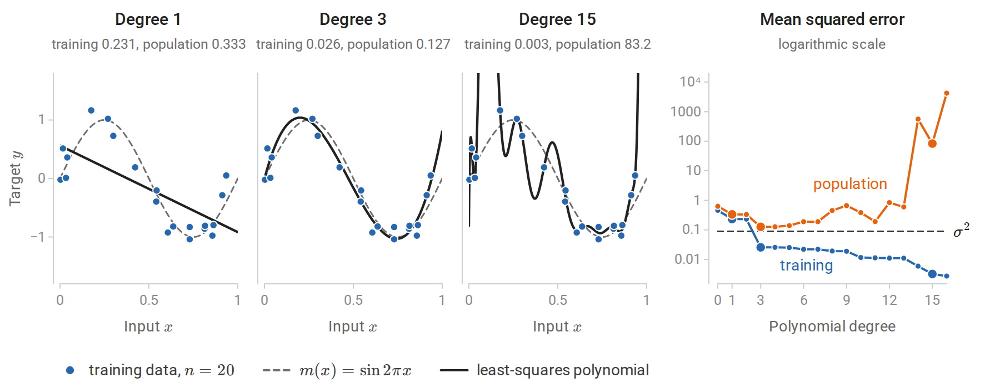
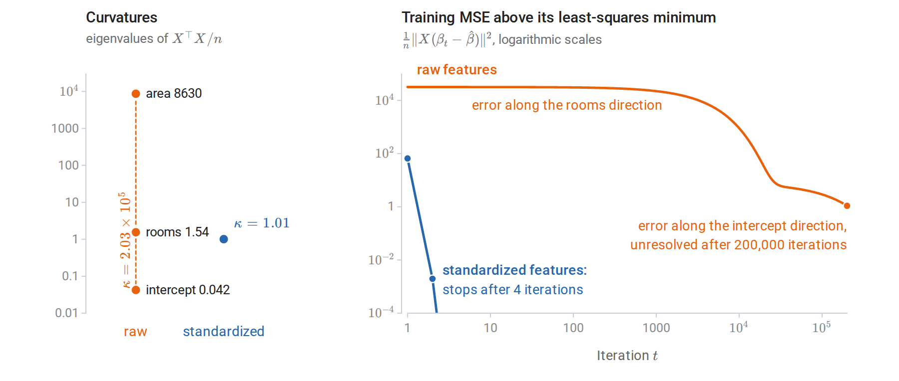
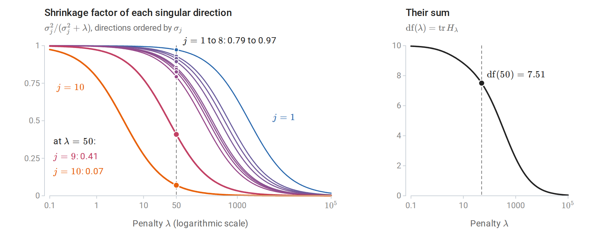
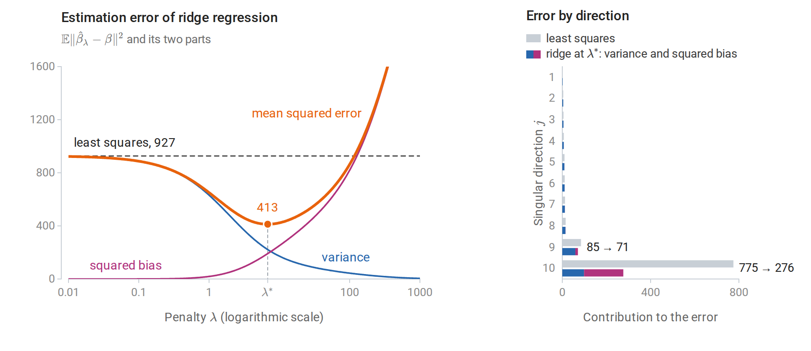
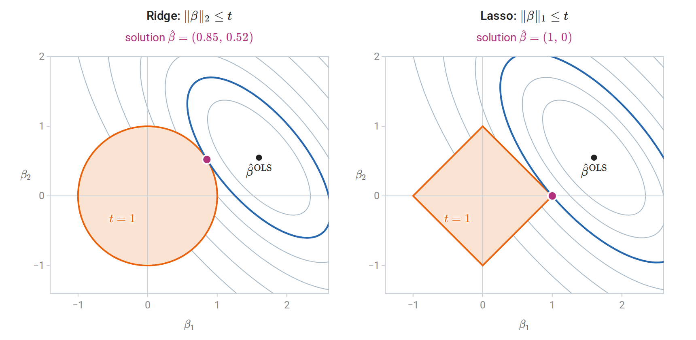
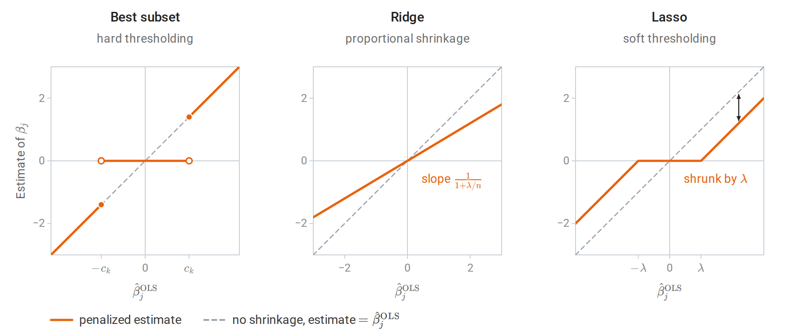
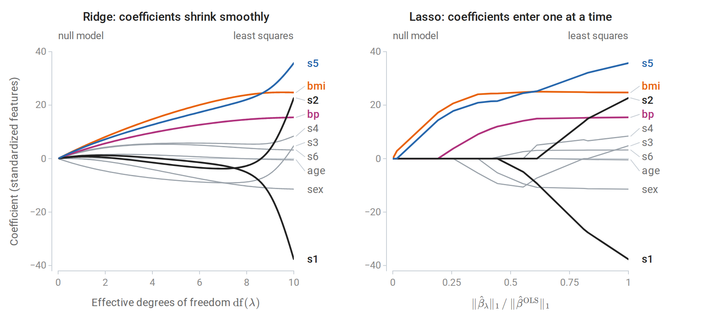
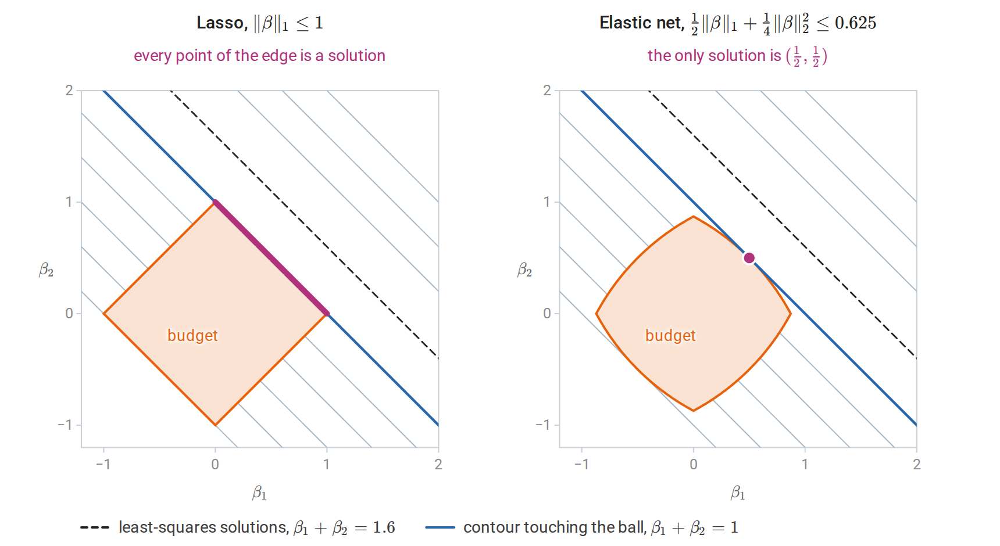

[ML Mastery Notes](../README.md) › [Machine Learning](README.md)

# 3. Linear Regression and Regularization

[← 2. The Perceptron and Linear Separation](02-the-perceptron-and-linear-separation.md) · [4. Generative Classifiers →](04-generative-classifiers.md)

## <a id="linear-regression-as-a-learning-method"></a>Linear regression as a learning method

### <a id="model-loss-and-likelihood"></a>Model, loss, and likelihood

**Linear regression** predicts a numerical target by an affine function of the features,

$$
f_\beta(x)=\beta_0+\sum_{j=1}^d\beta_jx_j=\beta_0+x^\top\beta.
$$

Here $`x\in\mathbb R^d`$ is the feature vector, $`\beta_0`$ is the **intercept**, and $`\beta=(\beta_1,\ldots,\beta_d)^\top`$ holds one slope per feature. Fitting by **least squares** minimizes the empirical squared-error risk

$$
\widehat R_n(\beta_0,\beta)=\frac1n\sum_{i=1}^n\bigl(y_i-\beta_0-x_i^\top\beta\bigr)^2.
$$

This is the empirical risk $`\widehat R_n(f)`$ of chapter 1 for the squared loss, written as a function of the coefficients. Under that loss the best possible predictor is the regression function $`m(x)=\mathbb E[Y\mid X=x]`$, so a linear model approximates $`m`$ by an affine function.

Absorb a column of ones into the design matrix $`X\in\mathbb R^{n\times(d+1)}`$, whose $`i`$th row is $`(1,x_i^\top)`$, and let $`\hat\beta\in\mathbb R^{d+1}`$ denote the full coefficient vector, intercept included. The minimizer then solves the normal equations $`X^\top X\hat\beta=X^\top y`$, which state that the residual vector $`y-X\hat\beta`$ is orthogonal to every column of $`X`$; when $`X`$ has full column rank, their unique solution is $`\hat\beta=(X^\top X)^{-1}X^\top y`$. The geometry of this problem, its stable numerical solution by QR or SVD, the Gauss–Markov theorem, and exact inference for coefficients under Gaussian errors are developed in Foundations: see orthogonal projections and least squares and regression as statistical inference. This chapter treats linear regression as a *prediction* method: how its flexibility is controlled, how it is fitted at scale, and how regularization trades bias for variance.

Least squares is also maximum likelihood under a Gaussian noise model. If

$$
y_i=\beta_0+x_i^\top\beta+\varepsilon_i,\qquad \varepsilon_i\stackrel{\mathrm{iid}}{\sim}\mathcal N(0,\sigma^2),
$$

the negative log-likelihood is

$$
-\log L(\beta_0,\beta,\sigma^2)=\frac n2\log(2\pi\sigma^2)+\frac1{2\sigma^2}\sum_{i=1}^n\bigl(y_i-\beta_0-x_i^\top\beta\bigr)^2.
$$

For any fixed $`\sigma^2`$, maximizing over the coefficients is minimizing the residual sum of squares $`\mathrm{RSS}=\sum_i(y_i-\beta_0-x_i^\top\beta)^2`$, so the least-squares coefficients are the MLE in the sense of Probability and Statistics. Setting the derivative with respect to $`\sigma^2`$ to zero then gives the MLE of the noise variance, $`\hat\sigma^2=\mathrm{RSS}/n`$, which differs from the unbiased $`\mathrm{RSS}/(n-d-1)`$ of least-squares inference: the fit uses $`d+1`$ of the $`n`$ dimensions of the response, and the residuals live in the remaining $`n-d-1`$. The prediction rule does not depend on normality: whenever second moments exist, least squares estimates the best linear approximation to the regression function, the affine function closest to $`m`$ in mean square (best linear approximation). Normality matters for exact finite-sample inference and for interpreting the fit as a full conditional distribution $`p(y\mid x)`$.

### <a id="linear-in-the-parameters-not-in-the-inputs"></a>Linear in the parameters, not in the inputs

"Linear" refers to the parameters. Any fixed transformation of the inputs may be used as features:

- **Polynomials and interactions**: $`x_1,x_1^2,x_1x_2,\ldots`$
- **Indicators for categories**: a categorical input with $`L`$ levels becomes $`L-1`$ binary columns when an intercept is present. Using all $`L`$ indicators together with an intercept makes $`X`$ rank deficient, because the indicators sum to the intercept column, and the coefficients are then not identifiable.
- **Nonlinear transforms**: $`\log x_j`$, thresholds $`\max\{0,x_j-c\}`$, periodic terms $`\sin(2\pi x_j/T)`$.

A **basis expansion** replaces the input by the values of $`p`$ fixed functions, $`x\mapsto(h_1(x),\ldots,h_p(x))`$; linear regression on these new features fits a function in the span of the basis functions. Splines, a particularly effective choice, are developed in chapter 17; kernel methods, which use infinitely many implicit basis functions, in chapter 8. Every such expansion reuses the same least-squares machinery, and every one raises the same question: how many basis functions can the data support?

### <a id="model-size-training-error-and-test-error"></a>Model size, training error, and test error

The following experiment fits polynomials of increasing degree to 20 noisy observations of $`\sin(2\pi x)`$. The inputs are uniform on $`[0,1]`$ and the targets are $`y=m(x)+\varepsilon`$ with $`m(x)=\sin(2\pi x)`$ and noise standard deviation $`0.3`$. Because the model is known, the error of each fit on new data can be computed exactly instead of being estimated from a test sample.



*Least-squares polynomials of degree 1, 3, and 15 fitted to the same 20 observations, and, on the right, the training and population mean squared errors of every degree from 0 to 16, with larger dots for the three fits on the left. The population error is the expected squared error on a fresh observation, $`\sigma^2`$ plus the average of $`(\hat f-m)^2`$ over the uniform input law, computed by numerical integration. The polynomials use Legendre polynomials in $`2x-1`$, which give the same fitted functions as monomials but better-conditioned least-squares problems.*

A straight line underfits: its error, even on the training data, is dominated by approximation error. The cubic follows the sine curve closely. The degree-15 polynomial has 16 coefficients for 20 observations; it passes near every training point and oscillates wildly between them. Training error decreases with every added coefficient, because the models are nested: a larger polynomial class contains the smaller ones, so its least-squares fit cannot be worse on the training data. Test error, measured here by the population error, falls, bottoms out, and then rises sharply. It is smallest for the cubic, $`0.127`$, only about $`0.04`$ above the noise variance $`\sigma^2=0.09`$ that no predictor can beat, against $`0.333`$ for the line. For higher degrees it grows, erratically at first and explosively once the number of coefficients approaches the number of observations. For degree 15 it is $`83`$, and almost all of that, $`81`$, comes from the short stretch beyond the largest training input, $`0.935`$, where nothing constrains the polynomial.

The size of the gap can be computed exactly for least squares with a fixed design, that is, with the inputs treated as fixed and only the noise random. Let $`X`$ be a design with $`p`$ linearly independent columns and $`H=X(X^\top X)^{-1}X^\top`$ its **hat matrix**, which maps responses to fitted values, $`\hat y=Hy`$. Let $`y=\mu+\varepsilon`$, where $`\mu=(m(x_1),\ldots,m(x_n))^\top`$ collects the regression function at the inputs and $`\operatorname{Cov}(\varepsilon)=\sigma^2I`$. The hat matrix is the orthogonal projection onto the column space of $`X`$ (projection geometry). Since $`\operatorname{tr}H=p`$ and $`I-H`$ projects onto an $`(n-p)`$-dimensional space, writing $`y-Hy=(I-H)\mu+(I-H)\varepsilon`$ and using $`\mathbb E[\varepsilon^\top A\varepsilon]=\sigma^2\operatorname{tr}A`$ gives

$$
\mathbb E\Bigl[\tfrac1n\|y-Hy\|^2\Bigr]=\frac{\|(I-H)\mu\|^2}n+\sigma^2\Bigl(1-\frac pn\Bigr),
$$

while a fresh response vector $`y'=\mu+\varepsilon'`$ at the **same inputs**, with noise $`\varepsilon'`$ independent of $`\varepsilon`$, satisfies $`y'-Hy=(I-H)\mu+\varepsilon'-H\varepsilon`$ and gives

$$
\mathbb E\Bigl[\tfrac1n\|y'-Hy\|^2\Bigr]=\frac{\|(I-H)\mu\|^2}n+\sigma^2\Bigl(1+\frac pn\Bigr).
$$

The first term is squared bias, identical in both. The noise contributions differ by $`2\sigma^2p/n`$: the training error is optimistic by an amount proportional to the number of fitted coefficients. This is the quantity estimated by Mallows' $`C_p`$ and related criteria in chapter 6, which also extends the calculation to any fitting method.

```python
import numpy as np

rng = np.random.default_rng(1)
n, d, sigma, reps = 50, 10, 1.0, 20_000
X = rng.normal(size=(n, d))                          # fixed design
beta = rng.normal(size=d)
H = X @ np.linalg.solve(X.T @ X, X.T)                # hat matrix, trace d
mean = X @ beta
train, insample = [], []
for _ in range(reps):
    y = mean + sigma * rng.normal(size=n)
    y_new = mean + sigma * rng.normal(size=n)        # new targets at the same inputs
    fit = H @ y
    train.append(np.mean((y - fit) ** 2))
    insample.append(np.mean((y_new - fit) ** 2))
print(f"trace of hat matrix: {np.trace(H):.1f}")
print(f"training MSE:        {np.mean(train):.3f}  (theory {sigma**2 * (1 - d / n):.3f})")
print(f"in-sample test MSE:  {np.mean(insample):.3f}  (theory {sigma**2 * (1 + d / n):.3f})")
# trace of hat matrix: 10.0
# training MSE:        0.799  (theory 0.800)
# in-sample test MSE:  1.198  (theory 1.200)
```

Here the model is correctly specified, so the bias term is zero. With ten coefficients and fifty observations, the training error underestimates the error on new responses by 40% of the noise variance, since $`2p/n=0.4`$. This in-sample error evaluates the fit only at the observed inputs, whereas the population error of the polynomial experiment also averages over new inputs, including those beyond the largest training input, and can be far larger.

### <a id="fitting-by-gradient-methods"></a>Fitting by gradient methods

The normal equations are solved directly when $`d`$ is moderate. For large problems, or when the same machinery must handle non-quadratic losses, the objective

$$
J(\beta)=\frac1{2n}\|y-X\beta\|^2,\qquad \nabla J(\beta)=\frac1nX^\top(X\beta-y),\qquad \nabla^2J=\frac1nX^\top X,
$$

is minimized by gradient descent or its stochastic variants. The Hessian is constant, so $`J`$ is a convex quadratic whose curvature in any direction lies between the smallest and largest eigenvalues, $`\lambda_{\min}`$ and $`\lambda_{\max}`$, of $`X^\top X/n`$; it is $`L`$-smooth in the sense of Calculus and Optimization with $`L=\lambda_{\max}`$. From Calculus and Optimization, gradient descent with step $`1/L`$ contracts the error in each eigendirection by $`1-\lambda_j/\lambda_{\max}`$, where $`\lambda_j`$ is the eigenvalue of that direction. When the condition number $`\kappa=\lambda_{\max}/\lambda_{\min}`$ is large, the small-curvature directions converge slowly. After $`t`$ steps the error along the flattest direction has shrunk by the factor $`(1-1/\kappa)^t\approx e^{-t/\kappa}`$, so each reduction by a factor $`e`$ costs about $`\kappa`$ iterations.

Feature scales set the condition number. The diagonal entry of $`X^\top X/n`$ belonging to a feature is the mean of its squared values. A feature measured in square meters with standard deviation 25 therefore contributes curvature of order $`25^2`$, and more if it is not centered, while a feature with standard deviation 1 contributes curvature of order 1. Standardizing the features equalizes their diagonal curvature and often reduces $`\kappa`$ dramatically.

```python
import numpy as np

rng = np.random.default_rng(0)
n = 500
area = rng.normal(90, 25, n)                         # square meters
rooms = rng.normal(3, 1, n)
X = np.column_stack([area, rooms])
y = 12 * area + 150 * rooms + rng.normal(0, 200, n)

def gradient_descent(A, y, tol=1e-8, max_iter=200_000):
    """Minimize (1/2n)||Aw - y||^2 with step 1/L, L = largest eigenvalue of A^T A / n."""
    H = A.T @ A / len(y)
    L = np.linalg.eigvalsh(H)[-1]
    w = np.zeros(A.shape[1])
    for t in range(max_iter):
        g = H @ w - A.T @ y / len(y)
        if np.linalg.norm(g) <= tol * np.linalg.norm(A.T @ y / len(y)):
            return w, t
        w -= g / L
    return w, max_iter

for name, A in [("raw", X), ("standardized", (X - X.mean(0)) / X.std(0))]:
    A1 = np.column_stack([np.ones(n), A])            # intercept column
    w_gd, iters = gradient_descent(A1, y)
    w_ls = np.linalg.lstsq(A1, y, rcond=None)[0]
    kappa = np.linalg.cond(A1.T @ A1)
    print(f"{name:>12}: condition number {kappa:10.3g}, GD iterations {iters:6d}, "
          f"max |w_gd - w_lstsq| = {np.abs(w_gd - w_ls).max():.1e}")
#          raw: condition number   2.03e+05, GD iterations 200000, max |w_gd - w_lstsq| = 5.0e+00
# standardized: condition number       1.01, GD iterations      4, max |w_gd - w_lstsq| = 1.2e-06
```

On the raw features, gradient descent reaches its limit of 200,000 iterations with the intercept still far from its least-squares value. (The code writes `A1` for the design with its intercept column and `w` for the coefficient vector.) The eigenvalues of the curvature matrix $`X^\top X/n`$ explain why. The largest eigenvalue, $`8{,}630`$, is essentially the mean square of the uncentered area column, $`8{,}622`$, so the step $`1/\lambda_{\max}`$ is tiny. The smallest, $`0.042`$, belongs to the direction $`(0.989,-0.006,-0.146)`$ in (intercept, area, rooms) coordinates, which is almost pure intercept. The uncentered area and rooms columns have means that are large compared with their spreads, so together they nearly reproduce the column of ones, and trading the intercept against the two slopes along this direction barely changes the fitted values. The intercept direction is therefore nearly flat. With $`\kappa=2.03\times10^5`$, the 200,000 steps leave $`(1-1/\kappa)^{200\,000}\approx0.37`$ of the initial error along it.

After centering and scaling, the curvature matrix is close to the identity and four iterations suffice. Both runs describe the same fitted function once converged; only the optimization problem differs. This is one reason every method in this module that uses gradients, distances, or penalties is applied to standardized features.



*Gradient descent with step $`1/\lambda_{\max}`$ on the data of the code above. Left: the eigenvalues of the curvature matrix, each named after the coefficient that dominates its eigenvector; the condition number $`\kappa`$ is the ratio of the largest to the smallest. Right: how far the training error of the iterate $`\beta_t`$ lies above its least-squares minimum. On the raw features the steep area direction is resolved in the first step, and the error along the direction with eigenvalue $`\lambda_j`$ then shrinks by a factor $`e`$ about every $`\lambda_{\max}/\lambda_j`$ iterations: about 5,600 for the rooms direction and 200,000 for the intercept direction.*

**Stochastic gradient descent** replaces the full gradient by an average over a mini-batch. Each update costs $`O(Bd)`$ rather than $`O(nd)`$, where $`B`$ is the mini-batch size, which matters when $`n`$ is in the millions. Its convergence theory and the noise floor of constant step sizes are in Calculus and Optimization.

## <a id="ridge-regression"></a>Ridge regression

### <a id="the-penalized-objective"></a>The penalized objective

When features are numerous or strongly correlated, least-squares coefficients have high variance. **Ridge regression** adds a squared-norm penalty:

$$
\hat\beta_\lambda=\operatorname*{arg\,min}_{\beta}\ \|y-X\beta\|_2^2+\lambda\|\beta\|_2^2,\qquad\lambda>0.
$$

Throughout this section, the features are standardized and the target is centered using training-set statistics; the intercept is then the training mean of $`y`$ and is not penalized. Penalizing the intercept would make predictions depend on the arbitrary origin of the target. From here on, $`X\in\mathbb R^{n\times d}`$ therefore denotes the matrix of standardized features, without the column of ones, and $`\beta\in\mathbb R^d`$ the slopes. With this convention, setting the gradient $`2X^\top(X\beta-y)+2\lambda\beta`$ to zero gives

$$
\hat\beta_\lambda=(X^\top X+\lambda I)^{-1}X^\top y.
$$

The matrix $`X^\top X+\lambda I`$ is positive definite for every $`\lambda>0`$, because $`v^\top(X^\top X+\lambda I)v=\|Xv\|^2+\lambda\|v\|^2>0`$ for every $`v\ne0`$. The solution therefore exists and is unique even when $`X`$ is rank deficient, including when $`d>n`$. The penalty is equivalent to a constraint $`\|\beta\|_2\le t`$ for a data-dependent $`t`$, by Lagrangian duality for this convex problem (Lagrange multipliers and KKT). The penalized solution $`\hat\beta_\lambda`$ solves the constrained problem with $`t=\|\hat\beta_\lambda\|_2`$, and every budget $`t`$ smaller than the norm of the minimum-norm least-squares solution arises in this way from some $`\lambda>0`$.

The value of $`\lambda`$ is meaningful only with its normalization. The objective above uses the residual *sum* of squares, as does scikit-learn's [`Ridge`](https://scikit-learn.org/stable/modules/generated/sklearn.linear_model.Ridge.html). Writing the data term as a mean, $`\frac1n\|y-X\beta\|^2+\lambda'\|\beta\|^2`$, gives the same estimator with $`\lambda=n\lambda'`$.

### <a id="three-views-of-the-same-estimator"></a>Three views of the same estimator

**Shrinkage in singular directions.** Write the thin SVD as $`X=U\Sigma V^\top`$. The columns $`u_j`$ of $`U`$ and $`v_j`$ of $`V`$ are orthonormal, $`r`$ is the rank of $`X`$, and $`\Sigma=\operatorname{diag}(\sigma_1,\ldots,\sigma_r)`$ holds the singular values $`\sigma_1\ge\cdots\ge\sigma_r>0`$. (Subscripted, $`\sigma_j`$ is a singular value; the unsubscripted $`\sigma`$ below is the noise standard deviation.) Then

$$
X\hat\beta_\lambda=\sum_{j=1}^r u_j\,\frac{\sigma_j^2}{\sigma_j^2+\lambda}\,u_j^\top y.
$$

Equivalently, $`\hat\beta_\lambda=\sum_{j=1}^rv_j\,\sigma_j(\sigma_j^2+\lambda)^{-1}\,u_j^\top y`$. Least squares keeps every component $`u_j^\top y`$ of the response along the column space. Ridge multiplies component $`j`$ by the **shrinkage factor** $`\sigma_j^2/(\sigma_j^2+\lambda)\in(0,1)`$. Because the features are centered, $`\sigma_j^2/n`$ is the sample variance of the inputs along the direction $`v_j`$, the $`j`$th principal direction of chapter 12. Directions of large variance in the inputs, with large $`\sigma_j`$, are barely changed; directions of small variance, where coefficient estimates are least stable, are shrunk heavily. The derivation is in Linear Algebra.

**Maximum a posteriori estimation.** Under the Gaussian model $`y\mid\beta\sim\mathcal N(X\beta,\sigma^2I)`$ and the prior $`\beta\sim\mathcal N(0,\tau^2I)`$, the negative log posterior is, up to a constant,

$$
\frac1{2\sigma^2}\|y-X\beta\|^2+\frac1{2\tau^2}\|\beta\|^2.
$$

Multiplying by $`2\sigma^2`$ shows that its minimizer is $`\hat\beta_\lambda`$ with $`\lambda=\sigma^2/\tau^2`$: the negative log prior has become the penalty, as in Posterior means and MAP estimates. Because the posterior is Gaussian, this MAP estimate is also the posterior mean. A small prior variance, meaning a strong belief that coefficients are small, corresponds to a large penalty. Bayesian linear regression, which also propagates posterior *uncertainty* into predictions, is developed in chapter 15.

**A kernel form.** The identity $`(X^\top X+\lambda I_d)^{-1}X^\top=X^\top(XX^\top+\lambda I_n)^{-1}`$ gives

$$
\hat\beta_\lambda=X^\top(XX^\top+\lambda I_n)^{-1}y,\qquad
\hat f(x)=x^\top\hat\beta_\lambda=\sum_{i=1}^n\alpha_i\,x^\top x_i,\quad \alpha=(XX^\top+\lambda I)^{-1}y.
$$

The first form solves a $`d\times d`$ system; the second an $`n\times n`$ system involving only inner products between observations. The second is cheaper when $`d>n`$, and it is the starting point for **kernel ridge regression** in chapter 8. To verify the identity, multiply both sides on the left by $`X^\top X+\lambda I`$ and on the right by $`XX^\top+\lambda I`$: both sides become $`X^\top XX^\top+\lambda X^\top`$.

### <a id="effective-degrees-of-freedom"></a>Effective degrees of freedom

The fitted values are a linear function of the response, $`\hat y=H_\lambda y`$ with $`H_\lambda=X(X^\top X+\lambda I)^{-1}X^\top`$. By analogy with least squares, where $`\operatorname{tr}H`$ counts the coefficients, the **effective degrees of freedom** of ridge regression are

$$
\operatorname{df}(\lambda)=\operatorname{tr}H_\lambda=\sum_{j=1}^r\frac{\sigma_j^2}{\sigma_j^2+\lambda}.
$$

The second expression follows from the singular-direction form above, since $`H_\lambda=\sum_ju_j\frac{\sigma_j^2}{\sigma_j^2+\lambda}u_j^\top`$ and each $`u_ju_j^\top`$ has trace one. The effective degrees of freedom decrease continuously from the rank $`r`$ at $`\lambda=0`$ to zero as $`\lambda\to\infty`$. It measures flexibility on the scale of a parameter count: $`\operatorname{df}(\lambda)=4.5`$ means that the ridge fit is about as flexible as least squares with four or five features. Probability and Statistics uses the same definition, the trace of the smoother matrix, for any linear smoother, and the general definition as a sum of covariances between fitted and observed responses appears in chapter 6.

```python
import numpy as np
from sklearn.datasets import load_diabetes
from sklearn.linear_model import Ridge

X, y = load_diabetes(return_X_y=True)
X = (X - X.mean(axis=0)) / X.std(axis=0)            # standardized features
y_c = y - y.mean()                                   # centering handles the intercept
lam = 50.0

n, d = X.shape
w_primal = np.linalg.solve(X.T @ X + lam * np.eye(d), X.T @ y_c)       # d x d system
w_dual = X.T @ np.linalg.solve(X @ X.T + lam * np.eye(n), y_c)         # n x n system
w_sklearn = Ridge(alpha=lam).fit(X, y).coef_         # ||y - Xw - b||^2 + alpha ||w||^2

s = np.linalg.svd(X, compute_uv=False)
df = np.sum(s**2 / (s**2 + lam))
print("primal = dual:", np.allclose(w_primal, w_dual))
print("matches scikit-learn:", np.allclose(w_primal, w_sklearn))
print(f"effective degrees of freedom: {df:.2f} of {d}")
print("shrinkage factors:", np.round(s**2 / (s**2 + lam), 3))
# primal = dual: True
# matches scikit-learn: True
# effective degrees of freedom: 7.51 of 10
# shrinkage factors: [0.973 0.93  0.914 0.894 0.854 0.842 0.826 0.793 0.409 0.07 ]
```

The [diabetes data](https://scikit-learn.org/stable/datasets/toy_dataset.html#diabetes-dataset) contain ten baseline measurements for 442 patients and a measure of disease progression one year later. Two of the singular directions have small variance, because several blood-serum measurements are strongly correlated: their squared singular values are $`34.6`$ and $`3.8`$, against $`192`$ to $`1{,}779`$ for the other eight. Those two directions are shrunk to 41% and 7% of their least-squares size, while the others retain more than 79%.



*Each curve on the left is the shrinkage factor of one singular direction of the standardized diabetes design. It passes through $`1/2`$ at $`\lambda=\sigma_j^2`$, so a direction is kept while the penalty is small compared with its squared singular value and suppressed once the penalty exceeds it. The dashed line marks the penalty of the code, $`\lambda=50`$. The right panel adds the ten curves.*

### <a id="bias-variance-and-why-shrinkage-can-help"></a>Bias, variance, and why shrinkage can help

For a fixed design with $`y=X\beta+\varepsilon`$, $`\mathbb E\varepsilon=0`$, and $`\operatorname{Cov}\varepsilon=\sigma^2I`$,

$$
\mathbb E\hat\beta_\lambda-\beta=-\lambda(X^\top X+\lambda I)^{-1}\beta,\qquad
\operatorname{Cov}\hat\beta_\lambda=\sigma^2(X^\top X+\lambda I)^{-1}X^\top X(X^\top X+\lambda I)^{-1}.
$$

[Appendix A](#block-linreg-appendix-a) derives both formulas. Ridge is biased toward zero for every $`\lambda>0`$, and when $`X`$ has full column rank its covariance is smaller than that of least squares, $`\sigma^2(X^\top X)^{-1}`$, in the positive semidefinite order. The mean squared error of an estimator is its squared bias plus its variance (Probability and Statistics), summed here over coordinates. In the rotated coordinates $`\theta=V^\top\beta`$ of the right singular vectors, where $`\theta_j=v_j^\top\beta`$ is the component of the true coefficient vector along $`v_j`$, and assuming full column rank, the mean squared estimation error separates into one term per direction:

$$
\mathbb E\|\hat\beta_\lambda-\beta\|^2=\sum_{j=1}^d\frac{\sigma^2\sigma_j^2+\lambda^2\theta_j^2}{(\sigma_j^2+\lambda)^2}.
$$

At $`\lambda=0`$ this is the least-squares error $`\sigma^2\sum_j\sigma_j^{-2}`$, dominated by the smallest singular values. Differentiating a single term at $`\lambda=0`$ gives $`-2\sigma^2/\sigma_j^4<0`$. Hence **some positive $`\lambda`$ always has smaller estimation error than least squares**, whatever the true coefficients. This is the theorem of [Hoerl and Kennard (1970)](https://www.tandfonline.com/doi/abs/10.1080/00401706.1970.10488634). The best $`\lambda`$ depends on the unknown $`\beta`$ and $`\sigma^2`$, so the theorem does not say how to choose it; in practice, $`\lambda`$ is chosen by cross-validation.

Each term is minimized at $`\lambda=\sigma^2/\theta_j^2`$. If all $`\theta_j^2`$ equal a common $`\tau^2`$, the best single penalty is $`\lambda=\sigma^2/\tau^2`$, the value that the Bayesian derivation produces with prior variance $`\tau^2`$. Shrinkage improves estimation not because the coefficients are necessarily small, but because the reduction in variance along poorly determined directions outweighs the bias introduced there. The same idea underlies the James–Stein phenomenon for estimating several means, described in Probability and Statistics.

The figure below evaluates this formula for the diabetes design. The data supply neither the noise variance nor the true coefficients, so the figure takes $`\sigma^2=2{,}933`$, the residual variance of the least-squares fit, and coefficients of equal size in every singular direction, $`\theta_j^2=\tau^2=430`$, the mean square of the least-squares coefficients. Least squares then has estimation error $`927`$, and 93% of it comes from the two weakest directions. Ridge at the best penalty $`\lambda^\ast=\sigma^2/\tau^2=6.8`$ cuts the error to $`413`$, 55% less, and every penalty below about $`117`$ beats least squares. In the weakest direction the error falls from $`775`$ to $`276`$: the variance drops to about $`99`$, at the cost of a squared bias of about $`178`$.



*Left: the exact estimation error of ridge regression and its two parts against the penalty, for the standardized diabetes design with the noise variance and coefficient sizes given in the text; the dashed line is the error of least squares. Right: the error in each singular direction, numbered as in the previous figure, for least squares and for ridge at $`\lambda^\ast`$. Only the two weakest directions contribute visibly, and ridge removes most of their variance.*

## <a id="the-lasso"></a>The lasso

### <a id="sparsity-from-an-absolute-value-penalty"></a>Sparsity from an absolute-value penalty

Ridge shrinks every coefficient but sets none exactly to zero. The **lasso** of [Tibshirani (1996)](https://doi.org/10.1111/j.2517-6161.1996.tb02080.x) replaces the squared norm by the $`\ell_1`$ norm:

$$
\hat\beta_\lambda=\operatorname*{arg\,min}_\beta\ \frac1{2n}\|y-X\beta\|_2^2+\lambda\|\beta\|_1,
\qquad \|\beta\|_1=\sum_j\lvert\beta_j\rvert.
$$

The normalization here matches scikit-learn's [`Lasso`](https://scikit-learn.org/stable/modules/generated/sklearn.linear_model.Lasso.html); note the factor $`1/(2n)`$, which the ridge objective above does not have. For large enough $`\lambda`$ the solution is exactly zero; as $`\lambda`$ decreases, coefficients become nonzero one or a few at a time. The lasso therefore performs **estimation and variable selection** in one convex problem.

The constrained form, $`\min\|y-X\beta\|^2`$ subject to $`\|\beta\|_1\le t`$, explains the sparsity geometrically. The residual sum of squares is a quadratic function of $`\beta`$, $`\|y-X\beta\|^2=\|y-X\hat\beta^{\mathrm{OLS}}\|^2+(\beta-\hat\beta^{\mathrm{OLS}})^\top X^\top X(\beta-\hat\beta^{\mathrm{OLS}})`$, so its level sets are ellipsoids centered at the least-squares solution. The constrained solution is the first point at which a growing ellipsoid touches the constraint set. The $`\ell_2`$ ball is smooth, so the contact point generally has no zero coordinates. The $`\ell_1`$ ball has corners on the coordinate axes, and an ellipsoid approaching from a generic direction often touches a corner or a lower-dimensional edge first.



*The same residual-sum-of-squares contours and the same budget $`t=1`$ in both panels. The blue contour is the smallest one that reaches the constraint set, and the solution is the point where it touches. The ridge solution shrinks both coefficients. The lasso solution lies at a corner of the $`\ell_1`$ ball, so $`\hat\beta_2=0`$ exactly.*

### <a id="optimality-conditions"></a>Optimality conditions

The lasso objective is convex but not differentiable where a coefficient is zero. Its optimality conditions use subgradients. A convex function is minimized at a point exactly when zero belongs to its **subdifferential** there, the set of slopes of the affine functions that touch it from below at that point. For the absolute value, $`\partial\lvert b\rvert=\{\operatorname{sign}b\}`$ for $`b\ne0`$ and $`[-1,1]`$ for $`b=0`$; see Constraints and nonsmooth objectives. Both facts are stated in Appendix E of that chapter. The lasso objective is a differentiable term plus a sum of absolute values, one per coordinate, so its subdifferential is the gradient of the first term plus $`\lambda`$ times the coordinatewise subdifferentials of the second. A vector $`\hat\beta`$ is a solution exactly when, for every $`j`$,

$$
\frac1n\,x_j^\top\bigl(y-X\hat\beta\bigr)
\begin{cases}
=\lambda\operatorname{sign}(\hat\beta_j),&\hat\beta_j\ne0,\\
\in[-\lambda,\lambda],&\hat\beta_j=0,
\end{cases}
$$

where $`x_j`$ is column $`j`$. For standardized features, $`x_j^\top r/n`$ is the covariance of feature $`j`$ with the residual $`r=y-X\hat\beta`$. Every active feature has the same absolute covariance $`\lambda`$ with the residual; every inactive feature has absolute covariance at most $`\lambda`$. At $`\beta=0`$ the residual is $`y`$, so the all-zero vector is optimal exactly when

$$
\lambda\ge\lambda_{\max}=\frac1n\|X^\top y\|_\infty.
$$

This gives the natural starting point for computing a path of solutions from $`\lambda_{\max}`$ downward.

**Orthonormal design.** Suppose $`X^\top X=nI`$: the columns are orthogonal and each has squared norm $`n`$, as standardized features would if they were uncorrelated. Expanding the square gives $`\frac1{2n}\|y-X\beta\|^2=\frac12\|\beta-\hat\beta^{\mathrm{OLS}}\|^2+\text{const}`$, where $`\hat\beta^{\mathrm{OLS}}=X^\top y/n`$ is the least-squares solution, so the problem separates into one scalar problem per coefficient, $`\min_b\frac12(b-\hat\beta_j^{\mathrm{OLS}})^2+\lambda\lvert b\rvert`$. Each is solved by **soft-thresholding** the least-squares estimate $`\hat\beta_j^{\mathrm{OLS}}=x_j^\top y/n`$. The three classical penalties then act as follows:

| Method | Penalty | Estimate of $`\beta_j`$ |
| --- | --- | --- |
| Best subset of size $`k`$ | $`\Vert\beta\Vert_0\le k`$ | $`\hat\beta_j^{\mathrm{OLS}}`$ if among the $`k`$ largest $`\lvert\hat\beta^{\mathrm{OLS}}\rvert`$, else $`0`$ (hard thresholding) |
| Ridge | $`\lambda\Vert\beta\Vert_2^2`$ added to the residual sum of squares | $`\hat\beta_j^{\mathrm{OLS}}/(1+\lambda/n)`$ (proportional shrinkage) |
| Lasso | $`\lambda\Vert\beta\Vert_1`$ | $`\operatorname{sign}(\hat\beta_j^{\mathrm{OLS}})\,(\lvert\hat\beta_j^{\mathrm{OLS}}\rvert-\lambda)_+`$ (soft thresholding) |

Here $`\|\beta\|_0`$ counts the nonzero coefficients. Best subset keeps $`\hat\beta_j^{\mathrm{OLS}}`$ exactly when its magnitude is at least $`c_k`$, the $`k`$th largest of the magnitudes $`\lvert\hat\beta_l^{\mathrm{OLS}}\rvert`$.



*The three rules of the table as functions of the least-squares estimate of one coefficient. Best subset keeps or kills an estimate, with a jump at the threshold. Ridge scales every estimate by the same factor and never reaches zero. The lasso sets small estimates to zero and moves every other estimate toward zero by the same amount. The thresholds and the ridge factor are illustrative.*

Soft thresholding both selects and shrinks: surviving coefficients are moved toward zero by $`\lambda`$. This bias on large coefficients is the price of convexity. Best-subset selection has no such bias but is a combinatorial problem.

### <a id="coordinate-descent"></a>Coordinate descent

With all coordinates but $`\beta_j`$ held fixed, the lasso objective is a one-dimensional quadratic plus $`\lambda\lvert\beta_j\rvert`$, whose minimizer is a soft-thresholded least-squares update. Define the partial residual $`r^{(j)}=y-\sum_{k\ne j}x_k\beta_k`$, the residual without the contribution of feature $`j`$. As a function of $`\beta_j`$ alone, the objective is

$$
\frac{\|x_j\|^2}{2n}\beta_j^2-\frac{x_j^\top r^{(j)}}n\beta_j+\lambda\lvert\beta_j\rvert+\text{const},
$$

a scalar problem of the orthonormal kind once divided by $`\|x_j\|^2/n`$. The update is

$$
\beta_j\leftarrow\frac{S_\lambda\bigl(x_j^\top r^{(j)}/n\bigr)}{\|x_j\|^2/n},
\qquad S_\lambda(z)=\operatorname{sign}(z)(\lvert z\rvert-\lambda)_+.
$$

Cycling through the coordinates converges to a solution because the nonsmooth part of the objective is separable across coordinates, a result of [Tseng (2001)](https://doi.org/10.1023/A:1017501703105); the simpler smooth, strongly convex case is in Calculus and Optimization, Appendix D. Maintaining the full residual $`r=y-X\beta`$ makes each update cost $`O(n)`$: the code below obtains $`x_j^\top r^{(j)}/n`$ as $`x_j^\top r/n+(\|x_j\|^2/n)\beta_j`$ and corrects $`r`$ after every change. Computing solutions for a decreasing sequence of $`\lambda`$ values, each started from the previous solution, is very efficient; this is the algorithm of [Friedman, Hastie, and Tibshirani (2010)](https://www.jstatsoft.org/v33/i01/) and of scikit-learn.

```python
import numpy as np
from sklearn.datasets import load_diabetes
from sklearn.linear_model import Lasso

X, y = load_diabetes(return_X_y=True)
X = (X - X.mean(axis=0)) / X.std(axis=0)
y = y - y.mean()
n, d = X.shape

def soft_threshold(z, t):
    return np.sign(z) * np.maximum(np.abs(z) - t, 0.0)

def lasso_cd(X, y, lam, sweeps=1000, tol=1e-10):
    """Minimize (1/2n)||y - Xw||^2 + lam ||w||_1 by cyclic coordinate descent."""
    n, d = X.shape
    w = np.zeros(d)
    r = y.copy()                                     # residual y - Xw
    col_sq = (X ** 2).sum(axis=0) / n
    for sweep in range(sweeps):
        largest_change = 0.0
        for j in range(d):
            old = w[j]
            rho = X[:, j] @ r / n + col_sq[j] * old  # correlation with partial residual
            w[j] = soft_threshold(rho, lam) / col_sq[j]
            if w[j] != old:
                r -= X[:, j] * (w[j] - old)
                largest_change = max(largest_change, abs(w[j] - old))
        if largest_change < tol:
            break
    return w, sweep + 1

lam_max = np.max(np.abs(X.T @ y)) / n                # smallest lambda giving w = 0
print(f"lambda_max = {lam_max:.2f}")
for lam in [1.001 * lam_max, 0.9 * lam_max, 10.0, 1.0]:
    w, sweeps = lasso_cd(X, y, lam)
    ref = Lasso(alpha=lam, fit_intercept=False, tol=1e-12, max_iter=100_000).fit(X, y).coef_
    print(f"lambda = {lam:6.2f}: {np.count_nonzero(w):2d} nonzero, {sweeps:3d} sweeps, "
          f"max |difference from scikit-learn| = {np.abs(w - ref).max():.1e}")
# lambda_max = 45.16
# lambda =  45.21:  0 nonzero,   1 sweeps, max |difference from scikit-learn| = 0.0e+00
# lambda =  40.64:  2 nonzero,  16 sweeps, max |difference from scikit-learn| = 1.5e-11
# lambda =  10.00:  4 nonzero,  25 sweeps, max |difference from scikit-learn| = 2.1e-11
# lambda =   1.00:  7 nonzero,  42 sweeps, max |difference from scikit-learn| = 3.7e-11
```

The proximal-gradient method (ISTA) and its accelerated version (FISTA) solve the same problem by gradient steps on the smooth term followed by soft-thresholding of all coordinates; they are developed with an executable lasso example in Calculus and Optimization, Appendix E.

### <a id="regularization-paths"></a>Regularization paths

The set of solutions as $`\lambda`$ varies is the **regularization path**. For the lasso it is piecewise linear in $`\lambda`$, and the LARS algorithm of [Efron, Hastie, Johnstone, and Tibshirani (2004)](https://doi.org/10.1214/009053604000000067) computes it exactly by following its linear pieces; [Appendix B](#block-linreg-appendix-b) shows why the pieces are linear.



*Coefficient paths on the standardized diabetes data. Left: ridge coefficients against effective degrees of freedom, which run from 0 to 10. Right: the exact lasso path against the $`\ell_1`$ norm of the coefficients as a fraction of the least-squares $`\ell_1`$ norm; it bends only where a feature enters or leaves the active set. The lasso admits body mass index first, then the serum measurement s5 and blood pressure (colored). The correlated serum measurements s1 and s2 (black) have large coefficients of opposite sign only near the unregularized end of both paths.*

The paths show a typical pattern with correlated features. The least-squares estimates of s1 and s2 are large and opposite in sign, $`-37.7`$ and $`22.7`$. The two measurements have correlation $`0.90`$, so the data determine the sum of their coefficients well, with standard error about $`6`$, and their difference poorly, with standard error about $`36`$. The weakest singular direction of the design is mostly this contrast between s1 and s2. Both penalties suppress this unstable combination. Ridge does so smoothly; the lasso keeps s1 and s2 at zero until late in the path.

### <a id="properties-and-limitations"></a>Properties and limitations

- **Uniqueness and the number of nonzeros.** The lasso fitted values $`X\hat\beta`$ are always unique. The coefficients are unique when the columns of $`X`$ are in general position, which holds with probability one for continuously distributed features, and then at most $`\min(n,d)`$ coefficients are nonzero ([Tibshirani, 2013](https://arxiv.org/abs/1206.0313)). With $`d>n`$ the lasso can select at most $`n`$ features.
- **Degrees of freedom.** For the lasso, the number of nonzero coefficients is an unbiased estimate of its degrees of freedom in the covariance sense ([Zou, Hastie, and Tibshirani, 2007](https://arxiv.org/abs/0712.0881)). The selection step does not "cost" extra degrees of freedom on average, because the shrinkage of the selected coefficients compensates.
- **Correlated features.** Among a group of highly correlated features, the lasso tends to select one somewhat arbitrarily and set the others to zero. Which one is selected can change with small perturbations of the data. Selected sets should therefore not be interpreted as uniquely identified "important" variables without further analysis; stability under resampling is one diagnostic.
- **Bias of large coefficients.** Soft thresholding shrinks every active coefficient by $`\lambda`$. Refitting least squares on the selected features, the *relaxed lasso*, removes this bias at the cost of more variance.
- **Scale dependence.** The penalty treats all coefficients alike, so a change in a feature's units changes which features are selected. Standardization is essential unless the features share natural units.
- **Bayesian interpretation.** The lasso is the MAP estimate under independent Laplace priors $`p(\beta_j)\propto e^{-\lvert\beta_j\rvert/b}`$; with noise variance $`\sigma^2`$, the penalty in the normalization above is $`\lambda=\sigma^2/(nb)`$. The posterior mean under this prior is not sparse; sparsity is a property of the mode.

## <a id="the-elastic-net"></a>The elastic net

The **elastic net** of [Zou and Hastie (2005)](https://doi.org/10.1111/j.1467-9868.2005.00503.x) combines both penalties. In scikit-learn's [`ElasticNet`](https://scikit-learn.org/stable/modules/generated/sklearn.linear_model.ElasticNet.html) parameterization,

$$
\hat\beta=\operatorname*{arg\,min}_\beta\ \frac1{2n}\|y-X\beta\|^2
+\lambda\Bigl(\alpha\|\beta\|_1+\frac{1-\alpha}2\|\beta\|_2^2\Bigr),\qquad 0\le\alpha\le1.
$$

The mixing weight $`\alpha`$ interpolates between ridge ($`\alpha=0`$) and the lasso ($`\alpha=1`$); scikit-learn calls it `l1_ratio` and calls $`\lambda`$ `alpha`. The $`\ell_1`$ part produces sparsity. For $`\alpha<1`$, the $`\ell_2`$ part makes the objective strongly convex, so the solution is unique and continuous in the data, and it produces a **grouping effect**: strongly correlated features receive similar coefficients rather than one being chosen arbitrarily. For two identical columns, the lasso solution set contains every split of the combined coefficient between them into two parts of the same sign, while the elastic net splits it equally. The elastic net can select more than $`n`$ features.



*Two identical feature columns, in constrained form. The residual sum of squares depends only on $`\beta_1+\beta_2`$, so its contours are parallel lines. The edge of the $`\ell_1`$ ball lies along one of them. The elastic-net ball, here with $`\alpha=1/2`$ and a budget chosen so that it passes through $`(\tfrac12,\tfrac12)`$, bulges between its corners and meets the same contour at the equal split only. Its corners on the axes are what still allow exact zeros.*

A numerical check in the chapter script shows the same behavior on data: with two copies of one standardized feature, scikit-learn's `Lasso` returns the coefficients $`(1.933,0)`$, putting all the weight on the first copy, while `ElasticNet` with `l1_ratio=0.5` returns $`(0.967,0.967)`$.

Coordinate descent handles the elastic net with the update

$$
\beta_j\leftarrow\frac{S_{\lambda\alpha}\bigl(x_j^\top r^{(j)}/n\bigr)}{\|x_j\|^2/n+\lambda(1-\alpha)}.
$$

The $`\ell_1`$ part sets the threshold $`\lambda\alpha`$, and the $`\ell_2`$ part adds $`\lambda(1-\alpha)`$ to the curvature of each coordinate problem.

## <a id="choosing-and-using-a-penalty"></a>Choosing and using a penalty

**Standardize with training statistics.** Compute feature means and standard deviations on the training data only, and apply the same transformation to validation and test data. The intercept is not penalized. The fitted predictor includes the transformation, as in the complete numerical example of Foundations; within cross-validation the constants are refitted on each training fold, as chapter 6 explains.

**Choose $`\lambda`$ by estimated prediction error.** The penalty strength is a hyperparameter. Cross-validation over a logarithmic grid of $`\lambda`$ values is standard. The **one-standard-error rule** chooses the largest $`\lambda`$, and hence the simplest model, whose cross-validated error is within one standard error of the minimum. For ridge, generalized cross-validation gives a closed-form approximation to leave-one-out error: leave-one-out error itself has a closed form in terms of the diagonal of $`H_\lambda`$, and generalized cross-validation replaces each diagonal entry by the average $`\operatorname{df}(\lambda)/n`$. These procedures are developed in chapter 6, in its sections on cross-validation and choosing by estimated risk, which applies the one-standard-error rule to ridge regression on the diabetes data. scikit-learn's [ridge coefficient-path example](https://scikit-learn.org/stable/auto_examples/linear_model/plot_ridge_path.html) illustrates the effect of $`\lambda`$ on an ill-conditioned design.

**Match the penalty to the belief.** Ridge suits problems in which many features each contribute a little, or in which correlated features should share credit. The lasso suits problems in which a few features matter and interpretability through selection is valuable. The elastic net is a compromise that is rarely much worse than either. None of these choices is correct in general; the comparison is empirical.

**Selection is not inference.** Coefficients from a penalized fit are biased, and the usual confidence intervals of least squares do not apply to them. Reporting ordinary p-values for features chosen by the lasso on the same data suffers from the selection problem described in Multiple comparisons and selection. Valid inference after selection needs sample splitting or methods designed for it.

## <a id="appendices"></a>Appendices


<details>
<summary><a id="block-linreg-appendix-a"></a><b>A. Derivations for ridge regression</b></summary>

### <a id="bias-and-covariance"></a>Bias and covariance

Write $`A_\lambda=(X^\top X+\lambda I)^{-1}`$. Since $`\hat\beta_\lambda=A_\lambda X^\top y`$ and $`y=X\beta+\varepsilon`$,

$$
\hat\beta_\lambda=A_\lambda X^\top X\beta+A_\lambda X^\top\varepsilon.
$$

The first term is the mean. Using $`X^\top X=A_\lambda^{-1}-\lambda I`$ gives $`A_\lambda X^\top X\beta=\beta-\lambda A_\lambda\beta`$, so the bias is $`-\lambda A_\lambda\beta`$. The second term has covariance $`\sigma^2A_\lambda X^\top XA_\lambda`$.

### <a id="mean-squared-error-in-singular-coordinates"></a>Mean squared error in singular coordinates

Assume $`X`$ has full column rank with SVD $`X=U\Sigma V^\top`$, and put $`\theta=V^\top\beta`$. Then $`A_\lambda=V(\Sigma^2+\lambda I)^{-1}V^\top`$, and in rotated coordinates both the bias and the covariance are diagonal:

$$
\bigl(V^\top(\mathbb E\hat\beta_\lambda-\beta)\bigr)_j=-\frac{\lambda\theta_j}{\sigma_j^2+\lambda},
\qquad
\operatorname{Var}\bigl((V^\top\hat\beta_\lambda)_j\bigr)=\frac{\sigma^2\sigma_j^2}{(\sigma_j^2+\lambda)^2}.
$$

The orthogonal rotation preserves squared error, so the mean squared error is the sum of squared biases and variances over $`j`$. The derivative of one term is

$$
\frac{d}{d\lambda}\,\frac{\sigma^2\sigma_j^2+\lambda^2\theta_j^2}{(\sigma_j^2+\lambda)^2}
=\frac{2\sigma_j^2(\lambda\theta_j^2-\sigma^2)}{(\sigma_j^2+\lambda)^3},
$$

negative for $`\lambda<\sigma^2/\theta_j^2`$ and positive afterward. Each term is therefore strictly decreasing near zero, and the whole sum has negative derivative at $`\lambda=0`$.

### <a id="prediction-error-rather-than-estimation-error"></a>Prediction error rather than estimation error

For in-sample prediction, the relevant loss is $`\|X(\hat\beta_\lambda-\beta)\|^2`$, which weights direction $`j`$ by $`\sigma_j^2`$. The same calculation gives

$$
\mathbb E\|X(\hat\beta_\lambda-\beta)\|^2=\sum_j\frac{\sigma^2\sigma_j^4+\lambda^2\sigma_j^2\theta_j^2}{(\sigma_j^2+\lambda)^2},
$$

whose derivative at $`\lambda=0`$ is $`-2\sigma^2\sum_j\sigma_j^{-2}<0`$. A positive penalty improves prediction as well. Each term is $`\sigma_j^2`$ times the corresponding term of the estimation error, so it is also minimized at $`\lambda=\sigma^2/\theta_j^2`$; when all $`\theta_j^2`$ equal $`\tau^2`$, the same penalty $`\sigma^2/\tau^2`$ is best for both losses.

</details>


<details>
<summary><a id="block-linreg-appendix-b"></a><b>B. The lasso as a quadratic program and its path</b></summary>

Splitting $`\beta=\beta^+-\beta^-`$ with $`\beta^\pm\ge0`$ turns the lasso into a quadratic program with $`2d`$ nonnegative variables:

$$
\min_{\beta^+,\beta^-\ge0}\ \frac1{2n}\|y-X\beta^++X\beta^-\|^2+\lambda\mathbf 1^\top(\beta^++\beta^-).
$$

At an optimum, $`\beta_j^+\beta_j^-=0`$, since reducing both by their minimum lowers the penalty without changing the fit.

On an interval of $`\lambda`$ over which the active set $`A`$ and the signs $`s_A`$ of the active coefficients do not change, the optimality conditions read $`X_A^\top(y-X_A\beta_A)=n\lambda s_A`$. When $`X_A`$ has full column rank,

$$
\beta_A(\lambda)=(X_A^\top X_A)^{-1}\bigl(X_A^\top y-n\lambda s_A\bigr),
$$

which is affine in $`\lambda`$. The path changes direction only where a new feature's correlation with the residual reaches $`\lambda`$, or where an active coefficient crosses zero. This is the piecewise-linear structure exploited by LARS.

</details>

---

[← 2. The Perceptron and Linear Separation](02-the-perceptron-and-linear-separation.md) · [4. Generative Classifiers →](04-generative-classifiers.md)
