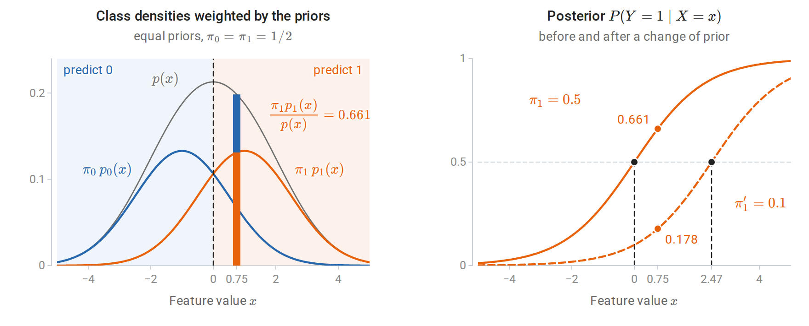
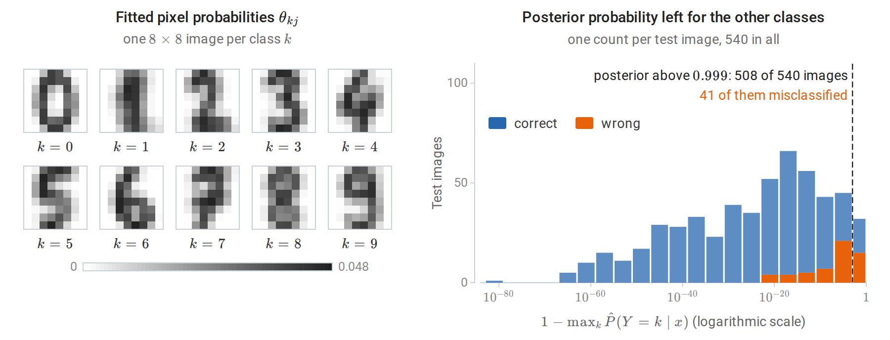
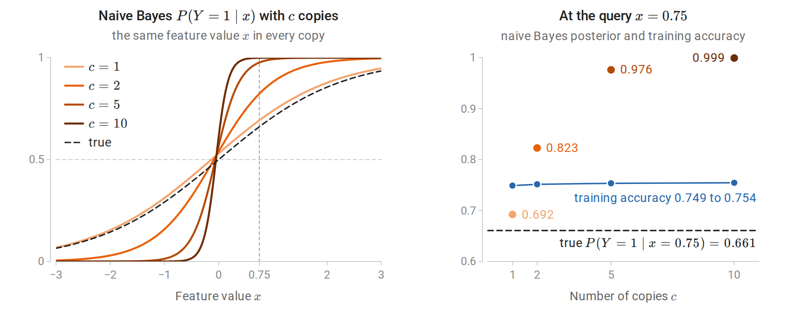
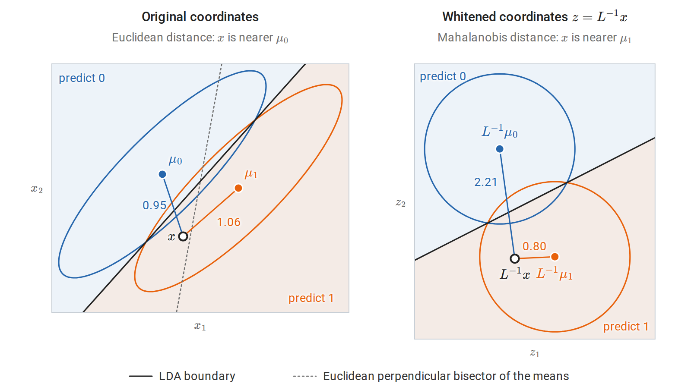
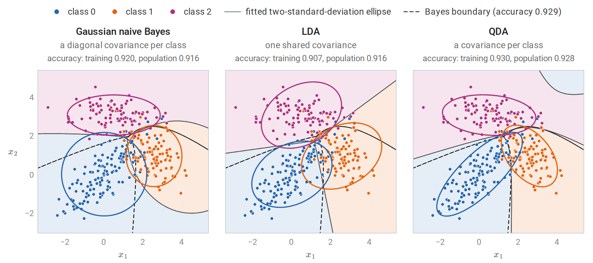
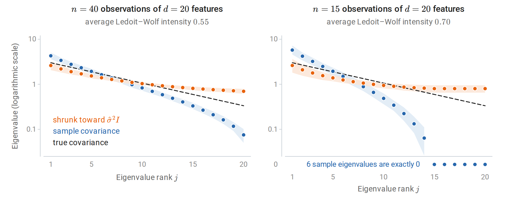
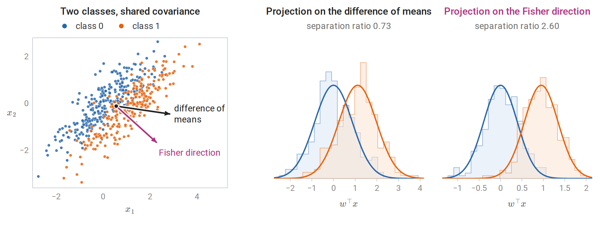
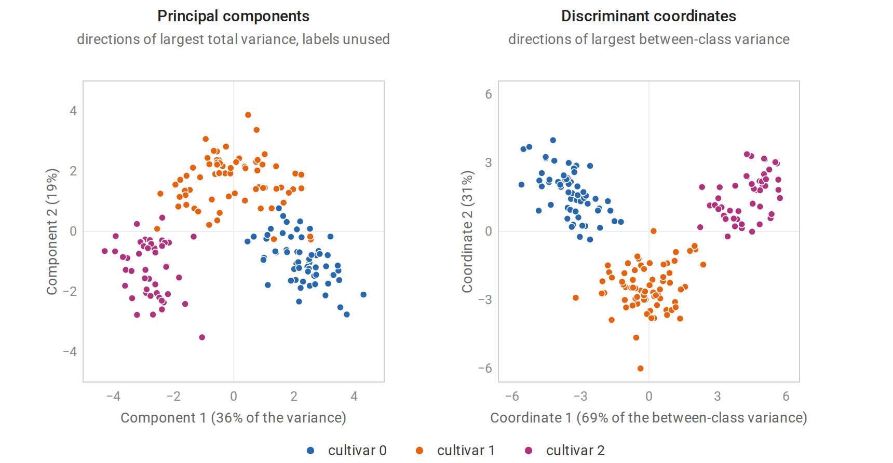

[Background Notes](../README.md) › [Machine Learning](README.md)

# 4. Generative Classifiers

> [!WARNING]
> Work in progress: this part of the notes is still being revised.

[← 3. Linear Regression and Regularization](03-linear-regression-and-regularization.md) · [5. Logistic Regression and Probabilistic Prediction →](05-logistic-regression-and-probabilistic-prediction.md)

## <a id="classification-through-bayes-rule"></a>Classification through Bayes' rule

### <a id="modeling-how-inputs-are-generated"></a>Modeling how inputs are generated

The Bayes classifier of [chapter 1](01-learning-problems-and-nearest-neighbors.md#data-rules-and-risk) predicts the most probable class given the input, and no rule has a smaller probability of error. A **generative classifier** obtains that conditional probability indirectly. It models the class proportions and the distribution of inputs within each class,

```math
\pi_k=P(Y=k),\qquad p_k(x)=p(x\mid Y=k),\qquad k=1,\ldots,K,
```

where $`\pi_k`$, the **prior probability** of class $`k`$, is the share of the population that belongs to it before any input is seen, and $`p_k`$ is the **class-conditional density** of the inputs in class $`k`$, a probability mass function when the features are discrete. The model combines them by [Bayes' rule](../foundations/04-probability-and-statistics.md#conditioning-and-dependence) into the posterior probability of each class:

```math
P(Y=k\mid X=x)=\frac{\pi_k\,p_k(x)}{\sum_{j=1}^K\pi_j\,p_j(x)}.
```

The denominator is the density $`p(x)=\sum_j\pi_jp_j(x)`$ of the inputs over all classes together. It is the same for every class, and the logarithm is increasing, so the class with the largest posterior is the class with the largest **discriminant function**:

```math
\delta_k(x)=\log\pi_k+\log p_k(x),\qquad \hat y(x)=\operatorname*{arg\,max}_k\ \delta_k(x).
```

Throughout the chapter, $`\log`$ is the natural logarithm. The boundary between classes $`j`$ and $`k`$ is the set where $`\delta_j(x)=\delta_k(x)`$.

With two classes labeled $`0`$ and $`1`$, the decision depends only on the sign of the posterior **log-odds** $`\log\frac{P(Y=1\mid X=x)}{P(Y=0\mid X=x)}=\delta_1(x)-\delta_0(x)`$, the log prior odds $`\log(\pi_1/\pi_0)`$ plus the log likelihood ratio $`\log\bigl(p_1(x)/p_0(x)\bigr)`$. This is the odds form of Bayes' rule in [Probability and Statistics](../foundations/04-probability-and-statistics.md#conditioning-and-dependence). The class probability $`\eta(x)=P(Y=1\mid X=x)`$ of chapter 1 is then $`\sigma\bigl(\delta_1(x)-\delta_0(x)\bigr)`$, where $`\sigma(s)=1/(1+e^{-s})`$ is the logistic function of chapter 5; with a subscript or a hat, as in $`\sigma_{kj}`$ or $`\hat\sigma^2`$ below, $`\sigma`$ denotes a standard deviation or a variance.



*One feature and two classes, $`\mathcal N(-1,1.5^2)`$ for class 0 and $`\mathcal N(1,1.5^2)`$ for class 1. Left: with equal priors, the weighted class densities and their sum $`p(x)`$. At the input $`x=0.75`$ the bar splits $`p(x)`$ into its two terms, and the class-1 share is the posterior probability of class 1. The dashed line is the decision boundary, where the two weighted densities cross. Right: the posterior as a function of $`x`$, before (solid) and after (dashed) the prior of class 1 falls to $`0.1`$ with the class densities unchanged. The boundary moves right, and the same input becomes far less likely to belong to class 1.*

A **discriminative** classifier, such as logistic regression in [chapter 5](05-logistic-regression-and-probabilistic-prediction.md), models $`P(Y=k\mid X=x)`$ directly and never represents $`p_k(x)`$. The distinction and its classical interpretation are introduced in [Terminology and Mathematical Language](../foundations/01-terminology-and-mathematical-language.md#generative-and-discriminative-models).

A generative model describes more than the decision: it assigns a probability to every input. That makes it possible to generate synthetic inputs, to flag inputs of low probability under every class, to handle a missing feature by marginalizing it out, and to use unlabeled inputs, whose likelihood is the mixture $`\sum_k\pi_kp_k(x)`$. These are the uses of [density estimation](../foundations/01-terminology-and-mathematical-language.md#density-estimation); mixtures are fitted in [chapter 14](14-gaussian-mixtures-and-expectation-maximization.md), and [chapter 16](16-semi-supervised-and-active-learning.md#generative-models-and-em) uses them to learn from unlabeled inputs. The price is that the model must describe the inputs well, including aspects irrelevant to the classification.

### <a id="estimation-separates-by-class"></a>Estimation separates by class

Given labeled data $`(x_1,y_1),\ldots,(x_n,y_n)`$, the joint model assigns the pair $`(x_i,y_i)`$ the probability $`\pi_{y_i}\,p_{y_i}(x_i\mid\theta_{y_i})`$. The [log-likelihood](../foundations/04-probability-and-statistics.md#likelihood-and-maximum-likelihood) of the joint model is therefore

```math
\sum_{i=1}^n\log\pi_{y_i}+\sum_{i=1}^n\log p_{y_i}(x_i\mid\theta_{y_i})
=\sum_{k=1}^K n_k\log\pi_k+\sum_{k=1}^K\sum_{i:\,y_i=k}\log p_k(x_i\mid\theta_k),
```

where $`n_k`$ counts class $`k`$ and $`\theta_k`$ denotes the parameters of class $`k`$'s input distribution. The right-hand side regroups the sums by class, and the terms decouple: the class proportions appear only in the first sum, and each $`\theta_k`$ only in the terms of class $`k`$. Maximizing the first sum subject to $`\sum_k\pi_k=1`$ gives the class frequencies $`\hat\pi_k=n_k/n`$, by a Lagrange-multiplier argument or by Gibbs' inequality ([Appendix A](#block-gen-appendix-a) gives both). Each $`\theta_k`$ is fitted by maximum likelihood on the examples of class $`k`$ alone. Fitting is therefore cheap, often a single pass that computes counts, means, or covariances.

The plug-in classifier uses $`\hat\pi_k`$ and $`\hat p_k`$ in place of the unknown quantities. If the class-conditional family contains the truth and the estimates converge, the plug-in rule approaches the Bayes classifier. If the family is wrong, the classifier can still be good; what matters is whether the estimated discriminants rank the classes correctly.

**Changed class proportions.** Suppose the input distribution within each class stays fixed but the class proportions change from $`\pi_k`$ to $`\pi_k'`$. Bayes' rule with the new priors gives $`P'(Y=k\mid x)\propto\pi_k'\,p_k(x)=\frac{\pi_k'}{\pi_k}\,\pi_kp_k(x)`$, and $`\pi_kp_k(x)`$ is proportional to the old posterior, so the correct posterior is

```math
P'(Y=k\mid x)\propto\frac{\pi_k'}{\pi_k}\,P(Y=k\mid x).
```

A generative model makes this correction explicit: replace the prior and keep $`p_k`$. With two classes, the log-odds shift by the constant $`\log(\pi_1'/\pi_0')-\log(\pi_1/\pi_0)`$, which moves the boundary as in the right panel of the figure above. This situation, called **label shift**, arises when a classifier trained on balanced data is deployed where one class is rare.

### <a id="why-structure-is-needed"></a>Why structure is needed

The class-conditional distribution $`p_k(x)`$ is a density on the whole input space. With $`d`$ binary features, there are $`2^d`$ possible feature vectors, and an unrestricted distribution has $`2^d-1`$ free probabilities per class, since the $`2^d`$ probabilities sum to one; with $`d=30`$ that is over a billion, far more than any training set can estimate. Continuous features face the curse of dimensionality of [chapter 1](01-learning-problems-and-nearest-neighbors.md#the-curse-of-dimensionality): a density estimate needs observations in every region where the density is to be evaluated. Generative classifiers therefore impose structure. Naive Bayes assumes independence of the features within each class. Gaussian discriminant analysis assumes a Gaussian distribution within each class. Both reduce the number of parameters from exponential or unbounded to polynomial in $`d`$.

## <a id="naive-bayes"></a>Naive Bayes

### <a id="conditional-independence"></a>Conditional independence

The **naive Bayes** assumption is that the features are independent given the class:

```math
p_k(x)=\prod_{j=1}^dp_{kj}(x_j).
```

Here $`p_{kj}`$ is the distribution of the $`j`$th feature within class $`k`$. With binary features this needs only $`d`$ probabilities per class, instead of $`2^d-1`$. The discriminant is a sum of per-feature terms,

```math
\delta_k(x)=\log\pi_k+\sum_{j=1}^d\log p_{kj}(x_j),
```

and each factor $`p_{kj}`$ is fitted separately from one feature's values in one class. The assumption is almost never literally true. Words in a document, pixels in an image, and symptoms of a disease are dependent even within a class. The method is nonetheless a strong baseline for high-dimensional discrete data, and understanding why requires separating its classifications from its probabilities.

### <a id="event-models"></a>Event models

The factor $`p_{kj}`$ depends on the feature type. In the table, $`\theta_{kj}`$ is the parameter of feature $`j`$ in class $`k`$: the probability that attribute $`j`$ is present in the Bernoulli model, and the probability of word $`j`$ in the multinomial model.

| Model | Feature $`x_j`$ | Class-conditional factor | Maximum-likelihood estimate |
| --- | --- | --- | --- |
| Bernoulli | Presence of attribute $`j`$, $`x_j\in\{0,1\}`$ | $`\theta_{kj}^{x_j}(1-\theta_{kj})^{1-x_j}`$ | Fraction of class-$`k`$ examples with $`x_j=1`$ |
| Categorical | One of $`L_j`$ levels | $`\theta_{kj\ell}`$ for level $`\ell`$ | Level frequencies within class $`k`$ |
| Multinomial | Count of word $`j`$ in a document | $`\prod_j\theta_{kj}^{x_j}`$, with $`\sum_j\theta_{kj}=1`$ | Share of all class-$`k`$ word occurrences that are word $`j`$ |
| Gaussian | Real value | $`\mathcal N(x_j;\mu_{kj},\sigma_{kj}^2)`$ | Class mean and variance of feature $`j`$ |

The **multinomial** model treats a document as a sequence of independent word draws from a class-specific distribution $`\theta_k=(\theta_{k1},\ldots,\theta_{kd})`$ over a vocabulary of $`d`$ words. The probability of a document with counts $`x=(x_1,\ldots,x_d)`$ and length $`\ell=\sum_jx_j`$ is

```math
p_k(x)=\frac{\ell!}{\prod_jx_j!}\prod_{j=1}^d\theta_{kj}^{x_j},
```

where the multinomial coefficient does not depend on the class and cancels in the discriminants. Strictly, this is not a product of separate factors $`p_{kj}(x_j)`$, because the counts are tied together by the length $`\ell`$. The model takes the distribution of the length to be the same in every class, so that it cancels too, and the class-dependent part $`\prod_j\theta_{kj}^{x_j}`$ then has the product form of the naive Bayes discriminant. The **Bernoulli** model instead records which words appear, and it penalizes a class for words that are *absent* from a document as well as rewarding it for words that are present. For text, the multinomial model is usually better when documents are long ([McCallum and Nigam, 1998](https://aaai.org/papers/041-ws98-05-007/)). Mitchell's chapter [*Generative and Discriminative Classifiers: Naive Bayes and Logistic Regression*](https://www.cs.cmu.edu/~tom/mlbook/NBayesLogReg.pdf) develops the Bernoulli and Gaussian cases.

### <a id="smoothing-zero-counts"></a>Smoothing zero counts

Maximum likelihood assigns probability zero to any word never seen in a class's training documents. A single such word in a new document then makes $`p_k(x)=0`$, eliminating class $`k`$ regardless of all other evidence. **Additive smoothing** replaces the estimate by

```math
\hat\theta_{kj}=\frac{N_{kj}+\alpha}{N_k+\alpha d},\qquad N_k=\sum_{j=1}^dN_{kj},
```

where $`N_{kj}`$ is the total count of word $`j`$ in class $`k`$, $`N_k`$ is the total number of words in class $`k`$, and $`\alpha>0`$ is a pseudo-count added to every word. With $`\alpha=1`$ this is **Laplace smoothing**. It is the posterior mean of $`\theta_k`$ under a symmetric $`\operatorname{Dirichlet}(\alpha,\ldots,\alpha)`$ prior, as derived in [Probability and Statistics, Appendix H](../foundations/04-probability-and-statistics.md#categorical-observations-and-dirichlet-smoothing), where it appears as the posterior predictive probability of the next word. The Bernoulli model is smoothed the same way: if $`m_{kj}`$ of the $`n_k`$ examples of class $`k`$ have $`x_j=1`$, the estimate $`(m_{kj}+\alpha)/(n_k+2\alpha)`$ is the posterior mean under a $`\operatorname{Beta}(\alpha,\alpha)`$ prior ([Probability and Statistics](../foundations/04-probability-and-statistics.md#bernoulli-observations-and-a-beta-prior)). The value of $`\alpha`$ is a hyperparameter. With a large vocabulary, $`\alpha=1`$ can move substantial probability to unseen words, since each of them receives $`\alpha/(N_k+\alpha d)`$, and smaller values often classify better.

### <a id="naive-bayes-is-a-linear-classifier"></a>Naive Bayes is a linear classifier

For two classes with multinomial features, subtracting the two discriminants gives the log-odds

```math
\log\frac{P(Y=1\mid x)}{P(Y=0\mid x)}
=\sum_{j=1}^dx_j\log\frac{\theta_{1j}}{\theta_{0j}}+\log\frac{\pi_1}{\pi_0}
=w^\top x+b.
```

The multinomial coefficient has cancelled, and what remains is linear in the counts, with weight $`w_j=\log(\theta_{1j}/\theta_{0j})`$ on word $`j`$ and intercept $`b=\log(\pi_1/\pi_0)`$. The Bernoulli model gives the same form, with $`w_j=\log\frac{\theta_{1j}(1-\theta_{0j})}{\theta_{0j}(1-\theta_{1j})}`$ and an intercept that includes the absent-feature terms, $`b=\log\frac{\pi_1}{\pi_0}+\sum_j\log\frac{1-\theta_{1j}}{1-\theta_{0j}}`$. Naive Bayes on discrete features is therefore a linear classifier whose weights are set by counting, rather than by optimizing classification performance, and its class probability is a logistic function of the linear score, $`\eta(x)=\sigma(w^\top x+b)`$. Logistic regression has exactly the same functional form and chooses the weights by maximizing the conditional likelihood instead; [chapter 5](05-logistic-regression-and-probabilistic-prediction.md#generative-and-discriminative-estimation-compared) compares the two. Gaussian naive Bayes with class-specific variances has quadratic discriminants with no cross terms, because each factor contributes $`-(x_j-\mu_{kj})^2/(2\sigma_{kj}^2)`$; if each feature's variance is shared across classes, the $`x_j^2`$ terms cancel and it is linear.

### <a id="computing-in-log-space"></a>Computing in log space

Products of hundreds of probabilities underflow in floating point. Every implementation works with log probabilities, and posterior probabilities are obtained by normalizing with the log-sum-exp function, as in [Stable probability calculations](../foundations/06-numerical-computing-with-numpy-and-pytorch.md#stable-probability-calculations):

```math
\log P(Y=k\mid x)=\delta_k(x)-\log\sum_{j=1}^K\exp\delta_j(x).
```

The following code fits multinomial naive Bayes to the 8×8 handwritten digit images in scikit-learn, treating each pixel's intensity, an integer from 0 to 16, as the count of that pixel's "word". Fitting computes the smoothed log probabilities $`\log\hat\theta_{kj}`$; prediction is a single matrix product, because the log joint probability is linear in the counts.

```python
import numpy as np
from scipy.special import logsumexp
from sklearn.datasets import load_digits
from sklearn.model_selection import train_test_split
from sklearn.naive_bayes import MultinomialNB

X, y = load_digits(return_X_y=True)                  # 8x8 images, intensities 0..16
X_train, X_test, y_train, y_test = train_test_split(
    X, y, test_size=0.3, stratify=y, random_state=0)
K, d = 10, X.shape[1]
alpha = 1.0                                          # additive (Laplace) smoothing

# Fitting: class frequencies and smoothed per-class "word" probabilities.
counts = np.array([X_train[y_train == k].sum(axis=0) for k in range(K)])     # (K, d)
log_prior = np.log(np.bincount(y_train, minlength=K) / len(y_train))
log_theta = np.log(counts + alpha) - np.log(counts.sum(axis=1, keepdims=True) + alpha * d)

# Prediction: log joint = log prior + sum_j x_j log theta_kj (linear in x).
log_joint = X_test @ log_theta.T + log_prior                                  # (n_test, K)
log_post = log_joint - logsumexp(log_joint, axis=1, keepdims=True)
pred = log_joint.argmax(axis=1)

ref = MultinomialNB(alpha=alpha).fit(X_train, y_train)
print(f"test accuracy: {np.mean(pred == y_test):.3f}")
print("matches scikit-learn:", np.array_equal(pred, ref.predict(X_test)),
      np.allclose(log_post, ref.predict_log_proba(X_test)))
confident = np.exp(log_post).max(axis=1) > 0.999
print(f"posterior > 0.999 on {confident.mean():.0%} of test images; "
      f"accuracy on those: {np.mean(pred[confident] == y_test[confident]):.3f}")
# test accuracy: 0.896
# matches scikit-learn: True True
# posterior > 0.999 on 94% of test images; accuracy on those: 0.919
```

The classifier is right about 90% of the time, yet it reports probability above 0.999 for 94% of the test images, and 8% of those confident predictions are wrong. A calibrated classifier would be wrong on fewer than 0.1% of them, so the probabilities are far more extreme than the accuracy justifies. The intensities of an image sum to about 313 on average, and the multinomial model treats each unit of intensity as a separate draw, so the log-odds between two classes are sums of hundreds of terms. Pixels in a stroke are strongly dependent: a dark pixel predicts dark neighbors within every class. Naive Bayes multiplies their likelihood ratios as though each supplied independent evidence.



*Left: the fitted pixel probabilities of each class, drawn as images. Darker pixels carry a larger share of the class's intensity, and each image looks like a blurred average digit. Right: for each test image, the posterior probability that the classifier leaves for the nine classes it does not predict. Half of the test images leave less than $`10^{-20}`$, and even the median wrong prediction leaves only about $`3\times10^{-5}`$.*

### <a id="classification-can-survive-a-wrong-probability-model"></a>Classification can survive a wrong probability model

The same effect appears in its simplest form when a feature is duplicated. Suppose one Gaussian feature has class means $`\pm1`$ and standard deviation $`1.5`$, with equal priors, as in the first figure of the chapter. Copying the feature $`c`$ times adds no information, but naive Bayes treats the copies as independent evidence. With $`\hat p_k`$ the fitted density of one copy in class $`k`$, its log-odds are

```math
c\,\log\frac{\hat p_1(x)}{\hat p_0(x)}+\log\frac{\hat\pi_1}{\hat\pi_0}.
```

Naive Bayes multiplies the likelihood ratio by itself $`c`$ times, so the log-odds is multiplied by about $`c`$.

```python
import numpy as np
from sklearn.naive_bayes import GaussianNB

rng = np.random.default_rng(0)
n = 2000
y = rng.integers(0, 2, n)
x = rng.normal(loc=np.where(y == 1, 1.0, -1.0), scale=1.5)      # one informative feature
x_new = np.array([[0.75]])                                      # a query input
# Exact posterior for this model: P(y=1 | x) = sigmoid(2 * mu * x / sigma^2) with mu = 1.
true_post = 1 / (1 + np.exp(-2 * 0.75 / 1.5**2))
print(f"true P(y=1 | x=0.75) = {true_post:.3f}")
for copies in [1, 2, 5, 10]:
    X = np.repeat(x[:, None], copies, axis=1)                   # the same feature repeated
    model = GaussianNB().fit(X, y)
    p = model.predict_proba(np.repeat(x_new, copies, axis=1))[0, 1]
    acc = model.score(X, y)
    print(f"{copies:2d} copies: naive Bayes P(y=1 | x) = {p:.3f}, training accuracy {acc:.3f}")
# true P(y=1 | x=0.75) = 0.661
#  1 copies: naive Bayes P(y=1 | x) = 0.692, training accuracy 0.749
#  2 copies: naive Bayes P(y=1 | x) = 0.823, training accuracy 0.751
#  5 copies: naive Bayes P(y=1 | x) = 0.976, training accuracy 0.753
# 10 copies: naive Bayes P(y=1 | x) = 0.999, training accuracy 0.754
```

The predicted probability moves from 0.69 toward 1, while accuracy is essentially unchanged: scaling the log-odds does not change its sign, and the small changes in accuracy come from the class-prior term, which is not scaled. Class 1 makes up 52% of this sample, so the prior term is $`\log(0.5215/0.4785)=0.086`$; as $`c`$ grows, its relative weight shrinks, and the boundary moves from $`x=-0.13`$ with one copy to $`x=-0.05`$ with ten. Even with one copy the fitted posterior, 0.692, differs from the true 0.661, because the class proportions, means, and variances are all estimated from the sample. For zero–one loss, only the sign of the log-odds matters.



*Gaussian naive Bayes fitted to $`c`$ identical copies of one feature, on the 2,000 examples of the code above. Left: the fitted posterior of class 1 as a function of the common feature value. More copies make the curve steeper, but it crosses $`1/2`$ at nearly the same point. Right: at the query $`x=0.75`$ the posterior approaches 1 as $`c`$ grows, while the training accuracy stays flat.*

[Domingos and Pazzani (1997)](https://link.springer.com/article/10.1023/A:1007413511361) show that naive Bayes can be Bayes-optimal for classification under dependencies that make its probability estimates badly wrong. When probabilities are needed, for ranking by risk, combining with costs, or deciding when to abstain, naive Bayes outputs should be recalibrated as described in [chapter 5](05-logistic-regression-and-probabilistic-prediction.md#recalibration).

## <a id="gaussian-discriminant-analysis"></a>Gaussian discriminant analysis

### <a id="quadratic-discriminant-analysis"></a>Quadratic discriminant analysis

Suppose each class-conditional distribution is Gaussian, $`X\mid Y=k\sim\mathcal N(\mu_k,\Sigma_k)`$, with mean vector $`\mu_k`$ and a positive definite covariance matrix $`\Sigma_k`$. Using the density from [Gaussian vectors and conditioning](../foundations/04-probability-and-statistics.md#gaussian-vectors-and-conditioning), the discriminant is

```math
\delta_k(x)=\log\pi_k-\frac12\log\det\Sigma_k-\frac12(x-\mu_k)^\top\Sigma_k^{-1}(x-\mu_k),
```

after dropping the constant $`-\frac d2\log2\pi`$ shared by all classes. The last term is minus one half of the squared Mahalanobis distance from $`x`$ to the class mean, the distance measured in units of the class's own spread ([Whitening and Mahalanobis distance](../foundations/02-linear-algebra.md#whitening-and-mahalanobis-distance)). **Quadratic discriminant analysis** (QDA) classifies by these discriminants; the boundaries $`\delta_j=\delta_k`$ are quadratic surfaces, because the quadratic forms of different classes no longer cancel. The maximum-likelihood estimates are the class frequencies, class means, and class covariance matrices, as derived in [Appendix A](#block-gen-appendix-a).

A class with a larger covariance occupies more of the space far from all means, because its density decays more slowly. QDA boundaries can therefore enclose one class or assign distant regions to an unexpected class, as the figure in [Three covariance assumptions compared](#three-covariance-assumptions-compared) shows. Each class needs $`d`$ mean parameters and $`d(d+1)/2`$ covariance parameters, so QDA requires many observations per class when $`d`$ is large. With $`n_k\le d`$ observations, the sample covariance $`\hat\Sigma_k`$ is singular, because its rank is at most $`n_k-1`$ ([Linear Algebra](../foundations/02-linear-algebra.md#covariance-as-a-quadratic-form)), and the discriminant is undefined.

### <a id="linear-discriminant-analysis"></a>Linear discriminant analysis

If all classes share one covariance, $`\Sigma_k=\Sigma`$, expanding the quadratic form as $`x^\top\Sigma^{-1}x-2x^\top\Sigma^{-1}\mu_k+\mu_k^\top\Sigma^{-1}\mu_k`$ shows that the quadratic term $`x^\top\Sigma^{-1}x`$ and the log-determinant are the same for every class and cancel from comparisons. The **linear discriminant analysis** (LDA) discriminants are

```math
\delta_k(x)=x^\top\Sigma^{-1}\mu_k-\frac12\mu_k^\top\Sigma^{-1}\mu_k+\log\pi_k,
```

linear in $`x`$. The boundaries are hyperplanes. For two classes, the log-odds is

```math
\log\frac{P(Y=1\mid x)}{P(Y=0\mid x)}
=(\mu_1-\mu_0)^\top\Sigma^{-1}x-\frac12\bigl(\mu_1^\top\Sigma^{-1}\mu_1-\mu_0^\top\Sigma^{-1}\mu_0\bigr)+\log\frac{\pi_1}{\pi_0}.
```

This is again an affine function $`w^\top x+b`$ with $`w=\Sigma^{-1}(\mu_1-\mu_0)`$, so the posterior probability is a logistic function of a linear score, $`\eta(x)=\sigma(w^\top x+b)`$. The shared covariance is estimated by pooling the within-class scatter,

```math
\hat\Sigma=\frac1{n-K}\sum_{k=1}^K\sum_{i:\,y_i=k}(x_i-\hat\mu_k)(x_i-\hat\mu_k)^\top,
```

with denominator $`n-K`$ for unbiasedness, since $`K`$ class means $`\hat\mu_k`$ are estimated from the same data. The MLE uses $`n`$, which multiplies $`\hat\Sigma^{-1}`$ by $`n/(n-K)`$. That factor rescales every term of the discriminants except $`\log\pi_k`$, so it does not change the classifier's boundaries except through the constant terms: the hyperplanes keep their orientation, and with equal class frequencies they do not move at all. The derivation is in [Appendix A](#block-gen-appendix-a).

**LDA as a nearest-centroid rule.** With the [Cholesky factorization](../foundations/02-linear-algebra.md#cholesky) $`\Sigma=LL^\top`$, where $`L`$ is lower triangular, set $`z=L^{-1}x`$ and $`m_k=L^{-1}\mu_k`$. Then $`(x-\mu_k)^\top\Sigma^{-1}(x-\mu_k)=\|z-m_k\|^2`$, and LDA assigns $`x`$ to the class whose whitened mean is nearest, after adding $`\log\pi_k`$: it maximizes $`\log\pi_k-\frac12\|z-m_k\|^2`$. Whitening removes correlations and equalizes scales, so Euclidean distance in the whitened space is the relevant notion of closeness; see [Whitening and Mahalanobis distance](../foundations/02-linear-algebra.md#whitening-and-mahalanobis-distance). With equal priors, the boundary between two classes is the perpendicular bisector of their whitened means.



*Two equally likely classes sharing a covariance with unit variances and correlation $`0.85`$, as in the Fisher figure below. Each ellipse holds the points at Mahalanobis distance $`1.5`$ from a class mean, and the segments join a query to the two means, labeled with their lengths. LDA assigns the query to class 1 although it is closer to $`\mu_0`$ in Euclidean distance. Whitening turns the ellipses into circles and the LDA boundary into the perpendicular bisector of the whitened means, and the query then lies plainly on the class-1 side.*

The following code implements LDA in this whitened form: `fit_lda` estimates the priors, the class means, and the pooled covariance with denominator $`n-K`$, and `lda_scores` computes $`\log\pi_k-\frac12\|z-m_k\|^2`$.

```python
import numpy as np
from sklearn.datasets import load_wine
from sklearn.discriminant_analysis import (LinearDiscriminantAnalysis,
                                           QuadraticDiscriminantAnalysis)
from sklearn.model_selection import train_test_split
from sklearn.naive_bayes import GaussianNB

X, y = load_wine(return_X_y=True)
X_train, X_test, y_train, y_test = train_test_split(
    X, y, test_size=0.3, stratify=y, random_state=0)
K = 3

def fit_lda(X, y):
    priors = np.bincount(y) / len(y)
    means = np.array([X[y == k].mean(axis=0) for k in range(K)])
    centered = X - means[y]                          # subtract each row's class mean
    Sigma = centered.T @ centered / (len(y) - K)     # pooled within-class covariance
    L = np.linalg.cholesky(Sigma)
    return priors, means, L

def lda_scores(X, priors, means, L):
    # delta_k(x) = log pi_k - 0.5 * Mahalanobis(x, mu_k)^2, computed after whitening.
    Z = np.linalg.solve(L, X.T).T                    # whitened inputs
    M = np.linalg.solve(L, means.T).T                # whitened class means
    d2 = ((Z[:, None, :] - M[None, :, :]) ** 2).sum(axis=2)
    return np.log(priors) - 0.5 * d2

params = fit_lda(X_train, y_train)
pred = lda_scores(X_test, *params).argmax(axis=1)
sk = LinearDiscriminantAnalysis().fit(X_train, y_train)
print("LDA from scratch matches scikit-learn:", np.array_equal(pred, sk.predict(X_test)))
for name, model in [("Gaussian naive Bayes", GaussianNB()),
                    ("LDA", LinearDiscriminantAnalysis()),
                    ("QDA", QuadraticDiscriminantAnalysis())]:
    acc = model.fit(X_train, y_train).score(X_test, y_test)
    print(f"{name:>20}: test accuracy {acc:.3f}")
# LDA from scratch matches scikit-learn: True
# Gaussian naive Bayes: test accuracy 0.963
#                  LDA: test accuracy 1.000
#                  QDA: test accuracy 0.981
```

Unlike $`k`$-NN in [chapter 1](01-learning-problems-and-nearest-neighbors.md#a-worked-example), these classifiers need no feature standardization: the covariance estimate accounts for the scales of the features. For LDA and QDA, [Appendix A](#block-gen-appendix-a) shows more generally that the predictions do not change under any invertible affine change of the features; Gaussian naive Bayes, with its diagonal covariances, is unaffected by shifting and rescaling each feature separately. With only 54 test wines, the three accuracies differ by one or two errors and do not establish a ranking.

### <a id="three-covariance-assumptions-compared"></a>Three covariance assumptions compared

Gaussian naive Bayes is Gaussian discriminant analysis with a diagonal covariance for each class. The three models form a hierarchy of assumptions about $`\Sigma_k`$; in the table, $`K`$ is the number of classes and $`d`$ the number of features.

| Model | Covariance assumption | Covariance parameters | Boundaries |
| --- | --- | --- | --- |
| Gaussian naive Bayes | $`\Sigma_k`$ diagonal | $`Kd`$ | Quadratic, axis-aligned terms only |
| LDA | $`\Sigma_k=\Sigma`$ for all $`k`$ | $`d(d+1)/2`$ | Linear |
| QDA | Unrestricted $`\Sigma_k`$ | $`Kd(d+1)/2`$ | Quadratic |



*Three Gaussian classes with different covariances, fitted by the three models to the same 300 training points. Ellipses show the fitted two-standard-deviation contours of each class, shading shows the predicted class, and the dashed curves are the boundaries of the Bayes classifier of the true model. Naive Bayes ignores the correlation within the blue class; LDA forces all classes to share one orientation; QDA fits each class's shape, and assigns the far upper right to the blue class because that class's density decays most slowly in that direction. The population accuracies above the panels are integrated over the known class densities; on 3,000 fresh test points the accuracies are 0.914, 0.913, and 0.924.*

QDA is the most flexible and has the lowest bias when the Gaussian assumption holds, but it has the most parameters. LDA's shared covariance is a strong assumption, yet it often classifies well even when the classes have different covariances, because it estimates fewer parameters. This is another instance of the bias–variance tradeoff of [Probability and Statistics](../foundations/04-probability-and-statistics.md#bias-variance-and-mean-squared-error), developed for predictors in [chapter 6](06-losses-model-selection-and-evaluation.md#the-biasvariance-decomposition). In the figure the classes really are Gaussian and each has at least 90 training points, so QDA's extra parameters are well estimated: its population accuracy is only about 0.001 below the Bayes accuracy, while naive Bayes and LDA fall short by about 0.013.

### <a id="regularized-discriminant-analysis"></a>Regularized discriminant analysis

Between these extremes, **regularized discriminant analysis** shrinks each class covariance toward the pooled covariance, and the pooled covariance toward a multiple of the identity:

```math
\hat\Sigma_k(\alpha)=\alpha\hat\Sigma_k+(1-\alpha)\hat\Sigma,
\qquad
\hat\Sigma(\gamma)=\gamma\hat\Sigma+(1-\gamma)\hat\sigma^2I,
```

with $`\alpha,\gamma\in[0,1]`$ chosen by [cross-validation](06-losses-model-selection-and-evaluation.md#cross-validation) ([Friedman, 1989](https://www.tandfonline.com/doi/abs/10.1080/01621459.1989.10478752)). This $`\alpha`$ is unrelated to the smoothing constant of naive Bayes, and $`\hat\sigma^2`$ is a scalar variance, usually the average diagonal entry $`\operatorname{tr}(\hat\Sigma)/d`$, so that $`\hat\sigma^2I`$ has the same trace as $`\hat\Sigma`$. The value $`\alpha=1`$ gives QDA, and $`\alpha=0`$ with $`\gamma=1`$ gives LDA. Shrinking toward the identity makes the covariance invertible even when $`d\ge n`$, because for $`\gamma<1`$ every eigenvalue of $`\hat\Sigma(\gamma)`$ is at least $`(1-\gamma)\hat\sigma^2>0`$, and it stabilizes the small eigenvalues that dominate $`\Sigma^{-1}`$. [Ledoit and Wolf (2004)](https://www.sciencedirect.com/science/article/pii/S0047259X03000964) derived a data-driven shrinkage intensity for $`\gamma`$, available in scikit-learn as `LinearDiscriminantAnalysis(solver="lsqr", shrinkage="auto")`. The effect is analogous to [ridge regression](03-linear-regression-and-regularization.md#ridge-regression): the smallest eigenvalues of $`\hat\Sigma`$ are the most underestimated, and adding a multiple of the identity counteracts this.

The matrix $`\hat\Sigma(\gamma)`$ has the same eigenvectors as $`\hat\Sigma`$, and each of its eigenvalues is $`\gamma\lambda_j+(1-\gamma)\hat\sigma^2`$, where $`\lambda_j`$ is the corresponding eigenvalue of $`\hat\Sigma`$: every eigenvalue moves a fraction $`1-\gamma`$ of the way toward the average $`\hat\sigma^2`$, and this fraction is the Ledoit–Wolf intensity reported in the figure. The figure shows why this helps. Sample eigenvalues spread out much more than the true ones, the effect described by the Marchenko–Pastur law in [chapter 12](12-principal-components-and-dimensionality-reduction.md#noise-has-eigenvalues-too). With 40 observations of 20 features whose smallest true eigenvalue is $`1/3`$, the smallest sample eigenvalue averages $`0.075`$, more than four times too small, and its reciprocal, the largest eigenvalue of $`\hat\Sigma^{-1}`$, is correspondingly too large.



*Sorted eigenvalues of covariance estimates for twenty Gaussian features whose true eigenvalues (dashed) decrease from 3 to 1/3, averaged over 200 samples; the bands span the middle 80% of the samples. The maximum-likelihood covariance spreads its eigenvalues: the largest are too large, the smallest far too small, and with fewer observations than features some are exactly zero. Ledoit–Wolf shrinkage pulls every eigenvalue toward their average, which removes the zeros and keeps the inverse stable, at the price of flattening the true spread.*

The shrinkage target $`\hat\sigma^2I`$ depends on the scales of the features. Shrinkage toward it is therefore not invariant to rescaling them, unlike LDA and QDA, and the features are usually standardized first.

## <a id="fisher-s-linear-discriminant"></a>Fisher's linear discriminant

### <a id="a-projection-that-separates-classes"></a>A projection that separates classes

[Fisher (1936)](https://onlinelibrary.wiley.com/doi/10.1111/j.1469-1809.1936.tb02137.x) derived a linear discriminant without assuming Gaussian classes, by asking for the one-dimensional projection $`w^\top x`$ that best separates the classes. For two classes, a good projection places the projected class means far apart relative to the spread within each class. In this section $`\mu_0`$ and $`\mu_1`$ denote the class means of the sample, written $`\hat\mu_k`$ above. Define the **between-class** and **within-class** scatter matrices

```math
S_B=(\mu_1-\mu_0)(\mu_1-\mu_0)^\top,
\qquad
S_W=\sum_{k\in\{0,1\}}\ \sum_{i:\,y_i=k}(x_i-\mu_k)(x_i-\mu_k)^\top,
```

and maximize the **Fisher criterion**

```math
J(w)=\frac{w^\top S_Bw}{w^\top S_Ww}=\frac{\bigl(w^\top(\mu_1-\mu_0)\bigr)^2}{w^\top S_Ww}.
```

The numerator is the squared distance between the projected class means. The denominator, $`w^\top S_Ww=\sum_k\sum_{i:\,y_i=k}(w^\top x_i-w^\top\mu_k)^2`$, is the scatter of the projected points around their projected class means. Rescaling $`w`$ does not change $`J`$, so only the direction of $`w`$ matters.

With $`S_W\succ0`$ and the substitution $`v=S_W^{1/2}w`$, where $`S_W^{1/2}`$ is the symmetric square root of [Linear Algebra](../foundations/02-linear-algebra.md#positive-semidefinite-matrices), the criterion becomes $`(v^\top S_W^{-1/2}(\mu_1-\mu_0))^2/\|v\|^2`$. The [Cauchy–Schwarz inequality](../foundations/02-linear-algebra.md#inner-products-and-orthogonality) $`(a^\top v)^2\le\|a\|^2\|v\|^2`$, with equality exactly when $`v`$ is parallel to $`a`$, shows that this ratio is maximized at $`v\propto S_W^{-1/2}(\mu_1-\mu_0)`$. Hence

```math
w^\star\propto S_W^{-1}(\mu_1-\mu_0).
```

This is the direction of the Gaussian LDA weight vector, since $`S_W=(n-2)\hat\Sigma`$ is proportional to the pooled covariance. Fisher's derivation shows that the LDA direction is sensible whenever separation of projected means relative to within-class variance is a good criterion, whether or not the classes are Gaussian. The threshold on $`w^\top x`$ is a separate choice; the Gaussian model supplies one through the priors.



*Two classes of 250 points each, with strongly correlated features and a shared covariance. Projecting onto the difference of the means mixes the classes, because that direction also carries much of the within-class variation. The Fisher direction $`S_W^{-1}(\mu_1-\mu_0)`$ tilts away from the direction of large within-class variance, and the projected classes overlap far less. The separation ratio is the squared difference of projected means divided by the sum of projected variances. The curves are the exact projected class densities of the model; the best threshold on the first projection misclassifies 26% of the population, and on the second 11%.*

### <a id="several-classes-and-reduced-rank-lda"></a>Several classes and reduced-rank LDA

With $`K`$ classes, let $`\bar\mu`$ be the overall mean and define $`S_B=\sum_kn_k(\mu_k-\bar\mu)(\mu_k-\bar\mu)^\top`$, with $`S_W`$ now summed over all $`K`$ classes. For $`K=2`$ this $`S_B`$ equals $`\frac{n_0n_1}{n}(\mu_1-\mu_0)(\mu_1-\mu_0)^\top`$, a multiple of the two-class matrix, so it leads to the same direction. Maximizing the same ratio over directions leads to the generalized eigenvalue problem

```math
S_Bw=\lambda S_Ww.
```

The substitution $`v=S_W^{1/2}w`$ turns the ratio into the Rayleigh quotient of the symmetric matrix $`S_W^{-1/2}S_BS_W^{-1/2}`$, which a top eigenvector maximizes ([Linear Algebra](../foundations/02-linear-algebra.md#the-symmetric-spectral-theorem)); written in terms of $`w`$, the eigenvector equation is the problem above, and $`\lambda`$ is the value of the ratio. The successive eigenvectors give the **discriminant coordinates**: each maximizes the ratio among directions whose projections are uncorrelated within classes with the earlier ones, $`w_i^\top S_Ww_j=0`$.

Since the $`K`$ class means span an affine space of dimension at most $`K-1`$, $`S_B`$ has rank at most $`K-1`$, so at most $`K-1`$ eigenvalues are positive. LDA can therefore map the data to at most $`K-1`$ dimensions without losing information about the class means in the whitened geometry. After whitening, the Gaussian LDA rule compares distances to the class means, and the component of $`z`$ orthogonal to the affine span of the whitened means adds the same amount to every one of these squared distances, so the rule depends on $`x`$ only through the discriminant coordinates. **Reduced-rank LDA** keeps only the first $`q<K-1`$ coordinates and assigns an input to the nearest class mean within them, which confines the comparison to the $`q`$ directions that best separate the means ([*The Elements of Statistical Learning*, §4.3.3](https://hastie.su.domains/ElemStatLearn/)).

Plotting the first two discriminant coordinates is a common way to visualize labeled data. Unlike principal component analysis ([Linear Algebra](../foundations/02-linear-algebra.md#principal-component-analysis) and [chapter 12](12-principal-components-and-dimensionality-reduction.md)), which finds directions of large total variance without using labels, Fisher's directions are chosen to separate labeled classes.



*The 178 wines of the worked example, from three cultivars, each described by 13 chemical measurements. In the first two principal components of the standardized features the cultivars already form groups, but cultivar 1 (orange) spreads between the other two and touches both; assigning each wine to the nearest cultivar mean in these two coordinates misclassifies 5 of them. The discriminant coordinates, scaled to unit within-class variance, give compact, round groups, and the same nearest-mean rule classifies every wine correctly.*

## <a id="generative-and-discriminative-estimation"></a>Generative and discriminative estimation

LDA, and naive Bayes with discrete features, produce posterior log-odds that are affine in $`x`$: the same functional form as logistic regression. Both are instances of a general fact. If every class-conditional density belongs to one exponential family with sufficient statistic $`x`$, $`p_k(x)=h(x)\exp\bigl(\vartheta_k^\top x-A(\vartheta_k)\bigr)`$ with natural parameter $`\vartheta_k`$, the base function $`h(x)`$ cancels from the log-odds, which are then $`(\vartheta_1-\vartheta_0)^\top x-A(\vartheta_1)+A(\vartheta_0)+\log(\pi_1/\pi_0)`$; exponential families are described in [Probability and Statistics, Appendix E](../foundations/04-probability-and-statistics.md#exponential-families-and-moment-matching). The methods differ in how they estimate the parameters.

- A generative classifier maximizes the **joint** likelihood $`\prod_ip(x_i,y_i)`$. When its assumptions hold, it uses the information in the inputs efficiently. For Gaussian classes with a shared covariance, LDA is asymptotically more efficient than logistic regression ([Efron, 1975](https://www.tandfonline.com/doi/abs/10.1080/01621459.1975.10480319)): its estimate of $`w`$ has smaller asymptotic variance, because the distribution of the inputs also carries information about the parameters (see [Score, information, and asymptotic uncertainty](../foundations/04-probability-and-statistics.md#score-information-and-asymptotic-uncertainty)).
- A discriminative classifier maximizes the **conditional** likelihood $`\prod_iP(y_i\mid x_i)`$. It makes no assumption about the distribution of the inputs, so it is not misled when that distribution is misspecified. With enough data, logistic regression converges to the linear log-odds model closest to the truth in expected log loss, the pseudo-true parameter of [Probability and Statistics](../foundations/04-probability-and-statistics.md#when-the-model-is-only-an-approximation), whereas a misspecified generative model converges to whatever boundary its fitted moments imply. A discriminative classifier fitted by minimizing training error converges to the rule of its form with the smallest error, so asymptotically its error is at least as low as that of a generative classifier with the same functional form; logistic regression minimizes log loss rather than error, so for it this comparison holds only approximately.

[Ng and Jordan (2001)](https://proceedings.neurips.cc/paper/2001/hash/7b7a53e239400a13bd6be6c91c4f6c4e-Abstract.html) sharpened this comparison for naive Bayes and logistic regression. Naive Bayes approaches its own asymptotic error with a number of examples logarithmic in $`d`$, whereas logistic regression can need a number linear in $`d`$. With little data, the generative classifier can therefore be better even when its assumptions are wrong; with more data, logistic regression usually overtakes it. [Chapter 5](05-logistic-regression-and-probabilistic-prediction.md#learning-curves) shows this crossover empirically.

## <a id="appendices"></a>Appendices


<details>
<summary><a id="block-gen-appendix-a"></a><b>A. Maximum likelihood for Gaussian discriminant analysis</b></summary>

### <a id="class-probabilities"></a>Class probabilities

Maximize $`\sum_kn_k\log\pi_k`$ subject to $`\sum_k\pi_k=1`$. With a Lagrange multiplier $`\nu`$ ([Calculus and Optimization](../foundations/03-calculus-and-optimization.md#lagrange-multipliers-and-kkt)), stationarity of $`\sum_kn_k\log\pi_k-\nu\bigl(\sum_k\pi_k-1\bigr)`$ gives $`n_k/\pi_k=\nu`$, so $`\pi_k\propto n_k`$ and $`\hat\pi_k=n_k/n`$. Equivalently, $`\sum_kn_k\log\pi_k=n\sum_k\hat\pi_k\log\pi_k`$ is $`-n`$ times a cross-entropy, which Gibbs' inequality ([Information and Learning Theory](../foundations/05-information-and-learning-theory.md#cross-entropy-divergence-and-log-loss)) maximizes at $`\pi=\hat\pi`$: the cross-entropy $`H(\hat\pi,\pi)`$ equals $`H(\hat\pi)+D_{\mathrm{KL}}(\hat\pi\Vert\pi)`$, and the divergence is zero only at $`\pi=\hat\pi`$.

### <a id="means-and-covariances"></a>Means and covariances

For class $`k`$ with covariance $`\Sigma_k`$, the log-likelihood of its examples is, up to constants,

```math
\ell_k=-\frac{n_k}2\log\det\Sigma_k-\frac12\sum_{i:\,y_i=k}(x_i-\mu_k)^\top\Sigma_k^{-1}(x_i-\mu_k).
```

Setting the gradient in $`\mu_k`$ to zero gives $`\Sigma_k^{-1}\sum_i(x_i-\mu_k)=0`$, so $`\hat\mu_k`$ is the class mean. Write the quadratic term as a trace, $`\frac12\operatorname{tr}(\Sigma_k^{-1}S_k)`$ with $`S_k=\sum_i(x_i-\hat\mu_k)(x_i-\hat\mu_k)^\top`$, and parameterize by the precision $`\Lambda_k=\Sigma_k^{-1}`$, using $`\log\det\Sigma_k=-\log\det\Lambda_k`$:

```math
\ell_k=\frac{n_k}2\log\det\Lambda_k-\frac12\operatorname{tr}(\Lambda_kS_k).
```

Using $`\nabla_\Lambda\log\det\Lambda=\Lambda^{-1}`$ and $`\nabla_\Lambda\operatorname{tr}(\Lambda S)=S`$ for symmetric matrices, from [Linear Algebra, Appendix B](../foundations/02-linear-algebra.md#matrix-gradient-identities), stationarity gives $`\frac{n_k}2\Lambda_k^{-1}=\frac12S_k`$, so $`\hat\Sigma_k=S_k/n_k`$. The function is concave in $`\Lambda_k`$, so this is the maximum when $`S_k`$ is positive definite. If $`S_k`$ is singular, the likelihood is unbounded: a density can be made arbitrarily tall along the flat directions.

For LDA, the shared-covariance log-likelihood is $`\frac n2\log\det\Lambda-\frac12\operatorname{tr}(\Lambda\sum_kS_k)`$, and the same argument gives $`\hat\Sigma=\sum_kS_k/n`$, the pooled MLE.

### <a id="the-discriminant-is-invariant-to-affine-reparameterization"></a>The discriminant is invariant to affine reparameterization

If $`x'=Ax+c`$ with $`A`$ invertible, the class means become $`\mu_k'=A\mu_k+c`$ and the covariances $`A\Sigma_kA^\top`$. Mahalanobis distances and log-determinant differences are unchanged: $`(x'-\mu_k')^\top(A\Sigma_kA^\top)^{-1}(x'-\mu_k')=(x-\mu_k)^\top\Sigma_k^{-1}(x-\mu_k)`$, and $`\log\det(A\Sigma_kA^\top)=\log\det\Sigma_k+2\log\lvert\det A\rvert`$ adds the same constant to every class. The sample means and covariances transform in exactly the same way, so the fitted classifiers agree too, and LDA and QDA make identical predictions in both coordinate systems. This is why these methods, unlike $`k`$-NN or penalized regression, need no feature standardization. Regularized discriminant analysis loses this invariance, because its target $`\hat\sigma^2I`$ does not transform like a covariance.

</details>

---

[← 3. Linear Regression and Regularization](03-linear-regression-and-regularization.md) · [5. Logistic Regression and Probabilistic Prediction →](05-logistic-regression-and-probabilistic-prediction.md)
