[ML Mastery Notes](../README.md) › [Machine Learning](README.md)

# 5. Logistic Regression and Probabilistic Prediction

[← 4. Generative Classifiers](04-generative-classifiers.md) · [6. Losses, Model Selection, and Evaluation →](06-losses-model-selection-and-evaluation.md)

## <a id="the-logistic-model"></a>The logistic model

### <a id="modeling-the-class-probability-directly"></a>Modeling the class probability directly

Generative classifiers with Gaussian classes of equal covariance, or with discrete naive Bayes features, produce posterior log-odds that are affine in the input (chapter 4). **Logistic regression** takes this functional form as its model and estimates it directly. For binary labels $`y\in\{0,1\}`$, a weight vector $`w\in\mathbb R^d`$, and an intercept $`b\in\mathbb R`$,

$$
P(Y=1\mid X=x)=\sigma\bigl(w^\top x+b\bigr),\qquad \sigma(s)=\frac1{1+e^{-s}}.
$$

In the notation of chapter 1, the model asserts that the class probability $`\eta(x)=P(Y=1\mid X=x)`$ has this form. Equivalently, the **log-odds** are linear:

$$
\log\frac{P(Y=1\mid x)}{P(Y=0\mid x)}=w^\top x+b.
$$

The sigmoid maps the real-valued score $`s=w^\top x+b`$, called the **logit**, to a probability; its inverse maps a probability $`p`$ back to the log-odds $`\log\frac p{1-p}`$. It satisfies $`\sigma(-s)=1-\sigma(s)`$ and $`\sigma'(s)=\sigma(s)(1-\sigma(s))`$, so its slope is largest, $`1/4`$, at $`s=0`$, where the probability is $`1/2`$ (Calculus and Optimization lists these derivatives). The decision boundary of the rule "predict 1 when the probability is at least $`1/2`$" is the hyperplane $`w^\top x+b=0`$, so logistic regression is a linear classifier. Unlike the perceptron, it also supplies a probability.

The coefficients have a multiplicative interpretation on the odds scale: increasing $`x_j`$ by one unit, holding the other features fixed, adds $`w_j`$ to the log-odds and therefore multiplies the odds of class 1 by $`e^{w_j}`$. This conditional interpretation depends on which other features are in the model, and it describes an association rather than the effect of an intervention.

### <a id="the-loss-log-loss-cross-entropy-and-the-logistic-margin-loss"></a>The loss: log loss, cross-entropy, and the logistic margin loss

Each label is modeled as a Bernoulli variable with success probability $`p_i=\sigma(s_i)`$, $`s_i=w^\top x_i+b`$. The negative log-likelihood of the training labels, given the inputs, is

$$
\mathcal L(w,b)=-\sum_{i=1}^n\bigl[y_i\log p_i+(1-y_i)\log(1-p_i)\bigr]
=\sum_{i=1}^n\bigl[\log\bigl(1+e^{s_i}\bigr)-y_is_i\bigr].
$$

Each term is the **log loss**, or binary cross-entropy, between the observed label and the predicted probability; its information-theoretic meaning is in Cross-entropy, divergence, and log loss. Logarithms in this chapter are natural, so losses are measured in nats, whereas that chapter measures information in bits. The second form follows from $`\log\sigma(s)=s-\log(1+e^{s})`$ and $`\log(1-\sigma(s))=-\log(1+e^{s})`$. It is the numerically stable expression in terms of the logit: $`\log(1+e^{s})`$ can be evaluated as `np.logaddexp(0, s)` without overflow, and a probability that has rounded to $`0`$ or $`1`$ is never passed to a logarithm (Stable probability calculations).

With signed labels $`\tilde y=2y-1\in\{-1,+1\}`$, the probability of the observed label is $`\sigma(\tilde y s)`$, by the symmetry $`\sigma(-s)=1-\sigma(s)`$, and the loss per example becomes

$$
\ell(\tilde y,s)=\log\bigl(1+e^{-\tilde y s}\bigr),
$$

a function of the **margin** $`m=\tilde ys`$ alone, which is positive exactly when the logit has the sign of the label. The loss is large for confident mistakes, where it grows like $`-m`$; it equals $`\log2`$ at the boundary; and it decays like $`e^{-m}`$ for confidently correct predictions. Compared with the hinge loss of the support vector machine, which is exactly zero beyond a margin of one, the logistic loss never stops rewarding larger margins. Both are convex upper bounds on the zero–one loss, the logistic loss after rescaling by $`1/\log2`$ so that it equals one at $`m=0`$; chapter 6 compares them.

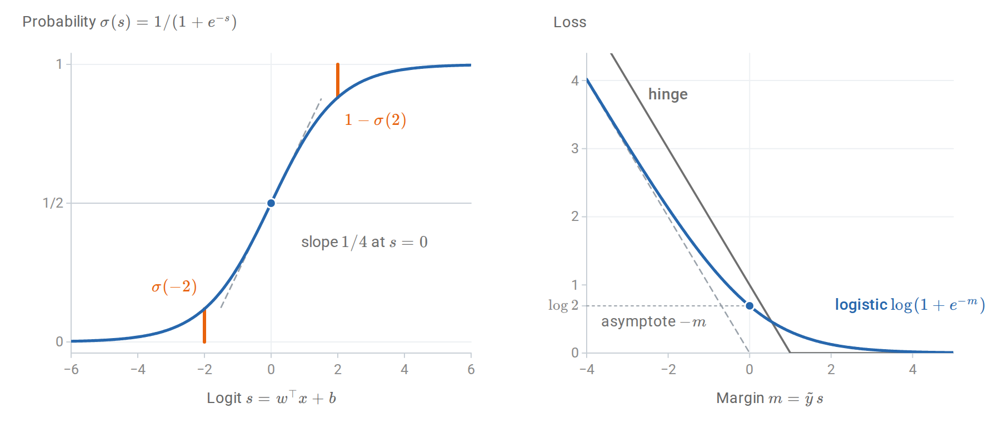

*Left: the sigmoid is symmetric about the point $`(0,1/2)`$, where its slope is largest; the two orange segments have the same length because $`\sigma(-2)=1-\sigma(2)`$. Right: for confident mistakes the logistic loss approaches its asymptote, one unit below the hinge loss $`1-m`$; for large margins it decays toward zero without reaching it, whereas the hinge loss is exactly zero beyond $`m=1`$.*

The model does not assume anything about the distribution of the inputs. It is **conditional**: the likelihood is $`\prod_iP(y_i\mid x_i)`$, not $`\prod_ip(x_i,y_i)`$. This is the defining difference from the generative classifiers, and the distinction between discriminative and generative models.

## <a id="fitting-by-maximum-conditional-likelihood"></a>Fitting by maximum conditional likelihood

### <a id="gradient-and-hessian"></a>Gradient and Hessian

Absorb the intercept into $`w`$ by adding a column of ones to the design matrix $`X\in\mathbb R^{n\times(d+1)}`$, whose rows are the augmented inputs $`x_i^\top`$. Using $`\frac{d}{ds}\log(1+e^s)=\sigma(s)`$ and $`\sigma'=\sigma(1-\sigma)`$,

$$
\nabla\mathcal L(w)=\sum_{i=1}^n(p_i-y_i)\,x_i=X^\top(p-y),
\qquad
\nabla^2\mathcal L(w)=\sum_{i=1}^np_i(1-p_i)\,x_ix_i^\top=X^\top WX,
$$

where $`p`$ and $`y`$ are the vectors of probabilities and labels and $`W=\operatorname{diag}\bigl(p_i(1-p_i)\bigr)`$. The gradient is a sum of residuals $`p_i-y_i`$ weighted by the inputs, exactly the form of the least-squares gradient $`X^\top(Xw-y)`$ with the prediction replaced by a probability. The Hessian is positive semidefinite, since $`v^\top X^\top WXv=\sum_ip_i(1-p_i)(x_i^\top v)^2\ge0`$, so $`\mathcal L`$ is **convex**. It is strictly convex when $`X`$ has full column rank, because every $`p_i(1-p_i)`$ is positive and $`Xv\ne0`$ for every $`v\ne0`$. By convexity, any stationary point is a global minimizer, and strict convexity makes it unique when it exists. Whether it exists depends on the data, as [a later section](#when-the-maximum-likelihood-estimate-does-not-exist) shows.

Since $`p(1-p)\le1/4`$, the Hessian is bounded by $`\frac14X^\top X`$, so the average loss $`\mathcal L/n`$ is $`L`$-smooth with $`L=\lambda_{\max}(X^\top X)/(4n)`$; here $`L`$ denotes the smoothness constant, not the loss $`\mathcal L`$. Gradient descent with step $`1/L`$ therefore converges at the rates in Calculus and Optimization: when a minimizer exists, the gap between the average loss after $`T`$ steps and its minimum is at most of order $`1/T`$. The loss is not strongly convex in general: far from the data, the curvature $`p(1-p)`$ vanishes. Near a minimizer at which $`X^\top WX`$ is positive definite, however, the curvature is bounded below. Asymptotically, gradient descent then behaves as on a smooth strongly convex function, and the distance to the minimizer shrinks by the factor $`1-\mu/L`$ per step, where $`\mu`$ is the smallest eigenvalue of the Hessian of $`\mathcal L/n`$ at the minimizer.

### <a id="score-equations-and-calibration-in-the-large"></a>Score equations and calibration in the large

At the minimizer the gradient vanishes:

$$
X^\top(y-\hat p)=0.
$$

The column of ones gives $`\sum_i\hat p_i=\sum_iy_i`$: **the average predicted probability equals the observed frequency of class 1** on the training data. For a binary feature, the same equation says that the predicted and observed counts agree within each of its two levels. Logistic regression with an intercept is therefore calibrated "in the large" on its own training sample, a first hint of why its probabilities are usually reasonable; [Calibration](#calibration) makes the notion precise.

These score equations are an instance of a general property of maximum likelihood. The Bernoulli law is an exponential family whose natural parameter is the log-odds, and logistic regression makes that parameter linear in $`x`$; it is the generalized linear model with Bernoulli responses and the canonical link. In such a model the maximum likelihood estimate matches moments: the expected value of the sufficient statistic $`\sum_iy_ix_i`$ under the fitted model, $`\sum_i\hat p_ix_i`$, equals its observed value (Exponential families and moment matching).

### <a id="newton-s-method-as-iteratively-reweighted-least-squares"></a>Newton's method as iteratively reweighted least squares

Newton's method updates $`w\leftarrow w-(X^\top WX)^{-1}X^\top(p-y)`$, with $`W`$ and $`p`$ evaluated at the current $`w`$. Writing $`w=(X^\top WX)^{-1}X^\top WXw`$ and $`X^\top(y-p)=X^\top W\,W^{-1}(y-p)`$ and combining the two terms,

$$
w_{\text{new}}=(X^\top WX)^{-1}X^\top Wz,\qquad z=Xw+W^{-1}(y-p).
$$

Each Newton step is a **weighted least-squares** regression of the "working response" $`z`$ on $`X`$, with weights $`p_i(1-p_i)`$ recomputed at every iteration; hence the name **iteratively reweighted least squares** (IRLS). The weights are inverse variances: if $`p_i`$ were the true probability, then $`\operatorname{Var}(y_i)=p_i(1-p_i)`$ and $`\operatorname{Var}(z_i)=1/(p_i(1-p_i))`$, so each step is the weighted least-squares estimate that trusts the more precise working responses more.

Observations with probabilities near $`0`$ or $`1`$ receive little weight. When such a probability agrees with the label, the observation is already well explained and hardly affects the fit. When it contradicts the label, the small weight is offset by a working response far from the current logit, because the product of the two, $`p_i(1-p_i)(z_i-x_i^\top w)=y_i-p_i`$, is the residual itself. Near the solution the method converges quadratically, as developed in Newton's method. Each iteration costs $`O(nd^2+d^3)`$, so for large $`d`$ quasi-Newton methods such as L-BFGS, coordinate methods, or stochastic gradients are used instead.

The following code applies IRLS to four standardized features of the [breast cancer diagnostic data](https://scikit-learn.org/stable/datasets/toy_dataset.html#breast-cancer-dataset) and compares the result with scikit-learn's unpenalized [`LogisticRegression`](https://scikit-learn.org/stable/modules/generated/sklearn.linear_model.LogisticRegression.html).

```python
import numpy as np
from sklearn.datasets import load_breast_cancer
from sklearn.linear_model import LogisticRegression
from sklearn.model_selection import train_test_split

X, y = load_breast_cancer(return_X_y=True)           # y = 1: benign, 0: malignant
X_train, X_test, y_train, y_test = train_test_split(
    X, y, test_size=0.3, stratify=y, random_state=0)
cols = [0, 1, 4, 8]                                  # mean radius, texture, smoothness, symmetry
mean, scale = X_train[:, cols].mean(0), X_train[:, cols].std(0)
design = lambda A: np.column_stack([np.ones(len(A)), (A[:, cols] - mean) / scale])
A_train, A_test = design(X_train), design(X_test)

def irls(A, y, tol=1e-10, max_iter=50):
    """Newton's method for the logistic log-likelihood (iteratively reweighted least squares)."""
    w = np.zeros(A.shape[1])
    for it in range(1, max_iter + 1):
        p = 1 / (1 + np.exp(-A @ w))
        grad = A.T @ (p - y)                         # gradient of the negative log-likelihood
        hess = A.T @ (A * (p * (1 - p))[:, None])    # A^T W A
        step = np.linalg.solve(hess, grad)
        w -= step
        if np.linalg.norm(step) < tol:
            return w, it
    raise RuntimeError("IRLS did not converge")

w, iters = irls(A_train, y_train)
ref = LogisticRegression(penalty=None, tol=1e-12, max_iter=10_000).fit(A_train[:, 1:], y_train)
p_train = 1 / (1 + np.exp(-A_train @ w))
print("Newton iterations:", iters)
print("coefficients:", np.round(w, 3))
print("matches scikit-learn:", np.allclose(w, np.r_[ref.intercept_, ref.coef_[0]], atol=1e-5))
print(f"mean predicted probability {p_train.mean():.4f} = observed frequency {y_train.mean():.4f}")
print(f"test accuracy {np.mean((A_test @ w > 0) == y_test):.3f}")
# Newton iterations: 10
# coefficients: [ 1.014 -5.358 -1.664 -1.719 -1.027]
# matches scikit-learn: True
# mean predicted probability 0.6281 = observed frequency 0.6281
# test accuracy 0.901
```

The fourth line confirms the intercept's score equation. The coefficient $`-5.36`$ on standardized mean radius says that one standard deviation larger radius multiplies the odds of a benign diagnosis by about $`e^{-5.36}\approx0.005`$, holding the other three features fixed.

The matrix $`X^\top WX`$ at the solution is also the observed information of the model, and its inverse is the usual large-sample estimate of the covariance of $`\hat w`$ (Score, information, and asymptotic uncertainty). The standard errors that statistics packages report for logistic regression coefficients are the square roots of the diagonal entries of this inverse.

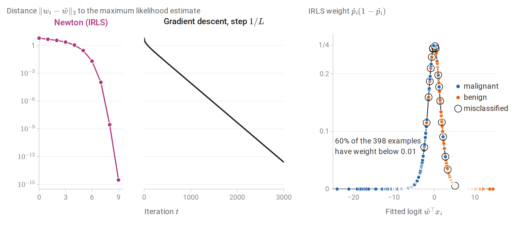

*Left and middle: distance to the maximum likelihood estimate $`\hat w`$ in the breast cancer example, starting from $`w=0`$. Newton's method reaches $`3\times10^{-15}`$ after nine iterations (the tenth iteration that the code reports only confirms convergence), and over its last steps the number of correct digits roughly doubles at each iteration. Gradient descent with step $`1/L`$ converges linearly: the distance shrinks by the factor $`0.990`$ per step, which is $`1-\mu/L`$ for the smallest curvature $`\mu`$ at $`\hat w`$, and it takes about 1,000 steps to reach $`10^{-4}`$. Right: the IRLS weights at $`\hat w`$. Most training examples lie far from the boundary, with weights near zero; only one of the 20 misclassified examples has a weight below $`0.01`$.*

## <a id="when-the-maximum-likelihood-estimate-does-not-exist"></a>When the maximum likelihood estimate does not exist

### <a id="separation"></a>Separation

Suppose some $`w`$ separates the training data, meaning $`\tilde y_iw^\top x_i>0`$ for every $`i`$, with the intercept absorbed into $`w`$. Along the ray $`cw`$ with $`c\to\infty`$, every margin grows, every loss term $`\log(1+e^{-c\,\tilde y_iw^\top x_i})`$ decreases to zero, and so does the total loss. But zero is never attained, since each term is positive. The infimum of the negative log-likelihood is zero and **no minimizer exists**. The same holds under *quasi-complete* separation, when a nonzero $`w`$ attains $`\tilde y_iw^\top x_i\ge0`$ for all $`i`$ with equality for some: moving from any parameter in the direction $`w`$ lowers the terms with positive margin and leaves the others unchanged, so the loss decreases toward a positive limit without reaching it. [Albert and Anderson (1984)](https://academic.oup.com/biomet/article-abstract/71/1/1/349338) characterized these cases; [Appendix B](#block-logreg-appendix-b) gives the arguments and the converse, that the estimate exists when the classes overlap.

Separation is common when $`d`$ is large relative to $`n`$ and whenever a feature perfectly predicts the label in the sample, such as a rare category occurring only in one class. Its symptoms are enormous coefficients, huge standard errors, fitted probabilities of exactly $`0`$ or $`1`$, and an optimizer that stops only because of an iteration limit or tolerance. The standard errors explode because the information $`X^\top WX`$ vanishes as the fitted probabilities approach $`0`$ and $`1`$.

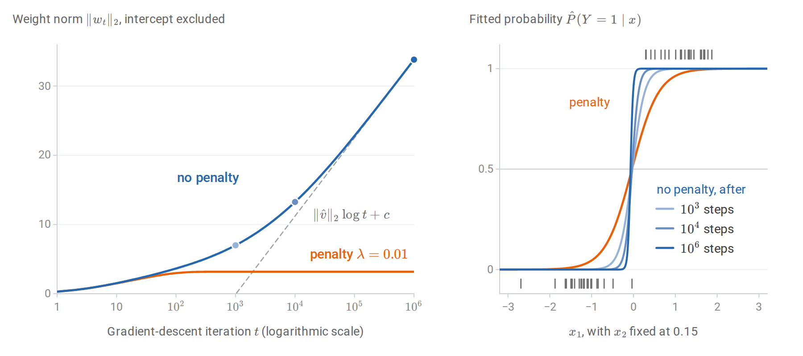

*Gradient descent with step 0.5 on 50 linearly separable points. Left: without a penalty the weight norm grows without bound; after a transient it grows like $`\lVert\hat v\rVert_2\log t`$ (dashed), where $`\hat v`$ is the maximum-margin vector described below. A small $`\ell_2`$ penalty gives a finite minimizer, which gradient descent reaches within about 1,200 steps. Right: without a penalty the fitted probability curve steepens toward a step function; the ticks mark the training inputs of class 1 (top) and class 0 (bottom).*

The direction of the diverging weights is not arbitrary. On separable data, gradient descent on the logistic loss converges *in direction* to the maximum-margin separator of the hard-margin support vector machine ([Soudry et al., 2018](https://jmlr.org/papers/v19/18-188.html)). More precisely, let $`\hat v`$ be the shortest vector with $`\tilde y_i\hat v^\top x_i\ge1`$ for every $`i`$. Then, for almost every data set, the iterates satisfy $`w_t=\hat v\log t+\rho_t`$ with $`\rho_t`$ bounded, so $`\lVert w_t\rVert_2`$ grows like $`\lVert\hat v\rVert_2\log t`$, while the direction of $`w_t`$ approaches that of $`\hat v`$ only at the rate $`1/\log t`$.

Because the intercept is absorbed into $`w`$, the margin is that of the augmented inputs $`(1,x_i)`$, and $`\lVert\hat v\rVert_2`$ includes the intercept like any other coefficient; the usual support vector machine leaves the intercept out of the norm, so its separator can differ slightly. In the run of the figure, the norm grows by 4.79 per unit of $`\log t`$ between $`10^5`$ and $`10^6`$ steps, close to $`\lVert\hat v\rVert_2=4.92`$, and after a million steps the direction is still $`3.6^\circ`$ away from that of $`\hat v`$.

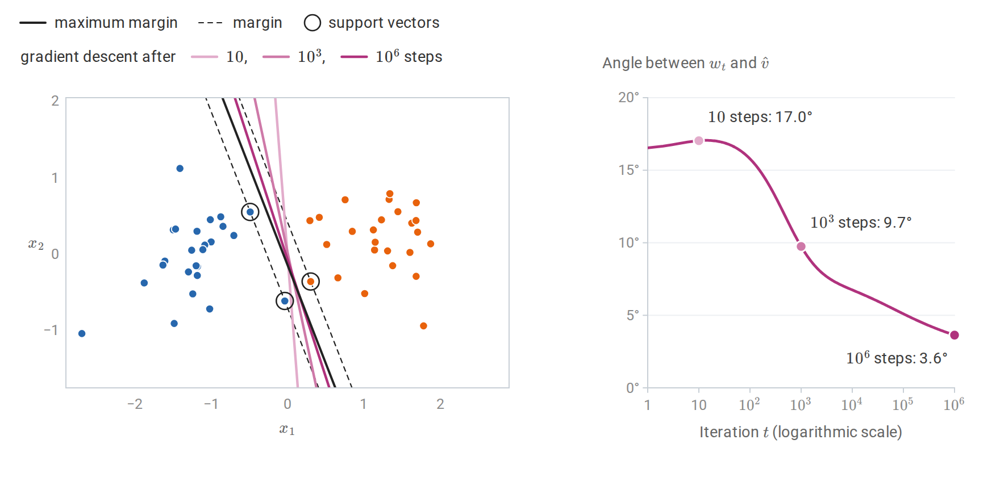

*The run without a penalty from the previous figure, compared with the maximum-margin separator $`\hat v^\top(1,x)=0`$, whose three support vectors lie on the margin lines $`\hat v^\top(1,x)=\pm1`$. Left: the separators $`w_t^\top(1,x)=0`$ turn toward it as $`t`$ grows. Right: the angle between $`w_t`$ and $`\hat v`$ falls only slowly, like $`1/\log t`$.*

An unregularized algorithm can therefore have an implicit preference among the many separators, a phenomenon that recurs in the analysis of overparameterized neural networks.

## <a id="regularized-logistic-regression"></a>Regularized logistic regression

### <a id="the-penalized-objective"></a>The penalized objective

Adding a penalty restores a unique finite solution and controls variance:

$$
\min_{w,b}\ \frac1n\sum_{i=1}^n\ell\bigl(\tilde y_i,w^\top x_i+b\bigr)+\frac\lambda2\|w\|_2^2,
\qquad\lambda>0.
$$

The objective is $`\lambda`$-strongly convex in $`w`$, so the minimizer exists and is unique even for separable data, provided both classes occur in the sample: the intercept is not penalized, and with a single class it alone would diverge ([Appendix B](#block-logreg-appendix-b)). Because one $`\lambda`$ multiplies every coefficient, the features should be standardized so that they are treated comparably. The estimate is the MAP estimate under the Gaussian prior $`w\sim\mathcal N\bigl(0,(n\lambda)^{-1}I\bigr)`$, as for ridge regression: multiplying the objective by $`n`$ makes the penalty $`\frac{n\lambda}2\|w\|_2^2`$, the negative log prior up to a constant (Posterior means and MAP estimates). scikit-learn parameterizes the same problem as $`C\sum_i\ell_i+\frac12\|w\|^2`$, so $`C=1/(n\lambda)`$: a small $`C`$ means strong regularization.

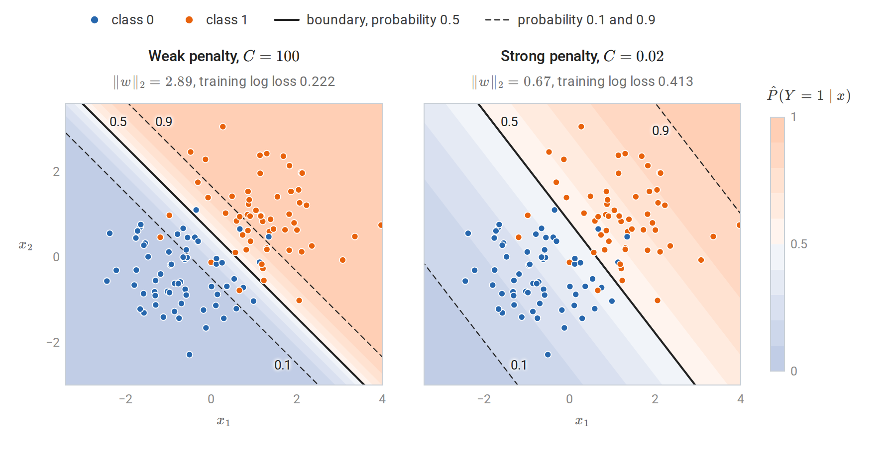

*Fitted probability contours for weak ($`C=100`$) and strong ($`C=0.02`$) penalties on the same 120 points, which correspond to $`\lambda\approx8\times10^{-5}`$ and $`\lambda\approx0.42`$. The decision boundary, the $`0.5`$ contour, barely moves: it turns by about $`7^\circ`$, and the two rules disagree on one training point. The penalty mainly shrinks the weights, so the band between the $`0.1`$ and $`0.9`$ contours, whose width is $`2\log9/\lVert w\rVert_2`$, widens from 1.5 to 6.6 units. Strong regularization therefore changes the predicted probabilities much more than the predicted labels.*

An $`\ell_1`$ penalty $`\lambda\|w\|_1`$ produces sparse coefficients, as in the lasso, and is solved by coordinate descent or proximal gradient methods. The elastic net combines the two. Strong convexity also makes the fitted rule stable under replacement of one observation, which yields the generalization bound for regularized logistic regression derived in Information and Learning Theory. When every coefficient is penalized, the intercept included, and every augmented input has norm at most $`r_x`$, the expected difference between the population and the training log loss of the fitted rule is at most $`2r_x^2/(\lambda n)`$.

## <a id="multiclass-logistic-regression"></a>Multiclass logistic regression

### <a id="the-softmax-model"></a>The softmax model

For $`K`$ classes, give each class a weight vector $`w_k`$ and intercept $`b_k`$, and set

$$
P(Y=k\mid x)=\frac{\exp(s_k)}{\sum_{j=1}^K\exp(s_j)},\qquad s_k=w_k^\top x+b_k.
$$

This is **multinomial logistic regression**, or **softmax regression**. Adding the same vector to every $`w_k`$, and the same number to every $`b_k`$, adds the same amount to every logit $`s_k`$ and leaves all probabilities unchanged; the same invariance is what makes the softmax stable to compute. The parameters are therefore identifiable only up to such shifts. Fixing one class's parameters at zero resolves this and shows that the log-odds of any class against the reference class are linear. With an $`\ell_2`$ penalty on the weights, their ambiguity is resolved automatically: among all shifted versions, the penalty is smallest when the weight vectors sum to zero. Unpenalized intercepts still need a convention, such as summing to zero. For $`K=2`$ the model reduces to binary logistic regression, with weight vector $`w_1-w_2`$ and intercept $`b_1-b_2`$ for class 1 against class 2.

With one-hot targets $`Y\in\{0,1\}^{n\times K}`$, whose row $`i`$ has its single one in the column of the observed class $`y_i`$, and predicted probabilities $`P\in[0,1]^{n\times K}`$, whose row $`p_i^\top`$ holds the $`K`$ probabilities for $`x_i`$, the negative log-likelihood is the cross-entropy $`-\sum_i\sum_kY_{ik}\log P_{ik}`$. Its gradient with respect to the weight matrix $`W\in\mathbb R^{K\times(d+1)}`$, whose rows are the $`w_k^\top`$ with the intercepts absorbed as before (this $`W`$ is not the IRLS weight matrix), is

$$
\nabla_W\mathcal L=(P-Y)^\top X.
$$

The per-example gradient with respect to the logits is $`p_i-e_{y_i}`$, where $`e_{y_i}`$ is the one-hot vector of the observed class, as derived in Numerical Computing. The logits of example $`i`$ are $`Wx_i`$, so the chain rule gives the contribution $`(p_i-e_{y_i})x_i^\top`$, and summing over the examples gives $`(P-Y)^\top X`$. The loss is convex because the log-sum-exp function is convex; its Hessian with respect to the logits is $`\operatorname{diag}(p)-pp^\top`$ per example, from Calculus and Optimization, Appendix B. The softmax output layer of a neural network classifier is this model applied to learned features.

**One-versus-rest** logistic regression instead fits $`K`$ binary models, class $`k`$ against all others, and predicts the class with the largest score. Its probabilities need not sum to one, and its classes do not compete during fitting; scikit-learn's one-versus-rest option rescales the probabilities to sum to one before reporting them. The multinomial model is usually preferable when probabilities matter. One-versus-rest does worst when a class lies between others, so that no single hyperplane separates it from the rest.

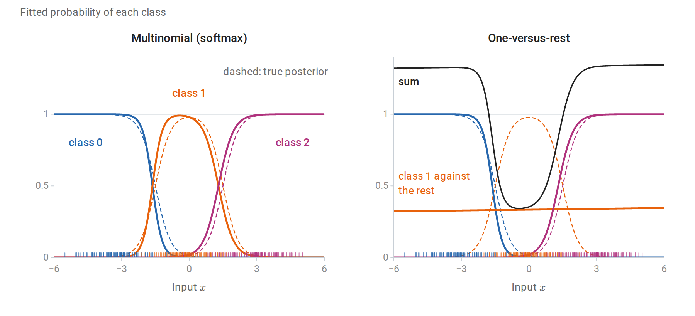

*Three equally likely classes, $`\mathcal N(-3,1)`$, $`\mathcal N(0,1)`$, and $`\mathcal N(3,1)`$, with 100 training points each (ticks). The multinomial model follows the true posterior probabilities (dashed) closely. No threshold on $`x`$ separates the middle class from the other two, so its one-versus-rest model is nearly flat at about $`1/3`$, and over the range shown the three one-versus-rest probabilities sum to anything from 0.34 to 1.35. Even after they are rescaled to sum to one, their population log loss is 0.372, against 0.244 for the multinomial model and 0.222 for the true posterior.*

## <a id="generative-and-discriminative-estimation-compared"></a>Generative and discriminative estimation compared

### <a id="same-form-different-estimates"></a>Same form, different estimates

LDA and logistic regression both produce posterior log-odds of the form $`w^\top x+b`$. LDA estimates $`w=\Sigma^{-1}(\mu_1-\mu_0)`$ from class means and a pooled covariance, maximizing the joint likelihood. Logistic regression chooses $`w`$ to maximize the conditional likelihood of the labels. When the classes really are Gaussian with a shared covariance, both are consistent for the same boundary, and LDA is more efficient because it also extracts information from the inputs' distribution ([Efron, 1975](https://www.tandfonline.com/doi/abs/10.1080/01621459.1975.10480319)). When they are not, LDA's estimate converges to a boundary determined by moments that may be irrelevant to classification, while logistic regression converges to the best linear log-odds model in the sense of expected log loss. This is the general target of maximum likelihood under misspecification: the member of the model closest to the true conditional law in Kullback–Leibler divergence (When the model is only an approximation).

Robustness differs as well. LDA's means and covariance are influenced by every observation, including correctly classified outliers far from the boundary. In logistic regression, a point far on the correct side has probability near its label, so its residual $`p_i-y_i`$ is nearly zero and it contributes almost nothing to the gradient.

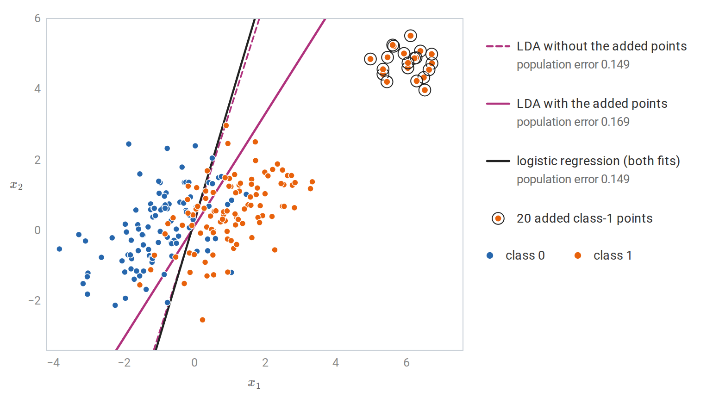

*Two Gaussian classes with a shared covariance and 100 training points each, and 20 further class-1 points far on the correct side of the boundary. The added points move LDA's class-1 mean and inflate its pooled covariance, so its boundary turns away from the Bayes boundary; without them, LDA and logistic regression both attain the Bayes error to three decimals. Their fitted logistic probabilities exceed 0.9996, so they barely enter the score equations, and the logistic boundary is the same, to three decimals, with or without them.*

### <a id="learning-curves"></a>Learning curves

[Ng and Jordan (2001)](https://proceedings.neurips.cc/paper/2001/hash/7b7a53e239400a13bd6be6c91c4f6c4e-Abstract.html) compared naive Bayes with logistic regression. Their analysis, summarized in chapter 4, shows that naive Bayes approaches its own asymptotic error with a number of examples logarithmic in the number of features, whereas logistic regression can need a number linear in it, but reaches an asymptotic error at least as low. The following experiment reproduces the phenomenon with 80 binary features: 40 independent features whose probabilities differ modestly between the classes, plus five exact copies of eight of them. The copies violate the naive Bayes assumption, since naive Bayes counts their evidence six times.

The true log-odds are linear in the 40 original features, so logistic regression is correctly specified here, and its error can approach the Bayes error, $`0.165`$. Naive Bayes instead converges to $`0.245`$, the error of its own rule with the true feature probabilities, because even with unlimited data it counts the copied evidence six times. The chapter script computes both limits exactly.

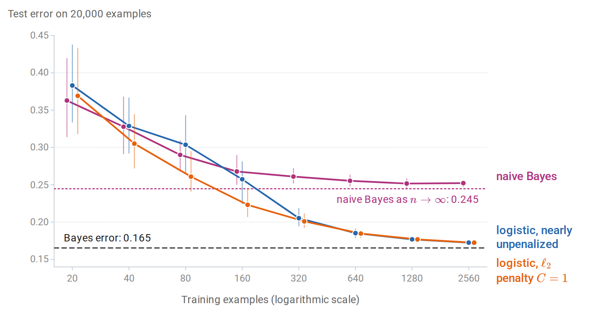

*Test error against training-set size, averaged over 40 training samples and measured on 20,000 test examples; the whiskers span the 10th to 90th percentiles over the samples. Naive Bayes levels off quickly at about 0.25. Nearly unpenalized logistic regression is worse up to 80 examples but then keeps improving toward the Bayes error. With an $`\ell_2`$ penalty, logistic regression is worse than naive Bayes only at 20 examples, and there only slightly (0.369 against 0.363): regularization supplies the small-sample stability that the generative assumptions supplied.*

The comparison illustrates a general principle rather than a fixed ranking. Strong assumptions help with little data and hurt once there is enough data to estimate a less restricted model. A penalty is an alternative way of adding bias, and it can be tuned to the sample size.

## <a id="from-probabilities-to-decisions"></a>From probabilities to decisions

A predicted probability is not yet a decision. With false-positive cost $`c_{\mathrm{FP}}`$ and false-negative cost $`c_{\mathrm{FN}}`$, the expected cost is minimized by predicting class 1 when

$$
\hat P(Y=1\mid x)\ge\frac{c_{\mathrm{FP}}}{c_{\mathrm{FP}}+c_{\mathrm{FN}}},
$$

a result derived in Decisions, loss, and risk. The threshold $`1/2`$ is appropriate only for equal costs. Separating estimation from decision has a practical advantage: one fitted model serves any cost structure, and the threshold can be chosen after fitting. This requires the probabilities to be accurate, which is the subject of the next section.

Class imbalance is often handled by weighting the rare class more heavily during training, or by resampling. For logistic regression with an intercept, weighting class 1 by a factor $`c`$ shifts the fitted log-odds by approximately $`\log c`$, which is equivalent to changing the class prior. In the population, the weighting replaces $`\eta(x)`$ by $`c\eta(x)/\bigl(c\eta(x)+1-\eta(x)\bigr)`$, whose log-odds are those of $`\eta(x)`$ plus $`\log c`$; a correctly specified model absorbs this shift exactly in its intercept, and a misspecified one approximately. The resulting scores rank the examples in much the same way but are no longer calibrated probabilities for the original population. When calibrated probabilities are needed, it is usually better to train on the natural distribution and move the threshold. Evaluation metrics for imbalanced problems, such as precision and recall and ROC curves, are in chapter 6.

## <a id="calibration"></a>Calibration

### <a id="what-calibrated-probabilities-are"></a>What calibrated probabilities are

A probabilistic classifier $`\hat p(x)`$ is **calibrated** if

$$
P\bigl(Y=1\mid\hat p(X)=q\bigr)=q\qquad\text{for every }q.
$$

Among all inputs assigned probability $`0.8`$, eighty percent should belong to class 1. Calibration is a property of the predictions, not of the classifier's ranking. A classifier can rank examples perfectly and be badly calibrated, as naive Bayes often is; conversely, the constant prediction $`\hat p(x)=P(Y=1)`$ is perfectly calibrated and useless for ranking. Good probabilistic prediction needs both calibration and **discrimination**, the ability to separate the classes.

A **reliability diagram** bins the predictions and plots the observed frequency of class 1 against the average prediction in each bin, as in the [figure below](#recalibration). Points on the diagonal indicate calibration. The **expected calibration error** summarizes the diagram as

$$
\operatorname{ECE}=\sum_{b=1}^B\frac{n_b}{n}\bigl\lvert\bar y_b-\bar p_b\bigr\rvert,
$$

where bin $`b`$ contains $`n_b`$ predictions with average $`\bar p_b`$ and observed frequency $`\bar y_b`$. The ECE depends on the binning and can be zero for a useless classifier, so it is a diagnostic rather than an objective.

### <a id="proper-scoring-rules"></a>Proper scoring rules

The log loss and the **Brier score** $`(\hat p-y)^2`$ evaluate probabilities directly. Both are **strictly proper**: if the label is $`\operatorname{Bernoulli}(q)`$, the expected score is uniquely minimized by predicting $`\hat p=q`$. For the Brier score this follows from

$$
\mathbb E(\hat p-Y)^2=(\hat p-q)^2+q(1-q),
$$

and for log loss from Gibbs' inequality; [Appendix A](#block-logreg-appendix-a) gives both arguments. A proper score rewards honest probabilities: no distortion of one's beliefs can improve the expected score. Classification accuracy is not strictly proper, since any prediction on the correct side of $`1/2`$ scores equally well.

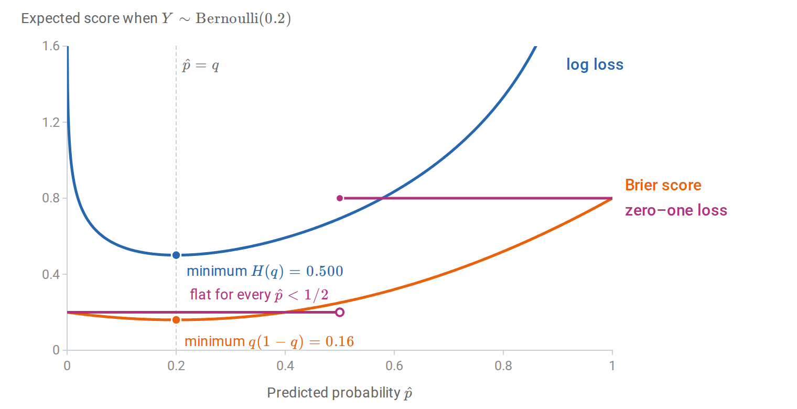

*Expected scores of a prediction $`\hat p`$ when the label is $`\operatorname{Bernoulli}(0.2)`$. The log loss and the Brier score are uniquely minimized by the honest prediction $`\hat p=0.2`$. The zero–one loss of the decision $`\mathbf 1\{\hat p\ge1/2\}`$ is the same for every prediction below $`1/2`$, so it cannot reward a more accurate probability.*

Averaged over inputs, the Brier score separates into calibration and discrimination terms, the decomposition of [Murphy (1973)](https://journals.ametsoc.org/view/journals/apme/12/4/1520-0450_1973_012_0595_anvpot_2_0_co_2.xml) stated in [Appendix A](#block-logreg-appendix-a). [Gneiting and Raftery (2007)](https://www.tandfonline.com/doi/abs/10.1198/016214506000001437) develop the general theory of proper scoring rules.

Logistic regression minimizes empirical log loss, a proper score, over its model class. When the model is approximately correct and the sample is large relative to $`d`$, its probabilities are therefore approximately calibrated. Methods that optimize other criteria have no such tendency. [Niculescu-Mizil and Caruana (2005)](https://dl.acm.org/doi/10.1145/1102351.1102430) documented systematic patterns: naive Bayes pushes probabilities toward $`0`$ and $`1`$, while support vector machine and boosted-tree scores are pushed away from the extremes.

### <a id="recalibration"></a>Recalibration

A poorly calibrated classifier can often be repaired by learning a monotone map from its scores to probabilities, using data not used to fit the classifier.

- **Platt scaling** fits a one-feature logistic regression, $`\hat p_{\text{new}}=\sigma(a\,s+c)`$, where $`s`$ is the classifier's score or log-odds ([Platt, 1999](https://www.semanticscholar.org/paper/Probabilistic-Outputs-for-Support-vector-Machines-Platt/42e5ed832d4310ce4378c44d05570439df28a393)). It has two parameters and works well when the distortion is sigmoid-shaped.
- **Isotonic regression** fits a nondecreasing step function from scores to probabilities by minimizing squared error ([Zadrozny and Elkan, 2002](https://dl.acm.org/doi/10.1145/775047.775151)). It can correct any monotone distortion but needs more calibration data and can overfit small samples.
- **Temperature scaling** divides multiclass logits by one fitted scalar $`T>0`$ before the softmax. It is the multiclass analogue of Platt scaling without an intercept and is widely used for neural networks ([Guo et al., 2017](https://arxiv.org/abs/1706.04599)).

Platt scaling with a positive slope and temperature scaling are strictly increasing maps, so they leave the ranking of examples and the ROC curve unchanged. Isotonic regression is only nondecreasing: it merges nearby scores into ties, which coarsens the ranking and can change the ROC curve slightly. In the example below, it maps the naive Bayes probabilities to 94 distinct values and lowers the area under the ROC curve from 0.9109 to 0.9107. A monotone map can still change accuracy at a fixed threshold, since the threshold's position among the scores moves. Temperature scaling is the exception for multiclass accuracy: dividing all logits by the same $`T`$ leaves the most probable class unchanged.

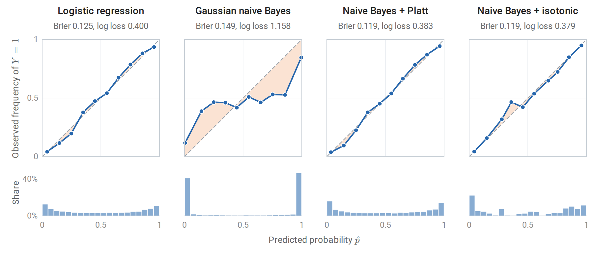

*Reliability diagrams (top) and histograms of predicted probabilities (bottom) on 10,000 test examples of a synthetic problem in which ten of twenty features are linear combinations of two informative ones; the shading between each curve and the diagonal shows the miscalibration. Logistic regression is close to the diagonal. Gaussian naive Bayes places four in five predictions below 0.01 or above 0.99 and is badly overconfident. Platt scaling and isotonic regression, each fitted on a separate calibration sample of 10,000 examples, restore calibration and lower both the Brier score and the log loss below those of logistic regression, because naive Bayes separates the classes slightly better here: the area under its ROC curve is 0.911, against 0.902 for logistic regression.*

```python
import numpy as np
from sklearn.datasets import make_classification
from sklearn.linear_model import LogisticRegression
from sklearn.naive_bayes import GaussianNB

X, y = make_classification(n_samples=30000, n_features=20, n_informative=2, n_redundant=10,
                           n_clusters_per_class=1, class_sep=1.0, flip_y=0.05, random_state=4)
fit, cal, test = slice(0, 10000), slice(10000, 20000), slice(20000, 30000)
nb = GaussianNB().fit(X[fit], y[fit])

def logit(p):
    p = np.clip(p, 1e-12, 1 - 1e-12)
    return np.log(p / (1 - p))

# Platt scaling: a one-feature logistic regression on the classifier's log-odds,
# fitted on a separate calibration sample.
platt = LogisticRegression(C=1e6).fit(logit(nb.predict_proba(X[cal])[:, 1])[:, None], y[cal])

def ece(p, y, bins=10):
    """Expected calibration error: bin-weighted |mean prediction - observed frequency|."""
    idx = np.minimum((p * bins).astype(int), bins - 1)
    return sum(np.mean(idx == b) * abs(p[idx == b].mean() - y[idx == b].mean())
               for b in range(bins) if np.any(idx == b))

p_nb = nb.predict_proba(X[test])[:, 1]
p_platt = platt.predict_proba(logit(p_nb)[:, None])[:, 1]
a, b = platt.coef_[0, 0], platt.intercept_[0]
print(f"Platt map: logit(p_new) = {a:.3f} * logit(p_nb) {b:+.3f}")
for name, p in [("naive Bayes", p_nb), ("after Platt scaling", p_platt)]:
    brier = np.mean((p - y[test]) ** 2)
    acc = np.mean((p > 0.5) == y[test])
    print(f"{name:>20}: accuracy {acc:.3f}, Brier {brier:.3f}, ECE {ece(p, y[test]):.3f}")
# Platt map: logit(p_new) = 0.161 * logit(p_nb) -0.116
#          naive Bayes: accuracy 0.832, Brier 0.149, ECE 0.138
#  after Platt scaling: accuracy 0.832, Brier 0.119, ECE 0.016
```

The fitted slope $`0.161`$ says that the naive Bayes log-odds are about six times too large, in line with the redundant features that it counts repeatedly. Dividing the log-odds by six leaves the accuracy unchanged and reduces the calibration error by almost an order of magnitude. Strictly, the fitted map also has an intercept, which moves the decision threshold from a naive Bayes log-odds of $`0`$ to $`0.72`$. That changes 174 of the 10,000 test predictions, all close to the boundary, and leaves the accuracy the same to three decimals.

The helper `logit` clips probabilities at $`10^{-12}`$, which truncates log-odds beyond $`\pm27.6`$; about an eighth of the naive Bayes log-odds lie beyond that. The figures use the exact log-odds, the difference of the two outputs of `predict_log_proba`, for which the Platt slope is $`0.157`$.

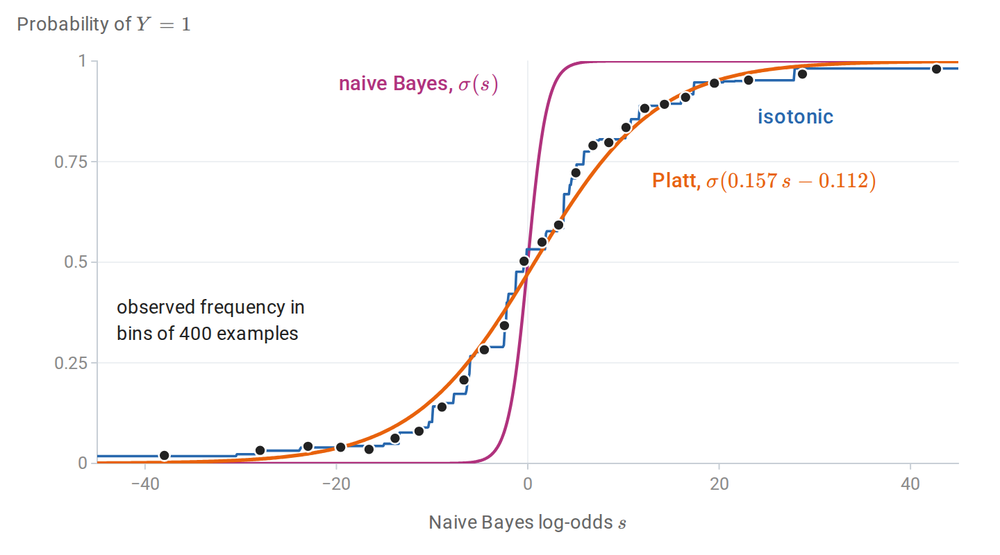

*The naive Bayes classifier of the previous figure as a map from its log-odds $`s`$ to a probability. Its own probability $`\sigma(s)`$ rises from $`0`$ to $`1`$ within a few units of $`s`$, whereas the observed frequency of class 1 in the calibration sample rises over tens of units. The Platt map divides the log-odds by about 6.4; the isotonic map follows the same frequencies as a step function without assuming a shape.*

## <a id="appendices"></a>Appendices


<details>
<summary><a id="block-logreg-appendix-a"></a><b>A. Strict propriety of the log and Brier scores</b></summary>

Let $`Y\sim\operatorname{Bernoulli}(q)`$ and consider a prediction $`p\in(0,1)`$.

**Brier score.** Expanding $`\mathbb E(p-Y)^2=p^2-2pq+q`$ and completing the square gives $`(p-q)^2+q(1-q)`$. The second term does not depend on $`p`$, and the first is uniquely minimized at $`p=q`$.

**Log score.** The expected log loss is

$$
-q\log p-(1-q)\log(1-p)=H(q)+D_{\mathrm{KL}}\bigl(\operatorname{Bernoulli}(q)\,\Vert\,\operatorname{Bernoulli}(p)\bigr),
$$

the binary case of the cross-entropy decomposition, with $`H(q)=-q\log q-(1-q)\log(1-q)`$ the entropy of the label. By Gibbs' inequality, the divergence is zero only at $`p=q`$.

For a classifier and an input distribution, the population score is the expectation of these conditional scores over $`X`$. Its minimizer over all functions is the true conditional probability $`\eta(x)`$. Within a restricted model class, minimizing a proper score finds the member closest to $`\eta`$ in the corresponding sense: squared distance for the Brier score and conditional KL divergence for the log score.

**Accuracy is not strictly proper.** The expected zero–one loss of the decision $`\mathbf 1\{p\ge1/2\}`$ equals $`\min\{q,1-q\}`$ for every $`p`$ on the same side of $`1/2`$ as $`q`$. Any such $`p`$ is optimal, so accuracy cannot distinguish a calibrated probability from an overconfident one.

**Murphy's decomposition of the Brier score.** Suppose the predictions take finitely many values, or have been grouped into bins as in a reliability diagram, and each prediction is replaced by its bin average. Bin $`b`$ holds $`n_b`$ of the $`n`$ predictions, with common value $`\bar p_b`$ and observed frequency $`\bar y_b`$, and $`\bar y`$ is the overall frequency of class 1. Within bin $`b`$, the identity above with $`q=\bar y_b`$ gives $`\sum_{i\in b}(\bar p_b-y_i)^2=n_b\bigl[(\bar p_b-\bar y_b)^2+\bar y_b(1-\bar y_b)\bigr]`$. The variance of the labels splits into within-bin and between-bin parts, $`\bar y(1-\bar y)=\sum_b\frac{n_b}n\bar y_b(1-\bar y_b)+\sum_b\frac{n_b}n(\bar y_b-\bar y)^2`$. Combining the two,

$$
\frac1n\sum_{i=1}^n(\hat p_i-y_i)^2
=\underbrace{\sum_b\frac{n_b}n(\bar p_b-\bar y_b)^2}_{\text{reliability}}
-\underbrace{\sum_b\frac{n_b}n(\bar y_b-\bar y)^2}_{\text{resolution}}
+\underbrace{\bar y(1-\bar y)}_{\text{uncertainty}}.
$$

The reliability term is a squared version of the expected calibration error and vanishes for calibrated predictions. The resolution term rewards predictions that sort the examples into groups whose frequencies differ from the base rate, which is discrimination. The uncertainty term depends only on the labels.

</details>


<details>
<summary><a id="block-logreg-appendix-b"></a><b>B. The loss along a separating direction</b></summary>

Let $`\tilde y_iw^\top x_i\ge\gamma>0`$ for all $`i`$, with the intercept included in $`w`$ and $`x_i`$. For $`c>0`$,

$$
\mathcal L(cw)=\sum_{i=1}^n\log\bigl(1+e^{-c\,\tilde y_iw^\top x_i}\bigr)\le n\log\bigl(1+e^{-c\gamma}\bigr)\le ne^{-c\gamma},
$$

which tends to zero. Every term is strictly positive for every finite parameter, so $`\mathcal L>0`$ everywhere, and the infimum $`0`$ is not attained. Adding $`\frac\lambda2\|w\|^2`$ with $`\lambda>0`$ makes the objective coercive, since it tends to infinity as $`\|w\|\to\infty`$, so a minimizer exists by the existence theorem for continuous coercive functions; strong convexity makes it unique.

**Quasi-complete separation.** Let $`v\ne0`$ satisfy $`\tilde y_iv^\top x_i\ge0`$ for every $`i`$. If $`X`$ has full column rank, at least one of these inequalities is strict, since otherwise $`Xv=0`$. For any parameter $`w`$ and $`c>0`$, each term of $`\mathcal L(w+cv)`$ is no larger than the corresponding term of $`\mathcal L(w)`$, and the terms with $`\tilde y_iv^\top x_i>0`$ are strictly smaller. Hence $`\mathcal L(w+cv)<\mathcal L(w)`$, and no $`w`$ is a minimizer. As $`c\to\infty`$, the terms with positive margin along $`v`$ vanish, and the loss decreases to the loss of the remaining examples, which is positive.

**An unpenalized intercept.** In the main text the intercept $`b`$ is kept out of the penalty. Suppose $`\|(w,b)\|\to\infty`$. If $`\|w\|\to\infty`$ along a subsequence, the penalty tends to infinity. Otherwise $`w`$ stays bounded and $`\lvert b\rvert\to\infty`$; if both classes occur in the sample, some example then has margin $`\tilde y_i(w^\top x_i+b)\to-\infty`$, and its loss tends to infinity. The objective is therefore coercive, and a minimizer exists. It is unique because the objective is strictly convex: along a direction $`(u,\beta)\ne0`$ its second derivative is $`\sum_ip_i(1-p_i)(u^\top x_i+\beta)^2+\lambda\|u\|^2`$, which is positive if $`u\ne0`$, and equals $`\beta^2\sum_ip_i(1-p_i)>0`$ if $`u=0`$. If only one class occurs, the loss decreases steadily as $`b`$ moves toward that class, and no minimizer exists.

Suppose instead that the classes **overlap**: no nonzero $`v`$ satisfies $`\tilde y_iv^\top x_i\ge0`$ for every $`i`$, which excludes both complete and quasi-complete separation. Then every direction $`v\ne0`$ has some example with $`\tilde y_iv^\top x_i<0`$, whose loss grows linearly along $`cv`$. By continuity and compactness of the unit sphere, the objective is coercive without a penalty, so the maximum likelihood estimate exists; with $`X`$ of full column rank it is unique. This is the characterization of Albert and Anderson.

</details>

---

[← 4. Generative Classifiers](04-generative-classifiers.md) · [6. Losses, Model Selection, and Evaluation →](06-losses-model-selection-and-evaluation.md)
