[Background Notes](../README.md) › [Machine Learning](README.md)

# 6. Losses, Model Selection, and Evaluation

[← 5. Logistic Regression and Probabilistic Prediction](05-logistic-regression-and-probabilistic-prediction.md) · [7. Statistical Learning Theory →](07-statistical-learning-theory.md)

## <a id="losses-and-what-they-estimate"></a>Losses and what they estimate

### <a id="empirical-risk-minimization-with-a-surrogate"></a>Empirical risk minimization with a surrogate

Most methods in this module fit a predictor by **regularized empirical risk minimization**,

```math
\hat f\in\operatorname*{arg\,min}_{f\in\mathcal F}\ \frac1n\sum_{i=1}^n\ell\bigl(y_i,f(x_i)\bigr)+\lambda J(f),
```

with a loss $`\ell`$, a model class $`\mathcal F`$, and a penalty $`J`$. The first term is the empirical risk $`\widehat R_n(f)`$ of [chapter 1](01-learning-problems-and-nearest-neighbors.md#data-rules-and-risk). The penalty $`J(f)`$ measures the complexity of $`f`$, for example a squared norm of its coefficients, and the weight $`\lambda\ge0`$ sets how much that complexity costs. [Information and Learning Theory](../foundations/05-information-and-learning-theory.md#regularization-and-the-comparison-class) explains why the penalty belongs to the fitting criterion rather than to the loss by which predictions are finally judged.

The loss used for fitting need not be that final criterion either. Classification is judged by the zero–one loss, which is discontinuous and computationally intractable to minimize ([chapter 2](02-the-perceptron-and-linear-separation.md#why-not-minimize-the-number-of-mistakes-directly)). Classifiers are therefore fitted with convex **surrogate losses** on a real-valued **score** $`f(x)`$, whose sign is the predicted label. The formal ERM framework and its generalization guarantees are in [Information and Learning Theory](../foundations/05-information-and-learning-theory.md#learning-a-rule-from-a-sample); this section asks what a surrogate's minimizer actually estimates.

### <a id="margin-losses-for-classification"></a>Margin losses for classification

With labels $`y\in\{-1,+1\}`$ and a score $`f(x)`$, each common classification loss is a function $`\phi(z)`$ of the **margin** $`z=yf(x)`$. The margin is positive exactly when the sign of the score agrees with the label, and its size measures how confidently it does so; [Information and Learning Theory](../foundations/05-information-and-learning-theory.md#norm-bounds-for-linear-scores) uses the same notion for margin bounds. In this notation the zero–one loss is $`\mathbf 1\{z\le0\}`$, which counts a zero score as an error.

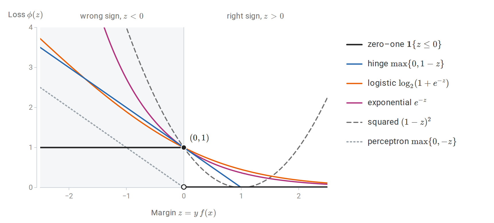

*The zero–one loss and five surrogates as functions of the margin. The logistic loss is drawn in base 2 so that, like the hinge, exponential, and squared losses, it passes through $`(0,1)`$ and never falls below the zero–one loss. The perceptron loss vanishes at $`z=0`$ and does not bound the zero–one loss.*

To see what a loss estimates, minimize its conditional risk at a single input. Write $`\eta(x)=P(Y=+1\mid X=x)`$, the class probability of chapter 1 with the label $`1`$ now coded as $`+1`$. At an input where $`\eta(x)=\eta`$, a score $`a`$ produces the margin $`a`$ with probability $`\eta`$ and the margin $`-a`$ with probability $`1-\eta`$, so its conditional risk is

```math
C_\eta(a)=\eta\,\phi(a)+(1-\eta)\,\phi(-a).
```

Minimizing over $`a`$, separately at every input, gives the population-optimal score $`f^\ast(x)`$, which minimizes the surrogate risk $`R_\phi(f)=\mathbb E\,\phi\bigl(Yf(X)\bigr)`$ over all functions. For a differentiable loss the minimizer solves $`C_\eta'(a)=0`$. For the logistic loss this equation is $`-\eta\,\sigma(-a)+(1-\eta)\,\sigma(a)=0`$, where $`\sigma(t)=1/(1+e^{-t})`$ is the logistic function, so $`\sigma(a)=\eta`$. The other rows follow in the same way:

| Loss $`\phi(z)`$ | Optimal score $`f^\ast(x)`$ | Recovers probabilities? |
| --- | --- | --- |
| Logistic $`\log(1+e^{-z})`$ | $`\log\dfrac{\eta(x)}{1-\eta(x)}`$ | Yes, $`\eta=\sigma(f^\ast)`$ |
| Exponential $`e^{-z}`$ | $`\tfrac12\log\dfrac{\eta(x)}{1-\eta(x)}`$ | Yes, $`\eta=\sigma(2f^\ast)`$ |
| Squared $`(1-z)^2`$ | $`2\eta(x)-1`$ | Yes, $`\eta=(1+f^\ast)/2`$, but $`f^\ast`$ is not constrained to $`[-1,1]`$ in fitting |
| Hinge $`\max\{0,1-z\}`$ | $`\operatorname{sign}\bigl(2\eta(x)-1\bigr)`$ | No; only the sign |
| Perceptron $`\max\{0,-z\}`$ | $`0`$ for every $`\eta`$ | No; the minimizer is degenerate |

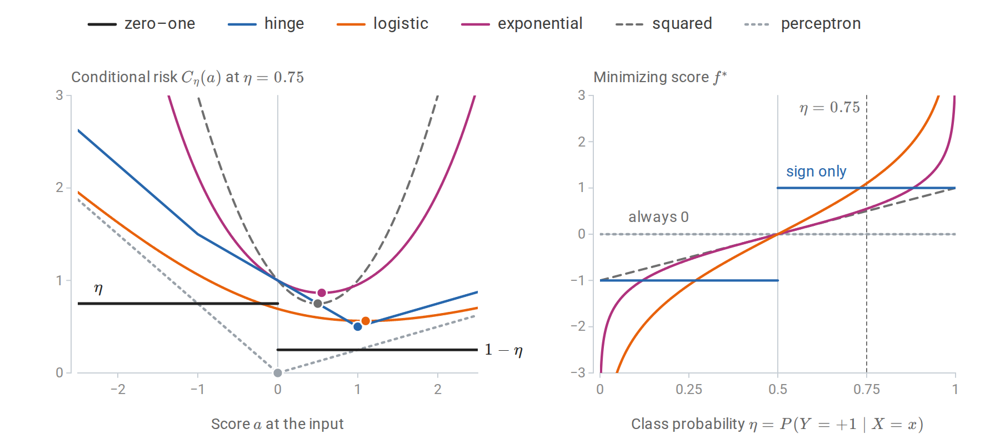

*Left: the conditional risk of each loss at an input with $`\eta=0.75`$, with its minimizers marked. The zero–one risk is minimized by every positive score, the hinge risk at its kink $`a=1`$, the logistic risk at $`\log3\approx1.10`$, and the perceptron risk only at $`a=0`$. Right: the minimizing score as a function of $`\eta`$. The logistic and exponential scores are increasing functions of $`\eta`$ and the squared-loss score is linear in it, so all three can be inverted to recover $`\eta`$. The hinge score keeps only the side of $`1/2`$, and the perceptron score is zero everywhere.*

For the hinge loss, $`C_\eta(a)`$ is piecewise linear with kinks at $`a=\pm1`$. Between the kinks it equals $`1+(1-2\eta)a`$, and outside them it grows, so it is minimized at $`a=1`$ when $`\eta>1/2`$ and at $`a=-1`$ when $`\eta<1/2`$. The hinge loss therefore targets the Bayes decision directly and discards all information about $`\eta`$ beyond its side of $`1/2`$. This is why support vector machine scores must be recalibrated before they are used as probabilities ([chapter 5](05-logistic-regression-and-probabilistic-prediction.md#recalibration)).

A minimal requirement on a surrogate is that minimizing it gets the sign right. A loss is **classification-calibrated** if, for every $`\eta\ne1/2`$, scores of the wrong sign cannot come arbitrarily close to the smallest conditional risk:

```math
\inf_{a:\,a(2\eta-1)\le0}C_\eta(a)>\inf_aC_\eta(a).
```

When the minimum is attained, this says that every minimizer of the conditional risk has the sign of $`2\eta-1`$. For convex $`\phi`$ there is a simple test ([Bartlett, Jordan, and McAuliffe, 2006](https://www.tandfonline.com/doi/abs/10.1198/016214505000000907)): $`\phi`$ is classification-calibrated exactly when it is differentiable at $`0`$ with $`\phi'(0)<0`$. The logistic, exponential, squared, and hinge losses pass; the perceptron loss, with a kink at $`0`$, fails. The same paper shows that calibration yields an explicit inequality

```math
\psi\bigl(R(f)-R^*\bigr)\le R_\phi(f)-R_\phi^*
```

between the excess zero–one risk and the excess surrogate risk, for a nondecreasing function $`\psi`$ with $`\psi(0)=0`$. Here $`R(f)`$ is the zero–one risk of the classifier $`\operatorname{sign}f`$, $`R^\ast`$ is the Bayes risk, and $`R_\phi^\ast`$ is the smallest surrogate risk over all measurable scores. For the hinge loss $`\psi(\theta)=\lvert\theta\rvert`$; for the squared loss $`\psi(\theta)=\theta^2`$; for the exponential loss $`\psi(\theta)=1-\sqrt{1-\theta^2}`$, which behaves like $`\theta^2/2`$ near zero. With the squared loss, for instance, an excess surrogate risk of $`0.01`$ guarantees an excess classification error of at most $`0.1`$. Driving the surrogate risk to its minimum over a sufficiently rich class therefore drives the classification error to the Bayes error. Consistency of surrogate minimization is also analyzed by [Zhang (2004)](https://www.semanticscholar.org/paper/Statistical-behavior-and-consistency-of-methods-on-Zhang/7678da8b2eb70a5383f203d948564d8f48c0c62a).

The shapes matter beyond calibration. Losses that grow quickly for negative margins, especially the exponential loss, give large influence to mislabeled points and outliers. The squared loss also penalizes large *positive* margins, so a correctly classified point far from the boundary can pull the fitted boundary toward itself. Bounded or slowly growing losses are more robust, but they are usually nonconvex.

### <a id="losses-for-regression"></a>Losses for regression

The same exercise for real-valued targets minimizes $`\mathbb E[\ell(Y,a)\mid X=x]`$ over the prediction $`a`$. Writing $`r=y-a`$ for the residual, it gives:

| Loss $`\ell(y,a)`$ | Population minimizer $`a^\ast(x)`$ |
| --- | --- |
| Squared error $`(y-a)^2`$ | Conditional mean $`\mathbb E[Y\mid X=x]`$ |
| Absolute error $`\lvert y-a\rvert`$ | A conditional median |
| Pinball $`\max\{\tau(y-a),(\tau-1)(y-a)\}`$ | A conditional $`\tau`$-quantile |
| Huber: $`\tfrac12r^2`$ for $`\lvert r\rvert\le\delta`$, $`\delta(\lvert r\rvert-\tfrac\delta2)`$ otherwise | A robust location between mean and median |

The first two rows are the Bayes predictors of chapter 1, and [Probability and Statistics](../foundations/04-probability-and-statistics.md#decisions-loss-and-risk) proves the first. For the pinball loss with a continuous conditional law, the derivative of the expected loss in $`a`$ is $`P(Y<a\mid X=x)-\tau`$, which vanishes at the $`\tau`$-quantile.

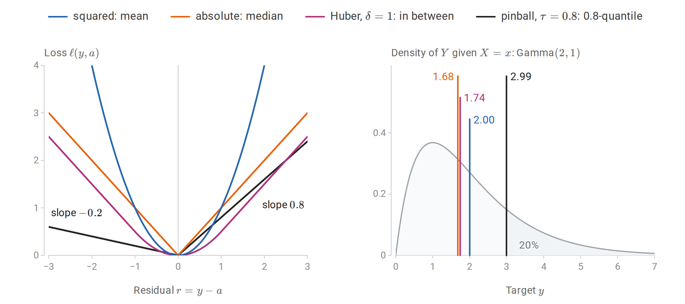

*Left: the four losses as functions of the residual; the pinball loss with $`\tau=0.8`$ charges an underprediction four times as much as an overprediction of the same size. Right: a right-skewed conditional law with the prediction that minimizes each expected loss. The median and the Huber location lie close together, the mean is pulled toward the long right tail, and the 0.8-quantile leaves the shaded 20% of the probability above it.*

The **pinball loss** is the basis of quantile regression: fitting the $`0.1`$ and $`0.9`$ quantiles gives an 80% prediction band without assuming Gaussian errors. The **Huber loss** is quadratic near zero and linear in the tails, so a few gross errors do not dominate the fit. The choice of loss is therefore part of the definition of the prediction problem. A model fitted to minimize absolute error should be evaluated by absolute error, and a model fitted by squared error estimates a mean, which may be a poor summary of a skewed target.

## <a id="the-biasvariance-decomposition"></a>The bias–variance decomposition

### <a id="decomposing-expected-squared-error"></a>Decomposing expected squared error

Consider regression with $`Y=m(X)+\varepsilon`$, where $`\mathbb E[\varepsilon\mid X]=0`$ and $`\operatorname{Var}(\varepsilon\mid X=x)=\sigma^2(x)`$. Let $`\hat f_D`$ be fitted on a random training sample $`D`$ and evaluated at a fixed input $`x`$ against a fresh target $`Y`$, independent of $`D`$. Write $`\bar f(x)=\mathbb E_D\hat f_D(x)`$ for the average fit at $`x`$ over training samples; it is a fixed function, not something computed from one sample. Then

```math
\boxed{
\mathbb E_{D,Y}\bigl[(Y-\hat f_D(x))^2\bigr]
=\underbrace{\sigma^2(x)}_{\text{noise}}
+\underbrace{\bigl(\bar f(x)-m(x)\bigr)^2}_{\text{squared bias}}
+\underbrace{\mathbb E_D\bigl[(\hat f_D(x)-\bar f(x))^2\bigr]}_{\text{variance}}.
}
```

To prove it, write $`Y-\hat f_D(x)=\varepsilon+(m(x)-\bar f(x))+(\bar f(x)-\hat f_D(x))`$ and expand the square. The three squared terms give the three components, and the three cross terms vanish: $`\varepsilon=Y-m(x)`$ has mean zero and is independent of $`D`$, $`m(x)-\bar f(x)`$ is a constant, and $`\hat f_D(x)-\bar f(x)`$ has mean zero over $`D`$. Averaging over $`X`$ gives the decomposition of the expected test error. The last two terms are the decomposition of mean squared error into squared bias and variance from [Probability and Statistics](../foundations/04-probability-and-statistics.md#bias-variance-and-mean-squared-error), applied to $`\hat f_D(x)`$ as an estimator of the number $`m(x)`$.

The three terms have different sources. **Noise** is a property of the problem and bounds the achievable error from below. **Bias** measures how far the average fitted function, over hypothetical training samples, is from the truth; it reflects the method's inductive bias. **Variance** measures how much the fitted function changes from one training sample to another. Flexible methods have low bias and high variance; rigid methods have the reverse. The $`k`$-NN decomposition of [chapter 1](01-learning-problems-and-nearest-neighbors.md#bias-and-variance-at-a-point) and the ridge analysis of [chapter 3](03-linear-regression-and-regularization.md#bias-variance-and-why-shrinkage-can-help) are instances.

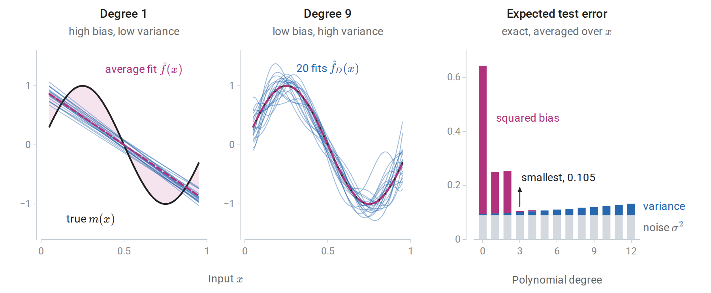

*Polynomial least squares on 25 equally spaced inputs with $`m(x)=\sin(2\pi x)`$ and noise standard deviation $`0.3`$. Left and center: fits to 20 independent noise draws, and the average fit $`\bar f`$, computed exactly; the shading between $`\bar f`$ and $`m`$ is the bias. The degree-1 fits agree with each other and are all wrong in the same way; the degree-9 fits are right on average and disagree with each other. Right: the exact noise, variance, and squared bias for each degree, averaged over evaluation inputs in $`[0.05,0.95]`$. The expected error is smallest at degree 3.*

The squared bias falls in steps of two degrees. Write the polynomials in powers of $`x-1/2`$, so that the even powers are symmetric about $`x=1/2`$ and the odd powers antisymmetric. The target $`\sin(2\pi x)`$ is antisymmetric about $`x=1/2`$ and the inputs are placed symmetrically around it, so on these inputs the target is orthogonal to every even power, and the even powers contribute nothing to the average fit. Raising the degree from odd to even therefore adds variance without reducing bias.

For classification with the zero–one loss, no additive decomposition of this kind holds: increasing variance can *decrease* error at inputs where the average classifier is wrong. Several generalized decompositions exist, but the qualitative lesson carries over: averaging many high-variance classifiers can reduce their error. Bagging and random forests ([chapter 10](10-bagging-and-random-forests.md)) exploit this directly.

### <a id="beyond-the-classical-u-shape"></a>Beyond the classical U-shape

The U-shaped test-error curve assumes that flexibility is measured by something like a parameter count that stays below the sample size. When a model can interpolate the training data, the picture changes. For least squares with $`p`$ features and $`n`$ observations, the fit interpolates once $`p\ge n`$. For $`p>n`$, infinitely many coefficient vectors fit the data exactly, and the minimum-norm one, $`\hat\beta=X^+y`$ with the [pseudoinverse](../foundations/02-linear-algebra.md#moore-penrose-pseudoinverse) $`X^+`$, is a natural choice, since it is what gradient descent from zero converges to ([Appendix B](#block-select-appendix-b)).

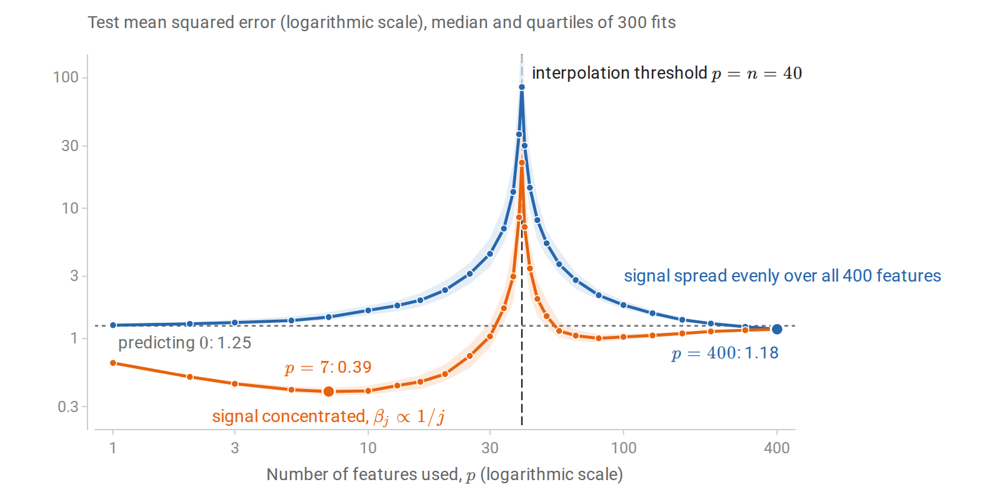

*Test error of least squares using the first $`p`$ of 400 Gaussian features, with $`n=40`$ observations, noise standard deviation $`0.5`$, and $`\|\beta\|=1`$. For each $`p`$, the exact risk of 300 fitted models was computed; lines show the medians and bands the middle half. Error explodes at the interpolation threshold, where the design matrix is square and badly conditioned, and falls again as $`p`$ grows further. When the signal is spread over all features, every model with $`p<n`$ does worse than predicting zero, and only the most overparameterized fits, from about $`p=300`$ on, beat them all. When the signal is concentrated in the first few features, the classical optimum remains best.*

This **double descent** was documented across model classes by [Belkin, Hsu, Ma, and Mandal (2019)](https://www.pnas.org/doi/abs/10.1073/pnas.1903070116) and analyzed exactly for linear models by [Hastie, Montanari, Rosset, and Tibshirani (2022)](https://arxiv.org/abs/1903.08560). The peak is a variance phenomenon: near $`p=n`$, fitting noise exactly requires enormous coefficients. For the Gaussian features of the figure the expected risk has a closed form ([Belkin, Hsu, and Xu, 2020](https://arxiv.org/abs/1903.07571)), derived in [Appendix C](#block-select-appendix-c). Let $`\beta_{1:p}`$ be the coefficients of the features used, and let $`s^2=\|\beta_{p+1:d}\|^2+\sigma^2`$ be the variance of everything the model cannot fit, the omitted signal plus the noise, where $`d=400`$ is the total number of features. Then

```math
\mathbb E\,R(\hat\beta)=
\begin{cases}
s^2\,\dfrac{n-1}{n-p-1}, & p\le n-2,\\[1.5ex]
\Bigl(1-\dfrac np\Bigr)\|\beta_{1:p}\|^2+s^2\Bigl(1+\dfrac n{p-n-1}\Bigr), & p\ge n+2,
\end{cases}
```

and the expectation is infinite for $`n-1\le p\le n+1`$. Both variance factors blow up at the threshold. Beyond it, the factor $`n/(p-n-1)`$ decreases because the minimum-norm solution spreads the noise over many coordinates, so the minimum-norm constraint acts as an implicit regularizer. For the spread signal at $`p=400`$ the formula gives $`1.178`$, close to the simulated median $`1.177`$ and below the risk $`1.25`$ of predicting zero. For the concentrated signal the best model uses $`p=7`$ features and has median risk $`0.392`$, far below anything the overparameterized fits achieve. The bias–variance decomposition still holds; what fails is the assumption that the number of parameters is the right measure of flexibility. An explicit ridge penalty chosen by cross-validation removes the peak. These phenomena are central to understanding overparameterized neural networks in the DL module.

## <a id="estimating-prediction-error"></a>Estimating prediction error

### <a id="why-training-error-is-optimistic"></a>Why training error is optimistic

The training error of a fitted model underestimates its error on new data, because the model was chosen to fit those observations. For squared loss this can be quantified. Suppose $`y_i=\mu_i+\varepsilon_i`$, where $`\mu_i`$ is the mean response at the $`i`$th input and the noise terms are independent with mean zero and variance $`\sigma^2`$. Let $`\hat y=\hat y(y)`$ be any vector of fitted values computed from the responses, and consider new responses $`y'_i=\mu_i+\varepsilon'_i`$ at the **same inputs**, with fresh noise. Then

```math
\mathbb E\Bigl[\frac1n\sum_i(y'_i-\hat y_i)^2\Bigr]
-\mathbb E\Bigl[\frac1n\sum_i(y_i-\hat y_i)^2\Bigr]
=\frac2n\sum_{i=1}^n\operatorname{Cov}(\hat y_i,y_i).
```

The first expectation is the **in-sample prediction error**, and the difference is the **optimism** of the training error. It is large when each fitted value depends strongly on its own response. The proof, in [Appendix A](#block-select-appendix-a), needs only the expansion of two squares. This motivates the general definition of **effective degrees of freedom**,

```math
\operatorname{df}=\frac1{\sigma^2}\sum_{i=1}^n\operatorname{Cov}(\hat y_i,y_i),
```

so that the optimism is $`2\sigma^2\operatorname{df}/n`$. For a linear smoother $`\hat y=Sy`$, whose matrix $`S`$ does not depend on $`y`$, the covariance is $`\sigma^2S_{ii}`$ and $`\operatorname{df}=\operatorname{tr}S`$. This is the number of coefficients for least squares, $`\sum_j\sigma_j^2/(\sigma_j^2+\lambda)`$ for ridge, where $`\sigma_j`$ are the singular values of the design matrix ([chapter 3](03-linear-regression-and-regularization.md#effective-degrees-of-freedom)), and $`n/k`$ for $`k`$-NN regression with fixed neighborhoods, where each fitted value gives weight $`1/k`$ to its own response. [Chapter 3](03-linear-regression-and-regularization.md#model-size-training-error-and-test-error) verifies the least-squares case by simulation, and [Efron (2004)](https://www.tandfonline.com/doi/abs/10.1198/016214504000000692) develops this covariance-penalty view.

### <a id="analytic-criteria"></a>Analytic criteria

Adding an estimate of the optimism to the training error gives **Mallows' $`C_p`$**,

```math
C_p=\frac1n\sum_i(y_i-\hat y_i)^2+\frac{2\operatorname{df}}n\hat\sigma^2,
```

an unbiased estimate of in-sample prediction error when $`\hat\sigma^2`$ is unbiased. The noise variance is usually estimated from the residuals of a large model with little bias. In the polynomial example of the bias–variance section, $`\operatorname{df}`$ is the degree plus one, so each added coefficient raises the optimism by $`2\sigma^2/n=0.0072`$.

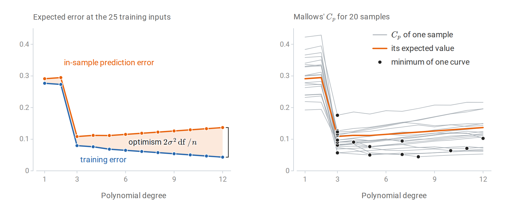

*The polynomial example of the bias–variance figure, evaluated at its 25 training inputs. Left: the expected training error and the expected in-sample prediction error, computed exactly; their gap grows linearly with the number of coefficients. Right: $`C_p`$ for 20 samples, each with $`\hat\sigma^2`$ from its own degree-12 fit. The curves scatter around the in-sample prediction error, which is their expected value, and so do their minima: over 2,000 samples, $`C_p`$ chooses degree 3 in 55% of them, degree 5 in 16%, and degree 6 or higher in 22%.*

For models fitted by maximum likelihood with $`k`$ parameters and maximized likelihood $`\hat L`$ ([Probability and Statistics](../foundations/04-probability-and-statistics.md#likelihood-and-maximum-likelihood)),

```math
\operatorname{AIC}=-2\log\hat L+2k,\qquad \operatorname{BIC}=-2\log\hat L+k\log n.
```

AIC estimates expected out-of-sample [log loss](../foundations/05-information-and-learning-theory.md#cross-entropy-divergence-and-log-loss), up to constants: its penalty $`2k`$ approximates the optimism of the training value $`-2\log\hat L`$, as $`2\operatorname{df}\hat\sigma^2`$ does for the residual sum of squares in $`C_p`$. It coincides with $`C_p`$ for Gaussian regression with known variance. BIC approximates $`-2`$ times the log marginal likelihood of a model by a Laplace approximation ([Probability and Statistics](../foundations/04-probability-and-statistics.md#computing-with-an-intractable-posterior)), and it penalizes complexity more heavily once $`n\ge8`$, where $`\log n>2`$. The two criteria answer different questions. When the true model is among the candidates, BIC selects it with probability tending to one; AIC instead tends to choose the model with the best predictive accuracy, and it may overfit in the sense of including unnecessary terms. Both require a parameter count or degrees-of-freedom estimate, and both are derived under the assumption that the fitted model family is approximately correct.

### <a id="held-out-validation"></a>Held-out validation

The most direct estimate of prediction error evaluates the fitted model on observations not used for fitting. With $`n_{\mathrm{val}}`$ held-out examples and a misclassification rate near $`q`$, the estimate has standard error $`\sqrt{q(1-q)/n_{\mathrm{val}}}`$: about $`0.0095`$ for $`q=0.1`$ and $`n_{\mathrm{val}}=1000`$. The fixed-model concentration bound of [Hoeffding's inequality](../foundations/04-probability-and-statistics.md#bounds-with-explicit-assumptions) applies because the model is fixed conditional on the training data, as [Information and Learning Theory](../foundations/05-information-and-learning-theory.md#what-the-guarantees-say-about-evaluation) explains.

The standard protocol splits the data three ways. The **training set** fits parameters; the **validation set** selects hyperparameters and makes other modeling decisions; the **test set** is used once, at the end, to estimate the performance of the final procedure. A test set consulted repeatedly during development becomes a validation set, and its error becomes optimistic for the same reason as training error. The roles are described in [Terminology and Mathematical Language](../foundations/01-terminology-and-mathematical-language.md#training-validation-and-test-data).

### <a id="cross-validation"></a>Cross-validation

Holding out data wastes it, and a single split gives a noisy estimate. **$`K`$-fold cross-validation** partitions the data into $`K`$ folds of nearly equal size. For each fold $`k`$, the procedure is fitted on the other $`K-1`$ folds, giving the model $`\hat f^{(-k)}`$, and evaluated on fold $`k`$; the $`K`$ error estimates are averaged:

```math
\operatorname{CV}_K=\frac1n\sum_{k=1}^K\sum_{i\in\text{fold }k}\ell\bigl(y_i,\hat f^{(-k)}(x_i)\bigr).
```

Every observation is used once for evaluation and $`K-1`$ times for fitting. Common choices are $`K=5`$ or $`10`$. With $`K=n`$, the procedure is **leave-one-out cross-validation** (LOOCV).

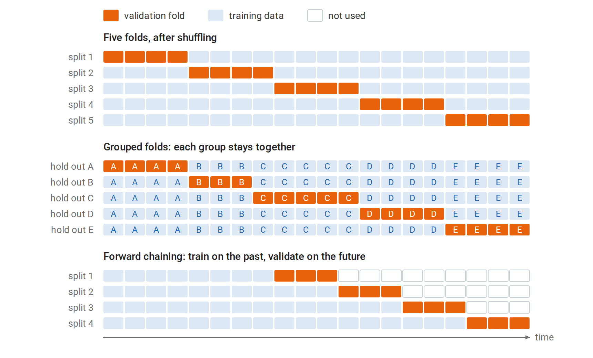

*Each row is one fit on 20 observations. In five-fold cross-validation every observation is validated exactly once and used for fitting four times. Grouped folds hold out whole groups, such as all the visits of one patient, so the folds can differ in size. Forward chaining validates each fit only on observations later than all of its training data, and the training set grows from one split to the next.*

The choice of $`K`$ trades bias against variance and cost. Each fit uses a fraction $`(K-1)/K`$ of the data, so when the learning curve is still falling, CV slightly overestimates the error of a model fitted on all $`n`$ observations; this bias shrinks as $`K`$ grows. LOOCV is nearly unbiased but can have high variance, because its $`n`$ training sets are almost identical, and it requires $`n`$ fits unless a shortcut exists.

**A shortcut for linear smoothers.** Suppose the fitted values are $`\hat y=Sy`$ and deleting observation $`i`$ amounts to refitting the same smoother on the remaining data, as for least squares and ridge regression. The diagonal entry $`S_{ii}`$, the **leverage** of observation $`i`$, measures how strongly $`\hat y_i`$ depends on $`y_i`$. Then

```math
\operatorname{LOOCV}=\frac1n\sum_{i=1}^n\Bigl(\frac{y_i-\hat y_i}{1-S_{ii}}\Bigr)^2.
```

A single fit suffices. **Generalized cross-validation** replaces each $`S_{ii}`$ by its average $`\operatorname{tr}(S)/n=\operatorname{df}/n`$. The derivation, by the [Sherman–Morrison formula](../foundations/02-linear-algebra.md#woodbury-and-sherman-morrison), is in [Appendix A](#block-select-appendix-a); [Probability and Statistics](../foundations/04-probability-and-statistics.md#leverage-residuals-and-influence) uses the same deletion formula for least-squares influence diagnostics.

```python
import numpy as np
from sklearn.datasets import load_diabetes

X, y = load_diabetes(return_X_y=True)
X = (X - X.mean(0)) / X.std(0)                       # (standardizing inside each fold would
y = y - y.mean()                                      #  be stricter; see the leakage section)
n, lam = len(y), 30.0

H = X @ np.linalg.solve(X.T @ X + lam * np.eye(X.shape[1]), X.T)   # ridge hat matrix
resid = y - H @ y
loo_shortcut = np.mean((resid / (1 - np.diag(H))) ** 2)
gcv = np.mean(resid ** 2) / (1 - np.trace(H) / n) ** 2

loo_brute = 0.0
for i in range(n):                                    # refit n times, leaving one out
    keep = np.arange(n) != i
    w = np.linalg.solve(X[keep].T @ X[keep] + lam * np.eye(X.shape[1]), X[keep].T @ y[keep])
    loo_brute += (y[i] - X[i] @ w) ** 2 / n

print(f"leave-one-out by refitting: {loo_brute:.2f}")
print(f"leave-one-out shortcut:     {loo_shortcut:.2f}")
print(f"generalized CV:             {gcv:.2f}")
print(f"training MSE:               {np.mean(resid ** 2):.2f}")
# leave-one-out by refitting: 2988.39
# leave-one-out shortcut:     2988.39
# generalized CV:             2990.79
# training MSE:               2883.15
```

The 442 refits and the single-fit shortcut agree to the printed precision, and generalized cross-validation differs from both by less than 0.1%. All three exceed the training error by about 3.7%, close to the factor $`1+2\operatorname{df}/n`$ that the covariance formula suggests for a ridge fit with $`8.0`$ effective degrees of freedom on 442 observations.

**What cross-validation estimates.** CV averages over fits to different training sets, so it estimates the expected error of the *procedure* at sample size about $`n(K-1)/K`$, rather than the error of the particular model fitted to all the data. [Bates, Hastie, and Tibshirani (2023)](https://arxiv.org/abs/2104.00673) show that this is exactly what the usual CV point estimate targets for linear models. They also show that the naive standard error, the standard deviation of the fold errors divided by $`\sqrt K`$, can substantially understate its uncertainty because the folds share training data, and they propose nested cross-validation for honest intervals.

**Respect the structure of the data.** The folds must mimic the relation between training data and future data, as the lower rows of the figure above show. **Stratified** folds keep class proportions stable, which matters for rare classes. **Grouped** folds keep all observations from one patient, user, or document together; otherwise the model is evaluated on the same individuals it was trained on. **Time-ordered** data require training on the past and validating on the future, with forward-chaining splits; random folds would let the model use future information.

## <a id="selecting-models-and-hyperparameters"></a>Selecting models and hyperparameters

### <a id="choosing-by-estimated-risk"></a>Choosing by estimated risk

A hyperparameter such as $`k`$ in $`k`$-NN, $`\lambda`$ in ridge regression, or tree depth is chosen by estimating the risk for each candidate and taking the best. The estimated risk curve is noisy near its minimum, so the **one-standard-error rule** instead chooses the simplest model whose estimated risk is within one standard error of the minimum. With $`K`$-fold cross-validation, that standard error is usually the naive one, the standard deviation of the $`K`$ fold errors divided by $`\sqrt K`$. The rule favors parsimony when the data cannot distinguish the candidates.

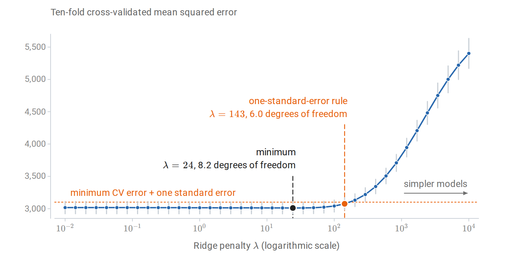

*Ten-fold cross-validation for ridge regression on the diabetes data, with standardization fitted inside each training fold. Bars show one standard error across folds. The curve is nearly flat for small penalties, and the one-standard-error rule selects a penalty about six times larger than the minimizer, with about two fewer effective degrees of freedom.*

When there are several hyperparameters, exhaustive grids grow exponentially. **Random search** samples configurations at random and, when only a few hyperparameters matter, explores each important one more finely than a grid with the same budget ([Bergstra and Bengio, 2012](https://jmlr.org/papers/v13/bergstra12a.html)). Sequential methods such as Bayesian optimization, built on the Gaussian processes of [chapter 15](15-gaussian-processes.md), choose the next configuration using the results so far.

### <a id="selection-bias-and-nested-cross-validation"></a>Selection bias and nested cross-validation

The minimum of many noisy risk estimates is biased downward, just as the minimum training error over a class is ([From concentration to generalization](../foundations/05-information-and-learning-theory.md#from-concentration-to-generalization)) and as the smallest of many p-values is ([Multiple comparisons and selection](../foundations/04-probability-and-statistics.md#multiple-comparisons-and-selection)). The CV error of the selected configuration is therefore an optimistic estimate of the selected model's error. **Nested cross-validation** wraps the entire selection procedure in an outer loop: each outer training set runs its own inner CV to choose hyperparameters, and the chosen model is evaluated on the outer fold it never saw ([Cawley and Talbot, 2010](https://www.jmlr.org/papers/v11/cawley10a.html)).

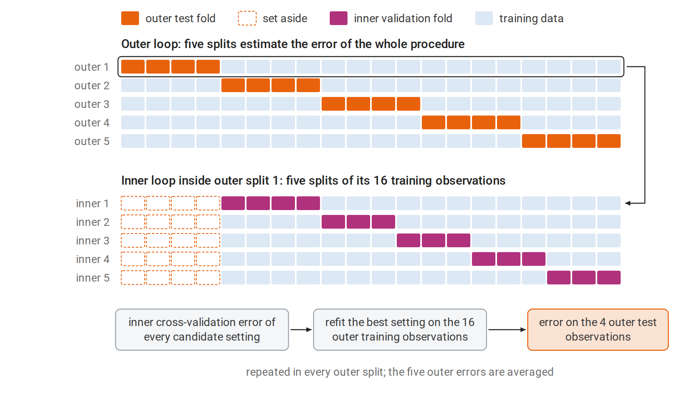

*Nested cross-validation with five outer and five inner splits, as in the code below, drawn for 20 observations. The inner loop sees only the training part of its outer split, so the outer test fold plays no part in choosing the setting. Each outer error therefore scores the complete procedure, selection included, on data it has not seen.*

```python
import numpy as np
from sklearn.model_selection import GridSearchCV, StratifiedKFold, cross_val_score
from sklearn.svm import SVC

rng = np.random.default_rng(1)
X = rng.normal(size=(80, 20))
y = rng.integers(0, 2, 80)                           # pure noise: true accuracy is 0.5
grid = {"C": np.logspace(-2, 3, 12), "gamma": np.logspace(-4, 1, 12)}
inner = StratifiedKFold(5, shuffle=True, random_state=0)
outer = StratifiedKFold(5, shuffle=True, random_state=1)

search = GridSearchCV(SVC(), grid, cv=inner).fit(X, y)
nested = cross_val_score(GridSearchCV(SVC(), grid, cv=inner), X, y, cv=outer)
print(f"best of 144 settings, non-nested CV accuracy: {search.best_score_:.2f}")
print(f"nested CV accuracy of the whole procedure:    {nested.mean():.2f}")
# best of 144 settings, non-nested CV accuracy: 0.60
# nested CV accuracy of the whole procedure:    0.44
```

The labels are random, so no classifier can exceed 50% accuracy on new data. The best of 144 support vector machine settings nonetheless shows 60% cross-validated accuracy, while the nested estimate is consistent with chance. With 80 examples, both numbers have standard errors of about $`\sqrt{0.25/80}\approx0.056`$.

### <a id="early-stopping-as-regularization"></a>Early stopping as regularization

Iterative fitting introduces another hyperparameter: the number of iterations. Stopping gradient descent before convergence, at the point of lowest validation error, is **early stopping**. Consider least squares started from zero with step size $`\eta`$ (unrelated to the class probability $`\eta(x)`$ of the first section). Write the singular value decomposition of the design matrix as $`X=U\Sigma V^\top`$, with left singular vectors $`u_j`$ and singular values $`\sigma_j`$ ([Linear Algebra](../foundations/02-linear-algebra.md#svd-and-the-geometry-of-a-linear-map)). The fitted values after $`t`$ steps are then a spectral filter, like those of ridge regression:

```math
X\beta_t=\sum_ju_j\bigl[1-(1-\eta\sigma_j^2)^t\bigr]u_j^\top y
\qquad\text{versus}\qquad
X\hat\beta_\lambda=\sum_ju_j\frac{\sigma_j^2}{\sigma_j^2+\lambda}u_j^\top y.
```

For a step size $`\eta\le1/\sigma_1^2`$, where $`\sigma_1`$ is the largest singular value, both keep a fraction between zero and one of each component $`u_j^\top y`$ of the response. Directions with large singular values are fitted within a few steps; directions with small ones only after many. Stopping early leaves the small-variance directions shrunk, much as a penalty with $`\lambda\approx1/(\eta t)`$ would. The derivation is in [Appendix B](#block-select-appendix-b).

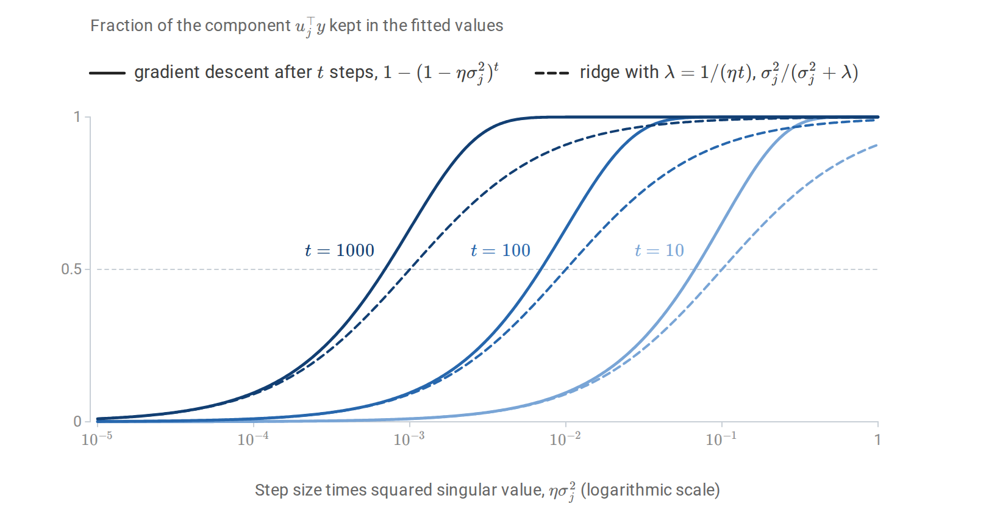

*The fraction of each component $`u_j^\top y`$ that gradient descent keeps after $`t`$ steps, and that ridge regression keeps with $`\lambda=1/(\eta t)`$, as functions of $`\eta\sigma_j^2`$. Both filters pass directions with large singular values and suppress those with small ones, and the transition moves toward smaller singular values as $`t`$ grows. The gradient-descent filter reaches one half at $`\eta\sigma_j^2\approx\log2/t`$, a factor $`\log2\approx0.69`$ below the ridge filter, and its transition is sharper.*

Early stopping is the default regularizer for boosting ([chapter 11](11-boosting.md)) and for neural networks.

## <a id="leakage-and-the-fitting-pipeline"></a>Leakage and the fitting pipeline

### <a id="every-data-dependent-step-belongs-inside-the-loop"></a>Every data-dependent step belongs inside the loop

**Data leakage** occurs when information unavailable at prediction time, or information from the evaluation data, influences the fitted model ([Kaufman et al., 2012](https://dl.acm.org/doi/10.1145/2382577.2382579)). The subtlest form arises inside cross-validation. Any step that uses the data to make a choice, such as standardizing features, imputing missing values, selecting features, choosing a basis, or tuning a threshold, is part of the fitting procedure. It must be repeated inside each training fold, using only that fold's data.

The following example, adapted from [*The Elements of Statistical Learning*, §7.10.2](https://hastie.su.domains/ElemStatLearn/), selects 20 of 5,000 pure-noise features by their association with random labels.

```python
import numpy as np
from sklearn.feature_selection import SelectKBest, f_classif
from sklearn.model_selection import cross_val_score, StratifiedKFold
from sklearn.neighbors import KNeighborsClassifier
from sklearn.pipeline import make_pipeline

rng = np.random.default_rng(0)
n, d = 50, 5000
X = rng.normal(size=(n, d))
y = np.repeat([0, 1], n // 2)                        # labels unrelated to X
cv = StratifiedKFold(5, shuffle=True, random_state=0)

# Wrong: choose the 20 features most associated with y using ALL the data, then cross-validate.
X_sel = SelectKBest(f_classif, k=20).fit_transform(X, y)
wrong = cross_val_score(KNeighborsClassifier(5), X_sel, y, cv=cv).mean()

# Right: selection is part of the procedure, so it is repeated inside every training fold.
pipe = make_pipeline(SelectKBest(f_classif, k=20), KNeighborsClassifier(5))
right = cross_val_score(pipe, X, y, cv=cv).mean()
print(f"selection outside CV: accuracy {wrong:.2f}")
print(f"selection inside CV:  accuracy {right:.2f}   (chance = 0.50)")
# selection outside CV: accuracy 0.94
# selection inside CV:  accuracy 0.52   (chance = 0.50)
```

Selecting features on all the data lets the held-out labels choose the features, and cross-validation then reports 94% accuracy on noise. The figure below shows that this is not a fluke of one dataset. Composing preprocessing and model into one estimator, a [scikit-learn pipeline](https://scikit-learn.org/stable/common_pitfalls.html), makes the correct procedure the default. Standardization using all the data leaks far less information, but it is still a departure from the procedure that will be deployed.

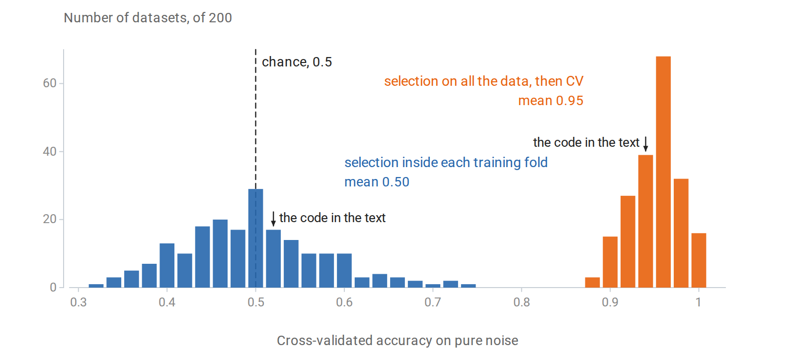

*The experiment of the code repeated on 200 independent pure-noise datasets, with the same folds. Selecting features on all the data gives cross-validated accuracies between 0.88 and 1 on every dataset. Repeating the selection inside each training fold gives estimates centered on chance, spread from 0.32 to 0.74 because each rests on only 50 observations.*

Other common forms of leakage are features recorded after the outcome, such as a treatment given because of the diagnosis being predicted; duplicated or near-duplicated examples split across training and test sets; and random splits of time-ordered or grouped data. Suspiciously good performance is often the first sign of one of them.

## <a id="measuring-classification-performance"></a>Measuring classification performance

### <a id="confusion-matrices-and-threshold-dependent-metrics"></a>Confusion matrices and threshold-dependent metrics

For a binary classifier at a fixed threshold, the **confusion matrix** counts true positives (TP), false positives (FP), true negatives (TN), and false negatives (FN). Common summaries are:

| Metric | Definition | Question answered |
| --- | --- | --- |
| Accuracy | $`(\mathrm{TP}+\mathrm{TN})/n`$ | What fraction of predictions are correct? |
| Recall, sensitivity, true-positive rate | $`\mathrm{TP}/(\mathrm{TP}+\mathrm{FN})`$ | What fraction of actual positives are found? |
| Specificity, true-negative rate | $`\mathrm{TN}/(\mathrm{TN}+\mathrm{FP})`$ | What fraction of actual negatives are cleared? |
| False-positive rate | $`\mathrm{FP}/(\mathrm{FP}+\mathrm{TN})`$ | What fraction of negatives are flagged? |
| Precision, positive predictive value | $`\mathrm{TP}/(\mathrm{TP}+\mathrm{FP})`$ | What fraction of flagged cases are positive? |
| $`F_1`$ | $`2\cdot\text{precision}\cdot\text{recall}/(\text{precision}+\text{recall})`$ | Harmonic mean of precision and recall |
| Balanced accuracy | $`(\text{recall}+\text{specificity})/2`$ | Accuracy with the classes weighted equally |

With imbalanced classes, accuracy can be misleading: predicting "negative" for everything achieves 99% accuracy when 1% of cases are positive. Recall and specificity are conditional on the true class and do not depend on prevalence. Precision conditions on the prediction and depends strongly on prevalence, by Bayes' rule. In the spam-filter example of [Conditioning and dependence](../foundations/04-probability-and-statistics.md#conditioning-and-dependence), a filter with recall $`0.90`$ and false-positive rate $`0.05`$ has precision only $`0.154`$ when 1% of messages are spam.

### <a id="roc-and-precisionrecall-curves"></a>ROC and precision–recall curves

A scoring classifier defines a family of classifiers, one per threshold: it predicts positive when the score exceeds the threshold $`t`$. The **ROC curve** plots the true-positive rate against the false-positive rate as the threshold decreases.

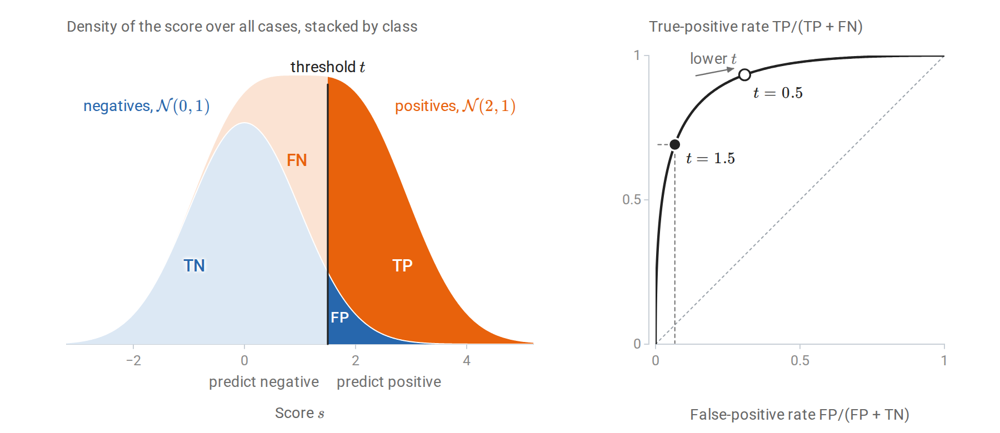

*Scores are $`\mathcal N(0,1)`$ for negatives and $`\mathcal N(2,1)`$ for positives, with equal prevalence. Left: the density of all scores, split by class, so that the four regions cut by the threshold have areas equal to the cells of the confusion matrix as fractions of all cases. Right: at $`t=1.5`$ the true-positive rate is $`0.69`$ and the false-positive rate $`0.07`$. Lowering the threshold to $`0.5`$ raises both, and sweeping $`t`$ over all values traces the ROC curve.*

The area under the ROC curve, the **AUC**, has a direct interpretation:

```math
\operatorname{AUC}=P\bigl(S^+>S^-\bigr)+\tfrac12P\bigl(S^+=S^-\bigr),
```

where $`S^+`$ and $`S^-`$ are the scores of an independently drawn positive and negative example. It is the Mann–Whitney statistic ([Probability and Statistics](../foundations/04-probability-and-statistics.md#rank-based-and-distribution-free-tests)), computable from ranks, and it measures ranking quality independently of any threshold and of calibration ([Fawcett, 2006](https://www.sciencedirect.com/science/article/abs/pii/S016786550500303X)). For Gaussian scores with unit variances whose means differ by $`\Delta`$, the difference $`S^+-S^-`$ is $`\mathcal N(\Delta,2)`$, so $`\operatorname{AUC}=\Phi(\Delta/\sqrt2)`$, where $`\Phi`$ is the standard normal distribution function: $`0.760`$ for $`\Delta=1`$ and $`0.921`$ for $`\Delta=2`$. The **precision–recall curve** plots precision against recall. Its summary, **average precision**, weights the curve by the recall gained at each threshold: $`\sum_k(R_k-R_{k-1})P_k`$, where $`R_k`$ and $`P_k`$ are the recall and precision at the $`k`$th threshold.

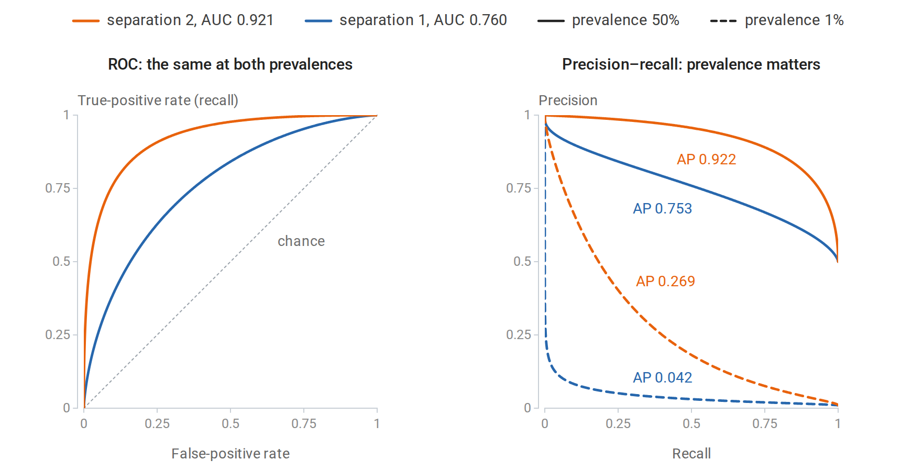

*Exact curves for two scoring classifiers, with Gaussian class-conditional scores separated by one or two standard deviations, at prevalences of 50% and 1%. The ROC curves do not depend on prevalence, because both of their rates condition on the true class. Precision falls sharply at 1% prevalence: even a small false-positive rate produces many false positives relative to the few true positives, and the average precision of the better classifier falls by more than two thirds.*

For rare positive classes, where the practical question is how many flagged cases are real, precision–recall curves are more informative than ROC curves ([Saito and Rehmsmeier, 2015](https://journals.plos.org/plosone/article?id=10.1371%2Fjournal.pone.0118432)). Neither curve evaluates calibration; proper scoring rules such as log loss and the Brier score do ([chapter 5](05-logistic-regression-and-probabilistic-prediction.md#proper-scoring-rules)). The operating threshold should be chosen on validation data from the relevant costs or constraints, such as a required recall. With calibrated probabilities and costs $`c_{\mathrm{FP}}`$ and $`c_{\mathrm{FN}}`$ for the two errors, the optimal rule predicts positive when the probability exceeds $`c_{\mathrm{FP}}/(c_{\mathrm{FP}}+c_{\mathrm{FN}})`$, as [Probability and Statistics](../foundations/04-probability-and-statistics.md#decisions-loss-and-risk) shows.

### <a id="comparing-two-classifiers"></a>Comparing two classifiers

Two classifiers evaluated on the same test set produce paired results, so the comparison of two independent proportions in [Probability and Statistics](../foundations/04-probability-and-statistics.md#comparing-two-proportions) does not apply. **McNemar's test** uses only the discordant examples, those on which exactly one classifier is correct. Let $`n_{01}`$ count the examples on which the first classifier is right and the second wrong, and $`n_{10}`$ the reverse. Under the null hypothesis of equal accuracy, each discordant example is equally likely to favor either classifier, so their counts follow a $`\operatorname{Binomial}(n_{01}+n_{10},1/2)`$ law given their total. The exact test is the sign test of [Probability and Statistics](../foundations/04-probability-and-statistics.md#rank-based-and-distribution-free-tests) applied to the discordant examples.

```python
import numpy as np
from scipy.stats import binom, rankdata
from sklearn.datasets import load_breast_cancer
from sklearn.discriminant_analysis import LinearDiscriminantAnalysis
from sklearn.metrics import roc_auc_score
from sklearn.model_selection import train_test_split
from sklearn.naive_bayes import GaussianNB

X, y = load_breast_cancer(return_X_y=True)
X_tr, X_te, y_tr, y_te = train_test_split(X, y, test_size=0.5, stratify=y, random_state=3)
lda = LinearDiscriminantAnalysis().fit(X_tr, y_tr)
nb = GaussianNB().fit(X_tr, y_tr)

# AUC = P(score of a random positive > score of a random negative), ties counting 1/2.
s = lda.decision_function(X_te)
ranks = rankdata(s)
n1, n0 = y_te.sum(), (1 - y_te).sum()
auc_ranks = (ranks[y_te == 1].sum() - n1 * (n1 + 1) / 2) / (n1 * n0)
print(f"LDA AUC from ranks {auc_ranks:.4f}, scikit-learn {roc_auc_score(y_te, s):.4f}")

# McNemar's exact test: only the examples on which the two classifiers disagree matter.
a = lda.predict(X_te) == y_te
b = nb.predict(X_te) == y_te
n01, n10 = np.sum(a & ~b), np.sum(~a & b)            # LDA right & NB wrong, and vice versa
p = min(1.0, 2 * binom.cdf(min(n01, n10), n01 + n10, 0.5))
print(f"accuracy: LDA {a.mean():.3f}, naive Bayes {b.mean():.3f}")
print(f"discordant pairs: {n01} favor LDA, {n10} favor naive Bayes; exact McNemar p = {p:.3f}")
# LDA AUC from ranks 0.9939, scikit-learn 0.9939
# accuracy: LDA 0.954, naive Bayes 0.937
# discordant pairs: 9 favor LDA, 4 favor naive Bayes; exact McNemar p = 0.267
```

A difference of 1.7 percentage points rests on 13 discordant examples and is well within chance variation. McNemar's test concerns these two fitted classifiers on this test set. Comparing two *learning algorithms* must also account for variation across training sets, and the folds of cross-validation are not independent, so ordinary paired $`t`$-tests on fold errors are anticonservative ([Dietterich, 1998](https://dl.acm.org/doi/10.1162/089976698300017197)). The corrected resampled $`t`$-test of [Nadeau and Bengio (2003)](https://link.springer.com/article/10.1023/A:1024068626366) inflates the variance estimate to account for overlapping training sets. Bootstrap intervals for a metric on a fixed test set follow [Bootstrap approximation of sampling uncertainty](../foundations/04-probability-and-statistics.md#bootstrap-approximation-of-sampling-uncertainty).

## <a id="appendices"></a>Appendices


<details>
<summary><a id="block-select-appendix-a"></a><b>A. Optimism and the leave-one-out shortcut</b></summary>

### <a id="the-covariance-formula-for-optimism"></a>The covariance formula for optimism

Let $`y=\mu+\varepsilon`$ and $`y'=\mu+\varepsilon'`$ with $`\varepsilon,\varepsilon'`$ independent, mean zero, and covariance $`\sigma^2I`$. The fitted values $`\hat y`$ depend on $`y`$ but not on $`y'`$. For each $`i`$,

```math
\mathbb E(y'_i-\hat y_i)^2=\sigma^2+\mathbb E(\mu_i-\hat y_i)^2,
```

```math
\mathbb E(y_i-\hat y_i)^2=\sigma^2+\mathbb E(\mu_i-\hat y_i)^2-2\operatorname{Cov}(y_i,\hat y_i),
```

where the first uses the independence of $`\varepsilon'_i`$ and $`\hat y`$, and the second uses $`\mathbb E[\varepsilon_i(\mu_i-\hat y_i)]=-\mathbb E[\varepsilon_i\hat y_i]=-\operatorname{Cov}(y_i,\hat y_i)`$. Subtracting and averaging over $`i`$ gives the optimism $`\frac2n\sum_i\operatorname{Cov}(\hat y_i,y_i)`$. For a linear smoother $`\hat y=Sy`$ with $`S`$ not depending on $`y`$, $`\operatorname{Cov}(\hat y_i,y_i)=\sigma^2S_{ii}`$, so $`\operatorname{df}=\operatorname{tr}S`$. For adaptive procedures such as best-subset selection, the covariance exceeds the number of selected parameters, because the choice of subset itself adapts to the noise.

### <a id="the-leave-one-out-formula"></a>The leave-one-out formula

For ridge regression with $`A=X^\top X+\lambda I`$, deleting row $`i`$ gives $`A_{-i}=A-x_ix_i^\top`$ and $`X_{-i}^\top y_{-i}=X^\top y-x_iy_i`$. Write $`h_i=x_i^\top A^{-1}x_i=S_{ii}`$. Sherman–Morrison gives

```math
A_{-i}^{-1}x_i=\frac{A^{-1}x_i}{1-h_i}.
```

Then the leave-one-out prediction satisfies

```math
x_i^\top\hat\beta^{(-i)}=x_i^\top A_{-i}^{-1}(X^\top y-x_iy_i)
=\frac{\hat y_i-h_iy_i}{1-h_i},
```

using $`x_i^\top A_{-i}^{-1}X^\top y=(x_i^\top A^{-1}X^\top y)/(1-h_i)`$ by symmetry of the same identity. Hence

```math
y_i-x_i^\top\hat\beta^{(-i)}=\frac{y_i-\hat y_i}{1-h_i}.
```

The same argument applies to least squares ($`\lambda=0`$) and to any smoother obtained by solving a penalized least-squares problem whose penalty is a fixed quadratic form in the coefficients, $`\beta^\top\Omega\beta`$, with $`\lambda I`$ replaced by $`\Omega`$.

</details>


<details>
<summary><a id="block-select-appendix-b"></a><b>B. Early stopping and ridge regression as spectral filters</b></summary>

Minimize $`\frac12\|y-X\beta\|^2`$ by gradient descent from $`\beta_0=0`$ with step $`\eta<2/\sigma_1^2`$, where $`\sigma_1`$ is the largest singular value; the Hessian is $`X^\top X`$, whose largest eigenvalue is $`\sigma_1^2`$, and [Calculus and Optimization](../foundations/03-calculus-and-optimization.md#quadratics-expose-the-stability-threshold) shows that this is the stability condition on a quadratic. The update is

```math
\beta_{t+1}=\beta_t+\eta X^\top(y-X\beta_t)=(I-\eta X^\top X)\beta_t+\eta X^\top y.
```

In the SVD $`X=U\Sigma V^\top`$, the coordinates $`\theta_t=V^\top\beta_t`$ evolve independently:

```math
\theta_{t+1,j}=(1-\eta\sigma_j^2)\theta_{t,j}+\eta\sigma_j\,u_j^\top y
\quad\Longrightarrow\quad
\theta_{t,j}=\frac{1-(1-\eta\sigma_j^2)^t}{\sigma_j}\,u_j^\top y.
```

The solution follows by summing the geometric series $`\eta\sigma_ju_j^\top y\sum_{s=0}^{t-1}(1-\eta\sigma_j^2)^s`$. Multiplying by $`\sigma_j`$ gives the fitted-value filter $`1-(1-\eta\sigma_j^2)^t`$, compared with the ridge filter $`\sigma_j^2/(\sigma_j^2+\lambda)`$. Both are near one for large $`\sigma_j`$ and near zero for small $`\sigma_j`$. For small $`\eta\sigma_j^2`$, $`1-(1-\eta\sigma_j^2)^t\approx1-e^{-\eta t\sigma_j^2}`$, which crosses one half at $`\sigma_j^2=\log2/(\eta t)`$; the ridge filter crosses one half at $`\sigma_j^2=\lambda`$. The correspondence $`\lambda\approx1/(\eta t)`$ is therefore a statement about the order of magnitude, not an exact equivalence. As $`t\to\infty`$, directions with $`\sigma_j=0`$ are never updated, so gradient descent from zero converges to the minimum-norm least-squares solution, the estimator whose double descent appears in the main text.

</details>


<details>
<summary><a id="block-select-appendix-c"></a><b>C. The risk of least squares with Gaussian features</b></summary>

The model of the double-descent figure has inputs $`x\sim\mathcal N(0,I_d)`$ and targets $`y=x^\top\beta+\varepsilon`$ with $`\varepsilon\sim\mathcal N(0,\sigma^2)`$ independent of $`x`$. The fit uses only the first $`p`$ features: $`X_p`$ is the $`n\times p`$ matrix of their training values, $`X_{p+1:d}`$ holds the values of the others, and the fit has coefficients $`w\in\mathbb R^p`$ for the first $`p`$ features and zero for the rest. Its risk on a new observation is

```math
R(w)=\mathbb E\bigl(y-x_{1:p}^\top w\bigr)^2=\|\beta_{1:p}-w\|^2+\|\beta_{p+1:d}\|^2+\sigma^2,
```

because the coordinates of $`x`$ are independent with unit variance. This is the exact risk computed for each fitted model in the figure.

The omitted features act as extra noise. The training targets are $`y=X_p\beta_{1:p}+\xi`$ with $`\xi=X_{p+1:d}\beta_{p+1:d}+\varepsilon`$, and $`\xi`$ has independent $`\mathcal N(0,s^2)`$ entries, $`s^2=\|\beta_{p+1:d}\|^2+\sigma^2`$, independent of $`X_p`$. The argument then uses one property of the Wishart distribution: if $`G`$ is a $`k\times m`$ matrix of independent standard Gaussian entries with $`m>k+1`$, then $`\mathbb E(GG^\top)^{-1}=I_k/(m-k-1)`$, and the expected trace of the inverse is infinite when $`m=k`$ or $`m=k+1`$.

**Underparameterized, $`p<n`$.** The least-squares solution is $`w=\beta_{1:p}+(X_p^\top X_p)^{-1}X_p^\top\xi`$. Conditional on $`X_p`$, the error $`w-\beta_{1:p}`$ has mean zero and covariance $`s^2(X_p^\top X_p)^{-1}`$, so $`\mathbb E\|w-\beta_{1:p}\|^2=s^2\,\mathbb E\operatorname{tr}(X_p^\top X_p)^{-1}=s^2p/(n-p-1)`$, by the Wishart property with $`k=p`$ and $`m=n`$. Adding $`s^2`$ gives $`s^2(n-1)/(n-p-1)`$ for $`p\le n-2`$.

**Overparameterized, $`p>n`$.** The minimum-norm solution is $`w=X_p^+y=P\beta_{1:p}+X_p^\top(X_pX_p^\top)^{-1}\xi`$, where $`P=X_p^\top(X_pX_p^\top)^{-1}X_p`$ projects onto the $`n`$-dimensional row space of $`X_p`$. Then $`\beta_{1:p}-w=(I-P)\beta_{1:p}-X_p^\top(X_pX_p^\top)^{-1}\xi`$, and the two parts are orthogonal, because the first is orthogonal to the row space and the second lies in it. The row space of a Gaussian matrix is a uniformly random $`n`$-dimensional subspace of $`\mathbb R^p`$, so $`\mathbb E\|(I-P)\beta_{1:p}\|^2=(1-n/p)\|\beta_{1:p}\|^2`$. The noise part has expected squared norm $`s^2\,\mathbb E\operatorname{tr}(X_pX_p^\top)^{-1}=s^2n/(p-n-1)`$, by the Wishart property with $`k=n`$ and $`m=p`$. Adding $`s^2`$ gives the second case of the formula for $`p\ge n+2`$.

Near the threshold the smallest nonzero singular value of $`X_p`$ is typically tiny, which is why both traces diverge. The expected risk is infinite for $`n-1\le p\le n+1`$, although each individual fit has finite risk; the figure therefore shows medians and quartiles, which remain finite.

</details>

---

[← 5. Logistic Regression and Probabilistic Prediction](05-logistic-regression-and-probabilistic-prediction.md) · [7. Statistical Learning Theory →](07-statistical-learning-theory.md)
