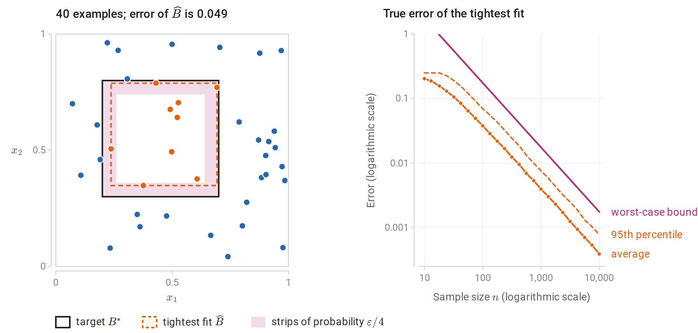
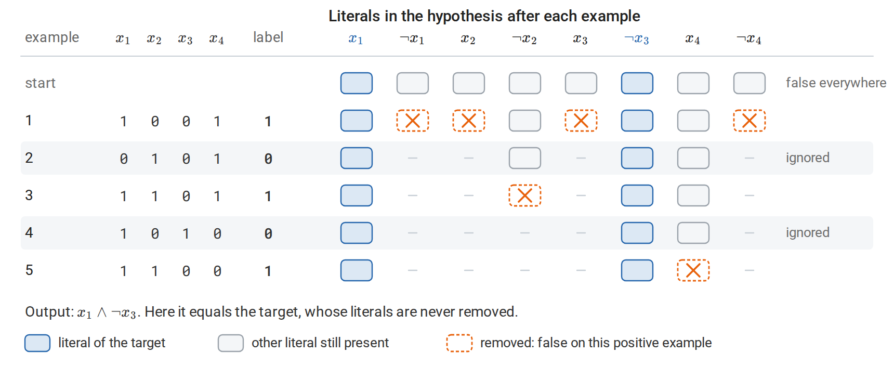
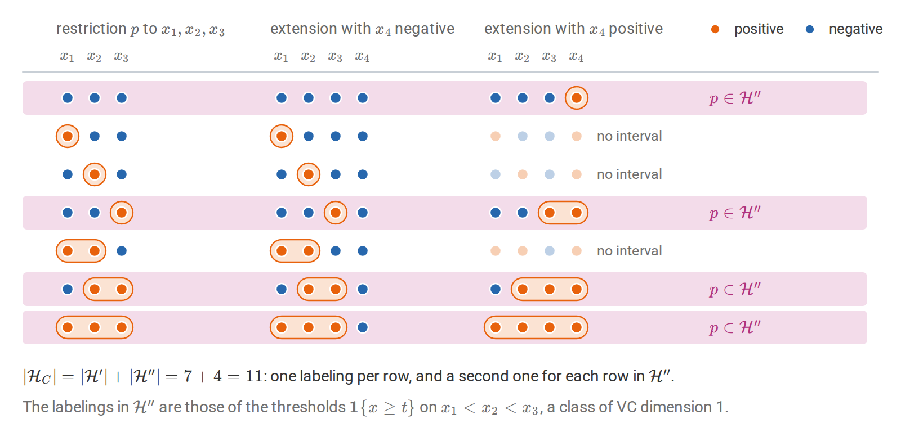
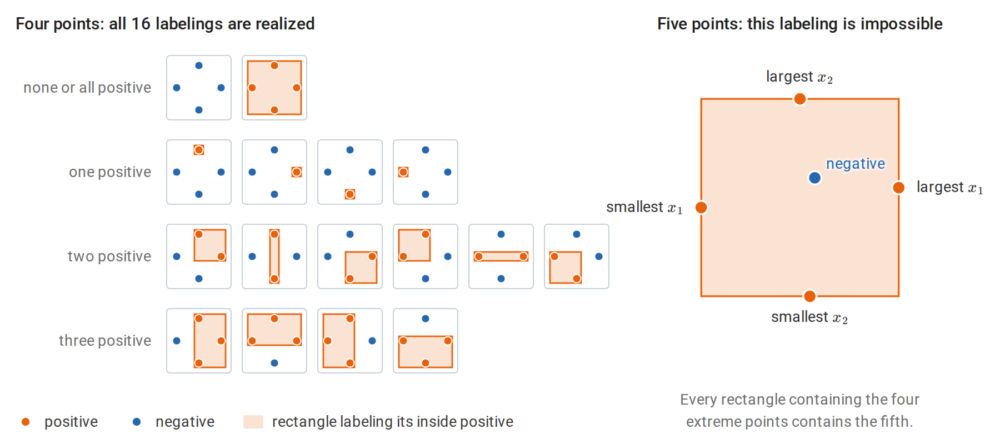
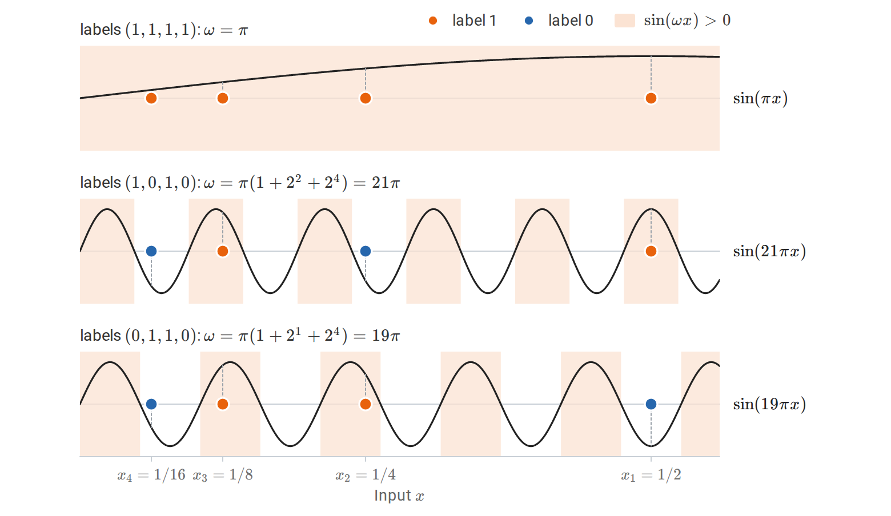
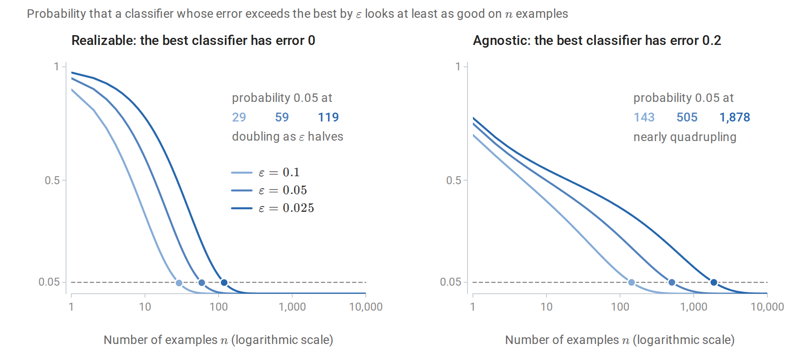
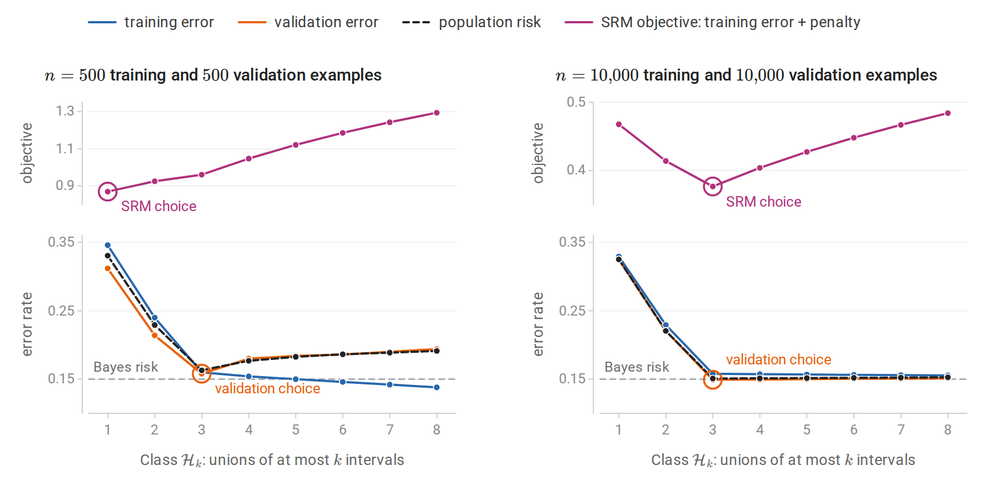
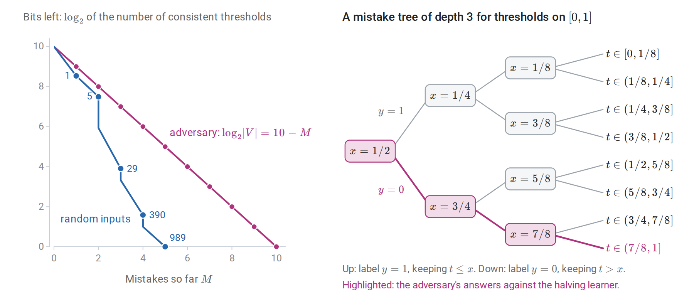
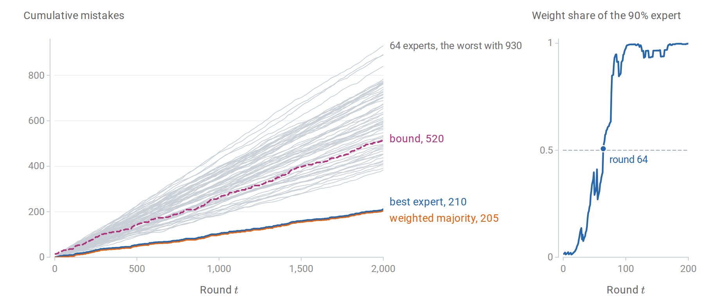

[Background Notes](../README.md) › [Machine Learning](README.md)

# 7. Statistical Learning Theory

[← 6. Losses, Model Selection, and Evaluation](06-losses-model-selection-and-evaluation.md) · [8. Support Vector Machines and Kernels →](08-support-vector-machines-and-kernels.md)

## <a id="from-foundations-to-concrete-classes"></a>From Foundations to concrete classes

The general theory of generalization is developed in Information and Learning Theory: the decomposition of excess risk into approximation, estimation, and optimization error; uniform convergence for finite classes and description-length weights; realizable and agnostic PAC learning; the no-free-lunch argument; growth functions, shattering, and VC dimension; Rademacher complexity, contraction, and margin bounds; algorithmic stability; online-to-batch conversion; and PAC-Bayes bounds. This chapter uses those results. It adds what is needed to apply them: learning algorithms for specific classes with complete proofs, the combinatorial lemma that turns VC dimension into a polynomial growth rate, techniques for computing VC dimensions, the characterization of learnability by VC dimension, model selection over several classes, and the online mistake-bound model that underlies the perceptron analysis of chapter 2.

The notation follows Foundations: a class $`\mathcal H`$ of binary classifiers $`h:\mathcal X\to\{0,1\}`$, an unknown distribution $`P`$ over labeled examples $`(X,Y)`$, the zero–one risk $`R(h)=P(h(X)\ne Y)`$, the empirical risk $`\widehat R_n(h)`$, the fraction of an iid sample of size $`n`$ that $`h`$ misclassifies, accuracy $`\varepsilon`$, and confidence $`1-\delta`$. Foundations writes $`P_\ast`$ and $`R_\ast`$ for the law and the risk; as in chapter 1, the subscript is dropped here. A classifier with zero training error is **consistent** with the sample. In the **realizable** case some $`h^\ast\in\mathcal H`$ has $`R(h^\ast)=0`$ (Foundations calls it $`h_0`$); in the **agnostic** case the goal is to compete with the best risk in the class, $`\inf_{h\in\mathcal H}R(h)`$, written $`R_\ast^{\mathcal H}`$ in Foundations. Natural logarithms are written $`\ln`$, as in the learning-theory part of Foundations, and base-two logarithms $`\log_2`$.

Two finite-class results from Foundations recur throughout. For a class of $`M`$ classifiers in the realizable case, every consistent learner that returns a member of the class has error at most $`\varepsilon`$ with probability at least $`1-\delta`$ once

```math
n\ge\frac{\ln M+\ln(1/\delta)}{\varepsilon},
```

because a fixed classifier with error above $`\varepsilon`$ survives $`n`$ examples with probability at most $`(1-\varepsilon)^n\le e^{-n\varepsilon}`$, and a union bound covers the whole class (PAC learning and its limits). Without realizability, Hoeffding's inequality and a union bound show that with probability at least $`1-\delta`$ every classifier in the class satisfies

```math
\bigl\lvert R(h)-\widehat R_n(h)\bigr\rvert\le\varepsilon_n(M,\delta):=\sqrt{\frac{\ln(2M/\delta)}{2n}},
```

so an empirical risk minimizer has risk at most $`\inf_{h\in\mathcal H}R(h)+2\varepsilon_n(M,\delta)`$ (From concentration to generalization).

## <a id="learning-concrete-classes-in-the-realizable-case"></a>Learning concrete classes in the realizable case

### <a id="axis-aligned-rectangles"></a>Axis-aligned rectangles

Let $`\mathcal X=\mathbb R^2`$ and let $`\mathcal H`$ be the indicators of closed axis-aligned rectangles $`[a_1,b_1]\times[a_2,b_2]`$: such a classifier outputs $`1`$ exactly when $`a_1\le x_1\le b_1`$ and $`a_2\le x_2\le b_2`$. The class is infinite, so the finite-class bound does not apply. A direct argument, due to [Blumer, Ehrenfeucht, Haussler, and Warmuth (1989)](https://dl.acm.org/doi/10.1145/76359.76371) and developed in [Kearns and Vazirani, *An Introduction to Computational Learning Theory*](https://mitpress.mit.edu/9780262111935/an-introduction-to-computational-learning-theory/), gives a sharp sample complexity. In this section $`P(A)`$ denotes the probability that the input falls in a region $`A`$ of the plane.

The **tightest-fit learner** returns the smallest rectangle $`\widehat B`$ containing all positive examples, or the empty rectangle if there are none. If the target is a rectangle $`B^\ast`$, then every positive example lies in $`B^\ast`$, so $`\widehat B\subseteq B^\ast`$. The learner never labels a negative example positive; its only errors are points of $`B^\ast\setminus\widehat B`$, and its error is $`P(B^\ast\setminus\widehat B)`$.

**Theorem.** For every distribution on $`\mathbb R^2`$ and every target rectangle, if

```math
n\ge\frac4\varepsilon\ln\frac4\delta,
```

then with probability at least $`1-\delta`$ the tightest-fit rectangle has error at most $`\varepsilon`$.

**Proof.** If $`P(B^\ast)\le\varepsilon`$ the claim is immediate, since the error is at most $`P(B^\ast)`$. Otherwise, let $`S_1`$ be the smallest strip along the top edge of $`B^\ast`$, of the form $`B^\ast\cap\{x_2\ge c\}`$, with probability at least $`\varepsilon/4`$; define $`S_2,S_3,S_4`$ similarly along the other three edges. Every strip strictly inside $`S_1`$ has probability below $`\varepsilon/4`$, so $`S_1`$ without its innermost boundary line has probability at most $`\varepsilon/4`$, and likewise for the other strips. If the sample contains a point in each $`S_j`$, then $`\widehat B`$ reaches into every strip, and $`B^\ast\setminus\widehat B`$ is contained in the union of the four strips minus their innermost boundaries, which has probability at most $`\varepsilon`$. The probability that $`n`$ independent points all miss a given strip is at most $`(1-\varepsilon/4)^n\le e^{-n\varepsilon/4}`$, using $`1+u\le e^u`$. By the union bound, the probability of missing some strip is at most $`4e^{-n\varepsilon/4}`$, which is at most $`\delta`$ under the stated condition. $`\square`$

The proof never uses the distribution's form: the strips are defined by probability, not by length. In $`d`$ dimensions the same argument uses $`2d`$ strips and gives $`n\ge(2d/\varepsilon)\ln(2d/\delta)`$.

The figure shows the construction for the uniform distribution on the unit square, where probability is area, and the target $`[0.2,0.7]\times[0.3,0.8]`$. Because the fit lies inside the target, its error is the area it misses, which can be computed exactly for every simulated sample. The simulated average error is close to $`4/n`$: each of the four sides of $`\widehat B`$ stops short of the corresponding side of $`B^\ast`$, leaving a gap whose probability is about $`1/n`$ on average. The bound of the theorem, $`(4/n)\ln(4/\delta)`$, therefore exceeds the average error only by the factor $`\ln(4/\delta)`$, about 4.4 for $`\delta=0.05`$.



*Left: the target rectangle, uniformly distributed examples, and the tightest fit. Each shaded strip has probability $`\varepsilon/4`$ for $`\varepsilon=0.12`$; every strip contains a positive example, so the error of the fit is below $`\varepsilon`$. Right: the exact error of the tightest fit over 1,000 samples at each of 25 sample sizes, with the bound of the theorem for $`\delta=0.05`$. From $`n=100`$ on, the bound is 2.2 to 2.5 times the 95th percentile of the error, and both decrease at the rate $`1/n`$.*

### <a id="boolean-conjunctions-and-the-elimination-algorithm"></a>Boolean conjunctions and the elimination algorithm

Let $`\mathcal X=\{0,1\}^d`$ and let $`\mathcal H`$ be the **conjunctions** of literals, such as $`x_1\wedge\neg x_3\wedge x_7`$. A **literal** is a variable $`x_j`$ or its negation $`\neg x_j`$, and a conjunction outputs $`1`$ exactly when all of its literals are true. Each variable can appear positively, negatively, or not at all, so $`\lvert\mathcal H\rvert\le3^d+1`$ including the always-false conjunction. The **elimination algorithm** starts with the conjunction of all $`2d`$ literals, which is false everywhere, and for each positive example removes every literal the example falsifies. Negative examples are ignored.



*The elimination algorithm on four variables with target $`x_1\wedge\neg x_3`$. Each row shows the literals left after one example. The three positive examples remove six of the eight literals, and the two negative examples change nothing.*

Every literal of the target conjunction is satisfied by every positive example, so it is never removed. The output therefore contains all of the target's literals and is at least as restrictive: whenever the output predicts $`1`$, so does the target. It thus predicts $`0`$ on every negative example, and it predicts $`1`$ on every positive example seen, because each literal it keeps survived all of them. The output is consistent with all training examples. Since $`\lvert\mathcal H\rvert\le3^d+1\le2\cdot3^d`$, the realizable finite-class bound of Foundations shows that

```math
n\ge\frac1\varepsilon\Bigl(d\ln3+\ln\frac2\delta\Bigr)
```

examples suffice, and the algorithm runs in $`O(nd)`$ time. Conjunctions are therefore **efficiently PAC learnable**: both the number of examples and the running time are polynomial in $`d`$, $`1/\varepsilon`$, and $`\ln(1/\delta)`$.

### <a id="representation-and-computational-hardness"></a>Representation and computational hardness

Statistical and computational learnability can separate. A **3-term DNF** formula (disjunctive normal form) is a disjunction of three conjunctions, $`T_1\vee T_2\vee T_3`$. There are at most $`(3^d+1)^3`$ of them, so the logarithm of the class size grows only linearly in $`d`$, and few examples suffice statistically. Yet [Pitt and Valiant (1988)](https://dl.acm.org/doi/10.1145/48014.63140) showed that finding a 3-term DNF consistent with a given sample is NP-hard. Consequently, unless $`\mathrm{RP}=\mathrm{NP}`$, no efficient *proper* learner exists, one that must output a 3-term DNF. Here RP is the class of problems solvable in polynomial time by randomized algorithms with one-sided error, and an efficient proper learner would place the consistency problem in it: run on the uniform distribution over a sample, with $`\varepsilon`$ below one over the sample size, it would return a consistent formula with high probability. Proper and improper learners are defined in Foundations.

The obstacle disappears if the learner may output a different representation. Distributing the disjunction gives

```math
T_1\vee T_2\vee T_3=\bigwedge_{u\in T_1,\,v\in T_2,\,w\in T_3}(u\vee v\vee w),
```

where $`u`$, $`v`$, and $`w`$ range over the literals of $`T_1`$, $`T_2`$, and $`T_3`$. The result is a **3-CNF** (conjunctive normal form): a conjunction of clauses with three literals each. Treating each of the $`O(d^3)`$ possible clauses as a new Boolean variable turns learning 3-CNF into learning a conjunction, which the elimination algorithm does with running time and a number of examples polynomial in $`d`$, $`1/\varepsilon`$, and $`\ln(1/\delta)`$. Every 3-term DNF is a 3-CNF, so the target stays realizable in the larger class, and the class of 3-term DNF formulas is therefore efficiently learnable **improperly**, by outputting a 3-CNF. The choice of hypothesis representation can decide whether a learning problem is tractable. Stronger, cryptographic hardness results show that some classes, such as small Boolean circuits, cannot be learned efficiently in any representation under standard assumptions.

## <a id="the-growth-function-and-sauer-s-lemma"></a>The growth function and Sauer's lemma

### <a id="why-a-polynomial-growth-rate-suffices"></a>Why a polynomial growth rate suffices

For a class of binary classifiers, the **growth function** $`\Pi_{\mathcal H}(m)`$ is the largest number of distinct labelings the class produces on $`m`$ points, and the **VC dimension** $`v`$ is the largest $`m`$ with $`\Pi_{\mathcal H}(m)=2^m`$; both are defined in Infinite classes and VC dimension. The uniform deviation bounds in Foundations depend on $`\ln\Pi_{\mathcal H}(n)`$, which takes the place of $`\ln M`$ in the finite-class bound; the proof in Foundations, Appendix B gives, with probability at least $`1-\delta`$ and simultaneously for all $`h\in\mathcal H`$,

```math
\bigl\lvert R(h)-\widehat R_n(h)\bigr\rvert\le2\sqrt{\frac{2\ln\Pi_{\mathcal H}(n)}{n}}+\sqrt{\frac{\ln(2/\delta)}{2n}}.
```

If $`\ln\Pi_{\mathcal H}(n)`$ grew linearly in $`n`$, as it does when every labeling is possible, the bounds would be vacuous: they would not tend to zero. Sauer's lemma shows that finite VC dimension forces polynomial growth, so that $`\ln\Pi_{\mathcal H}(n)`$ grows only like $`v\ln n`$.

**Lemma (Sauer–Shelah).** If $`\operatorname{VCdim}(\mathcal H)=v<\infty`$, then for every $`m`$,

```math
\Pi_{\mathcal H}(m)\le\Phi_v(m):=\sum_{j=0}^v\binom mj.
```

**Proof.** Induct on $`m+v`$. If $`v=0`$, no point can be labeled both ways, so every set of points has at most one labeling, and $`\Phi_0(m)=1`$. If $`m\le v`$, then $`\Phi_v(m)=2^m`$ and the bound is trivial. Otherwise fix points $`C=\{x_1,\ldots,x_m\}`$, write $`C'=C\setminus\{x_m\}`$, and let $`\mathcal H_C`$ be the set of labelings of $`C`$ produced by $`\mathcal H`$. Define two classes of labelings of $`C'`$:

- $`\mathcal H'`$: the restrictions to $`C'`$ of labelings in $`\mathcal H_C`$;
- $`\mathcal H''`$: the labelings $`p`$ of $`C'`$ such that **both** extensions $`(p,0)`$ and $`(p,1)`$ are in $`\mathcal H_C`$.

Each labeling of $`C'`$ in $`\mathcal H'`$ extends to one or two labelings of $`C`$, and it extends to two exactly when it lies in $`\mathcal H''`$. Hence $`\lvert\mathcal H_C\rvert=\lvert\mathcal H'\rvert+\lvert\mathcal H''\rvert`$. The class $`\mathcal H'`$ has VC dimension at most $`v`$. The class $`\mathcal H''`$ has VC dimension at most $`v-1`$: if it shattered a set $`S\subseteq C'`$, then $`\mathcal H`$ would shatter $`S\cup\{x_m\}`$, because every labeling of $`S`$ occurs with both labels of $`x_m`$. By induction,

```math
\lvert\mathcal H_C\rvert\le\Phi_v(m-1)+\Phi_{v-1}(m-1)=\Phi_v(m),
```

by Pascal's rule $`\binom{m-1}j+\binom{m-1}{j-1}=\binom mj`$. $`\square`$

The figure carries out the counting step for intervals on four points of the line, a class of VC dimension two, where every inequality in the proof holds with equality.



*All labelings of four points by intervals, grouped by their restriction $`p`$ to the first three points. Each row is one labeling in $`\mathcal H'`$, and the shaded rows, which extend in both ways, form $`\mathcal H''`$.*

The lemma was proved independently by [Sauer (1972)](https://www.sciencedirect.com/science/article/pii/0097316572900192), Shelah, and Vapnik and Chervonenkis. For $`m\ge v\ge1`$, $`\Phi_v(m)\le(em/v)^v`$; the short calculation is in [Appendix A](#block-theory-appendix-a). The lemma is tight: the class of all subsets of size at most $`v`$ of an infinite set has exactly $`\Phi_v(m)`$ labelings on every $`m`$ points.

### <a id="checking-the-lemma-by-enumeration"></a>Checking the lemma by enumeration

Axis-aligned rectangles in the plane have VC dimension four, as shown below. A labeling of finitely many points is realizable exactly when the smallest rectangle containing the positive points contains no negative point, so all realizable labelings can be enumerated from subsets.

```python
import itertools
from math import comb

import numpy as np

def rectangle_patterns(P):
    """All labelings of the points P realizable by axis-aligned rectangles (brute force)."""
    m = len(P)
    patterns = {tuple([0] * m)}                      # the empty rectangle labels everything 0
    for r in range(1, m + 1):
        for S in itertools.combinations(range(m), r):
            lo, hi = P[list(S)].min(axis=0), P[list(S)].max(axis=0)
            inside = np.all((P >= lo) & (P <= hi), axis=1)
            patterns.add(tuple(inside.astype(int)))  # the smallest rectangle containing S
    return patterns

rng = np.random.default_rng(0)
v = 4                                                # VC dimension in the plane
print(" m  realized  Sauer bound    2^m")
for m in range(3, 12):
    best = max(len(rectangle_patterns(rng.uniform(size=(m, 2)))) for _ in range(20))
    sauer = sum(comb(m, j) for j in range(v + 1))
    print(f"{m:2d}  {best:8d}  {sauer:11d}  {2**m:5d}")
#  m  realized  Sauer bound    2^m
#  3         8            8      8
#  4        16           16     16
#  5        28           31     32
#  6        44           57     64
#  7        76           99    128
#  8        98          163    256
#  9       152          256    512
# 10       199          386   1024
# 11       285          562   2048
```

The "realized" column is the largest count over 20 random point sets, a lower estimate of $`\Pi_{\mathcal H}(m)`$. Up to four points, random configurations are shattered. Beyond that, the count stays below the polynomial $`\Phi_4(m)`$ and falls ever further behind $`2^m`$.

## <a id="computing-vc-dimensions"></a>Computing VC dimensions

### <a id="the-two-halves-of-a-proof"></a>The two halves of a proof

To show $`\operatorname{VCdim}(\mathcal H)=v`$, one must exhibit **one** set of $`v`$ points that $`\mathcal H`$ shatters, and show that **no** set of $`v+1`$ points is shattered. The asymmetry matters: the lower bound needs a single well-chosen configuration, while the upper bound must defeat every configuration, usually by constructing an unachievable labeling.

**Axis-aligned rectangles in $`\mathbb R^2`$ have VC dimension 4.** The four points $`(0,\pm1)`$ and $`(\pm1,0)`$ are shattered: for any subset, the smallest rectangle containing it avoids the other points. For five points, pick one with the largest first coordinate, one with the smallest, one with the largest second coordinate, and one with the smallest; these are at most four points. Label them positive and some remaining point negative. Any rectangle containing the chosen points contains their bounding box, which contains every point, so the labeling is impossible. In $`\mathbb R^d`$ the same argument gives VC dimension $`2d`$.



*Left: the labelings of four points in a diamond configuration, each realized by a rectangle around the positive points; the smallest such rectangle is drawn slightly enlarged so that points and segments stay visible. Right: five points, with the coordinatewise extreme points labeled positive and the remaining point negative.*

Other standard examples, with the same structure of proof:

| Class on the given domain | VC dimension | Witness and obstruction |
| --- | --- | --- |
| Thresholds $`\mathbf 1\{x\ge t\}`$ on $`\mathbb R`$ | 1 | Foundations |
| Intervals $`\mathbf 1\{a\le x\le b\}`$ on $`\mathbb R`$ | 2 | Foundations |
| Unions of $`k`$ intervals on $`\mathbb R`$ | $`2k`$ | Any labeling of $`2k`$ points has at most $`k`$ runs of consecutive positives, one interval for each; $`2k+1`$ points labeled $`+,-,+,\ldots,+`$ need $`k+1`$ intervals |
| Axis-aligned rectangles in $`\mathbb R^d`$ | $`2d`$ | Above |
| Homogeneous halfspaces $`\mathbf 1\{w^\top x\ge0\}`$ in $`\mathbb R^d`$ | $`d`$ | Standard basis vectors; $`d+1`$ vectors are linearly dependent |
| Affine halfspaces in $`\mathbb R^d`$ | $`d+1`$ | Foundations (Radon's theorem) |
| Linear classifiers on $`p`$ fixed features $`\phi(x)\in\mathbb R^p`$ | at most $`p+1`$ | Halfspaces in feature space |
| A finite class | at most $`\log_2\lvert\mathcal H\rvert`$ | Shattering $`v`$ points needs $`2^v`$ classifiers |

For homogeneous halfspaces, the standard basis vectors $`e_1,\ldots,e_d`$ are shattered: for labels $`y_1,\ldots,y_d`$, take $`w_i=1`$ when $`y_i=1`$ and $`w_i=-1`$ otherwise, so that $`w^\top e_i=w_i`$ is nonnegative exactly when $`y_i=1`$. The upper bound uses linear dependence. Any $`d+1`$ vectors satisfy $`\sum_ia_ix_i=0`$ with some $`a_i\ne0`$; negating all the coefficients if necessary, some $`a_i`$ is negative. Label the points with $`a_i<0`$ negative and the others positive. A $`w`$ realizing this labeling would have $`w^\top x_i<0`$ where $`a_i<0`$ and $`w^\top x_i\ge0`$ elsewhere. Every term of $`\sum_ia_iw^\top x_i`$ would then be nonnegative, and the terms with $`a_i<0`$ strictly positive, so the sum would be positive. Yet it equals $`w^\top\sum_ia_ix_i=0`$, a contradiction.

### <a id="parameters-are-not-capacity"></a>Parameters are not capacity

VC dimension often resembles a parameter count, but the two are different. The one-parameter class $`h_\omega(x)=\mathbf 1\{\sin(\omega x)>0\}`$ on $`\mathbb R`$ has **infinite** VC dimension. The points $`x_i=2^{-i}`$, $`i=1,\ldots,m`$, are shattered: for labels $`y_1,\ldots,y_m`$, take

```math
\omega=\pi\Bigl(1+\sum_{i:\,y_i=0}2^i\Bigr).
```

For the point $`x_j`$, the product $`\omega x_j=\pi2^{-j}+\pi\sum_{i:\,y_i=0}2^{i-j}`$ splits into three parts. Terms with $`i>j`$ contribute even multiples of $`\pi`$, which do not change the sign of the sine. The term $`i=j`$, present when $`y_j=0`$, contributes exactly $`\pi`$. The remaining terms contribute $`\pi\,2^{-j}\bigl(1+\sum_{i<j,\,y_i=0}2^i\bigr)`$, which lies in $`(0,\pi)`$ because $`1+\sum_{i<j}2^i=2^j-1`$. So $`\omega x_j`$ lies in $`(0,\pi)`$ modulo $`2\pi`$ when $`y_j=1`$ and in $`(\pi,2\pi)`$ when $`y_j=0`$. Capacity is a property of the function class's geometry, which a single real parameter can encode with unbounded precision.



*Three of the sixteen labelings of the points $`1/2,1/4,1/8,1/16`$, each realized by the frequency of the formula above. Every point labeled $`1`$ falls where the sine is positive and every point labeled $`0`$ where it is negative. Zeroing a label adds a high-frequency term that flips the sign at that point and leaves the points to its right unchanged.*

### <a id="margins-bound-effective-capacity"></a>Margins bound effective capacity

Conversely, a class with many parameters can have small effective capacity when predictions must be made with a margin. With labels in $`\{-1,+1\}`$, as in chapter 2, say that unit-norm linear functions **shatter points $`x_1,\ldots,x_m`$ with margin $`\gamma`$** if, for every labeling $`y\in\{-1,+1\}^m`$, some $`w`$ with $`\|w\|_2\le1`$ satisfies $`y_iw^\top x_i\ge\gamma`$ for all $`i`$.

**Proposition.** If $`\|x_i\|_2\le R`$ and the points are shattered with margin $`\gamma`$, then $`m\le R^2/\gamma^2`$.

**Proof.** For each labeling $`y`$, summing the margin conditions and applying the Cauchy–Schwarz inequality with $`\|w\|_2\le1`$ gives $`m\gamma\le w^\top\sum_iy_ix_i\le\|\sum_iy_ix_i\|_2`$. Since this holds for every labeling, it holds on average over independent uniform random signs $`y_i`$. By Jensen's inequality, and because the cross terms vanish ($`\mathbb E\,y_iy_j=0`$ for $`i\ne j`$),

```math
m\gamma\le\mathbb E\Bigl\|\sum_iy_ix_i\Bigr\|_2\le\Bigl(\mathbb E\Bigl\|\sum_iy_ix_i\Bigr\|_2^2\Bigr)^{1/2}=\Bigl(\sum_i\|x_i\|_2^2\Bigr)^{1/2}\le R\sqrt m.
```

Hence $`\sqrt m\le R/\gamma`$. $`\square`$

The dimension $`d`$ does not appear; the same computation bounds the Rademacher complexity of linear scores in Norm bounds for linear scores. The quantity $`(R/\gamma)^2`$ is the same one that bounds the perceptron's mistakes in chapter 2, and its square root, the ratio of input radius to margin, controls the Rademacher margin bound in Foundations. It explains why large-margin classifiers in very high-dimensional, even infinite-dimensional, feature spaces can generalize, which is the theoretical basis of the support vector machine (chapter 8).

## <a id="the-fundamental-theorem-of-pac-learning"></a>The fundamental theorem of PAC learning

### <a id="statement"></a>Statement

For binary classification with the zero–one loss, the following are equivalent for a class $`\mathcal H`$ (under standard measurability conditions):

1. $`\mathcal H`$ has the **uniform convergence** property: empirical risks converge to population risks uniformly over $`\mathcal H`$ at a rate independent of $`P`$.
2. Every empirical risk minimizer is an agnostic PAC learner for $`\mathcal H`$.
3. $`\mathcal H`$ is agnostic PAC learnable.
4. $`\mathcal H`$ is PAC learnable in the realizable case.
5. $`\operatorname{VCdim}(\mathcal H)<\infty`$.

The two kinds of PAC learnability are defined in PAC learning and its limits: in the realizable case the learner must reach error at most $`\varepsilon`$, and in the agnostic case error at most $`\inf_{h\in\mathcal H}R(h)+\varepsilon`$, with probability at least $`1-\delta`$ for every permitted distribution, once $`n`$ exceeds a sample size that depends only on $`\varepsilon`$ and $`\delta`$. Moreover, if $`\operatorname{VCdim}(\mathcal H)=v<\infty`$, the sample complexities satisfy, for universal constants $`C_1,C_2`$,

| Setting | Lower bound | Upper bound |
| --- | --- | --- |
| Realizable | $`C_1\,\dfrac{v+\ln(1/\delta)}\varepsilon`$ | $`C_2\,\dfrac{v\ln(1/\varepsilon)+\ln(1/\delta)}\varepsilon`$ |
| Agnostic | $`C_1\,\dfrac{v+\ln(1/\delta)}{\varepsilon^2}`$ | $`C_2\,\dfrac{v+\ln(1/\delta)}{\varepsilon^2}`$ |

These are Theorems 6.7 and 6.8 of [*Understanding Machine Learning*](https://www.cs.huji.ac.il/~shais/UnderstandingMachineLearning/), which develops the proofs. The upper bounds follow from Sauer's lemma and uniform convergence. The deviation bound of Foundations gives the agnostic upper bound up to a factor $`\ln(1/\varepsilon)`$, which a finer, chaining argument removes. The realizable upper bound uses a sharper double-sample argument that exploits zero training error. [Hanneke (2016)](https://jmlr.org/papers/v17/15-389.html) removed the $`\ln(1/\varepsilon)`$ factor in the realizable case, so the realizable sample complexity is exactly of order $`(v+\ln(1/\delta))/\varepsilon`$, although not every ERM achieves it.

The theorem says that a single combinatorial number determines, up to constants, how many examples are needed to learn a class of classifiers in the worst case over distributions. It also marks the difference between the two settings: estimating an error rate near zero needs $`O(1/\varepsilon)`$ examples, while estimating the difference between two nonzero error rates needs $`O(1/\varepsilon^2)`$.

The figure isolates this difference for a single pair of classifiers. In the realizable case the best classifier makes no mistakes, so a classifier with error $`\varepsilon`$ looks as good only if it also makes no mistake on the sample, which happens with probability $`(1-\varepsilon)^n\le e^{-n\varepsilon}`$; halving $`\varepsilon`$ doubles the sample size needed to expose it. In the agnostic case both classifiers make mistakes, and the worse one is exposed only when the difference of their mistake counts becomes reliably positive. That difference is a sum of $`n`$ independent terms with mean $`\varepsilon`$ and a standard deviation of order one, so by the central limit theorem its sign is reliable only once $`n\varepsilon`$ exceeds a few multiples of $`\sqrt n`$, that is, once $`n`$ is of order $`1/\varepsilon^2`$.



*Both probabilities are computed exactly; in the agnostic panel, the two classifiers never err on the same example. The dots mark where each probability falls to 0.05.*

### <a id="why-finite-vc-dimension-is-necessary"></a>Why finite VC dimension is necessary

The lower bound adapts the no-free-lunch argument of Foundations to a shattered set. Suppose $`\mathcal H`$ shatters a set $`C`$ of size $`2m`$, and consider a learner using $`m`$ examples. Put the uniform distribution on $`C`$, and let the target labeling be uniformly random among the $`2^{2m}`$ labelings of $`C`$; each is realized by some member of $`\mathcal H`$, so the problem is realizable. The sample reveals at most $`m`$ of the $`2m`$ labels, and the unseen points carry at least half of the probability. On each unseen point, the label is an independent fair bit given the sample, so every learner errs there with probability $`1/2`$. The expected error, averaged over targets and samples, is at least $`1/4`$; since an average over targets is at most the largest term, some fixed target in $`\mathcal H`$ forces expected error at least $`1/4`$.

Since the error lies in $`[0,1]`$, $`\mathbb E[\mathrm{err}]\ge1/4`$ implies $`P(\mathrm{err}>1/8)\ge(1/4-1/8)/(1-1/8)=1/7`$: writing $`q=P(\mathrm{err}>1/8)`$, the expectation is at most $`q+(1-q)/8`$. Every subset of a shattered set is shattered, so if $`\operatorname{VCdim}(\mathcal H)=v`$ the argument applies whenever $`2m\le v`$. Hence, with fewer than $`v/2`$ examples, no learner achieves error at most $`1/8`$ with probability above $`6/7`$ for every realizable distribution. If $`\operatorname{VCdim}(\mathcal H)=\infty`$, this holds for every sample size, and $`\mathcal H`$ is not PAC learnable. Refinements that place most of the probability on one point and spread the rest over the shattered set give the $`\Omega(v/\varepsilon)`$ realizable lower bound of [Ehrenfeucht, Haussler, Kearns, and Valiant (1989)](https://www.sciencedirect.com/science/article/pii/0890540189900023).

The theorem is specific to binary classification with the zero–one loss and to worst-case guarantees over all distributions. Multiclass learning with many labels, real-valued prediction, and learning under distributional assumptions require other complexity measures, such as the Natarajan and fat-shattering dimensions or distribution-dependent Rademacher complexity.

## <a id="selecting-among-classes"></a>Selecting among classes

### <a id="structural-risk-minimization"></a>Structural risk minimization

A single class of finite VC dimension forces a fixed tradeoff between approximation and estimation error. A nested sequence $`\mathcal H_1\subseteq\mathcal H_2\subseteq\cdots`$ of increasing capacity, such as polynomials of increasing degree or trees of increasing depth, lets the data choose. **Structural risk minimization** (SRM) assigns class $`k`$ a failure probability $`\delta_k`$ with $`\sum_k\delta_k\le\delta`$, for example $`\delta_k=\delta/(k(k+1))`$, and a corresponding uniform deviation bound $`\epsilon_k(n,\delta_k)`$ from the VC theory of that class: with probability at least $`1-\delta_k`$, every $`h\in\mathcal H_k`$ has $`\lvert R(h)-\widehat R_n(h)\rvert\le\epsilon_k(n,\delta_k)`$. The bound grows with $`k`$, because the capacity grows and $`\delta_k`$ shrinks. SRM then minimizes

```math
\widehat R_n(h)+\epsilon_{k(h)}(n,\delta_{k(h)}),
```

where $`k(h)`$ is the first class containing $`h`$. Because the bounds increase with $`k`$, this amounts to fitting an empirical risk minimizer in each class and choosing the class whose training error plus bound is smallest. By the union bound over classes, all the per-class bounds hold simultaneously with probability at least $`1-\delta`$, and on that event the SRM choice satisfies

```math
R(\hat h)\le\min_k\Bigl[\inf_{h\in\mathcal H_k}R(h)+2\epsilon_k(n,\delta_k)\Bigr].
```

Indeed, abbreviate $`\epsilon_k(n,\delta_k)`$ as $`\epsilon_k`$. For any $`k`$ and any $`h\in\mathcal H_k`$, the bound for the class of $`\hat h`$, the minimizing property of $`\hat h`$, and the bound for the class of $`h`$ give

```math
R(\hat h)\le\widehat R_n(\hat h)+\epsilon_{k(\hat h)}\le\widehat R_n(h)+\epsilon_{k(h)}\le R(h)+2\epsilon_{k(h)}\le R(h)+2\epsilon_k,
```

where the last step uses $`k(h)\le k`$ and the growth of the bounds with $`k`$. The learner competes with every class at once, paying only for the class that the comparison actually uses, plus the logarithmic cost of the weights. Classes that are countable unions of finite-VC classes are **nonuniformly learnable** in this way: the required sample size may depend on the target, but no fixed class needs to be chosen in advance. The finite-class version with description-length weights appears in Foundations.

### <a id="validation-is-learning-over-a-finite-class"></a>Validation is learning over a finite class

The penalties in SRM are worst-case bounds and are usually far too large to guide practice. Validation replaces them by data. Fit one candidate $`\hat h_k`$ in each of $`K`$ classes on the training data; then evaluate all $`K`$ on an independent validation set of size $`m`$. Conditional on the training data, the candidates are $`K`$ fixed classifiers, and the finite-class bound gives, with probability at least $`1-\delta`$,

```math
R(\hat h_{\hat k})\le\min_kR(\hat h_k)+2\sqrt{\frac{\ln(2K/\delta)}{2m}},
```

where $`\hat k`$ minimizes validation error. Choosing among $`K`$ candidates costs only a factor $`\ln K`$. This is the theoretical reason that hold-out selection works well even among many models, and also a reminder that the cost is not zero: selecting among thousands of configurations with a small validation set can overfit it, as chapter 6 demonstrates. Foundations discusses the same distinction between evaluating a fixed classifier and selecting among many.

The figure compares the two procedures on a problem whose answer is known. The inputs are uniform on $`[0,1]`$, the label is $`1`$ on three intervals and is flipped with probability 0.15, and $`\mathcal H_k`$ is the class of unions of at most $`k`$ intervals, with VC dimension $`2k`$ (see the table in [The two halves of a proof](#the-two-halves-of-a-proof)), so the Bayes rule lies in $`\mathcal H_3`$. The SRM bound $`\epsilon_k`$ is the explicit VC bound displayed in [Why a polynomial growth rate suffices](#why-a-polynomial-growth-rate-suffices), with $`\ln\Pi_{\mathcal H_k}(n)\le2k\ln(en/2k)`$, $`\delta_k=\delta/(k(k+1))`$, and $`\delta=0.05`$. With 500 training examples the bounds exceed the error rates they are meant to control, the SRM objective exceeds 0.8 for every class, and SRM chooses a single interval, whose population risk is 0.331. Validation on 500 further examples chooses three intervals, with population risk 0.163. With 10,000 examples of each kind the bounds shrink enough for SRM to choose three intervals as well.



*Structural risk minimization and validation over unions of at most $`k`$ intervals, at two sample sizes. For each $`k`$ the classifier is the exact empirical risk minimizer, and its population risk is computed exactly. The SRM objective is drawn on its own scale above the error rates. With the smaller sample it is minimized by the simplest class, while the validation error, which tracks the population risk, is minimized at the correct $`k=3`$.*

## <a id="online-learning-and-mistake-bounds"></a>Online learning and mistake bounds

### <a id="the-mistake-bound-model"></a>The mistake-bound model

In the **mistake-bound model**, examples arrive one at a time in an arbitrary order, possibly chosen by an adversary. The learner predicts each label before seeing it and is judged by its total number of mistakes. There is no distribution. In the realizable version, the labels are consistent with some $`h^\ast\in\mathcal H`$; the perceptron's guarantee in chapter 2 is a mistake bound for halfspaces with margin.

For a finite class, the **halving algorithm** maintains the **version space**, the set of classifiers consistent with all labels seen so far, and predicts by majority vote over it. Every mistake means that at least half of the version space voted wrongly and is eliminated. The target is never eliminated, so after $`M`$ mistakes $`1\le\lvert\mathcal H\rvert2^{-M}`$, and

```math
M\le\log_2\lvert\mathcal H\rvert.
```

```python
import numpy as np

# Hypotheses: thresholds h_t(x) = 1{x >= t} for t on a grid of 1024 values in [0, 1).
thresholds = np.arange(1024) / 1024
target = thresholds[700]
rng = np.random.default_rng(0)

version_space = np.ones(len(thresholds), dtype=bool)   # hypotheses consistent so far
mistakes = 0
for x in rng.uniform(size=5000):
    votes = (x >= thresholds[version_space]).astype(int)
    prediction = int(votes.mean() >= 0.5)              # majority vote of consistent hypotheses
    label = int(x >= target)
    mistakes += prediction != label
    version_space &= (x >= thresholds).astype(int) == label   # discard inconsistent hypotheses
print(f"mistakes: {mistakes} (bound log2 1024 = 10); consistent hypotheses left: {version_space.sum()}")
# mistakes: 5 (bound log2 1024 = 10); consistent hypotheses left: 1
```

Random inputs rarely force the worst case; an adversary presenting the median of the version space at each step would force all ten mistakes. Such an adversary chooses a point on which the consistent thresholds split evenly and announces the label opposite to the learner's prediction. Each mistake then removes exactly half of the version space, and the other half remains consistent with the answers, so the sequence stays realizable until one threshold is left. In the figure, the size of the version space $`V`$ is measured in bits, $`\log_2\lvert V\rvert`$, which the halving bound says must fall by at least one per mistake.



*Left: bits left against mistakes made, for the run of the code above and for the adversary. The numbers are the rounds of the five mistakes. On random inputs a mistake often removes more than half of the version space, and correctly predicted examples remove some of it too (the vertical steps), so the last threshold is identified after only five mistakes, at round 989. Right: the adversary's strategy for thresholds on $`[0,1]`$ as a tree of queries. Every path of answers is consistent with the thresholds in its leaf, so an adversary that follows the tree and answers against the learner's prediction forces a mistake at every level.*

### <a id="the-littlestone-dimension"></a>The Littlestone dimension

The optimal mistake bound of a class is characterized by its **Littlestone dimension**, the depth of the deepest complete binary tree of examples that the class can label consistently along every root-to-leaf path ([Littlestone, 1988](https://link.springer.com/article/10.1023/A:1022869011914)). In such a tree each internal node holds an example and its two outgoing edges hold the two labels, and every path from the root to a leaf must agree with some classifier in the class; the right panel of the figure above is a tree of depth three for thresholds. An adversary can force this many mistakes, by walking down the tree and always answering against the learner's prediction, and a learner can achieve it. The Littlestone dimension is at least the VC dimension, and it can be much larger: thresholds on $`[0,1]`$ have VC dimension one but infinite Littlestone dimension, because an adversary can run binary search, always querying a point between the consistent thresholds and labeling it opposite to the prediction. Online learnability against adversaries is therefore strictly harder than PAC learnability. Margins restore it for halfspaces, as the perceptron's $`(R/\gamma)^2`$ bound shows.

### <a id="learning-from-expert-advice"></a>Learning from expert advice

When no classifier in the class is perfect, the goal becomes competing with the best one. Suppose $`N`$ experts predict each binary label. The **weighted majority algorithm** of [Littlestone and Warmuth (1994)](https://www.sciencedirect.com/science/article/pii/S0890540184710091) gives every expert weight one, predicts by weighted majority vote, and multiplies the weight of every expert that errs by $`\beta\in(0,1)`$. If the best expert makes $`m^\ast`$ mistakes, the algorithm makes at most

```math
M\le\frac{m^\ast\log_2(1/\beta)+\log_2N}{\log_2\bigl(2/(1+\beta)\bigr)},
```

which is $`M\le2.41(m^\ast+\log_2N)`$ for $`\beta=1/2`$. The proof, in [Appendix B](#block-theory-appendix-b), tracks the total weight: each algorithm mistake removes at least a quarter of it when $`\beta=1/2`$, while the best expert's weight alone is at least $`\beta^{m^\ast}`$. The figure runs the algorithm with $`\beta=1/2`$ against 64 simulated experts, one of which is much better than the others.



*Left: cumulative mistakes of the experts (gray), of the best expert so far, and of weighted majority with $`\beta=1/2`$, with the bound evaluated at the best expert's count. One expert is right 90% of the time; the others are right with probabilities between 0.55 and 0.8. Right: the share of the total weight held by the 90% expert when each vote is taken. Once that share passes one half, the vote copies this expert, so the algorithm tracks the best expert almost exactly, far below its worst-case bound. Its small lead comes from the first rounds, when the weighted vote of many independent experts was more accurate than any one of them.*

The deterministic bound has a factor above one in front of $`m^\ast`$, and no deterministic algorithm can avoid a factor of two against an adversary. Randomizing the prediction, by following a random expert with probability proportional to its weight, gives expected **regret**, the excess over the best expert, of order $`\sqrt{T\ln N}`$ over $`T`$ rounds. This exponential-weights algorithm, called Hedge, is the discrete counterpart of the online gradient methods and online-to-batch conversion in Foundations, and it reappears in boosting (chapter 11).

## <a id="appendices"></a>Appendices


<details>
<summary><a id="block-theory-appendix-a"></a><b>A. Sauer's bound in closed form</b></summary>

For $`m\ge v\ge1`$, since $`v/m\le1`$,

```math
\sum_{j=0}^v\binom mj\le\sum_{j=0}^v\binom mj\Bigl(\frac mv\Bigr)^{v-j}
=\Bigl(\frac mv\Bigr)^v\sum_{j=0}^v\binom mj\Bigl(\frac vm\Bigr)^j
\le\Bigl(\frac mv\Bigr)^v\Bigl(1+\frac vm\Bigr)^m\le\Bigl(\frac{em}v\Bigr)^v.
```

The first inequality multiplies each term by $`(m/v)^{v-j}\ge1`$. The second extends the sum to $`j=m`$ and applies the binomial theorem; the last uses $`1+u\le e^u`$. Thus $`\ln\Pi_{\mathcal H}(m)\le v\ln(em/v)`$, which is what enters the VC generalization bound in Foundations.

</details>


<details>
<summary><a id="block-theory-appendix-b"></a><b>B. The weighted majority bound</b></summary>

Let $`W_t`$ be the total weight before round $`t`$, with $`W_1=N`$. On a round where the algorithm errs, the experts that voted wrongly held at least half of the weight, and their weights are multiplied by $`\beta`$. Hence

```math
W_{t+1}\le\frac{W_t}2+\beta\frac{W_t}2=\frac{1+\beta}2W_t.
```

On other rounds the weight does not increase. After $`M`$ algorithm mistakes, $`W_{T+1}\le N\bigl((1+\beta)/2\bigr)^M`$. The best expert, with $`m^\ast`$ mistakes, keeps weight $`\beta^{m^\ast}`$, so $`W_{T+1}\ge\beta^{m^\ast}`$. Combining and taking base-two logarithms,

```math
m^\ast\log_2\beta\le\log_2N+M\log_2\frac{1+\beta}2,
```

which rearranges to the stated bound. For $`\beta=1/2`$, $`\log_2(4/3)\approx0.415`$ gives the constant $`1/0.415\approx2.41`$.

The same potential argument with a randomized prediction bounds the expected number of mistakes by $`\frac{\ln(1/\beta)m^\ast+\ln N}{1-\beta}`$. Choosing $`\beta`$ close to one, depending on $`T`$, yields expected regret $`O(\sqrt{T\ln N})`$.

</details>

---

[← 6. Losses, Model Selection, and Evaluation](06-losses-model-selection-and-evaluation.md) · [8. Support Vector Machines and Kernels →](08-support-vector-machines-and-kernels.md)
