[ML Mastery Notes](../README.md) › [Machine Learning](README.md)

# 8. Support Vector Machines and Kernels

[← 7. Statistical Learning Theory](07-statistical-learning-theory.md) · [9. Decision and Regression Trees →](09-decision-and-regression-trees.md)

## <a id="the-maximum-margin-classifier"></a>The maximum-margin classifier

### <a id="margins-of-an-affine-classifier"></a>Margins of an affine classifier

This chapter uses labels $`y\in\{-1,+1\}`$ and affine scores $`f(x)=w^\top x+b`$, predicting $`\operatorname{sign}f(x)`$. Unlike the homogeneous form of chapter 2, which absorbs the intercept into $`w`$ through a constant feature, the intercept $`b`$ is kept separate here because it will not be penalized. For a training example $`(x_i,y_i)`$, the **functional margin** is $`y_if(x_i)`$, which is positive exactly when the example is classified correctly. The **geometric margin** is

$$
\frac{y_i(w^\top x_i+b)}{\|w\|_2},
$$

the signed Euclidean distance from $`x_i`$ to the hyperplane $`\{x:w^\top x+b=0\}`$, positive when $`x_i`$ is on the correct side. The distance formula holds because $`w`$ is normal to the hyperplane: every point $`x_0`$ of the hyperplane has $`w^\top x_0=-b`$, so the component of $`x_i-x_0`$ along the unit normal $`w/\|w\|_2`$ is $`(w^\top x_i+b)/\|w\|_2`$. Rescaling $`(w,b)`$ by a positive constant leaves the classifier and the geometric margin unchanged but rescales the functional margin. The margin of the whole sample is the smallest geometric margin over its examples.

A separable sample has infinitely many separating hyperplanes, and the perceptron returns whichever one its update sequence reaches. The **maximum-margin** or **optimal separating hyperplane** is the one whose smallest geometric margin is largest. There are three reasons to prefer it. First, it is robust: every training input can be moved by any distance smaller than the margin without changing its predicted label. Second, its capacity is controlled: chapter 7 shows that unit-norm linear functions can shatter at most $`R^2/\gamma^2`$ points with margin $`\gamma`$ when the inputs have norm at most $`R`$, whatever the dimension. Third, the same ratio bounds the perceptron's mistakes in Novikoff's theorem.

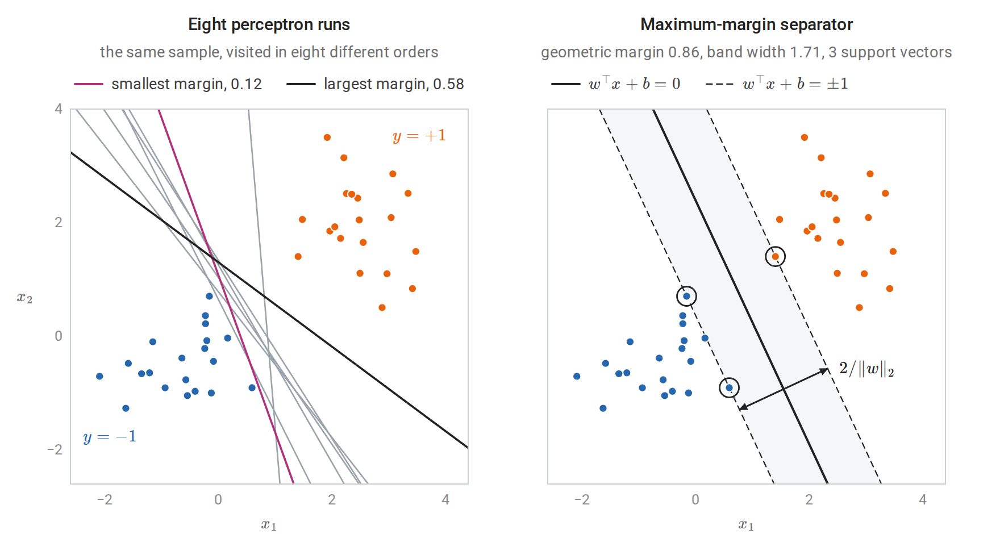

*Left: eight runs of the perceptron with an intercept on one separable sample of 40 points. Every run separates the training data, but the runs stop at very different hyperplanes. Right: the maximum-margin separator of the same sample. No point lies inside the shaded band between the dashed level sets, and the three circled support vectors lie on its edges.*

### <a id="the-hard-margin-problem"></a>The hard-margin problem

Because of the scale freedom, one may require the smallest functional margin to equal one. The geometric margin is then $`1/\|w\|_2`$, and maximizing it is equivalent to minimizing $`\frac12\|w\|_2^2`$ subject to every functional margin being at least one:

$$
\min_{w,b}\ \frac12\|w\|_2^2
\quad\text{subject to}\quad
y_i(w^\top x_i+b)\ge1,\qquad i=1,\ldots,n.
$$

Replacing "the smallest margin equals one" by "every margin is at least one" changes nothing, because at the optimum some constraint is active: otherwise $`w`$ and $`b`$ could be scaled down together and $`\|w\|_2`$ reduced. This is a convex quadratic program, the minimization of a convex quadratic objective under affine constraints. The objective is strictly convex in $`w`$, so the optimal $`w`$ is unique (Calculus and Optimization). The objective does not involve $`b`$, but once $`w`$ is fixed the active constraints determine $`b`$. The formulation was used by [Boser, Guyon, and Vapnik (1992)](https://dl.acm.org/doi/10.1145/130385.130401), who combined it with kernels to produce the first support vector machine (SVM).

## <a id="soft-margins-and-the-hinge-loss"></a>Soft margins and the hinge loss

### <a id="slack-variables"></a>Slack variables

The hard-margin problem is infeasible for nonseparable data, and even for separable data a single outlier can force a tiny margin. [Cortes and Vapnik (1995)](https://link.springer.com/article/10.1007/BF00994018) allowed each constraint to be violated by a **slack** $`\xi_i\ge0`$ at a cost:

$$
\min_{w,b,\xi}\ \frac12\|w\|_2^2+C\sum_{i=1}^n\xi_i
\quad\text{subject to}\quad
y_i(w^\top x_i+b)\ge1-\xi_i,\quad \xi_i\ge0.
$$

The slack $`\xi_i`$ measures, on the scale of the functional margin, how far example $`i`$ falls short of margin one. An example with $`0<\xi_i\le1`$ lies inside the margin but not on the wrong side of the boundary; one with $`\xi_i>1`$ is misclassified. Every misclassified example has $`\xi_i\ge1`$, so the sum $`\sum_i\xi_i`$ upper-bounds the number of training mistakes. The constant $`C>0`$ sets the exchange rate between a wide margin and small violations.

If the data are separable and $`C`$ is at least the largest dual variable $`\alpha_i`$ of the hard-margin solution, the soft-margin problem returns the hard-margin solution. In the notation of the next section, the hard-margin optimality conditions then satisfy the soft-margin ones with $`\xi=0`$ and $`\mu_i=C-\alpha_i\ge0`$.

### <a id="equivalence-with-regularized-hinge-loss"></a>Equivalence with regularized hinge loss

For fixed $`(w,b)`$, the objective increases with each $`\xi_i`$, and the constraints require $`\xi_i\ge1-y_if(x_i)`$ and $`\xi_i\ge0`$. The best slack is therefore $`\xi_i=\max\{0,1-y_if(x_i)\}`$. Substituting it and dividing by $`Cn`$ gives an unconstrained problem:

$$
\min_{w,b}\ \frac1n\sum_{i=1}^n\max\{0,\,1-y_i(w^\top x_i+b)\}+\frac\lambda2\|w\|_2^2,
\qquad \lambda=\frac1{nC}.
$$

The soft-margin SVM is therefore regularized empirical risk minimization with the **hinge loss** $`\max\{0,1-s\}`$ of the margin $`s=y_if(x_i)`$. Three consequences follow from earlier chapters. First, the hinge loss is convex and classification-calibrated, and its population minimizer is $`\operatorname{sign}(2\eta(x)-1)`$, where $`\eta(x)=P(Y=1\mid X=x)`$; the SVM thus targets the Bayes classifier but does not estimate probabilities (chapter 6). Second, the hinge loss and its derivative are zero for margins above one, so well-classified points exert no pull on the solution.

Third, the hinge loss is 1-Lipschitz in the margin, so the stability argument of Information and Learning Theory applies. That argument shows that minimizing $`\frac1n\sum_i\ell(w,z_i)+\frac\lambda2\|w\|_2^2`$ with a loss that is convex and $`L_\ell`$-Lipschitz in $`w`$ has replacement stability $`\beta_n\le2L_\ell^2/(\lambda n)`$, and that $`\beta_n`$ bounds the expected difference between population and training loss. For a linear score with inputs of norm at most $`r`$, the hinge loss is $`r`$-Lipschitz in $`w`$, so the expected gap between test and training hinge loss is at most $`2r^2/(\lambda n)`$ (for the homogeneous problem without an intercept, whose objective is strongly convex in all of its parameters).

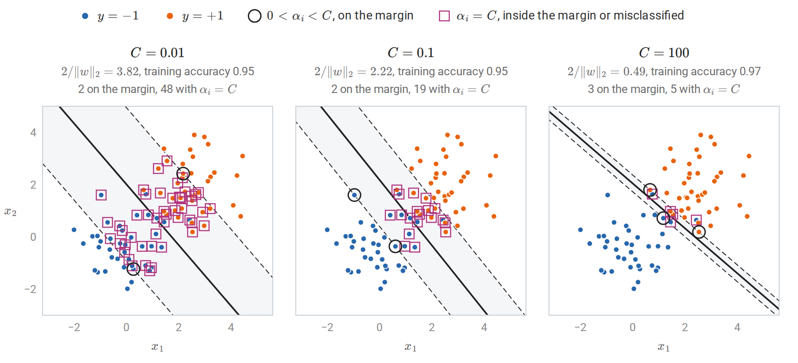

*A linear soft-margin SVM on 80 points from two overlapping Gaussian classes, for three values of $`C`$. With small $`C`$ the penalty on $`\|w\|_2`$ dominates: the margin is wide and 50 of the 80 points are support vectors, almost all of them with $`\alpha_i=C`$. With large $`C`$ slack is expensive, and the margin narrows around the few points that decide the boundary.*

Since $`C`$ multiplies a sum of $`n`$ terms, the same value of $`C`$ means stronger effective regularization for smaller samples; $`\lambda`$ is the sample-size-free parameter. The penalty $`\|w\|_2^2`$ also depends on the units of each feature, so features should be standardized, inside the cross-validation loop (chapter 6), before the SVM is fitted.

## <a id="duality-and-support-vectors"></a>Duality and support vectors

### <a id="deriving-the-dual"></a>Deriving the dual

The Lagrangian duality of Calculus and Optimization, Appendix E turns the soft-margin problem into one that depends on the data only through inner products. With multipliers $`\alpha_i\ge0`$ for the margin constraints and $`\mu_i\ge0`$ for $`\xi_i\ge0`$,

$$
\mathcal L=\frac12\|w\|_2^2+C\sum_i\xi_i-\sum_i\alpha_i\bigl[y_i(w^\top x_i+b)-1+\xi_i\bigr]-\sum_i\mu_i\xi_i.
$$

The dual function is the infimum of $`\mathcal L`$ over the primal variables $`(w,b,\xi)`$. The Lagrangian is a convex quadratic function of $`w`$ and a linear function of $`b`$ and of each $`\xi_i`$. A linear function is bounded below only when its coefficient vanishes, so the infimum is $`-\infty`$ unless the coefficients of $`b`$ and of every $`\xi_i`$ are zero. These two requirements, together with the minimization over $`w`$, amount to setting the derivatives with respect to the primal variables to zero:

$$
w=\sum_{i=1}^n\alpha_iy_ix_i,\qquad
\sum_{i=1}^n\alpha_iy_i=0,\qquad
\alpha_i+\mu_i=C.
$$

The last condition with $`\mu_i\ge0`$ confines $`\alpha_i`$ to $`[0,C]`$. Substituting back eliminates $`w`$, $`b`$, $`\xi`$, and $`\mu`$: the terms in $`b`$ and $`\xi`$ vanish, and $`\sum_i\alpha_iy_iw^\top x_i=\|w\|_2^2`$, so $`\mathcal L`$ reduces to $`\sum_i\alpha_i-\frac12\|w\|_2^2`$. In terms of $`\alpha`$ alone, the dual problem is

$$
\max_{\alpha}\ \sum_{i=1}^n\alpha_i-\frac12\sum_{i,j}\alpha_i\alpha_jy_iy_j\,x_i^\top x_j
\quad\text{subject to}\quad
0\le\alpha_i\le C,\quad \sum_i\alpha_iy_i=0.
$$

Its quadratic part is $`-\frac12\alpha^\top Q\alpha`$ with $`Q_{ij}=y_iy_jx_i^\top x_j`$. The matrix $`Q`$ is the Gram matrix of the vectors $`y_ix_i`$, hence positive semidefinite (Linear Algebra), and the dual objective is concave.

The primal problem is convex, and the point $`w=0`$, $`b=0`$, $`\xi_i=2`$ satisfies every inequality constraint strictly, so Slater's condition holds; the objective is nonnegative, so the optimum is finite. Strong duality therefore holds: the optimal primal and dual values coincide, and the KKT conditions are necessary and sufficient for optimality. (Because all constraints are affine, their feasibility alone would suffice, by a refinement of Slater's condition.) Two features of the dual drive the rest of the chapter. The training inputs appear only through the inner products $`x_i^\top x_j`$. And the box constraint $`\alpha_i\le C`$ limits the influence of any single example, however badly it is misclassified.

### <a id="complementary-slackness-and-three-kinds-of-points"></a>Complementary slackness and three kinds of points

Besides the stationarity equations above, the KKT conditions consist of primal feasibility, dual feasibility ($`\alpha_i\ge0`$ and $`\mu_i=C-\alpha_i\ge0`$), and complementary slackness: a multiplier can be positive only if its constraint is active,

$$
\alpha_i\bigl[y_if(x_i)-1+\xi_i\bigr]=0,\qquad (C-\alpha_i)\xi_i=0.
$$

These two conditions sort the training points into three groups:

| Dual variable | Slack | Position |
| --- | --- | --- |
| $`\alpha_i=0`$ | $`\xi_i=0`$ | $`y_if(x_i)\ge1`$: on or outside the margin; no influence on $`w`$ |
| $`0<\alpha_i<C`$ | $`\xi_i=0`$ | $`y_if(x_i)=1`$: exactly on the margin |
| $`\alpha_i=C`$ | $`\xi_i\ge0`$ | $`y_if(x_i)\le1`$: inside the margin or misclassified |

Points with $`\alpha_i>0`$ are the **support vectors**. The weight vector $`w=\sum_i\alpha_iy_ix_i`$ is a combination of them alone, and deleting any other point and refitting leaves the solution unchanged. The intercept follows from any support vector on the margin: $`b=y_j-w^\top x_j`$ whenever $`0<\alpha_j<C`$, because $`y_j(w^\top x_j+b)=1`$ and $`y_j^2=1`$. Implementations average over all such $`j`$. If none exists, the conditions only confine $`b`$ to an interval, and solvers choose its midpoint.

The following check fits a linear SVM with scikit-learn's [`SVC`](https://scikit-learn.org/stable/modules/generated/sklearn.svm.SVC.html), which stores $`\alpha_iy_i`$ for the support vectors in `dual_coef_`, and verifies each condition.

```python
import numpy as np
from sklearn.svm import SVC

rng = np.random.default_rng(0)
n = 60
y = np.where(np.arange(n) < n // 2, -1.0, 1.0)
X = rng.normal(size=(n, 2)) + np.outer(y > 0, [2.0, 1.5])
C = 1.0
svm = SVC(kernel="linear", C=C, tol=1e-8).fit(X, y)

alpha = np.zeros(n)
alpha[svm.support_] = svm.dual_coef_[0] * y[svm.support_]  # dual_coef_ stores alpha_i * y_i
w = (alpha * y) @ X                                          # stationarity: w = sum_i alpha_i y_i x_i
b = svm.intercept_[0]
margin = y * (X @ w + b)

print("w from the dual equals coef_:", np.allclose(w, svm.coef_[0]))
print("sum_i alpha_i y_i =", round(abs(alpha @ y), 10))
free = (alpha > 1e-8) & (alpha < C - 1e-8)
at_C = alpha >= C - 1e-8
print("0 < alpha < C:", free.sum(), "points, y*f in",
      np.round([margin[free].min(), margin[free].max()], 4).tolist())
print("alpha = C:    ", at_C.sum(), "points, max y*f =", round(margin[at_C].max(), 4))
print("alpha = 0:    ", (alpha < 1e-8).sum(), "points, min y*f =", round(margin[alpha < 1e-8].min(), 4))

# Strong duality: primal and dual objective values coincide at the optimum.
primal = 0.5 * w @ w + C * np.maximum(0, 1 - margin).sum()
Q = (y[:, None] * X) @ (y[:, None] * X).T
dual = alpha.sum() - 0.5 * alpha @ Q @ alpha
print(f"primal {primal:.6f}, dual {dual:.6f}")

# Leave-one-out error is at most the fraction of support vectors.
loo = np.mean([SVC(kernel="linear", C=C).fit(np.delete(X, i, 0), np.delete(y, i)).predict(X[i:i + 1])[0] != y[i]
               for i in range(n)])
print(f"leave-one-out error {loo:.3f} <= support-vector fraction {len(svm.support_) / n:.3f}")
# w from the dual equals coef_: True
# sum_i alpha_i y_i = 0.0
# 0 < alpha < C: 3 points, y*f in [1.0, 1.0]
# alpha = C:     16 points, max y*f = 0.9114
# alpha = 0:     41 points, min y*f = 1.2085
# primal 16.480087, dual 16.480087
# leave-one-out error 0.117 <= support-vector fraction 0.317
```

The three points with $`0<\alpha_i<C`$ have margin exactly one, the sixteen with $`\alpha_i=C`$ have margin below one, and the 41 others have margin above one, as the table requires. The figure shows the same fit in the plane and plots each dual variable against its margin.

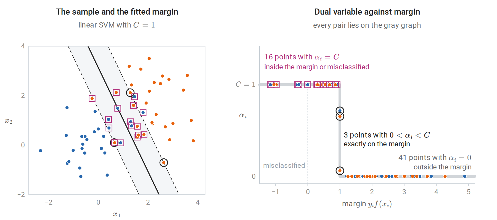

*The three groups for the sample of the code above. Left: rings mark the support vectors on the margin and squares those with $`\alpha_i=C`$, seven of which lie on the wrong side of the boundary; every other point has $`\alpha_i=0`$. Right: complementary slackness allows the pair $`\bigl(y_if(x_i),\alpha_i\bigr)`$ only on the gray graph, which is at height $`C`$ for margins below one, vertical at margin one, and at height zero beyond.*

### <a id="a-leave-one-out-bound"></a>A leave-one-out bound

The last line of the output illustrates a classical bound. If $`\alpha_i=0`$, the solution fitted without example $`i`$ is the same as the full solution, since the remaining KKT conditions still hold with the same multipliers, and that solution classifies $`x_i`$ correctly with $`y_if(x_i)\ge1`$. Leave-one-out mistakes can therefore occur only at support vectors:

$$
\widehat R_{\mathrm{LOO}}\le\frac{\#\{i:\alpha_i>0\}}{n}.
$$

Each term of the leave-one-out estimate evaluates a rule on an example that was not used to fit it, so the estimate is unbiased for the risk of the rule trained on $`n-1`$ examples (chapter 6). Taking expectations, the expected risk of that rule is at most the expected fraction of support vectors, so sparse solutions generalize. The bound is loose for noisy problems, because every misclassified training point is a support vector and the fraction of support vectors then stays bounded away from zero as $`n`$ grows.

### <a id="solving-the-optimization-problem"></a>Solving the optimization problem

A general-purpose quadratic-programming solver needs the $`n\times n`$ matrix $`Q_{ij}=y_iy_jx_i^\top x_j`$ and roughly cubic time, which limits it to a few thousand examples. **Sequential minimal optimization** ([Platt, 1998](https://www.microsoft.com/en-us/research/publication/sequential-minimal-optimization-a-fast-algorithm-for-training-support-vector-machines/)) instead updates two dual variables at a time, a form of the block coordinate ascent of Calculus and Optimization. Two is the smallest number that can change while preserving $`\sum_i\alpha_iy_i=0`$, and the two-variable subproblem has a closed-form solution, derived and drawn in [Appendix A](#block-svm-appendix-a). Each step picks the pair that most violates the KKT conditions. [LIBSVM](https://www.csie.ntu.edu.tw/~cjlin/libsvm/), which scikit-learn's `SVC` wraps, implements a refined version with a cache of kernel rows. Its running time grows between quadratically and cubically in $`n`$, depending on the data and on $`C`$.

For a linear SVM with many examples, the primal is often solved directly. **Pegasos** ([Shalev-Shwartz, Singer, Srebro, and Cotter, 2011](https://link.springer.com/article/10.1007/s10107-010-0420-4)) runs stochastic subgradient descent on the regularized hinge objective of the homogeneous problem, without an intercept. At step $`t`$ it draws one example $`i`$ at random; the vector $`\lambda w-y_ix_i\mathbf 1\{y_iw^\top x_i<1\}`$ is a subgradient of $`\frac\lambda2\|w\|_2^2+\max\{0,1-y_iw^\top x_i\}`$ at $`w`$, and a step against it with step size $`1/(\lambda t)`$ gives

$$
w\leftarrow\Bigl(1-\frac1t\Bigr)w+\frac{1}{\lambda t}\,y_ix_i\,\mathbf 1\{y_iw^\top x_i<1\}.
$$

The objective is $`\lambda`$-strongly convex, and steps of order $`1/(\lambda t)`$ are the standard choice for strongly convex objectives with bounded subgradients (Calculus and Optimization, which defines subgradients in Appendix E). The update resembles the perceptron's, except that it also fires on correct predictions with margin below one, and it shrinks $`w`$ at every step. Dual coordinate descent, used by scikit-learn's [`LinearSVC`](https://scikit-learn.org/stable/modules/generated/sklearn.svm.LinearSVC.html), is another fast option.

## <a id="kernels"></a>Kernels

### <a id="feature-maps-and-the-kernel-trick"></a>Feature maps and the kernel trick

A linear method becomes nonlinear when applied to transformed inputs $`\phi(x)`$. The exclusive-or pattern of chapter 2 and the concentric rings below both become linearly separable after adding quadratic features. The dual SVM on the features $`\phi(x_i)`$ needs only the inner products $`\langle\phi(x_i),\phi(x_j)\rangle`$, and the classifier needs only

$$
f(x)=\sum_i\alpha_iy_i\langle\phi(x_i),\phi(x)\rangle+b.
$$

A **kernel** $`k(x,z)=\langle\phi(x),\phi(z)\rangle`$ that can be evaluated without forming $`\phi`$ therefore gives the nonlinear method at the cost of the linear one. This substitution is the **kernel trick**.

For $`x,z\in\mathbb R^d`$, the polynomial kernel $`k(x,z)=(x^\top z+1)^2`$ expands as

$$
(x^\top z+1)^2=1+\sum_j2x_jz_j+\sum_jx_j^2z_j^2+\sum_{j<l}2x_jx_lz_jz_l,
$$

so $`k(x,z)=\phi(x)^\top\phi(z)`$ with

$$
\phi(x)=\bigl(1,\ \sqrt2x_1,\ldots,\sqrt2x_d,\ x_1^2,\ldots,x_d^2,\ \sqrt2x_1x_2,\ldots,\sqrt2x_{d-1}x_d\bigr).
$$

The feature space has dimension $`(d+1)(d+2)/2`$ and contains every monomial of degree at most two. More generally $`(x^\top z+1)^p`$ corresponds to all $`\binom{d+p}{p}`$ monomials of degree at most $`p`$, suitably weighted. For $`d=100`$ and $`p=5`$ that is about $`9.7\times10^7`$ features, while the kernel costs one inner product of length 100.

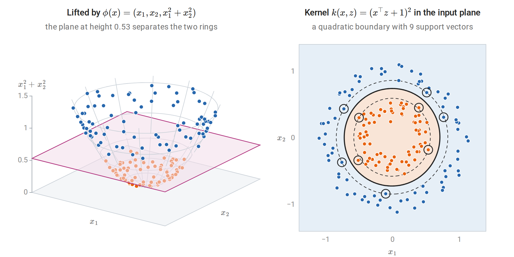

*Left: the lift places each point on the paraboloid of height $`x_1^2+x_2^2`$, where every point of the inner ring lies lower than every point of the outer ring. Right: an SVM with the degree-2 polynomial kernel, whose feature space contains all monomials of degree at most two, finds a closed quadratic boundary without forming the features. Circled points are support vectors; dashed curves are the level sets $`f(x)=\pm1`$.*

### <a id="positive-semidefinite-kernels"></a>Positive semidefinite kernels

Which functions $`k`$ are inner products in some feature space? A symmetric function $`k:\mathcal X\times\mathcal X\to\mathbb R`$ is a **positive semidefinite kernel** if, for every $`m`$ and every choice of points $`x_1,\ldots,x_m\in\mathcal X`$, the Gram matrix $`K_{ij}=k(x_i,x_j)`$ is positive semidefinite:

$$
\sum_{i,j}c_ic_j\,k(x_i,x_j)\ge0\quad\text{for all }c\in\mathbb R^m.
$$

For a single matrix the question has a familiar answer: a symmetric matrix is positive semidefinite exactly when it is the Gram matrix of some vectors (Linear Algebra). A kernel asks for one feature map that produces all of its Gram matrices at once. The condition is necessary: if $`k(x,z)=\langle\phi(x),\phi(z)\rangle`$, the double sum equals $`\|\sum_ic_i\phi(x_i)\|^2\ge0`$. It is also sufficient, and the construction is canonical. Take the functions $`k(\cdot,x)`$ as feature vectors, form their finite linear combinations, and define

$$
\Bigl\langle\sum_ia_ik(\cdot,x_i),\ \sum_jb_jk(\cdot,z_j)\Bigr\rangle=\sum_{i,j}a_ib_j\,k(x_i,z_j).
$$

Positive semidefiniteness makes this an inner product, and completing the space gives the **reproducing kernel Hilbert space** (RKHS) $`\mathcal H_k`$ ([Aronszajn, 1950](https://www.ams.org/journals/tran/1950-068-03/S0002-9947-1950-0051437-7/); details in [Appendix B](#block-svm-appendix-b)). The feature map is $`\phi(x)=k(\cdot,x)`$, and every $`f\in\mathcal H_k`$ satisfies the **reproducing property**

$$
f(x)=\langle f,k(\cdot,x)\rangle_{\mathcal H}.
$$

Evaluating a function is taking an inner product with a feature vector. The Cauchy–Schwarz inequality, which holds in every inner-product space as in the Euclidean case of Linear Algebra, then shows that the RKHS norm controls how much a function can vary:

$$

|f(x)-f(z)|\le\|f\|_{\mathcal H}\,\|\phi(x)-\phi(z)\|_{\mathcal H}
=\|f\|_{\mathcal H}\sqrt{k(x,x)-2k(x,z)+k(z,z)}.
$$

A small norm forces $`f`$ to be smooth with respect to the geometry the kernel defines. Penalizing $`\|f\|_{\mathcal H}^2`$, as the SVM does, is a smoothness penalty.

For continuous kernels on a compact domain, **Mercer's theorem** gives an explicit feature map through an eigen-expansion $`k(x,z)=\sum_j\lambda_je_j(x)e_j(z)`$ with $`\lambda_j\ge0`$ and orthonormal functions $`e_j`$, a series that converges absolutely and uniformly. The $`\lambda_j`$ and $`e_j`$ are the eigenvalues and eigenfunctions of the integral operator $`(T_ke)(x)=\int k(x,z)e(z)\,d\nu(z)`$, where $`\nu`$ is a finite measure that gives positive mass to every open set. This operator plays the role of a positive semidefinite matrix, and the expansion is the counterpart of its spectral decomposition. The feature map is $`\bigl(\sqrt{\lambda_j}e_j(x)\bigr)_j`$, and the decay of the eigenvalues determines how many directions of the feature space matter in practice.

### <a id="building-kernels"></a>Building kernels

Positive semidefiniteness is preserved by the operations below, proved in [Appendix B](#block-svm-appendix-b). If $`k_1,k_2`$ are kernels, then so are $`k_1+k_2`$; $`ck_1`$ for $`c\ge0`$; the product $`k_1k_2`$; $`g(x)k_1(x,z)g(z)`$ for any function $`g`$; $`k_1(\psi(x),\psi(z))`$ for any map $`\psi`$; any polynomial in $`k_1`$ with nonnegative coefficients; $`\exp(k_1)`$; and pointwise limits of kernels. Common choices:

| Kernel | $`k(x,z)`$ | Feature space |
| --- | --- | --- |
| Linear | $`x^\top z`$ | $`\mathbb R^d`$ |
| Polynomial | $`(x^\top z+c)^p`$, $`c\ge0`$ | Monomials of degree at most $`p`$ (exactly $`p`$ if $`c=0`$) |
| Gaussian (RBF) | $`\exp(-\gamma\Vert x-z\Vert_2^2)`$ | Infinite-dimensional |
| Laplacian | $`\exp(-\gamma\Vert x-z\Vert_1)`$ | Infinite-dimensional |
| Set intersection | $`\lvert A\cap B\rvert`$ | Indicator vector of the set |

In the Gaussian and Laplacian kernels, $`\gamma>0`$ is an inverse width, named `gamma` in scikit-learn; from here on $`\gamma`$ denotes this kernel parameter, and it is unrelated to the margin $`\gamma`$ of the first sections. The Gaussian kernel is a kernel because $`\exp(-\gamma\|x-z\|^2)=e^{-\gamma\|x\|^2}\,e^{2\gamma x^\top z}\,e^{-\gamma\|z\|^2}`$, the exponential of a scaled linear kernel multiplied on both sides by a function. The Taylor series of $`e^{2\gamma x^\top z}`$ contains monomials of every degree, so its feature space is infinite-dimensional. Its Gram matrix on distinct points is strictly positive definite (a consequence of Bochner's theorem, stated [below](#scaling-to-large-samples), because its Fourier transform is positive everywhere), so with $`C`$ large enough a Gaussian SVM can fit any labeling of any finite sample. The class of Gaussian-kernel classifiers therefore has infinite VC dimension, and its capacity must be controlled by the norm $`\|f\|_{\mathcal H}`$, not by counting dimensions.

Kernels need not act on vectors. The set-intersection kernel is an inner product of indicator vectors, and string, tree, and graph kernels count shared substructures in the same way. Not every plausible similarity is a kernel. The "sigmoid kernel" $`\tanh(ax^\top z+c)`$, offered by several libraries for historical reasons, is not positive semidefinite in general. With an indefinite kernel the dual is no longer a concave maximization and the geometric interpretation is lost.

The next computation checks the explicit polynomial feature map above, shows that ridge regression on those features and kernel ridge regression (developed below) give identical predictions, and tests three candidate kernels for positive semidefiniteness through the smallest eigenvalue of a Gram matrix.

```python
import numpy as np
from itertools import combinations

rng = np.random.default_rng(1)
n, d, lam = 50, 3, 0.1
X = rng.normal(size=(n, d))
y = X[:, 0] * X[:, 1] - X[:, 2] ** 2 + 0.1 * rng.normal(size=n)
Xnew = rng.normal(size=(5, d))

def phi(X):
    """Explicit features with phi(x).phi(z) = (x.z + 1)^2."""
    cols = [np.ones(len(X))] + [np.sqrt(2) * X[:, j] for j in range(d)] + [X[:, j] ** 2 for j in range(d)]
    cols += [np.sqrt(2) * X[:, j] * X[:, k] for j, k in combinations(range(d), 2)]
    return np.column_stack(cols)

P = phi(X)
print("feature dimension:", P.shape[1])  # 1 + d + d(d+1)/2
K = (X @ X.T + 1) ** 2
print("kernel equals feature inner products:", np.allclose(K, P @ P.T))

# Ridge regression on explicit features (a d'-by-d' system) ...
beta = np.linalg.solve(P.T @ P + lam * np.eye(P.shape[1]), P.T @ y)
# ... and kernel ridge regression (an n-by-n system) give the same predictions.
alpha = np.linalg.solve(K + lam * np.eye(n), y)
k_new = (Xnew @ X.T + 1) ** 2
print("same predictions:", np.allclose(phi(Xnew) @ beta, k_new @ alpha))

# Positive semidefiniteness of Gram matrices for three candidate kernels.
Z = rng.normal(size=(200, d))
sq = (Z ** 2).sum(1)
grams = {
    "Gaussian exp(-|x-z|^2/2)": np.exp(-0.5 * (sq[:, None] + sq[None, :] - 2 * Z @ Z.T)),
    "polynomial (x.z + 1)^3": (Z @ Z.T + 1) ** 3,
    "sigmoid tanh(x.z - 1)": np.tanh(Z @ Z.T - 1),
}
for name, G in grams.items():
    ev = np.linalg.eigvalsh(G)
    psd = ev[0] >= -1e-10 * ev[-1]
    note = "" if psd else f", smallest eigenvalue {ev[0]:.1f}"
    print(f"{name:26s} PSD: {psd!s:5s} rank {np.linalg.matrix_rank(G):3d}{note}")
# feature dimension: 10
# kernel equals feature inner products: True
# same predictions: True
# Gaussian exp(-|x-z|^2/2)   PSD: True  rank 200
# polynomial (x.z + 1)^3     PSD: True  rank  20
# sigmoid tanh(x.z - 1)      PSD: False rank 200, smallest eigenvalue -92.8
```

The cubic kernel in three variables has $`\binom{6}{3}=20`$ monomial features, so its $`200\times200`$ Gram matrix has rank 20. The Gaussian Gram matrix has full rank, as strict positive definiteness requires, but its eigenvalues decay quickly: only 74 of the 200 exceed a thousandth of the largest. The nonzero eigenvalues of $`K/n`$ are exactly those of the integral operator $`T_k`$ of Mercer's theorem when $`\nu`$ is the empirical distribution of the points, so this decay is Mercer's eigenvalue decay seen on a sample. The sigmoid Gram matrix, by contrast, has 98 negative eigenvalues among its 200.

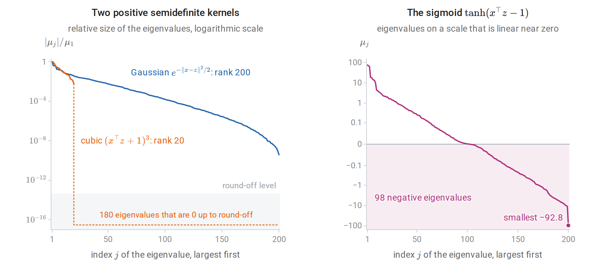

*Eigenvalues $`\mu_j`$ of the three Gram matrices of the code above, largest first. Left: the Gaussian eigenvalues fall by nearly ten orders of magnitude but stay positive, while the cubic kernel's drop to round-off after the twentieth, matching its twenty monomial features. Right: nearly half of the sigmoid eigenvalues are negative, so no feature map produces this matrix.*

## <a id="the-representer-theorem"></a>The representer theorem

The SVM's weight vector is a combination of training features, $`w=\sum_i\alpha_iy_i\phi(x_i)`$. The same form arises for any objective that sees a function only through its values at the training inputs and penalizes its RKHS norm.

**Theorem** ([Schölkopf, Herbrich, and Smola, 2001](https://link.springer.com/chapter/10.1007/3-540-44581-1_27), generalizing Kimeldorf and Wahba). Let $`\mathcal H`$ be an RKHS with kernel $`k`$, let $`L:\mathbb R^n\to\mathbb R`$ be any function, and let $`\Omega`$ be strictly increasing on $`[0,\infty)`$. Every minimizer of

$$
L\bigl(f(x_1),\ldots,f(x_n)\bigr)+\Omega\bigl(\|f\|_{\mathcal H}\bigr)
$$

over $`f\in\mathcal H`$ has the form $`f=\sum_{i=1}^n\alpha_ik(\cdot,x_i)`$.

**Proof.** Write $`f=f_\parallel+f_\perp`$, where $`f_\parallel`$ lies in the span of $`k(\cdot,x_1),\ldots,k(\cdot,x_n)`$ and $`f_\perp`$ is orthogonal to it. The span is finite-dimensional, so this orthogonal decomposition exists and is unique, exactly as for the projection onto a subspace of Euclidean space. By the reproducing property, $`f(x_i)=\langle f,k(\cdot,x_i)\rangle=\langle f_\parallel,k(\cdot,x_i)\rangle=f_\parallel(x_i)`$, so the loss term does not depend on $`f_\perp`$. By Pythagoras, $`\|f\|^2=\|f_\parallel\|^2+\|f_\perp\|^2`$, so $`\Omega`$ strictly decreases when $`f_\perp\ne0`$ is removed. A minimizer therefore has $`f_\perp=0`$. $`\square`$

The component $`f_\perp`$ in the proof is a function that vanishes at every training input: orthogonality to $`k(\cdot,x_i)`$ means $`f_\perp(x_i)=0`$ by the reproducing property. The figure constructs one and adds it to a fitted function.

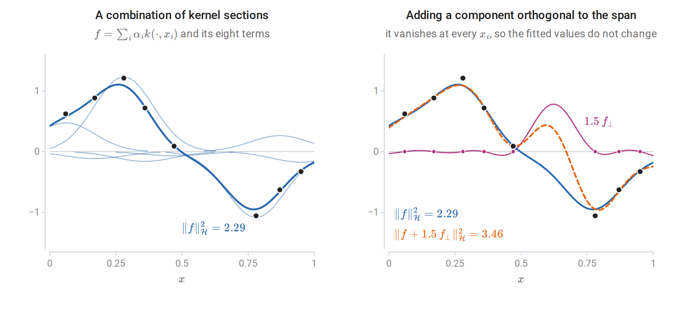

*Left: kernel ridge regression with a Gaussian kernel on eight observations (dots). The fit (thick) is the sum of eight weighted kernel sections $`\alpha_ik(\cdot,x_i)`$ (thin). Right: $`f_\perp`$ is the part of the kernel section $`k(\cdot,0.62)`$ orthogonal to the span of the $`k(\cdot,x_i)`$. Adding a multiple of it changes the function only away from the observations and leaves the loss unchanged, but increases the squared norm.*

The theorem converts an optimization over a possibly infinite-dimensional space into one over $`\alpha\in\mathbb R^n`$. With $`f=\sum_j\alpha_jk(\cdot,x_j)`$,

$$
\bigl(f(x_1),\ldots,f(x_n)\bigr)^\top=K\alpha,\qquad \|f\|_{\mathcal H}^2=\alpha^\top K\alpha.
$$

Any loss can be kernelized this way: hinge loss gives the kernel SVM, squared loss gives kernel ridge regression, and log loss gives kernel logistic regression. An unpenalized intercept or other finite-dimensional unpenalized component can be added, and the same argument applies to the penalized part. The theorem says nothing about sparsity: kernel ridge and kernel logistic regression generally have every $`\alpha_i\ne0`$, whereas the flat part of the hinge loss makes most SVM coefficients zero, so prediction requires kernel evaluations only at the support vectors.

## <a id="kernel-methods"></a>Kernel methods

### <a id="the-kernel-perceptron"></a>The kernel perceptron

The perceptron's weight vector is $`w=\sum_i\alpha_iy_i\phi(x_i)`$, where $`\alpha_i`$ counts mistakes on example $`i`$ (chapter 2). Storing $`\alpha`$ instead of $`w`$, the score of $`x`$ is $`\sum_i\alpha_iy_ik(x_i,x)`$, and a mistake on $`x_i`$ increments $`\alpha_i`$. Novikoff's theorem holds in the feature space: if some unit vector of $`\mathcal H`$ separates the data with margin $`\gamma`$ and $`k(x_i,x_i)\le R^2`$, the number of mistakes is at most $`(R/\gamma)^2`$. Here $`\gamma`$ is again a margin, not a kernel parameter. The dimension of $`\mathcal H`$, possibly infinite, does not enter. For the Gaussian kernel $`R=1`$. [Freund and Schapire (1999)](https://link.springer.com/article/10.1023/A:1007662407062) showed that the voted kernel perceptron performs close to kernel SVMs on handwritten digits.

```python
import numpy as np
from sklearn.datasets import make_circles

X, y01 = make_circles(n_samples=200, noise=0.05, factor=0.5, random_state=0)
y = 2.0 * y01 - 1
sq = (X ** 2).sum(1)

def kernel_perceptron(K, y, max_epochs=50):
    """Dual perceptron: alpha_i counts mistakes on example i; score(x) = sum_i alpha_i y_i k(x_i, x)."""
    alpha = np.zeros(len(y))
    for epoch in range(1, max_epochs + 1):
        mistakes = 0
        for i in range(len(y)):
            if y[i] * ((alpha * y) @ K[:, i]) <= 0:
                alpha[i] += 1
                mistakes += 1
        if mistakes == 0:
            return alpha, epoch
    return alpha, None

K_lin = X @ X.T + 1  # linear kernel with a constant feature for the intercept
K_rbf = np.exp(-2.0 * (sq[:, None] + sq[None, :] - 2 * X @ X.T))
for name, K in [("linear", K_lin), ("Gaussian", K_rbf)]:
    alpha, epoch = kernel_perceptron(K, y)
    acc = np.mean(np.sign((alpha * y) @ K) == y)
    status = f"converged in epoch {epoch}" if epoch else "no convergence in 50 epochs"
    print(f"{name:8s}: {status}; {int(alpha.sum())} updates on {np.count_nonzero(alpha)} examples; "
          f"training accuracy {acc:.2f}")
# linear  : no convergence in 50 epochs; 5573 updates on 164 examples; training accuracy 0.65
# Gaussian: converged in epoch 2; 13 updates on 13 examples; training accuracy 1.00
```

On the two rings, which no line separates, the linear perceptron cycles indefinitely. The Gaussian kernel perceptron, with kernel $`\exp(-2\|x-z\|^2)`$, stops after 13 mistakes, and its classifier is a combination of 13 kernel functions.

### <a id="kernel-svms"></a>Kernel SVMs

Replacing $`x_i^\top x_j`$ by $`k(x_i,x_j)`$ in the dual gives the kernel SVM:

$$
\max_{\alpha}\ \sum_i\alpha_i-\frac12\sum_{i,j}\alpha_i\alpha_jy_iy_j\,k(x_i,x_j)
\quad\text{subject to}\quad
0\le\alpha_i\le C,\quad \sum_i\alpha_iy_i=0,
$$

with decision function $`f(x)=\sum_{i:\alpha_i>0}\alpha_iy_ik(x_i,x)+b`$ and $`b=y_j-\sum_i\alpha_iy_ik(x_i,x_j)`$ for any $`j`$ with $`0<\alpha_j<C`$. In primal form, the kernel SVM minimizes $`\sum_i\max\{0,1-y_i(g(x_i)+b)\}+\frac1{2C}\|g\|_{\mathcal H}^2`$ over $`g\in\mathcal H`$ and $`b\in\mathbb R`$. Everything in the preceding sections, including the three kinds of points, the leave-one-out bound, and SMO, carries over unchanged with $`K`$ in place of $`XX^\top`$.

### <a id="kernel-ridge-regression"></a>Kernel ridge regression

With squared loss, the representer theorem reduces

$$
\min_{f\in\mathcal H}\ \sum_{i=1}^n\bigl(y_i-f(x_i)\bigr)^2+\lambda\|f\|_{\mathcal H}^2
$$

to minimizing $`\|y-K\alpha\|_2^2+\lambda\,\alpha^\top K\alpha`$. Here $`\lambda`$ weighs the penalty against a sum rather than an average of squared errors, as in chapter 3; it is not the $`\lambda=1/(nC)`$ of the averaged hinge objective. The gradient is $`2K\bigl[(K+\lambda I)\alpha-y\bigr]`$, which vanishes at

$$
\hat\alpha=(K+\lambda I)^{-1}y,\qquad
\hat f(x)=k(x)^\top(K+\lambda I)^{-1}y,\quad k(x)_i=k(x_i,x).
$$

With the linear kernel $`K=XX^\top`$ this is the dual form of ridge regression from chapter 3. The fitted values $`\hat y=K(K+\lambda I)^{-1}y`$ are a linear smoother. With the spectral decomposition $`K=\sum_j\mu_ju_ju_j^\top`$ (Linear Algebra), the smoother matrix has eigenvalues $`\mu_j/(\mu_j+\lambda)`$, so the effective degrees of freedom, the trace of the smoother, are $`\sum_j\mu_j/(\mu_j+\lambda)`$, and the leave-one-out shortcut of chapter 6 applies exactly. The same predictor is the posterior mean of Gaussian-process regression with noise variance $`\lambda`$, which adds predictive uncertainty (chapter 15). [Welling's note on kernel ridge regression](https://web2.qatar.cmu.edu/~gdicaro/10315-Fall19/additional/welling-notes-on-kernel-ridge.pdf) gives the derivation from the primal.

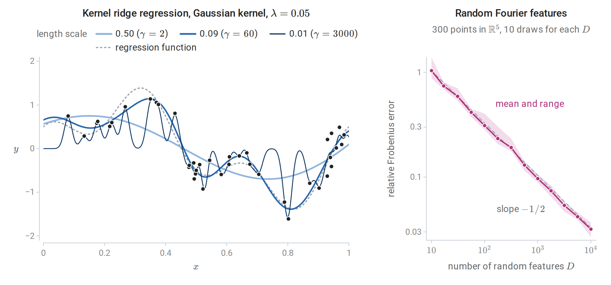

*Left: kernel ridge regression on 40 noisy observations with three Gaussian kernel widths, labeled by the length scale $`1/\sqrt{2\gamma}`$. The widest kernel oversmooths. The narrowest chases the noise and falls back toward zero, the value favored by the penalty, between observations. Right: relative Frobenius error of the random-Fourier-feature approximation to a Gaussian Gram matrix, described in the next subsection. The error decays like $`D^{-1/2}`$, the Monte Carlo rate.*

Kernel ridge regression costs $`O(n^3)`$ time and $`O(n^2)`$ memory, and its coefficients are dense. **Support vector regression** instead uses the $`\varepsilon`$-insensitive loss $`\max\{0,|y-f(x)|-\varepsilon\}`$, which ignores residuals smaller than $`\varepsilon`$. Its dual has the same box-constrained form as the SVM, and only points on or outside the $`\varepsilon`$-tube become support vectors.

### <a id="scaling-to-large-samples"></a>Scaling to large samples

Two approximations replace the $`n\times n`$ kernel matrix by an explicit low-dimensional feature map, after which a linear method is fitted in $`O(nD^2)`$ time for $`D`$ features.

The **Nyström method** ([Williams and Seeger, 2000](https://proceedings.neurips.cc/paper/2000/hash/19de10adbaa1b2ee13f77f679fa1483a-Abstract.html)) chooses $`m`$ landmark points and uses $`K\approx K_{nm}K_{mm}^{-1}K_{mn}`$, a rank-$`m`$ approximation built from kernel evaluations against the landmarks. Here $`K_{mm}`$ holds the kernel values among the landmarks and $`K_{nm}=K_{mn}^\top`$ those between the $`n`$ inputs and the landmarks. The approximation replaces each feature vector $`\phi(x)`$ by its orthogonal projection onto the span of the landmarks' feature vectors, and the corresponding explicit features are $`\hat\phi(x)=K_{mm}^{-1/2}\bigl(k(z_1,x),\ldots,k(z_m,x)\bigr)^\top`$ for landmarks $`z_1,\ldots,z_m`$, with the inverse square root of Linear Algebra. The best rank-$`m`$ approximation, the truncated eigendecomposition of Linear Algebra, would need all of $`K`$; the Nyström method needs only $`m`$ of its columns.

**Random Fourier features** ([Rahimi and Recht, 2007](https://proceedings.neurips.cc/paper/2007/hash/013a006f03dbc5392effeb8f18fda755-Abstract.html)) use Bochner's theorem: a continuous shift-invariant kernel $`k(x-z)`$ is positive semidefinite exactly when it is the Fourier transform of a nonnegative measure. After normalizing $`k(0)=1`$, that measure is a probability distribution $`p(\omega)`$, and $`k(x-z)=\mathbb E_\omega\bigl[\cos\bigl(\omega^\top(x-z)\bigr)\bigr]`$; in other words, $`k`$, as a function of the difference $`x-z`$, is the characteristic function of $`p`$. With $`\omega_j\sim p`$ and $`b_j\sim\operatorname{Uniform}[0,2\pi]`$, the features

$$
\hat\phi(x)=\sqrt{\frac2D}\bigl(\cos(\omega_1^\top x+b_1),\ldots,\cos(\omega_D^\top x+b_D)\bigr)
$$

satisfy $`\mathbb E\bigl[\hat\phi(x)^\top\hat\phi(z)\bigr]=k(x-z)`$, because $`2\cos(a+b)\cos(c+b)=\cos(a-c)+\cos(a+c+2b)`$ and the second term averages to zero over $`b`$. The inner product $`\hat\phi(x)^\top\hat\phi(z)`$ is thus a Monte Carlo average of $`D`$ independent terms, and its error shrinks like $`D^{-1/2}`$, as the right panel of the previous figure shows. For the Gaussian kernel $`\exp(-\gamma\|x-z\|^2)`$, $`p`$ is $`\mathcal N(0,2\gamma I)`$. scikit-learn provides both approximations as [kernel approximation transformers](https://scikit-learn.org/stable/modules/kernel_approximation.html).

## <a id="choosing-the-kernel-and-its-parameters"></a>Choosing the kernel and its parameters

### <a id="kernel-width-and-regularization"></a>Kernel width and regularization

For the Gaussian kernel $`\exp(-\gamma\|x-z\|^2)`$, the length scale $`1/\sqrt{2\gamma}`$ sets the distance over which training points influence predictions. The two parameters interact.

- **Small $`\gamma`$** (wide kernel): all kernel values are close to one and $`f`$ varies slowly. As the width grows while $`C`$ grows in proportion to the squared width, the Gaussian SVM converges to a linear SVM ([Keerthi and Lin, 2003](https://direct.mit.edu/neco/article/15/7/1667/6751/Asymptotic-Behaviors-of-Support-Vector-Machines)). With $`C`$ held fixed instead, it underfits.
- **Large $`\gamma`$** (narrow kernel): $`K`$ approaches the identity. With large $`C`$, each training point is fitted by its own bump and the classifier memorizes the sample; far from the data, $`f(x)\approx b`$ and the prediction is a single class.
- **$`C`$** bounds each $`\alpha_i`$ and therefore the height of each bump. A narrow kernel with small $`C`$ cannot overcome the intercept at all.

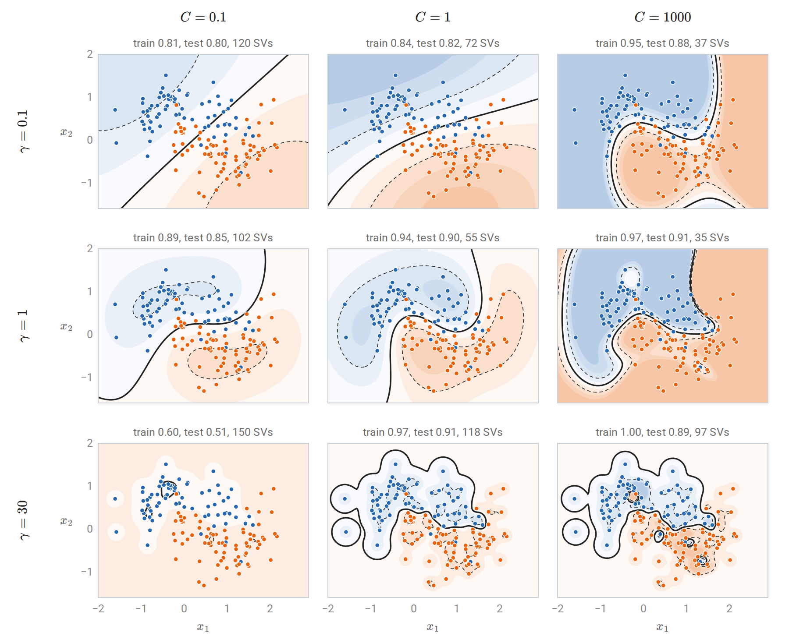

*Gaussian-kernel SVMs on 150 training points from two interleaved half-moons, with accuracy on 150 test points. Rows increase $`\gamma`$ (narrower kernels); columns increase $`C`$ (weaker regularization). Shading shows the decision function, blue where it is negative and orange where it is positive; the solid curve is its zero level and the dashed curves the level sets $`f=\pm1`$. Small $`\gamma`$ with small $`C`$ gives a nearly linear rule; large $`\gamma`$ with large $`C`$ fits islands around individual points and classifies every training point correctly. With $`\gamma=30`$ and $`C=0.1`$ the bound $`\alpha_i\le C`$ keeps the kernel expansion too small to overcome the intercept, and the rule predicts one class almost everywhere.*

Good settings lie along a ridge in the $`(\log\gamma,\log C)`$ plane: a wider kernel needs a larger $`C`$ to bend the boundary enough. [Hsu, Chang, and Lin's practical guide](https://www.csie.ntu.edu.tw/~cjlin/papers/guide/guide.pdf) recommends scaling the features, starting with the Gaussian kernel, and searching exponentially spaced grids of both parameters by cross-validation. A common starting value sets the length scale to the median pairwise distance between training inputs. Because the selected pair is the best of many, its cross-validation score is optimistic, and an honest estimate requires nested cross-validation (chapter 6).

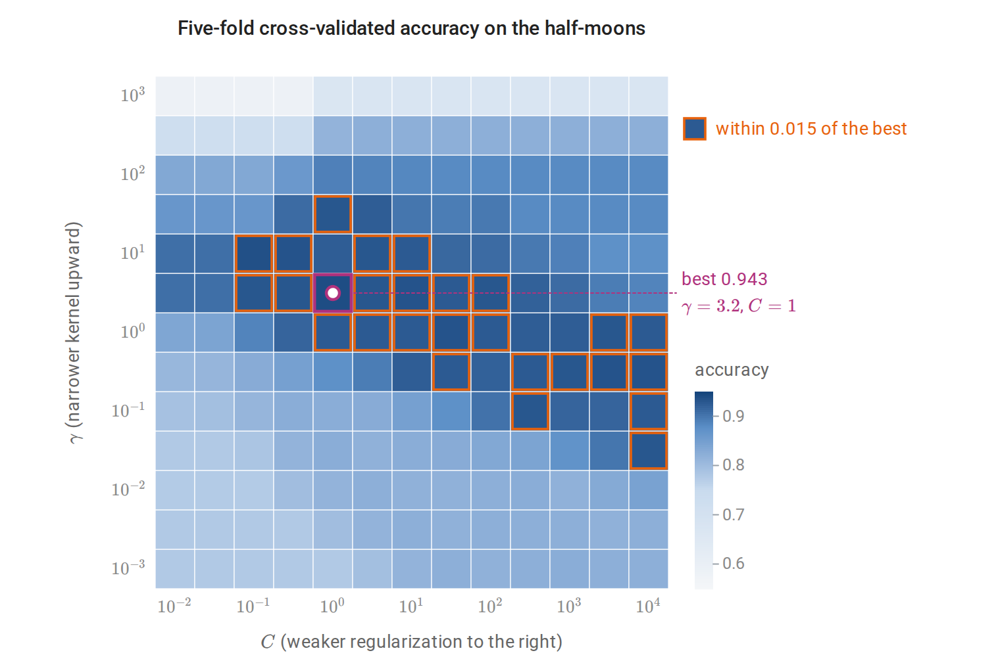

*The grid of $`(\gamma,C)`$ is logarithmic, and the cross-validation uses all 300 points. The outlined near-best cells run along a diagonal from narrow kernels with $`C`$ near one to wide kernels with large $`C`$. Accuracy falls for the narrowest kernels at every $`C`$. Wide kernels with small $`C`$ reduce to a nearly linear rule with about 78% accuracy.*

The scikit-learn example [RBF SVM parameters](https://scikit-learn.org/stable/auto_examples/svm/plot_rbf_parameters.html) reproduces this analysis on the iris data, and the [SVM user guide](https://scikit-learn.org/stable/modules/svm.html) documents the implementation details.

### <a id="practical-choices"></a>Practical choices

A linear kernel is usually adequate when $`d`$ is large relative to $`n`$, as with bag-of-words text, because the data are then often nearly separable already; `LinearSVC` scales to millions of examples. The Gaussian kernel is a strong default for dense, low-dimensional inputs. Kernel SVMs become slow beyond a few tens of thousands of examples, where kernel approximations, or the tree ensembles of chapters 10 and 11, are more practical. For imbalanced classes, per-class values of $`C`$ penalize errors on the rare class more heavily.

## <a id="beyond-binary-classification"></a>Beyond binary classification

### <a id="multiclass-svms"></a>Multiclass SVMs

Two reductions to binary problems are common. **One-versus-rest** trains $`K`$ classifiers, each separating one class from all others, and predicts the class with the largest score. The scores come from separately trained problems, so their scales need not be comparable. **One-versus-one** trains $`K(K-1)/2`$ classifiers on pairs of classes and predicts by voting; each subproblem is small, which suits the superlinear cost of kernel SVM training, and LIBSVM uses it. [Crammer and Singer (2001)](https://www.jmlr.org/papers/v2/crammer01a.html) instead train all $`K`$ score functions jointly with the multiclass hinge loss

$$
\max\Bigl\{0,\ 1+\max_{k\ne y}f_k(x)-f_y(x)\Bigr\},
$$

which requires the correct class to beat every other by a margin of one, the analogue of the multiclass perceptron of chapter 2.

### <a id="probability-outputs"></a>Probability outputs

The hinge loss targets only the sign of $`2\eta(x)-1`$, so SVM scores are not probabilities. When probabilities are needed, **Platt scaling** fits a logistic regression of the label on the SVM score using held-out data (chapter 5). In scikit-learn, `SVC(probability=True)` does this with an internal five-fold cross-validation, which multiplies training cost. Its probabilities can also disagree with the sign of the decision function on some points. If calibrated probabilities are the main goal, logistic regression or kernel logistic regression optimizes the right loss directly.

## <a id="generalization-of-kernel-classifiers"></a>Generalization of kernel classifiers

The Rademacher bound for norm-bounded linear scores in Information and Learning Theory uses only inner products, so it holds verbatim in an RKHS. For $`\mathcal F_B=\{x\mapsto\langle g,\phi(x)\rangle_{\mathcal H}:\|g\|_{\mathcal H}\le B\}`$, the supremum of $`\frac1n\sum_i\sigma_i\langle g,\phi(x_i)\rangle`$ over the ball is $`\frac Bn\|\sum_i\sigma_i\phi(x_i)\|_{\mathcal H}`$, and the expected squared norm of $`\sum_i\sigma_i\phi(x_i)`$ is $`\sum_ik(x_i,x_i)`$ because the cross terms have mean zero. Jensen's inequality then gives

$$
\widehat{\mathfrak R}_{x_{1:n}}(\mathcal F_B)\le\frac Bn\sqrt{\sum_{i=1}^nk(x_i,x_i)}=\frac Bn\sqrt{\operatorname{tr}K}.
$$

If $`k(x,x)\le r^2`$ for all $`x`$, this is at most $`Br/\sqrt n`$; for the Gaussian kernel $`r=1`$. The ramp loss $`\min\{1,\max\{0,1-s\}\}`$ of Information and Learning Theory, the case $`\rho=1`$ of its margin level, is bounded by the hinge loss $`\max\{0,1-s\}`$ of the margin $`s=yg(x)`$, so the margin bound of Foundations gives, with probability at least $`1-\delta`$, simultaneously for all $`g`$ with $`\|g\|_{\mathcal H}\le B`$,

$$
P\bigl(Yg(X)\le0\bigr)\le\frac1n\sum_{i=1}^n\max\{0,1-y_ig(x_i)\}+\frac{2Br}{\sqrt n}+\sqrt{\frac{\ln(1/\delta)}{2n}}.
$$

The probability on the left is the error of the classifier $`\operatorname{sign}g`$ on a new observation, counting a zero score as an error. The two data-dependent terms are the two terms of the SVM objective: average slack and the norm of the function. The SVM minimizes a weighted sum of them, and $`C`$ sets the weight. An unpenalized intercept is not covered directly, but appending a constant feature, which replaces $`k`$ by $`k+1`$, covers the classifier $`\operatorname{sign}(g+b)`$ at the price of $`r^2+1`$ in place of $`r^2`$ and $`\|g\|_{\mathcal H}^2+b^2`$ in place of $`B^2`$.

A bound usable for the fitted SVM must hold for a data-dependent $`B`$, which a union bound over a geometric grid of values provides at a small cost, as in structural risk minimization (chapter 7). The bound depends on the kernel only through $`r`$ and on the classifier only through its margin violations and norm, not through the dimension of $`\mathcal H`$. This is how a classifier with infinite VC dimension can generalize.

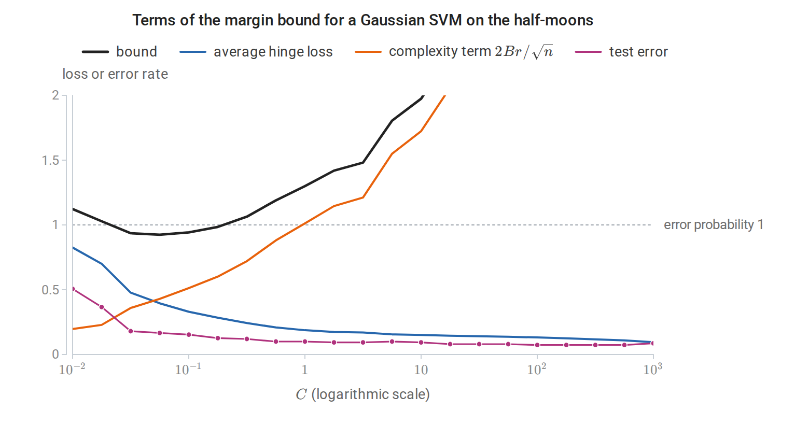

*Along the regularization path of a Gaussian SVM with $`\gamma=1`$ on the 150 training points, with the intercept covered by the kernel $`k+1`$ and $`\delta=0.05`$, increasing $`C`$ lowers the average hinge loss and raises the complexity term. The bound, evaluated as if $`B`$ had been fixed in advance, is below one only for $`C`$ between about 0.03 and 0.18, where the test error is 0.13 to 0.18; the test error is smallest, 0.073, at $`C=100`$, where the bound is 4.0.*

The kernel also changes which functions have small norm. A narrow Gaussian kernel can fit a complicated boundary, but only with a large $`\|g\|_{\mathcal H}`$, which the bound penalizes. The bound is typically loose numerically, as the figure shows, and in practice the kernel width and $`C`$ are chosen by cross-validation, but it explains which quantities control overfitting. The same kernel ideas return later: kernel PCA in chapter 12, Gaussian processes in chapter 15, and the neural tangent kernel description of very wide networks in the DL module.

## <a id="appendices"></a>Appendices


<details>
<summary><a id="block-svm-appendix-a"></a><b>A. The two-variable step of SMO</b></summary>


Write the dual objective as $`D(\alpha)=\sum_k\alpha_k-\frac12\alpha^\top Q\alpha`$ with $`Q_{kl}=y_ky_lK_{kl}`$, and let $`E_k=f(x_k)-y_k`$ be the current prediction error, where $`f(x)=\sum_l\alpha_ly_lk(x_l,x)+b`$. To keep $`\sum_k\alpha_ky_k`$ fixed while changing $`\alpha_i`$ and $`\alpha_j`$, move along

$$
\alpha_j\leftarrow\alpha_j+y_jt,\qquad \alpha_i\leftarrow\alpha_i-y_it.
$$

The sum changes by $`y_j^2t-y_i^2t=0`$. Since $`\partial D/\partial\alpha_k=1-y_k\bigl(f(x_k)-b\bigr)`$ and $`y_k^2=1`$, the derivative along this direction at $`t=0`$ is

$$
y_j\bigl(1-y_jf(x_j)+y_jb\bigr)-y_i\bigl(1-y_if(x_i)+y_ib\bigr)=E_i-E_j.
$$

The intercept cancels. The second derivative is $`-(K_{ii}+K_{jj}-2K_{ij})=-\kappa`$, where $`\kappa=\|\phi(x_i)-\phi(x_j)\|^2\ge0`$ (Platt writes $`\eta`$; the chapter reserves $`\eta`$ for the conditional class probability). The objective along the line is therefore

$$
D(t)=D(0)+t\,(E_i-E_j)-\frac\kappa2t^2,
$$

maximized at $`t^\star=(E_i-E_j)/\kappa`$ when $`\kappa>0`$. In terms of $`\alpha_j`$:

$$
\alpha_j^{\text{new}}=\alpha_j+\frac{y_j(E_i-E_j)}{\kappa}.
$$

Both variables must stay in $`[0,C]`$, so $`\alpha_j^{\text{new}}`$ is clipped to $`[L,H]`$. If $`y_i\ne y_j`$, then $`\alpha_j-\alpha_i`$ is conserved and $`L=\max\{0,\alpha_j-\alpha_i\}`$, $`H=\min\{C,C+\alpha_j-\alpha_i\}`$. If $`y_i=y_j`$, then $`\alpha_i+\alpha_j`$ is conserved and $`L=\max\{0,\alpha_i+\alpha_j-C\}`$, $`H=\min\{C,\alpha_i+\alpha_j\}`$. Finally,

$$
\alpha_i^{\text{new}}=\alpha_i+y_iy_j\bigl(\alpha_j-\alpha_j^{\text{clipped}}\bigr),
$$

and $`b`$ is recomputed so that a variable strictly inside $`(0,C)`$ satisfies $`y_kf(x_k)=1`$. When $`\kappa=0`$, $`D`$ is linear along the line and the maximum is at an endpoint. Each step increases $`D`$ unless the pair already satisfies its KKT conditions. The algorithm stops when no pair violates them by more than a tolerance. Platt's selection heuristics and LIBSVM's second-order working-set selection choose pairs that make large progress.

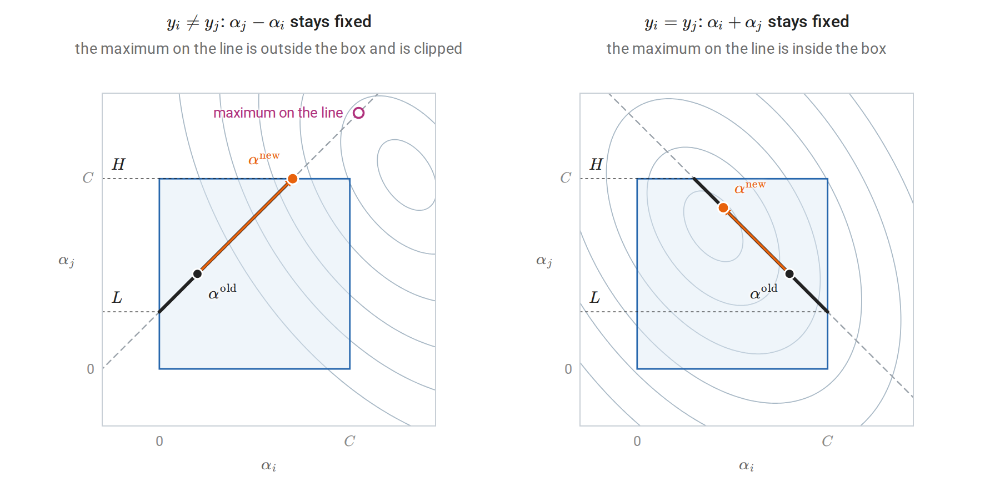

*The step in the plane of the pair $`(\alpha_i,\alpha_j)`$, with the other dual variables fixed. Gray curves are contours of the concave objective, the dashed line holds the conserved combination, and the box $`[0,C]^2`$ cuts it to the thick segment whose ends, read on the $`\alpha_j`$ axis, are $`L`$ and $`H`$. The step moves along the line to the maximum of the objective, clipped to the segment.*

</details>


<details>
<summary><a id="block-svm-appendix-b"></a><b>B. Constructing kernels and their feature spaces</b></summary>


**Closure properties.** Let $`K_1,K_2`$ be Gram matrices of kernels $`k_1,k_2`$ on the same points $`x_1,\ldots,x_m`$.

- *Sums and nonnegative multiples*: $`c^\top(K_1+K_2)c=c^\top K_1c+c^\top K_2c\ge0`$, and $`c^\top(aK_1)c\ge0`$ for $`a\ge0`$.
- *Products* (the Schur product theorem): write $`K_2=\sum_lv_lv_l^\top`$, absorbing the nonnegative eigenvalues of its spectral decomposition into the eigenvectors. The Gram matrix of $`k_1k_2`$ is the elementwise product $`K_1\circ K_2=\sum_l K_1\circ(v_lv_l^\top)`$, and $`c^\top\bigl(K_1\circ v v^\top\bigr)c=(c\circ v)^\top K_1(c\circ v)\ge0`$.
- *Rescaling by a function*: the Gram matrix of $`g(x)k(x,z)g(z)`$ is $`GKG`$ with $`G=\operatorname{diag}\bigl(g(x_i)\bigr)`$, and $`c^\top GKGc=(Gc)^\top K(Gc)\ge0`$.
- *Composition with a map*: the Gram matrix of $`k(\psi(x),\psi(z))`$ on $`x_1,\ldots,x_m`$ is the Gram matrix of $`k`$ on $`\psi(x_1),\ldots,\psi(x_m)`$.
- *Polynomials and exponentials*: a constant $`a\ge0`$ is a kernel, since $`a\bigl(\sum_ic_i\bigr)^2\ge0`$. Polynomials with nonnegative coefficients follow from sums and products. The set of positive semidefinite matrices is closed, so pointwise limits of kernels are kernels, and $`\exp(k)=\lim_N\sum_{r\le N}k^r/r!`$ is one.

The Gaussian kernel combines the last three rules: $`e^{2\gamma x^\top z}`$ is a kernel, and multiplying by $`g(x)=e^{-\gamma\|x\|^2}`$ on both sides gives $`e^{-\gamma\|x-z\|^2}`$.

**The reproducing kernel Hilbert space.** Let $`\mathcal H_0`$ be the set of finite combinations $`f=\sum_ia_ik(\cdot,x_i)`$, with the bilinear form $`\langle f,g\rangle=\sum_{i,j}a_ib_jk(x_i,z_j)`$ for $`g=\sum_jb_jk(\cdot,z_j)`$.

- *Well defined*: $`\langle f,g\rangle=\sum_ia_ig(x_i)=\sum_jb_jf(z_j)`$, so it depends on $`f`$ and $`g`$ only as functions, not on the chosen expansions.
- *Reproducing property*: taking $`g=k(\cdot,x)`$ gives $`\langle f,k(\cdot,x)\rangle=f(x)`$.
- *Positive definite*: $`\langle f,f\rangle=a^\top Ka\ge0`$. The Cauchy–Schwarz inequality holds for any positive semidefinite symmetric bilinear form, so $`|f(x)|^2=|\langle f,k(\cdot,x)\rangle|^2\le\langle f,f\rangle\,k(x,x)`$. Hence $`\langle f,f\rangle=0`$ forces $`f(x)=0`$ for every $`x`$.

$`\mathcal H_0`$ is therefore an inner-product space of functions. The same inequality shows that a Cauchy sequence in $`\mathcal H_0`$ converges pointwise, so its completion can be identified with a space of functions $`\mathcal H_k`$ on $`\mathcal X`$ in which the reproducing property still holds. Conversely, any Hilbert space of functions in which every evaluation $`f\mapsto f(x)`$ is continuous has a unique reproducing kernel, by the Riesz representation theorem. Kernels and RKHSs are in one-to-one correspondence. [Schölkopf and Smola's *Learning with Kernels*](https://mitpress.mit.edu/9780262536578/learning-with-kernels/) develops this theory together with Mercer's theorem and regularization operators.

</details>

---

[← 7. Statistical Learning Theory](07-statistical-learning-theory.md) · [9. Decision and Regression Trees →](09-decision-and-regression-trees.md)
