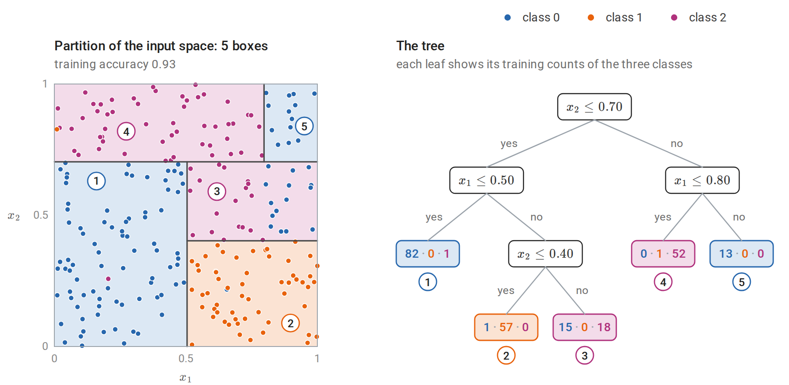
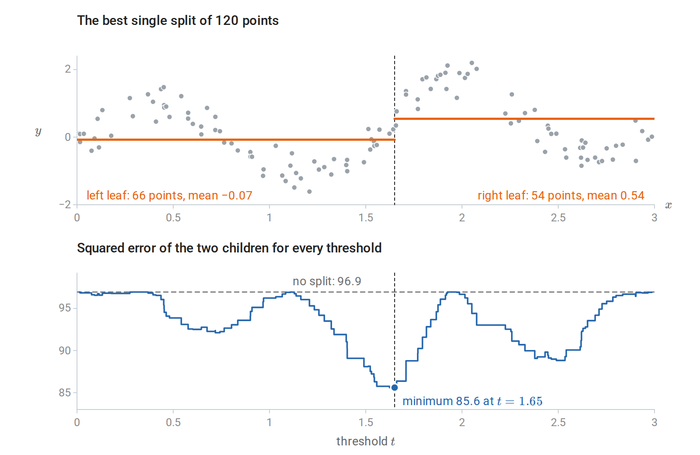
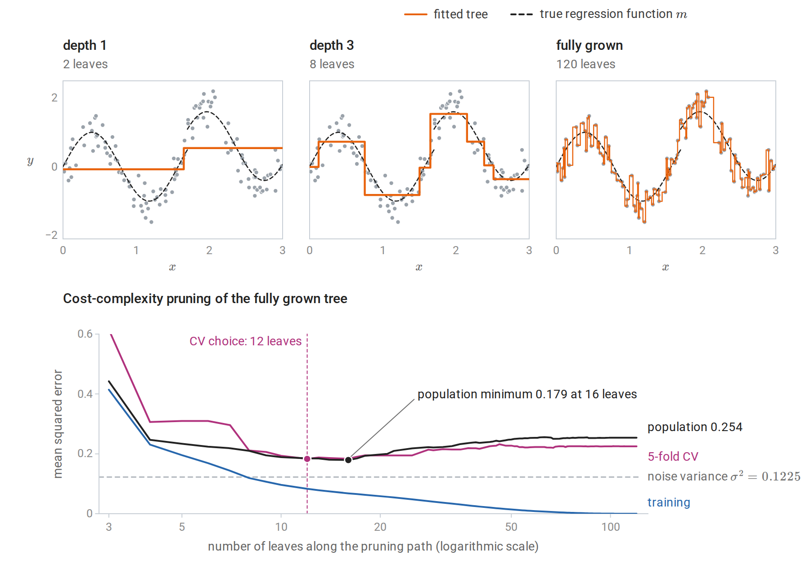
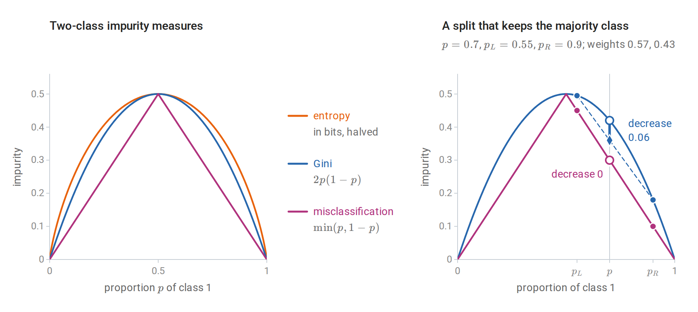
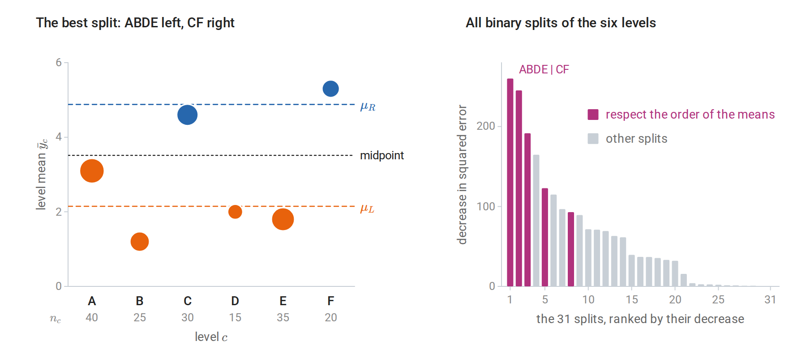
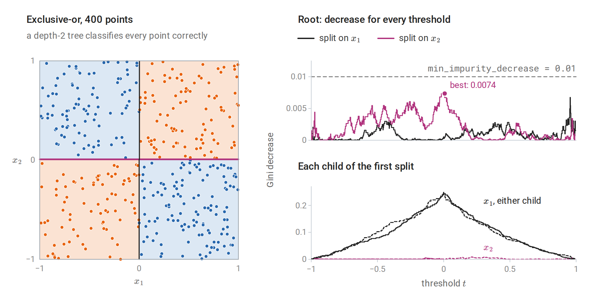
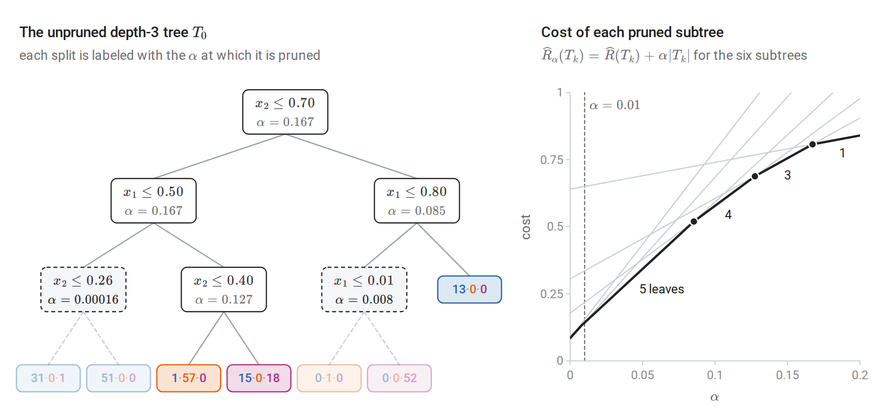
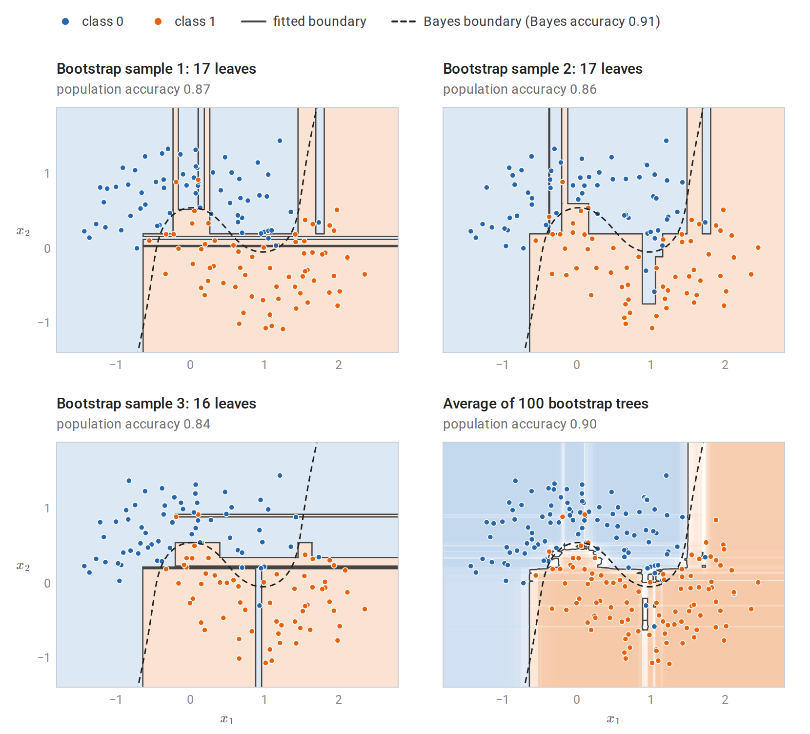

[ML Mastery Notes](../README.md) › [Machine Learning](README.md)

# 9. Decision and Regression Trees

[← 8. Support Vector Machines and Kernels](08-support-vector-machines-and-kernels.md) · [10. Bagging and Random Forests →](10-bagging-and-random-forests.md)

## <a id="trees-as-piecewise-constant-predictors"></a>Trees as piecewise-constant predictors

### <a id="recursive-partitions"></a>Recursive partitions

A **decision tree** predicts by asking a sequence of questions about the input. Each internal node tests a single feature against a threshold, $`x_j\le t`$, and sends the input to its left child when the answer is yes and to its right child otherwise. Each leaf holds a constant prediction. Following the tests from the root to a leaf takes an input to one cell $`R_m`$ of a partition of the input space into $`M`$ axis-aligned boxes, one per leaf, and the tree computes

```math
f(x)=\sum_{m=1}^Mc_m\,\mathbf 1\{x\in R_m\},
```

where $`c_m`$ is the prediction stored in leaf $`m`$. For regression, $`c_m`$ is a number; for classification, it is a class label or a vector of class probabilities. Each leaf is described by the conjunction of the tests along its path, so a tree is a compact set of disjoint rules of the kind studied in chapter 7. Terminology and Mathematical Language introduces the idea with a four-leaf tree fitted to the petal measurements of iris flowers.



*A classification tree fitted to 240 points of three classes, with each label redrawn at random with probability 0.05. The tree was grown to depth 3 and then pruned as described in [Cost-complexity pruning](#cost-complexity-pruning). Left: the five leaves are five boxes of the unit square, each shaded by its majority class, and the circled numbers match the leaves on the right. Right: the same tree, with the training counts of classes 0, 1, and 2 in each leaf. The split on $`x_1`$ at $`0.80`$ applies only to inputs with $`x_2>0.70`$, so the boundary between the magenta and blue regions in the upper right comes from an interaction of the two features. Leaf 3 mixes 15 points of class 0 with 18 of class 2, because the tree stops before the split at $`x_1=0.80`$ that would separate them there.*

The tree representation has several properties that other methods in this module lack. A split $`x_j\le t`$ depends only on the ordering of the values of $`x_j`$, so trees are unchanged by any strictly increasing transformation of a feature: the fitted tree divides the training data in exactly the same way, and only the threshold values between neighboring training values move. Trees therefore need no standardization, and extreme input values do not distort them. Numeric and categorical features can be mixed. Interactions are built in: a split in one branch applies only to inputs that passed the tests above it. A small tree can be read and checked by a domain expert.

The costs are equally specific. The prediction is a step function: discontinuous at every threshold and constant beyond the range of the training data. A boundary that is oblique to the axes must be approximated by a staircase, and a smooth or additive function, such as a linear function of many features, needs many leaves. Most importantly, the fitted tree is unstable: a small change in the data can change the first split and hence every split beneath it. Chapters 10 and 11 turn this weakness into the strength of tree ensembles.

### <a id="why-the-tree-is-grown-greedily"></a>Why the tree is grown greedily

For a fixed partition, fitting the leaf constants is trivial. Under squared error, $`c_m`$ is the average response in $`R_m`$; under zero–one loss it is the majority class; under log loss it is the vector of class proportions. The difficulty is choosing the partition. The number of possible trees grows super-exponentially with depth, and finding an optimal one is computationally hard: already for a simple criterion, the expected number of tests needed to identify an object, the problem is NP-complete ([Hyafil and Rivest, 1976](https://www.sciencedirect.com/science/article/abs/pii/0020019076900958)).

Every standard algorithm therefore grows the tree **greedily**, from the root down. At each node it chooses the single split that most reduces the training loss of the node's data, divides the data accordingly, and recurses on the two children. Each split is judged by its immediate effect, without looking ahead to the splits it makes possible; [Stopping rules and their horizon](#stopping-rules-and-their-horizon) shows what this can miss. This is the procedure of CART ([Breiman, Friedman, Olshen, and Stone, 1984](https://www.routledge.com/Classification-and-Regression-Trees/Breiman-Friedman-Stone-Olshen/p/book/9780412048418)) and, with differences in detail, of ID3 ([Quinlan, 1986](https://link.springer.com/article/10.1007/BF00116251)) and C4.5 ([Quinlan, 1993](https://dl.acm.org/doi/10.5555/583200)). Mixed-integer and dynamic-programming methods can find optimal trees of modest size ([Bertsimas and Dunn, 2017](https://link.springer.com/article/10.1007/s10994-017-5633-9)), but greedy growth remains the practical default and the building block of ensembles.

## <a id="growing-a-regression-tree"></a>Growing a regression tree

### <a id="the-best-split-of-a-node"></a>The best split of a node

Let a node contain the examples with indices in $`N`$. A split on feature $`j`$ at threshold $`t`$ creates $`N_L=\{i\in N:x_{ij}\le t\}`$ and $`N_R=N\setminus N_L`$, where $`x_{ij}`$ is feature $`j`$ of example $`i`$. With squared error and leaf means $`\bar y_L,\bar y_R`$, the split is chosen to minimize

```math
\sum_{i\in N_L}(y_i-\bar y_L)^2+\sum_{i\in N_R}(y_i-\bar y_R)^2 .
```

Only thresholds between consecutive distinct values of $`x_j`$ in the node matter, so there are at most $`|N|-1`$ candidates per feature. They can all be evaluated in one pass after sorting. Within this subsection write $`n=|N|`$ and $`S=\sum_{i\in N}y_i`$ for the size and response total of the node, and $`n_L=|N_L|`$ and $`S_L=\sum_{i\in N_L}y_i`$ for those of its left child. The squared error of the node's responses about their mean is $`\sum_{i\in N}y_i^2-S^2/n`$, and the same identity applied to each child gives the children's error as $`\sum_{i\in N}y_i^2-S_L^2/n_L-(S-S_L)^2/(n-n_L)`$. The sum of $`y_i^2`$ over the node is the same for every split, so minimizing the children's error is equivalent to maximizing

```math
\frac{S_L^2}{n_L}+\frac{(S-S_L)^2}{n-n_L},
```

which cumulative sums of the sorted responses give for every threshold at once.



*The search for the root split of a regression tree on the 120 noisy observations of the figure in the next subsection, whose depth-1 tree is exactly this split. Top: the best cut and the two leaf means it produces. Bottom: the total squared error of the two children for every threshold $`t`$. It changes only when $`t`$ passes an observed input, so it is a step function, and it never exceeds the parent's error, because the parent's mean is one of the constants each child could use. The best cut removes only 12% of the squared error, since no single cut can follow the oscillations of the regression function.*

With $`d`$ features, a node costs $`O(dn\log n)`$ for sorting and $`O(dn)`$ for the scan. Each level of the tree partitions the data, so a tree of depth $`D`$ grown on a sample of size $`n`$ costs about $`O(Ddn\log n)`$. Histogram-based implementations first bin each feature into at most a few hundred values, which removes the sort and is the approach used by modern gradient boosting (chapter 11).

The following implementation grows a regression tree by exactly this rule and reproduces scikit-learn's [`DecisionTreeRegressor`](https://scikit-learn.org/stable/modules/generated/sklearn.tree.DecisionTreeRegressor.html). scikit-learn stores the inputs of a tree in `float32`, so the code rounds the data the same way before growing its own tree; otherwise a threshold could fall on the other side of a rounded input (Numerical Computing with NumPy and PyTorch describes the two formats).

```python
import numpy as np
from sklearn.datasets import load_diabetes
from sklearn.model_selection import train_test_split
from sklearn.tree import DecisionTreeRegressor

def best_split(X, y):
    """Minimize the children's total squared error over all features and thresholds.

    Sum of squared errors in a node = sum(y^2) - (sum y)^2 / n, and sum(y^2) is fixed,
    so the best cut maximizes S_L^2 / n_L + S_R^2 / n_R, computed for all cuts by cumulative sums."""
    n = len(y)
    best = (-np.inf, None, None)
    for j in range(X.shape[1]):
        order = np.argsort(X[:, j], kind="stable")
        xs, S_left = X[order, j], np.cumsum(y[order])[:-1]
        n_left = np.arange(1, n)
        score = S_left ** 2 / n_left + (y.sum() - S_left) ** 2 / (n - n_left)
        score[xs[1:] == xs[:-1]] = -np.inf        # cannot cut between equal values
        i = np.argmax(score)
        if score[i] > best[0]:
            best = (score[i], j, (xs[i] + xs[i + 1]) / 2)
    return best[1], best[2]

def grow(X, y, depth):
    j, t = best_split(X, y) if depth > 0 and len(y) > 1 else (None, None)
    if j is None:
        return {"value": y.mean()}
    m = X[:, j] <= t
    return {"feature": j, "threshold": t, "left": grow(X[m], y[m], depth - 1), "right": grow(X[~m], y[~m], depth - 1)}

def predict(node, x):
    while "value" not in node:
        node = node["left"] if x[node["feature"]] <= node["threshold"] else node["right"]
    return node["value"]

data = load_diabetes()
X = data.data.astype(np.float32).astype(float)  # scikit-learn trees work in float32
Xtr, Xte, ytr, yte = train_test_split(X, data.target, test_size=0.3, random_state=0)
tree = grow(Xtr, ytr, depth=3)
ours = np.array([predict(tree, x) for x in Xte])
sk = DecisionTreeRegressor(max_depth=3, random_state=0).fit(Xtr, ytr)
print("root split:", data.feature_names[tree["feature"]], "<=", round(tree["threshold"], 4))
print("identical to scikit-learn:", np.allclose(ours, sk.predict(Xte)))
print(f"test MSE: depth-3 tree {np.mean((ours - yte) ** 2):.0f}, constant {np.mean((ytr.mean() - yte) ** 2):.0f}")
# root split: s5 <= 0.0217
# identical to scikit-learn: True
# test MSE: depth-3 tree 4142, constant 5101
```

The root split is on `s5`, one of the six blood-serum measurements of the diabetes data; the features are centered and scaled, which is why the threshold is close to zero. The depth-3 tree lowers the test error of the constant prediction by about a fifth.

Other losses change only the leaf value and the node score. Absolute error uses leaf medians and is robust to outlying responses; Poisson deviance suits counts. The recursion is the same.

### <a id="depth-and-the-biasvariance-tradeoff"></a>Depth and the bias–variance tradeoff

A tree grown until every leaf is pure, or holds a single example, interpolates the training data. In one dimension it is a step function through every point, much like the 1-nearest-neighbor rule of chapter 1; when every threshold lies halfway between neighboring inputs, as in scikit-learn, it is exactly that rule. A tree can be viewed as an adaptive nearest-neighbor method: each leaf is a neighborhood of the query, chosen using the responses rather than a fixed metric, a view that chapter 10 develops for forests. Shallow trees have high bias and low variance; deep trees the reverse. The two terms are those of the decomposition of mean squared error in Probability and Statistics, applied to the prediction at each input, and chapter 6 studies them for whole predictors.



*Top: regression trees of depth 1, depth 3, and full depth fitted to 120 noisy observations of the dashed regression function. The fully grown tree, with one leaf per observation, reproduces the noise. Bottom: training, 5-fold cross-validated, and population error along the cost-complexity pruning path of the full tree; the population error is computed exactly from the known regression function and noise level rather than estimated from a test sample. Training error falls to zero as leaves are added. Population error is smallest near the size chosen by cross-validation, and the fully grown tree's population error is about twice the noise variance.*

The doubling at full depth is no accident. Suppose each leaf holds one training point, so that a test input $`x`$ whose leaf holds $`(x_i,y_i)`$ receives the prediction $`y_i=m(x_i)+\varepsilon_i`$, where $`m`$ is the regression function and $`\varepsilon_i`$ the noise. The test response is $`Y=m(x)+\varepsilon`$ with independent noise of the same variance $`\sigma^2`$, so the prediction error is the difference of two independent noise draws plus approximation error:

```math
\mathbb E\bigl[(Y-y_i)^2\bigr]=2\sigma^2+\bigl(m(x)-m(x_i)\bigr)^2,
```

as for 1-NN regression. In the figure the second term is small, and the fully grown tree's population error is 2.07 times $`\sigma^2=0.1225`$.

The consistency theory of chapter 1 extends to trees. A partitioning estimate whose cells shrink in diameter while containing a growing number of training points is consistent, and data-dependent partitions satisfy versions of the same conditions ([Györfi, Kohler, Krzyżak, and Walk](https://doi.org/10.1007/b97848)). Greedy CART trees are harder to analyze because the splits depend on the responses in the same data. Consistency results for them and for forests require additional assumptions.

## <a id="growing-a-classification-tree"></a>Growing a classification tree

### <a id="impurity-measures"></a>Impurity measures

For classification with $`K`$ classes, let $`\hat p_{mk}`$ be the proportion of class $`k`$ among the $`n_m`$ training examples in node $`m`$, and let $`\hat p_m=(\hat p_{m1},\ldots,\hat p_{mK})`$. Splits are chosen to reduce an **impurity** $`Q(\hat p_m)`$, a measure of how mixed the node is. The three standard choices are

```math
\begin{aligned}
\text{misclassification error:}&\quad 1-\max_k\hat p_{mk},\\
\text{Gini index:}&\quad \sum_{k}\hat p_{mk}(1-\hat p_{mk})=1-\sum_k\hat p_{mk}^2,\\
\text{entropy:}&\quad -\sum_k\hat p_{mk}\log\hat p_{mk}.
\end{aligned}
```

In this chapter $`\log`$ is the natural logarithm, so entropy is measured in nats. Information and Learning Theory measures entropy in bits, with $`\log_2`$, and so does scikit-learn's `criterion="entropy"`. Changing the base multiplies every entropy, and every decrease of entropy, by the same constant, so it never changes which split is chosen.

A split of node $`m`$ into children $`L`$ and $`R`$ reduces impurity by

```math
\Delta=Q(\hat p_m)-\frac{n_L}{n_m}Q(\hat p_L)-\frac{n_R}{n_m}Q(\hat p_R),
```

and the greedy rule chooses the split with the largest decrease. With entropy, $`\Delta`$ is the **information gain**: the empirical mutual information, within the node, between the class label and the side of the split. Indeed, if $`Y`$ is the label and $`Z\in\{L,R\}`$ the side of the split of a training example drawn at random from the node, the entropy of $`Y`$ is $`Q(\hat p_m)`$, the conditional entropy of $`Y`$ given $`Z`$ is the weighted sum of the children's entropies, and $`\Delta=H(Y)-H(Y\mid Z)=I(Y;Z)`$ (Information and Learning Theory).

Each impurity is the smallest training loss that a single constant prediction can achieve in the node, under a particular loss:

| Impurity | Loss of a constant prediction | Best constant |
| --- | --- | --- |
| Misclassification error | Zero–one loss of a predicted label | The majority class |
| Gini index | Squared error of a probability vector $`q`$ against the one-hot label, $`\lVert e_y-q\rVert_2^2`$ (the Brier score) | $`q=\hat p_m`$ |
| Entropy | Log loss $`-\log q_y`$ | $`q=\hat p_m`$ |

Here $`e_y`$ is the one-hot vector of the label $`y`$, with a one in position $`y`$ and zeros elsewhere. For the first row, predicting label $`k`$ errs on the fraction $`1-\hat p_{mk}`$ of the node, which is smallest for the majority class. For the Gini row, the average of $`\lVert e_{y_i}-q\rVert^2`$ over the node is

```math
\sum_k\bigl[\hat p_{mk}-2\hat p_{mk}q_k+q_k^2\bigr]=\sum_k(q_k-\hat p_{mk})^2+\sum_k\hat p_{mk}(1-\hat p_{mk}),
```

which is minimized at $`q=\hat p_m`$ with value $`\sum_k\hat p_{mk}(1-\hat p_{mk})`$. For two classes this loss is twice the Brier score $`(\hat p-y)^2`$ of chapter 5. For the entropy row, the average log loss of $`q`$ over the node is the cross-entropy $`H(\hat p_m,q)=-\sum_k\hat p_{mk}\log q_k`$, which exceeds the entropy of $`\hat p_m`$ by the divergence $`D_{\mathrm{KL}}(\hat p_m\Vert q)\ge0`$, with equality exactly at $`q=\hat p_m`$ (Information and Learning Theory). The Gini index is also the error rate of a rule that predicts a random label drawn from the node's class proportions.

Growing a tree with impurity $`Q`$ is therefore greedy empirical risk minimization, over piecewise-constant predictors, of the corresponding loss. The training risk of a tree with the best constant in every leaf is $`\sum_m(n_m/n)Q(\hat p_m)`$, where $`n`$ is the sample size. The impurity decrease of a split, weighted by the fraction $`n_m/n`$ of the data in the node, is therefore exactly the decrease in training risk that the split achieves.

### <a id="why-misclassification-error-is-a-poor-splitting-criterion"></a>Why misclassification error is a poor splitting criterion

Misclassification error is the loss that matters for the final decisions, yet it is rarely used to grow trees, and the reason is geometric. The parent's class proportions are the weighted average of the children's, $`\hat p_m=(n_L/n_m)\hat p_L+(n_R/n_m)\hat p_R`$, so $`\Delta`$ is the gap between the impurity at that average and the same weighted average of the children's impurities: the gap between a curve and one of its chords. Misclassification error is piecewise linear in the class proportions, and it is linear on the set of proportion vectors that share a majority class. Any split in which both children keep the parent's majority class therefore leaves it unchanged, even when one child becomes much purer. Such a split is often a necessary step toward a good tree, because the purer child can be split cleanly at the next level.

Gini and entropy are strictly concave, meaning that their graphs lie strictly above every chord (Calculus and Optimization defines strict convexity, and concavity is its mirror image). Jensen's inequality in this chord form then makes $`\Delta>0`$ for every split that changes the class proportions.



*Left: the three impurities for two classes, with entropy measured in bits and halved so that all three peak at $`0.5`$. Right: a node with $`p=0.7`$ split into children with $`p_L=0.55`$ and $`p_R=0.9`$. The children's weighted impurity is the chord between them evaluated at $`p`$ (diamonds). For misclassification error the chord lies on the linear piece of the curve, so its diamond coincides with the parent's open circle and the decrease is zero. For Gini the curve is strictly concave, the chord lies below it, and the decrease is $`0.06`$.*

The Gini index and entropy almost always choose similar splits. CART grows with Gini and can prune with misclassification error, the criterion that the finished tree should optimize.

### <a id="class-probabilities-from-leaves"></a>Class probabilities from leaves

A leaf's class proportions are natural probability estimates, but those from deep trees are poor. A pure leaf predicts probability one from perhaps a single example, which is maximally overconfident under log loss. Shallow trees, a minimum number of examples per leaf, or smoothed leaf estimates such as $`(n_{mk}+1)/(n_m+K)`$, where $`n_{mk}=n_m\hat p_{mk}`$ is the number of examples of class $`k`$ in the leaf, improve them; averaging many trees (chapter 10) improves them far more. Their calibration can be checked and corrected as in chapter 5.

## <a id="features-that-are-not-simply-numeric"></a>Features that are not simply numeric

### <a id="categorical-features"></a>Categorical features

A categorical feature with $`K`$ unordered levels can be split by sending any subset of levels left, which gives $`2^{K-1}-1`$ distinct binary splits. For regression with squared error and for two-class classification with the Gini index or entropy, the search reduces to $`K-1`$ candidates: order the levels by their mean response, or by their proportion of class 1, and treat the feature as ordered ([Fisher, 1958](https://www.tandfonline.com/doi/abs/10.1080/01621459.1958.10501479); Breiman et al., 1984). [Appendix A](#block-tree-appendix-a) proves this. For more than two classes no such exact shortcut exists, and implementations use heuristics or one-hot encoding.



*A categorical feature with six levels, whose sizes $`n_c`$ and mean responses $`\bar y_c`$ were chosen for illustration. Left: the level means in alphabetical order, with dot area proportional to $`n_c`$ and each level colored by its side of the best split. Every level lies closer to the mean of its own side, $`\mu_L`$ or $`\mu_R`$, than to the other, so the best split is a threshold in the order of the level means: B, E, D, A on one side and C, F on the other. Right: the decrease in squared error of all 31 binary splits. The best one is among the five that respect the order, which are the only candidates the shortcut examines.*

Many-valued features, whether categorical or numeric with many distinct values, have a built-in advantage in greedy selection. Each offers more candidate splits and therefore more chances to find a large impurity decrease by chance. An identifier column can split the training data perfectly while carrying no information about new cases. C4.5 counters this with the **gain ratio**, which divides the information gain by the entropy of the split itself: the entropy of the distribution of the node's examples over its children, which is large when a split creates many small children. Other algorithms select the feature by a statistical test before choosing its threshold ([Loh, 2014](https://onlinelibrary.wiley.com/doi/abs/10.1111/insr.12016)). The same bias affects the impurity-based feature importances of chapter 10.

### <a id="missing-values"></a>Missing values

CART handles a missing value at prediction time with **surrogate splits**: other features whose splits best reproduce the primary split on the training data, tried in order when the primary feature is missing. A simpler approach, used by gradient-boosting libraries and by recent versions of scikit-learn, learns for each split which child receives missing values by trying both during split selection. Missingness can itself be informative, and a tree can exploit that directly.

## <a id="controlling-the-size-of-the-tree"></a>Controlling the size of the tree

### <a id="stopping-rules-and-their-horizon"></a>Stopping rules and their horizon

The simplest controls stop growth early: a maximum depth, a minimum number of examples in a node before it may be split or in each leaf, or a minimum impurity decrease. They are cheap and often adequate, especially for trees used inside ensembles. But a rule that stops when no split helps much is myopic. The exclusive-or pattern of chapter 2 is the extreme case: in the population no single split reduces impurity at all, yet two levels of splits classify perfectly. Foundations describes the same phenomenon in information terms: two variables can each carry zero information about the label while jointly determining it.

The following code shows the effect on a sample. In scikit-learn, `min_impurity_decrease` is compared with the decrease $`\Delta`$ of a split weighted by the node's share $`n_m/n`$ of the training data, which at the root is $`\Delta`$ itself.

```python
import numpy as np
from sklearn.tree import DecisionTreeClassifier

rng = np.random.default_rng(0)
X = rng.uniform(-1, 1, size=(400, 2))
y = (X[:, 0] * X[:, 1] > 0).astype(int)  # exclusive-or of the two signs

for min_decrease in [0.01, 0.0]:
    tree = DecisionTreeClassifier(min_impurity_decrease=min_decrease, random_state=0).fit(X, y)
    print(f"min_impurity_decrease={min_decrease}: number of leaves {tree.get_n_leaves()}, "
          f"training accuracy {tree.score(X, y):.2f}")

# The best single split barely reduces impurity; the second level removes all of it.
stump = DecisionTreeClassifier(max_depth=1, random_state=0).fit(X, y)
t = stump.tree_
w = t.weighted_n_node_samples
decrease = t.impurity[0] - (w[1] * t.impurity[1] + w[2] * t.impurity[2]) / w[0]
print(f"best first split: x{t.feature[0] + 1} <= {t.threshold[0]:.2f}, Gini decrease {decrease:.4f}")
print("depth-2 tree training accuracy:", DecisionTreeClassifier(max_depth=2, random_state=0).fit(X, y).score(X, y))
# min_impurity_decrease=0.01: number of leaves 1, training accuracy 0.55
# min_impurity_decrease=0.0: number of leaves 4, training accuracy 1.00
# best first split: x2 <= 0.01, Gini decrease 0.0074
# depth-2 tree training accuracy: 1.0
```



*Left: the 400 exclusive-or points of the code above and the depth-2 tree, whose first split (magenta) is on $`x_2`$ and whose two second-level splits are on $`x_1`$. Top right: the Gini decrease, weighted by the node's share of the data as in `min_impurity_decrease`, of every root split on either feature. The profile is sampling noise, and no split reaches the stopping threshold. Bottom right: the same quantity for splits inside each child of the first split, on a vertical scale about twenty times larger; the best split of either child, on $`x_1`$ near zero, removes all of its impurity.*

The first split is chosen by sampling noise: its location near zero is luck, and on another sample it could fall elsewhere and force a larger tree. The standard remedy for the horizon problem is to grow a large tree and prune it back.

### <a id="cost-complexity-pruning"></a>Cost-complexity pruning

Let $`T`$ be a subtree of the fully grown tree $`T_0`$ obtained by collapsing some internal nodes into leaves, and let $`|T|`$ be its number of leaves. Let $`\widehat R(T)`$ be its training loss, the sum over leaves of the node losses, where, as in scikit-learn, a leaf's loss is its share of the training examples times its impurity. By [Impurity measures](#impurity-measures), this is the tree's empirical risk $`\widehat R_n`$, in the sense of chapter 1, under the loss that corresponds to the impurity; CART writes it without the hat. CART's **cost-complexity criterion** is

```math
\widehat R_\alpha(T)=\widehat R(T)+\alpha|T|,\qquad \alpha\ge0.
```

For each $`\alpha`$ there is a unique smallest subtree $`T(\alpha)`$ minimizing $`\widehat R_\alpha`$, and the optimal subtrees are **nested**: as $`\alpha`$ increases, $`T(\alpha)`$ only loses branches. Only finitely many distinct subtrees arise, $`T_0\supset T_1\supset\cdots\supset\{\text{root}\}`$, at breakpoints $`0=\alpha_0<\alpha_1<\alpha_2<\cdots`$. ($`T(0)`$ is $`T_0`$ itself unless collapsing some branch of $`T_0`$ leaves the training loss unchanged, in which case $`T(0)`$ already omits that branch.) [Appendix B](#block-tree-appendix-b) proves both facts.

The sequence is computed by **weakest-link pruning**. For an internal node $`t`$, let $`T_t`$ be the branch of the current tree rooted at $`t`$, let $`\widehat R(T_t)`$ be the training loss of its leaves, and let $`\widehat R(t)`$ be the training loss of $`t`$ alone if it were made a leaf. Collapsing the branch into a leaf changes $`\widehat R_\alpha`$ by $`\bigl[\widehat R(t)-\widehat R(T_t)\bigr]-\alpha\bigl(|T_t|-1\bigr)`$. The collapse pays off once $`\alpha`$ exceeds

```math
g(t)=\frac{\widehat R(t)-\widehat R(T_t)}{|T_t|-1},
```

the reduction in training loss per additional leaf that the branch provides. The weakest link is the node with the smallest $`g(t)`$. It is pruned, the values of $`g`$ are updated for its ancestors, whose branches have just lost leaves, and the process repeats until only the root remains; nodes that tie for the smallest $`g`$ are pruned together. The successive minima of $`g`$ are the breakpoints $`\alpha_k`$.



*Weakest-link pruning of the depth-3 tree grown on the data of the first figure, with the Gini impurity as the loss. Left: each split is labeled with the value of $`\alpha`$ at which it is pruned. The two dashed splits are the weakest links: the first changes no prediction, since both of its leaves are mostly class 0, and the second isolates a single point. Right: each subtree $`T_k`$ on the path is a line in $`\alpha`$ with intercept $`\widehat R(T_k)`$ and slope $`\lvert T_k\rvert`$, and the optimal subtree follows the lower envelope of these lines. At each breakpoint the envelope switches to a line of smaller slope, a subtree with fewer leaves. The tree of the first figure is $`T(0.01)`$, the subtree with five leaves.*

The value of $`\alpha`$ is chosen by cross-validation, as in chapter 6. In each fold a full tree is grown and pruned, and its held-out error is recorded as a function of $`\alpha`$. The $`\alpha`$ with the smallest average error, or the largest within one standard error of it, is then applied to the tree grown on all the data. The candidate values are indexed by $`\alpha`$ rather than by tree size because trees grown on different folds differ in shape. The next computation carries this out with scikit-learn and then shows how unstable the tree's structure is.

```python
import numpy as np
from sklearn.datasets import load_breast_cancer
from sklearn.model_selection import GridSearchCV, train_test_split
from sklearn.tree import DecisionTreeClassifier

X, y = load_breast_cancer(return_X_y=True)
Xtr, Xte, ytr, yte = train_test_split(X, y, test_size=0.4, stratify=y, random_state=0)

full = DecisionTreeClassifier(random_state=0).fit(Xtr, ytr)
path = full.cost_complexity_pruning_path(Xtr, ytr)   # the alphas at which the weakest link is pruned
print("candidate alphas:", len(path.ccp_alphas), "; full tree leaves:", full.get_n_leaves())

search = GridSearchCV(DecisionTreeClassifier(random_state=0), {"ccp_alpha": path.ccp_alphas[:-1]}, cv=10)
search.fit(Xtr, ytr)
pruned = search.best_estimator_
print(f"chosen alpha {search.best_params_['ccp_alpha']:.4f}: {pruned.get_n_leaves()} leaves, depth {pruned.get_depth()}")
print(f"test accuracy: full tree {full.score(Xte, yte):.3f}, pruned tree {pruned.score(Xte, yte):.3f}")

# Instability: the root split across bootstrap resamples of the training set.
rng = np.random.default_rng(0)
roots = {}
names = load_breast_cancer().feature_names
for _ in range(200):
    idx = rng.integers(0, len(ytr), len(ytr))
    root = names[DecisionTreeClassifier(max_depth=1, random_state=0).fit(Xtr[idx], ytr[idx]).tree_.feature[0]]
    roots[root] = roots.get(root, 0) + 1
print("root feature over 200 bootstrap samples:", dict(sorted(roots.items(), key=lambda kv: -kv[1])))
# candidate alphas: 12 ; full tree leaves: 14
# chosen alpha 0.0039: 11 leaves, depth 4
# test accuracy: full tree 0.939, pruned tree 0.943
# root feature over 200 bootstrap samples: {'worst perimeter': 88, 'worst concave points': 60, 'mean concave points': 24, 'worst radius': 16, 'worst area': 10, 'mean concavity': 2}
```

On this well-separated problem pruning changes little. Cross-validation barely distinguishes the candidates: five values of $`\alpha`$, giving trees of 11, 10, 9, 8, and 5 leaves, tie for the best average accuracy, $`0.930`$, and `GridSearchCV` returns the first of them, the one with the smallest $`\alpha`$. The one-standard-error rule would choose the tree with 4 leaves. The scikit-learn example [Post pruning decision trees with cost complexity pruning](https://scikit-learn.org/stable/auto_examples/tree/plot_cost_complexity_pruning.html) traces the same path graphically.

The resampling experiment is more revealing. Each **bootstrap** sample draws $`n`$ examples with replacement from the $`n`$ training examples, as in Probability and Statistics, so it mimics a fresh training set from the same population. Six different features appear at the root across bootstrap samples of the same training set. Several size measurements of the tumor are strongly correlated, and which one wins the first split is close to a coin toss.

## <a id="instability-and-what-it-implies"></a>Instability and what it implies

A tree is a **high-variance** estimator. The greedy search makes a discrete choice at every node, and nearly tied candidates at the root, like the correlated tumor measurements above, can be swapped by a few observations. Everything below the root then changes. The partitions of trees fitted to bootstrap resamples of one dataset can look entirely different while having similar accuracy. In the figure below, three fully grown trees fitted to resamples of the same 200 points have population accuracies of 0.84 to 0.87, while the average of 100 such trees reaches 0.90, close to the Bayes accuracy of 0.91.



*Fully grown trees fitted to three bootstrap resamples of the same 200 training points, and the average of the predicted class probabilities of 100 such trees, shaded from blue (probability 0 of class 1) to orange (probability 1). The individual partitions differ substantially, including thin boxes around single points. The average is smoother, and its boundary follows the Bayes boundary of the two moons more closely. Accuracies are computed exactly from the known distribution of the moons rather than estimated from a test sample.*

Two consequences follow. First, the structure of a single fitted tree should be interpreted with caution. A split near the root shows that a feature was useful on this sample, not that it is uniquely important, and a correlated feature might have served equally well. Second, instability is exactly what makes averaging effective. Averaging many nearly unbiased but noisy trees reduces variance without increasing bias, which is the idea of bagging and random forests in chapter 10. Boosting (chapter 11) instead fits a sequence of small trees, each correcting the errors of the current ensemble.

Several variants relax the axis-aligned, piecewise-constant form. **Oblique trees** split on linear combinations of features. **Model trees** fit a linear regression in each leaf, giving a piecewise-linear fit, which in general jumps at the leaf boundaries. These variants are less common than ensembles of standard trees, which usually achieve the same goals with less effort. [ESL §9.2](https://hastie.su.domains/ElemStatLearn/) and the scikit-learn [decision tree guide](https://scikit-learn.org/stable/modules/tree.html) give further practical detail, and the scikit-learn example [Decision Tree Regression](https://scikit-learn.org/stable/auto_examples/tree/plot_tree_regression.html) shows depth-controlled fits like those above.

## <a id="appendices"></a>Appendices


<details>
<summary><a id="block-tree-appendix-a"></a><b>A. Ordering categories reduces the split search</b></summary>


Consider regression with squared error and a categorical feature whose levels $`c=1,\ldots,K`$ have $`n_c`$ examples with mean response $`\bar y_c`$. For a binary split that sends the levels in $`A`$ left, the total squared error of the children is

```math
\sum_c\sum_{i\in c}(y_i-\bar y_c)^2+\sum_cn_c\bigl(\bar y_c-\mu_{g(c)}\bigr)^2,
```

where $`g(c)\in\{L,R\}`$ is the side of level $`c`$ and $`\mu_L,\mu_R`$ are the children's means. The first term does not depend on the split. The second is the objective of two-means clustering (chapter 13) of the points $`\bar y_c`$ on the line with weights $`n_c`$, with each center equal to the weighted mean of its group.

Take an optimal split, with means $`\mu_L\le\mu_R`$. Reassign every level to the nearer of $`\mu_L`$ and $`\mu_R`$, keeping the centers fixed. This cannot increase the second term, and it produces a split in which every level on the left has $`\bar y_c\le(\mu_L+\mu_R)/2`$ and every level on the right exceeds it: a threshold in the order of the level means. Neither side becomes empty when $`\mu_L<\mu_R`$: the left group of the optimal split contains a level with $`\bar y_c\le\mu_L`$, the right group one with $`\bar y_c\ge\mu_R`$, and both stay on their sides. (When $`\mu_L=\mu_R`$, no split reduces the error and every threshold split is optimal.) Replacing the fixed centers by the new groups' means cannot increase the objective either, since the mean minimizes a weighted sum of squares. The resulting threshold split is at least as good as the optimal one, so it is optimal. Only the $`K-1`$ splits that respect the order of $`\bar y_c`$ need to be examined.

For two classes coded $`y\in\{0,1\}`$, the squared error of a node with proportion $`p`$ of ones is $`n\,p(1-p)`$, which is $`n/2`$ times its Gini index. The Gini split criterion is therefore the regression criterion applied to the 0–1 labels, and the levels are ordered by their proportion of class 1. Breiman et al. proved the same reduction for every strictly concave impurity, including entropy.

</details>


<details>
<summary><a id="block-tree-appendix-b"></a><b>B. Cost-complexity pruning gives nested optimal subtrees</b></summary>


**Existence and uniqueness by dynamic programming.** For a node $`t`$ of $`T_0`$, let $`C_\alpha(t)`$ be the smallest value of $`\widehat R(S)+\alpha|S|`$ over pruned subtrees $`S`$ of the branch rooted at $`t`$. A subtree either collapses $`t`$ into a leaf or keeps its split and prunes each child's branch optimally and independently:

```math
C_\alpha(t)=\min\bigl\{\widehat R(t)+\alpha,\ C_\alpha(t_L)+C_\alpha(t_R)\bigr\},
```

with $`C_\alpha(t)=\widehat R(t)+\alpha`$ at the leaves of $`T_0`$. Computing this bottom-up, and collapsing whenever the first option is at most the second, yields a minimizer of $`\widehat R_\alpha`$. It is the smallest one: it is contained in every other minimizer. Indeed, the cost is a sum over branches, so any minimizer, restricted to the branch of a node that it contains, must minimize that branch's cost; it must therefore keep a node wherever keeping is strictly better, and those are the only nodes the dynamic program keeps, since ties are resolved toward collapsing.

**Nesting.** Fix a node $`t`$ and let $`K_\alpha(t)=C_\alpha(t_L)+C_\alpha(t_R)`$ be the best value when $`t`$ is kept. Any subtree that keeps $`t`$ has at least two leaves, so for $`\alpha'>\alpha`$,

```math
K_{\alpha'}(t)\ge K_\alpha(t)+2(\alpha'-\alpha),
```

since the minimizing subtree at $`\alpha'`$ costs at least $`K_\alpha(t)`$ at $`\alpha`$ and gains at least $`2(\alpha'-\alpha)`$ in penalty. Collapsing costs $`\widehat R(t)+\alpha`$, which grows at rate exactly one. If collapsing is chosen at $`\alpha`$, meaning $`\widehat R(t)+\alpha\le K_\alpha(t)`$, then

```math
\widehat R(t)+\alpha'=\widehat R(t)+\alpha+(\alpha'-\alpha)\le K_\alpha(t)+2(\alpha'-\alpha)\le K_{\alpha'}(t),
```

so it is also chosen at $`\alpha'`$. Every node collapsed at $`\alpha`$ stays collapsed at larger values, hence $`T(\alpha')\subseteq T(\alpha)`$.

**The breakpoints.** On an interval of $`\alpha`$ where $`T(\alpha)`$ is constant, compare it with the subtree obtained by collapsing one more internal node $`t`$. The difference in $`\widehat R_\alpha`$ is $`\bigl[\widehat R(t)-\widehat R(T_t)\bigr]-\alpha\bigl(|T_t|-1\bigr)`$, which becomes nonpositive exactly when $`\alpha\ge g(t)`$. Any other pruned subtree of $`T(\alpha)`$ collapses a set of disjoint branches, and its difference in $`\widehat R_\alpha`$ is the sum of the differences for those branches, so none can be at least as good before one of the single collapses is. The next breakpoint is therefore $`\min_tg(t)`$ over the internal nodes of the current tree, and the weakest-link procedure in the main text enumerates the whole sequence using at most as many steps as $`T_0`$ has internal nodes.

</details>

---

[← 8. Support Vector Machines and Kernels](08-support-vector-machines-and-kernels.md) · [10. Bagging and Random Forests →](10-bagging-and-random-forests.md)
