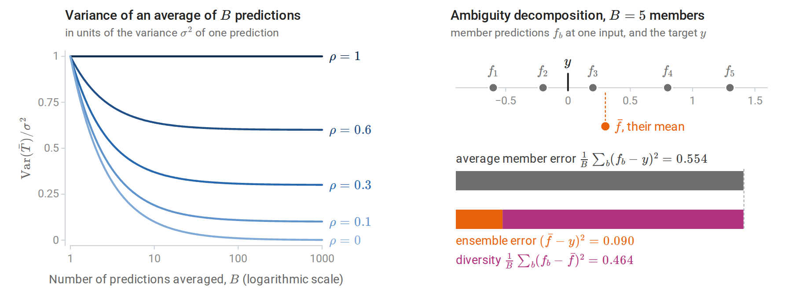
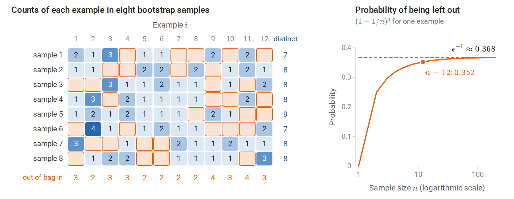
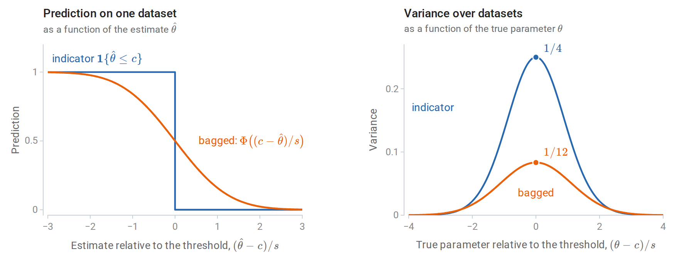
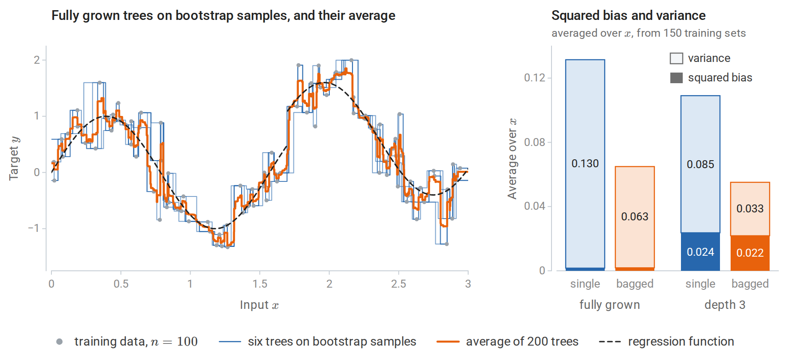
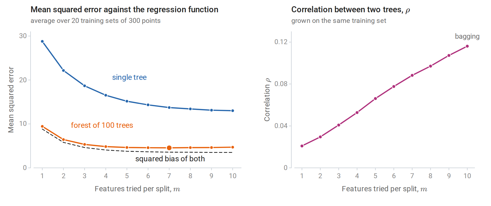
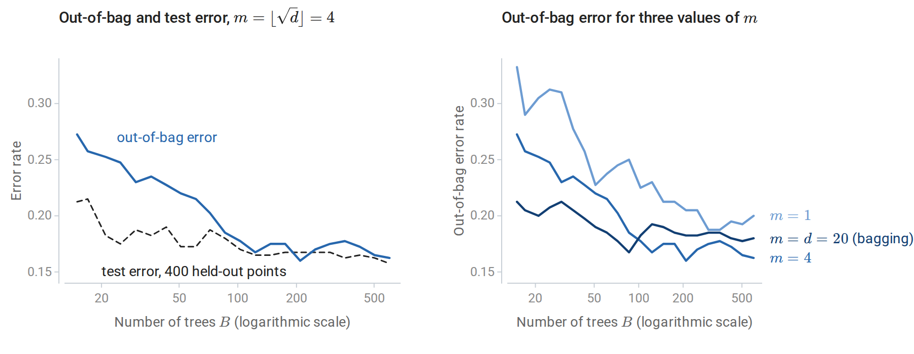
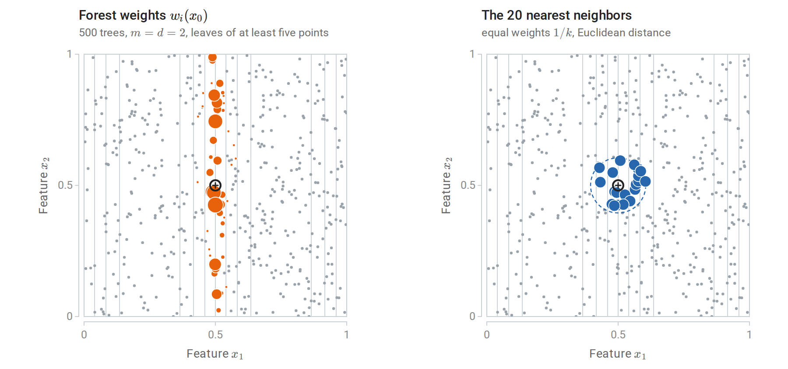
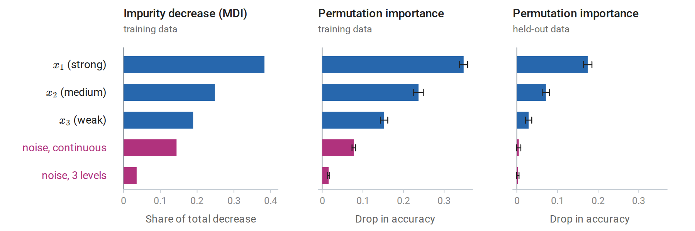

[ML Mastery Notes](../README.md) › [Machine Learning](README.md)

# 10. Bagging and Random Forests

[← 9. Decision and Regression Trees](09-decision-and-regression-trees.md) · [11. Boosting →](11-boosting.md)

## <a id="averaging-to-reduce-variance"></a>Averaging to reduce variance

### <a id="the-variance-of-an-average"></a>The variance of an average

Chapter 9 ended with a diagnosis: a fully grown tree has low bias and high variance, because small changes in the data change its splits. Averaging is the standard remedy for variance. Let $T_1,\ldots,T_B$ be the predictions of $B$ predictors at a fixed input $x$; each is random, through the training data and through any randomization in the fitting. If they are identically distributed with variance $\sigma^2$ and every pair has correlation $\rho$, then

$$
\operatorname{Var}\Bigl(\frac1B\sum_{b=1}^BT_b\Bigr)=\rho\,\sigma^2+\frac{1-\rho}{B}\,\sigma^2 .
$$

The derivation is one line: the variance of the sum has $B$ diagonal terms $\sigma^2$ and $B(B-1)$ off-diagonal terms $\rho\sigma^2$ ([Appendix A](#block-ens-appendix-a)). This is the equicorrelated case of the variance of a sum in Probability and Statistics. The average has the same expectation as each $T_b$, so averaging leaves bias unchanged. The mean squared error of a prediction is its squared bias plus its variance (Probability and Statistics; chapter 6 gives the version for a fitted predictor), so averaging lowers the error through the variance alone. As $B$ grows, the second term vanishes and the first remains. **Correlation sets the floor**: averaging independent predictors ($\rho=0$) removes all variance in the limit, while averaging perfectly correlated ones removes none.

Three conclusions shape this chapter. Averaging helps most for learners with low bias and high variance, such as deep trees. The number of predictors $B$ only needs to be large enough to make the second term negligible; adding more cannot hurt. The second term is a fraction $(1-\rho)/(\rho B)$ of the floor, so for $\rho=0.3$, 24 predictors already bring the variance within 10% of $\rho\sigma^2$. And the real lever is $\rho$: an ensemble improves by making its members less correlated, even at some cost in their individual accuracy.

### <a id="diversity-and-the-ambiguity-decomposition"></a>Diversity and the ambiguity decomposition

For squared loss the benefit of averaging has an exact form. Let $f_1,\ldots,f_B$ be the members' predictions at some input, $y$ a target value there, and $\bar f=\frac1B\sum_bf_b$ the ensemble's prediction. For every input and target,

$$
(\bar f-y)^2=\frac1B\sum_b(f_b-y)^2-\frac1B\sum_b(f_b-\bar f)^2 .
$$

The ensemble's error equals the average member's error minus the spread of the members around their mean ([Krogh and Vedelsby, 1994](https://proceedings.neurips.cc/paper/1994/hash/b8c37e33defde51cf91e1e03e51657da-Abstract.html)), a spread they called the ensemble's *ambiguity*. The identity holds pointwise, so it also holds for expected errors. The ensemble is never worse than its average member, and it is better by exactly the members' disagreement, or **diversity**. Diversity bought by making every member much worse is no bargain, however: the first term grows as the second does. The rest of the chapter is about obtaining diversity cheaply.

The diversity is the variance reduction of the previous subsection seen from another side. It is the average of the squared deviations $f_b-\bar f$, which equals the average of the $f_b^2$ minus $\bar f^2$. For the equicorrelated predictions $T_b$, with average $\bar T$, its expectation is therefore $\sigma^2-\operatorname{Var}(\bar T)=(1-\rho)(1-1/B)\sigma^2$, exactly the variance that averaging removes.



*Left: the variance of an average of equally correlated predictions falls toward the floor $\rho\sigma^2$, not toward zero; the smaller $\rho$, the lower the floor and the more predictions it takes to come close to it. Right: five member predictions at one input lie on both sides of the target, so their mean is much closer to the target than a typical member. The two bars have equal length: the average member error splits into the ensemble's error and the diversity.*

### <a id="bootstrap-replicates"></a>Bootstrap replicates

Independent training sets would give diverse predictors, but only one training set is available. The **bootstrap** of Probability and Statistics substitutes samples of size $n$ drawn with replacement from the data, each draw picking every example with probability $1/n$. A given example is missed by all $n$ independent draws, and so left out of a bootstrap sample, with probability

$$
\Bigl(1-\frac1n\Bigr)^n\;\longrightarrow\;e^{-1}\approx0.368,
$$

so each bootstrap sample contains about 63.2% of the distinct examples, some of them several times. The limit is approached quickly: the probability is $0.352$ for $n=12$ and $0.366$ for $n=100$. (The same calculation explains, in Probability and Statistics, why the bootstrap fails for a sample maximum.) Predictors trained on different bootstrap samples differ in roughly the way predictors trained on independent samples would, but they are more strongly correlated, since the samples overlap heavily.



*Left: each row is a bootstrap sample of twelve examples, and each cell counts how often an example was drawn. The orange cells mark examples left out of a sample, 33 of the 96, close to the expected $96\,(11/12)^{12}\approx33.8$. The margins count the distinct examples in each sample and the samples that leave out each example. Right: the probability that an example is left out is close to its limit $1/e$ already for a dozen examples.*

## <a id="bagging"></a>Bagging

### <a id="the-algorithm"></a>The algorithm

**Bootstrap aggregating**, or **bagging** ([Breiman, 1996](https://link.springer.com/article/10.1007/BF00058655)), trains the same learner on $B$ bootstrap samples and averages:

$$
\hat f_{\text{bag}}(x)=\frac1B\sum_{b=1}^B\hat f^{\ast b}(x),
$$

where $\hat f^{\ast b}$ is the learner fitted to the $b$th bootstrap sample. For classification, the members either vote or have their class-probability estimates averaged. Averaging probabilities is usually preferable: it produces a smoother score and better probability estimates, and it tends to have lower variance when $B$ is small.

Bagging approximates the average of the learner over the bootstrap distribution, $\mathbb E^\ast[\hat f^\ast(x)]$, the expectation over bootstrap samples drawn from the fixed training set; the average of $B$ fits is a Monte Carlo estimate of it. Its effect depends on how nonlinear the learner is in the data. For a linear smoother such as least squares, the bootstrap average is close to the original fit and bagging changes little. For a learner that makes hard decisions, such as whether to split or which feature to use, bagging replaces an abrupt function of the data with a smooth one. [Bühlmann and Yu (2002)](https://projecteuclid.org/euclid.aos/1031689014) showed that bagging an indicator $\mathbf 1\{\hat\theta\le c\}$ produces a smooth function of $\hat\theta$ whose variance near the threshold is substantially smaller. Trees make such decisions at every node, which is why bagging helps them so much.

The indicator can be analyzed exactly in large samples. Suppose that the estimate $\hat\theta$ is approximately normal around the true $\theta$ with standard error $s$, as the central limit theorem often guarantees, and that the bootstrap reproduces this normal law around $\hat\theta$. A bootstrap estimate $\hat\theta^\ast$ then falls below $c$ with probability $\Phi\bigl((c-\hat\theta)/s\bigr)$, where $\Phi$ is the standard normal CDF, and this probability is the bagged indicator. When $\theta=c$, the indicator is a fair coin, with variance $1/4$. The ratio $(c-\hat\theta)/s$ is then standard normal, so the bagged value is uniform on $[0,1]$ by the CDF transform, with variance $1/12$. Away from the threshold both variances shrink; more than $2.35$ standard errors from it, the smooth version is slightly the more variable of the two, though both are then small.



*Left: the indicator jumps from one to zero as the estimate crosses the threshold, while its bagged version falls smoothly over a few standard errors. Right: the variance of each over repeated datasets, as a function of where the true parameter lies relative to the threshold. At the threshold, bagging removes two thirds of the variance.*

A one-dimensional regression problem shows the same smoothing in trees. The regression function is the one of chapter 9, a sine curve with a jump, observed with noise at 100 inputs. Squared bias and variance are those of the decomposition of chapter 6, computed at each input over 150 independent training sets and then averaged over the inputs.



*Left: six fully grown regression trees fitted to bootstrap samples of the 100 observations, and the average of 200 such trees, still a step function but with much smaller steps. Right: squared bias and variance of a single tree fitted to the full sample and of the average of 50 bootstrap trees, for fully grown trees and for trees of depth 3. Bagging halves the variance of fully grown trees and leaves their small bias unchanged. For depth-3 trees it removes a larger share of the variance, but the larger bias remains.*

For fully grown trees, bagging 50 of them reduces the variance from 0.130 to 0.063 and leaves the small squared bias, about 0.002, unchanged. For depth-3 trees it reduces the variance from 0.085 to 0.033, but the squared bias of about 0.02 remains. The variance falls by only half, not by a factor of 50, and the variance formula explains why. A single bootstrap tree has variance $\sigma^2\approx0.137$, averaged over $x$, a little more than the 0.130 of a tree fitted to the full sample, since it sees only about 63% of the distinct observations. Two bootstrap trees grown on the same training set have correlation $\rho\approx0.45$, estimated as for the forests in [Decorrelating the trees](#decorrelating-the-trees). The floor $\rho\sigma^2\approx0.062$ therefore accounts for almost all of the bagged variance. Averaging the first $B$ of the 50 trees gives variances 0.137, 0.098, 0.076, 0.069, 0.065, and 0.063 for $B=1,2,5,10,20,50$, so most of the reduction comes from the first ten trees.

Depth-3 trees are less correlated ($\rho\approx0.29$, with $\sigma^2\approx0.110$): their few split points move from one bootstrap sample to the next, while fully grown trees follow the individual observations, which the bootstrap samples largely share. Bagging therefore removes a larger share of their variance, but none of their bias. In one dimension, every tree has only one feature to choose from; random forests, below, reduce the correlation by restricting that choice.

Bagging is not always beneficial. For squared error, the ambiguity decomposition guarantees that the bagged predictor is no worse than an average bootstrap predictor, though it can be worse than the predictor fitted to the full sample. For classification under zero–one loss there is no such guarantee, because the error does not split additively into bias and variance (chapter 6). Bagging approximates the majority vote of the learner over resampled training sets. At an input where the learner is right more often than wrong, the vote is right more reliably; where it is wrong more often than right, the vote is wrong more reliably. Bagging a good classifier makes it better, and bagging a poor one can make it worse.

### <a id="out-of-bag-estimation"></a>Out-of-bag estimation

Each example is excluded from about 37% of the bootstrap samples, as the columns of the bootstrap figure above illustrate. Its **out-of-bag** (OOB) prediction averages only the members that never saw it. The OOB error, the loss of these predictions over the training set, estimates the test error of the ensemble without a separate validation set or any refitting. It resembles leave-one-out cross-validation, except that each example is predicted by the roughly $B/e$ members trained without it, so no refitting is needed.

The following code bags regression trees on the Friedman #1 problem, whose ten features are independent and uniform on $[0,1]$ and whose response $10\sin(\pi x_1x_2)+20(x_3-1/2)^2+10x_4+5x_5$, plus standard normal noise, depends on the first five. It computes the OOB predictions alongside the test predictions.

```python
import numpy as np
from sklearn.datasets import make_friedman1
from sklearn.tree import DecisionTreeRegressor

X, y = make_friedman1(n_samples=1500, n_features=10, noise=1.0, random_state=0)
Xtr, ytr, Xte, yte = X[:500], y[:500], X[500:], y[500:]
n, B = len(ytr), 200
rng = np.random.default_rng(0)

test_pred = np.zeros(len(yte))
oob_sum, oob_count = np.zeros(n), np.zeros(n)
in_bag_fraction = []
for b in range(B):
    idx = rng.integers(0, n, n)                   # bootstrap sample: n draws with replacement
    out = np.setdiff1d(np.arange(n), idx)         # examples this tree never saw
    tree = DecisionTreeRegressor(random_state=b).fit(Xtr[idx], ytr[idx])
    test_pred += tree.predict(Xte) / B
    oob_sum[out] += tree.predict(Xtr[out])
    oob_count[out] += 1
    in_bag_fraction.append(1 - len(out) / n)

single = DecisionTreeRegressor(random_state=0).fit(Xtr, ytr)
oob_pred = oob_sum / oob_count
print(f"average fraction of distinct examples in a bootstrap sample: {np.mean(in_bag_fraction):.3f}"
      f" (1 - 1/e = {1 - np.exp(-1):.3f})")
print(f"each example is out of bag for {oob_count.mean():.1f} of {B} trees on average")
print(f"test MSE: single tree {np.mean((single.predict(Xte) - yte) ** 2):.2f}, "
      f"bagged {np.mean((test_pred - yte) ** 2):.2f}")
print(f"out-of-bag MSE of the bagged ensemble: {np.mean((oob_pred - ytr) ** 2):.2f}")
# average fraction of distinct examples in a bootstrap sample: 0.632 (1 - 1/e = 0.632)
# each example is out of bag for 73.6 of 200 trees on average
# test MSE: single tree 10.14, bagged 4.40
# out-of-bag MSE of the bagged ensemble: 4.71
```

Bagging cuts the test error of a single tree by more than half, and the OOB error of 4.71 comes close to the test error of 4.40 without any held-out data. The OOB estimate is slightly pessimistic, as expected: each OOB prediction averages about 74 trees rather than 200, so its variance term $(1-\rho)\sigma^2/B$ is larger. The gap closes as $B$ grows. When the OOB error is used to choose among many settings, it acquires the same selection bias as cross-validation (chapter 6).

## <a id="random-forests"></a>Random forests

### <a id="decorrelating-the-trees"></a>Decorrelating the trees

Bagged trees are correlated because they tend to make the same choices: if one feature is a strong predictor, nearly every bootstrap tree splits on it at the root, and their upper structures look alike. A **random forest** ([Breiman, 2001](https://link.springer.com/article/10.1023/A:1010933404324)) adds a second source of randomness. At each node, only $m$ of the $d$ features, chosen at random, are candidates for the split:

1. For $b=1,\ldots,B$, draw a bootstrap sample and grow a tree on it. At each node, select $m$ features uniformly at random without replacement, find the best split among them, and split. Grow the tree to full size, or to a minimum leaf size, without pruning.
2. Predict by averaging the trees' predictions, or their class probabilities.

With $m=d$ this is bagging. Smaller $m$ forces the trees to use other features, including ones that a greedy tree would never choose at the top, so the trees become less correlated. Each tree also becomes a somewhat worse predictor, since its splits are not always the best available. Breiman's recommended defaults are $m=\lfloor\sqrt d\rfloor$ and leaves of size one for classification, and $m=\lfloor d/3\rfloor$ with a minimum leaf size of five for regression. Random selection of features for each tree, rather than each split, had been proposed earlier as the **random subspace method** ([Ho, 1998](https://ieeexplore.ieee.org/document/709601)). scikit-learn's [`RandomForestClassifier`](https://scikit-learn.org/stable/modules/generated/sklearn.ensemble.RandomForestClassifier.html) uses $\sqrt d$ by default, but its regression default uses all features, which is bagging; $m$ should be set explicitly.



*Random forests on the Friedman #1 regression problem as $m$ varies. Left: error relative to the true regression function. Single trees improve as $m$ grows, since each split can use the best feature. The forest's error is nearly flat from $m=4$ to $10$, dominated by squared bias, and smallest at $m=7$ (large dot); with $m=1$ the trees are too weak. Right: the correlation between two trees grown on the same training set falls from $0.12$ at $m=10$ (bagging) to $0.02$ at $m=1$.*

For a forest of $B$ trees, the variance formula applies at each input $x$ with $\sigma^2(x)$ the variance of a single tree over training sets and randomization, and $\rho(x)$ the correlation between two trees grown on the *same* training set with independent randomization. That correlation equals the fraction of a tree's variance explained by the training set alone,

$$
\rho(x)=\frac{\operatorname{Var}_{\mathcal D}\bigl[\mathbb E_\Theta\,T(x;\Theta,\mathcal D)\bigr]}{\sigma^2(x)},
$$

where $T(x;\Theta,\mathcal D)$ is the prediction at $x$ of a tree grown on the training set $\mathcal D$ with randomization $\Theta$, the bootstrap sample and the features drawn at each node, and $\mathbb E_\Theta$ averages over the randomization with $\mathcal D$ fixed ([Appendix A](#block-ens-appendix-a)). The figure estimates it this way: the variance of the forests across the 20 training sets gives the numerator, after a correction for using 100 trees rather than infinitely many, and the spread of the trees within each forest supplies the rest of $\sigma^2(x)$.

As $B\to\infty$ the forest's expected error at $x$ becomes $\text{bias}^2(x)+\rho(x)\sigma^2(x)$ plus noise: the randomization averages away completely, and the variance due to the training set remains. In this problem the gain from decorrelation over bagging is modest, because bias dominates; problems with many correlated, individually useful features benefit more. Conversely, when only a few of many features are relevant, a small $m$ often leaves no relevant candidate at a node, and larger $m$ is needed.

### <a id="strength-and-correlation"></a>Strength and correlation

Breiman stated the tradeoff as a bound for classification. Let the **margin** of the infinite forest at $(x,y)$ be the fraction of randomized trees that vote for the correct class minus the largest fraction voting for any other class, and let the **strength** $s$ be its expected value. If $s>0$ then

$$
P(\text{forest errs})\le\frac{\bar\rho\,(1-s^2)}{s^2},
$$

where $\bar\rho$ is an average correlation between the margin functions of two random trees. The bound follows from Chebyshev's inequality ([Appendix B](#block-ens-appendix-b)). It is usually loose numerically, but it identifies the two quantities a forest trades against each other: individual trees should be strong, and they should be weakly correlated.

### <a id="choosing-the-parameters"></a>Choosing the parameters

Random forests are among the least sensitive methods to tuning, which accounts for much of their popularity.

- **Number of trees $B$.** The forest converges as $B$ grows; more trees cost computation but cannot cause overfitting. The error curve usually flattens after a few hundred trees, and the OOB error shows where.
- **Features per split $m$.** The main tuning parameter, conveniently chosen by OOB error.
- **Tree size.** Fully grown trees are the default. A larger minimum leaf size smooths the fit in noisy regression problems and speeds training, usually with small effect on accuracy.
- **Sample size per tree.** Drawing fewer than $n$ examples per tree, with or without replacement, decorrelates further and speeds training.



*Left: out-of-bag and test error of a random forest with $m=\sqrt d$ on a 20-feature classification problem with 400 training points, as trees are added. With few trees, each out-of-bag prediction averages only about 37% of them, and the OOB error is pessimistic; beyond about 100 trees the two agree to within the noise of a 400-point test set. Right: OOB error curves for three values of $m$. Here $m=\sqrt d\approx4$ is best (final OOB error 0.16), bagging is next (0.18), and $m=1$ is worst (0.20).*

The scikit-learn example [OOB Errors for Random Forests](https://scikit-learn.org/stable/auto_examples/ensemble/plot_ensemble_oob.html) produces curves of the same kind, and the [ensemble methods guide](https://scikit-learn.org/stable/modules/ensemble.html) documents the implementations.

### <a id="extremely-randomized-trees"></a>Extremely randomized trees

**Extremely randomized trees** ([Geurts, Ernst, and Wehenkel, 2006](https://link.springer.com/article/10.1007/s10994-006-6226-1)) randomize further. At each node they draw $m$ features and, for each, a threshold uniformly between the feature's minimum and maximum in the node, then keep the best of these $m$ random splits. They usually train on the full sample rather than bootstrap samples. The random thresholds decorrelate the trees further at a small cost in bias, and skipping the search over thresholds makes training faster. Their accuracy is often comparable to that of random forests.

### <a id="forests-as-adaptive-nearest-neighbors"></a>Forests as adaptive nearest neighbors

A regression forest's prediction is a weighted average of the training responses:

$$
\hat f(x)=\sum_{i=1}^nw_i(x)\,y_i,\qquad
w_i(x)=\frac1B\sum_{b=1}^B\frac{\mathbf 1\{x_i\in L_b(x)\}}{|L_b(x)|},
$$

where $L_b(x)$ is the leaf of tree $b$ containing $x$, $\lvert L_b(x)\rvert$ is the number of training points in it, and, for simplicity, each tree's leaf averages its training points with equal weight. The weights are nonnegative and sum to one. With bootstrap samples, a leaf averages the responses of its in-bag points, each counted as often as it was drawn; replacing the indicator by that count, and $\lvert L_b(x)\rvert$ by the total count in the leaf, gives weights that reproduce the forest's prediction exactly and are still nonnegative with sum one. The forest is therefore a nearest-neighbor method (chapter 1) whose neighborhoods are chosen by the data: they are narrow along directions in which the response changes and wide along irrelevant directions ([Lin and Jeon, 2006](https://www.tandfonline.com/doi/abs/10.1198/016214505000001230)). The same weights define a **proximity** between two inputs, the fraction of trees in which they share a leaf, which can be used for clustering, outlier detection, or imputation.

A set of weights averages away noise like a certain number of equally weighted neighbors. For independent noise terms $\varepsilon_i$ of equal variance, and treating the weights as fixed, the weighted average $\sum_iw_i\varepsilon_i$ has $\sum_iw_i^2$ times the variance of a single term, while an average of $k$ terms with equal weights has $1/k$ times it; the **effective number of neighbors** is therefore $1/\sum_iw_i(x)^2$. The figure compares the forest's weights at one input with as many nearest neighbors as that effective number, on a problem where the response depends on $x_1$ alone. The forest's effective number of neighbors there is about 20, but its neighborhood is a thin vertical strip: the root-mean-square distance of the weighted training points from the query is $0.012$ along $x_1$ and $0.26$ along $x_2$, against $0.056$ and $0.054$ for the 20 nearest neighbors.



*Training responses equal $\sin 2\pi x_1$ plus noise at 500 uniform inputs, and the gray lines are contours of this regression function, crowded where it changes fastest along $x_1$. Left: dot area is proportional to the weight of each training point in the forest's prediction at the query $x_0=(0.5,0.5)$. Right: the 20 nearest neighbors of $x_0$ on the same area scale, inside the smallest circle around $x_0$ that holds them.*

The theory of random forests lags behind their practice. Breiman's algorithm combines bootstrap samples, random feature selection, and splits that depend on the responses, which makes it hard to analyze. Consistency has been proved for simplified variants and, under additional assumptions, for the original. [Biau and Scornet's survey](https://link.springer.com/article/10.1007/s11749-016-0481-7) reviews what is known.

## <a id="measuring-feature-importance"></a>Measuring feature importance

Forests are accurate but no longer readable in the way a single small tree is. Feature-importance scores summarize how much each feature matters to the fitted forest. They are widely reported and frequently misread.

### <a id="impurity-based-importance"></a>Impurity-based importance

The **mean decrease in impurity** (MDI) of feature $j$ adds, over every node of every tree that splits on $j$, the impurity decrease of the split weighted by the fraction of training examples reaching the node, and averages over trees. scikit-learn reports it, normalized to sum to one, as `feature_importances_`. It is free to compute but has three known biases ([Strobl, Boulesteix, Zeileis, and Hothorn, 2007](https://pmc.ncbi.nlm.nih.gov/articles/PMC1796903/)). It is computed on the training data, so splits that fit noise in deep nodes count as importance. It favors features with many distinct values, which offer more candidate splits in those deep nodes, the same bias described for single trees in chapter 9. And credit is divided among correlated features in a way that depends on which feature happened to win each split.



*Three importance measures for a random forest on a two-class problem whose label depends on $x_1,x_2,x_3$ with decreasing strength, plus two irrelevant features, one continuous and one with three levels. Left: mean decrease in impurity gives the continuous noise feature almost as much credit as $x_3$ (0.14 against 0.19). Middle: permutation importance on the training data also credits it, because the fully grown trees have memorized noise through it. Right: on held-out data both noise features have importance close to zero. Whiskers extend one standard deviation, over 20 shuffles, to each side of the mean.*

### <a id="permutation-importance"></a>Permutation importance

**Permutation importance** ([Breiman, 2001](https://link.springer.com/article/10.1023/A:1010933404324)) measures how much a model's loss increases when the values of feature $j$ are randomly shuffled in an evaluation set, breaking the feature's relationship with the target and with the other features while keeping its marginal distribution; shuffling is the same device that permutation tests use to break an association. With accuracy as the score, as in the figure, the importance is the drop in accuracy. It is averaged over several shuffles. It applies to any fitted model, not only forests; the [permutation importance guide](https://scikit-learn.org/stable/modules/permutation_importance.html) describes the scikit-learn implementation. Computed on held-out data, or on each tree's OOB examples, it measures how much the model's *generalization* depends on the feature. Computed on training data it measures how much the model *uses* the feature, including uses that only fit noise, as the middle panel shows. The estimates are noisy, and small values for irrelevant features can be slightly positive or negative; the spread over shuffles and over data splits should be reported.

### <a id="correlated-features"></a>Correlated features

Both measures behave counterintuitively when features are correlated. The following experiment adds a near-copy of the most important feature and compares three quantities: the MDI share, the permutation importance, and the increase in test error when the forest is refitted without $x_1$ (**drop-column importance**).

```python
import numpy as np
from sklearn.ensemble import RandomForestRegressor
from sklearn.inspection import permutation_importance

rng = np.random.default_rng(1)
n = 2000
Z = rng.normal(size=(n, 3))
y = 2 * Z[:, 0] + Z[:, 1] + 0.5 * rng.normal(size=n)       # x3 = Z[:, 2] is irrelevant
copy = Z[:, 0] + 0.1 * rng.normal(size=n)                    # a near-duplicate of x1
designs = {"x1, x2, x3": Z, "x1, x1 copy, x2, x3": np.column_stack([Z[:, 0], copy, Z[:, 1:]])}

for label, X in designs.items():
    tr, te = slice(0, n // 2), slice(n // 2, n)
    rf = RandomForestRegressor(n_estimators=200, min_samples_leaf=5, random_state=0, n_jobs=-1)
    rf.fit(X[tr], y[tr])
    base = np.mean((rf.predict(X[te]) - y[te]) ** 2)
    perm = permutation_importance(rf, X[te], y[te], n_repeats=10, random_state=0,
                                  scoring="neg_mean_squared_error").importances_mean
    rf_drop = RandomForestRegressor(n_estimators=200, min_samples_leaf=5, random_state=0, n_jobs=-1)
    rf_drop.fit(np.delete(X[tr], 0, axis=1), y[tr])
    drop = np.mean((rf_drop.predict(np.delete(X[te], 0, axis=1)) - y[te]) ** 2) - base
    print(f"features [{label}]: test MSE {base:.2f}")
    show = lambda values: "  ".join(f"{round(v, 2) + 0.0:5.2f}" for v in values)
    print("   MDI share:           ", show(rf.feature_importances_))
    print("   permutation (MSE up):", show(perm))
    print(f"   refit without x1:     MSE up {drop:.2f}")
# features [x1, x2, x3]: test MSE 0.33
#    MDI share:             0.82   0.18   0.00
#    permutation (MSE up):  8.19   1.75   0.00
#    refit without x1:     MSE up 4.42
# features [x1, x1 copy, x2, x3]: test MSE 0.33
#    MDI share:             0.67   0.15   0.17   0.00
#    permutation (MSE up):  5.35   0.46   1.73   0.00
#    refit without x1:     MSE up 0.03
```

With the copy present, the forest predicts as well as before. MDI now splits the credit for $x_1$ between the two versions: its share of $0.82$ becomes $0.67$ for the original and $0.15$ for the copy. Permutation importance still rates $x_1$ highly, because the fitted forest relies mostly on the slightly more informative original; shuffling it creates inputs in which $x_1$ and its copy disagree, a combination never seen in training. Yet removing $x_1$ and refitting costs almost nothing, because the copy carries the same information.

The measures answer different questions. Permutation importance asks how much *this fitted model* depends on the feature. Drop-column importance asks how much predictive information is *unique* to the feature, given the others, at the cost of refitting once per feature. Shuffling correlated features also forces the model to predict on unrealistic inputs, where its behavior reflects extrapolation rather than the data ([Hooker, Mentch, and Zhou, 2021](https://link.springer.com/article/10.1007/s11222-021-10057-z)). Features can be grouped and permuted together, or permuted conditionally on the others, to reduce this problem. None of these scores is a causal effect: a feature can be important because it is a consequence of the target, or a proxy for another cause. The scikit-learn example [Permutation Importance vs Random Forest Feature Importance (MDI)](https://scikit-learn.org/stable/auto_examples/inspection/plot_permutation_importance.html) illustrates the high-cardinality bias on real data.

## <a id="appendices"></a>Appendices


<details>
<summary><a id="block-ens-appendix-a"></a><b>A. The variance of an average and the ambiguity decomposition</b></summary>


**Variance of an average.** If $\operatorname{Var}(T_b)=\sigma^2$ and $\operatorname{Cov}(T_b,T_{b'})=\rho\sigma^2$ for $b\ne b'$, then

$$
\operatorname{Var}\Bigl(\frac1B\sum_bT_b\Bigr)
=\frac1{B^2}\Bigl[B\sigma^2+B(B-1)\rho\sigma^2\Bigr]
=\rho\sigma^2+\frac{1-\rho}B\sigma^2 .
$$

For a forest, let $T_b=T(x;\Theta_b,\mathcal D)$ with $\Theta_1,\ldots,\Theta_B$ independent given the training set $\mathcal D$. By the law of total covariance (Probability and Statistics),

$$
\operatorname{Cov}(T_b,T_{b'})=\mathbb E_{\mathcal D}\bigl[\operatorname{Cov}(T_b,T_{b'}\mid\mathcal D)\bigr]+\operatorname{Cov}_{\mathcal D}\bigl(\mathbb E[T_b\mid\mathcal D],\mathbb E[T_{b'}\mid\mathcal D]\bigr)=0+\operatorname{Var}_{\mathcal D}\bigl[\mathbb E_\Theta T(x;\Theta,\mathcal D)\bigr],
$$

since the trees are conditionally independent and have the same conditional mean. Dividing by $\sigma^2(x)$ gives the expression for $\rho(x)$ in the main text. Being a ratio of variances, this correlation is nonnegative. The same argument applies to bagging, with $\Theta_b$ the $b$th bootstrap sample alone.

**Ambiguity decomposition.** Write $f_b-y=(f_b-\bar f)+(\bar f-y)$ and average the squares over $b$:

$$
\frac1B\sum_b(f_b-y)^2=\frac1B\sum_b(f_b-\bar f)^2+(\bar f-y)^2+\frac2B(\bar f-y)\sum_b(f_b-\bar f).
$$

The last sum is zero by the definition of $\bar f$, which gives the identity. With unequal weights $w_b\ge0$ summing to one, the same argument applies with weighted averages.

</details>


<details>
<summary><a id="block-ens-appendix-b"></a><b>B. Breiman's strength–correlation bound</b></summary>


Let $h(x;\Theta)$ be a randomized tree classifier and write $P_\Theta$ for probability over its randomization, with the training set fixed. The margin of the infinite forest is

$$
\operatorname{mr}(x,y)=P_\Theta\bigl(h(x;\Theta)=y\bigr)-\max_{k\ne y}P_\Theta\bigl(h(x;\Theta)=k\bigr),
$$

and the forest errs at $(x,y)$ when $\operatorname{mr}(x,y)<0$. Let $s=\mathbb E_{X,Y}\operatorname{mr}(X,Y)>0$. Chebyshev's inequality gives

$$
P(\operatorname{mr}<0)\le P\bigl(|\operatorname{mr}-s|\ge s\bigr)\le\frac{\operatorname{Var}(\operatorname{mr})}{s^2}.
$$

To bound the variance, let $\hat k(x,y)$ be the class maximizing $P_\Theta(h=k)$ among $k\ne y$, and define the raw margin of a single tree, $\operatorname{rmg}(\Theta;x,y)=\mathbf 1\{h(x;\Theta)=y\}-\mathbf 1\{h(x;\Theta)=\hat k\}$, so that $\operatorname{mr}=\mathbb E_\Theta\operatorname{rmg}$. For independent copies $\Theta,\Theta'$,

$$
\operatorname{Var}(\operatorname{mr})=\mathbb E_{\Theta,\Theta'}\bigl[\operatorname{Cov}_{X,Y}\bigl(\operatorname{rmg}(\Theta),\operatorname{rmg}(\Theta')\bigr)\bigr]
=\bar\rho\,\bigl(\mathbb E_\Theta\operatorname{sd}(\Theta)\bigr)^2,
$$

where $\operatorname{sd}(\Theta)$ is the standard deviation of $\operatorname{rmg}(\Theta;X,Y)$ over $(X,Y)$ and $\bar\rho$ is the correlation between $\operatorname{rmg}(\Theta)$ and $\operatorname{rmg}(\Theta')$, averaged with weights $\operatorname{sd}(\Theta)\operatorname{sd}(\Theta')$. The first equality holds because $\operatorname{mr}^2=\mathbb E_{\Theta,\Theta'}\bigl[\operatorname{rmg}(\Theta)\operatorname{rmg}(\Theta')\bigr]$ for independent copies, and the expectations over $(X,Y)$ and over $\Theta,\Theta'$ can be exchanged. Finally, by Jensen's inequality and $\operatorname{rmg}^2\le1$,

$$
\bigl(\mathbb E_\Theta\operatorname{sd}(\Theta)\bigr)^2\le\mathbb E_\Theta\operatorname{Var}_{X,Y}\operatorname{rmg}(\Theta)\le1-\mathbb E_\Theta\bigl[(\mathbb E_{X,Y}\operatorname{rmg}(\Theta))^2\bigr]\le1-s^2 .
$$

Combining the three displays gives $P(\operatorname{mr}<0)\le\bar\rho(1-s^2)/s^2$. The derivation follows Section 2 of Breiman's paper.

</details>

---

[← 9. Decision and Regression Trees](09-decision-and-regression-trees.md) · [11. Boosting →](11-boosting.md)
