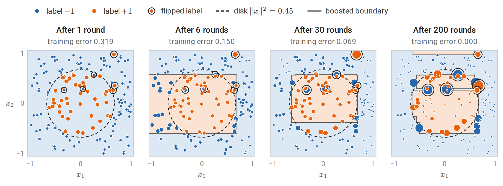
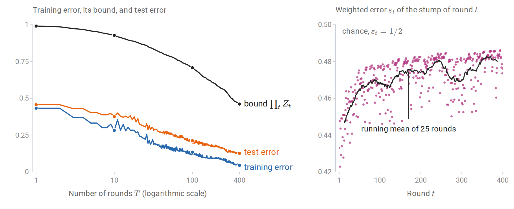
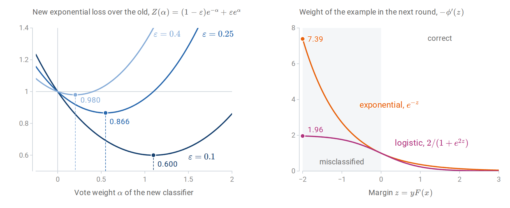
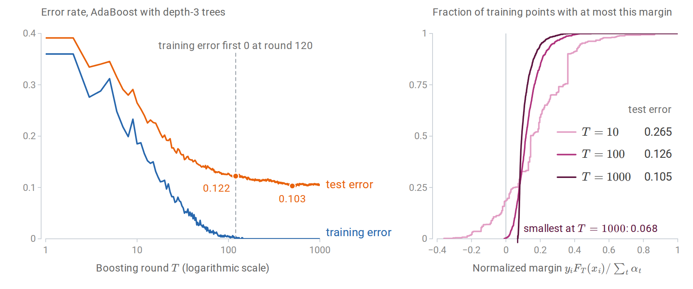
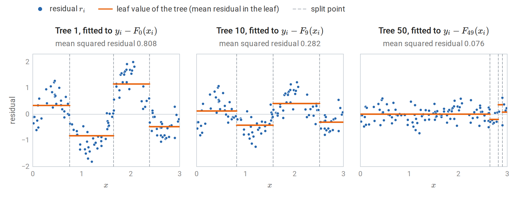
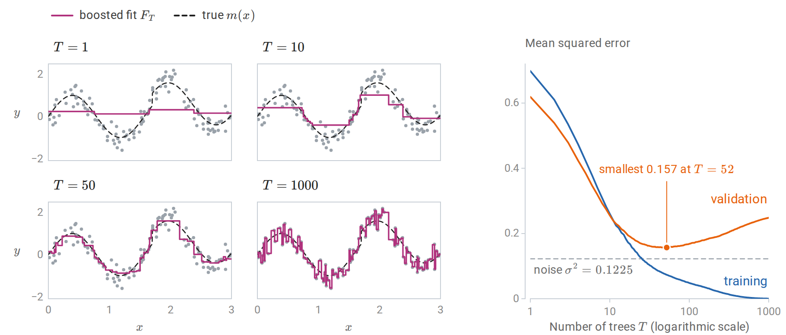
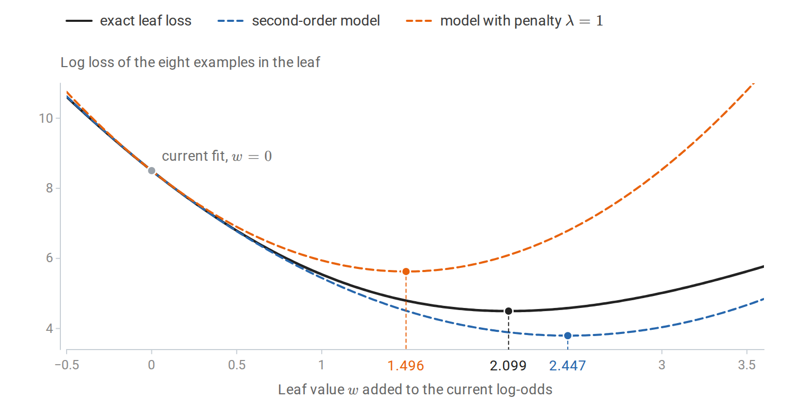
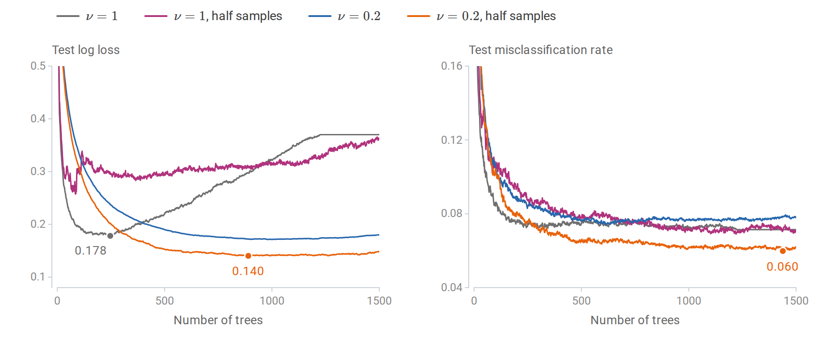
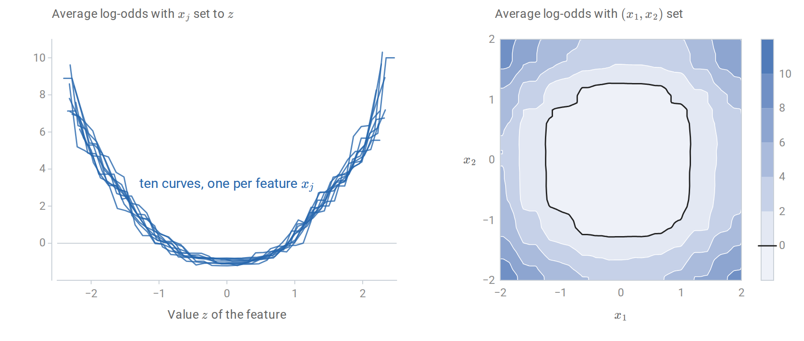

[Background Notes](../README.md) › [Machine Learning](README.md)

# 11. Boosting

[← 10. Bagging and Random Forests](10-bagging-and-random-forests.md) · [12. Principal Components and Dimensionality Reduction →](12-principal-components-and-dimensionality-reduction.md)

## <a id="weak-and-strong-learning"></a>Weak and strong learning

### <a id="the-boosting-question"></a>The boosting question

Bagging and random forests ([chapter 10](10-bagging-and-random-forests.md)) average many strong, high-variance learners trained independently. **Boosting** combines many *weak* learners trained in sequence, each one concentrating on the examples its predecessors handled badly. The two families attack different parts of the error: averaging mostly reduces variance, while boosting reduces bias as well, by building a flexible additive model out of simple pieces.

Boosting began as a question in learning theory, posed by Kearns and Valiant in the late 1980s ([journal version, 1994](https://dl.acm.org/doi/10.1145/174644.174647)). A **weak learner** is an algorithm that, for every distribution over the training examples, returns a classifier with weighted error at most $`\tfrac12-\gamma`$ for some fixed **edge** $`\gamma>0`$: slightly better than guessing, whatever the weighting. A strong learner in the PAC sense of [chapter 7](07-statistical-learning-theory.md) and [Information and Learning Theory](../foundations/05-information-and-learning-theory.md#pac-learning-and-its-limits) achieves arbitrarily small error with high probability. Is weak learnability equivalent to strong learnability? [Schapire (1990)](https://link.springer.com/article/10.1007/BF00116037) proved that it is, by constructing a procedure that calls the weak learner on reweighted data and combines the results. The practical algorithm that followed, AdaBoost, is the subject of the first half of this chapter.

Throughout, labels are $`y\in\{-1,+1\}`$ for AdaBoost and $`y\in\{0,1\}`$ when boosting is framed as logistic regression. The combined score is an additive model

```math
F_T(x)=\sum_{t=1}^T\alpha_t\,h_t(x),
```

a weighted sum of $`T`$ **base learners** $`h_t`$ with **vote weights** $`\alpha_t`$. Each base learner is typically a small decision tree ([chapter 9](09-decision-and-regression-trees.md)); a tree with a single split is a **stump**. Logarithms are natural throughout.

## <a id="adaboost"></a>AdaBoost

### <a id="the-algorithm"></a>The algorithm

AdaBoost ([Freund and Schapire, 1997](https://www.sciencedirect.com/science/article/pii/S002200009791504X)) maintains a distribution $`D_t`$ over the $`n`$ training examples, starting from the uniform distribution $`D_1(i)=1/n`$. For $`t=1,\ldots,T`$:

1. Train the base learner on the weighted data, giving $`h_t:\mathcal X\to\{-1,+1\}`$ with weighted error $`\varepsilon_t=\sum_iD_t(i)\,\mathbf 1\{h_t(x_i)\ne y_i\}`$.
2. Set $`\alpha_t=\frac12\ln\dfrac{1-\varepsilon_t}{\varepsilon_t}`$.
3. Update $`D_{t+1}(i)=D_t(i)\exp\bigl(-\alpha_ty_ih_t(x_i)\bigr)/Z_t`$, where $`Z_t`$ normalizes the weights to sum to one.

The output is the classifier $`H(x)=\operatorname{sign}F_T(x)`$. A learner with $`\varepsilon_t<\tfrac12`$ gets a positive vote, larger when it is more accurate. The update multiplies the weight of each misclassified example by $`e^{\alpha_t}`$ and of each correct one by $`e^{-\alpha_t}`$. The choice of $`\alpha_t`$ makes the reweighting exact in one sense: under $`D_{t+1}`$, the classifier $`h_t`$ has weighted error exactly $`\tfrac12`$. Indeed, after the update the misclassified examples carry total weight $`\varepsilon_te^{\alpha_t}/Z_t`$ and the correct ones $`(1-\varepsilon_t)e^{-\alpha_t}/Z_t`$, and with $`e^{\alpha_t}=\sqrt{(1-\varepsilon_t)/\varepsilon_t}`$ both numerators equal $`\sqrt{\varepsilon_t(1-\varepsilon_t)}`$. The next weak learner cannot succeed by repeating $`h_t`$; it must find something new.



*AdaBoost with stumps on 160 points labeled $`+1`$ inside a disk, with 4% of the labels flipped. Marker area is proportional to each example's weight $`D_{t+1}(i)`$ after the displayed round, on one scale for all panels, and shading shows the class the ensemble predicts. A single stump predicts one class everywhere, so after round 1 the 51 positive examples share half of the weight. After 6 rounds the stumps have combined into a box; after 30, the weight has concentrated on points near the boundary and on the flipped labels. By round 200 the training error is zero, but only because the ensemble has carved out small regions for the flipped labels, whose six points now carry a quarter of the total weight.*

The weights evolve like the expert weights of the [Hedge algorithm](07-statistical-learning-theory.md#learning-from-expert-advice) in chapter 7, with the roles reversed. The examples are the experts, and an example counts as having erred when the current classifier gets it *right*. Hedge multiplies the weight of every expert that errs by a factor $`\beta<1`$; AdaBoost's update, after normalization, is the same as multiplying the weights of the correctly classified examples by $`\beta_t=e^{-2\alpha_t}=\varepsilon_t/(1-\varepsilon_t)`$ and leaving the others unchanged. Each example's weight therefore grows, relative to the rest, whenever the current classifier gets it wrong. Freund and Schapire derived AdaBoost from Hedge in exactly this way.

### <a id="training-error-falls-exponentially"></a>Training error falls exponentially

**Theorem.** The training error $`\widehat R_n(H)`$ of $`H`$ under the zero–one loss satisfies

```math
\frac1n\sum_{i=1}^n\mathbf 1\{H(x_i)\ne y_i\}\le\prod_{t=1}^TZ_t=\prod_{t=1}^T2\sqrt{\varepsilon_t(1-\varepsilon_t)}\le\exp\Bigl(-2\sum_{t=1}^T\gamma_t^2\Bigr),
\qquad\gamma_t=\tfrac12-\varepsilon_t .
```

**Proof.** Unrolling the update from $`D_1(i)=1/n`$ gives $`D_{T+1}(i)=\frac1n\prod_t\bigl(e^{-\alpha_ty_ih_t(x_i)}/Z_t\bigr)`$, and the exponents add up to $`-y_iF_T(x_i)`$:

```math
D_{T+1}(i)=\frac{\exp\bigl(-y_iF_T(x_i)\bigr)}{n\prod_tZ_t}.
```

These weights sum to one, so $`\frac1n\sum_i\exp(-y_iF_T(x_i))=\prod_tZ_t`$. A mistake means $`y_iF_T(x_i)\le0`$, and $`\mathbf 1\{z\le0\}\le e^{-z}`$, which proves the first inequality. Splitting $`Z_t=\sum_iD_t(i)e^{-\alpha_ty_ih_t(x_i)}`$ into correct and incorrect examples gives $`Z_t=(1-\varepsilon_t)e^{-\alpha_t}+\varepsilon_te^{\alpha_t}`$. This is minimized by the chosen $`\alpha_t`$, as the left panel of the figure in [the next section](#adaboost-minimizes-the-exponential-loss) shows, with value $`2\sqrt{\varepsilon_t(1-\varepsilon_t)}=\sqrt{1-4\gamma_t^2}\le e^{-2\gamma_t^2}`$, where the last step is $`1-u\le e^{-u}`$. $`\square`$

If every weak classifier has edge at least $`\gamma`$, the training error is below $`e^{-2\gamma^2T}`$. The training error is a multiple of $`1/n`$, so it reaches zero once $`e^{-2\gamma^2T}<1/n`$, that is, once $`T>\ln n/(2\gamma^2)`$. Weak learning therefore yields a classifier **consistent** with the training data, in the sense of [Information and Learning Theory](../foundations/05-information-and-learning-theory.md#pac-learning-and-its-limits). A weighted vote of $`T`$ classifiers from a class of VC dimension $`v`$ has VC dimension at most of order $`Tv\ln(Tv)`$, and the number of rounds needed grows only like $`\ln n`$. The uniform convergence results of [chapter 7](07-statistical-learning-theory.md#the-fundamental-theorem-of-pac-learning) therefore turn consistency into a PAC guarantee. This is the theoretical answer to the boosting question.

```python
import numpy as np
from sklearn.datasets import make_hastie_10_2
from sklearn.tree import DecisionTreeClassifier

X, y = make_hastie_10_2(n_samples=3000, random_state=0)   # labels in {-1, +1}
Xtr, ytr, Xte, yte = X[:1000], y[:1000], X[1000:], y[1000:]
n = len(ytr)
D = np.full(n, 1 / n)              # distribution over training examples
F, Fte = np.zeros(n), np.zeros(len(yte))
bound, gamma_sq = 1.0, 0.0
for t in range(1, 401):
    stump = DecisionTreeClassifier(max_depth=1, random_state=0).fit(Xtr, ytr, sample_weight=D)
    h = stump.predict(Xtr)
    eps = D[h != ytr].sum()                      # weighted training error of the weak learner
    alpha = 0.5 * np.log((1 - eps) / eps)
    D = D * np.exp(-alpha * ytr * h)
    Z = D.sum()                                  # normalizer, equal to 2 sqrt(eps (1 - eps))
    D /= Z
    F += alpha * h
    Fte += alpha * stump.predict(Xte)
    bound *= Z
    gamma_sq += (0.5 - eps) ** 2
    if t in (1, 10, 100, 400):
        print(f"T={t:3d}: eps_t={eps:.3f}  training error {np.mean(np.sign(F) != ytr):.3f} "
              f"<= prod Z_t {bound:.3f} <= exp(-2 sum gamma^2) {np.exp(-2 * gamma_sq):.3f};  "
              f"test error {np.mean(np.sign(Fte) != yte):.3f}")
# After reweighting, the last weak learner is no better than chance on the new distribution.
print("weighted error of h_T under D_{T+1}:", round(D[h != ytr].sum(), 6))
# T=  1: eps_t=0.433  training error 0.433 <= prod Z_t 0.991 <= exp(-2 sum gamma^2) 0.991;  test error 0.457
# T= 10: eps_t=0.451  training error 0.282 <= prod Z_t 0.928 <= exp(-2 sum gamma^2) 0.929;  test error 0.376
# T=100: eps_t=0.461  training error 0.134 <= prod Z_t 0.708 <= exp(-2 sum gamma^2) 0.709;  test error 0.212
# T=400: eps_t=0.476  training error 0.045 <= prod Z_t 0.461 <= exp(-2 sum gamma^2) 0.463;  test error 0.126
# weighted error of h_T under D_{T+1}: 0.5
```

The data are those of [ESL §10.1](https://hastie.su.domains/ElemStatLearn/): ten standard normal features, and $`y=1`$ exactly when $`\sum_jx_j^2`$ exceeds its median. The bound is valid but loose, and the edges shrink as the reweighted problems get harder: by round 400, stumps are barely better than chance on their weighted data. Yet the combination of these weak rules is accurate, while a single stump is useless on this spherical boundary. The next figure follows the same run through every round.



*The run of the code above, round by round. Left: the training error stays below the bound $`\prod_tZ_t`$ but far from it, and the dots mark the four rounds that the code prints. The bound $`\exp(-2\sum_t\gamma_t^2)`$ is not drawn; it never exceeds $`\prod_tZ_t`$ by more than 0.0013. Right: the stumps' weighted errors drift toward $`1/2`$, from 0.440 on average over the first ten rounds to 0.478 over the last hundred.*

## <a id="boosting-as-stagewise-additive-modeling"></a>Boosting as stagewise additive modeling

### <a id="adaboost-minimizes-the-exponential-loss"></a>AdaBoost minimizes the exponential loss

The proof above shows that AdaBoost drives down $`\frac1n\sum_i\exp(-y_iF(x_i))`$, the average **exponential loss** of [chapter 6](06-losses-model-selection-and-evaluation.md#margin-losses-for-classification). It does so greedily. Suppose $`F_{t-1}`$ is fixed and a new term $`\alpha h`$ is to be added. With $`w_i=\exp(-y_iF_{t-1}(x_i))`$, which is proportional to $`D_t(i)`$,

```math
\sum_iw_i\,e^{-\alpha y_ih(x_i)}
=e^{-\alpha}\sum_iw_i+\bigl(e^\alpha-e^{-\alpha}\bigr)\sum_iw_i\,\mathbf 1\{h(x_i)\ne y_i\}.
```

For any $`\alpha>0`$, the best $`h`$ minimizes the weighted error $`\varepsilon=\sum_iw_i\mathbf 1\{h(x_i)\ne y_i\}/\sum_iw_i`$. Dividing by $`\sum_iw_i`$, the loss as a function of $`\alpha`$ is $`(1-\varepsilon)e^{-\alpha}+\varepsilon e^{\alpha}`$, the factor $`Z_t`$ of the training-error proof, and setting its derivative $`-(1-\varepsilon)e^{-\alpha}+\varepsilon e^{\alpha}`$ to zero gives $`\alpha=\frac12\ln\frac{1-\varepsilon}{\varepsilon}`$. AdaBoost is therefore **forward stagewise additive modeling** with exponential loss ([Friedman, Hastie, and Tibshirani, 2000](https://projecteuclid.org/journals/annals-of-statistics/volume-28/issue-2/Additive-logistic-regression--a-statistical-view-of-boosting-With/10.1214/aos/1016218223.full)): each round adds the one basis function, from a possibly infinite dictionary of weak classifiers, that most decreases the loss, and never revisits earlier terms. Equivalently, it is [coordinate descent](../foundations/03-calculus-and-optimization.md#coordinate-descent) on the exponential loss over that dictionary, with one coordinate per weak classifier. The derivative of the loss along the coordinate $`h`$ at $`\alpha=0`$ is $`-(1-2\varepsilon)\sum_iw_i`$, so the classifier with the smallest weighted error is the steepest coordinate, and $`\alpha_t`$ is an [exact line search](../foundations/03-calculus-and-optimization.md#line-search-and-accepted-step-bounds) along it.

This view connects boosting to the rest of the module. With $`\eta(x)=P(Y=1\mid X=x)`$, the population minimizer of the exponential loss is $`F^\ast(x)=\frac12\ln\frac{\eta(x)}{1-\eta(x)}`$, half the log-odds, so $`\hat\eta(x)=1/(1+e^{-2F(x)})`$ is a probability estimate. The exponential loss grows much faster than the logistic loss for negative margins. That makes AdaBoost sensitive to mislabeled examples: their weights grow exponentially, as the first figure of the chapter shows. For a decreasing margin loss $`\phi(z)`$ of the margin $`z=yF(x)`$, the fit of the next base learner weights each example in proportion to $`-\phi'(z)`$: for the exponential loss this is AdaBoost's weight $`D_t(i)\propto e^{-z_i}`$, and in gradient boosting, below, it is the size of the example's pseudo-residual. The logistic loss $`\ln(1+e^{-2z})`$, written on the same half-log-odds scale, gives weights that never exceed 2. Replacing the exponential loss by the logistic loss therefore gives a more robust booster, and gradient boosting handles any differentiable loss.



*Left: when a classifier with weighted error $`\varepsilon`$ is added with vote weight $`\alpha`$, the exponential loss is multiplied by $`Z(\alpha)`$. Each curve is smallest at $`\alpha=\tfrac12\ln\frac{1-\varepsilon}{\varepsilon}`$, marked by a dashed line, and its smallest value $`2\sqrt{\varepsilon(1-\varepsilon)}`$ is the factor $`Z_t`$ of the training-error bound; a weak classifier with $`\varepsilon=0.4`$ lowers the loss by only 2%. Right: the weight of an example with margin $`z`$ in the next round. Under the exponential loss it grows without bound as the margin becomes more negative, while under the logistic loss it levels off.*

### <a id="forward-stagewise-fitting-in-general"></a>Forward stagewise fitting in general

For a loss $`L(y,F)`$ and a family of base functions $`b(x;a)`$ with parameters $`a`$, such as the split variables, thresholds, and leaf values of a tree, forward stagewise fitting sets $`F_0`$ to the best constant and then, for $`t=1,2,\ldots`$,

```math
(\beta_t,a_t)=\arg\min_{\beta,a}\sum_{i=1}^nL\bigl(y_i,F_{t-1}(x_i)+\beta\,b(x_i;a)\bigr),\qquad F_t=F_{t-1}+\beta_tb(\cdot;a_t).
```

For squared loss, the inner problem fits the base learner to the current residuals $`y_i-F_{t-1}(x_i)`$ by least squares. For exponential loss with classifiers as base functions, it is AdaBoost. For most other losses, the inner problem has no closed form, and gradient boosting approximates it.

## <a id="margins-and-why-boosting-often-resists-overfitting"></a>Margins and why boosting often resists overfitting

AdaBoost often keeps improving on test data long after its training error reaches zero. Each new round makes the classifier more complex, so this seems to contradict the tradeoffs of [chapter 6](06-losses-model-selection-and-evaluation.md). The explanation offered by [Schapire, Freund, Bartlett, and Lee (1998)](https://projecteuclid.org/journals/annals-of-statistics/volume-26/issue-5/Boosting-the-margin--a-new-explanation-for-the-effectiveness/10.1214/aos/1024691352.full) is the **margin**. Normalize the score as $`f=F_T/\sum_t\alpha_t`$, a convex combination of base classifiers with values in $`[-1,1]`$ (the vote weights are positive when every $`\varepsilon_t<\tfrac12`$). The normalized margin $`yf(x)`$ is positive for a correct vote and near one for a nearly unanimous one.



*AdaBoost with depth-3 trees on the ESL problem with 1,000 training and 11,000 test points. Left: after first reaching zero, the training error returns several times to one, two, or three mistakes until round 144 and is zero from then on, yet the test error keeps falling until about round 500. Right: the cumulative distribution of the normalized training margins at three stages, with each ensemble's test error. Continued boosting pushes the smallest margins upward long after the training error has stopped changing.*

The margin bound of [Information and Learning Theory](../foundations/05-information-and-learning-theory.md#rademacher-complexity-and-margins) applies directly. That bound is proved there for linear scores, but its argument works for any class $`\mathcal F`$ of scores: the ramp loss at margin level $`\theta`$ (written $`\rho`$ in Foundations) lies above $`\mathbf 1\{s\le0\}`$, below $`\mathbf 1\{s\le\theta\}`$, and is $`1/\theta`$-Lipschitz, so the [contraction inequality](../foundations/05-information-and-learning-theory.md#norm-bounds-for-linear-scores) bounds the complexity of the ramp losses by $`1/\theta`$ times the Rademacher complexity of $`\mathcal F`$.

Take $`\mathcal F`$ to be the convex hull of the base class. The Rademacher complexity of the convex hull of a class equals that of the class itself, because a linear function of the vector $`(f(x_1),\ldots,f(x_n))`$ attains its supremum over a convex hull at an extreme point. For base classifiers with values $`\pm1`$ and VC dimension $`v`$, the vectors $`(h(x_1),\ldots,h(x_n))`$ have norm $`\sqrt n`$, and by Sauer's lemma there are at most $`(en/v)^v`$ distinct ones when $`n\ge v`$, so the [finite-class Rademacher bound](../foundations/05-information-and-learning-theory.md#why-a-finite-vc-dimension-gives-a-deviation-rate) of the Foundations appendix bounds that complexity by $`\sqrt{2v\ln(en/v)/n}`$. Hence, with probability at least $`1-\delta`$, for a fixed margin level $`\theta>0`$ and every convex combination $`f`$,

```math
P\bigl(Yf(X)\le0\bigr)\le\frac1n\sum_{i=1}^n\mathbf 1\{y_if(x_i)\le\theta\}+\frac2\theta\sqrt{\frac{2v\ln(en/v)}n}+\sqrt{\frac{\ln(1/\delta)}{2n}} .
```

The left side is the population error of the classifier $`\operatorname{sign}f`$, counting a zero score as an error. The number of rounds $`T`$ does not appear. What matters is the fraction of training points with small margin, and AdaBoost reduces it: [Appendix A](#block-boost-appendix-a) shows that the fraction with margin at most $`\theta`$ is at most $`\prod_t2\sqrt{\varepsilon_t^{1-\theta}(1-\varepsilon_t)^{1+\theta}}`$, which decays exponentially whenever every edge $`\gamma_t`$ is at least $`\theta`$.

The margin explanation is incomplete. [Breiman (1999)](https://direct.mit.edu/neco/article-abstract/11/7/1493/6306/Prediction-Games-and-Arcing-Algorithms) designed an algorithm that achieves larger minimum margins than AdaBoost and found that it generalized worse, and later analyses traced the difference to the complexity of the trees it chose. With noisy labels, AdaBoost eventually overfits: it keeps raising the weights of mislabeled points, and random label noise can defeat every boosting algorithm that minimizes a convex potential ([Long and Servedio, 2010](https://link.springer.com/article/10.1007/s10994-009-5165-z)). In practice, boosting is regularized by shrinkage and stopped early.

## <a id="gradient-boosting"></a>Gradient boosting

### <a id="gradient-descent-in-function-space"></a>Gradient descent in function space

Gradient boosting ([Friedman, 2001](https://projecteuclid.org/journals/annals-of-statistics/volume-29/issue-5/Greedy-function-approximation-A-gradient-boosting-machine/10.1214/aos/1013203451.full); [Mason, Baxter, Bartlett, and Frean, 1999](https://proceedings.neurips.cc/paper_files/paper/1999/hash/96a93ba89a5b5c6c226e49b88973f46e-Abstract.html)) treats the vector of training predictions $`\bigl(F(x_1),\ldots,F(x_n)\bigr)`$ as the variable of an optimization problem, the training loss $`\sum_iL\bigl(y_i,F(x_i)\bigr)`$. The gradient of this loss with respect to that vector has components

```math
g_i=\frac{\partial L(y_i,F)}{\partial F}\bigg|_{F=F_{t-1}(x_i)} .
```

A step of [gradient descent](../foundations/03-calculus-and-optimization.md#gradient-descent-and-step-sizes) would move each training prediction by $`-g_i`$, but that defines the function only at the training inputs. Gradient boosting instead fits a regression tree to the **pseudo-residuals** $`r_i=-g_i`$ by least squares, choosing the base function most nearly parallel to the negative gradient, and steps along it. The tree's vector of training predictions is then a least-squares approximation to the gradient step $`(r_1,\ldots,r_n)`$, and, unlike that step, the tree also defines a step at every other input. The algorithm is:

1. Initialize $`F_0`$ to the best constant, $`\arg\min_c\sum_iL(y_i,c)`$.
2. For $`t=1,\ldots,T`$: compute $`r_i=-g_i`$; fit a regression tree with leaves $`R_{1t},\ldots,R_{Jt}`$ to $`\{(x_i,r_i)\}`$; for each leaf, solve the one-dimensional problem $`w_{jt}=\arg\min_w\sum_{x_i\in R_{jt}}L\bigl(y_i,F_{t-1}(x_i)+w\bigr)`$; update $`F_t(x)=F_{t-1}(x)+\nu\sum_jw_{jt}\mathbf 1\{x\in R_{jt}\}`$.

The tree supplies the partition, the leaf values $`w_{jt}`$ supply a separate line search in each region, and $`\nu\in(0,1]`$ is the **learning rate** or shrinkage factor. The loss enters only through $`g_i`$ and the leaf problems:

| Loss $`L(y,F)`$ | Pseudo-residual $`r_i`$ | Leaf value $`w_j`$ |
| --- | --- | --- |
| Squared error $`\frac12(y-F)^2`$ | $`y_i-F(x_i)`$ | Mean of the residuals |
| Absolute error $`\lvert y-F\rvert`$ | $`\operatorname{sign}\bigl(y_i-F(x_i)\bigr)`$ | Median of the residuals $`y_i-F(x_i)`$ |
| Huber loss with threshold $`\delta`$ | Residual, clipped at $`\pm\delta`$ | Approximately the median, adjusted for large residuals |
| Log loss, $`y\in\{0,1\}`$, $`F`$ the log-odds | $`y_i-p_i`$, with $`p_i=\sigma(F(x_i))`$ | One Newton step: $`\sum r_i\big/\sum p_i(1-p_i)`$ |
| Exponential loss, $`y\in\{-1,1\}`$ | $`y_ie^{-y_iF(x_i)}`$ | Solved in closed form, as in AdaBoost |

Here $`\sigma`$ is the logistic function, and the sums in the Newton step run over the examples in the leaf. For squared error, the pseudo-residuals are ordinary residuals, and gradient boosting repeatedly fits trees to what is left unexplained. For absolute error, they are signs, so an outlying response has no more influence on the next tree than any other. For log loss, the method is boosted logistic regression.



*Gradient boosting for squared error with depth-2 trees and $`\nu=0.1`$ on 120 noisy observations of a one-dimensional function, the regression data of [chapter 9](09-decision-and-regression-trees.md#depth-and-the-biasvariance-tradeoff). Each tree is fitted by least squares to the residuals of the current fit, and the tree, scaled by $`\nu`$, is added to the fit. The first tree captures the large-scale shape and the tenth refines it. By the fiftieth, the mean squared residual is already below the noise variance $`0.35^2=0.1225`$, and the tree spends its splits on a few points near the right edge.*

The implementation below follows the algorithm literally for log loss, with the leaf values in the dictionary `gamma`, and reproduces scikit-learn's [`GradientBoostingClassifier`](https://scikit-learn.org/stable/modules/generated/sklearn.ensemble.GradientBoostingClassifier.html) on the training data.

```python
import numpy as np
from sklearn.datasets import load_breast_cancer
from sklearn.ensemble import GradientBoostingClassifier
from sklearn.model_selection import train_test_split
from sklearn.tree import DecisionTreeRegressor

X, y = load_breast_cancer(return_X_y=True)                 # y in {0, 1}
Xtr, Xte, ytr, yte = train_test_split(X, y, test_size=0.4, stratify=y, random_state=0)
nu, T = 0.1, 100

p0 = ytr.mean()
F = np.full(len(ytr), np.log(p0 / (1 - p0)))              # start from the log odds of the base rate
Fte = np.full(len(yte), np.log(p0 / (1 - p0)))
for t in range(T):
    p = 1 / (1 + np.exp(-F))
    r = ytr - p                                            # negative gradient of the log loss in F
    tree = DecisionTreeRegressor(max_depth=3, random_state=0).fit(Xtr, r)
    leaf, leaf_te = tree.apply(Xtr), tree.apply(Xte)
    gamma = {j: r[leaf == j].sum() / (p * (1 - p))[leaf == j].sum()   # one Newton step per leaf
             for j in np.unique(leaf)}
    F += nu * np.array([gamma[j] for j in leaf])
    Fte += nu * np.array([gamma[j] for j in leaf_te])

sk = GradientBoostingClassifier(n_estimators=T, learning_rate=nu, max_depth=3, criterion="squared_error",
                                random_state=0).fit(Xtr, ytr)
print("same training scores as scikit-learn:", np.allclose(F, sk.decision_function(Xtr)))
print(f"test accuracy {np.mean((Fte > 0) == yte):.3f}, test log loss "
      f"{np.mean(np.log1p(np.exp(Fte)) - yte * Fte):.3f}")
# same training scores as scikit-learn: True
# test accuracy 0.956, test log loss 0.147
```

The comparison is on the training data because trees fitted to the same data can tie: two different splits may partition the training points identically while routing new points differently, and the two implementations break such ties differently.

On the one-dimensional example, the sum of the scaled trees approaches the regression function and then begins to fit the noise, which a validation set detects.



*Left: the boosted fit of the previous figure after 1, 10, 50, and 1,000 trees. Each tree fits the current residuals, and the sum sharpens gradually. Right: mean squared error on the training data and on 2,000 validation points. Training error falls toward zero, while validation error reaches its smallest value a little above the noise variance and rises to 0.248 by $`T=1000`$, where the fit has absorbed the noise.*

### <a id="newton-steps-and-regularized-trees"></a>Newton steps and regularized trees

Modern implementations use second-order information, as [Newton's method](../foundations/03-calculus-and-optimization.md#newton-s-method) does. Write $`g_i`$ and $`h_i`$ for the first and second derivatives of $`L(y_i,\cdot)`$ at $`F_{t-1}(x_i)`$; here $`h_i`$ is a curvature, not a base learner, following the notation of XGBoost. Penalize a tree with leaf values $`w_1,\ldots,w_J`$ by $`\Omega=\zeta J+\frac\lambda2\sum_jw_j^2`$, where $`\zeta`$ charges for each leaf and $`\lambda`$ shrinks the leaf values. A [second-order Taylor expansion](../foundations/03-calculus-and-optimization.md#the-quadratic-approximation) of the loss makes the objective for a fixed tree structure separate across leaves:

```math
\sum_{j=1}^J\Bigl[G_jw_j+\frac12(H_j+\lambda)w_j^2\Bigr]+\zeta J,
\qquad G_j=\sum_{i\in R_j}g_i,\quad H_j=\sum_{i\in R_j}h_i .
```

Each leaf's optimal value is $`w_j^\ast=-G_j/(H_j+\lambda)`$, and splitting a leaf into a left child $`L`$ and a right child $`R`$ improves the objective by

```math
\frac12\Bigl[\frac{G_L^2}{H_L+\lambda}+\frac{G_R^2}{H_R+\lambda}-\frac{(G_L+G_R)^2}{H_L+H_R+\lambda}\Bigr]-\zeta .
```

This split criterion and leaf formula are the core of XGBoost ([Chen and Guestrin, 2016](https://dl.acm.org/doi/abs/10.1145/2939672.2939785)); the derivation is in [Appendix B](#block-boost-appendix-b). For squared error, $`h_i=1`$ and the leaf value is a shrunken mean residual $`\sum r_i/(n_j+\lambda)`$, where $`n_j`$ is the number of examples in the leaf. For log loss with $`\lambda=0`$, it is exactly the Newton leaf value in the table above. The split criterion reduces to the regression-tree criterion of [chapter 9](09-decision-and-regression-trees.md#the-best-split-of-a-node), weighted by curvature: with $`h_i=1`$ and $`\lambda=\zeta=0`$, each term $`G^2/H`$ is the $`S^2/n`$ of that criterion applied to the residuals, and the gain is half the decrease in squared error.



*One leaf of a log-loss booster holding eight examples, six of them positive, whose current log-odds are all $`-1`$, a probability of 0.27. The second-order model matches the exact leaf loss in value, slope, and curvature at $`w=0`$. As $`w`$ grows, the leaf's probability rises from 0.27 past $`1/2`$, where the log loss curves most, so the exact loss bends upward faster than the model. The model's minimizer, the Newton value, therefore overshoots the exact minimizer $`1+\ln3`$, at which the leaf predicts the fraction of positives, $`3/4`$. The penalty $`\tfrac\lambda2w^2`$ with $`\lambda=1`$ shrinks the leaf value toward zero.*

## <a id="regularizing-boosting"></a>Regularizing boosting

Boosting fits the training data ever more closely as rounds are added, so its complexity must be controlled. Four controls matter most.

- **Number of rounds.** For fixed other settings, $`T`$ is the main complexity parameter, chosen by [early stopping](06-losses-model-selection-and-evaluation.md#early-stopping-as-regularization) on validation data.
- **Shrinkage.** A learning rate $`\nu<1`$ takes smaller steps. Friedman found that small values, such as $`\nu\le0.1`$, consistently improve test error, at the cost of proportionally more trees. With infinitesimal steps and linear base functions, forward stagewise fitting traces a path closely related to the lasso path of [chapter 3](03-linear-regression-and-regularization.md#regularization-paths) ([ESL §16.2](https://hastie.su.domains/ElemStatLearn/)).
- **Subsampling.** Fitting each tree to a random half of the training data, **stochastic gradient boosting** ([Friedman, 2002](https://www.sciencedirect.com/science/article/abs/pii/S0167947301000652)), reduces variance and computation, much as bagging does. Sampling features per tree or per split borrows the random-forest idea.
- **Tree size.** A tree of depth $`k`$ can represent interactions among at most $`k`$ features, so the depth sets the interaction order of the additive model. Stumps give an additive model $`\sum_jf_j(x_j)`$, which suits the ESL problem, whose decision boundary $`\sum_jx_j^2=c`$ is additive in the features. ESL recommends trees with 4 to 8 leaves as a default. Minimum leaf sizes and the leaf penalty $`\lambda`$ act similarly.



*Gradient boosting with depth-2 trees on the ESL problem, 2,000 training and 10,000 test points, for the four combinations of learning rate and subsampling; dots mark the minima discussed. Left: without shrinkage, the test log loss reaches its minimum after 247 trees and then climbs steeply as the probabilities become overconfident; the curve stops changing after about 1,220 trees, once the training log loss has become negligible. With $`\nu=0.2`$ the curve is much flatter, so the result depends less on when training stops. Shrinkage with half-samples gives the lowest log loss, and subsampling without shrinkage the highest minimum. Right: misclassification error is less sensitive, but the same combination is best.*

The misclassification error barely rises after its minimum even when the log loss climbs. Once most training points are classified correctly, further rounds mostly inflate the scores, which ruins probability estimates long before it changes decisions. Early stopping should monitor the loss that matters for the application.

## <a id="boosting-in-practice"></a>Boosting in practice

Gradient-boosted trees are the default method for medium-sized tabular data, and on such data they typically match or beat deep networks ([Grinsztajn, Oyallon, and Varoquaux, 2022](https://proceedings.neurips.cc/paper_files/paper/2022/hash/0378c7692da36807bdec87ab043cdadc-Abstract-Datasets_and_Benchmarks.html)). The most widely used implementations are XGBoost, [LightGBM](https://proceedings.neurips.cc/paper/2017/file/6449f44a102fde848669bdd9eb6b76fa-Paper.pdf), [CatBoost](https://proceedings.neurips.cc/paper/2018/hash/14491b756b3a51daac41c24863285549-Abstract.html), and scikit-learn's [histogram-based gradient boosting](https://scikit-learn.org/stable/modules/ensemble.html). They share the Newton-step trees above, bin each feature into at most a few hundred values so that split search is a pass over histograms, mostly handle missing values by learning a default direction at each split, and support early stopping. They differ in details such as leaf-wise versus depth-wise growth and the treatment of categorical features.

```python
import numpy as np
from sklearn.datasets import make_hastie_10_2
from sklearn.ensemble import HistGradientBoostingClassifier, RandomForestClassifier
from sklearn.linear_model import LogisticRegression

X, y = make_hastie_10_2(n_samples=24000, random_state=3)
Xtr, ytr, Xte, yte = X[:4000], y[:4000], X[4000:], y[4000:]
models = {
    "logistic regression": LogisticRegression(),
    "random forest (500 trees)": RandomForestClassifier(n_estimators=500, n_jobs=-1, random_state=0),
    "histogram gradient boosting": HistGradientBoostingClassifier(
        max_iter=2000, learning_rate=0.1, max_leaf_nodes=8, early_stopping=True,
        validation_fraction=0.2, n_iter_no_change=30, random_state=0),
}
for name, model in models.items():
    model.fit(Xtr, ytr)
    print(f"{name:28s} test error {np.mean(model.predict(Xte) != yte):.3f}")
print("boosting iterations chosen by early stopping:", models["histogram gradient boosting"].n_iter_)
# logistic regression          test error 0.489
# random forest (500 trees)    test error 0.116
# histogram gradient boosting  test error 0.063
# boosting iterations chosen by early stopping: 757
```

A linear classifier cannot represent the spherical boundary and does no better than chance. The random forest does well. Boosting with small trees halves its error, plausibly because it builds the additive structure of the problem directly, while the forest's deep trees model interactions that are not there.

Random forests and boosting make different tradeoffs. A forest averages deep, independently grown trees; it is hard to overfit, parallelizes trivially, and works well with default settings. Boosting builds shallow trees in sequence; it usually reaches lower error, but it needs early stopping and some tuning of the learning rate, tree size, and subsampling, and each round depends on the previous one. Boosted models with log loss give reasonable probabilities when stopped by validation log loss. AdaBoost's scores, like those of SVMs, should be recalibrated ([chapter 5](05-logistic-regression-and-probabilistic-prediction.md#recalibration)).

Boosted ensembles are as opaque as forests. The permutation importance of [chapter 10](10-bagging-and-random-forests.md#permutation-importance) applies unchanged. Friedman also introduced **partial dependence plots**, which show the average prediction as one or two features are varied over a grid with the others held at their observed values. For one feature $`j`$, the partial dependence at $`z`$ is $`\bar F_j(z)=\frac1n\sum_{i=1}^nF(z,x_{i,-j})`$, where $`(z,x_{i,-j})`$ is example $`i`$ with its $`j`$th feature replaced by $`z`$. Partial dependence plots share the extrapolation caveat of permutation importance when features are correlated ([scikit-learn guide](https://scikit-learn.org/stable/modules/partial_dependence.html)): replacing one feature alone creates inputs that may never occur ([chapter 10](10-bagging-and-random-forests.md#correlated-features)).



*Partial dependence of the boosted model of the code above, on the log-odds scale. Left: the ten one-feature curves have nearly the same U shape, as the symmetry of the boundary $`\sum_jx_j^2=c`$ in the features requires; from $`z=0`$ to $`z=2`$ they rise by between 5.4 and 7.5. Right: the two-feature partial dependence on $`(x_1,x_2)`$ has closed, nearly symmetric contours around the origin, and the thick contour is where the average log-odds is zero.*

[Schapire and Freund's *Boosting: Foundations and Algorithms*](https://direct.mit.edu/books/oa-monograph/5342/BoostingFoundations-and-Algorithms) develops the theory in depth, including the game-theoretic view in which the weak learner and the example weights play a zero-sum game. The [Schapire overview](https://www.cs.princeton.edu/courses/archive/spr08/cos424/readings/Schapire2003.pdf) from the reading plan is a shorter introduction.

## <a id="appendices"></a>Appendices


<details>
<summary><a id="block-boost-appendix-a"></a><b>A. AdaBoost increases training margins</b></summary>


Let $`A=\sum_t\alpha_t`$ and $`f=F_T/A`$. For $`\theta\in[0,1)`$, the event $`y_if(x_i)\le\theta`$ is the event $`y_iF_T(x_i)\le\theta A`$, and $`\mathbf 1\{z\le0\}\le e^{-z}`$ applied to $`z=y_iF_T(x_i)-\theta A`$ gives

```math
\frac1n\sum_i\mathbf 1\{y_if(x_i)\le\theta\}\le\frac{e^{\theta A}}n\sum_ie^{-y_iF_T(x_i)}=e^{\theta A}\prod_tZ_t=\prod_te^{\theta\alpha_t}Z_t,
```

using the identity $`\frac1n\sum_ie^{-y_iF_T(x_i)}=\prod_tZ_t`$ from the training-error proof. Substituting $`e^{\alpha_t}=\sqrt{(1-\varepsilon_t)/\varepsilon_t}`$ and $`Z_t=2\sqrt{\varepsilon_t(1-\varepsilon_t)}`$,

```math
e^{\theta\alpha_t}Z_t=\Bigl(\frac{1-\varepsilon_t}{\varepsilon_t}\Bigr)^{\theta/2}2\sqrt{\varepsilon_t(1-\varepsilon_t)}=2\sqrt{\varepsilon_t^{1-\theta}(1-\varepsilon_t)^{1+\theta}} .
```

Suppose every $`\varepsilon_t\le\frac12-\gamma`$ and $`\theta\le\gamma`$. The factor is increasing in $`\varepsilon_t`$ on $`[0,(1-\theta)/2]`$, because the derivative of its logarithm, $`\frac{1-\theta}{2\varepsilon_t}-\frac{1+\theta}{2(1-\varepsilon_t)}`$, is nonnegative there, and this interval contains $`[0,\frac12-\gamma]`$. Each factor is therefore at most its value at $`\varepsilon_t=\frac12-\gamma`$, which is $`\sqrt{(1-2\gamma)^{1-\theta}(1+2\gamma)^{1+\theta}}`$. Taking logarithms with $`u=2\gamma`$, this is below one exactly when $`\theta\ln\frac{1+u}{1-u}<-\ln(1-u^2)`$. The power series $`\frac u2\ln\frac{1+u}{1-u}=u^2+\frac{u^4}3+\frac{u^6}5+\cdots`$ and $`-\ln(1-u^2)=u^2+\frac{u^4}2+\frac{u^6}3+\cdots`$ compare term by term, the coefficients $`\frac1{2k-1}`$ against $`\frac1k`$, and show that the condition holds at $`\theta=\gamma`$ and hence for all smaller $`\theta`$. The fraction of training points with margin at most $`\theta`$ therefore decays exponentially in $`T`$, which is how AdaBoost raises the margin distribution.

The margin bound in the main text holds for a fixed $`\theta`$. To choose $`\theta`$ after seeing the data, apply it on a grid $`\theta_k=2^{-k}`$ with failure probabilities $`\delta_k=\delta/(k(k+1))`$, which sum to $`\delta`$. The union bound then covers all grid points at the cost of replacing $`\ln(1/\delta)`$ by $`\ln\bigl(k(k+1)/\delta\bigr)`$, and any $`\theta`$ lies within a factor of two of a grid point.

</details>


<details>
<summary><a id="block-boost-appendix-b"></a><b>B. The second-order split criterion</b></summary>


At round $`t`$, a new tree $`f`$ with leaves $`R_1,\ldots,R_J`$ and values $`w_1,\ldots,w_J`$ is added to $`F_{t-1}`$. A second-order Taylor expansion of each loss term around $`F_{t-1}(x_i)`$ gives

```math
\sum_iL\bigl(y_i,F_{t-1}(x_i)+f(x_i)\bigr)\approx\sum_iL\bigl(y_i,F_{t-1}(x_i)\bigr)+\sum_i\Bigl[g_if(x_i)+\frac12h_if(x_i)^2\Bigr].
```

Every example in leaf $`j`$ has $`f(x_i)=w_j`$, so after dropping the constant and adding the penalty the objective is

```math
\sum_j\Bigl[G_jw_j+\frac12(H_j+\lambda)w_j^2\Bigr]+\zeta J .
```

For convex losses $`h_i\ge0`$, so each bracket is a convex quadratic in $`w_j`$ when $`H_j+\lambda>0`$. Setting its derivative to zero gives $`w_j^\ast=-G_j/(H_j+\lambda)`$ and minimum value $`-\frac12G_j^2/(H_j+\lambda)`$. The objective of a structure is therefore $`-\frac12\sum_jG_j^2/(H_j+\lambda)+\zeta J`$. Splitting one leaf into two replaces one term by two and adds one leaf, which gives the gain formula in the main text. A split is worthwhile only when the gain is positive, so $`\zeta`$ acts as a minimum gain, a form of pre-pruning.

For log loss with $`F`$ the log-odds, $`g_i=p_i-y_i`$ and $`h_i=p_i(1-p_i)`$. With $`\lambda=0`$, $`w_j^\ast=\sum_{i\in R_j}(y_i-p_i)\big/\sum_{i\in R_j}p_i(1-p_i)`$, the Newton leaf value of Friedman's algorithm. The only difference from Friedman's method is that the tree structure is also chosen by the second-order criterion, rather than by least squares on the pseudo-residuals.

</details>

---

[← 10. Bagging and Random Forests](10-bagging-and-random-forests.md) · [12. Principal Components and Dimensionality Reduction →](12-principal-components-and-dimensionality-reduction.md)
