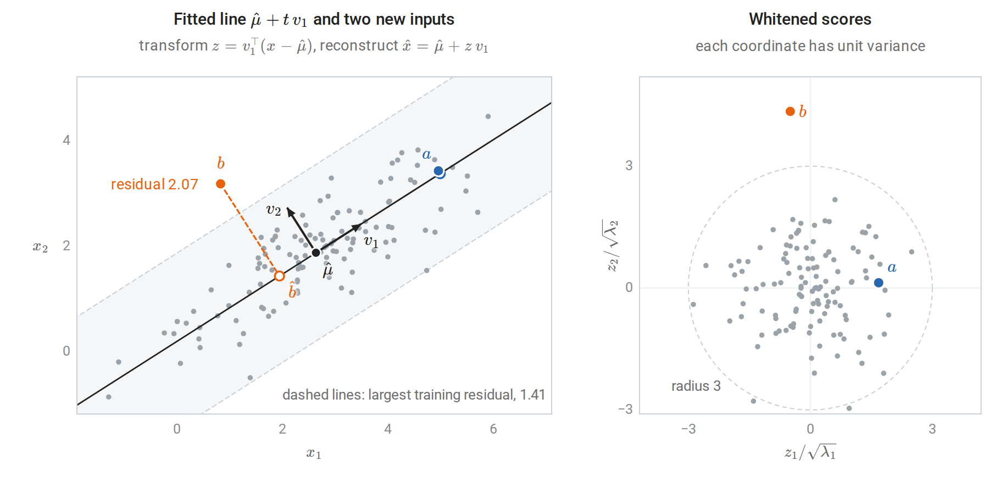
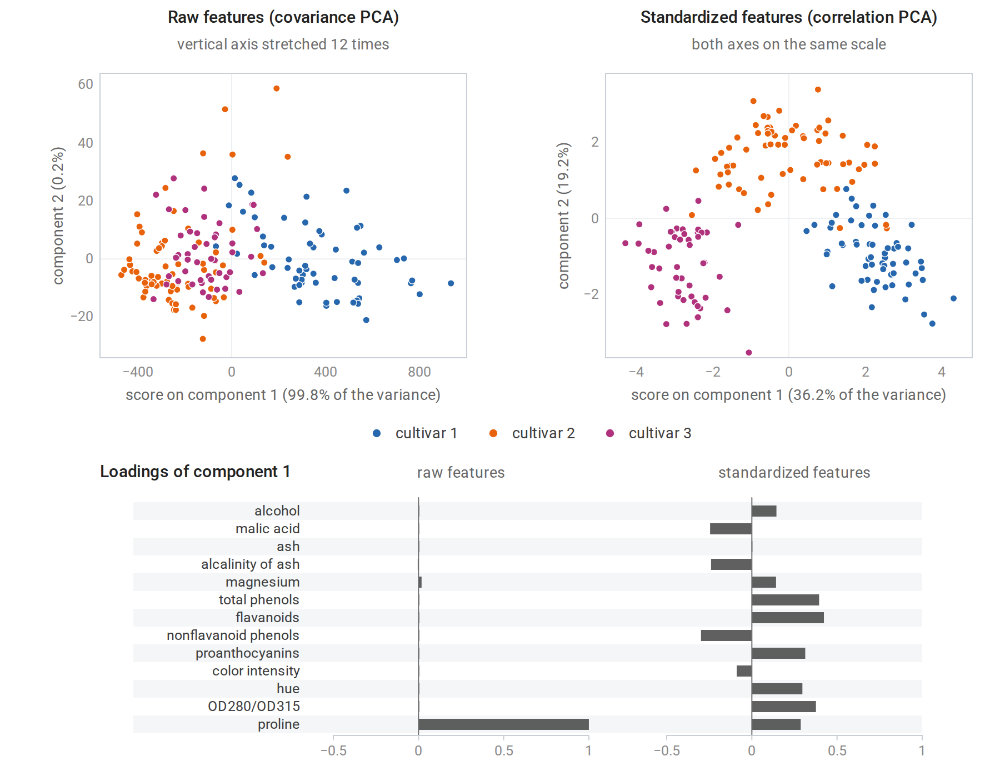
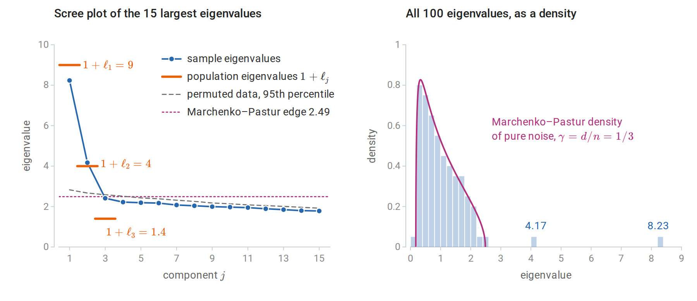
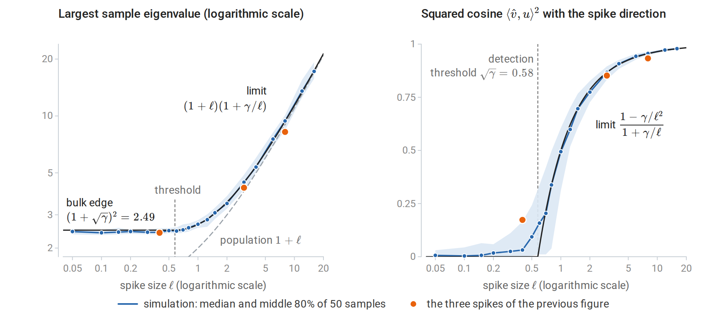
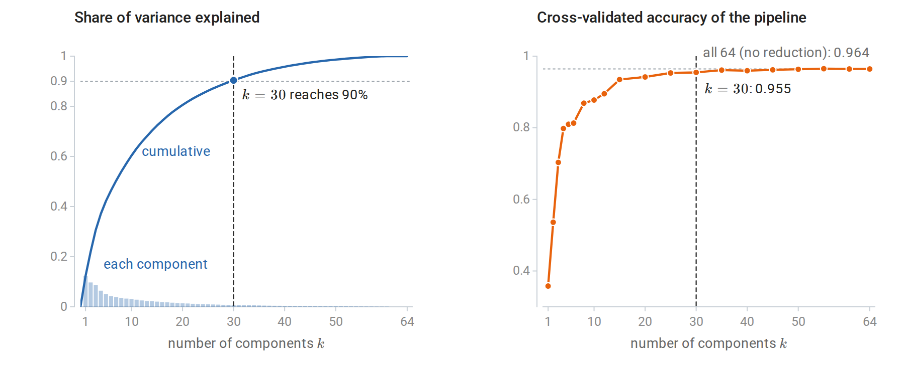
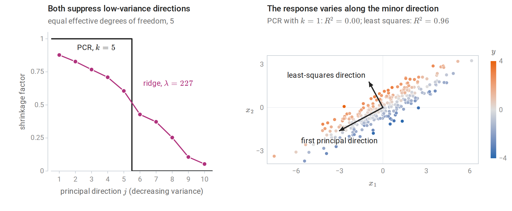
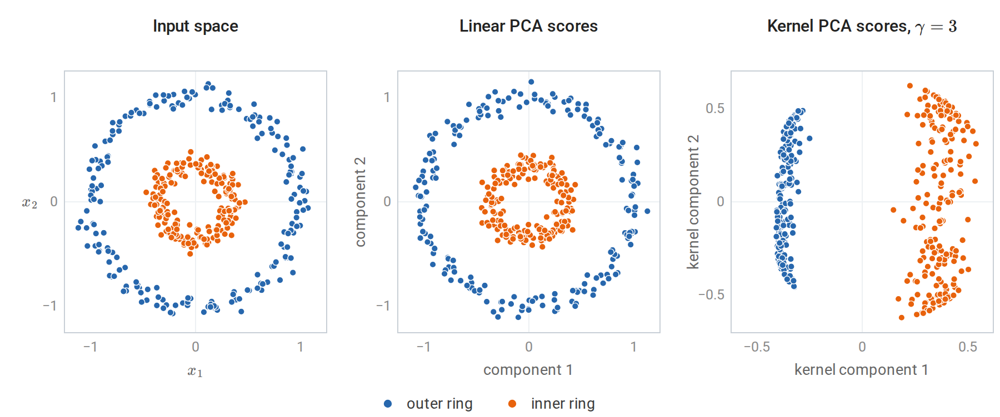
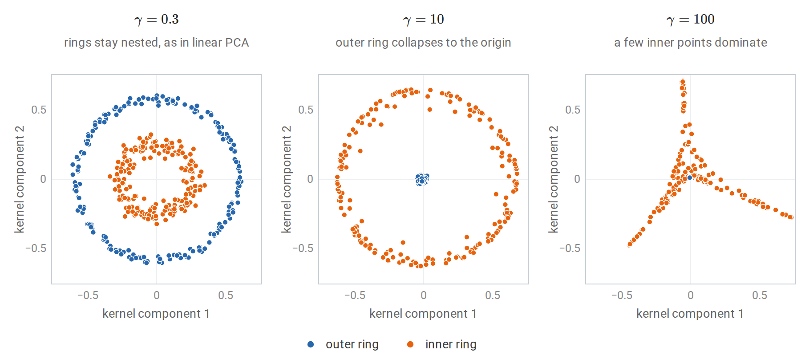
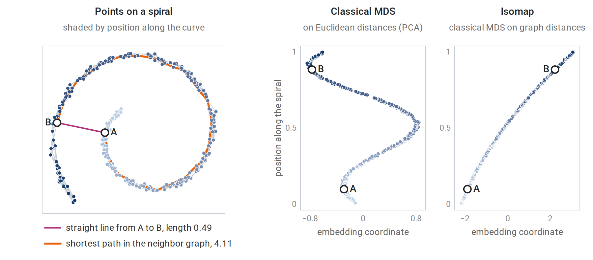

[ML Mastery Notes](../README.md) › [Machine Learning](README.md)

# 12. Principal Components and Dimensionality Reduction

[← 11. Boosting](11-boosting.md) · [13. Clustering →](13-clustering.md)

## <a id="pca-as-a-fitted-transformation"></a>PCA as a fitted transformation

### <a id="what-foundations-established"></a>What Foundations established

Linear Algebra develops principal component analysis as matrix analysis. Let $`X_c`$ be the $`n\times d`$ data matrix with each column's mean subtracted, and let $`X_c=U\Sigma V^\top`$ be its thin SVD: the columns $`u_j`$ of $`U`$ and $`v_j`$ of $`V`$ are orthonormal, and the singular values $`\sigma_1\ge\sigma_2\ge\cdots\ge0`$ lie on the diagonal of $`\Sigma`$ (Foundations writes $`\Sigma_X`$ there, to keep $`\Sigma`$ for a covariance matrix). The principal directions are the right singular vectors $`v_j`$. Equivalently, they are eigenvectors of the sample covariance $`S=X_c^\top X_c/(n-1)`$, because the right singular vectors of $`X_c`$ are the eigenvectors of $`X_c^\top X_c`$ (SVD). The corresponding eigenvalue $`\lambda_j=\sigma_j^2/(n-1)`$ is the variance of the data along $`v_j`$, since $`v_j^\top Sv_j=\lambda_j`$. By the Rayleigh-quotient form of the spectral theorem, the directions maximize variance in turn: $`v_1`$ maximizes $`v^\top Sv`$ over unit vectors, and each later $`v_j`$ maximizes it subject to orthogonality to the earlier directions. With $`V_k=[v_1,\ldots,v_k]`$, the scores are $`Z_k=X_cV_k`$, and by the Eckart–Young theorem the rank-$`k`$ reconstruction $`Z_kV_k^\top`$ has the smallest squared error of any rank-$`k`$ approximation to $`X_c`$. The maximum-variance view goes back to [Hotelling (1933)](https://doi.org/10.1037/h0071325) and the closest-fitting-subspace view to [Pearson (1901)](https://www.tandfonline.com/doi/abs/10.1080/14786440109462720); the two define the same subspace.

This chapter treats PCA as a learning method, the linear case of the learned representations introduced in Terminology and Mathematical Language. It asks how PCA is fitted and applied to new data, how many components to keep and how to tell signal from noise, what PCA does inside a supervised model, and how the idea extends to kernels and to data given only as distances.

### <a id="fit-transform-reconstruct"></a>Fit, transform, reconstruct

PCA has parameters, and they are estimated from training data: the mean $`\hat\mu`$ and the directions $`V_k=[v_1,\ldots,v_k]`$. Once fitted, it is a fixed map from inputs to $`k`$ coordinates and back:

$$
z=V_k^\top(x-\hat\mu),\qquad \hat x=\hat\mu+V_kz .
$$

The **transform** gives scores for any input, including one never seen in training: the $`j`$th score $`z_j=v_j^\top(x-\hat\mu)`$ is the coordinate of $`x`$ along $`v_j`$, measured from the training mean. The **reconstruction** $`\hat x`$ is the orthogonal projection of $`x`$ onto the fitted affine subspace $`\hat\mu+\operatorname{span}(v_1,\ldots,v_k)`$, and the squared length $`\|x-\hat x\|^2`$ of the residual $`x-\hat x`$ measures how poorly the subspace describes it. Because the directions are orthonormal, this squared length equals $`\|x-\hat\mu\|^2-\|z\|^2`$, the sum of the squared scores on the discarded directions $`v_{k+1},\ldots,v_d`$.

Large reconstruction errors on new data flag inputs unlike the training data, which makes PCA a simple anomaly detector: an input is flagged when its residual exceeds, say, a high quantile of the training residuals. Such an input need not be extreme in any single feature; it only has to leave the subspace near which the training data lie.

Dividing each score by the square root of its variance, $`z_j/\sqrt{\lambda_j}`$, **whitens** the data, giving uncorrelated coordinates of unit variance, as in Whitening and Mahalanobis distance. With all $`d`$ components kept and every $`\lambda_j>0`$, the squared length of the whitened score vector is the squared Mahalanobis distance of $`x`$ from $`\hat\mu`$ under $`S`$, since $`S^{-1}=V\Lambda^{-1}V^\top`$ with $`\Lambda=\operatorname{diag}(\lambda_1,\ldots,\lambda_d)`$ gives $`(x-\hat\mu)^\top S^{-1}(x-\hat\mu)=\sum_jz_j^2/\lambda_j`$.



*Left: 120 training points with their mean and principal directions, and the fitted subspace for $`k=1`$, a line. The new inputs $`a`$ and $`b`$ are transformed and reconstructed; the hollow circles are their reconstructions and the dashed segments their residuals. Input $`b`$ lies within the range of the training data in each coordinate, yet its residual exceeds that of every training point, while $`a`$, far along the line, is reconstructed almost exactly. Right: after whitening, the training cloud becomes round, and $`b`$ lies 4.35 standard deviations out along the second direction.*

Because $`\hat\mu`$ and $`V_k`$ are estimated, fitting PCA is part of fitting the model. When PCA precedes a predictor, it must be fitted on the training folds only and applied unchanged to the held-out fold. Fitting it on all the data first lets the held-out inputs shape the features, a mild but real case of the leakage described in chapter 6. A pipeline object enforces the rule automatically; the digits example below uses one.

### <a id="centering-and-scaling"></a>Centering and scaling

Principal directions depend on the units of measurement. PCA of the raw data diagonalizes the covariance matrix, and a feature measured in large units dominates the leading component simply because its numbers are large: multiplying a feature by $`c`$ multiplies its variance by $`c^2`$. Standardizing each feature to unit variance first diagonalizes the correlation matrix $`D^{-1}SD^{-1}`$ instead, where $`D`$ is the diagonal matrix of the features' standard deviations, and treats every feature as equally important a priori.

The wine data of the next figure show the effect. Among their 13 chemical measurements, proline has standard deviation 314 and magnesium, the next largest, only 14. On the raw features, the first component is essentially the proline measurement and explains 99.8% of the variance. After standardization, the first two components explain 36% and 19% of the variance, and each combines many measurements.



*PCA of 13 chemical measurements of 178 wines from three cultivars. Top left: on the raw features, the plot mostly shows proline along the first axis and magnesium along the second. Top right: after standardization, the first two components separate the three cultivars well. Bottom: the loadings of the first component, that is, the entries of $`v_1`$; on the raw features nearly all the weight falls on proline.*

Neither choice is always right. When features share a unit and their variances are meaningful, as with pixel intensities or gene-expression levels on a common scale, raw covariance PCA keeps information that standardization would discard. When features are measured in incommensurable units, standardization is usually necessary. Centering is essential either way: without it, the first "component" mostly points toward the mean. The uncentered SVD finds the direction that maximizes the average squared projection

$$
\frac1n\sum_{i=1}^n(v^\top x_i)^2=(v^\top\bar x)^2+\frac{n-1}n\,v^\top Sv ,
$$

where $`\bar x`$ is the sample mean; the cross term vanishes because the centered data sum to zero. When the mean is far from the origin compared with the spread of the data, the first term dominates and the leading direction points toward $`\bar x`$. Foundations draws the same distinction between covariance PCA and an uncentered matrix approximation, and notes that standardizing is a modeling choice.

## <a id="how-many-components"></a>How many components?

### <a id="explained-variance-and-its-limits"></a>Explained variance and its limits

The fraction of variance explained by the first $`k`$ components, $`\sum_{j\le k}\sigma_j^2/\sum_j\sigma_j^2`$, equivalently $`\sum_{j\le k}\lambda_j/\sum_j\lambda_j`$, is the usual summary, and a **scree plot** of the eigenvalues against their rank is the usual picture. Common rules keep enough components to explain a fixed fraction of the variance, such as 90%, or stop at the "elbow" where the eigenvalues level off. These rules are heuristics. The right $`k`$ depends on the purpose: compression tolerates some loss, visualization needs two or three components, and a downstream predictor should choose $`k`$ by its own validated performance. The rest of this section makes two of these purposes precise: telling components that carry signal from those produced by noise, and choosing $`k`$ for prediction.

### <a id="noise-has-eigenvalues-too"></a>Noise has eigenvalues too

Even data with no structure produce unequal sample eigenvalues. If $`n`$ observations of $`d`$ independent unit-variance features are drawn, the population covariance is the identity and every population eigenvalue equals one. Yet as $`n,d\to\infty`$ with $`d/n\to\gamma\le1`$, the sample eigenvalues spread over the interval $`\bigl[(1-\sqrt\gamma)^2,(1+\sqrt\gamma)^2\bigr]`$ according to the **Marchenko–Pastur law**: the fraction of them in any subinterval converges to the integral over it of the density

$$
p_\gamma(t)=\frac{\sqrt{(t_+-t)(t-t_-)}}{2\pi\gamma\,t},\qquad t_-\le t\le t_+,\qquad t_\pm=(1\pm\sqrt\gamma)^2 .
$$

With $`d=100`$ and $`n=300`$, so $`\gamma=1/3`$, pure noise gives eigenvalues from about 0.18 to 2.49. A scree plot of such data shows a smooth decay that is easy to mistake for structure. The matrix concentration bounds of Probability and Statistics make the sample covariance close to the population covariance when $`n`$ is large compared with $`d`$; the Marchenko–Pastur law shows that the error does not vanish when $`d/n`$ stays fixed.



*Left: the leading sample eigenvalues of 300 observations in 100 dimensions whose population covariance is the identity plus three spikes, of sizes 8, 3, and 0.4, in random orthogonal directions; these are the data of the code block in the next subsection. Two sample eigenvalues stand clear of the noise. The third spike is below the detection threshold $`\sqrt{d/n}=0.58`$, and its sample eigenvalue, 2.41, sits inside the noise bulk, below both the permutation reference and the Marchenko–Pastur edge. Right: apart from the two detached spikes, the sample eigenvalues follow the density of pure noise.*

Two practical tests follow. The upper edge $`(1+\sqrt{d/n})^2`$, scaled by the noise variance, is a threshold below which eigenvalues are indistinguishable from noise. **Parallel analysis** ([Horn, 1965](https://link.springer.com/article/10.1007/BF02289447)) calibrates the threshold empirically: it permutes each column independently, which destroys correlations while keeping each feature's distribution, and compares the observed eigenvalues with those of the permuted data. The logic is that of a permutation test: if the features are independent and the observations iid, permuting each column separately leaves the joint law of the data unchanged. In the figure, the reference is the 95th percentile of each ordered eigenvalue over 50 permuted copies, and exactly the two strong spikes exceed it.

The theory of the **spiked covariance model** makes the threshold precise ([Johnstone, 2001](https://projecteuclid.org/journals/annals-of-statistics/volume-29/issue-2/On-the-distribution-of-the-largest-eigenvalue-in-principal-components/10.1214/aos/1009210544.full)). Suppose the population covariance is the identity plus $`\ell\,uu^\top`$ for a unit vector $`u`$ and a spike size $`\ell>0`$, so that the variance is $`1+\ell`$ along $`u`$ and one in every orthogonal direction. Let $`\hat v`$ be the top sample eigenvector; its agreement with $`u`$ is measured by $`\langle\hat v,u\rangle^2`$, the squared cosine of the angle between them, which does not depend on the arbitrary sign of $`\hat v`$. As $`n,d\to\infty`$ with $`d/n\to\gamma`$, if $`\ell>\sqrt\gamma`$, the top sample eigenvalue converges to $`(1+\ell)(1+\gamma/\ell)`$, above the bulk, and the sample eigenvector $`\hat v`$ satisfies

$$
\langle\hat v,u\rangle^2\to\frac{1-\gamma/\ell^2}{1+\gamma/\ell}.
$$

If $`\ell\le\sqrt\gamma`$, the top eigenvalue sticks to the bulk edge and $`\langle\hat v,u\rangle^2\to0`$: the sample direction carries asymptotically no information about the true one. The behavior thus changes abruptly at $`\ell=\sqrt\gamma`$, a phase transition ([Baik, Ben Arous, and Péché, 2005](https://projecteuclid.org/journals/annals-of-probability/volume-33/issue-5/Phase-transition-of-the-largest-eigenvalue-for-nonnull-complex-sample/10.1214/009117905000000233.full); [Paul, 2007](https://www3.stat.sinica.edu.tw/statistica/j17n4/j17n418/j17n418.html)). In the figure's data, the three sample directions have $`|\cos|`$ of 0.97, 0.92, and 0.42 with their population counterparts, against limits, the square roots of the formula, of 0.98, 0.93, and 0.

Even detected components are estimated imperfectly when $`d`$ is comparable to $`n`$, and sample eigenvalues of detected spikes are biased upward: the limit $`(1+\ell)(1+\gamma/\ell)`$ exceeds the population eigenvalue $`1+\ell`$ by $`\gamma(1+\ell)/\ell`$. For the two detected spikes of the figure the limits are 9.38 and 4.44, against population eigenvalues 9 and 4. In a single sample the fluctuations can outweigh this bias: the observed eigenvalues, 8.23 and 4.17, both lie below their limits, and in the simulation of the next figure the middle 80% of top eigenvalues for $`\ell=8`$ spans 8.39 to 10.10.



*A single spike of size $`\ell`$ with $`n=300`$ and $`d=100`$, simulated 50 times for each of 20 values of $`\ell`$; the curves are the asymptotic limits. Left: the top sample eigenvalue stays at the bulk edge until $`\ell`$ passes the threshold $`\sqrt\gamma`$, then follows its limit, above the population value. Right: the sample eigenvector carries information about $`u`$ only above the threshold. At this sample size the transition is smoothed, and just above the threshold the squared cosine varies widely from sample to sample. For the three spikes of the previous figure, each sample eigenvector is compared with its own population direction.*

### <a id="a-probabilistic-model"></a>A probabilistic model

**Probabilistic PCA** ([Tipping and Bishop, 1999](https://academic.oup.com/jrsssb/article-abstract/61/3/611/7083217)) turns PCA into a density model, which gives a likelihood for choosing $`k`$. Each observation is generated from $`k`$ latent coordinates $`z`$, which a $`d\times k`$ loading matrix $`W`$ maps into the input space, with isotropic noise of variance $`\sigma^2`$ added:

$$
x=\mu+Wz+\varepsilon,\qquad z\sim\mathcal N(0,I_k),\qquad \varepsilon\sim\mathcal N(0,\sigma^2I_d),
$$

with $`z`$ and $`\varepsilon`$ independent. Since $`x`$ is an affine function of the jointly Gaussian pair $`(z,\varepsilon)`$, it is Gaussian (Gaussian vectors), with covariance $`W\operatorname{Cov}(z)W^\top+\operatorname{Cov}(\varepsilon)`$, so that $`x\sim\mathcal N(\mu,WW^\top+\sigma^2I)`$: a Gaussian whose covariance has $`k`$ free directions plus isotropic noise. The maximum likelihood estimates are available in closed form ([Appendix A](#block-pca-appendix-a)). With $`\lambda_1\ge\cdots\ge\lambda_d`$ the eigenvalues of the sample covariance, here with divisor $`n`$ as maximum likelihood requires, $`V_k`$ its top $`k`$ eigenvectors, and $`\Lambda_k=\operatorname{diag}(\lambda_1,\ldots,\lambda_k)`$,

$$
\hat\sigma^2=\frac1{d-k}\sum_{j>k}\lambda_j,\qquad \widehat W=V_k\bigl(\Lambda_k-\hat\sigma^2I\bigr)^{1/2}R
$$

for any rotation $`R`$, that is, any $`k\times k`$ orthogonal matrix. The fitted subspace is exactly the PCA subspace, and the discarded variance becomes the noise level. The posterior mean of the latent coordinates, $`\mathbb E[z\mid x]=(\widehat W^\top\widehat W+\hat\sigma^2I)^{-1}\widehat W^\top(x-\hat\mu)`$, follows from the Gaussian conditioning formula of the same Foundations section together with the identity $`W^\top(WW^\top+\sigma^2I)^{-1}=(W^\top W+\sigma^2I)^{-1}W^\top`$. It is a shrunken version of the PCA scores. With $`R=I`$, the matrix $`\widehat W^\top\widehat W+\hat\sigma^2I`$ equals $`\Lambda_k`$, so each posterior mean is the whitened PCA score multiplied by a factor below one:

$$
\mathbb E[z_j\mid x]=\sqrt{1-\hat\sigma^2/\lambda_j}\;\frac{v_j^\top(x-\hat\mu)}{\sqrt{\lambda_j}} .
$$

The factor is smallest for components whose variance barely exceeds the noise level.

Because the model has a likelihood, $`k`$ can be chosen by the log-likelihood of held-out data, or by an approximation to the Bayesian evidence ([Minka, 2000](https://papers.nips.cc/paper/1853-automatic-choice-of-dimensionality-for-pca)). scikit-learn's `PCA.score` returns the average probabilistic-PCA log-likelihood, so ordinary cross-validation applies.

```python
import numpy as np
from sklearn.decomposition import PCA
from sklearn.model_selection import cross_val_score

rng = np.random.default_rng(0)
n, d = 300, 100
spikes = np.array([8.0, 3.0, 0.4])                  # the data of the scree-plot figure
Q, _ = np.linalg.qr(rng.normal(size=(d, 3)))
X = rng.normal(size=(n, d)) + (rng.normal(size=(n, 3)) * np.sqrt(spikes)) @ Q.T

# PCA.score is the average log-likelihood under probabilistic PCA, so it can be cross-validated.
ks = range(0, 7)
ll = [cross_val_score(PCA(n_components=k), X, cv=5).mean() for k in ks]
print("held-out log-likelihood per observation:", "  ".join(f"k={k}: {v:.2f}" for k, v in zip(ks, ll)))
print("best k by cross-validated likelihood:", int(np.argmax(ll)))
print("Minka's Bayesian choice (n_components='mle'):", PCA(n_components="mle").fit(X).n_components_)
# held-out log-likelihood per observation: k=0: -146.60  k=1: -144.63  k=2: -144.12  k=3: -144.29  k=4: -144.53  k=5: -144.77  k=6: -144.95
# best k by cross-validated likelihood: 2
# Minka's Bayesian choice (n_components='mle'): 2
```

Both criteria find the two detectable spikes and reject the third, in agreement with the theory. Held-out *reconstruction error* could not make this choice, since it always decreases as $`k`$ grows: the fitted subspaces are nested, and the distance from a point to a subspace can only shrink when the subspace grows. The likelihood penalizes extra components through the noise model.

**Factor analysis** replaces the isotropic noise $`\sigma^2I`$ by a diagonal matrix $`\Psi`$ with a separate noise variance for each feature, so that $`x\sim\mathcal N(\mu,WW^\top+\Psi)`$. Its fitted subspace is no longer the PCA subspace, and the two models respect different transformations of the inputs. Factor analysis is unaffected by rescaling individual features: rescaling a feature rescales the corresponding row of $`W`$ and entry of $`\Psi`$, and the fit is otherwise unchanged. Probabilistic PCA is instead unaffected by rotations, which preserve the isotropic noise, but not by rescaling. Both are fitted by the EM algorithm of chapter 14 when no closed form is available: always for factor analysis, and for probabilistic PCA when, for example, some entries are missing.

### <a id="when-pca-feeds-a-predictor"></a>When PCA feeds a predictor

When the components are inputs to a supervised model, $`k`$ is a hyperparameter of the whole pipeline and should be chosen by cross-validating the pipeline. The following example, after the scikit-learn example [Pipelining: chaining a PCA and a logistic regression](https://scikit-learn.org/stable/auto_examples/compose/plot_digits_pipe.html), classifies $`8\times8`$ images of handwritten digits.

```python
import numpy as np
from sklearn.datasets import load_digits
from sklearn.decomposition import PCA
from sklearn.linear_model import LogisticRegression
from sklearn.model_selection import GridSearchCV, train_test_split
from sklearn.pipeline import make_pipeline
from sklearn.preprocessing import StandardScaler

X, y = load_digits(return_X_y=True)                        # 8x8 images, 64 pixel features
Xtr, Xte, ytr, yte = train_test_split(X, y, test_size=0.3, stratify=y, random_state=0)

# PCA is part of the model: its mean and directions are refitted inside every training fold.
pipe = make_pipeline(StandardScaler(), PCA(svd_solver="full"), LogisticRegression(max_iter=5000))
grid = {"pca__n_components": [5, 10, 20, 30, 40, 50, 64]}
search = GridSearchCV(pipe, grid, cv=5).fit(Xtr, ytr)
for k, score in zip(grid["pca__n_components"], search.cv_results_["mean_test_score"]):
    print(f"k = {k:2d}: CV accuracy {score:.3f}")
k90 = np.searchsorted(np.cumsum(PCA().fit(StandardScaler().fit_transform(Xtr)).explained_variance_ratio_), 0.90) + 1
print("components needed for 90% of the variance:", k90)
print(f"chosen k = {search.best_params_['pca__n_components']}, test accuracy {search.score(Xte, yte):.3f}")
# k =  5: CV accuracy 0.810
# k = 10: CV accuracy 0.877
# k = 20: CV accuracy 0.942
# k = 30: CV accuracy 0.955
# k = 40: CV accuracy 0.959
# k = 50: CV accuracy 0.963
# k = 64: CV accuracy 0.964
# components needed for 90% of the variance: 30
# chosen k = 64, test accuracy 0.972
```

Cross-validation chooses to keep every component. With all 64 components PCA is only a rotation, together with a shift that the unpenalized intercept absorbs, and an $`\ell_2`$-penalized logistic regression is unaffected by rotations of standardized inputs: for an orthogonal matrix $`Q`$, replacing $`x`$ by $`Q^\top x`$ and $`w`$ by $`Q^\top w`$ leaves both the scores $`w^\top x`$ and the penalty $`\|w\|^2`$ unchanged. So this is the model without PCA. Reducing to 30 components, the 90%-variance choice, costs about one point of accuracy while halving the number of features.



*Left: the share of variance explained by each principal component of the standardized training images, and its running total. Right: the cross-validated accuracy of the pipeline for 20 values of $`k`$, including the seven of the code block. Accuracy rises steeply over the first 15 or so components and changes little after 30, while the explained variance keeps growing gradually; the variance curve does not show where accuracy levels off.*

Dimensionality reduction buys speed, storage, or interpretability; it improves accuracy only when the discarded directions mostly contain noise that the predictor would otherwise fit.

## <a id="principal-components-and-supervised-learning"></a>Principal components and supervised learning

### <a id="principal-components-regression"></a>Principal components regression

**Principal components regression** (PCR) regresses the response on the first $`k`$ principal component scores. With the SVD $`X_c=U\Sigma V^\top`$ of the centered inputs and a centered response $`y`$, the score matrix $`Z_k=X_cV_k`$ has orthogonal columns $`\sigma_ju_j`$. Least squares on orthogonal columns separates into one simple regression per column, with coefficient $`\sigma_ju_j^\top y/\sigma_j^2=u_j^\top y/\sigma_j`$, and mapping these coefficients back to the inputs through $`V_k`$ gives

$$
\hat\beta_{\text{PCR}}=\sum_{j=1}^kv_j\,\frac{u_j^\top y}{\sigma_j},\qquad
X_c\hat\beta_{\text{PCR}}=\sum_{j=1}^ku_j\,u_j^\top y .
$$

Least squares, computed with the pseudoinverse, sums the same terms $`v_ju_j^\top y/\sigma_j`$ over every nonzero singular value. PCR is thus the pseudoinverse solution with the singular values after the $`k`$th treated as zero, a cutoff that declares the low-variance directions unresolved.

Compare ridge regression in the same basis (chapter 3, derived in Linear Algebra), which multiplies each component $`u_j^\top y`$ by $`\sigma_j^2/(\sigma_j^2+\lambda)`$, where $`\lambda`$ is the ridge penalty. Both methods suppress the low-variance directions, where coefficient estimates are unstable. PCR does it with a hard threshold, keeping components entirely or discarding them; ridge shrinks smoothly. The two can be compared at equal flexibility through their effective degrees of freedom, the trace of the matrix that maps $`y`$ to the fitted values: PCR's fitted values are $`U_kU_k^\top y`$, and the projection matrix $`U_kU_k^\top`$ has trace $`k`$, while ridge has $`\sum_j\sigma_j^2/(\sigma_j^2+\lambda)`$. [ESL §3.5](https://hastie.su.domains/ElemStatLearn/) defines PCR and partial least squares, and [ESL §3.6](https://hastie.su.domains/ElemStatLearn/) finds ridge, PCR, and partial least squares similar in practice, with ridge slightly preferable because its shrinkage is continuous.



*Left: shrinkage factors applied to each principal direction by PCR with $`k=5`$ and by ridge regression with the penalty giving the same effective degrees of freedom, for 200 observations of ten features with decreasing variances, their standard deviations falling from 3 to 0.25. Right: a case where unsupervised directions fail. The inputs, shaded by their response, vary mostly along the first principal direction, but the response depends only on the minor one.*

The right panel shows the fundamental limitation. PCA chooses directions by the variance of the inputs alone, without looking at the response, and nothing guarantees that the response depends on the high-variance directions. Here PCR with one component explains none of the variance of the response ($`R^2=0.0004`$), while least squares on both inputs explains 96%. Foundations makes the same point: a large-variance direction need not be useful for prediction, and a small-variance direction can carry important target information. **Partial least squares** chooses directions that maximize covariance with the response instead, which protects against this failure at the cost of using the response to build features, so the whole procedure must again be cross-validated.

## <a id="kernel-pca"></a>Kernel PCA

### <a id="principal-components-in-a-feature-space"></a>Principal components in a feature space

The kernel methods of chapter 8 extend PCA to nonlinear structure ([Schölkopf, Smola, and Müller, 1998](https://direct.mit.edu/neco/article/10/5/1299/6193/Nonlinear-Component-Analysis-as-a-Kernel)). Map the inputs to a feature space by $`\phi`$, with kernel $`k(x,z)=\langle\phi(x),\phi(z)\rangle`$ and Gram matrix $`K_{ij}=k(x_i,x_j)`$, as in chapter 8. Center the features as $`\tilde\phi(x_i)=\phi(x_i)-\frac1n\sum_j\phi(x_j)`$, and seek eigenvectors of the feature-space covariance $`C=\frac1n\sum_i\tilde\phi(x_i)\tilde\phi(x_i)^\top`$. Any eigenvector with a nonzero eigenvalue $`\lambda`$ lies in the span of the centered training features, $`v=\sum_ia_i\tilde\phi(x_i)`$, because $`Cv`$ does:

$$
v=\frac1\lambda Cv=\frac1{n\lambda}\sum_i\tilde\phi(x_i)\,\langle\tilde\phi(x_i),v\rangle .
$$

Substituting this form into $`Cv=\lambda v`$ and taking inner products with each $`\tilde\phi(x_j)`$ gives $`\widetilde K^2a=n\lambda\widetilde Ka`$, where $`\widetilde K_{ij}=\langle\tilde\phi(x_i),\tilde\phi(x_j)\rangle`$ is the Gram matrix of the centered features. A component of $`a`$ in the null space of $`\widetilde K`$ does not change $`v`$, since $`\|\sum_ia_i\tilde\phi(x_i)\|^2=a^\top\widetilde Ka`$, so $`Cv=\lambda v`$ reduces to an eigenproblem for the centered Gram matrix:

$$
\widetilde Ka=\mu a,\qquad \widetilde K=HKH,\quad H=I-\tfrac1n\mathbf 1\mathbf 1^\top,\quad \mu=n\lambda .
$$

Here $`\mathbf 1`$ is the vector of $`n`$ ones and $`H`$ is the centering matrix, which subtracts the mean of a vector's entries; [Appendix B](#block-pca-appendix-b) shows that $`\widetilde K=HKH`$. Requiring $`\|v\|=1`$ gives $`a^\top\widetilde Ka=\mu\|a\|^2=1`$, so $`a=u/\sqrt\mu`$ for a unit eigenvector $`u`$ of $`\widetilde K`$. The score of any input $`x`$ on the component is

$$
\langle v,\tilde\phi(x)\rangle=\sum_ia_i\,\tilde k(x_i,x),
$$

where $`\tilde k`$ is the kernel between centered feature vectors, computed from kernel values alone ([Appendix B](#block-pca-appendix-b)). For training points the scores are $`\widetilde Ka=\sqrt\mu\,u`$. With the linear kernel, kernel PCA reproduces ordinary PCA: then $`\widetilde K=X_cX_c^\top=U\Sigma^2U^\top`$, so the eigenvalues are $`\mu_j=\sigma_j^2`$ and the training scores $`\sqrt{\mu_j}\,u_j=\sigma_ju_j`$ are the columns of $`Z_k`$.



*Left: two concentric rings of 200 points each. Middle: linear PCA can only rotate the data, so the rings remain nested. Right: the first two kernel principal components with the Gaussian kernel $`k(x,z)=\exp(-3\|x-z\|^2)`$. The first component alone separates the rings, because in the kernel's feature space the dominant variation is between the two rings.*

The computation below implements these formulas and matches scikit-learn's [`KernelPCA`](https://scikit-learn.org/stable/modules/generated/sklearn.decomposition.KernelPCA.html), including the projection of new points. Its parameter `gamma` is the $`\gamma`$ of the Gaussian kernel $`\exp(-\gamma\|x-z\|^2)`$, unrelated to the ratio $`\gamma=d/n`$ of the section on noise eigenvalues.

```python
import numpy as np
from sklearn.datasets import make_circles
from sklearn.decomposition import KernelPCA

X, _ = make_circles(n_samples=300, factor=0.35, noise=0.06, random_state=0)
Xnew = np.array([[0.0, 0.3], [0.9, 0.1]])
gamma, k = 3.0, 2
rbf = lambda A, B: np.exp(-gamma * ((A[:, None, :] - B[None, :, :]) ** 2).sum(-1))

n = len(X)
K = rbf(X, X)
H = np.eye(n) - np.ones((n, n)) / n
Kc = H @ K @ H                                   # Gram matrix of centered feature vectors
mu, A = np.linalg.eigh(Kc)
mu, A = mu[::-1][:k], A[:, ::-1][:, :k]          # top eigenpairs
alpha = A / np.sqrt(mu)                          # unit-norm directions v = sum_i alpha_i phi(x_i)
scores = Kc @ alpha                              # equals A * sqrt(mu)

# A new point: center its kernel vector with the training means, then project.
Kn = rbf(Xnew, X)
Kn_c = Kn - Kn.mean(1, keepdims=True) - K.mean(0) + K.mean()
new_scores = Kn_c @ alpha

sk = KernelPCA(n_components=k, kernel="rbf", gamma=gamma, random_state=0).fit(X)
signs = np.sign(np.sum(scores * sk.transform(X), axis=0))   # eigenvectors are defined up to sign
print("training scores match:", np.allclose(scores * signs, sk.transform(X)))
print("new-point scores match:", np.allclose(new_scores * signs, sk.transform(Xnew)))
print("eigenvalues of the centered Gram matrix:", np.round(mu, 2).tolist())
# training scores match: True
# new-point scores match: True
# eigenvalues of the centered Gram matrix: [39.9, 36.27]
```

### <a id="limitations"></a>Limitations

Kernel PCA inherits the costs of kernel methods: an $`n\times n`$ eigenproblem, $`O(n^3)`$ time, and a sum over all training points to transform each new input. The Nyström and random-feature approximations of chapter 8 reduce both. The results depend strongly on the kernel and its width, and since kernel PCA is unsupervised, there is no validation loss to tune them unless it feeds a supervised model.

The next figure shows how strongly the width matters on the rings. A wide kernel behaves almost like the linear kernel: for small $`\gamma`$, $`\exp(-\gamma\|x-z\|^2)\approx1-\gamma\|x-z\|^2=1-\gamma\|x\|^2-\gamma\|z\|^2+2\gamma\,x^\top z`$, and double centering removes every term except $`2\gamma\,x^\top z`$, so the components approach those of linear PCA. A narrow kernel makes $`k(x_i,x_j)`$ negligible except for close pairs, and the leading components then describe the densest region of the data.



*Kernel PCA of the rings of the previous figure with three other widths of the Gaussian kernel; the width $`\gamma=3`$ that separates the rings lies between the first two. With $`\gamma=10`$ and $`\gamma=100`$, the leading components describe the inner ring, whose points are about three times closer together than those of the outer ring, and every outer point scores near zero. At $`\gamma=100`$ half of the sum of squared scores on the first component comes from 17 points of the inner ring.*

Finally, a point in feature space generally has no exact **pre-image** in the input space, so reconstructions, as used for denoising, require an additional approximate optimization.

## <a id="distances-instead-of-coordinates"></a>Distances instead of coordinates

### <a id="classical-multidimensional-scaling"></a>Classical multidimensional scaling

Sometimes only dissimilarities between objects are available: travel times between cities, disagreement between survey responses, or edit distances between strings. **Classical multidimensional scaling** (MDS) finds points whose Euclidean distances reproduce given distances $`D_{ij}`$ between $`n`$ objects. For points $`y_1,\ldots,y_n`$, stacked as the rows of a matrix $`Y`$, with centered Gram matrix $`B=HYY^\top H`$, the squared distances determine $`B`$ through **double centering**:

$$
B=-\tfrac12H\,D^{(2)}H,\qquad D^{(2)}_{ij}=D_{ij}^2 .
$$

The matrix $`D^{(2)}`$ squares the distances entry by entry, and $`H`$ is the centering matrix of the previous section. [Appendix B](#block-pca-appendix-b) proves the identity. Classical MDS eigendecomposes $`B=Q\Lambda Q^\top`$, as the spectral theorem allows for a symmetric matrix, and returns the coordinates $`Q_k\Lambda_k^{1/2}`$, whose rows are the fitted points. When $`B`$ is positive semidefinite, this eigendecomposition is also its SVD, so by the Eckart–Young theorem the Gram matrix of the fitted points, $`Q_k\Lambda_kQ_k^\top`$, is the best rank-$`k`$ approximation of $`B`$.

When $`D`$ contains the Euclidean distances between the rows of a data matrix, $`B`$ is the centered Gram matrix $`X_cX_c^\top=U\Sigma^2U^\top`$, and the MDS coordinates $`U_k\Sigma_k=X_cV_k`$ are exactly the PCA scores, up to the signs of the columns. When $`D`$ is not Euclidean, $`B`$ has negative eigenvalues, which measure how far the dissimilarities are from any Euclidean configuration: Appendix B also shows that $`B`$ is positive semidefinite exactly when the dissimilarities are the distances between some points.

```python
import numpy as np
from sklearn.decomposition import PCA

rng = np.random.default_rng(0)
X = rng.normal(size=(50, 5)) @ rng.normal(size=(5, 5))

def classical_mds(D, k):
    """Coordinates whose Euclidean distances best match D, from the double-centered squared distances."""
    n = len(D)
    H = np.eye(n) - np.ones((n, n)) / n
    B = -0.5 * H @ (D ** 2) @ H                   # the Gram matrix of centered points
    lam, V = np.linalg.eigh(B)
    lam, V = lam[::-1], V[:, ::-1]
    return V[:, :k] * np.sqrt(np.maximum(lam[:k], 0)), lam

D = np.sqrt(((X[:, None] - X[None]) ** 2).sum(-1))   # Euclidean distances only; X is not used below
Y, lam = classical_mds(D, 2)
P = PCA(2).fit_transform(X)
print("MDS coordinates equal PCA scores up to sign:", np.allclose(np.abs(Y), np.abs(P)))

D1 = np.abs(X[:, None] - X[None]).sum(-1)            # city-block distances are not Euclidean
_, lam1 = classical_mds(D1, 2)
count_negative = lambda ev: int(np.sum(ev < -1e-9 * ev.max()))
print(f"negative eigenvalues: Euclidean {count_negative(lam)}, city-block {count_negative(lam1)}"
      f" (largest {lam1.max():.0f}, most negative {lam1.min():.0f})")
# MDS coordinates equal PCA scores up to sign: True
# negative eigenvalues: Euclidean 0, city-block 28 (largest 3404, most negative -407)
```

Kernel PCA is classical MDS applied to the feature-space distances $`d(x,z)^2=k(x,x)+k(z,z)-2k(x,z)`$, which are always Euclidean because they come from a feature map. Indeed, double centering these squared distances returns $`HKH`$, by the identity of Appendix B with $`K`$ in place of $`YY^\top`$.

### <a id="nonlinear-embeddings"></a>Nonlinear embeddings

Several methods build on these ideas to capture curved structure. **Isomap** ([Tenenbaum, de Silva, and Langford, 2000](https://www.science.org/doi/10.1126/science.290.5500.2319)) replaces Euclidean distances by shortest-path distances in a nearest-neighbor graph, approximating distances along a curved surface, and then applies classical MDS.



*Left: 300 points along a spiral, each joined to its 10 nearest neighbors. The points A and B lie on adjacent turns, close in the plane but far apart along the curve. Middle: the one-dimensional coordinate of classical MDS on Euclidean distances, which is the first principal component, folds the spiral, so points far apart along the curve receive similar coordinates. Right: the Isomap coordinate follows the curve; its rank correlation with the position along the spiral is 1.00, against 0.26 for the principal component.*

**t-SNE** ([van der Maaten and Hinton, 2008](https://jmlr.org/papers/v9/vandermaaten08a.html)) and its successors instead match neighborhood probabilities, placing points that are close in the input space close in two or three dimensions. They produce striking visualizations but are designed to preserve local neighborhoods only. Distances between clusters, cluster sizes, and apparent gaps in their plots need not reflect the data, and the results depend on tuning parameters and random initialization. They are tools for looking at data, not fitted transformations for building predictors.

At the other extreme, the random projections of Linear Algebra reduce dimension without looking at the data at all. They preserve all pairwise distances approximately and cost almost nothing to compute. [Jolliffe and Cadima's review](https://royalsocietypublishing.org/rsta/article/374/2065/20150202/115142/Principal-component-analysis-a-review-and-recent) surveys PCA and its many variants, [ESL §14.5](https://hastie.su.domains/ElemStatLearn/) covers principal components, curves, and related methods, and the scikit-learn [decomposition guide](https://scikit-learn.org/stable/modules/decomposition.html) documents the implementations.

## <a id="appendices"></a>Appendices


<details>
<summary><a id="block-pca-appendix-a"></a><b>A. Maximum likelihood for probabilistic PCA</b></summary>


Let $`S`$ be the sample covariance with divisor $`n`$, and $`\lambda_1\ge\cdots\ge\lambda_d`$ its eigenvalues. The marginal distribution $`x\sim\mathcal N(\mu,C)`$ with $`C=WW^\top+\sigma^2I`$ gives $`\hat\mu=\bar x`$ and, up to constants, the profile log-likelihood

$$
\ell(W,\sigma^2)=-\frac n2\bigl[\ln\det C+\operatorname{tr}(C^{-1}S)\bigr].
$$

Using $`\partial\ln\det C=\operatorname{tr}(C^{-1}\partial C)`$ from the matrix gradient identities, $`\partial C^{-1}=-C^{-1}(\partial C)C^{-1}`$, which follows by differentiating $`CC^{-1}=I`$, and $`\partial C=(\partial W)W^\top+W(\partial W)^\top`$, the gradient in $`W`$ is $`n\bigl(C^{-1}SC^{-1}W-C^{-1}W\bigr)`$, so stationary points satisfy $`SC^{-1}W=W`$.

Write the thin SVD $`W=ULR^\top`$ with $`L`$ diagonal and positive. Then $`C^{-1}W=U L(L^2+\sigma^2I)^{-1}R^\top`$, because $`C`$ acts on the columns of $`U`$ as multiplication by $`L^2+\sigma^2I`$. The stationarity condition becomes $`SU=U(L^2+\sigma^2I)`$: each column $`u_j`$ is an eigenvector of $`S`$, with eigenvalue $`\lambda_j=l_j^2+\sigma^2`$. Thus $`l_j=\sqrt{\lambda_j-\sigma^2}`$, which requires $`\lambda_j>\sigma^2`$.

Substituting back, $`C`$ has eigenvalues $`\lambda_j`$ on the retained eigenvectors and $`\sigma^2`$ on the other $`d-k`$ directions, and

$$
-\frac2n\ell=\sum_{j\in\mathcal K}(\ln\lambda_j+1)+(d-k)\ln\sigma^2+\frac1{\sigma^2}\sum_{j\notin\mathcal K}\lambda_j,
$$

where $`\mathcal K`$ indexes the retained eigenvalues. Minimizing over $`\sigma^2`$ gives the average of the discarded eigenvalues. The remaining dependence on $`\mathcal K`$ is through $`\sum_{j\in\mathcal K}\ln\lambda_j+(d-k)\ln\bigl(\frac1{d-k}\sum_{j\notin\mathcal K}\lambda_j\bigr)`$. Writing $`\sum_{j\in\mathcal K}\ln\lambda_j=\sum_{j=1}^d\ln\lambda_j-\sum_{j\notin\mathcal K}\ln\lambda_j`$, where the first sum does not depend on $`\mathcal K`$, this is a constant plus

$$
(d-k)\Bigl[\ln\Bigl(\frac1{d-k}\sum_{j\notin\mathcal K}\lambda_j\Bigr)-\frac1{d-k}\sum_{j\notin\mathcal K}\ln\lambda_j\Bigr],
$$

$`d-k`$ times the gap between the logarithm of the average discarded eigenvalue and the average of their logarithms. By concavity of the logarithm (Jensen's inequality) this gap is nonnegative, and it is smallest when the discarded eigenvalues are as nearly equal as possible. Together with the requirement $`\lambda_j>\sigma^2`$ for the retained eigenvalues, Tipping and Bishop show that it is minimized by retaining the $`k`$ largest; other choices are saddle points. The rotation $`R`$ is not identified, because $`WR`$ gives the same $`WW^\top`$.

</details>


<details>
<summary><a id="block-pca-appendix-b"></a><b>B. Double centering and centered kernels</b></summary>


**Double centering.** Let $`y_1,\ldots,y_n`$ be points with squared distances $`D^{(2)}_{ij}=\|y_i-y_j\|^2=g_{ii}+g_{jj}-2g_{ij}`$, where $`G=YY^\top`$. In matrix form, $`D^{(2)}=g\mathbf 1^\top+\mathbf 1g^\top-2G`$ with $`g`$ the diagonal of $`G`$. The centering matrix satisfies $`H\mathbf 1=0`$, so the first two terms vanish on both sides:

$$
-\tfrac12HD^{(2)}H=HGH=(HY)(HY)^\top ,
$$

the Gram matrix of the centered points. It is therefore positive semidefinite whenever the distances are Euclidean. The converse also holds. For any symmetric $`D^{(2)}`$ with zero diagonal, let $`c_i`$ be the mean of its $`i`$th row and $`m`$ the mean of all its entries; then $`B=-\tfrac12HD^{(2)}H`$ has entries $`b_{ij}=-\tfrac12\bigl(D^{(2)}_{ij}-c_i-c_j+m\bigr)`$, and the zero diagonal gives $`b_{ii}+b_{jj}-2b_{ij}=D^{(2)}_{ij}`$. If $`B=Q\Lambda Q^\top`$ is positive semidefinite, the rows of $`Q\Lambda^{1/2}`$ therefore have exactly the squared distances $`D^{(2)}`$, since their Gram matrix is $`B`$ (positive semidefinite matrices are Gram matrices). So $`B`$ is positive semidefinite exactly when the distances are Euclidean, and an eigendecomposition recovers the centered points up to an orthogonal transformation.

**Centered kernels.** For the centered features $`\tilde\phi(x)=\phi(x)-\bar\phi`$ with $`\bar\phi=\frac1n\sum_j\phi(x_j)`$,

$$
\tilde k(x_i,x)=k(x_i,x)-\frac1n\sum_jk(x_j,x)-\frac1n\sum_jk(x_i,x_j)+\frac1{n^2}\sum_{j,l}k(x_j,x_l).
$$

For training points this is the matrix $`HKH`$. For a new input, the second term averages its kernel values with the training points, and the last two terms use only training quantities, which must be stored with the fitted model, like the mean in ordinary PCA.

</details>

---

[← 11. Boosting](11-boosting.md) · [13. Clustering →](13-clustering.md)
