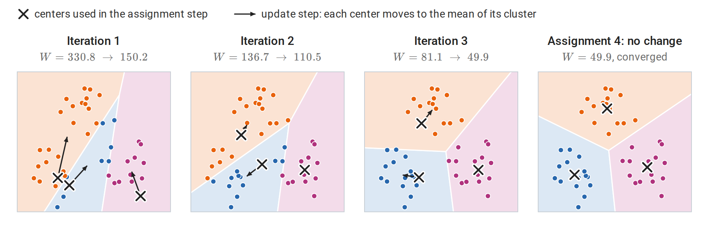
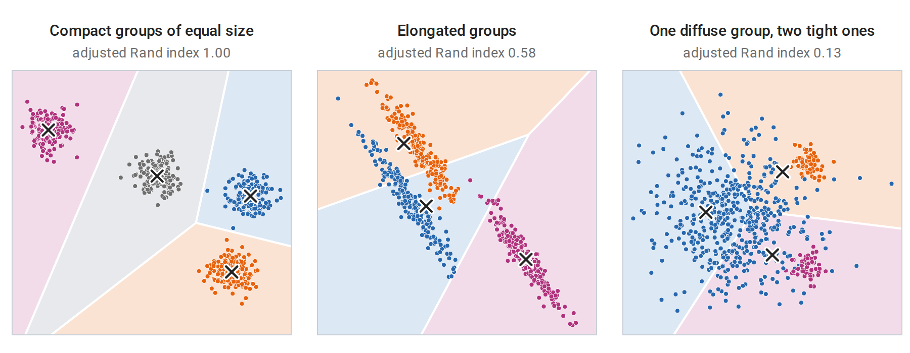
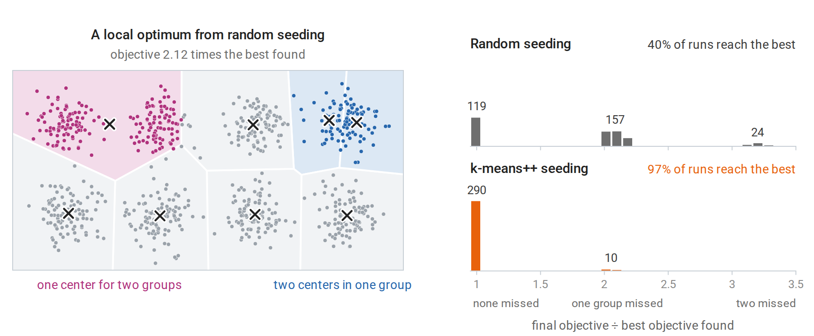
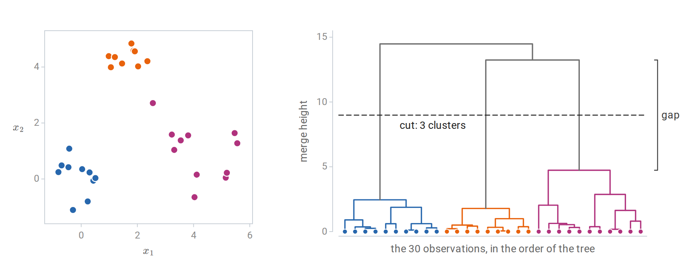
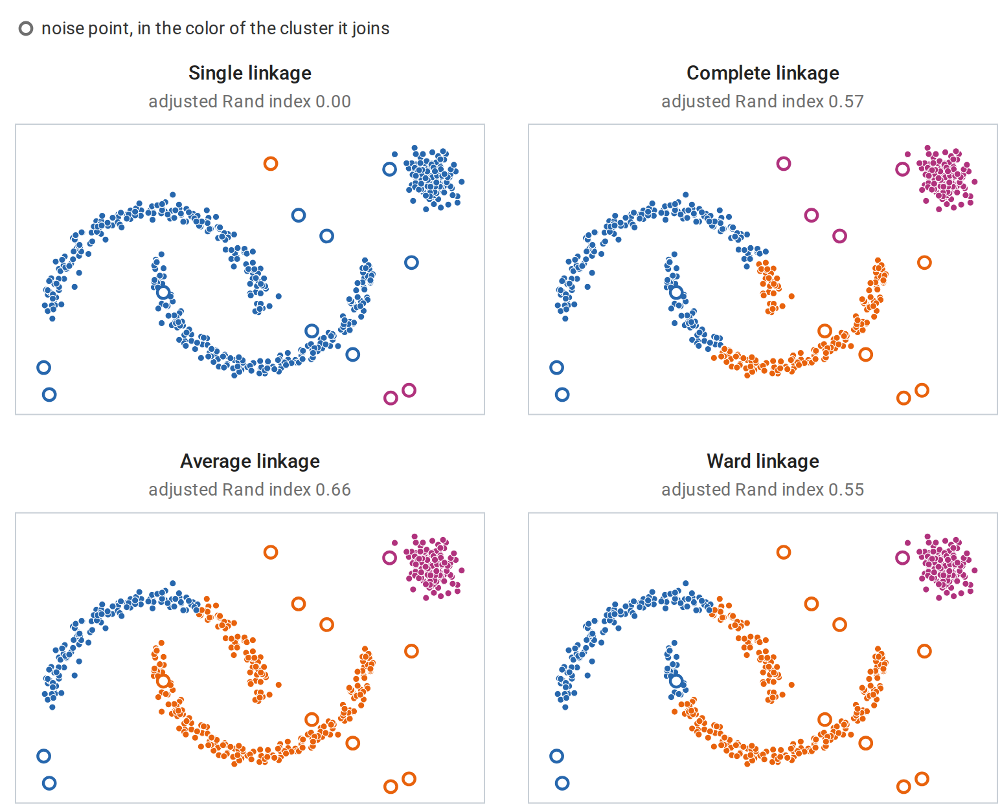
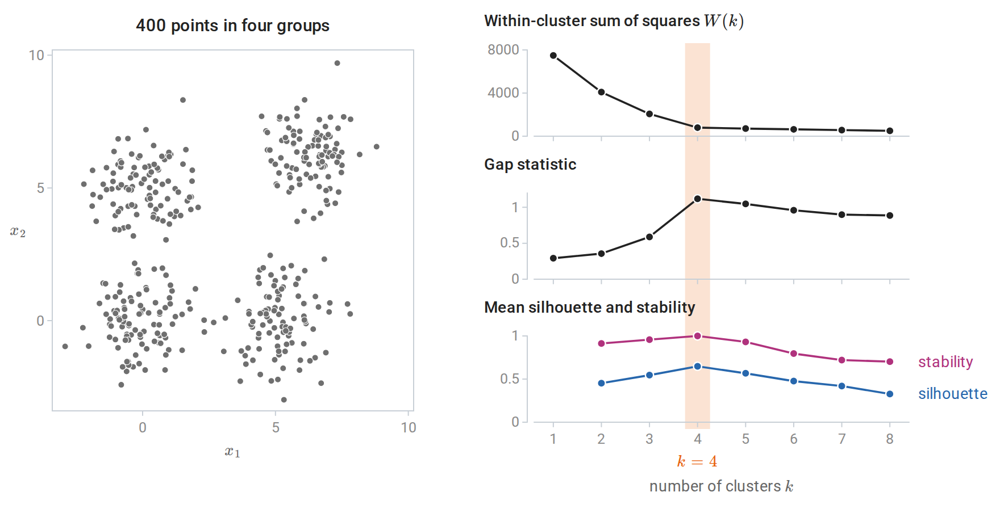
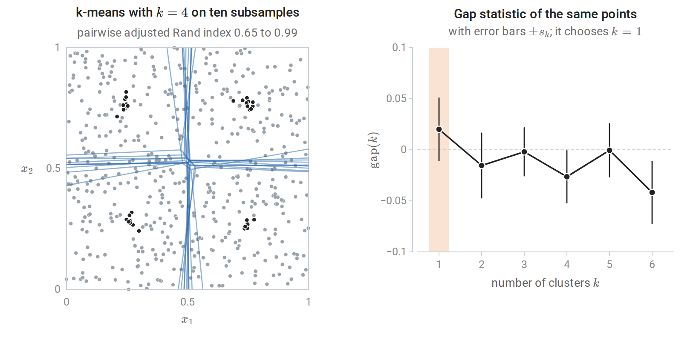
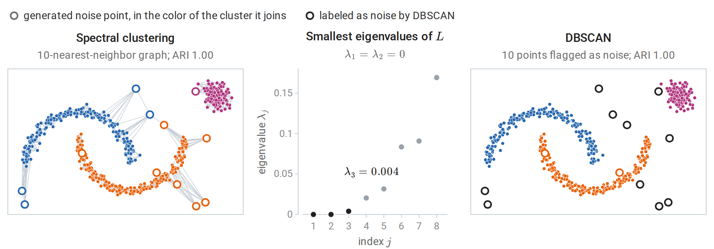

[ML Mastery Notes](../README.md) › [Machine Learning](README.md)

# 13. Clustering

[← 12. Principal Components and Dimensionality Reduction](12-principal-components-and-dimensionality-reduction.md) · [14. Gaussian Mixtures and Expectation Maximization →](14-gaussian-mixtures-and-expectation-maximization.md)

## <a id="the-clustering-problem"></a>The clustering problem

### <a id="grouping-without-labels"></a>Grouping without labels

**Clustering** partitions unlabeled observations into groups whose members are similar to each other and dissimilar to members of other groups. It is used to discover structure, such as subtypes of patients or customers, to summarize data by representative points, and to compress, as in vector quantization. Unlike prediction, clustering has no held-out labels that define success. Its results depend on choices that the data cannot settle alone: which features are used, how they are scaled, what dissimilarity measures closeness, and what shape a "group" is expected to have.

The dissimilarity is the most consequential of these choices. Everything said about distances for nearest neighbors in chapter 1 applies: a feature measured in large units dominates Euclidean distance, irrelevant features dilute it, and in high dimensions all distances concentrate. Standardizing features, selecting the relevant ones, or clustering in a reduced representation such as the principal components of chapter 12 often matters more than the choice of algorithm.

Throughout the chapter the observations are $`x_1,\ldots,x_n\in\mathbb R^d`$. A **partition** into $`k`$ clusters is a collection of disjoint, nonempty index sets $`C_1,\ldots,C_k`$ whose union is $`\{1,\ldots,n\}`$; $`i\in C_j`$ means that observation $`i`$ belongs to cluster $`j`$, and $`|C_j|`$ is the number of observations in that cluster. Equivalently, a partition gives each observation the label $`j`$ of its cluster. The labels are arbitrary names, and permuting them describes the same partition. A **dissimilarity** $`d(x,x')\ge0`$ scores how different two observations are. It plays the role of the distance $`\rho`$ of chapter 1, but it need not satisfy the triangle inequality; squared Euclidean distance, for instance, does not.

### <a id="no-clustering-method-satisfies-every-desirable-property"></a>No clustering method satisfies every desirable property

[Kleinberg (2002)](https://proceedings.neurips.cc/paper/2002/hash/43e4e6a6f341e00671e123714de019a8-Abstract.html) made the ambiguity precise. Consider a **clustering function**: a rule that maps any dissimilarity matrix on $`n`$ points, symmetric, zero on the diagonal, and positive off it, to a partition of the points. Three properties seem reasonable:

- **Scale invariance:** multiplying all dissimilarities by a positive constant does not change the partition.
- **Richness:** every partition of the $`n`$ points is the output for some dissimilarity matrix.
- **Consistency:** if dissimilarities within clusters are decreased and dissimilarities between clusters are increased, the partition does not change.

**Theorem** (Kleinberg). For $`n\ge2`$, no clustering function has all three properties. Each pair is achievable, for example by single-linkage clustering with a suitable stopping rule.

The proof shows that a scale-invariant and consistent clustering function never outputs two different partitions one of which **refines** the other, meaning that every cluster of the first lies inside a cluster of the second. Richness would require among the outputs both the partition into singletons and the partition with a single cluster, and the first refines the second. For single linkage, whose merges are described [below](#linkage), the stopping rule decides which pair of properties holds: stopping when $`k`$ clusters remain gives scale invariance and consistency; merging only clusters closer than a fixed threshold gives richness and consistency; merging only clusters closer than a fixed fraction of the largest dissimilarity gives scale invariance and richness.

The theorem does not make clustering meaningless. It shows that every method must give something up, and that methods differ in what they give up. The objective a method optimizes, or the procedure it follows, is part of the definition of what counts as a cluster.

## <a id="k-means"></a>k-means

### <a id="the-objective"></a>The objective

Given $`k`$, **k-means** chooses a partition $`C_1,\ldots,C_k`$ of the observations and centers $`\mu_1,\ldots,\mu_k\in\mathbb R^d`$ to minimize the **within-cluster sum of squares**

$$
W(C,\mu)=\sum_{j=1}^k\sum_{i\in C_j}\|x_i-\mu_j\|_2^2 .
$$

Each observation pays the squared Euclidean distance to the center of its own cluster. For a fixed partition, the best center of each cluster is its mean $`\bar x_{C_j}=\frac1{|C_j|}\sum_{i\in C_j}x_i`$ ([Appendix A](#block-clust-appendix-a)), so the objective of a partition alone is $`W(C)=\min_\mu W(C,\mu)=\sum_j\sum_{i\in C_j}\|x_i-\bar x_{C_j}\|^2`$. It is equivalent to a sum of pairwise squared distances within clusters:

$$
\sum_{i\in C_j}\|x_i-\bar x_{C_j}\|^2=\frac1{2|C_j|}\sum_{i,i'\in C_j}\|x_i-x_{i'}\|^2 .
$$

The total sum of squares around the overall mean $`\bar x`$ splits into the within-cluster part and a between-cluster part $`\sum_j|C_j|\,\|\bar x_{C_j}-\bar x\|^2`$, so minimizing within-cluster scatter is the same as maximizing between-cluster separation ([Appendix A](#block-clust-appendix-a)). After division by $`n`$, this split is the law of total variance, applied to each coordinate and summed, for the empirical distribution of the data with the cluster label as the conditioning variable. Finding the global minimum is NP-hard, even for two clusters in general dimension ([Aloise, Deshpande, Hansen, and Popat, 2009](https://link.springer.com/article/10.1007/s10994-009-5103-0)).

### <a id="lloyd-s-algorithm"></a>Lloyd's algorithm

The standard algorithm ([Lloyd, 1982](https://ieeexplore.ieee.org/document/1056489/)) alternates between the two blocks of variables:

1. **Assignment:** assign each observation to its nearest center.
2. **Update:** replace each center by the mean of the observations assigned to it.

Each step minimizes $`W`$ over one block with the other fixed, so $`W`$ never increases. This is block coordinate descent with exact minimization over each block. There are finitely many partitions, and the algorithm stops when the assignment no longer changes, at a partition in which every point is nearest its own cluster's mean. Each iteration costs $`O(nkd)`$ operations, and in practice a few dozen iterations usually suffice. If a cluster loses all its points, its mean is undefined; implementations then move its center elsewhere, for example to an observation far from its current center.



*Lloyd's algorithm on 45 points in three groups, started from three randomly chosen observations: two lie in the lower-left group and none in the upper one. The points take the color of their nearest center. The orange center, which starts next to the blue one, climbs into the upper group over three iterations, after which the blue center has the lower-left group to itself. The objective falls at every step.*

The fixed point is a local optimum only. Neither step alone can improve it, and its centers locally minimize the objective as a function of the centers ([Appendix A](#block-clust-appendix-a)), but another partition may have a much smaller objective. The rate that Calculus and Optimization proves for coordinate descent needs a strongly convex objective, and $`W`$ is not even convex, since one of its blocks is discrete. As for gradient descent on the nonconvex function in Calculus and Optimization, the starting point decides which fixed point is reached, so the quality of the result depends on the starting centers, as the [next subsection](#seeding-with-k-means) shows. The standard remedy is to run the algorithm from several starting points and keep the solution with the smallest $`W`$.

The assignment step partitions space into the **Voronoi cells** of the centers, $`V_j=\{x:\|x-\mu_j\|\le\|x-\mu_{j'}\|\text{ for all }j'\}`$. Expanding the squares, $`\|x-\mu_j\|^2\le\|x-\mu_{j'}\|^2`$ is the linear inequality $`2(\mu_{j'}-\mu_j)^\top x\le\|\mu_{j'}\|^2-\|\mu_j\|^2`$, a half-space bounded by the perpendicular bisector of the two centers. Each cell, an intersection of such half-spaces, is therefore a convex polyhedron. k-means thus describes each cluster by one point and separates clusters by straight boundaries midway between them. It works well for compact, roughly spherical groups of similar size and spread, and it fails when groups are elongated, nonconvex, or very different in size and spread.



*k-means with $`k`$ equal to the true number of groups on three datasets. Points are colored by the group that generated them, and each Voronoi cell of the fitted centers (crosses) takes the color of the group matched to it one to one, so a point whose color differs from its cell's is assigned to the wrong cluster. Left: compact, similarly sized groups are recovered exactly. Middle: straight boundaries cut across elongated groups. Right: because the boundaries lie midway between centers, the cells of the two small, tight groups reach far into the large, diffuse one and take about half of its points. The adjusted Rand index above each panel is defined in [Comparing two partitions](#comparing-two-partitions).*

### <a id="seeding-with-k-means"></a>Seeding with k-means++

Random initial centers, chosen as $`k`$ random observations, can place two centers in one true group and leave another group to be shared, and the local moves of Lloyd's algorithm cannot repair this. **k-means++** ([Arthur and Vassilvitskii, 2007](https://dl.acm.org/doi/10.5555/1283383.1283494)) chooses the first center uniformly at random and each subsequent center from the observations with probability proportional to $`D(x)^2`$, the squared distance from $`x`$ to the nearest center already chosen. Distant, uncovered regions are likely to receive a center. The seeding alone gives an expected objective within a factor $`8(\log k+2)`$ of the optimum, and Lloyd's algorithm can only improve it; here and throughout the chapter, $`\log`$ is the natural logarithm.

The difference is large on eight well-separated groups. In 300 single runs of Lloyd's algorithm, random seeding reaches the best solution found in 40% of the runs and k-means++ seeding in 97%. All other runs end with at least one group lacking a center of its own, which a neighboring center must then cover.



*Left: a local optimum of Lloyd's algorithm from random seeding, with the Voronoi cells of its centers. One center sits between two groups while two others share a single group; no assignment or update step can fix this. Right: final objectives of the single runs, divided by the best objective found in any run, with the number of runs in each clump. A group is missed when no center ends up in it; random seeding misses at least one group in 181 of its 300 runs, k-means++ seeding in 10.*

The implementation below follows both algorithms literally and matches scikit-learn's [`KMeans`](https://scikit-learn.org/stable/modules/generated/sklearn.cluster.KMeans.html), which uses k-means++ seeding with several restarts by default. Both functions compute all point-to-center differences at once by broadcasting an `(n, 1, d)` array against a `(1, k, d)` array.

```python
import numpy as np
from sklearn.cluster import KMeans
from sklearn.datasets import make_blobs

X, _ = make_blobs(n_samples=1000, centers=6, cluster_std=1.5, random_state=7)

def kmeans_pp_init(X, k, rng):
    """k-means++: each new center is a data point drawn with probability proportional to D(x)^2."""
    centers = [X[rng.integers(len(X))]]
    for _ in range(k - 1):
        d2 = np.min(((X[:, None, :] - np.array(centers)[None]) ** 2).sum(-1), axis=1)
        centers.append(X[rng.choice(len(X), p=d2 / d2.sum())])
    return np.array(centers)

def lloyd(X, centers, max_iter=100):
    history = []
    for _ in range(max_iter):
        d2 = ((X[:, None, :] - centers[None]) ** 2).sum(-1)
        labels = d2.argmin(1)                                   # assignment step
        history.append(d2[np.arange(len(X)), labels].sum())     # objective after assignment
        new = np.array([X[labels == j].mean(0) for j in range(len(centers))])   # update step
        if np.allclose(new, centers):
            break
        centers = new
    return labels, centers, history

rng = np.random.default_rng(0)
best = None
for run in range(10):
    labels, centers, history = lloyd(X, kmeans_pp_init(X, 6, rng))
    assert all(a >= b - 1e-9 for a, b in zip(history, history[1:]))   # the objective never increases
    if best is None or history[-1] < best[-1]:
        best = history
print(f"best of 10 runs: objective {best[-1]:.1f} after {len(best)} iterations")
print("objective along that run:", [round(h) for h in best])
sk = KMeans(n_clusters=6, n_init=10, random_state=0).fit(X)
print(f"scikit-learn KMeans (10 k-means++ restarts): objective {sk.inertia_:.1f}")
# best of 10 runs: objective 4106.5 after 5 iterations
# objective along that run: [8118, 4769, 4149, 4108, 4106]
# scikit-learn KMeans (10 k-means++ restarts): objective 4106.5
```

The objective along the best run falls from 8118 after the first assignment to 4106 after the fifth, and scikit-learn's ten restarts reach the same value.

### <a id="relatives-of-k-means"></a>Relatives of k-means

Several variants address its limitations. **k-medoids** restricts the centers to be observations and can use any dissimilarity, which makes it applicable to non-numeric data and more robust to outliers, at a higher computational cost. **Mini-batch k-means** updates the centers from small random batches and scales to very large datasets. **Kernel k-means** runs the algorithm in the feature space of a kernel (chapter 8) and can find nonconvex clusters. Finally, k-means is the limit of fitting a mixture of spherical Gaussians with a common, vanishing variance by the EM algorithm of chapter 14. The mixture model replaces hard assignments by probabilities and allows clusters of different shapes and sizes.

## <a id="hierarchical-clustering"></a>Hierarchical clustering

### <a id="agglomerative-clustering-and-dendrograms"></a>Agglomerative clustering and dendrograms

**Agglomerative** hierarchical clustering does not fix $`k`$ in advance. It starts with every observation in its own cluster and repeatedly merges the two closest clusters until one remains. The sequence of merges forms a tree, the **dendrogram**, in which each merge is drawn at a height equal to the dissimilarity of the merged clusters. Cutting the tree at any height yields a partition, so one fit gives clusterings at every resolution.



*Left: 30 points in three groups, colored by the clusters of the cut. Right: the dendrogram from Ward linkage, with each merge drawn at SciPy's Ward height $`\sqrt{2\Delta(A,B)}`$, where $`\Delta`$ is the merge cost of the [next subsection](#linkage); for two single points this is their Euclidean distance. Cutting the tree at the dashed line gives the three clusters. The long vertical gap between the last merge within a cluster, at height 4.7, and the first merge between clusters, at 13.2, indicates well-separated groups.*

### <a id="linkage"></a>Linkage

The algorithm needs a dissimilarity between clusters, called the **linkage**, built from the dissimilarities between their members:

| Linkage | Dissimilarity between clusters $`A`$ and $`B`$ | Behavior |
| --- | --- | --- |
| Single | $`\min_{a\in A,b\in B}d(a,b)`$ | Follows chains of close points; finds elongated clusters; sensitive to noise |
| Complete | $`\max_{a\in A,b\in B}d(a,b)`$ | Favors compact clusters of similar diameter |
| Average | Mean of $`d(a,b)`$ over all pairs | Intermediate between single and complete |
| Ward | Increase in the within-cluster sum of squares caused by merging | The hierarchical analogue of k-means |

For Ward linkage ([Ward, 1963](https://www.tandfonline.com/doi/abs/10.1080/01621459.1963.10500845)), merging $`A`$ and $`B`$ increases the within-cluster sum of squares by

$$
\Delta(A,B)=\frac{|A|\,|B|}{|A|+|B|}\,\|\bar x_A-\bar x_B\|^2 ,
$$

derived in [Appendix B](#block-clust-appendix-b). Here $`\bar x_A`$ and $`\bar x_B`$ are the means of the two clusters. Each merge is the greedy choice for the k-means objective, although the partitions obtained by cutting the tree need not be k-means optima.

Single linkage has a graph interpretation: its dendrogram is determined by the minimum spanning tree of the data, and cutting it into $`k`$ clusters removes the $`k-1`$ longest edges of that tree. This lets it follow curved, elongated groups, but a few points bridging two groups are enough to merge them.



*Agglomerative clustering into three clusters of two interleaved half-moons, a compact blob, and 12 scattered noise points. Colors are matched to the generating groups, and the adjusted Rand index is computed on the non-noise points. Without the noise points, single linkage recovers all three groups exactly. With them, it chains nearly everything into one cluster and spends the other two on isolated noise points. Complete, average, and Ward linkage resist the noise but prefer compact groups and cut through the moons.*

All four linkages produce dendrograms whose merge heights never decrease, so a cut at any height gives one of the partitions along the merge sequence. Linkage by distance between centroids lacks this property and can produce inversions, merges lower than an earlier one. For three points at the corners of an equilateral triangle with side 1, the first merge joins two of them at height 1, and the centroid of that pair lies at distance $`\sqrt3/2\approx0.866`$ from the third point, so the second merge is lower than the first. A general implementation stores the $`n\times n`$ dissimilarity matrix and updates it after each merge by the Lance–Williams recurrence of [Appendix B](#block-clust-appendix-b), with $`O(n^2)`$ memory and between $`O(n^2)`$ and $`O(n^3)`$ time depending on the linkage and algorithm. Hierarchical clustering is therefore used for up to tens of thousands of observations.

## <a id="how-many-clusters"></a>How many clusters?

A clustering objective alone cannot choose $`k`$. Write $`W(k)`$ for the smallest within-cluster sum of squares over partitions into $`k`$ clusters, in practice the value that k-means with restarts finds. It decreases as $`k`$ grows and reaches zero at $`k=n`$. Several criteria compare $`W(k)`$, or the partition itself, against a reference.

- **Elbow.** Plot $`W(k)`$ and look for the value of $`k`$ after which additional clusters reduce it little. The elbow is often ambiguous.
- **Gap statistic** ([Tibshirani, Walther, and Hastie, 2001](https://academic.oup.com/jrsssb/article/63/2/411/7083348)). Compare $`\log W(k)`$ with its average over reference datasets without cluster structure, typically uniform over the range of the data: $`\operatorname{gap}(k)=\overline{\log W^{\ast}(k)}-\log W(k)`$. Here $`W^\ast_b(k)`$ is the value of $`W(k)`$ for the $`b`$th of $`B`$ reference datasets, and $`\overline{\log W^\ast(k)}=\frac1B\sum_{b=1}^B\log W^\ast_b(k)`$ is a Monte Carlo estimate of the expected value of $`\log W(k)`$ for data without clusters. Choose the smallest $`k`$ with $`\operatorname{gap}(k)\ge\operatorname{gap}(k+1)-s_{k+1}`$, where $`s_{k+1}`$ accounts for the simulation error: $`s_k=\operatorname{sd}_k\sqrt{1+1/B}`$, with $`\operatorname{sd}_k`$ the standard deviation of the $`B`$ values $`\log W^\ast_b(k)`$. Unlike the elbow, the gap statistic can choose $`k=1`$.
- **Silhouette** ([Rousseeuw, 1987](https://www.sciencedirect.com/science/article/pii/0377042787901257)). For observation $`i`$, let $`a_i`$ be its mean dissimilarity to the other members of its cluster and $`b_i`$ the smallest mean dissimilarity to the members of any other cluster. Its silhouette $`s_i=(b_i-a_i)/\max(a_i,b_i)`$ lies in $`[-1,1]`$ and is large when $`i`$ is much closer to its own cluster; an observation alone in its cluster gets $`s_i=0`$. Choose $`k`$ to maximize the mean silhouette, which is defined only for $`2\le k\le n-1`$.
- **Stability.** Cluster different subsamples of the data and measure how well the resulting partitions agree on their common points. A value of $`k`$ that reflects real structure should give reproducible partitions ([von Luxburg, 2010](https://www.nowpublishers.com/article/Details/MAL-008)).
- **Likelihood-based criteria.** For mixture models, the penalized likelihood criteria of chapter 14 apply.



*Criteria for the number of k-means clusters on data with four round groups of unit variance, whose centers are 5 to 8.8 apart. The within-cluster sum of squares always decreases; its elbow is at $`k=4`$. The gap statistic, the mean silhouette, and the agreement of partitions across 80% subsamples all point to $`k=4`$ here. The error bars $`\pm s_k`$ of the gap statistic, at most 0.035, are hidden by the dots. On harder data the criteria often disagree.*

## <a id="evaluating-a-clustering"></a>Evaluating a clustering

### <a id="three-different-questions"></a>Three different questions

Three kinds of evidence are often conflated, and they answer different questions:

- **Objective value** measures how well a partition optimizes the method's criterion on this dataset. Comparing values across methods is meaningless, since each method optimizes a different criterion, and comparing them across values of $`k`$ is misleading, since the objective improves mechanically as $`k`$ grows.
- **Stability** measures whether the partition is reproducible under resampling. It is necessary for a finding to be trusted, but not sufficient: a stable partition can be an artifact of the method.
- **Agreement with external labels** measures whether the partition recovers a known grouping. Labels that exist were usually collected for another purpose, and a clustering that disagrees with them may have found a different, equally real structure.

The reading plan's advice to keep these separate is worth following literally. A clustering algorithm always returns clusters, even for data that have none. The computation at the end of the next subsection shows a stable partition of structureless data, together with the external indices defined there.

### <a id="comparing-two-partitions"></a>Comparing two partitions

The **Rand index** is the fraction of pairs of observations on which two partitions agree, meaning both put the pair together or both separate it. Its value for unrelated partitions is not zero and depends on the numbers and sizes of clusters. The **adjusted Rand index** (ARI) of [Hubert and Arabie (1985)](https://link.springer.com/article/10.1007/BF01908075) subtracts its expected value under random relabeling with the same cluster sizes and rescales, so that identical partitions score one and unrelated ones score about zero. With $`n_{ab}`$ the number of observations in cluster $`a`$ of the first partition and cluster $`b`$ of the second, and row and column totals $`n_{a\cdot}`$ and $`n_{\cdot b}`$,

$$
\operatorname{ARI}=\frac{\sum_{a,b}\binom{n_{ab}}2-E}{\frac12\Bigl[\sum_a\binom{n_{a\cdot}}2+\sum_b\binom{n_{\cdot b}}2\Bigr]-E},\qquad
E=\frac{\sum_a\binom{n_{a\cdot}}2\sum_b\binom{n_{\cdot b}}2}{\binom n2}.
$$

The first sum counts the pairs placed together by both partitions, and $`E`$ is its expected value when the second partition's labels are randomly permuted among the observations, keeping all cluster sizes. In the denominator, the count is replaced by an upper bound on it, the average of the numbers of pairs that each partition places together on its own, so that identical partitions score exactly one.

**Normalized mutual information** (NMI) instead measures the mutual information between the two labelings (Information and Learning Theory), divided by an average of their entropies. Let $`Z`$ and $`Z'`$ be the labels that the two partitions give to an observation chosen uniformly at random, so that $`P(Z=a,Z'=b)=n_{ab}/n`$. With entropies computed from these frequencies, scikit-learn's default is

$$
\operatorname{NMI}=\frac{I(Z;Z')}{\tfrac12\bigl[H(Z)+H(Z')\bigr]} ,
$$

which lies in $`[0,1]`$ and does not depend on the base of the logarithm. Both indices are unchanged by renaming the clusters.

```python
import numpy as np
from scipy.special import comb
from sklearn.cluster import KMeans
from sklearn.metrics import adjusted_rand_score, normalized_mutual_info_score, rand_score

def ari(a, b):
    """Adjusted Rand index from the contingency table of two labelings."""
    _, ia = np.unique(a, return_inverse=True)
    _, ib = np.unique(b, return_inverse=True)
    table = np.zeros((ia.max() + 1, ib.max() + 1))
    np.add.at(table, (ia, ib), 1)
    pairs = comb(table, 2).sum()                                  # pairs together in both
    rows, cols = comb(table.sum(1), 2).sum(), comb(table.sum(0), 2).sum()
    expected = rows * cols / comb(len(a), 2)                      # under random relabeling
    return (pairs - expected) / (0.5 * (rows + cols) - expected)

rng = np.random.default_rng(0)
truth = np.repeat(np.arange(5), 200)
noisy = np.where(rng.uniform(size=1000) < 0.3, rng.integers(0, 5, 1000), truth)   # 30% relabeled
random = rng.integers(0, 5, 1000)
for name, labels in [("30% relabeled", noisy), ("random labels", random)]:
    print(f"{name:14s} Rand {rand_score(truth, labels):.3f}  ARI {ari(truth, labels):.3f} "
          f"(scikit-learn {adjusted_rand_score(truth, labels):.3f})  NMI {normalized_mutual_info_score(truth, labels):.3f}")

# k-means always returns clusters, even for structureless data.
U = rng.uniform(size=(500, 2))
fits = [KMeans(n_clusters=4, n_init=1, random_state=s).fit(U[rng.choice(500, 400, replace=False)]) for s in range(10)]
pairwise = [adjusted_rand_score(fits[i].predict(U), fits[j].predict(U)) for i in range(10) for j in range(i + 1, 10)]
print(f"uniform square, k = 4: partitions of different subsamples agree with ARI {min(pairwise):.2f} to {max(pairwise):.2f}")

def gap_choice(X, ks=range(1, 7), B=10):
    """Smallest k with gap(k) >= gap(k+1) - s(k+1), with uniform reference data on the bounding box."""
    logW = np.log([KMeans(k, n_init=5, random_state=0).fit(X).inertia_ for k in ks])
    ref = np.log([[KMeans(k, n_init=5, random_state=0).fit(rng.uniform(X.min(0), X.max(0), X.shape)).inertia_
                   for k in ks] for _ in range(B)])
    gap, s = ref.mean(0) - logW, ref.std(0) * np.sqrt(1 + 1 / B)
    return next(k for i, k in enumerate(list(ks)[:-1]) if gap[i] >= gap[i + 1] - s[i + 1])
print("gap statistic for the uniform square chooses k =", gap_choice(U))
# 30% relabeled  Rand 0.848  ARI 0.525 (scikit-learn 0.525)  NMI 0.491
# random labels  Rand 0.680  ARI 0.000 (scikit-learn 0.000)  NMI 0.006
# uniform square, k = 4: partitions of different subsamples agree with ARI 0.65 to 0.99
# gap statistic for the uniform square chooses k = 1
```

Random labels have a Rand index of 0.68 but an adjusted Rand index of zero, which is why only the adjusted version is interpretable. The last two lines make the more important point. Points spread uniformly over a square have no clusters, yet k-means divides the square into four quadrants reproducibly, because the square's shape favors that partition. Stability alone would suggest structure; the gap statistic, which compares against exactly such structureless data, correctly chooses a single cluster.



*The uniform square of the code above. Left: the cell boundaries of the ten k-means fits (blue) all run close to the two lines through the middle of the square, and their centers (black) sit near the centers of the four quadrants, so the partition is reproducible although the data have no clusters. Right: the gap statistic of the same points is near zero for every $`k`$, and the rule picks $`k=1`$ because $`\operatorname{gap}(1)\ge\operatorname{gap}(2)-s_2`$.*

## <a id="beyond-k-means-and-hierarchies"></a>Beyond k-means and hierarchies

Other families define clusters differently. **Density-based** methods such as DBSCAN ([Ester, Kriegel, Sander, and Xu, 1996](https://aaai.org/papers/kdd96-037-a-density-based-algorithm-for-discovering-clusters-in-large-spatial-databases-with-noise/)) define clusters as connected regions of high point density. They find clusters of arbitrary shape, label sparse points as noise, and choose the number of clusters implicitly, but they need a density threshold and struggle when densities vary. **Spectral clustering** builds a similarity graph, embeds the observations using eigenvectors of its graph Laplacian, and runs k-means in the embedding, which separates groups that are connected but not convex ([von Luxburg, 2007](https://link.springer.com/article/10.1007/s11222-007-9033-z)). **Mixture models** (chapter 14) treat clustering as density estimation with a latent group label, which gives soft assignments and likelihood-based model selection.

In DBSCAN, the density threshold has two parts, a radius $`\varepsilon`$ and a count $`m`$. An observation is a **core point** if at least $`m`$ observations, itself included, lie within distance $`\varepsilon`$ of it. Core points within distance $`\varepsilon`$ of each other belong to the same cluster, which therefore grows along chains of core points; a non-core point within $`\varepsilon`$ of a core point joins that point's cluster, and every other point is labeled noise.

Spectral clustering starts from symmetric, nonnegative similarity weights $`\omega_{ii'}`$ between observations, for example $`\omega_{ii'}=1`$ when one of $`x_i`$ and $`x_{i'}`$ is among the ten nearest neighbors of the other and $`\omega_{ii'}=0`$ otherwise. Collect the weights in the matrix $`\Omega`$ and the degrees $`\deg_i=\sum_{i'}\omega_{ii'}`$ in the diagonal matrix $`D_\Omega`$. The **graph Laplacian** $`L=D_\Omega-\Omega`$ has the quadratic form

$$
f^\top Lf=\frac12\sum_{i,i'}\omega_{ii'}(f_i-f_{i'})^2,\qquad f\in\mathbb R^n,
$$

which measures how much a vector $`f`$, holding one value per observation, changes across the edges of the graph. $`L`$ is symmetric because $`\Omega`$ is, the form shows that it is positive semidefinite, and $`f^\top Lf=0`$ exactly when $`f`$ is constant on each connected component of the graph. The eigenvalue $`0`$ therefore has multiplicity equal to the number of connected components, and the indicator vectors of the components span its eigenspace ([Appendix C](#block-clust-appendix-c)). If the graph has exactly $`k`$ components, place orthonormal eigenvectors of the $`k`$ smallest eigenvalues as the columns of an $`n\times k`$ matrix $`U`$. All observations of one component then have the same row of $`U`$, different components have orthogonal rows, and k-means on the rows recovers the components exactly.

Real groups are usually joined by a few weak edges. The smallest eigenvalues are then close to zero rather than equal to it, and by the Rayleigh-quotient characterization of the symmetric spectral theorem their eigenvectors are the orthonormal directions that vary least across edges. Matrix perturbation theory (the Davis–Kahan theorem) shows that their span moves little when the connecting edges are few and weak compared with the gap to the next eigenvalue, so the rows of $`U`$ stay close to one point per group and k-means on them still separates the groups. The groups need only be well connected within the graph, not convex, and the number of eigenvalues near zero suggests how many there are. Normalized Laplacians, such as $`D_\Omega^{-1/2}LD_\Omega^{-1/2}`$, are often preferred in practice and have the same null-space property with the indicators weighted by the square roots of the degrees. The same Laplacian drives the label propagation of chapter 16.



*The data of the linkage figure. Left: the symmetrized 10-nearest-neighbor graph, and the partition found by k-means on the rows of the eigenvectors of the three smallest eigenvalues of $`L`$. Middle: the blob is a separate connected component, so two eigenvalues are exactly zero, and the few edges between the moons, all through noise points, make the third one nearly zero; the next eigenvalues are clearly larger. Right: DBSCAN with $`\varepsilon=0.15`$ and $`m=5`$ recovers the three groups, labels 10 of the 12 noise points as noise, and adds the other two to the lower moon.*

[ESL §14.3](https://hastie.su.domains/ElemStatLearn/) covers these methods in more depth. The scikit-learn [clustering guide](https://scikit-learn.org/stable/modules/clustering.html) compares their behavior on standard shapes, and the example [A demo of K-Means clustering on the handwritten digits data](https://scikit-learn.org/stable/auto_examples/cluster/plot_kmeans_digits.html) from the reading plan evaluates k-means with several of the indices above.

## <a id="appendices"></a>Appendices


<details>
<summary><a id="block-clust-appendix-a"></a><b>A. Lloyd's algorithm and the sum-of-squares decompositions</b></summary>


**Monotonicity and termination.** Write $`W(C,\mu)=\sum_j\sum_{i\in C_j}\|x_i-\mu_j\|^2`$. For fixed centers, assigning each point to its nearest center minimizes each term separately, so the assignment step cannot increase $`W`$. For a fixed partition, $`\sum_{i\in C_j}\|x_i-m\|^2`$ is minimized over $`m`$ by the cluster mean: its gradient is $`2\sum_{i\in C_j}(m-x_i)`$, which vanishes there. The function is a convex quadratic in $`m`$, so this stationary point is its global minimizer, and the update step cannot increase $`W`$ either. If ties in the assignment step are broken consistently, for example by keeping a point's current cluster, the partition changes only when $`W`$ strictly decreases. No partition can then recur, and since there are finitely many partitions, the algorithm stops.

**Local optimality.** At the fixed point, suppose no observation is equidistant from two centers. Moving the centers slightly then leaves every nearest-center assignment unchanged, so near the final centers the function $`\mu\mapsto\sum_i\min_j\|x_i-\mu_j\|^2`$ equals $`W(C,\mu)`$ with the final partition held fixed, which the cluster means minimize. The final centers are therefore a local minimizer of the objective as a function of the centers alone. Nothing guarantees that it is a global one.

**Pairwise form.** For a cluster $`C`$ with mean $`\bar x`$,

$$
\sum_{i,i'\in C}\|x_i-x_{i'}\|^2=\sum_{i,i'\in C}\bigl\|(x_i-\bar x)-(x_{i'}-\bar x)\bigr\|^2=2|C|\sum_{i\in C}\|x_i-\bar x\|^2,
$$

because the cross terms vanish after summing $`x_i-\bar x`$ over the cluster.

**Within and between.** The same argument applied to the overall mean $`\bar x`$ gives, for each cluster, $`\sum_{i\in C_j}\|x_i-\bar x\|^2=\sum_{i\in C_j}\|x_i-\bar x_{C_j}\|^2+|C_j|\,\|\bar x_{C_j}-\bar x\|^2`$. Summing over clusters, the total sum of squares, which does not depend on the partition, equals the within-cluster sum plus the between-cluster sum $`\sum_j|C_j|\,\|\bar x_{C_j}-\bar x\|^2`$.

</details>


<details>
<summary><a id="block-clust-appendix-b"></a><b>B. Ward's merge cost and the Lance–Williams recurrence</b></summary>


**Ward's cost.** Let clusters $`A`$ and $`B`$ have sizes $`n_A=|A|`$ and $`n_B=|B|`$ and means $`\bar x_A,\bar x_B`$, and write $`\operatorname{SS}(C)=\sum_{i\in C}\|x_i-\bar x_C\|^2`$ for the sum of squares of a cluster $`C`$ around its own mean. The union has mean $`\bar x=(n_A\bar x_A+n_B\bar x_B)/(n_A+n_B)`$. By the within–between decomposition of Appendix A applied to the two-cluster partition of $`A\cup B`$,

$$
\operatorname{SS}(A\cup B)=\operatorname{SS}(A)+\operatorname{SS}(B)+n_A\|\bar x_A-\bar x\|^2+n_B\|\bar x_B-\bar x\|^2 .
$$

Since $`\bar x_A-\bar x=\frac{n_B}{n_A+n_B}(\bar x_A-\bar x_B)`$ and $`\bar x_B-\bar x=\frac{n_A}{n_A+n_B}(\bar x_B-\bar x_A)`$, the increase is

$$
\frac{n_An_B^2+n_Bn_A^2}{(n_A+n_B)^2}\|\bar x_A-\bar x_B\|^2=\frac{n_An_B}{n_A+n_B}\|\bar x_A-\bar x_B\|^2 .
$$

**Lance–Williams recurrence.** After clusters $`A`$ and $`B`$ merge, the dissimilarity from any other cluster $`Q`$, of size $`n_Q`$, to the merged cluster can be computed from the old dissimilarities:

$$
d(Q,A\cup B)=\alpha_Ad(Q,A)+\alpha_Bd(Q,B)+\beta\,d(A,B)+\gamma\,\bigl\lvert d(Q,A)-d(Q,B)\bigr\rvert .
$$

Single linkage uses $`\alpha_A=\alpha_B=\frac12`$, $`\beta=0`$, $`\gamma=-\frac12`$, which gives the minimum; complete linkage uses $`\gamma=+\frac12`$, which gives the maximum. Average linkage uses $`\alpha_A=n_A/(n_A+n_B)`$ and $`\beta=\gamma=0`$. Ward linkage, with $`d`$ equal to twice the merge cost (squared Euclidean distance between singletons), uses $`\alpha_A=(n_A+n_Q)/(n_A+n_B+n_Q)`$, $`\beta=-n_Q/(n_A+n_B+n_Q)`$, and $`\gamma=0`$. In each case $`\alpha_B`$ is $`\alpha_A`$ with the roles of $`A`$ and $`B`$ exchanged. The recurrence lets one algorithm implement all four linkages by updating a single row and column of the dissimilarity matrix after each merge.

</details>


<details>
<summary><a id="block-clust-appendix-c"></a><b>C. The graph Laplacian and its null space</b></summary>


**Quadratic form.** Let $`\Omega`$ be symmetric with nonnegative entries $`\omega_{ii'}`$, let $`D_\Omega=\operatorname{diag}(\deg_1,\ldots,\deg_n)`$ hold the degrees $`\deg_i=\sum_{i'}\omega_{ii'}`$, and let $`L=D_\Omega-\Omega`$. For $`f\in\mathbb R^n`$,

$$
f^\top Lf=\sum_i\deg_if_i^2-\sum_{i,i'}\omega_{ii'}f_if_{i'}=\frac12\sum_{i,i'}\omega_{ii'}\bigl(f_i^2+f_{i'}^2-2f_if_{i'}\bigr)=\frac12\sum_{i,i'}\omega_{ii'}(f_i-f_{i'})^2 ,
$$

where the middle step writes $`\sum_i\deg_if_i^2`$ as half of $`\sum_{i,i'}\omega_{ii'}f_i^2`$ plus half of $`\sum_{i,i'}\omega_{ii'}f_{i'}^2`$, using the symmetry of $`\Omega`$. The form is nonnegative, so $`L`$ is positive semidefinite and all its eigenvalues are nonnegative.

**Null space.** For a positive semidefinite matrix, $`Lf=0`$ exactly when $`f^\top Lf=0`$, because $`f^\top Lf=\|L^{1/2}f\|^2`$ and $`L^{1/2}`$ has the same null space as $`L`$. By the quadratic form, $`f^\top Lf=0`$ exactly when $`f_i=f_{i'}`$ for every edge, meaning every pair with $`\omega_{ii'}>0`$. Following paths of edges, $`f`$ is then constant on each connected component $`G_1,\ldots,G_c`$ of the graph, and every such $`f`$ qualifies. The null space is therefore spanned by the indicator vectors $`\mathbf 1_{G_1},\ldots,\mathbf 1_{G_c}`$, which are orthogonal and hence independent. By the spectral theorem, the eigenvalue $`0`$ has multiplicity $`c`$.

**Rows of the embedding.** The vectors $`\mathbf 1_{G_r}/\sqrt{\lvert G_r\rvert}`$ form an orthonormal basis of the null space, and every other orthonormal basis is obtained from it by multiplying the $`n\times c`$ matrix of basis vectors on the right by an orthogonal $`c\times c`$ matrix $`R`$. In the first basis, the row of observation $`i`$ is $`e_r^\top/\sqrt{\lvert G_r\rvert}`$ when $`i\in G_r`$, where $`e_r`$ is the $`r`$th standard basis vector of $`\mathbb R^c`$; in any other basis it is $`e_r^\top R/\sqrt{\lvert G_r\rvert}`$. Rows are therefore equal within a component and orthogonal across components, and the partition into components has within-cluster sum of squares zero in the row space.

</details>

---

[← 12. Principal Components and Dimensionality Reduction](12-principal-components-and-dimensionality-reduction.md) · [14. Gaussian Mixtures and Expectation Maximization →](14-gaussian-mixtures-and-expectation-maximization.md)
