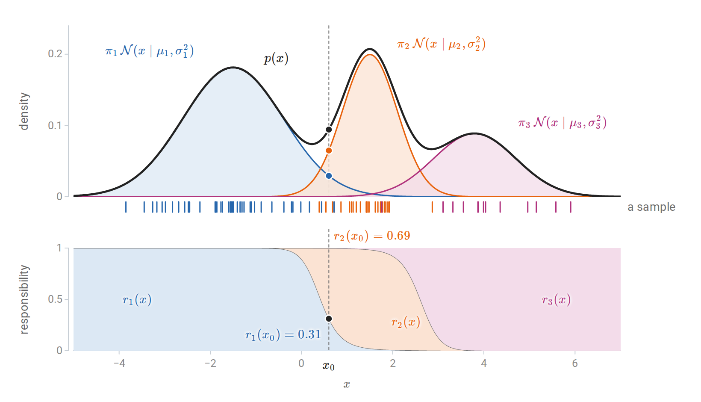
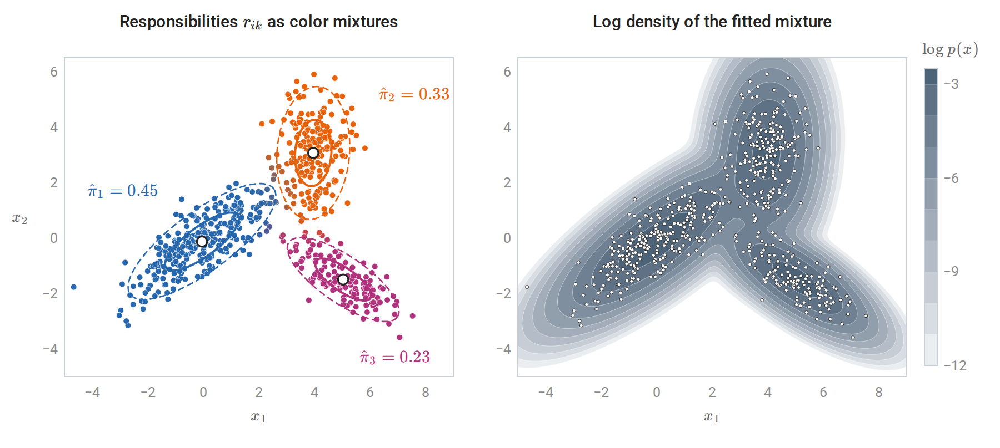
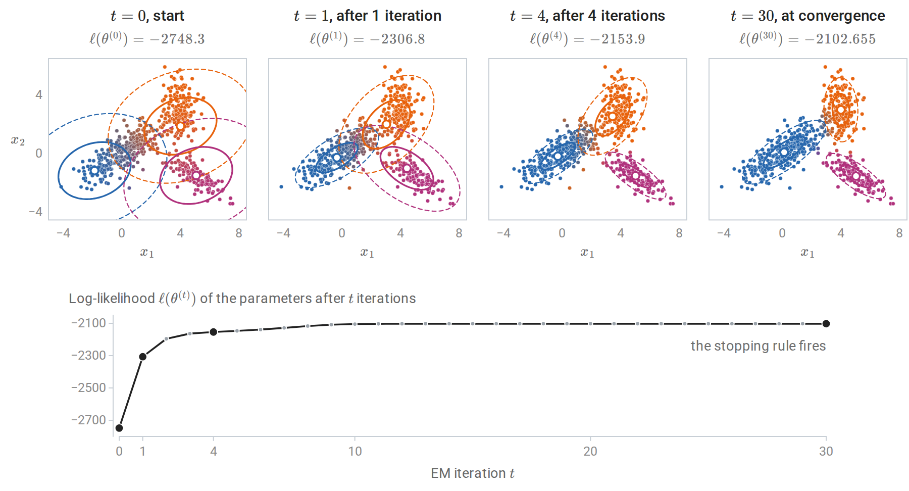
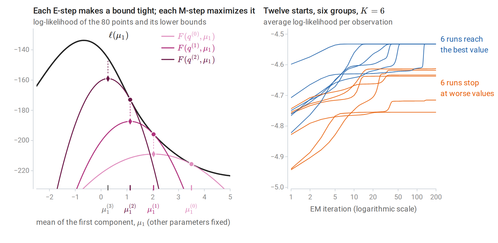
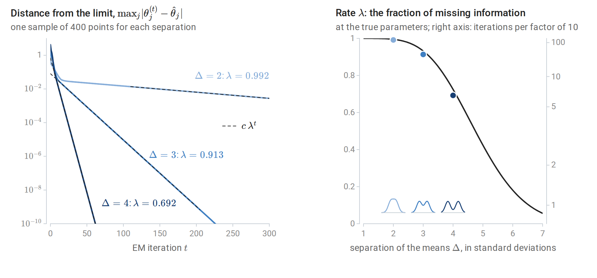
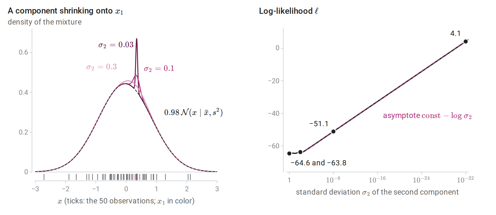
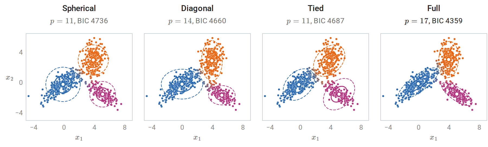
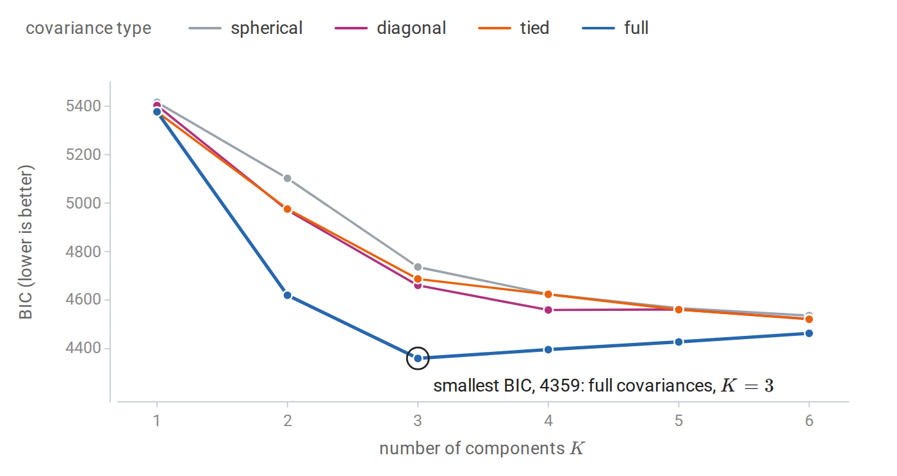
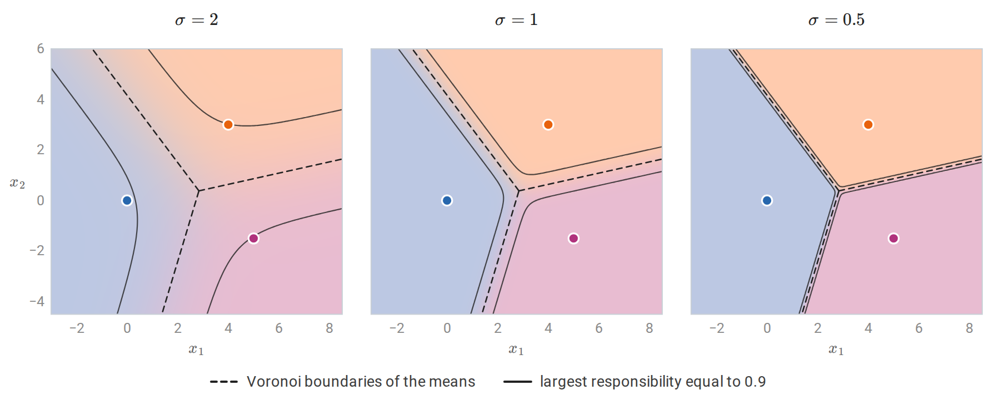
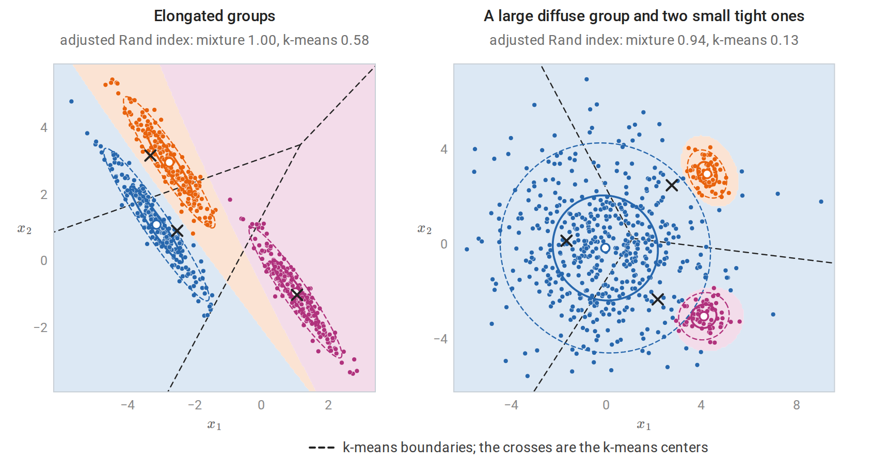

[ML Mastery Notes](../README.md) › [Machine Learning](README.md)

# 14. Gaussian Mixtures and Expectation Maximization

[← 13. Clustering](13-clustering.md) · [15. Gaussian Processes →](15-gaussian-processes.md)

## <a id="mixture-models"></a>Mixture models

### <a id="a-latent-class-label"></a>A latent class label

A **finite mixture model** explains each observation as coming from one of $`K`$ unobserved groups. Its generative story has two steps: draw a latent label $`z\in\{1,\ldots,K\}`$ with probabilities $`\pi_1,\ldots,\pi_K`$, then draw $`x`$ from the component distribution of that group. The **mixing weights** $`\pi_k`$ are nonnegative and sum to one. In a **Gaussian mixture**, the components are multivariate normal, and $`\mathcal N(x\mid\mu_k,\Sigma_k)`$ denotes the density of $`\mathcal N(\mu_k,\Sigma_k)`$ at $`x\in\mathbb R^d`$, given in Probability and Statistics. Summing the joint density of $`z=k`$ and $`x`$ over the unobserved label gives the density of an observation,

$$
p(x\mid\theta)=\sum_{k=1}^K\pi_k\,\mathcal N(x\mid\mu_k,\Sigma_k),\qquad \theta=\{\pi_k,\mu_k,\Sigma_k\}_{k=1}^K ,
$$

where $`\theta`$ collects all the parameters. Conditioning on $`z`$ also gives the mixture's moments. By the tower property and the law of total covariance of Probability and Statistics, whose worked example is a two-component mixture, the mean is $`\bar\mu=\sum_k\pi_k\mu_k`$ and the covariance is $`\sum_k\pi_k\Sigma_k+\sum_k\pi_k(\mu_k-\bar\mu)(\mu_k-\bar\mu)^\top`$, the average spread within components plus the spread of the component means. The mixture itself is not Gaussian: its density can have several modes, be skewed, or have heavier tails than a Gaussian.

This is the model of quadratic discriminant analysis in chapter 4 with the class label hidden. When the labels are observed, maximum likelihood separates by class, as chapter 4 shows, and has closed-form answers: class frequencies, class means, and class covariances. When they are not, the same parameters must be estimated from $`x`$ alone, which is the subject of this chapter.

Mixtures serve two purposes. As a **clustering** method, they generalize k-means (chapter 13): each component is a cluster with its own shape, size, and orientation, and membership is probabilistic. As a **density estimator**, they approximate complicated densities by sums of simple ones. With enough components, Gaussian mixtures can approximate any smooth density, which makes them useful for anomaly detection and as building blocks of larger probabilistic models.

### <a id="responsibilities"></a>Responsibilities

Given the parameters, Bayes' rule gives the posterior probability that observation $`x_i`$ came from component $`k`$, its **responsibility**:

$$
r_{ik}=P(z_i=k\mid x_i,\theta)=\frac{\pi_k\,\mathcal N(x_i\mid\mu_k,\Sigma_k)}{\sum_{j=1}^K\pi_j\,\mathcal N(x_i\mid\mu_j,\Sigma_j)} .
$$

The numerator is the joint density of the label $`z_i=k`$ and the observation $`x_i`$, and the denominator is $`p(x_i\mid\theta)`$. The responsibilities of each observation sum to one. They are a soft clustering: points deep inside a component have one responsibility near one, and points between components share their membership. The same ratio can be evaluated at any point $`x`$. Written $`r_k(x)`$, so that $`r_{ik}=r_k(x_i)`$, it is the share of the mixture density at $`x`$ that component $`k`$ contributes.



*A three-component mixture on the line. Top: the weighted components (colored) add up to the mixture density (black), and the ticks below are 80 draws from the two-step story, each colored by its latent label. Bottom: the responsibilities, stacked so that they fill the unit interval. At $`x_0`$ the heights of the blue and orange dots add up to the height of the black dot, and their shares of it are the responsibilities marked below; the third component contributes almost nothing there.*

In two dimensions the same soft assignment can be shown by color.



*A three-component Gaussian mixture with full covariances fitted to 600 points drawn from the mixture of the code block below. Left: each point's color mixes the component colors in proportion to its responsibilities, so points between components appear in intermediate shades; 33 of the 600 points (5.5%) have no responsibility above 0.9. Ellipses mark one and two standard deviations of each fitted component, and $`\hat\pi_k`$ are the fitted weights. Right: the log density of the fitted mixture.*

### <a id="the-likelihood-and-its-difficulties"></a>The likelihood and its difficulties

For iid observations the log-likelihood, in the sense of Probability and Statistics, is

$$
\ell(\theta)=\sum_{i=1}^n\log\sum_{k=1}^K\pi_k\,\mathcal N(x_i\mid\mu_k,\Sigma_k).
$$

Throughout the chapter, $`\log`$ is the natural logarithm. The logarithm of a sum does not separate into terms for each component, and setting derivatives to zero gives coupled equations without a closed-form solution. The gradient of $`\mathcal N(x\mid\mu,\Sigma)`$ in $`\mu`$ is $`\mathcal N(x\mid\mu,\Sigma)\,\Sigma^{-1}(x-\mu)`$, so differentiating the logarithm of the mixture density produces the responsibilities, and the stationarity condition for a mean is

$$
\nabla_{\mu_k}\ell(\theta)=\sum_{i=1}^nr_{ik}\,\Sigma_k^{-1}(x_i-\mu_k)=0,
\qquad\text{that is,}\qquad
\mu_k=\frac{\sum_ir_{ik}\,x_i}{\sum_ir_{ik}} .
$$

A stationary mean is a responsibility-weighted average of the data, but the weights $`r_{ik}`$ themselves depend on $`\mu_k`$ and on every other parameter, so the right side is not an explicit formula. The conditions for the weights and covariances have the same structure. Beyond the lack of a closed form, the log-likelihood has three awkward properties.

- **It is not concave** and has many stationary points, including local maxima and saddle points.
- **It is symmetric** under relabeling the components, so every maximum appears $`K!`$ times. This **label switching** is harmless for maximization but complicates any averaging of parameter estimates across fits.
- **It is unbounded.** Put one component's mean on a single observation and let its covariance shrink to zero. That observation's density grows without limit while the other observations are still covered by other components, so $`\ell\to\infty`$. A single Gaussian has this problem only when the observations are degenerate, for example a univariate sample whose observations all coincide, as Probability and Statistics notes; a mixture needs just one observation for the collapsing component. The maximum likelihood estimate does not exist without restrictions, and what practitioners call the MLE is a well-behaved local maximum. [Degenerate solutions](#degenerate-solutions) shows EM finding such collapses.

## <a id="the-em-algorithm-for-gaussian-mixtures"></a>The EM algorithm for Gaussian mixtures

### <a id="two-steps"></a>Two steps

The **expectation–maximization** (EM) algorithm ([Dempster, Laird, and Rubin, 1977](https://academic.oup.com/jrsssb/article/39/1/1/7027539)) alternates between computing responsibilities from the current parameters and re-estimating the parameters from the responsibilities. Write $`\theta^{(t)}`$ for the parameters after $`t`$ iterations, starting from an initial guess $`\theta^{(0)}`$.

**E-step.** Compute $`r_{ik}`$ for all $`i`$ and $`k`$ from the current parameters $`\theta^{(t)}`$.

**M-step.** With $`N_k=\sum_ir_{ik}`$, the effective number of observations in component $`k`$, update

$$
\pi_k=\frac{N_k}n,\qquad
\mu_k=\frac1{N_k}\sum_ir_{ik}\,x_i,\qquad
\Sigma_k=\frac1{N_k}\sum_ir_{ik}\,(x_i-\mu_k)(x_i-\mu_k)^\top .
$$

The updated values form $`\theta^{(t+1)}`$, and the covariance update uses the updated mean. The M-step is the QDA estimate of chapter 4 with each observation assigned fractionally to every class, in proportion to its responsibilities ([Appendix A](#block-gmm-appendix-a) derives it). It is also the stationarity condition derived above with the responsibilities frozen at their current values, which is what makes it solvable. Each iteration costs $`O(nKd^2)`$ operations for the densities, plus $`O(Kd^3)`$ for factorizing the covariance matrices.

### <a id="complete-and-observed-data"></a>Complete and observed data

EM applies far beyond mixtures, and its logic is clearest in general terms. Call $`(x,z)`$ the **complete data** and $`x`$ alone the **observed data**, where $`x=(x_1,\ldots,x_n)`$ and $`z=(z_1,\ldots,z_n)`$ collect all observations and labels. If the labels were observed, the **complete-data log-likelihood**

$$
\ell_c(\theta)=\sum_i\sum_k\mathbf 1\{z_i=k\}\bigl[\log\pi_k+\log\mathcal N(x_i\mid\mu_k,\Sigma_k)\bigr]
$$

would be easy to maximize, since it separates by component. The labels are unknown, but $`\ell_c`$ is linear in the indicators $`\mathbf 1\{z_i=k\}`$. Its conditional expectation given the data and the current parameters therefore replaces each indicator by $`\mathbb E\bigl[\mathbf 1\{z_i=k\}\mid x_i,\theta^{(t)}\bigr]=P(z_i=k\mid x_i,\theta^{(t)})`$, which is the responsibility $`r_{ik}`$ computed at $`\theta^{(t)}`$. EM maximizes the resulting **expected complete-data log-likelihood**

$$
Q(\theta\mid\theta^{(t)})=\mathbb E_{z\sim p(z\mid x,\theta^{(t)})}\bigl[\log p(x,z\mid\theta)\bigr]
=\sum_i\sum_kr_{ik}\bigl[\log\pi_k+\log\mathcal N(x_i\mid\mu_k,\Sigma_k)\bigr].
$$

The E-step computes the expectation, which amounts to computing the responsibilities; the M-step maximizes it over $`\theta`$, which gives the weighted estimates above.

The implementation below runs EM from a fixed starting point and matches scikit-learn's [`GaussianMixture`](https://scikit-learn.org/stable/modules/generated/sklearn.mixture.GaussianMixture.html) started from the same parameters. The log-sum-exp step computes $`\log p(x_i)`$ without underflow, as in Numerical Computing.

```python
import numpy as np
from scipy.stats import multivariate_normal
from sklearn.mixture import GaussianMixture

rng = np.random.default_rng(0)
X = np.vstack([rng.multivariate_normal([0, 0], [[2.0, 1.2], [1.2, 1.2]], 300),
               rng.multivariate_normal([4, 3], [[0.4, 0.0], [0.0, 1.5]], 180),
               rng.multivariate_normal([5, -1.5], [[1.0, -0.6], [-0.6, 0.6]], 120)])
n, d, K = len(X), X.shape[1], 3

def log_densities(X, pi, mu, Sigma):
    """log pi_k + log N(x_i | mu_k, Sigma_k) for every i and k."""
    return np.column_stack([np.log(pi[k]) + multivariate_normal(mu[k], Sigma[k]).logpdf(X) for k in range(K)])

# Initialization: K data points as means, the overall covariance for every component, equal weights.
pi = np.full(K, 1 / K)
mu = X[rng.choice(n, K, replace=False)]
Sigma = np.array([np.cov(X.T)] * K)
init = (pi.copy(), mu.copy(), Sigma.copy())

loglik = []
for it in range(500):
    L = log_densities(X, pi, mu, Sigma)
    m = L.max(1, keepdims=True)
    log_px = m[:, 0] + np.log(np.exp(L - m).sum(1))          # log-sum-exp over components
    loglik.append(log_px.sum())
    R = np.exp(L - log_px[:, None])                           # E-step: responsibilities
    Nk = R.sum(0)                                             # M-step: weighted maximum likelihood
    pi = Nk / n
    mu = (R.T @ X) / Nk[:, None]
    Sigma = np.array([((R[:, k, None] * (X - mu[k])).T @ (X - mu[k])) / Nk[k] for k in range(K)])
    if it > 0 and loglik[-1] - loglik[-2] < 1e-10 * abs(loglik[-1]):
        break

print("iterations:", len(loglik), "; log-likelihood never decreased:", bool(np.all(np.diff(loglik) >= -1e-9)))
print("log-likelihood at iterations 1, 2, 5, 20, last:",
      [round(loglik[i], 1) for i in (0, 1, 4, 19)] + [round(loglik[-1], 3)])

gm = GaussianMixture(K, weights_init=init[0], means_init=init[1], precisions_init=np.linalg.inv(init[2]),
                     reg_covar=0.0, tol=1e-12, max_iter=500).fit(X)
print(f"scikit-learn from the same start: log-likelihood {gm.score(X) * n:.3f}")
order = np.argsort(mu[:, 0])
print("weights:", np.round(pi[order], 3).tolist(), " means:", np.round(mu[order], 2).tolist())
# iterations: 31 ; log-likelihood never decreased: True
# log-likelihood at iterations 1, 2, 5, 20, last: [-2748.3, -2306.8, -2153.9, -2102.7, -2102.655]
# scikit-learn from the same start: log-likelihood -2102.655
# weights: [0.505, 0.291, 0.204]  means: [[0.12, 0.12], [4.0, 3.01], [5.02, -1.51]]
```

The data were generated with weights $`0.5,0.3,0.2`$ and means $`(0,0)`$, $`(4,3)`$, $`(5,-1.5)`$, which the fit recovers. Each pass of the loop evaluates the log-likelihood in its E-step, before its M-step, so the value printed for iteration $`j`$ is $`\ell(\theta^{(j-1)})`$. The figure shows the run.



*The EM run of the code above. Top: the parameters $`\theta^{(t)}`$ after $`t`$ iterations, with ellipses at one and two standard deviations of each component and each point colored by its responsibilities under $`\theta^{(t)}`$. The run starts from equal weights, the overall covariance for every component, and three random observations as means, which happen to fall in different groups. Bottom: the log-likelihood of every $`\theta^{(t)}`$; the values for the four panels are those the code prints for iterations 1, 2, 5, and 31. Most of the gain comes in the first few iterations.*

## <a id="why-em-works"></a>Why EM works

### <a id="a-lower-bound-on-the-log-likelihood"></a>A lower bound on the log-likelihood

Let $`q`$ be any distribution over the latent labels of one observation, positive wherever the posterior $`p(z\mid x,\theta)`$ is. Because $`\log`$ is concave, Jensen's inequality (Probability and Statistics), $`\log\mathbb E\,Y\ge\mathbb E\log Y`$, applied to the random variable $`Y=p(x,z\mid\theta)/q(z)`$ with $`z`$ drawn from $`q`$, gives

$$
\log p(x\mid\theta)=\log\sum_zq(z)\frac{p(x,z\mid\theta)}{q(z)}\ \ge\ \sum_zq(z)\log\frac{p(x,z\mid\theta)}{q(z)}\ =:\ F(q,\theta).
$$

The sums run over the $`K`$ values of $`z`$. The gap is exactly a Kullback–Leibler divergence (Information and Learning Theory):

$$
\log p(x\mid\theta)=F(q,\theta)+D_{\mathrm{KL}}\bigl(q\,\big\|\,p(z\mid x,\theta)\bigr).
$$

Because the logarithms here are natural, the divergence is measured in nats. Information and Learning Theory measures it in bits, which divides every term of the identity by $`\log2`$ and changes nothing below. To verify the identity, write $`p(x,z\mid\theta)=p(z\mid x,\theta)\,p(x\mid\theta)`$ inside $`F`$; [Appendix B](#block-gmm-appendix-b) gives the details. The quantity $`\log p(x\mid\theta)`$ is called the **evidence**, and $`F`$ the **evidence lower bound** (ELBO) in the variational-inference literature. Summed over observations, with a separate $`q_i`$ for each, it bounds $`\ell(\theta)`$.

### <a id="em-is-coordinate-ascent-on-the-bound"></a>EM is coordinate ascent on the bound

The two EM steps maximize $`F`$ over its two arguments in turn ([Neal and Hinton, 1998](https://link.springer.com/chapter/10.1007/978-94-011-5014-9_12)). Here $`F(q,\theta)=\sum_iF(q_i,\theta)`$ for a collection $`q=(q_1,\ldots,q_n)`$, and $`q^{(t)}`$ is the collection chosen by the E-step at $`\theta^{(t)}`$.

- **E-step:** for fixed $`\theta^{(t)}`$, the bound is maximized over $`q`$ by making the divergence zero, $`q_i^{(t)}(z)=p(z\mid x_i,\theta^{(t)})`$. The responsibilities are this choice, and after the E-step the bound touches the log-likelihood: $`F(q^{(t)},\theta^{(t)})=\ell(\theta^{(t)})`$.
- **M-step:** for fixed $`q`$, the term $`-\sum_zq(z)\log q(z)`$ does not depend on $`\theta`$, so maximizing $`F`$ over $`\theta`$ is maximizing $`Q(\theta\mid\theta^{(t)})`$.

**Theorem.** Every EM iteration satisfies $`\ell(\theta^{(t+1)})\ge\ell(\theta^{(t)})`$.

**Proof.**

$$
\ell(\theta^{(t+1)})\ \ge\ F(q^{(t)},\theta^{(t+1)})\ \ge\ F(q^{(t)},\theta^{(t)})\ =\ \ell(\theta^{(t)}).
$$

The first inequality holds because $`F`$ is a lower bound for every $`q`$; the second because the M-step maximizes $`F(q^{(t)},\cdot)`$; the equality because the E-step made the bound tight. $`\square`$

The proof also splits each improvement into two nonnegative parts: the M-step's gain in the bound, $`F(q^{(t)},\theta^{(t+1)})-F(q^{(t)},\theta^{(t)})`$, and the gap $`\sum_iD_{\mathrm{KL}}\bigl(q_i^{(t)}\,\big\|\,p(z\mid x_i,\theta^{(t+1)})\bigr)`$ that the next E-step closes. The proof needs only that the M-step does not decrease $`F`$. **Generalized EM** algorithms take any improving step in $`\theta`$, such as one gradient step, and keep the guarantee. Incremental versions update one observation's $`q_i`$ at a time, and variational versions restrict $`q`$ to a tractable family when the exact posterior cannot be computed.



*Left: EM for the mean $`\mu_1`$ of one component of a two-component mixture, with the other parameters held at their true values, from $`\mu_1^{(0)}=3.5`$. The log-likelihood (black) and three lower bounds $`F(q^{(t)},\cdot)`$: each touches the log-likelihood at the current estimate (circles) and is maximized at the next one (diamonds), and each dotted segment is the gap that the next E-step closes. Right: EM with six components on six well-separated groups, from 12 starting points chosen as random observations. Every log-likelihood curve increases, but only six reach the best value; the others stop at worse stationary points, sometimes after long plateaus near saddle points.*

### <a id="what-the-guarantee-does-not-say"></a>What the guarantee does not say

Monotonicity is a guarantee about the sequence of likelihood values, not about where they end. The sequence converges whenever the likelihood is bounded along the path, and under regularity conditions the limit points of the parameters are stationary points of $`\ell`$ ([Wu, 1983](https://projecteuclid.org/journals/annals-of-statistics/volume-11/issue-1/On-the-Convergence-Properties-of-the-EM-Algorithm/10.1214/aos/1176346060.full)). A stationary point can be a local maximum or a saddle point, and nothing guarantees the global maximum, which for Gaussian mixtures does not even exist. The right panel shows the practical consequence: the answer depends on the starting point, and several starts are needed.

EM's convergence is also slow when components overlap. Near a local maximum $`\hat\theta`$, the error shrinks by a roughly constant factor per iteration, and that factor is the fraction of information about $`\theta`$ that is missing because the labels are unobserved. Dempster, Laird, and Rubin make this precise. Let $`J_n(\hat\theta)=-\nabla^2\ell(\hat\theta)`$ be the observed information of Probability and Statistics, and let $`I_c(\hat\theta)=-\nabla_\theta^2Q(\theta\mid\hat\theta)`$ at $`\theta=\hat\theta`$ be the information the complete data would carry, averaged over the posterior of the labels. Their difference $`I_m=I_c-J_n`$ is the **missing information**; it equals the posterior covariance of the complete-data score $`\nabla_\theta\log p(x,z\mid\theta)`$ at $`\hat\theta`$, so it is positive semidefinite. Near $`\hat\theta`$ the EM update is approximately linear:

$$
\theta^{(t+1)}-\hat\theta\ \approx\ I_c(\hat\theta)^{-1}I_m(\hat\theta)\,\bigl(\theta^{(t)}-\hat\theta\bigr).
$$

At a local maximum where $`J_n`$ is positive definite, the eigenvalues of the **fraction of missing information** $`I_c^{-1}I_m`$ lie in $`[0,1)`$, and the largest, $`\lambda`$, is the rate: the error falls roughly like $`\lambda^t`$, so each tenfold reduction takes about $`\log10/\log(1/\lambda)`$ iterations. Well-separated components have nearly certain labels, little missing information, and fast convergence; heavily overlapping ones have $`\lambda`$ close to one and can take thousands of iterations.



*EM for all five parameters of the mixture $`\tfrac12\mathcal N(-\Delta/2,1)+\tfrac12\mathcal N(\Delta/2,1)`$, fitted to 400 points, for three separations $`\Delta`$. Left: the distance of $`\theta^{(t)}`$ from the limit of its run. After a short transient each curve falls at exactly the rate $`\lambda`$ computed from the missing information at the limit (dashed lines). With $`\Delta=2`$ the distance is still $`3\times10^{-3}`$ after 300 iterations, and falling below $`10^{-6}`$ takes 1,239 iterations; with $`\Delta=4`$ it takes 37. Right: the same rate computed from the model at its true parameters, as a function of $`\Delta`$; the dots are the three sample rates, and the sketches show the three mixture densities. The rate approaches one as the components merge.*

For heavily overlapping components, quasi-Newton methods or acceleration schemes are faster, but EM's simplicity, its automatic respect for constraints such as positive definite covariances and weights that sum to one, and its monotonicity keep it the default.

## <a id="using-gaussian-mixtures-in-practice"></a>Using Gaussian mixtures in practice

### <a id="initialization"></a>Initialization

Common practice runs k-means first and initializes the means, covariances, and weights from its clusters; scikit-learn does this by default. Several restarts from different initializations, keeping the fit with the largest likelihood, protect against poor local optima. The k-means++ seeding of chapter 13 works well for the initial means.

### <a id="degenerate-solutions"></a>Degenerate solutions

The unboundedness of the likelihood is not a theoretical curiosity. EM can find it, especially with many components, few observations per component, or duplicated and isolated points.

```python
import numpy as np
from scipy.stats import norm
from sklearn.mixture import GaussianMixture

rng = np.random.default_rng(1)
x = rng.normal(size=50)

# Two-component mixture: component 1 fits all the data; component 2 sits on the single point x[0].
for s in [1.0, 1e-2, 1e-8, 1e-32]:
    ll = np.sum(np.log(0.98 * norm.pdf(x, x.mean(), x.std()) + 0.02 * norm.pdf(x, x[0], s)))
    print(f"sigma_2 = {s:6.0e}: log-likelihood {ll:8.1f}")

# A floor on the variances (reg_covar) keeps EM away from the degenerate solutions.
X = np.concatenate([x, [5.0]])[:, None]                       # one isolated point invites a collapse
for reg in [1e-6, 1e-2]:
    gm = GaussianMixture(3, reg_covar=reg, n_init=10, random_state=0).fit(X)
    print(f"reg_covar = {reg:.0e}: smallest fitted variance {gm.covariances_.min():.1e}, "
          f"log-likelihood {gm.score(X) * len(X):.1f}")
# sigma_2 =  1e+00: log-likelihood    -64.6
# sigma_2 =  1e-02: log-likelihood    -63.8
# sigma_2 =  1e-08: log-likelihood    -51.1
# sigma_2 =  1e-32: log-likelihood      4.1
# reg_covar = 1e-06: smallest fitted variance 1.0e-06, log-likelihood -61.4
# reg_covar = 1e-02: smallest fitted variance 1.0e-02, log-likelihood -66.0
```

The first loop shows the likelihood increasing without bound as one component shrinks onto a single observation, $`x_1`$ (`x[0]` in the code). Once $`\sigma_2`$ is small, the second component contributes nothing at the other 49 observations, which the first component covers, while its weighted density at $`x_1`$ is $`0.02/(\sqrt{2\pi}\,\sigma_2)`$. The log-likelihood therefore behaves like a constant minus $`\log\sigma_2`$, and it gains $`\log10\approx2.3`$ for every tenfold reduction of $`\sigma_2`$.



*The first loop of the code. Left: the mixture density for three values of $`\sigma_2`$, with 2% of the weight on a component centered at $`x_1`$ and the rest on the Normal fitted to all 50 points (dashed). Right: the log-likelihood as $`\sigma_2`$ shrinks; it barely changes down to $`\sigma_2=10^{-2}`$ and then grows along its asymptote without bound. The dots are the four values the code prints.*

In the second loop, the best fit dedicates a component to the isolated point. scikit-learn's `reg_covar` adds a constant to the diagonal of every fitted covariance, so no variance can fall below it, and the variance of that component sits exactly at this floor: the regularization, not the data, determines that component, and the reported likelihood depends on the floor. Remedies are a floor on the eigenvalues of each covariance matrix, which adding a multiple of the identity provides, as here; a prior on the covariances, which turns EM into maximum a posteriori estimation; restricting covariance structure; and discarding components whose weight or variance collapses.

### <a id="covariance-structure"></a>Covariance structure

Full covariance matrices cost $`d(d+1)/2`$ parameters per component, which is prohibitive in high dimensions. Restricted structures trade flexibility for stability:

| Covariance type | Shape of each component | Parameters for the covariances |
| --- | --- | --- |
| Spherical, $`\Sigma_k=\sigma_k^2I`$ | Balls of different sizes | $`K`$ |
| Diagonal, $`\Sigma_k=\operatorname{diag}(\sigma_{k1}^2,\ldots,\sigma_{kd}^2)`$ | Axis-aligned ellipsoids | $`Kd`$ |
| Tied, $`\Sigma_k=\Sigma`$ | Identical ellipsoids at different locations | $`d(d+1)/2`$ |
| Full | Arbitrary ellipsoids | $`Kd(d+1)/2`$ |

The means add $`Kd`$ parameters and the weights $`K-1`$. The tied model gives linear boundaries between components, like LDA, and the full model quadratic ones, like QDA; chapter 4 compares the same assumptions for classifiers.



*Three-component fits of the four covariance structures to the 600 points of the figure in [Responsibilities](#responsibilities), with ellipses at one and two standard deviations and points colored by their responsibilities; $`p`$ counts all free parameters. Only the full model gives each component its own tilt. The spherical and diagonal components cannot tilt at all, and the tied model gives all three the same shape.*

### <a id="choosing-the-number-of-components"></a>Choosing the number of components

The likelihood always increases with $`K`$, so $`K`$ and the covariance type are chosen by a penalized criterion or by held-out likelihood. The **Bayesian information criterion** of chapter 6, $`\operatorname{BIC}=-2\ell(\hat\theta)+p\log n`$ with $`p`$ the number of free parameters, is the most common choice. Its derivation assumes regularity conditions that mixtures violate, because a model with fewer components sits on the boundary of the larger model's parameter space; it nonetheless works well in practice for choosing the number of components.



*BIC for mixtures with one to six components and four covariance structures, fitted to the 600 points of the figure in [Responsibilities](#responsibilities). BIC selects three components with full covariances, the model that generated the data. The restricted covariance types need more components to describe the tilted, elongated groups; their BIC is still decreasing at six components, the largest number tried, and remains above that of the selected model.*

The scikit-learn example [Gaussian Mixture Model Selection](https://scikit-learn.org/stable/auto_examples/mixture/plot_gmm_selection.html) from the reading plan performs the same comparison. Held-out log-likelihood, computed by cross-validation as for probabilistic PCA in chapter 12, is an alternative that targets density estimation rather than recovery of a true $`K`$.

## <a id="mixtures-and-k-means"></a>Mixtures and k-means

k-means is a limiting case of EM. Fix all covariances at $`\sigma^2I`$ and all weights at $`1/K`$. The responsibilities become

$$
r_{ik}=\frac{\exp\bigl(-\|x_i-\mu_k\|^2/2\sigma^2\bigr)}{\sum_j\exp\bigl(-\|x_i-\mu_j\|^2/2\sigma^2\bigr)},
$$

a softmax of negative squared distances with temperature $`2\sigma^2`$. The boundary where two responsibilities are equal is the perpendicular bisector of the two means for every $`\sigma`$, because the normalizing constants cancel; shrinking $`\sigma`$ only sharpens the transition across it. As $`\sigma^2\to0`$, each responsibility tends to one for the nearest mean and zero otherwise, provided there are no ties. The E-step becomes the k-means assignment step, and the M-step for the means becomes the update step.



*Responsibilities of three components with equal weights and common covariance $`\sigma^2I`$, shown by mixing the component tints in proportion to them; the means are those of the mixture in the EM code block. The dashed boundaries are the same in every panel. The band where no responsibility exceeds 0.9 narrows onto them as $`\sigma`$ shrinks, and in the limit the shading becomes the Voronoi partition of k-means.*

The objectives match as well. With $`d`$ the dimension, the expected complete-data log-likelihood of this restricted mixture is

$$
Q(\theta\mid\theta^{(t)})=\sum_i\sum_kr_{ik}\Bigl[-\log K-\frac d2\log(2\pi\sigma^2)-\frac{\|x_i-\mu_k\|^2}{2\sigma^2}\Bigr].
$$

Multiply by $`\sigma^2`$ and let $`\sigma^2\to0`$. The first two terms vanish, the second because $`\sigma^2\log\sigma^2\to0`$, and each $`r_{ik}`$ becomes the indicator that $`\mu_k^{(t)}`$ is the current mean nearest to $`x_i`$, so $`\sigma^2Q`$ tends to $`-\frac12`$ times the within-cluster sum of squares $`W`$ of chapter 13, evaluated at that nearest-mean partition. Lloyd's algorithm is therefore **hard EM** for this restricted mixture, an EM whose E-step assigns each point entirely to its most responsible component.

The comparison explains the failures of k-means in chapter 13. k-means implicitly assumes spherical clusters with equal spread, and it assigns each point entirely to one cluster. A mixture with full covariances drops both assumptions. On the two datasets where k-means failed, the adjusted Rand index rises from 0.58 and 0.13 to 1.00 and 0.94.



*Gaussian mixtures with full covariances on the two datasets where k-means failed in chapter 13. Shading shows where each fitted component has the largest responsibility, and points are colored by that assignment; each component takes the color that its group has in the chapter 13 figure. The fitted components capture the elongated groups exactly and separate the large diffuse group from the two small tight ones, whose curved regions k-means cannot represent.*

The flexibility has costs. A mixture has more parameters, more local optima, and the degenerate solutions above; it is slower; and it assumes the clusters really are roughly Gaussian. For large, high-dimensional data, k-means or mixtures with diagonal or spherical covariances are often the practical choice.

## <a id="em-beyond-gaussian-mixtures"></a>EM beyond Gaussian mixtures

The derivation of EM used nothing specific to Gaussians. It applies whenever a model has latent variables whose posterior can be computed, so that the E-step is tractable, and whose complete-data likelihood is easy to maximize.

The M-step is simplest when the complete-data model is an exponential family. Its log-likelihood is then linear in the summed sufficient statistic $`T=\sum_it(x_i,z_i)`$, so the E-step only needs the conditional expectation $`\mathbb E[T\mid x,\theta^{(t)}]`$, and the M-step is the complete-data maximum likelihood estimate with $`T`$ replaced by that expectation: it matches the model's expected value of $`t(x_i,z_i)`$ to the average $`\mathbb E[T\mid x,\theta^{(t)}]/n`$. For a Gaussian mixture, $`T`$ collects the counts, sums, and sums of outer products $`\sum_i\mathbf 1\{z_i=k\}\,(1,\ x_i,\ x_ix_i^\top)`$ for each component, and its conditional expectation is $`(N_k,\ \sum_ir_{ik}x_i,\ \sum_ir_{ik}x_ix_i^\top)`$, from which the M-step formulas follow.

- **Other mixtures.** Mixtures of Bernoulli distributions cluster binary data such as black-and-white images; mixtures of multinomials cluster documents by word counts; mixtures of Student $`t`$ distributions resist outliers.
- **Missing data.** When some entries of $`x`$ are missing at random, EM treats them as latent variables. For a multivariate Gaussian, the E-step fills in conditional expectations of the missing entries and of their squares and products, using the conditional-Gaussian formulas of Probability and Statistics.
- **Latent factor models.** Probabilistic PCA and factor analysis (chapter 12) are fitted by EM when no closed form exists, and hidden Markov models (AI chapter 11) are fitted by an EM algorithm whose E-step is a dynamic program.
- **Intractable posteriors.** When the posterior over latent variables cannot be computed, the E-step can maximize $`F`$ over a restricted family of distributions instead. This **variational EM**, and its amortized form in variational autoencoders, belongs to the Generative AI module.

General inference in graphical models with many interacting latent variables belongs to the AI module (AI chapters 9 and 10), and AI chapter 14 fits such models with EM. [ESL §8.5](https://hastie.su.domains/ElemStatLearn/) presents EM with a two-component example, and [Bishop's *Pattern Recognition and Machine Learning*](https://www.microsoft.com/en-us/research/publication/pattern-recognition-machine-learning/), chapter 9, develops mixtures and EM in the lower-bound form used here.

## <a id="appendices"></a>Appendices


<details>
<summary><a id="block-gmm-appendix-a"></a><b>A. The M-step for Gaussian mixtures</b></summary>


With responsibilities $`r_{ik}`$ fixed, the expected complete-data log-likelihood is

$$
Q=\sum_i\sum_kr_{ik}\Bigl[\log\pi_k-\frac12\log\det\Sigma_k-\frac12(x_i-\mu_k)^\top\Sigma_k^{-1}(x_i-\mu_k)\Bigr]+\text{const}.
$$

**Weights.** Maximize $`\sum_kN_k\log\pi_k`$ subject to $`\sum_k\pi_k=1`$. The Lagrangian $`\sum_kN_k\log\pi_k+\lambda(1-\sum_k\pi_k)`$ has stationarity condition $`N_k/\pi_k=\lambda`$; summing $`\pi_k=N_k/\lambda`$ over $`k`$ gives $`\lambda=\sum_kN_k=n`$.

**Means.** The gradient in $`\mu_k`$ is $`\Sigma_k^{-1}\sum_ir_{ik}(x_i-\mu_k)`$, which vanishes at the weighted mean $`\mu_k=\sum_ir_{ik}x_i/N_k`$.

**Covariances.** Write $`P_k=\Sigma_k^{-1}`$ and $`S_k=\sum_ir_{ik}(x_i-\mu_k)(x_i-\mu_k)^\top`$. The terms involving $`P_k`$ are $`\frac{N_k}2\log\det P_k-\frac12\operatorname{tr}(P_kS_k)`$. Using $`\nabla_P\log\det P=P^{-1}`$ and $`\nabla_P\operatorname{tr}(PS)=S`$, stationarity gives $`N_kP_k^{-1}=S_k`$, that is, $`\Sigma_k=S_k/N_k`$. The objective is concave in $`P_k`$, so this is the maximum, provided $`S_k`$ is positive definite. If a component's responsibilities concentrate on fewer than $`d+1`$ affinely independent points, $`S_k`$ is singular and the update breaks down, which is the degeneracy discussed in the main text.

Each update is the corresponding observed-label estimate of chapter 4, with the indicator $`\mathbf 1\{z_i=k\}`$ replaced by $`r_{ik}`$.

</details>


<details>
<summary><a id="block-gmm-appendix-b"></a><b>B. The decomposition behind the lower bound</b></summary>


For one observation and any distribution $`q`$ over $`z`$ with $`q(z)>0`$ wherever $`p(z\mid x,\theta)>0`$,

$$
\begin{aligned}
F(q,\theta)&=\sum_zq(z)\log\frac{p(x,z\mid\theta)}{q(z)}
=\sum_zq(z)\log\frac{p(z\mid x,\theta)\,p(x\mid\theta)}{q(z)}\\
&=\log p(x\mid\theta)-\sum_zq(z)\log\frac{q(z)}{p(z\mid x,\theta)}
=\log p(x\mid\theta)-D_{\mathrm{KL}}\bigl(q\,\|\,p(z\mid x,\theta)\bigr).
\end{aligned}
$$

The second line uses $`\sum_zq(z)=1`$. Since the divergence is nonnegative and zero only when $`q`$ equals the posterior, this identity contains both Jensen's inequality and the exact form of the E-step. Summing over independent observations, each with its own $`q_i`$, gives $`\ell(\theta)=\sum_iF(q_i,\theta)+\sum_iD_{\mathrm{KL}}\bigl(q_i\,\|\,p(z_i\mid x_i,\theta)\bigr)`$.

Splitting $`F`$ differently shows what the M-step maximizes:

$$
F(q,\theta)=\underbrace{\sum_zq(z)\log p(x,z\mid\theta)}_{Q\text{ when }q=p(z\mid x,\theta^{(t)})}+\underbrace{\Bigl(-\sum_zq(z)\log q(z)\Bigr)}_{\text{entropy of }q} .
$$

The entropy term does not depend on $`\theta`$, so for fixed $`q`$ the M-step maximizes the expected complete-data log-likelihood alone.

</details>

---

[← 13. Clustering](13-clustering.md) · [15. Gaussian Processes →](15-gaussian-processes.md)
