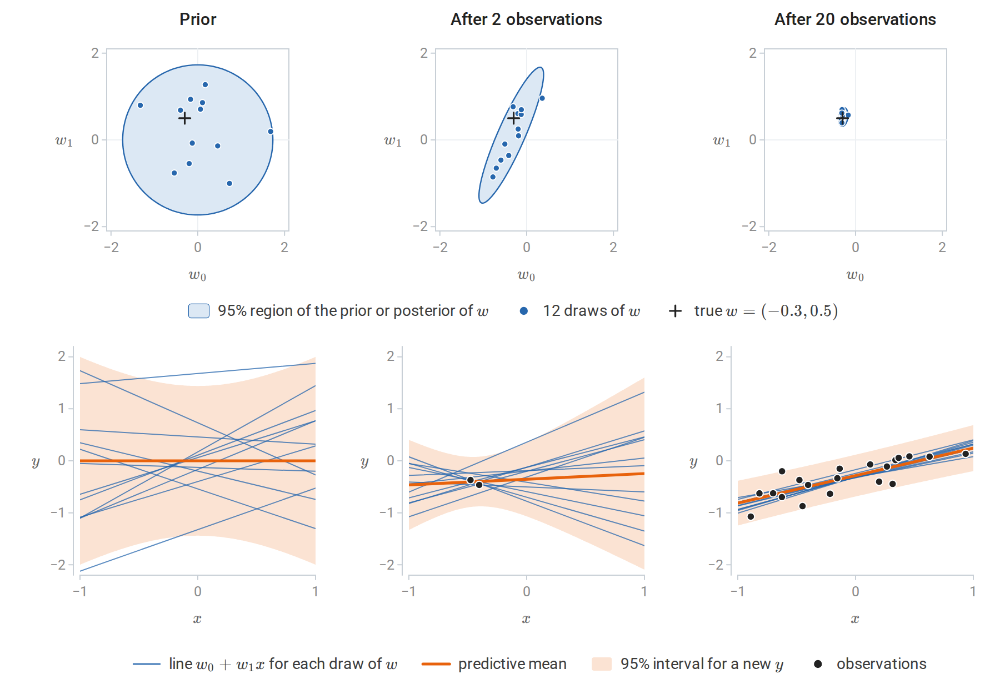
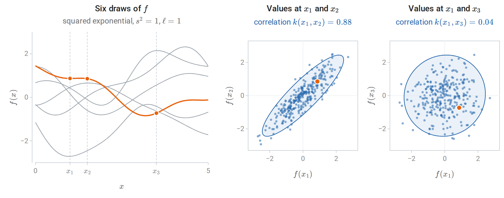
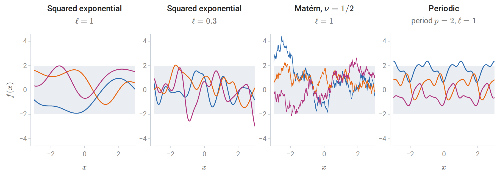
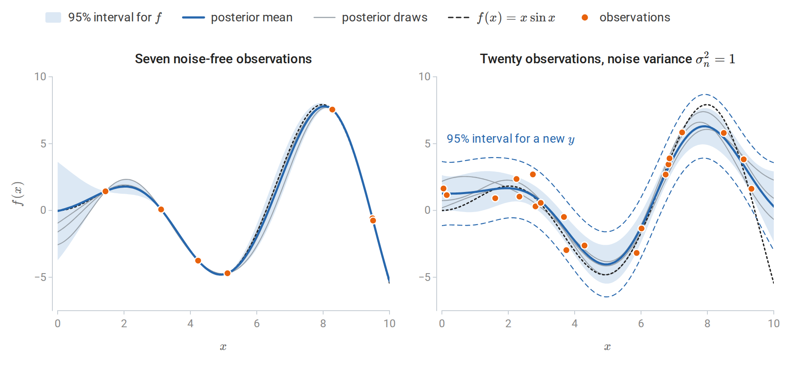
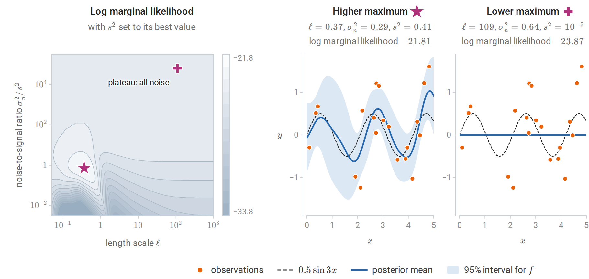
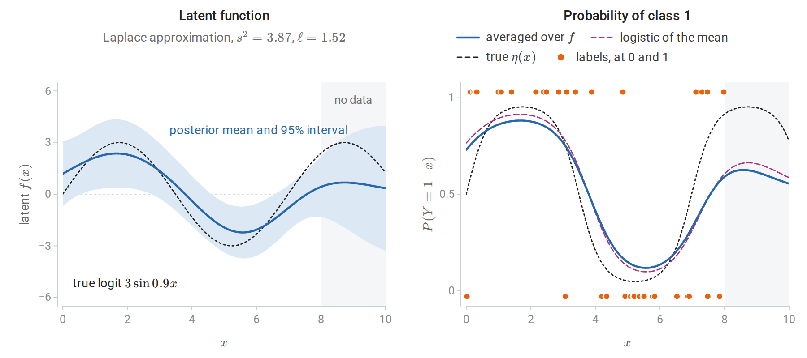
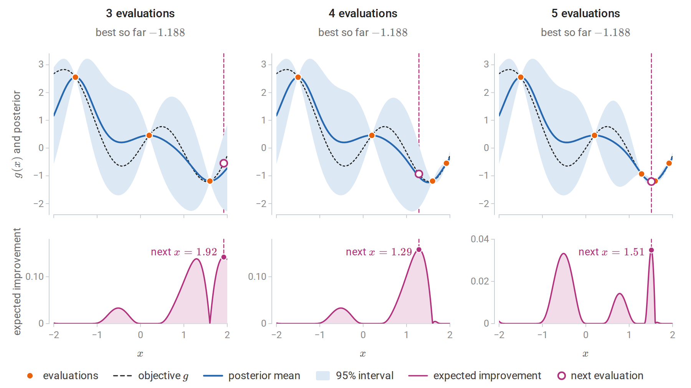

[ML Mastery Notes](../README.md) › [Machine Learning](README.md)

# 15. Gaussian Processes

[← 14. Gaussian Mixtures and Expectation Maximization](14-gaussian-mixtures-and-expectation-maximization.md) · [16. Semi-Supervised and Active Learning →](16-semi-supervised-and-active-learning.md)

## <a id="from-weights-to-functions"></a>From weights to functions

### <a id="bayesian-linear-regression"></a>Bayesian linear regression

The regression methods of earlier chapters return a single fitted function. A Bayesian treatment returns a distribution over functions, so that every prediction comes with a statement of its uncertainty. Probability and Statistics carried out the calculation for a single unknown mean: a Gaussian prior combined with Gaussian observations gives a Gaussian posterior. Linear regression is the vector version.

Model the response as $y=\phi(x)^\top w+\varepsilon$ with features $\phi(x)\in\mathbb R^p$, noise $\varepsilon\sim\mathcal N(0,\sigma^2)$ independent across observations, and a Gaussian prior $w\sim\mathcal N(0,\Sigma_p)$ with prior covariance $\Sigma_p$. Let $\Phi$ be the $n\times p$ matrix of training features, whose $i$th row is $\phi(x_i)^\top$, and $y$ the vector of training responses. Up to terms that do not involve $w$, the logarithm of prior times likelihood is

$$
-\frac1{2\sigma^2}\|y-\Phi w\|^2-\frac12w^\top\Sigma_p^{-1}w
=-\frac12w^\top Aw+\sigma^{-2}w^\top\Phi^\top y+\text{const}
=-\frac12(w-\bar w)^\top A(w-\bar w)+\text{const},
$$

with $A$ and $\bar w$ as below. Completing the square in this way shows that the posterior is Gaussian:

$$
w\mid y\sim\mathcal N\bigl(\bar w,\;A^{-1}\bigr),\qquad
A=\sigma^{-2}\Phi^\top\Phi+\Sigma_p^{-1},\qquad
\bar w=\sigma^{-2}A^{-1}\Phi^\top y .
$$

Precisions add, as in the scalar case: the posterior precision $A$ is the prior precision plus the information in the data. For $\Sigma_p=\tau^2I$, the posterior mean is the ridge estimate with $\lambda=\sigma^2/\tau^2$, as noted in chapter 3. At a new input $x_\ast$, the function value $f(x_\ast)=\phi(x_\ast)^\top w$ is a linear function of $w$, so by the rule for linear maps of Gaussian vectors its posterior is Gaussian, with mean and variance obtained from those of $w$. Averaging over the posterior of $w$ in this way gives the **predictive distribution**

$$
f(x_\ast)\mid y\sim\mathcal N\bigl(\phi_\ast^\top\bar w,\;\phi_\ast^\top A^{-1}\phi_\ast\bigr),\qquad \phi_\ast=\phi(x_\ast),
$$

and a new observation adds the noise variance $\sigma^2$. The first variance term is **epistemic**: it reflects uncertainty about $w$ and shrinks as data accumulate. The noise term is **aleatoric** and does not. These are the two terms of the total-variance decomposition in the same section of Probability and Statistics.



*Bayesian linear regression for a line $y=w_0+w_1x+\varepsilon$ with prior $w\sim\mathcal N(0,\frac12I)$ and noise standard deviation 0.2. Each column pairs a distribution over $w=(w_0,w_1)$ (top) with the lines it implies (bottom): every dot in a top panel is one of the thin lines below it. Two observations, both near $x=-0.44$, pin down the line near them but leave the slope uncertain, so the posterior region is a long thin ellipse. After twenty, the 95% predictive interval has half-width between 0.40 and 0.44, close to the 0.39 that observation noise alone would give.*

### <a id="the-function-space-view"></a>The function-space view

The same model can be described without mentioning $w$. At any finite set of inputs, the vector of function values $f=\Phi w$ is a linear transformation of a Gaussian vector, hence Gaussian:

$$
f\sim\mathcal N\bigl(0,\;\Phi\Sigma_p\Phi^\top\bigr),\qquad
\operatorname{Cov}\bigl(f(x),f(x')\bigr)=\phi(x)^\top\Sigma_p\,\phi(x')=:k(x,x').
$$

The prior over functions is determined by the **covariance function** $k$. It is the inner product of the transformed features $\Sigma_p^{1/2}\phi(x)$ and $\Sigma_p^{1/2}\phi(x')$, so $k$ is a kernel in the sense of chapter 8. Predictions computed by conditioning the joint Gaussian distribution of training and test function values agree exactly with the weight-space answer ([Appendix A](#block-gp-appendix-a)). As in chapter 8, the features need never be formed: specifying a positive semidefinite $k$ directly specifies a prior over functions, possibly one with infinitely many implicit features.

## <a id="gaussian-processes"></a>Gaussian processes

### <a id="definition"></a>Definition

A **Gaussian process** is a collection of random variables $\{f(x)\}_{x\in\mathcal X}$, any finite number of which have a joint Gaussian distribution. It is specified by a mean function and a covariance function,

$$
f\sim\mathcal{GP}(m,k),\qquad m(x)=\mathbb E f(x),\qquad k(x,x')=\operatorname{Cov}\bigl(f(x),f(x')\bigr).
$$

For any inputs $x_1,\ldots,x_n$, the vector $\bigl(f(x_1),\ldots,f(x_n)\bigr)$ is $\mathcal N(m,K)$, where $m$ now denotes the vector $\bigl(m(x_1),\ldots,m(x_n)\bigr)$ and $K$ is the $n\times n$ matrix with entries $K_{ij}=k(x_i,x_j)$. These finite-dimensional distributions are consistent, since marginalizing a Gaussian drops rows and columns of its mean and covariance. For $K$ to be a covariance matrix it must be positive semidefinite for every choice of inputs, which is exactly the condition that $k$ be a positive semidefinite kernel. Conversely, every positive semidefinite kernel defines a Gaussian process: by Kolmogorov's extension theorem, any consistent family of finite-dimensional distributions is the family of finite-dimensional distributions of some stochastic process. The mean is usually taken to be zero after centering the responses; structure is expressed through the kernel. [Rasmussen and Williams's *Gaussian Processes for Machine Learning*](https://gaussianprocess.org/gpml/chapters/), whose chapter 2 is the reading plan's main text, is the standard reference.

The covariance function says how strongly the values of $f$ at two inputs move together. For the squared-exponential kernel $k(x,x')=\exp\bigl(-(x-x')^2/2\bigr)$, which has unit variance, $k(x,x')$ is the correlation between $f(x)$ and $f(x')$. It is close to one for nearby inputs, so that a draw of $f$ changes little over short distances, and it decays toward zero for distant ones, whose values are nearly independent.



*Three hundred draws from the prior with the squared-exponential kernel, of which six are shown on the left, one highlighted. In the middle and right panels, each dot records the values of one draw at $x_1=1$ and at $x_2=1.5$ or $x_3=3.5$; the highlighted dot belongs to the highlighted draw, and the ellipse holds 95% of the exact joint distribution. Values at inputs 0.5 apart are strongly correlated and values at inputs 2.5 apart nearly independent: the correlations above the panels are $e^{-1/8}$ and $e^{-25/8}$, and the sample correlations of the 300 draws are 0.88 and 0.05.*

### <a id="kernels-encode-assumptions"></a>Kernels encode assumptions

Samples from a Gaussian-process prior show what the kernel assumes. On a grid of inputs, a sample is $L\xi$ with $LL^\top=K$ a Cholesky factor and $\xi$ standard normal, the construction of a Gaussian vector from independent standard normals in Probability and Statistics. The Cholesky factorization requires a positive definite matrix, but a kernel matrix on a fine grid is numerically singular: neighboring rows are nearly equal, and its smallest eigenvalues fall below the rounding error. Adding a small **jitter** $\epsilon I$ to $K$, with $\epsilon$ around $10^{-8}$, raises every eigenvalue by $\epsilon$, which makes the matrix positive definite and bounds its condition number by $(\lambda_{\max}+\epsilon)/\epsilon$, where $\lambda_{\max}$ is the largest eigenvalue of $K$. It perturbs the samples like independent noise with standard deviation $\sqrt\epsilon=10^{-4}$.



*Three samples from zero-mean Gaussian-process priors with unit variance; shading marks $\pm1.96$ prior standard deviations. The kernel determines smoothness (squared exponential versus Matérn with $\nu=1/2$), the scale of variation ($\ell=1$ versus $0.3$), and structure such as periodicity.*

With $r=\|x-x'\|$, common choices are:

| Kernel | $k(x,x')$ | Sample functions |
| --- | --- | --- |
| Squared exponential | $s^2\exp\bigl(-r^2/2\ell^2\bigr)$ | Infinitely differentiable; vary on length scale $\ell$ |
| Matérn, $\nu=\frac12$ | $s^2\exp(-r/\ell)$ | Continuous but nowhere differentiable |
| Matérn, $\nu=\frac32$ | $s^2\bigl(1+\sqrt3r/\ell\bigr)\exp\bigl(-\sqrt3r/\ell\bigr)$ | Once differentiable |
| Periodic | $s^2\exp\bigl(-2\sin^2(\pi r/p)/\ell^2\bigr)$ | Exactly periodic with period $p$ |
| Linear | $s^2\,x^\top x'$ | Linear functions: Bayesian linear regression |

The **amplitude** $s^2$ sets the prior variance of $f(x)$, and the **length scale** $\ell$ sets how far apart two inputs must be before their function values become nearly independent. With a separate length scale for each input dimension, **automatic relevance determination**, a very long fitted length scale marks a feature on which the function barely depends. Sums of kernels model sums of independent functions, such as a trend plus a seasonal component, and products model interactions, such as a periodic pattern whose shape drifts slowly. In practice the Matérn family is often preferred to the squared exponential, whose infinite smoothness is an unrealistically strong assumption for many physical processes.

### <a id="conditioning-on-data"></a>Conditioning on data

Observe $y_i=f(x_i)+\varepsilon_i$ with independent noise $\varepsilon_i\sim\mathcal N(0,\sigma_n^2)$. The noise variance, written $\sigma^2$ in the weight-space section, is from now on written $\sigma_n^2$, with the subscript $n$ for noise, to keep it apart from the amplitude $s^2$ of the kernel. Let $X$ collect the $n$ training inputs and $X_\ast$ the test inputs, and write $k(A,B)$ for the matrix of kernel values between the inputs in $A$ and those in $B$. Under a zero-mean prior, the training responses and the test function values $f_\ast=f(X_\ast)$ are jointly Gaussian:

$$
\begin{pmatrix}y\\f_\ast\end{pmatrix}\sim\mathcal N\left(0,\begin{pmatrix}K+\sigma_n^2I&K_\ast\\K_\ast^\top&K_{\ast\ast}\end{pmatrix}\right),
$$

where $K=k(X,X)$, $K_\ast=k(X,X_\ast)$, and $K_{\ast\ast}=k(X_\ast,X_\ast)$. The noise is independent of $f$, so it adds $\sigma_n^2I$ to the covariance of $y$ and nothing to the cross-covariance $K_\ast$. The conditioning formula of Probability and Statistics gives the posterior

$$
f_\ast\mid y\sim\mathcal N\bigl(\bar f_\ast,\operatorname{cov}(f_\ast)\bigr),\qquad
\bar f_\ast=K_\ast^\top(K+\sigma_n^2I)^{-1}y,\qquad
\operatorname{cov}(f_\ast)=K_{\ast\ast}-K_\ast^\top(K+\sigma_n^2I)^{-1}K_\ast .
$$

Adding $\sigma_n^2I$ to the covariance gives the predictive distribution of new observations rather than of the function. Two features of these formulas deserve emphasis. The posterior mean is a linear combination of the training responses, with weights depending on the inputs. The posterior covariance does not depend on the responses at all: for fixed hyperparameters, where the model is uncertain is determined by where the data are, not by what they say.



*Gaussian-process posteriors for $f(x)=x\sin x$ with a squared-exponential kernel ($s^2=9$, $\ell=1.6$). Left: seven noise-free observations, two of which nearly coincide at $x=9.5$. The posterior interpolates them exactly, and its uncertainty collapses at each observation and grows between and beyond them. Right: twenty observations with noise variance 1. The mean smooths the data, and the interval for $f$ no longer pinches at the observations. Adding the noise variance widens it to the dashed lines.*

### <a id="the-posterior-mean-is-kernel-ridge-regression"></a>The posterior mean is kernel ridge regression

The posterior mean $\bar f(x_\ast)=k(X,x_\ast)^\top(K+\sigma_n^2I)^{-1}y$ is exactly the kernel ridge regression predictor of chapter 8 with $\lambda=\sigma_n^2$. Kernel ridge regression is the penalized estimate; the Gaussian process adds a predictive variance and, through the marginal likelihood below, a principled way to choose the kernel and the noise level. The correspondence is not a complete identification of the two views. For the squared-exponential kernel, for example, sample paths of the Gaussian process lie outside the reproducing kernel Hilbert space almost surely, even though the posterior mean lies inside it. [Kanagawa, Hennig, Sejdinovic, and Sriperumbudur](https://arxiv.org/abs/1807.02582) review these connections.

### <a id="computation"></a>Computation

The standard algorithm factorizes $K+\sigma_n^2I=LL^\top$ once and reuses the factor ([GPML, Algorithm 2.1](https://gaussianprocess.org/gpml/chapters/RW2.pdf)):

$$
\alpha=L^{-\top}L^{-1}y,\qquad \bar f_\ast=K_\ast^\top\alpha,\qquad v=L^{-1}K_\ast,\qquad \operatorname{cov}(f_\ast)=K_{\ast\ast}-v^\top v .
$$

Here $L^{-1}b$ means the solution of the triangular system $Lz=b$, and $L^{-\top}=(L^\top)^{-1}$. Two triangular solves replace any explicit inverse, which is more stable and cheaper, as discussed in Numerical Computing. The factorization costs $O(n^3)$ time and $O(n^2)$ memory, after which each predictive mean costs $O(n)$ and each variance $O(n^2)$. Exact Gaussian-process regression is therefore practical up to roughly ten thousand observations on a single machine.

The code below implements the algorithm and compares it with scikit-learn. For transparency it calls `np.linalg.solve` on the triangular factors; [`scipy.linalg.cho_solve`](https://docs.scipy.org/doc/scipy/reference/generated/scipy.linalg.cho_solve.html) and `scipy.linalg.solve_triangular` exploit the triangular structure.

```python
import numpy as np
from sklearn.gaussian_process import GaussianProcessRegressor
from sklearn.gaussian_process.kernels import RBF
from sklearn.kernel_ridge import KernelRidge

rng = np.random.default_rng(0)
X = rng.uniform(0, 10, 25)[:, None]
y = X[:, 0] * np.sin(X[:, 0]) + 0.5 * rng.normal(size=25)
Xs = np.linspace(0, 10, 5)[:, None]
ell, noise = 1.5, 0.25                                    # length scale and noise variance, held fixed

k = lambda A, B: np.exp(-0.5 * (A[:, None, 0] - B[None, :, 0]) ** 2 / ell ** 2)
L = np.linalg.cholesky(k(X, X) + noise * np.eye(len(X)))  # K + sigma^2 I = L L^T
alpha = np.linalg.solve(L.T, np.linalg.solve(L, y))
Ks = k(X, Xs)
mean = Ks.T @ alpha                                        # posterior mean at the test inputs
v = np.linalg.solve(L, Ks)
sd = np.sqrt(1.0 - np.sum(v ** 2, axis=0))                 # posterior sd of f (k(x, x) = 1)
lml = -0.5 * y @ alpha - np.log(np.diag(L)).sum() - 0.5 * len(X) * np.log(2 * np.pi)

gp = GaussianProcessRegressor(RBF(ell), alpha=noise, optimizer=None).fit(X, y)
m_sk, sd_sk = gp.predict(Xs, return_std=True)
print("posterior mean and sd match scikit-learn:", np.allclose(mean, m_sk), np.allclose(sd, sd_sk))
print(f"log marginal likelihood {lml:.3f} (scikit-learn {gp.log_marginal_likelihood_value_:.3f})")

krr = KernelRidge(alpha=noise, kernel="rbf", gamma=0.5 / ell ** 2).fit(X, y)
print("posterior mean equals kernel ridge regression with lambda = sigma^2:", np.allclose(mean, krr.predict(Xs)))
print("posterior sd at test inputs:", np.round(sd, 3).tolist())

# Leave-one-out predictions in closed form from the inverse of K + sigma^2 I.
Kinv = np.linalg.inv(k(X, X) + noise * np.eye(len(X)))
loo_mean = y - (Kinv @ y) / np.diag(Kinv)
refit = [GaussianProcessRegressor(RBF(ell), alpha=noise, optimizer=None)
         .fit(np.delete(X, i, 0), np.delete(y, i)).predict(X[i:i + 1])[0] for i in range(len(X))]
print("closed-form leave-one-out means match refitting:", np.allclose(loo_mean, refit))
# posterior mean and sd match scikit-learn: True True
# log marginal likelihood -86.609 (scikit-learn -86.609)
# posterior mean equals kernel ridge regression with lambda = sigma^2: True
# posterior sd at test inputs: [0.257, 0.29, 0.295, 0.226, 0.524]
# closed-form leave-one-out means match refitting: True
```

In scikit-learn's [`GaussianProcessRegressor`](https://scikit-learn.org/stable/modules/generated/sklearn.gaussian_process.GaussianProcessRegressor.html), the argument `alpha` is the noise variance added to the diagonal, and `optimizer=None` keeps the hyperparameters fixed; the printed log marginal likelihood is the quantity of the next section. The largest posterior standard deviation, 0.524 at $x=10$, is at the edge of the data, beyond the largest training input 9.35. The last check uses the leave-one-out identity of [Appendix A](#block-gp-appendix-a): the prediction for $y_i$ from the other observations is $y_i-[(K+\sigma_n^2I)^{-1}y]_i/[(K+\sigma_n^2I)^{-1}]_{ii}$, the Gaussian-process version of the shortcut in chapter 6.

## <a id="learning-the-kernel"></a>Learning the kernel

### <a id="the-marginal-likelihood"></a>The marginal likelihood

The kernel's parameters, together with the noise variance, are **hyperparameters** $\theta$. Integrating out the latent function values, $p(y\mid X,\theta)=\int p(y\mid f)\,p(f\mid X,\theta)\,df$, gives $y\sim\mathcal N(0,K_\theta+\sigma_n^2I)$, because $y$ is the sum of the independent Gaussian vectors $f(X)\sim\mathcal N(0,K_\theta)$ and $\varepsilon\sim\mathcal N(0,\sigma_n^2I)$. The hyperparameters can therefore be fitted by maximizing the **marginal likelihood**, also called the evidence, which is the normalizing constant of the posterior in Bayesian inference. With natural logarithms, as throughout the chapter,

$$
\log p(y\mid X,\theta)=-\frac12y^\top K_y^{-1}y-\frac12\log\det K_y-\frac n2\log2\pi,\qquad K_y=K_\theta+\sigma_n^2I .
$$

The first term rewards fitting the data. The second penalizes flexibility: a kernel that can explain many different datasets spreads its probability thinly and has a large determinant. The marginal likelihood therefore trades fit against complexity automatically, a form of Occam's razor, without a validation set. Its gradient has a closed form ([Appendix B](#block-gp-appendix-b)), so standard optimizers apply, with the Cholesky factor giving $\log\det K_y=2\sum_i\log L_{ii}$. Summing logarithms avoids forming the determinant itself, which can overflow or underflow already for moderate $n$; `np.linalg.slogdet`, described in Linear Algebra, avoids it in the same way.



*Left: log marginal likelihood for 20 noisy observations of $0.5\sin3x$, as a function of the length scale and the noise-to-signal ratio, with the signal variance set to its optimal value at each point; contours are one unit apart. There are two local maxima. Middle: the higher one (star) explains the data as a smooth function plus noise. Right: the lower one (plus) attributes everything to noise; its signal variance sits at its lower bound, and the posterior mean is flat. On the left it lies on the plateau at the top, where the kernel term is negligible, the length scale no longer matters, and the surface is flat at its value for pure noise.*

The marginal likelihood is not concave in the hyperparameters, and its local maxima often correspond to genuinely different explanations of the data, as in the figure. The lower maximum here is degenerate: it lies on the boundary of the search region, where the signal variance reaches its lower bound, and increasing the signal variance from there lowers the likelihood, while the length scale has almost no effect. Restarting the optimizer from several initial values is standard practice.

```python
import warnings
import numpy as np
from sklearn.gaussian_process import GaussianProcessRegressor
from sklearn.gaussian_process.kernels import RBF, ConstantKernel, WhiteKernel

warnings.filterwarnings("ignore")                  # bound warnings from the degenerate optimum
rs = np.random.RandomState(0)
X = rs.uniform(0, 5, 20)[:, None]
y = 0.5 * np.sin(3 * X[:, 0]) + rs.normal(0, 0.5, 20)

def kernel(length_scale, noise_level):
    return (ConstantKernel(1.0, (1e-5, 1e5)) * RBF(length_scale, (1e-2, 1e3))
            + WhiteKernel(noise_level, (1e-10, 1e1)))

for start in [(1.0, 1e-5), (100.0, 1.0)]:
    gp = GaussianProcessRegressor(kernel(*start), optimizer="fmin_l_bfgs_b").fit(X, y)
    print(f"start (length scale, noise) = {start}: {gp.kernel_}; "
          f"log marginal likelihood {gp.log_marginal_likelihood_value_:.2f}")

gp = GaussianProcessRegressor(kernel(100.0, 1.0), n_restarts_optimizer=10, random_state=0).fit(X, y)
print(f"best of 11 starts: log marginal likelihood {gp.log_marginal_likelihood_value_:.2f}")
# start (length scale, noise) = (1.0, 1e-05): 0.64**2 * RBF(length_scale=0.365) + WhiteKernel(noise_level=0.294); log marginal likelihood -21.81
# start (length scale, noise) = (100.0, 1.0): 0.00316**2 * RBF(length_scale=109) + WhiteKernel(noise_level=0.637); log marginal likelihood -23.87
# best of 11 starts: log marginal likelihood -21.81
```

Here the noise is a kernel component (`WhiteKernel`) so that its variance is estimated along with the others. scikit-learn prints the amplitude as a square: $0.64^2=0.41$ is $s^2$ at the higher maximum, and $0.00316^2=10^{-5}$ is the lower bound. Maximizing the marginal likelihood is sometimes called **type II maximum likelihood** or empirical Bayes, the plug-in estimation of hyperparameters described with hierarchical models in Probability and Statistics. Like any plug-in estimate, it ignores the uncertainty about the hyperparameters. With few observations and many hyperparameters it can overfit, and alternatives are leave-one-out cross-validation, using the closed form above, or a fully Bayesian treatment that averages over hyperparameters by sampling.

## <a id="beyond-gaussian-regression"></a>Beyond Gaussian regression

Three extensions carry the ideas further.

- **Other likelihoods.** For classification or count data, the likelihood is not Gaussian, the posterior over $f$ is no longer Gaussian, and it must be approximated, for example by a Laplace approximation, expectation propagation, or variational inference ([GPML, chapter 3](https://gaussianprocess.org/gpml/chapters/)). Binary classification is worked out below.
- **Large datasets.** Sparse approximations summarize the data through $m\ll n$ inducing points and reduce the cost to $O(nm^2)$. The Nyström and random-feature approximations of chapter 8 serve the same purpose.
- **Neural networks.** A network with one hidden layer and random weights converges to a Gaussian process as its width grows ([Neal, 1996](https://link.springer.com/book/10.1007/978-1-4612-0745-0)). The connections between wide networks and kernel methods are taken up in the DL module.

For binary labels $y_i\in\{0,1\}$, the latent function $f$ receives a Gaussian-process prior, and $P(Y=1\mid X=x,f)=1/\bigl(1+e^{-f(x)}\bigr)$, the logistic model of chapter 5 with $f(x)$ in place of a linear score. Write $f$ also for the vector of latent values at the training inputs. Its posterior is proportional to $\exp\bigl(-\frac12f^\top K^{-1}f\bigr)\prod_ip(y_i\mid f_i)$, which is not Gaussian. The Laplace approximation replaces it by the Gaussian centered at the posterior mode $\hat f$, found by Newton's method, with covariance equal to the inverse of the negative Hessian of the log posterior at the mode, $(K^{-1}+W)^{-1}$. Here $W$ is the diagonal matrix of the Bernoulli variances $\hat\pi_i(1-\hat\pi_i)$, with $\hat\pi_i$ the fitted probability at $\hat f_i$. A prediction at $x_\ast$ then averages the logistic function over the approximate Gaussian distribution of $f(x_\ast)$, and an approximate marginal likelihood fits the hyperparameters as in regression ([GPML, Algorithms 3.1 and 3.2](https://gaussianprocess.org/gpml/chapters/RW3.pdf)). scikit-learn's [`GaussianProcessClassifier`](https://scikit-learn.org/stable/modules/generated/sklearn.gaussian_process.GaussianProcessClassifier.html) implements this approximation.



*Gaussian-process classification with the Laplace approximation. Forty labels are drawn with $P(Y=1\mid x)=\eta(x)=1/\bigl(1+e^{-3\sin0.9x}\bigr)$ at inputs uniform on $[0,8]$, and the squared-exponential kernel is fitted by maximizing the approximate marginal likelihood. Beyond $x=8$ the latent standard deviation grows toward its prior value, 1.97. Averaging over the latent uncertainty pulls the predicted probability toward 1/2 compared with the logistic function of the posterior mean: by at most 0.035 where there are data, and by up to 0.044 beyond $x=8$.*

The scikit-learn [Gaussian process guide](https://scikit-learn.org/stable/modules/gaussian_process.html) documents the kernels and implementations, and the reading plan's example [Gaussian Processes regression: basic introductory example](https://scikit-learn.org/stable/auto_examples/gaussian_process/plot_gpr_noisy_targets.html) reproduces the posterior figure above.

## <a id="bayesian-optimization"></a>Bayesian optimization

This section is an optional extension. **Bayesian optimization** minimizes a function $g$ that is expensive to evaluate and has no available gradient, such as the validation error of a model as a function of its hyperparameters. It maintains a Gaussian-process posterior for $g$ given the evaluations so far and chooses the next evaluation by maximizing an **acquisition function** that balances two goals: evaluating where the posterior mean is low (exploitation) and where the posterior is uncertain (exploration).

The most common acquisition function is **expected improvement** ([Jones, Schonlau, and Welch, 1998](https://link.springer.com/article/10.1023/A:1008306431147)). With $g_{\text{best}}$ the smallest value observed so far and the posterior $g(x)\sim\mathcal N\bigl(\mu(x),\sigma(x)^2\bigr)$, where $\mu(x)$ and $\sigma(x)$ are the posterior mean and standard deviation,

$$
\operatorname{EI}(x)=\mathbb E\bigl[\max\{0,\,g_{\text{best}}-g(x)\}\bigr]=\bigl(g_{\text{best}}-\mu(x)\bigr)\Phi(z)+\sigma(x)\varphi(z),\qquad z=\frac{g_{\text{best}}-\mu(x)}{\sigma(x)},
$$

where $\Phi$ and $\varphi$ now denote the standard normal distribution and density functions, not the feature matrix and feature map of the first section ([Appendix B](#block-gp-appendix-b)). The first term is large where the mean is low; the second where the uncertainty is high. The **upper confidence bound** rule instead minimizes $\mu(x)-\beta\sigma(x)$. With $\beta$ growing slowly with the number of evaluations, it has guarantees on its regret, the total excess of the evaluated values over the minimum, in the sense of the online learning of chapter 7 ([Srinivas, Krause, Kakade, and Seeger, 2010](https://arxiv.org/abs/0912.3995)).



*Bayesian optimization of $g(x)=\sin3x+0.3x^2-0.6x$ on $[-2,2]$ by expected improvement, starting from three evaluations, with a unit-variance squared-exponential kernel of length scale 0.4. Top: the posterior mean and 95% interval. Bottom: expected improvement; the dashed line marks its maximum, which is evaluated next, and the open circle is the value obtained there. The first query explores the uncertain right edge, the second probes a promising region, and the third, the sixth evaluation in all, lands at $x=1.51$ beside the minimum near $x=1.53$ and returns $-1.206$, only 0.0024 above the true minimum $-1.208$.*

Bayesian optimization is effective for tuning machine-learning models when each training run is costly and there are few hyperparameters ([Snoek, Larochelle, and Adams, 2012](https://proceedings.neurips.cc/paper/2012/file/05311655a15b75fab86956663e1819cd-Paper.pdf)), complementing the grid and random search of chapter 6. It becomes less effective beyond about twenty dimensions, where the Gaussian-process surrogate needs too many evaluations to be informative, and its results depend on the kernel and on how the acquisition function itself is optimized.

## <a id="appendices"></a>Appendices


<details>
<summary><a id="block-gp-appendix-a"></a><b>A. Weight space, function space, and leave-one-out predictions</b></summary>


**The two views agree.** In weight space, $\bar f_\ast=\phi_\ast^\top\bar w=\sigma^{-2}\phi_\ast^\top A^{-1}\Phi^\top y$ with $A=\sigma^{-2}\Phi^\top\Phi+\Sigma_p^{-1}$. The identity

$$
\sigma^{-2}A^{-1}\Phi^\top=\Sigma_p\Phi^\top\bigl(\Phi\Sigma_p\Phi^\top+\sigma^2I\bigr)^{-1}
$$

follows by multiplying both sides on the left by $A$ and on the right by $\Phi\Sigma_p\Phi^\top+\sigma^2I$: both sides become $\sigma^{-2}\Phi^\top\Phi\Sigma_p\Phi^\top+\Phi^\top$. Hence $\bar f_\ast=k_\ast^\top(K+\sigma^2I)^{-1}y$ with $K=\Phi\Sigma_p\Phi^\top$ and $k_\ast=\Phi\Sigma_p\phi_\ast$, the function-space mean. For the variance, the Woodbury identity, applied to $A=\Sigma_p^{-1}+\Phi^\top(\sigma^{-2}I)\Phi$, gives $A^{-1}=\Sigma_p-\Sigma_p\Phi^\top(K+\sigma^2I)^{-1}\Phi\Sigma_p$, and therefore $\phi_\ast^\top A^{-1}\phi_\ast=k(x_\ast,x_\ast)-k_\ast^\top(K+\sigma^2I)^{-1}k_\ast$. The weight-space computation inverts a $p\times p$ matrix and the function-space one an $n\times n$ matrix, the same trade as the two forms of ridge regression.

**Leave-one-out predictions.** Let $C=K+\sigma_n^2I$, the covariance of $y$, and $P=C^{-1}$. For a zero-mean Gaussian vector, the conditional distribution of $y_i$ given the other coordinates has variance $1/P_{ii}$ and mean $-\sum_{j\ne i}(P_{ij}/P_{ii})y_j$. This follows by writing the density as proportional to $\exp(-\frac12y^\top Py)$ and completing the square in $y_i$: as a function of $y_i$, the exponent is $-\frac12P_{ii}y_i^2-y_i\sum_{j\ne i}P_{ij}y_j$ plus terms free of $y_i$. Since $\sum_{j\ne i}P_{ij}y_j=(Py)_i-P_{ii}y_i$, the leave-one-out predictive mean is

$$
\mu_{-i}=y_i-\frac{(Py)_i}{P_{ii}},\qquad \sigma_{-i}^2=\frac1{P_{ii}} .
$$

This is the predictive distribution of $y_i$ from a Gaussian process fitted to the other $n-1$ observations with the same hyperparameters, so all $n$ leave-one-out predictions cost one matrix inversion.

The formula is the shortcut $(y_i-\hat y_i)/(1-S_{ii})$ of chapter 6 for the linear smoother $\hat y=Sy$ with $S=KC^{-1}$, the fitted posterior mean at the training inputs. Indeed $S=(C-\sigma_n^2I)C^{-1}=I-\sigma_n^2P$, so $y-\hat y=\sigma_n^2Py$ and $1-S_{ii}=\sigma_n^2P_{ii}$, and their ratio is $(Py)_i/P_{ii}=y_i-\mu_{-i}$.

</details>


<details>
<summary><a id="block-gp-appendix-b"></a><b>B. The marginal likelihood gradient and expected improvement</b></summary>


**Gradient.** Write $K_y=K_\theta+\sigma_n^2I$ and $\alpha=K_y^{-1}y$. Differentiating $K_yK_y^{-1}=I$ gives $\partial K_y^{-1}=-K_y^{-1}(\partial K_y)K_y^{-1}$, and the matrix gradient identities of Linear Algebra give $\partial\log\det K_y=\operatorname{tr}(K_y^{-1}\partial K_y)$. Hence

$$
\frac{\partial}{\partial\theta_j}\log p(y\mid X,\theta)=\frac12y^\top K_y^{-1}\frac{\partial K_y}{\partial\theta_j}K_y^{-1}y-\frac12\operatorname{tr}\Bigl(K_y^{-1}\frac{\partial K_y}{\partial\theta_j}\Bigr)=\frac12\operatorname{tr}\Bigl((\alpha\alpha^\top-K_y^{-1})\frac{\partial K_y}{\partial\theta_j}\Bigr),
$$

where the last step writes the quadratic form as $\alpha^\top(\partial K_y/\partial\theta_j)\alpha=\operatorname{tr}\bigl(\alpha\alpha^\top\partial K_y/\partial\theta_j\bigr)$. After the $O(n^3)$ computation of $K_y^{-1}$, each hyperparameter's derivative costs $O(n^2)$. Hyperparameters are usually optimized on a log scale, which enforces positivity.

**Expected improvement.** Let $g\sim\mathcal N(\mu,\sigma^2)$ with $\sigma>0$, write $g=\mu+\sigma Z$ with $Z$ standard normal, and let $z=(g_{\text{best}}-\mu)/\sigma$. The improvement $\max\{0,g_{\text{best}}-g\}=\sigma\max\{0,z-Z\}$ is positive exactly when $Z<z$, so

$$
\mathbb E\bigl[\max\{0,g_{\text{best}}-g\}\bigr]=\sigma\int_{-\infty}^{z}(z-t)\varphi(t)\,dt=\sigma\bigl[z\Phi(z)+\varphi(z)\bigr],
$$

using $\int_{-\infty}^zt\,\varphi(t)\,dt=-\varphi(z)$, since $\varphi'(t)=-t\varphi(t)$. Substituting $\sigma z=g_{\text{best}}-\mu$ gives the formula in the main text. Where $\sigma(x)=0$, at points already evaluated without noise, the expected improvement is $\max\{0,g_{\text{best}}-\mu(x)\}=0$.

</details>

---

[← 14. Gaussian Mixtures and Expectation Maximization](14-gaussian-mixtures-and-expectation-maximization.md) · [16. Semi-Supervised and Active Learning →](16-semi-supervised-and-active-learning.md)
