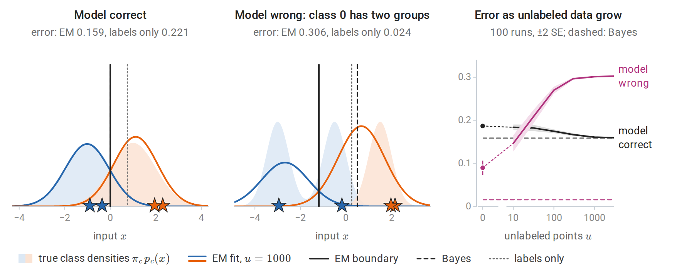
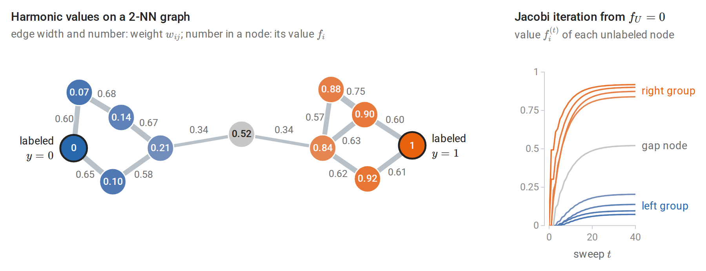
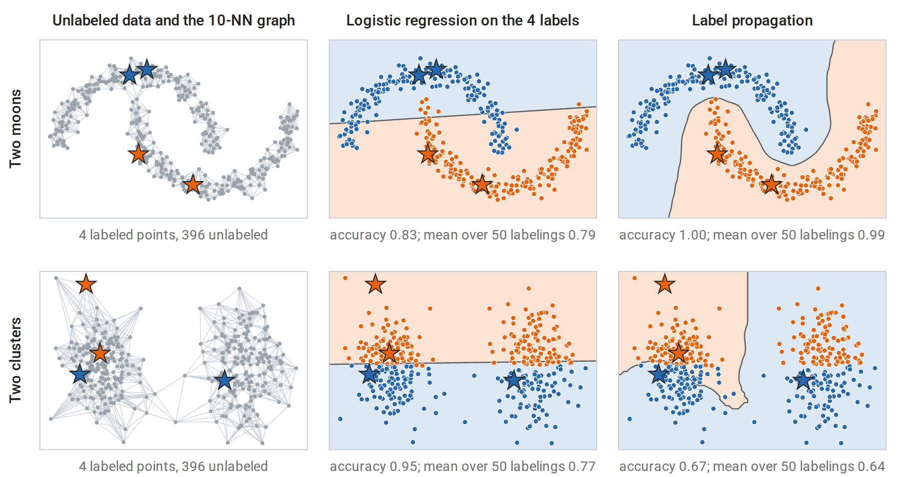
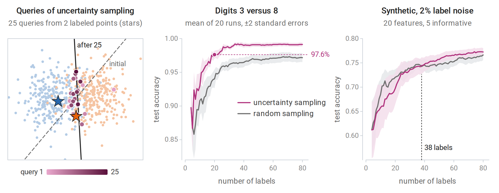
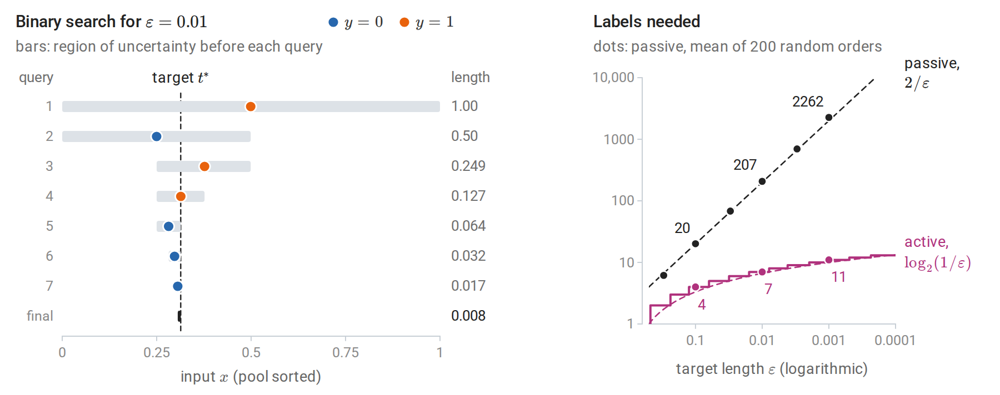

[ML Mastery Notes](../README.md) › [Machine Learning](README.md)

# 16. Semi-Supervised and Active Learning

[← 15. Gaussian Processes](15-gaussian-processes.md) · [17. Smoothing, Density Estimation, and Basis Expansions →](17-smoothing-density-estimation-and-basis-expansions.md)

## <a id="learning-when-labels-are-scarce"></a>Learning when labels are scarce

This optional chapter considers a common practical situation: inputs are cheap and plentiful, but labels are expensive because they require an expert, an experiment, or time. Two strategies then go beyond ordinary supervised learning on the few labeled examples. **Semi-supervised learning** also uses the unlabeled inputs, in the hope that their distribution reveals something about the labels. **Active learning** lets the learner choose which inputs to have labeled, in the hope of reaching a given accuracy with fewer labels. Both can help substantially, and both can fail, for reasons that the supervised theory of earlier chapters makes precise.

Write $`L=\{(x_i,y_i)\}_{i=1}^\ell`$ for the labeled examples and $`U=\{x_j\}_{j=\ell+1}^{\ell+u}`$ for the unlabeled inputs, usually with $`u\gg\ell`$. Used as subscripts, the same letters denote the two sets of indices, $`\{1,\ldots,\ell\}`$ and $`\{\ell+1,\ldots,\ell+u\}`$: $`f_L`$ is the part of a vector $`f`$ that belongs to the labeled examples, and $`W_{UL}`$ is the block of a matrix $`W`$ with unlabeled rows and labeled columns. Logarithms are natural unless a base is shown.

## <a id="semi-supervised-learning"></a>Semi-supervised learning

### <a id="when-can-unlabeled-data-help"></a>When can unlabeled data help?

Unlabeled data carry information about the input distribution $`p(x)`$. The quantity to be learned is $`p(y\mid x)`$, or a decision rule derived from it, such as the Bayes classifier of chapter 1, which thresholds $`\eta(x)=P(Y=1\mid X=x)`$ at one half. Unlabeled data can therefore help only when $`p(x)`$ and $`p(y\mid x)`$ are linked. If they are not, for example when the labels are an arbitrary function of the inputs, unlabeled inputs say nothing about the labels, however many there are. Every semi-supervised method rests on an assumption that links the two:

- **Cluster assumption:** points in the same cluster tend to share a label, so decision boundaries should pass through regions of low density.
- **Manifold assumption:** the inputs lie near a low-dimensional manifold, and the label varies smoothly along it. Nearest-neighbor graphs approximate distances along such a manifold, as in Isomap (chapter 12).
- **Generative assumption:** the data come from a known family of class-conditional distributions, such as a Gaussian mixture with one component per class.

These assumptions are about the world, not about the algorithm: whether they hold depends on how the data were generated, and unlabeled data alone cannot confirm them. [Schölkopf and colleagues (2012)](https://arxiv.org/abs/1206.6471) argued that the direction of causation matters. When the inputs cause the label, $`p(x)`$ and $`p(y\mid x)`$ are independent mechanisms, and unlabeled data should not help. When the label causes the inputs, as when a digit class produces an image, the two are linked, and unlabeled data can help. When the assumption fails, a semi-supervised method can perform worse than the supervised one trained on the labeled examples alone. The figures below show this for a generative model and for a graph method.

### <a id="generative-models-and-em"></a>Generative models and EM

If the classes are modeled generatively, as in chapter 4, unlabeled data enter the likelihood naturally. A labeled example contributes its joint density $`p(x_i,y_i\mid\theta)`$. An unlabeled input contributes its marginal density, the mixture $`p(x_j\mid\theta)=\sum_cp(x_j,c\mid\theta)`$ over the classes $`c`$ it might belong to. The log-likelihood of all the data is therefore

```math
\log p(L,U\mid\theta)=\sum_{i=1}^{\ell}\log p(x_i,y_i\mid\theta)+\sum_{j=\ell+1}^{\ell+u}\log\sum_cp(x_j,c\mid\theta).
```

The first sum alone would be maximized class by class, in closed form (chapter 4). The second sum is the log-likelihood of a mixture model whose latent variable is the class, which couples the classes, and the EM algorithm of chapter 14 carries over to the combined likelihood with one change. The E-step computes responsibilities $`r_{jc}=P(y_j=c\mid x_j,\theta)`$ for the unlabeled points only, while each labeled point keeps responsibility one for its known class. The M-step then fits the class models to all the points, counting each unlabeled point fractionally in every class according to its responsibilities. No iteration decreases the likelihood, and under regularity conditions the iterates converge to a stationary point that need not be the global maximum (chapter 14). [Nigam, McCallum, Thrun, and Mitchell (2000)](https://link.springer.com/article/10.1023/A:1007692713085) used this approach with naive Bayes to classify text and reduced classification error substantially when labeled documents were scarce.

The danger is misspecification. The likelihood has $`\ell`$ labeled terms and $`u`$ unlabeled ones, so with many unlabeled points the fit is dominated by the unlabeled likelihood, which rewards describing the density $`p(x)`$ well whatever the labels say. Maximum likelihood under a wrong model targets the member of the family closest to the true distribution (Probability and Statistics), and here closeness is judged almost entirely on the inputs: if the class-conditional model is wrong, EM bends the classes to fit the density rather than the labels. Nigam and colleagues proposed two remedies: weighting the unlabeled term of the likelihood by a factor between zero and one, and modeling each class by several mixture components. The figure below fits one Gaussian per class with a shared variance. When the model is correct, unlabeled points move the boundary to the Bayes boundary. When one class consists of two separated groups, the average error rises from 0.090 with the four labels alone to 0.303 with 3000 unlabeled points.



*Semi-supervised EM for one Gaussian per class with a shared variance, from two labeled points per class (stars). Left: when the model is correct, the EM boundary falls on the Bayes boundary at 0, while the four labels alone place it at 0.75. Middle: class 0 consists of groups at −3 and −0.5, and the fitted class-1 density stretches over the middle and right groups; the EM boundary moves to −1.19, so most of the middle group, which holds a third of the data, is assigned to class 1. Right: as unlabeled points are added, the average error approaches the Bayes error when the model is correct and climbs far above the error of the labels alone when it is wrong.*

### <a id="self-training-and-co-training"></a>Self-training and co-training

**Self-training** is the simplest wrapper around any classifier. Train on the labeled data, predict the unlabeled data, add the most confident predictions to the training set as if they were labels (**pseudo-labels**), and repeat. It works when confident predictions are usually correct. Its weakness is confirmation bias: an early mistake is added as a label, and the classifier retrained on it is then more confident in the mistake. With a probabilistic classifier, self-training resembles a hard version of the EM algorithm above, in which each unlabeled point is assigned entirely to its most probable class, and only when that class is probable enough. scikit-learn's [`SelfTrainingClassifier`](https://scikit-learn.org/stable/modules/generated/sklearn.semi_supervised.SelfTrainingClassifier.html) implements it with a confidence threshold.

**Co-training** ([Blum and Mitchell, 1998](https://dl.acm.org/doi/10.1145/279943.279962)) applies when each input has two **views**, each sufficient to predict the label, such as the text of a web page and the text of the links pointing to it. A classifier is trained on each view, and each labels confident unlabeled examples for the other. Suppose the two views are conditionally independent given the label. Then, among the examples of a given class, those that the first classifier gets wrong form a random subset as far as the second view is concerned, so its errors look like random label noise to the second classifier. Blum and Mitchell proved that, under this condition, a weakly useful initial classifier can be boosted to high accuracy from unlabeled data alone, provided the class of classifiers can be learned from labels corrupted by random noise.

### <a id="graph-based-methods"></a>Graph-based methods

Graph methods encode the cluster and manifold assumptions directly. Build a similarity graph on all $`\ell+u`$ inputs, for example by connecting each point to its $`k`$ nearest neighbors and symmetrizing, with weights $`w_{ij}=\exp\bigl(-\|x_i-x_j\|^2/2\sigma^2\bigr)`$ on the edges and $`w_{ij}=0`$ between points that are not connected. The bandwidth $`\sigma`$ sets the distance over which similarity decays; the code below takes the median edge length. Labels should vary little between strongly connected points. The **harmonic function** method ([Zhu, Ghahramani, and Lafferty, 2003](https://dl.acm.org/doi/10.5555/3041838.3041953)) finds real values $`f_i`$ on all nodes that minimize

```math
E(f)=\frac12\sum_{i,j}w_{ij}(f_i-f_j)^2=f^\top(D-W)f,
```

subject to $`f_i=y_i`$ on the labeled nodes. Here $`W`$ is the symmetric matrix of weights, $`D`$ is the diagonal matrix of **degrees** $`d_i=\sum_jw_{ij}`$, and $`\Delta=D-W`$ is the **graph Laplacian**. It is often written $`L`$, a letter reserved here for the labeled set, and spectral clustering uses its eigenvectors (chapter 13). The energy $`E(f)`$ is a quadratic form in $`f`$ that is never negative, so $`\Delta`$ is positive semidefinite (Linear Algebra).

Setting the gradient with respect to the unlabeled values to zero gives a linear system ([Appendix A](#block-ssl-appendix-a)):

```math
f_U=(D_{UU}-W_{UU})^{-1}W_{UL}\,f_L .
```

The solution is **harmonic**: every unlabeled value is the weighted average of its neighbors' values,

```math
f_i=\frac1{d_i}\sum_jw_{ij}f_j\qquad\text{for every unlabeled node }i.
```

With labels coded 0 and 1, $`f_i`$ is the probability that a random walk on the graph, started at node $`i`$ and moving to a neighbor chosen with probability proportional to the edge weight, reaches a node labeled 1 before a node labeled 0. Labels therefore flow along dense regions of the graph and stop at sparse gaps. The harmonic equations also give a way to compute $`f`$ without solving the system directly: start from any values on the unlabeled nodes and repeatedly replace each by the weighted average of its neighbors' values, holding the labeled values fixed. This is the Jacobi method for the linear system, and it converges to the harmonic solution whenever every connected component of the graph contains a labeled node ([Appendix A](#block-ssl-appendix-a)). The small example below shows both the averaging property and the iteration.



*Eleven points in two groups, joined through one node in the gap, with one labeled node in each group. Each unlabeled value is the weighted average of its neighbors' values; for the node with value 0.21, $`(0.67\cdot0.14+0.58\cdot0.10+0.34\cdot0.52)/(0.67+0.58+0.34)=0.21`$. The values change little along the strong edges within each group and jump across the two weak edges of the gap. Right: repeated averaging from zero, with the labeled nodes held fixed, spreads the label 1 outward from its node and converges to the harmonic values; after 40 sweeps the largest error is 0.002.*

For several classes, one-hot label vectors are propagated and each point takes the class with the largest value. scikit-learn's [`LabelPropagation` and `LabelSpreading`](https://scikit-learn.org/stable/modules/semi_supervised.html) implement this idea and a regularized variant.

The harmonic solution is **transductive**: it assigns values to the given unlabeled points rather than producing a rule for new inputs. A new input can be joined to the graph as one more node. Holding the other values fixed, its harmonic value is the weighted average of the values at its neighbors, and this is how the shaded regions of the next figure extend the solution to the whole plane.



*Stars mark the two labeled points of each class, dots show the true classes, and shading shows the predicted class; accuracies are over all 400 points. Top: on two interleaved half-moons, logistic regression fitted to the four labels cuts across both moons, while label propagation on the 10-nearest-neighbor graph follows the moons and classifies every point correctly. Bottom: two clusters, each split between the classes by the horizontal axis. The cluster assumption is false here: label propagation spreads the only label in the right cluster across the whole cluster and does worse than logistic regression, on this labeling and on average over 50 random labelings.*

The computation below applies label propagation to handwritten digits with two labeled images per class, and checks that repeatedly averaging neighbors while holding the labeled points fixed converges to the harmonic solution.

```python
import numpy as np
from sklearn.datasets import load_digits
from sklearn.linear_model import LogisticRegression
from sklearn.neighbors import NearestNeighbors

X, y = load_digits(return_X_y=True)
X = X / 16.0
n, K = len(y), 10
rng = np.random.default_rng(0)
labeled = np.concatenate([rng.choice(np.where(y == c)[0], 2, replace=False) for c in range(K)])  # 20 labels
unlabeled = np.setdiff1d(np.arange(n), labeled)

# Similarity graph: symmetrized 10-nearest-neighbor graph with Gaussian weights.
# (A k-d tree computes distances exactly, so tied neighbors are resolved the same way on every machine.)
G = NearestNeighbors(n_neighbors=10, algorithm="kd_tree").fit(X).kneighbors_graph(mode="distance")
G = G.maximum(G.T).toarray()
sigma = np.median(G[G > 0])
W = np.where(G > 0, np.exp(-G ** 2 / (2 * sigma ** 2)), 0.0)
D = W.sum(1)

# Harmonic solution: f_U = (D_UU - W_UU)^{-1} W_UL Y_L, one column per class.
Y_L = np.eye(K)[y[labeled]]
L_UU = np.diag(D[unlabeled]) - W[np.ix_(unlabeled, unlabeled)]
F_U = np.linalg.solve(L_UU, W[np.ix_(unlabeled, labeled)] @ Y_L)

# The same solution by iteration: every unlabeled point repeatedly takes the weighted average of its neighbors.
F = np.zeros((n, K))
F[labeled] = Y_L
for _ in range(2000):
    F = (W @ F) / D[:, None]
    F[labeled] = Y_L                                     # clamp the labeled points
print("iterative propagation reaches the harmonic solution:", np.allclose(F[unlabeled], F_U, atol=1e-6))

acc_graph = np.mean(F_U.argmax(1) == y[unlabeled])
acc_sup = LogisticRegression(max_iter=5000).fit(X[labeled], y[labeled]).score(X[unlabeled], y[unlabeled])
print(f"accuracy on the {len(unlabeled)} unlabeled digits with 20 labels: "
      f"logistic regression {acc_sup:.3f}, label propagation {acc_graph:.3f}")
# iterative propagation reaches the harmonic solution: True
# accuracy on the 1777 unlabeled digits with 20 labels: logistic regression 0.804, label propagation 0.915
```

Images of the same digit form well-connected regions of the neighbor graph, so the cluster assumption holds reasonably well, and propagation adds eleven points of accuracy, from 0.804 to 0.915. The code stores $`W`$ as a dense $`n\times n`$ array, which is harmless for 1797 images. For large $`n`$, $`W`$ is stored as a sparse matrix, since a $`k`$-nearest-neighbor graph gives it at most $`2kn`$ nonzero entries, and the system is solved by iterations that need only products with $`W`$ (Linear Algebra).

The **transductive SVM** pursues the same low-density idea in a margin framework: it chooses labels for the unlabeled points so that the SVM of chapter 8 has a large margin on labeled and unlabeled points together, which pushes the boundary away from dense regions.

### <a id="evaluating-semi-supervised-methods"></a>Evaluating semi-supervised methods

Claims of improvement from unlabeled data need careful baselines. [Oliver, Odena, Raffel, Cubuk, and Goodfellow (2018)](https://proceedings.neurips.cc/paper/2018/hash/c1fea270c48e8079d8ddf7d06d26ab52-Abstract.html) found that many reported gains shrank when the supervised baseline was tuned as carefully as the semi-supervised method. They also found that gains could turn into losses when the unlabeled data contained classes absent from the labeled data, and that validation sets larger than the labeled training set made reported tuning unrealistic, since a practitioner with that many labels would train on them. A fair comparison uses the same labeled set, the same budget for hyperparameter tuning (chapter 6), a validation set of realistic size, and unlabeled data from the intended distribution. Modern semi-supervised methods for deep networks, based on consistency of predictions under data augmentation, belong to the DL module. [Zhu's survey](https://pages.cs.wisc.edu/~jerryzhu/pub/SSL_EoML.pdf) from the reading plan and [Chapelle, Schölkopf, and Zien's edited volume](https://mitpress.mit.edu/9780262514125/semi-supervised-learning/) cover the classical methods.

## <a id="active-learning"></a>Active learning

### <a id="choosing-which-labels-to-buy"></a>Choosing which labels to buy

In **pool-based active learning**, the learner has a pool of unlabeled inputs and a budget of label queries. It repeatedly fits a model to the labels collected so far, chooses an input from the pool, and receives its label. Like Bayesian optimization in chapter 15, it lets the learner choose its own data, here to learn an accurate predictor rather than to find a minimum. The query strategy is the heart of the method ([Settles's survey](https://burrsettles.com/pub/settles.activelearning.pdf)):

- **Uncertainty sampling** ([Lewis and Gale, 1994](https://link.springer.com/chapter/10.1007/978-1-4471-2099-5_1)) queries the input whose prediction is least certain: the predicted probability $`\hat\eta(x)`$ of class 1 closest to one half, the smallest gap between the two most probable classes, or the largest predictive entropy $`-\sum_c\hat p(c\mid x)\log\hat p(c\mid x)`$, where $`\hat p(c\mid x)`$ is the predicted probability of class $`c`$. With two classes the three criteria choose the same input, because each is a monotone function of $`\lvert\hat\eta(x)-1/2\rvert`$.
- **Query by committee** trains several models consistent with the labels, for example on bootstrap samples, and queries the input on which they disagree most. For separable data this shrinks the **version space**, the set of hypotheses consistent with the labels (chapter 7), quickly.
- **Expected error reduction** queries the input whose label, averaged over its possible values, would most reduce the expected error on the pool. It is principled but requires refitting the model for every candidate.
- **Density weighting** multiplies an uncertainty score by how representative an input is of the pool, to avoid spending queries on outliers.



*Left: queries chosen by uncertainty sampling for logistic regression on two overlapping classes, starting from one labeled point per class; later queries are darker. The queries concentrate near the current boundary, which turns from the dashed line fitted to the two initial labels to the solid line. Middle: on digits 3 versus 8, uncertainty sampling reaches 97.6% test accuracy with 20 labels (dot), a level random sampling does not reach with 80. Right: on synthetic data with 2% label noise, uncertainty sampling falls behind random sampling, by up to 4.2 points at 12 labels, and draws level for good only at 38 labels. Both panels average 20 runs.*

### <a id="why-active-learning-can-save-labels"></a>Why active learning can save labels

In the most favorable case the savings are exponential. Consider thresholds on the line, $`h_t(x)=\mathbf 1\{x\ge t\}`$, with a noise-free target $`y=h_{t^\ast}(x)`$ (the threshold `t_true` of the code below) and inputs spread uniformly over $`[0,1]`$. A passive learner receives random labels and must wait until labeled points fall close to the threshold on both sides. This takes on the order of $`1/\varepsilon`$ labels to reach error $`\varepsilon`$, the realizable rate of the PAC analysis in chapter 7 and Information and Learning Theory; on average it takes exactly $`2/\varepsilon`$. An active learner can sort the pool and run binary search, querying the middle of the interval that still contains the threshold, and reaches the same accuracy with about $`\log_2(1/\varepsilon)`$ labels ([Appendix B](#block-ssl-appendix-b)).

```python
import numpy as np

rng = np.random.default_rng(0)
pool = np.sort(rng.uniform(size=100_000))             # unlabeled pool on [0, 1]
t_true = 0.3137                                       # labels: y = 1{x >= t_true}
label = lambda i: int(pool[i] >= t_true)

def passive(eps, reps=200):
    """Labels drawn at random until the gap around the threshold has probability <= eps."""
    counts = []
    for r in range(reps):
        order = np.random.default_rng(r).permutation(len(pool))
        lo, hi = 0.0, 1.0
        for m, i in enumerate(order, 1):
            if label(i):
                hi = min(hi, pool[i])
            else:
                lo = max(lo, pool[i])
            if hi - lo <= eps:
                counts.append(m)
                break
    return np.mean(counts)

def active(eps):
    """Binary search on the sorted pool: query the midpoint of the region of uncertainty."""
    lo, hi, queries = 0, len(pool) - 1, 0
    while pool[hi] - pool[lo] > eps:
        mid = (lo + hi) // 2
        queries += 1
        if label(mid):
            hi = mid
        else:
            lo = mid
    return queries

for eps in [0.1, 0.01, 0.001]:
    print(f"error {eps:<5}: passive about {passive(eps):6.0f} labels, active {active(eps):2d} labels")
# error 0.1  : passive about     20 labels, active  4 labels
# error 0.01 : passive about    207 labels, active  7 labels
# error 0.001: passive about   2262 labels, active 11 labels
```

The "error" here is the width of the interval that still contains the threshold, which bounds the error of any threshold consistent with the labels under the uniform distribution. Each query of the binary search halves the number of pool points in this interval, and the next figure follows the search for $`\varepsilon=0.01`$.



*Left: binary search on the sorted pool of the code for $`\varepsilon=0.01`$; each query roughly halves the region that still contains the threshold. Right: labels needed against $`\varepsilon`$, on logarithmic axes. The passive averages follow the exact expectation $`2/\varepsilon`$, while binary search needs about $`\log_2(1/\varepsilon)`$ queries.*

For richer hypothesis classes, the achievable savings depend on how quickly the **region of disagreement**, the set of inputs on which some hypotheses consistent with the labels disagree, shrinks as labels arrive. A quantity called the **disagreement coefficient** measures this rate. With label noise the savings are smaller, and in the worst case only a constant factor can be gained.

### <a id="sampling-bias"></a>Sampling bias

An actively chosen training set is not a random sample: it is chosen by the current model, in regions the model considers uncertain. That is the source of its efficiency and also of its main failure. If the initial model is wrong about where the boundary lies, uncertainty sampling concentrates its queries near the wrong boundary and may never sample the regions that would reveal the mistake. [Dasgupta (2011)](https://www.sciencedirect.com/science/article/pii/S0304397510007620) gives simple distributions on which uncertainty sampling converges to a classifier with high error while random sampling would not. The right panel of the uncertainty-sampling figure above shows a milder version: early queries placed near a poorly estimated boundary teach the model less than random ones, and label noise, which misleads the early fits, makes this worse. On data from the same generator without label noise, uncertainty sampling falls behind by at most 1.5 points and is level from 27 labels on.

Three practices reduce the risk. Mixing a fraction of random queries into the active ones ensures that every region is eventually sampled. Weighting each queried example by the inverse of its probability of being queried makes the labeled set an unbiased sample for estimating risk, the idea of importance-weighted active learning ([Beygelzimer, Dasgupta, and Langford, 2009](https://arxiv.org/abs/0812.4952)). Suppose inputs $`x_1,\ldots,x_n`$ arrive independently from the target distribution, input $`x_t`$ is queried with a probability $`p_t>0`$ that may depend on the labels seen so far, and $`Q_t`$ is 1 if it is queried and 0 otherwise. The estimate

```math
\widehat R_{\mathrm{IW}}(h)=\frac1n\sum_{t=1}^n\frac{Q_t}{p_t}\,\mathbf 1\{h(x_t)\ne y_t\}
```

needs a label only when $`Q_t=1`$. Given the past and $`x_t`$, the factor $`Q_t/p_t`$ has expectation one, so each term has the same expectation as the unweighted error indicator, and $`\widehat R_{\mathrm{IW}}(h)`$ is an unbiased estimate of the error rate $`R(h)`$. This is the importance sampling of Probability and Statistics, and as there, probabilities $`p_t`$ close to zero produce large weights and a highly variable estimate, so they are kept bounded below. Finally, the performance of an actively trained model must be measured on a separate test set drawn at random from the target distribution, never on the actively labeled examples, which are deliberately unrepresentative. Actively collected labels also depend on the model used to choose them: a dataset chosen by uncertainty sampling for logistic regression is not necessarily a good training set for a random forest.

### <a id="active-and-semi-supervised-learning-together"></a>Active and semi-supervised learning together

The two approaches are complementary: active learning decides which points to label, and semi-supervised learning exploits the rest. With a graph-based model, for example, the harmonic solution gives predictive values at every unlabeled node, and queries can target nodes whose labels would most change the solution. The harmonic solution is also the conditional mean of a Gaussian random field on the graph given the labeled values, and the conditional covariance of that field measures how uncertain each unlabeled value is, much as the posterior variance of a Gaussian process does in chapter 15 ([Appendix A](#block-ssl-appendix-a)). In both settings, the gains come from assumptions about how the unlabeled inputs relate to the labels, and both should be judged against a well-tuned supervised baseline with the same label budget.

## <a id="appendices"></a>Appendices


<details>
<summary><a id="block-ssl-appendix-a"></a><b>A. The harmonic solution</b></summary>


**Derivation.** Write $`f=(f_L,f_U)`$ and partition the Laplacian $`\Delta=D-W`$ into blocks. The energy

```math
E(f)=\frac12\sum_{i,j}w_{ij}(f_i-f_j)^2=\sum_id_if_i^2-\sum_{i,j}w_{ij}f_if_j=f^\top\Delta f
```

is a convex quadratic; the middle expression follows by expanding the square and using the symmetry $`w_{ij}=w_{ji}`$. In blocks, $`E(f)=f_U^\top\Delta_{UU}f_U+2f_U^\top\Delta_{UL}f_L+f_L^\top\Delta_{LL}f_L`$. With $`f_L`$ fixed, its gradient with respect to $`f_U`$ is $`2(\Delta_{UU}f_U+\Delta_{UL}f_L)`$, by the rule $`\nabla_x(x^\top Ax)=(A+A^\top)x`$ of Linear Algebra. Since $`\Delta_{UL}=-W_{UL}`$ and $`\Delta_{UU}=D_{UU}-W_{UU}`$, setting it to zero gives $`(D_{UU}-W_{UU})f_U=W_{UL}f_L`$. Because the energy is convex, this stationary point is the minimizer (Calculus and Optimization). Row $`i`$ of this equation reads $`d_if_i=\sum_jw_{ij}f_j`$: each unlabeled value is the weighted average of its neighbors.

**Existence.** The matrix $`D_{UU}-W_{UU}`$ is invertible when every connected component of the graph contains at least one labeled node. It is then positive definite: $`x^\top(D_{UU}-W_{UU})x`$ equals the energy of the vector that is $`x`$ on $`U`$ and zero on $`L`$, which vanishes only if that vector is constant on each component, hence zero.

**Random walks.** Let a walk move from node $`i`$ to node $`j`$ with probability $`w_{ij}/d_i`$ and stop at the first labeled node. For binary labels coded 0 and 1, let $`h_i`$ be the probability that the walk from $`i`$ stops at a node labeled 1. Conditioning on the first step (the first-step analysis of Markov chains) gives $`h_i=\sum_j(w_{ij}/d_i)h_j`$ for unlabeled $`i`$, with $`h`$ equal to the labels on $`L`$. These are the harmonic equations, whose solution is unique, so $`h=f`$.

**Iteration.** The update $`f_U\leftarrow D_{UU}^{-1}(W_{UU}f_U+W_{UL}f_L)`$, used in the code, is the Jacobi method for this linear system. Its error after $`t`$ sweeps is $`(D_{UU}^{-1}W_{UU})^t`$ times the initial error, and entry $`(i,j)`$ of $`(D_{UU}^{-1}W_{UU})^t`$ is the probability that the walk from $`i`$ is at $`j`$ after $`t`$ steps without having reached a labeled node. Under the same connectivity condition, the walk restricted to unlabeled nodes is absorbed eventually, so the spectral radius of $`D_{UU}^{-1}W_{UU}`$ is below one and the iteration converges to the harmonic solution from any start. Started from $`f_U=0`$, the value at node $`i`$ after $`t`$ sweeps is the probability that the walk from $`i`$ stops at a node labeled 1 within $`t`$ steps, which is why the iterates in the small example rise monotonically. There the spectral radius is 0.86, so each sweep shrinks the error by about 14%.

**Gaussian fields.** Give $`f`$ the improper Gaussian density proportional to $`\exp\bigl(-\tfrac12f^\top\Delta f\bigr)`$, which favors values that vary little along strong edges. As a function of $`f_U`$ with $`f_L`$ fixed, the exponent is $`-\tfrac12f_U^\top\Delta_{UU}f_U-f_U^\top\Delta_{UL}f_L`$ plus a constant. Completing the square shows that, given $`f_L`$, the vector $`f_U`$ is Gaussian with mean $`-\Delta_{UU}^{-1}\Delta_{UL}f_L=(D_{UU}-W_{UU})^{-1}W_{UL}f_L`$, the harmonic solution, and covariance $`\Delta_{UU}^{-1}`$. This is the view of Zhu, Ghahramani, and Lafferty, whose paper is titled *Semi-supervised learning using Gaussian fields and harmonic functions*.

</details>


<details>
<summary><a id="block-ssl-appendix-b"></a><b>B. Label complexity of thresholds</b></summary>


Let inputs be uniform on $`[0,1]`$, labels $`y=\mathbf 1\{x\ge t^\ast\}`$, and call the **region of uncertainty** the interval between the largest input labeled 0 and the smallest input labeled 1. Every threshold inside it is consistent with the labels, and its error is at most the interval's length.

**Passive learning.** After $`m`$ random labels, the region of uncertainty is longer than $`\varepsilon`$ only if no sample fell in $`[t^\ast-\varepsilon/2,t^\ast)`$ or none fell in $`[t^\ast,t^\ast+\varepsilon/2)`$ (when these intervals lie inside $`[0,1]`$). Each event has probability $`(1-\varepsilon/2)^m\le e^{-m\varepsilon/2}`$, the bound used for realizable PAC learning in Information and Learning Theory, so $`m\ge(2/\varepsilon)\log(2/\delta)`$ labels suffice for length at most $`\varepsilon`$ with probability $`1-\delta`$. Conversely, the expected distance from $`t^\ast`$ to the nearest sample on each side is about $`1/(m+1)`$, so on the order of $`1/\varepsilon`$ labels are also necessary.

**The expected number of passive labels.** Suppose $`\varepsilon<\min(t^\ast,1-t^\ast)`$, and let $`G_m`$ be the length of the region of uncertainty after $`m`$ labels. A region of length $`s\le\varepsilon`$ cannot reach 0 or 1, so both of its endpoints are inputs. Choosing the two endpoint inputs in $`m(m-1)`$ ordered ways, placing the left endpoint anywhere in the interval of length $`s`$ that keeps $`t^\ast`$ inside the region, and keeping the other $`m-2`$ inputs outside it gives $`G_m`$ the density $`m(m-1)s(1-s)^{m-2}`$ on $`[0,\varepsilon]`$. Integrating,

```math
P(G_m>\varepsilon)=1-\int_0^\varepsilon m(m-1)s(1-s)^{m-2}\,ds=(1-\varepsilon)^m+m\varepsilon(1-\varepsilon)^{m-1},
```

as differentiating the right side confirms. The region only shrinks as labels arrive, so the number $`M`$ of labels needed exceeds $`m`$ exactly when $`G_m>\varepsilon`$, and

```math
\mathbb E M=\sum_{m\ge0}P(G_m>\varepsilon)=\sum_{m\ge0}(1-\varepsilon)^m+\varepsilon\sum_{m\ge1}m(1-\varepsilon)^{m-1}=\frac1\varepsilon+\frac1\varepsilon=\frac2\varepsilon .
```

For the three levels of the code this is 20, 200, and 2000. The simulated averages, 20, 207, and 2262, are close to these values: with 200 runs their standard errors are about 1, 11, and 113, and 10,000 runs at $`\varepsilon=0.01`$ average 200.9. The code draws from a finite pool without replacement, which makes no noticeable difference with 100,000 pool points.

**Active learning.** Given a sorted pool, querying the median of the pool points inside the region of uncertainty halves the number of pool points in it. After $`q`$ queries about a fraction $`2^{-q}`$ of the pool remains, and for a large uniform pool its length is about $`2^{-q}`$. Hence $`q\approx\log_2(1/\varepsilon)`$ queries suffice, an exponential improvement. The argument uses the absence of label noise: a single wrong label sends binary search into the wrong half for good, which is why noisy settings need more cautious algorithms.

</details>

---

[← 15. Gaussian Processes](15-gaussian-processes.md) · [17. Smoothing, Density Estimation, and Basis Expansions →](17-smoothing-density-estimation-and-basis-expansions.md)
