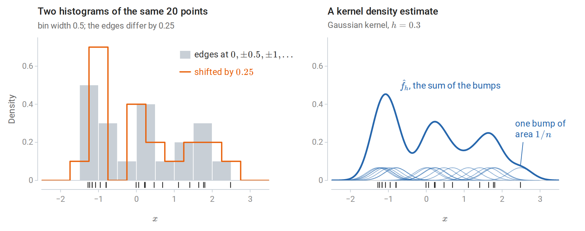
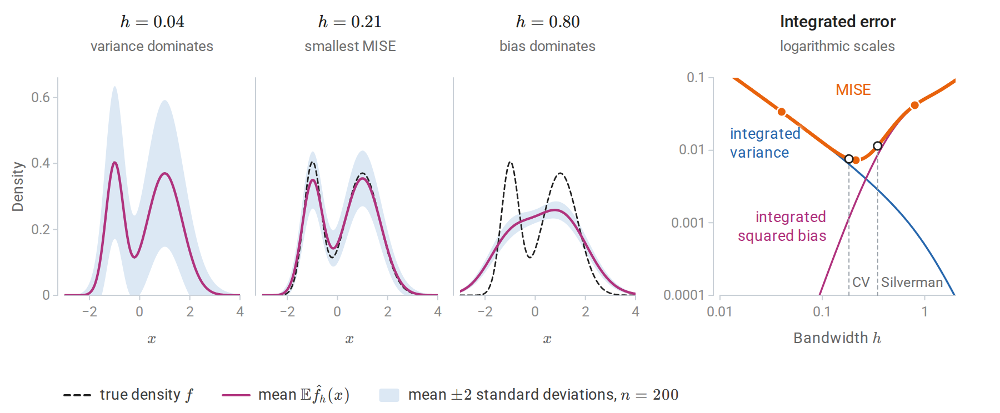
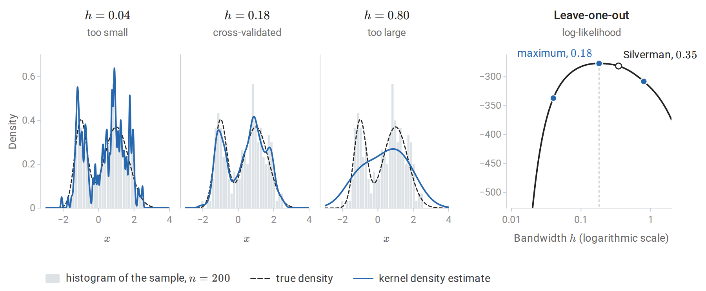
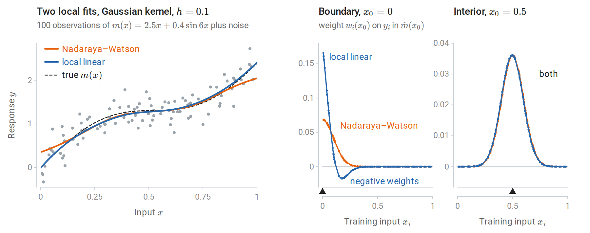
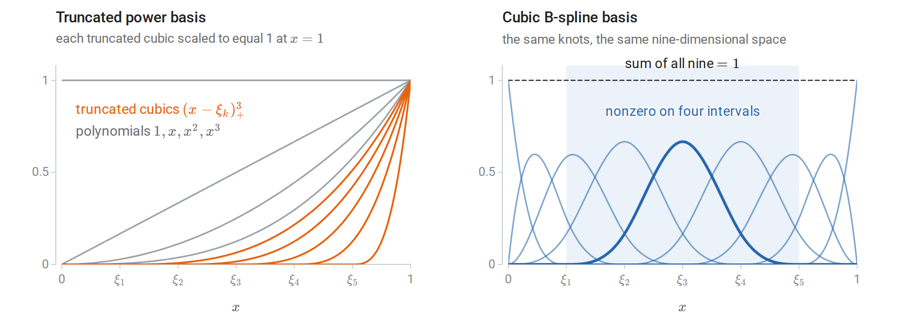
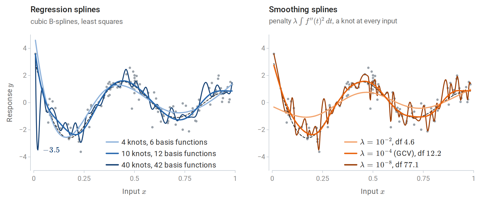
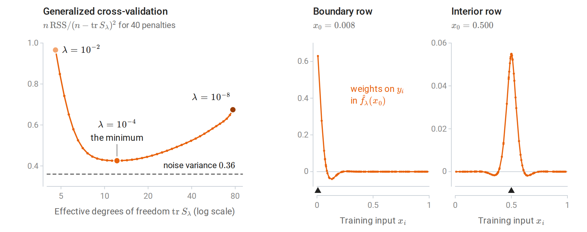
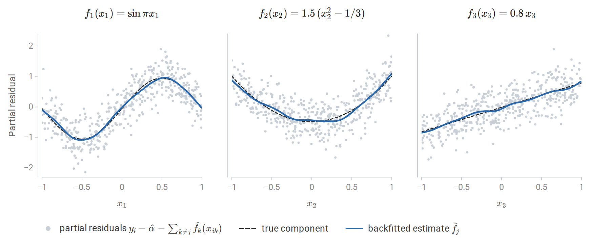
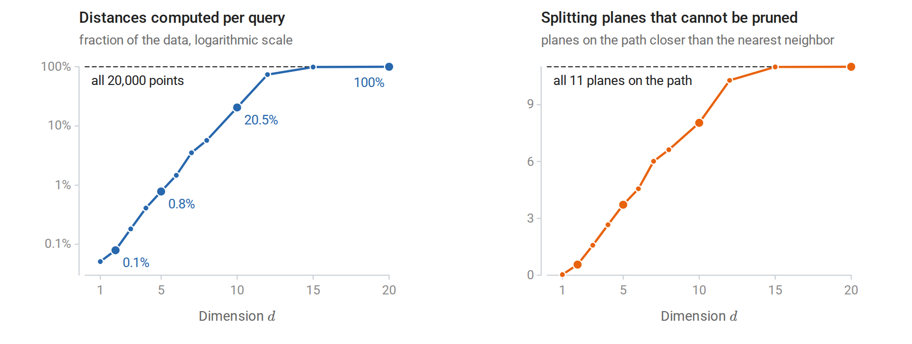

[ML Mastery Notes](../README.md) › [Machine Learning](README.md)

# 17. Smoothing, Density Estimation, and Basis Expansions

[← 16. Semi-Supervised and Active Learning](16-semi-supervised-and-active-learning.md)

## <a id="kernel-density-estimation"></a>Kernel density estimation

This optional chapter collects classical nonparametric methods that the core chapters point to: estimating a density, smoothing a regression locally, representing a function with splines and additive models, and finding nearest neighbors quickly. They share one idea with the nearest-neighbor methods of chapter 1: estimate at a point by pooling nearby observations, with a tuning parameter that sets how near "nearby" is. Density estimation as a task, with a kernel estimate of geyser waiting times as its example, is introduced in Terminology and Mathematical Language.

### <a id="from-histograms-to-kernels"></a>From histograms to kernels

Given observations $`x_1,\ldots,x_n`$ drawn independently from an unknown density $`f`$ on the real line, a histogram estimates $`f`$ by counting observations in fixed bins. With bins of width $`b`$, the estimate at $`x`$ is the number of observations in the bin that contains $`x`$, divided by $`nb`$, so that the bars have total area one. This estimate depends on where the bin edges fall and jumps at every edge. The left panel of the figure below shows how much the placement matters: on the same twenty observations, moving every edge by half a bin width changes the shape of the estimate, not only its details.

The **kernel density estimator** centers a smooth bump at every observation instead:

```math
\hat f_h(x)=\frac1{nh}\sum_{i=1}^nK\Bigl(\frac{x-x_i}h\Bigr),
```

where the **kernel** $`K`$ is a symmetric probability density, such as the standard normal or the Epanechnikov kernel $`\frac34(1-u^2)_+`$, with $`t_+=\max\{t,0\}`$, and the **bandwidth** $`h>0`$ sets its width. The term for observation $`i`$ is a copy of $`K`$ stretched to width $`h`$, centered at $`x_i`$, and scaled to have area $`1/n`$. The estimate is itself a density: nonnegative and integrating to one. It is in fact the density of $`X^\ast+hZ`$, where $`X^\ast`$ is drawn from the empirical distribution of the sample and $`Z\sim K`$ is independent of it, because the density of a sum of independent variables is the convolution of their laws. The kernel estimate thus smooths the empirical distribution, which puts mass $`1/n`$ on each observation and has no density, into a distribution that has one.

The figures of this section share one running example: the two-component normal mixture $`0.35\,\mathcal N(-1,0.35^2)+0.65\,\mathcal N(1,0.7^2)`$ and the 200 draws from it made by the computation further below.



*The first 20 observations of the running sample. The two histograms disagree although the data are identical: the shifted one has a peak of 0.7 next to an empty bin, the other has neither. The kernel estimate has no edges to place, since every observation contributes the same bump and the estimate is their sum.*

The choice of kernel matters little; the choice of bandwidth matters a great deal. [Appendix A](#block-smooth-appendix-a) makes the first half precise: the kernel changes the asymptotic error only through a constant factor, and the Gaussian kernel needs only about 5% more observations than the optimal Epanechnikov kernel to reach the same error.

### <a id="bias-variance-and-the-bandwidth"></a>Bias, variance, and the bandwidth

The bandwidth trades bias against variance exactly as $`k`$ does for nearest neighbors (chapter 1). At a fixed $`x`$, the mean squared error of $`\hat f_h(x)`$ as an estimate of the number $`f(x)`$ is its squared bias plus its variance, the decomposition of Probability and Statistics. For a twice-differentiable density $`f`$, [Appendix A](#block-smooth-appendix-a) shows that

```math
\mathbb E\hat f_h(x)-f(x)\approx\frac{h^2}2\mu_2(K)f''(x),\qquad
\operatorname{Var}\hat f_h(x)\approx\frac{f(x)R(K)}{nh},
```

with $`\mu_2(K)=\int u^2K(u)\,du`$, the variance of the kernel, and $`R(K)=\int K(u)^2\,du`$, a measure of its roughness. The letter $`R`$ for this integral of a square is standard in density estimation; it has nothing to do with the risk $`R(f)`$ of chapter 1. The bias is proportional to the curvature $`f''(x)`$, so it is negative at peaks, where $`f''<0`$, and positive in valleys. A small bandwidth follows every observation and has high variance; a large one flattens peaks and valleys, where $`|f''|`$ is large.

Integrating the squared bias and the variance over $`x`$ gives the **mean integrated squared error** $`\operatorname{MISE}(h)=\int\mathbb E\bigl(\hat f_h(x)-f(x)\bigr)^2dx`$, approximately $`\tfrac14h^4\mu_2(K)^2R(f'')+R(K)/(nh)`$, where $`R(f'')=\int f''(x)^2\,dx`$ measures the total curvature of $`f`$. Minimizing gives the optimal bandwidth $`h^\ast\propto n^{-1/5}`$ and a mean integrated squared error of order $`n^{-4/5}`$. This is slower than the $`n^{-1}`$ rate of a correctly specified parametric model, the price of assuming only smoothness.

For the running mixture both terms can be computed exactly rather than approximately, because the kernel and the mixture components are normal: the mean of $`\hat f_h`$ is the same mixture with every component variance increased by $`h^2`$, and the variance is a similar sum of normal densities. The exact error is smallest at $`h=0.21`$; the asymptotic formula of Appendix A gives $`h^\ast=0.19`$.



*Exact bias and variance of the Gaussian-kernel estimator for the running mixture; no sampling is involved. With $`h=0.04`$ the mean of the estimator is almost the true density, but a single estimate varies widely around it. With $`h=0.80`$ the estimate hardly varies, but its mean merges the two modes. On the right, the integrated squared bias grows like $`h^4`$ and the integrated variance falls like $`1/(nh)`$ while $`h`$ is small. The cross-validated bandwidth of the next figure comes within 4% of the smallest error, whereas Silverman's rule gives an error 57% larger.*

### <a id="choosing-the-bandwidth"></a>Choosing the bandwidth

Three approaches are common.

- **Reference rules** evaluate the optimal bandwidth for a normal density ([Appendix A](#block-smooth-appendix-a)). With a Gaussian kernel this gives $`h\approx1.06\,\hat\sigma n^{-1/5}`$, where $`\hat\sigma`$ is the sample standard deviation, and **Silverman's rule** $`h=0.9\min(\hat\sigma,\widehat{\mathrm{IQR}}/1.34)\,n^{-1/5}`$ is a more robust version ([Silverman, 1986](https://www.routledge.com/Density-Estimation-for-Statistics-and-Data-Analysis/Silverman/p/book/9780412246203)). Here $`\widehat{\mathrm{IQR}}`$ is the interquartile range of the sample, which is about 1.34 standard deviations for normal data. Both oversmooth multimodal densities, whose curvature a normal reference with the same spread badly underestimates: for the running mixture $`R(f'')=5.6`$, about 45 times the value for a normal density with the sample's standard deviation.
- **Likelihood cross-validation** chooses $`h`$ to maximize the leave-one-out log-likelihood $`\sum_i\log\hat f_{h,-i}(x_i)`$, where $`\hat f_{h,-i}`$ omits observation $`i`$ and logarithms are natural. Without leaving out, the likelihood would increase without limit as $`h\to0`$, because the bump of observation $`i`$ alone contributes $`K(0)/(nh)`$ to the estimate at $`x_i`$.
- **Least-squares cross-validation** minimizes an unbiased estimate of the integrated squared error instead, up to a term that does not depend on $`h`$: the criterion $`\int\hat f_h^2-\frac2n\sum_i\hat f_{h,-i}(x_i)`$ has expectation $`\operatorname{MISE}(h)-\int f^2`$.



*Left: Gaussian kernel density estimates from the 200 draws of the running two-component mixture. A bandwidth of 0.04 produces spurious bumps; 0.80 merges the two modes; the cross-validated 0.18 is close to the true density. Right: the leave-one-out log-likelihood as a function of the bandwidth, with the three bandwidths of the left panels marked. Silverman's rule gives 0.35, about twice the cross-validated value, because the reference normal density is unimodal.*

The following computation implements the estimator and likelihood cross-validation, checks the estimator against scikit-learn's [`KernelDensity`](https://scikit-learn.org/stable/modules/generated/sklearn.neighbors.KernelDensity.html), and compares bandwidths by the log-likelihood of new data.

```python
import numpy as np
from scipy.stats import norm
from sklearn.neighbors import KernelDensity

rng = np.random.default_rng(0)
def sample(n):
    z = rng.uniform(size=n) < 0.35                        # a two-component mixture
    return np.where(z, rng.normal(-1.0, 0.35, n), rng.normal(1.0, 0.7, n))
x, x_test = sample(200), sample(5000)

def kde(points, data, h):
    return norm.pdf((points[:, None] - data[None, :]) / h).mean(1) / h

def loo_loglik(data, h):
    K = norm.pdf((data[:, None] - data[None, :]) / h) / h
    np.fill_diagonal(K, 0.0)                               # leave each point out of its own estimate
    return np.log(K.sum(1) / (len(data) - 1)).sum()

hs = np.logspace(-2, 0.3, 200)
h_cv = hs[np.argmax([loo_loglik(x, h) for h in hs])]
iqr = np.subtract(*np.percentile(x, [75, 25]))
h_silverman = 0.9 * min(x.std(ddof=1), iqr / 1.34) * len(x) ** (-1 / 5)

sk = KernelDensity(kernel="gaussian", bandwidth=h_cv).fit(x[:, None])
print("matches scikit-learn KernelDensity:", np.allclose(np.log(kde(x_test, x, h_cv)), sk.score_samples(x_test[:, None])))
test_ll = lambda dens: np.mean(np.log(dens))
print(f"held-out log-likelihood per point: cross-validated h = {h_cv:.2f}: {test_ll(kde(x_test, x, h_cv)):.3f}; "
      f"Silverman h = {h_silverman:.2f}: {test_ll(kde(x_test, x, h_silverman)):.3f}; "
      f"single Gaussian: {test_ll(norm.pdf(x_test, x.mean(), x.std())):.3f}")
# matches scikit-learn KernelDensity: True
# held-out log-likelihood per point: cross-validated h = 0.18: -1.406; Silverman h = 0.35: -1.415; single Gaussian: -1.543
```

The average log-likelihood of new observations estimates $`\int f\log\hat f`$, which equals minus the differential entropy of $`f`$ minus the Kullback–Leibler divergence $`D_{\mathrm{KL}}(f\Vert\hat f)`$ (Information and Learning Theory). The entropy term is the same for every estimate, so differences in held-out log-likelihood estimate differences in divergence from the true density: the estimate with Silverman's bandwidth is about 0.009 nats per observation farther from $`f`$ than the cross-validated one, and a single fitted Gaussian about 0.14 nats farther.

### <a id="higher-dimensions"></a>Higher dimensions

In $`d`$ dimensions, a product of one-dimensional kernels or a kernel with a bandwidth matrix gives the same construction, but the optimal error rate worsens to $`n^{-4/(4+d)}`$. This is the counterpart for densities of the rates in chapter 1: two derivatives give the exponent $`4/(4+d)`$ where a Lipschitz condition gave $`2/(2+d)`$, and both exponents tend to zero as $`d`$ grows. The curse of dimensionality of chapter 1 applies in full: most neighborhoods of a point are empty unless $`n`$ grows exponentially with $`d`$. Kernel density estimation is therefore used in one to a few dimensions: for visualization, for anomaly scores based on low density, for class-conditional densities combined by Bayes' rule as in chapter 4, and in the **mean-shift** clustering algorithm, which moves each point uphill on the estimated density until it reaches a mode. Each mean-shift step replaces a point $`x`$ by the kernel-weighted average $`\sum_iK\bigl((x-x_i)/h\bigr)x_i/\sum_iK\bigl((x-x_i)/h\bigr)`$ of the observations. With a Gaussian kernel, the step from $`x`$ to this average equals $`h^2\nabla\hat f_h(x)/\hat f_h(x)`$, a gradient-ascent step whose length adapts to the height of the density. The Gaussian mixtures of chapter 14 are a parametric alternative that scales better with dimension. The scikit-learn example [Simple 1D Kernel Density Estimation](https://scikit-learn.org/stable/auto_examples/neighbors/plot_kde_1d.html) from the reading plan compares kernels and bandwidths.

## <a id="local-regression"></a>Local regression

### <a id="local-averaging"></a>Local averaging

The **Nadaraya–Watson** estimator of the regression function $`m(x)=\mathbb E[Y\mid X=x]`$, introduced in chapter 1, averages the responses with kernel weights:

```math
\hat m(x_0)=\frac{\sum_iK_h(x_i-x_0)\,y_i}{\sum_iK_h(x_i-x_0)},\qquad K_h(u)=K(u/h).
```

Here $`x_0`$ is the point at which the regression function is estimated, and the factor $`1/h`$ of the density estimator is left out of $`K_h`$ because it cancels in the ratio. The estimate is a weighted average $`\sum_iw_i(x_0)y_i`$ whose weights $`w_i(x_0)`$ are proportional to $`K_h(x_i-x_0)`$ and sum to one. It solves a local least-squares problem: $`\hat m(x_0)`$ is the constant $`\theta`$ minimizing $`\sum_iK_h(x_i-x_0)(y_i-\theta)^2`$, since setting the derivative in $`\theta`$ to zero gives exactly this weighted mean.

Near the boundary of the data, the kernel sees observations on one side only. If the function slopes upward toward the boundary, all nearby observations lie below its value there, and the local constant is biased, with a bias of order $`h`$ rather than $`h^2`$. A first-order Taylor expansion makes this precise. With the inputs held fixed, the bias is

```math
\mathbb E\hat m(x_0)-m(x_0)=\sum_iw_i(x_0)\bigl(m(x_i)-m(x_0)\bigr)\approx m'(x_0)\sum_iw_i(x_0)(x_i-x_0),
```

the slope times the weighted mean offset of the inputs from $`x_0`$. In the interior, offsets on the two sides nearly cancel and the bias is of order $`h^2`$, although it still depends on how the density of the inputs changes across the window. At the boundary all offsets have the same sign, so their weighted mean, and with it the bias, is of order $`h`$.

### <a id="local-linear-regression"></a>Local linear regression

**Local linear regression** fits a weighted line at each target point instead:

```math
(\hat\alpha,\hat\beta)=\arg\min_{\alpha,\beta}\sum_iK_h(x_i-x_0)\bigl(y_i-\alpha-\beta(x_i-x_0)\bigr)^2,\qquad \hat m(x_0)=\hat\alpha .
```

In matrix form, let $`B`$ be the $`n\times2`$ matrix with rows $`(1,x_i-x_0)`$ and $`W=\operatorname{diag}\bigl(K_h(x_i-x_0)\bigr)`$. Weighted least squares gives $`\hat m(x_0)=e_1^\top(B^\top WB)^{-1}B^\top Wy`$, where $`e_1=(1,0)^\top`$ picks out the intercept. The fitted value is again a weighted average of the responses, $`\hat m(x_0)=\sum_iw_i(x_0)y_i`$, but the weights, called the **equivalent kernel**, satisfy $`\sum_iw_i=1`$ and $`\sum_iw_i(x_i-x_0)=0`$. Both identities hold because a weighted line fitted to responses that lie exactly on a line reproduces that line: the fit at $`x_0`$ returns $`1`$ for the responses $`y_i=1`$ and $`0`$ for $`y_i=x_i-x_0`$. Local linear regression is therefore exact for linear functions, its bias comes only from curvature, and it is of order $`h^2`$ everywhere, including at the boundary. In the expansion above, the first-order term now vanishes, and the bias is approximately $`\tfrac12m''(x_0)\sum_iw_i(x_0)(x_i-x_0)^2`$.

The price is that some weights become negative near the boundary, and that the weights there are more unequal, which raises the variance $`\sigma^2\sum_iw_i(x_0)^2`$ under independent noise of variance $`\sigma^2`$. For the inputs of the figure below, the bias at $`x_0=0`$ is $`0.34`$ with the local constant weights and $`0.02`$ with the local linear ones, while the sum of squared weights is 2.9 times as large for the local linear weights.



*Left: Nadaraya–Watson and local linear fits with the same kernel and bandwidth. The local constant fit is pulled toward the interior at both ends, where the function slopes steeply: it gives $`0.35`$ at $`x=0`$, where $`m(0)=0`$, and $`2.05`$ at $`x=1`$, where $`m(1)=2.39`$. The local linear fit is not. Right: the equivalent kernels at the points marked by triangles. In the interior both are the same bump. At the boundary $`x_0=0`$, the local linear weights extrapolate: they are large near the boundary and negative a little farther in, for inputs between about 0.15 and 0.34.*

Local polynomial fits of higher degree reduce bias further in regions of high curvature, at a cost in variance. **LOESS** ([Cleveland, 1979](https://www.tandfonline.com/doi/abs/10.1080/01621459.1979.10481038)) is a widely used local linear or quadratic smoother. Its bandwidth at each point is the distance to the $`k`$th nearest neighbor, as in $`k`$-NN, its weights come from the tricube kernel $`(1-|u|^3)_+^3`$, and it adds robustness iterations that downweight observations with large residuals.

Without the robustness iterations, all of these fits are **linear smoothers**, $`\hat y=S_hy`$: the vector of fitted values at the inputs is a matrix that depends only on the inputs and the bandwidth, applied to the vector of responses. Row $`i`$ of $`S_h`$ holds the equivalent kernel at $`x_i`$. Unlike the hat matrix of least squares, which is an orthogonal projection whose trace counts the fitted coefficients (Linear Algebra), a smoother matrix is in general neither symmetric nor idempotent. Its trace still serves as a parameter count: the effective degrees of freedom $`\operatorname{tr}S_h`$ of chapter 3 and of Probability and Statistics apply directly, and equal $`4.45`$ for the local constant fit of the figure and $`5.35`$ for the local linear one. With a fixed bandwidth, deleting observation $`i`$ and refitting at $`x_i`$ amounts to setting its weight to zero, so the leave-one-out shortcut of chapter 6 is exact as well; for both fits of the figure it agrees with refitting without each observation in turn. For LOESS these formulas are approximations, because a deleted point changes the nearest-neighbor bandwidth and the robustness iterations make the fit nonlinear in $`y`$. In $`d`$ dimensions, the error of local linear regression decreases as $`n^{-4/(4+d)}`$, the same rate as the density estimator.

## <a id="basis-expansions-and-splines"></a>Basis expansions and splines

### <a id="regression-splines"></a>Regression splines

Chapter 3 noted that linear regression on transformed inputs $`\phi_1(x),\ldots,\phi_p(x)`$ fits any function in their span. Global polynomials are a poor choice of basis: a high-degree polynomial fitted to local wiggles oscillates wildly elsewhere, especially near the ends of the data. **Splines** are piecewise polynomials joined smoothly at **knots** $`\xi_1<\cdots<\xi_M`$. A cubic spline is a cubic polynomial between consecutive knots, with continuous first and second derivatives at each knot, so the joins are invisible to the eye. One basis is the **truncated power basis**

```math
1,\ x,\ x^2,\ x^3,\ (x-\xi_1)_+^3,\ \ldots,\ (x-\xi_M)_+^3,
```

with $`M+4`$ functions. Each $`(x-\xi_k)_+^3`$ is zero to the left of its knot and adds a new cubic piece to the right. It has two continuous derivatives at $`\xi_k`$ and a jump only in the third, so adding a multiple of it changes the cubic to the right of $`\xi_k`$ without breaking the smoothness of the join. A direct count agrees: the $`M+1`$ cubic pieces have $`4(M+1)`$ coefficients, and matching the value and the first two derivatives at each knot removes $`3M`$ of them.

In practice the equivalent **B-spline** basis is used: each B-spline is nonzero over only four adjacent intervals, which makes the design matrix sparse and well conditioned. The B-splines on a set of knots span the same space as the truncated power functions and sum to one at every $`x`$ in the range of the data. The truncated power functions, by contrast, overlap heavily and are nearly collinear. With the ten knots of the regression splines in the figure after next, the design matrix on its 120 inputs has condition number 39 in the B-spline basis and about 62,000 in the truncated power basis, and only a third of its B-spline entries are nonzero. Fitting a **regression spline** is ordinary least squares on the basis.



*Both bases for five interior knots on $`[0,1]`$. The truncated cubics rise together toward the right end, so the columns they generate are nearly collinear. Each B-spline is a local bump, and a spline is a combination of neighboring bumps.*

Splines behave erratically beyond the extreme knots, where the fit is determined by few observations. A **natural cubic spline** adds the constraint that the function is linear beyond the boundary knots, that is, $`f''=f'''=0`$ there. These are two constraints at each end, which frees four degrees of freedom and reduces variance at the edges: a natural cubic spline with $`M`$ knots has $`M`$ basis functions. The remaining choice is the number and placement of knots, typically at quantiles of the inputs, with the number chosen by cross-validation. The scikit-learn example [Polynomial and Spline interpolation](https://scikit-learn.org/stable/auto_examples/linear_model/plot_polynomial_interpolation.html) from the reading plan builds spline features with [`SplineTransformer`](https://scikit-learn.org/stable/modules/generated/sklearn.preprocessing.SplineTransformer.html).



*120 noisy observations of $`m(x)=\sin(12(x+0.2))/(x+0.2)`$, drawn dashed; darker curves are more flexible. Left: least-squares cubic splines with 4, 10, and 40 equally spaced knots, counting the two knots at the ends of the data. With 40 knots the fit follows the noise and swings far below the data in the sparse region near $`x=0`$. Right: smoothing splines with three values of the roughness penalty. Generalized cross-validation chooses 12 effective degrees of freedom, close to the ten-knot regression spline, without choosing knots at all.*

### <a id="smoothing-splines"></a>Smoothing splines

A **smoothing spline** avoids choosing knots by penalizing roughness instead. Among all functions with a square-integrable second derivative, it minimizes

```math
\sum_{i=1}^n\bigl(y_i-f(x_i)\bigr)^2+\lambda\int f''(t)^2\,dt .
```

The penalty measures total curvature, and $`\lambda\ge0`$ sets its weight. As $`\lambda\to\infty`$ the solution is the least-squares line, the best fit among the functions with zero penalty, and as $`\lambda\to0`$ it interpolates the data. Although the problem is posed over an infinite-dimensional space, the minimizer $`\hat f_\lambda`$ is a natural cubic spline with a knot at every distinct $`x_i`$ ([Appendix B](#block-smooth-appendix-b)).

Suppose for simplicity that the $`n`$ inputs are distinct, and let $`N_1,\ldots,N_n`$ be a basis of the natural cubic splines with these knots. Writing $`f=\sum_j\theta_jN_j`$ turns the criterion into $`\lVert y-N\theta\rVert^2+\lambda\theta^\top\Omega\theta`$, with $`N_{ij}=N_j(x_i)`$ and $`\Omega_{jk}=\int N_j''(t)N_k''(t)\,dt`$. This is a generalized form of the ridge regression of chapter 3, with solution $`\hat\theta=(N^\top N+\lambda\Omega)^{-1}N^\top y`$. The fit is therefore a penalized regression on $`n`$ basis functions, a linear smoother $`\hat y=S_\lambda y`$ with $`S_\lambda=N(N^\top N+\lambda\Omega)^{-1}N^\top`$, whose effective degrees of freedom $`\operatorname{tr}S_\lambda`$ decrease from $`n`$ to 2 as $`\lambda`$ increases. Unlike a kernel smoother, $`S_\lambda`$ is symmetric, and its eigenvalues have the form $`1/(1+\lambda d_k)`$ with $`d_k\ge0`$: it shrinks the components of $`y`$ along its eigenvectors rather than projecting onto some of them. Two eigenvalues equal one for every $`\lambda`$, because the penalty leaves linear functions alone, and this is why the degrees of freedom never fall below 2. $`\lambda`$ is usually chosen by generalized cross-validation (chapter 6), which minimizes $`n\,\mathrm{RSS}/(n-\operatorname{tr}S_\lambda)^2`$, where $`\mathrm{RSS}`$ is the residual sum of squares, as SciPy's [`make_smoothing_spline`](https://docs.scipy.org/doc/scipy/reference/generated/scipy.interpolate.make_smoothing_spline.html) does by default.



*The smoothing spline as a linear smoother, for the data of the previous figure. Left: the GCV criterion is flat near its minimum, and it stays above the noise variance because it estimates the error of predicting new responses. Right: two rows of $`S_\lambda`$ at the GCV choice $`\lambda=10^{-4}`$. In the interior the weights form a symmetric bump with small negative side lobes, an equivalent kernel like those of local regression. At the boundary they are one-sided and put 0.63 of the weight on the response at $`x_0`$ itself.*

The smoothing spline is a kernel method in disguise. Its penalty vanishes on linear functions, and on the functions on $`[0,1]`$ with $`f(0)=f'(0)=0`$ it is the squared norm of a reproducing kernel Hilbert space (chapter 8) with kernel $`k(s,t)=\int_0^1(s-u)_+(t-u)_+\,du`$. The representer theorem, with the linear part left unpenalized as chapter 8 allows, explains the finite-dimensional solution. The fit also equals the posterior mean of a Gaussian process (chapter 15) whose prior is an integrated Brownian motion, with covariance proportional to $`k`$, plus a linear trend with a flat prior on its coefficients; the ratio of the noise variance to the prior variance of the integrated Brownian motion plays the role of $`\lambda`$. [Wahba's *Spline Models for Observational Data*](https://doi.org/10.1137/1.9781611970128) develops these connections.

### <a id="generalized-additive-models"></a>Generalized additive models

In many dimensions, fully nonparametric regression suffers from the curse of dimensionality. A **generalized additive model** (GAM) ([Hastie and Tibshirani, 1986](https://projecteuclid.org/journals/statistical-science/volume-1/issue-3/Generalized-Additive-Models/10.1214/ss/1177013604.full)) keeps the flexibility in each coordinate but assumes that the effects add:

```math
\mathbb E[Y\mid X=x]=\alpha+\sum_{j=1}^df_j(x_j),
```

or, for classification, that the log-odds are additive. Here $`x_j`$ is the $`j`$th coordinate of the input $`x`$, and below $`x_{ij}`$ is that coordinate of observation $`i`$. Each $`f_j`$ is a smooth function of one variable, estimated at the one-dimensional rate. The fitted model can be read by plotting each $`f_j`$, which makes GAMs popular where interpretability matters. The price is that interactions are absent unless added explicitly, for example as a smooth function of two variables. Gradient boosting with stumps (chapter 11) fits the same kind of additive model by a different route.

GAMs are fitted by **backfitting**, a block coordinate descent: cycle through the features, and replace each $`f_j`$ by a one-dimensional smoother applied to the partial residuals $`y-\alpha-\sum_{k\ne j}f_k`$. Each $`f_j`$ is centered to have mean zero, so that the intercept is identified. With cubic smoothing splines as the smoothers, each update minimizes the penalized criterion

```math
\sum_{i=1}^n\Bigl(y_i-\alpha-\sum_{j=1}^df_j(x_{ij})\Bigr)^2+\sum_{j=1}^d\lambda_j\int f_j''(t)^2\,dt
```

exactly over one $`f_j`$ with the others held fixed, which is why backfitting is coordinate descent ([ESL §9.1.1](https://hastie.su.domains/ElemStatLearn/)). The intercept is the mean response, $`\hat\alpha=\bar y`$.

```python
import numpy as np
from scipy.interpolate import make_smoothing_spline

rng = np.random.default_rng(6)
n = 500
X = rng.uniform(-1, 1, size=(n, 3))
parts = [np.sin(np.pi * X[:, 0]), 1.5 * (X[:, 1] ** 2 - 1 / 3), 0.8 * X[:, 2]]   # true additive components
y = 1.0 + sum(parts) + 0.4 * rng.normal(size=n)

def smoother(x, r, lam=1e-2):
    """Cubic smoothing spline of the partial residuals r against one feature."""
    o = np.argsort(x)
    return make_smoothing_spline(x[o], r[o], lam=lam)(x)

alpha, F = y.mean(), np.zeros((n, 3))
for sweep in range(1, 21):
    F_old = F.copy()
    for j in range(3):
        partial = y - alpha - F.sum(1) + F[:, j]         # remove the other components' current fits
        F[:, j] = smoother(X[:, j], partial)
        F[:, j] -= F[:, j].mean()                        # identifiability: each component has mean zero
    change = np.abs(F - F_old).max()
    if sweep in (1, 2, 5):
        print(f"sweep {sweep}: largest change {change:.1e}")
print("converged (largest change below 1e-8):", change < 1e-8)

err = [np.sqrt(np.mean((F[:, j] - (p - p.mean())) ** 2)) for j, p in enumerate(parts)]
print("RMS error of each estimated component:", np.round(err, 3).tolist())
print(f"residual standard deviation {np.std(y - alpha - F.sum(1)):.3f} (noise sd 0.4)")
# sweep 1: largest change 1.2e+00
# sweep 2: largest change 2.5e-01
# sweep 5: largest change 7.0e-05
# converged (largest change below 1e-8): True
# RMS error of each estimated component: [0.045, 0.064, 0.04]
# residual standard deviation 0.392 (noise sd 0.4)
```



*The three components estimated by backfitting in the computation above, with the partial residuals for each feature. The true components are centered by their sample means, as the estimates are. Each estimate tracks its true component, including the linear third one, although the fit was never told which components are linear.*

The features here are independent, so backfitting converges in a few sweeps. Correlated features slow convergence, and strongly collinear ones make the components poorly determined, as in linear regression. [ESL chapter 5](https://hastie.su.domains/ElemStatLearn/) covers splines, chapter 6 kernel smoothing, and §9.1 additive models.

## <a id="fast-nearest-neighbor-search"></a>Fast nearest-neighbor search

### <a id="k-d-trees"></a>k-d trees

Nearest-neighbor methods, local regression, and kernel density estimation all need the training points near a query. Brute-force search costs $`O(nd)`$ per query. A **k-d tree** ([Bentley, 1975](https://doi.org/10.1145/361002.361007)) partitions space recursively: each internal node splits its points at the median of one coordinate, cycling through the coordinates, until the cells hold only a few points. Chapter 1 draws such a tree in the plane. A query descends to the leaf containing it, computes distances to the points there, and then backtracks, visiting the other side of a split only if the splitting plane is closer than the best distance found so far. When whole subtrees can be pruned, a query costs about $`O(\log n)`$ distance computations instead of $`n`$; [Friedman, Bentley, and Finkel (1977)](https://dl.acm.org/doi/10.1145/355744.355745) analyzed this search and its expected logarithmic cost.

Pruning relies on the splitting plane often being farther away than the nearest neighbor. In high dimensions that fails: distances to the nearest and farthest points become similar (chapter 1), the ball around the query that contains the current best candidate intersects almost every cell, and the search degenerates to visiting everything.

```python
import numpy as np

class KDTree:
    """A k-d tree for exact nearest-neighbor search that counts distance evaluations."""
    def __init__(self, X, leaf_size=16):
        self.X = X
        self.root = self._build(np.arange(len(X)), 0, leaf_size)

    def _build(self, idx, depth, leaf_size):
        if len(idx) <= leaf_size:
            return {"leaf": idx}
        j = depth % self.X.shape[1]                                   # cycle through coordinates
        split = np.median(self.X[idx, j])
        left, right = idx[self.X[idx, j] <= split], idx[self.X[idx, j] > split]
        if len(left) == 0 or len(right) == 0:
            return {"leaf": idx}
        return {"dim": j, "split": split,
                "left": self._build(left, depth + 1, leaf_size), "right": self._build(right, depth + 1, leaf_size)}

    def query(self, q):
        self.best, self.best_d, self.count = None, np.inf, 0
        self._search(self.root, q)
        return self.best, self.count

    def _search(self, node, q):
        if "leaf" in node:
            d = np.linalg.norm(self.X[node["leaf"]] - q, axis=1)
            self.count += len(d)
            i = np.argmin(d)
            if d[i] < self.best_d:
                self.best, self.best_d = node["leaf"][i], d[i]
            return
        gap = q[node["dim"]] - node["split"]
        near, far = (node["left"], node["right"]) if gap <= 0 else (node["right"], node["left"])
        self._search(near, q)
        if abs(gap) < self.best_d:                    # the far side can hold a closer point only if the
            self._search(far, q)                      # splitting plane is nearer than the current best

rng = np.random.default_rng(0)
n = 20000
for d in [2, 5, 10, 20]:
    X, Q = rng.uniform(size=(n, d)), rng.uniform(size=(100, d))
    tree = KDTree(X)
    results = [tree.query(q) for q in Q]
    exact = all(i == np.argmin(np.linalg.norm(X - q, axis=1)) for (i, _), q in zip(results, Q))
    frac = np.mean([c for _, c in results]) / n
    print(f"d = {d:2d}: exact {exact}, distances computed per query: {frac:6.1%} of the data")
# d =  2: exact True, distances computed per query:   0.1% of the data
# d =  5: exact True, distances computed per query:   0.8% of the data
# d = 10: exact True, distances computed per query:  20.5% of the data
# d = 20: exact True, distances computed per query: 100.0% of the data
```

With 20,000 uniform points, the tree examines a tiny fraction of the data in two dimensions and all of it in twenty. The figure below repeats the computation for more dimensions and shows the mechanism. Each query descends through 11 splitting planes to a leaf of 9 or 10 points, and the far side of every plane on that path that lies closer than the query's nearest neighbor must be searched. In two dimensions that happens for about half a plane per query on average, in ten dimensions for 8 of the 11, and in twenty for all of them. Real data often have low intrinsic dimension even when $`d`$ is large, and trees then work better than this worst case suggests.



*The k-d tree of the computation above for twelve dimensions between 1 and 20, with 100 queries each; the large dots are the four dimensions of its printed output. The cost roughly doubles with each added dimension until, at $`d=12`$, the search already visits three quarters of the data. On the right, the number of planes that force a search of their far side grows by about one per dimension until it reaches all 11 near $`d=15`$.*

**Ball trees** partition the data into nested balls rather than boxes and prune a ball when the query's current best distance does not reach it. They adapt better to data concentrated near a low-dimensional set and work with any metric that satisfies the triangle inequality. scikit-learn's [nearest-neighbors module](https://scikit-learn.org/stable/modules/neighbors.html) chooses among brute force, k-d trees, and ball trees automatically.

### <a id="approximate-search"></a>Approximate search

For large collections in high dimension, exact search is abandoned in favor of **approximate nearest neighbors**, which return a point close to the nearest with high probability. **Locality-sensitive hashing** uses random projections, in the spirit of the Johnson–Lindenstrauss lemma of Linear Algebra, to hash nearby points into the same buckets. A common family for Euclidean distance hashes $`x`$ to $`\lfloor(a^\top x+b)/w\rfloor`$, with $`a`$ a standard normal vector, $`b`$ uniform on $`[0,w)`$, and a bucket width $`w`$ ([Datar et al., 2004](https://doi.org/10.1145/997817.997857)); nearby points have close projections $`a^\top x`$ and usually share a bucket, and combining several hashes in several tables trades the chance of finding the true neighbor against speed. **Graph-based** methods such as hierarchical navigable small-world graphs ([Malkov and Yashunin](https://arxiv.org/abs/1603.09320)) connect each point to near neighbors and answer queries by greedy walks through the graph. **Quantization** methods compress the vectors so that approximate distances can be computed quickly. These methods power the vector search used for retrieval with learned embeddings in the NLP and LLM module.

## <a id="appendices"></a>Appendices


<details>
<summary><a id="block-smooth-appendix-a"></a><b>A. Bias and variance of the kernel density estimator</b></summary>


Let $`K`$ be a symmetric density with $`\mu_2(K)=\int u^2K(u)\,du<\infty`$, and let $`f`$ have two continuous derivatives. Since the observations are iid,

```math
\mathbb E\hat f_h(x)=\frac1h\int K\Bigl(\frac{x-t}h\Bigr)f(t)\,dt=\int K(u)f(x-hu)\,du .
```

The second form substitutes $`t=x-hu`$. A second-order Taylor expansion $`f(x-hu)=f(x)-huf'(x)+\frac12h^2u^2f''(x)+o(h^2)`$, together with $`\int K=1`$ and $`\int uK(u)\,du=0`$, gives the bias $`\frac12h^2\mu_2(K)f''(x)+o(h^2)`$.

The estimator is an average of $`n`$ iid terms $`h^{-1}K((x-X_i)/h)`$, so its variance is $`1/n`$ times their variance. Their second moment is

```math
\frac1{h^2}\int K\Bigl(\frac{x-t}h\Bigr)^2f(t)\,dt=\frac1h\int K(u)^2f(x-hu)\,du=\frac{f(x)R(K)}h+O(1),
```

and their squared mean is $`O(1)`$, so $`\operatorname{Var}\hat f_h(x)=f(x)R(K)/(nh)+O(1/n)`$.

Integrating over $`x`$, the mean integrated squared error is approximately

```math
\operatorname{AMISE}(h)=\frac{h^4}4\mu_2(K)^2R(f'')+\frac{R(K)}{nh},\qquad R(g)=\int g^2 .
```

Setting the derivative in $`h`$ to zero gives $`h^\ast=\bigl[R(K)/(\mu_2(K)^2R(f'')\,n)\bigr]^{1/5}`$, and substituting shows that the minimal AMISE is proportional to $`n^{-4/5}`$. For a Gaussian kernel, $`\mu_2=1`$ and $`R(K)=1/(2\sqrt\pi)`$. If $`f`$ is normal with standard deviation $`\sigma`$, then $`R(f'')=3/(8\sqrt\pi\sigma^5)`$, and $`h^\ast=(4/3)^{1/5}\sigma n^{-1/5}\approx1.06\,\sigma n^{-1/5}`$, the normal reference rule.

**The choice of kernel.** Substituting $`h^\ast`$ gives the minimal value $`\tfrac54\bigl(\mu_2(K)R(K)^2\bigr)^{2/5}R(f'')^{1/5}n^{-4/5}`$. The kernel enters only through $`\mu_2(K)R(K)^2`$, which does not change when $`K`$ is rescaled. Since the minimal error is proportional to $`n^{-4/5}`$, a kernel $`K_2`$ needs $`\bigl(\mu_2(K_2)R(K_2)^2/\mu_2(K_1)R(K_1)^2\bigr)^{1/2}`$ times as many observations as a kernel $`K_1`$ to reach the same minimal error. Among nonnegative kernels, the Epanechnikov kernel, with $`\mu_2=1/5`$ and $`R(K)=3/5`$, minimizes $`\mu_2(K)R(K)^2`$. The Gaussian kernel has an efficiency of $`0.951`$ relative to it, so it needs about $`1/0.951\approx1.05`$ times as many observations for the same error.

</details>


<details>
<summary><a id="block-smooth-appendix-b"></a><b>B. The smoothing spline is a natural cubic spline</b></summary>


Let the distinct inputs be $`t_1<\cdots<t_q`$ with $`q\ge2`$, contained in an interval $`[a,b]`$, and let $`f`$ be any function on $`[a,b]`$ with a square-integrable second derivative. Let $`g`$ be the natural cubic spline with knots $`t_1,\ldots,t_q`$ that interpolates $`f`$ at the knots; it exists and is unique. Then $`\int g''^2\le\int f''^2`$, with equality only if $`f=g`$.

**Proof.** Let $`e=f-g`$, which vanishes at every knot. Integrating by parts over $`[a,b]`$,

```math
\int_a^bg''e''=\bigl[g''e'\bigr]_a^b-\int_a^bg'''e' .
```

The boundary term vanishes because a natural spline is linear outside $`[t_1,t_q]`$, so $`g''(a)=g''(b)=0`$. On each interval between consecutive knots, $`g`$ is cubic and $`g'''`$ is a constant $`c_k`$, while outside $`[t_1,t_q]`$ it is zero. Hence

```math
\int_a^bg'''e'=\sum_kc_k\bigl(e(t_{k+1})-e(t_k)\bigr)=0 .
```

Therefore $`\int f''^2=\int(g''+e'')^2=\int g''^2+\int e''^2\ge\int g''^2`$. Equality requires $`e''=0`$, so $`e`$ is linear; since it vanishes at two or more points, $`e=0`$.

**Consequence.** In the smoothing-spline criterion, the residual sum of squares depends on $`f`$ only through its values at the inputs. Replacing any candidate $`f`$ by the interpolating natural spline $`g`$ keeps those values and does not increase the penalty. The minimizer can therefore be sought among natural cubic splines with knots at the inputs, a $`q`$-dimensional linear space, and the problem becomes a penalized least-squares problem in that basis.

</details>

---

[← 16. Semi-Supervised and Active Learning](16-semi-supervised-and-active-learning.md)
