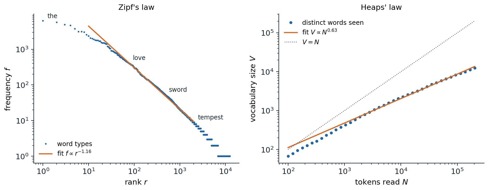
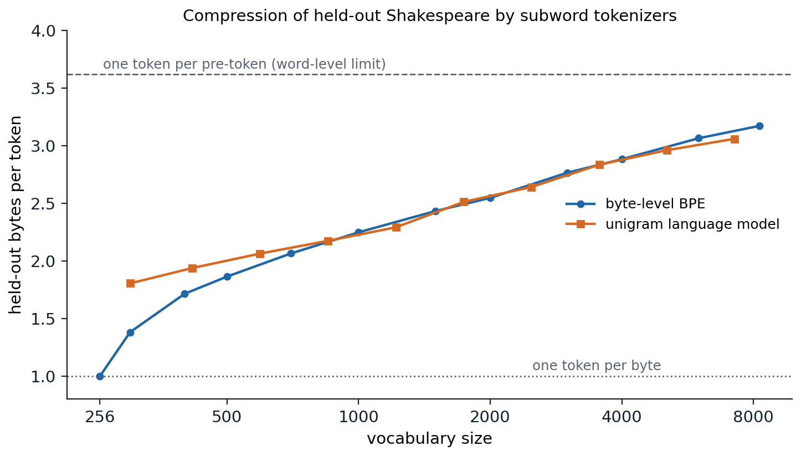

[Background Notes](../README.md) › [NLP and Large Language Models](README.md)

# 1. Text, Tokens, and Tokenization

[2. N-gram Language Models and Perplexity →](02-n-gram-language-models-and-perplexity.md)

## <a id="from-text-to-symbols"></a>From text to symbols

### <a id="characters-code-points-and-bytes"></a>Characters, code points, and bytes

A language model reads and writes sequences of discrete symbols drawn from a fixed vocabulary, while text arrives as a string of characters in thousands of writing systems. **Tokenization** is the map between the two: it cuts text into units called **tokens**, assigns each an integer identifier, and must be inverted exactly when the model's output is turned back into text. Every later chapter inherits its choices. The vocabulary fixes the size of the embedding and output layers, the number of tokens per document fixes the sequence length and so the cost of attention, and the way a word is split determines what the model can easily learn about its spelling.

Text is stored in **Unicode**, which assigns an integer **code point** to each of more than 150,000 characters, from Latin letters to Devanagari conjuncts, Chinese characters, and emoji, within a code space of $`1{,}114{,}112`$ values. Code points are stored as bytes by an encoding, almost always **UTF-8**, which uses one byte for the 128 ASCII characters, two for most other alphabetic scripts, three for the rest of the basic multilingual plane (including most Chinese, Japanese, and Indic text), and four for everything beyond it:

```python
import unicodedata

for s in ["token", "café", "Straße", "नमस्ते", "こんにちは", "🙂"]:
    print(f"{s}: {len(s)} code points, {len(s.encode('utf-8'))} UTF-8 bytes")

composed, decomposed = "café", "café"      # é as one code point, or e + combining accent
print(composed == decomposed, len(composed), len(decomposed))
print(unicodedata.normalize("NFC", decomposed) == composed)
print(unicodedata.normalize("NFKC", "fine ①"), "Straße".casefold())
# token: 5 code points, 5 UTF-8 bytes
# café: 4 code points, 5 UTF-8 bytes
# Straße: 6 code points, 7 UTF-8 bytes
# नमस्ते: 6 code points, 18 UTF-8 bytes
# こんにちは: 5 code points, 15 UTF-8 bytes
# 🙂: 1 code points, 4 UTF-8 bytes
# False 4 5
# True
# fine 1 strasse
```

Bytes give a universal base vocabulary of 256 symbols: any string, in any language, is a byte sequence, so a tokenizer built on bytes never meets an unknown symbol. The price is length. A byte-level model of Hindi reads three symbols for every letter.

### <a id="normalization"></a>Normalization

The same visible text can have several code-point sequences. The letter é is either the single code point U+00E9 or the letter e followed by a combining acute accent, and the two strings compare unequal in the code above. Unicode defines **normalization forms** that choose a canonical representative: NFC composes characters where possible, NFD decomposes them, and the compatibility forms NFKC and NFKD also fold stylistic variants such as ligatures and circled digits into plain characters. **Case folding** maps text to a caseless form for comparison, which is not always lowercasing: the German ß folds to ss.

Classical NLP pipelines normalized aggressively, lowercasing, stripping accents, and sometimes reducing words to stems or dictionary forms, because every distinction multiplied the number of rare word forms a model had to estimate. Pretrained language models normalize little or not at all: case, punctuation, and spacing carry information (a capitalized word starts a sentence or names an entity), and a model that must generate text has to produce the exact characters. Most current tokenizers apply at most NFC or NFKC and leave everything else to the model.

### <a id="words-types-and-tokens"></a>Words, types, and tokens

Counting words distinguishes **tokens**, the running occurrences, from **types**, the distinct forms. The corpus used throughout this module's code is Tiny Shakespeare, about 1.1 MB of dialogue from the plays (data sources). Split into lowercase words, it has about 204,000 tokens but only 12,400 types, and the counts of those types are extremely uneven.



*Word statistics of Tiny Shakespeare: 203,839 word tokens and 12,373 types. Left: frequency against rank on log–log axes; a line fitted to ranks 10–2000 has slope $`-1.16`$. Right: the number of distinct words seen after reading the first $`N`$ tokens grows like $`N^{0.63}`$ (fitted for $`N\ge1000`$). Of the 12,373 types, 5,519 (45%) occur exactly once.*

Two empirical regularities describe these counts. **Zipf's law** says that the frequency of the word of rank $`r`$ falls as a power of the rank, $`f(r)\propto r^{-\alpha}`$ with $`\alpha`$ near 1: the most common word is about twice as frequent as the second and ten times as frequent as the tenth. **Heaps' law** says that the vocabulary seen after $`N`$ tokens grows as $`V(N)\propto N^\beta`$ with $`\beta`$ between about 0.4 and 0.7, so reading more text keeps producing new words, at a slowing rate but without end. The two are linked: if word probabilities follow a pure power law with exponent $`\alpha>1`$, then $`\beta=1/\alpha`$ in the limit of long texts ([Appendix A](#block-nlp01-appendix-a)). The exponents measured on a finite corpus satisfy this only roughly (here $`1/1.16=0.86`$ against a measured 0.63), because the rank–frequency curve steepens in its tail and the limit is approached slowly, but the qualitative conclusion holds for every language and corpus size: most types are rare, and any fixed word list leaves a steady stream of unseen words.

For word-level models these facts are a problem. A vocabulary of the most frequent 50,000 English words still misses names, numbers, typos, technical terms, and new coinages, which older systems mapped to a single unknown-word symbol that the model could neither read nor produce. Morphology makes it worse: *play*, *plays*, *played*, *playing*, and *replayed* are unrelated symbols to a word-level model, so what it learns about one does not transfer to the others, and in languages with rich inflection or compounding, such as Finnish, Turkish, or German, the number of word forms grows much faster than in English.

### <a id="choosing-the-units"></a>Choosing the units

The choice of unit trades vocabulary size against sequence length.

- **Words** give short sequences and units with stable meanings, but an open vocabulary: unknown words, no sharing across related forms, and an embedding table that must grow with the corpus.
- **Characters or bytes** give a tiny closed vocabulary and full coverage, but sequences four to five times longer than word sequences in English and more in other scripts. Longer sequences cost more computation per document, spread the model's context window over fewer words, and force the network to assemble meaning from letters before it can use it.
- **Subwords** sit between the two. Frequent words become single tokens, rare words are spelled out from smaller pieces, and any string can still be represented because the pieces bottom out in characters or bytes.

A useful measure of a tokenizer is its **compression rate**, the average number of bytes (or characters) per token on held-out text. Language models are trained and run with a fixed budget of tokens, so a tokenizer that packs more text into each token lets the same model read more text for the same compute and fit more of a document into its context. Compression is not the only criterion: a tokenizer can compress well while splitting words at linguistically odd places, and the vocabulary size itself costs parameters and computation, as discussed in [Vocabulary size and cost](#vocabulary-size-and-cost).

## <a id="subword-tokenization"></a>Subword tokenization

### <a id="byte-pair-encoding"></a>Byte-pair encoding

**Byte-pair encoding** (BPE) began as a compression algorithm ([Gage, 1994](https://dl.acm.org/doi/10.5555/177910.177914)) and was adapted to neural machine translation by [Sennrich, Haddow, and Birch (2016)](https://arxiv.org/abs/1508.07909). It builds the vocabulary bottom up. Training starts with every word spelled out in base symbols and repeats one step: count all adjacent pairs of symbols in the corpus, and **merge** the most frequent pair into a new symbol everywhere it occurs. Each merge adds one symbol to the vocabulary, so training stops after as many merges as the desired vocabulary size requires. The output is an ordered list of merge rules.

To **encode** new text, the tokenizer splits each word into base symbols and applies the learned merges in the order they were learned: repeatedly find the adjacent pair whose merge has the lowest rank, and merge it. This reproduces on new text the segmentation training would have produced, so frequent words come out whole and a rare word is split into the largest pieces the merge list can assemble. Encoding is deterministic, and decoding simply concatenates the pieces.

The code trains a byte-level BPE tokenizer on 90% of Tiny Shakespeare and measures its compression on the remaining 10%. Training keeps a count of every adjacent pair and an index from each pair to the words that contain it; after a merge, only those words are updated, so each merge costs time proportional to the number of affected words rather than to the whole corpus. A naive implementation that recounts all pairs after every merge is quadratic in practice and is the usual bottleneck of a first implementation.

```python
import re
from collections import Counter, defaultdict

text = open("Sources/Data/tinyshakespeare.txt", encoding="utf-8").read()
train, test = text[:int(0.9 * len(text))], text[int(0.9 * len(text)):]
# GPT-2-style pre-tokenization: contractions, letters, digits, punctuation, whitespace
PAT = re.compile(r"""'s|'t|'re|'ve|'m|'ll|'d| ?[^\W\d_]+| ?\d+| ?[^\s\w]+|\s+(?!\S)|\s+""")


def merge(t, pair, new_id):
    out, i = [], 0
    while i < len(t):
        if i + 1 < len(t) and (t[i], t[i + 1]) == pair:
            out.append(new_id); i += 2
        else:
            out.append(t[i]); i += 1
    return tuple(out)


def train_bpe(text, num_merges):
    words = dict(Counter(tuple(w.encode("utf-8")) for w in PAT.findall(text)))
    pairs, where = Counter(), defaultdict(set)         # pair counts and the words containing each pair
    for w, c in words.items():
        for p in zip(w, w[1:]):
            pairs[p] += c
            where[p].add(w)
    merges = {}
    for new_id in range(256, 256 + num_merges):
        best = max(pairs, key=lambda p: (pairs[p], p))  # most frequent pair; ties broken by id
        merges[best] = new_id
        for w in [w for w in where[best] if w in words]:
            c = words.pop(w)
            for p in zip(w, w[1:]):                     # only words containing the pair change
                pairs[p] -= c
            w2 = merge(w, best, new_id)
            words[w2] = words.get(w2, 0) + c
            for p in zip(w2, w2[1:]):
                pairs[p] += c
                where[p].add(w2)
        del pairs[best]
    return merges


def encode(text, merges):
    ids = []
    for w in PAT.findall(text):
        t = tuple(w.encode("utf-8"))
        while len(t) > 1:                               # apply the earliest-learned merge first
            p = min(zip(t, t[1:]), key=lambda p: merges.get(p, float("inf")))
            if p not in merges:
                break
            t = merge(t, p, merges[p])
        ids += t
    return ids


merges = train_bpe(train, 1744)                          # 256 bytes + 1744 merges = 2000 tokens
vocab = {i: bytes([i]) for i in range(256)}
for (a, b), i in merges.items():
    vocab[i] = vocab[a] + vocab[b]
print("first merges:", [vocab[i].decode() for i in range(256, 268)])
print("last merges: ", [vocab[i].decode() for i in range(1990, 2000)])
ids = encode(test, merges)
print(f"held-out: {len(test.encode())} bytes -> {len(ids)} tokens ({len(test.encode()) / len(ids):.2f} bytes/token)")
for s in ["Wherefore art thou Romeo?", " unhappily", " 1597 tokens"]:
    print([vocab[i].decode() for i in encode(s, merges)])
# first merges: [' t', 'he', ' a', 'ou', ' s', ' m', 'in', ' w', 're', 'ha', ' the', 'nd']
# last merges:  [' prof', 'inks', ' Lancaster', ' Gloucester', ' Gentleman', ' short', ' each', ' par', ' draw', 'ouble']
# held-out: 111540 bytes -> 43806 tokens (2.55 bytes/token)
# ['Where', 'fore', ' art', ' thou', ' Romeo', '?']
# [' un', 'ha', 'pp', 'ily']
# [' ', '1', '5', '9', '7', ' to', 'k', 'ens']
```

The first merges join the most common letter pairs and attach spaces to common word starts; by merge 1,700 whole words such as *Gloucester* and *Gentleman* have become single tokens. The held-out text needs 2.55 bytes per token with a vocabulary of 2,000. Frequent words are whole, *unhappily* is spelled from four pieces, and the digits of *1597* stay separate because numbers are rare in the training text.

### <a id="byte-level-bpe-in-practice"></a>Byte-level BPE in practice

The tokenizers of GPT-2 and its successors run BPE on bytes rather than characters, so the 256 byte values form the base vocabulary and nothing is ever unknown. GPT-2's vocabulary has 50,257 entries: the 256 bytes, 50,000 merges, and one special token ([Radford et al., 2019](https://cdn.openai.com/better-language-models/language_models_are_unsupervised_multitask_learners.pdf)).

Two further design choices matter as much as the algorithm.

- **Pre-tokenization.** Before BPE runs, a regular expression splits the text into chunks, and merges never cross chunk boundaries. GPT-2's pattern separates letters, digits, punctuation, and whitespace, attaches a single leading space to a word, and splits off common English contractions; the code above uses a close equivalent. Without it, BPE would learn tokens such as *dog.* and *dog!* that fuse words with punctuation and waste vocabulary. Later tokenizers refine the pattern, for example by limiting digit runs to three characters or grouping runs of spaces for code.
- **Special tokens.** Tokens that never arise from text mark structure: the end of a document, the boundaries of a chat turn, or a placeholder for padding. They are added to the vocabulary by hand, and the tokenizer must prevent ordinary text from producing them, or a user could forge a chat-turn boundary by typing its spelling.

Vocabulary sizes have grown with model size and multilingual coverage: 30,522 WordPiece tokens for BERT, 32,000 for T5 and for Llama 2, about 100,000 for GPT-4's tokenizer, 128,256 for Llama 3, and around 200,000 or more for several recent models. Llama 3 combined 100,000 tokens from an English-centric tokenizer with 28,000 added for other languages; against Llama 2's 32,000-token vocabulary, it compresses English from 3.17 to 3.94 characters per token, so the model reads about 24% more text for the same compute ([Llama Team, 2024](https://arxiv.org/abs/2407.21783)).

### <a id="wordpiece"></a>WordPiece

**WordPiece** ([Schuster and Nakajima, 2012](https://doi.org/10.1109/ICASSP.2012.6289079)), used by BERT, also grows a vocabulary by merging pairs but chooses merges differently. The original description picks the merge that most increases the likelihood of the training data under a unigram model of the current units; the widely used Hugging Face implementation scores a pair by

```math
\operatorname{score}(a,b)=\frac{\operatorname{count}(ab)}{\operatorname{count}(a)\,\operatorname{count}(b)},
```

a pointwise-mutual-information criterion (chapter 3) that favors pairs whose parts rarely occur apart over pairs that are merely frequent. BERT's WordPiece marks word-internal pieces with a `##` prefix, so *unhappily* might become `un`, `##happ`, `##ily`, and encodes each word greedily by taking the longest vocabulary entry that matches its beginning, then the longest that matches the rest. Greedy longest match is not the same as replaying BPE's merges, and neither is guaranteed to find the segmentation with the fewest tokens.

### <a id="the-unigram-language-model"></a>The unigram language model

The **unigram language model** tokenizer ([Kudo, 2018](https://arxiv.org/abs/1804.10959)) works top down and treats segmentation probabilistically. It assumes that a word $`w`$ is produced by drawing pieces independently from a distribution $`p`$ over a vocabulary $`\mathcal V`$ and concatenating them. A segmentation $`\mathbf s=(s_1,\dots,s_k)`$ of $`w`$ has probability $`\prod_ip(s_i)`$, and the word's probability sums over all segmentations,

```math
P(w)=\sum_{\mathbf s\in S(w)}\prod_{i=1}^{|\mathbf s|}p(s_i),
```

where $`S(w)`$ is the set of ways to write $`w`$ as a concatenation of vocabulary pieces. Training maximizes $`\sum_wc_w\log P(w)`$ over the corpus word counts $`c_w`$ and prunes the vocabulary as it goes:

1. Start from a large seed vocabulary, such as all frequent substrings, with probabilities proportional to their counts.
2. Fit $`p`$ by **expectation–maximization** (ML chapter 14): the segmentation is the hidden variable, the E-step computes the expected number of times each piece is used, and the M-step sets $`p(s)`$ proportional to it. The expectations come from a forward–backward pass over the **segmentation lattice** of each word, whose nodes are character positions and whose edges are vocabulary pieces, the same dynamic program as for hidden Markov models (AI chapter 11; [Appendix B](#block-nlp01-appendix-b)).
3. Remove the pieces whose loss would least reduce the likelihood, typically keeping 80% of them per round, but never single characters, which guarantee that every word stays segmentable.
4. Repeat until the vocabulary reaches the target size.

Encoding uses the **Viterbi** segmentation, the one with the highest probability, found by the same dynamic program with a maximum in place of the sum. The code implements the procedure on characters, with a simpler pruning rule that drops the least probable pieces.

```python
import math
import re
from collections import Counter, defaultdict

import numpy as np

text = open("Sources/Data/tinyshakespeare.txt", encoding="utf-8").read()
train, test = text[:int(0.9 * len(text))], text[int(0.9 * len(text)):]
PAT = re.compile(r"""'s|'t|'re|'ve|'m|'ll|'d| ?[^\W\d_]+| ?\d+| ?[^\s\w]+|\s+(?!\S)|\s+""")
words = Counter(PAT.findall(train))
L = 10                                                   # longest piece, in characters


def forward_backward(w, logp):
    """log P(w) summed over all segmentations, and the expected number of uses of each piece."""
    n = len(w)
    a = np.full(n + 1, -np.inf); a[0] = 0.0              # a[i]: log prob of all segmentations of w[:i]
    b = np.full(n + 1, -np.inf); b[n] = 0.0              # b[j]: log prob of all segmentations of w[j:]
    for i in range(1, n + 1):
        for j in range(max(0, i - L), i):
            if w[j:i] in logp:
                a[i] = np.logaddexp(a[i], a[j] + logp[w[j:i]])
    for j in range(n - 1, -1, -1):
        for i in range(j + 1, min(n, j + L) + 1):
            if w[j:i] in logp:
                b[j] = np.logaddexp(b[j], logp[w[j:i]] + b[i])
    counts = defaultdict(float)
    for j in range(n):
        for i in range(j + 1, min(n, j + L) + 1):
            if w[j:i] in logp:
                counts[w[j:i]] += math.exp(a[j] + logp[w[j:i]] + b[i] - a[n])
    return a[n], counts


def viterbi(w, logp):
    best, back = [0.0] + [-math.inf] * len(w), [0] * (len(w) + 1)
    for i in range(1, len(w) + 1):
        for j in range(max(0, i - L), i):
            if w[j:i] in logp and best[j] + logp[w[j:i]] > best[i]:
                best[i], back[i] = best[j] + logp[w[j:i]], j
    pieces, i = [], len(w)
    while i > 0:
        pieces.append(w[back[i]:i]); i = back[i]
    return pieces[::-1]


# Seed vocabulary: every substring of at most L characters seen twice, plus all single characters.
seed = Counter()
for w, c in words.items():
    for j in range(len(w)):
        for i in range(j + 1, min(len(w), j + L) + 1):
            seed[w[j:i]] += c
chars = {ch for w in words for ch in w}
total = sum(seed.values())
logp = {s: math.log(c / total) for s, c in seed.items() if c >= 2 or s in chars}
n_chars = sum(len(w) * c for w, c in words.items())
while True:
    for _ in range(2):                                   # EM: E-step on every word, M-step renormalizes
        expected, loglik = defaultdict(float), 0.0
        for w, c in words.items():
            lp, counts = forward_backward(w, logp)
            loglik += c * lp
            for s, e in counts.items():
                expected[s] += c * e
        z = sum(expected.values())
        logp = {s: math.log(max(expected[s], 1e-9) / z) for s in logp}
    print(f"{len(logp):6d} pieces, log-likelihood {loglik / n_chars:.3f} nats per character")
    if len(logp) <= 2000:
        break
    keep = max(2000, int(0.7 * len(logp)))               # prune the least probable multi-character pieces
    ranked = sorted((s for s in logp if s not in chars), key=lambda s: -logp[s])
    logp = {s: logp[s] for s in set(ranked[:keep - len(chars)]) | chars}

for w in [" Wherefore", " unhappily", " tokens"]:
    print(repr(w), viterbi(w, logp))
n_tokens = sum(len(viterbi(w, logp)) for w in PAT.findall(test))
print(f"held-out: {len(test.encode()) / n_tokens:.2f} bytes/token")
#  61601 pieces, log-likelihood -1.707 nats per character
#  43120 pieces, log-likelihood -1.673 nats per character
#  30183 pieces, log-likelihood -1.673 nats per character
#  21128 pieces, log-likelihood -1.673 nats per character
#  14789 pieces, log-likelihood -1.673 nats per character
#  10352 pieces, log-likelihood -1.681 nats per character
#   7246 pieces, log-likelihood -1.722 nats per character
#   5072 pieces, log-likelihood -1.787 nats per character
#   3550 pieces, log-likelihood -1.847 nats per character
#   2485 pieces, log-likelihood -1.927 nats per character
#   2000 pieces, log-likelihood -1.983 nats per character
# ' Wherefore' [' ', 'Where', 'fore']
# ' unhappily' [' un', 'h', 'a', 'p', 'p', 'ily']
# ' tokens' [' to', 'k', 'en', 's']
# held-out: 2.57 bytes/token
```

The likelihood barely changes while pruning removes the tens of thousands of redundant seed substrings, then falls as useful pieces start to go. At 2,000 pieces the tokenizer compresses held-out text almost exactly as well as BPE with the same vocabulary. Its segmentations differ in character: *Wherefore* with a leading space splits into a space and *Where*, because in the training text *Where* mostly begins a line and has no space in front of it.

Because the unigram model is probabilistic, it can **sample** segmentations instead of always returning the best one. **Subword regularization** trains a model on randomly sampled segmentations of the same text, which exposes it to the many ways a word can be split and makes it more robust to rare spellings; **BPE-dropout** obtains a similar effect for BPE by skipping each merge with a small probability during encoding ([Provilkov, Emelianenko, and Voita, 2020](https://arxiv.org/abs/1910.13267)). The **SentencePiece** library ([Kudo and Richardson, 2018](https://arxiv.org/abs/1808.06226)) implements both BPE and the unigram model directly on raw text, writes spaces as an ordinary symbol `▁` so that decoding is exact without language-specific rules, and can fall back to bytes for characters outside its vocabulary. T5 uses its unigram model and Llama 2 its BPE.

### <a id="comparing-tokenizers"></a>Comparing tokenizers



*Held-out compression of tokenizers trained on 90% of Tiny Shakespeare and evaluated on the other 10% (111,540 bytes, 30,838 pre-tokens). Byte-level BPE rises from 1.00 byte per token with its 256-byte base vocabulary to 2.25 at 1,000 tokens, 2.55 at 2,000, and 3.17 at 8,256. The unigram tokenizer gives 1.80 at 300 pieces, 2.51 at 1,739, and 3.06 at 7,246; it starts from the 65 characters of the corpus rather than 256 bytes, which explains its lead at small sizes. The dashed line at 3.62 bytes is the compression of one token per pre-token.*

On this corpus the two algorithms compress almost identically at every vocabulary size above a few hundred, and both approach, without reaching, the limit of one token per pre-token: a finite vocabulary trained on 1 MB of text cannot hold every word it will meet. Each doubling of the vocabulary buys a smaller gain, a pattern that continues at the scale of production tokenizers. The main differences between the algorithms lie elsewhere. The unigram model's segmentations tend to align better with morphological boundaries, and models pretrained with it matched or exceeded BPE-tokenized models in the comparison of [Bostrom and Durrett (2020)](https://arxiv.org/abs/2004.03720); BPE is simpler, deterministic, and dominant among current large models.

## <a id="what-tokenization-does-to-a-model"></a>What tokenization does to a model

### <a id="vocabulary-size-and-cost"></a>Vocabulary size and cost

A vocabulary of $`V`$ tokens and a model width of $`d`$ costs $`Vd`$ parameters for the input embeddings and, unless the two are tied, another $`Vd`$ for the output layer, whose softmax over $`V`$ entries is computed at every position (chapter 4). At $`V=128{,}000`$ and $`d=4096`$ that is 524 million parameters per matrix, a large share of a small model and a small share of a large one. A larger vocabulary shortens sequences, which saves computation in every layer, and reduces the number of steps needed to generate a given text; but each additional token is rarer, so its embedding is trained on fewer examples. These pressures balance at larger vocabularies for larger models and for multilingual ones, which is why vocabularies have grown from about 32,000 to 100,000–260,000 tokens as models have grown.

### <a id="numbers-spelling-and-code"></a>Numbers, spelling, and code

A model sees token identifiers, not characters, and several well-known weaknesses of language models trace back to that.

- **Arithmetic.** A BPE tokenizer trained on text learns merges for frequent numbers, so *1597* and *1598* may be split into unrelated pieces, and digits of the same place value land in different positions of different tokens. Llama and Llama 2 split every number into single digits; GPT-4's tokenizer splits digit strings into chunks of at most three. Both give the model a more consistent view of place value, and even the direction in which digits are grouped measurably changes arithmetic accuracy ([Singh and Strouse, 2024](https://arxiv.org/abs/2402.14903)).
- **Spelling.** Counting the letters in a word or reversing it requires knowing how each token is spelled, which the model can only learn indirectly from contexts where spellings are spelled out. A model that answers questions about ancient history fluently can still miscount the letters in a common word.
- **Whitespace and code.** GPT-2's tokenizer encoded each space of an indented line of code as a separate token, wasting context on indentation; tokenizers for code-trained models added tokens for runs of spaces and tabs.
- **Under-trained tokens.** If the tokenizer's training data differs from the model's, some tokens almost never occur in model training, and their embeddings stay near their random initialization. Prompts containing such tokens, the most famous being a Reddit username that became the GPT-2 and GPT-3 token *SolidGoldMagikarp*, produced erratic outputs ([Rumbelow and Watkins, 2023](https://www.lesswrong.com/posts/aPeJE8bSo6rAFoLqg/solidgoldmagikarp-plus-prompt-generation)).

### <a id="languages-and-scripts"></a>Languages and scripts

A tokenizer trained mostly on English allocates most of its merges to English. Text in other languages, and especially in other scripts, is split into many more tokens: three UTF-8 bytes per Devanagari character start a byte-level tokenizer at a disadvantage, and few merges are spent on Hindi. [Petrov et al. (2023)](https://arxiv.org/abs/2305.15425) found that translations of the same text can differ by up to a factor of 15 in token count across languages under common tokenizers. Speakers of those languages pay more per request to services priced by the token, fit less text into the same context window, and wait longer for generation, and the model has fewer training tokens' worth of each word. Multilingual tokenizers counter this by training on balanced data and enlarging the vocabulary (chapter 15).

### <a id="strings-token-sequences-and-probabilities"></a>Strings, token sequences, and probabilities

A language model assigns probabilities to sequences of token identifiers, and tokenization connects them to strings. The map from token sequences to strings is many to one: *the* is one token, but the sequence *t*, *he* decodes to the same string. The probability of a string is therefore the sum over every token sequence that decodes to it. In practice the tokenizer's **canonical** segmentation receives nearly all of that probability, because the model only ever saw canonical segmentations in training, and the probability of a text is computed from it alone.

Canonical segmentation has a side effect at the boundary between a prompt and its continuation. If a prompt ends with a space, the model must continue with a token that has no leading space, which in training almost never followed a space token, because the space would have been merged into the next word. Generation then goes subtly wrong. Libraries correct this by **token healing**, which backs off the last prompt token and constrains the first generated token to begin with its text.

The same issue governs comparisons of models. Per-token loss and perplexity (chapter 2; Foundations chapter 5) depend on how much text a token holds, so a model with a coarser tokenizer has a higher per-token loss for the same predictive quality. Dividing the total loss by the number of bytes instead gives **bits per byte**, which is comparable across tokenizers ([Appendix C](#block-nlp01-appendix-c); chapter 14).

### <a id="beyond-fixed-tokenizers"></a>Beyond fixed tokenizers

Tokenizers are trained separately from the model, frozen, and cannot adapt to a new domain or language without retraining the model's embeddings. Several lines of work remove them. **ByT5** ([Xue et al., 2022](https://arxiv.org/abs/2105.13626)) trains a transformer directly on UTF-8 bytes, with a deeper encoder to make up for the longer sequences, and gains robustness to spelling noise at a higher cost per character. **MEGABYTE** ([Yu et al., 2023](https://arxiv.org/abs/2305.07185)) groups bytes into fixed-size patches, runs a large model over patches, and predicts the bytes within each patch with a small local model. The **Byte Latent Transformer** ([Pagnoni et al., 2024](https://arxiv.org/abs/2412.09871)) makes the patches dynamic, starting a new patch where a small byte-level model finds the next byte hard to predict, so that predictable stretches of text are processed cheaply; at 8 billion parameters it matched a tokenized model trained with the same compute. For now, nearly all widely used language models still rely on byte-level BPE, and the rest of this module assumes a fixed tokenizer.

## <a id="appendices"></a>Appendices


<details>
<summary><a id="block-nlp01-appendix-a"></a><b>A. Zipf's law implies Heaps' law</b></summary>


Suppose word types are drawn independently with probabilities $`p_r=r^{-\alpha}/\zeta(\alpha)`$ for ranks $`r=1,2,\dots`$, with $`\alpha>1`$ so that the probabilities sum to one ($`\zeta`$ is the Riemann zeta function). After $`N`$ draws, type $`r`$ has been seen with probability $`1-(1-p_r)^N`$, so the expected vocabulary is

```math
\mathbb E[V(N)]=\sum_{r\ge1}\bigl[1-(1-p_r)^N\bigr].
```

The summand is close to 1 when $`Np_r\gg1`$ and close to $`Np_r`$ when $`Np_r\ll1`$; the transition happens at the rank $`r^*`$ where $`Np_{r^*}=1`$, that is, $`r^*=(N/\zeta(\alpha))^{1/\alpha}`$. Approximating the sum by an integral with $`u=Np_r`$, which changes variables through $`r=(N/(\zeta(\alpha)u))^{1/\alpha}`$ and $`dr=-\frac1\alpha(N/\zeta(\alpha))^{1/\alpha}u^{-1/\alpha-1}du`$, gives

```math
\mathbb E[V(N)]\approx\Bigl(\frac N{\zeta(\alpha)}\Bigr)^{1/\alpha}\frac1\alpha\int_0^\infty\bigl(1-e^{-u}\bigr)u^{-1/\alpha-1}\,du
=\Gamma\Bigl(1-\frac1\alpha\Bigr)\Bigl(\frac N{\zeta(\alpha)}\Bigr)^{1/\alpha},
```

using $`(1-p)^N\approx e^{-Np}`$ for small $`p`$ and integrating by parts. The integral converges because $`1/\alpha<1`$. Hence $`V(N)\propto N^{1/\alpha}`$: Heaps' exponent is $`\beta=1/\alpha`$. For $`\alpha\le1`$ the probabilities cannot sum to one over infinitely many types, so a pure power law needs a finite vocabulary and the relation breaks down; this is one reason measured exponents on finite corpora match the formula only approximately.

</details>


<details>
<summary><a id="block-nlp01-appendix-b"></a><b>B. Expectation–maximization for the unigram tokenizer</b></summary>


For a word $`w=w_1\cdots w_n`$, let $`A_i`$ be the total probability of all segmentations of the prefix $`w_{1:i}`$ and $`B_j`$ that of the suffix $`w_{j+1:n}`$, with $`A_0=B_n=1`$. Every segmentation of $`w`$ either ends a piece at position $`i`$ or does not, so

```math
A_i=\sum_{j<i:\ w_{j+1:i}\in\mathcal V}A_j\,p(w_{j+1:i}),\qquad
B_j=\sum_{i>j:\ w_{j+1:i}\in\mathcal V}p(w_{j+1:i})\,B_i,
```

and $`P(w)=A_n=B_0`$. The segmentations that use the piece $`w_{j+1:i}`$ at that position have total probability $`A_j\,p(w_{j+1:i})\,B_i`$, so the posterior probability of that edge of the lattice is $`A_jp(w_{j+1:i})B_i/P(w)`$.

The **E-step** sums these posteriors over all positions where a piece $`s`$ can occur, over all words, weighted by word counts, to obtain the expected count $`\bar c(s)=\sum_wc_w\,\mathbb E[\#s\mid w]`$. The **M-step** maximizes the expected complete-data log-likelihood $`\sum_s\bar c(s)\log p(s)`$ subject to $`\sum_sp(s)=1`$; a Lagrange multiplier gives $`p(s)=\bar c(s)/\sum_{s'}\bar c(s')`$. As for any EM algorithm, each iteration cannot decrease $`\sum_wc_w\log P(w)`$.

The Viterbi segmentation replaces the sum in the recursion for $`A_i`$ by a maximum and keeps back pointers. Kudo's pruning step estimates, for each piece $`s`$, the loss $`\sum_wc_w[\log P(w)-\log P_{-s}(w)]`$ incurred by removing it, where $`P_{-s}`$ uses the best segmentation without $`s`$, and removes the pieces with the smallest loss. Both recursions cost $`O(nL)`$ per word for pieces of at most $`L`$ characters.

</details>


<details>
<summary><a id="block-nlp01-appendix-c"></a><b>C. Perplexity per token and bits per byte</b></summary>


Let a text of $`B`$ bytes be tokenized into $`T`$ tokens, and let a model assign it total negative log-likelihood $`\mathcal L=-\sum_{t=1}^T\log q(x_t\mid x_{<t})`$ in nats. The per-token loss is $`\mathcal L/T`$ and the per-token perplexity is $`\mathrm{PPL}_{\mathrm{tok}}=e^{\mathcal L/T}`$. The total $`\mathcal L`$ is the ideal code length of the whole text, which does not depend on how it was cut into tokens, so the tokenizer-independent quantity is the code length per byte,

```math
\mathrm{BPB}=\frac{\mathcal L}{B\ln2}=\frac TB\cdot\frac{\mathcal L/T}{\ln2}.
```

Two models with tokenizers compressing at $`B/T_1`$ and $`B/T_2`$ bytes per token and equal bits per byte have per-token losses in the ratio $`T_2/T_1`$, and per-token perplexities related by $`\mathrm{PPL}_1=\mathrm{PPL}_2^{\,T_2/T_1}`$. A tokenizer twice as coarse therefore squares the per-token perplexity at equal quality. The identity assumes the model's probability of the text is computed from the canonical tokenization, as it is in practice.

</details>

---

[2. N-gram Language Models and Perplexity →](02-n-gram-language-models-and-perplexity.md)
