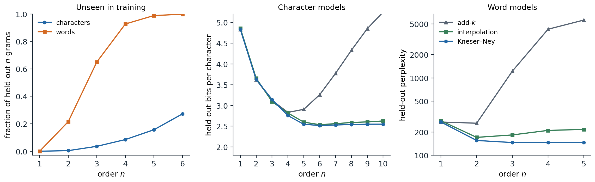

[ML Mastery Notes](../README.md) › [NLP and Large Language Models](README.md)

# 2. N-gram Language Models and Perplexity

[← 1. Text, Tokens, and Tokenization](01-text-tokens-and-tokenization.md) · [3. Word Embeddings →](03-word-embeddings.md)

## <a id="language-models"></a>Language models

### <a id="predicting-the-next-word"></a>Predicting the next word

A **language model** assigns a probability to every sequence of tokens $w_1,\dots,w_T$ from a vocabulary, and so to every text. Equivalently, it predicts the next token from the preceding ones. For decades language models served as components of larger systems: a speech recognizer or an optical character reader proposes many candidate transcriptions, and the language model prefers those that read like language; a spelling corrector or a phone keyboard ranks the words a user probably meant. Today the language model is the system itself, and everything in the later chapters is a way of training, adapting, or using one. This chapter develops the classical, count-based version, which introduces the evaluation methods and the central difficulty that neural models inherit: most sequences are never observed.

The chain rule of probability writes any sequence probability as a product of next-token predictions,

$$
P(w_{1:T})=\prod_{t=1}^TP(w_t\mid w_{1:t-1}),
$$

so a model of the conditionals is a model of text, and its log-likelihood is a sum of next-token log losses (Foundations chapter 5). The factorization is exact but offers no help by itself: a history of 20 words from a 10,000-word vocabulary has $10^{80}$ possible values, and almost every history in a new text has never occurred before.

### <a id="the-markov-assumption"></a>The Markov assumption

An **n-gram model** assumes that only the last $n-1$ tokens matter,

$$
P(w_t\mid w_{1:t-1})\approx P(w_t\mid w_{t-n+1:t-1}),
$$

a Markov chain of order $n-1$ (AI chapter 11). A unigram model ($n=1$) ignores context entirely, a bigram model conditions on the previous token, and a trigram model on the previous two. Sequences are padded with start symbols `<s>` so that the first tokens have a full context, and an end symbol `</s>` is often added so that the model also assigns probabilities to lengths.

The maximum-likelihood estimate of each conditional is a relative frequency: with $c(\cdot)$ counting occurrences in the training text,

$$
P_{\mathrm{ML}}(w\mid h)=\frac{c(h\,w)}{c(h)},
$$

the fraction of the times the context $h$ was followed by $w$. The code counts the word bigrams of Tiny Shakespeare, the corpus of chapter 1, lists the most likely words after two contexts, and generates text by sampling each next word from the counts of a unigram, bigram, trigram, and 4-gram model. It splits text into lowercase words and punctuation marks, the unit used throughout this chapter.

```python
import random
import re
from collections import Counter, defaultdict

text = open("Sources/Data/tinyshakespeare.txt", encoding="utf-8").read().lower()
toks = re.findall(r"[a-z]+(?:'[a-z]+)?|[.,!?;:]", text)

follow = defaultdict(Counter)                           # maximum-likelihood bigram: P(w | v) = c(v w) / c(v)
for v, w in zip(toks, toks[1:]):
    follow[v][w] += 1
for v in ["my", "good"]:
    total = sum(follow[v].values())
    print(v, "->", ", ".join(f"{w} {c / total:.3f}" for w, c in follow[v].most_common(5)))


def sample(n, length, rng):
    table = defaultdict(Counter)                        # context of n-1 words -> counts of the next word
    for i in range(n - 1, len(toks)):
        table[tuple(toks[i - n + 1:i])][toks[i]] += 1
    out = list(toks[:n - 1])
    while len(out) < length:
        nxt = table[tuple(out[len(out) - n + 1:])] if n > 1 else table[()]
        out.append(rng.choices(list(nxt), weights=list(nxt.values()))[0])
    return out


train_8grams = {tuple(toks[i:i + 8]) for i in range(len(toks) - 7)}
for n in [1, 2, 3, 4]:
    s = sample(n, 400, random.Random(n))
    copied = sum(tuple(s[i:i + 8]) in train_8grams for i in range(len(s) - 7)) / (len(s) - 7)
    print(f"{n}-gram: {' '.join(s[20:42])}")
    print(f"         8-word windows found verbatim in the training text: {copied:.0%}")
# my -> lord 0.116, heart 0.026, life 0.019, father 0.019, brother 0.018
# good -> , 0.049, lord 0.045, my 0.043, night 0.039, morrow 0.030
# 1-gram: : so faded but ? their : marcius with his the the ? i have : despite where live are gremio executed
#          8-word windows found verbatim in the training text: 0%
# 2-gram: , and you ! for my blushing discontented steps esteem as we have i arrived , but needful : tell . camillo
#          8-word windows found verbatim in the training text: 0%
# 3-gram: : at the cypress grove : i will even take my lord , would not so ? nay , let me have
#          8-word windows found verbatim in the training text: 2%
# 4-gram: iniquity , i moralize two meanings in one word . autolycus : i can tell thee pretty tales of the duke .
#          8-word windows found verbatim in the training text: 62%
```

### <a id="generating-from-a-model"></a>Generating from a model

Sampling from successively higher-order models reproduces the demonstration in Shannon's founding paper on information theory ([Shannon, 1948](https://doi.org/10.1002/j.1538-7305.1948.tb01338.x)), which built "approximations to English" of increasing order by hand. The unigram sample is a bag of frequent words; the bigram sample has locally plausible pairs (*my blushing*, *we have*) and no larger structure; the trigram sample has plausible phrases. The 4-gram sample reads best, but 62% of its eight-word windows occur verbatim in the training text. With 250,000 training words, most 3-word contexts were seen only once or a few times, so the 4-gram model has little choice but to continue them as the training text did. High-order count models do not generalize: they memorize.

## <a id="measuring-a-language-model"></a>Measuring a language model

### <a id="held-out-likelihood"></a>Held-out likelihood

A language model is judged by the probability it assigns to text it was not trained on. The data are split into a **training set** for the counts, a **development set** for choosing hyperparameters such as smoothing constants, and a **test set** used once at the end; any overlap between training and test text inflates the result. The score is the average negative log-likelihood per token, reported as **cross-entropy** in bits or as **perplexity**, its exponential (Foundations chapter 5). A perplexity of 150 means the model is, on average, as uncertain as if it chose uniformly among 150 equally likely tokens at each step; lower is better, and a single test token assigned probability zero makes it infinite.

Perplexities are comparable only between models that predict the same tokens. Word models usually fix a **closed vocabulary**, for example all words seen at least twice in training, and map every other word to an unknown-word token `<unk>`. The choice changes the numbers: a smaller vocabulary means more `<unk>` tokens, each easy to predict, and a lower perplexity. Comparisons across tokenizations should use bits per character or per byte (chapter 1, Appendix C).

### <a id="how-predictable-is-english"></a>How predictable is English?

Cross-entropy on held-out text bounds from above the entropy rate of the language, the irreducible uncertainty per symbol. [Shannon (1951)](https://doi.org/10.1002/j.1538-7305.1951.tb01366.x) estimated it with a guessing game in which people predicted the next letter of a text: with about 100 letters of context, English came out between about 0.6 and 1.3 bits per character over an alphabet of 26 letters and space. A trigram word model trained on 583 million words gave an upper bound of 1.75 bits per character ([Brown et al., 1992](https://aclanthology.org/J92-1002/)). Current large language models reach below one bit per character on ordinary English text, far closer to Shannon's range than any count-based model.

## <a id="smoothing"></a>Smoothing

### <a id="the-sparsity-problem"></a>The sparsity problem



*N-gram models of Tiny Shakespeare, trained on the first 80% of the text, tuned on the next 10%, and tested on the last 10%. Left: the share of test n-grams never seen in training; for words it is 21.5% of bigrams, 65% of trigrams, and 92.7% of 4-grams, for characters 15.6% of 5-grams. Middle: bits per character of character models; Kneser–Ney reaches 2.52 at order 6, interpolation 2.54, while add-$k$ is best at order 4 (2.83) and degrades after. Right: word models with rare words mapped to `<unk>`; Kneser–Ney reaches perplexity 146 at order 3 and stays there, interpolation is best at order 2 (171), and add-$k$ is worst beyond unigrams.*

The left panel shows why maximum-likelihood estimates are unusable. Two thirds of the word trigrams in the test text never occur in 200,000 words of training text, so a maximum-likelihood trigram model assigns most test sentences probability zero. Zipf's law (chapter 1) makes this unavoidable at any corpus size: the number of possible n-grams grows as $V^n$, while the counts concentrate on a few. Even nonzero counts are unreliable: a bigram seen once in training has an estimated probability far above its true one, because it is one of millions of rare bigrams of which only the lucky ones appeared.

**Smoothing** moves probability mass from observed events to unobserved ones and from rare observed events to their lower-order generalizations. The methods below differ in how much mass they move and where they put it.

### <a id="add-one-and-add-k"></a>Add-one and add-k

The simplest method adds a pseudo-count $k$ to every possible continuation,

$$
P_{\text{add-}k}(w\mid h)=\frac{c(h\,w)+k}{c(h)+kV}.
$$

With $k=1$ this is **Laplace smoothing**. It is the posterior mean of the next-word distribution under a symmetric Dirichlet prior ([Appendix C](#block-nlp02-appendix-c); AI chapter 14), which suits small vocabularies. For words it fails badly. A context seen 100 times, followed by 40 distinct words in a vocabulary of 12,000, gives the 11,960 unseen continuations a total probability of $11{,}960/12{,}100\approx0.99$, leaving 1% for the words actually observed. Smaller values of $k$ help, but a single constant cannot suit both frequent contexts, which need little smoothing, and rare ones, which need much. In the figure, add-$k$ with $k$ tuned on the development set is competitive for unigrams and low-order character models and deteriorates quickly beyond them.

### <a id="goodturing-estimation"></a>Good–Turing estimation

A better idea asks how often events seen $c$ times in one sample occur in another. Let $N_c$ be the number of distinct n-grams that occur exactly $c$ times in the training data, the **count of counts**, and $N$ the number of tokens. The **Good–Turing** estimate, devised by Turing during his wartime codebreaking and published by [Good (1953)](https://doi.org/10.1093/biomet/40.3-4.237), replaces each count $c$ by

$$
c^*=(c+1)\frac{N_{c+1}}{N_c},
$$

and assigns the unseen n-grams a total probability of $N_1/N$, the fraction of the sample made up of **singletons** ([Appendix A](#block-nlp02-appendix-a)). The idea is that the next new event behaves like the events seen once so far. The code tests these predictions on bigrams. It shuffles the speeches of the corpus, splits them into two halves of about 125,000 words, and, for the bigrams occurring $c$ times in the first half, compares their average count in the second half with the Good–Turing value $c^*$.

```python
import random
import re
from collections import Counter

text = open("Sources/Data/tinyshakespeare.txt", encoding="utf-8").read().lower()
speeches = text.split("\n\n")
random.Random(0).shuffle(speeches)                      # exchangeable halves: speeches in random order
tok = lambda t: re.findall(r"[a-z]+(?:'[a-z]+)?|[.,!?;:]", t)
a, b = tok("\n\n".join(speeches[0::2])), tok("\n\n".join(speeches[1::2]))
ca, cb = Counter(zip(a, a[1:])), Counter(zip(b, b[1:]))
scale = (len(a) - 1) / (len(b) - 1)                     # rescale second-half counts to the first half's size
V = len(set(a) | set(b))
Nc = Counter(ca.values())                               # count of counts: how many bigrams occur c times
Nc[0] = V * V - len(ca)                                 # possible bigrams never seen in the first half
held = Counter()
for g, c in ca.items():
    held[c] += cb[g] * scale
held[0] = sum(v for g, v in cb.items() if g not in ca) * scale
print(f"{len(a)} and {len(b)} tokens, {V} word types, {len(ca)} distinct bigrams in the first half")
print(" c   bigrams N_c   held-out mean   Good-Turing c*   c - held-out")
for c in range(8):
    print(f"{c:2d} {Nc[c]:13d} {held[c] / Nc[c]:15.4f} {(c + 1) * Nc[c + 1] / Nc[c]:16.4f} {c - held[c] / Nc[c]:14.2f}")
print(f"second-half bigrams unseen in the first half: {held[0] / scale / (len(b) - 1):.3f}; "
      f"Good-Turing estimate N_1/N: {Nc[1] / (len(a) - 1):.3f}")
# 122083 and 128065 tokens, 12379 word types, 54430 distinct bigrams in the first half
#  c   bigrams N_c   held-out mean   Good-Turing c*   c - held-out
#  0     153185211          0.0003           0.0003          -0.00
#  1         41532          0.2823           0.2823           0.72
#  2          5863          1.0947           1.1375           0.91
#  3          2223          2.0704           2.1556           0.93
#  4          1198          2.8925           3.1845           1.11
#  5           763          3.9418           3.7903           1.06
#  6           482          5.0137           4.7780           0.99
#  7           329          6.0819           6.9058           0.92
# second-half bigrams unseen in the first half: 0.350; Good-Turing estimate N_1/N: 0.340
```

Good–Turing predicts that 34.0% of second-half bigrams are new, and 35.0% are. Its adjusted counts track the held-out counts closely for small $c$, and become noisy for larger ones, where $N_{c+1}$ is small; practical versions smooth the count of counts before using it. The last column is the most useful: bigrams seen $c\ge2$ times reappear about $c-0.9$ to $c-1.1$ times, and those seen once about 0.28 times. Each count loses a roughly constant amount, which motivates the absolute discounting below. The prediction depends on the two halves being exchangeable. Splitting the corpus instead into its first and second halves, which contain different plays with different characters, raises the share of new bigrams to 41% while $N_1/N$ predicts 33%, a reminder that held-out evaluation measures generalization to a particular distribution.

### <a id="interpolation-and-backoff"></a>Interpolation and backoff

Lower-order models are less specific but better estimated, so they are natural fallbacks for sparse contexts. **Linear interpolation** mixes the orders,

$$
P_{\mathrm{interp}}(w\mid h_{n-1})=\lambda\,P_{\mathrm{ML}}(w\mid h_{n-1})+(1-\lambda)\,P_{\mathrm{interp}}(w\mid h_{n-2}),
$$

recursively down to a unigram or uniform distribution, where $h_k$ denotes the last $k$ tokens of the context. The weights are chosen to maximize the likelihood of held-out data, by grid search or by EM, the method Jelinek and Mercer (1980) called deleted interpolation, and can depend on how often the context was seen. **Backoff** models use the higher-order estimate when the n-gram was seen and fall back to the lower order only when it was not. [Katz (1987)](https://doi.org/10.1109/TASSP.1987.1165125) discounted the observed counts with Good–Turing and distributed the freed mass over the unseen continuations in proportion to the lower-order model, so that the result remains a probability distribution.

At web scale, simplicity wins. **Stupid backoff** ([Brants et al., 2007](https://aclanthology.org/D07-1090/)) drops normalization altogether, scoring an unseen n-gram as 0.4 times the score of its lower-order version. It does not define a probability distribution, but it can be computed over trillions of tokens with a single pass of counting, and in machine translation it approached the quality of Kneser–Ney as data grew; more data beat better smoothing.

### <a id="absolute-discounting-and-kneserney"></a>Absolute discounting and Kneser–Ney

The held-out experiment suggests subtracting a fixed discount $D$ between 0 and 1 from every nonzero count and giving the collected mass to the lower-order model:

$$
P_{\mathrm{abs}}(w\mid h)=\frac{\max(c(h\,w)-D,0)}{c(h)}+\gamma(h)\,P_{\mathrm{lower}}(w),
\qquad
\gamma(h)=\frac{D\,N_{1+}(h\,\bullet)}{c(h)},
$$

where $N_{1+}(h\,\bullet)$ is the number of distinct words seen after $h$. The weight $\gamma(h)$ equals exactly the mass removed, so the distribution sums to one; contexts followed by many different words reserve more mass for unseen ones, which is right, since such contexts are the most likely to produce new continuations.

**Kneser–Ney smoothing** ([Kneser and Ney, 1995](https://doi.org/10.1109/ICASSP.1995.479394)) changes what the lower-order model estimates. The lower-order distribution is consulted only when the higher-order context has little evidence, so it should answer a different question from "how frequent is $w$?": namely, "how likely is $w$ to appear after a context in which it has not been seen?" A word that is frequent but occurs after only one or two contexts is a poor guess for a new context. Kneser–Ney therefore replaces raw counts in the lower-order model by **continuation counts**, the number of distinct words that precede $w$:

$$
P_{\mathrm{cont}}(w)=\frac{N_{1+}(\bullet\,w)}{N_{1+}(\bullet\,\bullet)}.
$$

This choice is not a heuristic: it is the lower-order distribution for which the smoothed bigram model reproduces the observed unigram frequencies ([Appendix B](#block-nlp02-appendix-b)). In **interpolated Kneser–Ney**, the recursion applies the discount at every order and uses continuation counts at every order below the highest. The code implements it, with a discount per order estimated from the count of counts as $D=N_1/(N_1+2N_2)$ ([Ney, Essen, and Kneser, 1994](https://doi.org/10.1006/csla.1994.1001)).

```python
import math
import re
from collections import Counter

text = open("Sources/Data/tinyshakespeare.txt", encoding="utf-8").read().lower()
tok = lambda t: re.findall(r"[a-z]+(?:'[a-z]+)?|[.,!?;:]", t)
train, test = tok(text[:int(0.9 * len(text))]), tok(text[int(0.9 * len(text)):])
known = {w for w, c in Counter(train).items() if c > 1}    # words seen once become <unk>
train = [w if w in known else "<unk>" for w in train]
test = [w if w in known else "<unk>" for w in test]


class KneserNey:
    def __init__(self, toks, n):
        self.n, self.V = n, len(set(toks))
        grams = Counter(tuple(toks[i:i + n]) for i in range(len(toks) - n + 1))
        self.count = {n: grams}
        for k in range(n - 1, 0, -1):                   # lower orders use continuation counts:
            self.count[k] = Counter(g[1:] for g in self.count[k + 1])   # distinct words to the left
        self.total, self.types, self.D = {}, {}, {}
        for k, cnt in self.count.items():
            self.total[k], self.types[k] = Counter(), Counter()
            for g, c in cnt.items():
                self.total[k][g[:-1]] += c              # sum of counts after the context
                self.types[k][g[:-1]] += 1              # number of distinct words after the context
            n1, n2 = sum(c == 1 for c in cnt.values()), sum(c == 2 for c in cnt.values())
            self.D[k] = n1 / (n1 + 2 * n2) if n1 + n2 else 0.75

    def prob(self, context, w):
        p = 1 / self.V                                  # recursion starts from the uniform distribution
        for k in range(1, self.n + 1):
            h = tuple(context[len(context) - k + 1:]) if k > 1 else ()
            t = self.total[k].get(h, 0)
            if t:                                       # discounted estimate + reserved mass x lower order
                d = self.D[k]
                p = max(self.count[k].get(h + (w,), 0) - d, 0) / t + d * self.types[k][h] / t * p
        return p


lm = KneserNey(train, 2)
raw = Counter(train)
for w in ["love", "morrow", "iii"]:
    print(f"{w:7s} count {raw[w]:4d}  unigram {raw[w] / len(train):.5f}  continuation "
          f"{lm.count[1][(w,)] / sum(lm.count[1].values()):.5f}")
for n in [1, 2, 3, 4]:
    lm = KneserNey(train, n)
    nll = -sum(math.log(lm.prob(test[max(0, i - n + 1):i], test[i])) for i in range(len(test)))
    print(f"{n}-gram Kneser-Ney: discount {lm.D[n]:.2f}, test perplexity {math.exp(nll / len(test)):.1f}")
# love    count  378  unigram 0.00168  continuation 0.00157
# morrow  count   76  unigram 0.00034  continuation 0.00005
# iii     count  138  unigram 0.00061  continuation 0.00001
# 1-gram Kneser-Ney: discount 0.00, test perplexity 332.7
# 2-gram Kneser-Ney: discount 0.73, test perplexity 163.7
# 3-gram Kneser-Ney: discount 0.87, test perplexity 154.5
# 4-gram Kneser-Ney: discount 0.95, test perplexity 154.7
```

*Morrow* occurs 76 times but almost always after *good* or *to*, and *iii* 138 times, always in the name *Richard III*; their continuation probabilities are 7 and 60 times smaller than their raw frequencies, while *love*, which follows more than a hundred different words, keeps nearly its full share. The trigram model reaches a test perplexity of 154.5, and the 4-gram adds nothing because its contexts are too sparse. This code trains on 90% of the text, so its vocabulary and numbers differ slightly from the figure, which reserves 10% for tuning.

**Modified Kneser–Ney** ([Chen and Goodman, 1999](https://doi.org/10.1006/csla.1999.0128)) uses three discounts, for counts of 1, 2, and 3 or more, and was the strongest method in their extensive comparison; it remained the standard count-based model until neural language models overtook it. It also has a Bayesian interpretation: interpolated Kneser–Ney is an approximation to inference in a hierarchical Pitman–Yor process, a nonparametric prior whose power-law behavior matches Zipf's law ([Teh, 2006](https://aclanthology.org/P06-1124/)).

### <a id="comparing-the-methods"></a>Comparing the methods

The figure summarizes the comparison. Every method improves from unigrams to bigrams. Add-$k$ collapses as the order grows because it spreads mass uniformly over $V^n$ mostly impossible continuations. Interpolation holds up but slowly worsens at high orders, where its fixed weights trust sparse high-order estimates too much. Kneser–Ney improves until the data run out and then stays flat, because the discounted mass automatically routes sparse contexts to the lower orders. The best character model, at order 6, needs 2.52 bits per character. Trained on the first 90% of the corpus instead of 80%, the same model needs only 2.25 bits on the same test text, because the added tenth contains the opening of *The Taming of the Shrew*, which fills most of the test text; chapter 4 compares a transformer with this stronger baseline.

## <a id="scaling-and-the-limits-of-counting"></a>Scaling and the limits of counting

### <a id="large-count-based-models"></a>Large count-based models

Count-based models scale easily to large corpora because training is counting. Google's release of n-gram counts up to order 5 from a trillion words of web text ([Brants and Franz, 2006](https://catalog.ldc.upenn.edu/LDC2006T13)) and stupid-backoff models over two trillion tokens were the large language models of their time. Their size grows with the number of distinct n-grams, so practical systems prune n-grams whose removal changes the model little ([Stolcke, 1998](https://arxiv.org/abs/cs/0006025)) and store the rest in compact tries and hash tables, as in the **KenLM** library ([Heafield, 2011](https://aclanthology.org/W11-2123/)). The idea has returned in the **∞-gram** model ([Liu et al., 2024](https://arxiv.org/abs/2401.17377)), which indexes five trillion tokens with a suffix array, conditions on the longest suffix of the context that occurs in the corpus however long it is, and, interpolated with a neural language model, lowers its perplexity.

### <a id="what-counting-cannot-do"></a>What counting cannot do

Count-based models treat every token as an unrelated symbol. Having seen *the cat is walking in the bedroom* tells a trigram model nothing about *a dog was running in a room*, although the two sentences share nearly everything but their exact words; statistical strength is shared only between contexts that match exactly. The fixed window is a second limit: a trigram model cannot connect a pronoun to its antecedent five words back, and raising $n$ runs into sparsity immediately. Both problems yield to the same idea. Represent each word by a vector, so that similar words have similar vectors (chapter 3), and compute the next-token distribution with a neural network whose input is the sequence of vectors (chapter 4). The first neural language model ([Bengio et al., 2003](https://www.jmlr.org/papers/v3/bengio03a.html)) did exactly this with a feedforward network over a fixed window and already outperformed smoothed trigrams.

### <a id="the-noisy-channel"></a>The noisy channel

Before language models generated text, their main use was as a **prior** in the **noisy-channel** model. An observation $o$, such as an acoustic signal, a scanned page, or a misspelled word, is treated as the output of a channel applied to an intended text $w$, and decoding picks

$$
\hat w=\arg\max_wP(w\mid o)=\arg\max_wP(o\mid w)\,P(w),
$$

combining a channel model $P(o\mid w)$ that describes the corruption with a language model $P(w)$ that describes what people write. The decomposition lets each part be trained on different data, and it dominated speech recognition, spelling correction, and statistical machine translation (chapter 15) for three decades. Neural systems now usually model $P(w\mid o)$ directly, but the idea survives wherever a separately trained language model rescores the outputs of another system.

## <a id="appendices"></a>Appendices


<details>
<summary><a id="block-nlp02-appendix-a"></a><b>A. The Good–Turing estimate</b></summary>


Suppose $N$ tokens are drawn independently from a distribution with probabilities $p_i$ over types $i$. The number of types seen exactly $r$ times, $N_r$, has expectation

$$
\mathbb E_N[N_r]=\sum_i\binom Nr p_i^r(1-p_i)^{N-r}.
$$

The total probability of the types seen exactly $r$ times is $M_r=\sum_ip_i\,\mathbf 1[\text{type }i\text{ seen }r\text{ times}]$, with expectation

$$
\mathbb E_N[M_r]=\sum_i\binom Nr p_i^{r+1}(1-p_i)^{N-r}.
$$

Since $\binom{N+1}{r+1}=\frac{N+1}{r+1}\binom Nr$, the same sum appears in the expected count of counts for a sample one token larger:

$$
\mathbb E_N[M_r]=\frac{r+1}{N+1}\,\mathbb E_{N+1}[N_{r+1}]\approx\frac{(r+1)\,\mathbb E[N_{r+1}]}{N}.
$$

For $r=0$ the total probability of all unseen types is about $N_1/N$. For $r\ge1$, dividing the mass of the $N_r$ types seen $r$ times equally among them gives each a probability of about $(r+1)N_{r+1}/(N\,N_r)=r^*/N$, which is the adjusted count $r^*=(r+1)N_{r+1}/N_r$. The derivation uses expectations, so replacing $\mathbb E[N_{r+1}]$ by the observed $N_{r+1}$ is accurate only where the count of counts is large; for large $r$ the observed $N_{r+1}$ is noisy or zero, and practical versions smooth the sequence $N_r$ or use the raw counts there.

</details>


<details>
<summary><a id="block-nlp02-appendix-b"></a><b>B. Continuation counts from a marginal constraint</b></summary>


Consider an interpolated bigram model with discount $0<D\le1$,

$$
P(w\mid v)=\frac{\max(c(v\,w)-D,0)}{c(v)}+\frac{D\,N_{1+}(v\,\bullet)}{c(v)}\,P_{\mathrm{lower}}(w),
$$

and require that it reproduce the observed frequency of every word: averaged over contexts in proportion to their counts, the predicted probability of $w$ should equal its relative frequency, $\sum_vc(v)\,P(w\mid v)=c(w)$. Every nonzero bigram count is at least $1\ge D$, so $\sum_v\max(c(v\,w)-D,0)=c(w)-D\,N_{1+}(\bullet\,w)$, where $N_{1+}(\bullet\,w)$ counts the distinct words preceding $w$ (and $c(w)$ counts the occurrences of $w$ that have a predecessor). The constraint becomes

$$
c(w)-D\,N_{1+}(\bullet\,w)+D\,P_{\mathrm{lower}}(w)\sum_vN_{1+}(v\,\bullet)=c(w),
$$

and since $\sum_vN_{1+}(v\,\bullet)=N_{1+}(\bullet\,\bullet)$, the number of distinct bigram types,

$$
P_{\mathrm{lower}}(w)=\frac{N_{1+}(\bullet\,w)}{N_{1+}(\bullet\,\bullet)}.
$$

The lower-order distribution that makes the smoothed model consistent with the unigram statistics is the continuation distribution, independent of $D$. Kneser and Ney derived their method from this constraint; applying the same argument at each order of a longer model gives continuation counts at every order below the highest.

</details>


<details>
<summary><a id="block-nlp02-appendix-c"></a><b>C. Add-k smoothing as a posterior mean</b></summary>


Let $\theta=(\theta_1,\dots,\theta_V)$ be the unknown next-word distribution after a context $h$, with a symmetric Dirichlet prior $\mathrm{Dir}(k,\dots,k)$, density proportional to $\prod_w\theta_w^{k-1}$. Observing the counts $c(h\,w)$ multiplies it by the likelihood $\prod_w\theta_w^{c(h\,w)}$, so the posterior is $\mathrm{Dir}(c(h\,w)+k)$. A Dirichlet with parameters $\alpha_w$ has mean $\alpha_w/\sum_{w'}\alpha_{w'}$, so the posterior mean, which is also the posterior predictive probability of the next word, is

$$
\mathbb E[\theta_w\mid\text{counts}]=\frac{c(h\,w)+k}{c(h)+kV}.
$$

The prior acts as $kV$ imaginary observations spread evenly over the vocabulary. With $k=1$ and $V=12{,}000$ this is 12,000 imaginary observations, which swamp the evidence of any context seen fewer than thousands of times. The uniform prior is also the wrong shape: word distributions are heavy-tailed, and a prior that encodes this, such as the Pitman–Yor process behind Kneser–Ney, discounts rare counts proportionally more than frequent ones.

</details>

---

[← 1. Text, Tokens, and Tokenization](01-text-tokens-and-tokenization.md) · [3. Word Embeddings →](03-word-embeddings.md)
