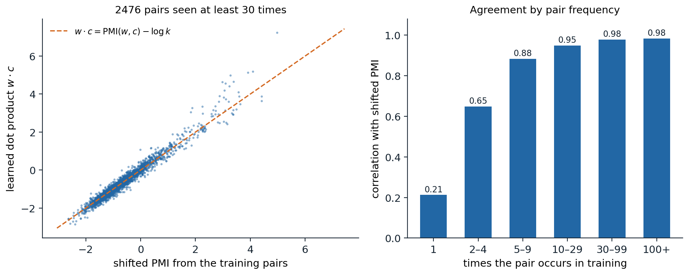
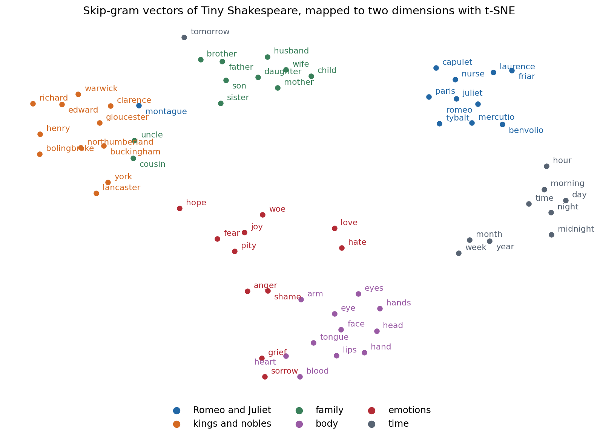

[ML Mastery Notes](../README.md) › [NLP and Large Language Models](README.md)

# 3. Word Embeddings

[← 2. N-gram Language Models and Perplexity](02-n-gram-language-models-and-perplexity.md) · [4. Transformer Language Models →](04-transformer-language-models.md)

## <a id="meaning-from-context"></a>Meaning from context

### <a id="symbols-and-vectors"></a>Symbols and vectors

A language model built on counts treats every word as an atomic symbol. Written as vectors, symbols are **one-hot**: word $i$ of a vocabulary of size $V$ is the $i$-th standard basis vector of $\mathbb R^V$, and any two different words are orthogonal and equally far apart. Nothing in this representation says that *king* is closer to *queen* than to *carrot*, which is why a trigram model learns nothing about *dog* from sentences about *cat* (chapter 2). A **word embedding** replaces the one-hot vector by a dense vector of a few hundred dimensions, $e_w\in\mathbb R^d$, arranged so that words used alike lie close together. Every neural language model begins with such a table of vectors, and the methods of this chapter explain what those vectors can capture and why.

The guiding principle is the **distributional hypothesis**: words that occur in similar contexts tend to have similar meanings ([Harris, 1954](https://doi.org/10.1080/00437956.1954.11659520)), or in Firth's phrase, "you shall know a word by the company it keeps." A reader who has never met the word *ongchoi* but sees that it is sautéed with garlic, served over rice, and has leaves like spinach can guess that it is a leafy vegetable. The methods below turn this idea into vectors in two ways, by counting contexts and factorizing the counts, and by training a model to predict contexts; the second turns out to be a version of the first.

### <a id="co-occurrence-matrices"></a>Co-occurrence matrices

The most direct representation of a word's contexts is a row of counts. In a **term–document matrix**, entry $(w,j)$ counts the occurrences of word $w$ in document $j$, so two words are similar if they occur in the same documents; this is the representation behind classical information retrieval (chapter 13). In a **word–context matrix**, entry $(w,c)$ counts how often context word $c$ appears within a window of $\pm L$ tokens around an occurrence of $w$. The window size changes what similarity means. Small windows of one to three words capture **functional** similarity: words that can replace each other in a sentence, such as *weep* and *mourn*, or two first names. Large windows, or whole documents, capture **topical** relatedness: *doctor* and *hospital*, *sword* and *battle*.

Raw counts make poor vectors. They are dominated by frequent context words such as *the* and *of*, which co-occur with everything and say little about any particular word, and their scale grows with the frequency of $w$.

### <a id="pointwise-mutual-information"></a>Pointwise mutual information

**Pointwise mutual information** ([Church and Hanks, 1990](https://aclanthology.org/J90-1003/)) measures how much more often $w$ and $c$ co-occur than they would if they were independent,

$$
\operatorname{PMI}(w,c)=\log\frac{P(w,c)}{P(w)\,P(c)}=\log\frac{\#(w,c)\,|D|}{\#(w)\,\#(c)},
$$

where $\#(w,c)$ counts the co-occurrences, $\#(w)=\sum_c\#(w,c)$ and $\#(c)=\sum_w\#(w,c)$ are the marginal counts, and $|D|$ is the total number of pairs. It is the log of the ratio in the mutual information of Foundations chapter 5, evaluated at a single pair of values rather than averaged. Positive values mark associations, zero independence, and negative values pairs that avoid each other; pairs never observed have $\operatorname{PMI}=-\infty$. Negative values are unreliable, because showing that two words co-occur less than chance requires far more data than showing that they co-occur more, so the standard representation is **positive PMI**,

$$
\operatorname{PPMI}(w,c)=\max\bigl(\operatorname{PMI}(w,c),0\bigr).
$$

PMI overrates rare context words: a context seen once, next to $w$, gets a large PMI from a single observation. A simple correction raises the context counts to a power $\alpha<1$ before normalizing, $P_\alpha(c)\propto\#(c)^\alpha$ with $\alpha=0.75$, which raises the probability of rare contexts and lowers their PMI. The value comes from word2vec, and it helps count-based vectors as much as predictive ones ([Levy, Goldberg, and Dagan, 2015](https://aclanthology.org/Q15-1016/)).

### <a id="low-rank-factorization"></a>Low-rank factorization

A PPMI matrix has as many columns as the vocabulary and is mostly zeros. Its truncated singular value decomposition $M\approx U_d\Sigma_dV_d^\top$ keeps the $d$ largest singular values, which gives the best rank-$d$ approximation in Frobenius norm (Foundations chapter 2), and the rows of $U_d\Sigma_d^{p}$ serve as $d$-dimensional word vectors, commonly with $p=1/2$ or $p=0$ rather than the "correct" $p=1$. Applied to term–document matrices this is **latent semantic analysis** (Deerwester et al., 1990). The low rank does more than save memory: it forces words with similar but not identical contexts to share dimensions, so two words can become similar without ever sharing a context word, through words that share contexts with both.

The code counts co-occurrences within two words on each side in Tiny Shakespeare, for the 3,322 words that occur at least five times, converts them to PPMI with smoothed context probabilities, and keeps 100 dimensions of the SVD. It lists the six nearest neighbors of several words by cosine similarity.

```python
import re
from collections import Counter

import numpy as np

text = open("Sources/Data/tinyshakespeare.txt", encoding="utf-8").read().lower()
toks = re.findall(r"[a-z]+(?:'[a-z]+)?", text)
counts = Counter(toks)
vocab = [w for w, c in counts.most_common() if c >= 5]
idx = {w: i for i, w in enumerate(vocab)}
V, window = len(vocab), 2
ids = np.array([idx.get(w, -1) for w in toks])

C = np.zeros((V, V))                                    # symmetric window co-occurrence counts
for off in range(1, window + 1):
    a, b = ids[:-off], ids[off:]
    ok = (a >= 0) & (b >= 0)
    np.add.at(C, (a[ok], b[ok]), 1)
    np.add.at(C, (b[ok], a[ok]), 1)

pw = C.sum(1) / C.sum()
pc = C.sum(0) ** 0.75 / (C.sum(0) ** 0.75).sum()       # smoothed context distribution
with np.errstate(divide="ignore"):
    pmi = np.log(C / C.sum()) - np.log(pw)[:, None] - np.log(pc)[None, :]
ppmi = np.maximum(pmi, 0)                               # positive PMI; -inf entries become 0
U, S, _ = np.linalg.svd(ppmi, full_matrices=False)
E = U[:, :100] * np.sqrt(S[:100])                       # 100-dimensional word vectors
E /= np.linalg.norm(E, axis=1, keepdims=True)
print(f"{len(toks)} tokens, {V} words with count >= 5, {int((C > 0).sum())} nonzero co-occurrences")
for w in ["king", "thou", "sword", "night", "romeo", "love", "weep"]:
    sims = E @ E[idx[w]]
    print(f"{w:6s}", " ".join(vocab[j] for j in np.argsort(-sims)[1:7]))
# 203839 tokens, 3322 words with count >= 5, 264272 nonzero co-occurrences
# king   richard henry edward vi york iii
# thou   art wilt dost hast not didst
# sword  hands date company gage promise ring
# night  morrow day last farewell romeo good
# romeo  juliet mercutio tybalt laurence nurse friar
# love   o hate soul juliet fear her
# weep   wherefore breathe choose oppression gaoler prevail
```

Even from 200,000 words the neighbors are sensible. *Romeo* is surrounded by the other characters of his play, *thou* by the verb forms that agree with it (*art*, *wilt*, *dost*), and *king* by the names that follow the word in *King Richard* and *King Henry*. The neighbors of *sword* and *weep* are poorer: both words are rarer, and a million characters of text do not pin down their contexts.

## <a id="learning-vectors-by-prediction"></a>Learning vectors by prediction

### <a id="the-skip-gram-model"></a>The skip-gram model

**Word2vec** ([Mikolov et al., 2013a](https://arxiv.org/abs/1301.3781); [2013b](https://arxiv.org/abs/1310.4546)) learns vectors by prediction rather than counting. The **skip-gram** model gives every word two vectors, a **word vector** $w$ used when it is the center and a **context vector** $c$ used when it is in the window, and models the probability of seeing context $c$ near word $w$ as a softmax over the vocabulary,

$$
P(c\mid w)=\frac{\exp(c^\top w)}{\sum_{c'}\exp(c'^\top w)}.
$$

Training maximizes the log-likelihood of all (word, context) pairs within the window. The model is a log-bilinear language model with no hidden layer, and its only parameters are the two embedding tables. The companion **continuous bag-of-words** (CBOW) model predicts the center word from the average of its context vectors. The obstacle is the normalizer: each gradient step for one pair touches all $V$ context vectors. The original papers avoided it with a **hierarchical softmax** over a binary tree of words, which costs $O(\log V)$ per pair, and with the simpler method that became standard.

### <a id="negative-sampling"></a>Negative sampling

**Skip-gram with negative sampling** (SGNS) replaces the softmax by binary classification. For each observed pair $(w,c)$ it draws $k$ **negative** contexts $c_1,\dots,c_k$ from a noise distribution $P_n$ and maximizes

$$
\log\sigma(c^\top w)+\sum_{i=1}^k\log\sigma(-c_i^\top w),
$$

so the model learns to tell real pairs from random ones with a logistic regression whose features are the two vectors (ML chapter 5). The objective is a simplified form of **noise-contrastive estimation** ([Gutmann and Hyvärinen, 2010](https://proceedings.mlr.press/v9/gutmann10a.html)) and a relative of the contrastive losses of DL chapter 10. Each step touches only $k+1$ context vectors, with $k$ between 2 and 20. The noise distribution is the unigram distribution raised to the power 0.75, the same smoothing as in PPMI. Word2vec also **subsamples** frequent words, discarding each occurrence of word $w$ with probability $1-\sqrt{t/f(w)}$ for its relative frequency $f(w)$ and a threshold $t$ around $10^{-5}$, which speeds training and effectively widens the window around rare words.

### <a id="what-skip-gram-computes"></a>What skip-gram computes

Although SGNS is trained by stochastic gradient descent on sampled pairs, its objective can be written as a sum over all word–context pairs with weights given by their counts, and each pair's term depends only on the single number $x=c^\top w$. If the dimension is large enough for every $x$ to be set independently, the optimum is

$$
c^\top w=\log\frac{\#(w,c)}{\#(w)\,P_n(c)}-\log k=\operatorname{PMI}(w,c)-\log k
$$

([Levy and Goldberg, 2014](https://papers.nips.cc/paper/5477-neural-word-embedding-as-implicit-matrix-factorization); [Appendix A](#block-nlp03-appendix-a)), with PMI computed against the noise distribution. SGNS therefore factorizes the matrix of PMI values shifted by $\log k$, like the SVD of the previous section but with a different loss: it weights each cell by how often the pair and its negatives were sampled, so frequent pairs are fit tightly and rare ones loosely, and it never sees the $-\infty$ entries of unobserved pairs directly. The code trains SGNS in PyTorch on the same pairs as the PPMI code, with 100 dimensions and $k=5$, then checks the prediction on the pairs seen at least 30 times.

```python
import re
from collections import Counter

import numpy as np
import torch

torch.manual_seed(0)
rng = np.random.default_rng(0)
text = open("Sources/Data/tinyshakespeare.txt", encoding="utf-8").read().lower()
toks = re.findall(r"[a-z]+(?:'[a-z]+)?", text)
counts = Counter(toks)
vocab = [w for w, c in counts.most_common() if c >= 5]
idx = {w: i for i, w in enumerate(vocab)}
ids = np.array([idx[w] for w in toks if w in idx])
V, d, k, window = len(vocab), 100, 5, 2

# All (word, context) pairs within the window, and the noise distribution: unigram^0.75
pairs = np.concatenate([np.stack([ids[:-o], ids[o:]], 1) for o in range(1, window + 1)])
pairs = np.concatenate([pairs, pairs[:, ::-1]])
freq = np.bincount(ids, minlength=V).astype(float)
noise = torch.tensor(freq ** 0.75 / (freq ** 0.75).sum())

W = torch.nn.Embedding(V, d); Cv = torch.nn.Embedding(V, d)       # word and context vectors
torch.nn.init.uniform_(W.weight, -0.5 / d, 0.5 / d); torch.nn.init.zeros_(Cv.weight)
opt = torch.optim.Adam(list(W.parameters()) + list(Cv.parameters()), lr=3e-3)
P = torch.tensor(pairs)
for epoch in range(8):
    perm = torch.randperm(len(P))
    total = 0.0
    for s in range(0, len(P), 4096):
        w, c = P[perm[s:s + 4096], 0], P[perm[s:s + 4096], 1]
        neg = torch.multinomial(noise, len(w) * k, replacement=True).view(-1, k)
        vw = W(w)
        pos = torch.nn.functional.logsigmoid((vw * Cv(c)).sum(1))
        negs = torch.nn.functional.logsigmoid(-(Cv(neg) @ vw.unsqueeze(2)).squeeze(2)).sum(1)
        loss = -(pos + negs).mean()
        opt.zero_grad(); loss.backward(); opt.step()
        total += loss.item() * len(w)
    print(f"epoch {epoch}: loss {total / len(P):.3f}")

E = torch.nn.functional.normalize(W.weight.detach(), dim=1)
for w in ["king", "thou", "sword", "night", "romeo", "love", "weep"]:
    sims = E @ E[idx[w]]
    print(f"{w:6s}", " ".join(vocab[j] for j in torch.argsort(-sims)[1:7].tolist()))

# At the optimum w.c = PMI(w, c) - log k, with P(c) the noise distribution.
pc = Counter(map(tuple, pairs.tolist()))
nw = np.bincount(pairs[:, 0], minlength=V)
keys = np.array([key for key, n in pc.items() if n >= 30])
n = np.array([pc[tuple(key)] for key in keys])
spmi = np.log(n / nw[keys[:, 0]]) - np.log(noise.numpy()[keys[:, 1]]) - np.log(k)
dots = (W.weight.detach()[keys[:, 0]] * Cv.weight.detach()[keys[:, 1]]).sum(1).numpy()
print(f"{len(keys)} pairs seen >= 30 times: correlation {np.corrcoef(spmi, dots)[0, 1]:.3f}, "
      f"mean dot {dots.mean():.2f} vs mean shifted PMI {spmi.mean():.2f}")
# epoch 0: loss 2.863
# epoch 1: loss 2.579
# epoch 2: loss 2.516
# epoch 3: loss 2.459
# epoch 4: loss 2.416
# epoch 5: loss 2.378
# epoch 6: loss 2.344
# epoch 7: loss 2.312
# king   crown convey'd foe marshal lewis richard
# thou   thyself liest couldst wilt wert dost
# sword  revenges conscience life company shoulders attempt
# night  day night's time goose morning bridal
# romeo  juliet mercutio banished laurence benvolio torch
# love   burden slander wits teach boldness juliet
# weep   conjure kneel mourn complain tarry intend
# 2476 pairs seen >= 30 times: correlation 0.980, mean dot -0.61 vs mean shifted PMI -0.63
```

For the 2,476 frequent pairs the learned dot products and the shifted PMI values correlate at 0.980, and their means differ by 0.02. The neighbors differ from those of PPMI and SVD in the direction the window suggests: *weep* now sits among verbs of the same kind (*mourn*, *complain*, *kneel*), *thou* among the verb forms it takes, and *night* next to *day*, *time*, and *morning*.



*Skip-gram with negative sampling on Tiny Shakespeare (100 dimensions, $k=5$, window of 2). Left: for the 2,476 word–context pairs seen at least 30 times, the learned dot product against $\operatorname{PMI}(w,c)-\log k$ computed from the training pairs; the dashed line is the predicted optimum. Right: the correlation falls with pair frequency, from 0.98 for pairs seen 30 or more times to 0.88 for 5–9 times and 0.21 for pairs seen once, whose PMI estimates are mostly noise that 100 dimensions cannot and should not reproduce.*

The equivalence explains a long debate. When word2vec appeared, its vectors beat count-based vectors on several benchmarks, which seemed to show that prediction was better than counting. [Levy, Goldberg, and Dagan (2015)](https://aclanthology.org/Q15-1016/) showed that most of the difference came from choices that could be transferred to either method, such as context-distribution smoothing, subsampling, the weighting of singular values, and adding the word and context vectors, and that with matched choices neither approach dominated.

### <a id="glove"></a>GloVe

**GloVe** ([Pennington, Socher, and Manning, 2014](https://aclanthology.org/D14-1162/)) makes the factorization explicit. It starts from the observation that ratios of co-occurrence probabilities carry meaning: $P(\textit{solid}\mid\textit{ice})/P(\textit{solid}\mid\textit{steam})$ is large, $P(\textit{gas}\mid\textit{ice})/P(\textit{gas}\mid\textit{steam})$ is small, and $P(\textit{water}\mid\cdot)$ is about the same for both, so the relation between *ice* and *steam* shows in the ratios. Asking differences of vectors to encode log ratios leads to a weighted least-squares fit of the log counts,

$$
J=\sum_{i,j:\,X_{ij}>0}f(X_{ij})\bigl(w_i^\top\tilde w_j+b_i+\tilde b_j-\log X_{ij}\bigr)^2,
\qquad f(x)=\min\bigl(1,(x/x_{\max})^{3/4}\bigr),
$$

where $X_{ij}$ counts co-occurrences, $b_i$ and $\tilde b_j$ are biases that absorb the word frequencies, and the weight $f$ discounts rare pairs and caps frequent ones at $x_{\max}=100$. Only the nonzero cells enter the sum, so training costs time proportional to the number of distinct co-occurring pairs. GloVe and SGNS perform similarly in practice; both are factorizations of a transformed co-occurrence matrix with a weighting that favors frequent pairs.

### <a id="subword-information"></a>Subword information

Word-level embeddings inherit the open-vocabulary problem of chapter 1: a rare word gets a poorly trained vector and an unseen word gets none. **FastText** ([Bojanowski et al., 2017](https://arxiv.org/abs/1607.04606)) represents a word as the sum of vectors for its character n-grams of lengths 3 to 6, with boundary markers, so *where* contributes `<wh`, `whe`, `her`, `ere`, `re>`, and longer pieces, plus a vector for the whole word. Words that share morphemes share parameters, an unseen word still gets a vector from its pieces, and the gains are largest for morphologically rich languages. Subword tokenizers made the same idea standard in later models, where each piece has its own embedding and the network composes them.

## <a id="using-word-vectors"></a>Using word vectors

### <a id="similarity-and-relatedness"></a>Similarity and relatedness

Word vectors are compared by **cosine similarity**, $\cos(u,v)=u^\top v/(\|u\|\|v\|)$, which ignores their lengths; lengths grow with word frequency and say more about how often a word appears than about what it means.



*Sixty-five words from six hand-chosen categories, embedded by skip-gram in 100 dimensions and mapped to the plane with t-SNE (perplexity 8, cosine distance). In the full 100 dimensions the nearest neighbor of a word belongs to its own category for 89% of the words with skip-gram and 94% with PPMI and SVD. Some placements reflect the corpus: Montague sits among the noble houses, and grief and sorrow sit next to heart and blood.*

Intrinsic evaluations correlate the cosine similarities of word pairs with human judgments, using Spearman's rank correlation, on datasets such as WordSim-353, which mixes similarity with relatedness, and SimLex-999, which rates similarity alone and penalizes related but dissimilar pairs such as *cup* and *coffee* ([Hill, Reichart, and Korhonen, 2015](https://aclanthology.org/J15-4004/)). Such benchmarks are cheap but correlate imperfectly with usefulness in downstream tasks, which is the evaluation that matters.

### <a id="analogies"></a>Analogies

Word vectors became famous for **analogies**. Answering "*man* is to *woman* as *king* is to ?" by the vocabulary word nearest to $e_{\textit{king}}-e_{\textit{man}}+e_{\textit{woman}}$, excluding the three question words, returns *queen* for vectors trained on large corpora, and similar offsets encode plurals, verb tenses, comparatives, and capitals of countries. The offsets work when the relation changes the contexts of each pair of words in the same way: if every context is as much more likely with *woman* than with *man* as it is with *queen* than with *king*, then the PMI vectors satisfy the analogy exactly ([Appendix B](#block-nlp03-appendix-b)).

The phenomenon is more fragile than its reputation. Excluding the question words matters, because the nearest vector to $e_{\textit{king}}-e_{\textit{man}}+e_{\textit{woman}}$ is usually *king* itself, and simple baselines that ignore part of the question, such as returning the nearest neighbor of the third word, already solve a substantial share of some benchmark categories ([Linzen, 2016](https://aclanthology.org/W16-2503/)). Analogies also need large corpora. On Tiny Shakespeare, skip-gram answers two of eight simple family and gender analogies (*he*:*she*::*his*:*her* and *father*:*mother*::*son*:*daughter*) and PPMI with SVD none, although both place the words of each category together.

### <a id="social-biases"></a>Social biases

Embeddings learn whatever associations the corpus contains, including stereotypes. Vectors trained on news text complete "*man* is to *computer programmer* as *woman* is to ?" with *homemaker* ([Bolukbasi et al., 2016](https://arxiv.org/abs/1607.06520)), and a test modeled on the psychologists' implicit association test recovers, from common web text, the same associations between names, genders, and races on one side and pleasant or career-related words on the other that people show ([Caliskan, Bryson, and Narayanan, 2017](https://doi.org/10.1126/science.aal4230)). Projecting out a "gender direction" removes the most visible effects, but the bias remains recoverable from the geometry of the other dimensions ([Gonen and Goldberg, 2019](https://aclanthology.org/N19-1061/)). The same problem, at larger scale and with more ways to surface, runs through the language models of later chapters.

### <a id="word-vectors-inside-larger-models"></a>Word vectors inside larger models

Before pretrained language models, word vectors were the main vehicle of transfer learning in NLP: vectors trained on billions of words initialized, or were frozen as the input layer of, models for tagging, parsing, and classification trained on small labeled sets. A neural language model contains the same object. Its input **embedding** table maps each token to a vector, its output layer scores each token by a dot product with a second table of vectors (chapter 4), and both are trained end to end with the rest of the network, like the word and context vectors of skip-gram.

## <a id="from-static-to-contextual-representations"></a>From static to contextual representations

### <a id="one-vector-per-word-type"></a>One vector per word type

A static embedding gives each word type one vector, but many words have several meanings: *bank* of a river and of money, *spring* the season and the coil. Its vector is a mixture of its senses weighted by their frequencies, and the senses can be recovered from it: [Arora et al. (2018)](https://aclanthology.org/Q18-1034/) showed that the vector of a polysemous word lies close to a weighted sum of vectors for its senses, which sparse coding can separate. A mixture still cannot tell which sense is meant in a given sentence, and downstream models had to work that out from the surrounding vectors.

### <a id="contextual-embeddings"></a>Contextual embeddings

A **contextual embedding** is a vector for a token in its sentence, computed by a network that reads the whole sentence. **ELMo** ([Peters et al., 2018](https://arxiv.org/abs/1802.05365)) took the hidden states of a bidirectional LSTM language model as word representations and gave large gains across tasks; BERT and GPT did the same with transformers, and the representation of a word in a pretrained transformer depends on everything around it (chapter 5). The static embedding survives as the first layer of these networks, which the upper layers progressively contextualize.

### <a id="sentences-and-documents"></a>Sentences and documents

Averaging the word vectors of a sentence gives a surprisingly strong sentence representation, especially when frequent words are downweighted and the common direction shared by all sentences is removed ([Arora, Liang, and Ma, 2017](https://openreview.net/forum?id=SyK00v5xx)). Current sentence and document embeddings come from transformers fine-tuned with contrastive objectives on pairs of related texts (chapter 5), and they power the dense retrieval of chapter 13.

## <a id="appendices"></a>Appendices


<details>
<summary><a id="block-nlp03-appendix-a"></a><b>A. The optimum of negative sampling is shifted PMI</b></summary>


Let $\#(w,c)$ be the number of times the pair $(w,c)$ is observed and $\#(w)=\sum_c\#(w,c)$. Each observed pair contributes $\log\sigma(c^\top w)$ and brings $k$ negatives drawn from $P_n$, so in expectation word $w$ is paired with context $c$ as a negative $k\,\#(w)\,P_n(c)$ times. The expected objective is

$$
\ell=\sum_{w,c}\Bigl[\#(w,c)\log\sigma(x_{wc})+k\,\#(w)\,P_n(c)\log\sigma(-x_{wc})\Bigr],\qquad x_{wc}=c^\top w.
$$

If the dimension is large enough that each $x_{wc}$ can be chosen freely, $\ell$ separates into one concave term per pair. Using $\frac{d}{dx}\log\sigma(x)=\sigma(-x)$ and $\frac{d}{dx}\log\sigma(-x)=-\sigma(x)$, the derivative is

$$
\#(w,c)\,\sigma(-x)-k\,\#(w)\,P_n(c)\,\sigma(x)=0
\quad\Longleftrightarrow\quad
e^{x}=\frac{\sigma(x)}{\sigma(-x)}=\frac{\#(w,c)}{k\,\#(w)\,P_n(c)}.
$$

Hence $x_{wc}=\log\frac{\#(w,c)}{\#(w)P_n(c)}-\log k$. With $P_n(c)=\#(c)/|D|$ this is $\operatorname{PMI}(w,c)-\log k$; with the smoothed noise distribution it is PMI computed against the smoothed context probabilities. Pairs never observed have $\#(w,c)=0$ and an optimum of $-\infty$, which a finite-dimensional factorization cannot reach, so the low-rank solution trades off the cells with weights $\#(w,c)+k\#(w)P_n(c)$ that emphasize frequent pairs. The number of negatives $k$ therefore plays two roles: it shifts every cell by $-\log k$, and it increases the weight on unobserved pairs.

</details>


<details>
<summary><a id="block-nlp03-appendix-b"></a><b>B. Why vector offsets solve analogies</b></summary>


Represent each word $w$ by its full PMI vector $p_w\in\mathbb R^V$ with entries $\operatorname{PMI}(w,c)=\log P(c\mid w)-\log P(c)$. Suppose a relation, such as male to female, changes the contexts of two word pairs in the same way:

$$
\frac{P(c\mid\textit{queen})}{P(c\mid\textit{king})}=\frac{P(c\mid\textit{woman})}{P(c\mid\textit{man})}\quad\text{for every context }c.
$$

Taking logarithms, the $\log P(c)$ terms cancel in each difference, and

$$
p_{\textit{queen}}-p_{\textit{king}}=p_{\textit{woman}}-p_{\textit{man}},\qquad\text{so}\qquad p_{\textit{queen}}=p_{\textit{king}}-p_{\textit{man}}+p_{\textit{woman}}
$$

exactly. Word embeddings that factorize PMI, $p_w\approx C^\top w$ for a context matrix $C$, inherit the relation approximately, as $C^\top(e_{\textit{queen}}-e_{\textit{king}}-e_{\textit{woman}}+e_{\textit{man}})\approx0$, and so the offset holds in the embedding up to directions that $C$ ignores. Real relations satisfy the ratio condition only approximately and only for some contexts, which is why analogies hold for some word pairs and fail for others; [Allen and Hospedales (2019)](https://arxiv.org/abs/1901.09813) develop this argument in terms of paraphrases, showing how the error terms depend on how far the condition fails.

</details>

---

[← 2. N-gram Language Models and Perplexity](02-n-gram-language-models-and-perplexity.md) · [4. Transformer Language Models →](04-transformer-language-models.md)
