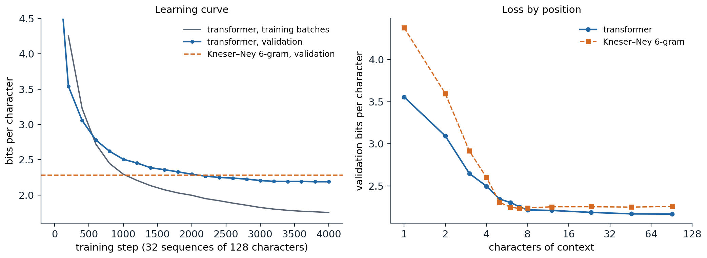

[ML Mastery Notes](../README.md) › [NLP and Large Language Models](README.md)

# 4. Transformer Language Models

[← 3. Word Embeddings](03-word-embeddings.md) · [5. Pretraining and Transfer →](05-pretraining-and-transfer.md)

## <a id="neural-language-models"></a>Neural language models

### <a id="sharing-statistical-strength"></a>Sharing statistical strength

A count-based model learns nothing about one context from another unless they match exactly (chapter 2). The **neural probabilistic language model** of [Bengio et al. (2003)](https://www.jmlr.org/papers/v3/bengio03a.html) removed this limitation. It kept the Markov window of an n-gram model but mapped each of the previous $n-1$ words to a learned embedding (chapter 3), concatenated the embeddings, passed them through a hidden layer, and produced the next-word distribution with a softmax:

$$
P(w_t\mid w_{t-n+1:t-1})=\operatorname{softmax}\bigl(U\tanh(H[e_{w_{t-n+1}};\dots;e_{w_{t-1}}]+b)+c\bigr)_{w_t}.
$$

Words with similar embeddings now produce similar predictions, so evidence about *the cat is walking* transfers to *a dog was running*, and the number of parameters grows linearly with the window instead of exponentially. The model beat the best smoothed n-gram models of its time in perplexity, and did better still interpolated with them. Its costs were training time, dominated by the softmax over the whole vocabulary, and the fixed window.

### <a id="recurrent-language-models"></a>Recurrent language models

A recurrent network (DL chapter 8) removes the fixed window: its hidden state summarizes the entire prefix, and the next-token distribution is a softmax of that state. [Mikolov et al. (2010)](https://doi.org/10.21437/Interspeech.2010-343) showed that recurrent language models, combined, halved the perplexity of backoff n-gram models on speech-recognition text, and LSTM language models then dominated the field: large LSTMs lowered the perplexity on the One Billion Word benchmark from 51.3 to 30.0 ([Jozefowicz et al., 2016](https://arxiv.org/abs/1602.02410)), and character-level LSTMs trained on a few megabytes of Shakespeare, the origin of the Tiny Shakespeare corpus used here, produced text with convincing layout and spelling ([Karpathy, 2015](https://karpathy.github.io/2015/05/21/rnn-effectiveness/)). Recurrence also imposed a sequential computation that is slow to train on parallel hardware, and gradients through hundreds of steps remained hard to control.

### <a id="transformer-language-models"></a>Transformer language models

A **decoder-only transformer** (DL chapter 9) computes the representation of every position from all earlier positions through causal self-attention. Because the causal mask hides the future, a single forward pass over a sequence of $T$ tokens produces all $T$ next-token predictions at once, each conditioned only on its own prefix, and training parallelizes across positions as well as across sequences. OpenAI's **GPT** ([Radford et al., 2018](https://cdn.openai.com/research-covers/language-unsupervised/language_understanding_paper.pdf)) pretrained a 12-layer model on books and fine-tuned it for downstream tasks; **GPT-2** ([Radford et al., 2019](https://cdn.openai.com/better-language-models/language_models_are_unsupervised_multitask_learners.pdf)) scaled to 1.5 billion parameters and 40 GB of web text and performed some tasks without fine-tuning; **GPT-3** ([Brown et al., 2020](https://arxiv.org/abs/2005.14165)) scaled to 175 billion parameters and 300 billion tokens and learned tasks from examples in its prompt (chapter 9). Almost every large language model since has the same basic design. This chapter treats what is specific to language modeling; the attention block, position encodings, the key–value cache, and the counting of parameters and operations are in DL chapters 9 and 11.

## <a id="training-a-language-model"></a>Training a language model

### <a id="the-objective"></a>The objective

A language model with parameters $\theta$ is trained by maximum likelihood: over a corpus of sequences, it minimizes the average negative log-probability of each token given the tokens before it,

$$
\mathcal L(\theta)=-\frac1N\sum_{\text{sequences }x}\ \sum_{t=1}^{|x|}\log p_\theta(x_t\mid x_{<t}),
$$

with $N$ the total number of predicted tokens. Every position of every sequence is a training example with a classification target, the next token, and the loss is the cross-entropy of ML chapter 5 over a vocabulary of $V$ classes. The conditioning prefix is always the true text, never the model's own output, which is called **teacher forcing**. At generation time the model conditions on its own samples instead, a mismatch known as **exposure bias**: an early mistake produces a prefix unlike anything seen in training. Methods that train on the model's own samples ([Bengio et al., 2015](https://arxiv.org/abs/1506.03099); [Ranzato et al., 2016](https://arxiv.org/abs/1511.06732)) were proposed to close the gap, but at scale teacher forcing works well, and the effects of the mismatch are mostly addressed at decoding time (chapter 8).

A useful check follows from the objective. At initialization, when all logits are near zero, the model predicts the uniform distribution and the loss is $\ln V$; a model that starts much higher has an initialization problem, such as an output layer with too large a scale.

### <a id="preparing-the-data"></a>Preparing the data

The training corpus is tokenized once (chapter 1), the documents are concatenated with an end-of-text token between them, and the stream is cut into blocks of the context length $T$. Batches are drawn from these blocks in random order. A block can span the end of one document and the start of another; for short contexts the model simply learns that the end-of-text token resets the topic, and for long-context training the attention mask is often modified so that tokens attend only within their own document, as in Llama 3 ([Llama Team, 2024](https://arxiv.org/abs/2407.21783)). Large models see most of their data once or a few times, so pretraining is closer to one pass over a stream than to many epochs over a dataset, and overfitting in the classical sense is rare (chapter 6).

### <a id="a-small-character-model"></a>A small character model

The code trains a two-layer transformer with 108,000 parameters on the characters of Tiny Shakespeare, using PyTorch's built-in transformer block with pre-normalization, learned positions, and an output layer tied to the input embedding. It holds out the last 10% of the text for validation, starts from the uniform prediction, and trains for 1,500 steps on random 64-character windows.

```python
import math

import torch
from torch import nn

torch.manual_seed(0)
text = open("Sources/Data/tinyshakespeare.txt", encoding="utf-8").read()
chars = sorted(set(text))
stoi = {c: i for i, c in enumerate(chars)}
data = torch.tensor([stoi[c] for c in text])
train, val = data[:int(0.9 * len(data))], data[int(0.9 * len(data)):]
V, T, d, L, heads = len(chars), 64, 64, 2, 4


class CharLM(nn.Module):
    """Decoder-only transformer: embeddings, causal pre-norm blocks, tied output layer."""

    def __init__(self):
        super().__init__()
        self.tok, self.pos = nn.Embedding(V, d), nn.Embedding(T, d)
        block = nn.TransformerEncoderLayer(d, heads, 4 * d, dropout=0.0, activation="gelu",
                                           batch_first=True, norm_first=True)
        self.blocks = nn.TransformerEncoder(block, L, enable_nested_tensor=False)
        self.ln, self.out = nn.LayerNorm(d), nn.Linear(d, V, bias=False)
        self.out.weight = self.tok.weight                  # weight tying
        for p in [self.tok.weight, self.pos.weight]:
            nn.init.normal_(p, std=0.02)
        self.register_buffer("mask", nn.Transformer.generate_square_subsequent_mask(T))

    def forward(self, x):                                  # (batch, t) token ids -> (batch, t, V) logits
        t = x.shape[1]
        h = self.tok(x) + self.pos(torch.arange(t))
        return self.out(self.ln(self.blocks(h, mask=self.mask[:t, :t], is_causal=True)))


def batch(split, n):
    ix = torch.randint(len(split) - T - 1, (n,))
    return torch.stack([split[i:i + T] for i in ix]), torch.stack([split[i + 1:i + T + 1] for i in ix])


def loss_on(model, x, y):                                  # mean next-token cross-entropy, nats
    return nn.functional.cross_entropy(model(x).reshape(-1, V), y.reshape(-1))


model = CharLM()
print(f"{sum(p.numel() for p in model.parameters()):,} parameters; vocabulary {V}, ln V = {math.log(V):.3f}")
opt = torch.optim.AdamW(model.parameters(), lr=3e-3, weight_decay=0.1)
steps = 1500
sched = torch.optim.lr_scheduler.OneCycleLR(opt, max_lr=3e-3, total_steps=steps, pct_start=0.05)
xv, yv = batch(val, 256)
for step in range(steps + 1):
    if step % 300 == 0:
        with torch.no_grad():
            vl = loss_on(model, xv, yv).item()
        print(f"step {step:4d}: validation loss {vl:.3f} nats = {vl / math.log(2):.2f} bits per character")
    if step == steps:
        break
    x, y = batch(train, 32)
    loss = loss_on(model, x, y)
    opt.zero_grad(); loss.backward(); opt.step(); sched.step()

g = torch.Generator().manual_seed(1)
ctx = torch.tensor([[stoi[c] for c in "ROMEO:\n"]])
with torch.no_grad():
    for _ in range(150):
        probs = torch.softmax(model(ctx[:, -T:])[0, -1], dim=0)
        ctx = torch.cat([ctx, torch.multinomial(probs, 1, generator=g)[None]], dim=1)
print("".join(chars[i] for i in ctx[0].tolist()))
# 108,352 parameters; vocabulary 65, ln V = 4.174
# step    0: validation loss 4.137 nats = 5.97 bits per character
# step  300: validation loss 2.279 nats = 3.29 bits per character
# step  600: validation loss 2.010 nats = 2.90 bits per character
# step  900: validation loss 1.912 nats = 2.76 bits per character
# step 1200: validation loss 1.840 nats = 2.65 bits per character
# step 1500: validation loss 1.823 nats = 2.63 bits per character
# ROMEO:
# I'll more mock--
#
# SIOLINY CE lord:
# There did itch which up,'its this For nar train;
# Ye you hand thee, thereforth is vould that but I clain.
#
# DURET:
# My
```

The loss starts at 4.137 nats, close to $\ln65=4.174$, and falls to 2.63 bits per character in 1,500 steps. The sample has the layout of a play (speaker names in capitals, line breaks, punctuation) and many real words, with little sense. The figure shows a larger model, with 818,000 parameters, four layers of width 128, and a context of 128 characters, trained for 4,000 steps.



*A four-layer character transformer (818,048 parameters, context 128) trained on 90% of Tiny Shakespeare. Left: loss on training batches (averaged over the preceding 200 steps) and on 128 fixed windows of the held-out last 10%, in bits per character. Validation reaches 2.19 bits after 4,000 steps and passes the Kneser–Ney 6-gram model trained on the same 90% (2.28 bits on the same windows) at about step 2,100. Right: validation loss against the number of characters of context, averaged over 4,096 windows (positions beyond 8 are grouped in bins of 9–16, 17–32, 33–64, and 65–128). The transformer falls from 3.56 bits with one character of context to 2.22 with eight and 2.17 with 65–128; Kneser–Ney is slightly better with five to seven characters and stays near 2.25 beyond its five-character window.*

The two curves separate early. The training loss keeps falling, to 1.75 bits, while the validation loss levels off at 2.19: most of the validation text comes from *The Taming of the Shrew* and *The Tempest*, which the model has seen little or none of, and after about 16 passes over one megabyte even a small model memorizes phrases of its training plays. On the whole validation text the transformer needs 2.19 bits per character against 2.25 for Kneser–Ney, a modest lead for a model trained for twenty minutes on a laptop-class processor. Scale widens it: nanoGPT's six-layer character model of about 11 million parameters, trained with dropout on a GPU on the same split, reaches 1.47 nats, or 2.12 bits ([Karpathy, nanoGPT](https://github.com/karpathy/nanoGPT)). Samples show the order in which structure is learned. After 200 steps the model has the layout of a play and a few short words (*Sast tris, ao cke hisiere bo acm?*); after 1,000 it spells most words and invents plausible names (*DUKE OF YOK*); after 4,000 its lines are mostly real words in grammatical fragments (*'Tis not yieldity, thy prisoner here is Roman*).

### <a id="loss-by-position"></a>Loss by position

The right panel shows how the loss depends on the amount of context. Both models improve quickly over the first few characters, which pin down the current word; with one to four characters the transformer is far better, because Kneser–Ney's lower-order distributions are built for backing off rather than for predicting alone (chapter 2). With five to seven characters Kneser–Ney is slightly better, drawing on exact memorized 6-grams. Beyond its window it can use nothing more, while the transformer keeps improving slowly, by 0.05 bits between 8 and 128 characters of context, from the speaker's name, the meter, and words repeated from earlier lines. The gain from long context is small for a model of this size trained on a single megabyte. In large models trained on long documents it is large, and the per-token loss keeps falling as a power law in the position over thousands of tokens ([Kaplan et al., 2020](https://arxiv.org/abs/2001.08361)), which is why longer contexts are worth their cost ([Long context](#long-context)).

## <a id="the-output-layer"></a>The output layer

### <a id="logits-and-weight-tying"></a>Logits and weight tying

The final hidden state $h_t\in\mathbb R^d$ is mapped to a vector of **logits** $z_t=W_Uh_t\in\mathbb R^V$ by the **unembedding** matrix $W_U$, and the softmax turns logits into probabilities. The input embedding $E\in\mathbb R^{V\times d}$ and the unembedding have the same shape, and **weight tying** sets $W_U=E$ ([Press and Wolf, 2017](https://arxiv.org/abs/1608.05859); [Inan, Khosravi, and Socher, 2017](https://arxiv.org/abs/1611.01462)). Tying saves $Vd$ parameters and regularizes: each token's input vector also receives gradient from every prediction of that token. It is standard in small models and common in large ones (GPT-2 and Gemma tie; Llama does not), where the embeddings are a small share of the parameters.

### <a id="the-softmax-bottleneck"></a>The softmax bottleneck

The log-probabilities of a softmax model are $\log p(x\mid c)=h_c^\top w_x-\log Z_c$, a dot product minus a normalizer. Stacked over many contexts $c$ and all tokens $x$, they form a matrix of rank at most $d+1$ ([Appendix A](#block-nlp04-appendix-a)). If the true conditional distributions of language, arranged the same way, had a log-probability matrix of higher rank, no choice of parameters could represent them exactly, however large the network before the output layer. [Yang et al. (2018)](https://arxiv.org/abs/1711.03953) called this the **softmax bottleneck** and removed it with a mixture of several softmaxes, which lowered perplexity substantially for the LSTM models of the time. For large transformers with $d$ in the thousands the bottleneck matters less, but it resurfaces in small models with large vocabularies and in the observation that some distributions, such as a uniform choice among a few specific tokens, are hard for a single softmax to express.

### <a id="calibration"></a>Calibration

A model trained with log loss is pushed toward **calibrated** probabilities: of all the tokens to which it assigns probability 0.3, about 30% should be correct. The code loads the trained model from the figure, computes its predicted distribution at every position of the validation text, and compares predicted probabilities with observed frequencies.

```python
import math

import torch
from torch import nn

ckpt = torch.load("Sources/Data/shakespeare-char-transformer.pt")   # trained by the chapter's figure script
cfg, chars = ckpt["config"], ckpt["chars"]


class CharLM(nn.Module):
    def __init__(self, V, T, d, L, heads):
        super().__init__()
        self.tok, self.pos = nn.Embedding(V, d), nn.Embedding(T, d)
        block = nn.TransformerEncoderLayer(d, heads, 4 * d, dropout=0.0, activation="gelu",
                                           batch_first=True, norm_first=True)
        self.blocks = nn.TransformerEncoder(block, L, enable_nested_tensor=False)
        self.ln, self.out = nn.LayerNorm(d), nn.Linear(d, V, bias=False)
        self.out.weight = self.tok.weight
        self.register_buffer("mask", nn.Transformer.generate_square_subsequent_mask(T))

    def forward(self, x):
        t = x.shape[1]
        h = self.tok(x) + self.pos(torch.arange(t))
        return self.out(self.ln(self.blocks(h, mask=self.mask[:t, :t], is_causal=True)))


model = CharLM(**cfg)
model.load_state_dict(ckpt["state_dict"])
model.eval()
text = open("Sources/Data/tinyshakespeare.txt", encoding="utf-8").read()
stoi = {c: i for i, c in enumerate(chars)}
val = torch.tensor([stoi[c] for c in text[int(0.9 * len(text)):]])
T = cfg["T"]
x = torch.stack([val[i:i + T] for i in range(0, len(val) - T - 1, T)])   # non-overlapping windows
y = torch.stack([val[i + 1:i + T + 1] for i in range(0, len(val) - T - 1, T)])
with torch.no_grad():
    probs = torch.softmax(model(x), dim=-1).reshape(-1, cfg["V"])
y = y.reshape(-1)
nll = -torch.log(probs[torch.arange(len(y)), y]).mean().item()
print(f"{len(y)} validation characters: {nll / math.log(2):.3f} bits per character")

# Calibration: among all (position, candidate) pairs given probability in a bin, how often is the candidate right?
p_all = probs.reshape(-1)
hit = torch.zeros_like(probs)
hit[torch.arange(len(y)), y] = 1.0
hit = hit.reshape(-1)
edges = torch.tensor([0.0, 0.01, 0.05, 0.1, 0.2, 0.3, 0.5, 0.7, 0.9, 1.0])
print("predicted probability    mean prediction   observed frequency   pairs")
for lo, hi in zip(edges[:-1], edges[1:]):
    sel = (p_all >= lo) & (p_all < hi)
    print(f"  [{lo:.2f}, {hi:.2f})  {p_all[sel].mean():17.3f} {hit[sel].mean():20.3f} {int(sel.sum()):8d}")
top, arg = probs.max(1)
print(f"top prediction: mean confidence {top.mean():.3f}, accuracy {(arg == y).float().mean():.3f}")
# 111488 validation characters: 2.189 bits per character
# predicted probability    mean prediction   observed frequency   pairs
#   [0.00, 0.01)              0.000                0.001  6415190
#   [0.01, 0.05)              0.025                0.029   445288
#   [0.05, 0.10)              0.070                0.074   165121
#   [0.10, 0.20)              0.139                0.138    92992
#   [0.20, 0.30)              0.244                0.225    32313
#   [0.30, 0.50)              0.387                0.346    30482
#   [0.50, 0.70)              0.596                0.541    19043
#   [0.70, 0.90)              0.805                0.747    18479
#   [0.90, 1.00)              0.968                0.932    27812
# top prediction: mean confidence 0.595, accuracy 0.555
```

Over the whole validation text the model needs 2.19 bits per character. Its probabilities are close to calibrated where most predictions lie: candidates given 5–10% are right 7.4% of the time for a mean prediction of 7.0%, and those given 10–20% are right 13.8% of the time for 13.9%. At high probabilities it is somewhat overconfident: characters predicted with probability above 0.9 are right 93.2% of the time for a mean of 96.8%, and the top prediction is right 55.5% of the time for a mean confidence of 59.5%. The overconfidence is the same shift that separates the training and validation curves: the model is calibrated for its training plays and meets new ones in validation. Large pretrained models are similarly calibrated: GPT-4's pretrained model assigned probabilities to multiple-choice answers that matched its accuracy closely, and post-training for helpfulness made them markedly overconfident ([OpenAI, 2023](https://arxiv.org/abs/2303.08774)). Calibration is a property of the pretrained next-token distribution on data like its training data; it does not guarantee that a model's stated confidence in an answer means anything (chapter 14).

## <a id="choosing-the-shape-of-a-model"></a>Choosing the shape of a model

### <a id="recurring-choices"></a>Recurring choices

Published large models agree closely on their proportions.

| Model | Parameters | Layers | Width $d$ | Heads (key–value heads) | MLP width | Vocabulary | Context | Training tokens |
| --- | --- | --- | --- | --- | --- | --- | --- | --- |
| GPT-3 ([Brown et al., 2020](https://arxiv.org/abs/2005.14165)) | 175B | 96 | 12,288 | 96 | 49,152 | 50,257 | 2,048 | 300B |
| Llama 2 70B ([Touvron et al., 2023](https://arxiv.org/abs/2307.09288)) | 70B | 80 | 8,192 | 64 (8) | 28,672 | 32,000 | 4,096 | 2T |
| Llama 3 405B ([Llama Team, 2024](https://arxiv.org/abs/2407.21783)) | 405B | 126 | 16,384 | 128 (8) | 53,248 | 128,256 | 8,192, extended to 128K | 15.6T |
| DeepSeek-V3 ([DeepSeek-AI, 2024](https://arxiv.org/abs/2412.19437)) | 671B, 37B active | 61 | 7,168 | 128 (latent) | 256 experts of 2,048, 8 active, plus 1 shared | 128K | 4,096, extended to 128K | 14.8T |

All four use attention heads of dimension 128, a ratio of width to depth between about 100 and 130, and MLP layers three to four times wider than the model; all but GPT-3 use gated MLPs, rotary positions, RMSNorm, and grouped or compressed key–value heads (DL chapter 9). These choices are not sharp optima. [Kaplan et al. (2020)](https://arxiv.org/abs/2001.08361) found that at a fixed number of parameters the loss depends only weakly on the ratio of width to depth over a wide range, and on the number of heads and the MLP ratio; what matters most is the total number of parameters and the amount of training (chapter 7). The proportions are chosen as much for hardware as for loss: widths that are multiples of 128 fill matrix units, fewer layers mean less pipeline communication, and fewer key–value heads mean a smaller cache at inference.

### <a id="training-recipes"></a>Training recipes

Recipes have also converged: AdamW with $\beta_2=0.95$, weight decay 0.1, gradient clipping at norm 1, no dropout, a short linear warmup, and a learning rate that decays by a factor of about ten, following a cosine or, increasingly, a **warmup–stable–decay** schedule that holds the rate constant and decays it quickly at the end, which lets one run be extended and still end with a decayed checkpoint ([Hu et al., 2024](https://arxiv.org/abs/2404.06395)). The largest runs still suffer **loss spikes**, sudden jumps in loss that sometimes do not recover. The remedies of DL chapter 9, normalizing queries and keys and penalizing the output normalizer, reduce them, and PaLM's training restarted from a checkpoint before each spike and skipped the few hundred batches that preceded it ([Chowdhery et al., 2022](https://arxiv.org/abs/2204.02311)). Learning rates and initializations tuned on a small model transfer to a large one only with an appropriate parameterization, a question taken up with scaling laws in chapter 7.

## <a id="mixture-of-experts"></a>Mixture of experts

### <a id="sparse-expert-layers"></a>Sparse expert layers

A dense model uses all its parameters for every token, so its cost per token grows with its size. A **mixture-of-experts** (MoE) layer replaces the MLP of a block by $E$ expert MLPs and a **router** that sends each token to only $k$ of them ([Shazeer et al., 2017](https://arxiv.org/abs/1701.06538)). For a token with hidden state $x$, the router computes probabilities $p=\operatorname{softmax}(W_rx)$ over experts, selects the set $\mathcal T$ of the $k$ largest, and outputs the gated sum of their outputs,

$$
y=\sum_{i\in\mathcal T}g_i\,\mathrm{MLP}_i(x),
$$

with gates $g_i$ equal to $p_i$ or to $p_i$ renormalized over $\mathcal T$. The model then has many more parameters than it uses for any one token: Mixtral 8x7B has eight experts per layer, routes each token to two, and uses 13 billion of its 47 billion parameters per token ([Jiang et al., 2024](https://arxiv.org/abs/2401.04088)); DeepSeek-V3 routes each token to 8 of 256 small experts plus one shared expert that every token uses, and activates 37 of 671 billion parameters ([DeepSeek-AI, 2024](https://arxiv.org/abs/2412.19437)). Only the MLPs are sparse; attention remains dense.

### <a id="balancing-the-load"></a>Balancing the load

Routing is learned, and it tends to collapse: experts that receive more tokens early are trained more, become better, and receive still more tokens, while others are starved. Collapse wastes parameters and, when experts sit on different devices, overloads some devices while others idle. The **Switch Transformer** ([Fedus, Zoph, and Shazeer, 2022](https://arxiv.org/abs/2101.03961)), which routes each token to a single expert, adds an auxiliary **load-balancing loss**

$$
\mathcal L_{\mathrm{bal}}=\alpha\,E\sum_{i=1}^Ef_i\,P_i,
$$

where $f_i$ is the fraction of tokens in the batch routed to expert $i$ and $P_i$ is the mean router probability of expert $i$. The fraction $f_i$ is not differentiable, but $P_i$ is, and the gradient lowers the router probabilities of the busiest experts; the loss equals $\alpha$ at uniform routing, its minimum when the router's choices and probabilities agree ([Appendix B](#block-nlp04-appendix-b)). The code trains a top-1 mixture of eight linear experts on a regression task with eight clusters of inputs, each needing its own linear map, with and without the balancing loss.

```python
import torch
from torch import nn

torch.manual_seed(0)
# Synthetic task: 8 clusters of inputs, each with its own linear map to the target.
K, d, n = 8, 16, 8192
centers = 3 * torch.randn(K, d)
maps = torch.randn(K, d, d) / d ** 0.5
z = torch.randint(K, (n,))
x = centers[z] + torch.randn(n, d)
y = torch.einsum("nij,nj->ni", maps[z], x)


class SwitchMoE(nn.Module):
    """Top-1 mixture of experts: a router picks one expert per token and scales its output by the gate."""

    def __init__(self, E):
        super().__init__()
        self.E = E
        self.router = nn.Linear(d, E, bias=False)
        self.experts = nn.ModuleList(nn.Linear(d, d) for _ in range(E))    # each expert is linear

    def forward(self, x):
        probs = torch.softmax(self.router(x), dim=-1)          # router distribution over experts
        gate, choice = probs.max(dim=-1)                       # top-1 expert and its probability
        out = torch.zeros_like(x)
        for e in range(self.E):
            sel = choice == e
            if sel.any():
                out[sel] = gate[sel, None] * self.experts[e](x[sel])
        f = torch.bincount(choice, minlength=self.E).float() / len(x)   # fraction of tokens per expert
        P = probs.mean(0)                                      # mean router probability per expert
        return out, self.E * (f * P).sum(), f                  # Switch load-balancing loss E * sum f_i P_i


for alpha in [0.0, 0.1, 1.0]:
    torch.manual_seed(1)
    moe = SwitchMoE(E=8)
    opt = torch.optim.Adam(moe.parameters(), lr=3e-3)
    for step in range(3000):
        b = torch.randint(n, (256,))
        out, balance, f = moe(x[b])
        loss = nn.functional.mse_loss(out, y[b]) + alpha * balance
        opt.zero_grad(); loss.backward(); opt.step()
    with torch.no_grad():
        out, balance, f = moe(x)
        mse = nn.functional.mse_loss(out, y).item()
    print(f"balancing weight {alpha}: mse {mse:.3f}, balance loss {balance.item():.2f}, "
          f"tokens per expert {[round(v, 2) for v in f.tolist()]}")
# balancing weight 0.0: mse 0.226, balance loss 1.28, tokens per expert [0.12, 0.13, 0.24, 0.13, 0.0, 0.13, 0.04, 0.2]
# balancing weight 0.1: mse 0.001, balance loss 1.00, tokens per expert [0.12, 0.13, 0.12, 0.12, 0.12, 0.13, 0.12, 0.12]
# balancing weight 1.0: mse 0.001, balance loss 1.00, tokens per expert [0.12, 0.13, 0.12, 0.12, 0.12, 0.13, 0.12, 0.12]
```

Without balancing, one expert never receives a token and another takes two clusters, which a single linear map cannot fit, so the error stays high. With a balancing weight of 0.1, each expert takes one cluster and the error falls to nearly zero. Production systems add further safeguards: each expert has a **capacity**, a maximum number of tokens per batch beyond which tokens are dropped or rerouted; a **router z-loss** keeps router logits small for numerical stability ([Zoph et al., 2022](https://arxiv.org/abs/2202.08906)); and DeepSeek-V3 replaces the auxiliary loss by a per-expert bias added to the router scores for selection only, raised for underloaded experts and lowered for overloaded ones, which balances the load without adding a competing term to the objective.

### <a id="what-experts-buy"></a>What experts buy

At a fixed compute budget per token, sparse models reach a lower loss than dense ones: the Switch Transformer matched the quality of a dense T5 model with up to seven times fewer training steps at the same computation per token. Experts specialize less by topic than one might expect; routing decisions correlate mostly with token identity and syntax. The costs are memory, since all experts must be stored and, in serving, loaded; communication, since tokens travel between devices that hold different experts (DL chapter 11); and a history of instability in training and fine-tuning. Mixtures of experts have become the standard design for the largest open models.

## <a id="long-context"></a>Long context

### <a id="extending-the-context-window"></a>Extending the context window

Context windows have grown from 1,024 tokens in GPT-2 to 128,000 or more. Training at full length throughout is wasteful, because attention costs grow with the square of the length and most training documents are short, so models are pretrained at a moderate length and then trained briefly on long documents. With rotary position embeddings (DL chapter 9), the extension has to deal with rotation angles the model never saw. Each coordinate pair $j$ of a head of dimension $d$ rotates by $\theta_j=b^{-2j/d}$ radians per position for a base $b$ (10,000 originally). High-frequency pairs complete many turns within the training length, so every angle has been seen; low-frequency pairs complete less than one turn, and positions beyond the training length give them angles never seen in training. Three remedies are common.

- **Position interpolation** ([Chen et al., 2023](https://arxiv.org/abs/2306.15595)) divides every position by the extension factor $s$, so all angles stay within the trained range, but neighboring tokens become $s$ times closer in angle, which blurs the high frequencies that encode local order.
- **Changing the base.** Enlarging $b$ slows all rotations, the low frequencies most, while the highest frequency stays fixed. The "NTK-aware" choice $b'=b\,s^{d/(d-2)}$ interpolates the lowest frequency exactly by $s$ and leaves the highest unchanged ([Appendix C](#block-nlp04-appendix-c)). Llama 3 trains with a base of 500,000 from the start.
- **YaRN** ([Peng et al., 2023](https://arxiv.org/abs/2309.00071)) interpolates each frequency by a different amount, not at all for pairs that complete many turns and fully for those that complete less than one, and slightly sharpens the attention softmax to compensate for longer contexts.

All three need only a small amount of training at the new length, on the order of a thousand steps. The code compares the angles each scheme produces for a model trained on 4,096 positions and extended four times.

```python
import numpy as np

d, base, L_train, s = 128, 10_000.0, 4096, 4           # head dimension, RoPE base, trained length, extension factor
j = np.arange(d // 2)
theta = base ** (-2 * j / d)                            # rotation per position for coordinate pair j
theta_ntk = (base * s ** (d / (d - 2))) ** (-2 * j / d)  # "NTK-aware": enlarge the base instead
L_new = s * L_train
print(f"pairs completing a full turn within {L_train} positions: {np.sum(theta * L_train >= 2 * np.pi)} of {d // 2}")
print(" pair   wavelength   turns seen   turns at 4x: extrapolate  interpolate  NTK-aware   step: PI/orig  NTK/orig")
for k in [0, 16, 32, 40, 48, 63]:
    turns = lambda th, pos: th[k] * pos / (2 * np.pi)
    print(f"{k:5d} {2 * np.pi / theta[k]:12.0f} {turns(theta, L_train):12.3f} "
          f"{turns(theta, L_new):24.3f} {turns(theta / s, L_new):12.3f} {turns(theta_ntk, L_new):11.3f} "
          f"{1 / s:15.2f} {theta_ntk[k] / theta[k]:9.2f}")
# pairs completing a full turn within 4096 positions: 46 of 64
#  pair   wavelength   turns seen   turns at 4x: extrapolate  interpolate  NTK-aware   step: PI/orig  NTK/orig
#     0            6      651.899                 2607.595      651.899    2607.595            0.25      1.00
#    16           63       65.190                  260.759       65.190     183.373            0.25      0.70
#    32          628        6.519                   26.076        6.519      12.895            0.25      0.49
#    40         1987        2.061                    8.246        2.061       3.420            0.25      0.41
#    48         6283        0.652                    2.608        0.652       0.907            0.25      0.35
#    63        54410        0.075                    0.301        0.075       0.075            0.25      0.25
```

Of the 64 coordinate pairs, 18 never complete a full turn within 4,096 positions. Extrapolating to 16,384 positions sends them into unseen angles: pair 63 would cover four times the arc it saw in training, so three quarters of its angles would be new, and pair 48 would go around more than twice when training showed it two thirds of a turn. Interpolation keeps every pair within the trained range at the cost of dividing every step by four. The NTK-aware base leaves the fastest pair untouched and interpolates the slowest exactly, but middle pairs such as 48 still extrapolate (0.907 turns against 0.652 seen), the gap that YaRN's per-frequency treatment closes.

### <a id="does-the-model-use-its-context"></a>Does the model use its context?

A long context window does not guarantee that the model uses it. The **needle-in-a-haystack** test hides a fact in a long document and asks for it; most current models pass it at their full length, but it tests only retrieval of a single conspicuous item. When a question's answer lies in one of many retrieved documents, accuracy is highest when the relevant document comes first or last and drops for documents in the middle, **lost in the middle** ([Liu et al., 2023](https://arxiv.org/abs/2307.03172)). Benchmarks with harder tasks, such as tracing chains of variable assignments or aggregating many items, find that the effective context of many models is much shorter than the advertised one ([Hsieh et al., 2024](https://arxiv.org/abs/2404.06654)). Whether to put knowledge in the context or retrieve it is a design question of chapter 13.

### <a id="architectures-for-long-sequences"></a>Architectures for long sequences

The cost of long contexts lies mostly in the key–value cache, which grows linearly with the length, and in attention, whose cost per token also grows linearly. Current designs combine the tools of DL chapter 9:

- sharing keys and values across heads (grouped-query attention) or compressing them into a low-dimensional latent vector, as DeepSeek's **multi-head latent attention** does, which cut the cache by 93% relative to its dense predecessor ([DeepSeek-AI, 2024](https://arxiv.org/abs/2405.04434));
- **sliding-window attention** in most layers, interleaved with a few global layers: Mistral 7B used a window of 4,096 tokens in every layer ([Jiang et al., 2023](https://arxiv.org/abs/2310.06825)), and Gemma 3 uses five local layers with a 1,024-token window for each global layer ([Gemma Team, 2025](https://arxiv.org/abs/2503.19786));
- **hybrid** models that interleave attention layers with linear recurrent or state-space layers (DL chapter 8), whose state does not grow with the context; Jamba uses one attention layer for every seven Mamba layers ([Lieber et al., 2024](https://arxiv.org/abs/2403.19887)).

## <a id="appendices"></a>Appendices


<details>
<summary><a id="block-nlp04-appendix-a"></a><b>A. The rank of a softmax model's log-probabilities</b></summary>


Consider $M$ contexts with final hidden states $h_1,\dots,h_M\in\mathbb R^d$, stacked as rows of $H\in\mathbb R^{M\times d}$, and an output matrix $W\in\mathbb R^{V\times d}$ with rows $w_x$. The model's log-probabilities form the $M\times V$ matrix

$$
A=HW^\top-\ell\,\mathbf 1^\top,\qquad \ell_c=\log\sum_x\exp(h_c^\top w_x).
$$

The first term has rank at most $d$ and the second rank at most one, so $\operatorname{rank}A\le d+1$. Now let $A^*$ be the matrix of true log-probabilities $\log P^*(x\mid c)$. A softmax model represents $P^*$ exactly only if $A^*=HW^\top-\ell\mathbf 1^\top$ for some $H$, $W$, and $\ell$, and adding any vector to the normalizers changes nothing about the probabilities, so the question is whether some matrix of the form $A^*+\ell'\mathbf 1^\top$ has rank at most $d$. If every such matrix has rank greater than $d$, no network before the output layer, however expressive, can produce hidden states that fit all $M$ contexts exactly. A mixture of $K$ softmaxes, $p(x\mid c)=\sum_k\pi_{c,k}\operatorname{softmax}(W h_{c,k})_x$, is not of this form: the log of a sum is not low-rank in general, which is why it escapes the bound.

</details>


<details>
<summary><a id="block-nlp04-appendix-b"></a><b>B. The load-balancing loss is smallest for uniform routing</b></summary>


Let $f_i\ge0$ be the fractions of tokens routed to each of $E$ experts and $P_i\ge0$ the mean router probabilities, with $\sum_if_i=\sum_iP_i=1$. With top-1 routing, a token goes to the expert with the largest router probability, so experts that receive many tokens also tend to have large mean probabilities, and $f$ and $P$ are similarly ordered. If they are equal, $f=P$, then

$$
E\sum_if_iP_i=E\sum_iP_i^2\ge E\cdot\frac1E\Bigl(\sum_iP_i\Bigr)^2=1
$$

by the Cauchy–Schwarz inequality, with equality exactly when $P_i=1/E$ for all $i$. So among consistent routings the uniform one minimizes the loss, at the value 1 (or $\alpha$ with the weight). A collapsed routing that sends everything to one expert with probability near one has $f_1\approx P_1\approx1$ and loss $\approx E$. The loss is not minimized by uniform routing when $f$ and $P$ disagree, for instance $E\sum_if_iP_i$ can be pushed below 1 by making the router probabilities of the busiest expert small without changing where tokens go; in practice top-1 routing ties the two together, because lowering the probability of the busiest expert eventually changes the routing. The gradient flows only through $P$: $\partial\mathcal L_{\mathrm{bal}}/\partial P_i=\alpha Ef_i$, so each expert's router probability is pushed down in proportion to its current load.

</details>


<details>
<summary><a id="block-nlp04-appendix-c"></a><b>C. Interpolation and base scaling for rotary embeddings</b></summary>


A rotary embedding rotates coordinate pair $j=0,\dots,d/2-1$ of queries and keys at position $m$ by the angle $m\theta_j$ with $\theta_j=b^{-2j/d}$. Over a training length $L$, pair $j$ covers angles in $[0,L\theta_j]$, a full turn if $L\theta_j\ge2\pi$, that is, if its wavelength $2\pi/\theta_j$ is at most $L$. With $d=128$, $b=10{,}000$, and $L=4{,}096$, the wavelength $2\pi b^{2j/d}$ exceeds $L$ when $j>\frac d2\log_b(L/2\pi)\approx45.0$, so pairs 46 to 63, eighteen in all, never complete a turn.

To run at length $sL$, **position interpolation** uses angles $m\theta_j/s$, so position $sL$ receives the angles that position $L$ had in training for every $j$; adjacent positions differ by $\theta_j/s$ instead of $\theta_j$. **Base scaling** replaces $b$ by $b'=b\kappa$, which gives $\theta'_j=\theta_j\kappa^{-2j/d}$. The highest frequency, $j=0$, is unchanged for any $\kappa$. Requiring the lowest frequency, $j=d/2-1$, to be interpolated exactly, $\theta'_{d/2-1}=\theta_{d/2-1}/s$, gives $\kappa^{(d-2)/d}=s$, that is,

$$
b'=b\,s^{d/(d-2)}.
$$

In between, pair $j$ is slowed by the factor $s^{2j/(d-2)}$, which rises smoothly from 1 to $s$. A pair of middle frequency is therefore slowed by less than the factor $s$ it would need, and its angles at length $sL$ go beyond the range seen in training whenever its wavelength exceeds $L$ but the slowdown is less than $s$. YaRN chooses the factor per pair from its number of turns over $L$ instead: no interpolation for pairs with many turns, full interpolation for pairs with less than about one, and a linear ramp between.

</details>

---

[← 3. Word Embeddings](03-word-embeddings.md) · [5. Pretraining and Transfer →](05-pretraining-and-transfer.md)
