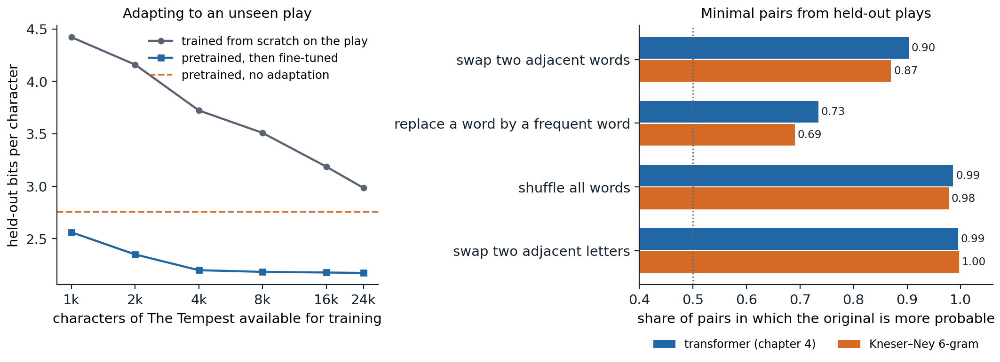

[Background Notes](../README.md) › [NLP and Large Language Models](README.md)

# 5. Pretraining and Transfer

[← 4. Transformer Language Models](04-transformer-language-models.md) · [6. Pretraining Data →](06-pretraining-data.md)

## <a id="pretrain-then-adapt"></a>Pretrain, then adapt

### <a id="from-word-vectors-to-pretrained-networks"></a>From word vectors to pretrained networks

Labeled data are scarce and unlabeled text is nearly unlimited, so NLP has long looked for ways to learn from raw text first and from labels second. Word vectors (chapter 3) were the first widely successful answer: vectors trained on billions of words initialized the input layer of a task model trained on a few thousand labeled sentences. They transferred only the first layer, and every word had one vector regardless of context.

Between 2015 and 2018 the unit of transfer grew to the whole network. [Dai and Le (2015)](https://arxiv.org/abs/1511.01432) pretrained an LSTM as a language model or autoencoder and fine-tuned it for classification. **ELMo** ([Peters et al., 2018](https://arxiv.org/abs/1802.05365)) took the hidden states of forward and backward LSTM language models as contextual features for existing task models, and raised the state of the art on six tasks at once. **ULMFiT** ([Howard and Ruder, 2018](https://arxiv.org/abs/1801.06146)) fine-tuned the entire pretrained language model, first on unlabeled text of the target domain and then on the labeled task, and with 100 labeled examples matched models trained from scratch on a hundred times more. **GPT** ([Radford et al., 2018](https://cdn.openai.com/research-covers/language-unsupervised/language_understanding_paper.pdf)) did the same with a transformer (chapter 4) and improved the state of the art on 9 of 12 tasks, and **BERT** ([Devlin et al., 2019](https://arxiv.org/abs/1810.04805)) replaced left-to-right prediction by a bidirectional objective and improved the GLUE benchmark by 7.7 points. The resulting recipe, pretraining a large network on unlabeled text and then adapting all of it to each task, organized NLP research for the following years and, in the form of prompting and instruction tuning, still does (chapters 9 and 10).

### <a id="why-predicting-text-teaches-so-much"></a>Why predicting text teaches so much

Pretraining is self-supervised learning (DL chapter 10) with a pretext task, predicting missing or next tokens, that happens to require most of what a task model needs. Filling in the blank in *The keys to the cabinet ___ on the table* requires agreement between a verb and a distant subject; in *I went to the ocean to see the fish, turtles, seals, and ___*, knowledge of what lives in the ocean; in *Iroh went into the kitchen to make some tea. Standing next to Iroh, Zuko pondered his destiny. Zuko left the ___*, tracking of entities through a story; in *The movie was a waste of two hours; overall, the value I got from it was ___*, sentiment. A model that lowers its loss on enough text must learn some of each, and the text costs nothing to label. Adapting the model then needs only enough labeled data to connect what it already represents to the output the task requires.

## <a id="pretraining-objectives"></a>Pretraining objectives

### <a id="causal-language-modeling"></a>Causal language modeling

The objective of chapter 4 predicts each token from the tokens before it. It trains every position, and it gives a generative model that can produce text directly. Its limitation for building representations is that each token's representation sees only its left context: the representation of *bank* in *the bank of the river* cannot use *river*.

### <a id="masked-language-modeling"></a>Masked language modeling

BERT's **masked language model** (MLM) objective uses both sides. It selects 15% of the token positions at random, corrupts them, and trains a bidirectional transformer encoder to predict the original tokens at the selected positions from the full corrupted sequence. Of the selected positions, 80% are replaced by a special `[MASK]` token, 10% by a random token, and 10% are left unchanged. Since `[MASK]` never appears at fine-tuning time, always using it would create a mismatch between pretraining and use; and since the model cannot tell which unmasked tokens are targets, it must build a good representation of every token. The code applies this procedure, and the span corruption of T5 described below, to a passage from *The Merchant of Venice*.

```python
import random

rng = random.Random(3)
words = ("the quality of mercy is not strained it droppeth as the gentle rain from heaven "
         "upon the place beneath it is twice blest it blesseth him that gives and him that takes").split()
vocab = sorted(set(words))

# BERT: choose 15% of positions as targets; of these, 80% become [MASK], 10% a random word, 10% stay.
inputs, targets = [], []
for w in words:
    if rng.random() < 0.15:
        r = rng.random()
        inputs.append("[MASK]" if r < 0.8 else rng.choice(vocab) if r < 0.9 else w)
        targets.append(w)
    else:
        inputs.append(w)
        targets.append("_")                              # no loss at this position
print("MLM input: ", " ".join(inputs))
print("MLM target:", " ".join(targets))

# T5: replace spans (15% of tokens, mean length 3) by sentinels; the target lists the spans in order.
n_noise = round(0.15 * len(words))
n_spans = max(1, round(n_noise / 3))
starts = sorted(rng.sample(range(0, len(words) - 3, 4), n_spans))  # non-overlapping span starts
lengths = [n_noise // n_spans + (i < n_noise % n_spans) for i in range(n_spans)]
inp, tgt, pos = [], [], 0
for k, (s, L) in enumerate(zip(starts, lengths)):
    inp += words[pos:s] + [f"<X{k}>"]
    tgt += [f"<X{k}>"] + words[s:s + L]
    pos = s + L
inp += words[pos:]
tgt += [f"<X{n_spans}>"]
print("T5 input:  ", " ".join(inp))
print("T5 target: ", " ".join(tgt))
print(f"{len(words)} words: MLM predicts {sum(t != '_' for t in targets)}, T5 input {len(inp)} tokens, target {len(tgt)}")
# MLM input:  the quality of mercy is [MASK] strained it droppeth as the gentle rain from heaven upon the place beneath it [MASK] twice blest of blesseth him that gives and him that takes
# MLM target: _ _ _ _ _ not _ _ _ _ _ _ _ _ _ _ _ _ _ _ is _ _ it _ _ _ _ _ _ _ _
# T5 input:   the quality of mercy is not strained it <X0> gentle rain from heaven upon the place beneath it is twice blest it blesseth him that gives <X1> that takes
# T5 target:  <X0> droppeth as the <X1> and him <X2>
# 32 words: MLM predicts 3, T5 input 29 tokens, target 8
```

BERT also trained a **next-sentence prediction** task: given two segments, decide whether the second followed the first in the corpus. **RoBERTa** ([Liu et al., 2019](https://arxiv.org/abs/1907.11692)) found that this task did not help, and that BERT had been substantially undertrained; dropping it, drawing new masks each time a sequence is seen, and training longer on ten times more text (160 GB) with larger batches gave large gains with the same architecture.

The MLM objective has two costs. Only the 15% of selected positions contribute to the loss, so each sequence yields fewer training signals than under causal modeling. And an MLM is not a generative model: its conditionals $`p(x_t\mid x_{\setminus t})`$ do not define a joint distribution from which text can be sampled left to right, though they can score text by a **pseudo-log-likelihood** ([Appendix A](#block-nlp05-appendix-a)).

### <a id="replaced-token-detection"></a>Replaced-token detection

**ELECTRA** ([Clark et al., 2020](https://arxiv.org/abs/2003.10555)) recovers a training signal at every position. A small MLM, the **generator**, fills the masked positions with plausible samples, and the main model, the **discriminator**, reads the resulting sequence and predicts for every token whether it is original or replaced. The replacements are plausible, so the task is hard, and every position contributes to the loss. At equal compute ELECTRA outperformed BERT and RoBERTa on GLUE, and a small ELECTRA trained for four days on one GPU outperformed GPT, which had used thirty times more compute.

### <a id="span-corruption-and-the-text-to-text-format"></a>Span corruption and the text-to-text format

**T5** ([Raffel et al., 2020](https://arxiv.org/abs/1910.10683)) cast every task, from translation to classification to regression, as mapping an input string to an output string, and pretrained an encoder–decoder transformer with **span corruption**: spans of tokens covering 15% of the input, with mean length 3, are each replaced by a unique sentinel token, and the decoder generates the removed spans, each preceded by its sentinel, as in the output above. The targets are short, so pretraining is cheap per sequence, and the decoder learns to generate text as well as fill gaps. Tasks are distinguished by a text prefix, such as `translate English to German:` or `summarize:`, so a single model with a single loss can be trained on all of them. **BART** ([Lewis et al., 2020](https://arxiv.org/abs/1910.13461)) trained an encoder–decoder to reconstruct text from several kinds of corruption and found span infilling combined with sentence shuffling best, particularly for summarization. **UL2** ([Tay et al., 2022](https://arxiv.org/abs/2205.05131)) mixed short-span, long-span, and prefix-to-continuation denoising in one objective, and a **prefix language model** lets the first part of a sequence attend bidirectionally while the rest is predicted causally.

### <a id="which-objective"></a>Which objective?

T5's paper compared objectives and architectures at equal compute and found span corruption with an encoder–decoder the best choice for its benchmarks, which consisted of fine-tuning on labeled tasks. The field nevertheless converged on decoder-only models trained with causal language modeling. [Wang et al. (2022)](https://arxiv.org/abs/2204.05832) explain part of the paradox: after pretraining alone, causal decoder-only models generalize best to new tasks presented as prompts, while encoder–decoder models trained with masked objectives do best after multitask fine-tuning. Once models were used through prompts rather than fine-tuned per task (chapter 9), the ability to continue any text became the deciding property. Decoder-only models also train on every position, reuse a single stack of layers for input and output, and cache keys and values efficiently during generation. Bidirectional encoders remain the tool of choice where a representation rather than text is the product: classifiers, rerankers, and embedding models, recently updated with current architectures and longer contexts in models such as ModernBERT ([Warner et al., 2024](https://arxiv.org/abs/2412.13663)).

## <a id="adapting-a-pretrained-model"></a>Adapting a pretrained model

### <a id="fine-tuning"></a>Fine-tuning

To fine-tune an encoder such as BERT for classification, a linear layer is placed on the final representation of a special `[CLS]` token prepended to the input, or on the mean of all token representations, and the whole network is trained on the labeled data with the cross-entropy loss. Pairs of sentences, as in entailment or paraphrase detection, are concatenated with a separator token. For generation tasks, a decoder or encoder–decoder is fine-tuned on input–output pairs with the language-modeling loss on the output tokens only. The recommended settings for BERT were small: learning rates of 2 to 5 times $`10^{-5}`$, batch sizes of 16 or 32, and two to four epochs. With small datasets fine-tuning is unstable, and runs that differ only in the random seed, which fixes the initialization of the new layer and the order of the data, can differ by several points ([Dodge et al., 2020](https://arxiv.org/abs/2002.06305)); longer training with a small learning rate and bias-corrected Adam removes most of the instability ([Mosbach, Andriushchenko, and Klakow, 2021](https://arxiv.org/abs/2006.04884)).

The alternative to fine-tuning is **feature extraction**: freeze the pretrained network and train only a classifier on its representations, possibly a weighted combination of its layers as in ELMo. Feature extraction costs less, since one network serves every task and the representations can be computed once, but fine-tuning usually wins, by more when the task differs from the pretraining objective ([Peters, Ruder, and Smith, 2019](https://arxiv.org/abs/1903.05987)). Methods that train only a small number of added parameters sit between the two (chapter 10).

### <a id="continued-pretraining"></a>Continued pretraining

Before fine-tuning on a task, a pretrained model can be trained further with its original objective on unlabeled text from the task's domain. [Gururangan et al. (2020)](https://arxiv.org/abs/2004.10964) found that this **domain-adaptive pretraining** improved RoBERTa on tasks in biomedical and computer-science papers, news, and reviews, and that pretraining on the unlabeled task data itself helped further. The figure applies the idea to the character model of chapter 4, which was pretrained on 90% of Tiny Shakespeare: the last 34,657 characters of the corpus are *The Tempest*, a play the model never saw. It compares training on the first part of the play from scratch with fine-tuning the pretrained model on the same text.



*Left: bits per character on the last 10,657 characters of* The Tempest *after training on 1,000 to 24,000 of its first characters, for the architecture of chapter 4 trained from scratch and for the pretrained model fine-tuned; each value is the best held-out loss over periodic checkpoints, an optimistic form of early stopping applied equally to both. Without adaptation the pretrained model needs 2.76 bits per character; fine-tuning on 1,000 characters lowers this to 2.56 and on 4,000 to 2.20, after which more text helps little (2.17 with 24,000). Trained from scratch, the same architecture needs 4.42 bits with 1,000 characters and still 2.98 with 24,000. Right: for 1,000 lines from the held-out plays, the fraction of minimal pairs in which the original line is more probable than a corrupted copy, under the transformer and a Kneser–Ney 6-gram model trained on the same 90%. The transformer prefers the original in 90% of the pairs with two adjacent words exchanged (Kneser–Ney 87%), 73% with one word replaced by one of the 200 most frequent words (69%), 99% with all words shuffled (98%), and 99.5% with two adjacent letters exchanged (99.7%).*

The unadapted model already predicts the new play better than a model trained on 24,000 of its characters: spelling, vocabulary, meter, and the layout of speeches all carry over from the other plays. What it lacks is specific to *The Tempest*, whose names (Prospero, Ariel, Caliban) and island vocabulary never occur in the pretraining text, which is why it needs 2.76 bits here against 2.19 on the validation text as a whole. A few thousand characters of the play, less than 1% of the pretraining text, are enough to learn most of this, and fine-tuning then reaches the model's usual level. The same pattern, a large gain from pretraining and a further gain from a little in-domain text, is what domain-adaptive pretraining and task fine-tuning exploit at scale.

### <a id="benchmarks"></a>Benchmarks

Pretrained encoders were compared on **GLUE** ([Wang et al., 2018](https://arxiv.org/abs/1804.07461)), nine sentence-level tasks covering acceptability, sentiment, paraphrase, similarity, and entailment, scored by a single average. Within a year of BERT, models surpassed the benchmark's estimate of human performance, and the harder **SuperGLUE** ([Wang et al., 2019](https://arxiv.org/abs/1905.00537)) was saturated within about two years as well. The speed with which benchmarks saturate, and the shortcuts models find in them, are a recurring theme of chapter 14.

## <a id="sentence-embeddings"></a>Sentence embeddings

### <a id="cross-encoders-and-bi-encoders"></a>Cross-encoders and bi-encoders

Many applications need to compare texts: finding the passage that answers a question, detecting duplicate questions, clustering documents. A **cross-encoder** reads both texts together and outputs a score; it is accurate, since attention relates every token of one text to every token of the other, but it must run once for every pair. A **bi-encoder** maps each text separately to a vector and compares vectors by cosine similarity, so a collection can be encoded once and searched quickly (chapter 13). Averaged BERT representations make poor sentence vectors without further training: contextual representations occupy a narrow cone of the space, so all sentences look similar ([Ethayarajh, 2019](https://arxiv.org/abs/1909.00512)). **Sentence-BERT** ([Reimers and Gurevych, 2019](https://arxiv.org/abs/1908.10084)) fine-tuned BERT as a bi-encoder on natural-language inference pairs and cut the time to find the most similar pair among 10,000 sentences from about 65 hours with a cross-encoder to about 5 seconds.

### <a id="contrastive-training"></a>Contrastive training

Current embedding models are trained with the contrastive InfoNCE loss of DL chapter 10: the embedding of a text should be closer to that of a related text, its positive, than to those of the other texts in the batch. **SimCSE** ([Gao, Yao, and Chen, 2021](https://arxiv.org/abs/2104.08821)) showed that even the same sentence encoded twice with different dropout masks makes a useful positive pair, and that entailment pairs make better ones, with contradictions as hard negatives. Large embedding models such as E5 ([Wang et al., 2022](https://arxiv.org/abs/2212.03533)) pretrain contrastively on hundreds of millions of naturally occurring pairs, such as titles and bodies, questions and answers, or posts and comments, and then fine-tune on labeled pairs. Recent embedding models are often built from decoder-only language models with the causal mask removed or with the last token's state as the embedding.

## <a id="what-pretraining-teaches"></a>What pretraining teaches

### <a id="probing-classifiers"></a>Probing classifiers

A **probe** is a simple classifier, usually linear, trained to predict a linguistic property from a frozen model's representations: the part of speech of each token, its syntactic head, whether it names an entity. High probe accuracy suggests the property is represented, and comparing layers shows where. In BERT, [Tenney, Das, and Pavlick (2019)](https://arxiv.org/abs/1905.05950) found that parts of speech are decoded best from lower layers, syntactic structure from middle layers, and semantic roles and coreference from higher ones, echoing the order of a classical NLP pipeline. Probes need controls: a probe that is too expressive can learn the task itself from any sufficiently rich representation. [Hewitt and Liang (2019)](https://arxiv.org/abs/1909.03368) compare each probe with its accuracy on a **control task** that assigns random but consistent labels to word types, and trust only probes that are **selective**, far better on the real task than on the control. An information-theoretic view makes the same point: a probe's loss bounds how much information about the property the representation contains, and more expressive probes give tighter bounds ([Appendix B](#block-nlp05-appendix-b)).

### <a id="minimal-pairs"></a>Minimal pairs

A language model can also be tested without training anything, by comparing the probabilities it assigns to **minimal pairs**, two sentences that differ in one respect, one acceptable and one not. [Linzen, Dupoux, and Goldberg (2016)](https://arxiv.org/abs/1611.01368) tested subject–verb agreement across intervening phrases this way, and BLiMP ([Warstadt et al., 2020](https://arxiv.org/abs/1912.00582)) collects 67 sets of 1,000 minimal pairs, each isolating a grammatical phenomenon. The code applies the idea to the character model of chapter 4, on lines from the plays it did not see in training: each line is compared with a copy in which two adjacent words are exchanged.

```python
import numpy as np
import torch
from torch import nn

ckpt = torch.load("Sources/Data/shakespeare-char-transformer.pt")   # the model trained in chapter 4
cfg, chars = ckpt["config"], ckpt["chars"]
stoi = {c: i for i, c in enumerate(chars)}


class CharLM(nn.Module):
    def __init__(self, V, T, d, L, heads):
        super().__init__()
        self.tok, self.pos = nn.Embedding(V, d), nn.Embedding(T, d)
        block = nn.TransformerEncoderLayer(d, heads, 4 * d, dropout=0.0, activation="gelu",
                                           batch_first=True, norm_first=True)
        self.blocks = nn.TransformerEncoder(block, L, enable_nested_tensor=False)
        self.ln, self.out = nn.LayerNorm(d), nn.Linear(d, V, bias=False)
        self.out.weight = self.tok.weight
        self.register_buffer("mask", nn.Transformer.generate_square_subsequent_mask(T))

    def forward(self, x):
        t = x.shape[1]
        h = self.tok(x) + self.pos(torch.arange(t))
        return self.out(self.ln(self.blocks(h, mask=self.mask[:t, :t], is_causal=True)))


model = CharLM(**cfg)
model.load_state_dict(ckpt["state_dict"])
model.eval()


def logprob(line):                                      # log P(line), as a line of its own
    ids = torch.tensor([[stoi[c] for c in "\n" + line + "\n"]])
    with torch.no_grad():
        lp = torch.log_softmax(model(ids)[0, :-1], dim=-1)
    return lp[torch.arange(ids.shape[1] - 1), ids[0, 1:]].sum().item()


text = open("Sources/Data/tinyshakespeare.txt", encoding="utf-8").read()
held_out = text[int(0.9 * len(text)):]                   # plays the model was not trained on
lines = [l for l in held_out.split("\n") if len(l.split()) >= 6 and not l.endswith(":") and len(l) <= 100]
rng = np.random.default_rng(0)
rng.shuffle(lines)


def swap(line):                                         # exchange two adjacent words
    w = line.split()
    i = rng.integers(len(w) - 1)
    w[i], w[i + 1] = w[i + 1], w[i]
    return " ".join(w)


pairs = [(l, swap(l)) for l in lines[:1000]]
pairs = [(a, b) for a, b in pairs if a != b]
diff = np.array([logprob(a) - logprob(b) for a, b in pairs])
print(f"{len(pairs)} minimal pairs: the original is more probable in {np.mean(diff > 0):.1%}")
for (a, b), d in list(zip(pairs, diff))[:3]:
    print(f"{d:+6.2f} nats | {a}\n{'':14s}{b}")
# 1000 minimal pairs: the original is more probable in 90.3%
# +14.15 nats | Sit still, and hear the last of our sea-sorrow.
#               Sit still, and hear the of last our sea-sorrow.
#  +7.16 nats | The very virtue of compassion in thee,
#               The very virtue of compassion thee, in
#  -0.70 nats | Who, with a charm join'd to their suffer'd labour,
#               Who, with a charm join'd to suffer'd their labour,
```

The original line is more probable in 90% of the pairs, although the model never saw a labeled example of an acceptable or unacceptable sentence. The first two examples show the model rejecting ungrammatical orders strongly; the third shows a failure, where exchanging *their* and *suffer'd* costs little because *to suffer'd* and *their labour* are both plausible locally. The right panel of the figure extends the test to other corruptions and compares the transformer with Kneser–Ney. Both models detect scrambled word order and misspelled words almost perfectly, since these create character sequences that rarely occur. They differ on the subtler cases that need knowledge of word order and word choice beyond a few characters: exchanging two adjacent words (90% for the transformer against 87% for Kneser–Ney) and replacing a word by a frequent word (73% against 69%).

### <a id="knowledge-in-the-parameters"></a>Knowledge in the parameters

Pretrained models also store facts. **LAMA** ([Petroni et al., 2019](https://arxiv.org/abs/1909.01066)) queried BERT with cloze statements such as *Dante was born in [MASK]* and found that it recalled many relational facts as well as a knowledge base extracted automatically from text, without any fine-tuning. Such knowledge is uneven, favoring facts stated often in the training data; it cannot be updated without retraining; and the model states unsupported guesses in the same fluent form as facts. These limitations motivate retrieval (chapter 13), and the question of what a network represents and how motivates interpretability research in the Safety and Frontier module.

## <a id="appendices"></a>Appendices


<details>
<summary><a id="block-nlp05-appendix-a"></a><b>A. Masked language models and pseudo-log-likelihood</b></summary>


The MLM loss for a sequence $`x=(x_1,\dots,x_T)`$ with selected positions $`S`$ is $`-\sum_{t\in S}\log q_\theta(x_t\mid\tilde x)`$, where $`\tilde x`$ is the corrupted sequence. In the idealized case where a single position $`t`$ is masked, the minimizer of the expected loss over the data distribution $`P`$ is the true conditional: $`q_\theta(\cdot\mid x_{\setminus t})=P(\cdot\mid x_{\setminus t})`$, where $`x_{\setminus t}`$ is the sequence with position $`t`$ hidden, because the expected log loss $`\mathbb E_{x_t\sim P(\cdot\mid x_{\setminus t})}[-\log q(x_t)]`$ is the cross-entropy $`H(P,q)=H(P)+D_{\mathrm{KL}}(P\,\Vert\,q)`$ and is minimized at $`q=P`$ (Foundations chapter 5). An MLM therefore learns the set of full conditionals $`\{P(x_t\mid x_{\setminus t})\}_t`$.

Full conditionals determine a joint distribution when they come from one, by Brook's lemma, but a set learned independently for each position need not be compatible with any joint distribution, and even when it is, recovering the joint requires Gibbs sampling (AI chapter 10) rather than a single left-to-right pass. A practical score is the **pseudo-log-likelihood**

```math
\operatorname{PLL}(x)=\sum_{t=1}^T\log q_\theta(x_t\mid x_{\setminus t}),
```

which masks each position in turn and so costs $`T`$ forward passes. It is not a log-probability and is not comparable with the log-likelihood of a causal model, but it ranks sentences well for tasks such as rescoring and acceptability judgments ([Salazar et al., 2020](https://arxiv.org/abs/1910.14659)).

</details>


<details>
<summary><a id="block-nlp05-appendix-b"></a><b>B. What a probe's loss measures</b></summary>


Let $`Z`$ be a frozen representation and $`Y`$ a property with entropy $`H(Y)`$. A probe is a conditional distribution $`q(y\mid z)`$ from some family, trained to minimize the cross-entropy $`\mathcal L(q)=\mathbb E[-\log q(Y\mid Z)]`$. For any $`q`$,

```math
\mathcal L(q)=H(Y\mid Z)+\mathbb E_Z\bigl[D_{\mathrm{KL}}\bigl(P(\cdot\mid Z)\,\Vert\,q(\cdot\mid Z)\bigr)\bigr]\ge H(Y\mid Z),
```

so the mutual information satisfies $`I(Y;Z)=H(Y)-H(Y\mid Z)\ge H(Y)-\mathcal L(q)`$. Every trained probe gives a lower bound on how much information about $`Y`$ the representation contains, and a more expressive family can only tighten the bound ([Pimentel et al., 2020](https://arxiv.org/abs/2004.03061)). This is why "the information is there" is an easy claim to support and a weak one: by the data-processing inequality $`I(Y;Z)\le I(Y;X)`$ for the input $`X`$, and a sufficiently flexible probe could extract from any invertible representation everything the input contains. The informative questions concern how easily the information can be extracted, for instance by a linear map, and whether the model uses it, which requires interventions on the representation rather than probes alone.

</details>

---

[← 4. Transformer Language Models](04-transformer-language-models.md) · [6. Pretraining Data →](06-pretraining-data.md)
