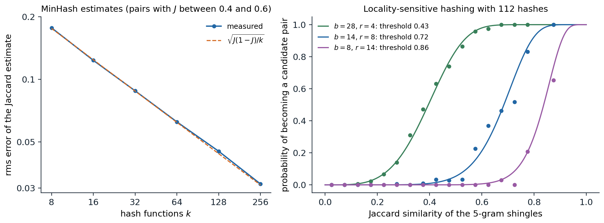

[ML Mastery Notes](../README.md) › [NLP and Large Language Models](README.md)

# 6. Pretraining Data

[← 5. Pretraining and Transfer](05-pretraining-and-transfer.md) · [7. Scaling Laws →](07-scaling-laws.md)

## <a id="where-the-data-come-from"></a>Where the data come from

### <a id="scale"></a>Scale

The data are the part of a language model that its architecture papers describe least and that most determines what it knows. GPT-3 was trained on 300 billion tokens ([Brown et al., 2020](https://arxiv.org/abs/2005.14165)); Llama 3 on 15.6 trillion ([Llama Team, 2024](https://arxiv.org/abs/2407.21783)), about 60 terabytes of text. A person reading a book a day for a lifetime reads well under a billion words. Collecting, cleaning, filtering, deduplicating, and mixing text at this scale is an engineering discipline of its own, and in the reports of teams that document it, changes to the data pipeline move benchmark results more than most changes to the model. This chapter describes the pipeline and the choices at each stage; chapter 7 asks how much data a model of a given size should see.

### <a id="sources"></a>Sources

Almost all pretraining text comes from a few kinds of source.

- **The web.** **Common Crawl**, a nonprofit, has crawled the public web since 2008 and releases a snapshot of a few billion pages every month or two, as raw responses (WARC files), metadata, and extracted text (WET files). It is the largest source for nearly every model, and also the noisiest: most pages are navigation menus, product listings, spam, machine-generated text, and duplicates.
- **Reference text.** Wikipedia is small by current standards but dense in facts and carefully written, and is usually upsampled.
- **Books.** Long, coherent, and well edited, and the most legally contested source; public-domain collections such as Project Gutenberg are safe, collections of copyrighted books scraped from piracy sites are the subject of lawsuits.
- **Code.** Public repositories, filtered for licenses and quality, as in The Stack ([Kocetkov et al., 2022](https://arxiv.org/abs/2211.15533)). Code improves models' reasoning on non-code tasks as well as their coding.
- **Scientific and technical text.** Papers from arXiv and open-access archives, mathematics, and question-answering sites such as Stack Exchange.
- **Conversations and forums.** Reddit and similar sources supply dialogue and informal registers.

Open datasets document these choices. **The Pile** ([Gao et al., 2020](https://arxiv.org/abs/2101.00027)) combined 22 curated sources into 825 GB; **C4** ([Raffel et al., 2020](https://arxiv.org/abs/1910.10683)) filtered one Common Crawl snapshot into 750 GB; **RefinedWeb** ([Penedo et al., 2023](https://arxiv.org/abs/2306.01116)) showed that carefully filtered and deduplicated web text alone can match curated mixtures; **Dolma** ([Soldaini et al., 2024](https://arxiv.org/abs/2402.00159)) released three trillion tokens with the tools that produced them; **FineWeb** ([Penedo et al., 2024](https://arxiv.org/abs/2406.17557)) processed 96 snapshots into 15 trillion tokens and ablated every step; and **DataComp-LM** ([Li et al., 2024](https://arxiv.org/abs/2406.11794)) turned data curation into a benchmark, with a 240-trillion-token pool, fixed training recipes, and a leaderboard of filtering methods.

### <a id="from-html-to-text"></a>From HTML to text

A web page must first become text. The WET files that Common Crawl provides keep all the visible text of a page, including menus, footers, cookie notices, and advertisements. Extracting the main content from the raw HTML with a dedicated tool such as trafilatura removes most of this boilerplate, and FineWeb's ablations found it gave substantially better models than the WET text, at a much higher processing cost. Extraction also decides how to render tables, lists, mathematics, and code, which pipelines optimized for prose often mangle, and specialized pipelines for mathematical web pages exist for that reason.

Next comes **language identification**, usually with a fast linear classifier over character n-grams such as fastText's ([Joulin et al., 2017](https://arxiv.org/abs/1607.01759)), and a threshold on its confidence; FineWeb keeps pages whose English score exceeds 0.65. Language identification is least reliable exactly where it matters most, for short texts, closely related languages, and languages with little data, so multilingual pipelines treat it with care (chapter 15).

## <a id="filtering"></a>Filtering

### <a id="heuristic-filters"></a>Heuristic filters

Most of the web is not text worth learning from, and the first line of defense is a set of rules that catch obvious junk cheaply. C4 kept only lines ending in terminal punctuation and containing at least five words, dropped pages with fewer than three sentences, and removed pages containing words from a list of offensive terms, the placeholder text *lorem ipsum*, or curly braces, a crude detector of code ([Raffel et al., 2020](https://arxiv.org/abs/1910.10683)). The rules used for DeepMind's Gopher models ([Rae et al., 2021](https://arxiv.org/abs/2112.11446)) remain a common template:

- documents between 50 and 100,000 words, with a mean word length between 3 and 10 characters;
- a ratio of symbols such as `#` or ellipses to words below 0.1;
- fewer than 90% of lines starting with a bullet and fewer than 30% ending with an ellipsis;
- at least 80% of words containing an alphabetic character;
- at least two of the common English words *the, be, to, of, and, that, have, with*, which ordinary prose always contains;
- limits on repetition: the fraction of duplicated lines and paragraphs, and the fraction of text covered by the most frequent n-grams.

Each rule is tuned by looking at what it removes. Rules are transparent and fast, but they encode one register of English as the norm: a poem, a table of numbers, or a page in a dialect can fail them for reasons unrelated to quality.

### <a id="model-based-filters"></a>Model-based filters

A second family of filters learns what good text looks like from examples. GPT-3 trained a logistic regression on hashed n-gram features to distinguish curated reference text (WebText, Wikipedia, and books) from raw Common Crawl, and kept each document with a probability that increased with its score, so that some low-scoring documents survived for diversity. **CCNet** ([Wenzek et al., 2020](https://arxiv.org/abs/1911.00359)) scored pages by their perplexity under a Kneser–Ney model trained on Wikipedia (chapter 2) and split them into head, middle, and tail thirds. **Importance resampling** ([Xie et al., 2023](https://arxiv.org/abs/2302.03169)) selects data whose hashed n-gram distribution matches a target distribution.

Classifier filters with carefully chosen positive examples have produced the largest recent gains. In DataComp-LM, a fastText classifier trained to recognize instruction-following data and highly rated answers from the ELI5 forum, applied to keep the top 10% of web documents, outperformed every other filter tried and gave a 7-billion-parameter model trained on 2.6 trillion tokens 64% on the MMLU benchmark. **FineWeb-Edu** asked a large model (Llama 3 70B) to rate 450,000 web pages for educational value on a scale from 0 to 5, trained a small classifier on the ratings, and kept the pages scoring at least 3: 1.3 trillion tokens on which models learned knowledge and reasoning benchmarks several times faster ([Penedo et al., 2024](https://arxiv.org/abs/2406.17557)).

### <a id="what-filtering-removes"></a>What filtering removes

A quality filter defines quality as resemblance to its positive examples, so it imports their biases. The documentation of C4 found that its list of offensive words removed pages disproportionately by and about minority groups, including text in African American English and pages about LGBTQ+ identities, while leaving much offensive content in place ([Dodge et al., 2021](https://arxiv.org/abs/2104.08758)). Aggressive filtering also narrows the distribution toward the reference domain, which helps on benchmarks that resemble it and can hurt elsewhere. Filters for toxicity illustrate the trade-off: removing toxic text reduces toxic generation but also reduces the model's ability to recognize toxicity when asked to ([Longpre et al., 2024](https://arxiv.org/abs/2305.13169)). Pipelines also remove or mask **personal information**, such as email addresses, phone numbers, and IP addresses, with patterns and classifiers, which catches the easy cases only.

## <a id="deduplication"></a>Deduplication

### <a id="why-duplicates-matter"></a>Why duplicates matter

The web repeats itself: templates, mirrors, syndicated articles, quoted passages, licenses, and boilerplate appear thousands or millions of times. [Lee et al. (2022)](https://arxiv.org/abs/2107.06499) found a single 61-word sentence repeated more than 60,000 times in C4, and that deduplicating training data made models emit memorized training text ten times less often, train as well or better in fewer steps, and overlap less with validation sets. Memorization grows log-linearly with the number of times a sequence is duplicated, as well as with model size ([Carlini et al., 2023](https://arxiv.org/abs/2202.07646)), and memorized personal data can be extracted from a trained model by prompting it ([Carlini et al., 2021](https://arxiv.org/abs/2012.07805)). Duplicates also waste compute on text the model has already seen and, when they cross the split between training and test data, inflate evaluations.

### <a id="exact-duplicates"></a>Exact duplicates

Exact duplicates of whole documents, paragraphs, or lines are found by hashing each unit and keeping one per hash value, which takes a single pass and memory proportional to the number of distinct units. Repeated passages inside otherwise different documents, such as a shared disclaimer, need substring matching: a **suffix array** of the whole corpus, a sorted list of all its suffixes, places identical substrings next to each other, so every repeated span of at least, say, 50 tokens can be found and removed in time nearly linear in the corpus size ([Lee et al., 2022](https://arxiv.org/abs/2107.06499)).

### <a id="near-duplicates-minhash-and-locality-sensitive-hashing"></a>Near duplicates: MinHash and locality-sensitive hashing

Most duplicates are not exact: the same article with a different header, a page with a changed date, a lightly edited copy. Near-duplicate detection represents each document by its set of **shingles**, the n-grams of words it contains, and measures the similarity of two documents $A$ and $B$ by the **Jaccard similarity** of their shingle sets,

$$
J(A,B)=\frac{|A\cap B|}{|A\cup B|}.
$$

Comparing every pair of documents is impossible at the scale of billions, and **MinHash** ([Broder, 1997](https://doi.org/10.1109/SEQUEN.1997.666900)) makes the comparison cheap. Apply a random hash function $h$ to every shingle of a document and keep the minimum value. For two documents, the minima agree exactly when the shingle with the smallest hash among $A\cup B$ lies in $A\cap B$, which happens with probability $J(A,B)$ ([Appendix A](#block-nlp06-appendix-a)). With $k$ independent hash functions, each document gets a **signature** of $k$ minima, and the fraction of positions where two signatures agree is an unbiased estimate of their Jaccard similarity with standard deviation $\sqrt{J(1-J)/k}$.

Signatures shrink documents to a few hundred numbers, but comparing all pairs of signatures is still quadratic. **Locality-sensitive hashing** avoids it by splitting each signature into $b$ bands of $r$ rows and hashing each band: two documents become a **candidate pair** if they agree on all $r$ rows of at least one band. A pair with similarity $s$ agrees on a given band with probability $s^r$, so it becomes a candidate with probability

$$
P(\text{candidate})=1-(1-s^r)^b,
$$

an S-shaped curve that rises steeply near the threshold $s^*\approx(1/b)^{1/r}$ ([Appendix B](#block-nlp06-appendix-b)). Only candidate pairs are compared, and duplicates among them are removed, typically keeping one document from each connected cluster. FineWeb uses word 5-grams and 112 hash functions split into 14 bands of 8 rows. The code builds a small synthetic crawl of 2,000 disjoint 80-word passages of Shakespeare and 300 copies in which between 0 and 50% of the words have been replaced, and runs the same procedure.

```python
import random
import re
import zlib

import numpy as np

rng = random.Random(0)
text = open("Sources/Data/tinyshakespeare.txt", encoding="utf-8").read()
words = re.findall(r"\S+", text)

# A synthetic crawl: 2,000 disjoint passages of 80 words, plus 300 edited copies with 0-50% of words replaced.
chunks = [" ".join(words[i:i + 80]) for i in range(0, len(words) - 80, 80)]
docs = rng.sample(chunks, 2000)
truth = {}
for k in range(300):
    src = rng.randrange(2000)
    w = docs[src].split()
    rate = rng.choice([0.0, 0.05, 0.1, 0.2, 0.3, 0.5])
    for i in rng.sample(range(len(w)), int(rate * len(w))):
        w[i] = rng.choice(words)
    truth[len(docs)] = src
    docs.append(" ".join(w))


def shingles(doc, n=5):                                   # set of hashed word 5-grams
    w = doc.lower().split()
    return {zlib.crc32(" ".join(w[i:i + n]).encode()) for i in range(len(w) - n + 1)}


def jaccard(a, b):
    return len(a & b) / len(a | b)


# MinHash: for each of k random hash functions h(x) = (a x + b) mod p, keep the minimum over the shingles.
k, p = 112, (1 << 31) - 1
nrng = np.random.default_rng(0)
A, B = nrng.integers(1, p, k), nrng.integers(0, p, k)
S = [shingles(d) for d in docs]
sig = np.array([((A[:, None] * (np.fromiter(s, np.int64) % p)[None, :] + B[:, None]) % p).min(1) for s in S])

# LSH: split the signature into 14 bands of 8 rows; documents sharing any whole band become candidates.
bands, rows = 14, 8
buckets = {}
for i in range(len(docs)):
    for band in range(bands):
        key = (band, tuple(sig[i, band * rows:(band + 1) * rows]))
        buckets.setdefault(key, []).append(i)
cands = {(min(a, b), max(a, b)) for ids in buckets.values() for a in ids for b in ids if a != b}
print(f"{len(docs)} documents, {len(cands)} candidate pairs out of {len(docs) * (len(docs) - 1) // 2:,}")

est = [np.mean(sig[i] == sig[j]) for i, j in truth.items()]
true = [jaccard(S[i], S[j]) for i, j in truth.items()]
print(f"MinHash estimate vs true Jaccard on the planted pairs: mean abs. error {np.mean(np.abs(np.subtract(est, true))):.3f}")
print(" true Jaccard   planted pairs   found   predicted 1-(1-s^8)^14")
for lo, hi in [(0.9, 1.01), (0.6, 0.9), (0.4, 0.6), (0.2, 0.4), (0.0, 0.2)]:
    sel = [(i, j) for (i, j), s in zip(truth.items(), true) if lo <= s < hi]
    found = sum((min(i, j), max(i, j)) in cands for i, j in sel)
    s_mid = np.mean([t for t in true if lo <= t < hi])
    print(f" [{lo:.1f}, {min(hi, 1):.1f})  {len(sel):14d} {found:7d} {1 - (1 - s_mid ** rows) ** bands:15.2f}")
root = lambda i: truth.get(i, i)                          # the original passage a document was copied from
false = [(i, j) for i, j in cands if root(i) != root(j)]
print(f"candidate pairs not derived from the same passage: {len(false)}")
# 2300 documents, 70 candidate pairs out of 2,643,850
# MinHash estimate vs true Jaccard on the planted pairs: mean abs. error 0.024
#  true Jaccard   planted pairs   found   predicted 1-(1-s^8)^14
#  [0.9, 1.0)              49      49            1.00
#  [0.6, 0.9)              28      12            0.34
#  [0.4, 0.6)              55       6            0.06
#  [0.2, 0.4)              44       0            0.00
#  [0.0, 0.2)             124       0            0.00
# candidate pairs not derived from the same passage: 0
```

Out of 2.6 million possible pairs, locality-sensitive hashing proposes 70, none of them spurious. It finds every copy with Jaccard similarity above 0.9, 12 of the 28 between 0.6 and 0.9, 6 of the 55 between 0.4 and 0.6, and none below, close to what the S-curve predicts. Replacing even 5% of the words changes about a quarter of the 5-gram shingles, so "near duplicate" at a threshold of 0.72 means a light edit.



*MinHash and locality-sensitive hashing on 4,000 pairs of an 80-word Shakespeare passage and a copy with 0 to 60% of its words replaced, using word 5-gram shingles. Left: for the 336 pairs with Jaccard similarity between 0.4 and 0.6, the root-mean-square error of the MinHash estimate falls from 0.177 with 8 hash functions to 0.031 with 256, matching the binomial prediction $\sqrt{J(1-J)/k}$. Right: the fraction of pairs that become candidates (points, in bins of width 0.05 with at least 20 pairs) against the curve $1-(1-s^r)^b$ for three ways of splitting 112 hash functions into $b$ bands of $r$ rows; 14 bands of 8 rows catch 99.5% of the pairs above 0.8 and 0.2% of those below 0.5.*

The choice of $b$ and $r$ sets the threshold and the sharpness of the curve for a fixed budget of $br$ hash functions: more rows per band raise the threshold, and more hash functions sharpen the transition.

### <a id="how-much-to-remove"></a>How much to remove

Deduplication is not simply better when more aggressive. FineWeb found that deduplicating each crawl snapshot separately produced better models than deduplicating across all 96 snapshots together. Global deduplication removed most of the text in older snapshots, and what survived was disproportionately low-quality content that happened to be unique, while the removed clusters had included good pages that the web copies for a reason. Repetition of high-quality text is not harmful in moderation, as the next section shows; what deduplication should remove is mass-produced text that no amount of repetition makes valuable.

## <a id="mixtures-repetition-and-synthetic-data"></a>Mixtures, repetition, and synthetic data

### <a id="choosing-a-mixture"></a>Choosing a mixture

A training set is a mixture of sources with chosen weights, and the weights matter as much as the filters. Llama 3's final mixture was about 50% general knowledge, 25% mathematics and reasoning, 17% code, and 8% multilingual text. Such weights were long set by hand and by ablations with small models. **DoReMi** ([Xie et al., 2023](https://arxiv.org/abs/2305.10429)) learns them instead: it trains a small proxy model with a minimax objective that upweights the domains where the proxy's loss most exceeds that of a reference model, then trains the large model on the learned weights, which reached the baseline's accuracy in 2.6 times fewer steps. Other methods fit a regression from mixture weights to the loss of many small training runs and optimize the prediction ([Liu et al., 2024](https://arxiv.org/abs/2407.01376)), in the spirit of scaling laws.

The mixture can also change during training. In a final **annealing** or **mid-training** phase, while the learning rate decays to zero, the mixture shifts toward the highest-quality data: curated text, mathematics, code, and increasingly data in the formats that post-training will use. Llama 3 found large gains on mathematics benchmarks from annealing on small amounts of high-quality data, and used short annealing runs to measure the value of candidate datasets cheaply.

### <a id="repeating-data"></a>Repeating data

Data are finite, and the supply of high-quality human text may be exhausted by the largest training runs within a few years ([Villalobos et al., 2024](https://arxiv.org/abs/2211.04325)). Training for several epochs on the same data is the obvious response, and [Muennighoff et al. (2023)](https://arxiv.org/abs/2305.16264) measured its value: up to about four epochs, repeated tokens are nearly as useful as new ones; beyond that their value decays, and after a few dozen epochs further repetition is worthless. They modeled the decay by an effective amount of data that saturates exponentially in the number of repetitions ([Appendix C](#block-nlp06-appendix-c)), which extends the scaling laws of chapter 7 to the data-constrained regime. The practical consequence is that filtering aggressively and repeating the best data a few times can beat training once on a larger, noisier set.

### <a id="synthetic-data"></a>Synthetic data

Language models can also write their own training data. **Phi-1** ([Gunasekar et al., 2023](https://arxiv.org/abs/2306.11644)) trained a 1.3-billion-parameter code model on web code filtered for educational value and on a billion tokens of synthetic textbooks and exercises written by GPT-3.5, and it rivaled much larger models on a coding benchmark. **Rephrasing** web documents into the style of Wikipedia or of questions and answers sped up pretraining about threefold ([Maini et al., 2024](https://arxiv.org/abs/2401.16380)). Synthetic data is now central to post-training (chapter 10) and to training for reasoning (chapter 12). Its risk is a narrowing of the distribution: models trained recursively on the outputs of previous generations lose the tails of the original distribution and eventually collapse toward a few modes ([Shumailov et al., 2024](https://www.nature.com/articles/s41586-024-07566-y)), which mixing in fresh human data prevents. As model-generated text spreads across the web, every crawl contains more of it.

## <a id="contamination-consent-and-documentation"></a>Contamination, consent, and documentation

### <a id="test-set-contamination"></a>Test-set contamination

A benchmark whose questions appear in the training data measures memory rather than ability. Contamination is hard to avoid when the training data is a large fraction of the public web and benchmarks are published on it. The GPT-3 paper checked every benchmark item for 13-gram overlaps with the training data and reported results on the clean subsets. The code plants 75 of 200 held-out Shakespeare speeches into the training text, 25 verbatim, 25 with every tenth word changed, and 25 truncated to their first 15 words, and checks each speech for word n-gram overlaps with the training text.

```python
import random
import re

rng = random.Random(0)
text = open("Sources/Data/tinyshakespeare.txt", encoding="utf-8").read()
train, held = text[:int(0.9 * len(text))], text[int(0.9 * len(text)):]
norm = lambda s: re.findall(r"[a-z']+", s.lower())       # lowercase words, punctuation removed

# A "benchmark" of 200 held-out speeches of at least 25 words; 75 of them leak into the training text.
items = [s for s in held.split("\n\n") if len(norm(s)) >= 25]
items = rng.sample(items, 200)
leaks = {"verbatim": items[:25], "every 10th word changed": items[25:50], "first 15 words only": items[50:75]}
corpus = [train]
for kind, group in leaks.items():
    for s in group:
        w = s.split()
        if kind == "every 10th word changed":
            w = [x if i % 10 else "sirrah" for i, x in enumerate(w)]
        if kind == "first 15 words only":
            w = w[:15]
        corpus.insert(rng.randrange(len(corpus) + 1), " ".join(w))
corpus_words = norm("\n".join(corpus))


def grams(ws, n):
    return {tuple(ws[i:i + n]) for i in range(len(ws) - n + 1)}


for n in [8, 13]:
    index = grams(corpus_words, n)                         # every n-gram of the training corpus
    dirty = [any(g in index for g in grams(norm(s), n)) for s in items]
    found = {kind: sum(dirty[items.index(s)] for s in group) for kind, group in leaks.items()}
    print(f"{n}-gram overlap: flagged {sum(dirty)} of 200; leaked items found {found}; "
          f"clean items flagged {sum(dirty[75:])}")
# 8-gram overlap: flagged 75 of 200; leaked items found {'verbatim': 25, 'every 10th word changed': 25, 'first 15 words only': 25}; clean items flagged 0
# 13-gram overlap: flagged 50 of 200; leaked items found {'verbatim': 25, 'every 10th word changed': 0, 'first 15 words only': 25}; clean items flagged 0
```

Both checks find the verbatim and truncated copies without flagging any clean speech, but 13-gram matching misses every copy with a word changed in each ten, since no window of 13 words survives intact; 8-gram matching finds them all. Shorter n-grams catch more but eventually flag common phrases in clean items, and no overlap test detects paraphrases, translations, or benchmark answers discussed in forums. Other detection methods look at the model instead of the data: memorized text receives unusually high probability, especially on its rarest tokens, which **membership inference** tests such as Min-K% Prob exploit ([Shi et al., 2024](https://arxiv.org/abs/2310.16789)). Benchmarks now often include a unique **canary string** so that documents containing them can be excluded from training, and newer benchmarks are built from material created after the training data was collected (chapter 14).

### <a id="licensing-consent-and-privacy"></a>Licensing, consent, and privacy

Most web text is copyrighted, and whether training on it is lawful is being decided in court; among many suits, *The New York Times* sued OpenAI and Microsoft in December 2023 over the use of its articles. Website owners increasingly refuse crawling by AI developers through the `robots.txt` convention and terms of service: [Longpre et al. (2024)](https://arxiv.org/abs/2407.14933) found that in a single year, restrictions came to cover about 5% of all tokens in C4 and more than a quarter of the tokens from its most actively maintained, high-quality sources. Personal information in the training data can be memorized and regurgitated, and data-protection law gives people rights over data about them that are difficult to honor once it is inside a model's parameters. Pipelines respond with opt-outs, license filtering, removal of personal information, and deduplication, but the legal and ethical status of web-scale pretraining remains unsettled.

### <a id="documentation"></a>Documentation

Because data choices matter so much, documenting them is part of doing science with language models. **Datasheets** ([Gebru et al., 2021](https://arxiv.org/abs/1803.09010)) record why a dataset was created, what it contains, how it was collected and processed, and what it should and should not be used for. The most capable models disclose little about their data: the Foundation Model Transparency Index found data among the least transparent aspects of the major developers' models ([Bommasani et al., 2023](https://arxiv.org/abs/2310.12941)). Open efforts such as Dolma, FineWeb, and DataComp-LM release both the data and the code that produced it, which is what makes the ablations cited in this chapter possible.

## <a id="appendices"></a>Appendices


<details>
<summary><a id="block-nlp06-appendix-a"></a><b>A. The MinHash collision probability</b></summary>


Let $A$ and $B$ be finite sets of shingles and $h$ a random hash function that, restricted to $A\cup B$, induces a uniformly random ordering of its elements (a random permutation; practical hash families approximate this). Let $x^*$ be the element of $A\cup B$ with the smallest hash value. Each element of $A\cup B$ is equally likely to be $x^*$. Now $\min_{x\in A}h(x)=\min_{x\in B}h(x)$ if and only if $x^*\in A\cap B$: if $x^*$ lies in both sets, it is the minimum of each; if it lies in only one, say $A$, then $\min_Ah=h(x^*)$, which is smaller than every hash value in $B$. Therefore

$$
P\bigl(\min_Ah=\min_Bh\bigr)=\frac{|A\cap B|}{|A\cup B|}=J(A,B).
$$

With $k$ independent hash functions the indicators of agreement are independent Bernoulli($J$) variables, so their mean $\hat J$ is unbiased with variance $J(1-J)/k$, and by Hoeffding's inequality $P(|\hat J-J|\ge\epsilon)\le2e^{-2k\epsilon^2}$. The accuracy depends on $k$ only, not on the size of the documents.

</details>


<details>
<summary><a id="block-nlp06-appendix-b"></a><b>B. The banding curve and its threshold</b></summary>


Split a signature of $br$ minhashes into $b$ bands of $r$ rows. For a pair with Jaccard similarity $s$, the $r$ rows of one band all agree with probability $s^r$, independently across bands, so the pair shares at least one band with probability

$$
f(s)=1-(1-s^r)^b.
$$

$f$ increases from $f(0)=0$ to $f(1)=1$. Its derivative $f'(s)=br\,s^{r-1}(1-s^r)^{b-1}$ is maximized where the second derivative vanishes; solving gives $s^r=\frac{r-1}{br-1}$, so for large $b$ and $r$ the steepest point is at $s^*\approx(1/b)^{1/r}$, where $f(s^*)=1-(1-1/b)^b\approx1-e^{-1}\approx0.63$. Increasing $r$ with $b$ fixed moves the threshold up; increasing both, with more hash functions in total, makes the curve steeper, so fewer pairs fall in the uncertain region around the threshold. For $b=14$ and $r=8$, $s^*\approx14^{-1/8}\approx0.72$, and a pair with $s=0.9$ is missed with probability $(1-0.9^8)^{14}\approx4\times10^{-4}$ while a pair with $s=0.5$ becomes a candidate with probability $1-(1-2^{-8})^{14}\approx0.05$.

</details>


<details>
<summary><a id="block-nlp06-appendix-c"></a><b>C. The effective value of repeated data</b></summary>


Suppose a dataset of $U$ unique tokens is seen for $1+R$ epochs, $R$ of them repetitions. If each additional epoch is worth a constant fraction $\rho<1$ of the one before, measured in equivalent fresh tokens, the effective amount of data is

$$
D'=U\bigl(1+\rho+\rho^2+\dots+\rho^{R}\bigr)=U\,\frac{1-\rho^{R+1}}{1-\rho}.
$$

Writing $\rho=e^{-1/R^*}$ and approximating the geometric sum by an integral gives the form fitted by [Muennighoff et al. (2023)](https://arxiv.org/abs/2305.16264),

$$
D'\approx U+U R^*\bigl(1-e^{-R/R^*}\bigr).
$$

For $R\ll R^*$ this is $U(1+R)$, so repetitions count almost like new data; for $R\gg R^*$ it saturates at $U(1+R^*)$, so the dataset can never be worth more than $1+R^*$ epochs of fresh text. Their fit gave $R^*\approx15$: four epochs ($R=3$) are worth $1+15(1-e^{-0.2})\approx3.7$ epochs of new data, while forty are worth about fifteen. Substituting $D'$ for the number of tokens in a scaling law predicts the loss of data-constrained training runs.

</details>

---

[← 5. Pretraining and Transfer](05-pretraining-and-transfer.md) · [7. Scaling Laws →](07-scaling-laws.md)
