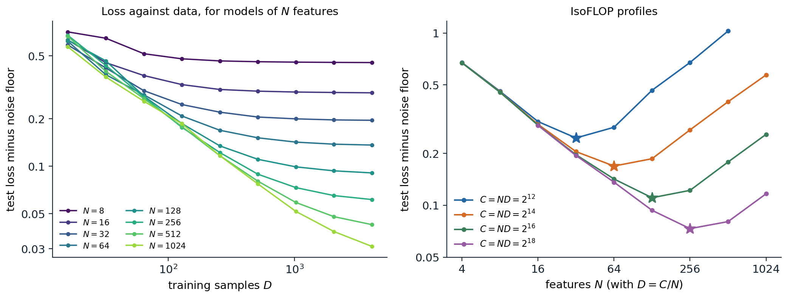

[ML Mastery Notes](../README.md) › [NLP and Large Language Models](README.md)

# 7. Scaling Laws

[← 6. Pretraining Data](06-pretraining-data.md) · [8. Decoding and Text Generation →](08-decoding-and-text-generation.md)

## <a id="power-laws-in-loss"></a>Power laws in loss

### <a id="loss-falls-predictably"></a>Loss falls predictably

Most of the progress in language models since 2018 came from training larger models on more data with more computation, and the gains followed a regular pattern. [Hestness et al. (2017)](https://arxiv.org/abs/1712.00409) observed across translation, language modeling, image classification, and speech recognition that test loss falls as a power law in the amount of training data. [Kaplan et al. (2020)](https://arxiv.org/abs/2001.08361) measured the pattern for transformer language models over more than seven orders of magnitude: when neither of the other two limits binds, the test loss in nats per token behaves as

$$
L(N)\approx\Bigl(\frac{N_c}N\Bigr)^{\alpha_N},\qquad
L(D)\approx\Bigl(\frac{D_c}D\Bigr)^{\alpha_D},\qquad
L(C)\approx\Bigl(\frac{C_c}C\Bigr)^{\alpha_C},
$$

with $`N`$ the number of non-embedding parameters, $`D`$ the number of training tokens, $`C`$ the training compute, and exponents of about 0.076, 0.095, and 0.050. On log–log axes each is a straight line. The exponents are small, so a tenfold increase in compute lowers the loss by only about 11%, but the lines are straight enough to extrapolate: loss can be predicted for a model a thousand times larger than any that has been trained. Other architectural details, such as the ratio of depth to width or the number of heads, move the loss much less than $`N`$, $`D`$, and $`C`$ (chapter 4).

A **scaling law** in this sense is an empirical fit, valid over the range where it was measured, for a fixed architecture family, data distribution, tokenizer, and training recipe. Its value is practical: it turns decisions about expensive training runs into extrapolations from cheap ones.

### <a id="why-power-laws"></a>Why power laws?

Power laws in loss arise when the task consists of many components of decreasing importance, themselves distributed as a power law. The simplest model makes this exact. Let inputs have independent coordinates with variances $`\lambda_i\propto i^{-(1+\alpha)}`$, let the target be a linear function of all of them, and let a model of size $`N`$ represent only the $`N`$ most important coordinates. The loss it cannot remove, however much data it sees, is the variance of the rest, $`\sum_{i>N}\lambda_i\propto N^{-\alpha}`$: each doubling of the model captures a constant fraction of the remaining structure. Finite data limit it in the same way, since coordinates with small variance cannot be estimated from few samples. [Sharma and Kaplan (2022)](https://arxiv.org/abs/2004.10802) related the exponent to the intrinsic dimension of the data manifold, [Bahri et al. (2024)](https://arxiv.org/abs/2102.06701) distinguished the regimes in which the model size or the data is the bottleneck, [Maloney, Roberts, and Sully (2022)](https://arxiv.org/abs/2210.16859) solved a random-feature version of the model above, and [Michaud et al. (2023)](https://arxiv.org/abs/2303.13506) proposed that language is made of discrete skills, or "quanta," used with power-law frequencies and learned in order of frequency. In natural language, Zipf's law (chapter 1) is one visible source of such a spectrum.



*A linear model on data whose coordinate variances fall as $`i^{-1.6}`$: a model of size $`N`$ sees the $`N`$ highest-variance coordinates and is fit by Bayes-optimal ridge regression on $`D`$ samples; the exact test loss is averaged over 20 draws, and the cost of training is taken to be $`C=ND`$. Left: loss against data for eight model sizes; each curve falls as a power law and then flattens at the floor set by the model's size. A fit of $`L=E+AN^{-a}+BD^{-b}`$ to all 72 points gives $`a=0.64`$ (the theory predicts 0.6) and $`b=0.69`$. Right: at four fixed budgets, loss against model size has a minimum (stars at $`N=32`$, 64, 128, and 256); parabolas fitted near the minima put the optimal size at 32, 68, 141, and 289, growing as $`C^{0.53}`$, against $`C^{b/(a+b)}=C^{0.52}`$ predicted by the fitted law.*

### <a id="model-size-and-data-together"></a>Model size and data together

A model is limited by both its size and its data. [Hoffmann et al. (2022)](https://arxiv.org/abs/2203.15556) fitted the additive form

$$
L(N,D)=E+\frac A{N^\alpha}+\frac B{D^\beta},
$$

where $`E`$ is the loss of an ideal model, the entropy of the text under the tokenizer (chapter 2), and the other two terms are the excess loss due to finite size and finite data. The left panel of the figure shows the same structure in the toy model: each curve follows the data term until it meets the floor $`E+AN^{-\alpha}`$ of its model size, so a small model stops benefiting from data early and a large model benefits for longer.

## <a id="compute-optimal-training"></a>Compute-optimal training

### <a id="the-allocation-problem"></a>The allocation problem

Training a transformer costs about $`C\approx6ND`$ floating-point operations (DL chapter 9). With a fixed budget, a larger model must be trained on fewer tokens, and the question is how to divide the budget. Minimizing $`L(N,D)`$ subject to $`6ND=C`$ ([Appendix A](#block-nlp07-appendix-a)) gives

$$
N^*(C)=G\Bigl(\frac C6\Bigr)^{\frac\beta{\alpha+\beta}},\qquad
D^*(C)=G^{-1}\Bigl(\frac C6\Bigr)^{\frac\alpha{\alpha+\beta}},\qquad
G=\Bigl(\frac{\alpha A}{\beta B}\Bigr)^{\frac1{\alpha+\beta}},
$$

so both grow as powers of the budget, with exponents that sum to one. When $`\alpha\approx\beta`$, as fits to language data find, model size and data should grow at the same rate, and the ratio of tokens to parameters stays roughly constant.

### <a id="three-ways-to-estimate-the-optimum"></a>Three ways to estimate the optimum

Hoffmann et al. trained more than 400 models, from 70 million to 16 billion parameters on 5 to 500 billion tokens, and estimated the optimal allocation in three ways.

1. **The envelope of training curves.** For each model size, train with several run lengths, each with its learning rate schedule fitted to that length, and for each amount of compute take the lowest loss reached by any model. The model sizes on this envelope give $`N^*(C)`$.
2. **IsoFLOP profiles.** For each of several budgets, train models of different sizes with exactly that budget, fit a parabola to loss against $`\log N`$, and take its minimum, as in the right panel of the figure.
3. **A parametric fit.** Fit $`L(N,D)`$ to all runs and minimize it analytically.

The first two methods found $`N^*\propto C^{0.50}`$ and $`C^{0.49}`$, about 20 training tokens per parameter. The toy model reproduces the agreement between methods 2 and 3: its IsoFLOP minima grow as $`C^{0.53}`$, and its fitted law predicts $`C^{0.52}`$.

### <a id="kaplan-versus-chinchilla"></a>Kaplan versus Chinchilla

The result overturned the earlier recommendation. Kaplan et al. had found $`N^*\propto C^{0.73}`$: most of a larger budget should go into a larger model trained on relatively few tokens, and GPT-3, with 175 billion parameters trained on 300 billion tokens, has 1.7 tokens per parameter. Hoffmann et al. tested their conclusion directly. **Chinchilla**, with 70 billion parameters trained on 1.4 trillion tokens, used about the same compute as the 280-billion-parameter Gopher trained on 300 billion tokens, and outperformed it and larger models on nearly every benchmark. Later analyses traced the discrepancy mainly to details of Kaplan's setup: a learning rate schedule not adjusted to each run's length, which penalizes long runs of small models; counting only non-embedding parameters in small models, where embeddings are a large share; and measurements at small scale ([Porian et al., 2024](https://arxiv.org/abs/2406.19146); [Pearce and Song, 2024](https://arxiv.org/abs/2406.12907)). The code evaluates the allocation formula with two published fits of Hoffmann et al.'s form.

```python
laws = {"Hoffmann et al. (2022)": (1.6934, 406.4, 410.7, 0.3392, 0.2849),
        "Besiroglu et al. (2024)": (1.8172, 482.01, 2085.43, 0.3478, 0.3658)}


def loss(N, D, law):
    E, A, B, alpha, beta = law
    return E + A / N ** alpha + B / D ** beta


def optimal(C, law):
    """Minimize L(N, D) subject to 6 N D = C (Appendix A)."""
    E, A, B, alpha, beta = law
    G = (alpha * A / (beta * B)) ** (1 / (alpha + beta))
    N = G * (C / 6) ** (beta / (alpha + beta))
    return N, C / (6 * N)


for name, law in laws.items():
    E, A, B, alpha, beta = law
    print(f"{name}: N* grows like C^{beta / (alpha + beta):.3f}, D* like C^{alpha / (alpha + beta):.3f}")
    for C in [1e21, 1e23, 1e25]:
        N, D = optimal(C, law)
        print(f"  C = {C:.0e}: N* = {N:.2e}, D* = {D:.2e}, {D / N:5.1f} tokens per parameter, loss {loss(N, D, law):.3f}")

law = laws["Besiroglu et al. (2024)"]
for name, N, D in [("Gopher", 280e9, 300e9), ("Chinchilla", 70e9, 1.4e12)]:
    print(f"{name:10s} {N / 1e9:5.0f}B parameters, {D / 1e12:4.2f}T tokens, C = {6 * N * D:.2e}: loss {loss(N, D, law):.3f}")

# Llama 3 8B was trained on 15.6T tokens, far beyond the compute-optimal ratio.
N, D = 8e9, 15.6e12
C = 6 * N * D
No, Do = optimal(C, law)
print(f"8B on 15.6T tokens (C = {C:.2e}): loss {loss(N, D, law):.3f}; compute-optimal at the same C: "
      f"{No / 1e9:.0f}B on {Do / 1e12:.2f}T tokens, loss {loss(No, Do, law):.3f}")
# Hoffmann et al. (2022): N* grows like C^0.456, D* like C^0.544
#   C = 1e+21: N* = 2.21e+09, D* = 7.53e+10,  34.0 tokens per parameter, loss 2.295
#   C = 1e+23: N* = 1.81e+10, D* = 9.20e+11,  50.7 tokens per parameter, loss 1.988
#   C = 1e+25: N* = 1.48e+11, D* = 1.12e+13,  75.7 tokens per parameter, loss 1.838
# Besiroglu et al. (2024): N* grows like C^0.513, D* like C^0.487
#   C = 1e+21: N* = 2.78e+09, D* = 6.00e+10,  21.6 tokens per parameter, loss 2.306
#   C = 1e+23: N* = 2.94e+10, D* = 5.66e+11,  19.2 tokens per parameter, loss 2.032
#   C = 1e+25: N* = 3.12e+11, D* = 5.34e+12,  17.1 tokens per parameter, loss 1.912
# Gopher       280B parameters, 0.30T tokens, C = 5.04e+23: loss 2.000
# Chinchilla    70B parameters, 1.40T tokens, C = 5.88e+23: loss 1.974
# 8B on 15.6T tokens (C = 7.49e+23): loss 2.022; compute-optimal at the same C: 83B on 1.51T tokens, loss 1.967
```

With Hoffmann et al.'s published parameters, the optimal ratio of tokens to parameters drifts from 34 to 76 as the budget grows, inconsistent with their own first two methods. The refit by [Besiroglu et al. (2024)](https://arxiv.org/abs/2404.10102), which reconstructed the data from the paper's figures, gives exponents of 0.513 and 0.487 and about 20 tokens per parameter throughout, in agreement with methods 1 and 2. Under that law, Chinchilla's allocation reaches a lower loss than Gopher's with a similar budget, as it did in practice. The losses are specific to the training data and tokenizer of those papers and do not transfer to other models; the exponents and ratios are what carry over, approximately.

### <a id="how-reliable-are-the-fits"></a>How reliable are the fits?

Fitting $`L(N,D)`$ is harder than it looks. The five parameters are strongly correlated, since a larger $`A`$ can be offset by a larger $`\alpha`$ over the range of the data, and small errors in the exponents change the extrapolated allocation substantially. Hoffmann et al. fitted the logarithm of the loss with a robust **Huber loss** and reported confidence intervals that the replication found implausibly narrow ([Appendix B](#block-nlp07-appendix-b)). The code simulates 60 training runs at four budgets from a known law with 1% noise in the loss, refits the law as Hoffmann et al. did, and bootstraps over the runs.

```python
import numpy as np
from scipy.optimize import minimize
from scipy.special import logsumexp

rng = np.random.default_rng(0)
E, A, B, alpha, beta = 1.8172, 482.01, 2085.43, 0.3478, 0.3658   # treated as the unknown truth

# 60 simulated training runs: four compute budgets, 15 model sizes each, 1% multiplicative noise.
runs = []
for C in [1e18, 1e19, 1e20, 1e21]:
    for N in np.geomspace(C ** 0.5 / 400, C ** 0.5 / 4, 15):
        D = C / (6 * N)
        runs.append((N, D, (E + A / N ** alpha + B / D ** beta) * np.exp(0.01 * rng.standard_normal())))
runs = np.array(runs)


def fit(r):
    """Chinchilla's third approach: Huber loss on log L, with L = exp(e) + exp(a - alpha log N) + exp(b - beta log D)."""
    logN, logD, logL = np.log(r[:, 0]), np.log(r[:, 1]), np.log(r[:, 2])

    def objective(p):
        a, b, e, al, be = p
        pred = logsumexp([a - al * logN, b - be * logD, e * np.ones_like(logN)], axis=0)
        res = np.abs(pred - logL)
        return np.sum(np.where(res < 1e-3, 0.5 * res ** 2, 1e-3 * (res - 0.5e-3)))   # Huber, delta = 1e-3
    starts = [(a, b, 0.5, al, be) for a in (2, 8) for b in (2, 8) for al in (0.2, 0.5) for be in (0.2, 0.5)]
    return min((minimize(objective, s, method="L-BFGS-B") for s in starts), key=lambda m: m.fun).x


def summary(p):
    a, b, e, al, be = p
    G = (al * np.exp(a) / (be * np.exp(b))) ** (1 / (al + be))
    N = G * (1e23 / 6) ** (be / (al + be))
    return be / (al + be), 1e23 / (6 * N) / N           # exponent of N*(C), tokens per parameter at 1e23 FLOPs


p = fit(runs)
print(f"fit: E={np.exp(p[2]):.3f} A={np.exp(p[0]):.0f} B={np.exp(p[1]):.0f} alpha={p[3]:.3f} beta={p[4]:.3f}")
print("truth: E=1.817 A=482 B=2085 alpha=0.348 beta=0.366")
expo, ratio = summary(p)
print(f"fitted: N* grows like C^{expo:.3f}; {ratio:.1f} tokens per parameter at 1e23 FLOPs (truth: 0.513, 19.2)")
boot = np.array([summary(fit(runs[rng.integers(len(runs), size=len(runs))])) for _ in range(20)])
print(f"bootstrap over runs (20 resamples): exponent {boot[:, 0].mean():.3f} +- {boot[:, 0].std():.3f}, "
      f"tokens per parameter from {boot[:, 1].min():.1f} to {boot[:, 1].max():.1f}")
# fit: E=1.811 A=478 B=1267 alpha=0.348 beta=0.343
# truth: E=1.817 A=482 B=2085 alpha=0.348 beta=0.366
# fitted: N* grows like C^0.496; 23.3 tokens per parameter at 1e23 FLOPs (truth: 0.513, 19.2)
# bootstrap over runs (20 resamples): exponent 0.510 +- 0.026, tokens per parameter from 8.4 to 45.5
```

The fit recovers the exponent of $`N^*(C)`$ to within about 0.02, but the data term is poorly identified ($`B`$ comes out as 1,267 instead of 2,085), and the bootstrap spreads the recommended ratio at $`10^{23}`$ FLOPs, four orders of magnitude beyond the simulated runs, from about 8 to 46 tokens per parameter. Small uncertainties in exponents become large uncertainties after long extrapolations, and a practitioner planning a large run is well advised to check predictions at intermediate scales before committing the budget.

## <a id="beyond-compute-optimal"></a>Beyond compute-optimal

### <a id="paying-for-inference"></a>Paying for inference

Compute-optimal allocation minimizes the cost of training alone. A deployed model is also run, at a cost of about $`2N`$ operations per generated token, possibly for trillions of tokens. Including inference in the objective favors smaller models trained on more data than the training-optimal ratio ([Sardana et al., 2024](https://arxiv.org/abs/2401.00448)), and the loss penalty for doing so is modest because the loss surface is flat near the optimum. In the code above, an 8-billion-parameter model trained on 15.6 trillion tokens, about 2,000 tokens per parameter, reaches a loss only 0.055 nats higher than the compute-optimal 83-billion-parameter model with the same training budget, while costing about a tenth as much per generated token. Llama 3's 8-billion-parameter model was trained on about 15 trillion tokens for this reason, and small models are now routinely trained far past the Chinchilla ratio.

### <a id="running-out-of-data"></a>Running out of data

The compute-optimal recipe assumes an unlimited supply of fresh tokens. For the largest runs, high-quality text is becoming the binding constraint, and training for several epochs, filtering harder, and generating synthetic data are the responses (chapter 6). [Muennighoff et al. (2023)](https://arxiv.org/abs/2305.16264) extended the scaling law to repeated data by replacing $`D`$ with an effective number of tokens that saturates with repetition, and found that with limited data the compute-optimal allocation shifts toward more epochs over a larger model than the unconstrained law recommends.

### <a id="scaling-the-hyperparameters"></a>Scaling the hyperparameters

A scaling law assumes each run is well tuned, and the best hyperparameters change with scale. Larger models need smaller learning rates under the standard parameterization, and the batch size can grow as the loss falls: the **critical batch size**, beyond which larger batches no longer reduce the number of steps proportionally, is predicted by the ratio of the gradient's variance to its squared norm ([McCandlish et al., 2018](https://arxiv.org/abs/1812.06162); DL chapter 3). Laboratories fit scaling laws for the learning rate and batch size themselves, as a function of compute ([DeepSeek-AI, 2024](https://arxiv.org/abs/2401.02954)). An alternative removes the dependence at its source. The **maximal update parameterization** (μP) scales initializations and per-layer learning rates with width so that the optimal hyperparameters stay fixed as the model grows ([Yang et al., 2022](https://arxiv.org/abs/2203.03466)); hyperparameters tuned on a 40-million-parameter proxy transferred to a 6.7-billion-parameter GPT-3 model and improved on the original, at a tuning cost of 7% of one pretraining run. It rests on the feature-learning infinite-width limits of DL chapter 15.

### <a id="other-axes"></a>Other axes

The same method applies to every dimension along which models are scaled: mixtures of experts, where the number of experts acts like a multiplier on parameters with diminishing returns ([Clark et al., 2022](https://arxiv.org/abs/2202.01169)); the numerical precision of training and inference, where lower precision acts like a reduction in the effective parameter count ([Kumar et al., 2024](https://arxiv.org/abs/2411.04330)); the vocabulary, whose optimal size grows with the model ([Tao et al., 2024](https://arxiv.org/abs/2407.13623)); transfer from pretraining to fine-tuning, measured as the effective amount of fine-tuning data that pretraining is worth ([Hernandez et al., 2021](https://arxiv.org/abs/2102.01293)); and computation at test time rather than training time (chapter 12).

## <a id="from-loss-to-capabilities"></a>From loss to capabilities

### <a id="predicting-downstream-performance"></a>Predicting downstream performance

Users care about what a model can do, not its loss. The loss on held-out text predicts downstream performance well in aggregate, and laboratories use this to forecast large runs. OpenAI predicted the final loss of GPT-4 from models trained with at most one ten-thousandth of its compute, and its pass rate on a subset of a coding benchmark from models with one thousandth ([OpenAI, 2023](https://arxiv.org/abs/2303.08774)). The Llama 3 team predicted the accuracy of its largest model on a reasoning benchmark in two steps, from compute to the model's negative log-likelihood of the correct answers and from that likelihood to accuracy, using models up to a thousand times smaller. Such forecasts work for broad benchmarks; performance on a particular narrow task is much less predictable.

### <a id="emergence"></a>Emergence

Some capabilities appear abruptly: performance on multi-digit arithmetic, on some reasoning tasks, or on unscrambling words stays near chance for small models and then rises sharply over a narrow range of scale. [Wei et al. (2022)](https://arxiv.org/abs/2206.07682) collected dozens of such **emergent abilities**. [Schaeffer, Miranda, and Koyejo (2023)](https://arxiv.org/abs/2304.15004) showed that many of the jumps come from the metric rather than the model: exact-match accuracy on a multi-token answer is the product of per-token accuracies, so a smooth improvement in each token turns into a sharp rise in the chance that all are right ([Appendix C](#block-nlp07-appendix-c)), and measuring the same models with a continuous metric, such as the edit distance to the correct answer, gives smooth, predictable curves. The debate has not been settled entirely. Some capabilities do form abruptly during training, and a smooth metric does not help if what matters is whether the whole answer is correct. What the analysis establishes is that emergence is not evidence that scaling trends are unpredictable, provided one predicts the right quantity.

### <a id="where-the-trends-bend"></a>Where the trends bend

Scaling laws describe averages and hold over the ranges where they were measured. Some tasks get worse with scale, typically because larger models learn more strongly a pattern of the training data that the task asks them to override, such as repeating a well-known quotation instead of following an instruction to change it ([McKenzie et al., 2023](https://arxiv.org/abs/2306.09479)). Loss curves can bend when the data distribution runs out of new structure or the model enters a different regime, and functional forms with several power-law segments fit some such curves better ([Caballero et al., 2023](https://arxiv.org/abs/2210.14891)). And the loss measures prediction of the pretraining distribution, which says nothing about behaviors that post-training adds or removes (chapter 11). Predicting the capabilities of models before they are trained is a question of growing importance for safety and policy, taken up in the Safety and Frontier module.

## <a id="appendices"></a>Appendices


<details>
<summary><a id="block-nlp07-appendix-a"></a><b>A. The compute-optimal allocation</b></summary>


Minimize $`L(N,D)=E+AN^{-\alpha}+BD^{-\beta}`$ subject to $`6ND=C`$. Substituting $`D=C/(6N)`$ gives a function of $`N`$ alone,

$$
\ell(N)=E+AN^{-\alpha}+B\Bigl(\frac C6\Bigr)^{-\beta}N^{\beta}.
$$

Its derivative, $`-\alpha AN^{-\alpha-1}+\beta B(C/6)^{-\beta}N^{\beta-1}`$, vanishes where

$$
N^{\alpha+\beta}=\frac{\alpha A}{\beta B}\Bigl(\frac C6\Bigr)^{\beta},
\qquad\text{so}\qquad
N^*=\Bigl(\frac{\alpha A}{\beta B}\Bigr)^{\frac1{\alpha+\beta}}\Bigl(\frac C6\Bigr)^{\frac\beta{\alpha+\beta}},
$$

and $`\ell`$ is convex in $`\log N`$, so this is the minimum. Then $`D^*=C/(6N^*)=G^{-1}(C/6)^{\alpha/(\alpha+\beta)}`$. At the optimum the two excess terms are in a fixed ratio: from the stationarity condition, $`\alpha AN^{*-\alpha}=\beta BD^{*-\beta}`$, so the finite-size term is $`\beta/(\alpha+\beta)`$ and the finite-data term $`\alpha/(\alpha+\beta)`$ of the total excess loss. Substituting shows that the excess loss itself falls as a power of compute,

$$
L^*(C)-E\propto C^{-\frac{\alpha\beta}{\alpha+\beta}},
$$

which is why loss against compute on the efficient frontier is a straight line on log–log axes, with an exponent smaller than either $`\alpha`$ or $`\beta`$. With $`\alpha\approx\beta\approx0.35`$ the compute exponent is about 0.18 for the excess loss; Kaplan's exponent of 0.050 refers to the total loss without an irreducible term, which falls more slowly.

</details>


<details>
<summary><a id="block-nlp07-appendix-b"></a><b>B. Fitting a scaling law</b></summary>


Hoffmann et al. write the law in log-space as

$$
\log\hat L(N,D)=\operatorname{LSE}\bigl(a-\alpha\log N,\ b-\beta\log D,\ e\bigr),
$$

where $`\operatorname{LSE}`$ is the log of the sum of exponentials and $`A=e^a`$, $`B=e^b`$, $`E=e^e`$, which keeps the three terms positive without constraints. They minimize $`\sum_i\operatorname{Huber}_\delta\bigl(\log\hat L(N_i,D_i)-\log L_i\bigr)`$ with $`\delta=10^{-3}`$ using L-BFGS from a grid of starting points, since the objective has many local minima. Fitting the logarithm weights runs by their relative error, which matches multiplicative noise across a wide range of losses; the Huber loss, quadratic for residuals below $`\delta`$ and linear beyond, limits the influence of runs that diverged or were mistuned. With $`\delta=10^{-3}`$, most residuals exceed $`\delta`$, so the fit behaves nearly like least absolute deviations.

Uncertainty should be estimated by refitting on bootstrap resamples of the runs, which preserves the correlations between parameters. The quantity of interest is usually not a single parameter but a prediction far outside the data, such as $`N^*`$ at a budget a thousand times larger, and its uncertainty grows with the distance of the extrapolation: an error $`\delta a`$ in the allocation exponent multiplies the predicted $`N^*`$ by $`(C/C_0)^{\delta a}`$ at a budget $`C`$ far from the fitted budgets $`C_0`$, so an error of 0.02 over four orders of magnitude changes $`N^*`$ by about 20% and the ratio of tokens to parameters by about 45%.

</details>


<details>
<summary><a id="block-nlp07-appendix-c"></a><b>C. Sharp transitions from smooth improvement</b></summary>


Suppose the answer to a task has $`k`$ tokens and the model predicts each correctly with probability $`p(C)`$, independently, and that the per-token error falls as a power of compute, $`1-p(C)=cC^{-\gamma}`$. Exact-match accuracy is

$$
\operatorname{acc}(C)=p(C)^k=\bigl(1-cC^{-\gamma}\bigr)^k\approx\exp\bigl(-kcC^{-\gamma}\bigr)
$$

for small errors. As a function of $`\log C`$ this is a Gumbel-shaped curve, near 0 while $`kcC^{-\gamma}\gg1`$ and near 1 once it is $`\ll1`$. The accuracy crosses one half at $`C_{1/2}=(kc/\ln2)^{1/\gamma}`$, and the transition from 10% to 90% accuracy spans a factor of $`(\ln10/\ln(10/9))^{1/\gamma}\approx21.9^{1/\gamma}`$ in compute, independent of $`k`$. Larger $`k`$ moves the transition to larger scale, where it is typically observed only at the last few model sizes of a family. With $`\gamma=0.5`$ and a family spaced by factors of ten in compute, the rise from 10% to 90% spans a factor of about 480, less than three model sizes, and looks abrupt, though the per-token error falls smoothly all along. The per-token log-likelihood, $`\log p(C)\approx-cC^{-\gamma}`$, is a straight line in log–log coordinates and predicts the transition before it happens.

</details>

---

[← 6. Pretraining Data](06-pretraining-data.md) · [8. Decoding and Text Generation →](08-decoding-and-text-generation.md)
