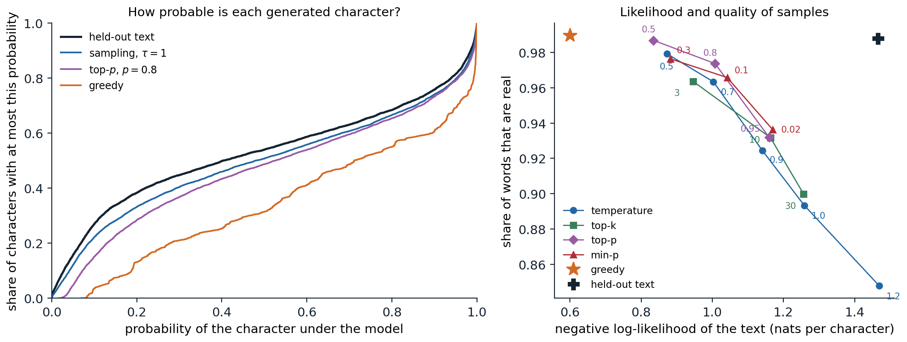

[ML Mastery Notes](../README.md) › [NLP and Large Language Models](README.md)

# 8. Decoding and Text Generation

[← 7. Scaling Laws](07-scaling-laws.md) · [9. In-Context Learning and Prompting →](09-in-context-learning-and-prompting.md)

## <a id="choosing-an-output"></a>Choosing an output

### <a id="the-decoding-problem"></a>The decoding problem

A language model defines a distribution $p(y\mid x)$ over continuations $y=(y_1,\dots,y_T)$ of a prompt $x$, one token at a time. **Decoding** turns that distribution into text, and the model does not dictate how. Two goals compete. For tasks with a correct answer, such as translation, summarization, or answering a factual question, the aim is usually the single best output, and the natural target is the **mode**, $\arg\max_yp(y\mid x)$. For open-ended tasks, such as stories, dialogue, or brainstorming, the aim is text that reads as if a person wrote it, varied from one request to the next, and the natural procedure is to **sample**. The same model can produce fluent prose or degenerate loops depending on this choice, and this chapter develops the main decoding rules, the reasons for their behavior, and the cost of running them.

### <a id="greedy-and-beam-search"></a>Greedy and beam search

The mode is a search problem over $V^T$ sequences, far too many to enumerate. **Greedy decoding** picks the most probable token at each step, which is fast but myopic: a token that looks best now may lead to a continuation that is improbable as a whole. **Beam search** keeps the $k$ highest-scoring partial sequences, extends each by every possible token, and retains the $k$ best of the results, scored by total log-probability; it is the beam search of AI chapter 2 applied to sequences, with no guarantee of finding the mode. Sequences end when they produce an end token, and because every token multiplies the probability by a number less than one, raw scores favor short outputs; translation systems divide the score by a power of the length, a **length penalty** such as the $\bigl((5+|y|)/6\bigr)^{\alpha}$ with $\alpha$ between 0.6 and 0.7 of Google's translation system ([Wu et al., 2016](https://arxiv.org/abs/1609.08144)). Beams of 4 to 10 are typical in translation.

The code compares greedy decoding, beam search with $k=5$, and sampling for the character model of chapter 4, after the start of a line from *The Taming of the Shrew*, and scores each continuation, including the one Shakespeare wrote, by its average log-probability per character.

```python
import math

import torch
from torch import nn

ckpt = torch.load("Sources/Data/shakespeare-char-transformer.pt")   # the character model of chapter 4
cfg, chars = ckpt["config"], ckpt["chars"]
stoi = {c: i for i, c in enumerate(chars)}


class CharLM(nn.Module):
    def __init__(self, V, T, d, L, heads):
        super().__init__()
        self.T = T
        self.tok, self.pos = nn.Embedding(V, d), nn.Embedding(T, d)
        block = nn.TransformerEncoderLayer(d, heads, 4 * d, dropout=0.0, activation="gelu",
                                           batch_first=True, norm_first=True)
        self.blocks = nn.TransformerEncoder(block, L, enable_nested_tensor=False)
        self.ln, self.out = nn.LayerNorm(d), nn.Linear(d, V, bias=False)
        self.out.weight = self.tok.weight
        self.register_buffer("mask", nn.Transformer.generate_square_subsequent_mask(T))

    def forward(self, x):
        x = x[:, -self.T:]
        t = x.shape[1]
        h = self.tok(x) + self.pos(torch.arange(t))
        return self.out(self.ln(self.blocks(h, mask=self.mask[:t, :t], is_causal=True)))


model = CharLM(**cfg)
model.load_state_dict(ckpt["state_dict"])
model.eval()
torch.set_grad_enabled(False)
encode = lambda s: [stoi[c] for c in s]
decode = lambda ids: "".join(chars[i] for i in ids)


def logprobs(ids):                                       # next-character log-probabilities after ids
    return torch.log_softmax(model(torch.tensor([ids]))[0, -1], dim=-1)
prompt = "KATHARINA:\nMoved! in good time: "
ids = encode(prompt)


def greedy(ids, n):
    ids = list(ids)
    for _ in range(n):
        ids.append(int(logprobs(ids).argmax()))
    return ids


def beam(ids, n, k):
    beams = [(0.0, list(ids))]                           # (log-probability, sequence)
    for _ in range(n):
        cand = []
        for score, seq in beams:
            lp = logprobs(seq)
            top = torch.topk(lp, k)
            cand += [(score + v.item(), seq + [i.item()]) for v, i in zip(top.values, top.indices)]
        beams = sorted(cand, key=lambda c: -c[0])[:k]
    return beams[0][1]


def sample(ids, n, gen):
    ids = list(ids)
    for _ in range(n):
        ids.append(int(torch.multinomial(logprobs(ids).exp(), 1, generator=gen)))
    return ids


def score(ids, start):                                   # mean log-probability of ids[start:], nats per character
    return sum(logprobs(ids[:t])[ids[t]].item() for t in range(start, len(ids))) / (len(ids) - start)


text = open("Sources/Data/tinyshakespeare.txt", encoding="utf-8").read()
start = text.index(prompt) + len(prompt)                # the prompt comes from the held-out part of the text
n = 120
outputs = {"human": encode(prompt) + encode(text[start:start + n]),
           "greedy": greedy(ids, n), "beam, k=5": beam(ids, n, 5),
           "sampling": sample(ids, n, torch.Generator().manual_seed(0))}
for name, out in outputs.items():
    print(f"--- {name}: {score(out, len(ids)):.2f} nats per character")
    print(decode(out[len(ids):]))
# --- human: -1.14 nats per character
# let him that moved you hither
# Remove you hence: I knew you at the first
# You were a moveable.
#
# PETRUCHIO:
# Why, what's a m
# --- greedy: -0.75 nats per character
# the shame of the state
# That which I have said the prince of the state
# That the season of the state of the state
# That the
# --- beam, k=5: -0.64 nats per character
# therefore, and therefore,
# That thou shalt not make the prince of heaven,
# And therefore the commons of the country's head
# --- sampling: -1.26 nats per character
# why shall discipline,
# And Jupites when being was moans founded hands?
# And, you have quickly flies like upon him
# A more,
```

Greedy decoding falls into a loop, *the state of the state*, and beam search finds text more probable still, $-0.64$ nats per character against $-1.14$ for Shakespeare's own line, which the model finds much less likely than its own output. The sample is less probable than Shakespeare's text and less sensible, but it is varied.

### <a id="the-trouble-with-the-most-likely-sequence"></a>The trouble with the most likely sequence

For open-ended generation the mode is the wrong target. [Holtzman et al. (2020)](https://arxiv.org/abs/1904.09751) showed that human text does not stay at high probability under a language model: it mixes predictable tokens with surprising ones, while beam search produces text whose every token is highly probable, bland, generic, and prone to repetition. Repetition is self-reinforcing: once a phrase has occurred, copying it becomes more probable, each copy raises the probability further, and the model can be trapped in a loop from which greedy decoding never escapes ([Xu et al., 2022](https://arxiv.org/abs/2206.02369)).

Even for tasks with correct answers, the mode can be wrong. In translation, beam search with very large beams produces worse translations than with small ones, the **beam search curse** ([Koehn and Knowles, 2017](https://arxiv.org/abs/1706.03872)), and exact search showed that for more than half of the sentences in a benchmark, the translation model's single most probable output was the empty string ([Stahlberg and Byrne, 2019](https://arxiv.org/abs/1908.10090)). A model trained with log loss spreads probability over many good outputs, each individually unlikely, and a degenerate output can concentrate more probability than any of them. The general reason is that the mode of a distribution over long sequences is **atypical**: a sequence drawn from the distribution has probability around $e^{-TH}$ for entropy $H$ per token, and almost none of the probability mass lies near the mode ([Appendix C](#block-nlp08-appendix-c); Foundations chapter 5). Beam search works for translation because a small beam is an imperfect search whose errors happen to act as a useful bias toward adequate outputs, a view developed by [Meister, Cotterell, and Vieira (2020)](https://arxiv.org/abs/2010.02650).

## <a id="sampling"></a>Sampling

### <a id="sampling-and-its-tail"></a>Sampling and its tail

**Ancestral sampling** draws each token from the model's next-token distribution. It produces exact samples from the model, varied and typical, but it exposes every error the model makes in its low-probability predictions. Over a vocabulary of 50,000 tokens, the many tokens that each receive a tiny probability together hold a substantial share of the mass, and a model trained with log loss overestimates them, since assigning too little probability to a token that occurs is penalized far more than assigning too much to tokens that do not. Sampling from this **unreliable tail** once in a while derails the text, and errors compound, because the model then conditions on its own mistake. The decoding rules in the rest of this section reshape the distribution before sampling to trade diversity against reliability.

### <a id="temperature"></a>Temperature

Dividing the logits $z$ by a **temperature** $\tau$ before the softmax,

$$
p_\tau(y_t=i)=\frac{\exp(z_i/\tau)}{\sum_j\exp(z_j/\tau)},
$$

sharpens the distribution for $\tau<1$ and flattens it for $\tau>1$; $\tau\to0$ gives greedy decoding and $\tau\to\infty$ the uniform distribution. It is the Boltzmann distribution of statistical physics with energies $-z_i$, and the entropy of $p_\tau$ increases with $\tau$ ([Appendix C](#block-nlp08-appendix-c)). Temperature changes the probabilities of all tokens, including those in the tail, and does not remove any.

### <a id="truncation"></a>Truncation

**Truncation** rules set the tail to zero and renormalize what remains.

- **Top-$k$** ([Fan, Lewis, and Dauphin, 2018](https://arxiv.org/abs/1805.04833)) keeps the $k$ most probable tokens. The right $k$ depends on the context: where many continuations are plausible a small $k$ cuts good options, and where one is nearly certain a large $k$ admits nonsense.
- **Top-$p$** or **nucleus sampling** ([Holtzman et al., 2020](https://arxiv.org/abs/1904.09751)) keeps the smallest set of tokens whose total probability is at least $p$, typically 0.9 to 0.95, so the set grows where the distribution is flat and shrinks where it is peaked.
- **Min-$p$** ([Nguyen et al., 2024](https://arxiv.org/abs/2407.01082)) keeps the tokens whose probability is at least a fraction $p_{\min}$ of the most probable token's, which scales the threshold with the model's confidence and tolerates higher temperatures.
- **Typical sampling** ([Meister et al., 2023](https://arxiv.org/abs/2202.00666)) keeps the tokens whose surprisal $-\log p$ is closest to the entropy of the distribution, which can exclude the most probable token when it is atypically probable, and **η-sampling** ([Hewitt, Manning, and Liang, 2022](https://arxiv.org/abs/2210.15191)) treats truncation as undoing the smoothing that log-loss training adds to the true distribution and derives a threshold from the entropy.

The code applies these rules to the model's next-character distributions at two points of the same line: at the start of a word, where many letters are plausible, and in the middle of *hither*, where one letter is nearly certain.

```python
import math

import torch
from torch import nn

ckpt = torch.load("Sources/Data/shakespeare-char-transformer.pt")   # the character model of chapter 4
cfg, chars = ckpt["config"], ckpt["chars"]
stoi = {c: i for i, c in enumerate(chars)}


class CharLM(nn.Module):
    def __init__(self, V, T, d, L, heads):
        super().__init__()
        self.T = T
        self.tok, self.pos = nn.Embedding(V, d), nn.Embedding(T, d)
        block = nn.TransformerEncoderLayer(d, heads, 4 * d, dropout=0.0, activation="gelu",
                                           batch_first=True, norm_first=True)
        self.blocks = nn.TransformerEncoder(block, L, enable_nested_tensor=False)
        self.ln, self.out = nn.LayerNorm(d), nn.Linear(d, V, bias=False)
        self.out.weight = self.tok.weight
        self.register_buffer("mask", nn.Transformer.generate_square_subsequent_mask(T))

    def forward(self, x):
        x = x[:, -self.T:]
        t = x.shape[1]
        h = self.tok(x) + self.pos(torch.arange(t))
        return self.out(self.ln(self.blocks(h, mask=self.mask[:t, :t], is_causal=True)))


model = CharLM(**cfg)
model.load_state_dict(ckpt["state_dict"])
model.eval()
torch.set_grad_enabled(False)
encode = lambda s: [stoi[c] for c in s]
decode = lambda ids: "".join(chars[i] for i in ids)


def logprobs(ids):                                       # next-character log-probabilities after ids
    return torch.log_softmax(model(torch.tensor([ids]))[0, -1], dim=-1)


def show(name, lg):
    p = torch.softmax(lg, dim=-1)
    kept = torch.nonzero(p > 0).flatten()
    ent = abs(-(p[kept] * p[kept].log2()).sum().item())
    top = torch.argsort(p, descending=True)[:5]
    print(f"{name:18s} {len(kept):3d} kept, entropy {ent:.2f} bits | "
          + " ".join(f"{decode([i])!r}:{p[i]:.2f}" for i in top.tolist()))


def top_k(lg, k):
    return lg.masked_fill(lg < torch.topk(lg, k).values[-1], -math.inf)


def top_p(lg, mass):                                     # smallest set of tokens with probability >= mass
    p, order = torch.sort(torch.softmax(lg, -1), descending=True)
    drop = torch.zeros_like(lg, dtype=torch.bool)
    drop[order] = p.cumsum(0) - p >= mass
    return lg.masked_fill(drop, -math.inf)


def min_p(lg, ratio):                                    # tokens with probability >= ratio * top probability
    p = torch.softmax(lg, -1)
    return lg.masked_fill(p < ratio * p.max(), -math.inf)


for context in ["KATHARINA:\nMoved! in good time: let him that moved you ",      # start of a word
                "KATHARINA:\nMoved! in good time: let him that moved you hith"]:  # middle of a word
    logits = model(torch.tensor([encode(context)]))[0, -1]
    print(f"after {context[-12:]!r}:")
    show("  model", logits)
    show("  temperature 0.5", logits / 0.5)
    show("  top-k, k=5", top_k(logits, 5))
    show("  top-p, p=0.9", top_p(logits, 0.9))
    show("  min-p, 0.1", min_p(logits, 0.1))
# after 't moved you ':
#   model             65 kept, entropy 4.00 bits | 'm':0.13 't':0.11 's':0.10 'h':0.10 'a':0.09
#   temperature 0.5   65 kept, entropy 3.29 bits | 'm':0.23 't':0.16 's':0.13 'h':0.12 'a':0.10
#   top-k, k=5         5 kept, entropy 2.31 bits | 'm':0.25 't':0.21 's':0.19 'h':0.18 'a':0.16
#   top-p, p=0.9      14 kept, entropy 3.61 bits | 'm':0.15 't':0.12 's':0.11 'h':0.10 'a':0.10
#   min-p, 0.1        17 kept, entropy 3.81 bits | 'm':0.14 't':0.12 's':0.10 'h':0.10 'a':0.09
# after 'ved you hith':
#   model             65 kept, entropy 0.01 bits | 'e':1.00 'a':0.00 'i':0.00 'A':0.00 'r':0.00
#   temperature 0.5   65 kept, entropy 0.00 bits | 'e':1.00 'a':0.00 'i':0.00 'A':0.00 'r':0.00
#   top-k, k=5         5 kept, entropy 0.01 bits | 'e':1.00 'a':0.00 'i':0.00 'A':0.00 'r':0.00
#   top-p, p=0.9       1 kept, entropy 0.00 bits | 'e':1.00 'b':0.00 'j':0.00 'i':0.00 'h':0.00
#   min-p, 0.1         1 kept, entropy 0.00 bits | 'e':1.00 'b':0.00 'j':0.00 'i':0.00 'h':0.00
```

At the start of a word, top-$k$ with $k=5$ discards letters that together hold nearly half of the probability, while top-$p$ and min-$p$ keep 14 and 17 letters. In the middle of *hither*, top-$p$ and min-$p$ keep only *e*, while top-$k$ still admits four letters whose probability is negligible. Temperature leaves all 65 characters in play in both contexts.

### <a id="comparing-the-rules"></a>Comparing the rules



*Continuations of 300 characters from 24 prompts taken from the held-out plays, generated by the character model of chapter 4 under different decoding rules. Left: the cumulative distribution of the probability that the untruncated model assigns to each generated character. In the held-out text 26.9% of the characters have probability below 0.1; in samples at $\tau=1$, 22.2%; with top-$p$ at 0.8, 15.1%; and in greedy output, 3.5%, while 39.3% of greedy characters have probability above 0.9, against 24.2% in the held-out text. Right: for each rule and setting, the share of generated words that occur somewhere in the corpus, a crude measure of quality, against the model's negative log-likelihood of the generated text. Greedy decoding produces 99.0% real words at 0.60 nats per character but repeats itself, with 47% of its word trigrams occurring earlier in the same sample; sampling at $\tau=1$ gives 89.3% real words at 1.26 nats. The held-out text scores 98.8% real words at 1.47 nats.*

All four families trace nearly the same curve: every rule that raises the share of real words does so by generating more probable text, and the rules differ mainly in how they parametrize the trade-off. Top-$p$ and min-$p$ reach slightly better points than temperature and top-$k$ at the same likelihood, since they cut the tail adaptively. The held-out text sits off the curve, at high quality and low likelihood, because its low likelihood reflects the model's own errors rather than bad text; no decoding rule reproduces that combination. Which setting is best depends on the purpose. Chat assistants typically sample at a temperature between 0.6 and 1 with top-$p$ between 0.9 and 1; code generation and question answering with a single correct answer often use low temperatures or greedy decoding.

### <a id="repetition-penalties-and-other-fixes"></a>Repetition penalties and other fixes

Repetition can also be discouraged directly. The **repetition penalty** of CTRL ([Keskar et al., 2019](https://arxiv.org/abs/1909.05858)) divides the positive logits of tokens that already occur in the text by a factor such as 1.2, and commercial interfaces offer **frequency** and **presence penalties** that subtract from the logits of a token in proportion to its count or once if it has occurred at all. Such penalties are blunt: they also discourage the repetition of names, function words, and code identifiers that should repeat. **Contrastive search** ([Su et al., 2022](https://arxiv.org/abs/2202.06417)) picks, among the most probable next tokens, the one whose representation is least similar to those of earlier tokens, and **unlikelihood training** ([Welleck et al., 2020](https://arxiv.org/abs/1908.04319)) removes the tendency during training by penalizing the probability of tokens that would repeat. The instruction-tuned models of later chapters repeat much less than base models, so heavy repetition penalties are rarely needed with them.

## <a id="constrained-generation"></a>Constrained generation

### <a id="masks-and-automata"></a>Masks and automata

Applications often need output in a fixed format: valid JSON matching a schema, a date, a member of a list of labels, code that parses. **Constrained decoding** enforces the format at each step by setting to $-\infty$ the logits of every token that would make the output impossible to complete validly, and then sampling or searching as usual. For formats described by a regular expression, the constraint is a finite automaton over characters, and a library can precompute, for each state of the automaton, which tokens of the vocabulary are allowed, since a token is a string of characters that the automaton either accepts from that state or does not ([Willard and Louf, 2023](https://arxiv.org/abs/2307.09702)). Context-free grammars need a pushdown automaton and more bookkeeping, and JSON schemas are compiled to such grammars. Tokenization complicates both: a constraint written for characters must be matched against multi-character tokens, and forcing the text to break at an unnatural token boundary pushes the model into non-canonical tokenizations it rarely saw in training (chapter 1).

### <a id="constraints-change-the-distribution"></a>Constraints change the distribution

Masking at each step does not sample from the model's distribution conditioned on the output satisfying the constraint. The mask renormalizes each next-token distribution locally, without knowing how much probability the model assigns to valid completions downstream, so it can steer the model into a prefix that is valid but that the model considers unlikely to continue well, and it over-represents outputs that are forced early. Sampling exactly from the conditional distribution requires estimating, for each allowed token, the probability of completing the output validly, which is expensive in general ([Park et al., 2024](https://arxiv.org/abs/2405.21047)). In practice, constrained decoding works best when the constraint is natural for the model, for instance when the prompt already describes the format and gives an example, so that the mask rarely overrides the model's preference.

## <a id="speculative-decoding"></a>Speculative decoding

### <a id="draft-and-verify"></a>Draft and verify

Generating one token requires a full forward pass of the model, and for large models on accelerators that pass is limited by reading the weights from memory rather than by arithmetic ([The cost of generation](#the-cost-of-generation)), so scoring several tokens in one pass costs hardly more than scoring one. **Speculative decoding** ([Leviathan, Kalman, and Matias, 2023](https://arxiv.org/abs/2211.17192); [Chen et al., 2023](https://arxiv.org/abs/2302.01318)) exploits this. A cheap **draft** model $q$ proposes $\gamma$ tokens autoregressively; the large **target** model $p$ computes its own distributions at all $\gamma+1$ positions in a single pass; and a rejection rule decides how many proposals to keep:

1. For each proposed token $x$ in order, accept it with probability $\min\bigl(1,p(x)/q(x)\bigr)$, where both probabilities are conditioned on the accepted prefix.
2. At the first rejection, sample a replacement from the **residual** distribution $\propto\max\bigl(p(\cdot)-q(\cdot),0\bigr)$ and discard the remaining proposals.
3. If all $\gamma$ proposals are accepted, sample one more token from the target's distribution at the last position, which the pass has already computed.

The output has exactly the target model's distribution, whatever the draft ([Appendix A](#block-nlp08-appendix-a)); the draft affects only the speed. The code checks exactness on a toy distribution, then uses a character trigram model, estimated by counting the training text, as the draft for the transformer.

```python
import math

import torch
from torch import nn

ckpt = torch.load("Sources/Data/shakespeare-char-transformer.pt")   # the character model of chapter 4
cfg, chars = ckpt["config"], ckpt["chars"]
stoi = {c: i for i, c in enumerate(chars)}


class CharLM(nn.Module):
    def __init__(self, V, T, d, L, heads):
        super().__init__()
        self.T = T
        self.tok, self.pos = nn.Embedding(V, d), nn.Embedding(T, d)
        block = nn.TransformerEncoderLayer(d, heads, 4 * d, dropout=0.0, activation="gelu",
                                           batch_first=True, norm_first=True)
        self.blocks = nn.TransformerEncoder(block, L, enable_nested_tensor=False)
        self.ln, self.out = nn.LayerNorm(d), nn.Linear(d, V, bias=False)
        self.out.weight = self.tok.weight
        self.register_buffer("mask", nn.Transformer.generate_square_subsequent_mask(T))

    def forward(self, x):
        x = x[:, -self.T:]
        t = x.shape[1]
        h = self.tok(x) + self.pos(torch.arange(t))
        return self.out(self.ln(self.blocks(h, mask=self.mask[:t, :t], is_causal=True)))


model = CharLM(**cfg)
model.load_state_dict(ckpt["state_dict"])
model.eval()
torch.set_grad_enabled(False)
encode = lambda s: [stoi[c] for c in s]
decode = lambda ids: "".join(chars[i] for i in ids)


def logprobs(ids):                                       # next-character log-probabilities after ids
    return torch.log_softmax(model(torch.tensor([ids]))[0, -1], dim=-1)
import numpy as np

# 1. Exactness: speculative sampling from a draft q reproduces the target p exactly (toy distributions).
rng = np.random.default_rng(0)
p, q = np.array([0.5, 0.2, 0.2, 0.1]), np.array([0.25, 0.25, 0.25, 0.25])
draws = rng.choice(4, 200_000, p=q)                      # draft proposals
accept = rng.random(200_000) < np.minimum(1, p[draws] / q[draws])
residual = np.maximum(p - q, 0) / np.maximum(p - q, 0).sum()
final = np.where(accept, draws, rng.choice(4, 200_000, p=residual))
print("target", p, "| speculative samples", np.bincount(final) / len(final), "| acceptance", accept.mean())

# 2. The character transformer as target, a character trigram model as a cheap draft.
text = open("Sources/Data/tinyshakespeare.txt", encoding="utf-8").read()
train = encode(text[:int(0.9 * len(text))])
V = len(chars)
tri = np.ones((V, V, V)) * 0.01                          # add-0.01 trigram counts
np.add.at(tri, (train[:-2], train[1:-1], train[2:]), 1)
tri /= tri.sum(2, keepdims=True)


def speculative(ids, n, gamma, gen):
    ids, calls, proposed, accepted = list(ids), 0, 0, 0
    while len(ids) < n:
        draft, qs = [], []
        for _ in range(gamma):                           # the draft proposes gamma characters
            qd = tri[(ids + draft)[-2], (ids + draft)[-1]]
            draft.append(int(gen.choice(V, p=qd)))
            qs.append(qd)
        ps = torch.softmax(model(torch.tensor([ids + draft]))[0, -gamma - 1:], -1).double().numpy()
        calls += 1                                       # one target pass scores all gamma + 1 positions
        for i, x in enumerate(draft):
            proposed += 1
            if gen.random() < min(1.0, ps[i][x] / qs[i][x]):
                ids.append(x)
                accepted += 1
            else:                                        # resample from the residual and stop
                r = np.maximum(ps[i] - qs[i], 0)
                ids.append(int(gen.choice(V, p=r / r.sum())))
                break
        else:                                            # all accepted: one more token from the target for free
            ids.append(int(gen.choice(V, p=ps[gamma] / ps[gamma].sum())))
    return ids, calls, accepted / proposed


prompt = encode("KATHARINA:\nMoved! in good time: ")
for gamma in [1, 2, 4, 8]:
    out, calls, alpha = speculative(prompt, len(prompt) + 400, gamma, np.random.default_rng(1))
    made = len(out) - len(prompt)
    print(f"gamma={gamma}: acceptance {alpha:.2f}, {made / calls:.2f} characters per target pass "
          f"(i.i.d. prediction {(1 - alpha ** (gamma + 1)) / (1 - alpha):.2f})")
print(decode(out[len(prompt):len(prompt) + 120]))
# target [0.5 0.2 0.2 0.1] | speculative samples [0.499415 0.20201  0.1992   0.099375] | acceptance 0.75026
# gamma=1: acceptance 0.62, 1.62 characters per target pass (i.i.d. prediction 1.62)
# gamma=2: acceptance 0.61, 1.99 characters per target pass (i.i.d. prediction 1.99)
# gamma=4: acceptance 0.61, 2.30 characters per target pass (i.i.d. prediction 2.33)
# gamma=8: acceptance 0.59, 2.40 characters per target pass (i.i.d. prediction 2.40)
# it will not confess
# Or the every law revaered that now he day?
# Murder ye from he's perforation, who hear I say!
# For thou
```

The speculative samples match the target distribution to within sampling error, with acceptance probability $\sum_i\min(p_i,q_i)=0.75$. With the trigram draft, about 60% of proposals are accepted, and each target pass yields 1.62 characters with one proposal, 2.30 with four, and 2.40 with eight, in close agreement with the prediction $(1-\alpha^{\gamma+1})/(1-\alpha)$ for independent acceptances at rate $\alpha$ ([Appendix B](#block-nlp08-appendix-b)). The gains saturate because the chance that all proposals survive falls geometrically with $\gamma$.

### <a id="how-much-it-saves"></a>How much it saves

The acceptance rate equals $1-\mathrm{TV}(p,q)$, one minus the total variation distance between target and draft, so the draft should agree with the target as often as possible while costing much less. Drafts are usually a small model of the same family, sharing its tokenizer; for text that copies its input, such as code editing, simply looking up continuations of the last few tokens in the prompt works well. Other methods add extra prediction heads to the target model to propose several tokens at once, as in Medusa ([Cai et al., 2024](https://arxiv.org/abs/2401.10774)), or train a light draft network on the target's hidden states, as in EAGLE ([Li et al., 2024](https://arxiv.org/abs/2401.15077)). Speedups of two to three times in wall-clock time are typical. The saving is in latency for one request; when a server is already batching many requests, the target pass is no longer memory-bound, and speculation gains less.

## <a id="the-cost-of-generation"></a>The cost of generation

### <a id="prefill-and-decode"></a>Prefill and decode

Serving a request has two phases. **Prefill** processes the prompt: all its tokens pass through the model in parallel, as in training, and the computation is dominated by large matrix multiplications that keep the accelerator's arithmetic units busy. **Decode** then generates one token at a time; each step multiplies the weight matrices by a single vector per sequence, so it reads every weight from memory to do two floating-point operations with it. A 70-billion-parameter model in 16-bit precision has 140 GB of weights, and an H100 GPU reads memory at about 3.35 TB/s, so reading the weights once takes about 42 ms at the bandwidth of one GPU, or about 5 ms spread over eight, whatever the batch; in that time each GPU could have performed tens of trillions of 16-bit operations. Decoding one sequence at a time uses well under 1% of the arithmetic ([Appendix B](#block-nlp08-appendix-b)).

### <a id="batching-and-memory"></a>Batching and memory

The remedy is **batching**: a decode step for $B$ sequences reads the weights once and performs $B$ times as much arithmetic, so throughput grows almost linearly with $B$ until the step becomes compute-bound, at a batch of a few hundred sequences on current hardware. Requests arrive and finish at different times, so servers use **continuous batching**, adding new requests to the batch and removing finished ones at every step rather than waiting for the whole batch to finish ([Yu et al., 2022](https://www.usenix.org/conference/osdi22/presentation/yu)).

Batching is limited by memory for the **key–value cache** (DL chapter 9), which grows with the batch size and the context length and can exceed the size of the weights. Allocating a contiguous region for each sequence's maximum length wastes most of it, and **PagedAttention** ([Kwon et al., 2023](https://arxiv.org/abs/2309.06180)) instead stores the cache in fixed-size blocks allocated on demand, like pages of virtual memory, which let the vLLM server batch several times more requests. Sequences that share a prefix, such as a long system prompt, can share its cached blocks (**prefix caching**; [Zheng et al., 2024](https://arxiv.org/abs/2312.07104)). Grouped-query and latent attention (chapter 4) and quantization of the cache and the weights (DL chapter 11) attack the same bottleneck from the model's side.

### <a id="latency-and-throughput"></a>Latency and throughput

A serving system is judged by the **time to first token**, dominated by prefill, the **time per output token**, dominated by decode, and the **throughput** in tokens per second across all users. Larger batches raise throughput and cost per token falls, but each user's tokens arrive more slowly; speculative decoding lowers latency at some cost in throughput. Because prefill is compute-bound and decode memory-bound, some systems run them on separate pools of accelerators sized for each ([Zhong et al., 2024](https://arxiv.org/abs/2401.09670)). These costs shape the models themselves: the push for small models trained on many tokens (chapter 7), for fewer key–value heads, and for mixtures of experts that read only a fraction of their weights per token all come from the economics of decoding.

## <a id="appendices"></a>Appendices


<details>
<summary><a id="block-nlp08-appendix-a"></a><b>A. Speculative sampling is exact</b></summary>


Fix a prefix and let $p$ and $q$ be the target's and draft's next-token distributions. The draft proposes $X\sim q$; it is accepted with probability $\min(1,p(X)/q(X))$; otherwise a replacement is drawn from $r(x)=\max(p(x)-q(x),0)/Z$, where $Z=\sum_x\max(p(x)-q(x),0)$. The probability that the procedure outputs a token $x$ is

$$
P(x)=q(x)\min\Bigl(1,\frac{p(x)}{q(x)}\Bigr)+P(\text{reject})\,r(x)=\min\bigl(p(x),q(x)\bigr)+P(\text{reject})\,r(x).
$$

The rejection probability is $1-\sum_x\min(p(x),q(x))=\sum_x\bigl(p(x)-\min(p(x),q(x))\bigr)=\sum_x\max(p(x)-q(x),0)=Z$. Hence

$$
P(x)=\min\bigl(p(x),q(x)\bigr)+\max\bigl(p(x)-q(x),0\bigr)=p(x),
$$

since $\min(a,b)+\max(a-b,0)=a$. Each emitted token therefore has the target's conditional distribution given the tokens before it. Proposals after the first rejection are discarded, so later positions are always conditioned on tokens with the correct distribution, and the extra token sampled when all proposals are accepted comes directly from $p$. By induction over positions, the whole generated sequence has the target model's distribution. The acceptance probability, $\sum_x\min(p(x),q(x))=1-\mathrm{TV}(p,q)$, is the only place the draft's quality enters.

</details>


<details>
<summary><a id="block-nlp08-appendix-b"></a><b>B. Expected tokens per pass and the arithmetic intensity of decoding</b></summary>


**Speculation.** If each proposal is accepted independently with probability $\alpha$, a round with $\gamma$ proposals emits $j+1$ tokens when the first $j$ are accepted and the next rejected ($j<\gamma$), and $\gamma+1$ when all are accepted. The expected number is

$$
\sum_{j=0}^{\gamma-1}(j+1)\alpha^j(1-\alpha)+(\gamma+1)\alpha^\gamma=\sum_{j=0}^{\gamma}\alpha^j=\frac{1-\alpha^{\gamma+1}}{1-\alpha},
$$

using $P(\text{at least }m\text{ tokens})=\alpha^{m-1}$ for $m=1,\dots,\gamma+1$ and $\mathbb E[M]=\sum_mP(M\ge m)$. It never exceeds $1/(1-\alpha)$. Each round costs one target pass plus $\gamma$ draft passes, so with a draft costing a fraction $c$ of the target, the speedup is $\frac{1-\alpha^{\gamma+1}}{(1-\alpha)(1+c\gamma)}$, which has an optimum at a finite $\gamma$.

**Arithmetic intensity.** A matrix–vector product with an $m\times n$ weight matrix in 16-bit precision reads $2mn$ bytes and performs $2mn$ operations, one operation per byte. With a batch of $B$ vectors it performs $2Bmn$ operations on the same bytes, $B$ operations per byte. An accelerator with peak throughput $F$ operations per second and memory bandwidth $W$ bytes per second is memory-bound when the intensity is below $F/W$; for an H100 in 16-bit arithmetic, $F\approx989\times10^{12}$ and $W\approx3.35\times10^{12}$, so $F/W\approx300$. Decoding a single sequence therefore reaches about $1/300$ of peak throughput, and batches of around 300 sequences are needed before the arithmetic, not the memory, limits the speed. Reading the key–value cache adds memory traffic that grows with the context and is not shared across the batch, which pushes long-context decoding further into the memory-bound regime.

</details>


<details>
<summary><a id="block-nlp08-appendix-c"></a><b>C. The mode is atypical, and temperature controls entropy</b></summary>


**Typicality.** For a model with per-token entropy $H$ on sequences of length $T$, the asymptotic equipartition property (Foundations chapter 5) says that a sampled sequence has log-probability close to $-TH$ with high probability, and that the typical set of such sequences carries almost all the probability. The mode has log-probability at least $-T\bar h_{\min}$, where $\bar h_{\min}$ is the average of the smallest surprisals along the greedy path, and for text $\bar h_{\min}$ is far below $H$: in the code of this chapter, greedy text has 0.60 nats per character against the model's entropy of about 1.26. The mode is therefore exponentially more probable than any single typical sequence, yet sampling essentially never produces it or anything like it. Choosing the mode is a decision to produce an output unlike the ones the model would generate.

**Temperature.** Write $p_\tau(i)\propto e^{z_i/\tau}$ and $\beta=1/\tau$. The entropy $H(\beta)=\log Z(\beta)-\beta\,\mathbb E_\beta[z]$ with $Z(\beta)=\sum_ie^{\beta z_i}$ has derivative

$$
\frac{dH}{d\beta}=\mathbb E_\beta[z]-\mathbb E_\beta[z]-\beta\frac{d\,\mathbb E_\beta[z]}{d\beta}=-\beta\operatorname{Var}_\beta(z)\le0,
$$

using $\frac{d}{d\beta}\log Z=\mathbb E_\beta[z]$ and $\frac{d}{d\beta}\mathbb E_\beta[z]=\operatorname{Var}_\beta(z)$. So the entropy decreases as $\beta$ grows, that is, increases with temperature, strictly unless all logits are equal, from $\log V$ at $\tau=\infty$ to the log of the number of tied maxima at $\tau=0$.

</details>

---

[← 7. Scaling Laws](07-scaling-laws.md) · [9. In-Context Learning and Prompting →](09-in-context-learning-and-prompting.md)
