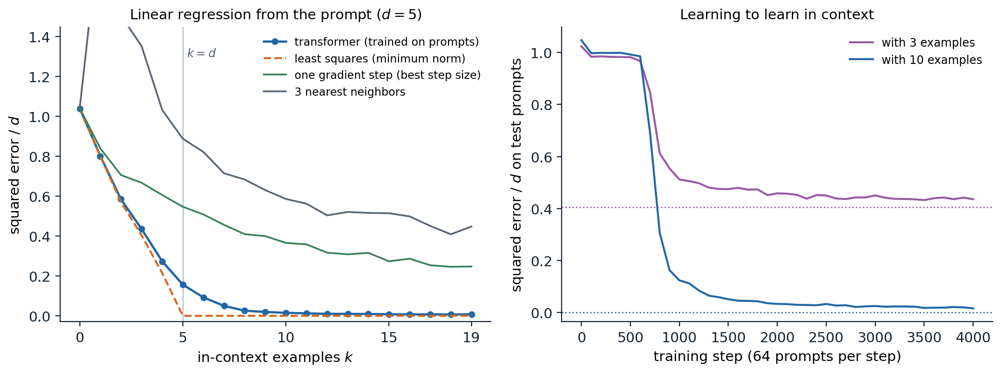

[Background Notes](../README.md) › [NLP and Large Language Models](README.md)

# 9. In-Context Learning and Prompting

[← 8. Decoding and Text Generation](08-decoding-and-text-generation.md) · [10. Fine-Tuning and Parameter-Efficient Adaptation →](10-fine-tuning-and-parameter-efficient-adaptation.md)

## <a id="learning-from-the-prompt"></a>Learning from the prompt

### <a id="few-shot-prompting"></a>Few-shot prompting

A pretrained language model can perform a task it was never trained on if the task is written into its input. **GPT-3** ([Brown et al., 2020](https://arxiv.org/abs/2005.14165)) made this the central way of using a language model. Its paper distinguished three settings, none of which changes the model's parameters:

- **zero-shot**: a description of the task followed by the input, such as *Translate English to French: cheese =>*;
- **one-shot**: the description, one solved example, and the input;
- **few-shot**: the description and as many solved examples, or **demonstrations**, as fit in the context, typically 10 to 100.

The model continues the text, and its continuation is the answer. This is **in-context learning**: the model's behavior adapts to the examples in its input, as if it had learned the task from them, although no gradient step is taken. GPT-3's few-shot performance improved much faster with model size than its zero-shot performance, and on some benchmarks the 175-billion-parameter model with a few demonstrations approached fine-tuned models trained on thousands of labeled examples. The discovery that a single model could be adapted to new tasks by writing text, without training data or gradient updates, changed how language models were used and studied, and the rest of this chapter examines how reliable the adaptation is, why it works, and how prompts are written in practice.

### <a id="scoring-and-calibration"></a>Scoring and calibration

For classification, a prompt maps each label to a word, the **verbalizer**, such as *positive* and *negative* for sentiment, and the model's prediction is the label whose word it assigns the highest probability after the prompt. Multiple-choice questions are scored the same way, by the probability of each answer ([chapter 14](14-evaluating-language-models.md)). These probabilities are biased by the prompt in systematic ways. [Zhao et al. (2021)](https://arxiv.org/abs/2102.09690) identified three: **majority-label bias**, toward labels that are frequent among the demonstrations; **recency bias**, toward the labels of the last demonstrations; and **common-token bias**, toward words that are frequent in pretraining. They proposed **contextual calibration**: query the model with the same prompt and a content-free input such as *N/A*, whose label should be uniform, and rescale the label probabilities for real inputs so that the content-free input would come out uniform ([Appendix B](#block-nlp09-appendix-b)). The correction raised GPT-3's accuracy by up to 30 points on some tasks and reduced its variance across prompts.

### <a id="sensitivity-to-the-prompt"></a>Sensitivity to the prompt

In-context learning is sensitive to details that should not matter. The order of the same demonstrations can take a model from nearly state-of-the-art accuracy to chance ([Lu et al., 2022](https://arxiv.org/abs/2104.08786)). Formatting choices, such as the separator between input and label, capitalization, or spacing, changed the accuracy of an open 13-billion-parameter model by up to 76 points on some tasks ([Sclar et al., 2024](https://arxiv.org/abs/2310.11324)). And models learned from prompts whose instructions were irrelevant or even misleading about as quickly as from good instructions, which suggests that they do not always use the instructions the way a reader would ([Webson and Pavlick, 2022](https://arxiv.org/abs/2109.01247)). Sensitivity decreases with scale and with instruction tuning ([chapter 10](10-fine-tuning-and-parameter-efficient-adaptation.md)), but it has not disappeared, and any evaluation that uses a single prompt measures the prompt as well as the model.

### <a id="what-the-demonstrations-contribute"></a>What the demonstrations contribute

A demonstration conveys several things at once: the format of the output, the set of possible labels, the kind of inputs to expect, and the mapping from inputs to labels. [Min et al. (2022)](https://arxiv.org/abs/2202.12837) separated them and found, surprisingly, that replacing the correct labels of the demonstrations with random ones barely hurt performance on classification and multiple-choice tasks, while removing the labels altogether, or using inputs from a different distribution, hurt a lot. For those models and tasks, the demonstrations served mainly to specify the format, the label space, and the input distribution; the mapping itself came from pretraining. Larger models behave differently: [Wei et al. (2023)](https://arxiv.org/abs/2303.03846) found that sufficiently large models follow demonstrations with flipped labels, overriding what they know about the task, and can learn mappings to arbitrary label words such as *foo* and *bar*, which smaller models cannot. With long context windows, **many-shot** prompts with hundreds or thousands of demonstrations continue to improve performance and can override biases acquired in pretraining ([Agarwal et al., 2024](https://arxiv.org/abs/2404.11018)).

## <a id="how-in-context-learning-works"></a>How in-context learning works

### <a id="inference-over-latent-concepts"></a>Inference over latent concepts

One explanation treats in-context learning as Bayesian inference. [Xie et al. (2022)](https://arxiv.org/abs/2111.02080) modeled pretraining documents as generated by latent **concepts**, such as a topic, a style, or a format, each of which makes the tokens of a document coherent. Predicting the next token well requires inferring the concept from the document so far, so a model trained on such data implicitly computes a posterior over concepts. A prompt of demonstrations is an unusual document, but it is evidence about a concept like any other, and the model's prediction for the query is the posterior predictive distribution. The code carries out this inference exactly in a toy world with 200 concepts, each a labeling of 20 inputs with 5 labels, observed with 10% label noise.

```python
import numpy as np

rng = np.random.default_rng(0)
C, X, Y, eps = 200, 20, 5, 0.1                           # concepts, inputs, labels, label noise
f = rng.integers(Y, size=(C, X))                         # each latent concept is a labeling of the inputs
lik = np.full((C, X, Y), eps / (Y - 1))                  # p(y | x, concept): f(x) with probability 1 - eps
lik[np.arange(C)[:, None], np.arange(X)[None, :], f] = 1 - eps


def predict(demos, xq):
    """Posterior predictive p(y | xq, demos) = sum_c p(y | xq, c) p(c | demos), uniform prior over concepts."""
    logpost = np.zeros(C)
    for x, y in demos:
        logpost += np.log(lik[:, x, y])
    post = np.exp(logpost - logpost.max())
    post /= post.sum()
    return post @ lik[:, xq, :], post.max()


print(" k   accuracy   max posterior   accuracy with random demonstration labels")
for k in [0, 1, 2, 4, 8, 16]:
    acc = acc_rand = conf = 0.0
    trials = 4000
    for _ in range(trials):
        c = rng.integers(C)
        xs = rng.integers(X, size=k + 1)
        ys = np.where(rng.random(k) < eps, rng.integers(Y, size=k), f[c, xs[:k]])
        p, top = predict(list(zip(xs[:k], ys)), xs[k])
        acc += p.argmax() == f[c, xs[k]]
        conf += top
        p_rand, _ = predict(list(zip(xs[:k], rng.integers(Y, size=k))), xs[k])
        acc_rand += p_rand.argmax() == f[c, xs[k]]
    print(f"{k:2d} {acc / trials:10.3f} {conf / trials:15.3f} {acc_rand / trials:22.3f}")
#  k   accuracy   max posterior   accuracy with random demonstration labels
#  0      0.223           0.005                  0.223
#  1      0.302           0.022                  0.212
#  2      0.415           0.096                  0.211
#  4      0.731           0.552                  0.209
#  8      0.963           0.938                  0.209
# 16      1.000           0.999                  0.205
```

Accuracy rises from chance to 96% with eight demonstrations as the posterior concentrates on the right concept, and reaches 100% with sixteen; the posterior on wrong concepts falls exponentially with the number of demonstrations ([Appendix C](#block-nlp09-appendix-c)). With random labels the demonstrations carry no information about the concept, and accuracy stays at chance. In this toy the mapping is the only thing demonstrations convey, which is why random labels destroy it; in real prompts much of what they convey is format and label space, which random labels preserve.

### <a id="learning-algorithms-in-the-forward-pass"></a>Learning algorithms in the forward pass

A second explanation asks what algorithm a transformer can execute on its prompt. [Garg et al. (2022)](https://arxiv.org/abs/2208.01066) trained transformers from scratch on prompts of the form $`x_1,f(x_1),\dots,x_k,f(x_k),x_{\text{query}}`$, with a new random function $`f`$ for every prompt, and found that for linear functions the trained model's predictions matched least squares, the optimal estimator, and that it also learned sparse linear functions, decision trees, and small neural networks in context. The figure repeats the linear experiment at small scale.



*A four-layer transformer of width 64 trained on 256,000 prompts, each with 20 examples $`(x_i,w^\top x_i)`$ in five dimensions and a new random $`w\sim\mathcal N(0,I)`$; the model predicts each $`y_k`$ from the $`k`$ examples before it. Errors are averaged over 2,000 test prompts and divided by $`d`$, so predicting zero scores 1. Left: error against the number of examples in the prompt. The transformer tracks minimum-norm least squares, the optimal predictor here, while there are fewer examples than dimensions (0.585 against 0.570 with two examples) and approaches it afterward (0.156 against 0 with five examples, 0.015 with ten), far below one gradient step with the best step size (0.366 with ten) and three nearest neighbors (0.586). Right: test error with 3 and 10 examples during training; the dotted lines are least squares. The ability appears abruptly after a plateau of about 600 steps in which the model predicts nearly zero; with three examples the error settles at 0.44, close to the least-squares value of 0.40.*

A model of about 200,000 parameters, trained for four minutes on a laptop-class processor, has learned to fit a linear function to the examples in its prompt, though nothing in its training names regression: every prompt comes from a different function of the same family, and the loss rewards whatever computation predicts the next value best. Its predictions come close to the optimum and far exceed simple estimators such as one gradient step or averaging nearby examples. The long plateau followed by a sudden drop is typical of how in-context abilities are acquired, as the next sections show for language models.

How can attention compute such estimators? [von Oswald et al. (2023)](https://arxiv.org/abs/2212.07677) gave an explicit construction: a single layer of linear self-attention, attention without the softmax, can perform one step of gradient descent on the least-squares loss of the in-context examples, and a stack of $`L`$ such layers performs $`L`$ steps. Each example is a token holding its input and its current residual, the query token holds minus its current prediction, and the attention scores between the query and each example are the inner products of their inputs, which is exactly the form of a gradient step ([Appendix A](#block-nlp09-appendix-a)). The code builds the weights and checks the equivalence.

```python
import numpy as np

rng = np.random.default_rng(0)
d, n, eta = 5, 40, 0.5
X = rng.standard_normal((n + 1, d))                     # n context points and one query (the last row)
w = rng.standard_normal(d)
y = X @ w

# Token j is z_j = (x_j, r_j): its input and, in the last slot, the current residual y_j - f(x_j);
# the query starts with r = 0 - f(x_q) = 0, so its slot will hold minus the prediction.
Z = np.hstack([X, np.append(y[:n], 0.0)[:, None]])
WQ = WK = np.diag([1.0] * d + [0.0])                    # queries and keys read the input x
WV = np.diag([0.0] * d + [-eta])                        # values carry -eta times the residual
mask = np.append(np.ones(n), 0.0)                       # only the context tokens act as keys


def linear_attention_layer(Z):
    Q, K, Vv = Z @ WQ.T, Z @ WK.T, Z @ WV.T
    scores = (Q @ K.T) * mask[None, :] / n             # no softmax: linear self-attention
    return Z + scores @ Vv                             # residual connection


wt = np.zeros(d)
for step in range(1, 31):
    Z = linear_attention_layer(Z)
    wt = wt + eta / n * X[:n].T @ (y[:n] - X[:n] @ wt)  # one step of gradient descent on the context
    if step in (1, 2, 3, 10, 30):
        print(f"{step:2d} layers: prediction {-Z[n, -1]:+.6f}; {step:2d} steps of gradient descent: {X[n] @ wt:+.6f}")
w_ls = np.linalg.lstsq(X[:n], y[:n], rcond=None)[0]
print(f"least squares {X[n] @ w_ls:+.6f}, true value {y[n]:+.6f}")
#  1 layers: prediction +1.196470;  1 steps of gradient descent: +1.196470
#  2 layers: prediction +1.873020;  2 steps of gradient descent: +1.873020
#  3 layers: prediction +2.273280;  3 steps of gradient descent: +2.273280
# 10 layers: prediction +2.974272; 10 steps of gradient descent: +2.974272
# 30 layers: prediction +3.057105; 30 steps of gradient descent: +3.057105
# least squares +3.057491, true value +3.057491
```

The transformer's prediction after $`L`$ layers equals that of $`L`$ gradient steps to six decimal places, and approaches the least-squares prediction as layers are added. Trained transformers do not literally run this algorithm: with softmax attention and MLPs they can implement more efficient estimators, including ridge regression and approximations to second-order methods ([Akyürek et al., 2023](https://arxiv.org/abs/2211.15661)), and they can select among algorithms according to the prompt, for instance switching between regression and classification ([Bai et al., 2023](https://arxiv.org/abs/2306.04637)). What they compute also depends on the pretraining distribution: trained on only a few distinct tasks, transformers memorize the tasks and behave like a Bayesian posterior over them, as in the concept model above, and beyond a threshold of task diversity they switch to the general algorithm that works for unseen tasks ([Raventós et al., 2023](https://arxiv.org/abs/2306.15063)). The two explanations are thus two ends of one spectrum.

### <a id="induction-heads"></a>Induction heads

For language models trained on text, the best-understood mechanism is the **induction head** ([Olsson et al., 2022](https://arxiv.org/abs/2209.11895)). It completes patterns of the form $`[A][B]\dots[A]\to[B]`$: when the current token $`A`$ occurred earlier followed by $`B`$, the head attends from the current position to the position after the earlier $`A`$ and copies $`B`$. It takes two attention layers: a head in the first layer writes into each position the identity of the previous token, and the induction head in the second layer matches the current token against those previous-token records. Induction heads explain copying, the continuation of repeated text, and some fuzzy analogues such as translating a repeated phrase. In models of many sizes, they form abruptly at the same point in training at which the ability to use long contexts improves, a **phase change** visible as a bump in the training loss. The mechanistic study of such circuits is taken up in the Safety and Frontier module.

### <a id="what-data-produces-it"></a>What data produces it

In-context learning is not inevitable. [Chan et al. (2022)](https://arxiv.org/abs/2205.05055) trained transformers on sequences of images and labels and found that in-context learning emerged when the data had properties typical of language: **burstiness**, with items appearing in clusters within a sequence rather than uniformly; a large number of rarely occurring classes; and items whose meaning varies across contexts. Without these properties, models learned to store the mapping in their weights instead. In-context learning can also be **transient**: with long training on some distributions it emerges and then gives way to in-weights solutions ([Singh et al., 2023](https://arxiv.org/abs/2311.08360)). Natural text has all the properties Chan et al. identified, which may explain why large language models learn in context so reliably.

## <a id="prompting-in-practice"></a>Prompting in practice

### <a id="instructions-roles-and-formats"></a>Instructions, roles, and formats

Base models are prompted by writing the beginning of a document whose natural continuation is the desired output: a few solved examples, or the start of an article, a table, or a question-and-answer page. Instruction-tuned models ([chapter 10](10-fine-tuning-and-parameter-efficient-adaptation.md)) are trained to follow directly stated requests, and prompting them is closer to writing a clear task description for a capable colleague. Practices that help across models include stating the task, the audience, and the constraints explicitly; separating instructions from data with delimiters or markup; specifying the output format, ideally with an example; supplying a few diverse demonstrations that cover the label space; and putting long documents before the question about them. Chat models also receive a **system prompt**, a message outside the conversation that sets the model's role and rules, and some sensitivity to prompt wording remains even in the strongest models.

### <a id="decomposing-tasks"></a>Decomposing tasks

Complex tasks work better when the prompt asks the model to work through intermediate steps. Asking for a step-by-step solution before the answer, **chain-of-thought prompting**, improves arithmetic and multi-step reasoning in large models, and its developments, from sampling many reasoning paths to training models to reason, are the subject of [chapter 12](12-reasoning-and-test-time-compute.md). Other decompositions split a problem into subquestions answered in sequence ([Zhou et al., 2023](https://arxiv.org/abs/2205.10625)), or chain several prompts in a program in which each call's output feeds the next, with tools and retrieval in between ([chapter 13](13-retrieval-tools-and-agents.md)).

### <a id="searching-for-prompts"></a>Searching for prompts

Since small changes to a prompt matter, prompts can be optimized. **AutoPrompt** ([Shin et al., 2020](https://arxiv.org/abs/2010.15980)) searched over discrete tokens using gradients, producing effective but unreadable prompts. Language models can also write prompts: **automatic prompt engineering** generates candidate instructions from demonstrations and keeps those that score best on held-out examples ([Zhou et al., 2023](https://arxiv.org/abs/2211.01910)), and a model shown the scores of earlier prompts can propose better ones iteratively ([Yang et al., 2024](https://arxiv.org/abs/2309.03409)). Frameworks such as **DSPy** ([Khattab et al., 2024](https://arxiv.org/abs/2310.03714)) treat a pipeline of prompts as a program whose instructions and demonstrations are compiled against a metric. Optimizing continuous **soft prompts** by gradient descent instead of words is a form of parameter-efficient fine-tuning ([chapter 10](10-fine-tuning-and-parameter-efficient-adaptation.md)).

### <a id="prompting-versus-fine-tuning"></a>Prompting versus fine-tuning

In-context learning needs no training and no infrastructure beyond the model, adapts to a new task in seconds, and keeps one model for every task. It costs context length and computation at every call, is limited by what fits in the context, and remains sensitive to the prompt. Fine-tuning costs training but makes each call cheap and is more robust. Compared fairly, with the same model size and number of examples, the two generalize similarly out of domain ([Mosbach et al., 2023](https://arxiv.org/abs/2305.16938)), and practical systems combine them: models fine-tuned to follow instructions, prompted with task descriptions and a few examples, and connected to retrieval for the knowledge that fits neither in the weights nor in the prompt.

## <a id="appendices"></a>Appendices


<details>
<summary><a id="block-nlp09-appendix-a"></a><b>A. Gradient descent as linear self-attention</b></summary>


Consider linear regression on the context $`\{(x_i,y_i)\}_{i=1}^n`$ with loss $`\frac1{2n}\sum_i(y_i-w^\top x_i)^2`$. Gradient descent from $`w_0=0`$ with step size $`\eta`$ updates

```math
w_{t+1}=w_t+\frac\eta n\sum_{i=1}^n r_i^{(t)}x_i,\qquad r_i^{(t)}=y_i-w_t^\top x_i,
```

so the prediction at any input $`x_j`$ changes by $`f_{t+1}(x_j)-f_t(x_j)=\frac\eta n\sum_ir_i^{(t)}x_i^\top x_j`$, and the residuals obey $`r_j^{(t+1)}=r_j^{(t)}-\frac\eta n\sum_ir_i^{(t)}x_i^\top x_j`$ for every context point. Represent token $`j`$ as $`z_j=(x_j,r_j)\in\mathbb R^{d+1}`$, with the query token $`z_q=(x_q,-f_t(x_q))`$, which starts as $`(x_q,0)`$. A linear self-attention layer with a residual connection maps

```math
z_j\mapsto z_j+\frac1n\sum_{i=1}^n(W_Vz_i)(W_Kz_i)^\top(W_Qz_j),
```

where only the context tokens act as keys. Choosing $`W_Q=W_K=\begin{pmatrix}I_d&0\\0&0\end{pmatrix}`$ and $`W_V=\begin{pmatrix}0&0\\0&-\eta\end{pmatrix}`$ gives $`(W_Kz_i)^\top(W_Qz_j)=x_i^\top x_j`$ and $`W_Vz_i=(0,-\eta r_i)`$, so the layer leaves the inputs unchanged and replaces each last coordinate $`r_j`$ by $`r_j-\frac\eta n\sum_ir_ix_i^\top x_j`$, one gradient step for every token at once; the query's last coordinate becomes $`-f_{t+1}(x_q)`$. Stacking $`L`$ identical layers performs $`L`$ steps. Softmax attention can approximate the construction when the scores are small, and trained models find other solutions, but the construction shows that a transformer's forward pass has enough structure to run an optimizer on its own context.

</details>


<details>
<summary><a id="block-nlp09-appendix-b"></a><b>B. Contextual calibration</b></summary>


Let $`\hat p(y\mid x)`$ be the model's probabilities for the $`m`$ labels after a prompt, renormalized over the labels. Suppose the prompt adds a label-dependent bias that multiplies each label's probability by an unknown factor $`b_y`$, independent of the input: $`\hat p(y\mid x)\propto b_y\,p^*(y\mid x)`$. A content-free input $`x_{\mathrm{cf}}`$ such as *N/A* should have a uniform $`p^*`$, so its predicted distribution estimates the biases, $`\hat p(y\mid x_{\mathrm{cf}})\propto b_y`$. Dividing by them gives the calibrated prediction

```math
p_{\mathrm{cal}}(y\mid x)\propto\frac{\hat p(y\mid x)}{\hat p(y\mid x_{\mathrm{cf}})},
```

an affine correction $`W\hat p`$ with $`W=\operatorname{diag}(\hat p(\cdot\mid x_{\mathrm{cf}}))^{-1}`$. Zhao et al. average the estimate over a few content-free strings. The correction is exact only if the bias is multiplicative and input-independent, which is roughly true of majority-label and recency biases, and it assumes that a uniform prior over labels is right for the task; when the true label distribution is skewed, the correction should target that distribution instead of the uniform one.

</details>


<details>
<summary><a id="block-nlp09-appendix-c"></a><b>C. How fast the posterior over concepts concentrates</b></summary>


Let concepts $`c`$ have prior $`\pi(c)`$, and let demonstrations $`(x_i,y_i)`$ be drawn from the true concept $`c^*`$. The posterior odds of another concept are

```math
\log\frac{p(c\mid D_k)}{p(c^*\mid D_k)}=\log\frac{\pi(c)}{\pi(c^*)}+\sum_{i=1}^k\log\frac{p(y_i\mid x_i,c)}{p(y_i\mid x_i,c^*)}.
```

The summands are independent with mean $`-\mathbb E_x\,D_{\mathrm{KL}}\bigl(p(\cdot\mid x,c^*)\,\Vert\,p(\cdot\mid x,c)\bigr)=-\delta_c\le0`$, so by the law of large numbers the log odds fall like $`-k\delta_c`$, and the posterior weight of each concept that disagrees with $`c^*`$ on some inputs decays exponentially in the number of demonstrations. In the toy of the code, two concepts disagree on about $`1-1/5`$ of the inputs, and on an input where they disagree the log-likelihood ratio has expectation $`-\bigl((1-\epsilon)-\frac\epsilon{4}\bigr)\log\frac{1-\epsilon}{\epsilon/4}\approx-3.1`$ nats for $`\epsilon=0.1`$, so each demonstration multiplies the odds of a typical wrong concept by about $`e^{-2.5}`$, and with 200 concepts about $`\log200/2.5\approx2`$ demonstrations are needed before the right concept is likely to lead, and several more before it dominates, consistent with the printed maximum posterior. Concepts that agree with $`c^*`$ on all inputs likely to appear ($`\delta_c=0`$) are never eliminated, and the predictive distribution averages over them, which is harmless for prediction.

</details>

---

[← 8. Decoding and Text Generation](08-decoding-and-text-generation.md) · [10. Fine-Tuning and Parameter-Efficient Adaptation →](10-fine-tuning-and-parameter-efficient-adaptation.md)
