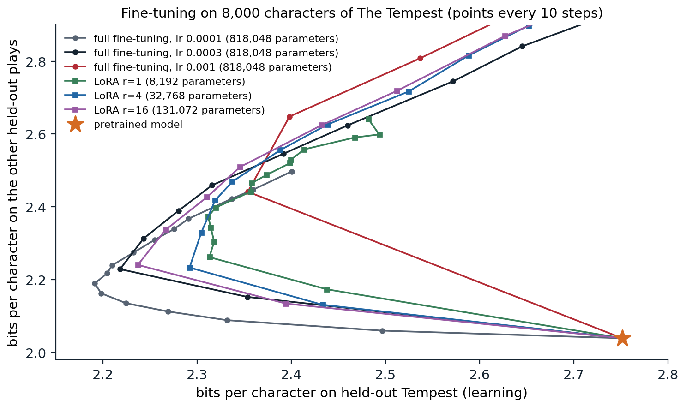

[Background Notes](../README.md) › [NLP and Large Language Models](README.md)

# 10. Fine-Tuning and Parameter-Efficient Adaptation

> [!WARNING]
> Work in progress: this part of the notes is still being revised.

[← 9. In-Context Learning and Prompting](09-in-context-learning-and-prompting.md) · [11. Learning from Human Preferences →](11-learning-from-human-preferences.md)

## <a id="supervised-fine-tuning"></a>Supervised fine-tuning

### <a id="from-continuation-to-instruction-following"></a>From continuation to instruction following

A pretrained model continues text. Asked *What is the capital of France?*, it may answer, or it may continue with more questions from the same imagined quiz, because both are plausible continuations. Turning it into an assistant that answers requests takes further training, called **post-training**, of which the first and simplest stage is **supervised fine-tuning** (SFT), also called **instruction tuning**: continued training with the language-modeling loss on examples of prompts paired with the desired responses. Two details distinguish it from pretraining.

- **A chat template.** Conversations are serialized with special tokens that mark the roles, such as a system message, the user's turns, and the assistant's turns, so the model learns where its own turn begins and ends. The template becomes part of the model's interface, and prompting a fine-tuned model without it degrades its behavior.
- **Loss masking.** The loss is computed only on the tokens of the responses; prompt tokens are inputs, not targets, so the model is not trained to produce user messages.

The learning rate is small, the number of examples is modest, from thousands to a few million, and training lasts a few epochs. Everything else is as in [chapter 4](04-transformer-language-models.md#training-a-language-model).

### <a id="the-data"></a>The data

The history of instruction data is a series of answers to the question of where good responses come from.

- **Templated tasks.** **FLAN** ([Wei et al., 2022](https://arxiv.org/abs/2109.01652)) rewrote more than 60 existing NLP datasets as instructions with templates and fine-tuned a 137-billion-parameter model on them; on tasks held out from training, its zero-shot performance exceeded that of GPT-3 on 20 of 25 datasets. Scaling to 1,836 tasks and adding worked chains of reasoning improved it further ([Chung et al., 2022](https://arxiv.org/abs/2210.11416)).
- **Human demonstrations.** For InstructGPT, labelers wrote about 13,000 responses to prompts that real users had sent to the API ([Ouyang et al., 2022](https://arxiv.org/abs/2203.02155)), covering the open-ended requests that NLP datasets lack.
- **Synthetic data.** **Self-instruct** ([Wang et al., 2023](https://arxiv.org/abs/2212.10560)) had a model generate new instructions and responses from 175 seed examples; **Alpaca** used the method with a stronger commercial model to create 52,000 examples for under 500 dollars and fine-tuned the 7-billion-parameter Llama on them ([Taori et al., 2023](https://crfm.stanford.edu/2023/03/13/alpaca.html)). Generating responses with a stronger model is a form of distillation, discussed below.
- **Small curated sets.** **LIMA** ([Zhou et al., 2023](https://arxiv.org/abs/2305.11206)) fine-tuned a 65-billion-parameter model on only 1,000 carefully chosen examples and obtained responses that people rated as good as or better than GPT-4's in 43% of comparisons.

Open recipes such as Tülu 3 ([Lambert et al., 2024](https://arxiv.org/abs/2411.15124)) document current practice: a mixture of curated human data, public datasets, and synthetic data targeted at specific skills such as mathematics, coding, instruction following with constraints, and safe refusals, followed by the preference and reinforcement-learning stages of [chapters 11](11-learning-from-human-preferences.md) and [12](12-reasoning-and-test-time-compute.md).

### <a id="what-fine-tuning-changes"></a>What fine-tuning changes

LIMA's authors proposed a **superficial alignment hypothesis**: almost all of a model's knowledge and abilities come from pretraining, and fine-tuning mainly teaches the format and style in which to use them. Measurements support a version of it. Comparing a base model's and a fine-tuned model's next-token distributions on the same responses, [Lin et al. (2024)](https://arxiv.org/abs/2312.01552) found that they agree on most tokens and differ mainly on stylistic ones, such as discourse markers and polite phrases, and that a base model prompted with three well-chosen examples approached the fine-tuned model's quality. The limits of the hypothesis are also clear. Models fine-tuned to imitate a stronger model's outputs learn its style much more than its accuracy, and people rating their responses are easily misled by the style ([Gudibande et al., 2023](https://arxiv.org/abs/2305.15717)); and skills that pretraining barely covered, such as long mathematical reasoning or tool use, need much more than format.

### <a id="forgetting"></a>Forgetting

Fine-tuning on a narrow distribution degrades performance elsewhere, the **catastrophic forgetting** familiar from continual learning. InstructGPT measured a drop on some public benchmarks after post-training, an **alignment tax**, and reduced it by mixing pretraining batches into the fine-tuning ([Ouyang et al., 2022](https://arxiv.org/abs/2203.02155)). Common remedies are small learning rates, few epochs, **replay** of pretraining or general instruction data, regularization toward the pretrained weights, and training fewer parameters. The code in the next section measures forgetting directly.

## <a id="parameter-efficient-fine-tuning"></a>Parameter-efficient fine-tuning

### <a id="the-cost-of-full-fine-tuning"></a>The cost of full fine-tuning

Updating all weights needs memory for the weights, their gradients, and the optimizer state: with mixed-precision AdamW, about 16 bytes per parameter, or 112 GB for a 7-billion-parameter model before any activations ([DL chapter 11](../dl/11-training-at-scale-and-efficient-inference.md#what-must-be-stored); [Appendix B](#block-nlp10-appendix-b)). Each fine-tuned model is also a full copy to store and serve. **Parameter-efficient fine-tuning** (PEFT) freezes the pretrained weights and trains a small number of added or selected parameters, often under 1% of the model, which cuts optimizer memory proportionally and turns each task into a small file that can be swapped in at serving time.

### <a id="adapters-and-soft-prompts"></a>Adapters and soft prompts

**Adapters** ([Houlsby et al., 2019](https://arxiv.org/abs/1902.00751)) insert a small bottleneck network, a down-projection, a nonlinearity, and an up-projection with a residual connection, after the attention and MLP sublayers of each block; with 3.6% as many parameters per task, adapters came within 0.4 points of full fine-tuning on the GLUE benchmark. They add sequential computation at inference, which later methods avoid.

**Soft prompts** replace a written prompt with trained vectors. **Prefix tuning** ([Li and Liang, 2021](https://arxiv.org/abs/2101.00190)) prepends trainable key and value vectors to the attention of every layer and trains only those, about 0.1% of the parameters; **prompt tuning** ([Lester, Al-Rfou, and Constant, 2021](https://arxiv.org/abs/2104.08691)) prepends trainable embeddings to the input only, and becomes competitive with full fine-tuning as models grow beyond about ten billion parameters. Soft prompts are continuous analogues of the prompts of [chapter 9](09-in-context-learning-and-prompting.md), optimized by gradient descent instead of written by hand.

### <a id="low-rank-adaptation"></a>Low-rank adaptation

**LoRA** ([Hu et al., 2022](https://arxiv.org/abs/2106.09685)) adapts a weight matrix $`W\in\mathbb R^{m\times n}`$ by adding a trainable low-rank update,

```math
W'=W+\frac\alpha r\,BA,\qquad B\in\mathbb R^{m\times r},\ A\in\mathbb R^{r\times n},\ r\ll\min(m,n),
```

with $`A`$ initialized randomly and $`B`$ at zero, so training starts exactly at the pretrained model, and a scale $`\alpha/r`$ that makes the learning dynamics roughly independent of the rank ([Appendix A](#block-nlp10-appendix-a)). Each adapted matrix costs $`r(m+n)`$ trained parameters instead of $`mn`$. After training, $`BA`$ can be added into $`W`$, so the adapted model has exactly the original architecture and no extra inference cost; alternatively, many LoRA updates can share one base model in memory and be applied per request. On GPT-3 175B, LoRA cut the number of trained parameters by a factor of 10,000 and the GPU memory for training by a factor of three while matching full fine-tuning on the tasks tested, and ranks as small as 1 or 2 were often enough.

The code adds rank-4 LoRA updates to every weight matrix in the blocks of the character model of chapter 4, using PyTorch's parametrizations so that the frozen weight and the update combine automatically, and fine-tunes it for 40 steps on 8,000 characters of *The Tempest*, the play that pretraining never saw ([chapter 5](05-pretraining-and-transfer.md#continued-pretraining)). It compares full fine-tuning on the same data, measuring both the held-out part of *The Tempest* and the other held-out plays, which the fine-tuning does not see.

```python
import math

import torch
from torch import nn

ckpt = torch.load("Sources/Data/shakespeare-char-transformer.pt")   # the character model of chapter 4
cfg, chars = ckpt["config"], ckpt["chars"]
stoi = {c: i for i, c in enumerate(chars)}


class CharLM(nn.Module):
    def __init__(self, V, T, d, L, heads):
        super().__init__()
        self.T = T
        self.tok, self.pos = nn.Embedding(V, d), nn.Embedding(T, d)
        block = nn.TransformerEncoderLayer(d, heads, 4 * d, dropout=0.0, activation="gelu",
                                           batch_first=True, norm_first=True)
        self.blocks = nn.TransformerEncoder(block, L, enable_nested_tensor=False)
        self.ln, self.out = nn.LayerNorm(d), nn.Linear(d, V, bias=False)
        self.out.weight = self.tok.weight
        self.register_buffer("mask", nn.Transformer.generate_square_subsequent_mask(T))

    def forward(self, x):
        x = x[:, -self.T:]
        t = x.shape[1]
        h = self.tok(x) + self.pos(torch.arange(t))
        return self.out(self.ln(self.blocks(h, mask=self.mask[:t, :t], is_causal=True)))


model = CharLM(**cfg)
model.load_state_dict(ckpt["state_dict"])
model.eval()
torch.set_grad_enabled(False)
encode = lambda s: [stoi[c] for c in s]
decode = lambda ids: "".join(chars[i] for i in ids)


def logprobs(ids):                                       # next-character log-probabilities after ids
    return torch.log_softmax(model(torch.tensor([ids]))[0, -1], dim=-1)
import copy

from torch.nn.utils import parametrize

torch.set_grad_enabled(True)
torch.manual_seed(0)


class LoRA(nn.Module):
    """Parametrization W -> W + (alpha / r) B A with A random and B zero, so training starts from W."""

    def __init__(self, out_features, in_features, r, alpha=8.0):
        super().__init__()
        self.A = nn.Parameter(torch.randn(r, in_features) / in_features ** 0.5)
        self.B = nn.Parameter(torch.zeros(out_features, r))
        self.scale = alpha / r

    def forward(self, W):
        return W + self.scale * self.B @ self.A


def add_lora(net, r):
    for p in net.parameters():
        p.requires_grad_(False)                          # freeze every pretrained weight
    for layer in net.blocks.layers:
        for mod, name in [(layer.self_attn, "in_proj_weight"), (layer.self_attn.out_proj, "weight"),
                          (layer.linear1, "weight"), (layer.linear2, "weight")]:
            parametrize.register_parametrization(mod, name, LoRA(*getattr(mod, name).shape, r))
    return net


text = open("Sources/Data/tinyshakespeare.txt", encoding="utf-8").read()
tempest = torch.tensor(encode(text[-34657:]))            # the unseen play of chapter 5
other = torch.tensor(encode(text[int(0.9 * len(text)):-34657]))   # the other held-out plays
adapt, test = tempest[:8000], tempest[24000:]
T = cfg["T"]


def bits(net, data):
    x = torch.stack([data[i:i + T] for i in range(0, len(data) - T - 1, T)])
    y = torch.stack([data[i + 1:i + T + 1] for i in range(0, len(data) - T - 1, T)])
    with torch.no_grad():
        return nn.functional.cross_entropy(net(x).reshape(-1, len(chars)), y.reshape(-1)).item() / math.log(2)


def finetune(net, lr, steps=40):
    params = [p for p in net.parameters() if p.requires_grad]
    opt = torch.optim.AdamW(params, lr=lr, weight_decay=0.0)
    g = torch.Generator().manual_seed(0)
    net.train()
    for _ in range(steps):
        ix = torch.randint(len(adapt) - T - 1, (16,), generator=g)
        x = torch.stack([adapt[i:i + T] for i in ix])
        y = torch.stack([adapt[i + 1:i + T + 1] for i in ix])
        loss = nn.functional.cross_entropy(net(x).reshape(-1, len(chars)), y.reshape(-1))
        opt.zero_grad()
        loss.backward()
        opt.step()
    net.eval()
    return sum(p.numel() for p in params)


print(f"pretrained:           Tempest {bits(model, test):.3f}, other held-out plays {bits(model, other):.3f} bits/char")
full = copy.deepcopy(model)
n = finetune(full, lr=3e-4)
print(f"full fine-tuning:     Tempest {bits(full, test):.3f}, other held-out plays {bits(full, other):.3f}  ({n:,} trained)")
lora = add_lora(copy.deepcopy(model), r=4)
n = finetune(lora, lr=3e-3)
print(f"LoRA, rank 4:         Tempest {bits(lora, test):.3f}, other held-out plays {bits(lora, other):.3f}  ({n:,} trained)")

x = torch.tensor([encode("PROSPERO:\nNow does my project gather to a head")])
before = lora(x)
for layer in lora.blocks.layers:                         # fold B A into the weights: no extra cost at inference
    for mod, name in [(layer.self_attn, "in_proj_weight"), (layer.self_attn.out_proj, "weight"),
                      (layer.linear1, "weight"), (layer.linear2, "weight")]:
        parametrize.remove_parametrizations(mod, name, leave_parametrized=True)
print(f"after merging B A into the weights, all logits change by less than 1e-4: {(before - lora(x)).abs().max().item() < 1e-4}")
# pretrained:           Tempest 2.751, other held-out plays 2.039 bits/char
# full fine-tuning:     Tempest 2.280, other held-out plays 2.389  (818,048 trained)
# LoRA, rank 4:         Tempest 2.319, other held-out plays 2.417  (32,768 trained)
# after merging B A into the weights, all logits change by less than 1e-4: True
```

Both methods adapt to the new play in 40 steps, and both pay for it on the other plays. LoRA trains 4% of the parameters, learns slightly less, and forgets slightly less. After merging, the adapted model is an ordinary model whose outputs differ from the parametrized one only by rounding.

### <a id="why-low-rank-suffices"></a>Why low rank suffices

The success of tiny updates suggests that fine-tuning moves the model within a low-dimensional space. [Aghajanyan, Zettlemoyer, and Gupta (2021)](https://arxiv.org/abs/2012.13255) measured this **intrinsic dimension** directly: optimizing only $`d`$ parameters, mapped into the full parameter space by a fixed random projection, reached 90% of the performance of full fine-tuning of RoBERTa on a paraphrase task with $`d=200`$, and larger pretrained models had smaller intrinsic dimensions. The figure traces what each method learns and forgets over the course of training.



*Fine-tuning the model of chapter 4 on 8,000 characters of* The Tempest *with full fine-tuning at three learning rates and with LoRA of ranks 1, 4, and 16 at a learning rate of $`3\times10^{-3}`$: loss on held-out* Tempest *text (learning) against loss on the other held-out plays (forgetting), starting from the pretrained model (star) and plotted every 10 steps for 150 steps. Every run first moves left, learning the new play while forgetting the others, and then, overfitting its 8,000 characters, turns up and to the right; the later points of the faster runs leave the frame (full fine-tuning at $`10^{-3}`$ ends at 4.02 and 4.35 bits). At the step with the lowest* Tempest *loss, full fine-tuning at $`10^{-4}`$ reaches 2.19 bits on* The Tempest *and 2.19 on the other plays; LoRA reaches 2.24 and 2.24 with rank 16, 2.29 and 2.23 with rank 4, and 2.31 and 2.37 with rank 1.*

Three observations follow. Learning and forgetting are coupled: every run trades one for the other along similar paths, set mostly by how far the weights move, that is, by the learning rate and the number of steps. Stopping at the right time matters more than the method, since every run overfits its small dataset within 20 to 60 steps. And in this small model LoRA does not dominate: full fine-tuning with a small learning rate reaches the best point on both axes, and rank 16 comes close. At the scale of billions of parameters, [Biderman et al. (2024)](https://arxiv.org/abs/2405.09673) found that LoRA learns less than full fine-tuning on tasks that require much new knowledge, such as continued pretraining on code, but also forgets less of the base model's abilities, with the learning rate and the rank governing the trade-off as they do here. LoRA's practical advantage is less its accuracy than its cost: the rank-4 runs update 4% of the parameters and need optimizer state for only those.

### <a id="quantized-and-other-variants"></a>Quantized and other variants

**QLoRA** ([Dettmers et al., 2023](https://arxiv.org/abs/2305.14314)) stores the frozen base model in 4-bit precision, with a data type designed for normally distributed weights, while training LoRA updates in 16-bit precision on top of it; with further tricks for memory spikes, it fine-tuned a 65-billion-parameter model on a single 48 GB GPU without loss of quality relative to 16-bit fine-tuning. Among the many variants of LoRA, **DoRA** ([Liu et al., 2024](https://arxiv.org/abs/2402.09353)) separates each weight's magnitude and direction and adapts the direction with LoRA, which closes part of the gap to full fine-tuning; **rank-stabilized LoRA** scales the update by $`\alpha/\sqrt r`$ instead of $`\alpha/r`$ so that higher ranks keep learning ([Kalajdzievski, 2023](https://arxiv.org/abs/2312.03732)); and **(IA)³** learns only vectors that rescale activations, with even fewer parameters ([Liu et al., 2022](https://arxiv.org/abs/2205.05638)).

## <a id="combining-and-distilling-models"></a>Combining and distilling models

### <a id="task-vectors-and-merging"></a>Task vectors and merging

Fine-tuned models from the same pretrained weights can be combined in weight space. [Ilharco et al. (2023)](https://arxiv.org/abs/2212.04089) defined the **task vector** of a fine-tuned model as the difference between its weights and the pretrained ones, $`\tau=\theta_{\mathrm{ft}}-\theta_0`$, and found that task vectors can be added to acquire several abilities at once, negated to remove a behavior, and combined by analogy. Averaging the weights of several models fine-tuned from the same initialization with different hyperparameters, a **model soup**, improved accuracy over the best single model without any inference cost ([Wortsman et al., 2022](https://arxiv.org/abs/2203.05482)). The code fine-tunes the character model twice, for 40 steps each: on *The Tempest*, new content, and on lowercased text from the other held-out plays, a new style that never occurs in the pretraining text. It then evaluates the pretrained weights plus combinations of the two task vectors, including on lowercased *Tempest*, which combines both.

```python
import math

import torch
from torch import nn

ckpt = torch.load("Sources/Data/shakespeare-char-transformer.pt")   # the character model of chapter 4
cfg, chars = ckpt["config"], ckpt["chars"]
stoi = {c: i for i, c in enumerate(chars)}


class CharLM(nn.Module):
    def __init__(self, V, T, d, L, heads):
        super().__init__()
        self.T = T
        self.tok, self.pos = nn.Embedding(V, d), nn.Embedding(T, d)
        block = nn.TransformerEncoderLayer(d, heads, 4 * d, dropout=0.0, activation="gelu",
                                           batch_first=True, norm_first=True)
        self.blocks = nn.TransformerEncoder(block, L, enable_nested_tensor=False)
        self.ln, self.out = nn.LayerNorm(d), nn.Linear(d, V, bias=False)
        self.out.weight = self.tok.weight
        self.register_buffer("mask", nn.Transformer.generate_square_subsequent_mask(T))

    def forward(self, x):
        x = x[:, -self.T:]
        t = x.shape[1]
        h = self.tok(x) + self.pos(torch.arange(t))
        return self.out(self.ln(self.blocks(h, mask=self.mask[:t, :t], is_causal=True)))


model = CharLM(**cfg)
model.load_state_dict(ckpt["state_dict"])
model.eval()
torch.set_grad_enabled(False)
encode = lambda s: [stoi[c] for c in s]
decode = lambda ids: "".join(chars[i] for i in ids)


def logprobs(ids):                                       # next-character log-probabilities after ids
    return torch.log_softmax(model(torch.tensor([ids]))[0, -1], dim=-1)
import copy

torch.set_grad_enabled(True)
text = open("Sources/Data/tinyshakespeare.txt", encoding="utf-8").read()
tempest = text[-34657:]                                  # The Tempest, unseen in pretraining
shrew = text[int(0.9 * len(text)):-34657]                # other held-out text, mostly The Taming of the Shrew
enc = lambda s: torch.tensor(encode(s))
tasks = {"Tempest": (enc(tempest[:8000]), enc(tempest[24000:])),               # new content
         "lowercase": (enc(shrew[:8000].lower()), enc(shrew[-20000:].lower()))}  # new style: no capitals
both_test = enc(tempest[24000:].lower())                 # the combination: The Tempest in lowercase
T = cfg["T"]


def bits(net, data):
    x = torch.stack([data[i:i + T] for i in range(0, len(data) - T - 1, T)])
    y = torch.stack([data[i + 1:i + T + 1] for i in range(0, len(data) - T - 1, T)])
    with torch.no_grad():
        return nn.functional.cross_entropy(net(x).reshape(-1, len(chars)), y.reshape(-1)).item() / math.log(2)


def finetune(data, steps=40, lr=1e-4):
    net = copy.deepcopy(model)
    opt = torch.optim.AdamW(net.parameters(), lr=lr, weight_decay=0.0)
    g = torch.Generator().manual_seed(0)
    net.train()
    for _ in range(steps):
        ix = torch.randint(len(data) - T - 1, (16,), generator=g)
        x = torch.stack([data[i:i + T] for i in ix])
        y = torch.stack([data[i + 1:i + T + 1] for i in ix])
        loss = nn.functional.cross_entropy(net(x).reshape(-1, len(chars)), y.reshape(-1))
        opt.zero_grad()
        loss.backward()
        opt.step()
    return net.eval()


theta0 = {k: v.clone() for k, v in model.state_dict().items()}
tau = {name: {k: v - theta0[k] for k, v in finetune(train).state_dict().items() if k != "mask"}   # task vectors
       for name, (train, _) in tasks.items()}


def with_vector(coef):                                   # theta0 + sum of coef * task vector
    net = copy.deepcopy(model)
    net.load_state_dict({k: theta0[k] + sum(c * tau[n][k] for n, c in coef.items()) if k != "mask" else theta0[k]
                         for k in theta0})
    return net.eval()


print("held-out bits per character:  Tempest   lowercase Shrew   lowercase Tempest")
for label, coef in [("pretrained", {}), ("+ Tempest vector", {"Tempest": 1}), ("+ lowercase vector", {"lowercase": 1}),
                    ("+ both vectors", {"Tempest": 1, "lowercase": 1}), ("- Tempest vector", {"Tempest": -1})]:
    net = with_vector(coef)
    print(f"{label:28s} {bits(net, tasks['Tempest'][1]):8.3f} {bits(net, tasks['lowercase'][1]):17.3f} "
          f"{bits(net, both_test):19.3f}")
# held-out bits per character:  Tempest   lowercase Shrew   lowercase Tempest
# pretrained                      2.751             2.647               2.918
# + Tempest vector                2.225             2.700               2.937
# + lowercase vector              3.013             2.045               2.587
# + both vectors                  2.527             2.124               2.611
# - Tempest vector                3.276             2.753               3.043
```

Each task vector does what it was trained for: the *Tempest* vector lowers the loss on held-out *Tempest* from 2.75 to 2.23 bits, the lowercase vector lowers the loss on lowercase text from 2.65 to 2.05, and subtracting the *Tempest* vector raises the loss on *The Tempest* to 3.28, undoing what fine-tuning added and more. The lowercase vector also helps on lowercase *Tempest* (2.92 to 2.59), so the style it encodes transfers to content it never saw. Adding both vectors keeps most of the lowercase gain (2.12) but less than half of the *Tempest* gain (2.53), and on lowercase *Tempest* the sum is no better than the lowercase vector alone. At this scale the two updates interfere substantially; the cleaner additivity reported by Ilharco et al. comes from much larger models, whose task vectors are closer to independent.

Merging works because fine-tuning from a shared pretrained model tends to stay in a region where the loss is roughly linear in the weights, so the effects of small updates add ([Appendix C](#block-nlp10-appendix-c)); models trained from different initializations cannot be averaged this way. When task vectors conflict, methods such as TIES-merging ([Yadav et al., 2023](https://arxiv.org/abs/2306.01708)) keep only the largest entries of each and resolve disagreements in sign before adding. Merging is widely used to combine fine-tuned variants of open models.

### <a id="distillation"></a>Distillation

A small model can also be trained to imitate a large one ([DL chapter 11](../dl/11-training-at-scale-and-efficient-inference.md#distillation)). For language models the simplest form is **sequence-level distillation** ([Kim and Rush, 2016](https://arxiv.org/abs/1606.07947)): generate outputs with the teacher and fine-tune the student on them, which is how much instruction data is produced today. Matching the teacher's full next-token distributions rather than its sampled tokens transfers more information per example, and **on-policy distillation** trains the student on sequences it generates itself, with the teacher's distributions as targets, so that it learns to recover from its own mistakes rather than only from the teacher's contexts ([Agarwal et al., 2024](https://arxiv.org/abs/2306.13649)). Distillation transfers capabilities efficiently when the teacher is much stronger, and it transfers the teacher's errors and style along with them.

## <a id="appendices"></a>Appendices


<details>
<summary><a id="block-nlp10-appendix-a"></a><b>A. The scale of a LoRA update</b></summary>


Consider one adapted matrix with update $`\Delta W=sBA`$, $`s=\alpha/r`$, $`A`$ initialized with entries of variance $`1/n`$ and $`B=0`$. The gradient of the loss $`\ell`$ with respect to $`B`$ is $`s\,G A^\top`$, where $`G=\partial\ell/\partial W`$ is the gradient with respect to the full weight. After one step of gradient descent with learning rate $`\eta`$ on $`B`$, the update is

```math
\Delta W=sB_1A=-\eta s^2\,GA^\top A.
```

For random $`A`$ with $`r`$ rows, $`\mathbb E[A^\top A]=\frac rnI`$, so $`\mathbb E[\Delta W]=-\eta s^2\frac rnG`$. With $`s=\alpha/r`$ this is $`-\eta\alpha^2G/(rn)`$, which shrinks as $`1/r`$; with $`s=\alpha/\sqrt r`$ it is $`-\eta\alpha^2G/n`$, independent of $`r`$. Adam normalizes gradients elementwise, which changes the constants but not the conclusion that the effective step depends on the rank through $`s`$. The original $`\alpha/r`$ scaling lets one tune the learning rate at one rank and reuse it at nearby ranks, but at large ranks it makes the update too small to learn, which is why higher ranks often failed to help in early experiments and why rank-stabilized scaling uses $`\alpha/\sqrt r`$.

The update $`BA`$ has rank at most $`r`$: it can change $`W`$ only within an $`r`$-dimensional subspace of inputs (the row space of $`A`$) and write only into an $`r`$-dimensional subspace of outputs (the column space of $`B`$). Full fine-tuning is not so limited; [Biderman et al. (2024)](https://arxiv.org/abs/2405.09673) found that its weight updates have ranks 10 to 100 times larger than typical LoRA configurations, which explains why LoRA underperforms on tasks that require learning much new information, such as continued pretraining on code, and also why it forgets less.

</details>


<details>
<summary><a id="block-nlp10-appendix-b"></a><b>B. Memory for full, low-rank, and quantized fine-tuning</b></summary>


For a model with $`P`$ parameters trained with AdamW in mixed precision, full fine-tuning stores 16-bit weights and gradients (2 bytes each), plus 32-bit master weights and two 32-bit moment estimates (12 bytes): about $`16P`$ bytes, excluding activations. For $`P=7\times10^9`$ this is 112 GB. LoRA stores the frozen weights once in 16 bits ($`2P`$ bytes, 14 GB) and needs gradients and optimizer state only for the $`Q`$ adapter parameters ($`16Q`$ bytes); with $`Q\approx0.5\%`$ of $`P`$ that adds under 1 GB. Activations for backpropagation are still needed through the frozen layers, since the adapters sit inside them, and usually dominate with long sequences, which gradient checkpointing reduces. QLoRA stores the frozen weights in 4 bits, about $`0.5P`$ bytes plus small quantization constants, so the 7-billion-parameter model occupies under 4 GB and a 65-billion-parameter model about 33 GB, within a single 48 GB accelerator together with the adapters and activations.

</details>


<details>
<summary><a id="block-nlp10-appendix-c"></a><b>C. Why task vectors add</b></summary>


Let $`f(x;\theta)`$ be the network's output. If fine-tuning moves the weights only slightly from $`\theta_0`$, the output is close to its first-order expansion, $`f(x;\theta_0+\tau)\approx f(x;\theta_0)+\nabla_\theta f(x;\theta_0)^\top\tau`$, the linearized network of [DL chapter 15](../dl/15-infinite-width-and-the-neural-tangent-kernel.md#linearization-and-the-tangent-kernel). In that regime, adding two task vectors adds their effects on the output:

```math
f(x;\theta_0+\tau_1+\tau_2)-f(x;\theta_0)\approx\nabla f^\top\tau_1+\nabla f^\top\tau_2.
```

The combination works for both tasks if each task vector changes the outputs on its own task's inputs and leaves the other task's inputs nearly unchanged, that is, if $`\nabla f(x;\theta_0)^\top\tau_2\approx0`$ for inputs $`x`$ of task 1 and vice versa. [Ortiz-Jimenez, Favero, and Frossard (2023)](https://arxiv.org/abs/2305.12827) call this **weight disentanglement**, show that it holds to a large extent in pretrained models, and find that fine-tuning the linearized model directly makes task arithmetic more reliable. When the tasks overlap, the effects interfere, and the sum can be worse than either vector alone; scaling each vector down, as with the coefficient of one half in the code, trades each task's gain for less interference.

</details>

---

[← 9. In-Context Learning and Prompting](09-in-context-learning-and-prompting.md) · [11. Learning from Human Preferences →](11-learning-from-human-preferences.md)
