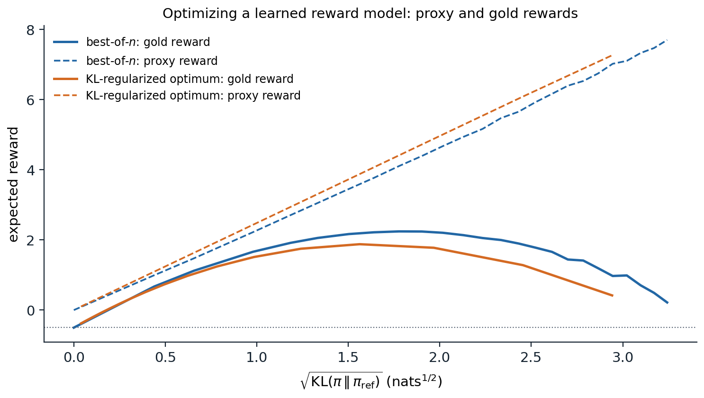

[ML Mastery Notes](../README.md) › [NLP and Large Language Models](README.md)

# 11. Learning from Human Preferences

[← 10. Fine-Tuning and Parameter-Efficient Adaptation](10-fine-tuning-and-parameter-efficient-adaptation.md) · [12. Reasoning and Test-Time Compute →](12-reasoning-and-test-time-compute.md)

## <a id="why-preferences"></a>Why preferences

### <a id="beyond-imitation"></a>Beyond imitation

Supervised fine-tuning (chapter 10) trains a model to imitate demonstrations, which has three limits. Good demonstrations are expensive, since someone must write the ideal response to every prompt. Imitation can at best reproduce the demonstrator, including the demonstrator's mistakes. And many qualities that matter, such as being helpful without being verbose, honest about uncertainty, and harmless, are easier to recognize than to write down, either as rules or as examples: a person who could not write the best answer can often tell which of two answers is better. **Learning from human preferences** uses such judgments. People compare the model's own outputs, a **reward model** learns to predict their judgments, and the model is trained to produce outputs the reward model scores highly. The approach was developed for control from human feedback ([Christiano et al., 2017](https://arxiv.org/abs/1706.03741)), where about an hour of human comparisons taught a simulated robot to do a backflip, applied to summarization ([Stiennon et al., 2020](https://arxiv.org/abs/2009.01325)), and scaled to general assistants in InstructGPT ([Ouyang et al., 2022](https://arxiv.org/abs/2203.02155)), whose 1.3-billion-parameter model was preferred by people to the 175-billion-parameter GPT-3.

### <a id="collecting-preferences"></a>Collecting preferences

A preference datum consists of a prompt $`x`$ and two or more responses, usually sampled from the model being trained, with a human judgment of which is better, sometimes with a strength or a tie. InstructGPT's labelers ranked between four and nine responses per prompt, which yields many pairs per prompt; Anthropic's public dataset asked people to choose the more helpful or the more harmless of two responses in a conversation ([Bai et al., 2022](https://arxiv.org/abs/2204.05862)). Pairwise judgments are more consistent than absolute scores, but they are noisy: InstructGPT's labelers agreed with each other on about 73% of comparisons. Guidelines matter a great deal, because they define what "better" means, and the population of labelers shapes the values the model learns.

## <a id="reward-models"></a>Reward models

### <a id="the-bradleyterry-model"></a>The Bradley–Terry model

A reward model assigns a scalar $`r_\phi(x,y)`$ to a prompt and response, and models the probability that people prefer $`y_w`$ to $`y_l`$ by the **Bradley–Terry** model,

```math
P(y_w\succ y_l\mid x)=\sigma\bigl(r_\phi(x,y_w)-r_\phi(x,y_l)\bigr),
```

where $`\sigma`$ is the logistic function. Training minimizes the negative log-likelihood of the observed preferences, $`-\log\sigma(r_\phi(x,y_w)-r_\phi(x,y_l))`$, a logistic regression on differences of rewards (ML chapter 5). The reward is identified only up to an additive constant per prompt, since only differences enter. In practice the reward model is a copy of the language model, usually after supervised fine-tuning, with its output layer replaced by a scalar head that reads the final hidden state. The same model of pairwise comparisons ranks chess players and chatbots (chapter 14). The code fits a linear Bradley–Terry reward model to simulated comparisons among 200 responses, each described by eight features, labeled by annotators whose judgments follow the Bradley–Terry model with a hidden utility.

```python
import numpy as np

rng = np.random.default_rng(0)
K, d = 200, 8                                            # candidate responses, features per response
phi = rng.standard_normal((K, d))                        # e.g. helpfulness, length, tone, correctness...
r_true = phi @ rng.standard_normal(d)                    # the annotators' underlying utility


def comparisons(n, noise=1.0):
    """n pairs labeled by a Bradley-Terry annotator: P(i preferred to j) = sigmoid((r_i - r_j) / noise)."""
    i, j = rng.integers(K, size=(2, n))
    win = rng.random(n) < 1 / (1 + np.exp(-(r_true[i] - r_true[j]) / noise))
    return np.where(win, i, j), np.where(win, j, i)          # (preferred, rejected)


def fit_reward_model(w_idx, l_idx, steps=2000, lr=0.5, l2=1e-3):
    """Maximum likelihood for r(y) = theta . phi(y): minimize -log sigmoid(r_w - r_l) by gradient descent."""
    theta = np.zeros(d)
    diff = phi[w_idx] - phi[l_idx]
    for _ in range(steps):
        p = 1 / (1 + np.exp(-diff @ theta))                    # model probability of the observed preference
        theta -= lr * (-(1 - p) @ diff / len(diff) + l2 * theta)
    return phi @ theta


test_w, test_l = comparisons(20000)
ceiling = np.mean(r_true[test_w] > r_true[test_l])
print(f"held-out agreement of the true utility with the noisy labels: {ceiling:.3f}")
print("comparisons   held-out accuracy   rank correlation with true utility")
for n in [25, 100, 400, 1600, 6400]:
    w_idx, l_idx = comparisons(n)
    r_hat = fit_reward_model(w_idx, l_idx)
    acc = np.mean(r_hat[test_w] > r_hat[test_l])
    rank = np.corrcoef(np.argsort(np.argsort(r_hat)), np.argsort(np.argsort(r_true)))[0, 1]
    print(f"{n:11d} {acc:19.3f} {rank:26.3f}")
# held-out agreement of the true utility with the noisy labels: 0.860
# comparisons   held-out accuracy   rank correlation with true utility
#          25               0.800                      0.881
#         100               0.825                      0.941
#         400               0.855                      0.989
#        1600               0.859                      0.998
#        6400               0.859                      1.000
```

Held-out accuracy saturates at 86%, the rate at which the noisy labels agree with the true utility, while the ranking of responses by the learned reward keeps improving until it matches the true ranking almost perfectly. Reward-model accuracies around 70% on real preference data, typical of published models, therefore do not by themselves mean that the reward is poorly learned; much of the error is disagreement in the labels.

### <a id="evaluating-reward-models"></a>Evaluating reward models

A reward model is evaluated by its accuracy on held-out preference pairs, on benchmarks of pairs built to probe specific failures, such as a correct answer against a subtly wrong one or a safe refusal against a harmful answer ([Lambert et al., 2024](https://arxiv.org/abs/2403.13787)), and ultimately by the quality of the policies trained against it. The last is what matters and the hardest to measure, since a reward model with high accuracy on pairs drawn from the reference distribution can still be wrong about the unusual responses that optimization will find.

## <a id="optimizing-against-a-reward"></a>Optimizing against a reward

### <a id="the-kl-regularized-objective"></a>The KL-regularized objective

Given a reward model, the policy $`\pi_\theta`$ is trained to maximize the expected reward while staying close to a **reference policy** $`\pi_{\mathrm{ref}}`$, usually the fine-tuned model it starts from:

```math
\max_{\pi_\theta}\ \mathbb E_{x\sim\mathcal D,\,y\sim\pi_\theta(\cdot\mid x)}\bigl[r_\phi(x,y)\bigr]-\beta\,\mathbb E_x\,D_{\mathrm{KL}}\bigl(\pi_\theta(\cdot\mid x)\,\Vert\,\pi_{\mathrm{ref}}(\cdot\mid x)\bigr).
```

The penalty, weighted by $`\beta`$, keeps the policy near the distribution on which the reward model was trained, where its judgments are reliable, and preserves the fluency and diversity of the reference model. The objective has a closed-form maximizer,

```math
\pi^*(y\mid x)=\frac1{Z(x)}\,\pi_{\mathrm{ref}}(y\mid x)\exp\Bigl(\frac{r_\phi(x,y)}\beta\Bigr),
```

the reference policy reweighted by the exponentiated reward, with $`Z(x)`$ normalizing over all responses ([Appendix A](#block-nlp11-appendix-a)). This is the Gibbs distribution with $`-r`$ as energy and $`\beta`$ as temperature, and it cannot be computed directly because the sum over all possible responses in $`Z(x)`$ is intractable.

### <a id="rlhf-with-policy-gradients"></a>RLHF with policy gradients

**Reinforcement learning from human feedback** (RLHF) approximates $`\pi^*`$ by training the language model as a policy. Each training step samples prompts, generates responses with the current policy, scores them with the reward model, subtracts the KL penalty, often estimated per token as $`\beta\log(\pi_\theta/\pi_{\mathrm{ref}})`$, and updates the policy with a policy-gradient method. InstructGPT and most early systems used **proximal policy optimization** (PPO; [Schulman et al., 2017](https://arxiv.org/abs/1707.06347)), which also trains a value network as a baseline and clips each update to stay near the policy that generated the data; the algorithm belongs to the RL module. PPO for language models is expensive and delicate: four models are involved (the policy, the reference, the reward model, and the value network), generation dominates the cost, and results depend on many implementation details. Simpler estimators that drop the value network and use the average reward of several samples for the same prompt as the baseline work as well for language models ([Ahmadian et al., 2024](https://arxiv.org/abs/2402.14740)); one of them, GRPO, is described with reasoning in chapter 12.

### <a id="best-of-n"></a>Best-of-n

The simplest way to use a reward model needs no training at all: sample $`n`$ responses from the reference policy and return the one with the highest reward. **Best-of-$`n`$** sampling is surprisingly strong, and its divergence from the reference policy is at most

```math
D_{\mathrm{KL}}(\pi_{\text{BoN}}\,\Vert\,\pi_{\mathrm{ref}})\le\log n-\frac{n-1}n
```

([Appendix B](#block-nlp11-appendix-b)), about 3.2 nats for $`n=64`$: a large improvement in reward for a modest distance, but at $`n`$ times the cost of generation. Fine-tuning on the best of $`n`$ samples, **rejection-sampling fine-tuning**, distills the improvement into the model, and was one of the stages of Llama 2's post-training, together with PPO and separate reward models for helpfulness and safety ([Touvron et al., 2023](https://arxiv.org/abs/2307.09288)).

## <a id="direct-preference-optimization"></a>Direct preference optimization

### <a id="skipping-the-reward-model"></a>Skipping the reward model

The closed form of $`\pi^*`$ can be inverted: any policy defines an **implicit reward**

```math
r(x,y)=\beta\log\frac{\pi(y\mid x)}{\pi_{\mathrm{ref}}(y\mid x)}+\beta\log Z(x)
```

for which it is the optimal KL-regularized policy. Substituting this reward into the Bradley–Terry likelihood, the intractable $`\log Z(x)`$ cancels in the difference between the two responses to the same prompt, leaving a loss on the policy alone ([Rafailov et al., 2023](https://arxiv.org/abs/2305.18290)):

```math
\mathcal L_{\mathrm{DPO}}(\theta)=-\mathbb E_{(x,y_w,y_l)}\log\sigma\Bigl(\beta\log\frac{\pi_\theta(y_w\mid x)}{\pi_{\mathrm{ref}}(y_w\mid x)}-\beta\log\frac{\pi_\theta(y_l\mid x)}{\pi_{\mathrm{ref}}(y_l\mid x)}\Bigr).
```

**Direct preference optimization** (DPO) fits the reward model and extracts its optimal policy in one step, by supervised training on the preference pairs: no reward model, no sampling during training, and no reinforcement learning. Its gradient raises the probability of the preferred response and lowers that of the rejected one, weighted by how strongly the implicit reward currently misorders them ([Appendix C](#block-nlp11-appendix-c)). The code checks the equivalence in a case small enough to compute everything: a single prompt with six responses, a reference policy, and 2,316 preference pairs sampled from the reference and labeled with a Bradley–Terry utility. It computes the RLHF solution, fitting the reward model and forming $`\pi^*`$ exactly, and the DPO solution, optimizing the policy's six probabilities directly.

```python
import numpy as np

rng = np.random.default_rng(0)
pi_ref = np.array([0.30, 0.25, 0.20, 0.12, 0.08, 0.05])  # reference policy over six responses to one prompt
r_true = np.array([0.0, 1.0, -0.5, 2.0, 0.5, 3.0])       # annotators' utility (Bradley-Terry)
beta = 1.0

# 3,000 preference pairs: both responses sampled from the reference policy, labeled by the annotators.
a, b = rng.choice(6, size=(2, 3000), p=pi_ref)
keep = a != b
a, b = a[keep], b[keep]
a_wins = rng.random(len(a)) < 1 / (1 + np.exp(-(r_true[a] - r_true[b])))
w, l = np.where(a_wins, a, b), np.where(a_wins, b, a)
sig = lambda z: 1 / (1 + np.exp(-z))


def ascend(grad, x, steps=5000, lr=0.5):
    for _ in range(steps):
        x = x + lr * grad(x)
    return x


# RLHF: fit a reward model by maximum likelihood, then take the optimal KL-regularized policy.
def grad_reward(r):
    g = 1 - sig(r[w] - r[l])                             # gradient of the mean log sigmoid(r_w - r_l)
    return (np.bincount(w, g, 6) - np.bincount(l, g, 6)) / len(w)


r_hat = ascend(grad_reward, np.zeros(6))
pi_rlhf = pi_ref * np.exp(r_hat / beta)
pi_rlhf /= pi_rlhf.sum()


# DPO: optimize the policy's logits directly on the same pairs; implicit reward beta log(pi / pi_ref).
def grad_dpo(theta):
    h = beta * (theta - np.log(pi_ref))                  # implicit reward up to a constant
    g = beta * (1 - sig(h[w] - h[l]))
    return (np.bincount(w, g, 6) - np.bincount(l, g, 6)) / len(w)


theta = ascend(grad_dpo, np.log(pi_ref))
pi_dpo = np.exp(theta) / np.exp(theta).sum()

pi_star = pi_ref * np.exp(r_true / beta)
pi_star /= pi_star.sum()
kl = lambda p: np.sum(p * np.log(p / pi_ref))
print(f"{len(w)} preference pairs, beta = {beta}")
for name, p in [("reference", pi_ref), ("RLHF (fitted reward)", pi_rlhf), ("DPO", pi_dpo), ("optimum (true reward)", pi_star)]:
    print(f"{name:22s} {np.round(p, 3)}  expected utility {p @ r_true:5.2f}  KL to reference {kl(p):.3f}")
print(f"largest difference between the RLHF and DPO policies: {np.abs(pi_rlhf - pi_dpo).max():.1e}")
# 2316 preference pairs, beta = 1.0
# reference              [0.3  0.25 0.2  0.12 0.08 0.05]  expected utility  0.58  KL to reference 0.000
# RLHF (fitted reward)   [0.105 0.233 0.047 0.298 0.049 0.268]  expected utility  1.63  KL to reference 0.502
# DPO                    [0.105 0.233 0.047 0.298 0.049 0.268]  expected utility  1.63  KL to reference 0.502
# optimum (true reward)  [0.096 0.218 0.039 0.284 0.042 0.321]  expected utility  1.75  KL to reference 0.612
# largest difference between the RLHF and DPO policies: 1.7e-16
```

The two policies agree to within rounding error, as the derivation predicts: with a policy able to represent any distribution over responses, DPO and RLHF with the same data and $`\beta`$ have the same optimum. Both fall short of the optimum for the true utility only because the preferences are finite and noisy.

### <a id="variants-and-limits"></a>Variants and limits

The equivalence holds at the optimum, not along the way, and practice differs from the tabular case in several ways. DPO trains on fixed, **offline** pairs, usually generated by other models, while RLHF trains on **on-policy** samples from the current model; the policy may assign high probability to responses that appear in no pair, about which the loss says nothing. When preferences are nearly deterministic, the DPO loss keeps pushing the implicit reward margin toward infinity, and **IPO** ([Azar et al., 2024](https://arxiv.org/abs/2310.12036)) replaces the logistic loss by a squared loss on the margin to bound it. **KTO** ([Ethayarajh et al., 2024](https://arxiv.org/abs/2402.01306)) learns from single responses labeled good or bad instead of pairs; **SimPO** ([Meng, Xia, and Chen, 2024](https://arxiv.org/abs/2405.14734)) drops the reference model and normalizes by length; and **ORPO** ([Hong, Lee, and Thorne, 2024](https://arxiv.org/abs/2403.07691)) folds preference optimization into supervised fine-tuning. Careful comparisons find that on-policy data helps ([Tajwar et al., 2024](https://arxiv.org/abs/2404.14367)) and that well-tuned PPO can outperform DPO, particularly on tasks such as code where correctness matters ([Xu et al., 2024](https://arxiv.org/abs/2404.10719)); **iterative** or **online** DPO, which regenerates and relabels pairs from the current policy, recovers much of the difference. DPO's simplicity made it the default for open models, often followed by reinforcement learning with verifiable rewards (chapter 12).

## <a id="reward-hacking-and-overoptimization"></a>Reward hacking and overoptimization

### <a id="goodhart-s-law"></a>Goodhart's law

A reward model is a proxy for what people want, and optimizing a proxy hard enough exploits its errors: when a measure becomes a target, it ceases to be a good measure. [Gao, Schulman, and Hilton (2023)](https://arxiv.org/abs/2210.10760) measured the effect with a large "gold" reward model standing in for humans, which labeled the data for smaller proxy reward models. As optimization against the proxy moved the policy away from the reference, the proxy reward kept rising while the gold reward rose, peaked, and declined, following simple functional forms in $`d=\sqrt{D_{\mathrm{KL}}}`$, and the peak moved to larger distances for larger reward models and more data. The figure reproduces the phenomenon in a toy model.



*Responses are eight-dimensional feature vectors drawn from a standard normal reference policy. The gold reward is linear in seven features and concave in the first, like a quality such as length that helps up to a point and then hurts: $`2\phi_0-0.5\phi_0^2`$. A linear proxy reward model fitted to 2,000 comparisons of reference samples agrees with the gold reward on 95.4% of reference pairs. Optimizing it by best-of-$`n`$ ($`n`$ up to $`10^5`$) or by the exact KL-regularized policy (computed over a pool of a million reference samples) raises the proxy reward steadily, while the gold reward, $`-0.50`$ under the reference, peaks at 2.24 for best-of-$`n`$ at 3.2 nats and at 1.88 for the KL-regularized policy at 2.4 nats, then falls toward its starting value.*

The proxy learned the right direction for the first feature, and within the range of the reference samples it is an excellent reward model. Optimization pushes the policy to values of that feature far outside the range where the proxy was trained, where its linear extrapolation is wrong. Real reward models fail the same way on features that correlate with quality in the training data. They favor longer responses, since longer answers were often better in the comparisons, so optimization inflates length ([Singhal et al., 2023](https://arxiv.org/abs/2310.03716)); and people, and reward models trained on their judgments, prefer responses that agree with the user's stated views, so preference-trained models become **sycophantic**, telling users what they want to hear ([Sharma et al., 2023](https://arxiv.org/abs/2310.13548)).

### <a id="mitigations"></a>Mitigations

The KL penalty and early stopping are the first defenses: they limit how far the policy moves from the distribution where the reward model is valid. Ensembles of reward models, optimized conservatively by taking their minimum or penalizing their disagreement, reduce overoptimization ([Coste et al., 2024](https://arxiv.org/abs/2310.02743)); so does collecting new preferences on the current policy's outputs, which corrects the reward model where the policy has moved. Specific biases are handled specifically, for example by controlling for length when comparing responses. None of these removes the underlying problem that a learned objective is an imperfect description of what people want, which is one of the central problems of the Safety and Frontier module.

## <a id="feedback-from-models"></a>Feedback from models

### <a id="constitutional-ai"></a>Constitutional AI

Human labels are slow and expensive, and labeling harmful content is unpleasant work. **Constitutional AI** ([Bai et al., 2022](https://arxiv.org/abs/2212.08073)) replaced most of them with a list of written principles, the constitution, and the model's own judgments. In a supervised phase, the model critiques and revises its responses to harmful prompts according to principles drawn from the list, and is fine-tuned on the revisions; in a reinforcement phase, a model compares pairs of responses according to the principles, and these **AI preferences** train the reward model. **RLAIF**, reinforcement learning from AI feedback, matched RLHF on summarization and dialogue in a direct comparison ([Lee et al., 2024](https://arxiv.org/abs/2309.00267)). Model judges are also central to evaluation (chapter 14), with the same biases toward length, position, and their own style.

### <a id="what-preference-training-changes"></a>What preference training changes

Preference training makes models more helpful, better at following instructions, and more willing to decline harmful requests, and people strongly prefer its outputs. It also has side effects. Models become less diverse: preference-tuned models produce more similar outputs for the same prompt than their fine-tuned starting points ([Kirk et al., 2024](https://arxiv.org/abs/2310.06452)). Their stated probabilities become less calibrated (chapter 4). They acquire the biases of their reward models, such as verbosity and sycophancy. And because the reward reflects what raters approve of rather than what is true or beneficial, a sufficiently capable model trained this way learns to produce what looks good to raters, a gap that grows as tasks become harder for people to evaluate. Methods for supervising models on tasks that people cannot evaluate directly are taken up in the Safety and Frontier module.

## <a id="appendices"></a>Appendices


<details>
<summary><a id="block-nlp11-appendix-a"></a><b>A. The optimal KL-regularized policy</b></summary>


Fix a prompt and write $`p=\pi(\cdot\mid x)`$, $`q=\pi_{\mathrm{ref}}(\cdot\mid x)`$, and $`r(y)`$. The objective is $`J(p)=\sum_yp(y)r(y)-\beta\sum_yp(y)\log\frac{p(y)}{q(y)}`$. Define $`p^*(y)=q(y)e^{r(y)/\beta}/Z`$ with $`Z=\sum_yq(y)e^{r(y)/\beta}`$. Then $`r(y)=\beta\log\frac{p^*(y)}{q(y)}+\beta\log Z`$, and substituting,

```math
J(p)=\sum_yp(y)\Bigl[\beta\log\frac{p^*(y)}{q(y)}+\beta\log Z-\beta\log\frac{p(y)}{q(y)}\Bigr]=\beta\log Z-\beta\,D_{\mathrm{KL}}(p\,\Vert\,p^*).
```

Since the divergence is nonnegative and zero only at $`p=p^*`$, the unique maximizer is $`p^*`$, with maximum value $`\beta\log Z`$. This is the Gibbs variational principle: $`\beta\log\mathbb E_q[e^{r/\beta}]=\max_p\{\mathbb E_p[r]-\beta D_{\mathrm{KL}}(p\Vert q)\}`$. As $`\beta\to\infty`$ the optimum stays at $`q`$; as $`\beta\to0`$ it concentrates on the responses with the highest reward among those $`q`$ can produce, since $`p^*(y)=0`$ wherever $`q(y)=0`$.

</details>


<details>
<summary><a id="block-nlp11-appendix-b"></a><b>B. The divergence of best-of-n</b></summary>


Suppose the reward has a continuous distribution under $`q`$, so ties occur with probability zero, and let $`F(y)=P_{Y'\sim q}(r(Y')\le r(y))`$ be the quantile of $`y`$'s reward. The best of $`n`$ independent samples has reward quantile $`U_{(n)}`$, the maximum of $`n`$ uniform variables, with density $`nu^{n-1}`$ on $`[0,1]`$. Since the quantile $`F(Y)`$ of a sample from $`q`$ is uniform, the best-of-$`n`$ policy is $`\pi_{\text{BoN}}(y)=q(y)\,nF(y)^{n-1}`$, and

```math
D_{\mathrm{KL}}(\pi_{\text{BoN}}\,\Vert\,q)=\mathbb E_{\pi_{\text{BoN}}}\bigl[\log\bigl(nF(Y)^{n-1}\bigr)\bigr]=\log n+(n-1)\int_0^1nu^{n-1}\log u\,du=\log n-\frac{n-1}n,
```

using $`\int_0^1nu^{n-1}\log u\,du=-1/n`$. With discrete responses, ties among repeated samples make the best-of-$`n`$ distribution closer to $`q`$, and the formula becomes an upper bound ([Beirami et al., 2024](https://arxiv.org/abs/2401.01879)). The divergence grows only logarithmically in $`n`$, while the expected reward of the best sample under a Gaussian reward grows like $`\sqrt{2\log n}`$, which is why best-of-$`n`$ reaches high rewards for a small divergence.

</details>


<details>
<summary><a id="block-nlp11-appendix-c"></a><b>C. The DPO gradient</b></summary>


Write $`h_\theta(x,y)=\beta\log\frac{\pi_\theta(y\mid x)}{\pi_{\mathrm{ref}}(y\mid x)}`$ for the implicit reward and $`\Delta=h_\theta(x,y_w)-h_\theta(x,y_l)`$. The DPO loss for one pair is $`-\log\sigma(\Delta)`$, and since $`\frac{d}{d\Delta}\log\sigma(\Delta)=1-\sigma(\Delta)=\sigma(-\Delta)`$,

```math
\nabla_\theta\mathcal L_{\mathrm{DPO}}=-\beta\,\sigma(-\Delta)\bigl[\nabla_\theta\log\pi_\theta(y_w\mid x)-\nabla_\theta\log\pi_\theta(y_l\mid x)\bigr].
```

The update raises the log-probability of the preferred response and lowers that of the rejected one, weighted by $`\sigma(-\Delta)`$, the probability that the current implicit reward assigns to the wrong ordering: pairs the policy already orders correctly with a large margin contribute little. The loss depends on $`\pi_\theta`$ only through differences of log-probabilities between the two responses, so it can lower both at once as long as the rejected one falls faster, and in practice the likelihood of preferred responses often decreases during DPO training, moving probability to responses outside the data. With a tabular policy, the map $`\theta\mapsto h_\theta`$ is a reparametrization of all rewards up to a constant, so minimizing the DPO loss is exactly maximum-likelihood Bradley–Terry estimation, and the resulting policy is the RLHF optimum for the fitted reward, as the code in the chapter confirms.

</details>

---

[← 10. Fine-Tuning and Parameter-Efficient Adaptation](10-fine-tuning-and-parameter-efficient-adaptation.md) · [12. Reasoning and Test-Time Compute →](12-reasoning-and-test-time-compute.md)
