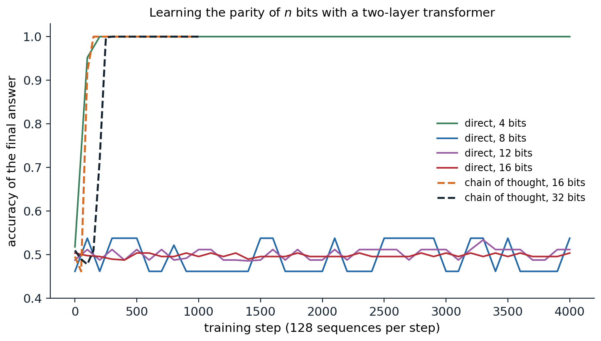
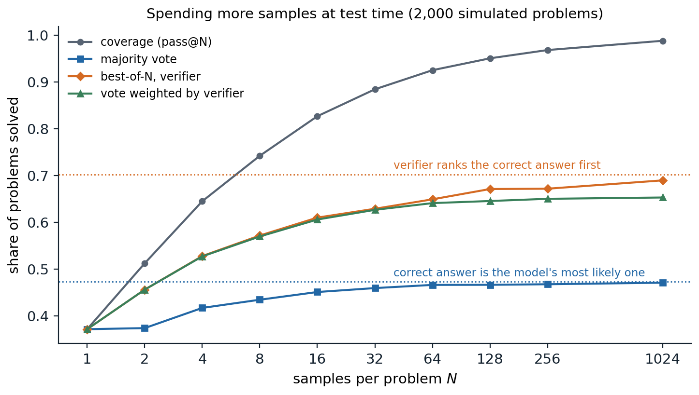

[Background Notes](../README.md) › [NLP and Large Language Models](README.md)

# 12. Reasoning and Test-Time Compute

> [!WARNING]
> Work in progress: this part of the notes is still being revised.

[← 11. Learning from Human Preferences](11-learning-from-human-preferences.md) · [13. Retrieval, Tools, and Agents →](13-retrieval-tools-and-agents.md)

## <a id="thinking-in-tokens"></a>Thinking in tokens

### <a id="chain-of-thought"></a>Chain of thought

Asked a multi-step arithmetic word problem, a language model that must answer immediately does poorly; asked to write out its reasoning first, it does much better. **Chain-of-thought prompting** ([Wei et al., 2022](https://arxiv.org/abs/2201.11903)) supplies few-shot demonstrations whose answers include the intermediate steps, and the model imitates the format. On the GSM8K benchmark of grade-school word problems ([Cobbe et al., 2021](https://arxiv.org/abs/2110.14168)), it raised the accuracy of the 540-billion-parameter PaLM from 17.9% to 56.9%. The benefit appeared only in models of roughly 100 billion parameters or more; smaller models wrote fluent but wrong reasoning. Even without demonstrations, appending *Let's think step by step* to the question raised one model's accuracy on a set of arithmetic problems from 17.7% to 78.7% ([Kojima et al., 2022](https://arxiv.org/abs/2205.11916)). Earlier work had trained models to use a **scratchpad** for addition and program execution ([Nye et al., 2021](https://arxiv.org/abs/2112.00114)). Today reasoning in tokens before answering is a trained behavior of the most capable models, and this chapter follows the path from the prompting trick to that training.

### <a id="why-intermediate-tokens-help"></a>Why intermediate tokens help

A transformer computes each token with a fixed number of layers, so the amount of sequential computation available for any single prediction is bounded by the depth. A problem that requires many dependent steps, such as tracking a value through a long computation, may need more serial steps than one forward pass provides. Each generated token adds a forward pass whose input includes the results written so far, so a chain of thought turns a fixed-depth computation into one whose length grows with the output. Theory makes this precise: transformers that may generate a number of intermediate tokens growing with the input length can solve problems, including some arithmetic and the simulation of automata, that fixed-depth transformers provably cannot under standard assumptions ([Feng et al., 2023](https://arxiv.org/abs/2305.15408); [Merrill and Sabharwal, 2024](https://arxiv.org/abs/2310.07923)).

Intermediate steps also make learning easier, a separate matter from what the network can represent. The parity of a string of bits is the classic example: whether the number of ones is odd depends on every bit jointly, and no subset of the bits is correlated with the answer, so gradient descent receives no signal until it finds the complete function ([Shalev-Shwartz, Shamir, and Shammah, 2017](https://arxiv.org/abs/1703.07950); [Appendix C](#block-nlp12-appendix-c)). Written as a chain of running parities, each step depends only on the previous step and one new bit, and every step is easy ([Wies, Levine, and Shashua, 2023](https://arxiv.org/abs/2204.02892)). The figure trains the same two-layer transformer on both formats.



*A two-layer transformer of width 64, trained with Adam on 128 random bit strings per step. Answering directly, it must output the parity after the bits; with a chain of thought, it writes the running parity after each bit and the last one is the answer. Accuracy of the final answer on 500 random strings, with the model writing its own chain in the chain-of-thought runs. Answering directly, the model learns 4-bit parity by step 200 and stays at chance for 8, 12, and 16 bits through 4,000 steps; with a chain of thought it passes 99% by step 150 for 16 bits and by step 250 for 32 bits.*

Answering directly, the network learns the parity of 4 bits quickly but stays at chance for 8 bits, although each of the 256 eight-bit strings appears about 2,000 times during training. With the chain of running parities, the same network learns 16 bits within 150 steps and 32 bits within 250, because every token it must predict depends on two tokens it can read. Nothing about the network changed, only the format of the target. The same principle underlies the rest of the chapter: writing out intermediate steps makes problems both computable and learnable, and training can teach a model to produce the steps it needs.

### <a id="are-the-thoughts-faithful"></a>Are the thoughts faithful?

A chain of thought reads like an explanation of how the model reached its answer, but nothing forces it to be one. [Turpin et al. (2023)](https://arxiv.org/abs/2305.04388) biased models toward particular answers, for example by making the correct option in every few-shot example the first one, and found that the models followed the bias while writing reasoning that never mentioned it. [Lanham et al. (2023)](https://arxiv.org/abs/2307.13702) truncated or corrupted chains and measured how often the final answer changed, and found that the dependence of the answer on the stated reasoning varied widely across tasks and decreased for larger models on some of them. Whether visible reasoning can be trusted, and whether training that rewards correct answers keeps it legible, are questions for the Safety and Frontier module.

## <a id="spending-compute-at-test-time"></a>Spending compute at test time

### <a id="sampling-and-voting"></a>Sampling and voting

A model that samples different reasoning for the same problem often reaches different answers, and the most common answer is more reliable than any single sample. **Self-consistency** ([Wang et al., 2023](https://arxiv.org/abs/2203.11171)) samples many chains of thought and returns the majority answer; it raised PaLM's accuracy on GSM8K by 17.9 points over a single greedy chain. Voting has a clear limit. If the correct answer is the model's most probable answer to a problem, the vote converges to it as the number of samples grows; if some wrong answer is more probable, the vote converges to the wrong answer ([Appendix A](#block-nlp12-appendix-a)). Majority voting can therefore at most solve the problems on which the model is already right more often than it is wrong in any particular way.

### <a id="verifiers"></a>Verifiers

A **verifier** scores candidate solutions, and **best-of-$`N`$** returns the highest-scoring of $`N`$ samples. Some tasks come with an exact verifier: unit tests for code, a proof checker for formal mathematics, the known answer in a training set. Otherwise the verifier is learned. [Cobbe et al. (2021)](https://arxiv.org/abs/2110.14168) trained an **outcome reward model** (ORM) to predict whether a solution's final answer is correct, and found that verification gave a boost equivalent to a thirtyfold increase in model size. A **process reward model** (PRM) scores each step of the solution instead, which localizes errors and gives denser feedback; trained on 800,000 human labels of individual steps, a PRM selected correct solutions to competition mathematics problems more reliably than an ORM (78.2% against 72.4% of a test subset, choosing among 1,860 samples) and than majority voting (69.6%) ([Lightman et al., 2023](https://arxiv.org/abs/2305.20050)). The figure compares the strategies in a simulation in which each problem has its own answer distribution and a learned verifier makes systematic errors.



*2,000 simulated problems. On each, the model gives the correct answer with a probability drawn from a Beta(0.6, 1) distribution, 37.3% on average, and spreads its wrong answers over five distractors. A verifier scores each sample with a systematic score for its answer (1.5 for the correct one, standard normal for each distractor, fixed per problem) plus independent noise. With 1,024 samples, 98.8% of the problems have at least one correct sample (coverage, or pass@$`N`$), majority voting solves 47.1%, the share whose correct answer is the model's most probable (47.3%), best-of-$`N`$ by verifier score solves 69.0% of an attainable 70.3%, and voting weighted by the exponentiated verifier scores 65.3%.*

Each strategy approaches its own ceiling. Coverage keeps growing as long as the model has any chance of solving a problem, which is why a perfect verifier is so valuable. Majority voting saturates early at the share of problems the model already tends to get right. A learned verifier lifts the ceiling to the problems on which it prefers the correct answer, but it also has systematic blind spots that more samples cannot fix: with enough samples, the search finds the wrong answers the verifier likes best, the same overoptimization as in [chapter 11](11-learning-from-human-preferences.md#goodhart-s-law).

### <a id="search-and-refinement"></a>Search and refinement

Instead of sampling complete solutions independently, one can search over partial ones. **Tree of thoughts** ([Yao et al., 2023](https://arxiv.org/abs/2305.10601)) lets the model propose several next steps, evaluates the partial solutions with the model itself, and explores the most promising by breadth-first or depth-first search ([AI chapter 1](../ai/01-agents-and-uninformed-search.md)); on a puzzle requiring arithmetic combinations of four numbers to reach 24, it solved 74% of instances against 4% for chain-of-thought prompting with the same model. With a process reward model, beam search over reasoning steps is natural, and Monte Carlo tree search ([AI chapter 4](../ai/04-adversarial-search-and-games.md#monte-carlo-tree-search)) has been used with learned values as well. **Iterative refinement**, in which the model critiques and revises its own answer ([Madaan et al., 2023](https://arxiv.org/abs/2303.17651)), helps when the feedback carries new information, such as test failures or a tool's error messages; without such feedback, models often fail to improve their reasoning by self-critique and can talk themselves out of correct answers ([Huang et al., 2024](https://arxiv.org/abs/2310.01798)).

### <a id="scaling-test-time-compute"></a>Scaling test-time compute

Test-time computation trades against model size and training. [Snell et al. (2024)](https://arxiv.org/abs/2408.03314) found that the best use of a fixed test-time budget depends on the difficulty of the problem: easy problems benefit most from revising a single answer sequentially, harder ones from parallel sampling with a verifier; allocated adaptively per problem, test-time computation let a smaller model outperform one 14 times larger with the same total compute on problems where the small model had some success. [Brown et al. (2024)](https://arxiv.org/abs/2407.21787) found that coverage grows roughly log-linearly with the number of samples over four orders of magnitude; on a benchmark of real software-engineering issues, an open model's success rate rose from 15.9% with one sample to 56% with 250, using the repository's tests as the verifier. Where good verifiers exist, sampling more is one of the most reliable ways to buy accuracy.

## <a id="training-to-reason"></a>Training to reason

### <a id="learning-from-successful-attempts"></a>Learning from successful attempts

If a model sometimes solves problems, its successful solutions are training data. The **self-taught reasoner** (STaR; [Zelikman et al., 2022](https://arxiv.org/abs/2203.14465)) samples rationales for problems with known answers, keeps those that reach the correct answer, fine-tunes on them, and repeats; for problems the model fails, it generates a rationale given the answer as a hint. This is **expert iteration** ([Anthony, Tian, and Barber, 2017](https://arxiv.org/abs/1705.08439)): search or sampling finds better solutions than the model produces on average, and training distills them into the model. Rejection-sampling fine-tuning is the same procedure with a single round. It is a policy-improvement method that uses only the positive examples, a form of reinforcement learning with a binary reward.

### <a id="reinforcement-learning-with-verifiable-rewards"></a>Reinforcement learning with verifiable rewards

Reinforcement learning uses failures as well as successes. In **reinforcement learning with verifiable rewards** (RLVR), the reward is computed by a program rather than a learned model: 1 if the final answer matches the reference or the code passes its tests, 0 otherwise, sometimes with a small reward for the required format. Because the reward cannot be flattered by style or length, it is much harder to exploit than a learned reward model. The most widely used algorithm, **group relative policy optimization** (GRPO; [Shao et al., 2024](https://arxiv.org/abs/2402.03300)), is a simplification of PPO for this setting. For each prompt it samples a group of $`G`$ responses, normalizes their rewards within the group,

```math
A_i=\frac{r_i-\operatorname{mean}(r_1,\dots,r_G)}{\operatorname{std}(r_1,\dots,r_G)},
```

and uses $`A_i`$ as the advantage of every token of response $`i`$ in a clipped policy-gradient objective with a KL penalty toward a reference model ([Appendix B](#block-nlp12-appendix-b)). The group mean replaces PPO's learned value function as the baseline. The code applies GRPO to a toy task, answering the sum of two digits with a reward of 1 for the right answer. The policy is a small network that starts either from random weights or from a stand-in for a pretrained model, which puts 30% of its probability on the right sum and 35% on each of its two neighbors, so that it can sample the answer but rarely prefers it.

```python
import copy

import torch
from torch import nn

torch.manual_seed(0)
# Task: given digits a and b, answer a + b (19 possible answers). Reward 1 for the right answer, 0 otherwise.
a, b = torch.meshgrid(torch.arange(10), torch.arange(10), indexing="ij")
X = torch.cat([nn.functional.one_hot(a.flatten(), 10), nn.functional.one_hot(b.flatten(), 10)], -1).float()
Y = (a + b).flatten()                                    # all 100 prompts, as one-hot digit pairs, and their answers


def new_policy():
    return nn.Sequential(nn.Linear(20, 64), nn.Tanh(), nn.Linear(64, 19))


def pretrained_base():
    """Stand-in for a pretrained model: 30% on the right sum and 35% on each of its neighbors."""
    net, target = new_policy(), torch.zeros(100, 19)
    target[range(100), Y] += 0.3
    target[range(100), (Y - 1).clamp(min=0)] += 0.35
    target[range(100), (Y + 1).clamp(max=18)] += 0.35
    opt = torch.optim.Adam(net.parameters(), lr=1e-2)
    for _ in range(500):
        loss = -(target * torch.log_softmax(net(X), -1)).sum(-1).mean()
        opt.zero_grad()
        loss.backward()
        opt.step()
    return net


def evaluate(policy, k=64):
    with torch.no_grad():
        p = torch.softmax(policy(X), -1)
    pc = p[range(100), Y]                                # probability of sampling the right answer
    return f"greedy accuracy {(p.argmax(-1) == Y).float().mean():.2f}, pass@1 (mean reward) {pc.mean():.2f}, " \
           f"pass@{k} {(1 - (1 - pc) ** k).mean():.2f}"


def grpo(policy, steps=300, G=8, B=32, beta=0.02, clip=0.2, lr=3e-3):
    ref = copy.deepcopy(policy)                          # frozen reference policy for the KL penalty
    opt = torch.optim.Adam(policy.parameters(), lr=lr)
    silent = 0.0
    for step in range(steps):
        idx = torch.randint(100, (B,)).repeat_interleave(G)   # B prompts, each G times
        x = X[idx]
        with torch.no_grad():
            old_logp = torch.log_softmax(policy(x), -1)
            ans = torch.multinomial(old_logp.exp(), 1)[:, 0]
            r = (ans == Y[idx]).float().view(B, G)
            adv = ((r - r.mean(1, keepdim=True)) / (r.std(1, keepdim=True) + 1e-6)).flatten()  # group-relative
            old = old_logp.gather(1, ans[:, None])[:, 0]
            ref_logp = torch.log_softmax(ref(x), -1).gather(1, ans[:, None])[:, 0]
            silent += (r.std(1) == 0).float().mean().item() / steps   # groups whose rewards are all equal
        for _ in range(2):                               # two gradient steps on the same samples
            logp = torch.log_softmax(policy(x), -1).gather(1, ans[:, None])[:, 0]
            ratio = torch.exp(logp - old)
            surrogate = torch.minimum(ratio * adv, ratio.clamp(1 - clip, 1 + clip) * adv)
            kl = torch.exp(ref_logp - logp) - (ref_logp - logp) - 1   # nonnegative estimate of the KL
            loss = -(surrogate - beta * kl).mean()
            opt.zero_grad()
            loss.backward()
            opt.step()
    return policy, silent


for name, policy in [("random initialization", new_policy()), ("pretrained base", pretrained_base())]:
    print(f"{name}, before: {evaluate(policy)}")
    policy, silent = grpo(policy)
    print(f"{name}, after 300 GRPO steps: {evaluate(policy)}; groups without signal {silent:.0%}")
# random initialization, before: greedy accuracy 0.05, pass@1 (mean reward) 0.05, pass@64 0.97
# random initialization, after 300 GRPO steps: greedy accuracy 0.54, pass@1 (mean reward) 0.47, pass@64 0.57; groups without signal 58%
# pretrained base, before: greedy accuracy 0.02, pass@1 (mean reward) 0.31, pass@64 1.00
# pretrained base, after 300 GRPO steps: greedy accuracy 0.88, pass@1 (mean reward) 0.82, pass@64 0.89; groups without signal 66%
```

From the pretrained stand-in, 300 steps raise greedy accuracy from 2% to 88% and the mean reward from 0.31 to 0.82: the model could already sample the right answer, and GRPO concentrated probability on it. Two costs appear as well. With 64 samples per prompt, the trained policy solves fewer prompts than the model it started from (89% against 100%), because on about a tenth of the prompts it became confident in a wrong neighbor; and once every sample in a group is wrong, all its advantages are zero and the prompt stops contributing. Two-thirds of the groups carried no learning signal over the run, counting those in which every sample was right. From random weights, where a group of eight contains a right answer only 35% of the time at the start, learning stalls near half of the prompts. The first effect is the one [Yue et al. (2025)](https://arxiv.org/abs/2504.13837) measured in real reasoning models (see below). Practical recipes counter the second by keeping the policy's entropy from collapsing, for example by allowing a larger upward than downward range in the clipped ratio, and by replacing prompts whose groups are all right or all wrong with fresh ones ([Yu et al., 2025](https://arxiv.org/abs/2503.14476)).

### <a id="reasoning-models"></a>Reasoning models

OpenAI's o1 ([OpenAI, 2024](https://openai.com/index/learning-to-reason-with-llms/)) was the first widely used model trained with large-scale reinforcement learning to reason at length before answering; its accuracy on competition mathematics and programming rose steadily with both the compute spent on reinforcement learning and the number of tokens it was allowed to think at test time. **DeepSeek-R1** ([DeepSeek-AI, 2025](https://arxiv.org/abs/2501.12948)) published a recipe. Its first model, R1-Zero, applied GRPO with rewards for correct answers and for a format that separates thinking from the answer directly to a pretrained base model, without supervised fine-tuning. Over training, its responses grew longer, it began to check and revise its own steps, a moment of reconsideration its authors called an "aha moment," and its accuracy on the AIME 2024 mathematics competition rose from 15.6% to 71.0%. The released R1 added a small set of curated reasoning examples before reinforcement learning, which made its outputs more readable, and further stages for general helpfulness; distilling its reasoning into smaller open models by fine-tuning on its outputs produced strong small reasoners, often better than applying reinforcement learning to the small models directly.

### <a id="open-questions"></a>Open questions

Reasoning models raise questions that are still being settled. How much reinforcement learning adds is debated: [Yue et al. (2025)](https://arxiv.org/abs/2504.13837) found that trained models solve more problems with one sample, but the base models they started from solve as many or more when allowed hundreds of samples, which suggests that RLVR mainly concentrates probability on solutions the base model could already find. Models trained to reason spend many tokens even on trivial questions, **overthinking** that wastes computation ([Chen et al., 2024](https://arxiv.org/abs/2412.21187)). Verifiable rewards can still be hacked, for instance by code that special-cases the tests. Reasoning trained in mathematics and coding transfers only partly to domains without verifiers. And the faithfulness of long reasoning traces, discussed above, matters more as models rely on them.

## <a id="appendices"></a>Appendices


<details>
<summary><a id="block-nlp12-appendix-a"></a><b>A. When majority voting converges to the right answer</b></summary>


Fix a problem, and let the model's samples be independent with answer probabilities $`p_0`$ for the correct answer and $`p_1,\dots,p_m`$ for wrong ones. After $`N`$ samples, the count of answer $`a`$ is $`C_a\sim\mathrm{Binomial}(N,p_a)`$. If $`p_0>\max_{a\ge1}p_a`$, write $`\delta=p_0-\max_{a\ge1}p_a`$. For each wrong answer $`a`$, the difference $`C_0-C_a`$ is a sum of $`N`$ independent terms in $`\{-1,0,1\}`$ with mean $`N(p_0-p_a)\ge N\delta`$, so by Hoeffding's inequality $`P(C_a\ge C_0)\le e^{-N\delta^2/2}`$, and by a union bound the vote is wrong with probability at most $`m\,e^{-N\delta^2/2}`$, which vanishes exponentially. If instead some wrong answer $`a^*`$ has $`p_{a^*}>p_0`$, the same argument shows that the vote converges to $`a^*`$. The limiting accuracy of majority voting over a set of problems is therefore the fraction of problems on which the correct answer is the mode of the model's answer distribution, however many samples are drawn; the samples needed grow like $`1/\delta^2`$ on problems where the margin is small.

</details>


<details>
<summary><a id="block-nlp12-appendix-b"></a><b>B. The GRPO objective</b></summary>


For a prompt $`x`$, sample responses $`y_1,\dots,y_G`$ from the current policy $`\pi_{\mathrm{old}}`$ and compute rewards $`r_i`$ and normalized advantages $`A_i`$. GRPO maximizes

```math
\frac1G\sum_{i=1}^G\frac1{|y_i|}\sum_{t=1}^{|y_i|}\Bigl[\min\bigl(\rho_{i,t}A_i,\ \operatorname{clip}(\rho_{i,t},1-\epsilon,1+\epsilon)A_i\bigr)-\beta\,\hat D_{i,t}\Bigr],
\qquad\rho_{i,t}=\frac{\pi_\theta(y_{i,t}\mid x,y_{i,<t})}{\pi_{\mathrm{old}}(y_{i,t}\mid x,y_{i,<t})},
```

with the per-token divergence estimate $`\hat D=\frac{\pi_{\mathrm{ref}}}{\pi_\theta}-\log\frac{\pi_{\mathrm{ref}}}{\pi_\theta}-1`$, which is nonnegative and has expectation $`D_{\mathrm{KL}}(\pi_\theta\Vert\pi_{\mathrm{ref}})`$ under samples from $`\pi_\theta`$. At $`\theta=\theta_{\mathrm{old}}`$, where $`\rho=1`$ and clipping is inactive, the gradient of the first term is $`\frac1G\sum_iA_i\nabla\log\pi_\theta(y_i\mid x)`$ up to the length normalization: the REINFORCE estimator with the group mean as a baseline, divided by the group's standard deviation. Subtracting a baseline that does not depend on the sampled response leaves the policy gradient unbiased (exactly so for a leave-one-out mean; the group mean including the sample itself introduces a bias of order $`1/G`$). Dividing by the standard deviation rescales the gradient per prompt, giving problems where the group's rewards barely vary the same weight as others, and when all $`G`$ rewards are equal, all advantages are zero and the prompt contributes no learning signal. Very easy and very hard prompts are therefore wasted, which is why training sets for RLVR are filtered to problems of intermediate difficulty for the current model. The per-response normalization by $`|y_i|`$ weights tokens of short responses more; variants remove it to avoid a bias toward long wrong answers.

</details>


<details>
<summary><a id="block-nlp12-appendix-c"></a><b>C. Why parity is hard to learn in one step</b></summary>


Let $`x\in\{-1,1\}^n`$ be uniformly random and $`f(x)=\prod_{i=1}^nx_i`$ the parity in $`\pm1`$ form. For any proper subset $`S\subsetneq\{1,\dots,n\}`$ and any function $`g`$ of the bits in $`S`$ alone, $`\mathbb E[f(x)g(x_S)]=\mathbb E\bigl[g(x_S)\prod_{i\in S}x_i\bigr]\prod_{i\notin S}\mathbb E[x_i]=0`$, since each excluded bit has mean zero and is independent of the rest. Any function that ignores even one bit is uncorrelated with the parity, so a learner cannot make partial progress by fitting part of the input. The formal hardness results concern learning an unknown parity from a large family: the $`2^n`$ parities $`\chi_S(x)=\prod_{i\in S}x_i`$ are orthonormal, the expected gradient of a squared loss for a network $`h_\theta`$ with target $`\chi_S`$ is $`-2\,\mathbb E[\chi_S(x)\nabla_\theta h_\theta(x)]`$, the Fourier coefficient of $`\nabla_\theta h_\theta`$ at $`S`$, and for most $`S`$ these coefficients are exponentially small, so gradients carry almost no information about which parity is the target; this statistical-query argument implies that gradient methods need exponentially many steps or samples for the class. For the single full parity of the figure, the first observation already explains the plateau: until the network computes something correlated with all $`n`$ bits at once, the loss offers no direction of improvement, and the network's initial function has almost no such correlation. With a chain of thought the target at step $`k`$ is $`r_k=r_{k-1}x_k`$, a function of two tokens that the network can read directly, and each step is learned like any local pattern.

</details>

---

[← 11. Learning from Human Preferences](11-learning-from-human-preferences.md) · [13. Retrieval, Tools, and Agents →](13-retrieval-tools-and-agents.md)
