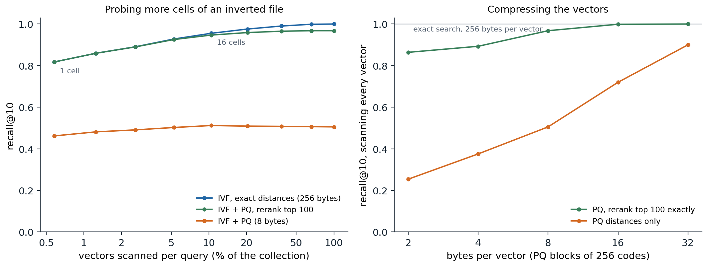

[ML Mastery Notes](../README.md) › [NLP and Large Language Models](README.md)

# 13. Retrieval, Tools, and Agents

[← 12. Reasoning and Test-Time Compute](12-reasoning-and-test-time-compute.md) · [14. Evaluating Language Models →](14-evaluating-language-models.md)

## <a id="why-retrieve"></a>Why retrieve

A language model's knowledge is fixed when training ends, stored diffusely in its parameters, and uneven: models answer questions about popular entities far more accurately than about rare ones, and accuracy on a fact grows with the number of documents in the pretraining data that mention it ([Kandpal et al., 2023](https://arxiv.org/abs/2211.08411)). A model cannot say where a fact came from, and when it does not know, it often produces a fluent guess (chapter 5). **Retrieval** addresses all of these at once: find relevant documents in an external collection and give them to the model in its context. The collection can be updated without retraining, can be private, and can be cited. This chapter describes how retrieval works, how language models use retrieved text, and how the same loop of reading, calling, and acting extends to tools and to agents that take many steps toward a goal.

## <a id="finding-relevant-text"></a>Finding relevant text

### <a id="sparse-retrieval"></a>Sparse retrieval

Classical retrieval represents documents and queries by the words they contain and scores matches with weights that reward rare words. A document is a sparse vector over the vocabulary, and an **inverted index**, which maps each word to the list of documents containing it with their counts, lets a query touch only the documents that share a word with it ([Manning, Raghavan, and Schütze, 2008](https://nlp.stanford.edu/IR-book/)). **TF-IDF** weights a word in a document by its term frequency, damped logarithmically, times its inverse document frequency $`\log(N/\mathrm{df}_w)`$, which is large for words in few of the $`N`$ documents. **BM25** ([Robertson and Zaragoza, 2009](https://doi.org/10.1561/1500000019)) refines both parts:

$$
\mathrm{BM25}(q,d)=\sum_{w\in q}\mathrm{idf}(w)\,\frac{c(w,d)\,(k_1+1)}{c(w,d)+k_1\bigl(1-b+b\,|d|/\overline{|d|}\bigr)},
\qquad\mathrm{idf}(w)=\log\Bigl(1+\frac{N-\mathrm{df}_w+0.5}{\mathrm{df}_w+0.5}\Bigr),
$$

where $`c(w,d)`$ is the count of $`w`$ in $`d`$. The term-frequency factor saturates, so the tenth occurrence of a word adds much less than the first, with $`k_1`$ around 1.2 setting how fast; and $`b`$ around 0.75 normalizes for document length, so long documents are not favored merely for containing more words. The form derives from a probabilistic model of relevance ([Appendix A](#block-nlp13-appendix-a)). The code builds an inverted index over the 1,446 speeches of Tiny Shakespeare with at least 40 words and tests **known-item search**: each query is five words drawn at random from one speech, and the task is to rank that speech first.

```python
import math
import random
import re
from collections import Counter

import numpy as np

text = open("Sources/Data/tinyshakespeare.txt", encoding="utf-8").read()
speeches = [s.split("\n", 1)[1] for s in text.split("\n\n") if "\n" in s and len(s.split()) >= 40]
tok = lambda s: re.findall(r"[a-z]+", s.lower())
docs = [Counter(tok(s)) for s in speeches]
N = len(docs)
df = Counter(w for d in docs for w in d)                 # document frequency of each word
lengths = np.array([sum(d.values()) for d in docs])
avg_len = lengths.mean()
index = {}                                               # inverted index: word -> list of (doc, count)
for i, d in enumerate(docs):
    for w, c in d.items():
        index.setdefault(w, []).append((i, c))


def tfidf_scores(query):
    s = np.zeros(N)
    for w in set(query):
        for i, c in index.get(w, []):
            s[i] += (1 + math.log(c)) * math.log(N / df[w])
    return s / np.sqrt(lengths)                          # crude length normalization


def bm25_scores(query, k1=1.2, b=0.75):
    s = np.zeros(N)
    for w in set(query):
        idf = math.log(1 + (N - df[w] + 0.5) / (df[w] + 0.5))
        for i, c in index.get(w, []):
            s[i] += idf * c * (k1 + 1) / (c + k1 * (1 - b + b * lengths[i] / avg_len))
    return s


# Known-item search: a query is 5 words drawn from one speech; the task is to rank that speech first.
rng = random.Random(0)
queries = [(i, rng.sample(tok(speeches[i]), 5)) for i in rng.sample(range(N), 500)]
print(f"{N} speeches of at least 40 words, {len(df)} distinct words; example query: {' '.join(queries[0][1])}")
for name, f in [("TF-IDF", tfidf_scores), ("BM25", bm25_scores)]:
    ranks = np.array([1 + np.sum(f(q) > f(q)[i]) for i, q in queries])
    print(f"{name:7s} recall@1 {np.mean(ranks == 1):.3f}  recall@10 {np.mean(ranks <= 10):.3f}  MRR {np.mean(1 / ranks):.3f}")
hits = np.argsort(-bm25_scores(tok("my kingdom for a horse")))[:2]
print("BM25 for 'my kingdom for a horse':", [speeches[i][:60].replace("\n", " / ") for i in hits])
# 1446 speeches of at least 40 words, 9784 distinct words; example query: take o in rise to
# TF-IDF  recall@1 0.832  recall@10 0.964  MRR 0.882
# BM25    recall@1 0.896  recall@10 0.968  MRR 0.923
# BM25 for 'my kingdom for a horse': ['Slave, I have set my life upon a cast, / And I will stand the ', 'Come, bustle, bustle; caparison my horse. / Call up Lord Stanl']
```

BM25 ranks the right speech first for 89.6% of queries against 83.2% for TF-IDF, and the query *my kingdom for a horse* finds Richard III's speech that ends with the line. Three decades after its introduction, BM25 remains a strong baseline and a standard component of production search.

### <a id="dense-retrieval"></a>Dense retrieval

Sparse retrieval fails when the query and the document use different words for the same thing: *How old was the king when he died?* against *He passed away at the age of sixty*. **Dense retrieval** maps queries and documents to vectors with neural encoders and scores them by inner product, so that texts with similar meaning are close regardless of vocabulary (chapter 5). **Dense passage retrieval** ([Karpukhin et al., 2020](https://arxiv.org/abs/2004.04906)) fine-tuned two BERT encoders, one for questions and one for passages, with a contrastive loss: for each question, the passage containing the answer should score higher than the other passages in the batch, the **in-batch negatives**, and than a hard negative retrieved by BM25 that does not contain the answer ([Appendix B](#block-nlp13-appendix-b)). It outperformed BM25 by 9 to 19 points in top-20 accuracy on open-domain question answering. Two refinements trade cost for accuracy. **Late interaction** keeps a vector for every token and scores a document by summing, over query tokens, the best match among document tokens, as in ColBERT ([Khattab and Zaharia, 2020](https://arxiv.org/abs/2004.12832)). And a **cross-encoder**, a model that reads the query and document together, reranks the top few dozen candidates of a cheaper first stage.

Dense retrievers trained on one domain generalize unevenly. On a benchmark of 18 datasets from different domains, BM25 outperformed most dense retrievers of the time outside their training domain ([Thakur et al., 2021](https://arxiv.org/abs/2104.08663)), which motivated embedding models pretrained contrastively on large and diverse collections of text pairs, and **hybrid** search that combines sparse and dense scores.

### <a id="searching-many-vectors"></a>Searching many vectors

A collection of a billion passages with 768-dimensional embeddings occupies about 3 TB in 32-bit floats, and comparing a query with every vector is too slow. **Approximate nearest-neighbor** search trades a little accuracy for large savings. An **inverted file** (IVF) clusters the vectors with k-means and, for a query, scans only the vectors in the few clusters whose centroids are nearest. **Product quantization** ([Jégou, Douze, and Schmid, 2011](https://doi.org/10.1109/TPAMI.2010.57)) compresses each vector by splitting it into $`M`$ blocks and replacing each block by the index of its nearest centroid in a small codebook, so a vector becomes $`M`$ bytes; distances from a query are then computed from a table of query-to-centroid distances, one lookup per block ([Appendix C](#block-nlp13-appendix-c)). Graph-based indexes such as **HNSW** ([Malkov and Yashunin, 2020](https://arxiv.org/abs/1603.09320)) instead navigate a layered graph of near neighbors from coarse to fine. Libraries such as FAISS ([Johnson, Douze, and Jégou, 2021](https://arxiv.org/abs/1702.08734)) combine these structures. The code implements IVF and product quantization from scratch on 20,000 clustered vectors.

```python
import numpy as np
from scipy.cluster.vq import kmeans2

rng = np.random.default_rng(0)
N, d, n_q = 20_000, 64, 200
centers = rng.standard_normal((500, d))
X = (centers[rng.integers(500, size=N)] + rng.standard_normal((N, d))).astype(np.float32)   # clustered "embeddings"
Q = (centers[rng.integers(500, size=n_q)] + rng.standard_normal((n_q, d))).astype(np.float32)
D = (Q ** 2).sum(1)[:, None] - 2 * Q @ X.T + (X ** 2).sum(1)[None, :]
true = np.argsort(D, 1)[:, :10]                          # exact 10 nearest neighbors


def recall(found):
    return np.mean([len(set(f) & set(t)) / 10 for f, t in zip(found, true)])


# Inverted file (IVF): k-means cells; a query scans only the vectors in its nprobe nearest cells.
cent, cell = kmeans2(X, 256, seed=1, minit="points")
members = [np.flatnonzero(cell == c) for c in range(256)]

# Product quantization (PQ): split vectors into 8 blocks of 8 dimensions, quantize each block to 256 codes.
M, K = 8, 256
books, codes = [], np.zeros((N, M), dtype=np.uint8)
for m in range(M):
    cb, lab = kmeans2(X[:, m * 8:(m + 1) * 8], K, seed=m, minit="points")
    books.append(cb)
    codes[:, m] = lab


def search(q, nprobe, mode):
    cand = np.concatenate([members[c] for c in np.argsort(((cent - q) ** 2).sum(1))[:nprobe]])
    if mode == "exact":
        return cand[np.argsort(((X[cand] - q) ** 2).sum(1))[:10]], len(cand)
    table = np.stack([((books[m] - q[m * 8:(m + 1) * 8]) ** 2).sum(1) for m in range(M)])   # query-to-code
    approx = table[np.arange(M), codes[cand]].sum(1)     # asymmetric distances: M lookups per vector
    if mode == "pq":
        return cand[np.argsort(approx)[:10]], len(cand)
    short = cand[np.argsort(approx)[:100]]               # "pq+rerank": exact distances for a shortlist of 100
    return short[np.argsort(((X[short] - q) ** 2).sum(1))[:10]], len(cand)


print(f"{N:,} vectors of dimension {d}: {X.nbytes // N} bytes each as float32, {codes.nbytes // N} bytes as PQ codes")
print("nprobe  scanned  recall@10: exact  PQ only  PQ + rerank")
for nprobe in [1, 4, 16, 64]:
    res = {mode: [search(q, nprobe, mode) for q in Q] for mode in ["exact", "pq", "pq+rerank"]}
    r = [recall([found for found, _ in res[mode]]) for mode in res]
    scanned = np.mean([n for _, n in res["exact"]]) / N
    print(f"{nprobe:6d} {scanned:8.1%} {r[0]:15.3f} {r[1]:8.3f} {r[2]:12.3f}")
# 20,000 vectors of dimension 64: 256 bytes each as float32, 8 bytes as PQ codes
# nprobe  scanned  recall@10: exact  PQ only  PQ + rerank
#      1     0.6%           0.818    0.462        0.818
#      4     2.6%           0.891    0.491        0.890
#     16    10.4%           0.956    0.512        0.947
#     64    38.2%           0.990    0.508        0.966
```

Scanning only the nearest cell, 0.6% of the vectors, finds 82% of the true ten nearest neighbors, and scanning 16 cells, a tenth of the collection, finds 96%; the misses are neighbors that lie just across a cell boundary from the query. Product quantization shrinks each vector 32-fold, from 256 bytes to 8, but ranking by the compressed distances alone recovers only about half of the true neighbors, because the distances among near neighbors differ by less than the quantization error. Reranking a shortlist of the 100 best candidates by their exact distances recovers most of the loss. Production systems follow the same design at scale: compact codes held in memory select a shortlist, and full-precision vectors, which can live on slower storage, rerank it.



*The synthetic collection of the code: 20,000 vectors of dimension 64 around 500 random centers, and 200 queries. Recall@10 is the fraction of each query's true ten nearest neighbors that the search returns. Left: an inverted file with 256 k-means cells, probing 1 to 256 cells per query. One cell (0.6% of the vectors) finds 81.8% of the neighbors and 16 cells (10.4%) find 95.6%; product quantization to 8 bytes caps recall near 0.5, and reranking its top 100 candidates exactly reaches 96.8% when every cell is probed. Right: a scan of every vector with product-quantization codes of 2 to 32 bytes. Ranking by compressed distances alone needs 32 bytes to reach 0.90, while reranking a shortlist of 100 reaches 0.968 at 8 bytes and 0.999 at 16.*

### <a id="measuring-retrieval"></a>Measuring retrieval

Retrieval is evaluated with relevance judgments for a set of queries. **Recall@$`k`$** is the fraction of relevant documents found in the top $`k`$, the most important measure when the results go to a language model that reads all of them. **Mean reciprocal rank** averages $`1/\text{rank}`$ of the first relevant result, rewarding putting it at the top. **Normalized discounted cumulative gain** handles graded relevance and discounts gains logarithmically with rank ([Appendix C](#block-nlp13-appendix-c)). For retrieval-augmented systems, what matters in the end is the quality of the answer, which retrieval metrics measure only indirectly.

## <a id="retrieval-augmented-generation"></a>Retrieval-augmented generation

### <a id="retrieve-then-read"></a>Retrieve, then read

**Retrieval-augmented generation** (RAG) conditions the language model on retrieved text. [Lewis et al. (2020)](https://arxiv.org/abs/2005.11401) trained a retriever and a sequence-to-sequence generator jointly, treating the retrieved passage as a latent variable and marginalizing over the top $`k`$: $`p(y\mid x)\approx\sum_{z\in\text{top-}k}p(z\mid x)\,p(y\mid x,z)`$. Current practice is usually simpler: split the collection into **chunks** of a few hundred tokens, embed them, retrieve the top few for the question, and place them in the prompt of an instruction-tuned model with instructions to answer from the provided sources and cite them. Most of the engineering lies in the details: how to chunk documents without cutting their structure, when to retrieve and with what query, how many chunks to include, and how to rerank them.

### <a id="retrieval-inside-the-model"></a>Retrieval inside the model

Retrieval can also be part of the model itself. **REALM** ([Guu et al., 2020](https://arxiv.org/abs/2002.08909)) trained a retriever during masked-language-model pretraining, rewarding retrieved documents that helped predict masked tokens. **RETRO** ([Borgeaud et al., 2022](https://arxiv.org/abs/2112.04426)) retrieved neighbors of each chunk of the input from a database of two trillion tokens and attended to them through cross-attention; a 7.5-billion-parameter RETRO matched much larger models on language-modeling benchmarks. The **kNN-LM** ([Khandelwal et al., 2020](https://arxiv.org/abs/1911.00172)) stores the final hidden state of every token of a corpus together with the next token, retrieves the nearest stored states for the current context, and interpolates the next-token distribution they imply with the model's own, lowering perplexity without further training; it is a neural relative of the n-gram models of chapter 2 and of the ∞-gram model.

### <a id="when-retrieval-goes-wrong"></a>When retrieval goes wrong

Retrieval adds its own failure modes. Irrelevant passages in the context distract the model and lower its accuracy ([Shi et al., 2023](https://arxiv.org/abs/2302.00093)), and relevant ones in the middle of a long context are used less than those at the start or end (chapter 4). When retrieved evidence contradicts what the model learned in pretraining, models sometimes follow the evidence and sometimes their prior, depending on how coherent and convincing the evidence is ([Xie et al., 2024](https://arxiv.org/abs/2305.13300)). A cited answer can still misrepresent its source, so evaluating RAG systems requires checking that each claim is supported by the passage it cites. Long context windows offer an alternative for moderate collections: put all the documents in the prompt. With enough resources, long-context models outperform RAG on many tasks, but RAG remains far cheaper per query, and systems increasingly combine the two ([Li et al., 2024](https://arxiv.org/abs/2407.16833)).

## <a id="tools"></a>Tools

### <a id="calling-functions"></a>Calling functions

Some things a language model does badly are trivial for a program: exact arithmetic, looking up today's weather, querying a database, running code. **Tool use** lets the model delegate them. The model is told which tools exist, with their names, descriptions, and argument schemas; when it decides to use one, it emits a structured call, such as a JSON object naming the function and its arguments, which the surrounding system executes, appending the result to the context for the model to read. Constrained decoding (chapter 8) guarantees that calls parse. **Toolformer** ([Schick et al., 2023](https://arxiv.org/abs/2302.04761)) showed that a model can teach itself when to call tools: it sampled candidate calls to a calculator, a search engine, and other tools at many positions in text, kept the calls whose results made the following tokens easier to predict, and fine-tuned on text annotated with them. Current models are trained on tool use explicitly, during post-training, with demonstrations and reinforcement learning.

### <a id="code-as-a-tool"></a>Code as a tool

Writing and running a program is the most general tool. **Program-aided language models** ([Gao et al., 2023](https://arxiv.org/abs/2211.10435)) solve word problems by writing Python whose execution produces the answer, which removes arithmetic errors from the reasoning; a code interpreter available during a conversation extends this to data analysis, plotting, and checking the model's own claims. Code execution also provides feedback: an error message or a failing test is information that the model can use to revise its answer, the kind of external signal that makes self-correction work (chapter 12).

## <a id="agents"></a>Agents

### <a id="the-agent-loop"></a>The agent loop

An **agent** (AI chapter 1) repeatedly observes its environment, decides on an action, and acts, until its goal is met. A language-model agent does this in text: the context holds the task, the history of actions and observations, and the model's reasoning; at each step the model produces either a tool call, whose result becomes the next observation, or a final answer. **ReAct** ([Yao et al., 2023](https://arxiv.org/abs/2210.03629)) interleaved reasoning traces with actions in this way, and outperformed both reasoning without actions and acting without reasoning, by 34 and 10 points of absolute success rate on a text-based household game and a simulated shopping website. Agents with a shell, a file system, and a browser now write and debug software, operate websites, and carry out research tasks with many steps.

### <a id="memory-planning-and-reflection"></a>Memory, planning, and reflection

The context window is the agent's working memory, and long tasks overflow it; agents summarize their history, keep notes in files, or retrieve relevant past steps. Planning, decomposing a goal into subgoals and ordering them, is done in natural language rather than with the formal planners of AI chapter 7, with the flexibility and unreliability that implies. **Reflexion** ([Shinn et al., 2023](https://arxiv.org/abs/2303.11366)) had agents write verbal reflections on failed attempts and keep them in memory for the next attempt, improving success on coding and decision tasks without changing the model's weights.

### <a id="measuring-agents"></a>Measuring agents

Agent benchmarks pose realistic tasks with automatic checks of success. **SWE-bench** ([Jimenez et al., 2024](https://arxiv.org/abs/2310.06770)) asks the agent to resolve 2,294 real issues from 12 open-source Python repositories, judged by the repositories' own tests; the best model when it was released resolved under 2%, and agents have since resolved a large majority of a human-validated subset. **WebArena** ([Zhou et al., 2024](https://arxiv.org/abs/2307.13854)) poses tasks on self-hosted copies of websites, where a GPT-4 agent first succeeded on 14% of tasks against 78% for people, and **OSWorld** ([Xie et al., 2024](https://arxiv.org/abs/2404.07972)) poses tasks on a full desktop operating system. A summary measure tracks the length of tasks, in the time they take skilled people, that agents complete half of the time; it grew exponentially from 2019 to 2025, doubling about every seven months ([Kwa et al., 2025](https://arxiv.org/abs/2503.14499)).

### <a id="why-agents-fail"></a>Why agents fail

Long tasks compound errors: if each of $`n`$ steps succeeds independently with probability $`p`$, the whole succeeds with probability $`p^n`$, so a 99%-reliable step gives only 37% success over 100 steps unless the agent detects and recovers from its mistakes. The ability to notice that something went wrong, back up, and try another way therefore matters more for agents than raw accuracy per step. Agents also create new security risks. Anything they read, whether a web page, an email, or a retrieved document, enters the same context as their instructions, so text written by an attacker can issue instructions of its own, an attack called **indirect prompt injection** ([Greshake et al., 2023](https://arxiv.org/abs/2302.12173)). An agent with access to a user's email and the ability to send messages can be made to exfiltrate data by a single malicious message it reads. Defenses combine training models to distinguish instructions from data, restricting what tools an agent can use without confirmation, and monitoring; none is complete, and the safety of increasingly autonomous agents is a central topic of the Safety and Frontier module.

## <a id="appendices"></a>Appendices


<details>
<summary><a id="block-nlp13-appendix-a"></a><b>A. Where BM25 comes from</b></summary>


The **probability ranking principle** ranks documents by the probability that they are relevant to the query, equivalently by the log odds $`\log\frac{P(R=1\mid d,q)}{P(R=0\mid d,q)}`$. In the **binary independence model**, a document is the set of query words it contains, independent given relevance. With $`p_w=P(w\in d\mid R=1)`$ and $`u_w=P(w\in d\mid R=0)`$, the log odds, up to terms that do not depend on the document, are

$$
\sum_{w\in q\cap d}\log\frac{p_w(1-u_w)}{u_w(1-p_w)}.
$$

Without relevance information, take $`p_w=1/2`$ and estimate $`u_w`$ by the fraction of all documents containing $`w`$, since most documents are not relevant: $`u_w\approx(\mathrm{df}_w+0.5)/(N+1)`$ with smoothing. The weight becomes $`\log\frac{N-\mathrm{df}_w+0.5}{\mathrm{df}_w+0.5}`$, the Robertson–Spärck Jones form of inverse document frequency; BM25 adds 1 inside the logarithm to keep it positive for very common words.

To account for how often a word occurs, the **2-Poisson** model supposes that a document is either "elite" for a word, about its topic, or not, with the word's count Poisson distributed with a higher rate in elite documents. The resulting weight as a function of the count $`c`$ rises from zero and saturates, and BM25 approximates it by $`c(k_1+1)/(c+k_1)`$, which equals 1 at $`c=1`$ and approaches $`k_1+1`$. Longer documents contain more words by chance, so the count is compared against a length-adjusted constant, $`k_1(1-b+b|d|/\overline{|d|})`$, which gives the formula in the text.

</details>


<details>
<summary><a id="block-nlp13-appendix-b"></a><b>B. Contrastive training of dual encoders</b></summary>


Let $`E_Q`$ and $`E_P`$ map questions and passages to vectors, and score a pair by $`s(q,p)=E_Q(q)^\top E_P(p)`$. For a batch of $`B`$ questions with their positive passages $`p_1^+,\dots,p_B^+`$, and optionally one hard negative each, the loss for question $`i`$ is

$$
\mathcal L_i=-\log\frac{\exp s(q_i,p_i^+)}{\sum_{j=1}^B\exp s(q_i,p_j^+)+\sum_{j}\exp s(q_i,p_j^-)},
$$

a softmax classification of the right passage among all passages in the batch, the InfoNCE loss of DL chapter 10. Each passage embedding computed for the batch serves as a negative for every other question, so a batch of $`B`$ supplies $`B(B-1)`$ negatives at the cost of $`B`$ encodings, which is why large batches help. Random negatives are mostly easy to reject, and the gradient they supply is small; hard negatives, passages that share many words with the question but do not answer it, force the encoders to represent what the question asks. Their risk is false negatives, passages that do answer the question but were not labeled, which the loss pushes away; filtering hard negatives with a cross-encoder reduces it.

</details>


<details>
<summary><a id="block-nlp13-appendix-c"></a><b>C. Product quantization and ranking metrics</b></summary>


**Product quantization.** Split $`x\in\mathbb R^d`$ into $`M`$ blocks $`x^{(1)},\dots,x^{(M)}`$ of dimension $`d/M`$ and learn for each block a codebook of $`K`$ centroids $`c^{(m)}_1,\dots,c^{(m)}_K`$ by k-means on the corresponding blocks of the data. A vector is stored as the indices $`i_m(x)`$ of its nearest centroid in each block, $`M\log_2K`$ bits in all, and approximated by the concatenation $`\hat x=(c^{(1)}_{i_1},\dots,c^{(M)}_{i_M})`$, a vector from an implicit codebook of $`K^M`$ points built from only $`MK`$ stored centroids. For a query $`q`$, the squared distance to the approximation decomposes over blocks,

$$
\|q-\hat x\|^2=\sum_{m=1}^M\bigl\|q^{(m)}-c^{(m)}_{i_m(x)}\bigr\|^2,
$$

so computing the $`M\times K`$ table of query-to-centroid distances once lets each database vector's distance be evaluated with $`M`$ lookups and additions, the **asymmetric distance computation**: the query is not quantized, only the database. The error in the distance is bounded by the quantization error of $`x`$, which is small when the blocks are nearly independent and the codebooks fine.

**Ranking metrics.** For a query with relevance grades $`g_1,g_2,\dots`$ of the documents at ranks $`1,2,\dots`$, the discounted cumulative gain at $`k`$ is $`\mathrm{DCG}@k=\sum_{i=1}^k(2^{g_i}-1)/\log_2(i+1)`$, and $`\mathrm{nDCG}@k`$ divides it by the DCG of the ideal ordering, so that it lies in $`[0,1]`$. With binary relevance and a single relevant document at rank $`r`$, $`\mathrm{nDCG}=1/\log_2(r+1)`$, while the reciprocal rank is $`1/r`$; both reward early ranks, the reciprocal rank more steeply.

</details>

---

[← 12. Reasoning and Test-Time Compute](12-reasoning-and-test-time-compute.md) · [14. Evaluating Language Models →](14-evaluating-language-models.md)
