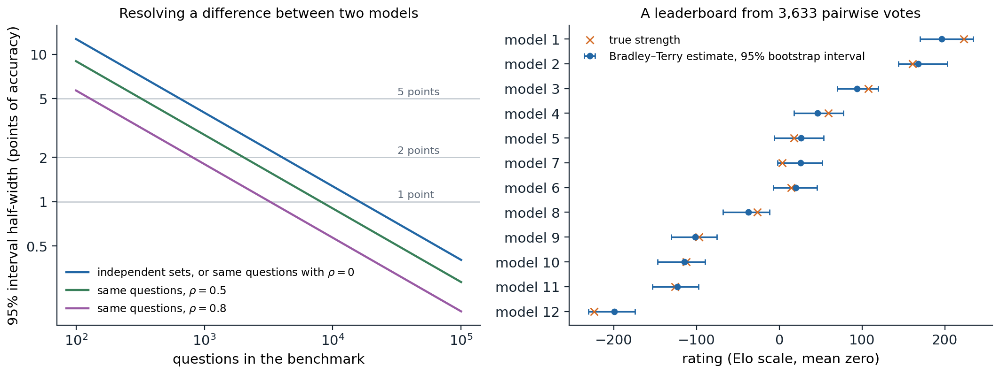

[Background Notes](../README.md) › [NLP and Large Language Models](README.md)

# 14. Evaluating Language Models

> [!WARNING]
> Work in progress: this part of the notes is still being revised.

[← 13. Retrieval, Tools, and Agents](13-retrieval-tools-and-agents.md) · [15. Machine Translation and Multilingual Models →](15-machine-translation-and-multilingual-models.md)

## <a id="what-evaluation-is-for"></a>What evaluation is for

Every chapter of this module has reported numbers: bits per character, accuracy on a benchmark, a win rate against another model. Evaluation decides which models are released, which methods are adopted, and which research directions look promising, so its errors propagate. It is also harder for language models than for the classifiers of the ML module ([ML chapter 6](../ml/06-losses-model-selection-and-evaluation.md)). A general-purpose model can be asked anything, so a benchmark samples a small part of what it can do; much of its output is open-ended text with no single correct answer; its scores depend on how it is prompted and scored; its training data may contain the test; and differences between leading models are often smaller than the noise in the measurement. This chapter covers how models are scored, what benchmarks measure and how they fail, how open-ended output is judged by people and by models, and the statistics needed to tell a real difference from noise.

## <a id="scoring-a-model"></a>Scoring a model

### <a id="likelihood"></a>Likelihood

The most direct measure of a language model is the probability it assigns to held-out text, reported as perplexity or cross-entropy ([chapter 2](02-n-gram-language-models-and-perplexity.md#held-out-likelihood)). Perplexity per token depends on the tokenizer, so models with different vocabularies are compared in **bits per byte**, the total negative log-likelihood of a text divided by its length in bytes ([chapter 1, Appendix C](01-text-tokens-and-tokenization.md#block-nlp01-appendix-c)). Held-out loss is cheap, low-noise, and available at every checkpoint, which is why scaling laws are stated in terms of it ([chapter 7](07-scaling-laws.md)), and loss on specialized text such as code or mathematics tracks the corresponding abilities within a family of models. It stops being informative after post-training: instruction tuning and preference tuning improve how useful a model is while usually worsening its perplexity on ordinary web text, because the model no longer imitates that distribution.

### <a id="multiple-choice-questions"></a>Multiple-choice questions

Many benchmarks pose multiple-choice questions, which can be scored automatically. There are two main ways to extract an answer. In the **cloze** format, the model is given the question and each option is scored by the probability of its text as a continuation, often normalized by its length in tokens or bytes, since long options have lower total probability ([chapter 9](09-in-context-learning-and-prompting.md#scoring-and-calibration)). In the **lettered** format, the options are listed with letters and the model's answer is the letter it assigns the highest probability, or the letter it generates. Small models perform near chance in the lettered format, because they have not learned to associate a letter with the option it labels, and better in the cloze format; large models do better with letters, which let them compare the options directly. Comparing models of different sizes fairly therefore requires scoring each in the format that suits it ([Gu et al., 2025](https://arxiv.org/abs/2406.08446)).

These choices change the numbers substantially. In 2023, three widely used implementations of MMLU, which differed in prompt wording, in the format, and in whether the answer was read from the letter's probability or from the probabilities of the answer texts, gave the 65-billion-parameter LLaMA scores of 63.7%, 48.8%, and 63.6%, and ranked models differently ([Fourrier et al., 2023](https://huggingface.co/blog/open-llm-leaderboard-mmlu)). Prompt wording, the number and choice of few-shot examples, and formatting details shift scores further ([chapter 9](09-in-context-learning-and-prompting.md#sensitivity-to-the-prompt)). A score is therefore a property of a model together with an evaluation protocol, and comparisons are meaningful only when the protocol is the same, which is why shared evaluation code such as the Language Model Evaluation Harness matters ([Biderman et al., 2024](https://arxiv.org/abs/2405.14782)).

### <a id="generated-answers-and-execution"></a>Generated answers and execution

For free-form answers, the model generates a response and a program extracts and checks the answer: exact match after normalization for short answers, equivalence checking for mathematical expressions, and execution for code. **HumanEval** ([Chen et al., 2021](https://arxiv.org/abs/2107.03374)) poses 164 hand-written Python functions to complete, each checked by unit tests, an average of 7.7 per problem. Execution-based checking is the most faithful automatic measure, since it tests whether the answer works rather than whether it resembles a reference, but it is only as good as the tests: problems with weak tests accept wrong solutions.

When the model samples its answers, performance with several attempts matters too, since a user or a system with a verifier can try more than once ([chapter 12](12-reasoning-and-test-time-compute.md#verifiers)). **pass@$`k`$** is the probability that at least one of $`k`$ samples solves a problem, averaged over problems. The obvious estimate, drawing $`k`$ samples per problem and recording whether any succeeded, has high variance. Chen et al. instead draw $`n\ge k`$ samples, count the $`c`$ correct ones, and estimate pass@$`k`$ by the probability that a random subset of $`k`$ of the $`n`$ samples contains at least one correct sample,

```math
\widehat{\text{pass@}k}=1-\binom{n-c}{k}\Big/\binom{n}{k},
```

which is unbiased ([Appendix A](#block-nlp14-appendix-a)). Plugging the observed success rate $`c/n`$ into $`1-(1-p)^k`$ is biased downward. The code simulates 164 problems with success rates of widely varying difficulty and 20 samples per problem.

```python
import numpy as np
from math import comb

rng = np.random.default_rng(0)
# 164 problems (like HumanEval); each has a per-sample success probability; n = 20 samples per problem.
p = rng.beta(0.4, 0.8, 164)
n = 20
c = rng.binomial(n, p)                                   # correct samples per problem


def pass_at_k_unbiased(n, c, k):                         # 1 - C(n - c, k) / C(n, k)
    return 1.0 if n - c < k else 1 - comb(n - c, k) / comb(n, k)


print(" k   true pass@k   unbiased estimate   plug-in 1-(1-c/n)^k")
for k in [1, 5, 10, 20]:
    true = np.mean(1 - (1 - p) ** k)
    unbiased = np.mean([pass_at_k_unbiased(n, ci, k) for ci in c])
    plugin = np.mean(1 - (1 - c / n) ** k)
    print(f"{k:2d} {true:13.3f} {unbiased:19.3f} {plugin:21.3f}")

# Averaged over many repetitions of the whole experiment, the unbiased estimator is right on average.
reps = []
for _ in range(200):
    cr = rng.binomial(n, p)
    reps.append([np.mean([pass_at_k_unbiased(n, ci, 10) for ci in cr]), np.mean(1 - (1 - cr / n) ** 10)])
reps = np.array(reps)
print(f"pass@10 over 200 repetitions: true {np.mean(1 - (1 - p) ** 10):.3f}, "
      f"unbiased {reps[:, 0].mean():.3f}, plug-in {reps[:, 1].mean():.3f}")
#  k   true pass@k   unbiased estimate   plug-in 1-(1-c/n)^k
#  1         0.375               0.373                 0.373
#  5         0.640               0.626                 0.612
# 10         0.718               0.697                 0.676
# 20         0.778               0.750                 0.717
# pass@10 over 200 repetitions: true 0.718, unbiased 0.718, plug-in 0.695
```

With one set of samples, both estimators fall below the true pass@10 of 0.718, but over 200 repetitions the unbiased estimator averages 0.718 while the plug-in estimate averages 0.695. The plug-in bias grows with $`k`$ relative to $`n`$, and it is not small: at $`k=20`$ its single-draw value is 6 points below the truth. Chen et al. used $`n=200`$ samples for $`k\le100`$.

## <a id="benchmarks"></a>Benchmarks

### <a id="what-benchmarks-measure"></a>What benchmarks measure

A benchmark fixes a set of tasks, a scoring rule, and usually a protocol, and it summarizes a model with a number. The most influential benchmarks for language models have tested knowledge and reasoning in forms that can be checked automatically. **MMLU** ([Hendrycks et al., 2021](https://arxiv.org/abs/2009.03300)) poses about 14,000 four-option test questions in 57 subjects, from elementary mathematics to law and medicine. **GSM8K** ([Cobbe et al., 2021](https://arxiv.org/abs/2110.14168)) poses grade-school word problems, 1,319 in its test set, and **MATH** ([Hendrycks et al., 2021](https://arxiv.org/abs/2103.03874)) poses 5,000 test problems from mathematics competitions. **GPQA** ([Rein et al., 2023](https://arxiv.org/abs/2311.12022)) poses 448 graduate-level questions in biology, physics, and chemistry, written so that experts who have or are pursuing PhDs in the field answer 65% correctly while skilled non-experts with unrestricted web access answer 34% despite spending over half an hour per question; its "Diamond" subset of 198 questions is the one usually reported. Code benchmarks check by execution, and agent benchmarks such as SWE-bench check whether realistic multi-step tasks were completed ([chapter 13](13-retrieval-tools-and-agents.md#measuring-agents)).

Suites combine many tasks. BIG-bench ([Srivastava et al., 2023](https://arxiv.org/abs/2206.04615)) collected 204 tasks from 450 authors. **HELM** ([Liang et al., 2022](https://arxiv.org/abs/2211.09110)) argued that accuracy alone is not enough and measured 30 models on seven metrics, accuracy, calibration, robustness, fairness, bias, toxicity, and efficiency, for 16 core scenarios, so that trade-offs between them are visible. A benchmark tests a sample of questions, so what it measures is the model's expected performance on the population of questions the benchmark's authors would have written, which is narrower than the ability named in its title.

### <a id="saturation-and-goodhart-s-law"></a>Saturation and Goodhart's law

Benchmarks have short lives. Plotting the progress of models on popular benchmarks from their release, [Kiela et al. (2021)](https://arxiv.org/abs/2104.14337) found that benchmarks were saturating ever faster, with human-level performance now routinely reached within a few years of release. MMLU, GSM8K, and HumanEval were near their ceilings for frontier models within three to four years of their release. A saturated benchmark stops distinguishing models, and its remaining errors are increasingly errors in the benchmark itself: a re-annotation of 5,700 MMLU questions estimated that 6.49% of all its questions contain errors, including 57% of the questions in its virology subset ([Gema et al., 2025](https://arxiv.org/abs/2406.04127)). Successors are designed to be hard for the current models: **Humanity's Last Exam** ([Phan et al., 2025](https://arxiv.org/abs/2501.14249)) collected 2,500 questions from experts across dozens of subjects, keeping only those that the best models of the time failed.

Once a benchmark is used to choose between models and methods, it is optimized against. When a measure becomes a target, it ceases to be a good measure, as the anthropologist Marilyn Strathern generalized Goodhart's law, the same effect that makes a reward model exploitable ([chapter 11](11-learning-from-human-preferences.md#goodhart-s-law)). Developers select prompts, checkpoints, and training data for their scores; papers report the benchmarks on which their method helped; and training data comes to resemble the benchmarks. Each practice is reasonable, and together they inflate scores relative to the ability the benchmark was meant to measure.

### <a id="contamination"></a>Contamination

A test question that appears in the training data measures memory rather than ability, and chapter 6 described how to detect such overlaps in the data and how documents are excluded from training ([chapter 6](06-pretraining-data.md#test-set-contamination)). The effect on scores can be measured by writing new questions. **GSM1k** ([Zhang et al., 2024](https://arxiv.org/abs/2405.00332)) is a set of 1,205 new grade-school problems written to match GSM8K in style and difficulty. Some models' accuracy dropped by up to 8% relative to GSM8K; the gap was largest in some families of open models, such as the Phi and Mistral families, and small for most frontier models; and across models, the gap grew with the probability that a model assigned to GSM8K's own test problems, a sign of memorization.

When the training data is not available, contamination can sometimes still be tested. Examples in a benchmark are **exchangeable**: any ordering of them is equally likely a priori, so a model that has not seen the benchmark should assign the same probability to the published order as to shuffled ones. A model that assigns the published order a higher probability than almost all shuffles has seen the file ([Oren et al., 2024](https://arxiv.org/abs/2310.17623)). The most robust defense is to evaluate on questions that did not exist when the model was trained. **LiveCodeBench** ([Jain et al., 2024](https://arxiv.org/abs/2403.07974)) continuously collects problems from programming contests with their release dates, so models can be evaluated on problems released after their training cutoff; one open code model's performance dropped sharply on problems released after its training data was collected. Private test sets, held by an evaluator and never published, serve the same purpose, at the cost of trusting the evaluator.

## <a id="judging-open-ended-output"></a>Judging open-ended output

### <a id="reference-based-metrics"></a>Reference-based metrics

For summaries, translations, and answers written in prose, there is no single correct output. Classical metrics compare the output with one or more human-written references by n-gram overlap: BLEU for translation ([chapter 15](15-machine-translation-and-multilingual-models.md)) and ROUGE, based on recall of reference n-grams, for summarization. They correlate reasonably with human judgments when comparing systems of similar kinds on tasks where good outputs look alike, and poorly for open-ended generation, where a good answer can share few words with the reference. **BERTScore** ([Zhang et al., 2020](https://arxiv.org/abs/1904.09675)) matches each token of the output to its most similar token of the reference by cosine similarity of contextual embeddings, which credits paraphrases, and learned metrics trained on human ratings go further. All reference-based metrics are limited by their references: an answer better than the reference, or correct in a different way, is penalized.

### <a id="human-evaluation"></a>Human evaluation

People remain the standard for open-ended quality, and human judgments are the data that preference tuning learns from ([chapter 11](11-learning-from-human-preferences.md)). Comparing two outputs side by side is more reliable than rating one on an absolute scale, since raters disagree about what a 4 out of 5 means but agree more on which of two is better. Agreement is still far from perfect: the labelers who produced InstructGPT's comparisons agreed with each other on 72.6% of pairs ([Ouyang et al., 2022](https://arxiv.org/abs/2203.02155)). Human judgments also have biases that matter when models are optimized against them. Raters rarely check facts, and more assertive answers are perceived as containing fewer factual errors, so preference scores underweight factuality ([Hosking, Blunsom, and Bartolo, 2024](https://arxiv.org/abs/2309.16349)); longer and more detailed answers are preferred, up to a point, even when the extra length adds nothing. And evaluating expert-level output requires experts, which is expensive and slow.

### <a id="language-models-as-judges"></a>Language models as judges

A strong language model can compare or grade responses given the question, the responses, and a rubric, at a small fraction of the cost of people. [Zheng et al. (2023)](https://arxiv.org/abs/2306.05685) introduced **MT-Bench**, 80 multi-turn questions in eight categories judged by GPT-4, and found that its judgments agreed with those of experts and of crowd workers over 80% of the time, the same level at which people agreed with each other. They also documented the judge's biases. **Position bias** favors the response in one position, usually the first, **verbosity bias** favors longer responses, and **self-enhancement bias** favors responses from the judge's own model. The standard mitigations are to judge each pair in both orders and count only consistent verdicts, to give the judge a reference answer or a detailed rubric, and to correct for length statistically. **Length-controlled AlpacaEval** ([Dubois et al., 2024](https://arxiv.org/abs/2404.04475)) fits a regression of the judge's preference on the length difference and reports the win rate the model would have if its responses were as long as the baseline's, which raised the rank correlation of the benchmark with human votes in Chatbot Arena from 0.94 to 0.98. Model judges are least reliable where they are most needed: on questions at the edge of their own ability, on subtle factual errors, and on outputs optimized against a similar judge.

### <a id="pairwise-comparisons-and-ratings"></a>Pairwise comparisons and ratings

**Chatbot Arena** (now LMArena; [Chiang et al., 2024](https://arxiv.org/abs/2403.04132)) turns crowdsourced comparisons into a leaderboard. Users submit their own prompts, see responses from two anonymous models, and vote for the better one; by early 2024 it had collected over 240,000 votes. Because the prompts come from users rather than a fixed test set, the evaluation is hard to contaminate and covers what people actually ask, though the users are a particular population and their votes reward style as well as substance. Ratings are fitted with the Bradley–Terry model of [chapter 11](11-learning-from-human-preferences.md#the-bradleyterry-model): model $`i`$ has a strength $`s_i`$, and it beats model $`j`$ with probability $`\sigma(s_i-s_j)`$. Chess's **Elo** system estimates the same model online, nudging both players' ratings after each game in proportion to how surprising the result was. Online updates depend on the order of the games and weight recent games more heavily, which suits players whose strength changes, but a model's strength is fixed, so the Arena switched to fitting all votes at once by maximum likelihood, reported on the Elo scale ([Appendix C](#block-nlp14-appendix-c)). The code compares the two on 24,936 simulated votes among six models, presented in five different random orders.

```python
import numpy as np

rng = np.random.default_rng(0)
M = 6
true = np.array([1.0, 0.6, 0.3, 0.0, -0.4, -1.5])        # strengths on the logit scale
scale = 400 / np.log(10)                                 # logit units to Elo points
true_elo = (true - true.mean()) * scale
i, j = rng.integers(M, size=(2, 30000))
keep = i != j
i, j = i[keep], j[keep]
y = (rng.random(len(i)) < 1 / (1 + np.exp(-(true[i] - true[j])))).astype(float)   # 1 if i won


def online_elo(i, j, y, K):
    r = np.zeros(M)
    for a, b, w in zip(i, j, y):
        e = 1 / (1 + 10 ** ((r[b] - r[a]) / 400))        # expected score of a
        r[a] += K * (w - e)
        r[b] -= K * (w - e)
    return r - r.mean()


def bradley_terry(i, j, y, steps=25):
    """Maximum likelihood by Newton's method; the result does not depend on the order of the votes."""
    X = np.zeros((len(i), M))
    X[np.arange(len(i)), i], X[np.arange(len(i)), j] = 1, -1
    s = np.zeros(M)
    for _ in range(steps):
        p = 1 / (1 + np.exp(-X @ s))
        H = X.T @ (X * (p * (1 - p))[:, None]) + 1e-6 * np.eye(M)
        s += np.linalg.solve(H, X.T @ (y - p))
    return (s - s.mean()) * scale


print(f"{len(i):,} votes; true ratings", np.round(true_elo).astype(int))
print("method              RMS error   spread over 5 vote orders")
for name, fit in [("online Elo, K=4", lambda o: online_elo(i[o], j[o], y[o], 4)),
                  ("online Elo, K=32", lambda o: online_elo(i[o], j[o], y[o], 32)),
                  ("Bradley-Terry MLE", lambda o: bradley_terry(i[o], j[o], y[o]))]:
    runs = np.array([fit(rng.permutation(len(i))) for _ in range(5)])
    rms = np.sqrt(((runs - true_elo) ** 2).mean())
    print(f"{name:18s} {rms:9.1f} {runs.std(0).mean():14.1f}")
# 24,936 votes; true ratings [ 174  104   52    0  -69 -261]
# method              RMS error   spread over 5 vote orders
# online Elo, K=4         16.7           12.0
# online Elo, K=32        50.7           42.8
# Bradley-Terry MLE        3.7            0.0
```

With the step size $`K=32`$ used in chess, online Elo misplaces the models by about 51 rating points (root mean square), and its ratings vary with a standard deviation of about 43 points depending on the order of the votes, enough to swap neighbors on a leaderboard; with $`K=4`$ it is better but still depends on the order. The maximum-likelihood fit has an error of about 4 points, and its answer does not depend on the order.

Leaderboards built from votes have their own vulnerabilities. [Singh et al. (2025)](https://arxiv.org/abs/2504.20879) documented that some providers tested many private variants on the Arena before a release, 27 in one case, and published only the best score. Selecting the best of many noisy measurements inflates it: the largest of 27 independent estimates of equally strong variants exceeds their common strength by about two standard errors on average. They also found large asymmetries in data access, with two leading proprietary providers receiving an estimated 19.2% and 20.4% of all Arena data, against 29.7% for 83 open-weight models combined, data that can be used to train toward the Arena's users.

## <a id="the-statistics-of-evaluation"></a>The statistics of evaluation

### <a id="standard-errors"></a>Standard errors

A benchmark score is an average over a sample of questions, so it has sampling error, and the question is whether it is smaller than the differences being claimed. Regard the $`n`$ questions as drawn from a large population of possible questions, and let $`x_i`$ be the score on question $`i`$, 1 or 0 for accuracy. The standard error of the mean score is $`\sqrt{\hat p(1-\hat p)/n}`$ for accuracy $`\hat p`$, and a 95% confidence interval is about the score plus or minus two standard errors ([Miller, 2024](https://arxiv.org/abs/2411.00640)). For a model near 70% accuracy, that is ±7.0 points on HumanEval's 164 problems, ±2.5 points on GSM8K's 1,319, and ±0.8 points on MMLU's 14,042. Differences between models of a point or two on a benchmark of a few hundred questions are within the noise.

When the model samples its answers, each question's score is itself random, and the variance of the mean has two parts: the variation between questions and the sampling variation within each question. Averaging several samples per question, or using the model's probability of the correct answer instead of a single sampled answer, removes much of the second part. Setting the temperature to zero also removes it, but changes the quantity being measured, from the model's typical performance to the performance of its most probable output.

### <a id="clustered-questions"></a>Clustered questions

The formula assumes the questions are independent. Many benchmarks group questions: several questions about the same passage in reading comprehension, several problems generated from the same template, several test cases of the same program. Questions in a group tend to be answered correctly or incorrectly together, so the benchmark contains less independent information than its size suggests, and the naive standard error is too small. The **clustered standard error** sums the residuals within each group before squaring, so correlation within groups counts ([Appendix B](#block-nlp14-appendix-b)). The code simulates a benchmark of 1,000 questions in 200 groups of five that share a passage, whose difficulty affects all five questions, answered by two models whose abilities differ, and compares the standard errors with the actual spread of scores over 2,000 independently drawn benchmarks.

```python
import numpy as np

rng = np.random.default_rng(0)
n_passages, per = 200, 5                                 # 1,000 questions in groups that share a passage
skill = {"A": 0.3, "B": 0.5}                             # the models' abilities on a logit scale
passage_of = np.repeat(np.arange(n_passages), per)


def benchmark():
    """Draw a benchmark: difficulty = passage effect + question effect; each model answers every question."""
    difficulty = rng.normal(0, 1.2, n_passages)[passage_of] + rng.normal(0, 1.0, n_passages * per)
    return {m: (rng.random(len(difficulty)) < 1 / (1 + np.exp(difficulty - s))).astype(float) for m, s in skill.items()}


def se_naive(x):
    return x.std(ddof=1) / np.sqrt(len(x))


def se_clustered(x):                                    # sums of residuals within each passage
    r = np.bincount(passage_of, x - x.mean())
    return np.sqrt((r ** 2).sum()) / len(x)


res = benchmark()
a, b = res["A"], res["B"]
print(f"accuracy A {a.mean():.3f}, B {b.mean():.3f}, difference {b.mean() - a.mean():+.3f}")
print(f"standard error of A: naive {se_naive(a):.4f}, clustered {se_clustered(a):.4f}")
print(f"standard error of the difference: unpaired {np.hypot(se_naive(a), se_naive(b)):.4f}, "
      f"paired {se_naive(b - a):.4f}, paired and clustered {se_clustered(b - a):.4f}")

# The true variability, from 2,000 independent benchmarks drawn the same way.
sims = [benchmark() for _ in range(2000)]
print(f"actual spread over benchmarks: accuracy of A {np.std([s['A'].mean() for s in sims]):.4f}, "
      f"difference {np.std([s['B'].mean() - s['A'].mean() for s in sims]):.4f}")
# accuracy A 0.588, B 0.612, difference +0.024
# standard error of A: naive 0.0156, clustered 0.0194
# standard error of the difference: unpaired 0.0219, paired 0.0186, paired and clustered 0.0186
# actual spread over benchmarks: accuracy of A 0.0204, difference 0.0187
```

The naive standard error of model A's accuracy, 0.0156, understates the actual spread, 0.0204, by a quarter; the clustered estimate, 0.0194, is close. The comparison between the models shows the other side.

### <a id="paired-comparisons"></a>Paired comparisons

Two models evaluated on the same questions are not independent samples. Questions that are hard for one model tend to be hard for the other, so their per-question scores are positively correlated, and the variance of the difference in their mean scores is

```math
\operatorname{Var}(\bar x_B-\bar x_A)=\frac{\sigma_A^2+\sigma_B^2-2\rho\,\sigma_A\sigma_B}{n},
```

where $`\rho`$ is the correlation of their per-question scores. Computing the standard error from the per-question differences $`x_{B,i}-x_{A,i}`$ uses this correlation automatically. In the simulation, the unpaired standard error of the difference is 0.0219 and the paired one 0.0186, which matches the actual spread of 0.0187. The shared passage difficulty that inflated each model's own standard error cancels in the difference, so clustering no longer matters. The observed difference of 2.4 points is 1.3 paired standard errors, not significant at the 5% level even though the models do differ in ability.



*Left: the half-width of a 95% confidence interval for the difference in accuracy between two models near 70%, as a function of the number of questions. Pairing on the same questions narrows the interval by a factor $`\sqrt{1-\rho}`$; with $`\rho=0.5`$, the interval for the difference is as narrow as that for a single model's accuracy, ±7.0 points instead of ±9.9 at 164 questions, ±2.5 instead of ±3.5 at 1,319, and ±0.76 instead of ±1.07 at 14,042. Right: a simulated leaderboard of 12 models fitted with Bradley–Terry from 3,633 random pairwise votes, with 95% intervals from 200 bootstrap resamples of the votes. The estimated ranking correlates 0.993 with the true one, but the intervals average 57 rating points wide and 7 of the 11 adjacent pairs overlap.*

The figure summarizes the sample sizes involved. Resolving a one-point difference between two models requires thousands of questions even with pairing, which is more than most benchmarks contain. The same holds for leaderboards built from votes: a ranking can be right on average and still leave most neighboring positions uncertain, so rankings should be reported with intervals, and ties between models whose intervals overlap should be read as ties.

### <a id="reporting-results"></a>Reporting results

Good practice follows from the rest of the chapter. Report the protocol: the prompt, the number of few-shot examples, the scoring method, the decoding settings, and the code. Report standard errors or confidence intervals, clustered when questions are grouped and paired when models are compared on the same questions, and plan the size of an evaluation from the difference it must detect, a **power analysis**. Evaluate on data the model cannot have trained on, when possible. Avoid selecting prompts, checkpoints, or seeds on the test set, and when many comparisons are made, expect some to look significant by chance. Evaluate more than one property, since accuracy on a benchmark says nothing about calibration, robustness, cost, or safety. Evaluations of dangerous capabilities and of whether models behave as intended, which inform decisions about deploying frontier models, are a subject of the Safety and Frontier module.

## <a id="appendices"></a>Appendices


<details>
<summary><a id="block-nlp14-appendix-a"></a><b>A. The unbiased pass@k estimator</b></summary>


Fix a problem on which each sample succeeds independently with probability $`p`$, so pass@$`k`$ for this problem is $`1-(1-p)^k`$. Draw $`n\ge k`$ samples, of which $`c`$ are correct, and consider a subset $`S`$ of $`k`$ of them chosen uniformly at random. Given the samples, the probability that $`S`$ contains no correct sample is $`\binom{n-c}{k}/\binom{n}{k}`$, the number of all-wrong subsets over the number of subsets. Unconditionally, $`S`$ is a set of $`k`$ independent samples, so the probability that all are wrong is $`(1-p)^k`$. By the law of total expectation,

```math
\mathbb E\Bigl[\binom{n-c}{k}\Big/\binom{n}{k}\Bigr]=(1-p)^k,
```

so $`1-\binom{n-c}{k}/\binom{n}{k}`$ is an unbiased estimate of pass@$`k`$, and averaging over problems keeps it unbiased. It uses all $`n`$ samples, which gives it a smaller variance than the indicator of whether $`k`$ fresh samples contain a success, whose expectation is the same. The plug-in estimate $`1-(1-c/n)^k`$ is biased downward: $`u\mapsto(1-u)^k`$ is convex, so by Jensen's inequality $`\mathbb E[(1-c/n)^k]\ge(1-p)^k`$, with equality only for $`k=1`$. For numerical stability with large $`n`$, the ratio of binomial coefficients is computed as a product, $`\binom{n-c}{k}/\binom{n}{k}=\prod_{i=n-c+1}^{n}(1-k/i)`$ when $`n-c\ge k`$, and it is zero otherwise.

</details>


<details>
<summary><a id="block-nlp14-appendix-b"></a><b>B. Clustered and paired standard errors</b></summary>


**Clustered.** Let the $`n`$ questions fall into groups $`g=1,\dots,G`$, write $`x_i`$ for the score on question $`i`$ and $`\bar x`$ for the mean, and assume that groups are independent while questions within a group may be correlated. The variance of $`\bar x=\frac1n\sum_g\sum_{i\in g}x_i`$ is $`\frac1{n^2}\sum_g\operatorname{Var}\bigl(\sum_{i\in g}x_i\bigr)`$, and the clustered, or sandwich, estimate replaces each group's variance by its squared summed residual:

```math
\widehat{\operatorname{SE}}_{\text{cluster}}=\frac1n\sqrt{\sum_{g=1}^G\Bigl(\sum_{i\in g}(x_i-\bar x)\Bigr)^2}.
```

When all groups have size $`m`$ and questions in a group have correlation $`\rho_{\mathrm{c}}`$, the variance is larger than under independence by the **design effect** $`1+(m-1)\rho_{\mathrm{c}}`$. In the chapter's simulation the clustered standard error is 1.24 times the naive one, a design effect of about 1.55, which with $`m=5`$ corresponds to $`\rho_{\mathrm c}\approx0.14`$. The estimate needs enough groups to be reliable, a few dozen at least.

**Paired.** For two models scored on the same questions, $`\bar x_B-\bar x_A`$ is the mean of the per-question differences $`d_i=x_{B,i}-x_{A,i}`$, so its standard error is the standard deviation of the $`d_i`$ over $`\sqrt n`$, and it can be clustered in the same way. Expanding $`\operatorname{Var}(d_i)=\sigma_A^2+\sigma_B^2-2\operatorname{Cov}(x_A,x_B)`$ gives the formula in the text; with equal variances the paired variance is a fraction $`1-\rho`$ of the unpaired one. If a shared effect such as a group's difficulty shifts both models' probability of success similarly, it largely cancels in $`d_i`$, which is why pairing also reduced the need for clustering in the simulation. A paired test of whether two models differ is then a $`t`$ or $`z`$ test on the $`d_i`$; for accuracy it is equivalent to comparing the numbers of questions that only $`A`$ and only $`B`$ answer correctly, McNemar's test.

</details>


<details>
<summary><a id="block-nlp14-appendix-c"></a><b>C. Bradley–Terry, Elo, and online updates</b></summary>


In the Bradley–Terry model, model $`i`$ beats model $`j`$ with probability $`\sigma(s_i-s_j)`$. Given comparisons $`(i_t,j_t,y_t)`$ with $`y_t=1`$ if $`i_t`$ won, the maximum-likelihood strengths maximize $`\sum_t\bigl[y_t\log\sigma(s_{i_t}-s_{j_t})+(1-y_t)\log\sigma(s_{j_t}-s_{i_t})\bigr]`$, a logistic regression whose features are $`+1`$ for $`i_t`$ and $`-1`$ for $`j_t`$. The strengths are determined up to an additive constant, fixed by setting their mean to zero, and the maximum is finite and unique if, for every division of the models into two nonempty groups, some model in each group has beaten some model in the other; otherwise the strengths of an undefeated group diverge, which a small ridge penalty prevents. The Elo scale multiplies strengths by $`400/\ln10\approx173.7`$, so that a difference of 400 points means odds of 10 to 1.

The Elo update after a game between $`a`$ and $`b`$ with result $`y\in\{0,1\}`$ for $`a`$ is $`r_a\leftarrow r_a+K(y-E)`$, $`r_b\leftarrow r_b-K(y-E)`$, with $`E=1/(1+10^{(r_b-r_a)/400})`$ the expected score of $`a`$. In the strength units of the model, the gradient of the log-likelihood of that one game with respect to $`s_a`$ is $`y-\sigma(s_a-s_b)=y-E`$, so the Elo update is a step of stochastic gradient ascent on the Bradley–Terry likelihood with a constant step size. Stochastic gradient descent with a constant step does not converge: the ratings keep fluctuating around the maximum-likelihood values with a spread that grows with $`K`$, and they depend on the order of the games, with recent games weighted most. A decreasing step size, or equivalently refitting on all games, removes both effects. Confidence intervals for the fitted strengths come from the observed information matrix, the Hessian of the negative log-likelihood, or from a bootstrap that resamples the votes and refits, which also gives intervals for ranks.

</details>

---

[← 13. Retrieval, Tools, and Agents](13-retrieval-tools-and-agents.md) · [15. Machine Translation and Multilingual Models →](15-machine-translation-and-multilingual-models.md)
