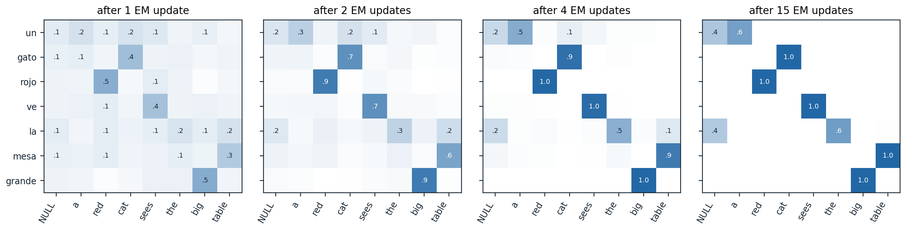

[Background Notes](../README.md) › [NLP and Large Language Models](README.md)

# 15. Machine Translation and Multilingual Models

[← 14. Evaluating Language Models](14-evaluating-language-models.md) · [16. Syntactic Parsing →](16-syntactic-parsing.md)

## <a id="translation"></a>Translation

### <a id="a-hard-problem-with-a-long-history"></a>A hard problem with a long history

Machine translation was one of the first applications proposed for computers and has driven much of the field's methodology since. The 1954 Georgetown–IBM demonstration translated about sixty carefully chosen Russian sentences into English with six rules and a vocabulary of 250 words, and predictions that the problem would be solved within a few years followed. It was not: the 1966 ALPAC report concluded that machine translation was slower, less accurate, and more expensive than human translation, and funding for it in the United States nearly stopped for a decade ([Hutchins, 2004](https://aclanthology.org/2004.amta-papers.12/)). The rule-based systems that followed encoded dictionaries and grammars by hand. From about 1990, statistical systems learned translation from collections of translated text; from 2014, neural networks replaced them, and in September 2016 Google Translate switched its Chinese-to-English translations to a neural system; today, general-purpose language models translate among many languages as one of their abilities.

The difficulty lies in how differently languages express the same meaning. Word order differs: English puts adjectives before nouns and Spanish mostly after; German puts some verbs at the end of the clause; Japanese puts the verb last and marks roles with particles. Languages mark different things: Spanish adjectives agree with their noun's gender, Turkish expresses in one word with many suffixes what English expresses in a phrase, and Chinese does not mark tense on verbs. Words are ambiguous in ways the other language resolves differently, idioms do not translate word for word, and pronouns, formality, and gender often depend on context outside the sentence. This chapter follows the three main approaches in turn, statistical, neural, and multilingual, together with the problem of evaluating translations. Since translation is the task for which the encoder–decoder model and attention were invented, it also shows where much of the machinery of the earlier chapters came from.

### <a id="the-noisy-channel"></a>The noisy channel

Statistical translation began with the noisy-channel model of [chapter 2](02-n-gram-language-models-and-perplexity.md#the-noisy-channel). To translate a foreign sentence $`f`$ into English, pretend that $`f`$ was produced by corrupting an English sentence $`e`$, and recover the most probable original:

```math
\hat e=\arg\max_eP(e\mid f)=\arg\max_eP(f\mid e)\,P(e).
```

The decomposition divides the work. The **translation model** $`P(f\mid e)`$ ensures that the words of $`e`$ account for those of $`f`$, and it can be learned from translated sentence pairs; it does not need to produce fluent English, because the **language model** $`P(e)`$, learned from much larger amounts of English alone, rewards fluent candidates. The idea of combining a model of adequacy with a model of fluency, trained on different data, survived into later systems in other forms.

## <a id="statistical-translation"></a>Statistical translation

### <a id="word-alignment"></a>Word alignment

A collection of sentences with their translations, a **parallel corpus**, does not say which words translate which. Parliamentary proceedings of Canada and of the European Union, published in several languages, supplied the early corpora. A **word alignment** links each word of the foreign sentence to the English word, or words, it translates, and some foreign words to none. If the alignments were known, translation probabilities could be estimated by counting; if the translation probabilities were known, the most probable alignments could be computed. Expectation–maximization ([ML chapter 14](../ml/14-gaussian-mixtures-and-expectation-maximization.md)) resolves the circularity by treating alignments as latent variables.

### <a id="ibm-model-1"></a>IBM Model 1

The IBM models ([Brown et al., 1993](https://aclanthology.org/J93-2003/)) are a series of five translation models of increasing detail. The simplest, **Model 1**, generates a foreign sentence $`f_1,\dots,f_m`$ from an English sentence $`e_1,\dots,e_l`$ as follows: for each position $`j`$, choose an English position $`a_j\in\{0,1,\dots,l\}`$ uniformly, where position 0 is a special NULL word that accounts for foreign words with no counterpart, and generate $`f_j`$ with probability $`t(f_j\mid e_{a_j})`$. The only parameters are the word translation probabilities $`t(f\mid e)`$. Since each foreign word's alignment is chosen independently, the posterior over alignments factorizes over positions:

```math
P(a_j=i\mid e,f)=\frac{t(f_j\mid e_i)}{\sum_{i'=0}^{l}t(f_j\mid e_{i'})}.
```

EM alternates between computing these posteriors, adding them up as expected counts of how often each English word generated each foreign word, and renormalizing the counts into new translation probabilities ([Appendix A](#block-nlp15-appendix-a)). The code applies it to 300 sentence pairs generated from a toy grammar of English and Spanish, in which Spanish adjectives follow their nouns and articles and adjectives agree with the noun's gender.

```python
import numpy as np
from collections import defaultdict

rng = np.random.default_rng(0)
# A toy English-Spanish corpus. Spanish puts adjectives after nouns, and articles and adjectives agree in gender.
nouns = {"house": ("casa", "f"), "dog": ("perro", "m"), "cat": ("gato", "m"), "book": ("libro", "m"),
         "woman": ("mujer", "f"), "car": ("coche", "m"), "table": ("mesa", "f"), "man": ("hombre", "m")}
adjs = {"red": ("rojo", "roja"), "small": ("pequeño", "pequeña"), "old": ("viejo", "vieja"),
        "white": ("blanco", "blanca"), "new": ("nuevo", "nueva"), "big": ("grande", "grande")}
arts = {"the": {"m": "el", "f": "la"}, "a": {"m": "un", "f": "una"}}
verbs = {"sees": "ve", "has": "tiene", "wants": "quiere", "buys": "compra"}


def noun_phrase():
    art, noun = rng.choice(list(arts)), rng.choice(list(nouns))
    es_noun, g = nouns[noun]
    en, es = [art], [arts[art][g]]
    if rng.random() < 0.5:
        adj = rng.choice(list(adjs))
        en.append(adj)
        return en + [noun], es + [es_noun, adjs[adj][g == "f"]]
    return en + [noun], es + [es_noun]


def sentence():
    (e1, s1), (e2, s2), verb = noun_phrase(), noun_phrase(), rng.choice(list(verbs))
    return e1 + [verb] + e2, s1 + [verbs[verb]] + s2


corpus = [sentence() for _ in range(300)]
print(" ".join(corpus[0][0]), "->", " ".join(corpus[0][1]))

# IBM Model 1: every Spanish word is generated by one English word (or NULL), chosen uniformly.
V = len({f for _, es in corpus for f in es})
t = defaultdict(lambda: 1 / V)                           # t[f, e] = P(Spanish word f | English word e), uniform start
for it in range(1, 16):
    count, total, loglik = defaultdict(float), defaultdict(float), 0.0
    for en, es in corpus:
        en = ["NULL"] + en
        for f in es:                                     # E-step: posterior over which English word generated f
            probs = np.array([t[f, e] for e in en])
            loglik += np.log(probs.mean())
            for e, p in zip(en, probs / probs.sum()):
                count[f, e] += p
                total[e] += p
    t = defaultdict(float, {(f, e): c / total[e] for (f, e), c in count.items()})   # M-step: normalize counts
    if it in (1, 2, 5, 15):
        print(f"iteration {it:2d}: log-likelihood per Spanish word before the update "
              f"{loglik / sum(len(s) for _, s in corpus):.3f}")

for e in ["house", "the", "red", "big", "sees"]:
    best = sorted(((p, f) for (f, e2), p in t.items() if e2 == e), reverse=True)[:3]
    print(f"t(. | {e}):", ", ".join(f"{f} {p:.2f}" for p, f in best))

en, es = "a red cat sees the big table".split(), "un gato rojo ve la mesa grande".split()
align = [max(["NULL"] + en, key=lambda e: t[f, e]) for f in es]
print("alignment:", ", ".join(f"{f}-{e}" for f, e in zip(es, align)))
# a small car sees the house -> un coche pequeño ve la casa
# iteration  1: log-likelihood per Spanish word before the update -3.296
# iteration  2: log-likelihood per Spanish word before the update -2.743
# iteration  5: log-likelihood per Spanish word before the update -2.088
# iteration 15: log-likelihood per Spanish word before the update -2.000
# t(. | house): casa 0.97, una 0.01, la 0.01
# t(. | the): el 0.59, la 0.41, mesa 0.00
# t(. | red): rojo 0.56, roja 0.44, la 0.00
# t(. | big): grande 1.00, el 0.00, la 0.00
# t(. | sees): ve 1.00, un 0.00, el 0.00
# alignment: un-a, gato-cat, rojo-red, ve-sees, la-the, mesa-table, grande-big
```

Starting from uniform probabilities, EM learns that *house* translates as *casa* and *sees* as *ve*, and that *the* translates as *el* or *la* in proportion to how often masculine and feminine nouns follow it; the adjectives split the same way between their two forms. The model never sees an alignment, yet it aligns a new sentence correctly despite the reversed order of noun and adjective, because it ignores word order entirely: co-occurrence across many sentences is enough. The figure shows the alignment posteriors forming.



*Posterior alignment probabilities $`P(a_j=i\mid e,f)`$ for the pair "a red cat sees the big table" and "un gato rojo ve la mesa grande", after 1, 2, 4, and 15 EM updates on the 300-pair corpus of the code; each row sums to one, and values of at least 0.1 are printed. After one update the content words already lean toward their translations ($`P`$(gato ↔ cat) = 0.43), after four they are nearly certain (0.94), and after fifteen they are certain. The articles "un" and "la" remain split between their English articles and NULL (0.64 for la ↔ the), since NULL generates frequent function words in every sentence.*

Model 1 is too crude for translation on its own. It assigns the same probability to every ordering of the foreign words, so it cannot distinguish a translation from a scrambled one; its log-likelihood is concave in $`t`$, which makes EM reach a global maximum, but not strictly concave, so the maximizing parameters need not be unique and the starting point still matters in practice ([Toutanova and Galley, 2011](https://aclanthology.org/P11-2081/)). The higher models add what it lacks: Model 2 makes the alignment depend on positions, Models 3 to 5 add **fertility**, the number of foreign words an English word produces, and a model of reordering; and the **HMM alignment model** ([Vogel, Ney, and Tillmann, 1996](https://aclanthology.org/C96-2141/)) makes each alignment depend on the previous one, favoring alignments that move in small jumps. Model 1 remained useful to initialize them, and the GIZA++ implementation of this cascade ([Och and Ney, 2003](https://aclanthology.org/J03-1002/)) was the standard word aligner for more than a decade.

### <a id="phrase-based-translation"></a>Phrase-based translation

Translating word by word fails on idioms, on words that translate as several words, and on local reordering. **Phrase-based translation** ([Koehn, Och, and Marcu, 2003](https://aclanthology.org/N03-1017/)) translates contiguous sequences of words instead. Word alignments are computed in both directions and combined, and every pair of phrases consistent with them, meaning that no word inside either phrase is aligned to a word outside the other, is extracted into a **phrase table** with translation probabilities estimated by relative frequency. A translation is scored by a **log-linear model** that adds weighted feature scores: the phrase translation probabilities in both directions, the language model, a penalty or reward for reordering, and a count of words and phrases. The weights are tuned to maximize BLEU on held-out data, a procedure called **minimum error rate training** ([Och, 2003](https://aclanthology.org/P03-1021/)). The noisy channel is the special case with two features, $`\log P(f\mid e)`$ and $`\log P(e)`$, and unit weights. Decoding searches over segmentations, phrase translations, and orders with a beam search that builds the translation left to right and compares partial translations using an estimate of the cost of translating the rest of the sentence. Phrase-based systems, many built with the open-source Moses toolkit ([Koehn et al., 2007](https://aclanthology.org/P07-2045/)), were the state of the art from the mid-2000s until neural translation replaced them.

## <a id="neural-machine-translation"></a>Neural machine translation

### <a id="encoderdecoder-translation"></a>Encoder–decoder translation

Neural translation models $`P(e\mid f)`$ directly, generating the translation one token at a time from a representation of the source. The encoder–decoder architecture ([DL chapter 8](../dl/08-recurrent-networks.md#stacking-bidirectionality-and-encoderdecoder-models)) was introduced for translation: [Sutskever, Vinyals, and Le (2014)](https://arxiv.org/abs/1409.3215) reached 34.8 BLEU on a standard English-to-French test set with an ensemble of deep LSTMs, above the 33.3 of a phrase-based system, and found that reversing the order of the source words helped markedly, because it placed the beginning of the source near the beginning of the output. Attention ([DL chapter 9](../dl/09-attention-and-transformers.md#attention-in-encoderdecoder-models)) removed the bottleneck of a single vector for the whole source and learned soft alignments like those of the IBM models without being told about them. Google's production system, an eight-layer LSTM encoder–decoder with attention, reduced translation errors by an average of 60% against its phrase-based system in side-by-side human evaluations on isolated simple sentences ([Wu et al., 2016](https://arxiv.org/abs/1609.08144)). The transformer was also introduced as a translation model: it reached 28.4 BLEU on English-to-German, more than 2 points above the best previous results, including ensembles, and 41.8 on English-to-French ([Vaswani et al., 2017](https://arxiv.org/abs/1706.03762)).

Several techniques now used throughout the field came from translation. Byte-pair encoding was introduced to translate rare words and names as sequences of subword units ([Sennrich, Haddow, and Birch, 2016](https://arxiv.org/abs/1508.07909); [chapter 1](01-text-tokens-and-tokenization.md#byte-pair-encoding)). Beam search with length normalization became the standard decoder ([chapter 8](08-decoding-and-text-generation.md#greedy-and-beam-search)), and translation is the task on which it works best, since a translation is nearly determined by its source. [Koehn and Knowles (2017)](https://arxiv.org/abs/1706.03872) listed the weaknesses of early neural systems: poor performance outside the training domain and with little training data, rare words, long sentences, unreliable attention as an alignment, and translations that got worse with larger beams. Most have been reduced by scale, subwords, and better training, but low-resource translation remains hard.

### <a id="monolingual-data-and-back-translation"></a>Monolingual data and back-translation

Parallel text is scarce compared with monolingual text, and the noisy channel's language model was the way statistical systems used the latter. Neural systems use it through **back-translation** ([Sennrich, Haddow, and Birch, 2016](https://arxiv.org/abs/1511.06709)): to improve translation from $`f`$ into $`e`$, translate monolingual text in $`e`$ into $`f`$ with a reverse model, and add the synthetic pairs, a machine-translated source with a human-written target, to the training data. The model learns to produce fluent human text from imperfect inputs, and the gains were 2.8 to 3.7 BLEU between English and German. How the synthetic sources are produced matters: sampling from the reverse model or adding noise to its beam-search outputs works better than beam search alone, except in low-resource settings, because the more varied sources carry a stronger training signal ([Edunov et al., 2018](https://arxiv.org/abs/1808.09381)). Iterating back-translation in both directions, starting from a word-by-word translation built from aligned embedding spaces and combined with training to reconstruct corrupted sentences, even yields translation systems from monolingual data alone, with no parallel text at all ([Lample et al., 2018](https://arxiv.org/abs/1711.00043); [Artetxe et al., 2018](https://arxiv.org/abs/1710.11041)).

### <a id="translation-by-language-models"></a>Translation by language models

General-purpose language models translate when asked, with no translation-specific training beyond what their data contained, and they can use instructions and context: a glossary, the rest of a document, the desired level of formality. Evaluations of GPT models found them very competitive with commercial systems for high-resource languages and limited for low-resource ones ([Hendy et al., 2023](https://arxiv.org/abs/2302.09210)). In the general translation task of the 2024 Workshop on Machine Translation, whose findings were titled "the LLM era is here but MT is not solved yet," the best system overall was a general-purpose language model, winning 9 of 11 language pairs in human evaluation, and human reference translations were still among the best systems in 7 of the 11 ([Kocmi et al., 2024](https://aclanthology.org/2024.wmt-1.1/)). Remaining difficulties include low-resource languages, specialized domains, document-level consistency, and evaluation itself.

## <a id="evaluating-translation"></a>Evaluating translation

### <a id="bleu-and-chrf"></a>BLEU and chrF

Human judgment of translations is slow and expensive, and progress in statistical translation came with an automatic metric that could be computed after every experiment. **BLEU** ([Papineni et al., 2002](https://aclanthology.org/P02-1040/)) compares a candidate translation with one or more reference translations by n-gram precision: for $`n=1,\dots,4`$, the fraction of the candidate's n-grams that also occur in a reference, with each n-gram's count **clipped** to the number of times it occurs in the reference, so that repeating a correct word does not help. It combines the four precisions by their geometric mean and multiplies by a **brevity penalty** for candidates shorter than the reference, since precision alone rewards saying little ([Appendix B](#block-nlp15-appendix-b)). Counts are pooled over a whole test set before the precisions are computed; BLEU is a corpus-level metric, and on single sentences it is noisy and often zero. **chrF** ([Popović, 2015](https://aclanthology.org/W15-3049/)) computes an F-score over character n-grams of lengths 1 to 6, which gives partial credit for words with the right stem and the wrong ending, important for languages with rich morphology. The code implements both and scores several candidates against one reference.

```python
import math
from collections import Counter


def ngrams(tokens, n):
    return Counter(tuple(tokens[i:i + n]) for i in range(len(tokens) - n + 1))


def bleu(candidates, references, N=4):
    """Corpus BLEU: clipped n-gram precisions pooled over sentences, geometric mean, brevity penalty."""
    match, total = [0] * N, [0] * N
    c_len = r_len = 0
    for cand, ref in zip(candidates, references):
        c, r = cand.split(), ref.split()
        c_len, r_len = c_len + len(c), r_len + len(r)
        for n in range(1, N + 1):
            cn, rn = ngrams(c, n), ngrams(r, n)
            match[n - 1] += sum(min(k, rn[g]) for g, k in cn.items())   # clip by the count in the reference
            total[n - 1] += max(len(c) - n + 1, 0)
    prec = [m / t if t else 0.0 for m, t in zip(match, total)]
    bp = 1.0 if c_len > r_len else math.exp(1 - r_len / max(c_len, 1))
    score = bp * math.exp(sum(math.log(p) for p in prec) / N) if min(prec) > 0 else 0.0
    return score, prec, bp


def chrf(cand, ref, N=6, beta=2):
    """Character n-gram F-score (spaces removed), averaging precision and recall over n = 1..6."""
    c, r = cand.replace(" ", ""), ref.replace(" ", "")
    P, R = [], []
    for n in range(1, N + 1):
        cn, rn = ngrams(c, n), ngrams(r, n)
        m = sum((cn & rn).values())
        P.append(m / max(sum(cn.values()), 1))
        R.append(m / max(sum(rn.values()), 1))
    p, r = sum(P) / N, sum(R) / N
    return (1 + beta ** 2) * p * r / (beta ** 2 * p + r) if p + r else 0.0


ref = "the old man bought a red car in the village yesterday"
cands = {"exact copy": ref,
         "good paraphrase": "yesterday the elderly man purchased a red automobile in the village",
         "wrong meaning": "the old man sold a red car in the village yesterday",
         "repeated word": "the the the the the the the the the the the",
         "too short": "the old man bought a red car",
         "shuffled words": "car the yesterday red village man a old in bought the"}
print(f"{'candidate':16s} BLEU  p1    p2    p3    p4   brevity  chrF")
for name, cand in cands.items():
    s, p, bp = bleu([cand], [ref])
    print(f"{name:16s} {s:.2f} " + " ".join(f"{x:.2f}" for x in p) + f"  {bp:.2f}    {chrf(cand, ref):.2f}")
# candidate        BLEU  p1    p2    p3    p4   brevity  chrF
# exact copy       1.00 1.00 1.00 1.00 1.00  1.00    1.00
# good paraphrase  0.00 0.73 0.30 0.11 0.00  1.00    0.49
# wrong meaning    0.70 0.91 0.80 0.67 0.50  1.00    0.80
# repeated word    0.00 0.18 0.00 0.00 0.00  1.00    0.08
# too short        0.56 1.00 1.00 1.00 1.00  0.56    0.54
# shuffled words   0.00 1.00 0.00 0.00 0.00  1.00    0.55
```

The results show BLEU's limits. A good paraphrase scores zero, because it shares no four-word sequence with the reference, while a fluent sentence that reverses the meaning by changing one word, *sold* for *bought*, scores 0.70. Clipping defeats the repeated word, the brevity penalty catches the truncated translation, and the geometric mean catches the shuffled words, which have perfect unigram precision and no correct bigram. chrF credits the shuffled words for their spelling and still prefers the wrong meaning to the paraphrase. With multiple references and averaging over a large test set, BLEU tracks human judgments of translation systems reasonably well, which is why it served the field for two decades, but it cannot judge an individual translation, and differences of a point or less between systems are often not meaningful. Even the way BLEU is computed matters: tokenization and normalization choices changed scores by up to 1.8 points, which led to the standardized SacreBLEU implementation ([Post, 2018](https://arxiv.org/abs/1804.08771)).

### <a id="learned-metrics-and-human-evaluation"></a>Learned metrics and human evaluation

**Learned metrics** are neural networks trained to predict human quality judgments from the source, the candidate, and the reference. **COMET** ([Rei et al., 2020](https://arxiv.org/abs/2009.09025)) encodes all three with a multilingual pretrained encoder, and **BLEURT** ([Sellam, Das, and Parikh, 2020](https://arxiv.org/abs/2004.04696)) fine-tunes BERT on ratings after pretraining on synthetic data. The shared task that compares metrics each year against expert human judgments concluded in 2022, in the title of its findings, "stop using BLEU": neural metrics correlated better with the experts and were more robust ([Freitag et al., 2022](https://aclanthology.org/2022.wmt-1.2/)). Learned metrics have their own weaknesses. They can be fooled by fluent output with errors the training data did not contain, they may favor systems similar to those they were trained on, and optimizing a system against a metric exploits its errors, as with any proxy ([chapter 14](14-evaluating-language-models.md#saturation-and-goodhart-s-law)).

Human evaluation is itself hard to do well. Ratings by crowd workers of isolated sentences were the standard at the Workshop on Machine Translation, but when professional translators annotated the errors in whole documents under the **Multidimensional Quality Metrics** (MQM) framework, marking each error's category and severity, the ranking of the top systems changed substantially, the experts showed a clear preference for human translations over machine output, and automatic metrics based on pretrained embeddings agreed with the experts better than the crowd workers did ([Freitag et al., 2021](https://arxiv.org/abs/2104.14478)). The statistical issues of chapter 14, such as sample sizes and paired comparisons, apply to translation evaluations as well.

## <a id="multilingual-models"></a>Multilingual models

### <a id="one-model-many-languages"></a>One model, many languages

A separate system for every pair of languages scales quadratically with the number of languages. [Johnson et al. (2017)](https://arxiv.org/abs/1611.04558) trained one translation model on many pairs at once, with an artificial token at the start of the input that names the target language. The single model matched or improved on separate ones for many pairs, helped low-resource pairs through shared parameters, and translated between pairs it had never seen together in training, **zero-shot translation**, because the encoder learned representations shared across languages.

Pretrained encoders turned out to be multilingual in the same way. **Multilingual BERT**, trained on Wikipedia in 104 languages with no parallel data and no signal that its languages were different, transferred surprisingly well across languages: fine-tuned on a task in English, it performed the task in other languages, even ones written in different scripts ([Pires, Schlinger, and Garrette, 2019](https://arxiv.org/abs/1906.01502)). Shared subwords such as numbers and names anchor the alignment, but transfer works without them, which suggests that the model finds shared structure across languages. **XLM** ([Lample and Conneau, 2019](https://arxiv.org/abs/1901.07291)) added **translation language modeling**, masked language modeling on concatenated sentence pairs, where the model can use the translation to fill in masked words. **XLM-R** ([Conneau et al., 2020](https://arxiv.org/abs/1911.02116)) scaled masked language modeling to 100 languages and 2.5 TB of filtered web text and outperformed multilingual BERT by 14.6 points of average accuracy on cross-lingual natural-language inference, with the largest gains in low-resource languages.

### <a id="balancing-languages"></a>Balancing languages

Web text is dominated by a few languages, so sampling training data in proportion to its availability would leave most languages nearly unseen. Multilingual models sample language $`i`$ with probability

```math
q_i=\frac{p_i^\alpha}{\sum_jp_j^\alpha},
```

where $`p_i`$ is its share of the available data and $`\alpha\in[0,1]`$ interpolates between proportional sampling ($`\alpha=1`$) and uniform sampling ($`\alpha=0`$). XLM used $`\alpha=0.5`$ and XLM-R $`\alpha=0.3`$. Upsampling a small language means repeating its data, and repeated data is worth less than fresh data and eventually leads to memorization ([chapter 6](06-pretraining-data.md#repeating-data)). The code computes the trade-off for eight languages whose data sizes span more than three orders of magnitude, with a training budget of about 1.8 passes over all the data.

```python
import numpy as np

# Hypothetical monolingual corpus sizes, in GB of text, for eight languages from very high to very low resource.
sizes = np.array([300, 100, 30, 10, 3, 1, 0.3, 0.1])
budget = 800                                             # GB of text seen during training, about 1.8 passes overall
p = sizes / sizes.sum()
print("alpha  share of the largest  share of the smallest  passes over the largest  passes over the smallest")
for alpha in [1.0, 0.7, 0.5, 0.3, 0.0]:
    q = p ** alpha / (p ** alpha).sum()                  # sampling probability of each language
    passes = budget * q / sizes                          # how many times each language's data is seen
    print(f"{alpha:5.1f} {q[0]:18.1%} {q[-1]:21.2%} {passes[0]:22.2f} {passes[-1]:24.1f}")
# alpha  share of the largest  share of the smallest  passes over the largest  passes over the smallest
#   1.0              67.5%                 0.02%                   1.80                      1.8
#   0.7              54.8%                 0.20%                   1.46                     16.1
#   0.5              43.8%                 0.80%                   1.17                     64.0
#   0.3              31.0%                 2.80%                   0.83                    224.3
#   0.0              12.5%                12.50%                   0.33                   1000.0
```

Proportional sampling gives the smallest language 0.02% of training, about 180 MB of text seen, a negligible amount; $`\alpha=0.3`$ raises its share to 2.8% but shows its 100 MB some 224 times, far past the point where repetition helps, while the largest language is no longer seen even once in full. No single $`\alpha`$ suits every language. **UniMax** ([Chung et al., 2023](https://arxiv.org/abs/2304.09151)) instead caps the number of passes over each language's data and spreads the rest of the budget as evenly as possible across the languages that still have unseen data. Tokenization raises a related issue: a tokenizer trained on English-dominated data splits other languages into many more tokens, so multilingual models train tokenizers on rebalanced data with larger vocabularies ([chapter 1](01-text-tokens-and-tokenization.md#languages-and-scripts)).

### <a id="the-curse-of-multilinguality"></a>The curse of multilinguality

Adding languages to a model of fixed size helps the low-resource languages up to a point, through transfer from related languages, and then hurts all languages, as they compete for the same capacity. [Conneau et al. (2020)](https://arxiv.org/abs/1911.02116) named this the **curse of multilinguality**. A study of language models for 250 languages found that, in moderation, adding multilingual data helped low-resource languages about as much as increasing their own data by up to a third, especially when the added languages were similar, while high-resource languages consistently did worse in multilingual training than alone ([Chang et al., 2024](https://arxiv.org/abs/2311.09205)). The remedies are more capacity, whether as larger dense models or as mixtures of experts that route different languages to different parameters, and more data for the languages that lack it.

### <a id="low-resource-languages"></a>Low-resource languages

Most of the world's roughly 7,000 languages have little digital text, and much of what exists is noisy, mislabeled, or machine translated. **No Language Left Behind** ([NLLB Team, 2022](https://arxiv.org/abs/2207.04672)) built translation for 200 languages by assembling the missing pieces: professionally translated evaluation sets for all 200, FLORES-200, since a language cannot be improved without being measured; language identification for low-resource languages; parallel sentences mined from monolingual web text by nearest-neighbor search over multilingual sentence embeddings ([chapter 13](13-retrieval-tools-and-agents.md#dense-retrieval)); and a sparsely gated mixture-of-experts model of 54.5 billion parameters to limit the competition between languages. It improved translation quality by 44% in BLEU relative to the previous state of the art, averaged over its languages. Language models trained mostly on English perform worse in other languages, and worse the less data a language has. The gap matters for whom the technology serves, and closing it depends more on data, evaluation, and the involvement of speakers of those languages than on new architectures.

## <a id="appendices"></a>Appendices


<details>
<summary><a id="block-nlp15-appendix-a"></a><b>A. EM for IBM Model 1</b></summary>


For an English sentence $`e=e_0e_1\dots e_l`$, with $`e_0`$ the NULL word, and a foreign sentence $`f=f_1\dots f_m`$ of given length, Model 1 defines

```math
P(f,a\mid e)=\prod_{j=1}^m\frac{t(f_j\mid e_{a_j})}{l+1},\qquad
P(f\mid e)=\sum_a\prod_{j=1}^m\frac{t(f_j\mid e_{a_j})}{l+1}=\prod_{j=1}^m\frac1{l+1}\sum_{i=0}^lt(f_j\mid e_i).
```

The sum over the $`(l+1)^m`$ alignments collapses into a product of sums because each term factorizes over $`j`$ and each $`a_j`$ ranges independently over $`0,\dots,l`$. For the same reason the posterior factorizes, $`P(a\mid e,f)=\prod_jP(a_j\mid e,f)`$ with $`P(a_j=i\mid e,f)`$ as in the text. The **E-step** computes, for every sentence pair $`s`$, word $`f`$, and word $`e`$, the expected number of times $`e`$ generated $`f`$:

```math
c(f\mid e)=\sum_s\sum_{j:f_j^{(s)}=f}\ \sum_{i:e_i^{(s)}=e}\frac{t(f\mid e)}{\sum_{i'}t(f\mid e_{i'}^{(s)})},
```

in time proportional to $`l\cdot m`$ per pair. The **M-step** maximizes the expected complete-data log-likelihood $`\sum_{f,e}c(f\mid e)\log t(f\mid e)`$ subject to $`\sum_ft(f\mid e)=1`$ for each $`e`$, which by a Lagrange multiplier gives $`t(f\mid e)=c(f\mid e)/\sum_{f'}c(f'\mid e)`$, the normalized counts. As for any EM algorithm, the log-likelihood never decreases.

The log-likelihood $`\sum_s\sum_j\log\sum_it(f_j\mid e_i)`$ is a sum of logarithms of linear functions of $`t`$, hence concave, and the constraints are linear, so every local maximum is global and EM converges to the optimal value. It is not strictly concave, so the set of maximizers can contain more than one point, and which one EM reaches depends on the initialization. Model 1 cannot represent word order, so it is used for alignment and as an initialization rather than as a translation model; Model 2 adds a distribution $`P(a_j=i\mid j,l,m)`$ over positions, and its E-step still factorizes.

</details>


<details>
<summary><a id="block-nlp15-appendix-b"></a><b>B. BLEU and chrF</b></summary>


For a candidate $`c`$ and reference $`r`$, let $`\mathrm{count}_c(g)`$ and $`\mathrm{count}_r(g)`$ be the counts of n-gram $`g`$. The clipped precision of order $`n`$, pooled over the sentences of a test set, is

```math
p_n=\frac{\sum_{\text{sentences}}\sum_{g\in\text{n-grams}(c)}\min\bigl(\mathrm{count}_c(g),\max_r\mathrm{count}_r(g)\bigr)}{\sum_{\text{sentences}}\sum_{g\in\text{n-grams}(c)}\mathrm{count}_c(g)},
```

where the maximum is over the references when there are several. With $`C`$ the total length of the candidates and $`R`$ the total length of the references, choosing for each sentence the reference closest in length, BLEU is

```math
\mathrm{BLEU}=\mathrm{BP}\cdot\exp\Bigl(\frac14\sum_{n=1}^4\log p_n\Bigr),\qquad\mathrm{BP}=\begin{cases}1&C>R,\\e^{1-R/C}&C\le R.\end{cases}
```

The brevity penalty takes the place of recall, which is ill-defined with several references that differ in wording. Scores are usually reported multiplied by 100. Sentence-level BLEU adds smoothing, for example adding one to the numerator and denominator of $`p_n`$ for $`n\ge2`$, so that a missing 4-gram does not zero the score.

chrF computes character n-gram precision $`\mathrm{chrP}`$ and recall $`\mathrm{chrR}`$, each averaged over $`n=1,\dots,6`$ with whitespace removed, and combines them as

```math
\mathrm{chrF}_\beta=(1+\beta^2)\frac{\mathrm{chrP}\cdot\mathrm{chrR}}{\beta^2\,\mathrm{chrP}+\mathrm{chrR}},
```

with $`\beta=2`$, which weights recall twice as much as precision. Unlike BLEU, it is defined and informative for single sentences.

</details>


<details>
<summary><a id="block-nlp15-appendix-c"></a><b>C. Sampling languages with a temperature</b></summary>


With data shares $`p_i`$ and sampling probabilities $`q_i\propto p_i^\alpha`$, the ratio of the probabilities of two languages is $`q_i/q_j=(p_i/p_j)^\alpha`$: the exponent compresses the ratio of their data sizes, so a language with 1,000 times less data is sampled about 8 times less often at $`\alpha=0.3`$. Writing $`\alpha=1/T`$ shows the analogy with softmax temperature ([chapter 8](08-decoding-and-text-generation.md#temperature)) applied to log data sizes. The number of passes over language $`i`$'s data in a run that sees $`B`$ units of text in total is

```math
\text{passes}_i=\frac{Bq_i}{n_i}\propto\frac{p_i^{\alpha}}{p_i}=p_i^{\alpha-1},
```

where $`n_i`$ is the size of language $`i`$'s data, so for $`\alpha<1`$ the smallest languages are repeated the most, by a factor $`(p_{\max}/p_{\min})^{1-\alpha}`$ relative to the largest. Since the value of repeated data decays with the number of repetitions ([chapter 6, Appendix C](06-pretraining-data.md#block-nlp06-appendix-c)), sampling beyond a few passes adds little for a small language while taking training away from the others, which bounds how far upsampling can help.

</details>

---

[← 14. Evaluating Language Models](14-evaluating-language-models.md) · [16. Syntactic Parsing →](16-syntactic-parsing.md)
