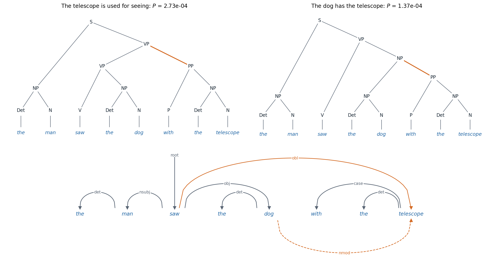

[ML Mastery Notes](../README.md) › [NLP and Large Language Models](README.md)

# 16. Syntactic Parsing

[← 15. Machine Translation and Multilingual Models](15-machine-translation-and-multilingual-models.md)

## <a id="structure-in-sentences"></a>Structure in sentences

### <a id="why-syntax"></a>Why syntax

A sentence is more than a sequence of words. Its words group into phrases that behave as units, and relations hold between words that are far apart: in *the keys to the old wooden cabinet are missing*, the verb agrees with *keys*, not with the nearer *cabinet*. **Syntax** describes this structure, and **parsing** recovers it. Structure also explains ambiguity. *The man saw the dog with the telescope* has two readings, depending on whether *with the telescope* modifies *saw* or *dog*, and each reading corresponds to a different structure over the same words. Ambiguity multiplies with length: the number of ways to bracket a sequence of $`n`$ words into a binary tree is the Catalan number $`C_{n-1}`$, which grows roughly as $`4^n`$, and a sentence with several prepositional phrases, coordinations, and modifiers has hundreds of grammatical analyses, of which people notice one.

For decades, parsers were a standard stage in language-processing systems: translation, information extraction, and question answering consumed their output. Large language models learned to perform these tasks without explicit syntax, but parsing remains important for three reasons. It is the classic case of **structured prediction**, choosing an output from an exponentially large set of structures by dynamic programming, and the algorithms in this chapter generalize the Viterbi algorithm to trees. Parsers remain practical tools for linguistic analysis, for languages with little data, and for applications that need an explicit, checkable analysis. And the question of whether and how neural language models represent syntax, which this chapter takes up at the end, is one of the main ways their internals have been studied.

### <a id="sequence-labeling"></a>Sequence labeling

The simplest syntactic analysis assigns each word a label. **Part-of-speech tagging** labels words as nouns, verbs, determiners, and so on: the Penn Treebank tagset for English has 45 tags, distinguishing, for example, singular and plural nouns and six verb forms, and the Universal Dependencies project uses 17 tags designed to apply to all languages. **Named-entity recognition** marks spans that name people, organizations, and places, encoded as word labels with the **BIO** scheme: B-PER for the first word of a person's name, I-PER for the following words, and O for words outside any entity. Both tasks were long solved with sequence models over the labels: hidden Markov models decoded with the Viterbi algorithm (AI chapter 11), then conditional random fields with rich features of the words (AI chapter 14), then bidirectional LSTMs with a CRF output layer ([Lample et al., 2016](https://arxiv.org/abs/1603.01360)), and now fine-tuned pretrained transformers (chapter 5). English part-of-speech tagging reached about 97.3% accuracy per word by 2011, which still means that only about 56% of sentences are tagged entirely correctly, and many of the remaining errors reflect inconsistencies in the annotation or genuine ambiguity rather than failures of the tagger ([Manning, 2011](https://nlp.stanford.edu/pubs/CICLing2011-manning-tagging.pdf)).

## <a id="constituency-parsing"></a>Constituency parsing

### <a id="context-free-grammars-and-treebanks"></a>Context-free grammars and treebanks

**Constituency** analysis describes a sentence as nested phrases: a sentence (S) consists of a noun phrase (NP) and a verb phrase (VP), a verb phrase of a verb and its objects and modifiers, and so on down to the words. A **context-free grammar** generates such structures. It has a set of nonterminal symbols, a set of words, a start symbol S, and rules $`A\to\beta`$ that rewrite a nonterminal $`A`$ as a sequence $`\beta`$ of nonterminals and words; a sentence is grammatical if some sequence of rewritings produces it from S, and the **parse tree** records the rewritings. Grammars written by hand either reject many real sentences or accept absurd analyses of them, so statistical parsing learned from **treebanks**, collections of sentences annotated with their trees. The Penn Treebank ([Marcus, Santorini, and Marcinkiewicz, 1993](https://aclanthology.org/J93-2004/)) tagged over 4.5 million words of American English with parts of speech and parsed about a million words of *Wall Street Journal* text, and its standard split, sections 02–21 for training, about 40,000 sentences, and section 23 for testing, 2,416 sentences, was the benchmark of English parsing for two decades. Parsers are evaluated by **labeled bracket F1**: the harmonic mean of the precision and recall of the labeled constituents, each a label with a span, that the parser proposes, compared with the treebank's ([Black et al., 1991](https://aclanthology.org/H91-1060/)).

### <a id="probabilistic-grammars-and-the-cky-algorithm"></a>Probabilistic grammars and the CKY algorithm

A **probabilistic context-free grammar** (PCFG) attaches a probability to each rule, such that the probabilities of the rules rewriting each nonterminal sum to one, and gives a tree the product of the probabilities of the rules it uses. Estimated from a treebank, each rule's probability is its count divided by the count of its left-hand side, the maximum-likelihood estimate. The grammar then scores every parse, and parsing means finding the most probable one.

There are exponentially many parses, but they share subtrees, and the **CKY algorithm** (for Cocke, Kasami, and Younger) finds the best by dynamic programming. It requires the grammar in **Chomsky normal form**, with every rule of the form $`A\to B\,C`$ or $`A\to w`$, into which any context-free grammar can be converted. For each span of words $`i..k`$ and each nonterminal $`A`$, CKY computes the probability of the best subtree rooted in $`A`$ covering exactly that span, from shorter spans:

```math
\delta(i,k,A)=\max_{A\to B\,C}\ \max_{i<j<k}\ P(A\to B\,C)\,\delta(i,j,B)\,\delta(j,k,C),
```

starting from $`\delta(i,i+1,A)=P(A\to w_{i+1})`$. The best parse of the whole sentence has probability $`\delta(0,n,\mathrm S)`$, and backpointers recover it. The time is $`O(n^3|R|)`$ for $`n`$ words and $`|R|`$ rules. Replacing the maximum by a sum gives the **inside probability**, the total probability of all subtrees of $`A`$ over the span, and at the top, the probability of the sentence under the grammar; combined with the corresponding outside probabilities, it gives the expected number of times each rule is used, which is what EM needs to learn a grammar from unannotated sentences ([Appendix A](#block-nlp16-appendix-a)). The code parses with a small PCFG in which a prepositional phrase can attach to a verb phrase or to a noun phrase.

```python
from collections import defaultdict
from math import log, exp

# A probabilistic context-free grammar in Chomsky normal form: binary rules and lexical rules.
binary = {("S", "NP", "VP"): 1.0,
          ("VP", "V", "NP"): 0.6, ("VP", "VP", "PP"): 0.4,
          ("NP", "Det", "N"): 0.8, ("NP", "NP", "PP"): 0.2,
          ("PP", "P", "NP"): 1.0}
lexical = {("Det", "the"): 0.7, ("Det", "a"): 0.3, ("V", "saw"): 0.6, ("V", "walked"): 0.4,
           ("N", "man"): 0.3, ("N", "dog"): 0.3, ("N", "telescope"): 0.2, ("N", "collar"): 0.1, ("N", "park"): 0.1,
           ("P", "with"): 0.6, ("P", "in"): 0.4}


def cky(words):
    """Viterbi CKY: best log-probability and backpointer for each (start, end, label); also the inside
    probabilities (summed over parses) and the number of parses."""
    n = len(words)
    best, back = defaultdict(lambda: -float("inf")), {}
    inside, count = defaultdict(float), defaultdict(int)
    for i, w in enumerate(words):
        for (A, word), p in lexical.items():
            if word == w:
                best[i, i + 1, A], back[i, i + 1, A] = log(p), w
                inside[i, i + 1, A], count[i, i + 1, A] = p, 1
    for length in range(2, n + 1):
        for i in range(n - length + 1):
            k = i + length
            for j in range(i + 1, k):                        # split point
                for (A, B, C), p in binary.items():
                    if count[i, j, B] and count[j, k, C]:
                        score = log(p) + best[i, j, B] + best[j, k, C]
                        if score > best[i, k, A]:
                            best[i, k, A], back[i, k, A] = score, (j, B, C)
                        inside[i, k, A] += p * inside[i, j, B] * inside[j, k, C]
                        count[i, k, A] += count[i, j, B] * count[j, k, C]
    return best, back, inside, count


def tree(back, i, k, A):
    b = back[i, k, A]
    if isinstance(b, str):
        return f"({A} {b})"
    j, B, C = b
    return f"({A} {tree(back, i, j, B)} {tree(back, j, k, C)})"


for sent in ["the man saw the dog with the telescope", "the man saw the dog with the collar",
             "the man saw the dog with the collar in the park"]:
    words = sent.split()
    best, back, inside, count = cky(words)
    n = len(words)
    print(sent)
    print(f"  {count[0, n, 'S']} parses; probability of the best {exp(best[0, n, 'S']):.2e}, "
          f"of all parses together {inside[0, n, 'S']:.2e}")
    print("  best:", tree(back, 0, n, "S"))
# the man saw the dog with the telescope
#   2 parses; probability of the best 2.73e-04, of all parses together 4.10e-04
#   best: (S (NP (Det the) (N man)) (VP (VP (V saw) (NP (Det the) (N dog))) (PP (P with) (NP (Det the) (N telescope)))))
# the man saw the dog with the collar
#   2 parses; probability of the best 1.37e-04, of all parses together 2.05e-04
#   best: (S (NP (Det the) (N man)) (VP (VP (V saw) (NP (Det the) (N dog))) (PP (P with) (NP (Det the) (N collar)))))
# the man saw the dog with the collar in the park
#   5 parses; probability of the best 1.22e-06, of all parses together 3.06e-06
#   best: (S (NP (Det the) (N man)) (VP (VP (VP (V saw) (NP (Det the) (N dog))) (PP (P with) (NP (Det the) (N collar)))) (PP (P in) (NP (Det the) (N park)))))
```

The grammar prefers attaching the prepositional phrase to the verb, with two-thirds of the sentence's probability, so the man uses the telescope to see, which is the more natural reading. It makes the same choice for *the dog with the collar*, where the natural reading attaches the phrase to the dog, because a PCFG decides attachments from rule probabilities alone and never compares *collar* with *telescope*. With a second prepositional phrase, five analyses compete. The figure shows the two parses of the first sentence and the same ambiguity in the dependency representation of the next section.



*Top: the two parse trees of "the man saw the dog with the telescope" under the grammar of the code, with the attachment of the prepositional phrase in orange. The parse that attaches it to the verb phrase uses the rules VP → VP PP (probability 0.4) and VP → V NP (0.6), the other VP → V NP and NP → NP PP (0.2), so the first has twice the probability of the second, 2.73 × 10⁻⁴ against 1.37 × 10⁻⁴, whatever the words. Bottom: the dependency tree of the first reading, with Universal Dependencies labels; the second reading differs only in the head of "telescope", which becomes "dog" (dashed arc below).*

### <a id="better-grammars"></a>Better grammars

A PCFG read directly off the treebank parses poorly, with labeled precision and recall around 70% to 74% on sentences of up to 40 words, because its independence assumptions are too strong: the probability of expanding a noun phrase is the same whether it is a subject or an object, and nothing depends on the words. Two refinements fixed most of this. **Parent annotation** splits each nonterminal by its parent's label, so that NP under S and NP under VP get different rules, and improved precision and recall by about 8 points ([Johnson, 1998](https://aclanthology.org/J98-4004/)). **Lexicalization** annotates each constituent with its head word, the word that determines its behavior (*saw* for the verb phrase, *dog* for the noun phrase), so that rule probabilities can depend on words; lexicalized parsers reached about 88% F1 on the test section ([Collins, 2003](https://aclanthology.org/J03-4003/)) and 89.5% on its sentences of up to 100 words ([Charniak, 2000](https://aclanthology.org/A00-2018/)). Careful unlexicalized splits reached 86.3% on sentences of up to 40 words ([Klein and Manning, 2003](https://aclanthology.org/P03-1054/)), and splits learned automatically by EM, as latent subcategories of each symbol, reached 90.2% on the same sentences ([Petrov et al., 2006](https://aclanthology.org/P06-1055/)).

Neural networks then replaced the hand-designed features. [Vinyals et al. (2015)](https://arxiv.org/abs/1412.7449) wrote trees as bracketed strings and trained a sequence-to-sequence model with attention to generate them, reaching 88.3 F1 when trained on the treebank alone and 92.5 with millions of additional sentences parsed automatically, which showed that a generic sequence model could learn to produce well-formed trees. A **span-based** parser scores every labeled span with a neural encoder and finds the best tree with CKY-style dynamic programming; with a self-attentive encoder, it reached 93.55 F1 without external data and 95.13 with pretrained contextual word representations ([Kitaev and Klein, 2018](https://arxiv.org/abs/1805.01052)).

## <a id="dependency-parsing"></a>Dependency parsing

### <a id="dependency-grammar"></a>Dependency grammar

A **dependency** analysis links words to words directly. Each word except one depends on exactly one **head**, and the arc from head to dependent carries a label for the grammatical relation, such as subject, object, determiner, or modifier; the word with no head, usually the main verb, attaches to an artificial ROOT. The result is a tree over the words, with no phrase nodes. A constituency tree can be converted into a dependency tree by rules that choose the head of each phrase. Dependencies represent predicate–argument relations directly, which suits applications such as information extraction, and they handle languages with free word order more naturally than phrase structure does.

**Universal Dependencies** (UD; [Nivre et al., 2016](https://aclanthology.org/L16-1262/); [de Marneffe et al., 2021](https://aclanthology.org/2021.cl-2.11/)) defines 17 part-of-speech tags and 37 dependency relations intended to apply across languages, with guidelines that make analyses of different languages comparable. Its release of May 2026 contains 353 treebanks in 193 languages, and multilingual shared tasks on parsing from raw text, such as that of 2018 over 82 treebanks in 57 languages ([Zeman et al., 2018](https://aclanthology.org/K18-2001/)), made it the standard resource. A dependency tree is **projective** if no arcs cross when drawn above the sentence, equivalently if every word between a head and its dependent descends from that head. English trees are mostly projective; languages with freer word order, such as Czech, German, and Dutch, have more non-projective constructions. Dependency parsers are evaluated by the **unlabeled attachment score** (UAS), the fraction of words assigned the correct head, and the **labeled attachment score** (LAS), which also requires the correct label.

### <a id="transition-based-parsing"></a>Transition-based parsing

A **transition-based** parser builds the tree with a sequence of actions, like a shift-reduce parser for a programming language. In the **arc-standard** system ([Nivre, 2004](https://aclanthology.org/W04-0308/)), the state is a stack, which starts with ROOT, and a buffer holding the unread words. SHIFT moves the next word from the buffer to the stack; LEFT-ARC makes the second word on the stack a dependent of the top word and removes it; RIGHT-ARC makes the top word a dependent of the second and removes it. Every projective tree is produced by some sequence of exactly $`2n`$ actions for $`n`$ words, so parsing takes linear time. A classifier predicts the next action from features of the state, and it is trained on action sequences computed from treebank trees by an **oracle**: in a given state, it chooses LEFT-ARC or RIGHT-ARC when the treebank contains that arc, provided that a word attached by RIGHT-ARC has already received all its own dependents, and SHIFT otherwise ([Appendix C](#block-nlp16-appendix-c)). The code runs the oracle on the sentence of the figure and on a non-projective sentence.

```python
# Arc-standard transition-based parsing, driven by a static oracle that reads a gold tree.
words = ["ROOT", "the", "man", "saw", "the", "dog", "with", "the", "telescope"]
gold = {1: (2, "det"), 2: (3, "nsubj"), 3: (0, "root"), 4: (5, "det"), 5: (3, "obj"),
        6: (8, "case"), 7: (8, "det"), 8: (3, "obl")}           # dependent: (head, label)


def oracle_parse(n, gold):
    stack, buffer, arcs, steps = [0], list(range(1, n + 1)), {}, []
    while buffer or len(stack) > 1:
        s0, s1 = stack[-1], (stack[-2] if len(stack) > 1 else None)
        if s1 is not None and s1 != 0 and gold[s1][0] == s0:
            action = "LEFT-ARC"                                  # s1 is a dependent of s0
            arcs[s1] = (s0, gold[s1][1])
            del stack[-2]
        elif s1 is not None and gold[s0][0] == s1 and all(d in arcs for d in gold if gold[d][0] == s0):
            action = "RIGHT-ARC"                                 # s0 is a dependent of s1 and has all its own
            arcs[s0] = (s1, gold[s0][1])
            stack.pop()
        elif buffer:
            action = "SHIFT"
            stack.append(buffer.pop(0))
        else:
            return arcs, steps, False                            # no action leads to the gold tree
        steps.append((action, [words[i] for i in stack], len(buffer)))
    return arcs, steps, True


arcs, steps, ok = oracle_parse(8, gold)
for action, stack, left in steps:
    print(f"{action:9s} stack: {' '.join(stack):28s} words left: {left}")
print(f"{len(steps)} transitions; recovers the gold tree: {ok and arcs == gold}")


def attachment_scores(pred, gold):
    uas = sum(pred[d][0] == h for d, (h, _) in gold.items()) / len(gold)
    las = sum(pred[d] == g for d, g in gold.items()) / len(gold)
    return uas, las


pred = dict(gold)
pred[8] = (5, "nmod")                                            # attach the telescope to the dog instead
print("scores of the other reading: UAS {:.3f}, LAS {:.3f}".format(*attachment_scores(pred, gold)))

# A non-projective tree: "A hearing is scheduled on the issue today" (the arc hearing -> issue crosses
# the arc scheduled -> today). The arc-standard system can only build projective trees.
words = ["ROOT", "A", "hearing", "is", "scheduled", "on", "the", "issue", "today"]
gold_np = {1: (2, "det"), 2: (4, "nsubj:pass"), 3: (4, "aux:pass"), 4: (0, "root"), 5: (7, "case"),
           6: (7, "det"), 7: (2, "nmod"), 8: (4, "obl:tmod")}
arcs, steps, ok = oracle_parse(8, gold_np)
print(f"non-projective tree: oracle succeeds: {ok}; stuck with stack {steps[-1][1]}")
# SHIFT     stack: ROOT the                     words left: 7
# SHIFT     stack: ROOT the man                 words left: 6
# LEFT-ARC  stack: ROOT man                     words left: 6
# SHIFT     stack: ROOT man saw                 words left: 5
# LEFT-ARC  stack: ROOT saw                     words left: 5
# SHIFT     stack: ROOT saw the                 words left: 4
# SHIFT     stack: ROOT saw the dog             words left: 3
# LEFT-ARC  stack: ROOT saw dog                 words left: 3
# RIGHT-ARC stack: ROOT saw                     words left: 3
# SHIFT     stack: ROOT saw with                words left: 2
# SHIFT     stack: ROOT saw with the            words left: 1
# SHIFT     stack: ROOT saw with the telescope  words left: 0
# LEFT-ARC  stack: ROOT saw with telescope      words left: 0
# LEFT-ARC  stack: ROOT saw telescope           words left: 0
# RIGHT-ARC stack: ROOT saw                     words left: 0
# RIGHT-ARC stack: ROOT                         words left: 0
# 16 transitions; recovers the gold tree: True
# scores of the other reading: UAS 0.875, LAS 0.875
# non-projective tree: oracle succeeds: False; stuck with stack ['ROOT', 'scheduled', 'issue', 'today']
```

The 16 actions rebuild the tree of the first sentence, and choosing the other attachment for *telescope* would cost one of eight heads, a UAS of 87.5%. On *a hearing is scheduled on the issue today*, where *issue* modifies *hearing* across the verb, the arc from *hearing* to *issue* crosses the arc from *scheduled* to *today*, and the oracle gets stuck: arc-standard parsers can build only projective trees. Non-projective trees are handled by extra transitions that reorder words or by transforming the treebank into projective trees whose labels record how to restore the original arcs ([Nivre and Nilsson, 2005](https://aclanthology.org/P05-1013/)).

A greedy transition parser is fast but cannot recover from a wrong early action, and a classifier trained only on the oracle's states never learns what to do after a mistake, the exposure bias of DL chapter 8. **Dynamic oracles** fix the second problem by computing the best action from any state, including wrong ones, so the parser can be trained on its own mistakes ([Goldberg and Nivre, 2012](https://aclanthology.org/C12-1059/)), and beam search reduces the first. [Chen and Manning (2014)](https://aclanthology.org/D14-1082/) replaced the millions of sparse features of earlier classifiers with a small feedforward network over embeddings of the words, tags, and labels near the top of the stack and the front of the buffer, and parsed over 1,000 sentences per second with a UAS of 92.0% on the Penn Treebank converted to dependencies.

### <a id="graph-based-parsing"></a>Graph-based parsing

A **graph-based** parser scores every possible arc and searches for the tree with the highest total score. With a **first-order** model, in which a tree's score is the sum of the scores $`s(h,d)`$ of its arcs, the best tree is a maximum spanning arborescence of the complete directed graph over ROOT and the words. Without a projectivity constraint, the Chu–Liu–Edmonds algorithm finds it in $`O(n^2)`$ time ([McDonald et al., 2005](https://aclanthology.org/H05-1066/)); restricted to projective trees, **Eisner's algorithm** ([Eisner, 1996](https://aclanthology.org/C96-1058/)) finds it in $`O(n^3)`$ time with a dynamic program over spans, like CKY but with words as heads instead of nonterminals ([Appendix B](#block-nlp16-appendix-b)). The code implements Eisner's algorithm, checks it against exhaustive search, and uses the same recursion with sums in place of maxima to count the trees.

```python
import itertools
import numpy as np
from scipy.special import logsumexp

rng = np.random.default_rng(0)


def eisner(S, agg=np.max):
    """Eisner's O(n^3) algorithm over projective trees. S[h, d] scores the arc h -> d; word 0 is the root.
    With agg=max it returns the best tree's score; with agg=logsumexp and S = 0, the log number of trees."""
    N = S.shape[0]
    inc = np.full((N, N, 2), -np.inf)        # incomplete span [s, t]; direction 0: head t, 1: head s
    com = np.full((N, N, 2), -np.inf)        # complete span [s, t]; direction 0: head t, 1: head s
    com[np.arange(N), np.arange(N)] = 0.0
    for k in range(1, N):
        for s in range(N - k):
            t = s + k
            join = agg(np.array([com[s, r, 1] + com[r + 1, t, 0] for r in range(s, t)]))
            inc[s, t, 0] = join + S[t, s] if s > 0 else -np.inf    # nothing can be the root's head
            inc[s, t, 1] = join + S[s, t]
            com[s, t, 0] = agg(np.array([com[s, r, 0] + inc[r, t, 0] for r in range(s, t)]))
            com[s, t, 1] = agg(np.array([inc[s, r, 1] + com[r, t, 1] for r in range(s + 1, t + 1)]))
    return com[0, N - 1, 1]


def is_tree(heads):                          # heads[d - 1] is the head of word d; every word must reach 0
    for d in range(1, len(heads) + 1):
        seen, h = set(), d
        while h != 0:
            if h in seen:
                return False
            seen.add(h)
            h = heads[h - 1]
    return True


def is_projective(heads):                    # every word between a head and its dependent descends from the head
    def ancestors(w):
        while w != 0:
            w = heads[w - 1]
            yield w
    return all(h in ancestors(w) for d, h in enumerate(heads, 1) for w in range(min(h, d) + 1, max(h, d)))


def brute_force(S):
    n = S.shape[0] - 1
    best, n_trees, n_proj = -np.inf, 0, 0
    for heads in itertools.product(range(n + 1), repeat=n):
        if any(h == d for d, h in enumerate(heads, 1)) or not is_tree(heads):
            continue
        n_trees += 1
        if is_projective(heads):
            n_proj += 1
            best = max(best, sum(S[h, d] for d, h in enumerate(heads, 1)))
    return best, n_trees, n_proj


agree = 0
for _ in range(100):
    S = rng.normal(size=(6, 6))              # 5 words plus the root
    agree += np.isclose(eisner(S), brute_force(S)[0])
print(f"Eisner's algorithm matches exhaustive search on {agree} of 100 random 5-word score matrices")
print(" n  all trees  projective (brute force)  projective (Eisner, counting)")
for n in range(1, 7):
    _, n_trees, n_proj = brute_force(np.zeros((n + 1, n + 1)))
    count = np.exp(eisner(np.zeros((n + 1, n + 1)), agg=logsumexp))
    print(f"{n:2d} {n_trees:10d} {n_proj:25d} {count:30.0f}")
# Eisner's algorithm matches exhaustive search on 100 of 100 random 5-word score matrices
#  n  all trees  projective (brute force)  projective (Eisner, counting)
#  1          1                         1                              1
#  2          3                         3                              3
#  3         16                        12                             12
#  4        125                        55                             55
#  5       1296                       273                            273
#  6      16807                      1428                           1428
```

The dynamic program agrees with exhaustive search on every random instance. The counts show why search is needed: 6 words admit 16,807 dependency trees, $`(n+1)^{n-1}`$ by Cayley's formula, of which 1,428 are projective; the first number grows faster than exponentially and the second exponentially, while the dynamic program runs in cubic time. With sums of exponentiated scores in place of maxima, the same recursion computes the partition function over trees, whose derivatives with respect to the arc scores are the marginal probabilities of the arcs, the quantities needed to train a first-order parser as a conditional random field over trees.

The strongest graph-based parsers compute arc scores with neural encoders. The **biaffine** parser ([Dozat and Manning, 2017](https://arxiv.org/abs/1611.01734)) encodes the sentence with a bidirectional LSTM, maps each word to separate representations as a potential head and as a potential dependent, and scores each pair with a bilinear form plus a head-specific bias; a second biaffine classifier predicts the label. It reached a UAS of 95.7% and an LAS of 94.1% on the Penn Treebank, and, often with a pretrained transformer in place of the LSTM, it became the standard architecture of dependency parsers, including those of multilingual toolkits such as Stanza, which covers 66 languages ([Qi et al., 2020](https://arxiv.org/abs/2003.07082)).

## <a id="syntax-in-neural-language-models"></a>Syntax in neural language models

Language models trained only to predict words are never shown a tree, yet their representations contain much of the information a parser recovers. A **structural probe** ([Hewitt and Manning, 2019](https://aclanthology.org/N19-1419/)) learns a linear transformation of a model's word vectors under which the squared distance between two words approximates the number of arcs between them in the dependency tree, and the squared norm of a word's vector approximates its depth; for BERT and ELMo, such transformations exist and recover much of the tree, while the same probes on non-contextual embeddings do much worse. Individual attention heads in BERT attend from verbs to their direct objects, from nouns to their determiners, and from prepositions to their objects with high accuracy, although no head was trained to ([Clark et al., 2019](https://arxiv.org/abs/1906.04341)). Probes need controls to show that the information is represented rather than learned by the probe (chapter 5).

Behavioral tests measure whether models use this structure. Number agreement between a subject and a distant verb is the standard case: LSTMs trained to predict the verb's number made fewer than 1% errors overall, but their errors rose sharply when nouns of the opposite number intervened, and more so when trained only as language models ([Linzen, Dupoux, and Goldberg, 2016](https://arxiv.org/abs/1611.01368)); language models also made the right agreement in nonsense sentences such as *the colorless green ideas I ate with the chair sleep furiously*, which rules out simple co-occurrence as the explanation, and in Italian approached human accuracy ([Gulordava et al., 2018](https://arxiv.org/abs/1803.11138)). Collections of minimal pairs extend such tests to many grammatical phenomena (chapter 5). The results suggest that large language models learn hierarchical structure from text alone, in a distributed form rather than as an explicit tree. Adding explicit syntax to large language models has not improved them, and whether their implicit syntax matches the one linguists describe remains an open research question.

## <a id="appendices"></a>Appendices


<details>
<summary><a id="block-nlp16-appendix-a"></a><b>A. The inside–outside algorithm</b></summary>


For a PCFG in Chomsky normal form and a sentence $`w_1\dots w_n`$, the **inside probability** $`\beta(i,k,A)=P(A\Rightarrow^*w_{i+1}\dots w_k)`$ is the total probability of the subtrees rooted in $`A`$ that cover the span, computed bottom-up like CKY with sums:

```math
\beta(i,i+1,A)=P(A\to w_{i+1}),\qquad\beta(i,k,A)=\sum_{A\to B\,C}\sum_{j=i+1}^{k-1}P(A\to B\,C)\,\beta(i,j,B)\,\beta(j,k,C),
```

and $`P(w_1\dots w_n)=\beta(0,n,\mathrm S)`$. The **outside probability** $`\alpha(i,k,A)`$ is the probability of generating the words outside the span together with an $`A`$ over the span, computed top-down from $`\alpha(0,n,\mathrm S)=1`$ by summing over the ways $`A`$ can be the left or the right child of a larger constituent:

```math
\alpha(i,k,A)=\sum_{B\to A\,C}\sum_{l>k}P(B\to A\,C)\,\alpha(i,l,B)\,\beta(k,l,C)+\sum_{B\to C\,A}\sum_{l<i}P(B\to C\,A)\,\alpha(l,k,B)\,\beta(l,i,C).
```

The product $`\alpha(i,k,A)\beta(i,k,A)`$ is the joint probability of the sentence and of a constituent $`A`$ over the span, so dividing by $`P(w_1\dots w_n)`$ gives its posterior probability. The expected number of uses of the rule $`A\to B\,C`$ in the sentence is

```math
\frac1{P(w_1\dots w_n)}\sum_{i<j<k}\alpha(i,k,A)\,P(A\to B\,C)\,\beta(i,j,B)\,\beta(j,k,C),
```

and similarly for lexical rules. EM alternates between computing these expected counts over a corpus and renormalizing them into rule probabilities, the **inside–outside algorithm** ([Baker, 1979](https://doi.org/10.1121/1.2017061); [Lari and Young, 1990](https://www.sciencedirect.com/science/article/pii/088523089090022X)). It generalizes the forward–backward algorithm for hidden Markov models, which are the special case of grammars that branch only to the right. The likelihood has many local maxima, and grammars learned this way from raw text rarely resemble linguists' grammars; neural parameterizations of the rule probabilities improved unsupervised grammar induction substantially ([Kim, Dyer, and Rush, 2019](https://arxiv.org/abs/1906.10225)).

</details>


<details>
<summary><a id="block-nlp16-appendix-b"></a><b>B. Eisner's algorithm</b></summary>


A projective dependency tree over a span decomposes at its head: the head's left and right dependents form separate projective subtrees, each attached independently. Eisner's algorithm exploits this with spans that have their head at one end. A **complete** span $`C[s,t,\rightarrow]`$ is a subtree over words $`s..t`$ headed by $`s`$, in which every word has received all its dependents inside the span; an **incomplete** span $`I[s,t,\rightarrow]`$ contains the arc $`s\to t`$ with everything between $`s`$ and $`t`$ attached, while $`t`$ may still receive dependents to its right. The mirror-image spans have their heads at $`t`$. The recurrences, for best scores, are

```math
I[s,t,\rightarrow]=\max_{s\le r<t}\bigl(C[s,r,\rightarrow]+C[r+1,t,\leftarrow]\bigr)+s(s,t),\qquad I[s,t,\leftarrow]=\max_{s\le r<t}\bigl(C[s,r,\rightarrow]+C[r+1,t,\leftarrow]\bigr)+s(t,s),
```

```math
C[s,t,\rightarrow]=\max_{s<r\le t}\bigl(I[s,r,\rightarrow]+C[r,t,\rightarrow]\bigr),\qquad C[s,t,\leftarrow]=\max_{s\le r<t}\bigl(C[s,r,\leftarrow]+I[r,t,\leftarrow]\bigr),
```

with $`C[s,s,\cdot]=0`$. The best tree has score $`C[0,n,\rightarrow]`$, where position 0 is ROOT. Each of the $`O(n^2)`$ spans takes a maximum over $`O(n)`$ split points, so the time is $`O(n^3)`$. A naive adaptation of CKY with head words as nonterminals would index each span by its head as well and take $`O(n^5)`$ time; keeping the head at the end of the span is what saves the two factors of $`n`$. Replacing max and $`+`$ by sum and $`\times`$ over $`e^{s(h,d)}`$, or by log-sum-exp and $`+`$, gives the partition function. With all scores zero it counts projective trees, which for $`n`$ words with any number of dependents of ROOT number $`\binom{3n}{n}/(2n+1)`$: 1, 3, 12, 55, 273, 1,428, growing like $`(27/4)^n`$, while all trees number $`(n+1)^{n-1}`$.

</details>


<details>
<summary><a id="block-nlp16-appendix-c"></a><b>C. Why the arc-standard oracle works</b></summary>


Arc-standard transitions build a tree bottom-up: a word leaves the stack only when it receives its head, and at that moment it can take no further dependents. The oracle must therefore delay RIGHT-ARC for a word until all its dependents have been attached, which is the condition in its definition, while LEFT-ARC is always safe when the treebank has the arc from the top word to the second, since the second word's dependents lie between them or to its left and, in a projective tree, have already been attached.

**Completeness for projective trees.** Projectivity guarantees that when a word has received all its dependents, its head is either the word just below it on the stack, the word just above it, or still in the buffer: any word lying between them in the sentence is dominated by the head and has already been attached and removed. By induction over the actions, the oracle therefore never removes a word too early and never gets stuck, and since each word is shifted once and removed once, it uses exactly $`2n`$ actions ([Nivre, 2008](https://aclanthology.org/J08-4003/)).

**Non-projective trees.** If arcs $`(h_1,d_1)`$ and $`(h_2,d_2)`$ cross, with $`h_1<h_2<d_1<d_2`$ say, then when $`d_1`$ and $`h_1`$ are adjacent on the stack for their arc to be built, $`h_2`$ must already have been removed, which requires its head to be attached; but then $`h_2`$ can no longer receive its dependent $`d_2`$, which is still in the buffer. One of the two arcs cannot be built, and the oracle gets stuck as in the code. Parsers either transform non-projective trees into projective ones before training and restore them afterward, or add a SWAP transition that moves a word back to the buffer, which makes every tree reachable at the cost of quadratic time in the worst case, although parsing time stays close to linear in practice ([Nivre, 2009](https://aclanthology.org/P09-1040/)).

</details>

---

[← 15. Machine Translation and Multilingual Models](15-machine-translation-and-multilingual-models.md)
