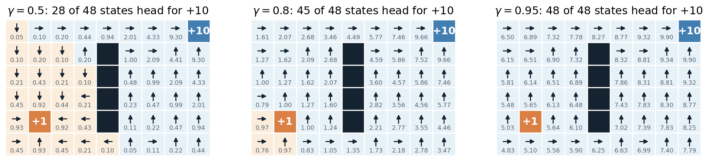
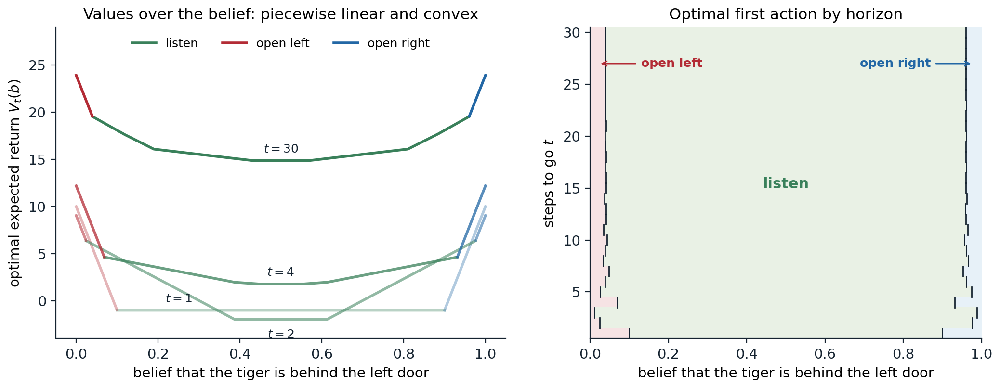

[Background Notes](../README.md) › [Reinforcement Learning](README.md)

# 1. Markov Decision Processes

[2. Dynamic Programming →](02-dynamic-programming.md)

## <a id="the-reinforcement-learning-problem"></a>The reinforcement learning problem

### <a id="learning-from-interaction"></a>Learning from interaction

Reinforcement learning is the study of agents that learn to act by interacting with an environment. At each time step $`t=0,1,2,\dots`$ the agent observes the environment, chooses an **action** $`A_t`$, and receives a numerical **reward** $`R_{t+1}`$ along with its next observation. Nobody tells the agent which action was right; it only learns how good the outcome was, often long after the action that caused it. Its goal is to choose actions that make the total reward it collects as large as possible.

This loop describes problems of very different kinds:

- **Games.** A backgammon program that learned its evaluation function from self-play played close to the level of the world's best players in the early 1990s ([Tesauro, 1995](https://doi.org/10.1145/203330.203343)); AlphaGo and its successors combined reinforcement learning with search to master Go, chess, and shogi ([chapter 24](24-planning-with-learned-models.md)).
- **Control.** Controllers trained by reinforcement learning steer stratospheric balloons, shape the plasma of a tokamak, race cars in simulation and drones in the real world ([chapter 31](31-reinforcement-learning-in-the-real-world.md)).
- **Language models.** After pretraining, language models are tuned with rewards from preference models and from verifiers of mathematical and programming answers ([NLP chapter 11](../nlp-llms/11-learning-from-human-preferences.md), [chapter 28](28-reinforcement-learning-for-language-models-and-reasoning.md)).
- **Recommendation and experimentation.** A system that chooses which article, advertisement, or treatment to show, and learns from the response, faces the simplest version of the problem, the bandit of [chapter 3](03-multi-armed-bandits.md).

Four features separate this setting from supervised learning ([ML](../ml/README.md)). The feedback is **evaluative** rather than instructive: a reward says how good an action was, not which action would have been best. It is **delayed**: a move in chess may win or lose the game forty moves later, and the agent must work out which of its many decisions deserve the credit, the **credit assignment problem**. The data are **sequential and not independent**: each observation depends on the previous ones. And the agent's own actions **determine the data it sees**, so it must balance exploiting what it knows against exploring to learn more. None of these features is present when a model is fitted to a fixed dataset of labeled examples.

### <a id="rewards-and-goals"></a>Rewards and goals

The reward is how a designer tells the agent what to achieve. That a single number suffices is a substantive claim, the **reward hypothesis** of Sutton and Barto: "all of what we mean by goals and purposes can be well thought of as the maximization of the expected value of the cumulative sum of a received scalar signal (called reward)." A robot learning to walk might receive reward proportional to its forward speed, minus a penalty for energy used; a chess program $`+1`$ for a win, $`-1`$ for a loss, and $`0`$ for a draw and for every other move. The reward specifies *what* the agent should achieve, not *how*: rewarding a chess program for capturing pieces would teach it to capture pieces, even at the cost of the game.

The hypothesis has been examined carefully. [Bowling et al. (2023)](https://arxiv.org/abs/2212.10420) show that it holds exactly when the designer's preferences over distributions of trajectories satisfy the von Neumann–Morgenstern axioms of [AI chapter 12](../ai/12-decision-theory-and-the-value-of-information.md#lotteries-and-the-axioms-of-utility) together with one more axiom about how preferences treat time, temporal γ-indifference, under which the discount factor may depend on the transition; goals whose preferences violate these conditions cannot be expressed as expected cumulative reward. [Abel et al. (2021)](https://arxiv.org/abs/2111.00876) show that some tasks, described as a set of acceptable behaviors or as a partial ordering of behaviors or of trajectories, cannot be encoded by any reward that depends only on the current state, action, and next state, and give polynomial-time algorithms that construct such a reward when one exists and report when none does. [Silver et al. (2021)](https://doi.org/10.1016/j.artint.2021.103535) argue in the other direction that maximizing reward in a rich enough environment could by itself give rise to perception, language, and social intelligence. In practice, rewards are usually written by hand, learned from demonstrations ([chapter 25](25-imitation-learning-and-inverse-rl.md)) or from human comparisons ([NLP chapter 11](../nlp-llms/11-learning-from-human-preferences.md#reward-models)), and optimized by agents that find every gap between the reward and the designer's intent. Reward misspecification and reward hacking are central themes of the Safety and Frontier module; the design of rewards is taken up in [chapter 31](31-reinforcement-learning-in-the-real-world.md).

### <a id="the-components-of-an-agent"></a>The components of an agent

An agent typically has some of three components:

- a **policy**, the rule that maps what the agent knows to an action, deterministic or stochastic;
- a **value function**, a prediction of the future reward from a situation, used to evaluate and improve the policy;
- a **model** of the environment, a prediction of the next observation and reward given an action, used to plan.

The combinations give the main families of methods, which the module develops in turn. **Prediction** asks how much reward a fixed policy will collect; **control** asks for the best policy. **Planning** computes a good policy from a known model, as dynamic programming does in [chapter 2](02-dynamic-programming.md); **learning** improves the policy from experience with an unknown environment. **Model-free** methods learn values or policies directly from experience ([chapters 5](05-monte-carlo-methods.md)–[9](09-off-policy-learning.md)); **model-based** methods learn a model and plan with it ([chapters 10](10-planning-and-learning-with-tabular-models.md) and [23](23-model-based-rl-and-world-models.md)). **Value-based** methods derive the policy from a learned value function ([chapter 7](07-model-free-control.md), [chapter 16](16-deep-q-learning.md)); **policy-based** methods adjust a parameterized policy directly ([chapter 13](13-policy-gradient-and-actor-critic-methods.md)); **actor-critic** methods do both. **On-policy** methods learn about the policy that generates the data; **off-policy** methods learn about another one, which lets them reuse old data or learn from demonstrations ([chapter 9](09-off-policy-learning.md)). **Offline** methods learn from a fixed dataset without further interaction ([chapter 26](26-offline-reinforcement-learning.md)).

All of these rest on the mathematical model of this chapter, the Markov decision process, and on the value functions and Bellman equations defined on it.

### <a id="states-and-the-markov-property"></a>States and the Markov property

Everything the agent has seen up to time $`t`$ is its **history** $`H_t=(O_0,A_0,R_1,O_1,\dots,A_{t-1},R_t,O_t)`$. The history grows without bound, so agents summarize it in a **state** $`S_t=f(H_t)`$. The summary is good enough for decision making when it has the **Markov property**: the future is independent of the past given the present,

```math
\Pr(S_{t+1}=s',R_{t+1}=r\mid S_t,A_t)=\Pr(S_{t+1}=s',R_{t+1}=r\mid H_t,A_t).
```

The state then carries all the information in the history that matters for predicting what happens next. The full history is always a Markov state, trivially; so is the complete configuration of the environment, the **environment state**, which the agent usually cannot see. The board position in chess is nearly Markov (castling and en passant rights and the repetition and fifty-move rules also depend on the history); a single frame of a video game is not, because it does not show which way the ball is moving, but a stack of the last four frames nearly is, which is why the Atari agents of [chapter 16](16-deep-q-learning.md) stack frames. When the observation is Markov, $`S_t=O_t`$ and the environment is **fully observable**; otherwise it is **partially observable**, and the agent must build its own **agent state** from the history, a problem previewed at the end of this chapter and developed in [chapter 14](14-partially-observable-environments.md). Most of the theory assumes a Markov state, and most of this chapter does too.

## <a id="markov-reward-processes"></a>Markov reward processes

### <a id="markov-chains"></a>Markov chains

Without actions or rewards, a sequence of Markov states is a **Markov chain**, described for finitely many states by a transition matrix $`P`$ with $`P_{ss'}=\Pr(S_{t+1}=s'\mid S_t=s)`$, a nonnegative matrix whose rows sum to one. The distribution of $`S_t`$ evolves as $`p_{t+1}^\top=p_t^\top P`$, and under mild conditions it converges to a **stationary distribution** $`\pi^\top P=\pi^\top`$ ([AI chapter 11](../ai/11-temporal-probabilistic-models.md#markov-chains); [Foundations chapter 2](../foundations/02-linear-algebra.md), appendix F, treats the linear algebra). A state from which the chain never leaves is **absorbing**.

### <a id="returns-and-discounting"></a>Returns and discounting

A **Markov reward process** adds a reward to each transition. Its object of interest is the **return**, the total reward collected from time $`t`$ on. With a **discount factor** $`\gamma\in[0,1]`$,

```math
G_t=R_{t+1}+\gamma R_{t+2}+\gamma^2R_{t+3}+\cdots=\sum_{k=0}^\infty\gamma^kR_{t+k+1},
```

and the return satisfies the one-step recursion that underlies everything that follows:

```math
G_t=R_{t+1}+\gamma\,G_{t+1}.
```

A reward received $`k`$ steps later is worth $`\gamma^k`$ times as much. Discounting has several justifications. Mathematically, it keeps returns finite: if $`|R_t|\le R_{\max}`$, then $`|G_t|\le R_{\max}/(1-\gamma)`$. Economically, a reward now can be invested, and a reward later is uncertain. Probabilistically, discounting is equivalent to an undiscounted problem in which the process ends at each step with probability $`1-\gamma`$ (exercise 1.1). And practically, it expresses a preference for sooner rewards and reduces the variance of long-horizon estimates. The **effective horizon** is about $`1/(1-\gamma)`$ steps: rewards much later than that carry little weight, since $`\gamma^{1/(1-\gamma)}\approx e^{-1}`$. A discount of $`0.99`$ looks about a hundred steps ahead, $`0.9`$ about ten. With $`\gamma=0`$ the agent is myopic and cares only about the next reward.

Many tasks end: a game is won or lost, a robot reaches its goal or falls. These **episodic** tasks break into **episodes** that end in a **terminal state** at a random time $`T`$, and the return $`G_t=\sum_{k=0}^{T-t-1}\gamma^kR_{t+k+1}`$ is finite even with $`\gamma=1`$. Other tasks, such as controlling a data center, are **continuing**. The two are unified by treating a terminal state as absorbing with zero reward, so that the infinite sum covers both; this convention is used throughout. For continuing tasks where no discounting is wanted, the **average reward** per step is the alternative criterion ([chapter 2](02-dynamic-programming.md#average-reward)).

### <a id="the-bellman-equation-of-a-reward-process"></a>The Bellman equation of a reward process

The **value** of a state is its expected return, $`v(s)=\mathbb E[G_t\mid S_t=s]`$. Taking expectations in the recursion $`G_t=R_{t+1}+\gamma G_{t+1}`$ and using the Markov property gives the **Bellman equation**

```math
v(s)=r(s)+\gamma\sum_{s'}P_{ss'}\,v(s'),\qquad r(s)=\mathbb E[R_{t+1}\mid S_t=s],
```

a system of linear equations, one per state: the value of a state is the immediate reward plus the discounted value of where the process goes next. In matrix form, $`v=r+\gamma Pv`$, so for $`\gamma<1`$

```math
v=(I-\gamma P)^{-1}r=\sum_{k=0}^\infty\gamma^kP^k\,r.
```

The inverse exists because the eigenvalues of $`\gamma P`$ have magnitude at most $`\gamma<1`$, and the series is the definition of the value read backward: $`P^kr`$ is the expected reward $`k`$ steps ahead ([Appendix A](#block-rl01-appendix-a)). For episodic tasks with $`\gamma=1`$, the same holds on the non-terminal states as long as termination is certain, since the transition matrix restricted to them then has spectral radius below one. Solving the system costs $`O(|\mathcal S|^3)`$ operations, which is fine for thousands of states and hopeless for the $`10^{170}`$ positions of Go; iterative methods ([chapter 2](02-dynamic-programming.md)), sampling ([chapters 5](05-monte-carlo-methods.md)–[6](06-temporal-difference-learning.md)), and approximation ([chapter 11](11-value-function-approximation.md)) are the answers to size.

## <a id="markov-decision-processes"></a>Markov decision processes

### <a id="dynamics-rewards-and-policies"></a>Dynamics, rewards, and policies

A **Markov decision process** (MDP) adds actions. A finite MDP consists of a set of states $`\mathcal S`$, a set of actions $`\mathcal A`$ (possibly depending on the state), the **dynamics**

```math
p(s',r\mid s,a)=\Pr(S_{t+1}=s',R_{t+1}=r\mid S_t=s,A_t=a),
```

a discount factor $`\gamma`$, and often a distribution $`\mu`$ of the initial state. The dynamics specify everything about the environment; the quantities used most often are derived from them, the transition probabilities $`p(s'\mid s,a)=\sum_rp(s',r\mid s,a)`$ and the expected reward $`r(s,a)=\sum_{s',r}r\,p(s',r\mid s,a)`$. Some texts write the reward as a function $`r(s,a,s')`$ or $`r(s)`$; for expected returns, only $`r(s,a)`$ matters. The name comes from the Markov property, now required of the state given the action. The framework goes back to [Bellman (1957)](https://press.princeton.edu/books/paperback/9780691146683/dynamic-programming) and Howard (1960); [Puterman (1994)](https://doi.org/10.1002/9780470316887) is the reference on its theory.

Two running examples appear in the code below. **Sutton and Barto's gridworld** has 25 cells; the four actions move north, south, east, or west, deterministically; an action that would leave the grid costs 1 and leaves the agent in place; and every action in two special cells A and B yields $`+10`$ and $`+5`$ and teleports the agent to cells A′ and B′. The **recycling robot** has two states, battery high and battery low; it can search for cans (reward 2, but it may drain the battery), wait for someone to bring one (reward 1), or, when low, recharge (reward 0); searching on a low battery runs it flat with some probability, and it must then be rescued, with a reward of $`-3`$.

A **policy** $`\pi`$ gives the probability $`\pi(a\mid s)`$ of each action in each state. A policy is **deterministic** if it puts all its probability on one action, written $`a=\pi(s)`$, and **stationary Markov** if it depends only on the current state and not on the time or the history; unless said otherwise, "policy" means a stationary Markov policy, possibly stochastic. A fixed policy turns the MDP into a Markov reward process with

```math
P^\pi_{ss'}=\sum_a\pi(a\mid s)\,p(s'\mid s,a),\qquad r^\pi(s)=\sum_a\pi(a\mid s)\,r(s,a),
```

which is why reward processes came first.

### <a id="value-functions-and-the-bellman-expectation-equations"></a>Value functions and the Bellman expectation equations

The **state-value function** of a policy is the expected return when starting in $`s`$ and following $`\pi`$, and the **action-value function** is the expected return when starting in $`s`$, taking $`a`$, and following $`\pi`$ afterward:

```math
v_\pi(s)=\mathbb E_\pi[G_t\mid S_t=s],\qquad q_\pi(s,a)=\mathbb E_\pi[G_t\mid S_t=s,A_t=a].
```

The two are related by averaging over the policy's first action and over the environment's first transition:

```math
v_\pi(s)=\sum_a\pi(a\mid s)\,q_\pi(s,a),\qquad q_\pi(s,a)=r(s,a)+\gamma\sum_{s'}p(s'\mid s,a)\,v_\pi(s').
```

Substituting each into the other gives the **Bellman expectation equations**,

```math
\begin{aligned}
v_\pi(s)&=\sum_a\pi(a\mid s)\Bigl[r(s,a)+\gamma\sum_{s'}p(s'\mid s,a)\,v_\pi(s')\Bigr],\\
q_\pi(s,a)&=r(s,a)+\gamma\sum_{s'}p(s'\mid s,a)\sum_{a'}\pi(a'\mid s')\,q_\pi(s',a').
\end{aligned}
```

Each expresses a value as an average over one step of the process of an immediate reward and a discounted successor value. Sutton and Barto draw these relations as **backup diagrams**: a state at the top branches into the actions the policy might take, each action branches into the states and rewards the environment might produce, and the value at the top is "backed up" from the leaves by averaging. In matrix form the first equation is $`v_\pi=r^\pi+\gamma P^\pi v_\pi`$, the Bellman equation of the reward process induced by $`\pi`$, so $`v_\pi=(I-\gamma P^\pi)^{-1}r^\pi`$. The code below solves it for the random policy on the gridworld and checks the answer by simulation.

```python
import numpy as np

# The 5x5 gridworld of Sutton and Barto (Example 3.5): moves are deterministic; bumping into the edge
# costs -1 and leaves the agent in place; every action in A gives +10 and jumps to A', in B +5 and jumps to B'.
n, gamma = 5, 0.9
moves = [(-1, 0), (1, 0), (0, 1), (0, -1)]                  # north, south, east, west
A, A2, B, B2 = (0, 1), (4, 1), (0, 3), (2, 3)
S = n * n
P = np.zeros((S, 4, S))                                     # P[s, a, s'] = p(s' | s, a)
R = np.zeros((S, 4))                                        # R[s, a] = expected reward r(s, a)
for i in range(n):
    for j in range(n):
        s = i * n + j
        for a, (di, dj) in enumerate(moves):
            if (i, j) in (A, B):
                (ti, tj), r = (A2, 10.0) if (i, j) == A else (B2, 5.0)
            elif 0 <= i + di < n and 0 <= j + dj < n:
                (ti, tj), r = (i + di, j + dj), 0.0
            else:
                (ti, tj), r = (i, j), -1.0
            P[s, a, ti * n + tj] = 1.0
            R[s, a] = r

# A policy turns the MDP into a Markov reward process: P_pi[s, s'] and r_pi[s].
pi = np.full((S, 4), 0.25)                                  # the equiprobable random policy
P_pi = np.einsum("sa,sat->st", pi, P)
r_pi = np.sum(pi * R, axis=1)
v = np.linalg.solve(np.eye(S) - gamma * P_pi, r_pi)         # the Bellman expectation equation, solved exactly
print("values of the random policy:")
for row in v.reshape(n, n):
    print(" ".join(f"{x:5.1f}" for x in row))
q = R + gamma * P @ v                                       # action values from state values
print(f"Bellman check, v = sum_a pi(a|s) q(s, a) everywhere: {np.allclose(v, np.sum(pi * q, axis=1), atol=1e-12)}")

# The same value by Monte Carlo: average discounted returns of 20,000 episodes of 200 steps started in A.
rng = np.random.default_rng(0)
s = np.full(20_000, A[0] * n + A[1])
G, disc = np.zeros(20_000), 1.0
for t in range(200):                                        # 0.9^200 is below 1e-9: truncation is negligible
    a = rng.integers(4, size=s.size)
    G += disc * R[s, a]
    s = np.argmax(P[s, a], axis=1)                          # deterministic transitions: the one successor
    disc *= gamma
print(f"v(A): exact {v[A[0] * n + A[1]]:.3f}, Monte Carlo {G.mean():.3f} +- {G.std() / np.sqrt(G.size):.3f}")

# Discounted occupancy from a uniform start: d = (1 - gamma) mu^T (I - gamma P_pi)^-1, a distribution over states.
mu = np.full(S, 1 / S)
d = (1 - gamma) * np.linalg.solve((np.eye(S) - gamma * P_pi).T, mu)
print(f"occupancy sums to {d.sum():.6f}; share of time in A: {d[A[0] * n + A[1]]:.3f}, in A': {d[A2[0] * n + A2[1]]:.3f}")
print(f"expected return from mu: mu.v = {mu @ v:.4f}, d.r_pi/(1-gamma) = {d @ r_pi / (1 - gamma):.4f}")
# values of the random policy:
#   3.3   8.8   4.4   5.3   1.5
#   1.5   3.0   2.3   1.9   0.5
#   0.1   0.7   0.7   0.4  -0.4
#  -1.0  -0.4  -0.4  -0.6  -1.2
#  -1.9  -1.3  -1.2  -1.4  -2.0
# Bellman check, v = sum_a pi(a|s) q(s, a) everywhere: True
# v(A): exact 8.789, Monte Carlo 8.780 +- 0.012
# occupancy sums to 1.000000; share of time in A: 0.018, in A': 0.073
# expected return from mu: mu.v = 0.9045, d.r_pi/(1-gamma) = 0.9045
```

The values reproduce Figure 3.2 of Sutton and Barto. Cell A is worth only 8.8 despite its reward of 10, because the jump lands the agent at A′ on the bottom edge, where the random policy often bumps into the edge ($`v(\text{A}')=-1.3`$); cell B is worth 5.3, more than its reward of 5, because B′, away from the edges, has a positive value (0.4). Averaging the discounted returns of 20,000 simulated episodes from A gives the same value within one standard error, the idea behind the Monte Carlo methods of [chapter 5](05-monte-carlo-methods.md).

### <a id="occupancy-measures"></a>Occupancy measures

The code ended by computing a second description of a policy, the distribution of where it spends its time. From an initial distribution $`\mu`$, the **discounted state occupancy** of $`\pi`$ is

```math
d^\pi_\mu(s)=(1-\gamma)\sum_{t=0}^\infty\gamma^t\Pr_\pi(S_t=s\mid S_0\sim\mu),\qquad d^{\pi\top}_\mu=(1-\gamma)\,\mu^\top(I-\gamma P^\pi)^{-1},
```

a probability distribution over states that weights time $`t`$ by $`\gamma^t`$; the state–action occupancy is $`d^\pi_\mu(s,a)=d^\pi_\mu(s)\,\pi(a\mid s)`$. It is the distribution of the state at a random time $`T`$ drawn from a geometric distribution, $`\Pr(T=t)=(1-\gamma)\gamma^t`$. The expected return of the policy from $`\mu`$, written $`J(\pi)=\mathbb E_{S_0\sim\mu}[v_\pi(S_0)]`$, is then an expectation of the one-step reward under the occupancy:

```math
J(\pi)=\frac1{1-\gamma}\sum_{s,a}d^\pi_\mu(s,a)\,r(s,a).
```

In the gridworld, both sides equal 0.9045. The occupancy also satisfies a linear **flow constraint**: probability that arrives at a state either starts there or flows in from a predecessor,

```math
\sum_ad^\pi_\mu(s',a)=(1-\gamma)\,\mu(s')+\gamma\sum_{s,a}p(s'\mid s,a)\,d^\pi_\mu(s,a)\quad\text{for all }s',
```

and every nonnegative $`d`$ that satisfies these constraints is the occupancy of some stationary policy, namely $`\pi(a\mid s)\propto d(s,a)`$ ([Appendix C](#block-rl01-appendix-c)). Policies and occupancy measures are therefore two descriptions of the same object, and the expected return is linear in the occupancy. This fact turns the search for an optimal policy into a linear program ([chapter 2](02-dynamic-programming.md#linear-programming)); the occupancy is the distribution under which policy gradients are computed ([chapter 13](13-policy-gradient-and-actor-critic-methods.md)); and the mismatch between the occupancy of a learned policy and that of the data it was trained on is the central difficulty of offline RL ([chapter 26](26-offline-reinforcement-learning.md)).

### <a id="comparing-two-policies"></a>Comparing two policies

The **advantage** of an action, $`A_\pi(s,a)=q_\pi(s,a)-v_\pi(s)`$, measures how much better it is to take $`a`$ once and then follow $`\pi`$ than to follow $`\pi`$ from the start; averaged over $`\pi`$'s own actions, it is zero. The advantage connects the values of two policies exactly. The **performance difference lemma** ([Kakade and Langford, 2002](https://dl.acm.org/doi/10.5555/645531.656005)) states that for any policies $`\pi`$ and $`\pi'`$,

```math
J(\pi')-J(\pi)=\frac1{1-\gamma}\,\mathbb E_{s\sim d^{\pi'}_\mu}\,\mathbb E_{a\sim\pi'(\cdot\mid s)}\bigl[A_\pi(s,a)\bigr].
```

The improvement of $`\pi'`$ over $`\pi`$ is the advantage, measured by $`\pi`$'s values, of the actions $`\pi'`$ takes, accumulated over the states $`\pi'`$ visits ([Appendix D](#block-rl01-appendix-d)). If $`\pi'`$ chooses actions with nonnegative advantage everywhere, it is at least as good as $`\pi`$: the policy improvement theorem of [chapter 2](02-dynamic-programming.md#the-policy-improvement-theorem). The lemma's catch is that the expectation is over the new policy's occupancy, which is unknown until the new policy is run; replacing it with the old policy's occupancy gives the surrogate objective of trust-region methods, accurate only when the two policies are close ([chapter 20](20-trust-regions-and-proximal-policy-optimization.md)).

## <a id="optimality"></a>Optimality

### <a id="optimal-value-functions"></a>Optimal value functions

Policies are compared state by state: $`\pi\ge\pi'`$ if $`v_\pi(s)\ge v_{\pi'}(s)`$ for every $`s`$. This is only a partial order, since one policy may be better in some states and worse in others. The **optimal value functions** are the best values achievable in each state,

```math
v_*(s)=\max_\pi v_\pi(s),\qquad q_*(s,a)=\max_\pi q_\pi(s,a),
```

where the maximum for each state might a priori be attained by a different policy. The fundamental theorem of MDPs says it is not: for a finite MDP with $`\gamma<1`$ there is a policy $`\pi_*`$ that attains $`v_*(s)`$ in every state simultaneously, and it can be taken to be **deterministic and stationary**. Moreover, no history-dependent or time-dependent policy does better ([Appendix B](#block-rl01-appendix-b)). An optimal policy therefore exists in a simple form, and finding it is a well-posed problem.

### <a id="the-bellman-optimality-equations"></a>The Bellman optimality equations

An optimal policy must choose, in every state, an action that is best when followed by optimal behavior. This gives the **Bellman optimality equations**,

```math
\begin{aligned}
v_*(s)&=\max_a\Bigl[r(s,a)+\gamma\sum_{s'}p(s'\mid s,a)\,v_*(s')\Bigr],\\
q_*(s,a)&=r(s,a)+\gamma\sum_{s'}p(s'\mid s,a)\max_{a'}q_*(s',a'),
\end{aligned}
```

with $`v_*(s)=\max_aq_*(s,a)`$. Unlike the expectation equations, these are nonlinear because of the maximum, and they are not solved by a single linear system. But once $`v_*`$ or $`q_*`$ is known, acting optimally is easy: any policy that is **greedy** with respect to them, choosing $`\pi_*(s)\in\arg\max_aq_*(s,a)`$, is optimal. With $`q_*`$ this requires no model at all, which is why so many methods learn action values. The optimality equations express **Bellman's principle of optimality**: whatever the first action, an optimal policy must behave optimally from the state it leads to.

It is convenient to write the right-hand sides as operators on value functions. The **Bellman expectation operator** of $`\pi`$ and the **Bellman optimality operator** are

```math
(\mathcal T^\pi v)(s)=\sum_a\pi(a\mid s)\Bigl[r(s,a)+\gamma\sum_{s'}p(s'\mid s,a)\,v(s')\Bigr],\qquad(\mathcal Tv)(s)=\max_a\Bigl[r(s,a)+\gamma\sum_{s'}p(s'\mid s,a)\,v(s')\Bigr],
```

so that $`v_\pi`$ is the fixed point of $`\mathcal T^\pi`$ and $`v_*`$ the fixed point of $`\mathcal T`$. Both operators are **contractions** in the maximum norm with modulus $`\gamma`$, $`\|\mathcal Tv-\mathcal Tw\|_\infty\le\gamma\|v-w\|_\infty`$, which guarantees that each fixed point exists, is unique, and is reached by applying the operator repeatedly from any starting point. Iterating $`\mathcal T`$ is value iteration, and iterating $`\mathcal T^\pi`$ is iterative policy evaluation, the subjects of [chapter 2](02-dynamic-programming.md). For a small MDP, the optimal policy can also be found by brute force, since a finite MDP has only $`\prod_s|\mathcal A(s)|`$ deterministic stationary policies ($`|\mathcal A|^{|\mathcal S|}`$ when every state has the same actions). The code enumerates them for the recycling robot.

```python
import itertools
import numpy as np

# The recycling robot (Sutton and Barto, Example 3.3). States: battery high (0) or low (1).
# Searching finds cans (reward 2) but may drain the battery; waiting collects fewer (reward 1);
# recharging is possible only when low. Searching on a low battery runs it flat with probability
# 1 - beta, and the robot is rescued and recharged at a cost of -3.
def robot(alpha, beta, r_search=2.0, r_wait=1.0):
    actions = {0: ["search", "wait"], 1: ["search", "wait", "recharge"]}
    P, R = {}, {}                                            # P[(s, a)] = next-state distribution
    P[(0, "search")], R[(0, "search")] = np.array([alpha, 1 - alpha]), r_search
    P[(0, "wait")], R[(0, "wait")] = np.array([1.0, 0.0]), r_wait
    P[(1, "search")] = np.array([1 - beta, beta])
    R[(1, "search")] = beta * r_search + (1 - beta) * (-3.0)  # expected reward r(s, a)
    P[(1, "wait")], R[(1, "wait")] = np.array([0.0, 1.0]), r_wait
    P[(1, "recharge")], R[(1, "recharge")] = np.array([1.0, 0.0]), 0.0
    return actions, P, R


def evaluate(policy, P, R, gamma):                           # v = (I - gamma P_pi)^-1 r_pi
    P_pi = np.array([P[(s, policy[s])] for s in (0, 1)])
    r_pi = np.array([R[(s, policy[s])] for s in (0, 1)])
    return np.linalg.solve(np.eye(2) - gamma * P_pi, r_pi)


gamma = 0.9
actions, P, R = robot(alpha=0.8, beta=0.4)
print("all deterministic policies, values (high, low):")
table = {}
for pol in itertools.product(actions[0], actions[1]):        # 2 x 3 = 6 deterministic stationary policies
    table[pol] = evaluate(pol, P, R, gamma)
    print(f"  high: {pol[0]:6s} low: {pol[1]:8s} v = ({table[pol][0]:5.2f}, {table[pol][1]:5.2f})")
best = max(table, key=lambda p: table[p].sum())
dominates = all(np.all(table[best] >= v - 1e-12) for v in table.values())
print(f"best: {best}, at least as good as every other policy in both states: {dominates}")

# The Bellman optimality equation holds for its values: v*(s) = max_a [r(s,a) + gamma sum_s' p(s'|s,a) v*(s')].
v_star = table[best]
backup = [max(R[(s, a)] + gamma * P[(s, a)] @ v_star for a in actions[s]) for s in (0, 1)]
print(f"max_a backup of v*: ({backup[0]:.2f}, {backup[1]:.2f})")

# No stochastic policy does better: 20,000 random stochastic policies, evaluated exactly.
rng = np.random.default_rng(0)
worst_gap, beaten = np.inf, 0
for _ in range(20_000):
    w = [rng.dirichlet(np.ones(len(actions[s]))) for s in (0, 1)]
    P_pi = np.array([sum(wi * P[(s, a)] for wi, a in zip(w[s], actions[s])) for s in (0, 1)])
    r_pi = np.array([sum(wi * R[(s, a)] for wi, a in zip(w[s], actions[s])) for s in (0, 1)])
    v = np.linalg.solve(np.eye(2) - gamma * P_pi, r_pi)
    worst_gap = min(worst_gap, np.min(v_star - v))
    beaten += np.any(v > v_star + 1e-12)
print(f"random stochastic policies better than v* in some state: {beaten}; smallest margin {worst_gap:.3f}")

# The optimal action in the low state depends on how risky searching is, and on the discount.
for beta in [0.2, 0.6, 0.95]:
    line = []
    for g in [0.5, 0.9]:
        actions, P, R = robot(alpha=0.8, beta=beta)
        vals = {pol: evaluate(pol, P, R, g) for pol in itertools.product(actions[0], actions[1])}
        opt = max(vals, key=lambda p: vals[p].sum())
        line.append(f"gamma = {g}: ({opt[0]}, {opt[1]})")
    print(f"beta = {beta:4}: " + "; ".join(line))
# all deterministic policies, values (high, low):
#   high: search low: search   v = (13.41,  9.76)
#   high: search low: wait     v = (13.57, 10.00)
#   high: search low: recharge v = (16.95, 15.25)
#   high: wait   low: search   v = (10.00,  6.88)
#   high: wait   low: wait     v = (10.00, 10.00)
#   high: wait   low: recharge v = (10.00,  9.00)
# best: ('search', 'recharge'), at least as good as every other policy in both states: True
# max_a backup of v*: (16.95, 15.25)
# random stochastic policies better than v* in some state: 0; smallest margin 0.188
# beta =  0.2: gamma = 0.5: (search, wait); gamma = 0.9: (search, recharge)
# beta =  0.6: gamma = 0.5: (search, wait); gamma = 0.9: (search, recharge)
# beta = 0.95: gamma = 0.5: (search, search); gamma = 0.9: (search, search)
```

Of the six deterministic policies, searching when the battery is high and recharging when it is low is best in both states at once, as the theorem promises, and its values satisfy the Bellman optimality equation. None of 20,000 random stochastic policies beats it in any state; the closest comes within 0.19. The last lines show that the answer depends on the problem's parameters. When searching on a low battery rarely drains it ($`\beta=0.95`$), the robot should keep searching. When it is risky, a far-sighted robot ($`\gamma=0.9`$) recharges, giving up a step of reward to protect the future, while a short-sighted one ($`\gamma=0.5`$) waits, collecting a reward of 1 now rather than 0 while recharging.

### <a id="why-deterministic-markov-policies-suffice"></a>Why deterministic Markov policies suffice

It may seem that a policy could do better by randomizing, or by remembering the past, or by acting differently at different times. In an MDP it cannot. Randomization does not help because the right-hand side of the optimality equation is a maximum over actions, and a maximum of a set of numbers is at least any average of them: mixing a best action with worse ones can only lose. Memory does not help because the Markov property makes the past irrelevant to the future given the present state: everything that matters for the rest of the episode is in $`S_t`$. Time does not help in an infinite-horizon discounted problem because the problem looks the same from every time step: the future from state $`s`$ at time 10 is distributed like the future from $`s`$ at time 0.

[Appendix B](#block-rl01-appendix-b) makes this precise with the contraction property, and [Appendix C](#block-rl01-appendix-c) shows that the occupancy measure of any history-dependent policy is also the occupancy of a stationary Markov policy, so the larger class of policies achieves no additional returns. Each of these arguments fails in some setting of later chapters. With a finite horizon, the optimal action depends on the time remaining. With partial observability, the current observation is not Markov, and memory or randomization can help (exercise 1.6). In games with simultaneous moves or hidden information, a deterministic policy can be exploited, and optimal play may have to randomize, as in rock–paper–scissors ([AI chapter 15](../ai/15-game-theory-and-multiagent-systems.md#nash-equilibrium), [chapter 27](27-multi-agent-rl-and-self-play.md)). With a constraint on an expected cost, the optimal policy may need to randomize between two deterministic ones (with $`k`$ constraints, in up to $`k`$ states) ([chapter 31](31-reinforcement-learning-in-the-real-world.md)).

### <a id="what-the-discount-and-the-rewards-specify"></a>What the discount and the rewards specify

The discount factor is part of the problem, not just a numerical device: changing it changes what is optimal. The figure below shows a gridworld with a small reward of $`+1`$ near the lower left and a large reward of $`+10`$ in the far corner, behind a wall.



*Optimal values and greedy policies in a gridworld with two terminal rewards, $`+1`$ (orange) and $`+10`$ (blue). Moves succeed with probability 0.9 and otherwise go in one of the three other directions; bumping into the edge or the wall (black) leaves the agent in place. Each cell shows its optimal value and optimal action, and is shaded by the reward the greedy path from it reaches. With $`\gamma=0.5`$, a reward collected on the fifth move is worth only $`\gamma^4=1/16`$ of its size, and 20 of the 48 cells head for the nearby $`+1`$; with $`\gamma=0.8`$, only the three cells in its corner do; with $`\gamma=0.95`$, every cell heads for $`+10`$, even the cells adjacent to $`+1`$.*

Other transformations of the reward change nothing. Multiplying all rewards by a positive constant multiplies all values by the same constant. In a continuing task, adding a constant $`c`$ to every reward adds $`c/(1-\gamma)`$ to every value and leaves the optimal policy unchanged. In an episodic task it does not: a constant added to every step before termination rewards or penalizes the length of the episode, and a positive "living reward" can make ending the episode undesirable altogether (exercise 1.2). A more general invariance holds for **potential-based shaping** ([Ng, Harada, and Russell, 1999](https://dl.acm.org/doi/10.5555/645528.657613)): adding $`\gamma\Phi(s')-\Phi(s)`$ to the reward of every transition from $`s`$ to $`s'`$, for any function $`\Phi`$ of the state (with $`\Phi=0`$ at the terminal state when $`\gamma=1`$), shifts every action value by $`-\Phi(s)`$ and leaves the optimal policy unchanged, while it can make learning much faster ([chapter 31](31-reinforcement-learning-in-the-real-world.md)). Rewards outside these families change the problem, and an agent will optimize the problem it is given.

### <a id="finite-horizons-and-time-limits"></a>Finite horizons and time limits

If the episode ends after a fixed number of steps $`H`$, the problem is not stationary: with two steps left, the best action may be to grab a small reward, and with a hundred, to head for a larger one. The optimal values then depend on the time remaining, $`v_*^{(h)}(s)`$ for $`h`$ steps to go, and satisfy

```math
v_*^{(0)}(s)=0,\qquad v_*^{(h)}(s)=\max_a\Bigl[r(s,a)+\gamma\sum_{s'}p(s'\mid s,a)\,v_*^{(h-1)}(s')\Bigr],
```

computed backward from the end by **backward induction**, the dynamic programming of [game trees](../ai/04-adversarial-search-and-games.md#minimax) and of the finite-horizon controllers in [chapter 15](15-optimal-control-and-trajectory-optimization.md). The optimal policy is deterministic and Markov in the pair (state, steps remaining), but not stationary. Equivalently, the time remaining can be added to the state, which restores the stationary theory.

This matters in practice because simulated environments usually impose a time limit that is not part of the task: a walking robot is stopped after 1,000 steps not because walking ends there but because the simulation has to end somewhere. An agent that treats this cutoff as a true terminal state, with zero value afterward, learns values that depend on the clock, which its observation does not contain. The correct treatment is to bootstrap from the value of the last state as if the episode continued ([Pardo et al., 2018](https://arxiv.org/abs/1712.00378)). Gymnasium's step function reports the two cases separately, as `terminated` for a true terminal state and `truncated` for a time limit, and the algorithms of later chapters treat them differently.

## <a id="beyond-fully-observed-mdps"></a>Beyond fully observed MDPs

### <a id="partial-observability-and-belief-states"></a>Partial observability and belief states

When the agent sees only an observation $`O_t`$ that depends on a hidden state, the environment is a **partially observable MDP** (POMDP): an MDP together with observation probabilities $`\Pr(O_{t+1}=o\mid S_{t+1}=s',A_t=a)`$. The observation alone is not Markov, but the posterior distribution over hidden states given the history, the **belief state** $`b_t(s)=\Pr(S_t=s\mid H_t)`$, is. It is updated after each action and observation by Bayes' rule,

```math
b_{t+1}(s')\propto\Pr(o\mid s',a)\sum_sp(s'\mid s,a)\,b_t(s),
```

the filtering recursion of [AI chapter 11](../ai/11-temporal-probabilistic-models.md#filtering) with the action added. A POMDP is thus equivalent to an MDP whose states are beliefs, the **belief MDP**, and the theory of this chapter applies to it, with the difficulty that the belief space is continuous.

The classic example, the **tiger problem** of Cassandra, Kaelbling, and Littman (1994), described in [Kaelbling, Littman, and Cassandra (1998)](https://www.sciencedirect.com/science/article/pii/S000437029800023X), has two doors with a tiger behind one of them. The agent can listen, at a cost of 1, and hears the tiger on the correct side with probability 0.85; opening the tiger's door costs 100, and opening the other pays 10. The belief is a single number, the probability that the tiger is on the left, and after hearing the tiger $`n_L`$ times on the left and $`n_R`$ times on the right it depends only on the difference $`n_L-n_R`$. The code evaluates the policies that listen until one side leads by $`k`$.

```python
import numpy as np

# The tiger problem (Kaelbling, Littman, and Cassandra, 1998). A tiger is behind the left or the right door
# with equal probability. Listening costs 1 and reports the tiger's side correctly with probability 0.85;
# opening the tiger's door costs 100, opening the other door pays 10 and ends the episode.
p, r_listen, r_right, r_tiger = 0.85, -1.0, 10.0, -100.0


def belief_update(b, heard_left):                            # b = P(tiger left); Bayes' rule
    like_l, like_r = (p, 1 - p) if heard_left else (1 - p, p)
    return like_l * b / (like_l * b + like_r * (1 - b))


b = 0.5
for o in ["left", "left", "right", "left"]:
    b = belief_update(b, o == "left")
    print(f"heard {o:5s} -> P(tiger left) = {b:.4f}")
print(f"the belief depends only on #left - #right = 2: {p**2 / (p**2 + (1 - p)**2):.4f}")

# Policy k: listen until one side has been heard k more times than the other, then open the other door.
# Given the tiger's side, the count difference is a random walk absorbed at +-k: a Markov reward process
# whose value is found by one linear solve, exactly as for any MRP.
print(" k  P(correct)  E[listens]  expected return")
for k in range(1, 6):
    states = np.arange(-k + 1, k)                          # transient differences, toward the tiger's side
    n = len(states)
    Q = np.zeros((n, n)); r = np.zeros(n)
    for i, d in enumerate(states):
        for step, prob in [(+1, p), (-1, 1 - p)]:
            nd = d + step
            if abs(nd) == k:                                  # absorbed: the door is opened
                r[i] += prob * (r_right if nd == k else r_tiger)
            else:
                Q[i, nd + k - 1] += prob
    v = np.linalg.solve(np.eye(n) - Q, r + r_listen)          # listening reward on every transient step
    listens = np.linalg.solve(np.eye(n) - Q, np.ones(n))
    correct = p**k / (p**k + (1 - p)**k)
    print(f"{k:2d}  {correct:10.4f}  {listens[k - 1]:10.3f}  {v[k - 1]:15.3f}")

# Check k = 3 by simulating the POMDP itself, tracking the belief and opening when it passes the threshold.
rng = np.random.default_rng(0)
thr = p**3 / (p**3 + (1 - p)**3) - 1e-9
returns = []
for _ in range(100_000):
    left = rng.random() < 0.5
    b, G = 0.5, 0.0
    while max(b, 1 - b) < thr:
        G += r_listen
        heard_left = (rng.random() < p) == left
        b = belief_update(b, heard_left)
    G += r_right if (b > 0.5) == left else r_tiger          # open the door away from the likely tiger
    returns.append(G)
returns = np.array(returns)
print(f"simulated k = 3: {returns.mean():.3f} +- {returns.std() / np.sqrt(returns.size):.3f}")
print(f"opening a door at random: {0.5 * r_right + 0.5 * r_tiger:.1f}")
# heard left  -> P(tiger left) = 0.8500
# heard left  -> P(tiger left) = 0.9698
# heard right -> P(tiger left) = 0.8500
# heard left  -> P(tiger left) = 0.9698
# the belief depends only on #left - #right = 2: 0.9698
#  k  P(correct)  E[listens]  expected return
#  1      0.8500       1.000           -7.500
#  2      0.9698       2.685            3.993
#  3      0.9945       4.239            5.160
#  4      0.9990       5.703            4.190
#  5      0.9998       7.140            2.841
# simulated k = 3: 5.176 +- 0.026
# opening a door at random: -45.0
```

Given the tiger's side, the lead performs a random walk that ends when it reaches $`\pm k`$, a Markov reward process whose value is one linear solve. Listening once and opening loses 7.5 on average, since a single observation is wrong 15% of the time and a mistake costs 100. Waiting for a lead of three is best in this one-shot problem, with an expected return of 5.16, confirmed by simulating the POMDP and tracking the belief. More listening makes mistakes rarer but costs more than it saves. The policy that looks only at the last observation, $`k=1`$, is the best a memoryless agent can do here, and it is far worse than the policy that remembers the count.

Because the expected reward of each action is linear in the belief, and the optimal value is a maximum over policies of such linear functions, the optimal value of a POMDP is **piecewise linear and convex** in the belief, for every finite horizon ([Smallwood and Sondik, 1973](https://doi.org/10.1287/opre.21.5.1071)). The convexity is the same fact that makes information valuable in [AI chapter 12](../ai/12-decision-theory-and-the-value-of-information.md#block-ai12-appendix-b): an agent whose belief is more certain can act better.



*The tiger problem as a repeated task: after a door is opened, the tiger is placed behind a random door again, and future rewards are discounted with $`\gamma=0.95`$. Left: the optimal value $`V_t(b)`$ with $`t`$ steps to go, computed as the upper envelope of linear functions of the belief ("α-vectors", pruned on a fine grid of beliefs) and colored by the optimal first action. With one step to go, listening is best when the belief lies between 0.1 and 0.9; opening is worth the risk only with 90% confidence. Right: the optimal first action for horizons up to 30. The listening region widens to $`[0.04,0.96]`$, so the long-horizon policy opens a door after the tiger has been heard twice more on one side than the other (belief 0.97), but not after a lead of one (0.85). In this repeated, discounted version a lead of two suffices, one less than in the one-shot problem of the code, because opening a door sooner also starts the next round sooner.*

Exact POMDP solution is intractable beyond small problems; the point-based and online planning methods that scale further, and the recurrent agents that learn their own agent state, are the subject of [chapter 14](14-partially-observable-environments.md).

### <a id="other-formulations"></a>Other formulations

The MDP is the central model but not the only one, and later chapters use several variants:

- **Bandits** are MDPs with a single state, where the only difficulty is to learn the rewards of the actions while collecting them ([chapter 3](03-multi-armed-bandits.md)); **contextual bandits** have states that the agent's actions do not affect ([chapter 4](04-contextual-bayesian-and-adversarial-bandits.md)).
- **Continuous states and actions**, as in robotics, replace sums by integrals and tables by functions; with linear dynamics and quadratic costs the optimal policy has a closed form, the linear–quadratic regulator ([chapter 15](15-optimal-control-and-trajectory-optimization.md)).
- **Average-reward** MDPs maximize the long-run reward per step without discounting ([chapter 2](02-dynamic-programming.md#average-reward)).
- **Semi-MDPs** let actions take variable amounts of time, the basis of temporally extended actions, or options ([chapter 31](31-reinforcement-learning-in-the-real-world.md)).
- **Constrained MDPs** maximize reward subject to bounds on expected costs, a model of safety requirements ([chapter 31](31-reinforcement-learning-in-the-real-world.md)).
- **Stochastic games** have several agents with their own rewards ([chapter 27](27-multi-agent-rl-and-self-play.md)).
- **Risk-sensitive** criteria care about the whole distribution of the return, not only its mean ([chapter 17](17-distributional-reinforcement-learning.md)).

## <a id="exercises"></a>Exercises

### <a id="exercise-1-1-returns-and-horizons"></a>Exercise 1.1 — Returns and horizons

(a) Show that $`G_t=R_{t+1}+\gamma G_{t+1}`$. (b) If $`|R_t|\le R_{\max}`$ for all $`t`$, bound $`|G_t|`$ and the error of truncating the return after $`H`$ rewards. How large must $`H`$ be for the error to be at most 1% of $`R_{\max}/(1-\gamma)`$ when $`\gamma=0.99`$? (c) Show that the expected discounted return equals the expected undiscounted sum of rewards in a process that is stopped after each step with probability $`1-\gamma`$, independently of everything else.


<details>
<summary><b>Solution</b></summary>


(a) $`G_t=R_{t+1}+\sum_{k\ge1}\gamma^kR_{t+k+1}=R_{t+1}+\gamma\sum_{j\ge0}\gamma^jR_{t+1+j+1}=R_{t+1}+\gamma G_{t+1}`$.

(b) $`|G_t|\le\sum_k\gamma^kR_{\max}=R_{\max}/(1-\gamma)`$. The truncated return misses $`\sum_{k\ge H}\gamma^kR_{t+k+1}`$, whose magnitude is at most $`\gamma^HR_{\max}/(1-\gamma)`$: a fraction $`\gamma^H`$ of the bound. For $`\gamma^H\le0.01`$ we need $`H\ge\ln0.01/\ln0.99\approx458.2`$, so $`H=459`$; the effective horizon $`1/(1-\gamma)=100`$ captures only a fraction $`1-0.99^{100}\approx63\%`$ of the worst-case total.

(c) Let $`T\ge1`$ be the number of rewards received before stopping, with $`\Pr(T>k)=\gamma^k`$. The undiscounted sum is $`\sum_{k\ge0}\mathbb 1[T>k]\,R_{t+k+1}`$. Since $`T`$ is independent of the rewards, its expectation is $`\sum_k\Pr(T>k)\,\mathbb E[R_{t+k+1}]=\sum_k\gamma^k\,\mathbb E[R_{t+k+1}]=\mathbb E[G_t]`$. Discounting is therefore the same as a constant hazard of termination; this is also why $`d^\pi_\mu`$ is the distribution of the state at a geometrically distributed time.

</details>


### <a id="exercise-1-2-shifting-rewards-in-an-episodic-task"></a>Exercise 1.2 — Shifting rewards in an episodic task

(a) Show that adding a constant $`c`$ to every reward of a continuing discounted MDP adds $`c/(1-\gamma)`$ to every value and leaves the optimal policies unchanged. (b) In a corridor of six cells whose right end leads to a terminal state with reward $`+1`$, the agent can step left, step right, or stay, and a constant $`c`$ is added to the reward of every step; the terminal state has value zero. For which $`c`$ does the optimal agent still end the episode? Check your answer numerically.


<details>
<summary><b>Solution</b></summary>


(a) Every return increases by $`\sum_k\gamma^kc=c/(1-\gamma)`$ on every trajectory, so every $`v_\pi`$ and $`q_\pi`$ increases by the same constant; the ordering of actions in every state is unchanged, and so is the set of greedy policies.

(b) Going right from the start collects $`c`$ on each of the six steps and $`+1`$ on the last, worth $`c\,(1-\gamma^6)/(1-\gamma)+\gamma^5`$; staying forever is worth $`c/(1-\gamma)`$. The agent heads for the goal when $`\gamma^5>c\,\gamma^6/(1-\gamma)`$, that is, $`c<(1-\gamma)/\gamma`$, which is about 0.053 for $`\gamma=0.95`$, whatever the length of the corridor: the terminal reward must outweigh the living reward that termination forfeits.

```python
import numpy as np

# A corridor of 6 cells; stepping right from the last cell reaches a terminal goal worth +1.
# Actions: right, stay, left. A constant c is added to the reward of every step.
n, gamma = 6, 0.95
steps = [+1, 0, -1]


def q_values(c):
    v = np.zeros(n + 1)                                      # v[n] is the absorbing terminal, value 0
    for _ in range(3000):                                    # repeated Bellman optimality backups (chapter 2)
        q = np.zeros((n, 3))
        for s in range(n):
            for a, d in enumerate(steps):
                s2 = min(max(s + d, 0), n)
                q[s, a] = c + (1.0 if s2 == n else 0.0) + gamma * v[s2]
        v[:n] = q.max(1)
    return q


for c in [-0.5, 0.0, 0.04, 0.1]:
    q = q_values(c)
    s, t = 0, 0
    while s < n and t < 100:                                 # follow the greedy policy from the left end
        s, t = min(max(s + steps[q[s].argmax()], 0), n), t + 1
    outcome = f"reaches the goal in {t} steps" if s == n else "never ends the episode"
    print(f"constant {c:+.2f}: v(start) = {q[0].max():6.2f}, greedy agent {outcome}")
# constant -0.50: v(start) =  -1.88, greedy agent reaches the goal in 6 steps
# constant +0.00: v(start) =   0.77, greedy agent reaches the goal in 6 steps
# constant +0.04: v(start) =   0.99, greedy agent reaches the goal in 6 steps
# constant +0.10: v(start) =   2.00, greedy agent never ends the episode
```

A negative constant, a cost per step, makes the agent hurry; a positive one above the threshold makes it avoid the goal forever. Adding constants to rewards is harmless only when every trajectory receives the same number of them, which termination breaks.

</details>


### <a id="exercise-1-3-action-values-in-matrix-form"></a>Exercise 1.3 — Action values in matrix form

Write the Bellman expectation equation for $`q_\pi`$ as a linear system on the $`|\mathcal S||\mathcal A|`$ state–action pairs, using a matrix $`P`$ of size $`|\mathcal S||\mathcal A|\times|\mathcal S|`$ with $`P_{(s,a),s'}=p(s'\mid s,a)`$ and a matrix $`\Pi`$ of size $`|\mathcal S|\times|\mathcal S||\mathcal A|`$ with $`\Pi_{s,(s,a)}=\pi(a\mid s)`$. Solve it for the random policy on the gridworld and check that $`\Pi q_\pi`$ reproduces $`v_\pi`$.


<details>
<summary><b>Solution</b></summary>


The equation $`q_\pi(s,a)=r(s,a)+\gamma\sum_{s'}p(s'\mid s,a)\sum_{a'}\pi(a'\mid s')q_\pi(s',a')`$ reads $`q_\pi=r+\gamma P\Pi q_\pi`$, so $`q_\pi=(I-\gamma P\Pi)^{-1}r`$. The matrix $`P\Pi`$ is the transition matrix of the Markov chain on state–action pairs, and $`\Pi P`$ is the chain $`P^\pi`$ on states; $`v_\pi=\Pi q_\pi`$.

```python
import numpy as np

# The gridworld of the chapter's first code block, with rows indexed by state-action pairs (s, a).
n, gamma, nA = 5, 0.9, 4
S = n * n
moves = [(-1, 0), (1, 0), (0, 1), (0, -1)]                  # north, south, east, west
jumps = {(0, 1): ((4, 1), 10.0), (0, 3): ((2, 3), 5.0)}     # A -> A' and B -> B'
P, r = np.zeros((S * nA, S)), np.zeros(S * nA)
for i in range(n):
    for j in range(n):
        for a, (di, dj) in enumerate(moves):
            k = (i * n + j) * nA + a
            if (i, j) in jumps:
                (ti, tj), r[k] = jumps[(i, j)]
            elif 0 <= i + di < n and 0 <= j + dj < n:
                ti, tj = i + di, j + dj
            else:
                (ti, tj), r[k] = (i, j), -1.0
            P[k, ti * n + tj] = 1.0

# The policy as an S x SA matrix, Pi[s, (s, a)] = pi(a | s); P @ Pi is the chain on state-action pairs.
Pi = np.kron(np.eye(S), np.full((1, nA), 0.25))            # the equiprobable random policy
q = np.linalg.solve(np.eye(S * nA) - gamma * P @ Pi, r)     # q = r + gamma P Pi q
v = Pi @ q
v_direct = np.linalg.solve(np.eye(S) - gamma * Pi @ P, Pi @ r)
print(f"v = Pi q agrees with the state-value solve: {np.allclose(v, v_direct)}")
print("q(A, north/south/east/west) =", np.round(q[1 * nA:2 * nA], 3), "  v(A) =", round(v[1], 3))
print("q(bottom-right corner, north/south/east/west) =", np.round(q[24 * nA:25 * nA], 3))
# v = Pi q agrees with the state-value solve: True
# q(A, north/south/east/west) = [8.789 8.789 8.789 8.789]   v(A) = 8.789
# q(bottom-right corner, north/south/east/west) = [-1.065 -2.778 -2.778 -1.281]
```

In cell A all four actions have the same value, since they all jump to A′. In the bottom-right corner, moving south or east bumps into the edge (reward $`-1`$) and leaves the agent where it was, so those actions are worth 1.7 less than moving north.

</details>


### <a id="exercise-1-4-occupancy-measures"></a>Exercise 1.4 — Occupancy measures

(a) Show that $`d^\pi_\mu`$ sums to one and satisfies the flow constraints. (b) Conversely, let $`d\ge0`$ on state–action pairs satisfy the flow constraints, and define $`\pi(a\mid s)=d(s,a)/\sum_{a'}d(s,a')`$ wherever the denominator is positive (and arbitrarily elsewhere). Show that $`d=d^\pi_\mu`$.


<details>
<summary><b>Solution</b></summary>


(a) Summing the definition over $`s`$ gives $`(1-\gamma)\sum_t\gamma^t=1`$. For the flow constraint, write $`d_t(s,a)=\Pr_\pi(S_t=s,A_t=a)`$. Then $`\sum_ad_{t+1}(s',a)=\sum_{s,a}p(s'\mid s,a)\,d_t(s,a)`$ and $`\sum_ad_0(s',a)=\mu(s')`$. Multiplying by $`(1-\gamma)\gamma^{t+1}`$ and summing over $`t\ge0`$, then adding the $`t=0`$ term, gives the constraint.

(b) Let $`\bar d(s)=\sum_ad(s,a)`$. Where $`\bar d(s)>0`$, $`d(s,a)=\bar d(s)\,\pi(a\mid s)`$ by construction; where $`\bar d(s)=0`$, both sides are zero. The flow constraint then reads $`\bar d^\top=(1-\gamma)\mu^\top+\gamma\,\bar d^\top P^\pi`$, whose unique solution is $`\bar d^\top=(1-\gamma)\mu^\top(I-\gamma P^\pi)^{-1}=d^{\pi\top}_\mu`$, since $`I-\gamma P^\pi`$ is invertible. Hence $`d(s,a)=d^\pi_\mu(s)\,\pi(a\mid s)=d^\pi_\mu(s,a)`$. The set of occupancy measures is therefore a polytope described by $`|\mathcal S|`$ linear equalities and nonnegativity, which is the feasible set of the linear program of [chapter 2](02-dynamic-programming.md#linear-programming).

</details>


### <a id="exercise-1-5-the-performance-difference-lemma-in-numbers"></a>Exercise 1.5 — The performance difference lemma in numbers

For the recycling robot with $`\alpha=0.8`$, $`\beta=0.4`$, and $`\gamma=0.9`$, and a uniform initial distribution, let $`\pi`$ search in both states and $`\pi'`$ search when high and recharge when low. Compute $`J(\pi')-J(\pi)`$ directly and by the performance difference lemma. What do you get if you use the occupancy of $`\pi`$ instead of $`\pi'`$ in the lemma?


<details>
<summary><b>Solution</b></summary>


```python
import numpy as np

# The recycling robot of the chapter with alpha = 0.8, beta = 0.4, gamma = 0.9, as arrays.
gamma, alpha, beta = 0.9, 0.8, 0.4
acts = ["search", "wait", "recharge"]
P = np.zeros((2, 3, 2)); R = np.full((2, 3), -np.inf)      # recharging is not available when high
P[0, 0], R[0, 0] = [alpha, 1 - alpha], 2.0
P[0, 1], R[0, 1] = [1, 0], 1.0
P[1, 0], R[1, 0] = [1 - beta, beta], beta * 2.0 + (1 - beta) * -3.0
P[1, 1], R[1, 1] = [0, 1], 1.0
P[1, 2], R[1, 2] = [1, 0], 0.0
mu = np.array([0.5, 0.5])


def evaluate(pol):                                           # pol[s] = action index
    P_pi = np.array([P[s, pol[s]] for s in (0, 1)]); r_pi = np.array([R[s, pol[s]] for s in (0, 1)])
    v = np.linalg.solve(np.eye(2) - gamma * P_pi, r_pi)
    d = (1 - gamma) * np.linalg.solve((np.eye(2) - gamma * P_pi).T, mu)   # discounted state occupancy
    return v, d


old, new = [0, 0], [0, 2]                                    # (search, search) and (search, recharge)
v_old, d_old = evaluate(old)
v_new, d_new = evaluate(new)
q_old = np.where(np.isfinite(R), R, 0.0) + gamma * P @ v_old
adv = np.array([q_old[s, new[s]] - v_old[s] for s in (0, 1)])  # A^old(s, new(s))
print(f"J(new) - J(old) = {mu @ v_new - mu @ v_old:.4f}")
print(f"lemma, occupancy of the new policy: {d_new @ adv / (1 - gamma):.4f}")
print(f"same sum with the old policy's occupancy: {d_old @ adv / (1 - gamma):.4f} (only an approximation)")
# J(new) - J(old) = 4.5163
# lemma, occupancy of the new policy: 4.5163
# same sum with the old policy's occupancy: 6.4991 (only an approximation)
```

The lemma is exact with the new policy's occupancy. With the old policy's occupancy, the sum overestimates the improvement by 44%: the old policy spends more of its time in the low state, where the new action has a large advantage, while the new policy, by recharging, spends less time there. The approximation error is second order in the difference between the policies, which is why trust-region methods keep successive policies close ([chapter 20](20-trust-regions-and-proximal-policy-optimization.md)).

</details>


### <a id="exercise-1-6-when-memoryless-policies-need-randomness"></a>Exercise 1.6 — When memoryless policies need randomness

In Sutton and Barto's short corridor, the agent starts in the leftmost of three cells, each step costs 1, and moving right from the rightmost cell reaches the goal. Moving left from the leftmost cell leaves the agent in place, and in the middle cell the effects of the two actions are reversed. The agent cannot tell the cells apart, so a memoryless policy is a single probability $`p`$ of choosing "right". Show that both deterministic policies never reach the goal, find the optimal $`p`$ and its value, and compare with the $`\varepsilon`$-greedy policies with $`\varepsilon=0.1`$.


<details>
<summary><b>Solution</b></summary>


With $`p=0`$ the agent stays in the first cell forever; with $`p=1`$ it moves to the middle cell and is sent back, forever. For $`0<p<1`$ the values satisfy $`v_0=-1+(1-p)v_0+pv_1`$, $`v_1=-1+pv_0+(1-p)v_2`$, and $`v_2=-1+(1-p)v_1`$, whose solution is

```math
v_0(p)=-\frac{2(2-p)}{p(1-p)}.
```

Setting the derivative to zero gives $`p^2-4p+2=0`$, so $`p_*=2-\sqrt2\approx0.586`$ and $`v_0(p_*)=-(6+4\sqrt2)\approx-11.66`$.

```python
import numpy as np

# Sutton and Barto's short corridor (Example 13.1): cells 0, 1, 2 then the goal; every step costs 1.
# In cell 1 the actions are reversed. The agent cannot tell the cells apart, so a memoryless policy
# is a single probability p of choosing "right".
def value(p):
    P = np.zeros((3, 3)); r = -np.ones(3)
    P[0, 0], P[0, 1] = 1 - p, p                              # cell 0: left bumps into the wall
    P[1, 0], P[1, 2] = p, 1 - p                              # cell 1: "right" moves left and vice versa
    P[2, 1] = 1 - p                                          # cell 2: right (prob p) reaches the goal
    return np.linalg.solve(np.eye(3) - P, r)[0]              # undiscounted value of the start cell

ps = np.linspace(0.01, 0.99, 9801)
vals = np.array([value(p) for p in ps])
k = vals.argmax()
print(f"best probability of 'right': {ps[k]:.3f}, value {vals[k]:.2f}")
for p in [0.05, 0.5, 0.95]:
    print(f"p = {p:.2f}: value {value(p):.2f}")
# best probability of 'right': 0.586, value -11.66
# p = 0.05: value -82.11
# p = 0.50: value -12.00
# p = 0.95: value -44.21
```

The $`\varepsilon`$-greedy policies that favor right or left ($`p=0.95`$ and $`0.05`$) cost 44 and 82 steps on average. In an MDP a deterministic policy is always optimal; here the aliasing of the three cells makes the problem partially observable, and the best memoryless policy is stochastic. Policy-gradient methods can learn such stochastic policies directly, which value-based methods with greedy action selection cannot ([chapter 13](13-policy-gradient-and-actor-critic-methods.md)).

</details>


### <a id="exercise-1-7-the-tiger-s-sufficient-statistic"></a>Exercise 1.7 — The tiger's sufficient statistic

(a) Show that the tiger's belief after any sequence of listens depends only on $`n_L-n_R`$, and give the belief after a lead of $`k`$. (b) Explain why the one-shot problem of the code prefers a lead of three while the repeated, discounted problem of the figure prefers a lead of two. (c) Without computing, predict how the optimal lead changes if listening becomes free, or if the observations become more accurate.


<details>
<summary><b>Solution</b></summary>


(a) Listening does not move the tiger, so each observation multiplies the odds of "left" by $`0.85/0.15`$ or by its inverse. After $`n_L`$ and $`n_R`$ observations the odds are $`(0.85/0.15)^{n_L-n_R}`$, and the belief after a lead of $`k`$ is $`0.85^k/(0.85^k+0.15^k)`$: 0.85, 0.970, and 0.9945 for $`k=1,2,3`$. The difference $`n_L-n_R`$ is a **sufficient statistic** of the history, and the belief is a function of it.

(b) In the one-shot problem, the only cost of listening longer is one unit per listen, and a third confirming listen is worth it: it reduces the probability of meeting the tiger from 3.0% to 0.55%, raising the expected payoff of the opened door by about 2.7, at an expected cost of about 1.6 more listens. In the repeated problem, every step spent listening also delays all future rounds, and with $`\gamma=0.95`$ that delay is costly: the value of the rest of the game, about 15 with 30 steps to go and about 19 over a long horizon, is discounted by 5% per step. Opening sooner, at a lead of two, trades a slightly higher risk for faster progress.

(c) If listening were free in the one-shot, undiscounted problem, every extra listen would raise the expected reward toward 10 at no cost, so no finite lead would be optimal; with discounting, delay still has a cost, and the lead stays finite. More accurate observations make each listen more informative, so fewer are needed to reach a given confidence and the optimal lead tends to fall: with an accuracy of 0.99, a lead of one already gives 99% confidence, and the best lead in the one-shot problem drops from three to two (a lead of one is slightly worse, 7.90 against 7.95).

</details>


## <a id="appendices"></a>Appendices


<details>
<summary><a id="block-rl01-appendix-a"></a><b>A. The value of a Markov reward process</b></summary>


Let $`P`$ be a row-stochastic matrix and $`0\le\gamma<1`$. For any vector $`x`$, $`\|Px\|_\infty\le\|x\|_\infty`$, because each entry of $`Px`$ is an average of entries of $`x`$. Hence $`\|\gamma Px\|_\infty\le\gamma\|x\|_\infty`$, every eigenvalue $`\lambda`$ of $`\gamma P`$ satisfies $`|\lambda|\le\gamma<1`$, and $`I-\gamma P`$ is invertible. The Neumann series converges:

```math
(I-\gamma P)^{-1}=\sum_{k=0}^\infty\gamma^kP^k,
```

since the partial sums $`S_n`$ satisfy $`(I-\gamma P)S_n=I-\gamma^{n+1}P^{n+1}\to I`$. Applied to $`r`$, the series is $`\sum_k\gamma^k\,\mathbb E[R_{t+k+1}\mid S_t]`$, because the distribution $`k`$ steps ahead is given by $`P^k`$; by linearity of expectation and dominated convergence (the rewards are bounded), this equals $`\mathbb E[G_t\mid S_t]`$. So the value exists, is the unique solution of $`v=r+\gamma Pv`$, and satisfies $`\|v\|_\infty\le\|r\|_\infty/(1-\gamma)`$.

For episodic problems with $`\gamma=1`$, let $`Q`$ be the transition matrix restricted to the non-terminal states. If termination occurs with probability one from every state, then $`Q^n\to0`$, the spectral radius of $`Q`$ is below one, and $`(I-Q)^{-1}=\sum_kQ^k`$ exists; its entry $`(s,s')`$ is the expected number of visits to $`s'`$ starting from $`s`$. The value is $`(I-Q)^{-1}r`$, the expected total reward before termination. This is the computation behind the tiger code.

</details>


<details>
<summary><a id="block-rl01-appendix-b"></a><b>B. Optimal policies exist and can be deterministic and stationary</b></summary>


Work with bounded functions on a finite $`\mathcal S`$ and the maximum norm. **Contraction.** For any $`v,w`$ and any state $`s`$, using $`|\max_af(a)-\max_ag(a)|\le\max_a|f(a)-g(a)|`$,

```math
|(\mathcal Tv)(s)-(\mathcal Tw)(s)|\le\max_a\gamma\sum_{s'}p(s'\mid s,a)\,|v(s')-w(s')|\le\gamma\|v-w\|_\infty .
```

The same bound holds for $`\mathcal T^\pi`$. By the Banach fixed-point theorem, $`\mathcal T`$ has a unique fixed point $`v^\star`$, and $`\mathcal T^kv\to v^\star`$ from any $`v`$. Both operators are also **monotone**: $`v\le w`$ pointwise implies $`\mathcal Tv\le\mathcal Tw`$ and $`\mathcal T^\pi v\le\mathcal T^\pi w`$.

**A greedy policy attains $`v^\star`$.** Let $`\pi_*`$ be deterministic and greedy with respect to $`v^\star`$. Then $`\mathcal T^{\pi_*}v^\star=\mathcal Tv^\star=v^\star`$, so $`v^\star`$ is the fixed point of $`\mathcal T^{\pi_*}`$, which is $`v_{\pi_*}`$.

**No stationary policy does better.** For any stationary $`\pi`$, possibly stochastic, $`v_\pi=\mathcal T^\pi v_\pi\le\mathcal Tv_\pi`$, since an average over actions is at most the maximum. Applying the monotone $`\mathcal T`$ repeatedly, $`v_\pi\le\mathcal Tv_\pi\le\mathcal T^2v_\pi\le\cdots\to v^\star`$. So $`v_\pi\le v^\star=v_{\pi_*}`$ in every state, and $`v^\star=v_*`$.

**Nor does any history-dependent policy.** For an arbitrary policy $`\sigma`$ that may depend on the whole history and on time, condition on the first transition: the expected return is $`\mathbb E[R_1+\gamma G_1]`$, and the continuation from $`S_1`$ is a (history-dependent) policy from $`S_1`$, whose value is at most $`\sup_{\sigma'}v_{\sigma'}(S_1)`$. Hence $`u=\sup_\sigma v_\sigma`$ satisfies $`u\le\mathcal Tu`$, and the argument above gives $`u\le v^\star`$. [Appendix C](#block-rl01-appendix-c) gives a second proof through occupancy measures.

The same argument proves that $`q_*`$ is the unique fixed point of the optimality operator on action values, and that any policy greedy with respect to $`q_*`$ is optimal. Existence can fail with infinitely many actions (the maximum may not be attained) or with $`\gamma=1`$ and no guaranteed termination (values may be infinite); both cases need more care ([Puterman, 1994](https://doi.org/10.1002/9780470316887)).

</details>


<details>
<summary><a id="block-rl01-appendix-c"></a><b>C. Occupancy measures of history-dependent policies</b></summary>


Let $`\sigma`$ be any policy, possibly depending on the history and on time, and define its occupancy $`d^\sigma(s,a)=(1-\gamma)\sum_t\gamma^t\Pr_\sigma(S_t=s,A_t=a)`$. The argument of exercise 1.4(a) used only the Markov property of the environment, $`\Pr(S_{t+1}=s'\mid S_t=s,A_t=a,\text{history})=p(s'\mid s,a)`$, not any property of the policy, so $`d^\sigma`$ satisfies the same flow constraints. By exercise 1.4(b), $`d^\sigma`$ is then the occupancy of the stationary Markov policy $`\pi(a\mid s)=d^\sigma(s,a)/\sum_{a'}d^\sigma(s,a')`$. Since the expected return is $`\frac1{1-\gamma}\sum_{s,a}d(s,a)\,r(s,a)`$, the two policies have the same expected return from $`\mu`$. Every achievable return is therefore achieved by a stationary Markov policy.

Take $`\mu(s)>0`$ for every state. Maximizing the linear function $`\sum d(s,a)\,r(s,a)`$ over the polytope of occupancy measures attains its maximum at a vertex, a basic feasible solution. The polytope is defined by $`|\mathcal S|`$ equality constraints, so a basic feasible solution has at most $`|\mathcal S|`$ nonzero entries; and every state has occupancy at least $`(1-\gamma)\mu(s)>0`$, so it needs at least one. Each state therefore has exactly one action with $`d(s,a)>0`$, and the corresponding policy is deterministic. This is the linear-programming proof that deterministic stationary policies suffice. Because an optimal policy is optimal from every state simultaneously, maximizing the return from any $`\mu`$ with full support recovers it.

</details>


<details>
<summary><a id="block-rl01-appendix-d"></a><b>D. The performance difference lemma</b></summary>


Fix a start state $`s_0`$ and let the trajectory $`S_0=s_0,A_0,R_1,S_1,\dots`$ be generated by $`\pi'`$. Write $`v_\pi(s_0)`$ as a telescoping sum:

```math
v_{\pi'}(s_0)-v_\pi(s_0)=\mathbb E_{\pi'}\Bigl[\sum_{t\ge0}\gamma^tR_{t+1}\Bigr]-v_\pi(s_0)=\mathbb E_{\pi'}\Bigl[\sum_{t\ge0}\gamma^t\bigl(R_{t+1}+\gamma v_\pi(S_{t+1})-v_\pi(S_t)\bigr)\Bigr],
```

because the terms $`\gamma^{t+1}v_\pi(S_{t+1})-\gamma^tv_\pi(S_t)`$ telescope to $`-v_\pi(s_0)`$ (the tail vanishes since $`v_\pi`$ is bounded). Conditioning each term on $`(S_t,A_t)`$ gives $`\mathbb E[R_{t+1}+\gamma v_\pi(S_{t+1})\mid S_t,A_t]=q_\pi(S_t,A_t)`$, so the summand has expectation $`\gamma^tA_\pi(S_t,A_t)`$. Therefore

```math
v_{\pi'}(s_0)-v_\pi(s_0)=\sum_t\gamma^t\,\mathbb E_{\pi'}\bigl[A_\pi(S_t,A_t)\bigr]=\frac1{1-\gamma}\sum_{s,a}d^{\pi'}_{s_0}(s,a)\,A_\pi(s,a),
```

and averaging over $`s_0\sim\mu`$ gives the lemma. The quantity $`R_{t+1}+\gamma v_\pi(S_{t+1})-v_\pi(S_t)`$ is a **temporal-difference error**, the central quantity of [chapter 6](06-temporal-difference-learning.md): the lemma says that the gain of switching policies is the discounted sum of the TD errors of the old values along the new policy's trajectories.

</details>

---

[2. Dynamic Programming →](02-dynamic-programming.md)
