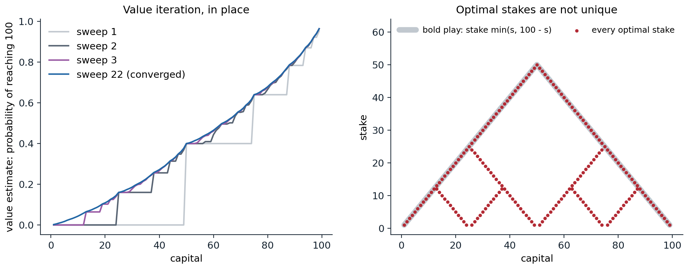
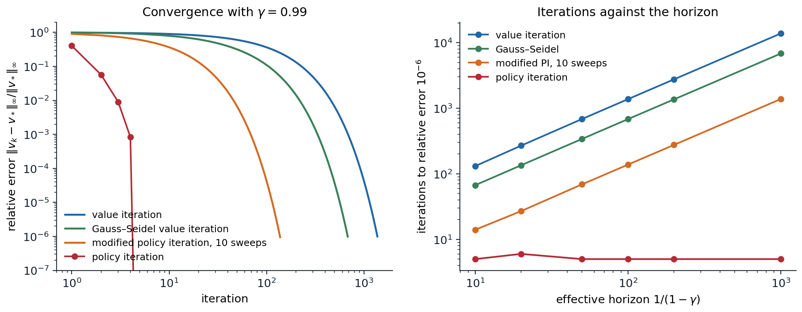

[ML Mastery Notes](../README.md) › [Reinforcement Learning](README.md)

# 2. Dynamic Programming

[← 1. Markov Decision Processes](01-markov-decision-processes.md) · [3. Multi-Armed Bandits →](03-multi-armed-bandits.md)

## <a id="planning-with-a-known-model"></a>Planning with a known model

### <a id="two-problems-and-two-operators"></a>Two problems and two operators

Dynamic programming (DP) computes value functions and optimal policies from a complete model of an MDP: the transition probabilities $`p(s'\mid s,a)`$ and expected rewards $`r(s,a)`$ of chapter 1. It solves two problems. **Policy evaluation**, or prediction, computes $`v_\pi`$ for a given policy. **Control** computes $`v_*`$ and an optimal policy. Both reduce to finding the fixed point of a Bellman operator, the expectation operator $`\mathcal T^\pi`$ for evaluation and the optimality operator $`\mathcal T`$ for control, and both operators are $`\gamma`$-contractions in the maximum norm (chapter 1, Appendix B):

$$
\|\mathcal T^\pi v-\mathcal T^\pi w\|_\infty\le\gamma\|v-w\|_\infty,\qquad\|\mathcal Tv-\mathcal Tw\|_\infty\le\gamma\|v-w\|_\infty .
$$

Almost everything in the discounted theory of this chapter follows from these two inequalities and from the monotonicity of the operators, $`v\le w\Rightarrow\mathcal Tv\le\mathcal Tw`$.

Requiring a complete model limits DP as a practical method, and its cost grows with the number of states, which is exponential in the number of state variables. But DP is the theoretical foundation of reinforcement learning: the methods of later chapters can be viewed as attempts to achieve the same effect with less computation and without a model, by replacing the expectations in the Bellman operators with samples (chapters 5–7) and the tables with function approximators (chapter 11).

## <a id="policy-evaluation"></a>Policy evaluation

### <a id="iterative-policy-evaluation"></a>Iterative policy evaluation

Starting from any $`v_0`$, **iterative policy evaluation** applies the expectation operator repeatedly:

$$
v_{k+1}(s)=\sum_a\pi(a\mid s)\Bigl[r(s,a)+\gamma\sum_{s'}p(s'\mid s,a)\,v_k(s')\Bigr]\quad\text{for all }s.
$$

Each application is an **expected update**, or backup: it replaces the value of every state by the expected immediate reward plus the discounted value of its successors, averaged over the policy and the dynamics. One pass over the states is a **sweep**. By the contraction property, $`\|v_k-v_\pi\|_\infty\le\gamma^k\|v_0-v_\pi\|_\infty`$, so the error shrinks geometrically at rate $`\gamma`$. The error cannot be observed directly, but the change between sweeps bounds it: if $`\|v_{k+1}-v_k\|_\infty\le\varepsilon`$, then

$$
\|v_{k+1}-v_\pi\|_\infty\le\frac{\gamma\,\varepsilon}{1-\gamma}
$$

(exercise 2.1), which gives a principled stopping rule. With $`\gamma=0.99`$ the error may be a hundred times the last change: a small change between sweeps does not mean the values are accurate.

There are two ways to implement a sweep. The **synchronous**, or Jacobi, version computes all new values from the old ones and needs two arrays. The **in-place**, or Gauss–Seidel, version overwrites each value as soon as it is computed, so later states in the sweep already use the new values of earlier ones. In-place updates are also contractions and usually converge faster, by an amount that depends on the order of the states. The code evaluates the random policy on Sutton and Barto's $`4\times4`$ gridworld, where two opposite corners are terminal, every move costs 1, and there is no discounting.

```python
import numpy as np

# Sutton and Barto's 4x4 gridworld (Example 4.1): the two shaded corners are terminal, every move costs 1,
# moves off the grid leave the agent in place, no discounting. Evaluate the equiprobable random policy.
n = 4
terminal = {0, n * n - 1}
moves = [(-1, 0), (1, 0), (0, 1), (0, -1)]


def successor(s, a):
    i, j = divmod(s, n)
    ni, nj = i + moves[a][0], j + moves[a][1]
    return ni * n + nj if 0 <= ni < n and 0 <= nj < n else s


def evaluate(in_place, theta=1e-4):
    v = np.zeros(n * n)
    sweeps = 0
    while True:
        sweeps += 1
        new = v if in_place else v.copy()                    # in place: later states see this sweep's values
        delta = 0.0
        for s in range(n * n):
            if s in terminal:
                continue
            x = np.mean([-1.0 + v[successor(s, a)] for a in range(4)])  # the Bellman expectation backup
            delta = max(delta, abs(x - v[s]))
            new[s] = x
        v = new
        if delta < theta:
            return v, sweeps


v_sync, k_sync = evaluate(in_place=False)
v_gs, k_gs = evaluate(in_place=True)
print(np.round(v_gs.reshape(n, n), 1))
print(f"sweeps to a maximum change below 1e-4: synchronous {k_sync}, in place {k_gs}")

# The same values from one linear solve on the non-terminal states: v = (I - Q)^{-1} r.
idx = [s for s in range(n * n) if s not in terminal]
Q = np.zeros((len(idx), len(idx)))
for row, s in enumerate(idx):
    for a in range(4):
        t = successor(s, a)
        if t not in terminal:
            Q[row, idx.index(t)] += 0.25
v_exact = np.linalg.solve(np.eye(len(idx)) - Q, -np.ones(len(idx)))
print(f"largest error of the in-place estimate: {np.abs(v_gs[idx] - v_exact).max():.1e}")
rho = np.abs(np.linalg.eigvals(Q)).max()                     # without discounting, the rate is set by Q
print(f"spectral radius of the non-terminal transition matrix: {rho:.4f}")
# [[  0. -14. -20. -22.]
#  [-14. -18. -20. -20.]
#  [-20. -20. -18. -14.]
#  [-22. -20. -14.   0.]]
# sweeps to a maximum change below 1e-4: synchronous 173, in place 114
# largest error of the in-place estimate: 1.1e-03
# spectral radius of the non-terminal transition matrix: 0.9468
```

The values are the negated expected numbers of steps a random walk needs to reach a corner, from 14 next to a corner to 22 in the far corners, as in Figure 4.1 of Sutton and Barto. In-place updates need a third fewer sweeps. The last lines expose the danger of the stopping rule without discounting: the sweeps stopped when no value changed by more than $`10^{-4}`$, yet the largest error is $`1.1\times10^{-3}`$. With $`\gamma=1`$, synchronous sweeps converge at the rate of the spectral radius $`\rho=0.947`$ of the transition matrix restricted to the non-terminal states, which plays the role of $`\gamma`$, so their error can exceed the last change by a factor of about $`\rho/(1-\rho)\approx18`$ (their final error is $`1.8\times10^{-3}`$). In-place sweeps converge faster, at a rate of about 0.92 here, and their error exceeds the last change by a factor of about 11.

### <a id="solving-the-linear-system"></a>Solving the linear system

For a fixed policy, the Bellman equation is linear, $`v_\pi=(I-\gamma P^\pi)^{-1}r^\pi`$, and a direct solver finds it in $`O(|\mathcal S|^3)`$ operations, as in chapter 1. A sweep costs $`O(|\mathcal S|^2|\mathcal A|)`$ operations for dense transitions, or $`O(|\mathcal S||\mathcal A|b)`$ if each action leads to at most $`b`$ successors, and reaching accuracy $`\varepsilon`$ takes about $`\log(1/\varepsilon)/(1-\gamma)`$ sweeps. Iteration wins for large, sparse problems and moderate horizons; direct solution wins for small, dense ones and discount factors near one. Krylov methods such as GMRES sit in between. What matters for reinforcement learning is that the iterative update is local, one state at a time from its successors, which is exactly what sampling can imitate: temporal-difference learning (chapter 6) replaces the expected update by an update from one sampled transition.

## <a id="policy-improvement"></a>Policy improvement

### <a id="the-policy-improvement-theorem"></a>The policy improvement theorem

Knowing $`v_\pi`$, can a better policy be found? Consider taking a different action $`a`$ in state $`s`$ once and following $`\pi`$ afterward. The value of doing so is $`q_\pi(s,a)=r(s,a)+\gamma\sum_{s'}p(s'\mid s,a)\,v_\pi(s')`$, computable from $`v_\pi`$ and the model. If it exceeds $`v_\pi(s)`$, it is better to take $`a`$ in $`s`$ once; the **policy improvement theorem** says it is then better to take it every time.

**Theorem.** Let $`\pi`$ and $`\pi'`$ be policies such that $`\sum_a\pi'(a\mid s)\,q_\pi(s,a)\ge v_\pi(s)`$ for every state $`s`$. Then $`v_{\pi'}(s)\ge v_\pi(s)`$ for every $`s`$. If the first inequality is strict in some state, the second is strict in that state.

The proof unrolls the assumption along trajectories of $`\pi'`$ ([Appendix A](#block-rl02-appendix-a)); it is also a special case of the performance difference lemma of chapter 1, since the assumption says that $`\pi'`$ has nonnegative expected advantage under $`\pi`$ in every state. The natural choice is the **greedy** policy,

$$
\pi'(s)\in\arg\max_a q_\pi(s,a)=\arg\max_a\Bigl[r(s,a)+\gamma\sum_{s'}p(s'\mid s,a)\,v_\pi(s')\Bigr],
$$

which satisfies the condition because a maximum is at least the average under $`\pi`$. In operator form, $`\pi'`$ is greedy with respect to $`v_\pi`$ exactly when $`\mathcal T^{\pi'}v_\pi=\mathcal Tv_\pi`$. Greedy improvement fails to improve only if $`\mathcal Tv_\pi=v_\pi`$, the Bellman optimality equation, and then $`\pi`$ is already optimal. So every policy is either optimal or strictly improved by one greedy step.

### <a id="policy-iteration"></a>Policy iteration

**Policy iteration** alternates the two steps: evaluate the current policy exactly, then make it greedy with respect to its values,

$$
\pi_0\xrightarrow{\ \text{evaluate}\ }v_{\pi_0}\xrightarrow{\ \text{improve}\ }\pi_1\xrightarrow{\ \text{evaluate}\ }v_{\pi_1}\xrightarrow{\ \text{improve}\ }\pi_2\longrightarrow\cdots\longrightarrow\pi_*.
$$

Each policy is strictly better than the previous one unless the previous one is already optimal, and a finite MDP has finitely many deterministic policies, so policy iteration terminates with an optimal policy after finitely many iterations. To avoid cycling between equally good policies, the improvement step should keep the current action when it is among the maximizers. Introduced by Howard (1960), building on Bellman's approximation in policy space, policy iteration typically needs remarkably few iterations: on Jack's car rental problem in Sutton and Barto, four improvements suffice for 441 states (exercise 2.3), and on the random MDPs below, four or five, whatever the discount factor.

The reason is visible in a stronger property. Since $`v_{\pi_k}\le\mathcal Tv_{\pi_k}=\mathcal T^{\pi_{k+1}}v_{\pi_k}`$, monotonicity gives $`v_{\pi_{k+1}}\ge\mathcal Tv_{\pi_k}`$: one step of policy iteration improves at least as much as one step of value iteration from the same point, and usually much more (exercise 2.4).

### <a id="policy-iteration-as-newton-s-method"></a>Policy iteration as Newton's method

The optimality operator $`\mathcal Tv=\max_\pi\mathcal T^\pi v`$ is a maximum of affine functions of $`v`$, hence convex and piecewise affine, and on each piece it coincides with the affine map $`\mathcal T^\pi`$ of the policy that is greedy there. The improvement step picks the piece at the current iterate, the linearization of $`\mathcal T`$ at $`v_{\pi_k}`$, and the evaluation step solves the linearized equation $`v=\mathcal T^{\pi_{k+1}}v`$ exactly. That is **Newton's method** for the equation $`\mathcal Tv-v=0`$ ([Puterman and Brumelle, 1979](https://doi.org/10.1287/moor.4.1.60)). Like Newton's method, policy iteration converges very fast once it is close to the solution, and in a piecewise-affine problem it lands exactly on the solution once it identifies the right piece. The convergence figure in the next section shows the errors of its iterates falling by a factor of six to eleven per iteration and then to zero. Bertsekas builds his treatment of reinforcement learning, including AlphaZero-style online play, on this Newton view (chapter 24).

The price is the evaluation: each iteration solves a linear system. **Modified policy iteration** ([Puterman and Shin, 1978](https://doi.org/10.1287/mnsc.24.11.1127)) evaluates only approximately, with $`m`$ sweeps of $`\mathcal T^{\pi_{k+1}}`$ starting from the current values; $`m=1`$ is value iteration and $`m=\infty`$ is policy iteration, and intermediate values usually beat both in total computation.

## <a id="value-iteration"></a>Value iteration

### <a id="iterating-the-optimality-operator"></a>Iterating the optimality operator

**Value iteration** skips the policy altogether and applies the optimality operator directly:

$$
v_{k+1}(s)=\max_a\Bigl[r(s,a)+\gamma\sum_{s'}p(s'\mid s,a)\,v_k(s')\Bigr].
$$

It is policy iteration with an evaluation of a single sweep, and it converges to $`v_*`$ from any start at rate $`\gamma`$, $`\|v_k-v_*\|_\infty\le\gamma^k\|v_0-v_*\|_\infty`$. Started from $`v_0=0`$, it has a second meaning: $`v_k`$ is the optimal expected return of the $`k`$-step problem, the finite-horizon values of chapter 1 (exercise 2.5), and value iteration looks ahead one step further with every sweep.

The **gambler's problem** of Sutton and Barto shows value iteration on a problem with a surprising answer. A gambler with capital $`s\in\{1,\dots,99\}`$ stakes any positive whole amount up to $`\min(s,100-s)`$ on a coin that comes up heads with probability 0.4, winning the stake on heads and losing it on tails; the episode ends at 0 or 100, with a reward of 1 for reaching 100. The value of a capital is its probability of reaching 100.

```python
import numpy as np

# The gambler's problem (Sutton and Barto, Example 4.3). With capital s in 1..99, the gambler stakes
# a in 1..min(s, 100 - s); a coin with heads probability 0.4 doubles or loses the stake. Reaching 100
# pays 1; every other reward is 0; no discounting. Value iteration on the probability of winning.
ph, goal = 0.4, 100
v = np.zeros(goal + 1)
v[goal] = 1.0                                                # the terminal win is given value 1 here


def backups(s, v):
    stakes = np.arange(1, min(s, goal - s) + 1)
    return stakes, ph * v[s + stakes] + (1 - ph) * v[s - stakes]


sweeps = 0
while True:
    sweeps += 1
    delta = 0.0
    for s in range(1, goal):                                 # in place, as Sutton and Barto do
        best = backups(s, v)[1].max()
        delta = max(delta, abs(best - v[s]))
        v[s] = best
    if delta < 1e-12:
        break
print(f"value iteration converged in {sweeps} sweeps")
for s in [10, 25, 50, 75, 90]:
    stakes, q = backups(s, v)
    optimal = stakes[q >= q.max() - 1e-9]
    print(f"capital {s:2d}: P(win) = {v[s]:.4f}, optimal stakes {optimal.tolist()}")
ties = [s for s in range(1, goal) if (backups(s, v)[1] >= backups(s, v)[1].max() - 1e-9).sum() > 1]
print(f"{len(ties)} of the 99 capitals have more than one optimal stake, from {ties[0]} to {ties[-1]}")
print(f"betting everything at 50 wins with probability {ph:.1f}; timid play (stake 1) from 50 wins with "
      f"probability {(1 - (0.6 / 0.4) ** 50) / (1 - (0.6 / 0.4) ** 100):.2e}")
# value iteration converged in 22 sweeps
# capital 10: P(win) = 0.0435, optimal stakes [10]
# capital 25: P(win) = 0.1600, optimal stakes [25]
# capital 50: P(win) = 0.4000, optimal stakes [50]
# capital 75: P(win) = 0.6400, optimal stakes [25]
# capital 90: P(win) = 0.8075, optimal stakes [10]
# 72 of the 99 capitals have more than one optimal stake, from 13 to 87
# betting everything at 50 wins with probability 0.4; timid play (stake 1) from 50 wins with probability 1.57e-09
```

With an unfavorable coin, the optimal strategy is **bold play**: stake as much as is useful, everything up to 50 and just enough to reach 100 above it. A gambler with 50 wins with probability 0.4 by staking it all, while staking one unit at a time wins with probability $`1.6\times10^{-9}`$, because every bet loses 0.2 units on average and a timid gambler makes many bets. Value iteration converges in 22 in-place sweeps. Bold play is not the only optimal strategy: for 72 of the 99 capitals, several stakes are exactly optimal, and the policy an algorithm reports depends on how it breaks ties. The figure shows all of them. Dubins and Savage proved the optimality of bold play for such subfair games in *How to Gamble If You Must* (1965); with a favorable coin the answer reverses (exercise 2.8).



*Value iteration on the gambler's problem with heads probability 0.4. Left: value estimates after the first three in-place sweeps and at convergence after 22; each sweep propagates the value of reaching 100 back through the capitals from which it can be reached with one more bet. The converged value has jumps at 25, 50, and 75, from which a single win reaches the next milestone. Right: every stake whose expected value is within $`10^{-9}`$ of the best (195 capital–stake pairs). Bold play, the gray line, is always optimal; the red dots off it are other optimal stakes, which bet to reach an intermediate milestone such as 25, 50, or 75 exactly.*

### <a id="error-bounds-and-stopping"></a>Error bounds and stopping

Value iteration's values converge only in the limit, but its greedy policy becomes optimal after finitely many iterations, often very few. Two bounds make this precise ([Appendix B](#block-rl02-appendix-b)). If a value function is within $`\delta`$ of $`v_*`$, $`\|v-v_*\|_\infty\le\delta`$, then any policy greedy with respect to it is within $`2\gamma\delta/(1-\gamma)`$ of optimal ([Singh and Yee, 1994](https://doi.org/10.1007/BF00993308)). And if two successive iterates satisfy $`\|v_{k+1}-v_k\|_\infty<\varepsilon(1-\gamma)/(2\gamma)`$, the policy greedy with respect to $`v_{k+1}`$ is $`\varepsilon`$-optimal (exercise 2.2). Since there are finitely many deterministic policies, and greedy policies are deterministic, there is also a gap between the value of an optimal policy and that of the best suboptimal deterministic one, and once $`2\gamma\delta/(1-\gamma)`$ falls below it, the greedy policy is exactly optimal.

The number of iterations to reach relative accuracy $`\varepsilon`$ is about $`\log(1/\varepsilon)/\log(1/\gamma)\approx\log(1/\varepsilon)/(1-\gamma)`$: proportional to the effective horizon. The code compares the four algorithms on random MDPs of 200 states and 4 actions, in which each action leads to five random successors, as the discount factor approaches one.

```python
import numpy as np

# A random "Garnet" MDP: 200 states, 4 actions, each action leads to 5 random successors.
rng = np.random.default_rng(0)
S, A, branch = 200, 4, 5
P = np.zeros((S, A, S))
for s in range(S):
    for a in range(A):
        nxt = rng.choice(S, branch, replace=False)
        P[s, a, nxt] = rng.dirichlet(np.ones(branch))
R = rng.uniform(0, 1, (S, A))


def evaluate(pi, gamma):                                    # exact policy evaluation by a linear solve
    return np.linalg.solve(np.eye(S) - gamma * P[np.arange(S), pi], R[np.arange(S), pi])


def policy_iteration(gamma):
    pi, iters = np.zeros(S, int), 0
    while True:
        iters += 1
        v = evaluate(pi, gamma)
        new = (R + gamma * P @ v).argmax(1)                  # greedy improvement
        if np.array_equal(new, pi):
            return v, pi, iters
        pi = new


def value_iteration(gamma, v_star, pi_star, gauss_seidel=False, m=1, tol=1e-6):
    """m = 1: value iteration; m > 1: modified policy iteration with m evaluation sweeps per improvement."""
    v, k, policy_found = np.zeros(S), 0, None
    while np.abs(v - v_star).max() > tol * np.abs(v_star).max():
        k += 1
        if gauss_seidel:
            for s in range(S):                               # each backup uses the newest values
                v[s] = (R[s] + gamma * P[s] @ v).max()
            pi = (R + gamma * P @ v).argmax(1)
        else:
            pi = (R + gamma * P @ v).argmax(1)
            for _ in range(m):                               # m backups with the greedy policy
                v = R[np.arange(S), pi] + gamma * P[np.arange(S), pi] @ v
        if policy_found is None and np.array_equal(pi, pi_star):
            policy_found = k
        elif not np.array_equal(pi, pi_star):
            policy_found = None
    return k, policy_found


print(" gamma  horizon |  PI  |    VI (policy found)  | Gauss-Seidel VI | MPI m=10")
for gamma in [0.9, 0.99, 0.999]:
    v_star, pi_star, k_pi = policy_iteration(gamma)
    k_vi, found = value_iteration(gamma, v_star, pi_star)
    k_gs, _ = value_iteration(gamma, v_star, pi_star, gauss_seidel=True)
    k_mpi, _ = value_iteration(gamma, v_star, pi_star, m=10)
    print(f"{gamma:6.3f} {1 / (1 - gamma):8.0f} | {k_pi:4d} | {k_vi:6d} ({found:5d})       | {k_gs:15d} | {k_mpi:8d}")
#  gamma  horizon |  PI  |    VI (policy found)  | Gauss-Seidel VI | MPI m=10
#  0.900       10 |    5 |    131 (    6)       |              67 |       14
#  0.990      100 |    5 |   1375 (    9)       |             682 |      138
#  0.999     1000 |    5 |  13809 (    9)       |            6824 |     1381
```

Value iteration's iteration counts match $`\ln(10^6)/\ln(1/\gamma)`$ almost exactly, 131, 1,375, and 13,809: here the worst-case rate is the actual rate. Its greedy policy is optimal after only 6 to 9 iterations, and the remaining thousands only refine the values. Gauss–Seidel sweeps halve the count. Ten evaluation sweeps per improvement divide the number of improvements by ten; the total number of sweeps is about the same, 1,381 × 10 against 13,809, but an evaluation sweep uses one action per state instead of a maximum over four, so the arithmetic falls by a factor of about three. Policy iteration needs five evaluations, four improvements and a final confirmation, for every discount factor, each evaluation costing a $`200\times200`$ linear solve.



*Left: relative error of the value estimates on the random MDP with $`\gamma=0.99`$, on logarithmic axes. Value iteration and its variants decrease the error by a constant factor per iteration, which appears as a curve that falls ever more steeply on these axes; policy iteration's errors fall by a factor of six to eleven per iteration and reach zero, up to rounding, at the fifth evaluation. Right: iterations needed to reach relative error $`10^{-6}`$ against the effective horizon $`1/(1-\gamma)`$, for $`\gamma`$ from 0.9 to 0.999. Value iteration, Gauss–Seidel value iteration, and modified policy iteration grow linearly with the horizon, with slopes 13.8, 6.8, and 1.4 iterations per unit of horizon; policy iteration stays at five or six evaluations.*

### <a id="asynchronous-dynamic-programming"></a>Asynchronous dynamic programming

Nothing requires sweeping the states in order, or at all. **Asynchronous** DP updates the values of states one at a time, in any order, using whatever values the others currently have; as long as every state keeps being updated, the values still converge to $`v_*`$ ([Bertsekas and Tsitsiklis, 1989](https://web.mit.edu/dimitrib/www/pdc.html)). The freedom is useful. Updates can be concentrated on the states whose values are changing most, as in **prioritized sweeping**, or on the states that an agent actually visits, as in **real-time dynamic programming**, which updates the states along simulated trajectories of the greedy policy and can find an optimal policy for the relevant states without ever touching most of the state space (chapter 10). Asynchronous updates also parallelize, since workers can update different states without waiting for each other.

### <a id="generalized-policy-iteration"></a>Generalized policy iteration

Policy iteration evaluates completely and then improves; value iteration improves after a single sweep; modified policy iteration sits between them; asynchronous DP interleaves the two at the level of single states. All are instances of **generalized policy iteration** (GPI), Sutton and Barto's name for any interaction between an evaluation process, which makes the value function consistent with the current policy, and an improvement process, which makes the policy greedy with respect to the current value function. The two processes compete, since making the policy greedy invalidates the values and updating the values makes the policy no longer greedy, but they cooperate toward a single joint solution: the only policy and value function that are consistent with each other and greedy with respect to each other are $`\pi_*`$ and $`v_*`$. Almost every method in this module is a form of GPI, with the evaluation done from samples, with function approximation, or only partially, and with the improvement done by a greedy step, a gradient step, or search.

## <a id="other-ways-to-solve-an-mdp"></a>Other ways to solve an MDP

### <a id="linear-programming"></a>Linear programming

The optimal value function is the smallest function that satisfies the Bellman inequalities $`v\ge\mathcal T^\pi v`$ for every policy, because any such $`v`$ satisfies $`v\ge\mathcal Tv`$ and hence, by monotonicity, $`v\ge\mathcal T^kv\to v_*`$. This gives the **primal linear program**: for any weights $`\mu(s)>0`$, taken below to sum to one so that $`\mu`$ is an initial distribution,

$$
\min_v\;\sum_s\mu(s)\,v(s)\quad\text{subject to}\quad v(s)\ge r(s,a)+\gamma\sum_{s'}p(s'\mid s,a)\,v(s')\ \text{ for all }s,a,
$$

with $`|\mathcal S|`$ variables and $`|\mathcal S||\mathcal A|`$ constraints, whose solution is $`v_*`$. Its **dual** has one variable $`x(s,a)\ge0`$ per constraint:

$$
\max_{x\ge0}\;\sum_{s,a}r(s,a)\,x(s,a)\quad\text{subject to}\quad\sum_ax(s',a)-\gamma\sum_{s,a}p(s'\mid s,a)\,x(s,a)=\mu(s')\ \text{ for all }s'.
$$

These are the flow constraints of chapter 1: the dual variables, scaled by $`1-\gamma`$, are the discounted occupancy measure of a policy, and the dual maximizes the expected return over all occupancy measures ([Appendix C](#block-rl02-appendix-c)). Complementary slackness says that $`x(s,a)>0`$ only where the primal constraint is tight, that is, only for actions that are greedy with respect to $`v_*`$.

```python
import numpy as np
from scipy.optimize import linprog

# A Garnet MDP small enough for a generic LP solver: 50 states, 3 actions, 4 successors each.
rng = np.random.default_rng(1)
S, A, gamma = 50, 3, 0.95
P = np.zeros((S, A, S))
for s in range(S):
    for a in range(A):
        nxt = rng.choice(S, 4, replace=False)
        P[s, a, nxt] = rng.dirichlet(np.ones(4))
R = rng.uniform(0, 1, (S, A))
mu = np.full(S, 1 / S)

# Primal LP: minimize mu.v subject to v(s) >= r(s,a) + gamma sum_s' p(s'|s,a) v(s') for every (s, a).
E = np.repeat(np.eye(S), A, axis=0)                          # row (s, a) picks out v(s)
G = E - gamma * P.reshape(S * A, S)                          # constraint rows: (e_s - gamma p(.|s,a)) . v >= r(s,a)
primal = linprog(mu, A_ub=-G, b_ub=-R.ravel(), bounds=[(None, None)] * S, method="highs")

# Dual LP: maximize sum r(s,a) x(s,a) over x >= 0 with the flow constraints G^T x = mu.
# Its solution is (1 - gamma)^-1 times the discounted occupancy measure of an optimal policy.
dual = linprog(-R.ravel(), A_eq=G.T, b_eq=mu, bounds=[(0, None)] * (S * A), method="highs")
x = dual.x.reshape(S, A)

# Policy iteration for comparison.
pi = np.zeros(S, int)
while True:
    v = np.linalg.solve(np.eye(S) - gamma * P[np.arange(S), pi], R[np.arange(S), pi])
    new = (R + gamma * P @ v).argmax(1)
    if np.array_equal(new, pi):
        break
    pi = new
print(f"primal optimum mu.v = {primal.fun:.6f}, dual optimum = {-dual.fun:.6f}, policy iteration mu.v = {mu @ v:.6f}")
print(f"primal solution equals v* of policy iteration: {np.allclose(primal.x, v, atol=1e-8)}")
print(f"states with more than one action in the dual solution: {int(((x > 1e-10).sum(1) > 1).sum())}")
print(f"dual policy equals the policy-iteration policy: {np.array_equal(x.argmax(1), pi)}")
print(f"occupancy (1 - gamma) x sums to {(1 - gamma) * x.sum():.6f}")
# primal optimum mu.v = 15.783865, dual optimum = 15.783865, policy iteration mu.v = 15.783865
# primal solution equals v* of policy iteration: True
# states with more than one action in the dual solution: 0
# dual policy equals the policy-iteration policy: True
# occupancy (1 - gamma) x sums to 1.000000
```

The two programs and policy iteration agree to all printed digits, and the dual solution puts its weight on a single action in every state, as a basic solution of a linear program must. Linear programming is rarely the fastest way to solve a tabular MDP, but the formulation is valuable for what it allows: interior-point methods solve MDPs in time polynomial in the size of the input; additional linear constraints on expected costs give the **constrained MDPs** of chapter 31, whose solutions may randomize; restricting $`v`$ to a linear combination of features gives the **approximate linear programming** approach to large problems ([de Farias and Van Roy, 2003](https://doi.org/10.1287/opre.51.6.850.24925)); and the dual, optimization over occupancy measures, underlies several offline RL methods (chapter 26).

### <a id="finite-horizons-and-backward-induction"></a>Finite horizons and backward induction

With a horizon of $`H`$ steps, the optimal values $`v^{(h)}_*`$ for $`h`$ steps to go are computed by $`H`$ applications of $`\mathcal T`$ starting from $`v^{(0)}_*=0`$, and the optimal policy with $`h`$ steps to go is greedy with respect to $`v^{(h-1)}_*`$. This **backward induction** is exact after exactly $`H`$ sweeps, with no convergence question, and the resulting policy is time-dependent. It is how the finite-horizon tiger values of chapter 1 were computed, with beliefs in place of states, and how the linear–quadratic regulator of chapter 15 is derived, with quadratic value functions that remain quadratic under the backup.

### <a id="average-reward"></a>Average reward

For continuing tasks with no natural discount, the **average reward**, or **gain**, of a policy is

$$
g^\pi=\lim_{T\to\infty}\frac1T\,\mathbb E_\pi\Bigl[\sum_{t=1}^TR_t\Bigr],
$$

which, when the Markov chain of $`\pi`$ has a single recurrent class, possibly with transient states, does not depend on the starting state and equals the stationary expected reward $`\sum_s\pi_\infty(s)\,r^\pi(s)`$ (an MDP is **unichain** when every deterministic stationary policy has this property). Values are then measured relative to the gain: the **bias**, or differential value, $`h^\pi(s)=\mathbb E_\pi\bigl[\sum_t(R_{t+1}-g^\pi)\mid S_0=s\bigr]`$ (a Cesàro limit if the chain is periodic), satisfies $`g^\pi+h^\pi=r^\pi+P^\pi h^\pi`$, and the optimal gain and bias satisfy the **average-reward optimality equation**

$$
g_*+h_*(s)=\max_a\Bigl[r(s,a)+\sum_{s'}p(s'\mid s,a)\,h_*(s')\Bigr],
$$

which determines $`h_*`$ up to an additive constant. **Relative value iteration** solves it by applying the undiscounted operator and subtracting the value of a reference state after each sweep; the subtracted amount converges to the gain for aperiodic unichain MDPs. These conditions are sufficient, not necessary: the recycling robot of exercise 2.7 is not unichain, since waiting in both states gives two recurrent classes, but it is communicating, and relative value iteration still converges on it.

The discounted and average criteria are closely related. As $`\gamma\to1`$, the discounted values of a policy expand as $`v_\pi^\gamma=g^\pi/(1-\gamma)+h^\pi+O(1-\gamma)`$, so $`(1-\gamma)v_\pi^\gamma\to g^\pi`$. [Blackwell (1962)](https://doi.org/10.1214/aoms/1177704593) showed that some deterministic stationary policy is optimal for all discount factors sufficiently close to one; such a **Blackwell-optimal** policy also maximizes the average reward. Exercise 2.7 checks these relations on the recycling robot. The average-reward criterion returns in chapter 11, where it is the natural objective for continuing tasks with function approximation.

## <a id="how-hard-is-it-to-solve-an-mdp"></a>How hard is it to solve an MDP?

### <a id="complexity"></a>Complexity

Linear programming solves an MDP in time polynomial in the number of states, actions, and bits needed to write the model. Better, for a fixed discount factor, policy iteration is **strongly polynomial**: [Ye (2011)](https://doi.org/10.1287/moor.1110.0516) proved that the number of iterations is bounded by a polynomial in the numbers of states and actions and in $`1/(1-\gamma)`$, independent of the rewards and transition probabilities, and later work sharpened the bound to roughly the number of state–action pairs times $`1/(1-\gamma)`$, up to a logarithmic factor ([Scherrer, 2016](https://arxiv.org/abs/1306.0386)). Value iteration is not strongly polynomial: the number of iterations it needs to identify an optimal policy can grow without bound as the gap between the best and second-best actions shrinks. The strong bounds need discounting: without it, there are MDPs on which policy iteration needs exponentially many iterations ([Fearnley, 2010](https://arxiv.org/abs/1003.3418)). In practice policy iteration's iteration count is small and nearly constant, as in the figure above, and the cost of each iteration dominates.

A lower bound on any method that reads the model is the size of the model, $`|\mathcal S|^2|\mathcal A|`$ numbers. When the model can only be sampled, the question becomes how many samples are needed, a question of chapter 30.

### <a id="the-curse-of-dimensionality"></a>The curse of dimensionality

Bellman coined the term **curse of dimensionality** for the fact that the number of states grows exponentially with the number of state variables: a robot arm with seven joints, each position discretized into 100 values and each velocity into 100, has $`10^{28}`$ states. No tabular method can store a value per state, let alone sweep them. Three ideas make large problems tractable, and each is developed later. **Sampling** replaces sums over successors by samples and sweeps over states by the states actually visited (chapters 5–7). **Function approximation** replaces tables by parameterized functions that generalize across states (chapter 11, and deep networks throughout Part II). **Decision-time planning** computes values only for the current state and its likely futures, by search (chapter 10, chapter 24). Dynamic programming remains the reference point for all three: each can be understood as an approximation to the Bellman backups of this chapter.

Lab 1 applies policy iteration and value iteration to Gymnasium's FrozenLake and Taxi environments, checks the answers by simulation, and compares the discounted objective with the time limits the environments impose.

## <a id="exercises"></a>Exercises

### <a id="exercise-2-1-stopping-iterative-policy-evaluation"></a>Exercise 2.1 — Stopping iterative policy evaluation

Show that if $`\|v_{k+1}-v_k\|_\infty\le\varepsilon`$ for the iterates of policy evaluation with $`\gamma<1`$, then $`\|v_{k+1}-v_\pi\|_\infty\le\gamma\varepsilon/(1-\gamma)`$. Show by example that the bound can be attained.


<details>
<summary><b>Solution</b></summary>


Since $`v_\pi=\mathcal T^\pi v_\pi`$ and $`v_{k+1}=\mathcal T^\pi v_k`$,

$$
\|v_{k+1}-v_\pi\|_\infty\le\gamma\|v_k-v_\pi\|_\infty\le\gamma\bigl(\|v_k-v_{k+1}\|_\infty+\|v_{k+1}-v_\pi\|_\infty\bigr),
$$

and rearranging gives $`(1-\gamma)\|v_{k+1}-v_\pi\|_\infty\le\gamma\varepsilon`$. For equality, take a single state with reward 1 and a self-loop, so $`v_\pi=1/(1-\gamma)`$, and start from $`v_0=0`$: then $`v_k=(1-\gamma^k)/(1-\gamma)`$, the change is $`\gamma^k`$, and the error of $`v_{k+1}`$ is $`\gamma^{k+1}/(1-\gamma)=\gamma\cdot\gamma^k/(1-\gamma)`$. The same one-state example shows that value iteration's rate $`\gamma`$ cannot be improved in general, as observed in the random MDPs of the chapter.

</details>


### <a id="exercise-2-2-when-to-stop-value-iteration"></a>Exercise 2.2 — When to stop value iteration

Show that if $`\|v_{k+1}-v_k\|_\infty<\varepsilon(1-\gamma)/(2\gamma)`$, then the policy $`\pi`$ greedy with respect to $`v_{k+1}`$ satisfies $`\|v_\pi-v_*\|_\infty<\varepsilon`$.


<details>
<summary><b>Solution</b></summary>


Write $`\delta=\|v_{k+1}-v_k\|_\infty`$. As in exercise 2.1 with $`\mathcal T`$ in place of $`\mathcal T^\pi`$, $`\|v_{k+1}-v_*\|_\infty\le\gamma\delta/(1-\gamma)`$. Since $`\pi`$ is greedy, $`\mathcal T^\pi v_{k+1}=\mathcal Tv_{k+1}`$, so

$$
\|v_\pi-v_{k+1}\|_\infty\le\|\mathcal T^\pi v_\pi-\mathcal T^\pi v_{k+1}\|_\infty+\|\mathcal Tv_{k+1}-\mathcal Tv_k\|_\infty\le\gamma\|v_\pi-v_{k+1}\|_\infty+\gamma\delta,
$$

which gives $`\|v_\pi-v_{k+1}\|_\infty\le\gamma\delta/(1-\gamma)`$. By the triangle inequality, $`\|v_\pi-v_*\|_\infty\le2\gamma\delta/(1-\gamma)<\varepsilon`$. This is the standard stopping rule of value iteration (Puterman, theorem 6.3.1).

</details>


### <a id="exercise-2-3-jack-s-car-rental"></a>Exercise 2.3 — Jack's car rental

Jack manages two locations of a car rental company. Each day, the numbers of customers requesting cars at the two locations are Poisson with means 3 and 4, and the numbers of cars returned are Poisson with means 3 and 2; a rented car earns 10, and a request that cannot be served is lost. Each location holds at most 20 cars (extra returns disappear), and overnight Jack can move up to 5 cars between the locations at a cost of 2 per car. With $`\gamma=0.9`$ and states given by the numbers of cars at the end of each day, find the optimal policy by policy iteration, starting from the policy that never moves cars.


<details>
<summary><b>Solution</b></summary>


The two locations evolve independently given the morning counts, so the transition matrix of each location can be computed once and the joint transition is their outer product. Evaluation solves a $`441\times441`$ linear system; improvement maximizes over the 11 possible moves.

```python
import numpy as np
from scipy.stats import poisson

# Jack's car rental (Sutton and Barto, Example 4.2), solved by policy iteration.
N, gamma, max_move = 20, 0.9, 5
lam_req, lam_ret = (3, 4), (3, 2)


def location(lam_q, lam_r):
    """T[m, n']: distribution of tomorrow's cars given m cars in the morning; E[m]: expected rentals."""
    T, E = np.zeros((N + 1, N + 1)), np.zeros(N + 1)
    for m in range(N + 1):
        for q in range(N + 1):                               # requests; the tail beyond m rents m cars
            pq = poisson.pmf(q, lam_q) if q < m else poisson.sf(m - 1, lam_q)
            rented = min(q, m)
            E[m] += pq * rented
            left = m - rented
            for r in range(N + 1):                           # returns; cars beyond N are lost
                pr = poisson.pmf(r, lam_r) if r < N - left else poisson.sf(N - left - 1, lam_r)
                T[m, min(left + r, N)] += pq * pr
                if left + r >= N:
                    break
            if q >= m:
                break
    return T, E


(T1, E1), (T2, E2) = location(lam_req[0], lam_ret[0]), location(lam_req[1], lam_ret[1])
reward = 10 * (E1[:, None] + E2[None, :])                    # expected rental income by morning counts
n1, n2 = np.meshgrid(np.arange(N + 1), np.arange(N + 1), indexing="ij")
actions = np.arange(-max_move, max_move + 1)                 # cars moved from location 1 to location 2


def after_move(a):
    ok = (a <= n1) & (-a <= n2)                              # cannot move cars that are not there
    return np.minimum(n1 - a, N), np.minimum(n2 + a, N), ok


def q_values(v):
    W = T1 @ v @ T2.T                                        # expected next value for each morning (m1, m2)
    q = np.full((len(actions), N + 1, N + 1), -np.inf)
    for k, a in enumerate(actions):
        m1, m2, ok = after_move(a)
        q[k][ok] = (-2 * abs(a) + reward[m1, m2] + gamma * W[m1, m2])[ok]
    return q


policy, it = np.zeros((N + 1, N + 1), int), 0
while True:
    it += 1
    # exact evaluation: build the 441 x 441 transition matrix of the current policy
    P, r = np.zeros(((N + 1) ** 2, (N + 1) ** 2)), np.zeros((N + 1) ** 2)
    for i in range(N + 1):
        for j in range(N + 1):
            a = policy[i, j]
            m1, m2 = min(i - a, N), min(j + a, N)
            P[i * (N + 1) + j] = np.outer(T1[m1], T2[m2]).ravel()
            r[i * (N + 1) + j] = -2 * abs(a) + reward[m1, m2]
    v = np.linalg.solve(np.eye((N + 1) ** 2) - gamma * P, r).reshape(N + 1, N + 1)
    new = actions[q_values(v).argmax(0)]
    changed = int((new != policy).sum())
    print(f"iteration {it}: v(0,0) = {v[0, 0]:6.1f}, v(20,20) = {v[20, 20]:6.1f}, policy changes in {changed} states")
    if changed == 0:
        break
    policy = new
print("cars moved from location 1 to 2 with 20 cars at location 1 and 0, 5, 10, 15, 20 at location 2:",
      policy[20, ::5].tolist())
# iteration 1: v(0,0) =  407.2, v(20,20) =  611.4, policy changes in 318 states
# iteration 2: v(0,0) =  418.4, v(20,20) =  627.3, policy changes in 272 states
# iteration 3: v(0,0) =  421.3, v(20,20) =  636.7, policy changes in 79 states
# iteration 4: v(0,0) =  421.4, v(20,20) =  637.0, policy changes in 8 states
# iteration 5: v(0,0) =  421.4, v(20,20) =  637.0, policy changes in 0 states
# cars moved from location 1 to 2 with 20 cars at location 1 and 0, 5, 10, 15, 20 at location 2: [5, 4, 2, 1, 0]
```

Policy iteration makes four improvements, changing the action in 318, 272, 79, and 8 states, and the fifth improvement step changes nothing. The final policy mostly moves cars toward the second location, where demand is higher and returns are fewer, and moves more the more unbalanced the counts are: with 20 cars at the first location and none at the second, it moves the maximum of 5. When the first location is nearly empty and the second nearly full, it moves up to 4 cars the other way, as in the negative region of Figure 4.2. The shape of the policy matches Figure 4.2 of Sutton and Barto, which also converges after four improvements; the exact values depend on how the Poisson tails at the capacity limits are handled.

</details>


### <a id="exercise-2-4-policy-iteration-is-at-least-as-fast-as-value-iteration"></a>Exercise 2.4 — Policy iteration is at least as fast as value iteration

Show that the policies of policy iteration satisfy $`v_{\pi_{k+1}}\ge\mathcal Tv_{\pi_k}`$, and deduce that $`\|v_{\pi_k}-v_*\|_\infty\le\gamma^k\|v_{\pi_0}-v_*\|_\infty`$.


<details>
<summary><b>Solution</b></summary>


Greedy improvement gives $`\mathcal T^{\pi_{k+1}}v_{\pi_k}=\mathcal Tv_{\pi_k}\ge\mathcal T^{\pi_k}v_{\pi_k}=v_{\pi_k}`$. Applying the monotone operator $`\mathcal T^{\pi_{k+1}}`$ repeatedly to $`v_{\pi_k}\le\mathcal T^{\pi_{k+1}}v_{\pi_k}`$ gives an increasing sequence that converges to its fixed point $`v_{\pi_{k+1}}`$, so $`v_{\pi_{k+1}}\ge\mathcal T^{\pi_{k+1}}v_{\pi_k}=\mathcal Tv_{\pi_k}`$. Since also $`v_{\pi_{k+1}}\le v_*`$,

$$
0\le v_*-v_{\pi_{k+1}}\le v_*-\mathcal Tv_{\pi_k}=\mathcal Tv_*-\mathcal Tv_{\pi_k},
$$

whose maximum norm is at most $`\gamma\|v_*-v_{\pi_k}\|_\infty`$. Induction gives the claim. Monotonicity of $`\mathcal T`$ gives more: by induction, $`v_{\pi_k}\ge\mathcal T^kv_{\pi_0}`$, so policy iteration dominates value iteration started from $`v_{\pi_0}`$ state by state and iteration by iteration, at the cost of a policy evaluation per iteration.

</details>


### <a id="exercise-2-5-value-iteration-computes-finite-horizon-values"></a>Exercise 2.5 — Value iteration computes finite-horizon values

Show that value iteration started from $`v_0=0`$ produces $`v_k=v^{(k)}_*`$, the optimal expected return over $`k`$ steps, and that a policy greedy with respect to $`v_{k-1}`$ is an optimal first action for the $`k`$-step problem. Explain why the finite-horizon tiger values of chapter 1 are value iteration on the belief MDP.


<details>
<summary><b>Solution</b></summary>


By induction: $`v_0=0=v^{(0)}_*`$, and the backward-induction recursion for $`v^{(k)}_*`$ is exactly $`v^{(k)}_*=\mathcal Tv^{(k-1)}_*`$, the value-iteration update. The optimal first action with $`k`$ steps to go maximizes $`r(s,a)+\gamma\sum_{s'}p(s'\mid s,a)v^{(k-1)}_*(s')`$, which is greedy with respect to $`v_{k-1}`$. The tiger computation applied the same backup to value functions over beliefs, represented as maxima of linear functions (α-vectors), starting from zero; each backup added one step to the horizon. As $`k\to\infty`$ with $`\gamma<1`$, the finite-horizon values converge to the infinite-horizon ones, and the policies with many steps to go converge to a stationary optimal policy, as in the right panel of the tiger figure.

</details>


### <a id="exercise-2-6-the-dual-linear-program"></a>Exercise 2.6 — The dual linear program

Derive the dual of the primal linear program from its Lagrangian, and use complementary slackness to show that any optimal dual solution defines an optimal policy.


<details>
<summary><b>Solution</b></summary>


With multipliers $`x(s,a)\ge0`$ for the constraints $`r(s,a)+\gamma\sum_{s'}p(s'\mid s,a)v(s')-v(s)\le0`$, the Lagrangian is

$$
L(v,x)=\sum_s\mu(s)v(s)+\sum_{s,a}x(s,a)\Bigl[r(s,a)+\gamma\sum_{s'}p(s'\mid s,a)v(s')-v(s)\Bigr].
$$

It is linear in the unconstrained $`v`$, so $`\min_vL`$ is $`-\infty`$ unless the coefficient of every $`v(s')`$ vanishes: $`\mu(s')+\gamma\sum_{s,a}p(s'\mid s,a)x(s,a)-\sum_ax(s',a)=0`$, the flow constraint. Then $`L=\sum_{s,a}r(s,a)x(s,a)`$, and the dual maximizes it over nonnegative $`x`$ satisfying the flow constraints. At optimal solutions, complementary slackness says $`x(s,a)>0`$ only where $`v_*(s)=r(s,a)+\gamma\sum_{s'}p(s'\mid s,a)v_*(s')`$, that is, only on greedy actions. With $`\mu>0`$, every state has $`\sum_ax(s,a)\ge\mu(s)>0`$, so the policy $`\pi(a\mid s)\propto x(s,a)`$ is defined everywhere and uses only greedy actions, and a policy that is greedy with respect to $`v_*`$ is optimal.

</details>


### <a id="exercise-2-7-average-reward-on-the-recycling-robot"></a>Exercise 2.7 — Average reward on the recycling robot

For the recycling robot of chapter 1 with $`\alpha=0.8`$ and $`\beta=0.4`$, compute the optimal gain and bias by relative value iteration, and compare the gain with $`(1-\gamma)v_*^\gamma`$ for $`\gamma=0.9`$, 0.99, and 0.999.


<details>
<summary><b>Solution</b></summary>


```python
import numpy as np

# The recycling robot of chapter 1 (alpha = 0.8, beta = 0.4) under the average-reward criterion.
alpha, beta = 0.8, 0.4
P = np.zeros((2, 3, 2)); R = np.full((2, 3), -np.inf)      # recharging is not allowed when high
P[0, 0], R[0, 0] = [alpha, 1 - alpha], 2.0                 # high: search
P[0, 1], R[0, 1] = [1, 0], 1.0                             # high: wait
P[1, 0], R[1, 0] = [1 - beta, beta], beta * 2 + (1 - beta) * -3.0
P[1, 1], R[1, 1] = [0, 1], 1.0
P[1, 2], R[1, 2] = [1, 0], 0.0

# Relative value iteration: h <- T h - (T h)(reference state); the subtracted amount converges to the gain.
h = np.zeros(2)
for k in range(200):
    Th = (R + P @ h).max(1)
    g, h = Th[0], Th - Th[0]
print(f"gain {g:.4f}, bias h = {np.round(h, 4)}, policy {(R + P @ h).argmax(1)} (0 search, 1 wait, 2 recharge)")

# The discounted values, scaled by 1 - gamma, approach the gain as gamma -> 1.
for gamma in [0.9, 0.99, 0.999]:
    v = np.zeros(2)
    for _ in range(40_000):
        v = (R + gamma * P @ v).max(1)
    print(f"gamma {gamma}: (1 - gamma) v* = {np.round((1 - gamma) * v, 4)}, policy {(R + gamma * P @ v).argmax(1)}")
# gain 1.6667, bias h = [ 0.     -1.6667], policy [0 2] (0 search, 1 wait, 2 recharge)
# gamma 0.9: (1 - gamma) v* = [1.6949 1.5254], policy [0 2]
# gamma 0.99: (1 - gamma) v* = [1.6694 1.6528], policy [0 2]
# gamma 0.999: (1 - gamma) v* = [1.6669 1.6653], policy [0 2]
```

The optimal policy searches when high and recharges when low. Its chain goes from high to low with probability 0.2 and always returns, so it spends $`1/1.2=5/6`$ of its time high, and its gain is $`\frac56\cdot2+\frac16\cdot0=5/3`$. The bias says that starting in the low state is worth $`5/3`$ less in total than starting high: the robot first spends a step recharging, which earns 0 instead of the average reward of $`5/3`$. The scaled discounted values approach the gain from both states, with differences between them that shrink like $`(1-\gamma)(h(\text{high})-h(\text{low}))`$, as the expansion $`v^\gamma=g/(1-\gamma)+h+O(1-\gamma)`$ predicts; the discounted optimal policy is the same for all three discount factors.

</details>


### <a id="exercise-2-8-favorable-and-fair-coins"></a>Exercise 2.8 — Favorable and fair coins

Solve the gambler's problem with heads probability 0.55 and with 0.5. Which strategies are optimal, and why?


<details>
<summary><b>Solution</b></summary>


```python
import numpy as np

# The gambler's problem with a favorable coin (heads probability 0.55) and with a fair one.
def solve(ph, goal=100):
    v = np.zeros(goal + 1); v[goal] = 1.0
    while True:
        delta = 0.0
        for s in range(1, goal):
            st = np.arange(1, min(s, goal - s) + 1)
            best = (ph * v[s + st] + (1 - ph) * v[s - st]).max()
            delta = max(delta, abs(best - v[s])); v[s] = best
        if delta < 1e-13:
            return v


for ph in [0.55, 0.5]:
    v = solve(ph)
    stakes = []
    for s in [10, 30, 50]:
        st = np.arange(1, min(s, 100 - s) + 1)
        q = ph * v[s + st] + (1 - ph) * v[s - st]
        opt = st[q >= q.max() - 1e-12]
        stakes.append(f"capital {s}: P(win) {v[s]:.6f}, optimal stakes {opt.min()}..{opt.max()} ({len(opt)} of {len(st)})")
    print(f"heads probability {ph}:"); print("  " + "\n  ".join(stakes))
# heads probability 0.55:
#   capital 10: P(win) 0.865569, optimal stakes 1..1 (1 of 10)
#   capital 30: P(win) 0.997571, optimal stakes 1..1 (1 of 30)
#   capital 50: P(win) 0.999956, optimal stakes 1..1 (1 of 50)
# heads probability 0.5:
#   capital 10: P(win) 0.100000, optimal stakes 1..10 (10 of 10)
#   capital 30: P(win) 0.300000, optimal stakes 1..30 (30 of 30)
#   capital 50: P(win) 0.500000, optimal stakes 1..50 (50 of 50)
```

With a favorable coin, the optimal stake is 1: each bet gains in expectation, so the gambler wants as many bets as possible and the smallest variance per bet, and **timid play** wins with probability $`(1-(q/p)^s)/(1-(q/p)^{100})`$, the gambler's-ruin formula, for example 0.866 from a capital of 10. With a fair coin, the capital is a martingale, so every strategy that ends with probability one reaches 100 with probability $`s/100`$, and every stake is optimal. The three cases show how the solution of an MDP can change qualitatively with a parameter: bold, indifferent, timid.

</details>


## <a id="appendices"></a>Appendices


<details>
<summary><a id="block-rl02-appendix-a"></a><b>A. The policy improvement theorem</b></summary>


Assume $`\sum_a\pi'(a\mid s)q_\pi(s,a)\ge v_\pi(s)`$ for all $`s`$, which in operator form reads $`\mathcal T^{\pi'}v_\pi\ge v_\pi`$. Applying the monotone operator $`\mathcal T^{\pi'}`$ repeatedly,

$$
v_\pi\le\mathcal T^{\pi'}v_\pi\le(\mathcal T^{\pi'})^2v_\pi\le\cdots\le(\mathcal T^{\pi'})^kv_\pi\to v_{\pi'},
$$

since $`(\mathcal T^{\pi'})^k`$ converges to its fixed point from any start. So $`v_\pi\le v_{\pi'}`$. Read along trajectories, $`(\mathcal T^{\pi'})^kv_\pi(s)`$ is the expected return of following $`\pi'`$ for $`k`$ steps and $`\pi`$ afterward, and each extra step of $`\pi'`$ helps. If $`\mathcal T^{\pi'}v_\pi(s)>v_\pi(s)`$ in some state $`s`$, then $`v_{\pi'}(s)\ge(\mathcal T^{\pi'})v_\pi(s)>v_\pi(s)`$, since the sequence is nondecreasing.

**Termination of policy iteration.** If $`\pi_{k+1}`$ is greedy with respect to $`v_{\pi_k}`$ and differs from $`\pi_k`$ only where it achieves a strictly larger backed-up value, then either $`\mathcal Tv_{\pi_k}=v_{\pi_k}`$, in which case $`v_{\pi_k}=v_*`$ and no action is strictly better, so $`\pi_{k+1}=\pi_k`$ and the algorithm stops, or $`v_{\pi_{k+1}}\ge v_{\pi_k}`$ with strict inequality somewhere. The values therefore strictly increase in the partial order, no policy repeats, and since there are finitely many deterministic policies, the algorithm stops at an optimal one.

</details>


<details>
<summary><a id="block-rl02-appendix-b"></a><b>B. The value of a greedy policy</b></summary>


Let $`\|v-v_*\|_\infty\le\delta`$ and let $`\pi`$ be greedy with respect to $`v`$, so $`\mathcal T^\pi v=\mathcal Tv`$. Then

$$
v_*-v_\pi=(\mathcal Tv_*-\mathcal Tv)+(\mathcal T^\pi v-\mathcal T^\pi v_\pi),
$$

and taking norms, $`\|v_*-v_\pi\|_\infty\le\gamma\delta+\gamma\|v-v_\pi\|_\infty\le\gamma\delta+\gamma(\delta+\|v_*-v_\pi\|_\infty)`$. Rearranging gives

$$
\|v_*-v_\pi\|_\infty\le\frac{2\gamma\delta}{1-\gamma}.
$$

The factor $`1/(1-\gamma)`$ is the price of acting greedily on an inaccurate value function: a small error in every state can be exploited by the greedy policy at every step of a long horizon. The same factor, squared, reappears in the error bounds of approximate value and policy iteration, $`2\gamma\delta/(1-\gamma)^2`$ (chapter 12), where $`\delta`$ is the approximation error at each iteration. The bound cannot be improved. Suppose a state offers a self-loop with reward $`c`$ and a move with reward $`R=(c+2\gamma\delta)/(1-\gamma)`$ to an absorbing state worth 0. Moving is optimal, yet overestimating the first state by $`\delta`$ and underestimating the absorbing state by $`\delta`$ makes the loop a greedy choice, and the loop loses exactly $`2\gamma\delta/(1-\gamma)`$.

</details>


<details>
<summary><a id="block-rl02-appendix-c"></a><b>C. Linear programming duality for MDPs</b></summary>


**Primal.** Any feasible $`v`$ satisfies $`v\ge\mathcal T^\pi v`$ for every $`\pi`$, hence $`v\ge\mathcal Tv\ge\mathcal T^2v\ge\cdots\to v_*`$; and $`v_*`$ is feasible. So with $`\mu>0`$, $`v_*`$ is the unique minimizer of $`\mu^\top v`$.

**Dual.** Exercise 2.6 derives the dual. By chapter 1, Appendix C, its feasible set is exactly the set of vectors $`x=d^\pi_\mu/(1-\gamma)`$ for stationary policies $`\pi`$, and its objective is $`\sum r\,x=J(\pi)`$. So the dual optimum is $`\max_\pi J(\pi)=\mu^\top v_*`$, equal to the primal optimum, as strong duality requires.

**Vertices are deterministic policies.** The dual has $`|\mathcal S|`$ equality constraints. A basic feasible solution has at most $`|\mathcal S|`$ nonzero variables, and each state has $`\sum_ax(s,a)\ge\mu(s)>0`$, so exactly one action per state is positive: the vertices of the dual polytope are the occupancy measures of deterministic policies. Conversely, the occupancy of each deterministic policy is a vertex, because its $`|\mathcal S|`$ columns form the invertible matrix $`(I-\gamma P^\pi)^\top`$. The simplex method moving between adjacent vertices changes the action in one state at a time, which makes it a variant of policy iteration that switches one action per iteration; Howard's policy iteration switches all improvable actions at once.

</details>

---

[← 1. Markov Decision Processes](01-markov-decision-processes.md) · [3. Multi-Armed Bandits →](03-multi-armed-bandits.md)
