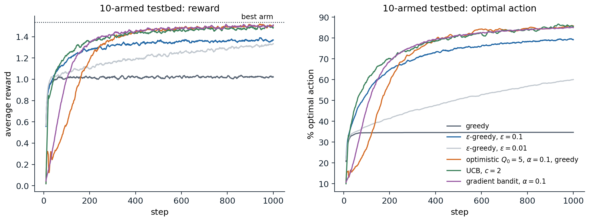
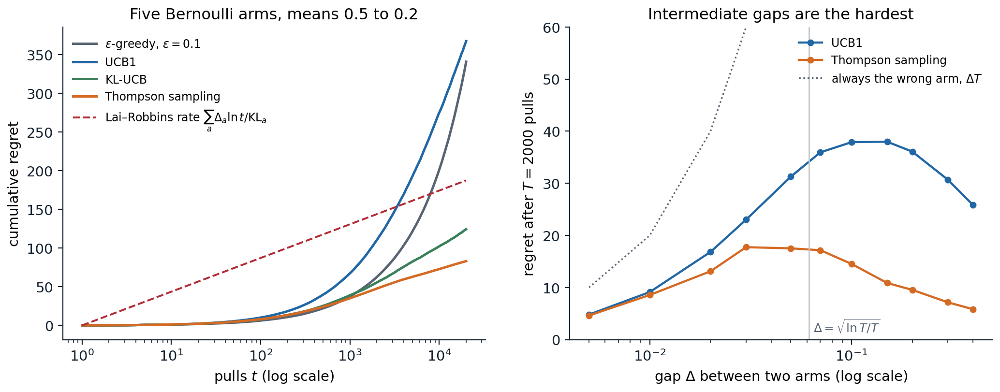

[Background Notes](../README.md) › [Reinforcement Learning](README.md)

# 3. Multi-Armed Bandits

> [!WARNING]
> Work in progress: this part of the notes is still being revised.

[← 2. Dynamic Programming](02-dynamic-programming.md) · [4. Contextual, Bayesian, and Adversarial Bandits →](04-contextual-bayesian-and-adversarial-bandits.md)

## <a id="the-explorationexploitation-dilemma"></a>The exploration–exploitation dilemma

### <a id="one-state-many-actions"></a>One state, many actions

A gambler faces a row of slot machines, one-armed bandits, each paying out according to its own unknown distribution. At each step the gambler pulls one arm and observes its reward, and wants to collect as much as possible over many pulls. This is the **multi-armed bandit** problem, reinforcement learning with a single state: actions have no effect on future situations, only on what the agent learns. It isolates the one difficulty that the full problem adds to supervised learning and that dynamic programming ([chapter 2](02-dynamic-programming.md)) ignores by assuming the model is known: the agent must **explore** to learn which action is best, and every pull spent exploring an inferior arm is reward given up by not **exploiting** the arm that currently looks best.

Formally, a $`k`$-armed bandit has arms $`a\in\{1,\dots,k\}`$ with reward distributions $`\nu_a`$ and means $`\mu_a=q_*(a)=\mathbb E[R\mid A=a]`$. At each step $`t=1,\dots,T`$ the agent chooses $`A_t`$, based on its past actions and rewards, and receives $`R_t\sim\nu_{A_t}`$, independent of everything else. The best mean is $`\mu^*=\max_a\mu_a`$, and the **gap** of arm $`a`$ is $`\Delta_a=\mu^*-\mu_a`$.

Bandits are also useful in their own right. Clinical trials that allocate patients adaptively to treatments were the original motivation ([Thompson, 1933](https://doi.org/10.2307/2332286)); online services choose which headline, advertisement, or recommendation to show; experimenters decide which variant of a website to test; hyperparameter searches allocate compute among configurations; and the selection step of Monte Carlo tree search treats each node's children as a bandit ([AI chapter 4](../ai/04-adversarial-search-and-games.md#selection-with-uct)). Bayesian optimization ([ML chapter 15](../ml/15-gaussian-processes.md#bayesian-optimization)) is a bandit with infinitely many correlated arms.

### <a id="regret"></a>Regret

A good strategy is judged by its **regret**, the reward lost relative to always pulling the best arm:

```math
\mathcal R_T=T\mu^*-\mathbb E\Bigl[\sum_{t=1}^TR_t\Bigr]=\sum_a\Delta_a\,\mathbb E[N_a(T)],
```

where $`N_a(T)`$ is the number of pulls of arm $`a`$ in the first $`T`$ steps. The second form, the **regret decomposition**, follows from $`\mathbb E[\sum_tR_t]=\sum_a\mu_a\mathbb E[N_a(T)]`$ and says that minimizing regret means pulling each suboptimal arm as rarely as possible, especially the arms with large gaps, while still pulling it often enough to be sure it is suboptimal. A strategy that never explores can lock onto a bad arm forever and suffer regret linear in $`T`$; a strategy that explores forever at a fixed rate also has linear regret. The central results of this chapter are that the best achievable regret grows only **logarithmically** in $`T`$ for a fixed problem, and as $`\sqrt{kT}`$ in the worst case over problems, and that simple algorithms achieve both, UCB1 up to a factor $`\sqrt{\ln T}`$ in the worst case.

## <a id="estimating-action-values"></a>Estimating action values

### <a id="sample-averages-and-incremental-updates"></a>Sample averages and incremental updates

The natural estimate of an arm's mean is the average of its observed rewards, $`Q_n=(R_1+\dots+R_{n-1})/(n-1)`$ after $`n-1`$ pulls. It can be updated in constant memory:

```math
Q_{n+1}=Q_n+\frac1n\bigl(R_n-Q_n\bigr).
```

This has the form that recurs throughout the module,

```math
\text{new estimate}\leftarrow\text{old estimate}+\text{step size}\times\bigl(\text{target}-\text{old estimate}\bigr),
```

where the bracket is an **error** that the update reduces. Temporal-difference learning ([chapter 6](06-temporal-difference-learning.md)) and Q-learning ([chapter 7](07-model-free-control.md)) are updates of exactly this form with other targets.

### <a id="step-sizes-and-nonstationarity"></a>Step sizes and nonstationarity

With a constant step size $`\alpha\in(0,1]`$, the estimate becomes an exponentially weighted average,

```math
Q_{n+1}=(1-\alpha)^nQ_1+\sum_{i=1}^n\alpha(1-\alpha)^{n-i}R_i,
```

which weights recent rewards more and tracks a **nonstationary** mean, but never converges when the mean is fixed: its variance stays of order $`\alpha`$. The classical sufficient conditions for a sequence of step sizes $`\alpha_n`$ to give convergence with probability one to a fixed mean are the **Robbins–Monro conditions**,

```math
\sum_n\alpha_n=\infty,\qquad\sum_n\alpha_n^2<\infty:
```

the steps must be large enough in total to overcome the initial value and any early noise, and small enough eventually to average the noise away. The sample average, $`\alpha_n=1/n`$, satisfies both; a constant step size violates the second. In reinforcement learning the targets themselves usually change as the agent learns, so constant step sizes are the norm in practice (exercise 3.6).

## <a id="simple-exploration-strategies"></a>Simple exploration strategies

### <a id="greedy-and-greedy"></a>Greedy and ε-greedy

The **greedy** strategy always pulls the arm with the highest estimate. After an unlucky first reward, a good arm's estimate can fall below a mediocre arm's and never be revisited, so greedy action selection has linear regret. The simplest fix, **ε-greedy**, pulls a uniformly random arm with probability $`\varepsilon`$ and the greedy arm otherwise. Every arm is then pulled infinitely often and every estimate converges, but the random pulls never stop, so the regret still grows linearly, at least $`\varepsilon T\sum_a\Delta_a/k`$. Decaying $`\varepsilon_t`$ at the rate $`1/t`$ gives logarithmic regret, but only with a schedule tuned to the smallest gap, which is unknown ([Auer, Cesa-Bianchi, and Fischer, 2002](https://doi.org/10.1023/A:1013689704352)). Despite this, ε-greedy with a small constant or slowly decaying $`\varepsilon`$ is the default exploration strategy of many deep RL agents ([chapter 16](16-deep-q-learning.md)), because it is simple and needs no uncertainty estimates.

### <a id="optimistic-initial-values"></a>Optimistic initial values

Setting all initial estimates well above any plausible reward makes the greedy agent explore: whichever arm it pulls disappoints it, and it moves on to another, until the estimates have come down. With a constant step size the optimism fades gradually. The trick is effective in stationary problems and no help with continuing exploration, for example in nonstationary problems, since it acts only at the start; but it contains the right idea, **optimism in the face of uncertainty**, which the upper-confidence-bound algorithms below make systematic.

### <a id="explore-then-commit"></a>Explore-then-commit

A strategy that separates the two phases, pulling each arm $`m`$ times and then committing to the arm with the best average, has regret at most

```math
\mathcal R_T\le m\sum_a\Delta_a+(T-mk)\sum_a\Delta_a\exp\bigl(-m\Delta_a^2/4\bigr)
```

for rewards with unit sub-Gaussian noise ([Lattimore and Szepesvári, 2020](https://tor-lattimore.com/downloads/book/book.pdf), theorem 6.1): the first term pays for exploring, the second for committing to the wrong arm. With $`m`$ tuned to the gap, about $`(4/\Delta^2)\ln(T\Delta^2/4)`$ for two arms, the regret is logarithmic in $`T`$; without knowledge of the gaps, the best fixed choice is $`m\propto T^{2/3}`$, giving regret of order $`T^{2/3}`$ (exercise 3.3). Explore-then-commit is what a classical A/B test does: a fixed experiment followed by a decision.

### <a id="the-10-armed-testbed"></a>The 10-armed testbed

Sutton and Barto compare these ideas on randomly generated problems: ten arms whose means are drawn from a standard normal distribution, and rewards with unit-variance normal noise around them. The code runs 2,000 such problems for 1,000 steps each, with the strategies above, the UCB rule of the next section, and the gradient bandit of [the last section](#gradient-bandits).

```python
import numpy as np

# Sutton and Barto's 10-armed testbed: true values q*(a) ~ N(0, 1), rewards ~ N(q*(a), 1).
# 2,000 independent bandit problems are run in parallel for 1,000 steps each.
runs, k, steps = 2000, 10, 1000
rng = np.random.default_rng(0)
q_true = rng.normal(0, 1, (runs, k))
best = q_true.argmax(1)
rows = np.arange(runs)


def run(select, q0=0.0, gradient=False, alpha=0.1, step=None):
    Q, N = np.full((runs, k), q0), np.zeros((runs, k))
    H, baseline = np.zeros((runs, k)), np.zeros(runs)
    reward, optimal = np.zeros(steps), np.zeros(steps)
    for t in range(1, steps + 1):
        if gradient:                                          # softmax over preferences H
            p = np.exp(H - H.max(1, keepdims=True)); p /= p.sum(1, keepdims=True)
            a = (p.cumsum(1) > rng.random((runs, 1))).argmax(1)
        else:
            a = select(Q, N, t)
        r = q_true[rows, a] + rng.normal(0, 1, runs)
        if gradient:                                          # stochastic gradient ascent on E[R]
            onehot = np.zeros((runs, k)); onehot[rows, a] = 1
            H += alpha * (r - baseline)[:, None] * (onehot - p)  # baseline: average of earlier rewards
            baseline += (r - baseline) / t
        else:
            N[rows, a] += 1
            Q[rows, a] += (r - Q[rows, a]) * (step or 1 / N[rows, a])  # sample average, or constant step
        reward[t - 1], optimal[t - 1] = r.mean(), (a == best).mean()
    return reward, optimal


def eps_greedy(eps):
    def select(Q, N, t):
        greedy = (Q + 1e-9 * rng.random(Q.shape)).argmax(1)   # random tie-breaking
        explore = rng.random(runs) < eps
        return np.where(explore, rng.integers(k, size=runs), greedy)
    return select


def ucb(c):
    def select(Q, N, t):
        bonus = np.where(N > 0, c * np.sqrt(np.log(t) / np.maximum(N, 1)), np.inf)  # untried arms first
        return (Q + bonus + 1e-9 * rng.random(Q.shape)).argmax(1)
    return select


methods = {"greedy": dict(select=eps_greedy(0.0)), "epsilon-greedy 0.01": dict(select=eps_greedy(0.01)),
           "epsilon-greedy 0.1": dict(select=eps_greedy(0.1)), "optimistic Q0 = 5, greedy": dict(select=eps_greedy(0.0), q0=5.0, step=0.1),
           "UCB c = 2": dict(select=ucb(2.0)), "gradient bandit alpha 0.1": dict(select=None, gradient=True)}
print(f"{'method':27s} avg reward, steps 1-100 | 901-1000 | % optimal action, last 100 steps")
for name, kw in methods.items():
    reward, optimal = run(**kw)
    print(f"{name:27s} {reward[:100].mean():10.3f}            | {reward[900:].mean():8.3f} | {100 * optimal[900:].mean():6.1f}")
print(f"expected reward of the best arm: {q_true.max(1).mean():.3f}")
# method                      avg reward, steps 1-100 | 901-1000 | % optimal action, last 100 steps
# greedy                           0.948            |    1.022 |   34.7
# epsilon-greedy 0.01              0.975            |    1.317 |   60.7
# epsilon-greedy 0.1               1.016            |    1.363 |   79.7
# optimistic Q0 = 5, greedy        0.357            |    1.502 |   85.3
# UCB c = 2                        0.961            |    1.484 |   85.8
# gradient bandit alpha 0.1        0.532            |    1.499 |   84.8
# expected reward of the best arm: 1.535
```

The greedy agent finds the best arm in only 35% of the problems and stays with its first impression in the rest. Exploring 10% of the time finds the best arm far more often but keeps paying for exploration; exploring 1% of the time learns more slowly but would eventually overtake it. Optimism explores systematically at first, which makes its early performance poor, and then does well. UCB, the optimistic agent, and the gradient bandit do best in the long run, within about 0.05 of always pulling the best arm, whose expected reward is 1.535.



*Average reward (left) and fraction of problems in which the optimal arm was chosen (right) over the first 1,000 steps of 2,000 ten-armed testbed problems, smoothed over 10 steps. The optimistic agent's early dips are the systematic trials of every arm; the greedy agent's curve flattens at 35% after a few dozen steps; the agents with continued, directed exploration keep improving.*

## <a id="optimism-in-the-face-of-uncertainty"></a>Optimism in the face of uncertainty

### <a id="confidence-bounds"></a>Confidence bounds

Optimism needs a measure of how uncertain each estimate is. For rewards in $`[0,1]`$, Hoeffding's inequality ([Foundations chapter 4](../foundations/04-probability-and-statistics.md#averages-limit-theorems-and-concentration)) bounds the probability that an average of $`n`$ independent rewards overestimates or underestimates its mean by $`\varepsilon`$:

```math
\Pr\bigl(\hat\mu_n\ge\mu+\varepsilon\bigr)\le e^{-2n\varepsilon^2},\qquad\Pr\bigl(\hat\mu_n\le\mu-\varepsilon\bigr)\le e^{-2n\varepsilon^2}.
```

Setting the right-hand side to $`\delta`$ gives a confidence radius $`\sqrt{\ln(1/\delta)/(2n)}`$: with probability at least $`1-\delta`$, the mean is below $`\hat\mu_n+\sqrt{\ln(1/\delta)/(2n)}`$. The radius shrinks like $`1/\sqrt n`$, so arms pulled rarely have wide intervals.

### <a id="ucb1-and-its-regret"></a>UCB1 and its regret

The **upper confidence bound** principle says: pull the arm whose mean could plausibly be highest, that is, the arm with the largest upper confidence bound. Either the arm is truly good, and pulling it is right, or its bound is too optimistic, and pulling it narrows the bound. Choosing $`\delta`$ to shrink polynomially in $`t`$ gives the **UCB1** algorithm of [Auer, Cesa-Bianchi, and Fischer (2002)](https://doi.org/10.1023/A:1013689704352): after pulling each arm once, choose

```math
A_t=\arg\max_a\Bigl[\hat\mu_a+\sqrt{\frac{2\ln t}{N_a(t)}}\Bigr].
```

Its regret satisfies, for rewards in $`[0,1]`$ and every $`T`$,

```math
\mathcal R_T\le\sum_{a:\Delta_a>0}\frac{8\ln T}{\Delta_a}+\Bigl(1+\frac{\pi^2}3\Bigr)\sum_a\Delta_a.
```

The proof ([Appendix A](#block-rl03-appendix-a)) shows that a suboptimal arm is pulled only while its confidence radius exceeds about half its gap, which happens about $`8\ln T/\Delta_a^2`$ times, and that failures of the confidence bounds are rare enough to contribute a constant. This is the rule that the UCT algorithm applies at every node of a search tree ([AI chapter 4, Appendix B](../ai/04-adversarial-search-and-games.md#block-ai04-appendix-b)). The bound is logarithmic in $`T`$ but depends on the gaps, and it blows up as a gap goes to zero. A problem with a tiny gap is not hard, though, since pulling the wrong arm costs little; splitting the arms at a threshold $`\varepsilon`$, the arms with $`\Delta_a<\varepsilon`$ cost at most $`\varepsilon T`$ in total and the others at most $`\sum_a8\ln T/\Delta_a\le8k\ln T/\varepsilon`$ (plus a constant), and choosing $`\varepsilon=\sqrt{8k\ln T/T}`$ gives a **gap-free** bound of order $`\sqrt{kT\ln T}`$.

The UCB rule in the testbed code, $`\hat\mu_a+c\sqrt{\ln t/N_a}`$ with $`c=2`$, has the same form with a tuned constant. In practice the constant in UCB1 is conservative, and variants that use the variance of the rewards (UCB-V; [Audibert, Munos, and Szepesvári, 2009](https://doi.org/10.1016/j.tcs.2009.01.016)) or tighter confidence sets explore less.

### <a id="kl-ucb"></a>KL-UCB

Hoeffding's inequality uses only the range of the rewards and is loose for Bernoulli rewards far from 1/2. **KL-UCB** ([Garivier and Cappé, 2011](https://arxiv.org/abs/1102.2490)) uses the exact large-deviation rate instead, the relative entropy of Bernoulli distributions $`\mathrm{KL}(p,q)=p\ln\frac pq+(1-p)\ln\frac{1-p}{1-q}`$. Its index is the largest mean $`q`$ that is still plausible given the data,

```math
U_a(t)=\max\bigl\{q\in[\hat\mu_a,1]:N_a(t)\,\mathrm{KL}(\hat\mu_a,q)\le\ln t+c\ln\ln t\bigr\},
```

computed by bisection. By Pinsker's inequality $`\mathrm{KL}(p,q)\ge2(p-q)^2`$, the KL confidence set is never wider than Hoeffding's for the same threshold, and it is much narrower near 0 or 1. For Bernoulli rewards, KL-UCB matches the lower bound of the next section asymptotically, with the exact constant (the analysis takes $`c=3`$; Garivier and Cappé recommend $`c=0`$ in practice, as in the code below).

## <a id="lower-bounds"></a>Lower bounds

### <a id="the-lairobbins-bound"></a>The Lai–Robbins bound

How small can regret be? A strategy that always pulls arm 1 has zero regret on problems where arm 1 is best, so a lower bound must concern strategies that do reasonably well on every problem. Call a strategy **consistent** if, on every bandit in the class considered, its regret is $`o(T^\alpha)`$ for every $`\alpha>0`$. [Lai and Robbins (1985)](https://doi.org/10.1016/0196-8858(85)90002-8) proved that any consistent strategy pulls each suboptimal arm at least logarithmically often:

```math
\liminf_{T\to\infty}\frac{\mathbb E[N_a(T)]}{\ln T}\ge\frac1{\mathrm{KL}(\nu_a,\nu^*)},\qquad\text{hence}\qquad\liminf_{T\to\infty}\frac{\mathcal R_T}{\ln T}\ge\sum_{a:\Delta_a>0}\frac{\Delta_a}{\mathrm{KL}(\nu_a,\nu^*)}.
```

The argument ([Appendix B](#block-rl03-appendix-b)) is a change of measure: if arm $`a`$ were pulled much less than $`\ln T/\mathrm{KL}(\nu_a,\nu^*)`$ times, the strategy could not distinguish the true problem from one in which arm $`a`$'s distribution is changed slightly to become the best, and on that problem it would suffer polynomial regret, contradicting consistency. The relative entropy measures how many samples are needed to tell an arm's distribution from a slightly better one, so arms close to the best in distribution, not just in mean, must be explored more. By Pinsker's inequality, $`\Delta_a/\mathrm{KL}\le1/(2\Delta_a)`$, so the constant $`8/\Delta_a`$ in UCB1's bound is at least 16 times the optimal one (exercise 3.4).

### <a id="minimax-regret"></a>Minimax regret

For the worst case over problems with a fixed number of arms and horizon, a different argument gives a lower bound of order $`\sqrt{kT}`$: with gaps of size about $`\sqrt{k/T}`$, no strategy can tell which arm is best within $`T`$ pulls, and every wrong pull costs about $`\sqrt{k/T}`$ ([Lattimore and Szepesvári](https://tor-lattimore.com/downloads/book/book.pdf), chapter 15). UCB1 matches this up to a factor $`\sqrt{\ln T}`$, and the MOSS algorithm (Audibert and Bubeck, 2009) removes the logarithm, matching it up to a constant factor. Problems with very small gaps are easy because mistakes are cheap, problems with large gaps are easy because the best arm is quickly found, and the hardest problems lie in between, as the right panel of the figure below shows.

## <a id="thompson-sampling"></a>Thompson sampling

### <a id="posterior-sampling"></a>Posterior sampling

The oldest bandit algorithm is Bayesian. Put a prior on each arm's mean, update it to a posterior after every reward, and at each step **sample a mean for each arm from its posterior and pull the arm whose sample is largest** ([Thompson, 1933](https://doi.org/10.2307/2332286)). For Bernoulli rewards with uniform priors, the posterior of arm $`a`$ after $`S_a`$ successes and $`F_a`$ failures is $`\mathrm{Beta}(1+S_a,1+F_a)`$, so the algorithm needs only two counts per arm and one random draw per arm per step.

**Thompson sampling** chooses each arm with exactly the posterior probability that it is the best arm,

```math
\Pr(A_t=a\mid\text{history})=\Pr\bigl(a=\arg\max_b\mu_b\mid\text{history}\bigr),
```

a property called **probability matching** (exercise 3.8). An arm that is certainly worse is almost never pulled; an arm with few observations has a wide posterior and is sampled high often enough to be tried. Unlike UCB, Thompson sampling needs no confidence bounds, and it extends naturally to any model with a posterior that can be sampled: contextual and linear bandits, and even MDPs ([chapter 4](04-contextual-bayesian-and-adversarial-bandits.md), [chapter 22](22-exploration-in-deep-rl.md)).

### <a id="regret-of-thompson-sampling"></a>Regret of Thompson sampling

Although derived from a Bayesian argument, Thompson sampling has strong frequentist guarantees: for Bernoulli bandits it achieves the Lai–Robbins bound with the exact constant ([Kaufmann, Korda, and Munos, 2012](https://arxiv.org/abs/1205.4217)), after [Agrawal and Goyal (2012)](https://proceedings.mlr.press/v23/agrawal12.html) first proved logarithmic regret, and its Bayesian regret is of order $`\sqrt{kT\ln k}`$ ([Russo and Van Roy, 2016](https://arxiv.org/abs/1403.5341)). Empirically it is highly competitive, with smaller regret than UCB in many problems ([Chapelle and Li, 2011](https://papers.nips.cc/paper_files/paper/2011/hash/e53a0a2978c28872a4505bdb51db06dc-Abstract.html)). The code compares the algorithms on five Bernoulli arms with means from 0.5 down to 0.2, over 200 runs of 20,000 pulls.

```python
import numpy as np

# A five-armed Bernoulli bandit, 200 independent runs of 20,000 pulls. Regret is measured as
# sum over time of the gap Delta = mu* - mu(A_t) of the chosen arm (the "pseudo-regret").
mu = np.array([0.5, 0.45, 0.4, 0.3, 0.2])
k, T, runs = len(mu), 20_000, 200
gaps = mu.max() - mu
rows = np.arange(runs)


def kl(p, q):                                                # Bernoulli relative entropy KL(p || q)
    p, q = np.clip(p, 1e-12, 1 - 1e-12), np.clip(q, 1e-12, 1 - 1e-12)
    return p * np.log(p / q) + (1 - p) * np.log((1 - p) / (1 - q))


def kl_ucb_index(mean, n, t):
    """Largest q >= mean with n KL(mean, q) <= log t, by bisection (all runs and arms at once)."""
    lo, hi = mean.copy(), np.ones_like(mean)
    for _ in range(25):
        mid = (lo + hi) / 2
        ok = n * kl(mean, mid) <= np.log(t)
        lo, hi = np.where(ok, mid, lo), np.where(ok, hi, mid)
    return lo


def simulate(policy, seed):
    rng = np.random.default_rng(seed)
    S, N = np.zeros((runs, k)), np.zeros((runs, k))          # sums of rewards and pull counts
    regret = np.zeros(T)
    for t in range(1, T + 1):
        if t <= k:
            a = np.full(runs, t - 1)                         # pull every arm once
        else:
            a = policy(S, N, t, rng)
        r = rng.random(runs) < mu[a]
        S[rows, a] += r; N[rows, a] += 1
        regret[t - 1] = gaps[a].mean()
    return np.cumsum(regret)


def eps_greedy(S, N, t, rng):
    explore = rng.random(runs) < 0.1
    return np.where(explore, rng.integers(k, size=runs), (S / N).argmax(1))


def explore_then_commit(S, N, t, rng, m=500):              # m pulls of each arm, then the best average
    return np.where(t <= k * m, (t - 1) % k, (S / N).argmax(1))


def ucb1(S, N, t, rng):
    return (S / N + np.sqrt(2 * np.log(t) / N)).argmax(1)


def kl_ucb(S, N, t, rng):
    return kl_ucb_index(S / N, N, t).argmax(1)


def thompson(S, N, t, rng):
    return rng.beta(1 + S, 1 + N - S).argmax(1)             # one posterior sample per arm


lr = sum(gaps[a] / kl(mu[a], mu.max()) for a in range(k) if gaps[a] > 0)
print(f"Lai-Robbins: regret >= {lr:.2f} ln T asymptotically, i.e. about {lr * np.log(T):.0f} at T = {T:,}")
ub = sum(8 * np.log(T) / gaps[a] + (1 + np.pi ** 2 / 3) * gaps[a] for a in range(k) if gaps[a] > 0)
print(f"UCB1 upper bound at T: {ub:.0f}")
for name, pol in [("epsilon-greedy 0.1", eps_greedy), ("explore-then-commit m = 500", explore_then_commit),
                  ("UCB1", ucb1), ("KL-UCB", kl_ucb), ("Thompson sampling", thompson)]:
    R = simulate(pol, seed=1)
    print(f"{name:28s} regret at 1,000: {R[999]:6.1f}   at 20,000: {R[-1]:6.1f}   added after 10,000: {R[-1] - R[9999]:6.1f}")
# Lai-Robbins: regret >= 18.94 ln T asymptotically, i.e. about 188 at T = 20,000
# UCB1 upper bound at T: 3040
# epsilon-greedy 0.1           regret at 1,000:   37.5   at 20,000:  341.0   added after 10,000:  139.5
# explore-then-commit m = 500  regret at 1,000:  130.0   at 20,000:  339.4   added after 10,000:    7.5
# UCB1                         regret at 1,000:   67.3   at 20,000:  367.7   added after 10,000:   92.4
# KL-UCB                       regret at 1,000:   39.0   at 20,000:  124.4   added after 10,000:   22.1
# Thompson sampling            regret at 1,000:   35.1   at 20,000:   83.1   added after 10,000:   10.2
```

The regret after 10,000 pulls separates the algorithms by how their regret grows. ε-greedy adds 140 in the second 10,000 pulls, close to the 130 that its random exploration alone costs ($`0.1\times`$ the average gap $`0.13\times10{,}000`$), because its exploration never stops: linear regret. Explore-then-commit paid 325 for its 2,500 exploratory pulls and afterward adds little, but only because its $`m`$ happened to suit these gaps. UCB1 adds 92, KL-UCB 22, and Thompson sampling 10. The Lai–Robbins rate predicts about 13 per doubling of $`T`$ ($`18.94\ln2`$): Thompson sampling is close to it and KL-UCB within a factor of two. UCB1 is logarithmic only asymptotically; at this horizon its curve is still bending upward, well above its eventual rate. Both are *below* the value $`18.94\ln T\approx188`$ at $`T=20{,}000`$: the bound is asymptotic, a statement about the growth rate as $`T\to\infty`$, not a lower bound on the regret at any finite horizon. UCB1's regret bound of 3,040 is about eight times its actual regret.



*Left: cumulative regret of four algorithms on the five-armed Bernoulli bandit (200 runs), on a logarithmic time axis, where logarithmic regret appears as a straight line. ε-greedy curves upward, as linear regret must; KL-UCB and Thompson sampling approach straight lines whose slopes are their constants; UCB1, whose regret is also logarithmic in the long run, is still bending upward at 20,000 pulls; and the dashed line has the Lai–Robbins slope. Right: regret after 2,000 pulls on two Bernoulli arms with means 0.5 and $`0.5-\Delta`$, as a function of the gap (400 runs). Tiny gaps cost little because mistakes are cheap, large gaps because the better arm is found quickly; the worst gaps for Thompson sampling lie between 0.03 and 0.07, around $`\sqrt{\ln T/T}\approx0.06`$, and larger for the more conservative UCB1, whose regret peaks at 38 near $`\Delta=0.1`$ to $`0.15`$.*

## <a id="other-bandit-problems"></a>Other bandit problems

### <a id="gradient-bandits"></a>Gradient bandits

Instead of estimating values, a **gradient bandit** learns a numerical **preference** $`H(a)`$ for each arm and chooses arms with the softmax probabilities $`\pi(a)=e^{H(a)}/\sum_be^{H(b)}`$. After pulling $`A_t`$ and receiving $`R_t`$, it updates

```math
H(a)\leftarrow H(a)+\alpha\,(R_t-\bar R_t)\bigl(\mathbb 1[a=A_t]-\pi(a)\bigr)\quad\text{for all }a,
```

where $`\bar R_t`$ is the average of the rewards before step $`t`$. A reward above the baseline raises the preference of the chosen arm and lowers the others. The expected update is exactly the gradient of the expected reward $`\sum_a\pi(a)\mu_a`$ with respect to the preferences, so the algorithm is stochastic gradient ascent ([Appendix C](#block-rl03-appendix-c)). The baseline does not change the expected update but reduces its variance, and when the true values are near $`+4`$ an agent without it learns much more slowly (Sutton and Barto's Figure 2.5; exercise 3.5). This is the simplest instance of the **policy gradient** methods of [chapter 13](13-policy-gradient-and-actor-critic-methods.md): the score-function estimator with a baseline, applied to a one-step problem.

### <a id="nonstationary-bandits"></a>Nonstationary bandits

When the arms' means drift, sample averages give old rewards too much weight, and constant step sizes, or averages over a sliding window, track the change (exercise 3.6). Confidence-bound algorithms adapt in the same way, with discounted or windowed counts; when the means may change abruptly, algorithms that detect changes and restart do better. In the extreme where rewards are chosen by an adversary, the stochastic assumptions fail altogether and randomization becomes essential, the subject of the adversarial bandits of [chapter 4](04-contextual-bayesian-and-adversarial-bandits.md).

### <a id="best-arm-identification"></a>Best-arm identification

Sometimes the goal is not to collect reward during the experiment but to find the best arm at the end, with high confidence and as few samples as possible: choosing the best of several drug candidates, or the best configuration of a system before deploying it. This **pure exploration** problem has a different optimal strategy. There is no cost to pulling a bad arm except the sample itself, so a good strategy samples the arms that are hardest to distinguish from the best one. **Successive elimination** ([Even-Dar, Mannor, and Mansour, 2006](https://jmlr.org/papers/v7/evendar06a.html)) pulls all remaining arms in rounds and discards an arm once its upper confidence bound falls below the leader's lower bound. With confidence $`1-\delta`$, the number of samples needed scales with $`H\ln(1/\delta)`$, where $`H=\sum_{a:\Delta_a>0}1/\Delta_a^2`$ measures the difficulty of the problem, and this is optimal up to constants and logarithmic factors ([Kaufmann, Cappé, and Garivier, 2016](https://arxiv.org/abs/1407.4443)). A related algorithm, successive halving, allocates training budgets among hyperparameter configurations in Hyperband ([Li et al., 2018](https://jmlr.org/papers/v18/16-558.html)).

### <a id="bandits-in-practice"></a>Bandits in practice

Deployed bandits face complications the basic model leaves out. Feedback is delayed and arrives in batches, so the algorithm cannot update after every pull; Thompson sampling, whose randomization keeps exploring between updates, degrades more gracefully than deterministic UCB rules ([Chapelle and Li, 2011](https://papers.nips.cc/paper_files/paper/2011/hash/e53a0a2978c28872a4505bdb51db06dc-Abstract.html)). Rewards drift with seasons and fashions. The data an adaptive algorithm collects are not a random sample: estimates of the arms' means from bandit data are biased, typically downward for arms that were abandoned after bad luck ([Nie et al., 2018](https://proceedings.mlr.press/v84/nie18a.html)), and standard confidence intervals are invalid, which matters when a bandit replaces an A/B test whose purpose is inference. Finally, the arms rarely have nothing in common: articles, patients, and users have features, which turns the problem into the **contextual bandit** of [chapter 4](04-contextual-bayesian-and-adversarial-bandits.md). [Lab 2](labs/lab-02-bandit-algorithms-in-practice.md) implements this chapter's algorithms and stress-tests them with change points and delayed feedback.

## <a id="exercises"></a>Exercises

### <a id="exercise-3-1-step-sizes-and-initial-values"></a>Exercise 3.1 — Step sizes and initial values

(a) Derive the exponentially weighted form of the constant-step-size estimate and check that its weights sum to one. (b) Show that the constant-step estimate is biased by its initial value, and that the sample average is not. (c) Sutton and Barto's Exercise 2.7: with $`\bar o_0=0`$, $`\bar o_n=\bar o_{n-1}+\alpha(1-\bar o_{n-1})`$, and step sizes $`\beta_n=\alpha/\bar o_n`$, show that the resulting estimate is an exponential recency-weighted average without initial bias.


<details>
<summary><b>Solution</b></summary>


(a) Unroll $`Q_{n+1}=(1-\alpha)Q_n+\alpha R_n`$: $`Q_{n+1}=(1-\alpha)^nQ_1+\sum_{i=1}^n\alpha(1-\alpha)^{n-i}R_i`$. The weights sum to $`(1-\alpha)^n+\alpha\sum_{j=0}^{n-1}(1-\alpha)^j=(1-\alpha)^n+1-(1-\alpha)^n=1`$.

(b) If the rewards have mean $`\mu`$, $`\mathbb E[Q_{n+1}]=(1-\alpha)^nQ_1+(1-(1-\alpha)^n)\mu`$, which differs from $`\mu`$ by $`(1-\alpha)^n(Q_1-\mu)`$: the bias decays geometrically but is present at every $`n`$. With $`\alpha_n=1/n`$, the first update has step 1 and replaces $`Q_1`$ entirely, so $`Q_{n+1}`$ is the plain average of the rewards, which is unbiased. This is also why optimistic initial values are forgotten immediately under sample averages: the optimism survives only with a step size below one, as in the testbed code.

(c) With $`\beta_1=\alpha/\bar o_1=\alpha/\alpha=1`$, the first update replaces $`Q_1`$, so the initial value has no weight. In general the weight of $`R_i`$ in $`Q_{n+1}`$ is $`\beta_i\prod_{j=i+1}^n(1-\beta_j)`$. Since $`1-\beta_j=(\bar o_j-\alpha)/\bar o_j=(1-\alpha)\bar o_{j-1}/\bar o_j`$, the product telescopes to $`(1-\alpha)^{n-i}\bar o_i/\bar o_n`$, and the weight is $`\alpha(1-\alpha)^{n-i}/\bar o_n`$, proportional to the exponential recency weights and normalized by $`\bar o_n=1-(1-\alpha)^n`$.

</details>


### <a id="exercise-3-2-greedy-has-linear-regret"></a>Exercise 3.2 — ε-greedy has linear regret

Show that ε-greedy with constant $`\varepsilon`$ has regret at least $`\varepsilon T\sum_a\Delta_a/k`$, and explain why a schedule $`\varepsilon_t=\min(1,ck/(d^2t))`$ with $`0<d\le\min_{a:\Delta_a>0}\Delta_a`$ can give logarithmic regret. What goes wrong if $`d`$ is chosen larger than the smallest gap?


<details>
<summary><b>Solution</b></summary>


At every step, with probability $`\varepsilon`$, the arm is uniform, contributing expected regret $`\sum_a\Delta_a/k`$; the greedy steps contribute nonnegative regret. Summing over $`T`$ steps gives the bound. With the decaying schedule, the expected number of exploratory pulls up to time $`T`$ is about $`\sum_t ck/(d^2t)\approx(ck/d^2)\ln T`$, logarithmic, and each arm receives about $`(c/d^2)\ln t`$ of them by time $`t`$. That is enough for the averages to separate every suboptimal arm from the best when every gap is at least $`d`$, since distinguishing a gap $`\Delta`$ needs about $`\ln t/\Delta^2`$ samples; Auer et al. (2002) make this precise for $`c`$ large enough. If $`d`$ exceeds the smallest gap, arms with smaller gaps are not sampled enough to be distinguished, the greedy choice can settle on one of them for a long time, and the regret can become polynomial. The schedule needs to know the gap, which is the weakness that UCB and Thompson sampling remove.

</details>


### <a id="exercise-3-3-explore-then-commit"></a>Exercise 3.3 — Explore-then-commit

For two arms with unit-variance Gaussian rewards and gap $`\Delta`$, use the bound $`\mathcal R_T\le m\Delta+T\Delta\exp(-m\Delta^2/4)`$. (a) Find the $`m`$ that minimizes the right-hand side and the resulting regret. (b) If $`\Delta`$ is unknown, show that $`m\approx T^{2/3}`$ guarantees regret of order $`T^{2/3}`$ for every $`\Delta`$ (up to logarithmic factors).


<details>
<summary><b>Solution</b></summary>


(a) Differentiating, $`\Delta-(T\Delta^3/4)e^{-m\Delta^2/4}=0`$ gives $`m^*=(4/\Delta^2)\ln(T\Delta^2/4)`$ when $`T\Delta^2>4`$. Substituting, $`\mathcal R_T\le(4/\Delta)\bigl(\ln(T\Delta^2/4)+1\bigr)`$: logarithmic in $`T`$, and of the right order $`\ln T/\Delta`$, but only with the gap known in advance.

(b) With $`m=T^{2/3}`$, the exploration term is $`\Delta T^{2/3}\le T^{2/3}`$ for $`\Delta\le1`$. The commitment term $`T\Delta e^{-T^{2/3}\Delta^2/4}`$ is maximized over $`\Delta`$ at $`\Delta=\sqrt2\,T^{-1/3}`$, where it equals $`\sqrt2\,T^{2/3}e^{-1/2}`$. Both terms are $`O(T^{2/3})`$ whatever the gap. UCB achieves $`O(\sqrt{T\ln T})`$ uniformly because it adapts its exploration to the gap it observes, which a fixed schedule cannot do.

</details>


### <a id="exercise-3-4-how-far-is-ucb1-from-optimal"></a>Exercise 3.4 — How far is UCB1 from optimal?

For the five arms of the chapter's code, compute the constants $`\sum_a8/\Delta_a`$ of the UCB1 bound and $`\sum_a\Delta_a/\mathrm{KL}(\mu_a,\mu^*)`$ of the Lai–Robbins bound. Use Pinsker's inequality to show that the ratio of the constants is at least 16 for any Bernoulli problem.


<details>
<summary><b>Solution</b></summary>


The gaps are 0.05, 0.1, 0.2, and 0.3, so $`\sum8/\Delta_a=160+80+40+26.7=306.7`$, while the code reports $`\sum\Delta_a/\mathrm{KL}=18.94`$: a ratio of 16.2. Pinsker's inequality gives $`\mathrm{KL}(\mu_a,\mu^*)\ge2\Delta_a^2`$, so each term $`\Delta_a/\mathrm{KL}\le1/(2\Delta_a)`$, and $`8/\Delta_a\ge16\cdot\Delta_a/\mathrm{KL}`$. The factor is exactly 16 when the KL divergence equals its Pinsker lower bound, which happens asymptotically for means near 1/2 and small gaps, as here; for means near 0 or 1 the KL divergence is much larger than $`2\Delta^2`$, and UCB1 is further still from optimal. Part of the gap is the analysis (the empirical regret of UCB1 is well below its bound), and part is the algorithm, whose Hoeffding radius ignores the variance of Bernoulli rewards near 0 or 1.

</details>


### <a id="exercise-3-5-baselines-in-the-gradient-bandit"></a>Exercise 3.5 — Baselines in the gradient bandit

Show that replacing $`\bar R_t`$ by any baseline $`b`$ that does not depend on $`A_t`$ leaves the expected update of the gradient bandit unchanged. Why might $`b=\bar R_t`$ still be a good choice, and what happens to learning if the baseline is omitted when all rewards are around $`+4`$?


<details>
<summary><b>Solution</b></summary>


The baseline's contribution to the expected update of $`H(a)`$ is $`\alpha b\,\mathbb E[\mathbb 1[a=A_t]-\pi(a)]=\alpha b(\pi(a)-\pi(a))=0`$, since $`A_t\sim\pi`$ and $`b`$ does not depend on $`A_t`$. It does change the variance: the update multiplies $`\mathbb 1[a=A_t]-\pi(a)`$ by $`R_t-b`$, and a baseline near the typical reward keeps this factor small and centered. When all rewards are around $`+4`$ and there is no baseline, every pull raises the chosen arm's preference substantially regardless of its quality, so the preferences follow whichever arms happen to be chosen early, and the signal that distinguishes the arms, a difference of about 1 between their means, is buried in a common term of 4. This is Sutton and Barto's Figure 2.5, and the same reasoning motivates the critic in actor-critic methods ([chapter 13](13-policy-gradient-and-actor-critic-methods.md)).

</details>


### <a id="exercise-3-6-a-drifting-bandit"></a>Exercise 3.6 — A drifting bandit

Make the 10-armed testbed nonstationary: all means start at zero and take independent normal random-walk steps with standard deviation 0.01 at every time step. Compare ε-greedy ($`\varepsilon=0.1`$) with sample averages and with a constant step size of 0.1 over 10,000 steps.


<details>
<summary><b>Solution</b></summary>


```python
import numpy as np

# A nonstationary 10-armed bandit (Sutton and Barto, Exercise 2.5): all true values start at 0 and take
# independent random-walk steps N(0, 0.01^2) at every time step. epsilon-greedy with epsilon = 0.1.
runs, k, steps = 500, 10, 10_000
rows = np.arange(runs)
for label, alpha in [("sample averages", None), ("constant step 0.1", 0.1)]:
    rng = np.random.default_rng(0)
    q = np.zeros((runs, k)); Q = np.zeros((runs, k)); N = np.zeros((runs, k))
    rew = opt = 0.0
    for t in range(steps):
        greedy = (Q + 1e-9 * rng.random(Q.shape)).argmax(1)
        a = np.where(rng.random(runs) < 0.1, rng.integers(k, size=runs), greedy)
        r = q[rows, a] + rng.normal(0, 1, runs)
        N[rows, a] += 1
        Q[rows, a] += (r - Q[rows, a]) * (alpha if alpha else 1 / N[rows, a])
        if t >= steps - 1000:
            rew += r.mean() / 1000; opt += (a == q.argmax(1)).mean() / 1000
        q += rng.normal(0, 0.01, (runs, k))                  # the true values drift
    print(f"{label:18s}: average reward over the last 1,000 steps {rew:.3f}, optimal action {100 * opt:.1f}%")
# sample averages   : average reward over the last 1,000 steps 1.043, optimal action 45.6%
# constant step 0.1 : average reward over the last 1,000 steps 1.304, optimal action 75.1%
```

After 10,000 steps the arm means have drifted by about 1 in standard deviation, so the ranking of the arms keeps changing. Sample averages weight a reward from step 1 as much as one from step 9,999, so their estimates lag, and they identify the current best arm only 46% of the time; the constant step size remembers roughly the last $`1/\alpha=10`$ rewards of each arm and finds the best arm 75% of the time, earning 0.26 more per step.

</details>


### <a id="exercise-3-7-finding-the-best-arm"></a>Exercise 3.7 — Finding the best arm

Implement successive elimination with confidence $`1-\delta`$, $`\delta=0.05`$, on the chapter's five Bernoulli arms, using the radius $`\sqrt{\ln(4kn^2/\delta)/(2n)}`$ after $`n`$ pulls of an arm. Compare the number of samples it needs with uniform sampling that stops at the same criterion, and with the complexity $`H=\sum1/\Delta_a^2`$.


<details>
<summary><b>Solution</b></summary>


```python
import numpy as np

# Best-arm identification with confidence 1 - delta, delta = 0.05, on the chapter's Bernoulli arms.
# 200 runs in parallel; in each round every active arm of every unfinished run is pulled once.
mu = np.array([0.5, 0.45, 0.4, 0.3, 0.2]); k, delta, runs = len(mu), 0.05, 200


def radius(n):                                               # anytime Hoeffding radius for n pulls of an arm
    return np.sqrt(np.log(4 * k * n ** 2 / delta) / (2 * n))


def identify(eliminate, rng):
    S = np.zeros((runs, k)); active = np.ones((runs, k), bool)
    done = np.zeros(runs, bool); answer = np.zeros(runs, int); pulls = np.zeros(runs)
    n = 0
    while not done.all():
        n += 1
        pull = active & ~done[:, None]
        S += pull * (rng.random((runs, k)) < mu)
        pulls += pull.sum(1)
        m = np.where(active, S / n, -np.inf)
        leader_lcb = m.max(1, keepdims=True) - radius(n)
        alive = active & (m + radius(n) >= leader_lcb)       # arms not yet ruled out
        finished = ~done & (alive.sum(1) == 1)
        answer[finished] = m[finished].argmax(1)
        done |= finished
        if eliminate:
            active = alive                                   # stop pulling arms that are ruled out
    return answer, pulls


rng = np.random.default_rng(0)
gaps = mu.max() - mu
print(f"complexity H = sum over suboptimal arms of 1/gap^2 = {np.sum(1 / gaps[1:] ** 2):.0f}")
for name, elim in [("uniform sampling", False), ("successive elimination", True)]:
    answer, pulls = identify(elim, rng)
    print(f"{name:23s}: mean pulls {pulls.mean():8.0f}, wrong answers {np.sum(answer != 0)} of {runs}")
# complexity H = sum over suboptimal arms of 1/gap^2 = 536
# uniform sampling       : mean pulls   102122, wrong answers 0 of 200
# successive elimination : mean pulls    46572, wrong answers 0 of 200
```

The radius is valid simultaneously for all arms and rounds: by Hoeffding's inequality, the bound for one arm fails at round $`n`$ with probability at most $`2e^{-2nr_n^2}=\delta/(2kn^2)`$, and summing over the $`k`$ arms and all rounds gives at most $`(\pi^2/12)\,\delta<\delta`$. Neither method errs in 200 runs. Uniform sampling needs about 102,000 pulls, because every arm is pulled as often as the hardest one, the arm with mean 0.45 whose gap is 0.05. Successive elimination drops the arms with means 0.2 and 0.3 early and needs about 47,000. Successive elimination's count is about 30 times $`H\ln(1/\delta)=536\times\ln20\approx1{,}600`$, a factor that comes from the constants in the Hoeffding radius, the $`\ln(4kn^2)`$ term, and the need to separate two confidence intervals rather than one. Optimal algorithms such as Track-and-Stop ([Garivier and Kaufmann, 2016](https://arxiv.org/abs/1602.04589)) use KL-based stopping rules and need several times fewer samples.

</details>


### <a id="exercise-3-8-probability-matching"></a>Exercise 3.8 — Probability matching

(a) Show that Thompson sampling selects each arm with the posterior probability that it is optimal. (b) Two Bernoulli arms have posteriors $`\mathrm{Beta}(2,1)`$ and $`\mathrm{Beta}(11,10)`$. Which arm does the greedy rule on posterior means choose, and with what probability does Thompson sampling choose each arm?


<details>
<summary><b>Solution</b></summary>


(a) Thompson sampling draws $`\tilde\mu\sim p(\mu\mid\text{history})`$ and pulls $`\arg\max_a\tilde\mu_a`$. The probability of pulling $`a`$ is therefore $`\Pr_{\tilde\mu\sim\text{posterior}}(a=\arg\max_b\tilde\mu_b)`$, which is the posterior probability that $`a`$ is the best arm, since $`\tilde\mu`$ has the posterior distribution of the true means.

(b) The posterior means are $`2/3`$ and $`11/21\approx0.524`$, so the greedy rule pulls arm 1. The probability that arm 1 is better is $`\Pr(X>Y)`$ for independent $`X\sim\mathrm{Beta}(2,1)`$, with density $`2x`$, and $`Y\sim\mathrm{Beta}(11,10)`$: $`\int_0^1\Pr(X>y)f_Y(y)\,dy=\mathbb E[1-Y^2]=1-\mathrm{Var}(Y)-\mathbb E[Y]^2`$. With $`\mathbb E[Y]=11/21`$ and $`\mathrm{Var}(Y)=\frac{11\cdot10}{21^2\cdot22}=\frac5{441}`$, this is $`1-\frac{5}{441}-\frac{121}{441}=\frac{315}{441}=5/7\approx0.714`$. Thompson sampling pulls arm 1 with probability 0.714 and arm 2 with probability 0.286: arm 1 looks better but is uncertain, having been pulled only once, and arm 2, pulled 19 times, still has a real chance of being better.

</details>


## <a id="appendices"></a>Appendices


<details>
<summary><a id="block-rl03-appendix-a"></a><b>A. The regret of UCB1</b></summary>


Let arm 1 be optimal and fix a suboptimal arm $`a`$. Write $`c_{t,n}=\sqrt{2\ln t/n}`$ and $`\hat\mu_{a,n}`$ for the average of the first $`n`$ rewards of arm $`a`$. Let $`\ell=\lceil8\ln T/\Delta_a^2\rceil`$. Arm $`a`$ is pulled at time $`t`$ only if its index is at least arm 1's, so

```math
N_a(T)\le\ell+\sum_{t=k+1}^T\mathbb 1\bigl[A_t=a,\ N_a(t-1)\ge\ell\bigr]\le\ell+\sum_{t}\ \sum_{s=1}^{t}\ \sum_{n=\ell}^{t}\mathbb 1\bigl[\hat\mu_{1,s}+c_{t,s}\le\hat\mu_{a,n}+c_{t,n}\bigr].
```

The event in the last indicator implies one of three events: (i) $`\hat\mu_{1,s}\le\mu_1-c_{t,s}`$, the optimal arm is underestimated; (ii) $`\hat\mu_{a,n}\ge\mu_a+c_{t,n}`$, arm $`a`$ is overestimated; or (iii) $`\mu_1<\mu_a+2c_{t,n}`$. For $`n\ge\ell\ge8\ln T/\Delta_a^2`$, $`2c_{t,n}\le2\sqrt{2\ln T/\ell}\le\Delta_a`$, so (iii) is impossible. By Hoeffding's inequality, (i) and (ii) each have probability at most $`e^{-2s\cdot2\ln t/s}=t^{-4}`$. Hence

```math
\mathbb E[N_a(T)]\le\frac{8\ln T}{\Delta_a^2}+1+\sum_{t\ge1}\sum_{s=1}^t\sum_{n=1}^t2t^{-4}\le\frac{8\ln T}{\Delta_a^2}+1+\frac{\pi^2}3,
```

and multiplying by $`\Delta_a`$ and summing over suboptimal arms gives the bound in the text ([Auer, Cesa-Bianchi, and Fischer, 2002](https://doi.org/10.1023/A:1013689704352)). The proof shows what the logarithm is for: the confidence level must tighten with $`t`$ so that the total probability of misleading bounds over the whole run is finite.

</details>


<details>
<summary><a id="block-rl03-appendix-b"></a><b>B. Why regret must grow logarithmically</b></summary>


Consider a consistent strategy on a bandit $`\nu`$ where arm 1 is optimal, and a suboptimal arm $`a`$. Build an alternative bandit $`\nu'`$ that equals $`\nu`$ except that arm $`a`$'s distribution $`\nu_a`$ is replaced by $`\nu_a'`$ with mean slightly above $`\mu_1`$, chosen so that $`\mathrm{KL}(\nu_a,\nu_a')\le(1+\epsilon)\mathrm{KL}(\nu_a,\nu_1)`$. In $`\nu'`$, arm $`a`$ is the unique best arm.

The **divergence decomposition** says that the relative entropy between the distributions of everything observed in $`T`$ steps under the two bandits is $`\mathbb E_\nu[N_a(T)]\,\mathrm{KL}(\nu_a,\nu_a')`$, since only arm $`a`$'s rewards differ. A standard inequality (Bretagnolle–Huber) bounds the probability of any event $`E`$ in terms of this divergence: $`\Pr_\nu(E)+\Pr_{\nu'}(E^c)\ge\frac12\exp\bigl(-\mathbb E_\nu[N_a(T)]\,\mathrm{KL}(\nu_a,\nu_a')\bigr)`$. Take $`E=\{N_a(T)>T/2\}`$. Under $`\nu`$, consistency means arm $`a`$ is rarely pulled more than half the time, so $`\Pr_\nu(E)`$ is small, of order $`\mathcal R_T(\nu)/(T\Delta_a)`$; under $`\nu'`$, consistency means arm $`a`$ is pulled most of the time, so $`\Pr_{\nu'}(E^c)`$ is of order $`\mathcal R_T(\nu')/T`$. Both regrets are $`o(T^\alpha)`$ for every $`\alpha>0`$, so the left side is at most $`T^{-1+o(1)}`$, and taking logarithms,

```math
\mathbb E_\nu[N_a(T)]\,\mathrm{KL}(\nu_a,\nu_a')\ge(1-o(1))\ln T .
```

Letting $`\epsilon\to0`$ gives the Lai–Robbins bound. The intuition is that of hypothesis testing: to rule out that arm $`a`$ is secretly the best with error probability about $`1/T`$, the strategy must collect about $`\ln T/\mathrm{KL}`$ samples from it ([Lattimore and Szepesvári](https://tor-lattimore.com/downloads/book/book.pdf), chapter 16).

</details>


<details>
<summary><a id="block-rl03-appendix-c"></a><b>C. The gradient bandit is stochastic gradient ascent</b></summary>


The expected reward is $`J(H)=\sum_b\pi(b)\mu_b`$ with $`\pi(b)=e^{H(b)}/\sum_ce^{H(c)}`$. The softmax derivative is $`\partial\pi(b)/\partial H(a)=\pi(b)(\mathbb 1[a=b]-\pi(a))`$, so

```math
\frac{\partial J}{\partial H(a)}=\sum_b\mu_b\,\pi(b)\bigl(\mathbb 1[a=b]-\pi(a)\bigr)=\sum_b\pi(b)\,(\mu_b-B)\bigl(\mathbb 1[a=b]-\pi(a)\bigr)
```

for any constant $`B`$, since $`\sum_b\pi(b)(\mathbb 1[a=b]-\pi(a))=0`$. The last sum is an expectation over $`A_t\sim\pi`$, and $`\mu_{A_t}=\mathbb E[R_t\mid A_t]`$, so

```math
\frac{\partial J}{\partial H(a)}=\mathbb E\Bigl[(R_t-B)\bigl(\mathbb 1[a=A_t]-\pi(a)\bigr)\Bigr].
```

The update of the text is a sample of this expectation times $`\alpha`$, with $`B`$ replaced by the running average $`\bar R_t`$ (which depends on past rewards but not on $`A_t`$). The factor $`\mathbb 1[a=A_t]-\pi(a)`$ is $`\partial\ln\pi(A_t)/\partial H(a)`$, the **score** of the chosen action, and the whole construction is the REINFORCE estimator of [chapter 13](13-policy-gradient-and-actor-critic-methods.md) in its simplest setting.

</details>

---

[← 2. Dynamic Programming](02-dynamic-programming.md) · [4. Contextual, Bayesian, and Adversarial Bandits →](04-contextual-bayesian-and-adversarial-bandits.md)
