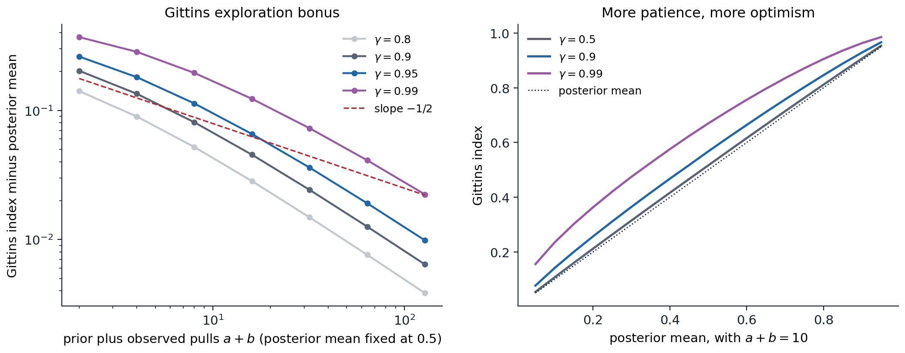
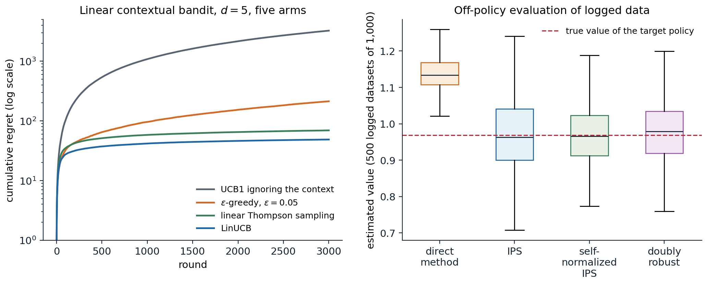

[ML Mastery Notes](../README.md) › [Reinforcement Learning](README.md)

# 4. Contextual, Bayesian, and Adversarial Bandits

[← 3. Multi-Armed Bandits](03-multi-armed-bandits.md) · [5. Monte Carlo Methods →](05-monte-carlo-methods.md)

## <a id="beyond-the-stochastic-bandit"></a>Beyond the stochastic bandit

Chapter 3 studied the stochastic bandit: a fixed set of arms with fixed but unknown reward distributions, and a learner judged by its regret. This chapter changes each of those assumptions in turn. Putting a prior on the arms turns the problem into a planning problem with an exactly optimal solution, the **Bayesian bandit**, and for discounted rewards that solution has the remarkable index form found by Gittins. Letting an adversary choose the rewards removes all statistical assumptions, and the answer, the **adversarial bandit**, requires randomization. Giving the learner side information before each choice, a context such as a user's features, turns the arms into a policy to be learned, the **contextual bandit** that underlies many deployed recommendation and advertising systems. The chapter ends with the problem that comes with deployment: evaluating a new policy from data logged by an old one, **off-policy evaluation**, the first appearance of a question that runs through chapter 9 and chapter 26.

## <a id="bayesian-bandits"></a>Bayesian bandits

### <a id="the-bandit-as-a-belief-mdp"></a>The bandit as a belief MDP

Suppose the unknown means have a known prior, for instance independent uniform priors on the success probabilities of Bernoulli arms. After any history, the learner's knowledge is summarized by the posterior, which for Beta priors is a pair of counts per arm, and pulling an arm moves the posterior to one of two successors with probabilities given by the posterior predictive. The bandit is then a Markov decision process whose states are posteriors: the belief MDP of chapter 1, in which the hidden state is the vector of true means and never changes. Its optimal policy maximizes the expected total reward under the prior, is called **Bayes-optimal**, and resolves the exploration–exploitation trade-off exactly: an arm is worth pulling for its immediate expected reward plus the value of what the pull will reveal. For a finite horizon it can be computed by backward induction over the posterior states.

```python
import numpy as np
from functools import lru_cache

# A two-armed Bernoulli bandit with independent uniform priors on the means and a horizon of T = 30 pulls.
# The Bayes-optimal strategy solves the belief MDP whose state is the counts (s1, f1, s2, f2).
T = 30


@lru_cache(maxsize=None)
def V(s1, f1, s2, f2):
    """Expected future reward under the Bayes-optimal strategy from this posterior state."""
    if s1 + f1 + s2 + f2 == T:
        return 0.0
    p1, p2 = (s1 + 1) / (s1 + f1 + 2), (s2 + 1) / (s2 + f2 + 2)   # posterior means of Beta(1+s, 1+f)
    q1 = p1 * (1 + V(s1 + 1, f1, s2, f2)) + (1 - p1) * V(s1, f1 + 1, s2, f2)
    q2 = p2 * (1 + V(s1, f1, s2 + 1, f2)) + (1 - p2) * V(s1, f1, s2, f2 + 1)
    return max(q1, q2)


bayes = V(0, 0, 0, 0)
print(f"belief states visited: {V.cache_info().currsize:,}")

# Other strategies, evaluated by simulation over the same prior: mu ~ Uniform(0,1)^2.
rng = np.random.default_rng(0)
runs = 200_000
mu = rng.random((runs, 2)); rows = np.arange(runs)


def simulate(choose):
    S, N, total = np.zeros((runs, 2)), np.zeros((runs, 2)), np.zeros(runs)
    for t in range(1, T + 1):
        a = choose(S, N, t)
        r = rng.random(runs) < mu[rows, a]
        S[rows, a] += r; N[rows, a] += 1; total += r
    return total.mean(), total.std() / np.sqrt(runs)


greedy = lambda S, N, t: ((S + 1) / (N + 2) + 1e-9 * rng.random((runs, 2))).argmax(1)   # posterior mean
thompson = lambda S, N, t: rng.beta(1 + S, 1 + N - S).argmax(1)
ucb1 = lambda S, N, t: np.where(N.min(1) == 0, N.argmin(1), (S / np.maximum(N, 1) + np.sqrt(2 * np.log(t) / np.maximum(N, 1))).argmax(1))
print(f"oracle that knows the better arm: {T * 2 / 3:.3f}   (E[max of two uniforms] = 2/3 per pull)")
print(f"Bayes-optimal (dynamic programming): {bayes:.3f}")
for name, f in [("greedy on posterior means", greedy), ("Thompson sampling", thompson), ("UCB1", ucb1)]:
    m, se = simulate(f)
    print(f"{name:26s}: {m:.3f} +- {se:.3f}")
# belief states visited: 46,376
# oracle that knows the better arm: 20.000   (E[max of two uniforms] = 2/3 per pull)
# Bayes-optimal (dynamic programming): 18.920
# greedy on posterior means : 18.782 +- 0.017
# Thompson sampling         : 18.284 +- 0.017
# UCB1                      : 17.546 +- 0.016
```

With two arms and 30 pulls, the Bayes-optimal strategy loses only 1.08 pulls' worth of reward to the oracle that knows the better arm. Greedy play on the posterior means is close behind at this short horizon, because the prior already makes the untried arm look reasonable. Thompson sampling, which is excellent for long horizons and is not tuned to $T$, explores more than a 30-step problem warrants, and UCB1 more still. The comparison is fair only in the Bayesian sense, averaged over problems drawn from the prior; for a fixed problem the ranking can differ, and it also changes with the horizon (exercise 4.2).

The belief MDP grows quickly: with $k$ Bernoulli arms and horizon $T$, the number of posterior states is of order $T^{2k}/(2k)!$, 46,376 here and far too many for ten arms. Exact Bayes-optimal play is therefore rare in practice. Its importance is conceptual: it defines what optimal exploration means when a prior is available, and it shows that exploration is not a separate mechanism but a consequence of planning under uncertainty. Bayes-adaptive planning returns in model-based RL and meta-RL (chapter 29).

### <a id="the-gittins-index"></a>The Gittins index

For discounted rewards over an infinite horizon, with arms whose states change only when they are pulled, a far simpler solution exists. [Gittins (1979)](https://doi.org/10.1111/j.2517-6161.1979.tb01068.x) proved that the Bayes-optimal policy has an **index** form: compute for each arm a number that depends only on that arm's own posterior, and pull the arm with the largest. The $k$-dimensional planning problem splits into $k$ one-dimensional ones.

The **Gittins index** of an arm in posterior state $x$ is the constant reward per step that makes a player indifferent between retiring with that reward forever and continuing to pull the arm, with the option to retire at any later time:

$$
G(x)=\sup_{\tau\ge1}\frac{\mathbb E\bigl[\sum_{t=0}^{\tau-1}\gamma^tR_t\mid x_0=x\bigr]}{\mathbb E\bigl[\sum_{t=0}^{\tau-1}\gamma^t\mid x_0=x\bigr]},
$$

the best achievable discounted reward per unit of discounted time, over all stopping times $\tau$. The **calibration** form gives a way to compute it: for a candidate $\lambda$, solve the optimal-stopping problem of pulling the arm or retiring with $\lambda/(1-\gamma)$, and search for the $\lambda$ at which continuing and retiring tie.

```python
import numpy as np

# Gittins indices of a Bernoulli arm with a Beta posterior, discount gamma = 0.9, by calibration: the index is
# the constant reward lambda per step at which retiring forever and continuing optimally are equally good.
gamma, depth = 0.9, 200                                     # gamma^200 is below 1e-9: truncation is negligible


def continue_value(a, b, lam):
    """Optimal stopping from posterior Beta(a, b): at each step either retire (lam / (1 - gamma)) or pull."""
    retire = lam / (1 - gamma)
    n = np.arange(depth + 1)                                # successes among the next `depth` pulls
    p = (a + n) / (a + b + depth)
    V = np.maximum(retire, p / (1 - gamma))                  # at the truncation depth: act on the posterior mean
    for d in range(depth - 1, -1, -1):                       # backward over depth; states: d pulls, n successes
        n = np.arange(d + 1)
        p = (a + n) / (a + b + d)
        V = np.maximum(retire, p * (1 + gamma * V[1:d + 2]) + (1 - p) * gamma * V[:d + 1])
    return V[0]


def gittins(a, b):
    lo, hi = a / (a + b), 1.0                                # the index is at least the posterior mean
    for _ in range(40):
        lam = (lo + hi) / 2
        if continue_value(a, b, lam) > lam / (1 - gamma) + 1e-12:
            lo = lam                                         # continuing is strictly better: index is higher
        else:
            hi = lam
    return (lo + hi) / 2


print(" posterior      mean    Gittins   bonus")
for a, b in [(1, 1), (2, 2), (5, 5), (20, 20), (2, 1), (1, 2), (10, 5), (5, 10)]:
    g = gittins(a, b)
    print(f"Beta({a:2d},{b:2d})   {a / (a + b):.4f}   {g:.4f}   {g - a / (a + b):.4f}")
#  posterior      mean    Gittins   bonus
# Beta( 1, 1)   0.5000   0.7029   0.2029
# Beta( 2, 2)   0.5000   0.6346   0.1346
# Beta( 5, 5)   0.5000   0.5676   0.0676
# Beta(20,20)   0.5000   0.5197   0.0197
# Beta( 2, 1)   0.6667   0.8001   0.1334
# Beta( 1, 2)   0.3333   0.5001   0.1668
# Beta(10, 5)   0.6667   0.7101   0.0434
# Beta( 5,10)   0.3333   0.3799   0.0466
```

An arm with a uniform prior has index 0.703 at $\gamma=0.9$, much more than its expected reward of 0.5: the option to keep pulling a lucky arm and abandon an unlucky one is worth an **exploration bonus** of 0.2 per step. The bonus shrinks as observations accumulate, from 0.20 with no data to 0.02 with 38 observations, and it is larger for more uncertain arms: Beta(1,2), with mean 1/3 and three pseudo-observations, has a bonus of 0.17, while Beta(5,10), with the same mean and fifteen, has 0.05. The index behaves like an upper confidence bound derived from first principles, without any concentration inequality.



*Left: the Gittins exploration bonus, index minus posterior mean, for a Bernoulli arm whose posterior mean is 0.5, as the number of prior-plus-observed pulls grows, for four discount factors. For a patient player ($\gamma=0.99$, effective horizon 100) the bonus decays at first roughly like $1/\sqrt n$, the rate of a confidence bound, and more steeply as $n$ approaches the effective horizon; once the number of observations exceeds the effective horizon it decays like $1/n$, since information that can only be used for a few more steps is worth little. Right: the index as a function of the posterior mean after ten pseudo-observations. With $\gamma=0.5$ the index is nearly the mean, because a myopic player gains little from learning; with $\gamma=0.99$ even an arm with mean 0.1 has index 0.235.*

The index theorem ([Appendix A](#block-rl04-appendix-a)) is one of the most elegant results in the field, and it has clear limits. It needs discounting, or its equivalent; for a finite horizon the optimal policy is not an index policy, although indices remain good heuristics. It needs arms that do not change while they are not played; for **restless bandits**, where they do, Whittle's index is a heuristic and the problem is intractable in general ([Papadimitriou and Tsitsiklis, 1999](https://doi.org/10.1287/moor.24.2.293)). It fails with switching costs, with correlated arms, and when several arms can be played at once. And like any Bayesian procedure it is only as good as its prior; with a discount it deliberately stops caring about the distant future, so over a run much longer than $1/(1-\gamma)$ it may commit to an arm too early.

## <a id="adversarial-bandits"></a>Adversarial bandits

### <a id="regret-against-an-adversary"></a>Regret against an adversary

The stochastic model assumes each arm's rewards are independent draws from a fixed distribution. In many applications, from routing packets to playing games against other learners, that assumption is doubtful. The **adversarial bandit** drops it: an adversary fixes a table of rewards $x_t(a)\in[0,1]$ for every step and arm before play begins, possibly with full knowledge of the learner's algorithm but not of its random choices (an **oblivious** adversary), and the learner sees only the reward of the arm it pulls. Since no arm need be good throughout, regret is measured against the **best fixed arm in hindsight**,

$$
\mathcal R_T=\max_a\sum_{t=1}^Tx_t(a)-\mathbb E\Bigl[\sum_{t=1}^Tx_t(A_t)\Bigr],
$$

with the expectation over the learner's own randomization. This is the external regret of AI chapter 15, where the multiplicative-weights (Hedge) algorithm achieved $O(\sqrt{T\ln k})$ with **full information**, observing the payoffs of all actions after every round. With **bandit feedback**, only the chosen arm's payoff is seen.

### <a id="why-deterministic-algorithms-fail"></a>Why deterministic algorithms fail

Against an oblivious adversary, every deterministic algorithm can be forced to have linear regret. The adversary simply simulates the algorithm, which it can do because the algorithm is deterministic and the adversary chooses all rewards, and assigns reward 0 to whatever arm the algorithm is about to pull and 1 to the others. The code does this to UCB1 and then lets other algorithms face the same fixed table.

```python
import numpy as np

# An oblivious adversary against a deterministic algorithm: it simulates UCB1 in advance and gives reward 0
# to the arm UCB1 is about to pull and 1 to the other. The reward sequence is then fixed for every player.
k, T = 2, 10_000
X = np.zeros((T, k))                                         # the reward table, written before play begins
S, N = np.zeros(k), np.zeros(k)
for t in range(1, T + 1):
    a = int(N.argmin()) if N.min() == 0 else int((S / N + np.sqrt(2 * np.log(t) / N)).argmax())
    X[t - 1] = 1.0; X[t - 1, a] = 0.0                        # UCB1's choice pays nothing
    S[a] += X[t - 1, a]; N[a] += 1
print(f"UCB1 total reward: {S.sum():.0f};  best fixed arm in hindsight: {X.sum(0).max():.0f} of {T:,}")


def exp3(X, rng):
    """Exp3 with importance-weighted loss estimates (Lattimore and Szepesvari, chapter 11)."""
    T, k = X.shape
    eta = np.sqrt(2 * np.log(k) / (T * k))
    L_hat, total, pulls = np.zeros(k), 0.0, np.zeros(k)
    for t in range(T):
        w = np.exp(-eta * (L_hat - L_hat.min())); p = w / w.sum()
        a = rng.choice(k, p=p)
        total += X[t, a]; pulls[a] += 1
        L_hat[a] += (1 - X[t, a]) / p[a]                     # unbiased estimate of the loss 1 - reward
    return total, pulls


def thompson(X, rng):
    S, F, total = np.zeros(X.shape[1]), np.zeros(X.shape[1]), 0.0
    for t in range(X.shape[0]):
        a = rng.beta(1 + S, 1 + F).argmax()
        total += X[t, a]; S[a] += X[t, a]; F[a] += 1 - X[t, a]
    return total


rng = np.random.default_rng(0)
best = X.sum(0).max()
e = np.array([exp3(X, rng)[0] for _ in range(20)])
ts = np.array([thompson(X, rng) for _ in range(20)])
print(f"Exp3: mean regret {best - e.mean():.0f} (bound sqrt(2 T k ln k) = {np.sqrt(2 * T * k * np.log(k)):.0f})")
print(f"Thompson sampling: mean regret {best - ts.mean():.0f}")

# The price of robustness: on stochastic arms with means 0.6 and 0.5, regret = 0.1 x pulls of the worse arm.
ucb_r, exp3_r = [], []
for rep in range(20):
    Xs = (rng.random((T, k)) < np.array([0.6, 0.5])).astype(float)
    S, N = np.zeros(k), np.zeros(k)
    for t in range(1, T + 1):
        a = int(N.argmin()) if N.min() == 0 else int((S / N + np.sqrt(2 * np.log(t) / N)).argmax())
        S[a] += Xs[t - 1, a]; N[a] += 1
    ucb_r.append(0.1 * N[1]); exp3_r.append(0.1 * exp3(Xs, rng)[1][1])
print(f"stochastic arms (means 0.6, 0.5): regret UCB1 {np.mean(ucb_r):.0f}, Exp3 {np.mean(exp3_r):.0f}")
# UCB1 total reward: 0;  best fixed arm in hindsight: 5000 of 10,000
# Exp3: mean regret 27 (bound sqrt(2 T k ln k) = 167)
# Thompson sampling: mean regret 52
# stochastic arms (means 0.6, 0.5): regret UCB1 83, Exp3 92
```

UCB1 collects nothing, while the best fixed arm collects half the rewards: regret 5,000 in 10,000 steps. A randomized algorithm cannot be predicted this way. Exp3, described next, loses only 27 against the best arm, well within its guarantee, and Thompson sampling, at 52, also stays within it on this particular table, although, unlike Exp3, it has no guarantee against every table. The last line shows the price of that robustness: on a stochastic problem, Exp3's regret grows like $\sqrt T$ rather than $\ln T$, and it loses a little to UCB1.

### <a id="exponential-weights-with-bandit-feedback-exp3"></a>Exponential weights with bandit feedback: Exp3

**Exp3**, for exponential weights for exploration and exploitation ([Auer et al., 2002](https://doi.org/10.1137/S0097539701398375)), runs Hedge on *estimated* reward vectors. At each step it samples $A_t$ from

$$
p_t(a)=\frac{\exp\bigl(\eta\hat S_{t-1}(a)\bigr)}{\sum_b\exp\bigl(\eta\hat S_{t-1}(b)\bigr)},\qquad\hat S_t(a)=\sum_{s\le t}\hat x_s(a),
$$

and builds the estimates by **importance weighting** the observed reward: $\hat x_t(a)=x_t(a)\mathbb 1[A_t=a]/p_t(a)$, or, in the variant analyzed in the code and in [Appendix B](#block-rl04-appendix-b), the same estimate applied to the loss $1-x_t(a)$. The estimate is unbiased for every arm, observed or not: $\mathbb E[\hat x_t(a)]=p_t(a)\cdot x_t(a)/p_t(a)=x_t(a)$. Its variance is large for arms with small probability, and the analysis balances this variance against the learning rate. For the loss-based variant, with $\eta=\sqrt{2\ln k/(Tk)}$, the regret satisfies

$$
\mathcal R_T\le\sqrt{2Tk\ln k}
$$

against any oblivious adversary, which is within a factor $\sqrt{\ln k}$ of the $\Omega(\sqrt{kT})$ lower bound that holds even for stochastic problems. Importance weighting, dividing by the probability with which an action was chosen to make an estimate from one action's feedback unbiased for all, is the idea behind off-policy evaluation later in this chapter and throughout chapter 9.

### <a id="high-probability-bounds-and-beyond"></a>High-probability bounds and beyond

The expected regret of Exp3 is small, but its importance weights make the regret of a single run highly variable. Variants that bias the estimates slightly achieve the same order of regret with high probability: Exp3.P adds an optimistic term proportional to $1/p_t(a)$ to every estimate and mixes in uniform exploration, and Exp3-IX uses **implicit exploration**, dividing by $p_t(a)+\gamma$ instead of $p_t(a)$. Algorithms that are optimal for both regimes at once, logarithmic regret on stochastic problems and $\sqrt T$ on adversarial ones, also exist ("best of both worlds" algorithms such as Tsallis-INF). The adversarial view also connects bandits to games: when two bandit learners with high-probability no-regret guarantees (such as Exp3.P or Exp3-IX) play a zero-sum game against each other, their average strategies approach the set of Nash equilibria, as with Hedge in AI chapter 15, which is the basis of the regret-minimization methods for poker in chapter 27.

## <a id="contextual-bandits"></a>Contextual bandits

### <a id="learning-a-policy-from-contexts"></a>Learning a policy from contexts

In most applications, each decision comes with side information: the user who will see the recommendation, the patient who will receive the treatment, the query whose results will be ranked. In a **contextual bandit**, at each step the environment reveals a **context** $x_t$, the learner chooses an action $A_t$, and it observes the reward $R_t$ of that action only. The contexts are drawn independently from a fixed distribution and do not depend on the learner's actions, which distinguishes the problem from a full MDP; it is an MDP with horizon one, or equivalently a supervised learning problem in which only the label of the chosen action is revealed. The learner competes with the best **policy** $\pi:x\mapsto a$ in some class $\Pi$,

$$
\mathcal R_T=\max_{\pi\in\Pi}\mathbb E\Bigl[\sum_tr(x_t,\pi(x_t))\Bigr]-\mathbb E\Bigl[\sum_tR_t\Bigr].
$$

Treating each policy as an arm is hopeless when $\Pi$ is large, but **Exp4** runs exponential weights over the policies while sharing each observation among all of them through importance weighting, and achieves regret $O(\sqrt{kT\ln|\Pi|})$, depending on the number of policies only through $\ln|\Pi|$. Exp4 is not computationally feasible for rich classes, and the modern algorithms instead reduce the contextual bandit to a sequence of supervised learning problems, solved by an **oracle** for the class: first cost-sensitive classification (for example, [Agarwal et al., 2014](https://arxiv.org/abs/1402.0555)), and then plain regression, as in SquareCB ([Foster and Rakhlin, 2020](https://arxiv.org/abs/2002.04926)), which fits a regression model of the rewards and chooses each non-greedy action with probability $1/(k+\gamma(\hat y_{\text{best}}-\hat y_a))$, decreasing in its predicted gap to the best, and the greedy action with the remaining probability.

### <a id="linear-bandits-and-linucb"></a>Linear bandits and LinUCB

When the expected reward is linear in known features, $r(x,a)=\theta^\top\phi(x,a)$, or, in the **disjoint** model, $r(x,a)=\theta_a^\top x$ with a separate parameter per action, optimism can be applied to the parameters. After $t$ rounds, the **ridge regression** estimate $\hat\theta=V^{-1}\sum_s\phi_sR_s$ with $V=\lambda I+\sum_s\phi_s\phi_s^\top$ satisfies, with probability at least $1-\delta$ and for all $t$ at once,

$$
\|\hat\theta-\theta\|_V\le\beta_t(\delta),\qquad\beta_t=\sigma\sqrt{2\ln(1/\delta)+d\ln\bigl(1+t/(\lambda d)\bigr)}+\sqrt\lambda\,\|\theta\|,
$$

a **confidence ellipsoid** whose axes are short in directions the data have explored ([Abbasi-Yadkori, Pál, and Szepesvári, 2011](https://papers.nips.cc/paper_files/paper/2011/hash/e1d5be1c7f2f456670de3d53c7b54f4a-Abstract.html); [Appendix C](#block-rl04-appendix-c)). The optimistic value of an action is the largest reward any parameter in the ellipsoid allows,

$$
\mathrm{UCB}(x,a)=\hat\theta^\top\phi(x,a)+\beta_t\sqrt{\phi(x,a)^\top V^{-1}\phi(x,a)},
$$

the estimate plus a bonus that is large for feature directions rarely seen. This is **LinUCB** ([Li et al., 2010](https://arxiv.org/abs/1003.0146)), usually run with the theoretical $\beta_t$ replaced by a tuned constant $\alpha$. With the theoretical radius (the OFUL algorithm of Abbasi-Yadkori et al.), the regret is $\tilde O(d\sqrt T)$, independent of the number of actions when all actions share one parameter vector; in the disjoint model the dimension is effectively $kd$. Li et al. evaluated it on logged traffic from the Yahoo! front page, choosing articles for its Today module, and found a click lift of 12.5% over a context-free bandit.

### <a id="linear-thompson-sampling"></a>Linear Thompson sampling

The Bayesian alternative samples a parameter from an approximate posterior, $\tilde\theta\sim\mathcal N(\hat\theta,v^2V^{-1})$, and acts greedily with respect to it ([Agrawal and Goyal, 2013](https://proceedings.mlr.press/v28/agrawal13.html)). It explores in the same directions as LinUCB, those with large $\phi^\top V^{-1}\phi$, but by randomization rather than by optimism. The code compares both, ε-greedy, and a context-free UCB1 on 50 random linear problems with five-dimensional contexts and five actions.

```python
import numpy as np

# A linear contextual bandit: context x in R^5, five arms with unknown parameters theta_a,
# reward theta_a . x + N(0, 0.5^2). 50 independent problems of 3,000 rounds, run in parallel.
d, k, T, runs, noise = 5, 5, 3000, 50, 0.5
rng = np.random.default_rng(0)
theta = rng.normal(0, 1, (runs, k, d)) / np.sqrt(d)
rows = np.arange(runs)


def play(policy, seed):
    rng = np.random.default_rng(seed)
    A_inv = np.tile(np.eye(d), (runs, k, 1, 1))              # (ridge) Gram matrices, inverted, one per arm
    b = np.zeros((runs, k, d))
    regret = np.zeros(T)
    for t in range(T):
        x = rng.normal(0, 1, (runs, d))
        th_hat = np.einsum("rkij,rkj->rki", A_inv, b)        # ridge estimates, lambda = 1
        mean = np.einsum("rki,ri->rk", th_hat, x)
        width = np.sqrt(np.einsum("ri,rkij,rj->rk", x, A_inv, x))   # ||x|| in the A^-1 norm
        if policy == "LinUCB":
            a = (mean + 1.0 * width).argmax(1)
        elif policy == "linear Thompson":
            L = np.linalg.cholesky(A_inv)                    # sample theta ~ N(theta_hat, 0.5^2 A^-1)
            th = th_hat + noise * np.einsum("rkij,rkj->rki", L, rng.normal(size=(runs, k, d)))
            a = np.einsum("rki,ri->rk", th, x).argmax(1)
        elif policy == "epsilon-greedy":
            a = np.where(rng.random(runs) < 0.05, rng.integers(k, size=runs), mean.argmax(1))
        true = np.einsum("rki,ri->rk", theta, x)
        r = true[rows, a] + noise * rng.normal(size=runs)
        regret[t] = (true.max(1) - true[rows, a]).mean()
        Ax = np.einsum("rij,rj->ri", A_inv[rows, a], x)      # Sherman-Morrison update of the chosen arm
        A_inv[rows, a] -= np.einsum("ri,rj->rij", Ax, Ax) / (1 + np.einsum("ri,ri->r", x, Ax))[:, None, None]
        b[rows, a] += r[:, None] * x
    return np.cumsum(regret)


# A context-free comparison: UCB1 on the arms' average rewards, ignoring x.
def ucb1(seed):
    rng = np.random.default_rng(seed)
    S, N, regret = np.zeros((runs, k)), np.zeros((runs, k)), np.zeros(T)
    for t in range(1, T + 1):
        x = rng.normal(0, 1, (runs, d))
        a = np.where(N.min(1) == 0, N.argmin(1), (S / np.maximum(N, 1) + np.sqrt(2 * np.log(t) / np.maximum(N, 1))).argmax(1))
        true = np.einsum("rki,ri->rk", theta, x)
        r = true[rows, a] + noise * rng.normal(size=runs)
        S[rows, a] += r; N[rows, a] += 1
        regret[t - 1] = (true.max(1) - true[rows, a]).mean()
    return np.cumsum(regret)


print("cumulative regret after 300, 1,000, and 3,000 rounds")
for name in ["LinUCB", "linear Thompson", "epsilon-greedy"]:
    R = play(name, 1)
    print(f"  {name:22s} {R[299]:7.1f} {R[999]:7.1f} {R[-1]:7.1f}")
R = ucb1(1)
print(f"  {'UCB1, ignoring context':22s} {R[299]:7.1f} {R[999]:7.1f} {R[-1]:7.1f}")
# cumulative regret after 300, 1,000, and 3,000 rounds
#   LinUCB                    34.1    41.7    48.7
#   linear Thompson           46.3    58.1    69.2
#   epsilon-greedy            50.3    96.0   212.7
#   UCB1, ignoring context   319.0  1082.1  3244.4
```

Ignoring the context is disastrous: the best arm on average is rarely the best arm for a given context, and UCB1's regret grows linearly at about one unit per round. LinUCB's regret grows from 34 after 300 rounds to only 49 after 3,000, the signature of slow, sublinear growth; linear Thompson sampling follows at 69; ε-greedy keeps paying for its random actions. Exercise 4.5 shows a surprise: with contexts this diverse, the greedy policy with no exploration bonus at all does nearly as well as LinUCB, because the contexts themselves explore every direction of the parameter space ([Bastani, Bayati, and Khosravi, 2021](https://doi.org/10.1287/mnsc.2020.3605)).



*Left: cumulative regret, on a logarithmic scale, of four algorithms on a linear contextual bandit with five-dimensional contexts and five actions, averaged over 50 random problems. The context-free UCB1 grows linearly; LinUCB and linear Thompson sampling flatten after a few hundred rounds. Right: estimates of a target policy's value from 500 logged datasets of 1,000 rounds each, collected by a different softmax policy, with the estimators of the next section. The direct method, a misspecified linear model of the rewards, is precise but biased by 0.17; inverse propensity scoring is unbiased but spread widely; self-normalization and the doubly robust estimator keep the bias small and reduce the spread.*

### <a id="beyond-linear-models"></a>Beyond linear models

Linear models rarely describe rewards exactly, and several directions extend the ideas. **Kernel** and Gaussian-process bandits (GP-UCB) put the confidence bounds in a function space, the setting of Bayesian optimization (ML chapter 15). **Neural** bandits either compute a UCB bonus from the network's gradient features (NeuralUCB) or keep a neural representation and perform Bayesian linear regression on its last layer (**neural-linear**), which [Riquelme, Tucker, and Snoek (2018)](https://arxiv.org/abs/1802.09127) found among the most robust and easiest to tune of the many approximate posteriors in their large empirical comparison. The regression-oracle reductions apply to any model class that can be trained online. What all of them need is a sensible measure of uncertainty, the topic that returns at scale in deep exploration (chapter 22).

## <a id="learning-from-logged-data"></a>Learning from logged data

### <a id="off-policy-evaluation"></a>Off-policy evaluation

A deployed system that has chosen actions for millions of contexts leaves a log of tuples $(x_i,a_i,p_i,r_i)$, where $p_i=\mu(a_i\mid x_i)$ is the **propensity** with which the **logging policy** $\mu$ chose the action. Before deploying a new policy $\pi$, one wants to know its value $V(\pi)=\mathbb E_x[r(x,\pi(x))]$, but the log only records rewards for the actions $\mu$ took. Three families of estimators answer the question, each with a characteristic weakness.

- The **direct method** fits a reward model $\hat r(x,a)$ to the log and averages its predictions for the target's actions, $\hat V_{\text{DM}}=\frac1n\sum_i\hat r(x_i,\pi(x_i))$. Its variance is low, but it inherits the model's bias, which is largest exactly where the target policy acts differently from the logging policy and the log has little data.
- **Inverse propensity scoring** (IPS) reweights the logged rewards, $\hat V_{\text{IPS}}=\frac1n\sum_iw_ir_i$ with $w_i=\pi(a_i\mid x_i)/p_i$. It is unbiased whenever $\mu$ gives positive probability to every action $\pi$ might take (exercise 4.6), and its variance grows with the size of the weights, that is, with the mismatch between the policies. **Self-normalized IPS** divides by $\sum_iw_i$ instead of $n$, trading a small bias for much lower variance, and **clipping** the weights does the same more crudely.
- The **doubly robust** estimator ([Dudík, Langford, and Li, 2011](https://arxiv.org/abs/1103.4601)) uses the model as a control variate: $\hat V_{\text{DR}}=\frac1n\sum_i\bigl[\hat r(x_i,\pi(x_i))+w_i\bigl(r_i-\hat r(x_i,a_i)\bigr)\bigr]$. It is unbiased if the propensities are correct, whatever the model, and it has low variance when the model is good.

```python
import numpy as np

# Off-policy evaluation of logged bandit data. Contexts x in R^5, five actions; the mean reward is
# nonlinear in x, so a linear reward model is misspecified. A softmax logging policy recorded
# (x, a, propensity, r); we estimate the value of a different, deterministic target policy.
d, k, n, reps = 5, 5, 1000, 500
rng = np.random.default_rng(0)
W = rng.normal(0, 1, (k, d)) / np.sqrt(d)


def mean_reward(x):                                          # (n, k): linear part plus a nonlinear bump
    return x @ W.T + np.tanh(3 * x[:, :1] * x[:, 1:2]) * np.array([1.0, -1.0, 0.5, -0.5, 0.0])


def logging_probs(x):                                        # softmax of a crude score, never deterministic
    z = 2 * x @ W[:, ::-1].T                                 # uses the features in the wrong order
    p = np.exp(z - z.max(1, keepdims=True))
    return 0.8 * p / p.sum(1, keepdims=True) + 0.2 / k       # at least 4% on every action


def target_action(x):                                        # greedy with respect to the linear part of the truth
    return (x @ W.T).argmax(1)


xs = rng.normal(size=(200_000, d))
true_value = mean_reward(xs)[np.arange(len(xs)), target_action(xs)].mean()
est = {"direct method": [], "IPS": [], "self-normalized IPS": [], "doubly robust": []}
for _ in range(reps):
    x = rng.normal(size=(n, d))
    p = logging_probs(x)
    a = (p.cumsum(1) > rng.random((n, 1))).argmax(1)
    r = mean_reward(x)[np.arange(n), a] + rng.normal(0, 0.5, n)
    pi_a = target_action(x)
    w = (a == pi_a) / p[np.arange(n), a]                     # importance weight pi(a|x) / mu(a|x)
    # Direct method: one ridge regression per action, then predict the target action's reward.
    q_hat = np.zeros((n, k))
    for b in range(k):
        m = a == b
        X1 = np.c_[x[m], np.ones(m.sum())]
        coef = np.linalg.solve(X1.T @ X1 + 1e-3 * np.eye(d + 1), X1.T @ r[m])
        q_hat[:, b] = np.c_[x, np.ones(n)] @ coef
    dm = q_hat[np.arange(n), pi_a]
    est["direct method"].append(dm.mean())
    est["IPS"].append((w * r).mean())
    est["self-normalized IPS"].append((w * r).sum() / w.sum())
    est["doubly robust"].append((dm + w * (r - q_hat[np.arange(n), a])).mean())
print(f"true value of the target policy: {true_value:.4f}")
print(f"{'estimator':20s}   bias     std    RMSE")
for name, v in est.items():
    v = np.array(v)
    print(f"{name:20s} {v.mean() - true_value:+.4f}  {v.std():.4f}  {np.sqrt(np.mean((v - true_value) ** 2)):.4f}")
# true value of the target policy: 0.9690
# estimator              bias     std    RMSE
# direct method        +0.1671  0.0502  0.1745
# IPS                  +0.0000  0.1098  0.1098
# self-normalized IPS  -0.0000  0.0822  0.0822
# doubly robust        +0.0059  0.0851  0.0853
```

Here the linear reward model misses a nonlinear interaction, and the direct method is off by 0.17 whatever the amount of data. IPS is unbiased, but its standard deviation of 0.11 on 1,000 logged rounds makes it the least precise estimator on a single dataset; the self-normalized and doubly robust estimators have nearly zero bias and RMSEs of about 0.08. The doubly robust estimator does not beat self-normalized IPS here because the model's residuals are large; with a better model it would, and with less exploration in the logging policy the doubly robust estimator falls further behind (exercise 4.7).

### <a id="policy-learning-from-logs-and-deployment"></a>Policy learning from logs and deployment

Maximizing an off-policy estimate over a class of policies gives **counterfactual risk minimization**: learning a policy from logged bandit feedback alone, with a variance penalty that keeps the learned policy close to where the log has data ([Swaminathan and Joachims, 2015](https://jmlr.org/papers/v16/swaminathan15a.html)). Several practical lessons follow from the estimators. The logging policy must randomize, since IPS and DR need every action the target might choose to have positive probability, so production systems keep a small amount of exploration even when they do not need it to learn. Propensities must be recorded at decision time, since reconstructing them afterward is error-prone. And the **replay** method of [Li et al. (2011)](https://arxiv.org/abs/1003.5956), which evaluates a policy on the logged rounds where it agrees with a uniformly random logging policy, gives unbiased offline comparisons of whole bandit algorithms, not just fixed policies. Public datasets with logged propensities, such as the Open Bandit Dataset ([Saito et al., 2021](https://arxiv.org/abs/2008.07146)), make these methods testable. The same ideas, extended to sequences of decisions where the weights multiply along a trajectory, are the subject of chapter 9 and of the evaluation problems of offline RL.

Lab 2 builds a contextual bandit from a digit-classification dataset, compares LinUCB, linear Thompson sampling, and ε-greedy on it, and evaluates a learned policy from uniformly logged data with the direct method, IPS, self-normalized IPS, and the doubly robust estimator.

## <a id="exercises"></a>Exercises

### <a id="exercise-4-1-properties-of-the-gittins-index"></a>Exercise 4.1 — Properties of the Gittins index

(a) Show that the Gittins index of an arm is at least its posterior mean. (b) Show that as $\gamma\to0$ the index tends to the posterior mean. (c) Using the calibration code, find the index of a Beta(1,1) arm for $\gamma=0.5$ and $0.99$, and explain the difference.


<details>
<summary><b>Solution</b></summary>


(a) Taking $\tau=1$ in the supremum gives the ratio $\mathbb E[R_0]/1$, the posterior mean, so the supremum is at least that.

(b) For any $\tau\ge1$, the numerator is $\mathbb E[R_0]+O(\gamma)$ and the denominator $1+O(\gamma)$, uniformly in $\tau$ since rewards are bounded, so every ratio, and the supremum, tends to $\mathbb E[R_0]$. A myopic player values only the next reward and has no use for information.

(c) Changing the discount factor in the calibration code gives 0.559 for $\gamma=0.5$ and 0.870 for $\gamma=0.99$ (with a truncation depth of about 2,000 for the latter), against 0.703 for $\gamma=0.9$; the first points of the figure's left panel show the bonuses for $\gamma=0.9$ and $0.99$. A patient player can exploit a good arm for a long time after discovering it, so the option value of trying an unknown arm, the potential upside of $\mu$ near 1, is worth far more when the future counts.

</details>


### <a id="exercise-4-2-how-much-does-optimal-exploration-buy"></a>Exercise 4.2 — How much does optimal exploration buy?

Compute the Bayesian regret, relative to the oracle that knows the better arm, of the Bayes-optimal strategy, greedy play on posterior means, and Thompson sampling for two Bernoulli arms with uniform priors and horizons 10, 20, and 40.


<details>
<summary><b>Solution</b></summary>


```python
import sys
from functools import lru_cache

import numpy as np

sys.setrecursionlimit(10_000)
# Bayes-optimal play of a two-armed Bernoulli bandit with uniform priors, for several horizons,
# compared with greedy play on posterior means and with Thompson sampling (both simulated).
rng = np.random.default_rng(0)
runs = 100_000
for T in [10, 20, 40]:
    @lru_cache(maxsize=None)
    def V(s1, f1, s2, f2):
        if s1 + f1 + s2 + f2 == T:
            return 0.0
        p1, p2 = (s1 + 1) / (s1 + f1 + 2), (s2 + 1) / (s2 + f2 + 2)
        return max(p1 * (1 + V(s1 + 1, f1, s2, f2)) + (1 - p1) * V(s1, f1 + 1, s2, f2),
                   p2 * (1 + V(s1, f1, s2 + 1, f2)) + (1 - p2) * V(s1, f1, s2, f2 + 1))

    mu = rng.random((runs, 2)); rows = np.arange(runs)
    res = {}
    for name in ["greedy", "Thompson"]:
        S, N, total = np.zeros((runs, 2)), np.zeros((runs, 2)), np.zeros(runs)
        for t in range(T):
            if name == "greedy":
                a = ((S + 1) / (N + 2) + 1e-9 * rng.random((runs, 2))).argmax(1)
            else:
                a = rng.beta(1 + S, 1 + N - S).argmax(1)
            r = rng.random(runs) < mu[rows, a]
            S[rows, a] += r; N[rows, a] += 1; total += r
        res[name] = total.mean()
    oracle = 2 * T / 3
    print(f"T = {T:2d}: Bayesian regret  Bayes-optimal {oracle - V(0, 0, 0, 0):.3f}, "
          f"greedy {oracle - res['greedy']:.3f}, Thompson {oracle - res['Thompson']:.3f}")
# T = 10: Bayesian regret  Bayes-optimal 0.645, greedy 0.678, Thompson 0.971
# T = 20: Bayesian regret  Bayes-optimal 0.902, greedy 0.965, Thompson 1.400
# T = 40: Bayesian regret  Bayes-optimal 1.220, greedy 1.443, Thompson 1.926
```

The Bayes-optimal regret grows slowly with the horizon (0.65, 0.90, 1.22). Greedy play is nearly optimal for $T=10$ but falls further behind as $T$ grows: without exploration, it sometimes settles on the worse arm after an unlucky start and never corrects itself, which costs more the longer the run, so its regret eventually grows linearly. Thompson sampling is worse than both at these horizons, but it never stops exploring, so its regret keeps growing sublinearly and it overtakes greedy play at longer horizons. The Bayes-optimal strategy tunes its exploration to the remaining horizon, exploring early and exploiting late, which neither heuristic does.

</details>


### <a id="exercise-4-3-the-exp3-estimator"></a>Exercise 4.3 — The Exp3 estimator

(a) Show that the importance-weighted loss estimate $\hat y_t(a)=\mathbb 1[A_t=a]\,y_t(a)/p_t(a)$ is unbiased. (b) Show that $\mathbb E\bigl[\sum_ap_t(a)\hat y_t(a)^2\bigr]=\sum_ay_t(a)^2\le k$ for losses in $[0,1]$. (c) Where does this second moment enter the regret bound?


<details>
<summary><b>Solution</b></summary>


(a) Conditional on the past, $\mathbb E[\hat y_t(a)]=p_t(a)\cdot y_t(a)/p_t(a)+(1-p_t(a))\cdot0=y_t(a)$.

(b) $\hat y_t(a)^2=\mathbb 1[A_t=a]y_t(a)^2/p_t(a)^2$, so $\mathbb E[p_t(a)\hat y_t(a)^2]=p_t(a)\cdot p_t(a)\,y_t(a)^2/p_t(a)^2=y_t(a)^2$. Summing over arms gives at most $k$.

(c) The exponential-weights analysis of [Appendix B](#block-rl04-appendix-b) bounds the regret by $\ln k/\eta+(\eta/2)\sum_t\mathbb E[\sum_ap_t(a)\hat y_t(a)^2]$. With full information the second term would be at most $\eta T/2$; with bandit feedback, the variance of the estimates multiplies it by $k$, giving $\ln k/\eta+\eta Tk/2$ and, at the best $\eta$, $\sqrt{2Tk\ln k}$. The factor $k$ is the price of seeing one arm's reward instead of all of them, and the minimax lower bound shows it cannot be avoided.

</details>


### <a id="exercise-4-4-randomization-is-necessary"></a>Exercise 4.4 — Randomization is necessary

Show that for every deterministic algorithm on $k$ arms there is an oblivious adversary against which its regret is at least $T(1-1/k)$.


<details>
<summary><b>Solution</b></summary>


Simulate the algorithm, feeding it the table as it is being built: at each step, compute the arm $a_t$ it will choose given the rewards it has seen so far, which are determined because the algorithm is deterministic, and set $x_t(a_t)=0$ and $x_t(b)=1$ for $b\ne a_t$. The algorithm collects 0 in total. Each step gives reward 1 to $k-1$ arms, so the total reward of all arms is $T(k-1)$ and the best arm collects at least $T(k-1)/k$. The regret is at least $T(1-1/k)$. The table is fixed before play, so the adversary is oblivious; what makes it possible is that the algorithm's choices can be predicted. A randomized algorithm's choices cannot, and the best an oblivious adversary can do against Exp3 is $O(\sqrt{Tk\ln k})$.

</details>


### <a id="exercise-4-5-how-much-optimism-does-linucb-need"></a>Exercise 4.5 — How much optimism does LinUCB need?

Run LinUCB with confidence multipliers $\alpha\in\{0,0.25,1,2,4\}$ on the chapter's linear contextual bandit. Explain why $\alpha=0$, pure greedy play on the ridge estimates, does so well here, and describe a context distribution where it would fail.


<details>
<summary><b>Solution</b></summary>


```python
import numpy as np

# LinUCB with different confidence multipliers alpha on the chapter's linear contextual bandit.
d, k, T, runs, noise = 5, 5, 3000, 50, 0.5
rng = np.random.default_rng(0)
theta = rng.normal(0, 1, (runs, k, d)) / np.sqrt(d)
rows = np.arange(runs)


def linucb(alpha, seed=1):
    rng = np.random.default_rng(seed)
    A_inv = np.tile(np.eye(d), (runs, k, 1, 1)); b = np.zeros((runs, k, d)); regret = 0.0
    for t in range(T):
        x = rng.normal(0, 1, (runs, d))
        th_hat = np.einsum("rkij,rkj->rki", A_inv, b)
        ucb = np.einsum("rki,ri->rk", th_hat, x) + alpha * np.sqrt(np.einsum("ri,rkij,rj->rk", x, A_inv, x))
        a = ucb.argmax(1)
        true = np.einsum("rki,ri->rk", theta, x)
        r = true[rows, a] + noise * rng.normal(size=runs)
        regret += (true.max(1) - true[rows, a]).mean()
        Ax = np.einsum("rij,rj->ri", A_inv[rows, a], x)
        A_inv[rows, a] -= np.einsum("ri,rj->rij", Ax, Ax) / (1 + np.einsum("ri,ri->r", x, Ax))[:, None, None]
        b[rows, a] += r[:, None] * x
    return regret


for alpha in [0.0, 0.25, 1.0, 2.0, 4.0]:
    print(f"alpha = {alpha:4.2f}: regret after {T:,} rounds {linucb(alpha):6.1f}")
# alpha = 0.00: regret after 3,000 rounds   56.3
# alpha = 0.25: regret after 3,000 rounds   44.4
# alpha = 1.00: regret after 3,000 rounds   48.7
# alpha = 2.00: regret after 3,000 rounds   58.7
# alpha = 4.00: regret after 3,000 rounds   81.3
```

A small bonus is best; large ones waste pulls on actions whose uncertainty no longer matters. Greedy play works because the contexts are Gaussian in all five directions: whatever action greedy play prefers, the random contexts make it the preferred action for some contexts and not others, so every action is chosen on a varied set of contexts and every parameter is estimated in every direction. With contexts that lack this diversity, for example a fixed context, or contexts that vary in only one direction while an action's parameter is poorly estimated in another, the problem reduces to a multi-armed bandit and greedy play can lock onto a suboptimal action forever. [Kannan et al. (2018)](https://arxiv.org/abs/1801.03423) and Bastani, Bayati, and Khosravi (2021) give conditions on the context distribution under which greedy play has sublinear regret.

</details>


### <a id="exercise-4-6-unbiasedness-of-ips-and-dr"></a>Exercise 4.6 — Unbiasedness of IPS and DR

(a) Show that IPS is unbiased when $\mu(a\mid x)>0$ for every action that $\pi$ may take. (b) Show that the doubly robust estimator is unbiased when the propensities are correct, for any reward model $\hat r$, and also when the reward model is correct, for any propensities. (c) What goes wrong for IPS if the logging policy never takes some action that $\pi$ takes?


<details>
<summary><b>Solution</b></summary>


(a) For one logged round, $\mathbb E[w\,r\mid x]=\sum_a\mu(a\mid x)\frac{\pi(a\mid x)}{\mu(a\mid x)}r(x,a)=\sum_a\pi(a\mid x)r(x,a)$, the target's expected reward for context $x$; averaging over $x$ gives $V(\pi)$.

(b) Given $x$, $\mathbb E[w(r-\hat r(x,a))\mid x]=\sum_a\pi(a\mid x)\bigl(r(x,a)-\hat r(x,a)\bigr)$ with correct propensities, so the DR term per round has expectation $\sum_a\pi(a\mid x)\hat r(x,a)+\sum_a\pi(a\mid x)(r-\hat r)=\sum_a\pi(a\mid x)r(x,a)$. If instead $\hat r=r$, the correction term has conditional mean zero whatever the weights, and the first term is exact. Either correct component suffices: hence "doubly robust".

(c) The sum in (a) then runs only over actions with $\mu(a\mid x)>0$, and the missing actions' rewards never appear: IPS is biased, and no amount of logged data fixes it. This **support** or **overlap** condition is the basic requirement of every importance-sampling method in later chapters.

</details>


### <a id="exercise-4-7-when-the-logging-policy-barely-explores"></a>Exercise 4.7 — When the logging policy barely explores

Rerun the chapter's off-policy evaluation with logging policies that put probability at least $f/k$ on every action, for $f=0.2$, 0.05, and 0.01, and compare the RMSE of IPS, clipped IPS, self-normalized IPS, and the doubly robust estimator.


<details>
<summary><b>Solution</b></summary>


```python
import numpy as np

# The chapter's off-policy evaluation problem with less and less exploration in the logging policy:
# with floor f, every action has logging probability at least f / k.
d, k, n, reps = 5, 5, 1000, 300
rng = np.random.default_rng(0)
W = rng.normal(0, 1, (k, d)) / np.sqrt(d)
mean_reward = lambda x: x @ W.T + np.tanh(3 * x[:, :1] * x[:, 1:2]) * np.array([1.0, -1.0, 0.5, -0.5, 0.0])
target = lambda x: (x @ W.T).argmax(1)
xs = rng.normal(size=(200_000, d))
true_value = mean_reward(xs)[np.arange(len(xs)), target(xs)].mean()

print("RMSE by logging floor:        IPS   clipped IPS   self-normalized IPS   doubly robust")
for floor in [0.2, 0.05, 0.01]:
    err = {"IPS": [], "clipped IPS (w <= 10)": [], "self-normalized IPS": [], "doubly robust": []}
    for _ in range(reps):
        x = rng.normal(size=(n, d))
        z = 2 * x @ W[:, ::-1].T
        p = np.exp(z - z.max(1, keepdims=True)); p = (1 - floor) * p / p.sum(1, keepdims=True) + floor / k
        a = (p.cumsum(1) > rng.random((n, 1))).argmax(1)
        r = mean_reward(x)[np.arange(n), a] + rng.normal(0, 0.5, n)
        pa = target(x)
        w = (a == pa) / p[np.arange(n), a]
        q = np.zeros((n, k))
        for b in range(k):
            m = a == b
            X1 = np.c_[x[m], np.ones(m.sum())]
            q[:, b] = np.c_[x, np.ones(n)] @ np.linalg.solve(X1.T @ X1 + 1e-3 * np.eye(d + 1), X1.T @ r[m])
        dm = q[np.arange(n), pa]
        err["IPS"].append((w * r).mean() - true_value)
        err["clipped IPS (w <= 10)"].append((np.minimum(w, 10) * r).mean() - true_value)
        err["self-normalized IPS"].append((w * r).sum() / w.sum() - true_value)
        err["doubly robust"].append((dm + w * (r - q[np.arange(n), a])).mean() - true_value)
    rmse = [np.sqrt(np.mean(np.square(e))) for e in err.values()]
    print(f"floor {floor:4.2f} (weights up to {k / floor:3.0f}):  {rmse[0]:.3f}      {rmse[1]:.3f}            {rmse[2]:.3f}            {rmse[3]:.3f}")
# RMSE by logging floor:        IPS   clipped IPS   self-normalized IPS   doubly robust
# floor 0.20 (weights up to  25):  0.110      0.134            0.081            0.083
# floor 0.05 (weights up to 100):  0.155      0.195            0.110            0.144
# floor 0.01 (weights up to 500):  0.227      0.215            0.145            0.221
```

As exploration shrinks, the largest possible weight grows from 25 to 500 and every weighted estimator gets worse. Self-normalized IPS degrades most gracefully. The doubly robust estimator starts as good as it and ends as bad as IPS, because its correction term carries the same large weights multiplied by residuals that are large here, since the linear model is poor. Clipping at 10 introduces a bias that dominates when exploration is plentiful and helps only when the weights are extreme. The general lesson is that off-policy evaluation is only as good as the overlap between the logging and target policies; no estimator can recover information about actions the log almost never tried.

</details>


## <a id="appendices"></a>Appendices


<details>
<summary><a id="block-rl04-appendix-a"></a><b>A. The Gittins index theorem</b></summary>


**Setting.** Arms $1,\dots,k$ have states $x_1,\dots,x_k$. Pulling arm $a$ yields a reward $R(x_a)$ and moves $x_a$ to a random new state; the other arms are frozen. The objective is $\mathbb E\sum_t\gamma^tR_t$.

**Theorem** ([Gittins, 1979](https://doi.org/10.1111/j.2517-6161.1979.tb01068.x)). A policy that always pulls an arm of largest index $G(x_a)$ is optimal.

**Sketch of Weber's proof** ([Weber, 1992](https://doi.org/10.1214/aoap/1177005588)). Imagine that the player must pay a *charge* each time it pulls an arm, and consider one arm alone. Set the charge equal to the arm's current index. By the definition of the index as a calibration, the player is then indifferent between pulling and not: the arm is a fair game, whose best expected net profit is zero. Whenever the arm reaches a state whose index is below the current charge, continuing at that charge would be unprofitable, so lower the charge to the new index; the charge at each time is then the running minimum of the indices seen so far, a nonincreasing sequence called the **prevailing charge**. With these charges the arm remains a fair game: under any policy, the expected discounted reward obtained from the arm is at most the expected discounted sum of the prevailing charges paid for it, with equality for any policy that never leaves the arm idle while its index is above its prevailing charge.

Now for many arms: any policy's expected reward is at most the expected discounted sum of the prevailing charges it pays, since each arm is at best a fair game. Each arm's sequence of prevailing charges is nonincreasing and does not depend on when the arm is played, because frozen arms do not change. The discounted sum of an interleaving of nonincreasing sequences is maximized by always taking the largest available term, and the index policy does exactly that, pulling the arm with the highest current prevailing charge. It also attains the bound, since the index policy never leaves an arm while its index exceeds its prevailing charge. Hence the index policy is optimal. The argument uses discounting (to compare interleavings), frozen arms (so that each arm's charges are fixed sequences), and a single pull per step; relaxing any of these breaks it.

</details>


<details>
<summary><a id="block-rl04-appendix-b"></a><b>B. The regret of Exp3</b></summary>


Work with losses $y_t(a)=1-x_t(a)\in[0,1]$, estimates $\hat y_t(a)=\mathbb 1[A_t=a]y_t(a)/p_t(a)\ge0$, cumulative estimates $\hat L_t(a)$, and $p_t(a)\propto e^{-\eta\hat L_{t-1}(a)}$. Let $W_t=\sum_ae^{-\eta\hat L_t(a)}$, with $W_0=k$. On one hand, for any arm $a^*$, $\ln(W_T/W_0)\ge-\eta\hat L_T(a^*)-\ln k$. On the other hand,

$$
\ln\frac{W_t}{W_{t-1}}=\ln\sum_ap_t(a)e^{-\eta\hat y_t(a)}\le\ln\sum_ap_t(a)\Bigl(1-\eta\hat y_t(a)+\tfrac{\eta^2}2\hat y_t(a)^2\Bigr)\le-\eta\sum_ap_t(a)\hat y_t(a)+\frac{\eta^2}2\sum_ap_t(a)\hat y_t(a)^2,
$$

using $e^{-z}\le1-z+z^2/2$ for $z\ge0$ and $\ln(1+u)\le u$. Summing over $t$ and combining,

$$
\sum_t\sum_ap_t(a)\hat y_t(a)-\hat L_T(a^*)\le\frac{\ln k}\eta+\frac\eta2\sum_t\sum_ap_t(a)\hat y_t(a)^2.
$$

Take expectations. The estimates are unbiased, so the left side becomes $\mathbb E[\sum_ty_t(A_t)]-\sum_ty_t(a^*)$, the regret against $a^*$; by exercise 4.3 the last sum has expectation at most $Tk$. Hence $\mathcal R_T\le\ln k/\eta+\eta Tk/2$, minimized at $\eta=\sqrt{2\ln k/(Tk)}$, giving $\sqrt{2Tk\ln k}$ ([Lattimore and Szepesvári](https://tor-lattimore.com/downloads/book/book.pdf), chapter 11). Using losses rather than rewards matters: it makes the estimates nonnegative, which is what the inequality $e^{-z}\le1-z+z^2/2$ requires.

</details>


<details>
<summary><a id="block-rl04-appendix-c"></a><b>C. Confidence ellipsoids and the regret of LinUCB</b></summary>


Let $R_s=\theta^\top\phi_s+\eta_s$ with $\sigma$-sub-Gaussian noise, $V_t=\lambda I+\sum_{s\le t}\phi_s\phi_s^\top$, and $\hat\theta_t=V_t^{-1}\sum_s\phi_sR_s$. Then

$$
\hat\theta_t-\theta=V_t^{-1}\Bigl(\sum_s\phi_s\eta_s-\lambda\theta\Bigr),\qquad\|\hat\theta_t-\theta\|_{V_t}\le\Bigl\|\sum_s\phi_s\eta_s\Bigr\|_{V_t^{-1}}+\sqrt\lambda\|\theta\|.
$$

The first term is a **self-normalized** martingale. Its norm cannot be bounded by a fixed-design argument, because the features were chosen adaptively using the past noise; Abbasi-Yadkori, Pál, and Szepesvári proved, by a mixture-of-martingales argument, that with probability at least $1-\delta$, simultaneously for all $t$,

$$
\Bigl\|\sum_{s\le t}\phi_s\eta_s\Bigr\|_{V_t^{-1}}^2\le2\sigma^2\ln\Bigl(\frac{\det(V_t)^{1/2}\det(\lambda I)^{-1/2}}\delta\Bigr),
$$

which with $\|\phi\|\le1$ gives the radius $\beta_t$ of the text. **Regret.** On the event that $\theta$ lies in every ellipsoid, the optimistic choice satisfies $r(x_t,a^*)\le\mathrm{UCB}(x_t,A_t)$, so the instantaneous regret is at most $2\beta_t\|\phi_t\|_{V_{t-1}^{-1}}$, twice the bonus of the chosen action. The **elliptical potential lemma** bounds the sum of squared bonuses: $\sum_t\min(1,\|\phi_t\|^2_{V_{t-1}^{-1}})\le2d\ln(1+T/(\lambda d))$, because each new feature vector increases $\ln\det V$ by $\ln(1+\|\phi_t\|^2_{V_{t-1}^{-1}})$ and $\ln\det V_T$ can grow only logarithmically in $T$. By Cauchy–Schwarz (taking $\lambda\ge1$, so that $\|\phi_t\|^2_{V_{t-1}^{-1}}\le1$ and the minimum in the lemma is inactive), the regret is at most $2\beta_T\sqrt{T\cdot2d\ln(1+T/(\lambda d))}=\tilde O(d\sqrt T)$. The same potential argument reappears in the theory of exploration with linear function approximation (chapter 30).

</details>

---

[← 3. Multi-Armed Bandits](03-multi-armed-bandits.md) · [5. Monte Carlo Methods →](05-monte-carlo-methods.md)
