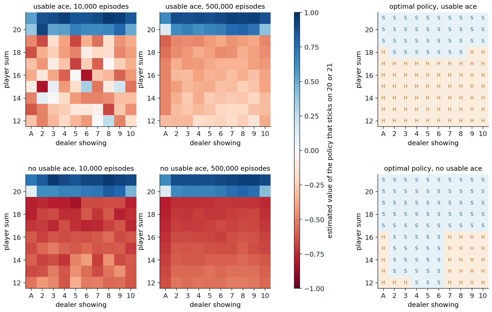
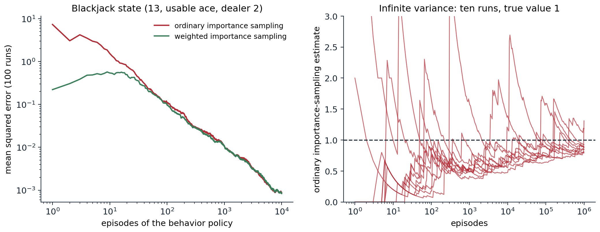

[Background Notes](../README.md) › [Reinforcement Learning](README.md)

# 5. Monte Carlo Methods

[← 4. Contextual, Bayesian, and Adversarial Bandits](04-contextual-bayesian-and-adversarial-bandits.md) · [6. Temporal-Difference Learning →](06-temporal-difference-learning.md)

## <a id="learning-from-complete-episodes"></a>Learning from complete episodes

### <a id="from-planning-to-learning"></a>From planning to learning

Dynamic programming computes values from a model of the environment (chapter 2). Most problems come without one: the transition probabilities of a robot's joints, a patient's response to treatment, or a card game's outcomes are not written down, or are too complex to write. **Monte Carlo methods** learn value functions and policies from experience alone, by averaging the returns observed in sample episodes. They need only the ability to generate episodes, either by acting in the real environment or by running a simulator that can produce sample transitions but not their probabilities. The second case is common: a blackjack simulator takes a few lines of code, while the distribution of the dealer's final total given the visible card, which dynamic programming would need, takes careful work.

Monte Carlo methods are defined here for **episodic** tasks, where every episode terminates, so that returns are complete sums. They learn only at the end of an episode, from the return that actually followed each state, which is what distinguishes them from the temporal-difference methods of chapter 6.

### <a id="first-visit-and-every-visit-prediction"></a>First-visit and every-visit prediction

The value of a state is an expected return, $`v_\pi(s)=\mathbb E_\pi[G_t\mid S_t=s]`$, and the obvious estimate is an average of observed returns. Each occurrence of $`s`$ in an episode is a **visit**. **First-visit Monte Carlo** averages the returns following the first visit to $`s`$ in each episode; **every-visit Monte Carlo** averages the returns following all visits:

```math
V(s)=\frac1{N(s)}\sum_{i=1}^{N(s)}G^{(i)}(s)\;\longrightarrow\;v_\pi(s).
```

In first-visit MC, each episode contributes one return per state, the returns from different episodes are independent and identically distributed with mean $`v_\pi(s)`$, and the estimate is unbiased, with standard error $`\sigma/\sqrt{N(s)}`$ that falls as the inverse square root of the number of visits. Every-visit MC uses several correlated returns from the same episode; it is biased whenever $`s`$ can recur within an episode, but also converges to $`v_\pi(s)`$, and it is the version that extends naturally to function approximation ([Appendix B](#block-rl05-appendix-b)). Neither method needs the returns of other states, so each state's estimate is built independently of the others' estimates (though estimates computed from the same episodes are correlated): to estimate the value of one state, one can generate episodes starting there and ignore every other state.

The estimate can be computed incrementally, as in chapter 3, with $`V(s)\leftarrow V(s)+\frac1{N(s)}\bigl(G-V(s)\bigr)`$, or with a constant step size, $`V(s)\leftarrow V(s)+\alpha\bigl(G-V(s)\bigr)`$, which forgets old episodes and suits nonstationary problems. The constant-step version, **constant-α MC**, is the form compared with temporal-difference learning in the next chapter.

### <a id="blackjack"></a>Blackjack

Sutton and Barto's running example is a simplified blackjack. Cards are drawn from an infinite deck, face cards count 10, and an ace counts 11 unless that would bust the hand, in which case it counts 1; an ace counted as 11 is **usable**. The player tries to beat the dealer's total without exceeding 21, and can **hit** (take another card) or **stick**; the dealer shows one card, hits until reaching 17, and busts if exceeding 21. Rewards are $`+1`$, $`0`$, and $`-1`$ for winning, drawing, and losing, given at the end, with no discounting. Sutton and Barto also let a natural (an ace and a ten-card dealt at the start) win unless the dealer has one too; the code treats it as an ordinary 21, which changes only the values of the usable-ace 21 states. The state the player sees is its current sum (12 to 21, since below 12 hitting is always right), whether it holds a usable ace, and the dealer's visible card, 200 states in all. The code evaluates the policy that sticks only on 20 or 21, by first-visit Monte Carlo over 500,000 simulated hands.

```python
import numpy as np

# Blackjack as in Sutton and Barto (Example 5.1): infinite deck, face cards count 10, an ace counts 11
# unless that would bust (a "usable" ace). The player hits automatically below 12; the dealer sticks on 17+.
rng = np.random.default_rng(0)


def card():
    return min(int(rng.integers(1, 14)), 10)


def add(total, usable, c):
    total += c
    if c == 1 and total + 10 <= 21:
        total, usable = total + 10, True
    if total > 21 and usable:
        total, usable = total - 10, False
    return total, usable


def episode(policy):
    """Play one hand; return the visited states (sum, usable ace, dealer card) and the final reward."""
    p, pu = add(*add(0, False, card()), card())
    show = card()
    d, du = add(*add(0, False, show), card())
    while p < 12:                                            # automatic hits: no decision to evaluate
        p, pu = add(p, pu, card())
    states = []
    while True:
        states.append((p, pu, show))
        if policy(p, pu, show):
            break
        p, pu = add(p, pu, card())
        if p > 21:
            return states, -1.0
    while d < 17:
        d, du = add(d, du, card())
    return states, 1.0 if d > 21 or p > d else (0.0 if p == d else -1.0)


stick_20 = lambda s, u, d: s >= 20                           # Sutton and Barto's evaluated policy
returns = {}
for _ in range(500_000):
    states, r = episode(stick_20)                            # no discounting, reward only at the end:
    for s in states:                                         # every visited state's return is r
        returns.setdefault(s, []).append(r)
V = {s: np.mean(g) for s, g in returns.items()}
print(f"states visited: {len(V)} (sums 12-21 x usable ace or not x dealer card 1-10)")
for s in [(21, False, 10), (20, False, 10), (13, False, 2), (13, True, 2)]:
    g = np.array(returns[s])
    print(f"v{s}: {V[s]:+.4f} +- {g.std() / np.sqrt(len(g)):.4f} from {len(g):,} visits")
# states visited: 200 (sums 12-21 x usable ace or not x dealer card 1-10)
# v(21, False, 10): +0.8908 +- 0.0025 from 15,067 visits
# v(20, False, 10): +0.4301 +- 0.0039 from 30,148 visits
# v(13, False, 2): -0.5767 +- 0.0117 from 4,661 visits
# v(13, True, 2): -0.3088 +- 0.0422 from 476 visits
```

Holding 21 against a dealer's 10 is worth $`+0.89`$: the player cannot lose, and only draws when the dealer also reaches 21, which happens about 11% of the time. Holding 13 without an ace against a 2 is worth $`-0.58`$ under this policy, which keeps hitting a weak hand; with a usable ace the same total is worth about $`-0.3`$, since the ace protects against busting on the next card. The estimates agree with the exact values computed by dynamic programming on the model, $`0.8886`$, $`0.4350`$, $`-0.5774`$, and $`-0.2772`$ (exercise 5.6), within one or two standard errors. States reached rarely, such as a sum of 13 with a usable ace, have large errors: they were visited 476 times in 500,000 hands.



*Left and middle: first-visit Monte Carlo estimates of the value of sticking only on 20 or 21, after 10,000 and 500,000 hands, as in Figure 5.1 of Sutton and Barto. States with a usable ace (top) are rarer, and their estimates are noisier after 10,000 hands. The values jump at 20, where the policy sticks, and dip against a dealer's ace. Right: the optimal policy, S for stick and H for hit, which Monte Carlo control with exploring starts recovers in all 200 states in the code below; it matches the "basic strategy" of this version of the game.*

## <a id="monte-carlo-control"></a>Monte Carlo control

### <a id="action-values-and-the-exploration-problem"></a>Action values and the exploration problem

To improve a policy without a model, state values are not enough: choosing the greedy action from $`v_\pi`$ requires a one-step lookahead through the transition probabilities. Monte Carlo control therefore estimates **action values** $`q_\pi(s,a)`$, by averaging the returns that followed each visit to the pair $`(s,a)`$, and improves the policy greedily with respect to them, $`\pi(s)\leftarrow\arg\max_aQ(s,a)`$. This is generalized policy iteration (chapter 2) with evaluation by sampling.

The difficulty is that a deterministic policy never tries the actions it does not choose, so their values are never estimated, and the greedy step can never discover that one of them is better. Estimating action values needs **continual exploration**. Two ways to get it lead to two families of algorithms: start episodes from randomly chosen state–action pairs, or make the policy itself stochastic.

### <a id="exploring-starts"></a>Exploring starts

If every episode starts from a random state–action pair, with every pair having positive probability, all pairs are visited infinitely often in the limit. **Monte Carlo with exploring starts** (MC ES) combines this with greedy improvement after every episode: generate an episode from a random start, update the averages of the pairs it visited, and make the policy greedy at the states visited. The code runs it on blackjack for two million hands.

```python
import numpy as np

# Monte Carlo control with exploring starts on blackjack (Sutton and Barto, Figure 5.2).
rng = np.random.default_rng(1)


def card():
    return min(int(rng.integers(1, 14)), 10)


def add(total, usable, c):
    total += c
    if c == 1 and total + 10 <= 21:
        total, usable = total + 10, True
    if total > 21 and usable:
        total, usable = total - 10, False
    return total, usable


Q = np.zeros((22, 2, 11, 2))                                 # Q[sum, usable, dealer card, action]; 1 = stick
N = np.zeros_like(Q)
for _ in range(2_000_000):
    # Exploring start: a uniformly random state and a uniformly random first action.
    p, pu, show = int(rng.integers(12, 22)), bool(rng.integers(2)), int(rng.integers(1, 11))
    d, du = add(*add(0, False, show), card())
    a = int(rng.integers(2))
    visited, r = [], None
    while True:
        visited.append((p, int(pu), show, a))
        if a == 1:
            break
        p, pu = add(p, pu, card())
        if p > 21:
            r = -1.0
            break
        a = int(Q[p, int(pu), show].argmax())                # afterward, greedy with respect to Q
    if r is None:
        while d < 17:
            d, du = add(d, du, card())
        r = 1.0 if d > 21 or p > d else (0.0 if p == d else -1.0)
    for s in visited:                                        # every visit gets the final reward as return
        N[s] += 1
        Q[s] += (r - Q[s]) / N[s]

stick = Q[..., 1] >= Q[..., 0]
optimal = {False: [17, 13, 13, 12, 12, 12, 17, 17, 17, 17],  # smallest sum at which to stick, dealer A..10,
           True: [19, 18, 18, 18, 18, 18, 18, 18, 19, 19]}   # from dynamic programming on the exact model
for u in (False, True):
    learned = [min(s for s in range(12, 22) if all(stick[t, int(u), d] for t in range(s, 22))) for d in range(1, 11)]
    print(f"{'usable ace' if u else 'no usable ace':14s} learned thresholds {learned}")
    print(f"{'':14s} optimal thresholds {optimal[u]}")
wrong = [(s, u, d) for u in (0, 1) for d in range(1, 11) for s in range(12, 22)
         if stick[s, u, d] != (s >= optimal[bool(u)][d - 1])]
print(f"states where the greedy action differs from optimal: {len(wrong)} of 200: {wrong}")
# no usable ace  learned thresholds [17, 13, 13, 12, 12, 12, 17, 17, 17, 17]
#                optimal thresholds [17, 13, 13, 12, 12, 12, 17, 17, 17, 17]
# usable ace     learned thresholds [19, 18, 18, 18, 18, 18, 18, 18, 19, 19]
#                optimal thresholds [19, 18, 18, 18, 18, 18, 18, 18, 19, 19]
# states where the greedy action differs from optimal: 0 of 200: []
```

The learned policy agrees with the optimal one, computed by dynamic programming on the exact model, in all 200 states. Without a usable ace, the player should stick on 12 or more against a dealer showing 4 to 6, the "bust cards", from which the dealer is most likely to bust; against 7 or higher, or an ace, it must keep hitting until 17. With a usable ace it can afford to hit up to 17 and, against 9, 10, or an ace, even on 18.

Although MC ES is simple and works well here, whether it converges to the optimal policy in general is, in Sutton and Barto's words, one of the most fundamental open theoretical questions in reinforcement learning, since values and policy change together and the averages mix returns of different policies. [Tsitsiklis (2002)](https://jmlr.org/papers/v3/tsitsiklis02a.html) proved convergence for a discounted variant in which each episode updates only its starting pair and all pairs start episodes equally often; [Wang et al. (2022)](https://arxiv.org/abs/2002.03585) proved it for the original algorithm in "optimal policy feed-forward" MDPs, where no state is revisited within an episode under an optimal policy, a class that includes every MDP in which no state can recur, like blackjack. Exploring starts are rarely available outside simulation, where a learner can start the game in any position, which motivates the next approach.

### <a id="soft-policies"></a>ε-soft policies

An **ε-soft** policy gives every action at least probability $`\varepsilon/|\mathcal A(s)|`$. On-policy Monte Carlo control keeps the policy ε-greedy with respect to the current action values: the greedy action gets probability $`1-\varepsilon+\varepsilon/|\mathcal A|`$, and every other action $`\varepsilon/|\mathcal A|`$. The policy improvement theorem holds within this class: for any ε-soft $`\pi`$, the ε-greedy policy with respect to $`q_\pi`$ is at least as good as $`\pi`$ (exercise 5.4), and policy iteration within the class stops improving only at the best ε-soft policy. That is optimal for a modified environment in which the agent's chosen action is replaced by a random one with probability $`\varepsilon`$, but not for the original. Decreasing ε at each state as its visits accumulate, for example $`\varepsilon(s)=c/N(s)`$ with $`0<c<1`$, gives a schedule that is **greedy in the limit with infinite exploration** (GLIE): every action is still tried infinitely often in every state visited infinitely often, and the policy converges to a greedy one. A single global schedule such as $`\varepsilon_k=1/k`$ over episodes need not be GLIE, because the non-greedy actions of a state reached only by exploring are then tried with probability of order $`1/k^2`$, a summable series. [Singh et al. (2000)](https://doi.org/10.1023/A:1007678930559), who introduced the condition, proved that one-step SARSA converges to an optimal policy under it in finite MDPs; they do not treat Monte Carlo control. The GLIE condition reappears for SARSA in chapter 7.

## <a id="off-policy-monte-carlo"></a>Off-policy Monte Carlo

### <a id="two-policies"></a>Two policies

The dilemma of the previous section is sharp: an agent wants to learn about the optimal, greedy policy, but must behave in an exploratory way to learn at all. **Off-policy** methods separate the two roles. The **target policy** $`\pi`$ is the one whose values are wanted, typically greedy; the **behavior policy** $`b`$ generates the data, and must be exploratory. The data come from $`b`$, but the values are those of $`\pi`$. Off-policy learning also covers learning from demonstrations, from data logged by an earlier system, as in chapter 4, and from many policies at once. The one requirement is **coverage**: every action that $`\pi`$ may take must have positive probability under $`b`$, $`\pi(a\mid s)>0\Rightarrow b(a\mid s)>0`$.

### <a id="importance-sampling"></a>Importance sampling

The probability of a trajectory $`A_t,S_{t+1},A_{t+1},\dots,S_T`$ from $`S_t`$ is a product of policy and transition probabilities. The transition probabilities are the same under both policies and cancel in the ratio, leaving the **importance sampling ratio**

```math
\rho_{t:T-1}=\prod_{k=t}^{T-1}\frac{\pi(A_k\mid S_k)}{b(A_k\mid S_k)},
```

which depends only on the two policies and the actions taken, not on the unknown dynamics. Reweighting returns by it corrects their expectation: $`\mathbb E_b[\rho_{t:T-1}G_t\mid S_t=s]=v_\pi(s)`$ ([Appendix A](#block-rl05-appendix-a)). With $`\mathcal T(s)`$ the set of visits to $`s`$ and $`T(t)`$ the end of the episode containing visit $`t`$, the two standard estimators are

```math
V_{\text{ordinary}}(s)=\frac{\sum_{t\in\mathcal T(s)}\rho_{t:T(t)-1}\,G_t}{|\mathcal T(s)|},\qquad V_{\text{weighted}}(s)=\frac{\sum_{t\in\mathcal T(s)}\rho_{t:T(t)-1}\,G_t}{\sum_{t\in\mathcal T(s)}\rho_{t:T(t)-1}}.
```

**Ordinary importance sampling** is unbiased, in the first-visit case, but its variance can be enormous, even infinite, because the ratios multiply along the episode and can be exponentially large. **Weighted importance sampling** normalizes by the sum of the weights: after a single episode its estimate is just the observed return, a biased estimate of $`v_\pi`$, but it is consistent, its bias falls to zero, and its variance stays bounded when returns are bounded. These are the IPS and self-normalized IPS estimators of chapter 4, applied to whole trajectories instead of single actions.

When the target policy is deterministic, as a greedy policy is, the ratio is zero as soon as the behavior policy takes an action the target would not, and otherwise a product of factors $`1/b(A_k\mid S_k)`$. Only the trajectories that the target policy could have produced count. The code evaluates the blackjack policy that sticks on 20 or 21 from one state, a sum of 13 with a usable ace against a dealer's 2, using episodes of a behavior policy that hits or sticks at random.

```python
import numpy as np

# Off-policy evaluation of one blackjack state (Sutton and Barto, Example 5.4): player sum 13 with a usable
# ace, dealer showing 2. Target policy: stick on 20 or 21. Behavior policy: hit or stick with probability 1/2.
rng = np.random.default_rng(2)
true_value = -0.27720                                        # exact value, by dynamic programming (exercise 5.6)


def card():
    return min(int(rng.integers(1, 14)), 10)


def add(total, usable, c):
    total += c
    if c == 1 and total + 10 <= 21:
        total, usable = total + 10, True
    if total > 21 and usable:
        total, usable = total - 10, False
    return total, usable


def behavior_episode():
    """Returns the importance ratio rho = prod pi(a|s) / b(a|s) and the reward of one episode."""
    p, pu, rho = 13, True, 1.0
    d, du = add(*add(0, False, 2), card())
    while True:
        stick = rng.random() < 0.5
        rho *= (1.0 if stick == (p >= 20) else 0.0) / 0.5    # target is deterministic: pi(a|s) is 0 or 1
        if stick:
            break
        p, pu = add(p, pu, card())
        if p > 21:
            return rho, -1.0
    while d < 17:
        d, du = add(d, du, card())
    return rho, 1.0 if d > 21 or p > d else (0.0 if p == d else -1.0)


runs, episodes = 100, 10_000
checkpoints = [10, 100, 1000, 10_000]
err = {"ordinary": np.zeros((runs, 4)), "weighted": np.zeros((runs, 4))}
for i in range(runs):
    rho_g, rho = np.zeros(episodes), np.zeros(episodes)
    for n in range(episodes):
        rho[n], r = behavior_episode()
        rho_g[n] = rho[n] * r
    for j, n in enumerate(checkpoints):
        err["ordinary"][i, j] = rho_g[:n].sum() / n - true_value
        w = rho[:n].sum()
        err["weighted"][i, j] = (rho_g[:n].sum() / w if w > 0 else 0.0) - true_value
for name, e in err.items():
    print(f"{name:8s} importance sampling, mean squared error after " +
          ", ".join(f"{n:,}: {np.mean(e[:, j] ** 2):.4f}" for j, n in enumerate(checkpoints)))
print(f"fraction of behavior episodes consistent with the target policy: {np.mean(rho > 0):.3f}")
# ordinary importance sampling, mean squared error after 10: 0.6753, 100: 0.0940, 1,000: 0.0104, 10,000: 0.0011
# weighted importance sampling, mean squared error after 10: 0.4942, 100: 0.0724, 1,000: 0.0091, 10,000: 0.0009
# fraction of behavior episodes consistent with the target policy: 0.138
```

Only 14% of the random episodes are consistent with the target policy, which must hit until 20; the rest get weight zero. Both estimators converge, with mean squared errors falling roughly as $`1/n`$, and weighted importance sampling is more accurate throughout, most clearly early on. The exact value, $`-0.27720`$, comes from dynamic programming (exercise 5.6); Sutton and Barto give $`-0.27726`$ from 100 million simulated episodes.



*Left: mean squared error, over 100 runs, of ordinary and weighted importance-sampling estimates of the blackjack state's value under the target policy, from random behavior. Weighted importance sampling starts with much lower error, since each of its estimates is an average of returns between $`-1`$ and $`1`$, while ordinary estimates are returns multiplied by weights up to $`2^k`$. Right: Sutton and Barto's example of infinite variance. In a single state, action "left" returns to the state with probability 0.9 or ends with reward $`+1`$; action "right" ends with reward 0. The target policy always goes left, so its value is 1; the behavior policy chooses at random. Ten runs of ordinary importance sampling are still far apart after a million episodes, between 0.79 and 1.31, with sudden jumps whenever a long episode with a huge weight appears; weighted importance sampling would give exactly 1 after the first episode that ends with "left".*

### <a id="incremental-implementation"></a>Incremental implementation

Weighted importance sampling can be computed incrementally without storing returns. For a sequence of returns $`G_1,G_2,\dots`$ from one state with weights $`W_k`$,

```math
C_n=C_{n-1}+W_n,\qquad V_{n+1}=V_n+\frac{W_n}{C_n}\bigl(G_n-V_n\bigr),
```

with $`C_0=0`$ (exercise 5.2). Processing each episode backward from its end, the return and the weight can both be accumulated step by step: $`G\leftarrow\gamma G+R_{t+1}`$ and $`W\leftarrow W\,\pi(A_t\mid S_t)/b(A_t\mid S_t)`$.

**Off-policy Monte Carlo control** uses this with a greedy target policy. The behavior policy is any soft policy, for instance ε-greedy with respect to the current estimates; the target policy is greedy with respect to $`Q`$; and each episode is processed backward, updating $`Q(S_t,A_t)`$ with weight $`W`$ and stopping as soon as the behavior action differs from the greedy one, since the weight becomes zero. For action values the weight of $`Q(S_t,A_t)`$ excludes the factor for $`A_t`$ itself, which is given, so $`W`$ is multiplied by $`\pi/b`$ after the update; the pair where the behavior action first differs from the greedy one is still updated, and the loop then stops. The method learns only from the **tail** of each episode from its last non-greedy action on, which makes it slow when non-greedy actions are common and episodes are long: this is the price of importance sampling in control, and the reason why the off-policy methods of later chapters (Q-learning in chapter 7, tree backup and Retrace in chapter 9) avoid multiplying ratios along whole episodes.

### <a id="reducing-the-variance-of-importance-sampling"></a>Reducing the variance of importance sampling

The variance of the ratio grows with the length of the episode, but not every factor is needed. Two refinements remove some of them (chapter 9 develops both).

- **Per-decision importance sampling.** The reward $`R_{t+k+1}`$ depends only on the actions up to $`A_{t+k}`$, and the later factors of the ratio have expectation one given the past. They can be dropped from that reward's weight, giving the unbiased estimate $`\sum_k\gamma^k\rho_{t:t+k}R_{t+k+1}`$, in which early rewards carry short products (exercise 5.5).
- **Discounting-aware importance sampling.** A discount $`\gamma<1`$ can be read as a probability $`1-\gamma`$ of terminating at each step, as in chapter 1. The return is then a mixture of truncated, undiscounted returns, each of which needs only the ratios up to its own truncation point.

With either refinement, long products of ratios multiply only heavily discounted rewards or partial returns, so the variance is much smaller when discounting is heavy.

## <a id="properties-of-monte-carlo-methods"></a>Properties of Monte Carlo methods

### <a id="bias-variance-and-the-markov-property"></a>Bias, variance, and the Markov property

Monte Carlo methods have several advantages over dynamic programming, and over the temporal-difference methods of the next chapter:

- They learn from experience or simulation, without a model of the transition probabilities.
- They do not **bootstrap**: the estimate for a state is not built from the estimates of other states, so errors in one state's value do not propagate to others, and first-visit estimates are unbiased.
- They do not rely on the Markov property. The return that followed a state is the right target whether or not the state summarizes the history, so Monte Carlo estimates remain meaningful for partially observed problems, where bootstrapping from the value of an imperfect state can mislead.
- They can focus on the states of interest, such as the start state, or a state an agent faces now, at a cost that does not depend on the number of states.

Their disadvantages are the other side of the same coin. The returns sum many random rewards and transitions, so their variance is high and grows with the length of the episode. Updates must wait until an episode ends, which is impractical for long episodes and impossible for continuing tasks. And every state's estimate is learned in isolation, without exploiting the relationships between states that the Bellman equation expresses. Temporal-difference learning trades a little bias for much lower variance and online updates, and the multi-step methods of chapter 8 interpolate between the two.

### <a id="monte-carlo-in-modern-reinforcement-learning"></a>Monte Carlo in modern reinforcement learning

Monte Carlo returns remain central. The REINFORCE policy gradient of chapter 13 weights each action's log-probability gradient by a Monte Carlo return. In the original AlphaGo, each leaf of the search was evaluated by averaging a value network's estimate with the outcome of a fast Monte Carlo rollout from that position, and Monte Carlo tree search averages the results of simulated games (chapter 10, chapter 24). In reinforcement learning for language models, where an episode is one generated answer and the reward arrives at its end, the group-average baselines of GRPO are Monte Carlo estimates of the prompt's value under the current policy, and VinePPO replaces a learned critic by Monte Carlo rollouts from intermediate points of a solution (chapter 28). Wherever episodes are short, simulation is cheap, or value functions are hard to learn, Monte Carlo estimation is a strong choice.

Lab 3 trains Monte Carlo control on Gymnasium's blackjack and compares the policy it learns with the optimal one of exercise 5.6 and with Q-learning's.

## <a id="exercises"></a>Exercises

### <a id="exercise-5-1-first-visit-or-every-visit"></a>Exercise 5.1 — First visit or every visit?

A single nonterminal state has a self-loop: every step pays 1, and the episode continues with probability 0.9. (a) What is the true value with $`\gamma=1`$? (b) From one episode of length $`L`$, what are the first-visit and every-visit estimates, and what are their expectations? (c) Compare their bias and mean squared error after $`n`$ episodes by simulation.


<details>
<summary><b>Solution</b></summary>


(a) The value is the expected length of the episode, $`1/(1-0.9)=10`$.

(b) The first visit is at the start, with return $`L`$, so the first-visit estimate is $`L`$, with expectation 10. The every-visit estimate averages the returns $`L,L-1,\dots,1`$ from the $`L`$ visits, $`(L+1)/2`$, with expectation 5.5: badly biased from one episode. After $`n`$ episodes the every-visit estimate is $`\sum_iL_i(L_i+1)/2\,/\sum_iL_i`$, which tends to $`\mathbb E[L(L+1)]/(2\mathbb E[L])=(90+100+10)/20=10`$: consistent.

```python
import numpy as np

# One nonterminal state with a self-loop: every step pays 1 and the episode continues with probability 0.9.
# The true value (gamma = 1) is the expected episode length, 1 / (1 - 0.9) = 10.
rng = np.random.default_rng(0)
p, true_v, runs = 0.9, 10.0, 20_000
for n in [1, 3, 10, 30, 100]:
    L = rng.geometric(1 - p, size=(runs, n)).astype(float)  # episode lengths, n episodes per run
    first = L.mean(1)                                        # first visit: the return from the first visit is L
    every = (L * (L + 1) / 2).sum(1) / L.sum(1)              # every visit: returns L, L-1, ..., 1 in each episode
    print(f"{n:3d} episodes: first-visit bias {first.mean() - true_v:+6.2f}, MSE {np.mean((first - true_v) ** 2):6.2f}"
          f" | every-visit bias {every.mean() - true_v:+6.2f}, MSE {np.mean((every - true_v) ** 2):6.2f}")
#   1 episodes: first-visit bias  -0.07, MSE  88.95 | every-visit bias  -4.53, MSE  42.80
#   3 episodes: first-visit bias  +0.01, MSE  30.57 | every-visit bias  -2.21, MSE  26.58
#  10 episodes: first-visit bias  +0.01, MSE   9.19 | every-visit bias  -0.80, MSE  12.73
#  30 episodes: first-visit bias  -0.01, MSE   2.99 | every-visit bias  -0.30, MSE   5.01
# 100 episodes: first-visit bias  -0.00, MSE   0.90 | every-visit bias  -0.10, MSE   1.62
```

From few episodes, every-visit MC has *lower* mean squared error despite its bias, because it averages more (correlated) returns; from about five episodes on first-visit MC is better, and its advantage persists. [Singh and Sutton (1996)](https://doi.org/10.1007/BF00114726) proved both ends of this pattern for such problems: every-visit MC has the lower mean squared error after one episode, and first-visit MC for all sufficiently many episodes.

</details>


### <a id="exercise-5-2-incremental-weighted-importance-sampling"></a>Exercise 5.2 — Incremental weighted importance sampling

Show that $`V_{n+1}=\sum_{k\le n}W_kG_k/\sum_{k\le n}W_k`$ satisfies the incremental update $`V_{n+1}=V_n+(W_n/C_n)(G_n-V_n)`$ with $`C_n=\sum_{k\le n}W_k`$.


<details>
<summary><b>Solution</b></summary>


By definition $`C_nV_{n+1}=C_{n-1}V_n+W_nG_n`$, and $`C_{n-1}=C_n-W_n`$. So $`C_nV_{n+1}=C_nV_n-W_nV_n+W_nG_n`$, and dividing by $`C_n`$ gives the update. It has the familiar error-correcting form with a step size $`W_n/C_n`$ that is the new sample's share of the total weight, which reduces to $`1/n`$ when all weights are one. Episodes with weight zero leave $`V`$ unchanged, and one enormous weight moves $`V`$ almost all the way to that episode's return.

</details>


### <a id="exercise-5-3-infinite-variance"></a>Exercise 5.3 — Infinite variance

For Sutton and Barto's one-state example in the right panel of the importance-sampling figure, show that the ordinary importance-sampling estimate from one episode, $`X=\rho\,G`$, has expectation 1 but infinite variance.


<details>
<summary><b>Solution</b></summary>


An episode that the target policy could produce consists of $`m\ge0`$ steps of "left" that return to the state, followed by one "left" that ends with reward 1. Under the behavior policy, each step chooses left with probability 1/2 and then returns with probability 0.9, so this episode has probability $`(0.5\cdot0.9)^m\cdot0.5\cdot0.1`$. Its ratio is $`2^{m+1}`$ and its return is 1; every other episode has ratio 0. Hence

```math
\mathbb E[X]=\sum_{m\ge0}0.45^m\cdot0.05\cdot2^{m+1}=0.1\sum_m0.9^m=1,
```

```math
\mathbb E[X^2]=\sum_{m\ge0}0.45^m\cdot0.05\cdot4^{m+1}=0.2\sum_m1.8^m=\infty .
```

The average of $`n`$ such estimates still converges to 1 by the law of large numbers, which needs only a finite mean, but with no finite variance there is no $`1/\sqrt n`$ rate, and the running average makes the rare, huge jumps seen in the figure. The weighted estimator, whose value is the average of returns that are all equal to 1, is exact after the first consistent episode.

</details>


### <a id="exercise-5-4-improving-soft-policies"></a>Exercise 5.4 — Improving ε-soft policies

Let $`\pi`$ be ε-soft and $`\pi'`$ the ε-greedy policy with respect to $`q_\pi`$. Show that $`\sum_a\pi'(a\mid s)q_\pi(s,a)\ge v_\pi(s)`$ for every state, so that $`\pi'`$ is at least as good as $`\pi`$.


<details>
<summary><b>Solution</b></summary>


Let $`m=|\mathcal A(s)|`$. Since $`\pi`$ is ε-soft, the weights $`w_a=\bigl(\pi(a\mid s)-\varepsilon/m\bigr)/(1-\varepsilon)`$ are nonnegative and sum to one, so $`\max_aq_\pi(s,a)\ge\sum_aw_aq_\pi(s,a)`$. Then

```math
\sum_a\pi'(a\mid s)q_\pi(s,a)=\frac\varepsilon m\sum_aq_\pi(s,a)+(1-\varepsilon)\max_aq_\pi(s,a)\ge\frac\varepsilon m\sum_aq_\pi(s,a)+\sum_a\bigl(\pi(a\mid s)-\tfrac\varepsilon m\bigr)q_\pi(s,a)=v_\pi(s).
```

By the policy improvement theorem of chapter 2, $`v_{\pi'}\ge v_\pi`$. Equality everywhere means that $`\pi`$ is already ε-greedy with respect to its own values; Sutton and Barto show that this characterizes the best ε-soft policy, by moving the ε-randomness into a modified environment where it becomes part of the dynamics.

</details>


### <a id="exercise-5-5-per-decision-importance-sampling"></a>Exercise 5.5 — Per-decision importance sampling

Show that $`\mathbb E_b[\rho_{t:T-1}R_{t+k+1}\mid S_t]=\mathbb E_b[\rho_{t:t+k}R_{t+k+1}\mid S_t]`$, and conclude that the per-decision estimate $`\sum_k\gamma^k\rho_{t:t+k}R_{t+k+1}`$ has the same expectation as the ordinary one.


<details>
<summary><b>Solution</b></summary>


Write $`\rho_{t:T-1}=\rho_{t:t+k}\,\rho_{t+k+1:T-1}`$. The first factor and $`R_{t+k+1}`$ are determined by the trajectory up to $`S_{t+k+1}`$. Conditional on that history, the remaining factor has expectation

```math
\mathbb E_b\Bigl[\prod_{j=t+k+1}^{T-1}\frac{\pi(A_j\mid S_j)}{b(A_j\mid S_j)}\Bigm|S_{t+k+1}\Bigr]=1,
```

by peeling off one factor at a time from the end: $`\mathbb E_b[\pi(A_j\mid S_j)/b(A_j\mid S_j)\mid S_j]=\sum_a\pi(a\mid S_j)=1`$. By the tower property, the later factors can be removed from each term. Summing over $`k`$ with discounts gives the claim. The later factors add variance and no information about the earlier rewards; dropping them is the idea behind the per-decision methods of chapter 9.

</details>


### <a id="exercise-5-6-blackjack-by-dynamic-programming"></a>Exercise 5.6 — Blackjack by dynamic programming

Blackjack's model is known, even if writing it down takes some care. Compute the exact values of the policy that sticks on 20 or 21 and the optimal policy, by dynamic programming over the player's states, using the distribution of the dealer's final total given the visible card.


<details>
<summary><b>Solution</b></summary>


The dealer's play does not depend on the player's decisions, so its final total's distribution can be computed once for each visible card, by recursion over the dealer's hand. Sticking is then worth the expected outcome against that distribution; hitting averages the values of the next states over the ten card values. Hands without a usable ace are solved first, from 21 downward, because hitting a usable-ace hand can turn it into one without.

```python
from functools import lru_cache

import numpy as np

# Blackjack by dynamic programming on the exact infinite-deck model.
card_p = np.r_[np.full(9, 1 / 13), 4 / 13]                  # probabilities of cards 1 (ace) .. 10


def add(total, usable, c):
    total += c
    if c == 1 and total + 10 <= 21:
        total, usable = total + 10, True
    if total > 21 and usable:
        total, usable = total - 10, False
    return total, usable


@lru_cache(maxsize=None)
def dealer_final(total, soft):
    """Probabilities that the dealer ends on 17, 18, 19, 20, 21, or busts, from the hand (total, soft)."""
    if total > 21:
        return (0, 0, 0, 0, 0, 1.0)
    if total >= 17:
        out = [0.0] * 6; out[total - 17] = 1.0
        return tuple(out)
    dist = np.zeros(6)
    for c, p in zip(range(1, 11), card_p):
        dist += p * np.array(dealer_final(*add(total, soft, c)))
    return tuple(dist)


def stick_value(s, d):                                       # the dealer shows d and draws a hidden card
    dist = dealer_final(*add(0, False, d))
    return sum(p * (1.0 if f == 5 or s > 17 + f else (0.0 if s == 17 + f else -1.0)) for f, p in enumerate(dist))


def solve(policy=None):
    """Values of states (sum 12-21, usable ace, dealer card) for a fixed policy, or optimal ones if None."""
    V, stick = {}, {}
    for u in (False, True):                                  # a usable-ace hand can turn into a hand without
        for s in range(21, 11, -1):                          # one, so those are computed first
            for d in range(1, 11):
                hit = sum(p * (-1.0 if t > 21 else V[t, uu, d]) for c, p in zip(range(1, 11), card_p)
                          for t, uu in [add(s, u, c)])
                st = stick_value(s, d)
                stick[s, u, d] = st >= hit if policy is None else policy(s, u, d)
                V[s, u, d] = st if stick[s, u, d] else hit
    return V, stick


V20, _ = solve(lambda s, u, d: s >= 20)
Vstar, stick = solve()
print(f"stick on 20 or 21: v(13, usable ace, dealer 2) = {V20[13, True, 2]:.5f}, v(21, no ace, 10) = {V20[21, False, 10]:.4f}")
print(f"optimal: v*(13, usable ace, dealer 2) = {Vstar[13, True, 2]:.4f}; action there: "
      f"{'stick' if stick[13, True, 2] else 'hit'}")
for u in (False, True):
    print(f"{'usable ace' if u else 'no usable ace':14s} stick from:", [min(s for s in range(12, 22) if stick[s, u, d]) for d in range(1, 11)])
# stick on 20 or 21: v(13, usable ace, dealer 2) = -0.27720, v(21, no ace, 10) = 0.8886
# optimal: v*(13, usable ace, dealer 2) = 0.0466; action there: hit
# no usable ace  stick from: [17, 13, 13, 12, 12, 12, 17, 17, 17, 17]
# usable ace     stick from: [19, 18, 18, 18, 18, 18, 18, 18, 19, 19]
```

The value of the importance-sampling example's state is $`-0.27720`$, and the optimal policy is the one Monte Carlo control found. The optimal value of that state is positive, $`+0.047`$: with an ace in hand, a sum of 13 against a dealer's 2 is a favorable position if played well, hitting until it holds a soft 18 or more, or a hard 13 or more once the ace has to count as 1. The comparison shows the trade-off between the two approaches: the model-based computation is exact and instant but needed a careful derivation of the dealer's distribution; Monte Carlo needed only a simulator.

</details>


## <a id="appendices"></a>Appendices


<details>
<summary><a id="block-rl05-appendix-a"></a><b>A. Importance sampling for returns</b></summary>


Fix a state $`s`$ and consider the trajectory $`\tau=(A_t,S_{t+1},\dots,S_T)`$ that follows it. Its probability under a policy $`\pi`$ is

```math
\Pr_\pi(\tau\mid S_t=s)=\prod_{k=t}^{T-1}\pi(A_k\mid S_k)\,p(S_{k+1}\mid S_k,A_k).
```

The ratio of this probability under $`\pi`$ and $`b`$ is $`\rho_{t:T-1}`$, since the transition terms cancel. For any function $`f`$ of the trajectory, and in particular the return,

```math
\mathbb E_b[\rho_{t:T-1}f(\tau)\mid S_t=s]=\sum_\tau\Pr_b(\tau\mid s)\frac{\Pr_\pi(\tau\mid s)}{\Pr_b(\tau\mid s)}f(\tau)=\mathbb E_\pi[f(\tau)\mid S_t=s],
```

where the sum runs over trajectories with $`\Pr_b(\tau\mid s)>0`$, and the coverage assumption ensures that no trajectory with $`\Pr_\pi>0`$ is missed. The weights have expectation one, $`\mathbb E_b[\rho]=1`$, but their second moment is $`\mathbb E_b[\rho^2]=\mathbb E_\pi[\rho]`$, which grows exponentially with the length of the trajectory when the policies differ at every step: for $`T-t`$ steps at which a deterministic $`\pi`$ is compared with a uniform $`b`$ over $`m`$ actions, $`\mathbb E_b[\rho^2]=m^{T-t}`$. This is the **curse of horizon** of importance sampling.

The weighted estimator $`\sum_i\rho_iG_i/\sum_i\rho_i`$ is a ratio of two averages, the first converging to $`v_\pi(s)`$ and the second to $`\mathbb E_b[\rho]=1`$, so it is consistent by the law of large numbers, and biased for finite samples because the expectation of a ratio is not the ratio of expectations. When returns lie in $`[-R,R]`$ it lies in the same interval, whatever the weights, which bounds its variance.

</details>


<details>
<summary><a id="block-rl05-appendix-b"></a><b>B. Convergence of first-visit and every-visit Monte Carlo</b></summary>


**First visit.** The returns following the first visits to $`s`$ in successive episodes are independent, identically distributed, and have mean $`v_\pi(s)`$, so their average converges to $`v_\pi(s)`$ with probability one by the strong law of large numbers, and its standard error is $`\sigma_s/\sqrt{N(s)}`$.

**Every visit.** Group the returns by episode. Let $`K_i`$ be the number of visits to $`s`$ in episode $`i`$ and $`Y_i`$ the sum of the returns following them. The pairs $`(K_i,Y_i)`$ are independent across episodes and identically distributed, so the every-visit estimate $`\sum_iY_i/\sum_iK_i`$ converges to $`\mathbb E[Y]/\mathbb E[K]`$. By the strong Markov property, the process after the $`j`$-th visit to $`s`$ is a fresh copy of the process from $`s`$, independent of the history before it, and whether a $`j`$-th visit happens depends only on that history. Writing $`G^{(j)}`$ for the return after the $`j`$-th visit, $`\mathbb E[Y]=\sum_{j\ge1}\mathbb E[G^{(j)}\mathbb 1\{K\ge j\}]=\sum_{j\ge1}\Pr(K\ge j)\,v_\pi(s)=\mathbb E[K]\,v_\pi(s)`$ (assuming $`\mathbb E[K]<\infty`$); this is the argument behind Wald's identity, which does not apply directly because the returns of one episode are dependent. The limit is therefore $`v_\pi(s)`$. For finite samples the ratio is biased, as exercise 5.1 shows. Constant-α Monte Carlo does not converge but fluctuates around $`v_\pi(s)`$ with variance proportional to $`\alpha`$, and converges if $`\alpha`$ decreases according to the Robbins–Monro conditions of chapter 3.

</details>

---

[← 4. Contextual, Bayesian, and Adversarial Bandits](04-contextual-bayesian-and-adversarial-bandits.md) · [6. Temporal-Difference Learning →](06-temporal-difference-learning.md)
