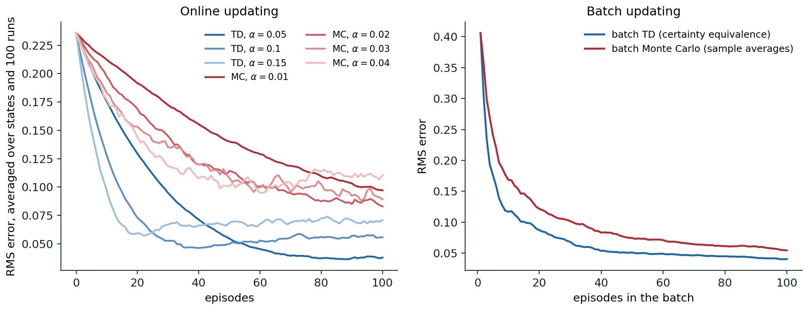
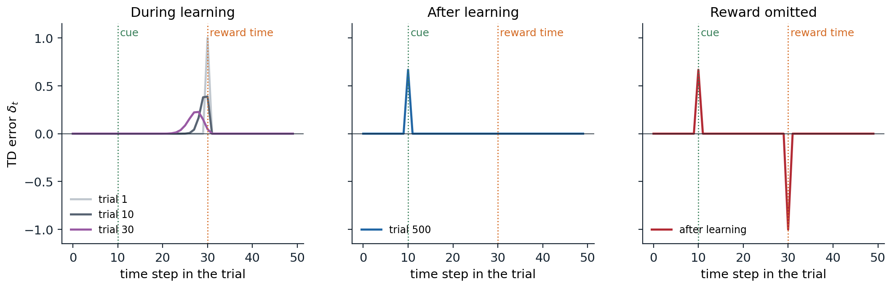

[ML Mastery Notes](../README.md) › [Reinforcement Learning](README.md)

# 6. Temporal-Difference Learning

[← 5. Monte Carlo Methods](05-monte-carlo-methods.md) · [7. Model-Free Control →](07-model-free-control.md)

## <a id="learning-a-guess-from-a-guess"></a>Learning a guess from a guess

### <a id="the-td-error"></a>The TD error

Sutton and Barto write that "if one had to identify one idea as central and novel to reinforcement learning, it would undoubtedly be temporal-difference (TD) learning." Like Monte Carlo methods (chapter 5), TD methods learn from raw experience without a model. Like dynamic programming (chapter 2), they update estimates using other estimates, without waiting for the final outcome: they **bootstrap**.

The simplest TD method, **TD(0)**, updates the value of the state it has just left as soon as it observes the reward and the next state:

$$
V(S_t)\leftarrow V(S_t)+\alpha\bigl[R_{t+1}+\gamma V(S_{t+1})-V(S_t)\bigr].
$$

The quantity in brackets is the **TD error**,

$$
\delta_t=R_{t+1}+\gamma V(S_{t+1})-V(S_t),
$$

the difference between the **TD target** $R_{t+1}+\gamma V(S_{t+1})$ and the current estimate. Compare the three targets for $v_\pi(S_t)$:

- **Monte Carlo** uses the sampled return $G_t$, an unbiased sample of $v_\pi(S_t)$ that is available only at the end of the episode.
- **Dynamic programming** uses $\mathbb E_\pi[R_{t+1}+\gamma v_\pi(S_{t+1})\mid S_t]$, an exact expectation computed from the model, with the current estimate standing in for $v_\pi$.
- **TD** uses $R_{t+1}+\gamma V(S_{t+1})$, which **samples** the expectation, as Monte Carlo does, and **bootstraps** from the current estimate, as DP does.

The TD error is the error of an estimate made at time $t$, revealed at time $t+1$. If the estimates did not change during an episode, the Monte Carlo error would be exactly the discounted sum of the TD errors along the way,

$$
G_t-V(S_t)=\sum_{k=0}^{T-t-1}\gamma^k\delta_{t+k}
$$

(exercise 6.1): Monte Carlo waits and applies all of them at once, while TD applies each one as it arrives.

### <a id="updating-before-the-outcome-is-known"></a>Updating before the outcome is known

Sutton and Barto illustrate the difference with a commute. Leaving the office, you predict that you will be home in 30 minutes; at the car it is raining, and you revise the prediction to 40; leaving the highway sooner than expected, you revise it to 35; stuck behind a truck on a secondary road, to 40; the trip finally takes 43. A Monte Carlo learner cannot adjust its prediction at the office until it arrives home and knows the actual total. A TD learner adjusts it immediately after reaching the car, toward the revised prediction there, and each later prediction toward the one after it. The TD learner updates online, with constant memory and computation per step; it works for continuing tasks with no episodes; and it learns from every transition, even from episodes that are never completed.

## <a id="advantages-of-td-methods"></a>Advantages of TD methods

### <a id="the-random-walk"></a>The random walk

Sutton and Barto's **random walk** is a Markov reward process with five states A to E in a row between two terminal states. Every episode starts in the middle state C and moves left or right with equal probability; reaching the right end gives reward 1, and every other reward is 0. With no discounting, the true value of each state is its probability of ending on the right, $1/6,2/6,\dots,5/6$. The code compares TD(0) with constant-α Monte Carlo, both starting from estimates of 0.5.

```python
import numpy as np

# Sutton and Barto's random walk (Example 6.2): states A..E between two terminals; every episode starts in C
# and moves left or right with probability 1/2. Reaching the right end pays 1, every other reward is 0, and
# there is no discounting, so the true values are the probabilities of ending on the right: 1/6, ..., 5/6.
true_v = np.arange(1, 6) / 6
runs, episodes = 100, 100
rng = np.random.default_rng(0)


def walk():
    s, states = 2, []
    while 0 <= s <= 4:
        states.append(s)
        s += 1 if rng.random() < 0.5 else -1
    return states, 1.0 if s == 5 else 0.0                      # visited states and the final reward


def rms_curve(method, alpha):
    err = np.zeros(episodes)
    for _ in range(runs):
        V = np.full(5, 0.5)                                   # initial estimates, as in the book
        for ep in range(episodes):
            states, r = walk()
            if method == "TD":
                for i, s in enumerate(states):               # TD(0): bootstrap from the next estimate
                    target = V[states[i + 1]] if i + 1 < len(states) else r
                    V[s] += alpha * (target - V[s])
            else:
                for s in states:                              # constant-alpha MC: the final reward is the return
                    V[s] += alpha * (r - V[s])
            err[ep] += np.sqrt(np.mean((V - true_v) ** 2)) / runs
    return err


print("RMS error averaged over the 5 states and 100 runs, after 10 / 100 episodes")
for method, alphas in [("TD", [0.05, 0.1, 0.15]), ("MC", [0.01, 0.02, 0.03, 0.04])]:
    for a in alphas:
        e = rms_curve(method, a)
        print(f"  {method} alpha {a:4.2f}: {e[9]:.3f} / {e[99]:.3f}")
# RMS error averaged over the 5 states and 100 runs, after 10 / 100 episodes
#   TD alpha 0.05: 0.175 / 0.038
#   TD alpha 0.10: 0.128 / 0.056
#   TD alpha 0.15: 0.097 / 0.071
#   MC alpha 0.01: 0.212 / 0.097
#   MC alpha 0.02: 0.197 / 0.083
#   MC alpha 0.03: 0.183 / 0.089
#   MC alpha 0.04: 0.177 / 0.110
```

TD learns faster than Monte Carlo at the step sizes tried: after 100 episodes its error with $\alpha=0.05$ is 0.038, less than half of the best Monte Carlo error. The table also shows the trade-off in the step size: larger steps learn faster at first but settle at a higher error, because a constant step keeps the estimates fluctuating with the most recent outcomes.



*Left: RMS error of the value estimates on the random walk, averaged over the five states and 100 runs, for TD(0) and constant-α Monte Carlo with several step sizes (the right graph of Sutton and Barto's Example 6.2). With the larger step sizes both methods reach an error floor and fluctuate around it. Right: batch updating, where the estimates are recomputed from all episodes seen so far until they converge (Sutton and Barto's Figure 6.2). Batch TD, which computes the certainty-equivalence estimate, has lower error than batch Monte Carlo at every batch size beyond the first (with a single episode the two estimates coincide).*

### <a id="bias-and-variance-of-the-targets"></a>Bias and variance of the targets

The targets explain the result. The Monte Carlo target $G_t$ is unbiased but depends on every random transition until the end of the episode, so its variance grows with the episode's length. The TD target depends on one random transition, so its variance is much smaller, but it uses the current estimate $V(S_{t+1})$, which is wrong while learning is incomplete, so it is biased. As the estimates improve the bias shrinks, and TD's lower variance usually wins. The bias is not always harmless: with function approximation and off-policy data, bootstrapping from inaccurate estimates can make learning diverge (chapter 12), a failure Monte Carlo methods cannot suffer. The multi-step methods of chapter 8 trade between the two targets continuously.

## <a id="batch-updating-and-certainty-equivalence"></a>Batch updating and certainty equivalence

### <a id="two-estimates-from-the-same-data"></a>Two estimates from the same data

Suppose only a finite amount of experience is available, as when data are expensive. One can present the same episodes over and over, accumulating the increments over the whole batch and applying them together, until the estimates converge. For small enough $\alpha$, batch TD(0) and batch Monte Carlo both converge to single answers, independent of $\alpha$, but different ones. Sutton and Barto's Example 6.4 shows how. Eight episodes were observed: once, the agent went from A to B with reward 0 and then terminated with reward 0; six times it started in B and terminated with reward 1; once it started in B and terminated with reward 0.

```python
import numpy as np

# Batch updating: present the same data repeatedly until the estimates stop changing.
# Sutton and Barto's Example 6.4: eight episodes, (state, reward) pairs, no discounting.
data = [[("A", 0), ("B", 0)]] + [[("B", 1)]] * 6 + [[("B", 0)]]


def batch_td(episodes, alpha=0.01, tol=1e-10):
    V = {s: 0.0 for ep in episodes for s, _ in ep}
    while True:
        inc = {s: 0.0 for s in V}
        for ep in episodes:
            for i, (s, r) in enumerate(ep):
                nxt = V[ep[i + 1][0]] if i + 1 < len(ep) else 0.0
                inc[s] += alpha * (r + nxt - V[s])           # accumulate the TD increments over the batch
        for s in V:
            V[s] += inc[s]
        if max(abs(x) for x in inc.values()) < tol:
            return V


def batch_mc(episodes):
    returns = {}
    for ep in episodes:
        rewards = [r for _, r in ep]
        for i, (s, _) in enumerate(ep):
            returns.setdefault(s, []).append(sum(rewards[i:]))
    return {s: np.mean(g) for s, g in returns.items()}


print("batch TD:", {s: round(v, 3) for s, v in batch_td(data).items()})
print("batch MC:", {s: round(v, 3) for s, v in batch_mc(data).items()})

# The same comparison on the random walk: RMS error after training on the first n episodes, 100 runs.
rng = np.random.default_rng(0)
true_v = np.arange(1, 6) / 6
names = "ABCDE"


def walk():
    s, ep = 2, []
    while 0 <= s <= 4:
        nxt = s + (1 if rng.random() < 0.5 else -1)
        ep.append((names[s], 1 if nxt == 5 else 0))
        s = nxt
    return ep


err = {"TD": np.zeros(3), "MC": np.zeros(3)}
for run in range(100):
    eps = [walk() for _ in range(100)]
    for j, n in enumerate([10, 30, 100]):
        for name, f in [("TD", lambda e: batch_td(e, alpha=0.001, tol=1e-7)), ("MC", batch_mc)]:
            V = f(eps[:n])
            est = np.array([V.get(c, 0.5) for c in names])
            err[name][j] += np.sqrt(np.mean((est - true_v) ** 2)) / 100
for name, e in err.items():
    print(f"batch {name}: RMS error after 10 / 30 / 100 episodes: {e[0]:.3f} / {e[1]:.3f} / {e[2]:.3f}")
# batch TD: {'A': 0.75, 'B': 0.75}
# batch MC: {'A': 0.0, 'B': 0.75}
# batch TD: RMS error after 10 / 30 / 100 episodes: 0.148 / 0.076 / 0.042
# batch MC: RMS error after 10 / 30 / 100 episodes: 0.189 / 0.108 / 0.056
```

Both methods agree that $V(B)=3/4$. For A, Monte Carlo gives 0, the only return observed from A. TD gives $3/4$: A was followed by B, B is worth $3/4$, so A must be worth $3/4$ too. Which is better? Batch Monte Carlo minimizes the squared error on the observed returns; for A it fits the single observed return exactly. Batch TD finds the value function of the **maximum-likelihood model** of the process: the Markov reward process whose transition probabilities and expected rewards are the observed frequencies and averages, here "A always goes to B". Its estimates are exactly right if that model is right, which is why it is called the **certainty-equivalence** estimate ([Appendix B](#block-rl06-appendix-b)). If the process is Markov, the TD answer should generalize better to new data: the single episode from A is weak evidence compared with the eight observations of B. On the random walk, batch TD has lower error than batch Monte Carlo at every batch size beyond the first, as the code and the right panel of the figure show.

### <a id="why-td-is-often-faster"></a>Why TD is often faster

TD exploits the Markov property: it propagates information between states along the observed transitions, so every observation of B improves the estimate of every state that leads to B. Monte Carlo treats each state's returns in isolation. Batch TD reaches the certainty-equivalence estimate without ever forming the model: forming the model can take $O(|\mathcal S|^2)$ memory and solving for its values $O(|\mathcal S|^3)$ computation by conventional methods, while TD needs $O(|\mathcal S|)$ memory and repeated passes over the data. Nonbatch TD moves roughly toward the same estimate, which helps explain its speed. The advantage depends on the Markov property; when the states are only partial observations of the environment, the certainty-equivalence model is wrong, and Monte Carlo's refusal to rely on it can be an advantage.

## <a id="convergence-of-td-0"></a>Convergence of TD(0)

### <a id="stochastic-approximation"></a>Stochastic approximation

TD(0) is a **stochastic approximation** algorithm: each update moves the estimate a step toward a noisy sample of $(\mathcal T^\pi V)(S_t)$, where the Bellman operator $\mathcal T^\pi$ is a contraction. For a fixed policy, the expected TD update at a state $s$ is

$$
\mathbb E[\delta_t\mid S_t=s]=r^\pi(s)+\gamma\sum_{s'}P^\pi_{ss'}V(s')-V(s)=(\mathcal T^\pi V)(s)-V(s),
$$

so on average TD moves $V$ toward $\mathcal T^\pi V$, like iterative policy evaluation, but one sampled state at a time. Under the Robbins–Monro conditions on the step sizes of chapter 3, applied to each state's own sequence of updates, and if every state is visited infinitely often, tabular TD(0) converges to $v_\pi$ with probability one ([Dayan and Sejnowski, 1994](https://doi.org/10.1007/BF00993978); [Jaakkola, Jordan, and Singh, 1994](https://doi.org/10.1162/neco.1994.6.6.1185); [Tsitsiklis, 1994](https://doi.org/10.1007/BF00993306)). With a constant step size that is small enough, it converges in mean to $v_\pi$ and fluctuates around it with a variance of order $\alpha$. [Appendix A](#block-rl06-appendix-a) sketches the argument. Finite-time bounds on the error, including the linear function approximation of chapter 11, are more recent ([Bhandari, Russo, and Singal, 2018](https://arxiv.org/abs/1806.02450)).

Sutton and Barto note that no one has proved which of TD and Monte Carlo converges faster in general, or even settled how to state the question formally; empirically, TD is usually faster on stochastic tasks, as on the random walk.

### <a id="step-sizes-in-practice"></a>Step sizes in practice

The theory asks for decreasing step sizes, and practice often uses constant ones, because the values being learned change: the policy changes during control, the environment may drift, and with function approximation every update changes many values. A constant step size leaves a noise floor, a mean squared error of order $\alpha$ (an RMS error of order $\sqrt\alpha$), as the random-walk curves show, and decaying it by a power of the visit count, such as $\alpha_n=n^{-0.7}$, satisfies the Robbins–Monro conditions while decaying more slowly than $1/n$ (exercise 6.4). Deep RL agents use constant or scheduled learning rates with optimizers such as Adam (chapter 16).

## <a id="td-in-decision-problems-and-in-the-brain"></a>TD in decision problems and in the brain

### <a id="afterstates"></a>Afterstates

In many problems the immediate effect of an action is known even when the rest of the dynamics is not. In a board game, the position right after one's own move is known; what the opponent does next is not. Values of these **afterstates** are a natural intermediate between state values and action values: different position–move pairs that lead to the same position share a value, which cuts the number of values to learn and lets learning about one pair transfer to the others. In tic-tac-toe, the first player faces 2,423 non-final positions with 8,631 possible moves, which lead to only 2,739 distinct afterstates (exercise 6.6). Afterstate values are learned with the same TD update, applied between consecutive afterstates, and they apply to other domains where decisions have known immediate effects, such as queuing and scheduling, where assigning a customer to a server has a known effect before random arrivals occur.

### <a id="td-gammon"></a>TD-Gammon

The most famous early success of TD learning used afterstates. [Tesauro (1995)](https://doi.org/10.1145/203330.203343) trained a neural network to estimate the probability of winning from each backgammon position, using TD(λ), the multi-step version of TD in chapter 8, and moves chosen by the network itself: at each turn, TD-Gammon evaluated every position reachable with the current dice roll and picked the best afterstate. The training data came entirely from games against itself, hundreds of thousands to over a million of them. Trained on a raw board encoding with no backgammon knowledge built in, it played at a strong intermediate level, as well as Neurogammon, the best previous program; with Neurogammon's hand-designed features added to its input, it surpassed all previous programs, and later versions with a two-ply lookahead search played at a strong master level, close to the world's best, changing the way experts play some opening moves. TD-Gammon anticipated the combination that later drove AlphaGo and AlphaZero (chapter 24): a neural value function, self-play, and search.

### <a id="td-errors-and-dopamine"></a>TD errors and dopamine

TD learning also turned out to describe the brain. In recordings from monkeys, Wolfram Schultz and colleagues found that dopamine neurons in the midbrain fire in bursts when an unexpected reward arrives. After the monkey learns that a cue predicts the reward, the burst moves from the time of the reward to the time of the cue, and a fully predicted reward causes no response. When a predicted reward fails to arrive, the neurons pause at exactly the time it was expected. This is the behavior of the TD error, as [Schultz, Dayan, and Montague (1997)](https://doi.org/10.1126/science.275.5306.1593) pointed out: positive when things turn out better than predicted, zero when they are as predicted, and negative when they are worse. The code simulates the experiment with a TD learner whose state is the time elapsed since the cue.

```python
import numpy as np

# TD errors in a conditioning experiment. Each trial: a cue at step 10, a reward of 1 at step 30, trial length 50.
# Before the cue the animal cannot predict it (the cue comes at a random time), so the pre-cue state keeps
# value 0. After the cue, the state is the time since the cue: a "tapped delay line" of 40 states.
gamma, alpha, T, cue, rew = 0.98, 0.1, 50, 10, 30
V = np.zeros(T - cue)                                       # values of the post-cue states 0..39


def trial(V, reward=1.0, learn=True):
    delta = np.zeros(T)
    for t in range(T - 1):
        v_now = V[t - cue] if t >= cue else 0.0
        v_next = V[t + 1 - cue] if t + 1 >= cue else 0.0
        r = reward if t + 1 == rew else 0.0                   # the reward arrives on the transition into step 30
        delta[t + 1] = r + gamma * v_next - v_now             # TD error, recorded at the time it occurs
        if learn and t >= cue:
            V[t - cue] += alpha * delta[t + 1]
    return delta


first = trial(V)
for _ in range(500):
    trial(V)
learned = trial(V, learn=False)
omitted = trial(V, reward=0.0, learn=False)
for name, d in [("first trial", first), ("after 500 trials", learned), ("reward omitted", omitted)]:
    print(f"{name:17s}: TD error at the cue {d[cue]:+.3f}, at the reward time {d[rew]:+.3f}")
print(f"learned value just after the cue: {V[0]:.3f} (the discounted reward, gamma^19 = {gamma ** 19:.3f})")
# first trial      : TD error at the cue +0.000, at the reward time +1.000
# after 500 trials : TD error at the cue +0.668, at the reward time +0.000
# reward omitted   : TD error at the cue +0.668, at the reward time -1.000
# learned value just after the cue: 0.681 (the discounted reward, gamma^19 = 0.681)
```

On the first trial, the only surprise is the reward. After learning, the value just after the cue is the discounted value of the upcoming reward, 0.68, and the TD error occurs at the cue, which is unpredictable because it arrives at a random time; the reward itself is fully predicted and produces no error. Omitting the reward produces a negative error of $-1$ at the time it was due.



*TD errors within a trial of the simulated conditioning experiment: a cue at step 10 and a reward of 1 at step 30, with $\gamma=0.98$ and a tapped-delay-line state that counts the steps since the cue. Left: during learning the error moves backward from the reward toward the cue, spreading out and shrinking as it goes, at roughly one step of the delay line per ten trials; it reaches the cue after about 200 trials. Middle: after learning, the error is at the cue only. Right: when the reward is omitted, the learned prediction produces a negative error at the time the reward was expected, the counterpart of the pause in dopamine firing.*

The **reward prediction error hypothesis** of dopamine, that phasic dopamine activity signals a TD error which trains predictions and actions throughout the brain, is one of the most successful connections between machine learning and neuroscience, reviewed in chapter 15 of Sutton and Barto. It has since been refined in several directions, including the finding that different dopamine neurons weight positive and negative prediction errors differently and so appear to encode different expectiles of the reward distribution, from pessimistic to optimistic, much as the distributional TD methods of chapter 17 learn a set of quantiles or expectiles ([Dabney et al., 2020](https://www.nature.com/articles/s41586-019-1924-6)).

## <a id="exercises"></a>Exercises

### <a id="exercise-6-1-monte-carlo-errors-as-sums-of-td-errors"></a>Exercise 6.1 — Monte Carlo errors as sums of TD errors

(a) Show that if $V$ does not change during an episode, $G_t-V(S_t)=\sum_{k=0}^{T-t-1}\gamma^k\delta_{t+k}$. (b) If $V$ is updated by TD(0) during the episode, how does the identity change?


<details>
<summary><b>Solution</b></summary>


(a) With $V(S_T)=0$ at termination, $G_t-V(S_t)=R_{t+1}+\gamma G_{t+1}-V(S_t)=\delta_t+\gamma\bigl(G_{t+1}-V(S_{t+1})\bigr)$. Unrolling to the end gives the sum.

(b) Write $V_t$ for the estimates in use at time $t$. Then $\delta_t=R_{t+1}+\gamma V_t(S_{t+1})-V_t(S_t)$, and $G_t-V_t(S_t)=\delta_t+\gamma\bigl(G_{t+1}-V_{t+1}(S_{t+1})\bigr)+\gamma\bigl(V_{t+1}(S_{t+1})-V_t(S_{t+1})\bigr)$. The last term is nonzero only if $S_{t+1}=S_t$, since TD(0) changes only $V(S_t)$ at time $t$, and then it equals $\alpha\delta_t$. Unrolling gives the sum of discounted TD errors plus a correction $\sum_k\gamma^{k+1}\alpha\,\delta_{t+k}\mathbb 1[S_{t+k+1}=S_{t+k}]$, which is small for small $\alpha$. This identity underlies the forward and backward views of TD(λ) in chapter 8.

</details>


### <a id="exercise-6-2-the-random-walk"></a>Exercise 6.2 — The random walk

(a) Derive the true values $1/6,\dots,5/6$ from the Bellman equations. (b) In the figure, the error of TD with $\alpha=0.15$ decreases and then increases slightly. Why? Would a different initialization change this?


<details>
<summary><b>Solution</b></summary>


(a) With no discounting, $v(s)=\tfrac12v(s-1)+\tfrac12v(s+1)$ for $s=$ A to E, with $v(\text{left terminal})=0$ and the right transition from E worth $1+0$. So $v$ is linear in the position, $v(k)=k/6$ for $k=1,\dots,5$.

(b) Early on, the error falls because the estimates move from 0.5 toward the true values. The initial estimates are exactly right for C and closer for B and D than for A and E, so the early error is mostly in A and E. Once the estimates are near the truth, each update moves them by $\alpha\delta_t$ in a random direction, and with a large constant step size these fluctuations dominate: the error settles at a floor that is higher than the error at its minimum, which was reached while the systematic error was being removed faster than noise accumulated. With initial values far from the truth, for instance 0, the minimum would be less pronounced, since the systematic error would take longer to remove.

</details>


### <a id="exercise-6-3-certainty-equivalence"></a>Exercise 6.3 — Certainty equivalence

Show that batch TD(0) converges to the value function of the maximum-likelihood Markov reward process estimated from the batch, and verify it on the A/B example.


<details>
<summary><b>Solution</b></summary>


Let $n(s)$ be the number of visits to $s$ in the batch, $n(s,s')$ the number of observed transitions from $s$ to $s'$, and $\bar r(s)$ the average reward on leaving $s$. The batch increment to $V(s)$ is $\alpha\sum(\text{TD errors at }s)=\alpha\,n(s)\bigl[\bar r(s)+\gamma\sum_{s'}\hat p(s'\mid s)V(s')-V(s)\bigr]$, with $\hat p(s'\mid s)=n(s,s')/n(s)$. The increments vanish exactly when $V=\bar r+\gamma\hat PV$, the Bellman equation of the estimated process, whose unique solution is its value function. For small $\alpha$, the batch iteration is a damped version of iterative policy evaluation on the estimated process and converges to that solution ([Appendix B](#block-rl06-appendix-b)). In the A/B example, $\hat p(B\mid A)=1$, $\bar r(A)=0$, and $B$ terminates with average reward $6/8$, so $V(B)=3/4$ and $V(A)=0+V(B)=3/4$.

</details>


### <a id="exercise-6-4-td-on-the-gridworld"></a>Exercise 6.4 — TD on the gridworld

Evaluate the random policy on the gridworld of chapter 1 with TD(0) from a single stream of 200,000 steps, using step sizes 0.1, 0.01, and $1/N(s)^{0.7}$, where $N(s)$ counts the visits to $s$. Compare the RMS error with the exact values.


<details>
<summary><b>Solution</b></summary>


```python
import numpy as np

# TD(0) evaluation of the random policy on the gridworld of chapter 1, from one long stream of experience,
# compared with the exact values from the linear solve.
n, gamma = 5, 0.9
moves = [(-1, 0), (1, 0), (0, 1), (0, -1)]
jumps = {(0, 1): ((4, 1), 10.0), (0, 3): ((2, 3), 5.0)}


def step(s, a):
    i, j = divmod(s, n)
    if (i, j) in jumps:
        (ti, tj), r = jumps[(i, j)]
    elif 0 <= i + moves[a][0] < n and 0 <= j + moves[a][1] < n:
        (ti, tj), r = (i + moves[a][0], j + moves[a][1]), 0.0
    else:
        (ti, tj), r = (i, j), -1.0
    return ti * n + tj, r


P, R = np.zeros((n * n, n * n)), np.zeros(n * n)
for s in range(n * n):
    for a in range(4):
        s2, r = step(s, a)
        P[s, s2] += 0.25; R[s] += 0.25 * r
v_true = np.linalg.solve(np.eye(n * n) - gamma * P, R)

rng = np.random.default_rng(0)
for label, schedule in [("constant 0.1", lambda N: 0.1), ("constant 0.01", lambda N: 0.01),
                        ("1 / visits^0.7", lambda N: 1 / N ** 0.7)]:
    V, N, s, errs = np.zeros(n * n), np.zeros(n * n), 0, []
    for t in range(1, 200_001):
        s2, r = step(s, rng.integers(4))
        N[s] += 1
        V[s] += schedule(N[s]) * (r + gamma * V[s2] - V[s])
        s = s2
        if t % 100 == 0:
            errs.append(np.sqrt(np.mean((V - v_true) ** 2)))
    errs = np.array(errs)                                    # RMS error every 100 steps
    print(f"{label:15s} RMS error averaged over steps 10k-20k: {errs[100:200].mean():.3f}, "
          f"over steps 190k-200k: {errs[1900:].mean():.3f}")
# constant 0.1    RMS error averaged over steps 10k-20k: 0.562, over steps 190k-200k: 0.651
# constant 0.01   RMS error averaged over steps 10k-20k: 1.289, over steps 190k-200k: 0.133
# 1 / visits^0.7  RMS error averaged over steps 10k-20k: 0.177, over steps 190k-200k: 0.067
```

A constant step size of 0.1 reaches its noise floor quickly and stays there, an RMS error of about 0.6: with $\gamma=0.9$ the targets vary a lot, especially near the teleporting cells, and each update moves the estimate a tenth of the way to a noisy target. A step size of 0.01 is slow at first but has a much lower floor, 0.13. The decaying schedule satisfies the Robbins–Monro conditions ($\sum n^{-0.7}=\infty$, $\sum n^{-1.4}<\infty$) and gives the best result at both times, since it takes large steps while the estimates are far off and small ones as they converge. With $1/N(s)$ exactly, the early steps would be large but the later ones would shrink too fast for the bootstrapped targets, which themselves improve slowly.

</details>


### <a id="exercise-6-5-uncertain-rewards-and-dopamine"></a>Exercise 6.5 — Uncertain rewards and dopamine

Modify the conditioning simulation so that the reward is delivered with probability $p$. Predict and then measure the average TD error at the cue, at a delivered reward, and at an omitted reward.


<details>
<summary><b>Solution</b></summary>


After learning, the value after the cue is $p$ times its value with a certain reward, so the error at the cue is about $0.668p$. At the time of the reward the prediction is $p$, so a delivered reward gives an error of $1-p$ and an omission $-p$.

```python
import numpy as np

# The conditioning experiment of the chapter with an uncertain reward: after the cue, the reward of 1 arrives
# with probability p. Train with TD(0) and report the average TD errors after learning.
gamma, alpha, T, cue, rew = 0.98, 0.05, 50, 10, 30
rng = np.random.default_rng(0)
for p in [0.25, 0.5, 0.75, 1.0]:
    V = np.zeros(T - cue)
    at_cue, at_rew, at_miss = [], [], []
    for k in range(3000):
        rewarded = rng.random() < p
        deltas = {}
        for t in range(T - 1):
            v_now = V[t - cue] if t >= cue else 0.0
            v_next = V[t + 1 - cue] if t + 1 >= cue else 0.0
            r = 1.0 if (t + 1 == rew and rewarded) else 0.0
            d = r + gamma * v_next - v_now
            deltas[t + 1] = d
            if t >= cue:
                V[t - cue] += alpha * d
        if k >= 2000:                                        # average over the last 1,000 trials
            at_cue.append(deltas[cue])
            (at_rew if rewarded else at_miss).append(deltas[rew])
    miss = f"{np.mean(at_miss):+.3f}" if at_miss else "   n/a"
    print(f"p = {p:4.2f}: TD error at the cue {np.mean(at_cue):+.3f}, at a delivered reward {np.mean(at_rew):+.3f}, "
          f"at an omitted reward {miss}")
# p = 0.25: TD error at the cue +0.180, at a delivered reward +0.755, at an omitted reward -0.245
# p = 0.50: TD error at the cue +0.322, at a delivered reward +0.501, at an omitted reward -0.497
# p = 0.75: TD error at the cue +0.506, at a delivered reward +0.248, at an omitted reward -0.748
# p = 1.00: TD error at the cue +0.668, at a delivered reward +0.000, at an omitted reward    n/a
```

The phasic responses of dopamine neurons show the same pattern: cue responses grow and reward responses shrink with the probability of reward ([Fiorillo, Tobler, and Schultz, 2003](https://doi.org/10.1126/science.1077349)). The same study found a second, slower signal that this TD model does not produce: a gradual rise in activity up to the time of a possible reward, largest at $p=0.5$, which tracks uncertainty rather than prediction error. The measured averages fluctuate around the predictions because a constant step size keeps the values tracking recent outcomes, which with random rewards is itself a noisy estimate of $p$.

</details>


### <a id="exercise-6-6-afterstates-in-tic-tac-toe"></a>Exercise 6.6 — Afterstates in tic-tac-toe

Count, for the first player in tic-tac-toe, the non-final positions in which it must move, the state–action pairs, and the distinct afterstates they lead to. Why is learning afterstate values more efficient than learning action values here?


<details>
<summary><b>Solution</b></summary>


```python
# Counting states, state-action pairs, and afterstates for the first player (X) in tic-tac-toe.
lines = [(0, 1, 2), (3, 4, 5), (6, 7, 8), (0, 3, 6), (1, 4, 7), (2, 5, 8), (0, 4, 8), (2, 4, 6)]


def winner(b):
    return any(b[i] != "." and b[i] == b[j] == b[k] for i, j, k in lines)


x_states, pairs, afterstates = set(), 0, set()
frontier, seen = ["." * 9], set()
while frontier:                                              # breadth-first over reachable positions
    b = frontier.pop()
    if b in seen:
        continue
    seen.add(b)
    if winner(b) or "." not in b:
        continue
    player = "X" if b.count("X") == b.count("O") else "O"
    moves = [i for i, c in enumerate(b) if c == "."]
    children = [b[:i] + player + b[i + 1:] for i in moves]
    if player == "X":
        x_states.add(b); pairs += len(moves); afterstates.update(children)
    frontier.extend(children)
print(f"reachable positions: {len(seen):,}; nonterminal positions with X to move: {len(x_states):,}")
print(f"X's state-action pairs: {pairs:,}; distinct afterstates they lead to: {len(afterstates):,}")
# reachable positions: 5,478; nonterminal positions with X to move: 2,423
# X's state-action pairs: 8,631; distinct afterstates they lead to: 2,739
```

Tic-tac-toe has 5,478 legal positions. The first player moves in 2,423 of them, with 8,631 legal moves, which lead to only 2,739 distinct positions: many different position–move pairs produce the same result, for instance X in the corner and then the center, or the center and then the corner. An action-value learner would estimate each of the 8,631 pairs separately; an afterstate learner estimates 2,739 values and shares what it learns about a position among all the ways of reaching it. Afterstates exploit the known part of the dynamics, the effect of one's own move, while still learning the unknown part, the opponent's reply.

</details>


## <a id="appendices"></a>Appendices


<details>
<summary><a id="block-rl06-appendix-a"></a><b>A. Convergence of tabular TD(0)</b></summary>


Write the TD(0) update at the state $s=S_t$ as $V(s)\leftarrow V(s)+\alpha_t\bigl[(\mathcal T^\pi V)(s)-V(s)+w_t\bigr]$, where $w_t=\delta_t-\mathbb E[\delta_t\mid S_t,V]$ is zero-mean noise whose conditional variance is at most $A+B\|V\|_\infty^2$ when rewards have bounded variance. This is an **asynchronous stochastic approximation** of the fixed point of $\mathcal T^\pi$: at each step one component is moved toward a noisy evaluation of a max-norm contraction.

The general theorem ([Tsitsiklis, 1994](https://doi.org/10.1007/BF00993306); [Jaakkola, Jordan, and Singh, 1994](https://doi.org/10.1162/neco.1994.6.6.1185)) says that such an iteration converges to the fixed point with probability one if (i) the mapping is a contraction in a weighted maximum norm, (ii) the noise is a martingale difference with conditional variance bounded by $A+B\|V\|^2$, and (iii) each component's step sizes satisfy $\sum_t\alpha_t(s)=\infty$ and $\sum_t\alpha_t(s)^2<\infty$, which requires every state to be updated infinitely often. For $\gamma<1$, $\mathcal T^\pi$ is a $\gamma$-contraction in the ordinary maximum norm; for episodic tasks with $\gamma=1$ and certain termination, it is a contraction in a weighted maximum norm. The proof idea is to compare the iterates with a deterministic, asynchronous version of value iteration: the noise averages out because the step sizes shrink, and the contraction pulls every component toward the fixed point as long as it keeps being updated. The same theorem, applied to the Bellman optimality operator, gives the convergence of Q-learning in chapter 7.

With a small constant step size, the expected update is still a contraction toward $v_\pi$, so the mean of the estimates converges, but the noise $\alpha w_t$ does not vanish and the estimates keep a stationary spread of order $\sqrt\alpha$.

</details>


<details>
<summary><a id="block-rl06-appendix-b"></a><b>B. Batch TD and certainty equivalence</b></summary>


In batch TD(0) with step size $\alpha$, one pass over the batch changes $V$ by $\alpha N\bigl(\bar r+\gamma\hat PV-V\bigr)$, where $N$ is the diagonal matrix of visit counts, $\bar r$ the average rewards, and $\hat P$ the empirical transition matrix (exercise 6.3). This is the iteration $V\leftarrow(I-\alpha N)V+\alpha N(\bar r+\gamma\hat PV)$, whose fixed point is the unique solution of $V=\bar r+\gamma\hat PV$, the value function of the maximum-likelihood model. For $\alpha$ small enough that $\alpha\,n(s)\le1$ for every state, the iteration matrix $(I-\alpha N)+\alpha\gamma N\hat P$ has nonnegative entries and row sums at most $1-\alpha\,n(s)(1-\gamma)<1$ for $\gamma<1$, so the iteration is a max-norm contraction and converges. For episodic problems with $\gamma=1$, the row sum is 1 for every state with no observed transition to termination (A in the A/B example), so the iteration is not a one-step max-norm contraction; but every state in the batch has an observed path to termination, so the nonnegative, substochastic iteration matrix is transient, its spectral radius is below one (it is a contraction in a weighted maximum norm), and the iteration still converges.

Batch Monte Carlo instead solves $\min_V\sum_i(G_i-V(S_i))^2$, whose solution is the average of the observed returns from each state. The two coincide when every state's returns are all the information the batch has about it, for example when no state occurs more than once in the batch; they differ when the Markov structure lets returns observed from one state inform another, as in the A/B example.

</details>

---

[← 5. Monte Carlo Methods](05-monte-carlo-methods.md) · [7. Model-Free Control →](07-model-free-control.md)
