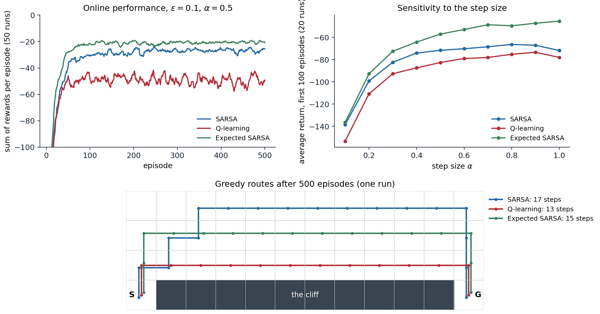
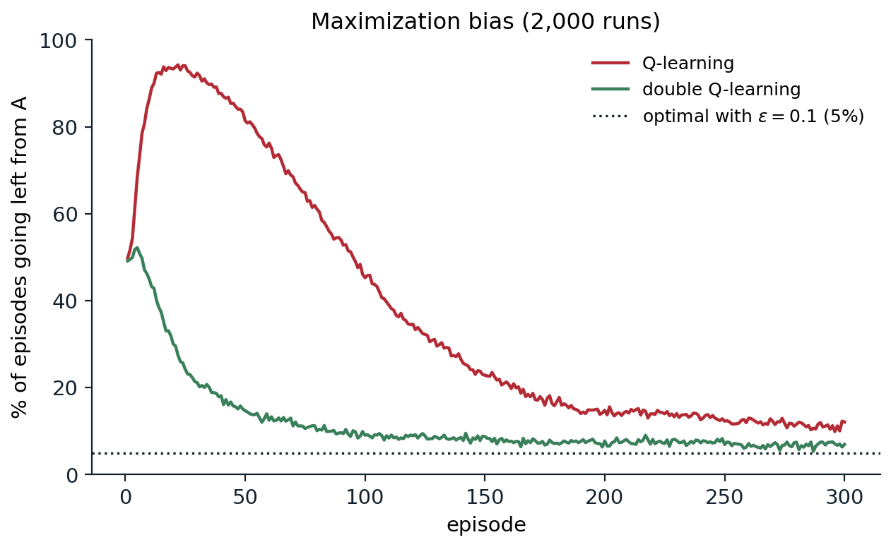

[ML Mastery Notes](../README.md) › [Reinforcement Learning](README.md)

# 7. Model-Free Control

[← 6. Temporal-Difference Learning](06-temporal-difference-learning.md) · [8. Multi-Step Bootstrapping and Eligibility Traces →](08-multi-step-bootstrapping-and-eligibility-traces.md)

## <a id="control-without-a-model"></a>Control without a model

### <a id="generalized-policy-iteration-with-action-values"></a>Generalized policy iteration with action values

The previous two chapters learned to evaluate a policy from experience. This chapter learns to act: to find a good policy by trial and error, without a model of the environment, by combining the TD methods of chapter 6 with the idea of **generalized policy iteration** from chapter 2: an evaluation process that pushes the value estimates toward the values of the current policy, and an improvement process that makes the policy greedy with respect to the current estimates, interleaved at any granularity.

Two ingredients carry over from Monte Carlo control (chapter 5). The first is that a model-free learner estimates **action values** $`Q(s,a)`$ rather than state values. Improving a policy greedily with respect to $`V`$ requires a one-step lookahead, $`\arg\max_a\sum_{s',r}p(s',r\mid s,a)[r+\gamma V(s')]`$, and so a model; improving it with respect to $`Q`$ requires only $`\arg\max_aQ(s,a)`$. The second is that the policy must keep exploring, since a greedy learner never tries the actions whose values it underestimates. The simplest remedy is to act **ε-greedily**: take the action with the highest estimate with probability $`1-\varepsilon`$ and a uniformly random action otherwise. By the ε-soft version of the policy improvement theorem (chapter 5), making a policy ε-greedy with respect to its own action values never makes it worse among ε-soft policies.

The new ingredient is TD evaluation. Monte Carlo control waited for the end of each episode before updating; TD control updates after every step, and because the policy is defined implicitly as ε-greedy with respect to the current $`Q`$, every update to $`Q`$ changes the policy immediately. This is generalized policy iteration at its finest granularity: one sampled evaluation step, then an implicit improvement step, at every time step.

### <a id="on-policy-and-off-policy-control"></a>On-policy and off-policy control

Every control method faces a tension: it wants to learn the values of the best policy, but it has to behave non-optimally to find out what the best policy is. There are two ways to resolve it, introduced for Monte Carlo methods in chapter 5:

- **On-policy** methods learn the values of the policy they follow, and improve that policy. The policy they learn about is exploratory, so what they converge to is the best policy among exploratory ones, unless the exploration is gradually reduced.
- **Off-policy** methods learn the values of a **target policy**, usually the greedy policy, from data generated by a different **behavior policy**, which does the exploring. They can learn about the optimal policy while behaving exploratorily, and they can learn from data generated by other agents, humans, or older versions of themselves.

This chapter develops three one-step TD control methods: **SARSA**, which is on-policy; **Q-learning**, which is off-policy; and **Expected SARSA**, which can be either. It then turns to a bias that all of them share when they maximize over noisy estimates, and to the practical questions of step sizes, exploration, and time limits. Chapter 8 extends the methods to multi-step targets, and chapter 9 treats off-policy learning in general.

## <a id="sarsa"></a>SARSA

### <a id="the-update"></a>The update

Replace the state values in TD(0) with action values, and the update becomes

$$
Q(S_t,A_t)\leftarrow Q(S_t,A_t)+\alpha\bigl[R_{t+1}+\gamma Q(S_{t+1},A_{t+1})-Q(S_t,A_t)\bigr].
$$

The update uses the quintuple of events $`(S_t,A_t,R_{t+1},S_{t+1},A_{t+1})`$ that makes up a transition from one state–action pair to the next, which gives the algorithm its name. The target $`R_{t+1}+\gamma Q(S_{t+1},A_{t+1})`$ is a sample of the Bellman expectation equation for $`q_\pi`$ from chapter 1, with the next action drawn from the policy being followed; if $`S_{t+1}`$ is terminal, $`Q(S_{t+1},A_{t+1})`$ is defined as zero. The algorithm was introduced by [Rummery and Niranjan (1994)](https://www.researchgate.net/publication/2500611_On-Line_Q-Learning_Using_Connectionist_Systems) as "modified connectionist Q-learning"; the name "Sarsa" comes from [Sutton (1996)](https://proceedings.neurips.cc/paper/1995/hash/8f1d43620bc6bb580df6e80b0dc05c48-Abstract.html).

The full on-policy control loop is:

1. Initialize $`Q(s,a)`$ arbitrarily for all nonterminal states, and $`Q(\text{terminal},\cdot)=0`$.
2. At the start of each episode, observe $`S`$ and choose $`A`$ ε-greedily with respect to $`Q`$.
3. At each step, take $`A`$ and observe $`R`$ and $`S'`$; choose $`A'`$ ε-greedily with respect to $`Q`$ at $`S'`$; update $`Q(S,A)\leftarrow Q(S,A)+\alpha[R+\gamma Q(S',A')-Q(S,A)]`$; set $`S\leftarrow S'`$ and $`A\leftarrow A'`$.
4. Repeat until $`S`$ is terminal.

The next action is chosen before the update and then actually taken. SARSA evaluates the policy it follows, exploration included.

### <a id="the-windy-gridworld"></a>The windy gridworld

Sutton and Barto's **windy gridworld** is a $`7\times10`$ grid with a start and a goal seven cells apart in the same row. The agent moves up, down, left, or right, but in the middle columns an upward wind of strength 1 or 2 shifts it upward from where it would otherwise end up. Every step costs $`-1`$ until the goal is reached, and there is no discounting, so the task is to reach the goal as fast as possible, which requires going past it, being blown up, and coming back down against the wind.

```python
import numpy as np

# Sutton and Barto's windy gridworld (Example 6.5): 7 x 10 cells, start (3, 0), goal (3, 7). An upward wind of
# strength 0, 0, 0, 1, 1, 1, 2, 2, 1, 0 in the ten columns pushes the agent up. Reward -1 per step, no discount.
H, W = 7, 10
wind = [0, 0, 0, 1, 1, 1, 2, 2, 1, 0]
start, goal = (3, 0), (3, 7)
moves = [(-1, 0), (1, 0), (0, 1), (0, -1)]                  # up, down, right, left
rng = np.random.default_rng(0)


def step(s, a):
    i, j = s
    i = min(max(i + moves[a][0] - wind[j], 0), H - 1)       # the wind of the current column applies
    j = min(max(j + moves[a][1], 0), W - 1)
    return (i, j)


def eps_greedy(Q, s, eps=0.1):
    if rng.random() < eps:
        return int(rng.integers(4))
    q = Q[s]
    return int(rng.choice(np.flatnonzero(q == q.max())))      # break ties at random


Q = np.zeros((H, W, 4))
alpha, total_steps, finished = 0.5, 0, []
while total_steps < 20_000:
    s = start
    a = eps_greedy(Q, s)
    while s != goal:
        s2 = step(s, a)
        a2 = eps_greedy(Q, s2)
        Q[s][a] += alpha * (-1 + Q[s2][a2] - Q[s][a])         # SARSA: the target uses the action actually taken
        s, a = s2, a2
        total_steps += 1
    finished.append(total_steps)
print(f"the first episode took {finished[0]} steps; episodes completed in the first 8,000 steps: "
      f"{sum(t <= 8000 for t in finished)}, in the last 2,000 steps: {sum(t > 18_000 for t in finished)}")
s, path = start, [start]                                     # the greedy policy after learning
while s != goal and len(path) < 50:
    s = step(s, int(Q[s].argmax())); path.append(s)
print(f"greedy path length after 20,000 steps: {len(path) - 1} steps (the shortest possible is 15)")
# the first episode took 559 steps; episodes completed in the first 8,000 steps: 157, in the last 2,000 steps: 92
# greedy path length after 20,000 steps: 17 steps (the shortest possible is 15)
```

The first episode, under a policy that knows nothing, takes hundreds of steps: every step costs $`-1`$, so the values of the actions tried fall below the untried ones, which pushes the agent to try something else. In an undiscounted task with a cost per step, any initialization that gives every action the same value has this effect, a form of optimism that drives exploration (exercise 7.1). Once the goal has been found, the episodes shorten quickly: 157 episodes finish in the first 8,000 steps and 92 in the last 2,000 alone, about 22 steps each, the length of the greedy route plus the detours that ε-greedy exploration keeps causing. The greedy policy after 20,000 steps takes 17 steps against the optimum of 15. SARSA is still learning about the ε-greedy policy it follows, and constant exploration keeps a random step in about one move in ten.

Monte Carlo control would struggle here. If some policy traps the agent, for example by pushing it into the top wall forever, the episode never ends, and a method that learns only at the end of episodes never learns that the policy is bad. SARSA learns during the episode: every step of being trapped lowers the values of the trapping actions until something else looks better (exercise 7.1).

### <a id="convergence-of-sarsa"></a>Convergence of SARSA

SARSA's evaluation target is the value of a policy that keeps changing, so its convergence is not a direct consequence of the TD(0) theory. [Singh, Jaakkola, Littman, and Szepesvári (2000)](https://doi.org/10.1023/A:1007678930559) proved that tabular SARSA converges to the optimal action values with probability one if every state–action pair is visited infinitely often, the step sizes satisfy the Robbins–Monro conditions for each pair, and the policy is **greedy in the limit with infinite exploration (GLIE)**: it explores every action infinitely often but becomes greedy in the limit, as ε-greedy does with $`\varepsilon_t\to0`$ at a suitable rate. The argument treats the difference between the ε-greedy value and the greedy value of the next state as a perturbation that vanishes as exploration decays ([Appendix A](#block-rl07-appendix-a)). With a fixed $`\varepsilon`$, SARSA instead converges toward the values of the best ε-greedy policy, as the cliff-walking example below shows.

## <a id="q-learning"></a>Q-learning

### <a id="learning-the-optimal-action-values-directly"></a>Learning the optimal action values directly

**Q-learning** ([Watkins, 1989](https://www.cs.rhul.ac.uk/~chrisw/new_thesis.pdf)) replaces the next action's value in the SARSA target with the maximum over actions:

$$
Q(S_t,A_t)\leftarrow Q(S_t,A_t)+\alpha\Bigl[R_{t+1}+\gamma\max_aQ(S_{t+1},a)-Q(S_t,A_t)\Bigr].
$$

The target is now a sample of the Bellman optimality equation for $`q_*`$ from chapter 1, and the learned $`Q`$ approximates $`q_*`$ directly, whatever policy generates the data. The behavior policy still matters, since it determines which pairs are visited and updated, but only through which pairs it visits: any behavior that keeps trying every action in every state will do. Q-learning is the sampled, asynchronous form of value iteration on action values, just as SARSA is the sampled form of policy evaluation interleaved with improvement. Define the Bellman optimality operator on action values,

$$
(\mathcal T Q)(s,a)=r(s,a)+\gamma\sum_{s'}p(s'\mid s,a)\max_{a'}Q(s',a'),
$$

whose unique fixed point is $`q_*`$. The Q-learning target is an unbiased sample of $`(\mathcal TQ)(S_t,A_t)`$, and each update moves one entry of $`Q`$ a step toward it.

### <a id="why-q-learning-needs-no-importance-sampling"></a>Why Q-learning needs no importance sampling

Off-policy Monte Carlo needed importance sampling to correct for the mismatch between the behavior and target policies (chapter 5). Q-learning does not, although it is off-policy, because the one-step target does not depend on the behavior policy. The action $`A_t`$ is given: $`Q(S_t,A_t)`$ is the value of taking it, whichever policy chose it. The next reward and state depend only on the environment. And the value of the next state under the target policy is computed from the current estimates, $`\max_aQ(S_{t+1},a)`$, rather than sampled from the behavior. Nothing in the target was drawn from the behavior policy, so nothing needs reweighting. Multi-step off-policy targets do contain actions chosen by the behavior policy, and correcting for them is the subject of chapter 9.

This is also what makes Q-learning attractive in practice: it can learn from any experience, including experience replayed from a buffer long after it was collected (chapter 16), and from fixed datasets generated by other policies. That freedom has limits. A pair that the data never contains is never updated, and with function approximation, the maximum over poorly estimated actions becomes the central difficulty of offline reinforcement learning (chapter 26).

### <a id="convergence-of-q-learning"></a>Convergence of Q-learning

[Watkins and Dayan (1992)](https://doi.org/10.1007/BF00992698) proved that tabular Q-learning converges to $`q_*`$ with probability one when rewards are bounded, every state–action pair is updated infinitely often, and the step sizes satisfy the Robbins–Monro conditions for each pair, $`\sum_n\alpha_n(s,a)=\infty`$ and $`\sum_n\alpha_n(s,a)^2<\infty`$. [Tsitsiklis (1994)](https://doi.org/10.1007/BF00993306) and [Jaakkola, Jordan, and Singh (1994)](https://doi.org/10.1162/neco.1994.6.6.1185) placed the result within the general theory of asynchronous stochastic approximation of contraction mappings used for TD(0) in chapter 6: $`\mathcal T`$ is a $`\gamma`$-contraction in the maximum norm, the sampling noise has zero mean, and the conditions on the step sizes average it out ([Appendix A](#block-rl07-appendix-a)). Unlike SARSA's, the guarantee places no condition on the behavior policy beyond visiting every pair infinitely often: the behavior can stay random forever. To also act optimally, the behavior must become greedy in the limit, so an agent that both learns and exploits still needs a GLIE schedule.

The asymptotic guarantee says nothing about speed, and the speed depends strongly on the step sizes, a point taken up in [Step sizes and convergence rates](#step-sizes-and-convergence-rates).

### <a id="cliff-walking"></a>Cliff walking

The difference between SARSA and Q-learning shows most clearly when exploration is costly. In Sutton and Barto's **cliff walking** task, a $`4\times12`$ grid has the start at the bottom left and the goal at the bottom right, and the cells between them along the bottom row are a cliff. Every step costs $`-1`$; stepping into the cliff costs $`-100`$ and sends the agent back to the start. The optimal route runs along the edge of the cliff and takes 13 steps. Both methods act ε-greedily with $`\varepsilon=0.1`$.

```python
import numpy as np

# Cliff walking (Sutton and Barto, Example 6.6): a 4 x 12 grid, start at the bottom left, goal at the bottom
# right, and the cells between them are a cliff: stepping in costs -100 and sends the agent back to the start.
# Every other step costs -1. Behavior is epsilon-greedy with epsilon = 0.1; step size 0.5; no discounting.
# Rows are numbered from 0 at the top to 3, the row of the start, the cliff, and the goal.
H, W = 4, 12
start, goal = (3, 0), (3, 11)
moves = [(-1, 0), (1, 0), (0, 1), (0, -1)]


def step(s, a):
    i = min(max(s[0] + moves[a][0], 0), H - 1)
    j = min(max(s[1] + moves[a][1], 0), W - 1)
    if i == 3 and 0 < j < 11:
        return start, -100.0
    return (i, j), -1.0


def run(method, seed, episodes=500, alpha=0.5, eps=0.1):
    rng = np.random.default_rng(seed)
    Q = np.zeros((H, W, 4))

    def act(s):
        if rng.random() < eps:
            return int(rng.integers(4))
        return int(rng.choice(np.flatnonzero(Q[s] == Q[s].max())))

    returns = []
    for _ in range(episodes):
        s, G = start, 0.0
        a = act(s)
        while s != goal:
            s2, r = step(s, a)
            G += r
            a2 = act(s2)
            if method == "SARSA":
                target = Q[s2][a2]
            elif method == "Q-learning":
                target = Q[s2].max()
            else:                                            # Expected SARSA under the epsilon-greedy policy
                p = np.full(4, eps / 4); p[Q[s2].argmax()] += 1 - eps
                target = p @ Q[s2]
            if s2 == goal:
                target = 0.0
            Q[s][a] += alpha * (r + target - Q[s][a])
            s, a = s2, a2
        returns.append(G)
    return np.array(returns), Q


def greedy_route(Q):
    s, path = start, [start]
    while s != goal and len(path) < 60:
        s, _ = step(s, int(Q[s].argmax())); path.append(s)
    top_row = min(i for i, _ in path)
    return len(path) - 1, top_row


for method in ["SARSA", "Q-learning", "Expected SARSA"]:
    rets, lengths, rows = [], [], []
    for seed in range(50):
        g, Q = run(method, seed)
        rets.append(g[400:].mean())
        n, row = greedy_route(Q); lengths.append(n); rows.append(row)
    print(f"{method:15s} return per episode during learning (episodes 401-500): {np.mean(rets):7.1f};"
          f" greedy route {np.median(lengths):.0f} steps, highest row reached {np.median(rows):.0f}")
# SARSA           return per episode during learning (episodes 401-500):   -26.8; greedy route 17 steps, highest row reached 0
# Q-learning      return per episode during learning (episodes 401-500):   -49.7; greedy route 13 steps, highest row reached 2
# Expected SARSA  return per episode during learning (episodes 401-500):   -20.5; greedy route 15 steps, highest row reached 1
```

Q-learning learns the values of the greedy policy, and its greedy route is the optimal one along the edge. But the agent does not follow the greedy policy: it acts ε-greedily, and one step in forty (an exploratory step with probability 0.1, times the probability 1/4 of choosing the move toward the cliff) walks it off the edge. SARSA learns the values of the ε-greedy policy it actually follows, including the cost of these exploratory falls, and so it learns to keep its distance and takes the longer, safer route along the top row. During learning, SARSA's episodes cost about $`-27`$ on average and Q-learning's about $`-50`$: the method that knows the better route performs worse, because it keeps using that route with a policy that falls off it.



*Cliff walking with ε-greedy behavior, $`\varepsilon=0.1`$. Top left: the sum of rewards per episode during learning with $`\alpha=0.5`$, averaged over 50 runs and smoothed over 10 episodes. Expected SARSA does best and Q-learning worst, even though Q-learning's greedy policy is optimal. Top right: the average return over the first 100 episodes as a function of the step size, 20 runs; Expected SARSA keeps improving up to $`\alpha=1`$, while SARSA and Q-learning deteriorate at $`\alpha=1`$. Bottom: the greedy routes after 500 episodes of one run. Q-learning's route runs along the cliff edge in 13 steps; SARSA's climbs to the top row, 17 steps; Expected SARSA's stays one row higher than Q-learning's, 15 steps.*

Which answer is right depends on what the learned policy is for. If exploration continues forever, as in a robot that keeps learning while it works, SARSA's conservative policy is the better one to follow, and on-policy learning is a simple way to account for the risks of one's own exploration, a theme that returns in safe exploration (chapter 31). If exploration will stop, Q-learning's policy is the better one to deploy. If ε is gradually reduced, both methods converge to the optimal route in the limit, though SARSA can take a long time to give up a safe route once it has settled on it (exercise 7.7).

## <a id="expected-sarsa"></a>Expected SARSA

### <a id="averaging-over-the-next-action"></a>Averaging over the next action

SARSA's target depends on the random next action $`A_{t+1}`$, which adds variance. **Expected SARSA** replaces the sampled next action with an expectation under the policy:

$$
Q(S_t,A_t)\leftarrow Q(S_t,A_t)+\alpha\Bigl[R_{t+1}+\gamma\sum_a\pi(a\mid S_{t+1})Q(S_{t+1},a)-Q(S_t,A_t)\Bigr].
$$

Given the next state, the target is deterministic: it moves in the same direction as SARSA does in expectation, but without the noise of sampling $`A_{t+1}`$. By the law of total variance, the conditional variance of SARSA's target exceeds Expected SARSA's by exactly $`\gamma^2\,\mathbb E\bigl[\operatorname{Var}_{A'\sim\pi(\cdot\mid S_{t+1})}Q(S_{t+1},A')\bigr]`$ (exercise 7.3). [van Seijen, van Hasselt, Whiteson, and Wiering (2009)](https://doi.org/10.1109/ADPRL.2009.4927542) analyzed the method and showed empirically that it outperforms SARSA, most clearly when the environment is close to deterministic and the step size is large. On cliff walking, where the dynamics are deterministic, Expected SARSA's target for a given state–action pair has no randomness at all, since exploration only decides which pair is updated, and the step size can be raised to $`\alpha=1`$ with no loss: the top-right panel of the figure shows Expected SARSA improving all the way to $`\alpha=1`$. Sutton and Barto report the same pattern over 100,000 episodes: SARSA's asymptotic performance degrades with large step sizes, and Expected SARSA's does not.

The cost is computation: each update sums over all actions at the next state, instead of reading one entry. With a handful of actions this is negligible. With many actions, or continuous ones, the expectation must be approximated, which leads to the sampled expectations of the actor–critic methods in chapter 21.

### <a id="a-family-of-one-step-control-methods"></a>A family of one-step control methods

The policy $`\pi`$ in the Expected SARSA target need not be the behavior policy. If it is, Expected SARSA is on-policy. If $`\pi`$ is the greedy policy with respect to $`Q`$ while the behavior is ε-greedy, the expectation is the maximum, and Expected SARSA is exactly Q-learning. Expected SARSA therefore contains Q-learning as a special case and generalizes it to arbitrary target policies, and the three methods are best seen as members of one family.

| Method | Target for $`Q(S_t,A_t)`$ | Learns about | Variance of the target | Cost per update |
| --- | --- | --- | --- | --- |
| SARSA | $`R_{t+1}+\gamma Q(S_{t+1},A_{t+1})`$ | the behavior policy | from $`R`$, $`S'`$, and $`A'`$ | one entry |
| Expected SARSA | $`R_{t+1}+\gamma\sum_a\pi(a\mid S_{t+1})Q(S_{t+1},a)`$ | any target policy $`\pi`$ | from $`R`$ and $`S'`$ | all actions |
| Q-learning | $`R_{t+1}+\gamma\max_aQ(S_{t+1},a)`$ | the greedy policy | from $`R`$ and $`S'`$ | all actions |

All three share the same structure: a sampled reward and next state, followed by an estimate of the next state's value. They differ only in which policy that value belongs to and how it is computed. The multi-step methods of chapter 8 extend the family along a second axis, how many real rewards come before the bootstrap.

## <a id="maximization-bias-and-double-learning"></a>Maximization bias and double learning

### <a id="maximization-bias"></a>Maximization bias

Q-learning's target takes a maximum over estimated values, and SARSA and Expected SARSA with ε-greedy policies are also built around the greedy action. Maximizing over noisy estimates introduces a positive bias. If $`\hat\mu_1,\dots,\hat\mu_K`$ are unbiased estimates of $`\mu_1,\dots,\mu_K`$, then

$$
\mathbb E\Bigl[\max_a\hat\mu_a\Bigr]\ge\max_a\mathbb E[\hat\mu_a]=\max_a\mu_a,
$$

since the maximum of the estimates is at least the estimate of the truly best action. The inequality is usually strict, and the gap grows with the noise and the number of actions: if all $`K`$ estimates are independent and normally distributed with standard deviation $`\sigma`$ and equal means, the bias is $`\sigma`$ times the expected maximum of $`K`$ standard normal variables, about $`1.54\sigma`$ for $`K=10`$. This is the **optimizer's curse** of decision theory (AI chapter 12): the option that looks best is likely to be one whose value was overestimated. [Thrun and Schwartz (1993)](https://www.ri.cmu.edu/pub_files/pub1/thrun_sebastian_1993_1/thrun_sebastian_1993_1.pdf) identified it as a source of systematic overestimation in Q-learning with function approximation, where the errors of the approximator play the role of the noise.

In Q-learning, the bias compounds. The overestimated value of a state becomes part of the target for its predecessors, and each of them takes a maximum again. Sutton and Barto give a minimal example. From state A, the action "right" ends the episode with reward 0, and "left" moves to state B with reward 0. From B, each of many actions, ten in the code below, ends the episode with a reward drawn from a normal distribution with mean $`-0.1`$ and variance 1. Going left is worse on average, but after a few visits, the largest of B's ten estimates is usually positive, so Q-learning comes to believe that going left is worth it.

```python
import numpy as np

# Maximization bias (Sutton and Barto, Example 6.7). From state A, "right" ends the episode with reward 0 and
# "left" moves to B with reward 0; from B, each of 10 actions ends the episode with reward ~ N(-0.1, 1).
# Going left is worse on average, but the maximum of B's noisy estimates is usually positive.
runs, episodes, alpha, eps, nB = 2000, 300, 0.1, 0.1, 10
rng = np.random.default_rng(0)
rows = np.arange(runs)


def eps_greedy(q):                                           # q: (runs, n) action values; random tie-breaking
    greedy = (q + 1e-9 * rng.random(q.shape)).argmax(1)
    return np.where(rng.random(runs) < eps, rng.integers(q.shape[1], size=runs), greedy)


def experiment(double):
    QA = np.zeros((2, runs, 2)); QB = np.zeros((2, runs, nB))   # two copies, used only by double Q-learning
    left = np.zeros(episodes)
    for ep in range(episodes):
        a = eps_greedy(QA[0] + QA[1] if double else QA[0])      # 0 = left, 1 = right
        left[ep] = np.mean(a == 0)
        go = a == 0
        b = eps_greedy(QB[0] + QB[1] if double else QB[0])
        r = rng.normal(-0.1, 1.0, runs)
        k = rng.integers(2, size=runs) if double else np.zeros(runs, int)   # which copy to update
        # update Q(A, a): target 0 + max over B (Q-learning), or the other copy's value of this copy's argmax
        if double:
            best = QB[k, rows].argmax(1)
            target = np.where(go, QB[1 - k, rows, best], 0.0)
        else:
            target = np.where(go, QB[0].max(1), 0.0)
        QA[k, rows, a] += alpha * (target - QA[k, rows, a])
        # update Q(B, b) for the runs that went left: a terminal transition with reward r
        QB[k[go], rows[go], b[go]] += alpha * (r[go] - QB[k[go], rows[go], b[go]])
    return left


for name, dbl in [("Q-learning", False), ("double Q-learning", True)]:
    left = experiment(dbl)
    print(f"{name:18s} % left from A in episodes 1-10: {100 * left[:10].mean():4.1f}, 21-30: {100 * left[20:30].mean():4.1f},"
          f" 101-110: {100 * left[100:110].mean():4.1f}, 291-300: {100 * left[290:].mean():4.1f}")
print("an agent that always prefers right still goes left 5% of the time: epsilon / 2")
# Q-learning         % left from A in episodes 1-10: 68.9, 21-30: 93.0, 101-110: 42.4, 291-300: 11.1
# double Q-learning  % left from A in episodes 1-10: 49.2, 21-30: 24.4, 101-110:  8.8, 291-300:  7.1
# an agent that always prefers right still goes left 5% of the time: epsilon / 2
```

Early in learning, Q-learning goes left from A in more than nine episodes out of ten, far above the 50% of a coin flip. As B's estimates accumulate samples, their spread shrinks and the bias with it, and Q-learning slowly recovers, but after 300 episodes it still goes left 11% of the time, more than twice the 5% of an agent that always prefers right and explores with $`\varepsilon=0.1`$.



*The maximization-bias example: the percentage of episodes in which the agent goes left from A, averaged over 2,000 runs, with $`\alpha=0.1`$ and ε-greedy behavior with $`\varepsilon=0.1`$. Q-learning is drawn toward B, whose ten actions all have mean reward $`-0.1`$ but noisy estimates, and goes left in over 90% of the episodes around episode 20. Double Q-learning is much less affected: its preference for left declines from the first episodes toward the optimum. The dotted line is the 5% of left moves that an agent preferring right still makes when it explores with probability 0.1 and picks one of two actions at random.*

### <a id="double-q-learning"></a>Double Q-learning

The bias arises because the same estimates are used both to choose the maximizing action and to evaluate it: the action chosen is likely to be one whose estimate is too high, and its value is then read from that same inflated estimate. The remedy of [van Hasselt (2010)](https://papers.nips.cc/paper/2010/hash/091d584fced301b442654dd8c23b3fc9-Abstract.html) is to decouple the two by learning two independent estimates, $`Q_1`$ and $`Q_2`$, each from half of the experience. One estimate chooses the action, and the other evaluates it:

$$
Q_1(S_t,A_t)\leftarrow Q_1(S_t,A_t)+\alpha\Bigl[R_{t+1}+\gamma\,Q_2\bigl(S_{t+1},\arg\max_aQ_1(S_{t+1},a)\bigr)-Q_1(S_t,A_t)\Bigr].
$$

At each step, a coin flip decides which estimate is updated, with the roles swapped when $`Q_2`$ is updated. The behavior policy can use both, for example ε-greedy with respect to $`Q_1+Q_2`$. When $`Q_2`$'s errors are independent of the choice made with $`Q_1`$, as they approximately are, the evaluation is unbiased given the choice, and the expected value of the **double estimator** is at most the true maximum ([Appendix B](#block-rl07-appendix-b)). It can underestimate: when a suboptimal action has a chance of being chosen, its lower value is sometimes returned. In the example above, all of B's actions have the same mean, so the double estimator is unbiased, and double Q-learning's left moves decline from the start, to 9% of episodes by episode 100 and 7% by episode 300. The memory doubles, but the computation per step does not, since each step updates one estimate.

The same idea applies to SARSA and Expected SARSA (exercise 7.8), and it carried over to deep reinforcement learning as **Double DQN** ([van Hasselt, Guez, and Silver, 2016](https://arxiv.org/abs/1509.06461)), which uses the online network to choose the next action and the target network to evaluate it (chapter 16).

### <a id="beyond-double-learning"></a>Beyond double learning

Overestimation and underestimation are both harmful, and the best correction depends on the problem. Several variants trade them off. **Weighted double Q-learning** ([Zhang, Pan, and Kochenderfer, 2017](https://doi.org/10.24963/ijcai.2017/483)) interpolates between the single and double estimators. **Maxmin Q-learning** ([Lan, Pan, Fyshe, and White, 2020](https://arxiv.org/abs/2002.06487)) keeps $`N`$ estimates and uses the minimum over them before maximizing, with $`N`$ controlling the bias from positive to negative. The **clipped double Q-learning** of TD3 ([Fujimoto, van Hoof, and Meger, 2018](https://arxiv.org/abs/1802.09477)) takes the minimum of two critics in continuous control, deliberately erring toward underestimation, which is less harmful there because an underestimated action is simply avoided, while an overestimated one is sought out by the policy and reinforced (chapter 21). The same asymmetry drives the pessimism of offline RL (chapter 26), where the actions that look best are often the ones the data says least about.

The size of the bias is easy to compute for independent normal estimates (exercise 7.4): it scales with the standard deviation of the estimates, grows with the number of actions, and shrinks with the number of samples, while the underestimation of the double estimator is largest when several actions are slightly worse than the best, by less than the noise in their estimates, and vanishes when they are exactly tied.

## <a id="tabular-control-in-practice"></a>Tabular control in practice

### <a id="step-sizes-and-convergence-rates"></a>Step sizes and convergence rates

The convergence theorems require step sizes that decay, and the natural choice, $`\alpha_n=1/n(s,a)`$ for the $`n`$th update of a pair, makes each estimate an average of its targets. For Q-learning this is a poor choice when $`\gamma`$ is close to 1. The early targets are computed from estimates that are still far from $`q_*`$, and averaging gives them the same weight as the late ones, so their error lingers. In a single state with reward 1 at every step and $`\gamma=0.99`$, the true value is 100, and Q-learning with $`\alpha_n=1/n`$ has reached only about 13 after a million updates (exercise 7.6). [Szepesvári (1997)](https://proceedings.neurips.cc/paper/1997/hash/cd0dce8fca267bf1fb86cf43e18d5598-Abstract.html) bounded the asymptotic rate with $`1/n`$ step sizes: for $`\gamma>1/2`$ and state–action pairs sampled from a fixed distribution, the error after $`t`$ steps is $`O\bigl(t^{-R(1-\gamma)}\bigr)`$ when $`R(1-\gamma)<1/2`$, where $`R`$ is the ratio of the smallest to the largest probability of sampling a pair, a rate that the single-state example attains; and [Even-Dar and Mansour (2003)](https://www.jmlr.org/papers/v5/evendar03a.html) showed that the time to converge is exponential in $`1/(1-\gamma)`$ with $`1/n`$ step sizes but polynomial with polynomial step sizes $`\alpha_n=1/n^\omega`$ for $`\omega\in(1/2,1)`$, which decay more slowly and so forget the early targets.

Modern analyses give sharper answers. For Q-learning with a generative model that samples every pair at each iteration, [Li, Cai, Chen, Wei, and Chi (2024)](https://arxiv.org/abs/2102.06548) showed that on the order of $`|\mathcal S||\mathcal A|/\bigl((1-\gamma)^4\varepsilon^2\bigr)`$ samples, up to logarithmic factors, suffice to learn $`q_*`$ to accuracy $`\varepsilon`$, and that with its usual step sizes, rescaled linear or constant, this many are also necessary when there are at least two actions, a factor of $`1/(1-\gamma)`$ more than the minimax lower bound, while variance-reduced versions of Q-learning ([Wainwright, 2019](https://arxiv.org/abs/1906.04697)) close the gap. These results are developed in chapter 30.

Practice uses constant step sizes more often than decaying ones, for the reasons given in chapter 6: the targets keep changing as the policy improves. In deterministic environments a large step size, up to $`\alpha=1`$ for Expected SARSA and Q-learning, can be very fast; in stochastic ones a constant step size leaves the estimates fluctuating, and the greedy policy fluctuates with them (exercise 7.5).

### <a id="exploration"></a>Exploration

ε-greedy exploration is simple and often adequate for small problems, but it explores blindly: it tries random actions uniformly, even ones known to be bad, and in problems where the reward is far away it needs a number of steps that can grow exponentially with the distance. The alternatives from the bandit chapters carry over, with the complication that uncertainty now propagates through the values of later states:

- **Decaying ε.** Reducing ε over time, for example $`\varepsilon_k=c/(c+k)`$ in episode $`k`$, gives a GLIE schedule. Deep Q-learning also decays ε, annealing it linearly over the first part of training, but to a floor such as 0.1 or 0.01 rather than to zero, so its schedule is not GLIE.
- **Boltzmann (softmax) exploration.** Choosing $`a`$ with probability proportional to $`e^{Q(s,a)/\tau}`$ tries better-looking actions more often. It is sensitive to the scale of the values, and the temperature $`\tau`$ must decay to zero for GLIE.
- **Optimistic initial values.** Initializing $`Q`$ above any achievable value (chapter 3) makes every untried action attractive until tried. In the windy gridworld, zero initial values are already optimistic, since every true value is negative. Optimism drives systematic exploration early on but vanishes once the values are learned.
- **Exploration bonuses.** Adding a bonus that shrinks with the visit count, as UCB does for bandits, directs exploration toward what is unknown. Q-learning with Bernstein-type UCB bonuses and the step size $`\alpha_n=(H+1)/(H+n)`$ has regret $`\tilde O(\sqrt{H^3SAT})`$ in episodic MDPs of horizon $`H`$ with $`T`$ total steps ([Jin, Allen-Zhu, Bubeck, and Jordan, 2018](https://arxiv.org/abs/1807.03765)), within a factor $`\sqrt H`$ of the lower bound $`\Omega(\sqrt{H^2SAT})`$; simpler Hoeffding-type bonuses give $`\tilde O(\sqrt{H^4SAT})`$. It was the first $`\sqrt T`$ regret bound for a model-free method that needs no simulator.

Exploration in large state spaces, where counts are replaced by pseudo-counts, prediction errors, or posterior samples, is the subject of chapter 22.

### <a id="time-limits-and-terminal-states"></a>Time limits and terminal states

The code above has explicit terminal states. Most environments in practice also have time limits, and the distinction matters for the target. When an episode reaches a real terminal state, the value of what follows is zero and the target is $`R_{t+1}`$ alone. When it is merely cut off by a time limit, the state it stopped in still has a future, and the target should bootstrap from its value, as argued in chapter 1. Gymnasium reports the two separately, as `terminated` and `truncated`; treating a truncation as termination teaches the agent that the states in which time tends to run out are worthless. The code applies Q-learning to Gymnasium's **Taxi** task, in which a taxi on a $`5\times5`$ grid must pick up a passenger at one of four locations and drop them off at another, with a time limit of 200 steps.

```python
import gymnasium as gym
import numpy as np

# Q-learning on Gymnasium's Taxi-v3: 500 states, 6 actions, reward -1 per step, +20 for a correct drop-off,
# -10 for an illegal pick-up or drop-off, and a time limit of 200 steps.
env = gym.make("Taxi-v3")
nS, nA = env.observation_space.n, env.action_space.n
Q = np.zeros((nS, nA))
rng = np.random.default_rng(0)
alpha, gamma, eps = 0.5, 0.99, 0.1

for episode in range(3000):
    s, _ = env.reset(seed=episode)
    done = False
    while not done:
        a = int(rng.integers(nA)) if rng.random() < eps else int(Q[s].argmax())
        s2, r, terminated, truncated, _ = env.step(a)
        # bootstrap unless the episode really ended; a time-limit truncation is not a terminal state
        target = r if terminated else r + gamma * Q[s2].max()
        Q[s, a] += alpha * (target - Q[s, a])
        s, done = s2, terminated or truncated


def evaluate(Q):                                             # the greedy policy on 100 new episodes
    returns = []
    for episode in range(100):
        s, _ = env.reset(seed=10_000 + episode)
        G, done = 0.0, False
        while not done:
            s, r, terminated, truncated, _ = env.step(int(Q[s].argmax()))
            G, done = G + r, terminated or truncated
        returns.append(G)
    return np.array(returns)


# for comparison, the optimal action values by value iteration on the known model (Taxi is deterministic)
P = env.unwrapped.P
nxt = np.array([[P[s][a][0][1] for a in range(nA)] for s in range(nS)])
rew = np.array([[P[s][a][0][2] for a in range(nA)] for s in range(nS)])
end = np.array([[P[s][a][0][3] for a in range(nA)] for s in range(nS)])
Q_star = np.zeros((nS, nA))
for _ in range(1000):
    Q_star = rew + gamma * np.where(end, 0.0, Q_star.max(1)[nxt])
for name, q in [("Q-learning, 3,000 episodes", Q), ("optimal (value iteration)", Q_star)]:
    g = evaluate(q)
    print(f"{name:27s}: mean return {g.mean():.2f}, worst {g.min():.0f}, episodes solved {(g > 0).sum()}/100")
# Q-learning, 3,000 episodes : mean return 8.03, worst 3, episodes solved 100/100
# optimal (value iteration)  : mean return 8.05, worst 3, episodes solved 100/100
```

After 3,000 episodes the greedy policy solves every test episode, and its average return, 8.03, is within 0.02 of that of the optimal policy computed by value iteration from the known model. The 500 states and 6 actions make Taxi a problem where the tabular methods are fast and exact, and where the model-free methods can be checked against dynamic programming, as in Lab 1. Lab 3 compares Monte Carlo control, SARSA, Expected SARSA, and Q-learning on Blackjack, cliff walking, and Taxi, with the time-limit handling and evaluation protocol shown here.

### <a id="from-tables-to-deep-networks"></a>From tables to deep networks

Tabular Q-learning is the direct ancestor of the deep Q-networks that learned to play Atari games from pixels (chapter 16). The path between them runs through the chapters that follow. Values must generalize across states that are never visited twice, which requires function approximation (chapter 11). Combining function approximation with bootstrapping and off-policy learning, as Q-learning does, can diverge (chapter 12). DQN's replay buffer and target network are engineering answers to that instability, and Double DQN is this chapter's double learning. The one-step methods of this chapter learn slowly when rewards are delayed, since each update propagates information back by one step, which the multi-step methods of chapter 8 and the planning methods of chapter 10 address.

## <a id="exercises"></a>Exercises

### <a id="exercise-7-1-why-not-monte-carlo"></a>Exercise 7.1 — Why not Monte Carlo?

(a) Explain why Monte Carlo control with ε-greedy policies might never finish its first few episodes in a task like the windy gridworld, while SARSA always does. (b) Does SARSA's advantage depend on the initial action values?


<details>
<summary><b>Solution</b></summary>


(a) Monte Carlo control improves the policy only at the end of an episode. If the initial or current greedy policy leads into a loop that does not reach the goal, for instance by always pushing into a wall, then under ε-greedy behavior the agent escapes the loop only through a chance sequence of exploratory actions, and in the windy gridworld, where the wind keeps pushing the agent back up, a long sequence of lucky actions may be needed. Episodes can therefore take an extremely long time, and with a purely greedy policy they never end. SARSA updates after every step: each step of a loop has reward $`-1`$, so the value of each looping action falls by $`\alpha`$ times the TD error, until another action in the same state has a higher estimate and becomes greedy. The policy changes during the episode, and the loop is broken.

(b) Only in how fast it escapes, and not at all if every action starts with the same value. With $`\gamma=1`$, adding a constant to every nonterminal estimate changes neither the TD errors $`-1+Q(S',A')-Q(S,A)`$, except on the final transition into the goal, whose value is fixed at 0, nor the ranking of the actions in each state. Until the goal is first reached, the agent therefore behaves the same whether the estimates start at 0 or at $`-1000`$: every TD error starts at $`-1`$, every untried action looks better than a tried one, and the agent is driven to try everything in the states where it spends time. The initial values matter when they differ across actions: an action initialized far above the others in its state, for example at $`+1000`$ against 0, must fall by that margin before another action becomes greedy, so a loop through it lasts about $`1000/\alpha`$ steps. Discounting changes the picture: with $`\gamma<1`$ and every estimate initialized to a constant $`c<-1/(1-\gamma)`$, the TD error of a step that returns to the same state, $`-1+\gamma c-c`$, is positive, the repeated action rises above the untried ones toward $`-1/(1-\gamma)`$, and only exploration breaks the loop. Online learning is what makes escape possible; the initial values decide how fast it happens.

</details>


### <a id="exercise-7-2-greedy-sarsa-and-q-learning"></a>Exercise 7.2 — Greedy SARSA and Q-learning

Suppose the action selection is greedy rather than ε-greedy. Is Q-learning then exactly the same algorithm as SARSA? Do they make the same action selections and the same updates?


<details>
<summary><b>Solution</b></summary>


Almost, but not exactly. With greedy action selection, SARSA's next action is $`A'=\arg\max_aQ(S',a)`$, so its target $`R+\gamma Q(S',A')`$ equals Q-learning's $`R+\gamma\max_aQ(S',a)`$, and both are computed from the estimates before the update. The difference is the timing of the next action. SARSA chooses $`A'`$ before updating $`Q(S,A)`$ and then takes it; Q-learning chooses its next action after the update. If $`S'=S`$, the update to $`Q(S,A)`$ can change which action is greedy in $`S'`$: SARSA then takes the action that was greedy before the update, and Q-learning the one that is greedy after it. From then on the trajectories, and so the updates, can differ. With random tie-breaking, the choice among tied actions also differs between the two unless the same random numbers are used.

</details>


### <a id="exercise-7-3-expected-sarsa"></a>Exercise 7.3 — Expected SARSA

(a) Show that, given $`S_t`$ and $`A_t`$, the SARSA and Expected SARSA targets have the same expected value, and that the conditional variance of the SARSA target exceeds that of the Expected SARSA target by $`\gamma^2\,\mathbb E\bigl[\operatorname{Var}_{A'\sim\pi(\cdot\mid S_{t+1})}Q(S_{t+1},A')\bigr]`$. (b) Show that Expected SARSA with a greedy target policy is Q-learning. (c) Why can Expected SARSA use $`\alpha=1`$ on cliff walking without harm?


<details>
<summary><b>Solution</b></summary>


(a) Let $`Y=R_{t+1}+\gamma Q(S_{t+1},A_{t+1})`$ be the SARSA target with $`A_{t+1}\sim\pi(\cdot\mid S_{t+1})`$, and $`X=R_{t+1}+\gamma\sum_a\pi(a\mid S_{t+1})Q(S_{t+1},a)`$ the Expected SARSA target. Then $`X=\mathbb E[Y\mid R_{t+1},S_{t+1}]`$, so $`\mathbb E[Y\mid S_t,A_t]=\mathbb E[X\mid S_t,A_t]`$ by the tower property. By the law of total variance, conditional on $`S_t,A_t`$,

$$
\operatorname{Var}(Y)=\operatorname{Var}\bigl(\mathbb E[Y\mid R_{t+1},S_{t+1}]\bigr)+\mathbb E\bigl[\operatorname{Var}(Y\mid R_{t+1},S_{t+1})\bigr]=\operatorname{Var}(X)+\gamma^2\,\mathbb E\bigl[\operatorname{Var}_{A'\sim\pi(\cdot\mid S_{t+1})}Q(S_{t+1},A')\bigr].
$$

The extra term is zero only when all actions with positive probability have the same estimated value, for example when $`\pi`$ is deterministic.

(b) If $`\pi(\cdot\mid s')`$ puts all its mass on $`\arg\max_aQ(s',a)`$, then $`\sum_a\pi(a\mid s')Q(s',a)=\max_aQ(s',a)`$, and the Expected SARSA target is the Q-learning target. The behavior policy can be anything, so this is off-policy Expected SARSA.

(c) Cliff walking is deterministic: $`R_{t+1}`$ and $`S_{t+1}`$ are functions of $`S_t`$ and $`A_t`$. Expected SARSA's target is therefore a deterministic function of the current estimates, and with $`\alpha=1`$ the update simply sets $`Q(S_t,A_t)`$ to it, which is an asynchronous step of value iteration for the best ε-greedy policy (or for the optimal policy, with the greedy target), and converges. SARSA's target still depends on the random next action, so with $`\alpha=1`$ each estimate jumps to the value of whichever next action happened to be sampled, including exploratory steps into the cliff, and never settles.

</details>


### <a id="exercise-7-4-the-size-of-maximization-bias"></a>Exercise 7.4 — The size of maximization bias

Let each action's estimate be the average of $`n`$ rewards drawn from $`\mathcal N(\mu_a,1)`$. Estimate by simulation the bias of the single estimator $`\max_a\hat\mu_a`$ and of the double estimator, which splits each action's rewards into two halves, chooses the action with one half, and evaluates it with the other. Use ten actions with equal means, ten actions with means spaced 0.1 apart, and two actions with means 0 and $`-0.5`$, for $`n=2,10,50`$.


<details>
<summary><b>Solution</b></summary>


```python
import numpy as np

# Bias of the single and double estimators of max_a mu_a. Each action's estimate averages n rewards ~ N(mu_a, 1);
# the double estimator splits them into two halves, picks the argmax on one half and evaluates it on the other.
rng = np.random.default_rng(0)
trials = 200_000


def biases(mu, n):
    mu = np.asarray(mu, float)
    A = mu + rng.standard_normal((trials, len(mu))) / np.sqrt(n / 2)   # two independent halves of the data
    B = mu + rng.standard_normal((trials, len(mu))) / np.sqrt(n / 2)
    single = ((A + B) / 2).max(1).mean() - mu.max()                   # max of the full-data averages
    double = B[np.arange(trials), A.argmax(1)].mean() - mu.max()
    return single, double


cases = {"10 equal means (-0.1)": [-0.1] * 10,
         "10 means spaced 0.1 apart": -0.1 * np.arange(10),
         "2 means, 0 and -0.5": [0.0, -0.5]}
for name, mu in cases.items():
    for n in (2, 10, 50):
        s, d = biases(mu, n)
        print(f"{name:26s} n = {n:2d} samples per action: single estimator bias {s:+.3f}, double {d:+.3f}")
# 10 equal means (-0.1)      n =  2 samples per action: single estimator bias +1.088, double -0.004
# 10 equal means (-0.1)      n = 10 samples per action: single estimator bias +0.486, double -0.000
# 10 equal means (-0.1)      n = 50 samples per action: single estimator bias +0.217, double -0.001
# 10 means spaced 0.1 apart  n =  2 samples per action: single estimator bias +0.734, double -0.314
# 10 means spaced 0.1 apart  n = 10 samples per action: single estimator bias +0.220, double -0.195
# 10 means spaced 0.1 apart  n = 50 samples per action: single estimator bias +0.050, double -0.085
# 2 means, 0 and -0.5        n =  2 samples per action: single estimator bias +0.199, double -0.182
# 2 means, 0 and -0.5        n = 10 samples per action: single estimator bias +0.029, double -0.110
# 2 means, 0 and -0.5        n = 50 samples per action: single estimator bias +0.001, double -0.019
```

With equal means, the single estimator's bias is $`1.539/\sqrt n`$, the expected maximum of ten standard normals times the standard deviation of each estimate, and the double estimator is unbiased, since every action is optimal. With means spaced 0.1 apart, the single estimator's bias shrinks as the samples grow and the best action separates from the rest, while the double estimator underestimates: it often chooses a suboptimal action, whose value, evaluated on independent data, is lower. With two well-separated actions, both biases vanish quickly. The double estimator's error is negative, but it is not always smaller in magnitude. The choice between them depends on which error is more harmful, a question the variants in [Beyond double learning](#beyond-double-learning) answer differently.

</details>


### <a id="exercise-7-5-king-s-moves-and-stochastic-wind"></a>Exercise 7.5 — King's moves and stochastic wind

(a) Solve the windy gridworld with eight "king's moves" (the diagonals added). How much shorter is the optimal route? (b) Now make the wind stochastic: in windy columns, the wind strength varies by one up or down from its mean, each with probability 1/3. How well does SARSA do with $`\alpha=0.5`$, and with a smaller step size and more experience?


<details>
<summary><b>Solution</b></summary>


```python
import numpy as np

# The windy gridworld with king's moves (8 directions), and with stochastic wind (Sutton and Barto,
# Exercises 6.9 and 6.10). SARSA, epsilon = 0.1, alpha = 0.5, 50,000 time steps.
H, W, start, goal = 7, 10, (3, 0), (3, 7)
wind = [0, 0, 0, 1, 1, 1, 2, 2, 1, 0]
king = [(-1, 0), (1, 0), (0, 1), (0, -1), (-1, 1), (-1, -1), (1, 1), (1, -1)]


def train(stochastic, seed, steps=50_000, alpha=0.5):
    rng = np.random.default_rng(seed)

    def step(s, a):
        w = wind[s[1]]
        if stochastic and w > 0:
            w += int(rng.integers(-1, 2))                     # the wind varies by one, up or down, 1/3 each
        i = min(max(s[0] + king[a][0] - w, 0), H - 1)
        j = min(max(s[1] + king[a][1], 0), W - 1)
        return (i, j)

    def act(Q, s, eps=0.1):
        if rng.random() < eps:
            return int(rng.integers(8))
        return int(rng.choice(np.flatnonzero(Q[s] == Q[s].max())))

    Q, t = np.zeros((H, W, 8)), 0
    while t < steps:
        s = start; a = act(Q, s)
        while s != goal:
            s2 = step(s, a); a2 = act(Q, s2)
            Q[s][a] += alpha * (-1 + Q[s2][a2] - Q[s][a]); s, a = s2, a2; t += 1
    lengths = []                                             # evaluate the greedy policy: 200 episodes
    for _ in range(200):
        s, n = start, 0
        while s != goal and n < 200:
            s = step(s, int(Q[s].argmax())); n += 1
        lengths.append(n)
    return np.mean(lengths)


def shortest(moves):                                         # breadth-first search with the steady wind
    dist, frontier = {start: 0}, [start]
    while frontier:
        s = frontier.pop(0)
        for m in moves:
            nxt = (min(max(s[0] + m[0] - wind[s[1]], 0), H - 1), min(max(s[1] + m[1], 0), W - 1))
            if nxt not in dist:
                dist[nxt] = dist[s] + 1; frontier.append(nxt)
    return dist[goal]


print(f"shortest route with steady wind: {shortest(king[:4])} steps with 4 moves, {shortest(king)} with king's moves")
print(f"steady wind,     alpha 0.5,  50,000 steps: greedy episode length {train(False, 0):6.1f}")
print(f"stochastic wind, alpha 0.5,  50,000 steps: greedy episode length {train(True, 0):6.1f}")
print(f"stochastic wind, alpha 0.1, 200,000 steps: greedy episode length {train(True, 0, 200_000, 0.1):6.1f}")
# shortest route with steady wind: 15 steps with 4 moves, 7 with king's moves
# steady wind,     alpha 0.5,  50,000 steps: greedy episode length    8.0
# stochastic wind, alpha 0.5,  50,000 steps: greedy episode length  152.1
# stochastic wind, alpha 0.1, 200,000 steps: greedy episode length   12.9
```

With king's moves, the agent can move diagonally against the wind, and the shortest route takes 7 steps, less than half the 15 needed with four moves; the greedy route SARSA learns in this run takes 8, one step more than the shortest: with a constant step size, SARSA's estimates keep fluctuating with the random next actions in its targets, even in a deterministic environment (exercise 7.3), and its greedy route fluctuates with them. With stochastic wind and $`\alpha=0.5`$, the greedy policy learned after 50,000 steps is poor, often failing to reach the goal within the 200-step cap in evaluation: with a large constant step size, each estimate is dominated by the last few noisy outcomes, and the greedy policy it implies changes from moment to moment. With $`\alpha=0.1`$ and 200,000 steps, the estimates average over many outcomes, and the greedy policy reaches the goal in about 13 steps on average. The step size that is best for a deterministic problem is often too large for a stochastic one.

</details>


### <a id="exercise-7-6-step-sizes-when-gamma-is-close-to-1"></a>Exercise 7.6 — Step sizes when $`\gamma`$ is close to 1

Consider one state and one action with reward 1 at every step and $`\gamma=0.99`$, so that $`q=100`$. Run Q-learning with $`\alpha_n=1/n`$, $`\alpha_n=1/n^{0.8}`$, and $`\alpha=0.1`$. (a) Compare the estimates after $`10^3`$ and $`10^6`$ updates. (b) Show that with $`\alpha_n=1/n`$ the estimate behaves like $`\bigl(1-\gamma n^{-(1-\gamma)}\bigr)/(1-\gamma)`$. How many updates are needed to reach half the true value?


<details>
<summary><b>Solution</b></summary>


```python
import numpy as np

# How the step size affects Q-learning when gamma is close to 1. One state, one action, reward 1 every step,
# gamma = 0.99: the true value is 100. Deterministic, so every update is exact up to the step size.
gamma, q_true = 0.99, 100.0
for label, alpha in [("alpha = 1/n", lambda n: 1 / n), ("alpha = 1/n^0.8", lambda n: 1 / n ** 0.8),
                     ("alpha = 0.1 (constant)", lambda n: 0.1)]:
    Q, report = 0.0, []
    for n in range(1, 1_000_001):
        Q += alpha(n) * (1 + gamma * Q - Q)
        if n in (1_000, 1_000_000):
            report.append(f"after {n:>9,} updates: {Q:6.2f}")
    print(f"{label:23s} " + ";  ".join(report))
# alpha = 1/n             after     1,000 updates:   7.22;  after 1,000,000 updates:  13.41
# alpha = 1/n^0.8         after     1,000 updates:  14.34;  after 1,000,000 updates:  52.68
# alpha = 0.1 (constant)  after     1,000 updates:  63.23;  after 1,000,000 updates: 100.00
```

(a) After a million updates, $`1/n`$ has reached 13% of the true value, $`1/n^{0.8}`$ about half of it, and the constant step size has converged, since the problem is deterministic and nothing needs to be averaged out.

(b) With $`\alpha_n=1/n`$, the update is $`Q_n=Q_{n-1}+\tfrac1n\bigl(1-(1-\gamma)Q_{n-1}\bigr)`$. Treating $`n`$ as continuous, $`dQ/dn=\bigl(1-(1-\gamma)Q\bigr)/n`$, whose solution with $`Q(1)=1`$ is $`Q(n)=\bigl(1-\gamma n^{-(1-\gamma)}\bigr)/(1-\gamma)`$. At $`n=10^6`$ this gives $`100\,(1-0.99\cdot10^{-0.06})\approx13.8`$, close to the simulated 13.4. Reaching half the true value requires $`\gamma n^{-(1-\gamma)}=1/2`$, so $`n=(2\gamma)^{1/(1-\gamma)}=1.98^{100}\approx5\times10^{29}`$ updates: exponential in $`1/(1-\gamma)`$, as the lower bound of Even-Dar and Mansour says. The estimate is an average of all past targets, and the early targets, computed from estimates near 0, are never forgotten. With $`\alpha_n=1/n^\omega`$, the weight on early targets decays faster, and the time to converge is polynomial in $`1/(1-\gamma)`$.

</details>


### <a id="exercise-7-7-decaying-exploration-on-the-cliff"></a>Exercise 7.7 — Decaying exploration on the cliff

Run SARSA and Q-learning on cliff walking with the GLIE schedule $`\varepsilon_k=0.1\cdot100/(100+k)`$ in episode $`k`$, for 3,000 episodes. Do both find the optimal route? Explain what you observe.


<details>
<summary><b>Solution</b></summary>


```python
import numpy as np

# Cliff walking with a decaying exploration rate epsilon_k = 0.1 * 100 / (100 + k) in episode k (GLIE).
# SARSA and Q-learning, alpha = 0.5, 3,000 episodes, 20 runs.
H, W, start, goal = 4, 12, (3, 0), (3, 11)
moves = [(-1, 0), (1, 0), (0, 1), (0, -1)]


def step(s, a):
    i = min(max(s[0] + moves[a][0], 0), H - 1)
    j = min(max(s[1] + moves[a][1], 0), W - 1)
    return (start, -100.0) if i == 3 and 0 < j < 11 else ((i, j), -1.0)


def run(method, seed, episodes=3000, alpha=0.5):
    rng = np.random.default_rng(seed)
    Q, returns = np.zeros((H, W, 4)), []
    for k in range(episodes):
        eps = 0.1 * 100 / (100 + k)
        act = lambda s: int(rng.integers(4)) if rng.random() < eps else int(rng.choice(np.flatnonzero(Q[s] == Q[s].max())))
        s, G = start, 0.0
        a = act(s)
        while s != goal:
            s2, r = step(s, a); G += r
            a2 = act(s2)
            target = 0.0 if s2 == goal else (Q[s2][a2] if method == "SARSA" else Q[s2].max())
            Q[s][a] += alpha * (r + target - Q[s][a])
            s, a = s2, a2
        returns.append(G)
    s, n = start, 0                                          # length of the greedy route
    while s != goal and n < 60:
        s, _ = step(s, int(Q[s].argmax())); n += 1
    return np.array(returns), n


for method in ["SARSA", "Q-learning"]:
    out = [run(method, seed) for seed in range(20)]
    early = np.mean([g[400:500].mean() for g, _ in out])
    late = np.mean([g[-100:].mean() for g, _ in out])
    routes = {n: sum(r == n for _, r in out) for n in sorted({r for _, r in out})}
    print(f"{method:10s} return in episodes 401-500: {early:6.1f}; in episodes 2901-3000: {late:6.1f}")
    print(f"{'':10s} greedy route length: number of runs {routes} (13 steps is optimal)")
# SARSA      return in episodes 401-500:  -18.9; in episodes 2901-3000:  -17.1
#            greedy route length: number of runs {15: 1, 17: 19} (13 steps is optimal)
# Q-learning return in episodes 401-500:  -18.0; in episodes 2901-3000:  -14.1
#            greedy route length: number of runs {13: 20} (13 steps is optimal)
```

As exploration decays, the online returns of both methods improve, and Q-learning's now exceed SARSA's: once the agent rarely explores, following the edge of the cliff costs little. Q-learning's greedy route is optimal in every run. SARSA, although guaranteed to converge to the optimal policy under GLIE, is still on the safe route in almost every run after 3,000 episodes, with ε below 0.4%. The values along the cliff edge were learned early, when ε was large and walking along the edge often ended in the cliff. Correcting them requires visiting those states and trying those actions again, which happens only through exploration, now rare. Asymptotic guarantees under GLIE schedules say nothing about how long this takes; with a fast-decaying ε, SARSA can keep a policy that was optimal for the exploration it used to do.

</details>


### <a id="exercise-7-8-double-expected-sarsa"></a>Exercise 7.8 — Double Expected SARSA

Write the update of double Expected SARSA with an ε-greedy target policy. Which estimate defines the policy, and which evaluates it?


<details>
<summary><b>Solution</b></summary>


Keep two estimates, and at each step update one of them, chosen by a coin flip. To update $`Q_1`$, let $`\pi_1`$ be the ε-greedy policy with respect to $`Q_1`$ at $`S_{t+1}`$, and evaluate its actions with $`Q_2`$:

$$
Q_1(S_t,A_t)\leftarrow Q_1(S_t,A_t)+\alpha\Bigl[R_{t+1}+\gamma\sum_a\pi_1(a\mid S_{t+1})\,Q_2(S_{t+1},a)-Q_1(S_t,A_t)\Bigr],
$$

and symmetrically for $`Q_2`$. The estimate being updated defines the policy, so it chooses which action gets most of the weight, and the other estimate evaluates it, so the chosen action's value is not inflated by the errors that made it look best. The behavior policy can be ε-greedy with respect to $`Q_1+Q_2`$. With $`\varepsilon=0`$, this is double Q-learning.

</details>


## <a id="appendices"></a>Appendices


<details>
<summary><a id="block-rl07-appendix-a"></a><b>A. Convergence of Q-learning and SARSA</b></summary>


**Q-learning.** Write the update of the pair $`(s,a)=(S_t,A_t)`$ as

$$
Q_{t+1}(s,a)=\bigl(1-\alpha_t(s,a)\bigr)Q_t(s,a)+\alpha_t(s,a)\bigl[(\mathcal TQ_t)(s,a)+w_t\bigr],
$$

with the noise $`w_t=R_{t+1}+\gamma\max_{a'}Q_t(S_{t+1},a')-(\mathcal TQ_t)(s,a)`$, and $`\alpha_t(s',a')=0`$ for every pair not updated at time $`t`$. Three facts give convergence through the asynchronous stochastic approximation theorem of chapter 6 ([Tsitsiklis, 1994](https://doi.org/10.1007/BF00993306); [Jaakkola, Jordan, and Singh, 1994](https://doi.org/10.1162/neco.1994.6.6.1185)). First, $`\mathcal T`$ is a $`\gamma`$-contraction in the maximum norm, since $`|\max_{a'}Q(s',a')-\max_{a'}Q'(s',a')|\le\max_{a'}|Q(s',a')-Q'(s',a')|`$, so $`\|\mathcal TQ-\mathcal TQ'\|_\infty\le\gamma\|Q-Q'\|_\infty`$, with fixed point $`q_*`$. Second, $`\mathbb E[w_t\mid\mathcal F_t]=0`$, where $`\mathcal F_t`$ is the history up to the choice of $`A_t`$, and with bounded rewards $`\mathbb E[w_t^2\mid\mathcal F_t]\le C(1+\|Q_t\|_\infty^2)`$. Third, the step sizes of each pair satisfy $`\sum_t\alpha_t(s,a)=\infty`$ and $`\sum_t\alpha_t(s,a)^2<\infty`$ with probability one, which requires each pair to be updated infinitely often. Then $`Q_t\to q_*`$ with probability one. The behavior policy enters only through the third condition.

**SARSA.** The SARSA target has conditional expectation

$$
\mathbb E\bigl[R_{t+1}+\gamma Q_t(S_{t+1},A_{t+1})\mid\mathcal F_t\bigr]=(\mathcal TQ_t)(s,a)+\gamma\sum_{s'}p(s'\mid s,a)\Bigl[\sum_{a'}\pi_t(a'\mid s')Q_t(s',a')-\max_{a'}Q_t(s',a')\Bigr],
$$

where $`\pi_t`$ is the current policy. The second term is a perturbation $`c_t`$ of the Q-learning iteration. For ε-greedy policies that explore uniformly over all actions, the bracket equals $`\varepsilon_t\bigl(\tfrac1{|\mathcal A|}\sum_{a'}Q_t(s',a')-\max_{a'}Q_t(s',a')\bigr)`$, so $`|c_t|\le\gamma\varepsilon_t\max_{s'}\bigl(\max_{a'}Q_t(s',a')-\min_{a'}Q_t(s',a')\bigr)`$, which tends to zero if $`\varepsilon_t\to0`$ and the estimates stay bounded. [Singh, Jaakkola, Littman, and Szepesvári (2000)](https://doi.org/10.1023/A:1007678930559) extended the stochastic approximation theorem to iterations with such vanishing perturbations, which gives the convergence of SARSA to $`q_*`$ under GLIE, with each pair visited infinitely often and Robbins–Monro step sizes. With a fixed $`\varepsilon`$, the perturbation does not vanish, and SARSA tracks the action values of ε-greedy policies instead.

**Rates.** The theorem is asymptotic. With $`\alpha_n=1/n`$ the approach to $`q_*`$ can be very slow when $`\gamma`$ is close to 1 (exercise 7.6); [Even-Dar and Mansour (2003)](https://www.jmlr.org/papers/v5/evendar03a.html) give the corresponding bounds, and chapter 30 the modern sample complexity results.

</details>


<details>
<summary><a id="block-rl07-appendix-b"></a><b>B. The bias of the single and double estimators</b></summary>


Let $`\hat\mu_1,\dots,\hat\mu_K`$ be unbiased estimates of $`\mu_1,\dots,\mu_K`$, and let $`a^\star`$ be an action with the largest mean. The **single estimator** $`\max_a\hat\mu_a`$ satisfies $`\max_a\hat\mu_a\ge\hat\mu_{a^\star}`$ pointwise, so $`\mathbb E[\max_a\hat\mu_a]\ge\mu_{a^\star}=\max_a\mu_a`$, with equality if and only if, with probability one, no estimate exceeds $`\hat\mu_{a^\star}`$, which fails whenever another action's estimate has a positive chance of exceeding it, as it does with independent normal errors and two or more actions. More generally, the maximum is a convex function, and the bias is Jensen's inequality.

The **double estimator** uses two independent sets of unbiased estimates $`\hat\mu^A`$ and $`\hat\mu^B`$, chooses $`\hat a=\arg\max_a\hat\mu^A_a`$, and returns $`\hat\mu^B_{\hat a}`$. Since $`\hat a`$ depends only on $`\hat\mu^A`$, which is independent of $`\hat\mu^B`$,

$$
\mathbb E\bigl[\hat\mu^B_{\hat a}\bigr]=\sum_a\Pr(\hat a=a)\,\mathbb E\bigl[\hat\mu^B_a\bigr]=\sum_a\Pr(\hat a=a)\,\mu_a\le\max_a\mu_a,
$$

with equality if and only if $`\hat a`$ is an optimal action with probability one. So the double estimator never overestimates in expectation, and it underestimates exactly when there is a chance of choosing a suboptimal action ([van Hasselt, 2010](https://papers.nips.cc/paper/2010/hash/091d584fced301b442654dd8c23b3fc9-Abstract.html)). In double Q-learning, $`\hat\mu^A`$ and $`\hat\mu^B`$ play the roles of $`Q_1(S_{t+1},\cdot)`$ and $`Q_2(S_{t+1},\cdot)`$, which are learned from disjoint sets of updates and so have approximately independent errors, though not exactly, since both bootstrap from the same trajectories.

</details>

---

[← 6. Temporal-Difference Learning](06-temporal-difference-learning.md) · [8. Multi-Step Bootstrapping and Eligibility Traces →](08-multi-step-bootstrapping-and-eligibility-traces.md)
