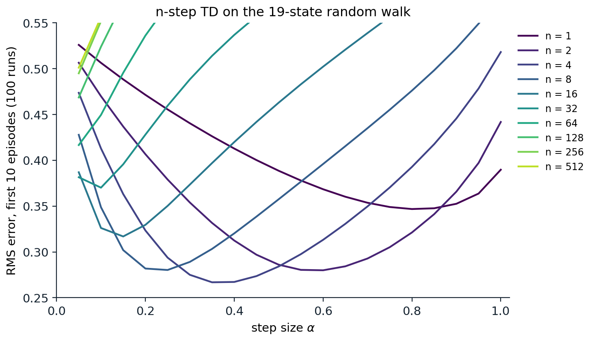
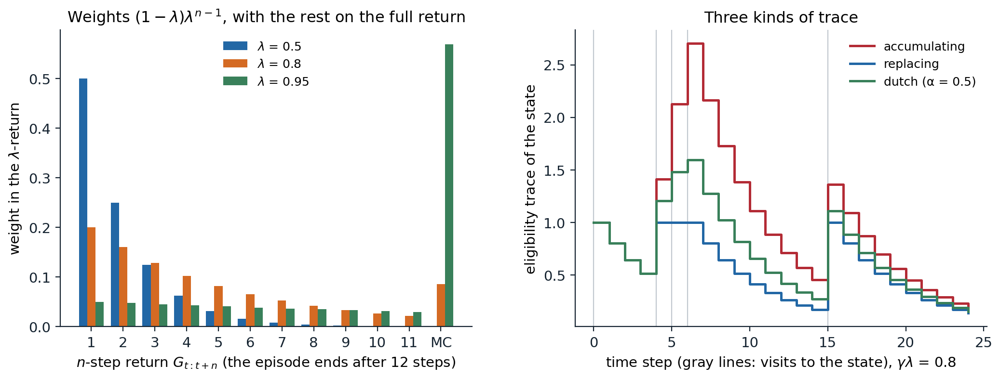
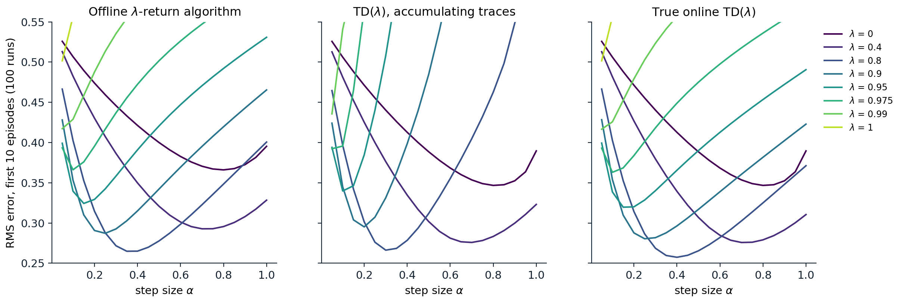

[Background Notes](../README.md) › [Reinforcement Learning](README.md)

# 8. Multi-Step Bootstrapping and Eligibility Traces

> [!WARNING]
> Work in progress: this part of the notes is still being revised.

[← 7. Model-Free Control](07-model-free-control.md) · [9. Off-Policy Learning →](09-off-policy-learning.md)

## <a id="between-one-step-and-the-whole-episode"></a>Between one step and the whole episode

### <a id="n-step-returns"></a>n-step returns

The TD methods of [chapter 6](06-temporal-difference-learning.md) and [chapter 7](07-model-free-control.md) bootstrap after one step; Monte Carlo methods ([chapter 5](05-monte-carlo-methods.md)) never bootstrap and wait for the end of the episode. Neither extreme is usually best. One-step TD learns slowly when rewards are delayed, since each update moves information back by only one step, and its targets inherit the bias of the current estimates. Monte Carlo targets are unbiased but noisy, and they are available only at the end of an episode. This chapter develops the methods in between, first by choosing how many real rewards to use before bootstrapping, and then by averaging over all such choices at once with **eligibility traces**, one of the basic mechanisms of reinforcement learning.

The **n-step return** uses $`n`$ rewards and then bootstraps from the value estimate of the state reached:

```math
G_{t:t+n}=R_{t+1}+\gamma R_{t+2}+\cdots+\gamma^{n-1}R_{t+n}+\gamma^nV(S_{t+n}),
```

with $`G_{t:t+n}=G_t`$, the full return, if the episode ends before $`t+n`$. The one-step TD target is $`G_{t:t+1}`$, and the Monte Carlo target is $`G_{t:\infty}=G_t`$. The **n-step TD** update uses it as the target for the state visited $`n`$ steps earlier,

```math
V(S_t)\leftarrow V(S_t)+\alpha\bigl[G_{t:t+n}-V(S_t)\bigr],
```

made at time $`t+n`$, when $`R_{t+n}`$ and $`S_{t+n}`$ become known. The first $`n-1`$ steps of an episode make no updates, and $`n-1`$ updates are made after the episode ends, for the states whose $`n`$-step window reached past it.

The n-step return inherits the contraction property of the Bellman operator, with a stronger factor. Its expected value, given $`S_t=s`$, is $`((\mathcal T^\pi)^nV)(s)`$, the result of $`n`$ backups of the current estimates, so

```math
\max_s\Bigl|\mathbb E_\pi\bigl[G_{t:t+n}\mid S_t=s\bigr]-v_\pi(s)\Bigr|\le\gamma^n\max_s\bigl|V(s)-v_\pi(s)\bigr|.
```

This is the **error reduction property** of n-step returns (exercise 8.2): the worst error of the expected target is at most $`\gamma^n`$ times the worst error of the estimates it bootstraps from. For $`n=1`$ it is the $`\gamma`$-contraction of chapter 2; as $`n`$ grows, the bias from bootstrapping shrinks geometrically, and the target depends more on sampled rewards, which adds variance.

### <a id="n-step-td-on-the-random-walk"></a>n-step TD on the random walk

Sutton and Barto's **19-state random walk** extends the random walk of chapter 6 to 19 states, with reward $`-1`$ for leaving on the left and $`+1`$ on the right, so that the true values run from $`-0.9`$ to $`0.9`$. The code runs n-step TD for several values of $`n`$, each with a range of step sizes, on the same episodes, and reports the RMS error of the estimates averaged over the first ten episodes.

```python
import numpy as np

# n-step TD on Sutton and Barto's 19-state random walk (Example 7.1): states 1..19 between two terminals, start in
# the middle, reward -1 on the left exit and +1 on the right exit, no discounting. True values: -0.9, ..., 0.9.
N, start = 19, 10
true_v = np.arange(-9, 10) / 10
rng = np.random.default_rng(0)
alphas = np.linspace(0.05, 1.0, 20)
runs, episodes = 100, 10


def episode():
    s, states = start, [start]
    while 0 < s < N + 1:
        s += 1 if rng.random() < 0.5 else -1
        states.append(s)
    return states, (1.0 if s == N + 1 else -1.0)


def n_step_td(n, data):
    """Run n-step TD on a list of episodes, for all step sizes at once. Returns the RMS error after each episode."""
    V = np.zeros((len(alphas), N + 2))                         # rows: step sizes; columns 0 and 20 are terminal
    errs = []
    for states, final in data:
        T = len(states) - 1
        rewards = np.zeros(T + 1); rewards[T] = final           # rewards[t + 1] follows the step from states[t]
        for tau in range(T):                                    # update the state visited at time tau
            G = rewards[tau + 1:min(tau + n, T) + 1].sum()      # no discounting
            if tau + n < T:
                G = G + V[:, states[tau + n]]
            V[:, states[tau]] += alphas * (G - V[:, states[tau]])
        errs.append(np.sqrt(((V[:, 1:N + 1] - true_v) ** 2).mean(1)))
    return np.array(errs)


ns = [1, 2, 4, 8, 16, 32, 64]
err = {n: np.zeros(len(alphas)) for n in ns}
for run in range(runs):
    data = [episode() for _ in range(episodes)]                 # the same episodes for every n and step size
    for n in ns:
        err[n] += n_step_td(n, data).mean(0) / runs             # RMS error averaged over the first 10 episodes
for n in ns:
    i = err[n].argmin()
    print(f"n = {n:2d}: best step size {alphas[i]:.2f}, RMS error averaged over the first 10 episodes {err[n][i]:.3f}")
# n =  1: best step size 0.80, RMS error averaged over the first 10 episodes 0.347
# n =  2: best step size 0.60, RMS error averaged over the first 10 episodes 0.280
# n =  4: best step size 0.35, RMS error averaged over the first 10 episodes 0.267
# n =  8: best step size 0.25, RMS error averaged over the first 10 episodes 0.280
# n = 16: best step size 0.15, RMS error averaged over the first 10 episodes 0.317
# n = 32: best step size 0.10, RMS error averaged over the first 10 episodes 0.370
# n = 64: best step size 0.05, RMS error averaged over the first 10 episodes 0.417
```

An intermediate $`n`$ is best: $`n=4`$ reaches an error of 0.27, against 0.35 for one-step TD and 0.42 for $`n=64`$. Larger $`n`$ also needs a smaller step size, since its targets are noisier. The figure shows the whole picture: a U-shaped curve in the step size for small and intermediate $`n`$, with the minimum moving to smaller step sizes as $`n`$ grows, until for $`n\ge64`$ it lies at the smallest step size tried. The curves for $`n\ge128`$, which on episodes that average about 100 steps are essentially Monte Carlo, do worst.



*n-step TD on the 19-state random walk: the RMS error over the 19 states, averaged over the first 10 episodes and 100 runs, as a function of the step size, for $`n`$ from 1 to 512. All methods see the same episodes. Intermediate values of $`n`$, around 4, give the lowest error; one-step TD is slower because information moves back one state per update, and large $`n`$ approaches Monte Carlo, whose noisy targets require small step sizes. The pattern reproduces Figure 7.2 of Sutton and Barto.*

### <a id="n-step-sarsa-and-n-step-expected-sarsa"></a>n-step SARSA and n-step Expected SARSA

The same idea applies to control. **n-step SARSA** replaces state values with action values and bootstraps from the action actually taken $`n`$ steps later:

```math
G_{t:t+n}=R_{t+1}+\gamma R_{t+2}+\cdots+\gamma^{n-1}R_{t+n}+\gamma^nQ(S_{t+n},A_{t+n}),
\qquad
Q(S_t,A_t)\leftarrow Q(S_t,A_t)+\alpha\bigl[G_{t:t+n}-Q(S_t,A_t)\bigr].
```

**n-step Expected SARSA** replaces the last term by $`\gamma^n\bar V(S_{t+n})`$, where $`\bar V(s)=\sum_a\pi(a\mid s)Q(s,a)`$ is the expected value under the target policy. The benefit in control is faster credit assignment. When an agent in a maze first reaches the goal after a long random search, one-step SARSA strengthens only the last action of the episode; n-step SARSA strengthens the last $`n`$, and the next episode can follow the trail from further away (exercise 8.3).

Off-policy n-step methods are harder, because the $`n`$ intermediate actions were chosen by the behavior policy and must be corrected for, with importance sampling or with the tree-backup algorithm, as described in [chapter 9](09-off-policy-learning.md). One-step Q-learning escapes this problem because its target contains no action chosen by the behavior policy ([chapter 7](07-model-free-control.md#why-q-learning-needs-no-importance-sampling)); multi-step targets do not.

### <a id="choosing-n"></a>Choosing n

The choice of $`n`$ trades bias against variance, and delay against both. Small $`n`$ bootstraps soon, which propagates the errors of the current estimates into the target but keeps its variance low; large $`n`$ relies on sampled rewards, with little bias and high variance. In addition, an n-step method must wait $`n`$ steps before it can update, and must store the last $`n`$ states, actions, and rewards. When the estimates are poor, as early in learning, longer returns help; when they are good, shorter ones do. No single $`n`$ is best for all problems, or even for all stages of one problem, which motivates averaging over $`n`$.

## <a id="the-return"></a>The λ-return

### <a id="averaging-n-step-returns"></a>Averaging n-step returns

Any average of n-step returns with nonnegative weights summing to one is also a valid target: its expectation still has the error reduction property. The **λ-return** averages all of them with geometrically decaying weights,

```math
G^\lambda_t=(1-\lambda)\sum_{n=1}^\infty\lambda^{n-1}G_{t:t+n},\qquad0\le\lambda\le1.
```

In the infinite sum, the one-step return gets the largest weight, $`1-\lambda`$, and each additional step reduces the weight by a factor $`\lambda`$. In an episode that ends at time $`T`$, all n-step returns with $`t+n\ge T`$ equal the full return $`G_t`$, and their weights add up to $`\lambda^{T-t-1}`$:

```math
G^\lambda_t=(1-\lambda)\sum_{n=1}^{T-t-1}\lambda^{n-1}G_{t:t+n}+\lambda^{T-t-1}G_t.
```

With $`\lambda=0`$ the λ-return is the one-step TD target; with $`\lambda=1`$ it is the Monte Carlo return. The parameter $`\lambda`$ plays the role of $`n`$, but continuously: the weights fall by half every $`\ln2/\ln(1/\lambda)`$ steps, 6.6 steps for $`\lambda=0.9`$, and $`1/(1-\lambda)`$, 10 steps for $`\lambda=0.9`$, acts as an effective horizon (exercise 8.4). The λ-return also satisfies a one-step recursion, which makes it cheap to compute backward through a stored episode,

```math
G^\lambda_t=R_{t+1}+\gamma\bigl[(1-\lambda)V(S_{t+1})+\lambda G^\lambda_{t+1}\bigr]:
```

the target bootstraps from the next state's estimate with weight $`1-\lambda`$ and continues with the next λ-return with weight $`\lambda`$. Applied to value functions, the corresponding operator $`\mathcal T^\lambda V=(1-\lambda)\sum_n\lambda^{n-1}(\mathcal T^\pi)^nV`$ is a contraction with modulus $`\gamma(1-\lambda)/(1-\gamma\lambda)`$, which falls from $`\gamma`$ at $`\lambda=0`$ to 0 at $`\lambda=1`$ ([Appendix B](#block-rl08-appendix-b)).



*Left: the weights that the λ-return places on the n-step returns from a state 12 steps before the end of an episode, for three values of $`\lambda`$. The weights decay geometrically, and all the weight that would fall on returns beyond the end of the episode goes to the full Monte Carlo return, so with $`\lambda=0.95`$ the λ-return is mostly the Monte Carlo return. Right: the eligibility trace of one state visited at steps 0, 4, 5, 6, and 15, with $`\gamma\lambda=0.8`$. An accumulating trace adds 1 at every visit and can exceed 1 when visits are frequent; a replacing trace resets to 1; the dutch trace of true online TD(λ), here with $`\alpha=0.5`$, lies in between.*

### <a id="the-forward-view"></a>The forward view

An algorithm that updates each state toward its λ-return, $`V(S_t)\leftarrow V(S_t)+\alpha[G^\lambda_t-V(S_t)]`$, is said to take the **forward view**: each update looks ahead to all the future rewards and states. Since the λ-return depends on the whole future, the simplest such algorithm, the **offline λ-return algorithm**, waits until the episode ends and then makes the updates for all its time steps. Like Monte Carlo, it cannot learn during an episode, and it does not apply to continuing tasks. The backward view removes both limitations.

## <a id="td-and-eligibility-traces"></a>TD(λ) and eligibility traces

### <a id="the-backward-view"></a>The backward view

**TD(λ)** ([Sutton, 1988](https://doi.org/10.1007/BF00115009)) implements the λ-return incrementally. It keeps an **eligibility trace** $`z(s)`$ for every state, a short-term memory of how recently and how often the state has been visited. At every step, all traces decay by $`\gamma\lambda`$ and the trace of the current state is incremented:

```math
z_t(s)=\gamma\lambda\,z_{t-1}(s)+\mathbb 1[S_t=s],\qquad z_{-1}=0.
```

The one-step TD error $`\delta_t=R_{t+1}+\gamma V(S_{t+1})-V(S_t)`$ is then broadcast to every state in proportion to its trace:

```math
V(s)\leftarrow V(s)+\alpha\,\delta_t\,z_t(s)\quad\text{for all }s.
```

This is the **backward view**: instead of looking forward to future rewards, each TD error, when it occurs, is credited backward to the states that led to it, the more strongly the more recently and frequently they were visited. With $`\lambda=0`$, only the current state has a nonzero trace, and TD(λ) is TD(0). With $`\lambda=1`$, the credit decays only through discounting, and TD(1) implements a Monte Carlo update incrementally, one TD error at a time, and applies to continuing tasks where Monte Carlo cannot.

The two views are connected by an identity from [chapter 6](06-temporal-difference-learning.md#the-td-error). If the values do not change during the episode, the λ-return error is a discounted sum of TD errors,

```math
G^\lambda_t-V(S_t)=\sum_{k=t}^{T-1}(\gamma\lambda)^{k-t}\delta_k,
```

and exchanging the order of summation shows that the total TD(λ) increment to each state over an episode equals the total forward-view increment ([Appendix A](#block-rl08-appendix-a)). **Offline**, with the changes accumulated and applied at the end of the episode, TD(λ) and the λ-return algorithm are therefore identical. The code checks both identities on one episode.

```python
import numpy as np

# Forward and backward views of TD(lambda) on one episode of the 19-state random walk, with the values held
# fixed during the episode (offline updating).
rng = np.random.default_rng(1)
N, gamma, lam, alpha = 19, 1.0, 0.8, 0.1
V = np.zeros(N + 2); V[1:N + 1] = rng.normal(0, 0.3, N)          # arbitrary current estimates; terminals are 0
s, states = 10, [10]
while 0 < s < N + 1:
    s += 1 if rng.random() < 0.5 else -1
    states.append(s)
T = len(states) - 1
R = np.zeros(T + 1); R[T] = 1.0 if s == N + 1 else -1.0         # R[t + 1] is the reward after leaving states[t]


def n_step_return(t, n):                                       # G_{t:t+n}, bootstrapping from V
    h = min(t + n, T)
    G = sum(gamma ** (k - t - 1) * R[k] for k in range(t + 1, h + 1))
    return G + (gamma ** n * V[states[t + n]] if t + n < T else 0.0)


# forward view, by the definition: a weighted average of all n-step returns
G_def = np.array([(1 - lam) * sum(lam ** (n - 1) * n_step_return(t, n) for n in range(1, T - t))
                  + lam ** (T - t - 1) * n_step_return(t, T - t) for t in range(T)])
# forward view, by the recursion G_t = R_{t+1} + gamma * ((1 - lam) V(S_{t+1}) + lam G_{t+1}), backward in time
G_rec, g = np.zeros(T), 0.0
for t in reversed(range(T)):
    v_next = V[states[t + 1]]                                  # 0 if S_{t+1} is terminal
    g = R[t + 1] + gamma * ((1 - lam) * v_next + lam * g)
    G_rec[t] = g
forward = np.zeros(N + 2)
for t in range(T):
    forward[states[t]] += alpha * (G_rec[t] - V[states[t]])
# backward view: TD errors broadcast along an accumulating eligibility trace
backward, z = np.zeros(N + 2), np.zeros(N + 2)
for t in range(T):
    delta = R[t + 1] + gamma * V[states[t + 1]] - V[states[t]]
    z *= gamma * lam; z[states[t]] += 1
    backward += alpha * delta * z
print(f"episode length {T}; lambda-return by definition vs by recursion: max difference {np.abs(G_def - G_rec).max():.1e}")
print(f"total offline increments, forward vs backward view: max difference {np.abs(forward - backward).max():.1e}")
# episode length 32; lambda-return by definition vs by recursion: max difference 1.1e-16
# total offline increments, forward vs backward view: max difference 2.8e-17
```

The idea of eligibility traces goes back to Klopf's theory of the hedonistic neuron ([Klopf, 1972](https://apps.dtic.mil/sti/pdfs/AD0742259.pdf)), in which the synapses that contributed to a neuron's firing become eligible for modification for a while afterward, and are strengthened if a reward arrives while they are still eligible. In reinforcement learning, the same mechanism solves the credit-assignment problem in time: the trace marks which states are eligible for learning when a TD error occurs. The mechanism is cheap. With a table it costs one operation per state with a nonzero trace, which can be limited by dropping traces below a threshold; with a linear function approximator, the trace is a vector the size of the weights, $`z_t=\gamma\lambda z_{t-1}+\nabla\hat v(S_t,w_t)`$, and TD(λ) costs the same $`O(d)`$ per step as TD(0).

### <a id="online-updating-and-its-failure"></a>Online updating and its failure

In practice TD(λ) updates the values online, at every step, and then the equivalence is only approximate: the TD errors are computed with values that change during the episode. For small step sizes the difference is negligible. For large ones it is not, and it is worst with **accumulating traces** when states are revisited often. A state visited several times in quick succession accumulates a trace $`z`$ larger than 1, up to $`1/(1-\gamma\lambda)`$, and when $`\alpha z>1`$ its value moves by more than the whole TD error, past its target, and when $`\alpha z>2`$ it ends up further from the target than it started; the errors then grow instead of shrinking, and the values oscillate or diverge (exercise 8.6).

[Singh and Sutton (1996)](https://doi.org/10.1007/BF00114726) proposed **replacing traces**, which reset a visited state's trace to 1 instead of adding 1, and found them faster and more reliable in problems with frequent revisits. Replacing traces are defined only for tabular or binary features. The principled fix, which works for any linear features, came almost two decades later.

### <a id="true-online-td"></a>True online TD(λ)

The **online λ-return algorithm** defines the ideal online forward view. At every time $`h`$, it redoes all the updates of the episode so far, using for each earlier time $`t`$ the **truncated λ-return** $`G^\lambda_{t:h}`$, which bootstraps with the values at time $`h`$ wherever the data run out:

```math
G^\lambda_{t:h}=(1-\lambda)\sum_{n=1}^{h-t-1}\lambda^{n-1}G_{t:t+n}+\lambda^{h-t-1}G_{t:h}.
```

This is the best online use of the data, but its cost grows with the length of the episode. [van Seijen and Sutton (2014)](https://proceedings.mlr.press/v32/seijen14.html) found a backward-view algorithm, **true online TD(λ)**, that produces exactly the same values as the online λ-return algorithm for linear function approximation, with $`O(d)`$ computation per step. It uses a **dutch trace**,

```math
z_t=\gamma\lambda z_{t-1}+\bigl(1-\alpha\gamma\lambda\,z_{t-1}^\top x_t\bigr)x_t,
```

and an update with a correction term,

```math
w_{t+1}=w_t+\alpha\delta_tz_t+\alpha\bigl(w_t^\top x_t-w_{t-1}^\top x_t\bigr)(z_t-x_t),
```

where $`x_t`$ is the feature vector of $`S_t`$; for a table, $`x_t`$ is the indicator vector of the current state. In the tabular case the dutch trace sits between the accumulating and the replacing trace, as in the figure above. The equivalence and its generalizations are developed by [van Seijen et al. (2016)](https://jmlr.org/papers/v17/15-599.html), and Sutton and Barto call the online λ-return algorithm, which true online TD(λ) implements exactly for linear function approximation, the best-performing temporal-difference algorithm at the time they wrote.

The code compares four algorithms on the random walk with $`\lambda=0.9`$: the offline λ-return algorithm and three online ones, TD(λ) with accumulating traces, TD(λ) with replacing traces, and true online TD(λ).

```python
import numpy as np

# Online prediction on the 19-state random walk with lambda = 0.9: the offline lambda-return algorithm, TD(lambda)
# with accumulating and with replacing traces, and true online TD(lambda). RMS error over the first 10 episodes,
# 100 runs, the same episodes for every method; each method runs all the step sizes at once.
N, lam, gamma = 19, 0.9, 1.0
true_v = np.arange(-9, 10) / 10
alphas = np.array([0.1, 0.3, 0.5, 0.7, 0.9])
rng = np.random.default_rng(0)


def episode():
    s, states = 10, [10]
    while 0 < s < N + 1:
        s += 1 if rng.random() < 0.5 else -1
        states.append(s)
    return states, (1.0 if s == N + 1 else -1.0)


def run(method, data):
    V = np.zeros((len(alphas), N + 2))
    a = alphas[:, None]
    errs = []
    for states, final in data:
        T = len(states) - 1
        R = np.zeros(T + 1); R[T] = final
        if method == "offline lambda-return":                  # lambda-returns from the values at the episode start
            G, g, V0 = np.zeros((T, len(alphas))), 0.0, V.copy()
            for t in reversed(range(T)):
                g = R[t + 1] + gamma * ((1 - lam) * V0[:, states[t + 1]] + lam * g)
                G[t] = g
            for t in range(T):
                V[:, states[t]] += alphas * (G[t] - V[:, states[t]])
        else:
            z, v_old = np.zeros_like(V), np.zeros(len(alphas))
            for t in range(T):
                s, s2 = states[t], states[t + 1]
                v, v2 = V[:, s].copy(), V[:, s2].copy()         # terminal columns stay 0
                delta = R[t + 1] + gamma * v2 - v
                if method == "true online TD(lambda)":           # dutch trace and the true online correction
                    zs = z[:, s].copy()
                    z *= gamma * lam
                    z[:, s] += 1 - alphas * gamma * lam * zs
                    V += a * (delta + v - v_old)[:, None] * z
                    V[:, s] -= alphas * (v - v_old)
                    v_old = v2
                else:
                    z *= gamma * lam
                    if method == "TD(lambda), accumulating":
                        z[:, s] += 1
                    else:
                        z[:, s] = 1                             # replacing trace
                    V += a * delta[:, None] * z
                V[:, [0, N + 1]] = 0
        errs.append(np.sqrt(((V[:, 1:N + 1] - true_v) ** 2).mean(1)))
    return np.mean(errs, 0)


data = [[episode() for _ in range(10)] for _ in range(100)]
print("RMS error, first 10 episodes, lambda = 0.9;  step size:" + "".join(f"{x:8.1f}" for x in alphas))
with np.errstate(over="ignore", invalid="ignore"):
    for method in ["offline lambda-return", "TD(lambda), accumulating", "TD(lambda), replacing",
                   "true online TD(lambda)"]:
        e = np.mean([run(method, d) for d in data], 0)
        print(f"  {method:26s}" + " " * 22 + "".join(f"{x:8.3f}" if x < 10 else "   >10  " for x in e))
# RMS error, first 10 episodes, lambda = 0.9;  step size:     0.1     0.3     0.5     0.7     0.9
#   offline lambda-return                              0.353   0.293   0.342   0.395   0.443
#   TD(lambda), accumulating                           0.345   0.331   0.485   3.760   >10
#   TD(lambda), replacing                              0.414   0.273   0.268   0.316   0.381
#   true online TD(lambda)                             0.354   0.282   0.317   0.361   0.402
```

The offline λ-return algorithm cannot use what it learns within an episode. TD(λ) with accumulating traces does well at small step sizes and diverges at large ones. Replacing traces and true online TD(λ) remain stable at every step size. On this task replacing traces are better at medium and large step sizes, with the lowest error in the table, 0.268 at $`\alpha=0.5`$ against 0.282 for true online TD(λ) at $`\alpha=0.3`$, but worse at the smallest. True online TD(λ) does better than the offline λ-return algorithm at all but the smallest step size, where the two are equal, as the online λ-return algorithm should, since it uses the most recent values in its targets.



*The offline λ-return algorithm, TD(λ) with accumulating traces, and true online TD(λ) on the 19-state random walk: RMS error averaged over the first 10 episodes and 100 runs, against the step size, for eight values of $`\lambda`$. All three are best at intermediate $`\lambda`$, around 0.8, with errors close to the best n-step method's. Accumulating traces become unstable at large step sizes, earlier the larger $`\lambda`$ is. True online TD(λ) is stable at all step sizes and does slightly better than the offline λ-return algorithm, whose updates wait for the end of the episode. The panels reproduce Figures 12.3, 12.6, and 12.8 of Sutton and Barto.*

### <a id="variable-and"></a>Variable λ and γ

Nothing requires $`\lambda`$ and $`\gamma`$ to be constants. With a state-dependent $`\lambda_t=\lambda(S_t)`$ and discount $`\gamma_t=\gamma(S_t)`$, the recursive definition of the λ-return generalizes directly,

```math
G^\lambda_t=R_{t+1}+\gamma_{t+1}\bigl[(1-\lambda_{t+1})V(S_{t+1})+\lambda_{t+1}G^\lambda_{t+1}\bigr],
```

and the traces decay by $`\gamma_t\lambda_t`$ at each step. A small $`\lambda(s)`$ expresses trust in the estimate at $`s`$: the return bootstraps there. A state-dependent discount unifies episodic and continuing tasks, since termination is a transition with $`\gamma=0`$, and it describes predictions of events other than the main return, such as the time until something happens ([White, 2017](https://arxiv.org/abs/1609.01995)). These generalizations underlie the general value functions and options of later chapters, and the off-policy methods of [chapter 9](09-off-policy-learning.md) choose $`\lambda`$ at each step to control the variance of importance sampling.

## <a id="control-with-eligibility-traces"></a>Control with eligibility traces

### <a id="sarsa"></a>SARSA(λ)

**SARSA(λ)** applies the backward view to action values. Each state–action pair has a trace, the pair just taken is marked, and every pair is updated with the one-step SARSA error:

```math
\delta_t=R_{t+1}+\gamma Q(S_{t+1},A_{t+1})-Q(S_t,A_t),\qquad z_t(s,a)=\gamma\lambda z_{t-1}(s,a)+\mathbb 1[S_t=s,A_t=a],\qquad Q\leftarrow Q+\alpha\delta_tz_t.
```

Its forward view is the λ-return built from n-step SARSA returns, and a true online version exists as for TD(λ). The code runs SARSA(λ) with replacing traces in the $`6\times9`$ maze that Sutton and Barto use for their planning examples, where the only reward is 1 on reaching the goal.

```python
import numpy as np

# SARSA(lambda) on Sutton and Barto's 6 x 9 maze (Figure 8.2): reward 1 on reaching the goal, 0 otherwise,
# gamma = 0.95, epsilon-greedy with epsilon = 0.1, alpha = 0.2, replacing traces; 30 runs of 30 episodes.
H, W, start, goal = 6, 9, (2, 0), (0, 8)
walls = {(1, 2), (2, 2), (3, 2), (4, 5), (0, 7), (1, 7), (2, 7)}
moves = [(-1, 0), (1, 0), (0, 1), (0, -1)]
gamma, eps, alpha = 0.95, 0.1, 0.2


def step(s, a):
    t = (min(max(s[0] + moves[a][0], 0), H - 1), min(max(s[1] + moves[a][1], 0), W - 1))
    return s if t in walls else t


def sarsa_lambda(lam, seed, episodes=30):
    rng = np.random.default_rng(seed)
    Q = np.zeros((H, W, 4))

    def act(s):
        if rng.random() < eps:
            return int(rng.integers(4))
        return int(rng.choice(np.flatnonzero(Q[s] == Q[s].max())))

    lengths = []
    for _ in range(episodes):
        z = np.zeros_like(Q)
        s, a, n = start, act(start), 0
        while s != goal:
            s2 = step(s, a); r = 1.0 if s2 == goal else 0.0
            a2 = act(s2)
            delta = r + (0.0 if s2 == goal else gamma * Q[s2][a2]) - Q[s][a]
            z *= gamma * lam
            z[s][a] = 1.0                                        # replacing trace
            Q += alpha * delta * z                              # every recently visited pair shares the TD error
            s, a, n = s2, a2, n + 1
        lengths.append(n)
    return lengths


for lam in [0.0, 0.5, 0.8, 0.9, 0.95]:
    L = np.array([sarsa_lambda(lam, seed) for seed in range(30)])
    print(f"lambda = {lam:4.2f}: steps in episode 1: {L[:, 0].mean():6.0f}, episode 2: {L[:, 1].mean():5.0f},"
          f" episodes 11-30 on average: {L[:, 10:].mean():5.1f}; total steps for 30 episodes: {L.sum(1).mean():6.0f}")
print("the shortest path takes 14 steps")
# lambda = 0.00: steps in episode 1:    983, episode 2:   881, episodes 11-30 on average:  57.0; total steps for 30 episodes:   5002
# lambda = 0.50: steps in episode 1:    983, episode 2:    22, episodes 11-30 on average:  20.3; total steps for 30 episodes:   1578
# lambda = 0.80: steps in episode 1:    983, episode 2:    22, episodes 11-30 on average:  20.8; total steps for 30 episodes:   1589
# lambda = 0.90: steps in episode 1:    983, episode 2:    22, episodes 11-30 on average:  21.4; total steps for 30 episodes:   1605
# lambda = 0.95: steps in episode 1:    983, episode 2:    22, episodes 11-30 on average:  21.5; total steps for 30 episodes:   1607
# the shortest path takes 14 steps
```

The first episode is the same for every $`\lambda`$: all values are zero, so every TD error is zero until the goal is reached, and the agent wanders for about a thousand steps. What it learns from the final TD error differs. One-step SARSA credits only the last action, and the second episode is nearly as long as the first. SARSA(λ) credits every action taken during the episode, in proportion to its trace. The most recent action taken in each state gets the largest trace, so the greedy policy after one episode follows, from each visited state, the last action taken there, which traces a loop-free path through the first episode to the goal (exercise 8.7). The second episode takes about 22 steps, against a shortest path of 14. Over 30 episodes, SARSA(λ) takes about a third as many steps as one-step SARSA, and it does better than n-step SARSA with any $`n`$ (exercise 8.3), because it credits the whole trajectory, not just its last $`n`$ steps.

### <a id="q"></a>Q(λ)

Extending eligibility traces to Q-learning meets the difficulty of off-policy multi-step learning. The λ-return of the greedy target policy is valid only as long as the behavior follows that policy; after an exploratory action, the rest of the trajectory says nothing about the greedy policy. **Watkins's Q(λ)** ([Watkins, 1989](https://www.cs.rhul.ac.uk/~chrisw/new_thesis.pdf)) uses the Q-learning error $`\delta_t=R_{t+1}+\gamma\max_aQ(S_{t+1},a)-Q(S_t,A_t)`$ and cuts all traces to zero whenever the behavior takes a non-greedy action, so it never credits a greedy action with rewards the greedy policy would not have produced. But when exploration is frequent the traces are cut so often that it learns little faster than one-step Q-learning. **Peng's Q(λ)** ([Peng and Williams, 1996](https://doi.org/10.1007/BF00114731)) never cuts the traces, which makes it learn faster but converge to a mixture of the values of the behavior and greedy policies rather than to $`q_*`$, unless the behavior becomes greedy. Despite this bias, Peng's Q(λ) often works well in practice, including with deep networks ([Kozuno et al., 2021](https://arxiv.org/abs/2103.00107)). The principled modern solutions cut the traces gradually instead of all at once, tree backup by the target policy's probability of the action taken and Retrace by the importance-sampling ratio truncated at 1, and are the subject of [chapter 9](09-off-policy-learning.md).

## <a id="multi-step-returns-in-modern-reinforcement-learning"></a>Multi-step returns in modern reinforcement learning

Multi-step targets are everywhere in deep reinforcement learning, usually as n-step returns or λ-returns computed from stored trajectories rather than as eligibility traces:

- **Value-based agents.** Rainbow uses 3-step returns ([Hessel et al., 2018](https://arxiv.org/abs/1710.02298)), and R2D2 uses 5-step returns over replayed sequences ([Kapturowski et al., 2019](https://openreview.net/forum?id=r1lyTjAqYX)), without off-policy corrections: the bias is tolerated for faster propagation of rewards ([chapter 16](16-deep-q-learning.md), [chapter 18](18-data-efficient-and-scalable-value-based-agents.md)).
- **Actor–critic agents.** In its Atari experiments, A3C bootstraps after at most 5 steps ([Mnih et al., 2016](https://arxiv.org/abs/1602.01783)). **Generalized advantage estimation** ([Schulman et al., 2016](https://arxiv.org/abs/1506.02438)) is the λ-return idea applied to advantages, $`\hat A_t=\sum_k(\gamma\lambda)^k\delta_{t+k}`$, and with $`\lambda=0.95`$ it is the default in PPO ([chapter 19](19-deep-actor-critic-and-distributed-rl.md), [chapter 20](20-trust-regions-and-proximal-policy-optimization.md)).
- **World models.** Dreamer trains its critic on λ-returns computed along trajectories imagined by its world model ([Hafner et al., 2020](https://arxiv.org/abs/1912.01603)), and MuZero bootstraps its value targets from the search value 10 real steps later in Atari, while in board games it uses the final outcome ([Schrittwieser et al., 2020](https://arxiv.org/abs/1911.08265); [chapter 23](23-model-based-rl-and-world-models.md), [chapter 24](24-planning-with-learned-models.md)).
- **Replay.** Eligibility traces are awkward with experience replay, which updates on stored transitions out of order. Copying short sequences of stored transitions into a small cache and computing their λ-returns there, with the cache refreshed periodically using the current network, as [Daley and Amato (2019)](https://arxiv.org/abs/1810.09967) propose, recovers much of their benefit.

The trade-offs of this chapter reappear unchanged in these settings. Longer returns propagate rewards faster and depend less on an inaccurate critic; shorter returns have lower variance and, off-policy, less bias from actions the current policy would not take.

## <a id="exercises"></a>Exercises

### <a id="exercise-8-1-n-step-errors-as-sums-of-td-errors"></a>Exercise 8.1 — n-step errors as sums of TD errors

Show that if the value estimates do not change, the n-step error can be written as a sum of TD errors, $`G_{t:t+n}-V(S_t)=\sum_{k=t}^{\min(t+n,T)-1}\gamma^{k-t}\delta_k`$.


<details>
<summary><b>Solution</b></summary>


Write $`\delta_k=R_{k+1}+\gamma V(S_{k+1})-V(S_k)`$, with $`V(S_T)=0`$ at termination. The sum telescopes:

```math
\sum_{k=t}^{h-1}\gamma^{k-t}\delta_k=\sum_{k=t}^{h-1}\gamma^{k-t}R_{k+1}+\sum_{k=t}^{h-1}\bigl(\gamma^{k-t+1}V(S_{k+1})-\gamma^{k-t}V(S_k)\bigr)=\sum_{k=t}^{h-1}\gamma^{k-t}R_{k+1}+\gamma^{h-t}V(S_h)-V(S_t),
```

with $`h=\min(t+n,T)`$. The first two terms are $`G_{t:t+n}`$. For $`n\ge T-t`$ this is the Monte Carlo identity of exercise 6.1. If the values change during the episode, as in n-step TD, the identity holds only approximately, with correction terms proportional to $`\alpha`$.

</details>


### <a id="exercise-8-2-the-error-reduction-property"></a>Exercise 8.2 — The error reduction property

Prove that $`\max_s|\mathbb E_\pi[G_{t:t+n}\mid S_t=s]-v_\pi(s)|\le\gamma^n\max_s|V(s)-v_\pi(s)|`$, for an episodic or continuing task and any fixed estimates $`V`$ (with $`V=0`$ at terminal states).


<details>
<summary><b>Solution</b></summary>


Treat termination as a transition into an absorbing state with value 0. Then $`\mathbb E_\pi[G_{t:t+n}\mid S_t=s]=((\mathcal T^\pi)^nV)(s)`$: the expected rewards of the first $`n`$ steps plus the discounted expected estimate at the state reached, and the same expression with $`v_\pi`$ in place of $`V`$ is $`((\mathcal T^\pi)^nv_\pi)(s)=v_\pi(s)`$, since $`v_\pi`$ is the fixed point. The difference is

```math
((\mathcal T^\pi)^nV)(s)-((\mathcal T^\pi)^nv_\pi)(s)=\gamma^n\sum_{s'}\Pr\nolimits_\pi(S_{t+n}=s'\mid S_t=s)\bigl(V(s')-v_\pi(s')\bigr),
```

where the rewards have canceled and the sum runs over the nonterminal states, whose probabilities sum to at most 1. Its absolute value is at most $`\gamma^n\max_{s'}|V(s')-v_\pi(s')|`$. In an episodic task with $`\gamma=1`$, the bound as stated gives no reduction, but the same argument gives the sharper factor $`\max_s\Pr_\pi(S_{t+n}\text{ is nonterminal}\mid S_t=s)`$, which is close to 1 for small $`n`$ and falls as episodes end.

</details>


### <a id="exercise-8-3-n-step-sarsa-in-the-maze"></a>Exercise 8.3 — n-step SARSA in the maze

Run n-step SARSA on the maze of the SARSA(λ) example with the same settings, for $`n=1,2,4,\dots,32`$. Compare the length of the second episode and the total number of steps with SARSA(λ).


<details>
<summary><b>Solution</b></summary>


```python
import numpy as np

# n-step SARSA on the maze of the chapter's SARSA(lambda) example: same settings (gamma 0.95, epsilon 0.1,
# alpha 0.2, 30 runs of 30 episodes), with the n-step return in place of the lambda-return.
H, W, start, goal = 6, 9, (2, 0), (0, 8)
walls = {(1, 2), (2, 2), (3, 2), (4, 5), (0, 7), (1, 7), (2, 7)}
moves = [(-1, 0), (1, 0), (0, 1), (0, -1)]
gamma, eps, alpha = 0.95, 0.1, 0.2


def step(s, a):
    t = (min(max(s[0] + moves[a][0], 0), H - 1), min(max(s[1] + moves[a][1], 0), W - 1))
    return s if t in walls else t


def n_step_sarsa(n, seed, episodes=30):
    rng = np.random.default_rng(seed)
    Q = np.zeros((H, W, 4))

    def act(s):
        if rng.random() < eps:
            return int(rng.integers(4))
        return int(rng.choice(np.flatnonzero(Q[s] == Q[s].max())))

    lengths = []
    for _ in range(episodes):
        S, A, R = [start], [act(start)], [0.0]
        T, t = np.inf, 0
        while True:
            if t < T:
                s2 = step(S[t], A[t]); S.append(s2); R.append(1.0 if s2 == goal else 0.0)
                if s2 == goal:
                    T = t + 1
                else:
                    A.append(act(s2))
            tau = t - n + 1                                        # the time whose estimate is updated now
            if tau >= 0:
                G = sum(gamma ** (i - tau - 1) * R[i] for i in range(tau + 1, int(min(tau + n, T)) + 1))
                if tau + n < T:
                    G += gamma ** n * Q[S[tau + n]][A[tau + n]]
                Q[S[tau]][A[tau]] += alpha * (G - Q[S[tau]][A[tau]])
            if tau == T - 1:
                break
            t += 1
        lengths.append(T)
    return lengths


for n in [1, 2, 4, 8, 16, 32]:
    L = np.array([n_step_sarsa(n, seed) for seed in range(30)])
    print(f"n = {n:2d}: steps in episode 2: {L[:, 1].mean():5.0f}, episodes 11-30 on average: {L[:, 10:].mean():5.1f};"
          f" total steps for 30 episodes: {L.sum(1).mean():6.0f}")
# n =  1: steps in episode 2:   861, episodes 11-30 on average:  56.1; total steps for 30 episodes:   4989
# n =  2: steps in episode 2:   595, episodes 11-30 on average:  25.1; total steps for 30 episodes:   3433
# n =  4: steps in episode 2:   495, episodes 11-30 on average:  20.6; total steps for 30 episodes:   2728
# n =  8: steps in episode 2:   317, episodes 11-30 on average:  21.6; total steps for 30 episodes:   2339
# n = 16: steps in episode 2:   160, episodes 11-30 on average:  24.0; total steps for 30 episodes:   2437
# n = 32: steps in episode 2:   159, episodes 11-30 on average:  23.6; total steps for 30 episodes:   2278
```

Larger $`n`$ shortens the second episode, since the final reward of the first episode is credited to the last $`n`$ actions rather than one, and the total number of steps falls from about 5,000 for one-step SARSA to 2,300 to 2,400 for $`n\ge8`$. But n-step SARSA still credits only the end of the first episode, however large $`n`$ is: most of the states the agent visited get no value, and the second episode is a random search until it happens to reach the credited stretch. SARSA(λ), with about 1,600 total steps, credits every action of the episode, weighted by recency, and its greedy policy after one episode already leads from the start to the goal. After the first few episodes the multi-step methods are similar, and the best long-run performance is at intermediate settings, $`n=4`$ or $`\lambda=0.5`$, as larger $`n`$ and $`\lambda`$ make the targets noisier.

</details>


### <a id="exercise-8-4-weights-and-horizons-of-the-return"></a>Exercise 8.4 — Weights and horizons of the λ-return

(a) Show that the weights of the episodic λ-return sum to one. (b) Find the time $`\tau`$ by which the weights $`(1-\lambda)\lambda^{n-1}`$ have fallen to half their initial value, and its value for $`\lambda=0.5,0.9,0.99`$. (c) Derive the recursion $`G^\lambda_t=R_{t+1}+\gamma[(1-\lambda)V(S_{t+1})+\lambda G^\lambda_{t+1}]`$.


<details>
<summary><b>Solution</b></summary>


(a) $`(1-\lambda)\sum_{n=1}^{T-t-1}\lambda^{n-1}+\lambda^{T-t-1}=(1-\lambda^{T-t-1})+\lambda^{T-t-1}=1`$.

(b) $`\lambda^\tau=1/2`$ gives $`\tau=\ln2/\ln(1/\lambda)`$: 1 step for $`\lambda=0.5`$, 6.6 for $`0.9`$, and 69 for $`0.99`$. For large $`\lambda`$, $`\tau\approx0.69/(1-\lambda)`$, so $`1/(1-\lambda)`$ acts as an effective horizon, just as $`1/(1-\gamma)`$ does for discounting. The traces decay by $`\gamma\lambda`$, so the credit a TD error gives to a state visited $`k`$ steps earlier halves every $`\ln2/\ln(1/(\gamma\lambda))`$ steps.

(c) Each n-step return satisfies $`G_{t:t+n}=R_{t+1}+\gamma G_{t+1:t+n}`$ for $`n\ge2`$, and $`G_{t:t+1}=R_{t+1}+\gamma V(S_{t+1})`$. Substituting into the definition,

```math
G^\lambda_t=(1-\lambda)\bigl[R_{t+1}+\gamma V(S_{t+1})\bigr]+(1-\lambda)\sum_{n\ge2}\lambda^{n-1}\bigl[R_{t+1}+\gamma G_{t+1:t+n}\bigr]=R_{t+1}+\gamma(1-\lambda)V(S_{t+1})+\gamma\lambda\,(1-\lambda)\sum_{m\ge1}\lambda^{m-1}G_{t+1:t+1+m},
```

using $`(1-\lambda)\sum_{n\ge1}\lambda^{n-1}=1`$ for the reward terms. The last sum is $`G^\lambda_{t+1}`$. In an episode, the same computation with the full-return term included gives the same recursion, with $`G^\lambda_{T}=0`$ and $`V`$ of the terminal state 0.

</details>


### <a id="exercise-8-5-offline-equivalence-of-the-two-views"></a>Exercise 8.5 — Offline equivalence of the two views

Show that with the values held fixed during an episode, the total TD(λ) increment to the value of each state equals the total increment of the λ-return algorithm.


<details>
<summary><b>Solution</b></summary>


The TD(λ) increment to $`V(s)`$ over the episode is $`\alpha\sum_{k=0}^{T-1}\delta_kz_k(s)`$, where $`z_k(s)=\sum_{t=0}^k(\gamma\lambda)^{k-t}\mathbb 1[S_t=s]`$ unrolls the trace recursion. Substituting and exchanging the order of summation,

```math
\alpha\sum_{k=0}^{T-1}\delta_k\sum_{t=0}^k(\gamma\lambda)^{k-t}\mathbb 1[S_t=s]=\alpha\sum_{t=0}^{T-1}\mathbb 1[S_t=s]\sum_{k=t}^{T-1}(\gamma\lambda)^{k-t}\delta_k=\alpha\sum_{t=0}^{T-1}\mathbb 1[S_t=s]\bigl(G^\lambda_t-V(S_t)\bigr),
```

using the identity $`G^\lambda_t-V(S_t)=\sum_{k\ge t}(\gamma\lambda)^{k-t}\delta_k`$, which follows from the recursion of exercise 8.4 in the same way as exercise 8.1: $`G^\lambda_t-V(S_t)=\delta_t+\gamma\lambda(G^\lambda_{t+1}-V(S_{t+1}))`$. The right-hand side is the total forward-view increment. The code of the chapter checks the equality numerically.

</details>


### <a id="exercise-8-6-why-accumulating-traces-become-unstable"></a>Exercise 8.6 — Why accumulating traces become unstable

(a) On the 19-state random walk, compute the largest accumulating trace reached in 1,000 episodes for several values of $`\lambda`$, and the fraction of steps at which the current state's trace exceeds 2. (b) Explain the value $`1/(1-\lambda^2)`$ that appears, and relate the results to the instability of TD(λ) at large step sizes.


<details>
<summary><b>Solution</b></summary>


```python
import numpy as np

# How large do accumulating traces get on the 19-state random walk? For each lambda, the largest trace reached
# in 1,000 episodes, and the fraction of steps at which the current state's trace exceeds 2: with alpha = 0.5,
# such a step moves the state's value by more than its whole TD error, past its one-step target.
rng = np.random.default_rng(0)
N = 19
walks = []
for _ in range(1000):
    s, states = 10, [10]
    while 0 < s < N + 1:
        s += 1 if rng.random() < 0.5 else -1
        states.append(s)
    walks.append(states[:-1])                                  # the nonterminal states visited
for lam in [0.5, 0.8, 0.9, 0.95, 0.99]:
    largest, over, total = 0.0, 0, 0
    for states in walks:
        z = np.zeros(N + 2)
        for s in states:
            z *= lam; z[s] += 1                                 # gamma = 1
            largest = max(largest, z[s]); over += z[s] > 2; total += 1
    print(f"lambda = {lam:4.2f}: largest trace {largest:5.2f}, 1/(1 - lambda^2) = {1 / (1 - lam ** 2):5.2f};"
          f" steps with the current trace above 2: {100 * over / total:4.1f}%")
# lambda = 0.50: largest trace  1.33, 1/(1 - lambda^2) =  1.33; steps with the current trace above 2:  0.0%
# lambda = 0.80: largest trace  2.78, 1/(1 - lambda^2) =  2.78; steps with the current trace above 2: 30.4%
# lambda = 0.90: largest trace  5.20, 1/(1 - lambda^2) =  5.26; steps with the current trace above 2: 54.7%
# lambda = 0.95: largest trace  9.14, 1/(1 - lambda^2) = 10.26; steps with the current trace above 2: 67.6%
# lambda = 0.99: largest trace 25.45, 1/(1 - lambda^2) = 50.25; steps with the current trace above 2: 74.9%
```

(b) In the random walk the agent moves one state left or right at every step, so it can return to a state only after an even number of steps, at the earliest two. The largest possible trace, approached by bouncing back and forth, is $`1+\lambda^2+\lambda^4+\cdots=1/(1-\lambda^2)`$. For $`\lambda=0.5`$ and 0.8 the random walks reach it to two decimals; the closer $`\lambda`$ is to 1, the longer the run of bounces needed to approach it, and the largest trace falls well below the bound, 25 against 50 for $`\lambda=0.99`$. The general bound, for a state visited at every step, is $`1/(1-\gamma\lambda)`$.

When the current state's trace is $`z`$, the update moves its value by $`\alpha z\delta_t`$. If $`\alpha z>1`$, the value moves past its one-step target $`R_{t+1}+\gamma V(S_{t+1})`$, and if $`\alpha z>2`$, it ends up further from the target than it started. With $`\lambda=0.9`$, the current state's trace exceeds 2 at more than half of the steps, so any $`\alpha\ge0.5`$ overshoots most of the time. Overshooting states pass their errors to their neighbors through the next TD errors, and the errors grow, which is the divergence seen in the figure. Replacing traces cap the trace at 1, and dutch traces shrink the increment when the trace is already large, $`1-\alpha\gamma\lambda z`$, so that $`\alpha z`$ stays bounded.

</details>


### <a id="exercise-8-7-what-sarsa-learns-from-its-first-episode"></a>Exercise 8.7 — What SARSA(λ) learns from its first episode

In the maze example, all action values start at 0 and the only reward is 1 at the goal. (a) Show that after the first episode, for any $`\lambda>0`$, the greedy action in every visited state is the last action taken there. (b) Show that following these actions from the start leads to the goal without revisiting any state. (c) Why is this fragile in practice?


<details>
<summary><b>Solution</b></summary>


(a) Until the goal is reached, every reward and every value is 0, so every TD error is 0 and nothing changes. The only nonzero TD error is the last one, $`\delta_{T-1}=1`$. With replacing traces, the trace of a pair $`(s,a)`$ at that moment is $`(\gamma\lambda)^{T-1-t}`$, where $`t`$ is the last time the pair was taken, so $`Q(s,a)=\alpha(\gamma\lambda)^{T-1-t}`$. In each state, the action taken most recently has the largest value, and actions never taken there keep the value 0. (With accumulating traces, earlier visits add further terms, and the most recent visit is guaranteed to dominate only if $`\gamma\lambda<1/2`$, since then the earlier terms of any action sum to less than the most recent one of a later action.)

(b) Let $`t_s`$ be the last time the agent left state $`s`$. The last action taken in $`s`$ leads to the next state of that transition, $`s'`$, which the agent occupied at time $`t_s+1`$ and left for the last time at $`t_{s'}\ge t_s+1>t_s`$. So following the last actions visits states with strictly increasing last-exit times, never repeats a state, and ends at the goal, the only state never left. The path is the **loop erasure** of the first episode: the trajectory with every loop removed, in the order they were closed. Its length is at most the number of distinct states visited. The second episode follows this path, with occasional ε-greedy deviations, and takes about 22 steps on average against a shortest path of 14.

(c) The values of early actions are $`\alpha(\gamma\lambda)^{k}`$ for $`k`$ up to about a thousand. With $`\gamma\lambda=0.475`$, $`(\gamma\lambda)^{1000}\approx5\cdot10^{-324}`$ is the smallest positive double, so pairs last taken 1,000 or more steps before the end get values that underflow to 0 and lose their ranking, and pairs taken somewhat later survive only as subnormal numbers with few significant digits; with noisy rewards or nonzero initial values, tiny differences like these are swamped entirely. The effect illustrates the principle, credit to all recent actions weighted by recency, but in larger problems its benefit comes from the substantial credit given to the last $`1/(1-\gamma\lambda)`$ or so steps.

</details>


### <a id="exercise-8-8-the-operator"></a>Exercise 8.8 — The λ-operator

Define $`\mathcal T^\lambda V=(1-\lambda)\sum_{n\ge1}\lambda^{n-1}(\mathcal T^\pi)^nV`$ for a continuing task with $`\gamma<1`$. (a) Show that $`\mathcal T^\lambda`$ is a max-norm contraction with modulus $`\gamma(1-\lambda)/(1-\gamma\lambda)`$ and fixed point $`v_\pi`$. (b) Plot or tabulate the modulus against $`\lambda`$ for $`\gamma=0.99`$. What does it suggest about the number of iterations needed, and what does it leave out?


<details>
<summary><b>Solution</b></summary>


(a) $`(\mathcal T^\pi)^n`$ is a $`\gamma^n`$-contraction with fixed point $`v_\pi`$. So $`\|\mathcal T^\lambda V-\mathcal T^\lambda V'\|_\infty\le(1-\lambda)\sum_n\lambda^{n-1}\gamma^n\|V-V'\|_\infty=\frac{\gamma(1-\lambda)}{1-\gamma\lambda}\|V-V'\|_\infty`$, and $`\mathcal T^\lambda v_\pi=(1-\lambda)\sum_n\lambda^{n-1}v_\pi=v_\pi`$.

(b) With $`\gamma=0.99`$, the modulus is 0.99 at $`\lambda=0`$, 0.91 at $`\lambda=0.9`$, 0.83 at $`\lambda=0.95`$, 0.50 at $`\lambda=0.99`$, and 0 at $`\lambda=1`$. An exact iteration of $`\mathcal T^\lambda`$ would need far fewer iterations for large $`\lambda`$: the bootstrapping bias disappears faster. What the modulus leaves out is the variance: $`\mathcal T^\lambda`$ is applied through samples, and the sampled λ-return has a variance that grows with $`\lambda`$, up to that of the Monte Carlo return at $`\lambda=1`$. The best $`\lambda`$ balances the two, which is why the error curves of the chapter are lowest at intermediate $`\lambda`$.

</details>


## <a id="appendices"></a>Appendices


<details>
<summary><a id="block-rl08-appendix-a"></a><b>A. Forward and backward views</b></summary>


**The offline equivalence.** Exercise 8.5 shows that with values fixed during an episode, $`\sum_k\delta_kz_k(s)=\sum_t\mathbb 1[S_t=s]\,(G^\lambda_t-V(S_t))`$ for every state. The same computation with feature vectors, $`z_k=\sum_{t\le k}(\gamma\lambda)^{k-t}x_t`$, shows that offline TD(λ) with linear function approximation makes the same total update to the weights as the offline λ-return algorithm, $`\alpha\sum_t(G^\lambda_t-w^\top x_t)x_t`$. For $`\lambda=1`$ this is part of Sutton's original analysis ([Sutton, 1988](https://doi.org/10.1007/BF00115009)), which showed that offline TD(1) makes the same total update as the supervised Widrow–Hoff rule, that is, the Monte Carlo update. TD(λ) came first, as a generalization of that case; the λ-return and the forward view for general $`\lambda`$ were introduced later by [Watkins (1989)](https://www.cs.rhul.ac.uk/~chrisw/new_thesis.pdf).

**Online, the views separate.** When the weights change at every step, the TD errors are computed with different weights, and the identity holds only up to terms of order $`\alpha`$. The online λ-return algorithm makes the forward view online: at each horizon $`h`$, it restarts from the initial weights of the episode and applies the updates $`w^h_{t+1}=w^h_t+\alpha(G^\lambda_{t:h}-w^{h\top}_tx_t)x_t`$ for $`t=0,\dots,h-1`$, using the truncated λ-returns, in which each n-step return bootstraps from $`S_{t+n}`$ with the weights $`w_{t+n-1}=w^{t+n-1}_{t+n-1}`$ available when that state was reached, and keeps $`w^h_h`$.

**True online TD(λ).** [van Seijen and Sutton (2014)](https://proceedings.mlr.press/v32/seijen14.html) showed that $`w^h_h`$ can be computed from $`w^{h-1}_{h-1}`$ with $`O(d)`$ work, by the dutch-trace recursion and the corrected update of the chapter. The derivation expresses $`w^h_h`$ as a product of matrices $`(I-\alpha x_tx_t^\top)`$ applied to the initial weights plus a sum of reward terms, and observes that the difference between horizon $`h`$ and horizon $`h-1`$ involves the same products, which the dutch trace maintains recursively: its update can be written $`z_h=\gamma\lambda(I-\alpha x_hx_h^\top)z_{h-1}+x_h`$, so $`z_h=\sum_{t\le h}\bigl[\prod_{k=t+1}^h\gamma\lambda(I-\alpha x_kx_k^\top)\bigr]x_t`$. The resulting algorithm is exactly equivalent to the online λ-return algorithm for any step size, which is why it does not diverge where accumulating traces do. [van Seijen et al. (2016)](https://jmlr.org/papers/v17/15-599.html) develop the theory further, with true online SARSA(λ), a true online version of Watkins's Q(λ), and time-dependent step sizes.

</details>


<details>
<summary><a id="block-rl08-appendix-b"></a><b>B. The λ-operator, bias, and variance</b></summary>


For a fixed policy, the n-step Bellman operator $`(\mathcal T^\pi)^n`$ is a $`\gamma^n`$-contraction, and the λ-operator $`\mathcal T^\lambda=(1-\lambda)\sum_n\lambda^{n-1}(\mathcal T^\pi)^n`$ averages them, so it is a contraction with modulus $`\beta=\gamma(1-\lambda)/(1-\gamma\lambda)`$ and fixed point $`v_\pi`$ (exercise 8.8). In matrix form, $`\mathcal T^\lambda V=(I-\gamma\lambda P_\pi)^{-1}\bigl(r_\pi+\gamma(1-\lambda)P_\pi V\bigr)`$, which shows that $`\lambda`$ interpolates between one-step policy evaluation and the exact solution: at $`\lambda=1`$, $`\mathcal T^1V=(I-\gamma P_\pi)^{-1}r_\pi=v_\pi`$ for every $`V`$.

Tabular TD(λ) with decreasing step sizes converges to $`v_\pi`$ with probability one for any $`\lambda`$, by the stochastic approximation argument of [chapter 6](06-temporal-difference-learning.md#block-rl06-appendix-a) applied to $`\mathcal T^\lambda`$ ([Dayan, 1992](https://doi.org/10.1007/BF00992701); [Dayan and Sejnowski, 1994](https://doi.org/10.1007/BF00993978); [Jaakkola, Jordan, and Singh, 1994](https://doi.org/10.1162/neco.1994.6.6.1185)). The contraction modulus governs the bias of the expected update; the variance of the sampled λ-return grows with $`\lambda`$, because it sums more random rewards and fewer averaged estimates. Early in learning, when the estimates are far from $`v_\pi`$, the bias dominates and large $`\lambda`$ helps; later, the variance dominates and small $`\lambda`$ helps, which suggests decreasing $`\lambda`$ over time or letting it depend on the confidence in each state's estimate. With linear function approximation, the value that on-policy TD(λ) converges to in a continuing discounted task also depends on $`\lambda`$: its error, in the norm weighted by the on-policy distribution, is at most $`\frac{1-\gamma\lambda}{1-\gamma}`$ times the best achievable ([Tsitsiklis and Van Roy, 1997](https://doi.org/10.1109/9.580874)), so the guarantee improves as $`\lambda`$ grows and reaches the best achievable error at $`\lambda=1`$ ([chapter 11](11-value-function-approximation.md)).

</details>

---

[← 7. Model-Free Control](07-model-free-control.md) · [9. Off-Policy Learning →](09-off-policy-learning.md)
