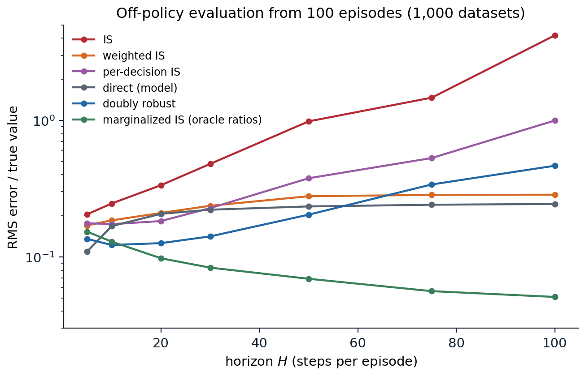
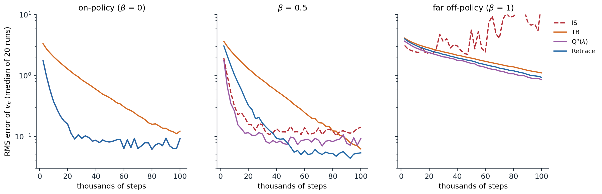

[Background Notes](../README.md) › [Reinforcement Learning](README.md)

# 9. Off-Policy Learning

[← 8. Multi-Step Bootstrapping and Eligibility Traces](08-multi-step-bootstrapping-and-eligibility-traces.md) · [10. Planning and Learning with Tabular Models →](10-planning-and-learning-with-tabular-models.md)

## <a id="learning-about-one-policy-from-another"></a>Learning about one policy from another

### <a id="why-learn-off-policy"></a>Why learn off-policy

An agent learns **off-policy** when the data it learns from were generated by a **behavior policy** $`b`$ that differs from the **target policy** $`\pi`$ whose values it wants. The previous chapters met the idea three times: off-policy Monte Carlo with importance sampling (chapter 5), Q-learning, which needs no correction for one step (chapter 7), and Watkins's Q(λ), which cuts its traces after exploratory actions (chapter 8). This chapter develops the subject in general. It matters for several reasons:

- **Control while exploring.** The target is the greedy policy and the behavior explores, which is the setting of every value-based control method.
- **Learning from other sources.** The data may come from human demonstrations, from older versions of the agent stored in a replay buffer (chapter 16), or from a fixed log with no further interaction (chapter 26).
- **Evaluation before deployment.** A hospital, a recommender system, or a robot operator wants to know how a new policy would perform before trying it, from data collected by the current one. This is **off-policy evaluation**, the sequential version of the bandit problem in chapter 4.
- **Many predictions at once.** One stream of experience can train many value functions for many target policies in parallel, as in the Horde architecture ([Sutton et al., 2011](https://dl.acm.org/doi/10.5555/2031678.2031726)), each answering a question such as "how much light will I see if I turn toward the window?".

Every method needs **coverage**: $`\pi(a\mid s)>0`$ must imply $`b(a\mid s)>0`$, since no amount of data can reveal the consequences of an action the behavior never takes. When coverage fails, off-policy learning must rely on extrapolation, which is the central difficulty of offline reinforcement learning.

### <a id="importance-sampling-for-returns"></a>Importance sampling for returns

The basic correction is importance sampling. The probability of a trajectory after time $`t`$ under $`\pi`$, relative to $`b`$, is the **importance-sampling ratio**

```math
\rho_{t:h}=\prod_{k=t}^{h}\frac{\pi(A_k\mid S_k)}{b(A_k\mid S_k)},
```

in which the unknown transition probabilities cancel. Weighting the return by the ratio corrects its expectation, $`\mathbb E_b[\rho_{t:T-1}G_t\mid S_t=s]=v_\pi(s)`$. Chapter 5 introduced **ordinary importance sampling**, which averages the weighted returns and is unbiased, and **weighted importance sampling**, which divides by the sum of the weights instead of their number and is biased but consistent, with much lower variance. It also noted that each reward needs only the ratios of the actions before it, which gives **per-decision importance sampling** ([Precup, Sutton, and Singh, 2000](https://scholarworks.umass.edu/cs_faculty_pubs/80/)):

```math
\hat v_\pi(s)=\frac1N\sum_{i=1}^N\sum_{k=0}^{T_i-1}\gamma^k\rho^{(i)}_{0:k}R^{(i)}_{k+1}.
```

All three are simple and assume nothing about the environment. Their weakness is variance.

## <a id="the-variance-of-importance-sampling"></a>The variance of importance sampling

### <a id="products-of-ratios"></a>Products of ratios

Each ratio has expectation one under the behavior, $`\mathbb E_b[\pi(A\mid s)/b(A\mid s)]=\sum_a\pi(a\mid s)=1`$, but its second moment exceeds one:

```math
\mathbb E_b\Bigl[\Bigl(\frac{\pi(A\mid s)}{b(A\mid s)}\Bigr)^2\Bigr]=\sum_a\frac{\pi(a\mid s)^2}{b(a\mid s)}=1+\chi^2\bigl(\pi(\cdot\mid s)\,\big\|\,b(\cdot\mid s)\bigr),
```

where $`\chi^2`$ is the chi-squared divergence between the two action distributions. In a product of $`H`$ ratios, the second moments multiply (exactly so when the factors are independent), and the variance of the product grows like $`(1+\chi^2)^H-1`$, exponentially in the horizon. A target and a behavior that differ by a few percent at each step become exponentially different over long trajectories: the product is almost always small and occasionally enormous.

The extreme case is common in control. If $`\pi`$ is greedy and $`b`$ is ε-greedy with $`k`$ actions, the ratio at each step is $`1/(1-\varepsilon+\varepsilon/k)`$ if the behavior took the greedy action and 0 otherwise. A trajectory of $`H`$ steps has a nonzero weight only if every action was greedy, with probability $`(1-\varepsilon+\varepsilon/k)^H`$, and then its weight is the inverse of that probability. With $`\varepsilon=0.1`$, four actions, and $`H=100`$, about one trajectory in 2,400 counts, and it counts 2,400 times (exercise 9.1).

### <a id="control-variates-and-doubly-robust-estimators"></a>Control variates and doubly robust estimators

Variance can be reduced with a **control variate**: a quantity with known expectation, subtracted from the estimate to cancel part of its noise. In off-policy learning the natural control variates are the current value estimates. The n-step off-policy return with control variates, defined recursively,

```math
G_{t:h}=\rho_t\bigl(R_{t+1}+\gamma G_{t+1:h}\bigr)+(1-\rho_t)V(S_t),
```

replaces the return by the estimate $`V(S_t)`$ where the behavior's action is unlikely under the target, instead of by 0 as ordinary importance sampling effectively does. The added term has expectation zero, since $`\mathbb E_b[1-\rho_t\mid S_t]=0`$, so the return stays unbiased in expectation, and when $`V`$ is accurate it removes the variance caused by the ratio's fluctuations around one, though not the variance caused by which action was sampled (exercise 9.2).

The **doubly robust** estimator of [Jiang and Li (2016)](https://arxiv.org/abs/1511.03722) applies the same idea to off-policy evaluation with an approximate model of the action values $`\hat Q`$, from which $`\hat V(s)=\sum_a\pi(a\mid s)\hat Q(s,a)`$. Defined backward from the end of the trajectory, with $`\hat v_{\text{DR}}^{(T)}=0`$,

```math
\hat v_{\text{DR}}^{(t)}=\hat V(S_t)+\rho_t\bigl(R_{t+1}+\gamma\,\hat v_{\text{DR}}^{(t+1)}-\hat Q(S_t,A_t)\bigr).
```

It extends the bandit estimator of chapter 4 to sequences. It is unbiased whatever the model, if the ratios are correct, and its variance is low when the model is accurate: with $`\hat Q=q_\pi`$, the only remaining variance comes from the randomness of rewards and transitions, weighted by the ratios, which Jiang and Li show matches the Cramér–Rao lower bound for unbiased estimators on tree-structured problems (exercise 9.5). Weighted versions and blends of the doubly robust and model-based estimates, such as MAGIC ([Thomas and Brunskill, 2016](https://arxiv.org/abs/1604.00923)), trade a little bias for further variance reduction. The **direct method**, which simply reports $`\hat V(S_0)`$, reweights nothing and so has low variance, which comes only from the data used to fit the model, but it inherits every error of the model, and model errors compound with the horizon.

### <a id="the-curse-of-horizon"></a>The curse of horizon

The code compares these estimators on a random MDP with 10 states and 3 actions. The target policy is a random stochastic policy, and the behavior takes the target's action half the time and a uniformly random one otherwise. Each estimator sees 100 episodes of $`H`$ steps, the model for the direct and doubly robust methods is fitted to 500 separate transitions, and the error is measured over 1,000 independent datasets.

```python
import numpy as np

# The curse of horizon in off-policy evaluation. A random MDP (10 states, 3 actions) with noisy rewards; estimate
# the expected sum of rewards of a target policy pi over H steps from 100 episodes of a behavior policy mu.
# Estimators: ordinary (trajectory) IS, weighted IS, per-decision IS, the direct method with a model fitted to
# 500 separate transitions, the doubly robust estimator built from the same model, and marginalized IS with the exact ratios
# of the state distributions at each step (an oracle: in practice they must be estimated). RMS error over 1,000
# datasets.
nS, nA, N, reps = 10, 3, 100, 1000
rng = np.random.default_rng(0)
P = rng.dirichlet(0.5 * np.ones(nS), size=(nS, nA))
R = rng.normal(0, 1, (nS, nA))
pi = np.exp(rng.normal(size=(nS, nA))); pi /= pi.sum(1, keepdims=True)
mu = 0.5 * pi + 0.5 / nA                                     # half target policy, half uniform
chi2 = (pi ** 2 / mu).sum(1) - 1
print(f"per-step E_mu[rho^2] = 1 + chi^2 ranges over states from {1 + chi2.min():.3f} to {1 + chi2.max():.3f}")


def q_values(H, P, R):                                       # Q_h for h = 0..H steps to go, by backward induction
    Q = [np.zeros((nS, nA))]
    for _ in range(H):
        Q.append(R + P @ (pi * Q[-1]).sum(1))
    return Q


counts, rsum, s = np.full((nS, nA, nS), 0.1), np.zeros((nS, nA)), 0      # fit a model to 500 behavior transitions
for t in range(500):
    s = 0 if t % 50 == 0 else s
    a = rng.choice(nA, p=mu[s]); s2 = rng.choice(nS, p=P[s, a])
    counts[s, a, s2] += 1; rsum[s, a] += R[s, a] + rng.normal(); s = s2
n_sa = counts.sum(2) - 0.1 * nS
P_hat, R_hat = counts / counts.sum(2, keepdims=True), rsum / np.maximum(n_sa, 1)


for H in [5, 10, 20, 50, 100]:
    Q, Q_hat = q_values(H, P, R), q_values(H, P_hat, R_hat)
    d_pi, d_mu = [np.eye(nS)[0]], [np.eye(nS)[0]]               # state distributions at each step
    for _ in range(H):
        d_pi.append(np.einsum("s,sa,sat->t", d_pi[-1], pi, P)); d_mu.append(np.einsum("s,sa,sat->t", d_mu[-1], mu, P))
    B = N * reps
    s = np.zeros(B, int)                                      # every episode starts in state 0
    rho, G, pdis, dr, mis = np.ones(B), np.zeros(B), np.zeros(B), np.zeros(B), np.zeros(B)
    for t in range(H):
        a = (mu[s].cumsum(1) > rng.random((B, 1))).argmax(1)
        r = R[s, a] + rng.normal(0, 1, B)
        h = H - t                                             # steps to go, including this one
        v_hat = (pi[s] * Q_hat[h][s]).sum(1)
        dr += rho * v_hat                                     # DR: rho_{0:t-1} V_hat(S_t) + rho_{0:t} (R - Q_hat(S_t, A_t))
        rho = rho * pi[s, a] / mu[s, a]
        dr += rho * (r - Q_hat[h][s, a])
        pdis += rho * r
        mis += d_pi[t][s] / d_mu[t][s] * pi[s, a] / mu[s, a] * r   # weight of (S_t, A_t) alone, not of the path
        G += r
        s = (P[s, a].cumsum(1) > rng.random((B, 1))).argmax(1)
    truth = (pi[0] * Q[H][0]).sum()
    est = {"IS": (rho * G).reshape(reps, N).mean(1),
           "weighted IS": (rho * G).reshape(reps, N).sum(1) / rho.reshape(reps, N).sum(1),
           "per-decision IS": pdis.reshape(reps, N).mean(1),
           "direct (model)": np.full(reps, (pi[0] * Q_hat[H][0]).sum()),
           "doubly robust": dr.reshape(reps, N).mean(1),
           "marginalized IS": mis.reshape(reps, N).mean(1)}
    print(f"H = {H:3d}, true value {truth:5.2f}; RMS error: "
          + ", ".join(f"{k} {np.sqrt(((v - truth) ** 2).mean()):.2f}" for k, v in est.items()))
# per-step E_mu[rho^2] = 1 + chi^2 ranges over states from 1.005 to 1.202
# H =   5, true value  2.04; RMS error: IS 0.42, weighted IS 0.35, per-decision IS 0.36, direct (model) 0.22, doubly robust 0.28, marginalized IS 0.31
# H =  10, true value  3.41; RMS error: IS 0.84, weighted IS 0.63, per-decision IS 0.59, direct (model) 0.57, doubly robust 0.42, marginalized IS 0.44
# H =  20, true value  6.15; RMS error: IS 2.06, weighted IS 1.29, per-decision IS 1.12, direct (model) 1.27, doubly robust 0.78, marginalized IS 0.60
# H =  50, true value 14.36; RMS error: IS 13.38, weighted IS 3.87, per-decision IS 5.11, direct (model) 3.37, doubly robust 2.68, marginalized IS 0.97
# H = 100, true value 28.05; RMS error: IS 241.94, weighted IS 8.32, per-decision IS 55.57, direct (model) 6.86, doubly robust 23.19, marginalized IS 1.42
```

The per-step divergence is mild: the second moment of a single ratio is at most about 1.2. Over short horizons all estimators are comparable. Over long ones, ordinary importance sampling explodes, its error growing from 0.4 at 5 steps to about 240 at 100 steps, for a true value of 28. Per-decision importance sampling delays the explosion, since early rewards carry short products, and the doubly robust estimator delays it further, but both eventually fail. Weighted importance sampling stays bounded, since it is an average of observed returns, but it is dominated by the few trajectories with the largest weights. The direct method has no variance here, since its model is fitted once to separate data, but its model's errors compound as the horizon grows.

The last estimator avoids the problem. **Marginalized importance sampling** weights each reward by the ratio of the probabilities of reaching the state–action pair at that time under the two policies, $`d^\pi_t(s)\pi(a\mid s)/\bigl(d^b_t(s)b(a\mid s)\bigr)`$, instead of by the probability ratio of the whole path that led there. Many different paths lead to the same state, and averaging over them is what the product of ratios fails to do. With the exact state-distribution ratios, used here as an oracle, the error grows only slowly with the horizon. [Liu, Li, Tang, and Zhou (2018)](https://arxiv.org/abs/1810.12429) named this problem the **curse of horizon** and proposed estimating the stationary ratio $`d_\pi(s)/d_b(s)`$ directly from data, by solving an equation that the true ratio satisfies. Estimators of this kind, such as DualDICE ([Nachum, Chow, Dai, and Li, 2019](https://arxiv.org/abs/1906.04733)), move the difficulty from variance to the estimation of the ratio, which requires function approximation in large problems and brings its own biases.



*Off-policy evaluation over horizons from 5 to 100 steps, from 100 episodes of a behavior that takes the target's action half the time: RMS error relative to the true value, over 1,000 datasets, on a log scale. The trajectory-weighted estimators, ordinary importance sampling, then per-decision importance sampling and the doubly robust estimator, eventually grow exponentially with the horizon; their long-horizon errors are dominated by rare, very large weights and vary from one run of the experiment to another, and this figure, from a separate run with more horizons, shows about half the errors printed above at 100 steps. Weighted importance sampling and the model-based direct method stay bounded but biased. Marginalized importance sampling with the exact state-distribution ratios is barely affected by the horizon: its error grows slowly, and its error relative to the value falls, since the value grows linearly with the horizon.*

## <a id="multi-step-off-policy-learning"></a>Multi-step off-policy learning

### <a id="n-step-methods-with-importance-sampling"></a>n-step methods with importance sampling

The n-step methods of chapter 8 extend to off-policy learning by weighting each n-step update with the ratios of the actions it depends on. For state values, the n-step TD update is weighted by $`\rho_{t:t+n-1}`$; for action values, the first action $`A_t`$ is given, and only the later actions need correction, so n-step SARSA uses

```math
Q(S_t,A_t)\leftarrow Q(S_t,A_t)+\alpha\,\rho_{t+1:t+n}\bigl[G_{t:t+n}-Q(S_t,A_t)\bigr].
```

The off-policy version of n-step Expected SARSA, whose target ends with $`\sum_a\pi(a\mid S_{t+n})Q(S_{t+n},a)`$ instead of the sampled $`Q(S_{t+n},A_{t+n})`$, needs one ratio fewer, $`\rho_{t+1:t+n-1}`$; with $`n=1`$ it needs no ratio at all, and with a greedy target it is one-step Q-learning. For larger $`n`$ these methods inherit the variance of the products, which limits $`n`$, and the control-variate form above reduces it.

### <a id="the-tree-backup-algorithm"></a>The tree-backup algorithm

Importance sampling corrects the sampled actions after the fact. The **tree-backup algorithm** of Precup, Sutton, and Singh avoids them altogether. Its target combines, at each step, the sampled reward with the estimated values of all the actions that were not taken, each weighted by its target probability, and follows the actual trajectory only with the weight of the action that was taken:

```math
G_{t:t+n}=R_{t+1}+\gamma\sum_{a\ne A_{t+1}}\pi(a\mid S_{t+1})Q(S_{t+1},a)+\gamma\,\pi(A_{t+1}\mid S_{t+1})\,G_{t+1:t+n},
```

with $`G_{t:t+1}`$ the one-step Expected SARSA target. The name describes the backup diagram, a tree in which the leaves are the untaken actions at every level. The target contains no ratios and so has low variance, and it is a valid estimate of $`q_\pi`$ whatever the behavior (exercise 9.3). Its cost is that the continuation of the trajectory is weighted by $`\pi(A_{t+1}\mid S_{t+1})`$, which is less than one whenever the target is stochastic, even when the behavior is the target policy, so tree backup cuts its multi-step credit even on-policy, where there is nothing to correct.

[De Asis, Hernandez-Garcia, Holland, and Sutton (2018)](https://arxiv.org/abs/1703.01327) unified the two approaches in **Q(σ)**, which chooses at each step between sampling the action, with an importance-sampling ratio as in n-step SARSA ($`\sigma=1`$), and taking the expectation over actions, as in tree backup ($`\sigma=0`$), or any mixture of the two. Intermediate values of $`\sigma`$, and $`\sigma`$ decreasing over time, often do better than either extreme.

## <a id="off-policy-eligibility-traces"></a>Off-policy eligibility traces

### <a id="a-general-form"></a>A general form

The λ-return versions of these methods fit a common template. Every method evaluates $`q_\pi`$ with the Expected SARSA TD error,

```math
\delta_t=R_{t+1}+\gamma\sum_a\pi(a\mid S_{t+1})Q(S_{t+1},a)-Q(S_t,A_t),
```

and credits it back along the trajectory through traces that decay by $`\gamma c_t`$ at each step, where the **trace coefficient** $`c_t`$ is chosen by the method. In the forward view of [Munos, Stepleton, Harutyunyan, and Bellemare (2016)](https://arxiv.org/abs/1606.02647), the update to the value of the pair that starts a trajectory is

```math
\Delta Q(S_0,A_0)=\sum_{t\ge0}\gamma^t\Bigl(\prod_{k=1}^tc_k\Bigr)\delta_t.
```

Four choices of $`c_k`$, each a function of the action $`A_k`$ taken at step $`k`$, give four known algorithms:

| Method | Trace coefficient $`c_k`$ | Variance | Safe for any behavior | Efficient near on-policy |
| --- | --- | --- | --- | --- |
| Importance sampling | $`\lambda\,\pi(A_k\mid S_k)/b(A_k\mid S_k)`$ | can be unbounded | yes | yes |
| Tree backup, TB(λ) | $`\lambda\,\pi(A_k\mid S_k)`$ | low | yes | no |
| $`Q^\pi(\lambda)`$ | $`\lambda`$ | low | no | yes |
| Retrace(λ) | $`\lambda\min\bigl(1,\pi(A_k\mid S_k)/b(A_k\mid S_k)\bigr)`$ | low | yes | yes |

Importance sampling corrects exactly but multiplies ratios that can be large. Tree backup multiplies target probabilities, which are at most one, and so has low variance, but it cuts the traces even when the behavior is the target. **$`Q^\pi(\lambda)`$** ([Harutyunyan, Bellemare, Stepleton, and Munos, 2016](https://arxiv.org/abs/1602.04951)) never cuts, like the naive Q(λ) of chapter 8, and has a convergence guarantee only when the two policies are close, specifically when $`\max_s\|\pi(\cdot\mid s)-b(\cdot\mid s)\|_1<(1-\gamma)/(\lambda\gamma)`$, a sufficient condition, not a necessary one. **Retrace(λ)** truncates the importance-sampling ratio at one: when the behavior took an action more often than the target would, the trace shrinks by the ratio, as importance sampling would shrink it; when the behavior took it less often, the trace is not enlarged, which bounds the variance at the price of cutting some credit that importance sampling would have given.

Munos et al. showed that for any trace coefficients with $`0\le c_k\le\pi(A_k\mid S_k)/b(A_k\mid S_k)`$, the expected update is a contraction toward $`q_\pi`$ with modulus at most $`\gamma`$, whatever the behavior ([Appendix B](#block-rl09-appendix-b)). Retrace satisfies the condition with coefficients that never exceed $`\lambda`$, and with $`\lambda=1`$ they are the largest coefficients that satisfy it without exceeding one, so it is **safe**, converging for any behavior, and **efficient**, since near on-policy the ratio is close to one and the traces are rarely cut. In control, with target policies that become increasingly greedy, Retrace converges to $`q_*`$ without requiring the behavior to become greedy, and as a corollary the analysis proved the convergence of Watkins's Q(λ), an open problem since 1989.

### <a id="comparing-the-traces"></a>Comparing the traces

The code evaluates a stochastic target policy on a random MDP from behaviors at three distances from it: the target itself ($`\beta=0`$), an even mixture of the target and another policy ($`\beta=0.5`$), and the other policy alone ($`\beta=1`$). All four methods use the same TD error, step size, and data, and differ only in their trace coefficients, with $`\lambda=1`$.

```python
import numpy as np

# Off-policy evaluation of q_pi with eligibility traces (the Retrace family). A random MDP with 10 states and
# 3 actions, gamma = 0.9; a stochastic target policy pi; behavior mu = (1 - beta) pi + beta nu for another
# policy nu, so beta measures how far the behavior is from the target. Every method uses the same TD error
# delta_t = R + gamma * sum_a pi(a|S') Q(S', a) - Q(S, A) and decays its traces by gamma * c_t, with
#   IS: c = lambda * pi/mu,  TB: c = lambda * pi,  Q^pi(lambda): c = lambda,  Retrace: c = lambda * min(1, pi/mu).
nS, nA, gamma, lam, alpha = 10, 3, 0.9, 1.0, 0.01
rng = np.random.default_rng(0)
P = rng.dirichlet(0.5 * np.ones(nS), size=(nS, nA))          # P[s, a] is the next-state distribution
R = rng.normal(0, 1, (nS, nA))
pi = np.exp(2 * rng.normal(size=(nS, nA))); pi /= pi.sum(1, keepdims=True)
nu = rng.dirichlet(np.ones(nA), size=nS)
P_pi = np.einsum("sat,tb->satb", P, pi).reshape(nS * nA, nS * nA)
q_pi = np.linalg.solve(np.eye(nS * nA) - gamma * P_pi, R.ravel()).reshape(nS, nA)
v_pi = (pi * q_pi).sum(1)
methods = ["IS", "TB", "Q^pi(lambda)", "Retrace"]


def evaluate(beta, runs=20, steps=100_000, T=50, report=(10_000, 100_000)):
    mu = (1 - beta) * pi + beta * nu
    M, n = len(methods), np.arange(runs)
    Q, z, errors = np.zeros((M, runs, nS, nA)), np.zeros((M, runs, nS, nA)), []
    s = rng.integers(nS, size=runs)
    a = (mu[s].cumsum(1) > rng.random((runs, 1))).argmax(1)
    for t in range(steps):
        s2 = (P[s, a].cumsum(1) > rng.random((runs, 1))).argmax(1)
        a2 = (mu[s2].cumsum(1) > rng.random((runs, 1))).argmax(1)
        delta = R[s, a] + gamma * (pi[s2] * Q[:, n, s2]).sum(-1) - Q[:, n, s, a]
        z[:, n, s, a] += 1
        Q += alpha * delta[:, :, None, None] * z
        ratio = pi[s2, a2] / mu[s2, a2]
        c = lam * np.stack([ratio, pi[s2, a2], np.ones(runs), np.minimum(1, ratio)])
        z *= gamma * c[:, :, None, None]
        if (t + 1) % T == 0:                                   # a new episode from a random state
            z[:] = 0
            s2 = rng.integers(nS, size=runs); a2 = (mu[s2].cumsum(1) > rng.random((runs, 1))).argmax(1)
        s, a = s2, a2
        if t + 1 in report:                                    # RMS error of the implied state values
            err = np.sqrt((((pi * Q).sum(-1) - v_pi) ** 2).mean(-1))
            errors.append(np.median(np.where(np.isfinite(err), err, np.inf), 1))
    return errors


print(f"largest L1 distance between pi and nu: {np.abs(pi - nu).sum(1).max():.2f};"
      f" Q^pi(lambda) is guaranteed to converge if it is below (1 - gamma)/(lambda gamma) = {(1 - gamma) / gamma:.2f}")
with np.errstate(all="ignore"):
    for beta in [0.0, 0.5, 1.0]:
        early, late = evaluate(beta)
        print(f"beta = {beta:3.1f}: median RMS error of v_pi after 10,000 / 100,000 steps")
        print("   " + ";  ".join(f"{m} {x:.2f} / {y:.2f}" for m, x, y in zip(methods, early, late)))
# largest L1 distance between pi and nu: 1.50; Q^pi(lambda) is guaranteed to converge if it is below (1 - gamma)/(lambda gamma) = 0.11
# beta = 0.0: median RMS error of v_pi after 10,000 / 100,000 steps
#    IS 0.37 / 0.09;  TB 2.03 / 0.12;  Q^pi(lambda) 0.37 / 0.09;  Retrace 0.37 / 0.09
# beta = 0.5: median RMS error of v_pi after 10,000 / 100,000 steps
#    IS 0.32 / 0.14;  TB 2.18 / 0.06;  Q^pi(lambda) 0.26 / 0.09;  Retrace 1.03 / 0.05
# beta = 1.0: median RMS error of v_pi after 10,000 / 100,000 steps
#    IS 2.45 / 16.05;  TB 3.36 / 1.11;  Q^pi(lambda) 2.87 / 0.86;  Retrace 3.16 / 0.94
```

On-policy, the ratios are all one, and importance sampling, $`Q^\pi(\lambda)`$, and Retrace are the same algorithm; tree backup is far slower, because it cuts its traces by the target probabilities at every step, and after 10,000 steps its error is more than five times theirs. At $`\beta=0.5`$ Retrace ends with the lowest error, while importance sampling is held back by the variance of its traces. Far off-policy, importance sampling diverges, and the other three learn slowly: the behavior rarely takes the actions that the target prefers, so every method has few relevant samples, whatever its traces. $`Q^\pi(\lambda)`$ does not diverge here, although the distance between the policies is far beyond its guarantee; the guarantee is sufficient, not necessary, but nothing protects it on other problems.



*Off-policy evaluation of $`q_\pi`$ with four trace coefficients, all with $`\lambda=1`$, $`\gamma=0.9`$, and $`\alpha=0.01`$: the median RMS error of the implied state values over 20 runs, on a log scale. Left: on-policy, where importance sampling, $`Q^\pi(\lambda)`$, and Retrace coincide (only Retrace is visible) and tree backup is slowed by cutting its traces. Middle: at an intermediate distance, importance sampling plateaus at a higher error because of its variance, and Retrace reaches the lowest. Right: far off-policy, the importance-sampling traces make the estimates diverge, and the three bounded methods learn slowly from the few relevant samples.*

### <a id="retrace-and-its-descendants"></a>Retrace and its descendants

Retrace became a standard component of deep off-policy agents. ACER combines it with an actor–critic and experience replay ([Wang et al., 2017](https://arxiv.org/abs/1611.01224)), Reactor adds prioritized replay of sequences ([Gruslys et al., 2018](https://arxiv.org/abs/1704.04651)), and MPO trains its critic with Retrace targets ([Abdolmaleki et al., 2018](https://arxiv.org/abs/1806.06920)). **V-trace**, the off-policy correction of IMPALA ([Espeholt et al., 2018](https://arxiv.org/abs/1802.01561)), applies the same truncation to state values in a distributed actor–learner architecture, where the actors' policies lag behind the learner's by a few updates, and is developed in chapter 19. In control with a greedy target policy, the ratio is zero for every non-greedy action and at least one for the greedy action, so both tree backup and Retrace reduce to Watkins's Q(λ) (exercise 9.4).

## <a id="off-policy-learning-with-function-approximation"></a>Off-policy learning with function approximation

Everything in this chapter so far is tabular, and in the tabular case off-policy TD methods converge under the usual conditions. With function approximation they can diverge. Off-policy updates follow the behavior's distribution of states, which can put weight where the target policy rarely goes, and bootstrapping from approximate values then feeds errors back into their own targets. The combination of **function approximation, bootstrapping, and off-policy learning**, the **deadly triad**, is the subject of chapter 12, with Baird's counterexample, gradient-TD methods, and **emphatic TD** ([Sutton, Mahmood, and White, 2016](https://jmlr.org/papers/v17/14-488.html)), which reweights each update by a "followon" trace of discounted importance ratios, emphasizing the states the target policy would reach from the states the behavior visits, so that the expected update becomes stable with linear function approximation, at the cost of more variance.

The trace coefficients of this chapter address a different problem, the variance and bias of multi-step targets, and they do not remove the instability of the deadly triad. Deep agents manage it with target networks, replay, and pessimism, discussed in Part II.

## <a id="off-policy-evaluation-in-practice"></a>Off-policy evaluation in practice

Off-policy evaluation from logged data is used where trying a policy is costly or dangerous, and the evidence from benchmarks is sobering. In the empirical study of [Voloshin, Le, Jiang, and Yue (2019)](https://arxiv.org/abs/1911.06854), no single estimator or class of estimators was best across environments; long horizons, a large mismatch between the policies, and stochastic environments hurt every method, and especially those built on importance weights; and direct methods, in particular **fitted Q evaluation**, which learns $`q_\pi`$ from the log by repeated regression on bootstrapped targets ([Le, Voloshin, and Yue, 2019](https://arxiv.org/abs/1903.08738)), were often competitive with the importance-weighted and doubly robust ones, fitted Q evaluation being the best choice when data were scarce. A learned model of the dynamics, by contrast, was sometimes among the weakest direct methods. The deep OPE benchmarks of [Fu et al. (2021)](https://arxiv.org/abs/2103.16596) reached similar conclusions for continuous control, where fitted Q evaluation was among the strongest methods.

Several practical lessons follow. The behavior's action probabilities must be logged, or estimated, which introduces its own error. Coverage should be checked: a target that takes actions the log rarely contains cannot be evaluated reliably by any method. Confidence intervals matter as much as point estimates, and high-confidence lower bounds from concentration inequalities ([Thomas, Theocharous, and Ghavamzadeh, 2015](https://ojs.aaai.org/index.php/AAAI/article/view/9541)) make the decision to deploy explicit. In healthcare, where off-policy evaluation has been applied to treatments such as sepsis management, unobserved confounding and small effective sample sizes can make confident-looking estimates meaningless, and [Gottesman et al. (2019)](https://doi.org/10.1038/s41591-018-0310-5) give guidelines for reporting them transparently: the effective sample size, the behavior's coverage of the target's actions, and the sensitivity of the conclusion to the modeling choices. The broader problem of learning policies, not just evaluating them, from fixed data is **offline reinforcement learning** (chapter 26).

## <a id="exercises"></a>Exercises

### <a id="exercise-9-1-the-cost-of-a-greedy-target"></a>Exercise 9.1 — The cost of a greedy target

Let the target $`\pi`$ be greedy and the behavior $`b`$ be ε-greedy with respect to the same action values, with $`k`$ actions. (a) Show that the importance-sampling ratio of an $`H`$-step trajectory is $`(1-\varepsilon+\varepsilon/k)^{-H}`$ if all its actions are greedy and 0 otherwise. (b) For $`\varepsilon=0.1`$ and $`k=4`$, how many trajectories out of 1,000 have nonzero weight when $`H=10`$, 50, and 100? (c) Compute $`\mathbb E_b[\rho^2]`$ and the variance of $`\rho`$.


<details>
<summary><b>Solution</b></summary>


(a) Each factor is $`\pi(A\mid S)/b(A\mid S)`$, which is $`1/(1-\varepsilon+\varepsilon/k)`$ for the greedy action and 0 for any other, since $`\pi`$ puts no probability on it. The product is nonzero only if all $`H`$ actions are greedy.

(b) $`p=1-\varepsilon+\varepsilon/k=0.925`$, and all $`H`$ actions are greedy with probability $`p^H`$: 0.46 for $`H=10`$, 0.020 for $`H=50`$, and 0.00041 for $`H=100`$. Out of 1,000 trajectories, about 459, 20, and 0.4 have nonzero weight, the last with weight $`p^{-100}\approx2{,}430`$. With 1,000 trajectories and $`H=100`$, ordinary importance sampling returns 0 about two times in three, and otherwise usually a single return multiplied by 2,430 and divided by 1,000, about 2.4 times that return.

(c) $`\mathbb E_b[\rho]=p^H\cdot p^{-H}=1`$ and $`\mathbb E_b[\rho^2]=p^H\cdot p^{-2H}=p^{-H}`$, so $`\operatorname{Var}_b(\rho)=p^{-H}-1`$, about 2,430 for $`H=100`$. The per-step second moment is $`1/p=1+\chi^2`$, with $`\chi^2=(1-p)/p\approx0.081`$, and it compounds exponentially. Weighted importance sampling avoids the scale problem, since the common factor $`p^{-H}`$ cancels in the ratio, but with no nonzero weights it has nothing to average.

</details>


### <a id="exercise-9-2-control-variates"></a>Exercise 9.2 — Control variates

(a) Show that the control-variate return $`G_{t:h}=\rho_t(R_{t+1}+\gamma G_{t+1:h})+(1-\rho_t)V(S_t)`$, with $`G_{h:h}=V(S_h)`$, has the same expectation under the behavior as the plain importance-sampling return $`\rho_t(R_{t+1}+\gamma G_{t+1:h})`$, and that if $`V=v_\pi`$ its expectation is $`v_\pi(S_t)`$. (b) Consider one step, $`h=t+1`$, with $`V=v_\pi`$ exact and deterministic rewards and transitions. Does the control-variate return have zero variance? If not, which control variate would give zero variance?


<details>
<summary><b>Solution</b></summary>


(a) Given $`S_t`$, the added term $`(1-\rho_t)V(S_t)`$ has expectation $`V(S_t)\,\mathbb E_b[1-\rho_t\mid S_t]=0`$, since $`\mathbb E_b[\rho_t\mid S_t]=\sum_a\pi(a\mid S_t)=1`$. For the second claim, by induction backward from $`h`$: if $`\mathbb E_b[G_{t+1:h}\mid S_{t+1}]=v_\pi(S_{t+1})`$, then $`\mathbb E_b[\rho_t(R_{t+1}+\gamma G_{t+1:h})\mid S_t]=\sum_a\pi(a\mid S_t)\,\mathbb E[R_{t+1}+\gamma v_\pi(S_{t+1})\mid S_t,a]=v_\pi(S_t)`$.

(b) With deterministic dynamics, $`R_{t+1}+\gamma v_\pi(S_{t+1})=q_\pi(S_t,A_t)`$. The plain return is $`\rho_tq_\pi(S_t,A_t)`$, which varies with the action. The control-variate return is $`\rho_tq_\pi(S_t,A_t)+(1-\rho_t)v_\pi(S_t)=v_\pi(S_t)+\rho_t\bigl(q_\pi(S_t,A_t)-v_\pi(S_t)\bigr)`$, which still varies with the action, though less when the action values are close to the state value. So the variance is not zero in general; it is zero only if all actions have the same value. The correct zero-variance form uses action values as the control variate, $`\hat v=\sum_a\pi(a\mid S_t)q_\pi(S_t,a)+\rho_t\bigl(R_{t+1}+\gamma v_\pi(S_{t+1})-q_\pi(S_t,A_t)\bigr)`$, which is the doubly robust estimator and equals $`v_\pi(S_t)`$ exactly under deterministic dynamics. State-value control variates remove the variance due to the ratio's fluctuations around one, and action-value control variates also remove the variance due to which action was sampled.

</details>


### <a id="exercise-9-3-tree-backup"></a>Exercise 9.3 — Tree backup

(a) Show that the one-step tree-backup target is the Expected SARSA target. (b) Show that if $`Q=q_\pi`$, the expectation of the n-step tree-backup return is $`q_\pi(S_t,A_t)`$ under any behavior. For an arbitrary $`Q`$, does its expectation depend on the behavior? (c) Write the n-step tree-backup error as a sum of Expected SARSA TD errors, and identify its trace coefficient.


<details>
<summary><b>Solution</b></summary>


(a) With $`n=1`$, $`G_{t:t+1}=R_{t+1}+\gamma\sum_a\pi(a\mid S_{t+1})Q(S_{t+1},a)`$, the Expected SARSA target.

(b) By induction on $`n`$. For $`n=1`$ the target does not involve the behavior, and at $`Q=q_\pi`$ its expectation is $`\mathbb E[R_{t+1}+\gamma v_\pi(S_{t+1})\mid S_t,A_t]=q_\pi(S_t,A_t)`$. For $`n>1`$, adding and subtracting $`\gamma\pi(A_{t+1}\mid S_{t+1})Q(S_{t+1},A_{t+1})`$ gives

```math
G_{t:t+n}=R_{t+1}+\gamma\sum_a\pi(a\mid S_{t+1})Q(S_{t+1},a)+\gamma\,\pi(A_{t+1}\mid S_{t+1})\bigl[G_{t+1:t+n}-Q(S_{t+1},A_{t+1})\bigr].
```

At $`Q=q_\pi`$, the induction hypothesis says that the bracket has conditional expectation zero given $`(S_{t+1},A_{t+1})`$, whichever action the behavior chose, so the expected target is $`\mathbb E[R_{t+1}+\gamma v_\pi(S_{t+1})\mid S_t,A_t]=q_\pi(S_t,A_t)`$ for any behavior. For an arbitrary $`Q`$ the bracket does not vanish, and its average over $`A_{t+1}\sim b`$ depends on the behavior: away from the fixed point, the expected tree-backup target differs from one behavior to another, but the fixed point, $`q_\pi`$, is the same for all of them.

(c) Write $`\delta_k=R_{k+1}+\gamma\sum_a\pi(a\mid S_{k+1})Q(S_{k+1},a)-Q(S_k,A_k)`$. Then $`G_{t:t+n}-Q(S_t,A_t)=\delta_t+\gamma\pi(A_{t+1}\mid S_{t+1})\bigl(G_{t+1:t+n}-Q(S_{t+1},A_{t+1})\bigr)`$, and unrolling gives $`\sum_{k=t}^{t+n-1}\gamma^{k-t}\bigl(\prod_{i=t+1}^k\pi(A_i\mid S_i)\bigr)\delta_k`$: the trace coefficient is $`c_i=\pi(A_i\mid S_i)`$, or $`\lambda\pi(A_i\mid S_i)`$ for TB(λ).

</details>


### <a id="exercise-9-4-retrace-with-a-greedy-target"></a>Exercise 9.4 — Retrace with a greedy target

(a) Show that with a greedy target policy, both TB(λ) and Retrace(λ) are Watkins's Q(λ). (b) Why do Munos et al. analyze control with a sequence of target policies that are only increasingly greedy? (c) What does this suggest for an agent that explores with ε-greedy behavior?


<details>
<summary><b>Solution</b></summary>


(a) With $`\pi`$ greedy, $`\sum_a\pi(a\mid s')Q(s',a)=\max_aQ(s',a)`$, so the TD error is the Q-learning error. The trace coefficient of TB(λ) is $`\lambda\pi(A_k\mid S_k)`$, which is $`\lambda`$ if $`A_k`$ is greedy and 0 otherwise; Retrace's is $`\lambda\min(1,\pi/b)`$, and $`\pi/b=1/b(A_k\mid S_k)\ge1`$ for the greedy action and 0 otherwise, so it is the same. Traces decay by $`\gamma\lambda`$ and are cut after non-greedy actions: Watkins's Q(λ).

(b) A greedy target cuts the traces at every exploratory action, which makes the multi-step benefit small when exploration is frequent. A target that is ε-greedy with a small ε keeps the ratios positive for every action and cuts less. Letting the targets become greedy in the limit is what makes the fixed point $`q_*`$ rather than the value of an ε-greedy policy.

(c) Using a target that is slightly soft, for example ε-greedy with a smaller ε than the behavior's, keeps longer traces at little cost in bias, and annealing its ε toward 0 recovers $`q_*`$. Deep agents that use Retrace or V-trace with stochastic policies are in this regime.

</details>


### <a id="exercise-9-5-the-doubly-robust-estimator-with-a-perfect-model"></a>Exercise 9.5 — The doubly robust estimator with a perfect model

Rerun the chapter's curse-of-horizon experiment with the doubly robust estimator given the exact action values, $`\hat Q=Q`$, once with the original noisy rewards and once with deterministic rewards. Why does its error still grow with the horizon?


<details>
<summary><b>Solution</b></summary>


```python
import numpy as np

# The doubly robust estimator with a perfect model: the setting of the chapter's curse-of-horizon experiment,
# with Q_hat = Q exactly, once with the noisy rewards and random transitions of the original MDP and once with
# deterministic rewards. RMS error over 1,000 datasets of 100 episodes.
nS, nA, N, reps = 10, 3, 100, 1000
rng = np.random.default_rng(0)
P = rng.dirichlet(0.5 * np.ones(nS), size=(nS, nA))
R = rng.normal(0, 1, (nS, nA))
pi = np.exp(rng.normal(size=(nS, nA))); pi /= pi.sum(1, keepdims=True)
mu = 0.5 * pi + 0.5 / nA


def q_values(H):
    Q = [np.zeros((nS, nA))]
    for _ in range(H):
        Q.append(R + P @ (pi * Q[-1]).sum(1))
    return Q


for reward_noise in [1.0, 0.0]:
    for H in [10, 50, 100]:
        Q, B = q_values(H), N * reps
        s, rho, dr, pdis = np.zeros(B, int), np.ones(B), np.zeros(B), np.zeros(B)
        for t in range(H):
            a = (mu[s].cumsum(1) > rng.random((B, 1))).argmax(1)
            r = R[s, a] + reward_noise * rng.normal(0, 1, B)
            dr += rho * (pi[s] * Q[H - t][s]).sum(1)
            rho = rho * pi[s, a] / mu[s, a]
            dr += rho * (r - Q[H - t][s, a]); pdis += rho * r
            s = (P[s, a].cumsum(1) > rng.random((B, 1))).argmax(1)
        truth = (pi[0] * Q[H][0]).sum()
        err = lambda x: np.sqrt(((x.reshape(reps, N).mean(1) - truth) ** 2).mean())
        print(f"reward noise {reward_noise:.0f}, H = {H:3d}: RMS error, per-decision IS {err(pdis):6.2f};"
              f" doubly robust with the exact Q {err(dr):5.2f}")
# reward noise 1, H =  10: RMS error, per-decision IS   0.60; doubly robust with the exact Q  0.46
# reward noise 1, H =  50: RMS error, per-decision IS   5.65; doubly robust with the exact Q  3.33
# reward noise 1, H = 100: RMS error, per-decision IS  18.58; doubly robust with the exact Q 10.25
# reward noise 0, H =  10: RMS error, per-decision IS   0.44; doubly robust with the exact Q  0.15
# reward noise 0, H =  50: RMS error, per-decision IS   4.55; doubly robust with the exact Q  1.14
# reward noise 0, H = 100: RMS error, per-decision IS  17.62; doubly robust with the exact Q  3.50
```

With the exact model, the doubly robust estimator removes all the variance due to the random choice of actions: each term $`\rho_{0:t}\bigl(R_{t+1}+\hat V(S_{t+1})-\hat Q(S_t,A_t)\bigr)`$ would be zero if rewards and transitions were deterministic given the state and action. What remains is the randomness of rewards and next states, and each of these surprises is multiplied by the product of ratios up to that time, whose variance grows exponentially. Removing the reward noise reduces the error by about two thirds at 100 steps; the transition noise remains. Jiang and Li show that this remaining variance matches the Cramér–Rao lower bound for unbiased estimators on tree-structured problems, in which every state is reached by a single path. When different paths lead to the same states, as in this MDP, the marginalized estimators can do better by averaging over the paths, which is why they are needed for long horizons.

</details>


### <a id="exercise-9-6-to-cut-or-not-to-cut"></a>Exercise 9.6 — To cut or not to cut

Learn $`q_*`$ for the maze of chapter 8 from a uniformly random behavior with one-step Q-learning, Watkins's Q(λ), and naive Q(λ), which never cuts its traces. Compare the errors and the greedy policies after 20,000 steps.


<details>
<summary><b>Solution</b></summary>


```python
import numpy as np

# Learning q_* of the chapter 8 maze from a uniformly random behavior policy, with one-step Q-learning,
# Watkins's Q(lambda) (traces cut after non-greedy actions), and naive Q(lambda) (the same, with traces never
# cut; it behaves much like Peng's Q(lambda)). Replacing traces, gamma = 0.95, lambda = 0.9,
# alpha = 0.1, reward 1 at the goal; the behavior restarts at the start after reaching the goal.
H, W, start, goal = 6, 9, (2, 0), (0, 8)
walls = {(1, 2), (2, 2), (3, 2), (4, 5), (0, 7), (1, 7), (2, 7)}
moves = [(-1, 0), (1, 0), (0, 1), (0, -1)]
gamma, lam, alpha = 0.95, 0.9, 0.1
cells = [(i, j) for i in range(H) for j in range(W) if (i, j) not in walls and (i, j) != goal]


def step(s, a):
    t = (min(max(s[0] + moves[a][0], 0), H - 1), min(max(s[1] + moves[a][1], 0), W - 1))
    return s if t in walls else t


Q_star = np.zeros((H, W, 4))                                   # q_* by value iteration
for _ in range(500):
    for s in cells:
        for a in range(4):
            s2 = step(s, a)
            Q_star[s][a] = 1.0 if s2 == goal else gamma * Q_star[s2].max()


def learn(method, seed, steps=20_000):
    rng = np.random.default_rng(seed)
    Q, z, s = np.zeros((H, W, 4)), np.zeros((H, W, 4)), start
    for _ in range(steps):
        a = int(rng.integers(4))                               # uniformly random behavior
        greedy = Q[s][a] == Q[s].max()
        s2 = step(s, a); done = s2 == goal
        delta = (1.0 if done else 0.0) + (0.0 if done else gamma * Q[s2].max()) - Q[s][a]
        if method == "Watkins" and not greedy:
            z[:] = 0                                           # the greedy policy would not have taken a
        z[s][a] = 1.0 if method != "Q-learning" else 0.0
        if method == "Q-learning":
            Q[s][a] += alpha * delta
        else:
            Q += alpha * delta * z
            z *= gamma * lam
        s = start if done else s2
        if done:
            z[:] = 0
    err = np.sqrt(np.mean([(Q[c] - Q_star[c]) ** 2 for c in cells]))
    agree = np.mean([Q[c].argmax() == Q_star[c].argmax() or Q_star[c][Q[c].argmax()] == Q_star[c].max() for c in cells])
    return err, agree


for method in ["Q-learning", "Watkins", "naive"]:
    res = np.array([learn(method, seed) for seed in range(10)])
    print(f"{method + ' Q(lambda)' if method != 'Q-learning' else method:18s} after 20,000 random steps: RMS error of Q {res[:, 0].mean():.3f};"
          f" states where the greedy action is optimal {100 * res[:, 1].mean():.0f}%")
# Q-learning         after 20,000 random steps: RMS error of Q 0.504; states where the greedy action is optimal 99%
# Watkins Q(lambda)  after 20,000 random steps: RMS error of Q 0.363; states where the greedy action is optimal 100%
# naive Q(lambda)    after 20,000 random steps: RMS error of Q 0.417; states where the greedy action is optimal 62%
```

Watkins's Q(λ) learns fastest and its greedy policy is optimal everywhere. Although the random behavior takes a greedy action only about a quarter of the time once the values have separated, the short runs of greedy actions still carry credit several steps back, which one-step Q-learning cannot do. Naive Q(λ) has an error comparable to the others but a much worse greedy policy, optimal in only about 60% of the states: by crediting the TD errors of the random behavior's later actions to earlier pairs, it learns a mixture of the values of the random policy and the greedy one, and in a maze the random policy's values point in the wrong direction. When the behavior is far from the target, the bias of uncut traces matters more than their speed, which is why Peng's and naive Q(λ) work well only when the behavior is nearly greedy.

</details>


### <a id="exercise-9-7-every-trace-has-the-right-fixed-point"></a>Exercise 9.7 — Every trace has the right fixed point

Show that for any trace coefficients $`c_k`$, the expected Retrace-style update $`\mathbb E_b\bigl[\sum_{t\ge0}\gamma^t(\prod_{k=1}^tc_k)\delta_t\bigr]`$ is zero for every starting pair when $`Q=q_\pi`$. What, then, distinguishes the choices of $`c_k`$?


<details>
<summary><b>Solution</b></summary>


At $`Q=q_\pi`$, the expected TD error given the pair $`(S_t,A_t)`$ is $`\mathbb E[R_{t+1}+\gamma v_\pi(S_{t+1})\mid S_t,A_t]-q_\pi(S_t,A_t)=0`$, whatever the behavior. The coefficients $`c_1,\dots,c_t`$ depend only on the trajectory up to $`(S_t,A_t)`$, so by the tower property each term $`\gamma^t(\prod_kc_k)\delta_t`$ has expectation $`\mathbb E\bigl[\gamma^t(\prod_kc_k)\,\mathbb E[\delta_t\mid S_t,A_t]\bigr]=0`$. The fixed point is $`q_\pi`$ for every choice. The choices differ in whether $`q_\pi`$ is an attracting fixed point, that is, whether the expected update is a contraction toward it, and in the variance of the sampled update. The condition $`0\le c_k\le\pi(A_k\mid S_k)/b(A_k\mid S_k)`$ guarantees the contraction ([Appendix B](#block-rl09-appendix-b)); $`Q^\pi(\lambda)`$, with $`c_k=\lambda`$, violates it when the policies differ, and importance sampling satisfies it with the largest coefficients but pays in variance.

</details>


## <a id="appendices"></a>Appendices


<details>
<summary><a id="block-rl09-appendix-a"></a><b>A. The variance of importance-sampling estimators</b></summary>


**Products of ratios.** Let $`\rho_{0:H-1}=\prod_{t<H}\rho_t`$ with $`\rho_t=\pi(A_t\mid S_t)/b(A_t\mid S_t)`$, and let $`\chi^2(s)=\chi^2(\pi(\cdot\mid s)\|b(\cdot\mid s))`$. Conditioning on the history and working backward from the last step, each factor contributes $`\mathbb E_b[\rho_t^2\mid S_t]=1+\chi^2(S_t)\ge1+\min_s\chi^2(s)`$, so $`\mathbb E_b[\rho_{0:H-1}^2]\ge(1+\min_s\chi^2(s))^H`$, with equality when every state has the same divergence. Since $`\mathbb E_b[\rho_{0:H-1}]=1`$, the variance of the product is at least $`(1+\min_s\chi^2(s))^H-1`$: exponential in $`H`$ whenever the policies differ in every state.

**Weighted importance sampling.** The estimator $`\sum_i\rho^{(i)}G^{(i)}/\sum_i\rho^{(i)}`$ is a ratio of two unbiased estimators with expectations $`v_\pi`$ and 1. It is biased for finite $`N`$, with bias of order $`1/N`$, consistent as $`N\to\infty`$, and always within the range of the observed returns, so its variance is bounded by the squared range of returns even when the weights have infinite variance. Its effective sample size, $`(\sum_i\rho^{(i)})^2/\sum_i(\rho^{(i)})^2`$, measures how many trajectories it effectively averages, and in long-horizon problems it collapses toward one.

**The doubly robust estimator.** [Jiang and Li (2016)](https://arxiv.org/abs/1511.03722) derive its variance recursively. Write $`\operatorname{Var}_t`$ for the variance given the history before $`S_t`$ is drawn, $`\Delta=\hat Q-q_\pi`$ for the model error, and $`\hat v^{(t)}_{\text{DR}}`$ as in the chapter. Then

```math
\operatorname{Var}_t\bigl(\hat v^{(t)}_{\text{DR}}\bigr)=\operatorname{Var}_t\bigl(v_\pi(S_t)\bigr)+\mathbb E_t\Bigl[\operatorname{Var}\bigl(\rho_t\Delta(S_t,A_t)\bigm|S_t\bigr)\Bigr]+\mathbb E_t\Bigl[\rho_t^2\operatorname{Var}\bigl(R_{t+1}\bigm|S_t,A_t\bigr)\Bigr]+\gamma^2\,\mathbb E_t\Bigl[\rho_t^2\operatorname{Var}_{t+1}\bigl(\hat v^{(t+1)}_{\text{DR}}\bigr)\Bigr]:
```

one term for the randomness of the state, one for the random action weighted by the model's error, one for the reward, and one for the future, discounted and multiplied by the squared ratio. With an exact model the second term vanishes, and the remaining terms match the Cramér–Rao lower bound that Jiang and Li derive for tree-structured problems. The last term is where the exponential growth comes from: every level of the recursion multiplies the future's variance by $`\gamma^2\rho_t^2`$, whose expectation, $`\gamma^2(1+\chi^2(S_t))`$, exceeds one whenever the policies differ and $`\gamma=1`$, as in the chapter's experiments, and more generally whenever $`1+\chi^2(S_t)>1/\gamma^2`$.

</details>


<details>
<summary><a id="block-rl09-appendix-b"></a><b>B. The Retrace operator</b></summary>


For a target $`\pi`$, a behavior $`b`$, and trace coefficients $`c_k=c(S_k,A_k)`$, define the operator

```math
(\mathcal RQ)(s,a)=Q(s,a)+\mathbb E_b\Bigl[\sum_{t\ge0}\gamma^t\Bigl(\prod_{k=1}^tc_k\Bigr)\bigl(R_{t+1}+\gamma\,\mathbb E_\pi Q(S_{t+1},\cdot)-Q(S_t,A_t)\bigr)\Bigm|S_0=s,A_0=a\Bigr],
```

the expected forward-view update of the chapter. Exercise 9.7 shows that $`q_\pi`$ is a fixed point for any $`c`$. [Munos et al. (2016)](https://arxiv.org/abs/1606.02647) prove that if $`0\le c(s,a)\le\pi(a\mid s)/b(a\mid s)`$ for all pairs, then $`\mathcal R`$ is a contraction around $`q_\pi`$ in the maximum norm:

```math
\|\mathcal RQ-q_\pi\|_\infty\le\eta\,\|Q-q_\pi\|_\infty,\qquad\eta=\max_{s,a}\Bigl(1-(1-\gamma)\,\mathbb E_b\Bigl[\sum_{t\ge0}\gamma^t\prod_{k=1}^tc_k\Bigr]\Bigr)\le\gamma.
```

The proof rewrites $`\mathcal RQ-q_\pi`$ as a sum over time of terms $`\gamma^t(\prod c_k)\bigl(\mathbb E_\pi\Delta(S_t,\cdot)-c_t\Delta(S_t,A_t)\bigr)`$, with $`\Delta=Q-q_\pi`$, and observes that under the condition on $`c`$ each term is a nonnegative combination of values of $`\Delta`$ with total weight that telescopes to $`\eta`$. The modulus shows the trade-off: $`c=0`$ gives one-step Expected SARSA with $`\eta=\gamma`$, and larger traces give smaller $`\eta`$, faster contraction, as long as they stay below the ratio, which controls the variance only if they are also bounded, as Retrace's are.

For control, Munos et al. consider a sequence of target policies $`\pi_k`$ that are increasingly greedy with respect to $`Q_k`$, and behaviors $`b_k`$ that can be arbitrary, and show that $`Q_k\to q_*`$; the online, sampled version converges with probability one under standard step-size conditions. With $`b_k`$ ε-greedy and $`\pi_k`$ greedy, this includes Watkins's Q(λ).

</details>

---

[← 8. Multi-Step Bootstrapping and Eligibility Traces](08-multi-step-bootstrapping-and-eligibility-traces.md) · [10. Planning and Learning with Tabular Models →](10-planning-and-learning-with-tabular-models.md)
