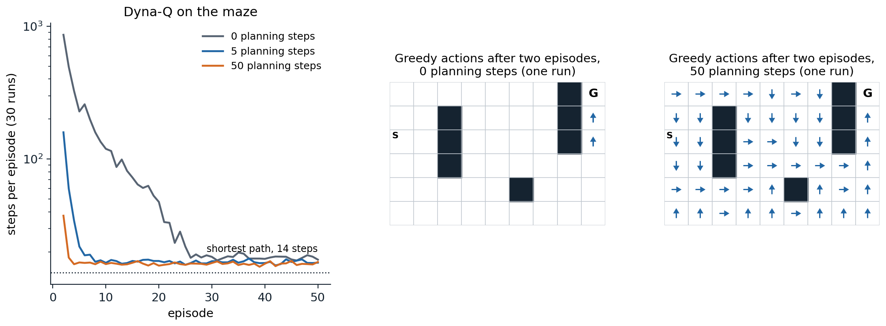
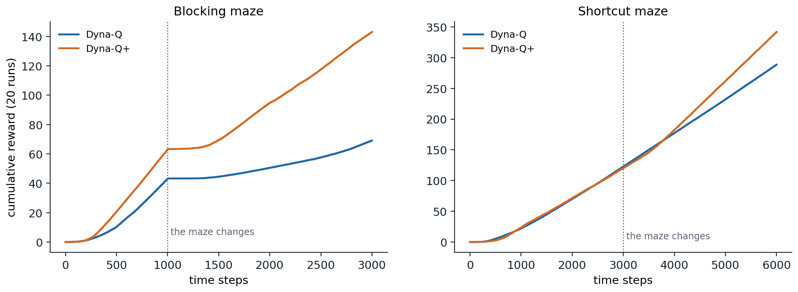
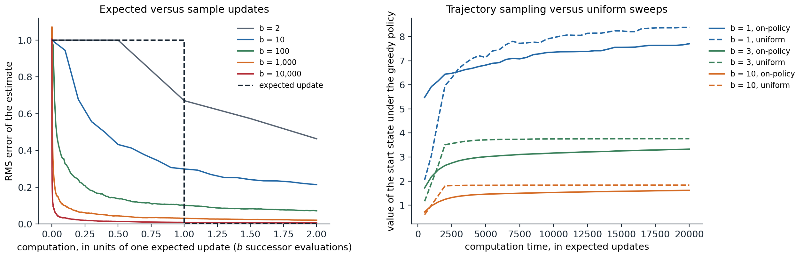

[ML Mastery Notes](../README.md) › [Reinforcement Learning](README.md)

# 10. Planning and Learning with Tabular Models

[← 9. Off-Policy Learning](09-off-policy-learning.md) · [11. Value Function Approximation →](11-value-function-approximation.md)

## <a id="models-and-planning"></a>Models and planning

### <a id="what-a-model-is"></a>What a model is

Dynamic programming (chapter 2) computes values from a known model; Monte Carlo and TD methods (chapters 5–9) learn them from experience without one. This chapter unifies the two. An agent can learn a model from its experience and then use the model to generate further, simulated experience, from which the same learning methods improve its values. Learning and planning become two sources of updates to one value function.

A **model** is anything the agent can use to predict how the environment will respond to its actions. A **distribution model** gives the probabilities of all next states and rewards, $`p(s',r\mid s,a)`$, as dynamic programming requires. A **sample model** produces one possible outcome, drawn with those probabilities, as a simulator does. Distribution models are strictly more informative, since they can generate samples, but samples are often much easier to obtain: writing a program that deals a blackjack hand is easy, while listing the probabilities of all outcomes of a hand, as exercise 5.6 did, takes care.

**Planning** is any computation that takes a model as input and produces or improves a policy. In artificial intelligence, planning usually means searching through plans, as in the automated planning of AI chapter 7; in reinforcement learning, it usually means **state-space planning**, which computes value functions by updates that back up values from future states along simulated transitions. Every state-space planning method has the same structure as a learning method: a model produces simulated experience, and backups of that experience improve the values, which improve the policy. Only the source of the experience differs.

The simplest example is **random-sample one-step tabular Q-planning**: repeatedly pick a state–action pair at random, ask a sample model for a next state and reward, and apply the one-step Q-learning update to the pair. It converges to the optimal action values for the model under the same conditions as Q-learning, applied to simulated rather than real transitions.

### <a id="why-plan-with-learned-models"></a>Why plan with learned models

Planning with a learned model makes each real transition count many times: it is replayed through the model, and its information propagates to other states as their values are updated. This matters when real experience is expensive, as for a robot, a patient, or a slow simulator, and computation is cheap. Its danger is that the model can be wrong, because it was learned from limited data, because the environment is stochastic, or because the environment has changed since the data were collected, and planning then optimizes the wrong problem. The chapter develops both sides: how planning speeds learning, how to make planning efficient, and how to cope with a wrong model. The same questions, with neural networks as models, drive the model-based deep reinforcement learning of chapter 23 and chapter 24.

## <a id="dyna"></a>Dyna

### <a id="integrating-learning-planning-and-acting"></a>Integrating learning, planning, and acting

**Dyna** ([Sutton, 1990](https://doi.org/10.1016/B978-1-55860-141-3.50030-4); [Sutton, 1991](https://doi.org/10.1145/122344.122377)) is an architecture in which one agent does all three at once. Real experience is used for two things: **direct reinforcement learning**, which improves the values directly, and **model learning**, which improves the model. The model then supplies simulated experience for **planning**, which improves the same values with the same update. In **Dyna-Q**, the direct update and the planning update are both one-step Q-learning, and the model is a table that records, for each state–action pair tried, the last reward and next state observed, which is exact if the environment is deterministic. After every real step, Dyna-Q performs $`n`$ planning updates, each on a previously experienced pair chosen at random:

1. In state $`S`$, choose $`A`$ ε-greedily with respect to $`Q`$; take it, and observe $`R`$ and $`S'`$.
2. Update $`Q(S,A)`$ by Q-learning toward $`R+\gamma\max_aQ(S',a)`$.
3. Record $`\text{Model}(S,A)\leftarrow(R,S')`$.
4. Repeat $`n`$ times: pick a pair $`(s,a)`$ previously experienced, look up $`(r,s')=\text{Model}(s,a)`$, and update $`Q(s,a)`$ toward $`r+\gamma\max_{a'}Q(s',a')`$.

The code runs Dyna-Q in Sutton and Barto's $`6\times9`$ maze, where the only reward is 1 on reaching the goal, with $`n=0`$ (plain Q-learning), 5, and 50 planning steps.

```python
import numpy as np

# Dyna-Q on Sutton and Barto's maze (Example 8.1): 6 x 9 grid, reward 1 on reaching the goal, gamma = 0.95,
# alpha = 0.1, epsilon = 0.1. After every real step, n planning updates replay transitions from the learned model.
H, W, start, goal = 6, 9, (2, 0), (0, 8)
walls = {(1, 2), (2, 2), (3, 2), (4, 5), (0, 7), (1, 7), (2, 7)}
moves = [(-1, 0), (1, 0), (0, 1), (0, -1)]
gamma, alpha, eps = 0.95, 0.1, 0.1


def step(s, a):
    t = (min(max(s[0] + moves[a][0], 0), H - 1), min(max(s[1] + moves[a][1], 0), W - 1))
    t = s if t in walls else t
    return t, (1.0 if t == goal else 0.0)


def dyna_q(n, seed, episodes=50):
    rng = np.random.default_rng(seed)
    Q, model, keys, lengths = np.zeros((H, W, 4)), {}, [], []  # model: (s, a) -> (r, s') for a deterministic world

    def update(s, a, r, s2):
        target = r if s2 == goal else r + gamma * Q[s2].max()
        Q[s][a] += alpha * (target - Q[s][a])

    for _ in range(episodes):
        s, steps = start, 0
        while s != goal:
            q = Q[s]
            a = int(rng.integers(4)) if rng.random() < eps else int(rng.choice(np.flatnonzero(q == q.max())))
            s2, r = step(s, a)
            update(s, a, r, s2)                                 # direct reinforcement learning
            if (s, a) not in model:
                keys.append((s, a))
            model[(s, a)] = (r, s2)                             # model learning
            for k in rng.integers(len(keys), size=n):           # planning: n simulated one-step updates
                ps, pa = keys[k]
                update(ps, pa, *model[(ps, pa)])
            s, steps = s2, steps + 1
        lengths.append(steps)
    return lengths


for n in [0, 5, 50]:
    L = np.array([dyna_q(n, seed) for seed in range(30)])
    print(f"n = {n:2d} planning steps: episode 1 {L[:, 0].mean():5.0f} steps, episode 2 {L[:, 1].mean():5.0f},"
          f" episode 3 {L[:, 2].mean():4.0f}, episodes 41-50 {L[:, 40:].mean():5.1f} (shortest path 14)")
# n =  0 planning steps: episode 1   983 steps, episode 2   861, episode 3  494, episodes 41-50  18.1 (shortest path 14)
# n =  5 planning steps: episode 1   766 steps, episode 2   159, episode 3   60, episodes 41-50  16.8 (shortest path 14)
# n = 50 planning steps: episode 1   776 steps, episode 2    38, episode 3   18, episodes 41-50  16.4 (shortest path 14)
```

The first episode is a random search for every $`n`$: until the goal is reached, every reward in the model is 0, and planning has nothing to propagate. Its length varies from about 770 to 980 steps only through the random numbers. The second episode shows the effect of planning. Without it, the first episode taught the agent only the value of the last step before the goal, and the second episode is again long. With 50 planning steps per real step, the one reward in the model is propagated back through the whole maze during the second episode, and by the third episode the agent follows a near-shortest path. All three settings end at about the same length, 16 to 18 steps, the shortest path of 14 plus the detours of ε-greedy exploration.



*Dyna-Q in the maze. Left: steps per episode from the second episode on, averaged over 30 runs, with 0, 5, and 50 planning steps per real step, on a log scale; the first episode, a random search, is the same for all in expectation. Middle and right: the greedy actions after two episodes of one run, shown only in states whose action values have become positive. Without planning, only the last two states before the goal have learned anything. With 50 planning steps, the values have spread through the whole maze, and the greedy policy leads to the goal from almost everywhere.*

### <a id="when-the-model-is-wrong"></a>When the model is wrong

A learned model can be wrong, and planning with a wrong model produces a policy that is optimal for the model rather than for the world. Some errors correct themselves: if the model is optimistic, predicting more reward than the world gives, the planned policy exploits the error, visits the states where it lies, and experience corrects the model. Errors in the other direction are more dangerous. If the world improves after the model was learned, the planned policy has no reason to visit the states where the model is now pessimistic, and the error can persist forever.

Sutton and Barto's two changing mazes illustrate both cases. In the **blocking maze**, a wall across the grid has a gap at its right end, and after 1,000 steps the gap moves to the left end, so the learned route is blocked and a longer route, 16 steps instead of 10, must be found. In the **shortcut maze**, the only gap is at the left end, and after 3,000 steps a second gap opens at the right, creating a shorter route, 10 steps instead of 16. **Dyna-Q+** addresses the problem with an exploration bonus in planning. It records how long it has been since each pair was last tried in the real world, $`\tau`$, and plans with the reward $`r+\kappa\sqrt\tau`$ instead of $`r`$, so that pairs not tried for a long time look increasingly attractive until the agent tests them. It also lets planning consider actions never tried from visited states, modeled as leaving the agent in place with zero reward.

```python
import numpy as np

# Dyna-Q and Dyna-Q+ when the world changes (Sutton and Barto, Examples 8.2 and 8.3). A 6 x 9 grid with a wall
# across row 3. Blocking maze: the gap moves from the right end to the left end after 1,000 steps, so the learned
# route is blocked. Shortcut maze: a second gap opens at the right end after 3,000 steps, so a shorter route
# appears. gamma = 0.95, alpha = 1 (the world is deterministic), epsilon = 0.1, 10 planning steps per real step.
H, W, start, goal = 6, 9, (5, 3), (0, 8)
moves = [(-1, 0), (1, 0), (0, 1), (0, -1)]
gamma, alpha, eps, n_plan, kappa = 0.95, 1.0, 0.1, 10, 1e-3


def walls_at(maze, t):
    if maze == "blocking":
        return {(3, j) for j in range(0, 8)} if t < 1000 else {(3, j) for j in range(1, 9)}
    return {(3, j) for j in range(1, 9)} if t < 3000 else {(3, j) for j in range(1, 8)}


def run(maze, plus, seed, steps):
    rng = np.random.default_rng(seed)
    Q, model, keys, last = np.zeros((H, W, 4)), {}, [], {}
    s, cum, curve = start, 0.0, []
    for t in range(steps):
        walls = walls_at(maze, t)
        q = Q[s]
        a = int(rng.integers(4)) if rng.random() < eps else int(rng.choice(np.flatnonzero(q == q.max())))
        s2 = (min(max(s[0] + moves[a][0], 0), H - 1), min(max(s[1] + moves[a][1], 0), W - 1))
        s2 = s if s2 in walls else s2
        r = 1.0 if s2 == goal else 0.0
        Q[s][a] += alpha * (r + (0.0 if s2 == goal else gamma * Q[s2].max()) - Q[s][a])
        if plus and not any((s, b) in model for b in range(4)):
            for b in range(4):                                  # Dyna-Q+: untried actions are modeled as staying put
                model[(s, b)] = (0.0, s); keys.append((s, b)); last[(s, b)] = 0
        if (s, a) not in model:
            keys.append((s, a))
        model[(s, a)] = (r, s2); last[(s, a)] = t
        for k in rng.integers(len(keys), size=n_plan):
            ps, pa = keys[k]
            pr, ps2 = model[(ps, pa)]
            if plus:
                pr += kappa * np.sqrt(t - last[(ps, pa)])        # bonus for pairs not tried for a long time
            Q[ps][pa] += alpha * (pr + (0.0 if ps2 == goal else gamma * Q[ps2].max()) - Q[ps][pa])
        cum += r
        s = start if s2 == goal else s2
        curve.append(cum)
    return np.array(curve)


for maze, steps, change in [("blocking", 3000, 1000), ("shortcut", 6000, 3000)]:
    for plus in [False, True]:
        c = np.mean([run(maze, plus, seed, steps) for seed in range(10)], 0)
        before, after = c[change - 1] - c[change - 501], c[-1] - c[-501]
        print(f"{maze} maze, {'Dyna-Q+' if plus else 'Dyna-Q '}: cumulative reward {c[change - 1]:5.1f} at the change,"
              f" {c[-1]:5.1f} at the end; episodes completed in the last 500 steps before the change {before:4.1f},"
              f" at the end {after:4.1f}")
# blocking maze, Dyna-Q : cumulative reward  39.8 at the change,  60.9 at the end; episodes completed in the last 500 steps before the change 31.8, at the end  9.9
# blocking maze, Dyna-Q+: cumulative reward  63.7 at the change, 142.3 at the end; episodes completed in the last 500 steps before the change 43.3, at the end 26.0
# shortcut maze, Dyna-Q : cumulative reward 115.1 at the change, 278.6 at the end; episodes completed in the last 500 steps before the change 26.8, at the end 27.4
# shortcut maze, Dyna-Q+: cumulative reward 119.5 at the change, 342.6 at the end; episodes completed in the last 500 steps before the change 25.0, at the end 40.2
```

In the blocking maze, both agents first find the right-hand route, and Dyna-Q+ finds it faster because its bonus drives systematic exploration. When the gap moves, both stall: walking into the new wall corrects the blocked transition at once, but the rest of their values still lead toward the old gap, and the new gap at the left end must be found by exploration; Dyna-Q+ recovers faster, because its bonus draws it to pairs it has not tried for a long time, reaching 26 episodes per 500 steps against 10 for Dyna-Q, close to the best possible for a 16-step route with exploration. In the shortcut maze, Dyna-Q never finds the shortcut: its rate of completed episodes stays the same after the change, because nothing in its model suggests that trying the old wall is worthwhile, and ε-greedy exploration is very unlikely to walk the several steps needed to discover the gap. Dyna-Q+ finds it, and its rate rises from 25 to 40 episodes per 500 steps.



*Cumulative reward of Dyna-Q and Dyna-Q+ (10 planning steps, $`\kappa=10^{-3}`$) in the two changing mazes, averaged over 20 runs. Left: after the gap moves at step 1,000, both agents stall, and Dyna-Q+ recovers much faster. Right: after the shortcut opens at step 3,000, only Dyna-Q+ finds it, and the slope of its curve, the rate of reward, increases.*

The trade-off is the exploration–exploitation dilemma of chapter 3 applied to the model: exploration tests the model and exploitation uses it. The bonus in Dyna-Q+ is a heuristic, which costs a little reward when the world does not change; principled versions that account for the uncertainty of a learned model, such as the optimistic model-based methods of chapter 22 and chapter 30, formalize the same idea.

## <a id="prioritized-sweeping"></a>Prioritized sweeping

### <a id="focusing-planning-where-it-matters"></a>Focusing planning where it matters

Dyna-Q chooses the pairs it updates uniformly at random, and most of these updates do nothing: in the maze after the first episode, only the pairs leading into the goal have values that can change, and the rest are updated from zeros to zeros. Planning is more efficient if it works backward from the states whose values have changed. When the value of a state changes, the values of its **predecessors**, the pairs that lead to it, are likely to change too, and among them the ones whose values would change the most should be updated first.

**Prioritized sweeping** ([Moore and Atkeson, 1993](https://doi.org/10.1007/BF00993104); [Peng and Williams, 1993](https://doi.org/10.1177/105971239300100403)) maintains a priority queue of state–action pairs ordered by the size of their pending update, $`|R+\gamma\max_aQ(S',a)-Q(S,A)|`$. After a real transition, the pair is inserted if its priority exceeds a small threshold. Each planning step removes the pair with the largest priority, updates it, and then computes the priorities of all its predecessors in the model, inserting those above the threshold. Changes propagate backward from where they occur, largest first, and planning stops when the queue is empty.

The code compares Dyna-Q and prioritized sweeping on the maze at three resolutions, with each cell divided into a $`k\times k`$ block, counting the updates, real and planned, until the greedy policy follows a shortest path.

```python
import heapq
from collections import deque

import numpy as np

# Prioritized sweeping versus Dyna-Q on the maze of Example 8.1 at higher resolutions: each cell becomes a k x k
# block. Both make 5 planning updates per real step (alpha = 0.5, gamma = 0.95, epsilon = 0.1). Count the updates,
# real and planned, until the greedy policy follows a shortest path from the start to the goal.
moves = [(-1, 0), (1, 0), (0, 1), (0, -1)]
gamma, alpha, eps, n_plan, theta = 0.95, 0.5, 0.1, 5, 1e-4
base_walls = {(1, 2), (2, 2), (3, 2), (4, 5), (0, 7), (1, 7), (2, 7)}


def make_maze(k):
    H, W = 6 * k, 9 * k
    walls = {(i * k + di, j * k + dj) for i, j in base_walls for di in range(k) for dj in range(k)}
    start, goal = (2 * k, 0), (0, W - 1)

    def step(s, a):
        t = (min(max(s[0] + moves[a][0], 0), H - 1), min(max(s[1] + moves[a][1], 0), W - 1))
        t = s if t in walls else t
        return t, (1.0 if t == goal else 0.0)

    dist, q = {start: 0}, deque([start])                       # shortest path length by breadth-first search
    while q:
        s = q.popleft()
        for a in range(4):
            t, _ = step(s, a)
            if t not in dist:
                dist[t] = dist[s] + 1; q.append(t)
    return H, W, start, goal, step, dist[goal], len(dist)


def solve(k, prioritized, seed, max_updates=3_000_000):
    H, W, start, goal, step, shortest, n_states = make_maze(k)
    rng = np.random.default_rng(seed)
    Q, model, keys, preds, pq, updates = np.zeros((H, W, 4)), {}, [], {}, [], 0

    def td(s, a, r, s2):
        return r + (0.0 if s2 == goal else gamma * Q[s2].max()) - Q[s][a]

    while updates < max_updates:
        s = start
        while s != goal:
            q = Q[s]
            a = int(rng.integers(4)) if rng.random() < eps else int(rng.choice(np.flatnonzero(q == q.max())))
            s2, r = step(s, a)
            if (s, a) not in model:
                keys.append((s, a))
            model[(s, a)] = (r, s2); preds.setdefault(s2, set()).add((s, a))
            if prioritized:
                p = abs(td(s, a, r, s2))
                if p > theta:
                    heapq.heappush(pq, (-p, s, a))
                for _ in range(n_plan):                         # update the pairs with the largest TD errors first
                    if not pq:
                        break
                    _, ps, pa = heapq.heappop(pq)
                    pr, ps2 = model[(ps, pa)]
                    Q[ps][pa] += alpha * td(ps, pa, pr, ps2); updates += 1
                    for (qs, qa) in preds.get(ps, ()):           # then queue the predecessors of the updated state
                        qr, _ = model[(qs, qa)]
                        p = abs(td(qs, qa, qr, ps))
                        if p > theta:
                            heapq.heappush(pq, (-p, qs, qa))
            else:
                Q[s][a] += alpha * td(s, a, r, s2); updates += 1
                for i in rng.integers(len(keys), size=n_plan):  # uniform random planning updates
                    ps, pa = keys[i]
                    pr, ps2 = model[(ps, pa)]
                    Q[ps][pa] += alpha * td(ps, pa, pr, ps2); updates += 1
            s = s2
        g, n = start, 0                                         # is the greedy route a shortest path?
        while g != goal and n <= shortest:
            g, _ = step(g, int(Q[g].argmax())); n += 1
        if g == goal and n == shortest:
            return updates
    return np.nan


for k in [1, 2, 3]:
    _, _, _, _, _, shortest, n_states = make_maze(k)
    res = {m: np.median([solve(k, m == "prioritized sweeping", seed) for seed in range(5)])
           for m in ["Dyna-Q", "prioritized sweeping"]}
    print(f"{n_states:4d} states (shortest path {shortest:2d}): updates until optimal, Dyna-Q {res['Dyna-Q']:8,.0f},"
          f" prioritized sweeping {res['prioritized sweeping']:7,.0f}")
#   47 states (shortest path 14): updates until optimal, Dyna-Q   20,274, prioritized sweeping   1,480
#  188 states (shortest path 29): updates until optimal, Dyna-Q   56,964, prioritized sweeping  11,630
#  423 states (shortest path 44): updates until optimal, Dyna-Q  149,214, prioritized sweeping  60,870
```

Prioritized sweeping finds the optimal path with 2.5 to 14 times fewer updates, and its advantage shrinks as the mazes grow. Both methods make at most five or six updates per real step, and prioritized sweeping makes none until the goal is first reached, since all its priorities are zero; in the larger mazes, both need many real steps of exploration to find the goal and to try the transitions along a shortest path, and the comparison of planning methods is diluted by the cost of exploration, which planning does not address. In stochastic environments, prioritized sweeping uses expected updates over the estimated distribution of outcomes, since a single sampled outcome would give an unreliable priority, and the choice between expected and sample updates is the subject of the next section.

## <a id="expected-versus-sample-updates"></a>Expected versus sample updates

### <a id="the-cost-of-an-update"></a>The cost of an update

Planning updates can differ along three dimensions: whether they update state values or action values, whether they estimate the values of a given policy or the optimal ones, and whether they use an **expected update**, which averages over all possible next states with a distribution model, or a **sample update**, which uses one sampled next state. The first two dimensions give the familiar methods; the third is new. The expected Q-learning update is the value-iteration backup, $`Q(s,a)\leftarrow\sum_{s',r}p(s',r\mid s,a)[r+\gamma\max_{a'}Q(s',a')]`$; the sample update is the Q-learning update, $`Q(s,a)\leftarrow Q(s,a)+\alpha[r+\gamma\max_{a'}Q(s',a')-Q(s,a)]`$ with a sampled $`(r,s')`$.

An expected update is exact but costs about $`b`$ times as much as a sample update, where the **branching factor** $`b`$ is the number of possible next states. When the successors are equally likely and their values are correct, a sample update that averages its targets with step size $`1/t`$ reduces the error of the estimate as

```math
\text{error after }t\text{ sample updates}\approx\sigma\sqrt{\frac{b-1}{bt}},
```

where $`\sigma^2`$ measures the spread of the successors' values (exercise 10.4). The expected update achieves zero error, but only after $`b`$ computations; in that time, $`b`$ sample updates reduce the error to about $`\sigma/\sqrt b`$, which is already small when $`b`$ is large. For large $`b`$ most of the benefit of an expected update is available at a small fraction of its cost, and in problems where the successors' values are themselves being learned, the sample updates, which let those improvements propagate sooner, do even better. Expected updates are preferable when the branching factor is small or when the computation is cheap relative to the value of exactness.



*Left: the RMS error of an estimate of a state–action value from sample updates, as a function of the computation spent, in units of one expected update ($`b`$ evaluations of successors), for branching factors from 2 to 10,000, with the successors' values known and scaled to standard deviation 1, so that one sample update has error 1 and $`t`$ of them have error about $`1/\sqrt t`$; the dashed line is the expected update, which removes the whole error after $`b`$ evaluations. Right: the value of the start state under the greedy policy, as planning proceeds with expected updates in random tasks with 1,000 states, 2 actions, and $`b`$ successors per pair, averaged over 30 tasks. Updates distributed along simulated on-policy trajectories (solid) help faster at first; uniform sweeps through all pairs (dashed) catch up after about one sweep and end higher, and the early advantage of trajectory sampling lasts longest for $`b=1`$.*

### <a id="trajectory-sampling"></a>Trajectory sampling

The second question is how to distribute updates over states. Dynamic programming sweeps the whole state space, giving every state equal attention. The alternative is **trajectory sampling**: simulate trajectories with the current policy and update the states and actions encountered, which distributes the updates according to the **on-policy distribution**. It ignores the parts of the state space the policy does not visit, which is good if they are irrelevant and bad if they are not.

The code repeats Sutton and Barto's experiment on random tasks with 1,000 states, two actions, and $`b`$ equally likely successors per pair, in which each transition ends the episode with probability 0.1. Both methods make expected updates; "uniform" cycles through all pairs, and "on-policy" updates the pairs met along ε-greedy trajectories from the start state.

```python
import numpy as np

# Trajectory sampling versus uniform sweeps (Sutton and Barto, Section 8.6). Random episodic tasks with 1,000
# states, 2 actions, and b equally likely successors per state-action pair; every transition has reward ~ N(0, 1)
# and ends the episode with probability 0.1. Both methods make expected updates of Q; "uniform" cycles through
# all pairs, "on-policy" updates the pairs met along simulated epsilon-greedy episodes from the start state.
# Performance: the value of the start state under the greedy policy, after a given number of updates.
nS, nA, T, eps = 1000, 2, 20_000, 0.1
checkpoints = [500, 1_000, 2_000, 5_000, 20_000]


def task(rng, b):
    return rng.integers(nS, size=(nS, nA, b)), rng.normal(0, 1, (nS, nA, b))


def greedy_value(Q, succ, R):
    pi = Q.argmax(1); idx = np.arange(nS)
    V = np.zeros(nS)
    for _ in range(100):                                        # 0.9^100 is negligible
        V = R[idx, pi].mean(1) + 0.9 * V[succ[idx, pi]].mean(1)
    return V[0]


def expected_update(Q, succ, R, s, a):
    Q[s, a] = R[s, a].mean() + 0.9 * Q[succ[s, a]].max(1).mean()


def run(b, method, seed):
    rng = np.random.default_rng(seed)
    succ, R = task(rng, b)
    Q, out, s = np.zeros((nS, nA)), [], 0
    for t in range(1, T + 1):
        if method == "uniform":
            k = (t - 1) % (nS * nA)
            expected_update(Q, succ, R, k // nA, k % nA)
        else:
            a = int(rng.integers(nA)) if rng.random() < eps else int(Q[s].argmax())
            expected_update(Q, succ, R, s, a)
            s = 0 if rng.random() < 0.1 else int(succ[s, a, rng.integers(b)])   # continue or restart
        if t in checkpoints:
            out.append(greedy_value(Q, succ, R))
    return out


for b in [1, 3, 10]:
    for method in ["uniform", "on-policy"]:
        v = np.mean([run(b, method, seed) for seed in range(20)], 0)
        print(f"b = {b:2d}, {method:9s}: value of the start state under the greedy policy after "
              + ", ".join(f"{c:,}: {x:.2f}" for c, x in zip(checkpoints, v)) + " updates")
# b =  1, uniform  : value of the start state under the greedy policy after 500: 1.93, 1,000: 3.06, 2,000: 5.96, 5,000: 7.22, 20,000: 8.31 updates
# b =  1, on-policy: value of the start state under the greedy policy after 500: 5.61, 1,000: 6.05, 2,000: 6.58, 5,000: 7.01, 20,000: 7.60 updates
# b =  3, uniform  : value of the start state under the greedy policy after 500: 1.21, 1,000: 1.92, 2,000: 3.46, 5,000: 3.67, 20,000: 3.73 updates
# b =  3, on-policy: value of the start state under the greedy policy after 500: 1.63, 1,000: 2.11, 2,000: 2.59, 5,000: 2.96, 20,000: 3.28 updates
# b = 10, uniform  : value of the start state under the greedy policy after 500: 0.61, 1,000: 1.01, 2,000: 1.82, 5,000: 1.85, 20,000: 1.85 updates
# b = 10, on-policy: value of the start state under the greedy policy after 500: 0.74, 1,000: 0.99, 2,000: 1.26, 5,000: 1.48, 20,000: 1.64 updates
```

On-policy sampling helps faster at first, because it concentrates on the states near the start that the greedy policy will actually visit, but uniform sweeps catch up after about one sweep and eventually do better, since on-policy sampling keeps revisiting states whose values are already accurate and neglects the others. The early advantage lasts longest with one successor per pair, where trajectories are most concentrated. Sutton and Barto found the same pattern, with the advantage of trajectory sampling growing with the size of the state space: in large problems, most states are irrelevant to good behavior from the start, and uniform sweeps would waste almost all their computation on them. This is the regime of most interesting problems, and of the model-based deep RL agents that plan along imagined trajectories.

### <a id="real-time-dynamic-programming"></a>Real-time dynamic programming

**Real-time dynamic programming** (RTDP; [Barto, Bradtke, and Singh, 1995](https://doi.org/10.1016/0004-3702%2894%2900011-O)) is the on-policy trajectory-sampling version of value iteration. It runs trials from the start state, and at every state visited it performs an expected value-iteration update, then acts greedily with respect to the updated values. For stochastic shortest-path problems with positive costs and a policy that reaches the goal from every state, if the initial values are **admissible**, meaning that they are optimistic (lower bounds on the costs), RTDP converges with probability one to optimal values on all states relevant to the start state, without necessarily visiting the rest, a result that combines the asynchronous DP of chapter 2 with the heuristic search of AI chapter 2. The code compares it with value iteration on a slippery gridworld with 2,865 states, in which the start and the goal lie in one corner.

```python
import numpy as np

# Real-time dynamic programming (RTDP) versus value iteration on a stochastic shortest-path problem: a 60 x 60
# grid with random obstacles, cost 1 per step, and slippery moves (the intended direction with probability 0.8,
# each perpendicular direction with 0.1); the start and the goal are 15 rows and 15 columns apart in one corner.
# Both start from the admissible heuristic V = Manhattan distance to the goal, a lower bound on the expected cost.
# Value iteration sweeps every state; RTDP updates only the states on greedy trajectories from the start.
# Count the updates each needs before the start state's value is within 1% of optimal.
N, start, goal = 60, (59, 0), (44, 15)                          # start and goal share one corner of a larger map
moves = [(-1, 0), (0, 1), (1, 0), (0, -1)]
for seed in range(100):                                         # draw obstacles until the start connects to the goal
    rng = np.random.default_rng(seed)
    free = rng.random((N, N)) > 0.2
    free[start] = free[goal] = True
    cells, frontier = {goal}, [goal]                            # the cells from which the goal can be reached
    while frontier:
        i, j = frontier.pop()
        for di, dj in moves:
            t = (i + di, j + dj)
            if 0 <= t[0] < N and 0 <= t[1] < N and free[t] and t not in cells:
                cells.add(t); frontier.append(t)
    if start in cells:
        break
cells = sorted(cells)
idx = {c: k for k, c in enumerate(cells)}
nS, G, S0 = len(cells), idx[goal], idx[start]
succ = np.zeros((nS, 4, 3), int); prob = np.array([0.8, 0.1, 0.1])
for c, k in idx.items():
    for a in range(4):
        for m, d in enumerate([a, (a + 1) % 4, (a + 3) % 4]):
            t = (c[0] + moves[d][0], c[1] + moves[d][1])
            succ[k, a, m] = idx.get(t, k)                        # blocked moves leave the agent in place


def q_values(V, s):
    return 1 + V[succ[s]] @ prob                                # the four actions' expected costs


h = np.array([abs(c[0] - goal[0]) + abs(c[1] - goal[1]) for c in cells], float)   # admissible heuristic
V = np.zeros(nS); sweeps = 0                                    # value iteration from 0, to convergence
while True:
    old = V.copy()
    for s in range(nS):
        if s != G:
            V[s] = q_values(V, s).min()
    sweeps += 1
    if np.abs(V - old).max() < 1e-6:
        break
v_star = V[S0]
print(f"{nS} states; optimal expected cost from the start {v_star:.2f}; value iteration converges in {sweeps} sweeps"
      f" ({sweeps * (nS - 1):,} updates)")
V, sweeps = h.copy(), 0                                         # value iteration from the heuristic
while V[S0] < 0.99 * v_star:
    for s in range(nS):
        if s != G:
            V[s] = q_values(V, s).min()
    sweeps += 1
print(f"value iteration from the heuristic: start value within 1% of optimal after {sweeps} sweeps"
      f" ({sweeps * (nS - 1):,} updates)")
Vr, touched, updates, costs = h.copy(), set(), 0, []            # RTDP: greedy trials that update what they visit
while Vr[S0] < 0.99 * v_star:
    s, c = S0, 0
    while s != G:
        q = q_values(Vr, s); a = int(np.argmin(q)); Vr[s] = q[a]
        touched.add(s); updates += 1; c += 1
        s = succ[s, a, rng.choice(3, p=prob)]
    costs.append(c)
print(f"RTDP: start value within 1% of optimal after {len(costs)} trials ({updates:,} updates), having updated"
      f" {len(touched)} of {nS} states ({100 * len(touched) / nS:.0f}%)")
print(f"RTDP's cost per trial: first trial {costs[0]}, trials 1-10 on average {np.mean(costs[:10]):.0f},"
      f" last 50 trials {np.mean(costs[-50:]):.0f} (optimal {v_star:.0f})")
# 2865 states; optimal expected cost from the start 37.44; value iteration converges in 124 sweeps (355,136 updates)
# value iteration from the heuristic: start value within 1% of optimal after 23 sweeps (65,872 updates)
# RTDP: start value within 1% of optimal after 127 trials (5,514 updates), having updated 261 of 2865 states (9%)
# RTDP's cost per trial: first trial 43, trials 1-10 on average 47, last 50 trials 41 (optimal 37)
```

Both methods start from the Manhattan distance to the goal, an admissible heuristic. Value iteration must sweep all 2,865 states, and 23 sweeps are needed before the start state's value is within 1% of optimal. RTDP reaches the same accuracy with 12 times fewer updates, having touched only 9% of the states; the rest of the map, which no good trajectory from the start visits, is never updated. RTDP is also an online method: its first trial already reaches the goal at a cost of 43 steps against the optimal 37, because the admissible values steer it well while it learns. Its descendant labeled RTDP adds a convergence test that marks states as solved, and it and LAO\*, a heuristic search algorithm for MDPs that extends AO\* to cyclic problems, are standard tools for large MDPs when a good heuristic is available.

## <a id="decision-time-planning"></a>Decision-time planning

### <a id="planning-for-the-current-state"></a>Planning for the current state

Everything so far has been **background planning**: planning that improves a value function or policy for all states, gradually, between or alongside actions. **Decision-time planning** instead starts after the current state is observed and uses the model to choose the current action, often discarding the result once the action is taken. Its computation is focused on the one state that matters now, and it can use a lookahead far deeper than any stored value function. Game-playing programs are the classic example: minimax search with alpha–beta pruning (AI chapter 4) looks ahead from the current position, evaluates the leaves with a heuristic value function, and backs the values up to choose a move. The two kinds of planning combine naturally: background learning improves the value function used at the leaves, and decision-time search improves on it at the current state.

**Heuristic search** in this sense is a sequence of expected backups on a tree rooted at the current state, which can be arbitrarily deep and selective. Its benefit comes from focus: the backups concentrate on the states and actions that immediately follow the current one, where accuracy matters most. TD-Gammon's later versions, which searched two or three plies ahead, played much better than with the same value network and no search (chapter 6).

### <a id="rollout-algorithms"></a>Rollout algorithms

A **rollout algorithm** estimates the value of each action in the current state by simulating many trajectories that start with that action and then follow a fixed **base policy** and chooses the action with the highest average ([Tesauro and Galperin, 1996](https://papers.nips.cc/paper_files/paper/1996/hash/996009f2374006606f4c0b0fda878af1-Abstract.html); [Bertsekas, Tsitsiklis, and Wu, 1997](https://doi.org/10.1023/A:1009635226865)). With exact estimates, the rollout policy is the greedy policy with respect to $`q_{\text{base}}`$, and by the policy improvement theorem of chapter 2 it is at least as good as the base policy: rollout performs one step of policy iteration online, at the states actually encountered, without ever storing a value function (exercise 10.5). The code applies it to blackjack, with a base policy that sticks only on 20 or 21.

```python
import gymnasium as gym
import numpy as np

# Rollout: decision-time planning with a simulator. In blackjack (Sutton and Barto's rules, infinite deck), the
# base policy sticks on 20 or 21. At every decision the rollout policy simulates m hands for each action (stick,
# or hit and then follow the base policy), with the dealer's hidden card and all later cards drawn at random,
# and takes the action with the better average. Returns per hand over the same 10,000 real deals in Gymnasium.
rng = np.random.default_rng(0)
cards = np.array([1, 2, 3, 4, 5, 6, 7, 8, 9, 10, 10, 10, 10])


def draw(m):
    return cards[rng.integers(13, size=m)]


def add(total, ace, c):                                        # add cards to hands given as (sum, usable ace)
    total = total + c
    ace = ace | ((c == 1) & (total + 10 <= 21))                 # an ace counts 11 if that does not bust
    total = np.where((c == 1) & (total + 10 <= 21), total + 10, total)
    bust_soft = (total > 21) & ace                              # a usable ace can fall back to 1
    return np.where(bust_soft, total - 10, total), ace & ~bust_soft


def dealer_final(showing, m):                                   # the dealer draws to 17 or more
    total, ace = add(np.zeros(m, int), np.zeros(m, bool), np.full(m, showing))
    total, ace = add(total, ace, draw(m))
    while (total < 17).any():
        hit = total < 17
        t2, a2 = add(total, ace, draw(m))
        total, ace = np.where(hit, t2, total), np.where(hit, a2, ace)
    return total


def value(player, ace, showing, action, m, base_threshold=20):  # average outcome of m simulated hands
    p, a = np.full(m, player), np.full(m, bool(ace))
    if action == 1:                                             # hit now, then follow the base policy
        p, a = add(p, a, draw(m))
        while ((p < base_threshold) & (p <= 21)).any():
            hit = (p < base_threshold) & (p <= 21)
            p2, a2 = add(p, a, draw(m))
            p, a = np.where(hit, p2, p), np.where(hit, a2, a)
    d = dealer_final(showing, m)
    return np.where(p > 21, -1, np.where((d > 21) | (p > d), 1, np.where(p == d, 0, -1))).mean()


def play(policy, hands=10_000):
    env, total = gym.make("Blackjack-v1", sab=True), 0.0
    for h in range(hands):
        (p, d, a), _ = env.reset(seed=h)
        done = False
        while not done:
            (p, d, a), r, done, _, _ = env.step(policy(p, d, a))
        total += r
    return total / hands


base = lambda p, d, a: int(p < 20)
stick_from = {0: [17, 13, 13, 12, 12, 12, 17, 17, 17, 17], 1: [19, 18, 18, 18, 18, 18, 18, 18, 19, 19]}
optimal = lambda p, d, a: int(p < 12 or p < stick_from[a][d - 1])   # the optimal policy of chapter 5
print(f"base policy (stick on 20 or 21): return per hand {play(base):+.4f}")
for m in [10, 100]:
    rollout = lambda p, d, a: int(p < 12 or value(p, a, d, 1, m) > value(p, a, d, 0, m))   # below 12, always hit
    print(f"rollout policy, m = {m:4d} simulated hands per action: {play(rollout):+.4f}")
print(f"optimal policy: return per hand {play(optimal):+.4f}")
# base policy (stick on 20 or 21): return per hand -0.3442
# rollout policy, m =   10 simulated hands per action: -0.0807
# rollout policy, m =  100 simulated hands per action: -0.0676
# optimal policy: return per hand -0.0476
```

The base policy loses about 34 cents per dollar. Rollout, which simulates only 10 or 100 hands per action at each decision, loses about 7 to 8 cents, most of the way to the optimal policy's 5. Its remaining gap is structural, not statistical: the rollout policy evaluates hitting by following the base policy afterwards, which keeps hitting until 20, so it underestimates hitting whenever the right continuation would stick sooner. Improving further requires a better base policy, repeated rollouts, which amount to more steps of policy iteration at exponentially growing cost, or a search that improves its continuation as it goes, which is what Monte Carlo tree search does. Tesauro and Galperin's rollouts of backgammon programs, with base policies ranging from random play to TD-Gammon, reduced the base players' error rates substantially, by a factor of five or more in some cases, and rollout algorithms remain a strong baseline wherever a simulator and a reasonable base policy are available.

### <a id="sparse-sampling"></a>Sparse sampling

For an MDP with an enormous or continuous state space, [Kearns, Mansour, and Ng (2002)](https://doi.org/10.1023/A:1017932429737) showed that near-optimal decision-time planning is possible with a computation that does not depend on the number of states. **Sparse sampling** builds a lookahead tree from the current state: for each action it draws $`C`$ next states from the sample model, and recursively does the same from each of them to a depth $`H`$, then backs up values with the Bellman optimality equation. With $`C`$ and $`H`$ polynomial in $`1/\varepsilon`$ and $`1/(1-\gamma)`$, the policy that runs sparse sampling at every state is $`\varepsilon`$-optimal, and the number of simulator calls, $`(|\mathcal A|C)^H`$, is independent of $`|\mathcal S|`$ (exercise 10.8). The price is exponential dependence on the horizon, which makes the algorithm impractical as it stands, but it established that the size of the state space is not what makes planning hard, and it motivates the selective trees of Monte Carlo tree search.

### <a id="monte-carlo-tree-search"></a>Monte Carlo tree search

**Monte Carlo tree search** (MCTS) grows a lookahead tree selectively, spending more simulations on the actions that look best, and estimates values by averaging the returns of simulated trajectories, completed by a rollout policy below the tree. AI chapter 4 develops it for two-player games, with the UCT selection rule of [Kocsis and Szepesvári (2006)](https://doi.org/10.1007/11871842_29), which applies the UCB1 bandit algorithm of chapter 3 at every node. In an MDP the same four steps apply, selection, expansion, rollout, and backup, with rewards accumulated along the simulated path, discounting where appropriate, and chance nodes whose outcomes are sampled from the model. Kocsis and Szepesvári proved that UCT's estimates converge to the optimal values as the number of simulations grows, but the convergence can be very slow on trees where the best action looks bad in most of its subtree: UCT's exploration is logarithmic and can take a very long time to find a narrow good path hidden under an unpromising one (exercise 10.7). Monte Carlo tree search, guided by learned policy and value networks and trained by self-play, became the planning engine of AlphaGo, AlphaZero, and MuZero (chapter 24).

### <a id="when-to-use-a-model"></a>When to use a model

The distinctions of this chapter reappear in deep reinforcement learning. A replay buffer is a nonparametric sample model of the environment: replaying a stored transition is a Dyna planning update with a model that remembers exactly what happened, and prioritized experience replay is prioritized sweeping without predecessors (chapter 16, chapter 18). [van Hasselt, Hessel, and Aslanides (2019)](https://arxiv.org/abs/1906.05243) argued that when a model only generates transitions from states already observed, for an update that is otherwise model-free, replay is often as good as a parametric model and safer, since it cannot invent transitions that never happen; parametric models earn their keep when they plan forward from the current state, even one never seen before, choose actions rather than just train values, or plan backward for credit assignment. Those are the uses developed in chapter 23 and chapter 24.

Lab 4 compares Q-learning, Dyna-Q, and prioritized sweeping on Taxi, plans with a learned stochastic model on an $`8\times8`$ FrozenLake, compares rollout with UCT in blackjack, and runs RTDP on a large lake.

## <a id="exercises"></a>Exercises

### <a id="exercise-10-1-where-to-put-the-exploration-bonus"></a>Exercise 10.1 — Where to put the exploration bonus

Dyna-Q+ adds its bonus $`\kappa\sqrt\tau`$ to the rewards used in planning. A variant adds it only when choosing actions, acting greedily with respect to $`Q(S,a)+\kappa\sqrt{\tau(S,a)}`$, and plans with the plain rewards. Compare the two on the shortcut maze. Which finds the shortcut, and why?


<details>
<summary><b>Solution</b></summary>


```python
import numpy as np

# Exploration bonuses in Dyna on the shortcut maze: Dyna-Q+ adds kappa * sqrt(tau) to the rewards used in
# planning; the variant adds it to the action values only when choosing actions (Sutton and Barto, Exercise 8.4).
# Same settings as the chapter: gamma 0.95, alpha 1, epsilon 0.1, 10 planning steps, kappa 1e-3; 20 runs.
H, W, start, goal = 6, 9, (5, 3), (0, 8)
moves = [(-1, 0), (1, 0), (0, 1), (0, -1)]
gamma, alpha, eps, n_plan, kappa = 0.95, 1.0, 0.1, 10, 1e-3


def run(variant, seed, steps=6000, change=3000):
    rng = np.random.default_rng(seed)
    Q, model, keys, last = np.zeros((H, W, 4)), {}, [], np.zeros((H, W, 4))
    s, cum, curve = start, 0.0, []
    for t in range(steps):
        walls = {(3, j) for j in range(1, 9)} if t < change else {(3, j) for j in range(1, 8)}
        q = Q[s] + (kappa * np.sqrt(t - last[s]) if variant == "bonus in action selection" else 0)
        a = int(rng.integers(4)) if rng.random() < eps else int(rng.choice(np.flatnonzero(q == q.max())))
        s2 = (min(max(s[0] + moves[a][0], 0), H - 1), min(max(s[1] + moves[a][1], 0), W - 1))
        s2 = s if s2 in walls else s2
        r = 1.0 if s2 == goal else 0.0
        Q[s][a] += alpha * (r + (0.0 if s2 == goal else gamma * Q[s2].max()) - Q[s][a])
        if variant == "Dyna-Q+" and not any((s, b) in model for b in range(4)):
            for b in range(4):
                model[(s, b)] = (0.0, s); keys.append((s, b))
        if (s, a) not in model:
            keys.append((s, a))
        model[(s, a)] = (r, s2); last[s][a] = t
        for i in rng.integers(len(keys), size=n_plan):
            ps, pa = keys[i]; pr, ps2 = model[(ps, pa)]
            if variant == "Dyna-Q+":
                pr += kappa * np.sqrt(t - last[ps][pa])
            Q[ps][pa] += alpha * (pr + (0.0 if ps2 == goal else gamma * Q[ps2].max()) - Q[ps][pa])
        cum += r; s = start if s2 == goal else s2; curve.append(cum)
    return np.array(curve)


for variant in ["Dyna-Q", "Dyna-Q+", "bonus in action selection"]:
    c = np.mean([run(variant, seed) for seed in range(20)], 0)
    print(f"{variant:26s}: episodes in the 500 steps before the change {c[2999] - c[2499]:4.1f},"
          f" in the last 500 steps {c[-1] - c[-501]:4.1f}; total {c[-1]:5.1f}")
# Dyna-Q                    : episodes in the 500 steps before the change 27.0, in the last 500 steps 28.4; total 288.6
# Dyna-Q+                   : episodes in the 500 steps before the change 24.8, in the last 500 steps 40.1; total 341.8
# bonus in action selection : episodes in the 500 steps before the change 27.0, in the last 500 steps 27.3; total 293.4
```

Only Dyna-Q+ finds the shortcut. The action-selection bonus is myopic: it affects the choice in the current state only, and it makes a neglected action attractive only when the agent is already in the state where it can be taken. To discover the shortcut, the agent must first travel several steps along the wall to the old right end, and nothing in the variant's values makes that journey attractive. In Dyna-Q+, the bonus enters the planning updates, so the value of trying the neglected pairs at the right end of the wall propagates backward through the model to the states along the way, and the greedy policy plans a deliberate trip to test them. Bonuses that are part of the values being backed up produce directed, multi-step exploration; bonuses applied at the moment of choice do not. The same distinction separates count-based bonuses added to the rewards from those added only to the action choice in deep RL (chapter 22). The variant also has a subtler cost: its bonus changes which action is taken without changing the value that is learned, so it never learns that exploring was worthwhile.

</details>


### <a id="exercise-10-2-why-dyna-q-is-better-before-the-change"></a>Exercise 10.2 — Why Dyna-Q+ is better before the change

In the blocking maze, Dyna-Q+ collects more reward than Dyna-Q even before the gap moves, when nothing has changed. Why?


<details>
<summary><b>Solution</b></summary>


In the first phase, the task is to find the goal and then a short route to it. Dyna-Q explores only through ε-greedy randomness, so it finds the goal by a random walk and its model covers only the pairs it happened to try. Dyna-Q+ plans with bonuses for pairs not tried recently and, at every visited state, for actions never tried there, which it models as staying in place; planning then assigns high value to reaching those pairs, and the agent explores the maze systematically, the way optimistic initialization does. It finds the goal sooner and discovers the right-hand route sooner. The bonus also has a cost, which appears later, when the world is stable and fully explored: Dyna-Q+ keeps making occasional detours to test old pairs, and with a large $`\kappa`$ it would lose reward relative to Dyna-Q.

</details>


### <a id="exercise-10-3-dyna-in-a-stochastic-world"></a>Exercise 10.3 — Dyna in a stochastic world

Dyna-Q's model stores only the last outcome of each pair. On the slippery 4×4 FrozenLake, compare Dyna-Q with no planning, with the last-outcome model, with a model that samples from all outcomes seen, and with expected updates under the empirical distribution, measuring the true value of the start state under each learned greedy policy.


<details>
<summary><b>Solution</b></summary>


```python
import gymnasium as gym
import numpy as np

# Dyna-Q in a stochastic world: the slippery 4 x 4 FrozenLake, gamma = 0.99, epsilon-greedy behavior (0.1),
# alpha = 0.1 for real and sampled updates, 10 planning updates per real step, 10,000 real steps, 10 runs.
# Three models: the last outcome seen for each pair (as if the world were deterministic), a sample drawn from all
# outcomes seen, and the full empirical distribution with expected updates. Score: the true value of the start
# state under the greedy policy (the probability of eventually reaching the goal, discounted), computed exactly.
env = gym.make("FrozenLake-v1", map_name="4x4", is_slippery=True).unwrapped
nS, nA, gamma = 16, 4, 0.99
term = np.isin(env.desc.ravel(), [b"H", b"G"])                 # holes and the goal end the episode
T = np.zeros((nS, nA, nS)); Rw = np.zeros((nS, nA))
for s in range(nS):
    for a in range(nA):
        for p, s2, r, d in env.P[s][a]:
            T[s, a, s2] += p; Rw[s, a] += p * r
cumT = T.cumsum(2)


def value_of(pi):                                               # exact discounted value of a deterministic policy
    Pp = T[np.arange(nS), pi] * ~term[None, :]                  # no value after reaching a terminal state
    return np.linalg.solve(np.eye(nS) - gamma * Pp, Rw[np.arange(nS), pi])[0]


Qs = np.zeros((nS, nA))
for _ in range(5000):
    Qs = Rw + gamma * T @ np.where(term, 0, Qs.max(1))
print(f"optimal value of the start state: {value_of(Qs.argmax(1)):.3f}")


def run(model_kind, seed, steps=10_000, n=10, alpha=0.1):
    rng = np.random.default_rng(seed)
    Q = np.zeros((nS, nA)); last = {}; counts = np.zeros((nS, nA, nS)); rsum = np.zeros((nS, nA)); seen = []
    s = 0
    for t in range(steps):
        a = int(rng.integers(nA)) if rng.random() < 0.1 else int(rng.choice(np.flatnonzero(Q[s] == Q[s].max())))
        s2 = int((cumT[s, a] > rng.random()).argmax()); r = float(s2 == 15)
        Q[s, a] += alpha * (r + gamma * (0 if term[s2] else Q[s2].max()) - Q[s, a])
        if (s, a) not in last:
            seen.append((s, a))
        last[(s, a)] = (r, s2); counts[s, a, s2] += 1; rsum[s, a] += r
        for k in rng.integers(len(seen), size=n):
            ps, pa = seen[k]
            if model_kind == "last outcome":
                pr, ps2 = last[(ps, pa)]
                Q[ps, pa] += alpha * (pr + gamma * (0 if term[ps2] else Q[ps2].max()) - Q[ps, pa])
            elif model_kind == "sampled outcome":
                ps2 = int((counts[ps, pa].cumsum() > rng.random() * counts[ps, pa].sum()).argmax()); pr = float(ps2 == 15)
                Q[ps, pa] += alpha * (pr + gamma * (0 if term[ps2] else Q[ps2].max()) - Q[ps, pa])
            else:                                               # expected update under the empirical distribution
                p = counts[ps, pa] / counts[ps, pa].sum()
                Q[ps, pa] += alpha * (rsum[ps, pa] / counts[ps, pa].sum()
                                      + gamma * p @ np.where(term, 0, Q.max(1)) - Q[ps, pa])
        s = 0 if term[s2] else s2
    return value_of(Q.argmax(1))


for kind in ["no planning", "last outcome", "sampled outcome", "expected update"]:
    v = [run(kind, seed, n=0 if kind == "no planning" else 10) for seed in range(10)]
    print(f"{kind:16s}: value of the start state under the greedy policy {np.mean(v):.3f} (worst run {max(min(v), 0):.3f})")
# optimal value of the start state: 0.542
# no planning     : value of the start state under the greedy policy 0.179 (worst run 0.031)
# last outcome    : value of the start state under the greedy policy 0.292 (worst run 0.000)
# sampled outcome : value of the start state under the greedy policy 0.501 (worst run 0.382)
# expected update : value of the start state under the greedy policy 0.542 (worst run 0.542)
```

The last-outcome model is wrong in a stochastic world: it replaces the distribution of outcomes by whichever outcome happened most recently, and planning with it treats a random slip as a certainty. Its planning updates chase the latest outcome, and in some runs its greedy policy never reaches the goal; in its worst run it does worse than no planning at all, because planning spreads the errors of the model with many updates. Sampling from the counts of all outcomes seen gives an unbiased sample model, and planning with it approaches the optimal value. Expected updates under the empirical distribution remove the sampling noise altogether, and with 10,000 real steps, enough to estimate every transition well, they find the optimal policy in every run. The comparison shows the two conditions for useful planning: a model that represents the uncertainty of the world correctly, and updates whose noise does not overwhelm the information the model contains.

</details>


### <a id="exercise-10-4-the-error-of-sample-updates"></a>Exercise 10.4 — The error of sample updates

Let a state–action pair have $`b`$ equally likely successors with values $`v_1,\dots,v_b`$, known exactly, and let the target be their mean $`\bar v`$. A sample update with step size $`1/t`$ averages $`t`$ values drawn with replacement. (a) Show that its RMS error after $`t`$ updates is $`s/\sqrt t`$, where $`s^2=\frac1b\sum_i(v_i-\bar v)^2`$. (b) With $`s^2`$ written as $`\frac{b-1}{b}\sigma^2`$ in terms of the unbiased sample variance $`\sigma^2`$ of the $`v_i`$, recover the formula of the chapter. (c) How many sample updates reduce the error by a factor of 10, and how does that compare with $`b`$?


<details>
<summary><b>Solution</b></summary>


(a) The average of $`t`$ independent draws from the uniform distribution on $`\{v_i\}`$ has mean $`\bar v`$ and variance $`s^2/t`$, where $`s^2`$ is the variance of one draw, $`\frac1b\sum_i(v_i-\bar v)^2`$. The RMS error is its standard deviation, $`s/\sqrt t`$.

(b) With $`\sigma^2=\frac1{b-1}\sum_i(v_i-\bar v)^2`$, $`s^2=\frac{b-1}b\sigma^2`$, and the error is $`\sigma\sqrt{(b-1)/(bt)}`$.

(c) The error falls by a factor of 10 after $`t=100`$ updates relative to one, whatever $`b`$ is. For $`b\ge1{,}000`$, a hundred sample updates cost a tenth or less of one expected update and already remove 90% of the error; for $`b=10`$ they cost ten expected updates, and the expected update is far better. This is the regime argument of the chapter: sample updates win when branching factors are large, which is the usual case in large problems.

</details>


### <a id="exercise-10-5-rollout-improves-the-base-policy"></a>Exercise 10.5 — Rollout improves the base policy

Let $`\pi_b`$ be a base policy and $`\pi_r`$ the rollout policy that, in every state, takes an action maximizing $`q_{\pi_b}(s,a)`$, computed exactly. (a) Prove that $`v_{\pi_r}(s)\ge v_{\pi_b}(s)`$ for all $`s`$. (b) With estimated values from $`m`$ rollouts per action, when can the rollout policy be worse than the base policy? (c) What does repeating rollout, with $`\pi_r`$ as the new base policy, compute?


<details>
<summary><b>Solution</b></summary>


(a) By construction, $`q_{\pi_b}(s,\pi_r(s))=\max_aq_{\pi_b}(s,a)\ge\sum_a\pi_b(a\mid s)q_{\pi_b}(s,a)=v_{\pi_b}(s)`$ for every state. This is the hypothesis of the policy improvement theorem (chapter 2), which gives $`v_{\pi_r}\ge v_{\pi_b}`$.

(b) With finite rollouts, the estimates are noisy, and the rollout policy can choose an action whose estimate is high by chance and whose true value is below $`v_{\pi_b}(s)`$. The risk is largest when the actions' values are close and $`m`$ is small, and it is the maximization bias of chapter 7 at decision time. In the blackjack experiment, even $`m=10`$ improved enormously on the base policy, because the base policy's mistakes were large; where the base policy is already good, the noise can erase the gain.

(c) Repeating rollout performs policy iteration: each round is one improvement step, applied online. But evaluating the new base policy $`\pi_r`$ requires running rollouts of rollouts: every step of every trajectory simulated under $`\pi_r`$ needs its own $`|\mathcal A|m`$ rollouts of $`\pi_b`$, so a decision costs on the order of $`(|\mathcal A|mL)^k`$ simulated steps for $`k`$ rounds, where $`L`$ is the length of a trajectory. Monte Carlo tree search avoids this blow-up by reusing simulations: the tree stores estimates of the improved policy's values near the root, and each simulation both evaluates and improves.

</details>


### <a id="exercise-10-6-prioritized-sweeping-with-stochastic-transitions"></a>Exercise 10.6 — Prioritized sweeping with stochastic transitions

How should prioritized sweeping be modified when the environment is stochastic? Write the priority of a pair and the planning update, and explain what goes wrong if the model stores only the last outcome.


<details>
<summary><b>Solution</b></summary>


The model stores counts of outcomes, from which it estimates $`\hat p(s',r\mid s,a)`$. The planning update is the expected update $`Q(s,a)\leftarrow\sum_{s',r}\hat p(s',r\mid s,a)[r+\gamma\max_{a'}Q(s',a')]`$, and the priority of a pair is the size of the change this update would make, $`\bigl|\sum_{s',r}\hat p(s',r\mid s,a)[r+\gamma\max_{a'}Q(s',a')]-Q(s,a)\bigr|`$. When a state's value changes by $`\Delta`$, the priority of a predecessor pair changes by about $`\gamma\hat p(s\mid\bar s,\bar a)\Delta`$, which is how it is recomputed. With only the last outcome, the priority would measure the change toward one random outcome, which is large whenever the outcomes differ, even if the pair's expected value is already correct, and planning would spend its effort chasing noise, as the last-outcome model in exercise 10.3 does. Prioritized sweeping with expected updates spends computation on low-probability transitions as readily as on likely ones. **Small backups** ([van Seijen and Sutton, 2013](https://proceedings.mlr.press/v28/vanseijen13.html)) reduce the cost of each update to that of a sample update, without its variance, by updating a pair from the change in one successor's value at a time.

</details>


### <a id="exercise-10-7-uct-on-a-deceptive-tree"></a>Exercise 10.7 — UCT on a deceptive tree

A binary tree of depth 6 has leaves worth 0.4 under the left root action and, under the right action, one leaf worth 1 and 31 worth 0, all with Gaussian noise of standard deviation 0.1. Compare flat Monte Carlo, which averages random rollouts from each root action, with UCT for budgets from 50 to 5,000 simulations.


<details>
<summary><b>Solution</b></summary>


```python
import math

import numpy as np

# Flat Monte Carlo versus UCT on a deceptive tree: a binary decision tree of depth 6. Every leaf under the left
# root action pays 0.4; under the right root action, one leaf pays 1 and all others 0. Rewards have Gaussian noise
# with standard deviation 0.1. The optimal first action is right (value 1). Flat Monte Carlo spends its budget on
# random rollouts from each root action; UCT grows a tree with the UCB1 rule (c = 1). Fraction of 100 trials in
# which each method recommends the right action, for several budgets.
D = 6
needle = (1, 0, 1, 1, 0, 1)                                     # the one rewarding path under the right action


def leaf_reward(path, rng):
    mean = 0.4 if path[0] == 0 else float(tuple(path) == needle)
    return mean + 0.1 * rng.normal()


def flat_mc(budget, rng):
    means = []
    for a in (0, 1):
        means.append(np.mean([leaf_reward([a] + list(rng.integers(2, size=D - 1)), rng) for _ in range(budget // 2)]))
    return int(np.argmax(means))


def uct(budget, rng, c=1.0):
    N, W = {(): 0}, {(): 0.0}                                    # statistics of each node (path prefix)
    for _ in range(budget):
        path = ()
        while len(path) < D:                                    # select, expanding the first unvisited child
            kids = [path + (a,) for a in (0, 1)]
            new = [k for k in kids if k not in N]
            if new:
                path = new[int(rng.integers(len(new)))]; N[path], W[path] = 0, 0.0
                break
            path = max(kids, key=lambda k: W[k] / N[k] + c * math.sqrt(math.log(N[path]) / N[k]))
        full = list(path) + list(rng.integers(2, size=D - len(path)))   # random rollout below a new node
        r = leaf_reward(full, rng)
        for k in range(len(path) + 1):                          # back up along the path
            N[path[:k]] += 1; W[path[:k]] += r
    return int(max((0, 1), key=lambda a: N.get((a,), 0)))       # the most visited root action


rng = np.random.default_rng(0)
for budget in [50, 200, 1000, 5000]:
    f = np.mean([flat_mc(budget, rng) == 1 for _ in range(100)])
    u = np.mean([uct(budget, rng) == 1 for _ in range(100)])
    print(f"budget {budget:5d} simulations: flat Monte Carlo chooses right in {100 * f:5.1f}% of trials, UCT in {100 * u:5.1f}%")
# budget    50 simulations: flat Monte Carlo chooses right in   0.0% of trials, UCT in   0.0%
# budget   200 simulations: flat Monte Carlo chooses right in   0.0% of trials, UCT in  11.0%
# budget  1000 simulations: flat Monte Carlo chooses right in   0.0% of trials, UCT in  39.0%
# budget  5000 simulations: flat Monte Carlo chooses right in   0.0% of trials, UCT in  67.0%
```

Flat Monte Carlo never chooses right: under random play, the right action is worth $`1/32\approx0.03`$, far below 0.4, and more simulations only make it more certain. It evaluates the base policy, not the optimal one, which is the limitation of rollout algorithms with a bad base policy. UCT improves its policy within the tree and eventually finds the rewarding path, but slowly: even with 5,000 simulations for a tree with 64 leaves, it recommends the right action in only about two thirds of the trials. Its exploration of the right subtree is driven by the root's bonus $`\sqrt{\ln N/N(\text{right})}`$, which grows only logarithmically while the right action looks worse by 0.4, so the right subtree receives few simulations until the rewarding path has been stumbled upon. [Coquelin and Munos (2007)](https://arxiv.org/abs/1408.2028) constructed trees on which UCT needs a number of simulations that grows as a tower of exponentials in the depth. Modern MCTS mitigates the problem with learned priors that direct the search toward promising actions, as in AlphaZero's PUCT rule, which works when the priors are good and inherits their blind spots when they are not.

</details>


### <a id="exercise-10-8-the-cost-of-sparse-sampling"></a>Exercise 10.8 — The cost of sparse sampling

(a) Count the simulator calls made by sparse sampling with $`|\mathcal A|`$ actions, $`C`$ samples per action, and depth $`H`$. (b) Evaluate it for $`|\mathcal A|=2`$, $`C=10`$, $`H=10`$. (c) Why is the count independent of $`|\mathcal S|`$, and why does that matter?


<details>
<summary><b>Solution</b></summary>


(a) The root makes $`|\mathcal A|C`$ calls, each of the resulting $`|\mathcal A|C`$ nodes makes $`|\mathcal A|C`$ more, and so on for $`H`$ levels: $`\sum_{h=1}^H(|\mathcal A|C)^h\approx(|\mathcal A|C)^H`$ calls in total.

(b) $`(2\cdot10)^{10}\approx10^{13}`$ calls for one decision, which is far beyond practical use, even though the problem is tiny in every dimension except the horizon.

(c) The tree samples next states instead of enumerating them, so its size depends on the number of samples, not on the number of possible states; the Bellman backups on the tree use sample averages whose accuracy, by concentration inequalities, depends on $`C`$ and not on $`|\mathcal S|`$. This shows that planning in an MDP with an astronomically large or continuous state space is possible with a simulator, at a cost exponential in the effective horizon $`1/(1-\gamma)`$ instead. MCTS keeps the idea of sampling the successors and replaces the uniform tree by a selective one.

</details>


## <a id="appendices"></a>Appendices


<details>
<summary><a id="block-rl10-appendix-a"></a><b>A. Convergence of Dyna-Q and RTDP</b></summary>


**Dyna-Q.** In a deterministic environment, the model of Dyna-Q is exact for every pair it has tried, and its planning updates are Q-learning updates on transitions that the environment would produce. Real and planned updates together are an asynchronous stochastic approximation of the Bellman optimality operator, restricted to the pairs in the model, so Q-learning's convergence theorem (chapter 7) applies as long as every pair is tried in the real environment infinitely often and the step sizes satisfy the Robbins–Monro conditions. With a stochastic environment and a last-outcome model, the planned updates use a model that jumps to whichever outcome occurred last, and the values chase that outcome instead of its expectation (exercise 10.3); with a model that samples from the empirical distribution, the model converges to the true one as each pair is tried more often, and so do the values.

**RTDP.** Consider a stochastic shortest-path problem in which every step from a nongoal state has positive cost, some policy reaches the goal with probability one from every state, improper policies have infinite expected cost from some state, and the initial values are admissible, $`V_0\le v_*`$, with value zero at the goal. [Barto, Bradtke, and Singh (1995)](https://doi.org/10.1016/0004-3702%2894%2900011-O) proved that with repeated trials from the start state, RTDP converges with probability one to the optimal values on the set of states relevant to the start, the states reachable from it under some optimal policy, and its greedy policy becomes optimal from the start. The argument has two parts. Admissibility is preserved: if $`V\le v_*`$, then $`\mathcal TV\le\mathcal Tv_*=v_*`$, so each update keeps the values optimistic. And optimism drives exploration: if the values at some relevant state are too low, the greedy policy is drawn toward it, and the updates there raise its value until it is correct. States that no optimal policy visits may keep wrong values, which is the source of the savings.

</details>


<details>
<summary><a id="block-rl10-appendix-b"></a><b>B. The value of trajectory sampling</b></summary>


Trajectory sampling can be understood through the error it minimizes. Let $`\mu`$ be the distribution of states visited by the current policy from the start, and consider the error of the start state's value, which is what performance from the start depends on. The error of $`v(s_0)`$ is a discounted sum of the errors of the Bellman backups along the trajectories from $`s_0`$, weighted by how often each state is visited: $`v_\pi(s_0)-V(s_0)=\sum_t\gamma^t\,\mathbb E_\pi\bigl[(\mathcal T^\pi V)(S_t)-V(S_t)\bigm|S_0=s_0\bigr]`$, a telescoping identity closely related to the performance difference lemma of chapter 1. Updates at states with large on-policy weight therefore reduce the start-state error the most. This is why on-policy sampling helps quickly, and why it stalls: the weights are those of the current policy, and a state whose value is wrong enough to change the greedy policy may have little weight until the policy changes. Uniform sweeps pay for all states, relevant or not, and do not have this blind spot. RTDP's optimism combines the two: its trajectories follow the on-policy distribution, and its admissible values make the unexplored states look attractive until they have been checked.

</details>

---

[← 9. Off-Policy Learning](09-off-policy-learning.md) · [11. Value Function Approximation →](11-value-function-approximation.md)
