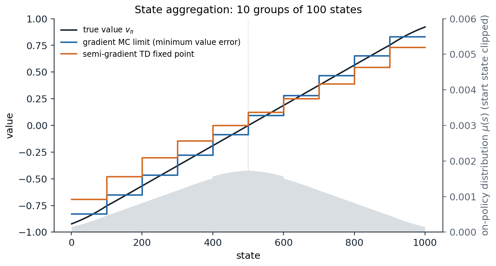
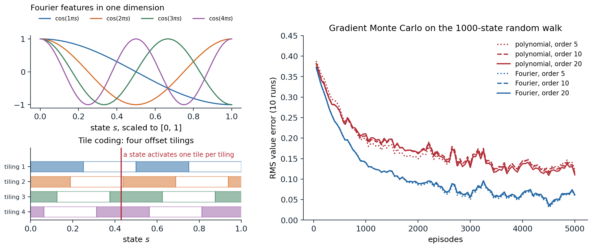
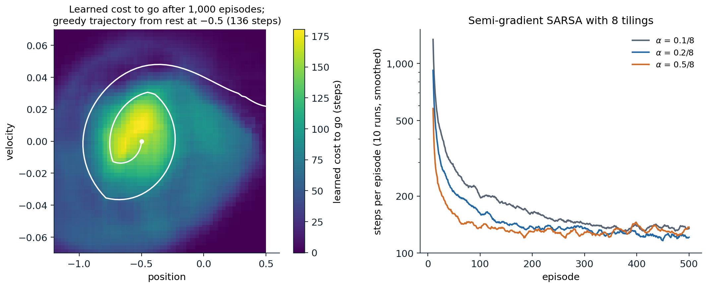

[ML Mastery Notes](../README.md) › [Reinforcement Learning](README.md)

# 11. Value Function Approximation

[← 10. Planning and Learning with Tabular Models](10-planning-and-learning-with-tabular-models.md) · [12. The Deadly Triad and Gradient-TD Methods →](12-the-deadly-triad-and-gradient-td-methods.md)

## <a id="from-tables-to-functions"></a>From tables to functions

### <a id="why-tables-are-not-enough"></a>Why tables are not enough

Every method so far has stored a separate value for each state or state–action pair. Tables are exact and simple to analyze, but they fail in two ways as problems grow. They need memory for every state, and a robot arm with seven joints already has more discretized states than any computer can store (chapter 2). More importantly, they do not **generalize**: a table learns nothing about a state it has never visited, and in large problems almost every state the agent encounters is new. A backgammon program sees positions it has never seen before in every game; a car sees a new camera image at every step.

**Function approximation** replaces the table by a parameterized function $\hat v(s,\mathbf w)\approx v_\pi(s)$ with a weight vector $\mathbf w\in\mathbb R^d$, usually with $d$ much smaller than the number of states. An update at one state changes $\mathbf w$, and so changes the estimated values of many other states: that is the generalization we want, and the source of every difficulty in this chapter. Any supervised learning method for regression could in principle be used, since each update, "move $\hat v(S_t)$ toward the target $U_t$," is a training example. But reinforcement learning makes unusual demands on the learner: it must learn online, from correlated data arriving one example at a time; the targets are nonstationary, since the policy changes during control; and with bootstrapping, the targets depend on the weights being learned. The methods of this chapter, linear methods in particular, are chosen because they handle these demands well and can be analyzed.

### <a id="the-prediction-objective"></a>The prediction objective

With a table, each state's value can be made exact, so no trade-off between states arises. With fewer weights than states, making one state's value more accurate generally makes others less accurate, and the objective must say which states matter. The standard choice is the **mean squared value error**,

$$
\overline{\mathrm{VE}}(\mathbf w)=\sum_s\mu(s)\bigl[v_\pi(s)-\hat v(s,\mathbf w)\bigr]^2,
$$

weighted by a distribution $\mu$ over states. Usually $\mu$ is the **on-policy distribution**, the fraction of time spent in each state while following $\pi$: in a continuing task, the stationary distribution of the Markov chain under $\pi$; in an episodic task, the expected number of visits per episode, $\eta(s)=h(s)+\sum_{\bar s}\eta(\bar s)\sum_a\pi(a\mid\bar s)p(s\mid\bar s,a)$ with start distribution $h$, normalized to sum to one. The states the agent actually visits are the ones whose values matter to its decisions. The objective is not necessarily the right one, since what we care about is the policy the values lead to, but it is the one the prediction methods of this chapter optimize or approximate.

## <a id="stochastic-gradient-and-semi-gradient-methods"></a>Stochastic-gradient and semi-gradient methods

### <a id="gradient-monte-carlo"></a>Gradient Monte Carlo

If the true values were available as targets, stochastic gradient descent on $\overline{\mathrm{VE}}$ would update the weights after each visit in the direction that reduces the error on that example:

$$
\mathbf w\leftarrow\mathbf w+\alpha\bigl[v_\pi(S_t)-\hat v(S_t,\mathbf w)\bigr]\nabla\hat v(S_t,\mathbf w),
$$

where $\nabla\hat v$ is the gradient with respect to $\mathbf w$ and the states are sampled from $\mu$ by following the policy. The true value is unknown, but any unbiased estimate of it can take its place without changing the expected update. The Monte Carlo return $G_t$ is one, and **gradient Monte Carlo** uses it:

$$
\mathbf w\leftarrow\mathbf w+\alpha\bigl[G_t-\hat v(S_t,\mathbf w)\bigr]\nabla\hat v(S_t,\mathbf w).
$$

It is a true stochastic gradient method, and with decreasing step sizes that satisfy the Robbins–Monro conditions it converges to a local minimum of $\overline{\mathrm{VE}}$, a global one for linear functions.

### <a id="semi-gradient-td"></a>Semi-gradient TD

A bootstrapped target such as $R_{t+1}+\gamma\hat v(S_{t+1},\mathbf w)$ is not an unbiased estimate of $v_\pi(S_t)$, and it depends on $\mathbf w$. Using it in the same update gives **semi-gradient TD(0)**:

$$
\mathbf w\leftarrow\mathbf w+\alpha\bigl[R_{t+1}+\gamma\hat v(S_{t+1},\mathbf w)-\hat v(S_t,\mathbf w)\bigr]\nabla\hat v(S_t,\mathbf w).
$$

It is called semi-gradient because it takes into account the effect of $\mathbf w$ on the estimate but ignores its effect on the target. It is not the gradient of any objective (chapter 12 explains why no such objective can be found), and it does not share the robustness of true gradient methods. In return it inherits the advantages of TD from chapter 6: it learns online, during episodes and in continuing tasks, and usually much faster. In the linear, on-policy case it converges, as the next section shows; off-policy or with nonlinear functions it can diverge.

### <a id="state-aggregation"></a>State aggregation

The simplest function approximator is **state aggregation**: states are grouped, and each group shares one weight. The value estimate of a state is its group's weight, and the gradient is the indicator of the state's group, so each update changes only that weight. Sutton and Barto's **1000-state random walk** makes a clear test. The states are numbered 1 to 1,000, every episode starts at state 500, and each step jumps to one of the 100 states on either side with equal probability; jumping past either end terminates the episode with reward $-1$ on the left and $+1$ on the right, and every other reward is 0. The true values rise almost linearly from $-0.92$ to $0.92$. With ten groups of 100 states, the code computes exactly where gradient Monte Carlo and semi-gradient TD(0) converge and compares them with the weights they learn from simulated episodes.

```python
import numpy as np

# State aggregation on the 1000-state random walk: 10 groups of 100 states, one weight per group. Compare the
# limits of gradient Monte Carlo (the minimum of the value error) and semi-gradient TD(0) (the TD fixed point),
# computed exactly, with the weights learned from simulated episodes.
N, J = 1000, 100
k = np.r_[-J:0, 1:J + 1]
P = np.zeros((N, N)); r = np.zeros(N)
for s in range(N):
    t = s + k
    r[s] = (np.sum(t >= N) - np.sum(t < 0)) / (2 * J)          # expected reward: +1 right exit, -1 left exit
    np.add.at(P[s], t[(t >= 0) & (t < N)], 1 / (2 * J))
v = np.linalg.solve(np.eye(N) - P, r)                          # true values
eta = np.linalg.solve(np.eye(N) - P.T, np.eye(N)[499])         # expected visits per episode from state 500
mu = eta / eta.sum()                                           # on-policy distribution
X = np.kron(np.eye(10), np.ones((100, 1)))                     # features: indicator of the state's group
D = np.diag(mu)
w_mc = np.linalg.solve(X.T @ D @ X, X.T @ D @ v)               # minimizes the mu-weighted value error
w_td = np.linalg.solve(X.T @ D @ (np.eye(N) - P) @ X, X.T @ D @ r)   # the TD fixed point
VE = lambda w: np.sqrt(mu @ (X @ w - v) ** 2)

rng = np.random.default_rng(0)


def episode():                                                 # the visited states and the final reward
    pos = np.array([499])
    while True:                                                # draw jumps in batches until the walk leaves
        pos = np.r_[pos, pos[-1] + np.cumsum(rng.choice(k, size=500))]
        out = np.flatnonzero((pos < 0) | (pos >= N))
        if len(out):
            return pos[:out[0]], (1.0 if pos[out[0]] >= N else -1.0)


w_gmc, alpha = np.zeros(10), 1e-4                              # gradient Monte Carlo, 50,000 episodes
for _ in range(50_000):
    states, G = episode()
    for g, c in zip(*np.unique(states // 100, return_counts=True)):   # c updates toward the same target G
        w_gmc[g] = G - (1 - alpha) ** c * (G - w_gmc[g])
w_std, alpha = [0.0] * 10, 0.002                               # semi-gradient TD(0), 50,000 episodes
for _ in range(50_000):
    states, G = episode()
    groups = (states // 100).tolist()
    for g, g2 in zip(groups[:-1], groups[1:]):
        w_std[g] += alpha * (w_std[g2] - w_std[g])             # reward 0, bootstrap from the next group
    w_std[groups[-1]] += alpha * (G - w_std[groups[-1]])       # the final step: reward G, then termination
w_std = np.array(w_std)
print("group:             " + "".join(f"{g:7d}" for g in range(1, 11)))
for name, w in [("MC limit (exact)", w_mc), ("gradient MC", w_gmc), ("TD fixed point", w_td), ("semi-gradient TD", w_std)]:
    print(f"{name:19s}" + "".join(f"{x:7.3f}" for x in w) + f"   RMS value error {VE(w):.4f}")
# group:                   1      2      3      4      5      6      7      8      9     10
# MC limit (exact)    -0.830 -0.652 -0.466 -0.279 -0.087  0.093  0.279  0.466  0.652  0.830   RMS value error 0.0544
# gradient MC         -0.836 -0.650 -0.455 -0.249 -0.061  0.133  0.328  0.499  0.676  0.838   RMS value error 0.0628
# TD fixed point      -0.693 -0.481 -0.303 -0.146 -0.001  0.122  0.250  0.388  0.544  0.731   RMS value error 0.1167
# semi-gradient TD    -0.696 -0.480 -0.299 -0.150 -0.013  0.108  0.232  0.371  0.529  0.731   RMS value error 0.1179
```

Gradient Monte Carlo converges to the minimum of the value error: each group's weight is the $\mu$-weighted average of its states' true values, with an RMS error of 0.054, and the learned weights fluctuate around it with a constant step size. Semi-gradient TD converges to a different point, with more than twice the error, 0.117: its staircase is flattened toward the center, so that the outer groups fall well short of the extreme true values, and it is lopsided, lying above the true values of every state in groups 1 to 4, because the start state sits at the right edge of group 5; starting at state 501 instead would give the mirror image. The next section explains why, and why the difference is the price of bootstrapping.



*State aggregation on the 1000-state random walk, with ten groups of 100 states. The black line is the true value function. The blue staircase is the limit of gradient Monte Carlo, the minimum of the value error weighted by the on-policy distribution (gray, with the spike at the start state clipped); within each group it is the weighted average of the true values, so it is least accurate at the edges of groups, and at the ends, where few states are visited. The orange staircase is the fixed point of semi-gradient TD(0), which is flattened toward the center, because each group's estimate bootstraps from neighboring groups' estimates, which lie closer to the center, and shifted up on the left, because the start state, which carries more weight than any other, sits at the right edge of the fifth group. The pattern reproduces Figures 9.1 and 9.2 of Sutton and Barto.*

## <a id="linear-methods"></a>Linear methods

### <a id="linear-value-functions"></a>Linear value functions

The most important special case is the **linear** approximator, $\hat v(s,\mathbf w)=\mathbf w^\top\mathbf x(s)=\sum_iw_ix_i(s)$, where $\mathbf x(s)$ is a **feature vector** representing state $s$. Its gradient is simply the feature vector, $\nabla\hat v(s,\mathbf w)=\mathbf x(s)$, so the updates take a particularly simple form, and $\overline{\mathrm{VE}}$ is a convex quadratic with a unique minimum when the features are linearly independent. State aggregation is linear with one-hot features, and a table is linear with one feature per state. Linear methods are the best understood approximators in reinforcement learning, and with good features they can be very effective. Their limitation is that all the representational power must come from the features, which have to be designed by hand, a limitation that deep networks remove at the cost of the guarantees.

### <a id="the-td-fixed-point"></a>The TD fixed point

With linear features, the expected semi-gradient TD(0) update, in steady state under the on-policy distribution, is

$$
\mathbb E\bigl[\mathbf w_{t+1}\mid\mathbf w_t\bigr]=\mathbf w_t+\alpha\bigl(\mathbf b-\mathbf A\mathbf w_t\bigr),\qquad
\mathbf A=\mathbb E\bigl[\mathbf x_t(\mathbf x_t-\gamma\mathbf x_{t+1})^\top\bigr],\quad\mathbf b=\mathbb E\bigl[R_{t+1}\mathbf x_t\bigr],
$$

where $\mathbf x_t=\mathbf x(S_t)$. If the algorithm converges, it must converge to the point where the expected update is zero, the **TD fixed point**

$$
\mathbf w_{\text{TD}}=\mathbf A^{-1}\mathbf b.
$$

In matrix form, with $\mathbf X$ the matrix of features of all states, $\mathbf D=\operatorname{diag}(\mu)$, and $\mathbf P_\pi$ the transition matrix, $\mathbf A=\mathbf X^\top\mathbf D(\mathbf I-\gamma\mathbf P_\pi)\mathbf X$. The iteration converges when $\mathbf A$ is positive definite, and [Tsitsiklis and Van Roy (1997)](https://doi.org/10.1109/9.580874) showed that it is when $\mu$ is the on-policy distribution: the matrix $\mathbf D(\mathbf I-\gamma\mathbf P_\pi)$ is then positive definite, because under the stationary distribution $\mathbf P_\pi$ cannot increase the $\mu$-weighted norm ([Appendix A](#block-rl11-appendix-a)). With decreasing step sizes, linear semi-gradient TD(0) converges with probability one to $\mathbf w_{\text{TD}}$.

The TD fixed point is not the minimum of $\overline{\mathrm{VE}}$, but it is not far from it. In a continuing task,

$$
\overline{\mathrm{VE}}(\mathbf w_{\text{TD}})\le\frac1{1-\gamma}\min_{\mathbf w}\overline{\mathrm{VE}}(\mathbf w),
$$

and for TD(λ) the factor is $(1-\gamma\lambda)/(1-\gamma)$, which reaches 1 at $\lambda=1$ (chapter 8). Tsitsiklis and Van Roy proved these factors for the RMS error, the square root of $\overline{\mathrm{VE}}$; the statements for $\overline{\mathrm{VE}}$ itself, in the form Sutton and Barto give, follow from the sharper argument of [Appendix A](#block-rl11-appendix-a). With $\gamma$ close to 1 the bound is loose, and the error of the TD solution can be much larger than the best achievable, as in the random walk. What TD buys with this asymptotic error is faster learning, since its updates have lower variance, and the ability to learn online. Geometrically, the TD fixed point is where the projection of the Bellman operator onto the span of the features has a fixed point, $\hat v=\Pi\mathcal T^\pi\hat v$, rather than the projection of the true value function, $\Pi v_\pi$; chapter 12 develops this view.

## <a id="feature-construction"></a>Feature construction

### <a id="choosing-features"></a>Choosing features

Linear methods are only as good as their features, and choosing features is where domain knowledge enters. Features should capture the aspects of the state that matter for its value, and the interactions among them: in a pole-balancing task, the angle and the angular velocity each matter, but so does their combination, since a high angular velocity is dangerous when the angle is large and useful when it corrects a small angle. A linear function of the two alone cannot express that. The standard constructions for continuous states, described below, all build many features that each respond to a region or a pattern of the state space.

- **Polynomials.** For a state with components $s_1,\dots,s_k$, the features are products $\prod_is_i^{c_i}$ with exponents up to $n$, giving $(n+1)^k$ features. They are the familiar basis of interpolation and regression, but they generalize poorly in reinforcement learning: a polynomial's value everywhere depends on every weight.
- **The Fourier basis.** With each component scaled to $[0,1]$, the features are $\cos(\pi\,\mathbf c^\top\mathbf s)$ for integer vectors $\mathbf c$ with entries from 0 to $n$ ([Konidaris, Osentoski, and Thomas, 2011](https://ojs.aaai.org/index.php/AAAI/article/view/7903)), also $(n+1)^k$ of them. They approximate smooth functions well, are simple to use, and in their experiments outperformed polynomial and radial basis features. Using a smaller step size for the higher-frequency features, $\alpha_i=\alpha/\|\mathbf c^{(i)}\|$, with $\alpha$ itself for the constant feature, helps.
- **Coarse coding.** Binary features that indicate whether the state lies in each of many overlapping regions, such as circles in a two-dimensional state space. The size and shape of the regions determine the generalization: an update at one state changes the values of all states sharing a region with it, in proportion to the overlap.
- **Tile coding.** A form of coarse coding in which the regions are the tiles of several **tilings**, grids that partition the state space, each offset from the others by a fraction of a tile ([Albus, 1975](https://doi.org/10.1115/1.3426922); [Sutton, 1996](https://proceedings.neurips.cc/paper/1995/hash/8f1d43620bc6bb580df6e80b0dc05c48-Abstract.html)). Each state activates exactly one tile per tiling, so the feature vector has exactly as many ones as there are tilings, which makes the computation cheap and the step size easy to set. The tile width controls how broadly updates generalize, and the number of tilings controls the resolution. Offsetting the tilings asymmetrically, by different multiples of a fraction of the tile width in each dimension, such as displacements proportional to 1, 3, 5, … in units of the tile width divided by the number of tilings, avoids artifacts along the diagonals, and **hashing** a large virtual tiling into a smaller table lets tile coding scale to many dimensions.
- **Radial basis functions.** Continuous generalizations of coarse coding, $x_i(s)=\exp\bigl(-\|s-c_i\|^2/2\sigma_i^2\bigr)$, which vary smoothly with the state at the cost of more computation, and are more sensitive to the choice of their centers and widths.



*Left: the first four nonconstant Fourier features of a one-dimensional state, and tile coding with four tilings of the unit interval, each offset from the last by a quarter of a tile width; a state activates one tile in each tiling. Right: gradient Monte Carlo on the 1000-state random walk with polynomial and Fourier features of orders 5, 10, and 20 (step sizes $10^{-4}$ and $5\times10^{-5}$), RMS value error averaged over 10 runs, with all six bases learning from the same episodes in each run. The Fourier basis learns faster and reaches half the error of the polynomial basis; within each family, the order hardly matters here, since the value function is smooth and the error is dominated by the noise of learning.*

The code reproduces the comparison of the figure.

```python
import numpy as np

# Polynomial versus Fourier features for gradient Monte Carlo on the 1000-state random walk (Sutton and Barto,
# Figure 9.5). The state s is scaled to [0, 1]; polynomial features s^i and Fourier features cos(i pi s), for
# i = 0..n. Step sizes 1e-4 (polynomial) and 5e-5 (Fourier); 5,000 episodes, 10 runs sharing their episodes.
N, J = 1000, 100
k = np.r_[-J:0, 1:J + 1]
P = np.zeros((N, N)); r = np.zeros(N)
for s in range(N):
    t = s + k
    r[s] = (np.sum(t >= N) - np.sum(t < 0)) / (2 * J)
    np.add.at(P[s], t[(t >= 0) & (t < N)], 1 / (2 * J))
v = np.linalg.solve(np.eye(N) - P, r)
eta = np.linalg.solve(np.eye(N) - P.T, np.eye(N)[499]); mu = eta / eta.sum()
x = np.arange(N) / (N - 1)
bases = {f"{kind} order {n}": (np.vstack([x ** i for i in range(n + 1)]).T if kind == "polynomial"
                               else np.vstack([np.cos(i * np.pi * x) for i in range(n + 1)]).T, alpha)
         for kind, alpha in [("polynomial", 1e-4), ("Fourier", 5e-5)] for n in (5, 10, 20)}
rng = np.random.default_rng(0)


def episode():
    pos = np.array([499])
    while True:
        pos = np.r_[pos, pos[-1] + np.cumsum(rng.choice(k, size=500))]
        out = np.flatnonzero((pos < 0) | (pos >= N))
        if len(out):
            return pos[:out[0]], (1.0 if pos[out[0]] >= N else -1.0)


checkpoints = [100, 1000, 5000]
err = {name: np.zeros(len(checkpoints)) for name in bases}
for run in range(10):
    data = [episode() for _ in range(checkpoints[-1])]
    for name, (F, alpha) in bases.items():
        w = np.zeros(F.shape[1]); c = 0
        for i, (states, G) in enumerate(data, 1):
            Xs = F[states]                                     # one update per visit, all toward the return G
            w += alpha * Xs.T @ (G - Xs @ w)                   # (made together at the end of the episode)
            if i in checkpoints:
                err[name][c] += np.sqrt(mu @ (F @ w - v) ** 2) / 10; c += 1
for name, e in err.items():
    print(f"{name:20s} RMS value error after 100 / 1,000 / 5,000 episodes: " + " / ".join(f"{x:.3f}" for x in e))
# polynomial order 5   RMS value error after 100 / 1,000 / 5,000 episodes: 0.372 / 0.199 / 0.122
# polynomial order 10  RMS value error after 100 / 1,000 / 5,000 episodes: 0.364 / 0.205 / 0.115
# polynomial order 20  RMS value error after 100 / 1,000 / 5,000 episodes: 0.361 / 0.210 / 0.110
# Fourier order 5      RMS value error after 100 / 1,000 / 5,000 episodes: 0.350 / 0.141 / 0.059
# Fourier order 10     RMS value error after 100 / 1,000 / 5,000 episodes: 0.350 / 0.140 / 0.060
# Fourier order 20     RMS value error after 100 / 1,000 / 5,000 episodes: 0.350 / 0.140 / 0.061
```

Tile coding also does well on this task (exercise 11.3): with 50 tilings of tiles 200 states wide, offset by 4 states each, it generalizes as broadly as state aggregation with 200-state groups but resolves the value function 50 times more finely, and after 5,000 episodes its error is 40% lower, 0.069 against 0.113, though still a little above the Fourier basis's 0.06.

### <a id="step-sizes-for-linear-methods"></a>Step sizes for linear methods

With a table, a step size of $\alpha=1/\tau$ moves an estimate a fraction $1/\tau$ of the way to its target, so it learns in about $\tau$ experiences. With features, the change in $\hat v(s)$ from one update at $s$ is $\alpha\,\mathbf x(s)^\top\mathbf x(s)$ times the error, so the corresponding rule of thumb is

$$
\alpha=\bigl(\tau\,\mathbb E[\mathbf x^\top\mathbf x]\bigr)^{-1},
$$

for learning in about $\tau$ experiences of similar feature vectors. With tile coding and $n$ tilings, $\mathbf x^\top\mathbf x=n$ always, so a step size of $\alpha=1/(10n)$ moves the value of a visited state a tenth of the way to its target, and the mountain car example below uses $\alpha=0.5/8$ with eight tilings. With features of very different scales, as in the polynomial basis, or of very different frequencies, as in the Fourier basis, normalizing the features, or scaling the step size per feature, matters more than the choice of $\alpha$.

## <a id="least-squares-methods"></a>Least-squares methods

### <a id="least-squares-td"></a>Least-squares TD

Semi-gradient TD approaches the fixed point $\mathbf A^{-1}\mathbf b$ by small stochastic steps. **Least-squares TD** (LSTD; [Bradtke and Barto, 1996](https://doi.org/10.1007/BF00114723); [Boyan, 2002](https://doi.org/10.1023/A:1017936530646)) computes it directly, by estimating $\mathbf A$ and $\mathbf b$ from all the data seen so far,

$$
\hat{\mathbf A}_t=\sum_{k<t}\mathbf x_k(\mathbf x_k-\gamma\mathbf x_{k+1})^\top+\varepsilon\mathbf I,\qquad\hat{\mathbf b}_t=\sum_{k<t}R_{k+1}\mathbf x_k,\qquad\mathbf w_t=\hat{\mathbf A}_t^{-1}\hat{\mathbf b}_t,
$$

with a small $\varepsilon$ for invertibility. It has no step size and uses every sample fully, so it is the most data-efficient form of linear TD. Its cost is $O(d^2)$ memory and $O(d^2)$ computation per step, with the inverse maintained incrementally by the Sherman–Morrison formula (exercise 11.5), against $O(d)$ for semi-gradient TD. With thousands of features, as tile coding easily produces, that difference matters; with dozens, LSTD is usually the better choice. Its other weakness is that it weights all past data equally, which is a problem when the policy changes, as in control.

```python
import numpy as np

# LSTD versus semi-gradient TD(0) on the 1000-state random walk with Fourier features of order 5. LSTD solves
# for the TD fixed point directly from the data seen so far; TD(0) moves toward it by stochastic steps.
N, J, n = 1000, 100, 5
k = np.r_[-J:0, 1:J + 1]
P = np.zeros((N, N)); r = np.zeros(N)
for s in range(N):
    t = s + k
    r[s] = (np.sum(t >= N) - np.sum(t < 0)) / (2 * J)
    np.add.at(P[s], t[(t >= 0) & (t < N)], 1 / (2 * J))
v = np.linalg.solve(np.eye(N) - P, r)
eta = np.linalg.solve(np.eye(N) - P.T, np.eye(N)[499]); mu = eta / eta.sum()
F = np.cos(np.pi * np.outer(np.arange(N) / (N - 1), np.arange(n + 1)))   # Fourier features, one row per state
D = np.diag(mu)
w_fix = np.linalg.solve(F.T @ D @ (np.eye(N) - P) @ F, F.T @ D @ r)      # the TD fixed point
VE = lambda w: np.sqrt(mu @ (F @ w - v) ** 2)
rng = np.random.default_rng(0)


def episode():
    pos = np.array([499])
    while True:
        pos = np.r_[pos, pos[-1] + np.cumsum(rng.choice(k, size=500))]
        out = np.flatnonzero((pos < 0) | (pos >= N))
        if len(out):
            return pos[:out[0]], (1.0 if pos[out[0]] >= N else -1.0)


checkpoints, runs = [10, 100, 1000], 10
res = {"LSTD": np.zeros(3), "TD(0), alpha = 0.01": np.zeros(3), "TD(0), alpha = 0.001": np.zeros(3)}
for run in range(runs):
    A, b = 1e-3 * np.eye(n + 1), np.zeros(n + 1)               # a small ridge term makes A invertible early on
    w1, w2 = np.zeros(n + 1), np.zeros(n + 1)
    for i in range(1, checkpoints[-1] + 1):
        states, G = episode()
        X = F[states]; X_next = np.vstack([X[1:], np.zeros(n + 1)])      # zero features after termination
        R = np.zeros(len(states)); R[-1] = G
        A += X.T @ (X - X_next); b += X.T @ R                   # LSTD statistics, O(d^2) per step
        for x, x2, rew in zip(X, X_next, R):                    # semi-gradient TD(0), O(d) per step
            w1 += 0.01 * (rew + x2 @ w1 - x @ w1) * x
            w2 += 0.001 * (rew + x2 @ w2 - x @ w2) * x
        if i in checkpoints:
            c = checkpoints.index(i)
            res["LSTD"][c] += VE(np.linalg.solve(A, b)) / runs
            res["TD(0), alpha = 0.01"][c] += VE(w1) / runs; res["TD(0), alpha = 0.001"][c] += VE(w2) / runs
print(f"RMS value error of the TD fixed point: {VE(w_fix):.3f}")
for name, e in res.items():
    print(f"{name:22s} after 10 / 100 / 1,000 episodes: " + " / ".join(f"{x:.3f}" for x in e))
# RMS value error of the TD fixed point: 0.008
# LSTD                   after 10 / 100 / 1,000 episodes: 0.197 / 0.080 / 0.025
# TD(0), alpha = 0.01    after 10 / 100 / 1,000 episodes: 0.375 / 0.120 / 0.077
# TD(0), alpha = 0.001   after 10 / 100 / 1,000 episodes: 0.402 / 0.373 / 0.105
```

After ten episodes LSTD's error is already half that of semi-gradient TD with a well-chosen step size, and after 1,000 episodes it is a third, 0.025 against 0.077, on its way to the fixed point's 0.008. Semi-gradient TD with a smaller step size is still far from it.

### <a id="least-squares-policy-iteration"></a>Least-squares policy iteration

**LSPI** ([Lagoudakis and Parr, 2003](https://jmlr.org/papers/v4/lagoudakis03a.html)) extends LSTD to control with a batch of data. It evaluates the action values of the current policy with **LSTDQ**, the action-value version of LSTD on state–action features, from a fixed set of transitions $(s,a,r,s')$ in which the next action is the one the current policy would take at $s'$; it then makes the policy greedy with respect to the new action values, and repeats. Since the same batch is reused for every policy, LSPI is an **off-policy**, batch method, closely related to fitted Q-iteration (chapter 12) and a direct ancestor of offline reinforcement learning (chapter 26). It often finds good policies in a few iterations, but, like approximate policy iteration in general, it can oscillate between policies instead of converging.

## <a id="control-with-function-approximation"></a>Control with function approximation

### <a id="episodic-semi-gradient-sarsa"></a>Episodic semi-gradient SARSA

Control uses the same ideas with action values, $\hat q(s,a,\mathbf w)\approx q_*(s,a)$, updated by semi-gradient SARSA:

$$
\mathbf w\leftarrow\mathbf w+\alpha\bigl[R_{t+1}+\gamma\hat q(S_{t+1},A_{t+1},\mathbf w)-\hat q(S_t,A_t,\mathbf w)\bigr]\nabla\hat q(S_t,A_t,\mathbf w),
$$

with ε-greedy or other soft policies derived from $\hat q$, exactly as in chapter 7. With a small discrete set of actions, the usual construction keeps one weight vector per action, or equivalently one set of features per action. Continuous actions require either discretization or the policy-gradient methods of chapter 13.

The **mountain car** task of Sutton and Barto (Example 10.1), also available as Gymnasium's `MountainCar-v0`, is the classic test. An underpowered car must drive up a steep hill to a goal on the right; gravity is stronger than its engine, so it must first back up the opposite slope and use the momentum to climb. The state is the position and velocity, the actions push left, not at all, or right, and every step costs $-1$ until the goal is reached. The task is hard for a myopic agent, since the way to the goal starts by moving away from it.

```python
import numpy as np

# Episodic semi-gradient SARSA with tile coding on the mountain car (Sutton and Barto, Example 10.1; the same
# dynamics as Gymnasium's MountainCar-v0). 8 tilings of 9 x 9 tiles over position and velocity, offset
# asymmetrically; one weight vector per action; q starts at 0, which is optimistic since every reward is -1,
# so the agent explores without epsilon. alpha = 0.5 / 8; 5 runs of 200 episodes.
X_MIN, X_MAX, V_MIN, V_MAX, TILINGS = -1.2, 0.5, -0.07, 0.07, 8
rng = np.random.default_rng(0)


def step(x, v, a):                                             # a in {0, 1, 2}: push left, none, right
    v = np.clip(v + 0.001 * (a - 1) - 0.0025 * np.cos(3 * x), V_MIN, V_MAX)
    x = np.clip(x + v, X_MIN, 0.6)
    if x == X_MIN:
        v = 0.0                                                # the left wall stops the car
    return x, v, x >= 0.5


def tiles(x, v):                                               # indices of the active tile in each tiling
    u = (x - X_MIN) / (X_MAX - X_MIN) * 8
    w = (v - V_MIN) / (V_MAX - V_MIN) * 8
    t = np.arange(TILINGS)
    i = np.floor(u + t * 1 / TILINGS).astype(int)              # displacements (1, 3) in units of 1/8 of a tile
    j = np.floor(w + (t * 3 % TILINGS) / TILINGS).astype(int)
    return t * 81 + np.minimum(i, 8) * 9 + np.minimum(j, 8)


def run(alpha, episodes=200):
    W = np.zeros((3, TILINGS * 81))
    lengths = []
    for _ in range(episodes):
        x, v = rng.uniform(-0.6, -0.4), 0.0
        f = tiles(x, v); q = W[:, f].sum(1)
        a = int(rng.choice(np.flatnonzero(q == q.max())))
        n, done = 0, False
        while not done and n < 10_000:
            x, v, done = step(x, v, a)
            n += 1
            if done:
                W[a, f] += alpha * (-1.0 - q[a])               # terminal: the target is the reward alone
                break
            f2 = tiles(x, v); q2 = W[:, f2].sum(1)
            a2 = int(rng.choice(np.flatnonzero(q2 == q2.max())))
            W[a, f] += alpha * (-1.0 + q2[a2] - q[a])          # semi-gradient SARSA; the gradient is the tile indicator
            f, q, a = f2, q2, a2
        lengths.append(n)
    return np.array(lengths)


L = np.array([run(0.5 / TILINGS) for _ in range(5)])
print(f"steps per episode: episode 1 {L[:, 0].mean():.0f}, episodes 2-10 {L[:, 1:10].mean():.0f},"
      f" 91-100 {L[:, 90:100].mean():.0f}, 191-200 {L[:, 190:].mean():.0f}")
# steps per episode: episode 1 1405, episodes 2-10 478, 91-100 143, 191-200 126
```

The first episode takes over a thousand steps, but exploration in this code needs no randomness: all weights start at zero, so every action looks worth 0 while every true value is negative, and the agent keeps trying actions whose values have not yet been driven down, the **optimistic initialization** of chapter 3 carried over to function approximation. Within a hundred episodes the car reaches the goal in about 140 steps, and it keeps improving slowly.



*Semi-gradient SARSA with eight tilings of $9\times9$ tiles on the mountain car. Left: the learned cost to go, $-\max_a\hat q(s,a,\mathbf w)$, over position and velocity after 1,000 episodes, and the greedy trajectory from rest at position $-0.5$, which rocks back and forth to build momentum and spirals out to the goal at the right edge. The highest costs lie in the middle, at low speed near the bottom of the valley, where the car has the most rocking left to do. Right: steps per episode for three step sizes, averaged over 10 runs and smoothed over 10 episodes, on a log scale. Larger step sizes learn faster early; after 500 episodes all three take about 120 to 140 steps.*

### <a id="n-step-methods-and-eligibility-traces"></a>n-step methods and eligibility traces

The multi-step methods of chapter 8 extend to function approximation directly. n-step semi-gradient SARSA uses the n-step return as its target, and SARSA(λ) keeps a trace vector $\mathbf z_t=\gamma\lambda\mathbf z_{t-1}+\nabla\hat q(S_t,A_t,\mathbf w_t)$ and updates $\mathbf w\leftarrow\mathbf w+\alpha\delta_t\mathbf z_t$. On the mountain car, intermediate values, $n$ around 4 to 8 or $\lambda$ around 0.9, learn fastest, as on the random walk. With binary features such as tile coding, replacing traces or the true online versions are the robust choices. Lab 5 implements tile-coded SARSA(λ), true online SARSA(λ), and LSPI on Gymnasium's mountain car.

## <a id="continuing-tasks-and-the-average-reward"></a>Continuing tasks and the average reward

### <a id="the-average-reward-setting"></a>The average-reward setting

Continuing tasks, which never end, were handled in the tabular case with discounting. With function approximation, discounting runs into a conceptual problem. Once values are approximated, the policy improvement theorem no longer holds: improving the approximate value of one state can worsen the policy elsewhere, so there is no longer a clean ordering of policies by their values in every state. What remains is an ordering by a single number that measures the policy's performance, and for continuing tasks the natural one is the **average reward** of chapter 2,

$$
r(\pi)=\lim_{h\to\infty}\frac1h\sum_{t=1}^h\mathbb E\bigl[R_t\mid A_{0:t-1}\sim\pi\bigr]=\sum_s\mu_\pi(s)\sum_a\pi(a\mid s)\sum_{s',r}p(s',r\mid s,a)\,r,
$$

with $\mu_\pi$ the stationary distribution. Sutton and Barto show that discounting adds nothing here: the discounted value averaged over the on-policy distribution is exactly $r(\pi)/(1-\gamma)$, so it orders policies exactly as the average reward does, whatever $\gamma$ (exercise 11.8). The discount factor becomes a parameter of the solution method, controlling the effective horizon of the bootstrapped targets, rather than part of the problem.

In the average-reward setting, values are defined by **differential returns**, $G_t=\sum_{k\ge0}\bigl(R_{t+k+1}-r(\pi)\bigr)$, the rewards measured relative to the average. The TD error becomes $\delta_t=R_{t+1}-\bar R_t+\hat v(S_{t+1},\mathbf w)-\hat v(S_t,\mathbf w)$, where $\bar R_t$ is an estimate of the average reward, itself updated by $\bar R\leftarrow\bar R+\beta\delta_t$. **Differential semi-gradient SARSA** uses the action-value version of this error and otherwise follows SARSA. Exercise 11.7 applies it to Sutton and Barto's access-control queuing task, in which an agent decides which customers to admit to a set of servers, and compares the learned policy with the optimal one computed by relative value iteration.

## <a id="toward-deep-networks"></a>Toward deep networks

### <a id="nonlinear-function-approximation"></a>Nonlinear function approximation

Linear methods need good features, and designing them becomes the bottleneck as problems grow. **Artificial neural networks** learn their features: a network's hidden layers compute a representation of the state, and the last layer is a linear function of it, so a deep value network is a linear method whose features are trained along with the weights (DL module). Semi-gradient TD applies unchanged, with the gradient computed by backpropagation, and this is how TD-Gammon worked in 1992 and how deep Q-networks work today (chapter 16).

What is lost is the theory. Semi-gradient TD with nonlinear functions can diverge even on-policy ([Tsitsiklis and Van Roy, 1997](https://doi.org/10.1109/9.580874) give an example), and combined with off-policy learning even linear TD can diverge (chapter 12). The correlated, nonstationary data of reinforcement learning also violate the independence assumptions under which stochastic gradient descent trains networks well. Deep reinforcement learning is largely a collection of techniques for making semi-gradient methods work with networks anyway: experience replay to decorrelate the data, target networks to stabilize the bootstrapped targets, normalization, and careful architectures, together with a growing understanding of how networks lose their ability to learn when trained on changing targets. Those are the subjects of Part II.

## <a id="exercises"></a>Exercises

### <a id="exercise-11-1-the-td-fixed-point-for-state-aggregation"></a>Exercise 11.1 — The TD fixed point for state aggregation

(a) Show that with state aggregation and the on-policy distribution, the minimum of $\overline{\mathrm{VE}}$ sets each group's weight to the $\mu$-weighted average of the true values of its states. (b) Show that the TD fixed point instead sets each group's weight to the $\mu$-weighted average, over the group's states, of the expected one-step target $\mathbb E[R_{t+1}+\gamma\hat v(S_{t+1})\mid S_t=s]$. (c) Use (b) to explain why the TD solution in the random walk is flattened toward the center and lopsided.


<details>
<summary><b>Solution</b></summary>


(a) With one-hot group features, $\overline{\mathrm{VE}}(\mathbf w)=\sum_g\sum_{s\in g}\mu(s)(v_\pi(s)-w_g)^2$ separates into one quadratic per group, minimized by $w_g=\sum_{s\in g}\mu(s)v_\pi(s)/\sum_{s\in g}\mu(s)$.

(b) The TD fixed point sets the expected update to zero: $\sum_s\mu(s)\mathbf x(s)\bigl(\mathbb E[R_{t+1}+\gamma\hat v(S_{t+1})\mid s]-\hat v(s)\bigr)=0$. The component for group $g$ is $\sum_{s\in g}\mu(s)\bigl(\mathbb E[R_{t+1}+\gamma\hat v(S_{t+1})\mid s]-w_g\bigr)=0$, so $w_g$ is the $\mu$-weighted average of the one-step targets over the group.

(c) Each group's weight is an average of one-step targets, which bootstrap from the estimates of the groups the walk jumps into. Near the right end, those targets mix the $+1$ rewards of jumps that leave the walk with the estimates of the group itself and of the group to its left, which are below the true values of the states the walk will actually reach; the estimates of those groups are pulled toward the center in the same way, so the bias compounds and flattens the staircase. The weighting matters too: the start state, visited once in every episode, carries about eight times the weight of an ordinary state, and since it sits at the right edge of group 5, it pulls that group's weight toward its own value, near 0, and the bootstrapped targets of the groups to its left carry the effect outward; starting at state 501 would give the mirror image. Monte Carlo targets carry the actual final reward and are affected by neither.

</details>


### <a id="exercise-11-2-positive-definiteness-of-the-key-matrix"></a>Exercise 11.2 — Positive definiteness of the key matrix

Let $\mathbf P$ be the transition matrix of an ergodic Markov chain with stationary distribution $\mu$, $\mathbf D=\operatorname{diag}(\mu)$, and $\gamma<1$. (a) Show that $\|\mathbf P\mathbf v\|_{\mathbf D}\le\|\mathbf v\|_{\mathbf D}$, where $\|\mathbf v\|_{\mathbf D}^2=\mathbf v^\top\mathbf D\mathbf v$. (b) Conclude that $\mathbf v^\top\mathbf D(\mathbf I-\gamma\mathbf P)\mathbf v>0$ for all $\mathbf v\ne0$, and that $\mathbf A=\mathbf X^\top\mathbf D(\mathbf I-\gamma\mathbf P)\mathbf X$ is positive definite when $\mathbf X$ has linearly independent columns. (c) Where does the argument use the on-policy distribution?


<details>
<summary><b>Solution</b></summary>


(a) By Jensen's inequality, $(\mathbf P\mathbf v)_s^2=\bigl(\sum_{s'}P_{ss'}v_{s'}\bigr)^2\le\sum_{s'}P_{ss'}v_{s'}^2$. Weighting by $\mu$ and using stationarity, $\sum_s\mu(s)P_{ss'}=\mu(s')$, gives $\|\mathbf P\mathbf v\|^2_{\mathbf D}\le\sum_{s'}\mu(s')v_{s'}^2=\|\mathbf v\|_{\mathbf D}^2$.

(b) By the Cauchy–Schwarz inequality in the $\mathbf D$ inner product, $\mathbf v^\top\mathbf D\mathbf P\mathbf v\le\|\mathbf v\|_{\mathbf D}\|\mathbf P\mathbf v\|_{\mathbf D}\le\|\mathbf v\|^2_{\mathbf D}$, so $\mathbf v^\top\mathbf D(\mathbf I-\gamma\mathbf P)\mathbf v\ge(1-\gamma)\|\mathbf v\|^2_{\mathbf D}>0$. For $\mathbf A$, apply this to $\mathbf v=\mathbf X\mathbf u$, which is nonzero for $\mathbf u\ne0$.

(c) Stationarity, $\mu^\top\mathbf P=\mu^\top$, is what makes $\mathbf P$ a non-expansion in the $\mathbf D$-norm. With another distribution, $\mathbf P$ can expand the norm, $\mathbf A$ can have eigenvalues with negative real part, and the expected TD update can push the weights away from the fixed point: the off-policy divergence of chapter 12. For episodic tasks with $\gamma=1$, the same argument works with the visit distribution $\eta$ and a substochastic $\mathbf P$.

</details>


### <a id="exercise-11-3-tile-coding-versus-state-aggregation"></a>Exercise 11.3 — Tile coding versus state aggregation

Compare gradient Monte Carlo on the 1000-state random walk with state aggregation into groups of 200 states and with tile coding of 50 tilings of the same width, each offset by 4 states. Divide the step size by the number of tilings.


<details>
<summary><b>Solution</b></summary>


```python
import numpy as np

# Tile coding versus state aggregation on the 1000-state random walk (Sutton and Barto, Figure 9.10), with
# gradient Monte Carlo. State aggregation: one tiling of tiles 200 states wide. Tile coding: 50 tilings of the
# same width, each offset by 4 states. Step size 1e-4 divided by the number of tilings; 5,000 episodes, 10 runs.
N, J = 1000, 100
k = np.r_[-J:0, 1:J + 1]
P = np.zeros((N, N)); r = np.zeros(N)
for s in range(N):
    t = s + k
    r[s] = (np.sum(t >= N) - np.sum(t < 0)) / (2 * J)
    np.add.at(P[s], t[(t >= 0) & (t < N)], 1 / (2 * J))
v = np.linalg.solve(np.eye(N) - P, r)
eta = np.linalg.solve(np.eye(N) - P.T, np.eye(N)[499]); mu = eta / eta.sum()


def tile_features(n_tilings, width=200, offset=4):
    """Binary features: tile j of tiling t covers the states j*width - t*offset to j*width - t*offset + width - 1."""
    cols = []
    for t in range(n_tilings):
        idx = (np.arange(N) + t * offset) // width                 # tile index of each state in tiling t
        cols.append(np.eye(idx.max() + 1)[idx])
    return np.hstack(cols)


rng = np.random.default_rng(0)


def episode():
    pos = np.array([499])
    while True:
        pos = np.r_[pos, pos[-1] + np.cumsum(rng.choice(k, size=500))]
        out = np.flatnonzero((pos < 0) | (pos >= N))
        if len(out):
            return pos[:out[0]], (1.0 if pos[out[0]] >= N else -1.0)


codings = {"state aggregation (1 tiling)": tile_features(1), "tile coding (50 tilings)": tile_features(50)}
checkpoints = [100, 1000, 5000]
err = {name: np.zeros(3) for name in codings}
for run in range(10):
    data = [episode() for _ in range(checkpoints[-1])]
    for name, F in codings.items():
        n_t = 1 if F.sum(1)[0] == 1 else 50
        w, alpha = np.zeros(F.shape[1]), 1e-4 / n_t
        for i, (states, G) in enumerate(data, 1):
            Xs = F[states]
            w += alpha * Xs.T @ (G - Xs @ w)
            if i in checkpoints:
                err[name][checkpoints.index(i)] += np.sqrt(mu @ (F @ w - v) ** 2) / 10
for name, e in err.items():
    print(f"{name:29s} RMS value error after 100 / 1,000 / 5,000 episodes: " + " / ".join(f"{x:.3f}" for x in e))
# state aggregation (1 tiling)  RMS value error after 100 / 1,000 / 5,000 episodes: 0.362 / 0.180 / 0.113
# tile coding (50 tilings)      RMS value error after 100 / 1,000 / 5,000 episodes: 0.362 / 0.174 / 0.069
```

Early on the two are identical in error, since both generalize over 200 states and the step size is normalized so that each visit moves a state's value equally. Later, tile coding keeps improving while state aggregation stalls at the error of its staircase: with 50 offset tilings, the value is a sum of 50 staircases shifted by 4 states, which can follow the nearly linear true values with steps of 4 states rather than 200. Tile coding decouples the breadth of generalization, set by the tile width, from the resolution of the final approximation, set by the number of tilings, which is what makes it so effective in low-dimensional continuous problems.

</details>


### <a id="exercise-11-4-designing-a-tile-coder"></a>Exercise 11.4 — Designing a tile coder

A two-dimensional state space $[0,1]^2$ is tile-coded with 8 offset tilings of tiles $0.1\times0.1$ in size. (a) How many features are there, and how many are active for each state? (b) With $\alpha=0.1/8$, how far does one update move the value of the visited state toward its target, and the value of a state half a tile away along one axis? (c) If the value function varies much faster in the first dimension than in the second, how should the tiles be shaped?


<details>
<summary><b>Solution</b></summary>


(a) With the tilings offset, each needs $11\times11$ tiles to cover the space, so there are $8\times121=968$ features, of which exactly 8 are active for every state.

(b) The update changes each active weight by $\alpha$ times the error, so the value of the visited state changes by $8\alpha=0.1$ times the error: a tenth of the way to the target. A state half a tile away shares the tile of about half the tilings, depending on the offsets, so its value moves about $0.05$ of the way; a state a full tile width or more away along either axis shares no tile with it and is not affected.

(c) Use narrower tiles in the first dimension, for example $20\times5$ tiles per tiling, or several groups of tilings with different shapes, some of which ignore the second dimension altogether. Tilings over subsets of the dimensions are the standard way to control generalization in higher-dimensional problems, since a full grid over $k$ dimensions needs a number of tiles exponential in $k$.

</details>


### <a id="exercise-11-5-incremental-lstd"></a>Exercise 11.5 — Incremental LSTD

Show how to maintain $\hat{\mathbf A}_t^{-1}$ in $O(d^2)$ per step, and verify it numerically.


<details>
<summary><b>Solution</b></summary>


Each step adds a rank-one term, $\hat{\mathbf A}_{t+1}=\hat{\mathbf A}_t+\mathbf x_t\mathbf y_t^\top$ with $\mathbf y_t=\mathbf x_t-\gamma\mathbf x_{t+1}$. The Sherman–Morrison formula gives the inverse of a rank-one update from the old inverse:

$$
\hat{\mathbf A}_{t+1}^{-1}=\hat{\mathbf A}_t^{-1}-\frac{\hat{\mathbf A}_t^{-1}\mathbf x_t\,\mathbf y_t^\top\hat{\mathbf A}_t^{-1}}{1+\mathbf y_t^\top\hat{\mathbf A}_t^{-1}\mathbf x_t},
$$

which needs two matrix–vector products and an outer product, $O(d^2)$ in all, starting from $\hat{\mathbf A}_0^{-1}=\varepsilon^{-1}\mathbf I$. The weights are $\mathbf w_{t+1}=\hat{\mathbf A}_{t+1}^{-1}\hat{\mathbf b}_{t+1}$, another $O(d^2)$ product.

```python
import numpy as np

# Incremental LSTD: maintain the inverse of A with the Sherman-Morrison formula, O(d^2) per step, and compare
# with inverting the accumulated A directly. 1000-state random walk, Fourier features of order 5, 100 episodes.
N, J, n, eps = 1000, 100, 5, 1e-3
k = np.r_[-J:0, 1:J + 1]
F = np.cos(np.pi * np.outer(np.arange(N) / (N - 1), np.arange(n + 1)))
rng = np.random.default_rng(0)
A, A_inv, b = eps * np.eye(n + 1), np.eye(n + 1) / eps, np.zeros(n + 1)
steps = 0
for _ in range(100):
    s = 499
    while 0 <= s < N:
        s2 = s + int(rng.choice(k))
        x = F[s]; x2 = F[s2] if 0 <= s2 < N else np.zeros(n + 1)
        reward = 0.0 if 0 <= s2 < N else (1.0 if s2 >= N else -1.0)
        y = x - x2                                           # gamma = 1
        A += np.outer(x, y); b += reward * x
        Ax = A_inv @ x; yA = y @ A_inv
        A_inv -= np.outer(Ax, yA) / (1 + yA @ x)             # Sherman-Morrison rank-one update
        s, steps = s2, steps + 1
w_inc, w_direct = A_inv @ b, np.linalg.solve(A, b)
print(f"{steps:,} steps; relative difference of the inverses {np.abs(A_inv - np.linalg.inv(A)).max() / np.abs(A_inv).max():.1e},"
      f" of the weights {np.abs(w_inc - w_direct).max() / np.abs(w_direct).max():.1e}")
# 8,009 steps; relative difference of the inverses 6.5e-15, of the weights 1.9e-15
```

The inverse maintained this way agrees with a direct inversion to rounding error. The denominator can come close to zero when $\hat{\mathbf A}$ is nearly singular, which is why the $\varepsilon\mathbf I$ initialization matters; periodically recomputing the inverse from scratch guards against the slow accumulation of rounding errors.

</details>


### <a id="exercise-11-6-counting-fourier-features"></a>Exercise 11.6 — Counting Fourier features

(a) How many Fourier features of order $n$ are there for a $k$-dimensional state? (b) For the mountain car ($k=2$) with $n=5$, and for a robot with $k=12$ state variables with $n=3$? (c) What are the options when the count is too large?


<details>
<summary><b>Solution</b></summary>


(a) One feature for each vector $\mathbf c\in\{0,\dots,n\}^k$: $(n+1)^k$.

(b) 36 for the mountain car, and $4^{12}\approx1.7\times10^7$ for the robot.

(c) Restrict the coefficient vectors: keep only those with at most two nonzero entries, which captures each variable and each pairwise interaction, giving $1+kn+\binom k2n^2$ features, or use prior knowledge to include only the interactions that matter. Tile coding faces the same problem and uses the same remedy, tilings over subsets of the variables. Beyond a dozen or so dimensions with strong interactions, learned features, that is neural networks, become the practical choice.

</details>


### <a id="exercise-11-7-differential-sarsa-on-the-access-control-queue"></a>Exercise 11.7 — Differential SARSA on the access-control queue

Ten servers serve customers of priorities 1, 2, 4, and 8, who pay their priority if admitted; a busy server frees up with probability 0.06 per step. Learn a policy with tabular differential semi-gradient SARSA ($\alpha=\beta=0.01$, $\varepsilon=0.1$, two million steps), and compare it with the optimal policy from relative value iteration.


<details>
<summary><b>Solution</b></summary>


```python
import numpy as np

# Differential semi-gradient SARSA (tabular) on the access-control queuing task (Sutton and Barto, Example 10.2).
# 10 servers; at each step the customer at the head of the queue has priority 1, 2, 4, or 8 (equally likely) and
# pays that reward if accepted, which needs a free server; each busy server frees up with probability 0.06 per
# step. The task never ends, so the goal is the average reward. alpha = 0.01, beta = 0.01, epsilon = 0.1.
rng = np.random.default_rng(0)
servers, p_free, prios = 10, 0.06, [1, 2, 4, 8]
Q = np.zeros((servers + 1, 4, 2))                              # (free servers, priority index, reject/accept)
r_bar, alpha, beta, eps = 0.0, 0.01, 0.01, 0.1


def act(f, p):
    if f == 0:
        return 0                                               # no free server: the customer must be rejected
    if rng.random() < eps:
        return int(rng.integers(2))
    return int(Q[f, p, 1] > Q[f, p, 0] or (Q[f, p, 1] == Q[f, p, 0] and rng.random() < 0.5))


free, p = servers, int(rng.integers(4))
a = act(free, p)
recent = 0.0
for t in range(2_000_000):
    reward = prios[p] if a == 1 else 0
    if t >= 1_800_000:
        recent += reward / 200_000
    busy = servers - free + a
    free2 = free - a + int(rng.binomial(busy, p_free))         # some busy servers become free
    p2 = int(rng.integers(4)); a2 = act(free2, p2)
    delta = reward - r_bar + Q[free2, p2, a2] - Q[free, p, a]
    r_bar += beta * delta                                      # the average-reward estimate learns from TD errors
    Q[free, p, a] += alpha * delta
    free, p, a = free2, p2, a2
print(f"average reward per step: estimate {r_bar:.2f}; actually received in the last 200,000 steps {recent:.2f}")
print("learned greedy policy (1 = accept), rows by priority, columns by number of free servers 1..10:")
for i, pr in enumerate(prios):
    print(f"  priority {pr}: " + " ".join(str(int(Q[f, i, 1] > Q[f, i, 0])) for f in range(1, servers + 1)))

# the optimal policy, by relative value iteration on the known model
from scipy.stats import binom
trans = {(f, acc): (f - acc + np.arange(servers - f + acc + 1), binom.pmf(np.arange(servers - f + acc + 1), servers - f + acc, p_free))
         for f in range(servers + 1) for acc in (0, 1) if f > 0 or acc == 0}
h = np.zeros(servers + 1)                                      # relative values of the free-server counts
for _ in range(1000):
    Qm = np.full((servers + 1, 4, 2), -np.inf)
    for (f, acc), (nxt, pr) in trans.items():
        Qm[f, :, acc] = np.array(prios) * acc + pr @ h[nxt]
    v = Qm.max(2).mean(1)                                      # average over the next customer's priority
    gain, h = v[servers], v - v[servers]
print(f"optimal average reward (relative value iteration): {gain:.2f}; optimal policy:")
for i, pr in enumerate(prios):
    print(f"  priority {pr}: " + " ".join(str(int(Qm[f, i, 1] > Qm[f, i, 0])) for f in range(1, servers + 1)))
# average reward per step: estimate 2.63; actually received in the last 200,000 steps 2.64
# learned greedy policy (1 = accept), rows by priority, columns by number of free servers 1..10:
#   priority 1: 0 0 0 0 0 1 1 1 1 0
#   priority 2: 0 0 1 1 1 1 1 1 1 0
#   priority 4: 1 1 1 1 1 1 1 1 1 0
#   priority 8: 1 1 1 1 1 1 1 1 1 1
# optimal average reward (relative value iteration): 2.75; optimal policy:
#   priority 1: 0 0 0 0 0 0 0 0 0 0
#   priority 2: 0 0 0 1 1 1 1 1 1 1
#   priority 4: 1 1 1 1 1 1 1 1 1 1
#   priority 8: 1 1 1 1 1 1 1 1 1 1
```

The optimal policy is a threshold policy: always admit priorities 8 and 4, admit priority 2 only when at least four servers are free, and never admit priority 1, whose reward is not worth tying up a server for about 17 steps when a better customer may arrive. The learned policy agrees on the high priorities and has similar thresholds for the low ones, admitting priority 1 when six to nine servers are free, a mistake that costs little because those states are rare. With all ten servers free, a state that the learned policy almost never reaches, its greedy choices are arbitrary. The learned average reward, about 2.64 while exploring 10% of the time, is close to the optimal 2.75. The average-reward estimate itself tracks the rewards actually received, which confirms that the differential TD error is doing its job.

</details>


### <a id="exercise-11-8-discounting-does-not-matter-on-average"></a>Exercise 11.8 — Discounting does not matter on average

In a continuing task with stationary distribution $\mu_\pi$, show that $\sum_s\mu_\pi(s)v_\pi^\gamma(s)=r(\pi)/(1-\gamma)$, where $v^\gamma_\pi$ is the discounted value. What does this imply for choosing policies by their average discounted value?


<details>
<summary><b>Solution</b></summary>


Write $v^\gamma_\pi=\sum_{k\ge0}\gamma^k\mathbf P_\pi^k\mathbf r_\pi$. Then $\mu_\pi^\top v^\gamma_\pi=\sum_k\gamma^k\mu_\pi^\top\mathbf P_\pi^k\mathbf r_\pi=\sum_k\gamma^k\mu_\pi^\top\mathbf r_\pi=r(\pi)/(1-\gamma)$, using $\mu_\pi^\top\mathbf P_\pi=\mu_\pi^\top$ and $\mu_\pi^\top\mathbf r_\pi=r(\pi)$. The average discounted value is proportional to the average reward, with the same constant for every policy, so ranking policies by it is the same as ranking them by the average reward: the discount factor has no effect on which policy is best by this criterion. Discounting still matters inside algorithms, where it shortens the horizon of bootstrapped targets and bounds the values, but not as part of the objective. This is Sutton and Barto's argument for the average-reward formulation of continuing control with function approximation.

</details>


## <a id="appendices"></a>Appendices


<details>
<summary><a id="block-rl11-appendix-a"></a><b>A. Convergence of linear semi-gradient TD</b></summary>


Write the linear TD(0) update as $\mathbf w_{t+1}=\mathbf w_t+\alpha_t\bigl(\mathbf b_t-\mathbf A_t\mathbf w_t\bigr)$ with $\mathbf A_t=\mathbf x_t(\mathbf x_t-\gamma\mathbf x_{t+1})^\top$ and $\mathbf b_t=R_{t+1}\mathbf x_t$. Under the on-policy distribution, and for an ergodic chain, the averages of $\mathbf A_t$ and $\mathbf b_t$ are $\mathbf A$ and $\mathbf b$ of the chapter. The ODE method of stochastic approximation ([Benveniste, Métivier, and Priouret, 1990](https://doi.org/10.1007/978-3-642-75894-2); [Borkar, 2008](https://doi.org/10.1007/978-93-86279-38-5)) says that with decreasing step sizes the iterates track the solutions of $\dot{\mathbf w}=\mathbf b-\mathbf A\mathbf w$, which converge to $\mathbf A^{-1}\mathbf b$ from any starting point when all eigenvalues of $\mathbf A$ have positive real part, in particular when $\mathbf A$ is positive definite. Exercise 11.2 establishes positive definiteness for the on-policy distribution, and [Tsitsiklis and Van Roy (1997)](https://doi.org/10.1109/9.580874) give the complete argument, which must also handle the dependence between successive samples of a Markov chain, and extend it to TD(λ).

**The error bound.** Let $\Pi$ be the projection onto the span of the features in the $\mathbf D$-norm. The TD fixed point satisfies $\hat{\mathbf v}=\Pi\mathcal T^\pi\hat{\mathbf v}$, and $\Pi\mathcal T^\pi$ is a $\gamma$-contraction in that norm, since $\Pi$ is a non-expansion and $\mathcal T^\pi$ is a $\gamma$-contraction by exercise 11.2. Then

$$
\|\hat{\mathbf v}-v_\pi\|_{\mathbf D}\le\|\hat{\mathbf v}-\Pi v_\pi\|_{\mathbf D}+\|\Pi v_\pi-v_\pi\|_{\mathbf D}=\|\Pi\mathcal T^\pi\hat{\mathbf v}-\Pi\mathcal T^\pi v_\pi\|_{\mathbf D}+\|\Pi v_\pi-v_\pi\|_{\mathbf D}\le\gamma\|\hat{\mathbf v}-v_\pi\|_{\mathbf D}+\|\Pi v_\pi-v_\pi\|_{\mathbf D},
$$

so $\|\hat{\mathbf v}-v_\pi\|_{\mathbf D}\le\frac1{1-\gamma}\|\Pi v_\pi-v_\pi\|_{\mathbf D}$, the bound of Tsitsiklis and Van Roy for $\lambda=0$. It bounds the RMS error, so squaring it gives only $\overline{\mathrm{VE}}(\mathbf w_{\text{TD}})\le\frac1{(1-\gamma)^2}\min_{\mathbf w}\overline{\mathrm{VE}}(\mathbf w)$, and the bound of the chapter needs a sharper argument. Since $\hat{\mathbf v}-\Pi v_\pi$ lies in the span of the features and $\Pi v_\pi-v_\pi$ is $\mathbf D$-orthogonal to it, the Pythagorean theorem gives $\|\hat{\mathbf v}-v_\pi\|_{\mathbf D}^2=\|\hat{\mathbf v}-\Pi v_\pi\|_{\mathbf D}^2+\|\Pi v_\pi-v_\pi\|_{\mathbf D}^2\le\gamma^2\|\hat{\mathbf v}-v_\pi\|_{\mathbf D}^2+\|\Pi v_\pi-v_\pi\|_{\mathbf D}^2$, so $\overline{\mathrm{VE}}(\mathbf w_{\text{TD}})\le\frac1{1-\gamma^2}\min_{\mathbf w}\overline{\mathrm{VE}}(\mathbf w)$, a factor $1/\sqrt{1-\gamma^2}$ on the RMS error. Since $1-\gamma^2=(1-\gamma)(1+\gamma)\ge1-\gamma$, this implies the chapter's $\overline{\mathrm{VE}}(\mathbf w_{\text{TD}})\le\frac1{1-\gamma}\min_{\mathbf w}\overline{\mathrm{VE}}(\mathbf w)$. For TD(λ), the same argument with the contraction factor $\kappa=\gamma(1-\lambda)/(1-\gamma\lambda)$ in place of $\gamma$ gives $1/(1-\kappa^2)\le1/(1-\kappa)=(1-\gamma\lambda)/(1-\gamma)$.

</details>


<details>
<summary><a id="block-rl11-appendix-b"></a><b>B. Tile coding with hashing</b></summary>


A tile coder with $n$ tilings over $k$ dimensions, each with $m$ tiles per dimension, has $nm^k$ tiles, most of which are never visited when the states lie on a lower-dimensional region of the space. **Hashing** maps each tile, identified by its tiling and integer coordinates, to an index in a table of fixed size $M$ by a hash function, so memory is $O(M)$ regardless of $m$ and $k$. Collisions merge unrelated tiles into one feature, which adds noise to the generalization, but since the colliding tiles are usually far apart in the state space and rarely both visited, the effect is small when $M$ is several times the number of tiles actually used. Sutton's tile-coding software uses an **index hash table** that assigns consecutive indices to tiles as they are first visited, which avoids collisions entirely until the table is full. The same idea appears in the hashing trick for large sparse features in supervised learning, and in the hash-based counts used for exploration bonuses (chapter 22).

</details>

---

[← 10. Planning and Learning with Tabular Models](10-planning-and-learning-with-tabular-models.md) · [12. The Deadly Triad and Gradient-TD Methods →](12-the-deadly-triad-and-gradient-td-methods.md)
