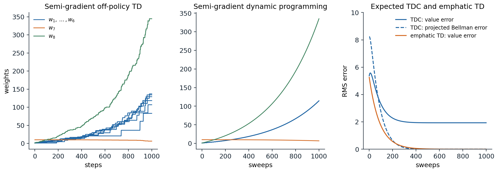
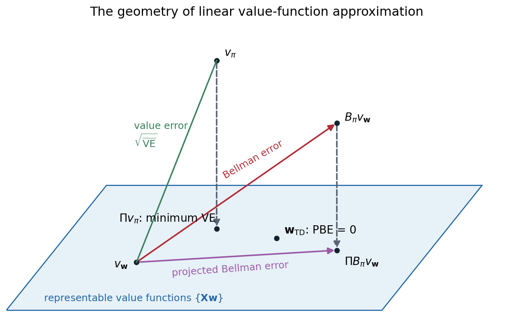

[ML Mastery Notes](../README.md) › [Reinforcement Learning](README.md)

# 12. The Deadly Triad and Gradient-TD Methods

[← 11. Value Function Approximation](11-value-function-approximation.md) · [13. Policy Gradient and Actor-Critic Methods →](13-policy-gradient-and-actor-critic-methods.md)

## <a id="off-policy-learning-with-function-approximation"></a>Off-policy learning with function approximation

### <a id="when-semi-gradient-methods-diverge"></a>When semi-gradient methods diverge

Chapter 11 showed that linear semi-gradient TD converges when it learns on-policy, because the on-policy distribution makes the key matrix $\mathbf A=\mathbf X^\top\mathbf D(\mathbf I-\gamma\mathbf P_\pi)\mathbf X$ positive definite. Chapter 9 developed off-policy learning, in which the data come from a behavior policy $b$ and the values sought are those of a target policy $\pi$, and showed that tabular off-policy methods converge. Combined, the two can fail. Off-policy semi-gradient TD updates the states in the proportions the behavior visits them, weighted by importance-sampling ratios, but the targets are those of the target policy, and with function approximation this mismatch can make the weights grow without bound.

The smallest example has two states whose values are $w$ and $2w$, a single shared weight. Suppose a transition from the first state to the second, with reward 0, is observed and updated repeatedly, while the transition out of the second state, which the target policy would also follow, is never updated. The TD error is $0+\gamma\cdot2w-w=(2\gamma-1)w$, and the update is $w\leftarrow w+\alpha(2\gamma-1)w$: for $\gamma>1/2$, every update increases $w$, and the more it grows, the larger the next increase. Updating the first state raises the estimate of the second, which raises the target of the first. On-policy, the second state's own transitions would be updated as often as the policy visits it, and they would pull $w$ back; off-policy, nothing guarantees that.

### <a id="baird-s-counterexample"></a>Baird's counterexample

[Baird (1995)](https://doi.org/10.1016/B978-1-55860-377-6.50013-X) built a complete example in which even exact, expected updates diverge. There are seven states. The value of each of the six upper states is $2w_i+w_8$, and the value of the lower state is $w_7+2w_8$, so there are eight weights for seven states and every value function can be represented, including the true one. The behavior policy takes a "dashed" action, which moves to one of the six upper states at random, with probability $6/7$, and a "solid" action, which moves to the lower state, with probability $1/7$, so the next state is uniform over all seven and the behavior's state distribution is uniform. The target policy always takes the solid action. All rewards are 0, and $\gamma=0.99$, so $v_\pi=0$, represented exactly by $\mathbf w=0$.

```python
import numpy as np

# Baird's counterexample (Sutton and Barto, Section 11.2 and Figure 11.1). Seven states; the value of each of
# the upper six is 2 w_i + w_8 and of the lower one w_7 + 2 w_8. The behavior policy moves to a uniformly random
# state (the "dashed" action to one of the upper six with probability 6/7, the "solid" action to the lower one
# with 1/7); the target policy always takes the solid action. All rewards are 0 and gamma = 0.99, so v_pi = 0,
# which w = 0 represents.
X = np.zeros((7, 8))
for i in range(6):
    X[i, i], X[i, 7] = 2, 1
X[6, 6], X[6, 7] = 1, 2
gamma, alpha = 0.99, 0.01
w0 = np.array([1, 1, 1, 1, 1, 1, 10, 1], float)

# semi-gradient off-policy TD(0) on sampled transitions
rng = np.random.default_rng(0)
w, s = w0.copy(), int(rng.integers(7))
for t in range(1, 1001):
    solid = rng.random() < 1 / 7
    s2 = 6 if solid else int(rng.integers(6))
    rho = 7.0 if solid else 0.0                                   # pi(solid) / b(solid) = 1 / (1/7)
    delta = 0 + gamma * X[s2] @ w - X[s] @ w
    w += alpha * rho * delta * X[s]
    s = s2
    if t in (100, 500, 1000):
        print(f"semi-gradient TD, {t:4d} steps: w = {np.round(w, 1)}")

# semi-gradient dynamic programming: expected updates of every state, synchronously
w = w0.copy()
for k in range(1, 1001):
    target = gamma * X[6] @ w                                    # the target policy always goes to the lower state
    w = w + alpha / 7 * X.T @ (target - X @ w)
    if k in (100, 1000):
        print(f"semi-gradient DP, {k:4d} sweeps: |w| = {np.linalg.norm(w):.3g}")
# semi-gradient TD,  100 steps: w = [ 6.1  3.6  1.   4.1  5.   2.9 10.   9.3]
# semi-gradient TD,  500 steps: w = [20.7 21.3 23.4 25.6 24.9 30.1  9.6 70.2]
# semi-gradient TD, 1000 steps: w = [ 83.  106.8 129.1 118.3 136.9 134.1   6.3 344.7]
# semi-gradient DP,  100 sweeps: |w| = 16.8
# semi-gradient DP, 1000 sweeps: |w| = 437
```

Both semi-gradient off-policy TD, on sampled transitions, and **semi-gradient dynamic programming**, which applies the expected update to every state at once with no sampling at all, drive the weights to infinity. The instability is not noise: it is in the expected update. The problem cannot be blamed on the features either, since the true value function is representable and tabular TD would find it. Nor is it caused by the particular algorithm: [Tsitsiklis and Van Roy (1996)](https://doi.org/10.1007/BF00114724) showed that even fitted value iteration with least-squares regression, which recomputes the best fit to the backed-up values at every iteration, diverges on a two-state problem like the one above (exercise 12.7), and Q-learning with linear function approximation can diverge as well.



*Baird's counterexample, starting from $\mathbf w=(1,1,1,1,1,1,10,1)$ with $\gamma=0.99$. Left: semi-gradient off-policy TD(0) on sampled transitions, $\alpha=0.01$; the weights of the upper states (blue) and the shared weight $w_8$ (green) grow without bound. Middle: semi-gradient dynamic programming, the same update applied in expectation to all states; the divergence is smooth and inevitable. Right: two stable alternatives, both applied in expectation. TDC, a gradient-TD method, drives the projected Bellman error to zero, but its value error settles near 1.9; emphatic TD, with $\alpha=0.003$, drives the value error itself to zero. The panels follow Figures 11.2, 11.5, and 11.6 of Sutton and Barto, whose emphatic-TD panel uses $\alpha=0.03$.*

### <a id="the-deadly-triad"></a>The deadly triad

Sutton and Barto identify three ingredients whose combination risks instability and divergence, the **deadly triad**:

- **Function approximation**, which generalizes from updated states to others, with many fewer parameters than states.
- **Bootstrapping**, which updates toward targets that include current estimates, as TD methods and dynamic programming do, rather than toward complete returns.
- **Off-policy training**, which updates on a distribution of transitions other than the one produced by the target policy.

Any two of them are safe. Without function approximation, tabular off-policy TD and Q-learning converge. Without bootstrapping, Monte Carlo methods minimize a well-defined error by stochastic gradient descent and cannot diverge, on-policy or off. Without off-policy training, linear semi-gradient TD converges to the TD fixed point. Each ingredient is hard to give up. Function approximation is required by any large problem. Bootstrapping makes learning faster and more data-efficient and is needed for online learning in continuing tasks. Off-policy learning is needed for Q-learning, for learning from replayed or logged data, and for learning many predictions at once. The rest of this chapter examines why the triad is dangerous and what can be done about it: understanding the geometry of the objectives, deriving true gradient methods for a well-chosen one, reweighting the updates, and, in practice, a collection of stabilizing techniques.

## <a id="the-geometry-of-linear-value-function-approximation"></a>The geometry of linear value-function approximation

### <a id="value-functions-as-vectors"></a>Value functions as vectors

A value function over $n$ states is a vector in $\mathbb R^n$. A linear approximator with $d<n$ features can represent only the vectors $\mathbf X\mathbf w$ in a $d$-dimensional subspace. Distances are measured in the norm weighted by the state distribution, $\|\mathbf v\|_\mu^2=\sum_s\mu(s)v(s)^2$, and the **projection** $\Pi$ maps any value function to the closest representable one in that norm, $\Pi\mathbf v=\mathbf X(\mathbf X^\top\mathbf D\mathbf X)^{-1}\mathbf X^\top\mathbf D\mathbf v$. The Bellman operator $\mathcal B_\pi$ (written $\mathcal T^\pi$ in earlier chapters) maps a representable value function to a vector that is usually not representable.

Several objectives can be defined in this picture, and they are not equivalent:

- The **value error**, $\overline{\mathrm{VE}}(\mathbf w)=\|\mathbf X\mathbf w-v_\pi\|_\mu^2$, the distance to the true value function. Its minimum is $\Pi v_\pi$, but $v_\pi$ is unknown and can only be estimated through returns, as Monte Carlo methods do.
- The **Bellman error**, $\overline{\mathrm{BE}}(\mathbf w)=\|\mathcal B_\pi\mathbf X\mathbf w-\mathbf X\mathbf w\|_\mu^2$, the size of the expected TD error vector $\bar\delta_{\mathbf w}(s)=\mathbb E_\pi[R_{t+1}+\gamma\hat v(S_{t+1},\mathbf w)-\hat v(S_t,\mathbf w)\mid S_t=s]$. It is zero only at the true value function, and it is generally not zero anywhere in the subspace.
- The **projected Bellman error**, $\overline{\mathrm{PBE}}(\mathbf w)=\|\Pi\bar\delta_{\mathbf w}\|_\mu^2$, the part of the Bellman error that the features can see. It is zero exactly at the **TD fixed point**, where $\mathbf X\mathbf w=\Pi\mathcal B_\pi\mathbf X\mathbf w$: the Bellman operator followed by projection returns the same function.
- The **mean squared TD error**, $\overline{\mathrm{TDE}}(\mathbf w)=\mathbb E_b[\rho_t\delta_t^2]$, the average of the squared sample TD errors.



*The subspace of representable value functions (blue) in the space of all value functions. The true value function $v_\pi$ usually lies outside it; its projection $\Pi v_\pi$ is the minimum of the value error. From a representable $v_\mathbf w$, the Bellman operator leads out of the subspace, to $\mathcal B_\pi v_\mathbf w$; the Bellman error is the distance traveled, and the projected Bellman error is the part of it within the subspace. The TD fixed point is the representable function whose projected Bellman error is zero; it is generally different from $\Pi v_\pi$ and from the minimum of the Bellman error. The diagram follows Figure 11.3 of Sutton and Barto.*

### <a id="why-semi-gradient-td-can-diverge"></a>Why semi-gradient TD can diverge

The semi-gradient TD update, in expectation, moves $\mathbf w$ in the direction $\mathbf X^\top\mathbf D\bar\delta_\mathbf w$, which is zero exactly at the TD fixed point. Whether it converges there depends on the eigenvalues of the matrix $\mathbf A=\mathbf X^\top\mathbf D(\mathbf I-\gamma\mathbf P_\pi)\mathbf X$: the expected update $\mathbf w\leftarrow\mathbf w+\alpha(\mathbf b-\mathbf A\mathbf w)$ is stable only if every eigenvalue has a positive real part. Under the on-policy distribution they do. Under the behavior's distribution in Baird's example, two have negative real parts, $-0.24$ and $-0.02$ (exercise 12.2), and along the corresponding directions the weights grow exponentially. In words, with the wrong weighting of states, the projection $\Pi$ is a non-expansion in one norm and the Bellman operator $\mathcal B_\pi$ a contraction in another, and their composition can expand.

## <a id="gradient-descent-on-the-bellman-error"></a>Gradient descent on the Bellman error

### <a id="residual-gradient-methods"></a>Residual-gradient methods

Since semi-gradient TD is not a gradient method, a natural idea is to replace it by true stochastic gradient descent on one of the objectives above, which would converge off-policy as any gradient method does. Descending the mean squared TD error gives the **naive residual-gradient algorithm**,

$$
\mathbf w\leftarrow\mathbf w+\alpha\rho_t\delta_t\bigl(\mathbf x_t-\gamma\mathbf x_{t+1}\bigr),
$$

which differs from semi-gradient TD in the term $-\gamma\mathbf x_{t+1}$: it also moves the value of the next state toward the value of the current one. It converges robustly, but to the wrong answer. Sutton and Barto's **A-split** example shows why: from state A, an episode moves with equal probability to B, which then pays 1, or to C, which pays 0. The true values are A $=1/2$, B $=1$, and C $=0$, and TD finds them; but at those values the TD errors out of A are $+1/2$ and $-1/2$, and the squared TD error is smaller on average if B and C are pulled toward A.

```python
import numpy as np

# The A-split example (Sutton and Barto, Example 11.2). From A the episode moves to B or C with probability 1/2
# each and reward 0; from B it terminates with reward 1, from C with reward 0; gamma = 1. True values: A = 1/2,
# B = 1, C = 0. Tabular values, alpha = 0.02, 20,000 episodes, the same for each method; the values reported are
# averages over the last 10,000 episodes, which remove most of the noise of the constant step size.
rng = np.random.default_rng(0)
alpha, episodes = 0.02, 20_000
coins = rng.random((episodes, 2)) < 0.5                        # two independent next-state draws per episode


def run(method):
    v, avg = np.zeros(3), np.zeros(3)                          # A, B, C
    for i, (c1, c2) in enumerate(coins):
        s2 = 1 if c1 else 2                                    # A -> B or C
        d = v[s2] - v[0]                                       # TD error at A (reward 0)
        v[0] += alpha * d                                      # every method moves v(A) toward its target
        if method == "naive residual gradient":                # full gradient of the squared TD error:
            v[s2] -= alpha * d                                 # also move v(S') toward v(A)
        elif method == "residual gradient, double sampling":   # gradient of the squared Bellman error, with the
            v[1 if c2 else 2] -= alpha * d                     # next state's gradient from an independent sample
        r = 1.0 if s2 == 1 else 0.0                            # then B or C terminates: target r, the same for all
        v[s2] += alpha * (r - v[s2])
        if i >= episodes // 2:
            avg += v / (episodes // 2)
    return avg


for m in ["TD(0)", "naive residual gradient", "residual gradient, double sampling"]:
    v = run(m)
    print(f"{m:36s} A = {v[0]:.3f}, B = {v[1]:.3f}, C = {v[2]:.3f}")
# TD(0)                                A = 0.506, B = 1.000, C = 0.000
# naive residual gradient              A = 0.506, B = 0.756, C = 0.251
# residual gradient, double sampling   A = 0.506, B = 1.001, C = 0.000
```

The naive residual gradient converges to B $=3/4$ and C $=1/4$: it minimizes the mean squared TD error, which adds the variance of the TD errors to the squared expected TD error, and it reduces that variance, which comes from the random transition out of A, by distorting the values. The fix is to descend the Bellman error, the squared expected TD error, whose negative gradient is proportional to $\mathbb E[\rho\delta]\,\mathbb E[\rho(\mathbf x-\gamma\mathbf x')]$, averaged over states, a product of two expectations over the next state. An unbiased sample of the product needs two independent samples of the next state from the same state, **double sampling**, which a simulator allows but real experience does not. With double sampling, the **residual-gradient algorithm** of Baird finds the true values in the A-split example, but in general it converges to the minimum of the Bellman error, which is not the TD fixed point, and it is often very slow.

### <a id="the-bellman-error-is-not-learnable"></a>The Bellman error is not learnable

A deeper problem makes the Bellman error unsuitable as an objective. Sutton and Barto construct two Markov reward processes that generate exactly the same distribution of observable data, the same feature vectors, rewards, and transitions between feature vectors, but in which the Bellman error has different minimizers. The difference comes from states that share the same features: the data cannot tell whether one state or two states with identical features are being visited, and the Bellman error depends on which. No algorithm, however much data it sees, can find the minimum of an objective that is not a function of the data distribution. The objective is not **learnable**.

The value error is not learnable in this sense either, but its minimizer is: the two processes have the same minimizer of $\overline{\mathrm{VE}}$, which the returns determine. The projected Bellman error is learnable, and so is the TD fixed point. This is a strong argument for the projected Bellman error as the objective of off-policy TD learning: it is learnable, its minimizer is the TD fixed point that semi-gradient TD finds when it converges, and it can be minimized by true gradient methods.

## <a id="gradient-td-methods"></a>Gradient-TD methods

### <a id="minimizing-the-projected-bellman-error"></a>Minimizing the projected Bellman error

Writing out the projection, the projected Bellman error is a quadratic form in the expected TD update:

$$
\overline{\mathrm{PBE}}(\mathbf w)=\bigl(\mathbf X^\top\mathbf D\bar\delta_\mathbf w\bigr)^\top\bigl(\mathbf X^\top\mathbf D\mathbf X\bigr)^{-1}\bigl(\mathbf X^\top\mathbf D\bar\delta_\mathbf w\bigr)
=\mathbb E[\rho_t\delta_t\mathbf x_t]^\top\,\mathbb E[\mathbf x_t\mathbf x_t^\top]^{-1}\,\mathbb E[\rho_t\delta_t\mathbf x_t],
$$

with the expectations under the behavior's distribution. Its gradient is

$$
\nabla\overline{\mathrm{PBE}}(\mathbf w)=-2\,\mathbb E\bigl[\rho_t(\mathbf x_t-\gamma\mathbf x_{t+1})\mathbf x_t^\top\bigr]\,\mathbb E[\mathbf x_t\mathbf x_t^\top]^{-1}\,\mathbb E[\rho_t\delta_t\mathbf x_t],
$$

a product of three expectations, which cannot be sampled from one transition. The **gradient-TD** methods of Sutton, Maei, and colleagues ([Sutton et al., 2009](https://doi.org/10.1145/1553374.1553501), following the first gradient-TD method, GTD, of [Sutton, Szepesvári, and Maei, 2008](https://papers.nips.cc/paper_files/paper/2008/hash/e0c641195b27425bb056ac56f8953d24-Abstract.html), which descended a related objective, the squared norm of the expected TD update) handle two of the three with a second, auxiliary weight vector $\mathbf u$ that estimates the last two factors, $\mathbf u\approx\mathbb E[\mathbf x_t\mathbf x_t^\top]^{-1}\mathbb E[\rho_t\delta_t\mathbf x_t]$, the solution of a least-squares problem that predicts the TD error from the features, and learns it by the LMS rule:

$$
\mathbf u\leftarrow\mathbf u+\beta\rho_t\bigl(\delta_t-\mathbf u^\top\mathbf x_t\bigr)\mathbf x_t.
$$

With $\mathbf u$ in hand, the gradient can be sampled. Two ways of arranging the terms give the two standard algorithms:

$$
\textbf{GTD2:}\quad\mathbf w\leftarrow\mathbf w+\alpha\rho_t\bigl(\mathbf x_t-\gamma\mathbf x_{t+1}\bigr)\mathbf x_t^\top\mathbf u,
\qquad
\textbf{TDC:}\quad\mathbf w\leftarrow\mathbf w+\alpha\rho_t\bigl(\delta_t\mathbf x_t-\gamma\mathbf x_{t+1}\mathbf x_t^\top\mathbf u\bigr).
$$

**TDC**, for TD with gradient correction, is the semi-gradient TD update plus a correction term that is zero in expectation at the TD fixed point, where the expected TD error is orthogonal to the features. Both methods cost $O(d)$ per step, like TD. They converge to the TD fixed point under general off-policy sampling when the step sizes satisfy the conditions of a **two-time-scale** stochastic approximation, in which $\mathbf u$ learns faster than $\mathbf w$, so that it tracks its target as $\mathbf w$ changes; GTD2 also converges with the two step sizes in a fixed ratio ([Maei, 2011](https://era.library.ualberta.ca/items/fd55edcb-ce47-4f84-84e2-be281d27b16a)).

```python
import numpy as np

# TDC (gradient-TD with correction) on Baird's counterexample, from sampled transitions: alpha = 0.005,
# beta = 0.05, gamma = 0.99, the same features, behavior, target, and initial weights as before. The projected
# Bellman error (PBE) and the value error (VE) are computed exactly from the weights, with the behavior's
# uniform state distribution; the true values are all zero.
X = np.zeros((7, 8))
for i in range(6):
    X[i, i], X[i, 7] = 2, 1
X[6, 6], X[6, 7] = 1, 2
gamma, alpha, beta = 0.99, 0.005, 0.05
D = np.eye(7) / 7
Pi = X @ np.linalg.pinv(X.T @ D @ X) @ X.T @ D                  # projection onto the representable values


def errors(w):
    v = X @ w
    delta_bar = gamma * v[6] - v                               # expected TD error under the target policy
    pbe = (Pi @ delta_bar) @ D @ (Pi @ delta_bar)
    return np.sqrt(v @ D @ v), np.sqrt(pbe)


rng = np.random.default_rng(0)
w, u = np.array([1, 1, 1, 1, 1, 1, 10, 1], float), np.zeros(8)  # u: the second, auxiliary weight vector
s = int(rng.integers(7))
for t in range(1, 20_001):
    solid = rng.random() < 1 / 7
    s2 = 6 if solid else int(rng.integers(6))
    rho = 7.0 if solid else 0.0
    x, x2 = X[s], X[s2]
    delta = gamma * x2 @ w - x @ w
    w += alpha * rho * (delta * x - gamma * x2 * (x @ u))       # TD update plus a correction term
    u += beta * rho * (delta - u @ x) * x                       # u tracks the expected TD error, by least squares
    s = s2
    if t in (1_000, 5_000, 20_000):
        ve, pbe = errors(w)
        print(f"TDC after {t:6,} steps: RMS value error {ve:6.3f}, RMS projected Bellman error {pbe:.4f}")
# TDC after  1,000 steps: RMS value error  1.918, RMS projected Bellman error 0.1669
# TDC after  5,000 steps: RMS value error  1.934, RMS projected Bellman error 0.0074
# TDC after 20,000 steps: RMS value error  1.931, RMS projected Bellman error 0.0074
```

TDC is stable on Baird's counterexample, where semi-gradient TD diverged, and the projected Bellman error falls to near zero. The value error, however, stays near 1.9. In this problem every value function is representable, so the projected Bellman error equals the Bellman error, and its minimum is at the true values; but when the six upper values equal $\gamma$ times the lower one, $v_7$, the only nonzero expected TD error is at the lower state, $(\gamma-1)v_7=-0.01v_7$, so a value error of 1.9 is compatible with a Bellman error hundreds of times smaller. Descending the projected Bellman error reaches that flat valley quickly and then crawls along it toward the true values at a rate proportional to $(1-\gamma)^2$, the curvature of the objective along the valley. The figure's expected version shows the same thing.

Gradient-TD methods extend to eligibility traces, GTD(λ), to control, Greedy-GQ, and to nonlinear function approximation with an additional term, and they are the main theoretically sound off-policy TD methods. In practice they are slower than semi-gradient TD when semi-gradient TD works, since the correction adds variance and the second step size must be tuned, and they are rarely used with deep networks.

### <a id="emphatic-td"></a>Emphatic TD

**Emphatic TD** ([Sutton, Mahmood, and White, 2016](https://jmlr.org/papers/v17/14-488.html)) keeps the semi-gradient update but changes the weighting of the states. Off-policy divergence arises because the behavior updates states in proportions that the target policy would not produce; emphatic TD reweights each update so that the effective distribution is one under which the key matrix is positive definite. It maintains a scalar **followon trace**, a discounted, importance-weighted count of how much the target policy would have visited the current state from the states the behavior visited,

$$
F_t=\gamma\rho_{t-1}F_{t-1}+i(S_t),\qquad M_t=\lambda i(S_t)+(1-\lambda)F_t,
$$

where the **interest** $i(s)\ge0$ says how much the agent cares about accurate values at $s$, and updates with the **emphasis** $M_t$:

$$
\mathbf w\leftarrow\mathbf w+\alpha M_t\rho_t\delta_t\mathbf x_t\qquad(\text{for }\lambda=0).
$$

In Baird's example, the target policy leads every state to the lower one, so the lower state's emphasis is about 700 times that of the others, and the reweighted matrix has no eigenvalue with a negative real part (exercise 12.2). Emphatic TD converges with probability one for linear function approximation under general conditions ([Yu, 2015](https://arxiv.org/abs/1506.02582)), and in the figure its expected version drives the value error on Baird's example to zero. Its weakness is variance: the followon trace is a discounted sum of products of importance ratios, which can grow large, and the sampled algorithm can be too noisy to be practical without additional variance reduction.

## <a id="batch-methods-and-fitted-value-iteration"></a>Batch methods and fitted value iteration

### <a id="fitted-value-and-q-iteration"></a>Fitted value and Q-iteration

A different way to use function approximation is to separate the Bellman backup from the regression. **Fitted value iteration** repeatedly computes backed-up values for a set of states, from a model or from sampled transitions, and fits a function approximator to them by supervised learning. Its action-value version, **fitted Q-iteration** (FQI), works from a fixed batch of transitions $(s_i,a_i,r_i,s'_i)$: at iteration $k$ it forms the targets $y_i=r_i+\gamma\max_a\hat q_k(s'_i,a)$ and fits $\hat q_{k+1}$ to them by any regression method, trees in the version of [Ernst, Geurts, and Wehenkel (2005)](https://jmlr.org/papers/v6/ernst05a.html) and neural networks in the **neural fitted Q-iteration** of [Riedmiller (2005)](https://doi.org/10.1007/11564096_32). It is off-policy, since any batch will do, and it bootstraps, and with a flexible regressor it is the batch form of the deadly triad. It is also the direct ancestor of deep Q-networks, whose target network holds $\hat q_k$ fixed while the online network is fitted to its targets (chapter 16).

Whether fitted value iteration converges depends on the regressor. [Gordon (1995)](https://doi.org/10.1016/B978-1-55860-377-6.50040-2) showed that it converges when the approximator is an **averager**: each fitted value is a fixed weighted average of the targets, with nonnegative weights that sum to one, as in state aggregation, $k$-nearest neighbors, kernel smoothing with fixed weights, and regression trees with a fixed structure. An averager is a non-expansion in the maximum norm, so its composition with the Bellman operator, a $\gamma$-contraction, is still a contraction. Least-squares linear regression is not a non-expansion in the maximum norm, and it can diverge.

```python
import numpy as np

# Fitted value iteration can diverge with least squares (Tsitsiklis and Van Roy, 1996). Two states with one
# weight: v(1) = w and v(2) = 2w. State 1 moves to state 2, and state 2 stays in state 2, all with reward 0,
# so the true values are 0. Each iteration computes the backed-up values gamma * v(next) exactly and fits the
# weight to them by least squares over the two states. An averager, which predicts every state's value as a
# fixed weighted average of the targets, cannot diverge.
gamma, w_ls, v_avg = 0.9, 1.0, np.array([1.0, 2.0])
features = np.array([1.0, 2.0])
for k in range(1, 51):
    targets = gamma * np.array([2 * w_ls, 2 * w_ls])           # gamma * v(next state) for states 1 and 2
    w_ls = features @ targets / (features @ features)          # least-squares fit: w = 6 gamma w / 5
    targets_avg = gamma * np.array([v_avg[1], v_avg[1]])
    v_avg = np.full(2, targets_avg.mean())                     # an averager: both states get the mean target
    if k in (10, 25, 50):
        print(f"iteration {k:2d}: least squares v = ({w_ls:9.2f}, {2 * w_ls:9.2f});"
              f" averager v = ({v_avg[0]:.4f}, {v_avg[1]:.4f})")
print(f"least squares multiplies the weight by 6 gamma / 5 = {6 * gamma / 5:.2f} per iteration")
# iteration 10: least squares v = (     2.16,      4.32); averager v = (0.6974, 0.6974)
# iteration 25: least squares v = (     6.85,     13.70); averager v = (0.1436, 0.1436)
# iteration 50: least squares v = (    46.90,     93.80); averager v = (0.0103, 0.0103)
# least squares multiplies the weight by 6 gamma / 5 = 1.08 per iteration
```

In this example, from [Tsitsiklis and Van Roy (1996)](https://doi.org/10.1007/BF00114724), the least-squares fit extrapolates: to match the targets of both states with one weight, it overshoots, and each iteration multiplies the weight by $6\gamma/5$, which exceeds one for $\gamma>5/6$. The averager contracts at rate $\gamma$ to the true values. Exercise 12.8 applies fitted Q-iteration with randomized trees, an averager when their structure is held fixed, to the mountain car.

### <a id="error-bounds"></a>Error bounds

When fitted value iteration is stable, how good is its answer? [Munos and Szepesvári (2008)](https://jmlr.org/papers/v9/munos08a.html) bound the loss of the greedy policy after $K$ iterations in terms of the regression errors made along the way,

$$
\|v_*-v_{\pi_K}\|_{p,\rho}\le\frac{2\gamma}{(1-\gamma)^2}\,C^{1/p}\max_k\|\varepsilon_k\|_{p,\mu}+O\bigl(\gamma^K\bigr),
$$

where the loss is measured in a weighted $L_p$ norm under a distribution $\rho$ of states of interest, $\varepsilon_k$ is the error of the $k$th regression, measured in the same kind of norm under the data distribution $\mu$, and $C$ is a **concentrability coefficient** that measures how much the state distributions reachable from $\rho$ by any sequence of policies can exceed $\mu$. Two lessons carry over to all of batch and offline RL. The error is amplified by $1/(1-\gamma)^2$, so long horizons are unforgiving. And the data distribution matters through $C$: if some policy can reach states the data rarely cover, the bound is loose or infinite, because regression errors in those states are unconstrained and the maximization in the backup finds and exploits them. This is the central problem of offline reinforcement learning (chapter 26), and the theory of chapter 30 develops it.

## <a id="the-deadly-triad-in-deep-reinforcement-learning"></a>The deadly triad in deep reinforcement learning

Deep Q-networks combine all three elements of the triad: neural networks, bootstrapped Q-learning targets, and off-policy data from a replay buffer. That they work at all, and very well, is a sign that the triad describes a risk rather than a certainty. [van Hasselt et al. (2018)](https://arxiv.org/abs/1812.02648) studied the question empirically across Atari games and many variants of deep Q-learning. Unbounded divergence was rare, but "soft divergence," in which the value estimates grow far beyond any possible return before recovering, was common, and it was made more likely by bootstrapping from the online network rather than a separate target network, by one-step rather than multi-step returns, and by prioritized replay that samples the data far from the current policy's distribution. Double Q-learning and target networks reduced it.

The practical stabilizers of deep RL can be read as partial answers to the triad. **Target networks**, which hold the bootstrap targets fixed for many updates, turn semi-gradient Q-learning into a sequence of approximate regression problems, fitted Q-iteration run online. **Multi-step returns** reduce the weight of the bootstrapped term, moving toward Monte Carlo. **Replay buffers** that stay close to the current policy reduce the off-policy mismatch. **Double Q-learning** and **clipped double Q** reduce the upward bias that the maximization adds to bootstrapped errors (chapter 7). More recent work finds that bootstrapping with deep networks can also degrade the learned features themselves: the features lose rank and expressivity over training, "implicit under-parameterization" ([Kumar, Agarwal, Ghosh, and Levine, 2021](https://arxiv.org/abs/2010.14498)). Kumar et al. counter it with a penalty that keeps the rank of the features from collapsing, and normalization layers also help. [Gallici et al. (2025)](https://arxiv.org/abs/2407.04811) argue that layer normalization can stabilize TD learning even without target networks or replay, and their parallelized Q-learning agent, PQN, trains stably without either. These developments return in chapter 16 and chapter 18.

## <a id="exercises"></a>Exercises

### <a id="exercise-12-1-the-simplest-divergence"></a>Exercise 12.1 — The simplest divergence

In the two-state example of the chapter, with values $w$ and $2w$, suppose off-policy training updates only the transition from the first state to the second. (a) Show that $w$ diverges for $\gamma>1/2$, with any positive step size. (b) Now suppose the second state's transition, which leads to a terminal state with reward 0, is also updated, in proportion $\eta$ to the first. For which $\eta$ does the expected update converge when $\gamma=0.9$? (c) What proportion would on-policy training produce?


<details>
<summary><b>Solution</b></summary>


(a) The update is $w\leftarrow w+\alpha\bigl(\gamma\cdot2w-w\bigr)\cdot1=(1+\alpha(2\gamma-1))w$, a factor greater than one for $\gamma>1/2$.

(b) The second state's update is $w\leftarrow w+\alpha(0-2w)\cdot2=(1-4\alpha)w$. The expected update over a mixture with weights $1$ and $\eta$ is $w\leftarrow w+\alpha\bigl[(2\gamma-1)-4\eta\bigr]w/(1+\eta)$, which converges, for small $\alpha$, when $4\eta>2\gamma-1$, that is $\eta>(2\gamma-1)/4=0.2$ for $\gamma=0.9$.

(c) On-policy, every episode that passes through the first state also passes through the second, so $\eta\ge1$, far above the threshold. The on-policy distribution guarantees that states whose values are raised by bootstrapping are themselves updated often enough to be corrected.

</details>


### <a id="exercise-12-2-the-eigenvalues-of-the-expected-update"></a>Exercise 12.2 — The eigenvalues of the expected update

Compute the eigenvalues of $\mathbf A=\mathbf X^\top\mathbf W(\mathbf I-\gamma\mathbf P_\pi)\mathbf X$ for Baird's counterexample, with $\mathbf W$ the diagonal matrix of the behavior's uniform distribution and, for emphatic TD, of the emphasis $\mathbf m=\mathbf d+\gamma\mathbf P_\pi^\top\mathbf m$. Relate the result to the behavior of the two algorithms.


<details>
<summary><b>Solution</b></summary>


```python
import numpy as np

# Why semi-gradient TD diverges on Baird's counterexample, and why emphatic TD does not: the eigenvalues of the
# matrix A of the expected update w <- w + alpha (b - A w), which is stable only if all have positive real part.
# Semi-gradient TD weights the states by the behavior's distribution d (uniform); emphatic TD reweights them by
# the emphasis m, with m = d + gamma P_pi^T m.
X = np.zeros((7, 8))
for i in range(6):
    X[i, i], X[i, 7] = 2, 1
X[6, 6], X[6, 7] = 1, 2
gamma = 0.99
P = np.zeros((7, 7)); P[:, 6] = 1                              # the target policy always goes to the lower state
d = np.full(7, 1 / 7)
m = np.linalg.solve(np.eye(7) - gamma * P.T, d)                # emphasis weights
print("emphasis m:", np.round(m, 2))
for name, weights in [("semi-gradient TD, weights d", d), ("emphatic TD, weights m", m)]:
    A = X.T @ np.diag(weights) @ (np.eye(7) - gamma * P) @ X
    eig = np.sort(np.linalg.eigvals(A).real)
    print(f"{name:28s}: real parts of the eigenvalues " + " ".join(f"{e:+.3f}" for e in eig))
print("(one eigenvalue is always 0: with 8 weights and 7 states, one direction of w changes no value)")
# emphasis m: [ 0.14  0.14  0.14  0.14  0.14  0.14 99.14]
# semi-gradient TD, weights d : real parts of the eigenvalues -0.239 -0.022 -0.000 +0.571 +0.571 +0.571 +0.571 +0.571
# emphatic TD, weights m      : real parts of the eigenvalues -0.000 +0.571 +0.571 +0.571 +0.571 +0.571 +0.998 +3.691
# (one eigenvalue is always 0: with 8 weights and 7 states, one direction of w changes no value)
```

Under the behavior's weighting, two eigenvalues have negative real parts, and the expected semi-gradient update $\mathbf w\leftarrow\mathbf w+\alpha(\mathbf b-\mathbf A\mathbf w)$ amplifies the components of $\mathbf w$ along the corresponding directions, as the divergence shows. Under the emphasis, the lower state, which the target policy reaches from every state, gets weight 99, and all eigenvalues are nonnegative: the reweighted update is stable. The zero eigenvalue is not a problem: it belongs to a direction of the weights that changes no value, since there are eight weights for seven states. Emphatic weighting makes $\mathbf W(\mathbf I-\gamma\mathbf P_\pi)$ positive definite in general, which is the property that the on-policy distribution provides for free in chapter 11.

</details>


### <a id="exercise-12-3-why-the-triad-needs-all-three"></a>Exercise 12.3 — Why the triad needs all three

For each pair of the three elements, name an algorithm that uses exactly that pair and explain why it is stable.


<details>
<summary><b>Solution</b></summary>


Function approximation and bootstrapping without off-policy training: on-policy linear semi-gradient TD(λ), stable because the on-policy distribution makes $\mathbf A$ positive definite (chapter 11). Function approximation and off-policy training without bootstrapping: gradient Monte Carlo with importance-sampling-weighted returns, a stochastic gradient method on a fixed quadratic objective, stable although possibly high in variance. Bootstrapping and off-policy training without function approximation: tabular Q-learning or off-policy TD, stable because the Bellman operators are contractions in the maximum norm and each state's estimate is updated independently (chapter 7). The danger is in the interaction of all three: generalization lets updates at frequently visited states change the values of rarely updated states, bootstrapping feeds those values back into targets, and off-policy sampling removes the corrective updates that the target policy's own distribution would supply.

</details>


### <a id="exercise-12-4-the-a-split-analytically"></a>Exercise 12.4 — The A-split, analytically

Tabular values in the A-split example are $v_A$, $v_B$, and $v_C$. (a) Write the mean squared TD error as a function of the three values and minimize it. (b) Show that the Bellman error is minimized at the true values.


<details>
<summary><b>Solution</b></summary>


(a) Each episode has two transitions. From A the TD error is $v_B-v_A$ or $v_C-v_A$, each with probability 1/2; from B it is $1-v_B$, and from C it is $0-v_C$. Weighting by how often each transition occurs, the mean squared TD error is proportional to $\tfrac12(v_B-v_A)^2+\tfrac12(v_C-v_A)^2+\tfrac12(1-v_B)^2+\tfrac12v_C^2$. Setting its derivatives to zero: in $v_A$, $v_A=(v_B+v_C)/2$; in $v_B$, $(v_B-v_A)+(v_B-1)=0$; in $v_C$, $(v_C-v_A)+v_C=0$. Solving gives $v_B=3/4$, $v_C=1/4$, $v_A=1/2$, the values the naive residual gradient found.

(b) The Bellman error at A is the expected TD error, $\tfrac12(v_B+v_C)-v_A$, at B $1-v_B$, and at C $-v_C$. All three are zero at the true values $v_B=1$, $v_C=0$, $v_A=1/2$, which therefore minimize the Bellman error. The difference is the variance of the TD error from A, $\tfrac14(v_B-v_C)^2$, which the TD error objective penalizes and the Bellman error does not.

</details>


### <a id="exercise-12-5-the-bellman-error-is-not-learnable"></a>Exercise 12.5 — The Bellman error is not learnable

Consider two Markov reward processes with $\gamma$ given. The first has a single state A with a self-loop; each step pays reward 0 or 2 with probability 1/2. The second has two states, A and A', with the same feature vector; each moves to either state with probability 1/2 and pays 0 when leaving A and 2 when leaving A'. (a) Show that they produce the same distribution of observable data. (b) With one feature and weight $w$, compute the Bellman error in each as a function of $w$. Are the minimizers the same?


<details>
<summary><b>Solution</b></summary>


(a) In both, the observed feature vector is always the same, and the rewards form a sequence of independent fair draws from $\{0,2\}$: in the second process the next reward depends only on which state is left, and the next state is chosen at random. No statistic of the data can tell the processes apart.

(b) Let $\hat v=w$ for every state. In the first process the expected TD error is $1+\gamma w-w$, so $\overline{\mathrm{BE}}=(1-(1-\gamma)w)^2$, minimized at $w=1/(1-\gamma)$, the true value. In the second, the expected TD error is $0+\gamma w-w$ in A and $2+\gamma w-w$ in A', so $\overline{\mathrm{BE}}=\tfrac12\bigl[((\gamma-1)w)^2+(2+(\gamma-1)w)^2\bigr]$, also minimized at $w=1/(1-\gamma)$, with a nonzero minimum of 1. In this pair the minimizers agree, but the minimum values differ, so $\overline{\mathrm{BE}}$ is not a function of the data distribution. Sutton and Barto give a pair with two weights, in which one process has three states, two of them sharing a feature vector, and the minimizers differ as well; the argument is the same: states with identical features but different expected rewards or transitions change the Bellman error without changing the data.

</details>


### <a id="exercise-12-6-deriving-tdc"></a>Exercise 12.6 — Deriving TDC

Starting from the gradient of the projected Bellman error, derive the TDC update.


<details>
<summary><b>Solution</b></summary>


Write $\mathbf g=\mathbb E[\rho\delta\mathbf x]$ and $\mathbf C=\mathbb E[\mathbf x\mathbf x^\top]$, so $\overline{\mathrm{PBE}}=\mathbf g^\top\mathbf C^{-1}\mathbf g$ and, since $\nabla\mathbf g=\mathbb E[\rho\mathbf x(\gamma\mathbf x'-\mathbf x)^\top]$, $-\tfrac12\nabla\overline{\mathrm{PBE}}=\mathbb E[\rho(\mathbf x-\gamma\mathbf x')\mathbf x^\top]\mathbf C^{-1}\mathbf g$. Expanding the first factor, $\mathbb E[\rho\mathbf x\mathbf x^\top]\mathbf C^{-1}\mathbf g-\gamma\,\mathbb E[\rho\mathbf x'\mathbf x^\top]\mathbf C^{-1}\mathbf g$. Since $\mathbb E[\rho\mid S_t]=1$ and $\mathbf x$ depends only on $S_t$, $\mathbb E[\rho\mathbf x\mathbf x^\top]=\mathbf C$, and the first term is $\mathbf g=\mathbb E[\rho\delta\mathbf x]$. With $\mathbf u\approx\mathbf C^{-1}\mathbf g$, the second is $\gamma\,\mathbb E[\rho\mathbf x'\mathbf x^\top]\mathbf u$. So $-\tfrac12\nabla\overline{\mathrm{PBE}}\approx\mathbb E\bigl[\rho(\delta\mathbf x-\gamma\mathbf x'\mathbf x^\top\mathbf u)\bigr]$, whose sample is the TDC update. Keeping the first factor unexpanded, $\mathbb E[\rho(\mathbf x-\gamma\mathbf x')\mathbf x^\top]\mathbf u$, gives GTD2 instead.

</details>


### <a id="exercise-12-7-averagers-and-least-squares"></a>Exercise 12.7 — Averagers and least squares

(a) Show that an averager, which sets each fitted value to a fixed convex combination of the targets, is a non-expansion in the maximum norm, and conclude that fitted value iteration with an averager converges. (b) Show that the least-squares fit in the chapter's two-state example multiplies the weight by $6\gamma/5$. (c) Is ordinary least-squares linear regression ever an averager?


<details>
<summary><b>Solution</b></summary>


(a) If $\hat v(s)=\sum_j\beta_{sj}y_j$ with $\beta_{sj}\ge0$ and $\sum_j\beta_{sj}=1$, then $|\hat v(s)-\hat v'(s)|\le\sum_j\beta_{sj}|y_j-y'_j|\le\max_j|y_j-y'_j|$. Fitted value iteration applies the Bellman operator, a $\gamma$-contraction in the maximum norm, and then the averager, a non-expansion, so the composition is a $\gamma$-contraction and converges to its unique fixed point by the Banach theorem.

(b) The targets are $2\gamma w$ for both states, and least squares minimizes $(w'-2\gamma w)^2+(2w'-2\gamma w)^2$, giving $w'=(2\gamma w+4\gamma w)/5=6\gamma w/5$.

(c) Least-squares predictions are $\mathbf X(\mathbf X^\top\mathbf X)^{-1}\mathbf X^\top\mathbf y$, a linear combination of the targets whose weights can be negative, so it extrapolates. It is an averager for special features, such as state aggregation, where the hat matrix averages the targets within each group. Polynomial or Fourier features are not averagers, which is why fitted value iteration with them needs care.

</details>


### <a id="exercise-12-8-fitted-q-iteration-on-the-mountain-car"></a>Exercise 12.8 — Fitted Q-iteration on the mountain car

Run fitted Q-iteration with extremely randomized trees on 10,000 transitions of the mountain car sampled from uniformly random states and actions, with $\gamma=0.99$, and evaluate the greedy policy after 30, 75, and 150 iterations. Why does it need so many?


<details>
<summary><b>Solution</b></summary>


```python
import gymnasium as gym
import numpy as np
from sklearn.ensemble import ExtraTreesRegressor

# Fitted Q-iteration with extremely randomized trees (Ernst, Geurts, and Wehenkel, 2005) on the mountain car,
# from 10,000 transitions sampled from uniformly random states and actions. gamma = 0.99, rewards -1 per step,
# 150 iterations (each one propagates values one step further back); each regresses the targets
# r + gamma max_a Q(s', a) on (state, action), with 10 trees.
rng = np.random.default_rng(0)
env = gym.make("MountainCar-v0").unwrapped
n, gamma = 10_000, 0.99
S = rng.uniform([-1.2, -0.07], [0.5, 0.07], size=(n, 2)); A = rng.integers(3, size=n)
S2, done = np.zeros_like(S), np.zeros(n, bool)
for i in range(n):
    env.reset(); env.state = S[i].copy()
    S2[i], _, done[i], _, _ = env.step(int(A[i]))
inputs = np.column_stack([S, A])
next_inputs = [np.column_stack([S2, np.full(n, a)]) for a in range(3)]
test = gym.make("MountainCar-v0", max_episode_steps=1000)


def evaluate(model, episodes=20):                              # the greedy policy from Gymnasium's usual starts
    steps = []
    for ep in range(episodes):
        s, _ = test.reset(seed=100 + ep)
        for t in range(1, 1001):
            a = int(np.argmax(model.predict(np.array([[s[0], s[1], b] for b in range(3)]))))
            s, _, term, trunc, _ = test.step(a)
            if term or trunc:
                break
        steps.append(t if term else np.nan)
    steps = np.array(steps)
    return np.isfinite(steps).sum(), (np.nanmean(steps) if np.isfinite(steps).any() else np.nan)


model = None
for k in range(1, 151):
    if model is None:
        target = -np.ones(n)
    else:
        q_next = np.max([model.predict(x) for x in next_inputs], axis=0)
        target = -1.0 + gamma * np.where(done, 0.0, q_next)
    model = ExtraTreesRegressor(n_estimators=10, min_samples_leaf=5, random_state=k).fit(inputs, target)
    if k in (30, 75, 150):
        reached, mean_steps = evaluate(model)
        print(f"after {k:3d} iterations: {reached:2d} of 20 test episodes reach the goal, in {mean_steps:5.0f} steps on average")
# after  30 iterations:  0 of 20 test episodes reach the goal, in   nan steps on average
# after  75 iterations: 20 of 20 test episodes reach the goal, in   173 steps on average
# after 150 iterations: 20 of 20 test episodes reach the goal, in   146 steps on average
```

After 30 iterations the greedy policy never reaches the goal; after 75 it always does. Each iteration of fitted Q-iteration propagates the information that the goal is near by one step backward, since the targets bootstrap from the previous iteration's values, which are $-1$ per step everywhere except near the goal. States that need a hundred or more steps to reach the goal get correct relative values only after a hundred or more iterations; before that, all their action values are nearly equal, $-(1-\gamma^k)/(1-\gamma)$ after $k$ iterations, and the greedy choice among them is arbitrary. Online methods face the same limit in a different form, as one-step updates propagate information one step per visit, and multi-step returns and eligibility traces are the remedy there too. The trees used here are averagers only approximately, since their structure changes at every iteration, but they behave stably, as Ernst, Geurts, and Wehenkel found.

</details>


## <a id="appendices"></a>Appendices


<details>
<summary><a id="block-rl12-appendix-a"></a><b>A. Convergence of TDC</b></summary>


TDC updates two sets of weights at different rates. Write its expected updates as $\mathbf u\leftarrow\mathbf u+\beta(\mathbf g(\mathbf w)-\mathbf C\mathbf u)$ and $\mathbf w\leftarrow\mathbf w+\alpha\bigl(\mathbf g(\mathbf w)-\gamma\mathbf E\mathbf u\bigr)$, with $\mathbf g(\mathbf w)=\mathbf b-\mathbf A\mathbf w$, $\mathbf C=\mathbb E[\mathbf x\mathbf x^\top]$, and $\mathbf E=\mathbb E[\rho\mathbf x'\mathbf x^\top]$. If $\beta_t$ is much larger than $\alpha_t$ in the limit, $\alpha_t/\beta_t\to0$, then from the point of view of $\mathbf u$ the weights $\mathbf w$ are nearly constant, and $\mathbf u$ tracks its equilibrium $\mathbf C^{-1}\mathbf g(\mathbf w)$. Substituting, the slow update becomes $\mathbf w\leftarrow\mathbf w+\alpha\bigl(\mathbf I-\gamma\mathbf E\mathbf C^{-1}\bigr)\mathbf g(\mathbf w)=\mathbf w+\alpha\,\mathbf A^\top\mathbf C^{-1}(\mathbf b-\mathbf A\mathbf w)$, using $\mathbf A=\mathbf C-\gamma\mathbf E^\top$, that is, $\mathbf A^\top=\mathbf C-\gamma\mathbf E$, which is gradient descent on the quadratic $\tfrac12(\mathbf b-\mathbf A\mathbf w)^\top\mathbf C^{-1}(\mathbf b-\mathbf A\mathbf w)=\tfrac12\overline{\mathrm{PBE}}$. The matrix $\mathbf A^\top\mathbf C^{-1}\mathbf A$ is positive definite whenever $\mathbf A$ is nonsingular, whatever the behavior's distribution, so the slow dynamics converge to $\mathbf A^{-1}\mathbf b$, the TD fixed point. The two-time-scale stochastic approximation theorem of Borkar makes this argument rigorous ([Maei, 2011](https://era.library.ualberta.ca/items/fd55edcb-ce47-4f84-84e2-be281d27b16a)). GTD2 has a single-time-scale analysis as a saddle-point problem.

</details>


<details>
<summary><a id="block-rl12-appendix-b"></a><b>B. Error propagation in approximate value iteration</b></summary>


Let $v_{k+1}=\mathcal Bv_k+\varepsilon_k$, where $\varepsilon_k$ is the error of the $k$th fit. In the maximum norm, since $\mathcal B$ is a $\gamma$-contraction, $\|v_*-v_k\|_\infty\le\gamma^k\|v_*-v_0\|_\infty+\sum_{j<k}\gamma^{k-1-j}\|\varepsilon_j\|_\infty\le\gamma^k\|v_*-v_0\|_\infty+\frac1{1-\gamma}\max_j\|\varepsilon_j\|_\infty$. The loss of the greedy policy is at most $\frac{2\gamma}{1-\gamma}$ times the error of the values it is greedy with respect to (chapter 2), which gives the $\frac{2\gamma}{(1-\gamma)^2}$ factor. Regression, however, controls errors in weighted $L_p$ norms, not the maximum norm, and transferring a weighted-norm bound through the Bellman operator requires comparing the data distribution with the distributions of states reached by policies, which is where concentrability coefficients enter ([Munos, 2007](https://doi.org/10.1137/040614384); [Munos and Szepesvári, 2008](https://jmlr.org/papers/v9/munos08a.html)). If the data never visit states that some policy reaches, the coefficient is infinite, and no bound holds: the fitted values there are arbitrary, and the maximum in the backup can select them.

</details>

---

[← 11. Value Function Approximation](11-value-function-approximation.md) · [13. Policy Gradient and Actor-Critic Methods →](13-policy-gradient-and-actor-critic-methods.md)
