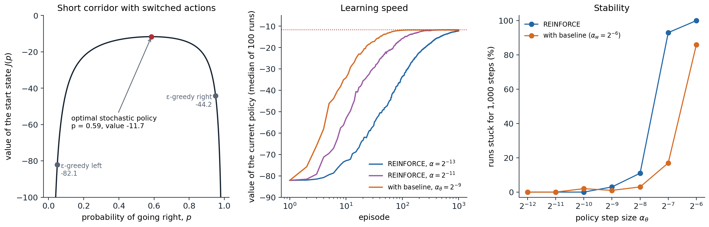
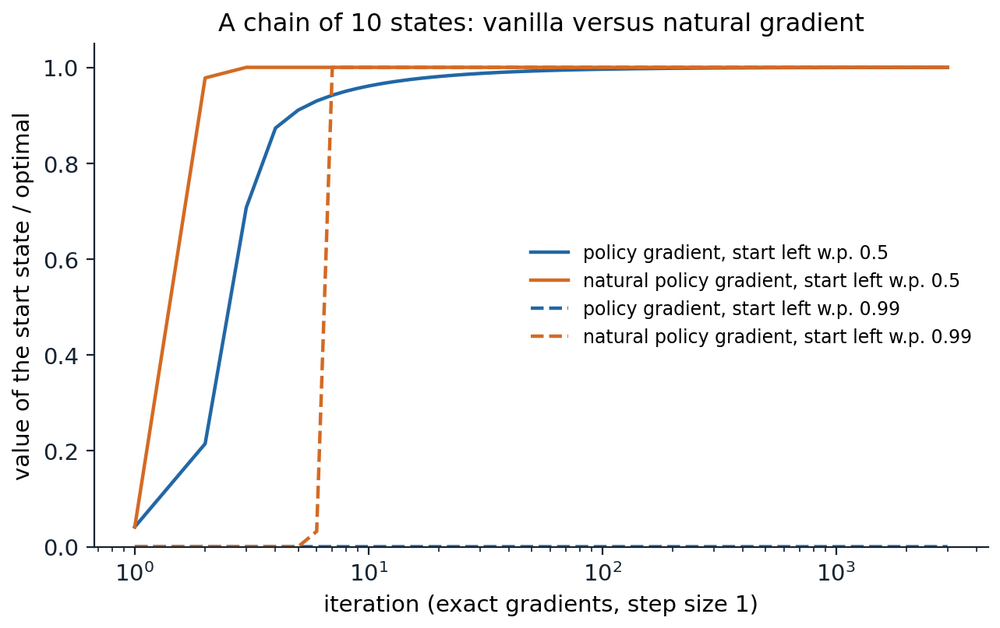

[Background Notes](../README.md) › [Reinforcement Learning](README.md)

# 13. Policy Gradient and Actor-Critic Methods

> [!WARNING]
> Work in progress: this part of the notes is still being revised.

[← 12. The Deadly Triad and Gradient-TD Methods](12-the-deadly-triad-and-gradient-td-methods.md) · [14. Partially Observable Environments →](14-partially-observable-environments.md)

## <a id="learning-policies-directly"></a>Learning policies directly

### <a id="parameterized-policies"></a>Parameterized policies

Every control method so far has learned action values and derived a policy from them, greedy or ε-greedy. **Policy gradient methods** instead learn a parameterized policy $`\pi(a\mid s,\boldsymbol\theta)`$ directly, adjusting the policy parameters $`\boldsymbol\theta\in\mathbb R^{d'}`$ in the direction that increases a measure of performance $`J(\boldsymbol\theta)`$:

```math
\boldsymbol\theta_{t+1}=\boldsymbol\theta_t+\alpha\,\widehat{\nabla J(\boldsymbol\theta_t)},
```

where $`\widehat{\nabla J}`$ is a stochastic estimate of the gradient. A value function may still be learned, to help estimate the gradient, but it is no longer needed to choose actions. Methods that learn both a policy, the **actor**, and a value function, the **critic**, are **actor–critic** methods, one of the oldest reinforcement learning architectures ([Barto, Sutton, and Anderson, 1983](https://doi.org/10.1109/TSMC.1983.6313077)) and the template of most modern deep RL agents.

For discrete actions, the standard parameterization is a **softmax in action preferences**: each state–action pair has a numerical preference $`h(s,a,\boldsymbol\theta)`$, for example linear in features, $`h=\boldsymbol\theta^\top\mathbf x(s,a)`$, or computed by a neural network, and

```math
\pi(a\mid s,\boldsymbol\theta)=\frac{e^{h(s,a,\boldsymbol\theta)}}{\sum_be^{h(s,b,\boldsymbol\theta)}}.
```

For continuous actions, a common choice is a **Gaussian policy** whose mean $`\mu(s,\boldsymbol\theta)`$, and possibly standard deviation $`\sigma(s,\boldsymbol\theta)`$, are parameterized functions of the state.

### <a id="why-learn-a-policy"></a>Why learn a policy

Parameterizing the policy has several advantages over deriving it from action values:

- **Stochastic policies.** The best policy can be stochastic. In games with imperfect information, such as poker, optimal play must be randomized, and under function approximation, when states that look the same must be treated the same way, randomization can be better than any deterministic choice ([chapter 1](01-markov-decision-processes.md#partial-observability-and-belief-states)). A softmax policy can learn any action probabilities, including deterministic ones in the limit; an ε-greedy policy is always either nearly deterministic or wastefully random.
- **Smoothness.** A small change in the parameters changes the action probabilities smoothly. With ε-greedy selection, an arbitrarily small change in the estimated values can switch the chosen action, which is a source of instability in value-based control with function approximation, and which prevents strong convergence guarantees.
- **Simplicity.** Sometimes the policy is a simpler function than the action values: a policy that says "brake when close to the car ahead" can be much easier to represent than the exact value of each speed in each position.
- **Continuous actions.** Choosing $`\arg\max_aq(s,a)`$ over a continuous action set is itself an optimization problem at every step; a parameterized policy outputs the action directly.
- **Prior knowledge.** The form of the policy is a natural place to inject knowledge, and it is the natural object for methods that learn from demonstrations or preferences ([chapter 25](25-imitation-learning-and-inverse-rl.md), [chapter 28](28-reinforcement-learning-for-language-models-and-reasoning.md)).

Sutton and Barto's **short corridor with switched actions** makes the first point concrete. Three nonterminal states lie in a corridor ending in a goal on the right, and every step costs $`-1`$. In the first and third states, "right" moves right and "left" moves left, but in the second state the actions are reversed. The agent cannot distinguish the states, so its policy is a single probability $`p`$ of going right, used everywhere. Both deterministic policies fail: always right gets stuck bouncing between the first two states, and always left never leaves the first. The best policy is stochastic, $`p\approx0.59`$, with value $`-11.7`$, far better than the ε-greedy policies an action-value method would produce, $`-44`$ and $`-82`$ (exercise 13.1).

### <a id="the-performance-measure"></a>The performance measure

In episodic tasks, performance is the value of the start state under the policy, $`J(\boldsymbol\theta)=v_{\pi_{\boldsymbol\theta}}(s_0)`$. In continuing tasks it is the average reward $`r(\pi)`$ of [chapter 11](11-value-function-approximation.md#the-average-reward-setting). The difficulty of maximizing either by gradient ascent is that performance depends on the parameters in two ways: through the action choices, whose effect is easy to compute, and through the distribution of states the policy visits, whose effect depends on the unknown environment. The policy gradient theorem removes the second difficulty.

## <a id="the-policy-gradient-theorem"></a>The policy gradient theorem

### <a id="the-theorem"></a>The theorem

For the episodic case, the **policy gradient theorem** ([Sutton, McAllester, Singh, and Mansour, 1999](https://papers.nips.cc/paper_files/paper/1999/hash/464d828b85b0bed98e80ade0a5c43b0f-Abstract.html)) states that

```math
\nabla J(\boldsymbol\theta)\propto\sum_s\mu(s)\sum_aq_\pi(s,a)\,\nabla\pi(a\mid s,\boldsymbol\theta),
```

where $`\mu`$ is the on-policy distribution of states under $`\pi`$, and the constant of proportionality is the average length of an episode (or 1 in the continuing case, with average-reward values). The gradient of performance involves no derivative of the state distribution: to first order, a small change in the policy changes performance through the action probabilities at each state, weighted by how often the state is visited and by how good each action is ([Appendix A](#block-rl13-appendix-a) proves it). The **performance difference lemma** of [chapter 1](01-markov-decision-processes.md#comparing-two-policies) is the finite version of the same fact.

### <a id="the-score-function-estimator"></a>The score-function estimator

Multiplying and dividing by $`\pi(a\mid s,\boldsymbol\theta)`$ turns the sum over actions into an expectation over the action the policy takes:

```math
\nabla J(\boldsymbol\theta)\propto\mathbb E_\pi\Bigl[\sum_aq_\pi(S_t,a)\nabla\pi(a\mid S_t,\boldsymbol\theta)\Bigr]=\mathbb E_\pi\bigl[q_\pi(S_t,A_t)\,\nabla\ln\pi(A_t\mid S_t,\boldsymbol\theta)\bigr]=\mathbb E_\pi\bigl[G_t\,\nabla\ln\pi(A_t\mid S_t,\boldsymbol\theta)\bigr],
```

using $`\nabla\pi/\pi=\nabla\ln\pi`$ and $`\mathbb E_\pi[G_t\mid S_t,A_t]=q_\pi(S_t,A_t)`$. The vector $`\nabla\ln\pi(A_t\mid S_t,\boldsymbol\theta)`$ is the **score function**, or **eligibility vector**: the direction in parameter space that most increases the probability of the action actually taken, divided by that probability, so that frequently chosen actions do not win merely by being chosen often. The identity $`\nabla\mathbb E_{x\sim p_\theta}[f(x)]=\mathbb E_{x\sim p_\theta}[f(x)\nabla\ln p_\theta(x)]`$ is the **likelihood-ratio** or **score-function** gradient estimator, developed in simulation optimization independently of reinforcement learning ([Glynn, 1990](https://doi.org/10.1145/84537.84552)), and it applies whenever an expectation must be differentiated with respect to the parameters of the distribution, not only the function. For a linear softmax policy, the score is $`\nabla\ln\pi(a\mid s,\boldsymbol\theta)=\mathbf x(s,a)-\sum_b\pi(b\mid s,\boldsymbol\theta)\mathbf x(s,b)`$, the feature vector of the action taken minus its expectation under the policy.

### <a id="reinforce"></a>REINFORCE

Sampling the expectation gives **REINFORCE** ([Williams, 1992](https://doi.org/10.1007/BF00992696)), the Monte Carlo policy gradient algorithm. After each episode, for each step $`t`$,

```math
\boldsymbol\theta\leftarrow\boldsymbol\theta+\alpha\gamma^tG_t\nabla\ln\pi(A_t\mid S_t,\boldsymbol\theta).
```

Each update increases the probability of the action taken in proportion to the return that followed it. It is an unbiased stochastic gradient method, so with decreasing step sizes it converges to a stationary point of $`J`$, but its updates have high variance, since each depends on a whole random return. The factor $`\gamma^t`$ makes the update an unbiased estimate of the gradient of the discounted value of the start state; practical implementations usually drop it, which makes the update the gradient of no fixed objective ([Nota and Thomas, 2020](https://arxiv.org/abs/1906.07073)), but works well (exercise 13.7).

```python
import numpy as np

# REINFORCE on Sutton and Barto's short corridor with switched actions (Example 13.1). Three nonterminal states
# and a goal on the right; reward -1 per step, gamma = 1. In the second state the actions are reversed. All
# states look the same to the agent (features x(s, right) = (1, 0), x(s, left) = (0, 1)), so the policy is one
# probability p of going right, used everywhere, and the best policy is stochastic.
def value(p):                                                  # exact value of the start state
    A = np.array([[p, -p, 0], [-p, 1, -(1 - p)], [0, -(1 - p), 1]])   # v = -1 + P v, rearranged
    return np.linalg.solve(A, -np.ones(3))[0]


ps = np.linspace(0.01, 0.99, 981)
J = np.array([value(p) for p in ps])
print(f"best p = {ps[J.argmax()]:.2f}, value {J.max():.2f}; deterministic policies never reach the goal;"
      f" the epsilon-greedy policies (p = 0.05 or 0.95) are worth {value(0.05):.1f} and {value(0.95):.1f}")

rng = np.random.default_rng(0)
runs, episodes, alpha = 100, 1000, 2 ** -13
theta = np.tile([np.log(0.05), np.log(0.95)], (runs, 1))       # initial policy: right with probability 0.05
returns = np.zeros((runs, episodes))
for ep in range(episodes):
    p = 1 / (1 + np.exp(theta[:, 1] - theta[:, 0]))            # softmax over the two preferences
    s, alive, t = np.zeros(runs, int), np.ones(runs, bool), 0
    acts = []
    while alive.any() and t < 1000:
        right = rng.random(runs) < p
        acts.append(right & alive); t += 1
        move = np.where(right, 1, -1) * np.where(s == 1, -1, 1)   # state 1 (the second) reverses the actions
        s = np.where(alive, np.maximum(s + move, 0), s)
        returns[:, ep] -= alive
        alive &= s < 3
    acts = np.array(acts)                                       # T x runs: whether each step went right
    lengths = -returns[:, ep]
    for k in range(acts.shape[0]):                               # REINFORCE: theta += alpha G_t grad log pi(A_t)
        live = k < lengths
        G = -(lengths - k)                                      # the return from step k: minus the steps left
        grad_right = np.where(acts[k], 1 - p, -p)               # d log pi / d theta_right
        theta[:, 0] += np.where(live, alpha * G * grad_right, 0)
        theta[:, 1] -= np.where(live, alpha * G * grad_right, 0)   # d log pi / d theta_left = -grad_right
for a, b in [(0, 10), (90, 100), (490, 500), (990, 1000)]:
    print(f"episodes {a + 1:4d}-{b:4d}: average return {returns[:, a:b].mean():6.1f}")
print(f"final probability of going right: {np.mean(1 / (1 + np.exp(theta[:, 1] - theta[:, 0]))):.2f} (average over runs)")
# best p = 0.59, value -11.66; deterministic policies never reach the goal; the epsilon-greedy policies (p = 0.05 or 0.95) are worth -82.1 and -44.2
# episodes    1-  10: average return  -76.7
# episodes   91- 100: average return  -33.2
# episodes  491- 500: average return  -14.7
# episodes  991-1000: average return  -12.5
# final probability of going right: 0.47 (average over runs)
```

Starting from a nearly deterministic policy that almost always goes left, REINFORCE climbs to within one step of the optimal value in a thousand episodes. The learned probability, 0.47 on average, is still below the optimum of 0.59 after a thousand episodes, but the value function is flat near its maximum, so the policy's value is already close to optimal. Progress is slow at this step size, $`2^{-13}`$, the best for plain REINFORCE in Sutton and Barto's experiments. The returns are large and noisy, and the next experiment shows what larger steps do.

## <a id="baselines-and-variance-reduction"></a>Baselines and variance reduction

### <a id="reinforce-with-baseline"></a>REINFORCE with baseline

Any function of the state that does not depend on the action can be subtracted from the return without changing the expected gradient:

```math
\nabla J(\boldsymbol\theta)\propto\sum_s\mu(s)\sum_a\bigl(q_\pi(s,a)-b(s)\bigr)\nabla\pi(a\mid s,\boldsymbol\theta),
```

because $`\sum_ab(s)\nabla\pi(a\mid s,\boldsymbol\theta)=b(s)\nabla\sum_a\pi(a\mid s,\boldsymbol\theta)=b(s)\nabla1=0`$. The **baseline** $`b(s)`$ leaves the gradient unbiased but can reduce its variance greatly. Without it, all returns in a task with negative rewards are negative, so every action taken has its probability decreased, and the gradient appears only as the small difference between large, noisy decreases. With a baseline close to $`v_\pi(s)`$, the update is proportional to how much better or worse than usual the action turned out, positive or negative. The natural baseline is a learned state-value function $`\hat v(s,\mathbf w)`$, trained by gradient Monte Carlo alongside the policy:

```math
\delta=G_t-\hat v(S_t,\mathbf w),\qquad\mathbf w\leftarrow\mathbf w+\alpha^{\mathbf w}\delta\nabla\hat v(S_t,\mathbf w),\qquad\boldsymbol\theta\leftarrow\boldsymbol\theta+\alpha^{\boldsymbol\theta}\gamma^t\delta\nabla\ln\pi(A_t\mid S_t,\boldsymbol\theta).
```

```python
import numpy as np

# REINFORCE with a learned baseline on the short corridor. Since all states look the same, the learned state
# value is a single weight w. First, the variance of the one-episode gradient estimate at fixed policies, with
# and without a baseline; then learning curves, 100 runs of 1,000 episodes for each setting.
rng = np.random.default_rng(0)
NEXT = np.array([[0, 1], [2, 0], [1, 3], [3, 3]])             # NEXT[s, right]; the second state reverses; 3 = goal


def episodes(p):
    """One episode per entry of p; returns T x n arrays: went right, and still running."""
    s, rights, live = np.zeros(len(p), int), [], []
    while (s < 3).any() and len(rights) < 1000:
        right = rng.random(len(p)) < p
        rights.append(right); live.append(s < 3)
        s = NEXT[s, right.astype(int)]
    return np.array(rights), np.array(live)


for p in [0.05, 0.2, 0.4, 0.59, 0.8]:
    right, live = episodes(np.full(20000, p))
    k = np.arange(len(right))[:, None]
    G = np.where(live, k - live.sum(0), 0.0)                    # G_t = -(steps left)
    score = np.where(live, np.where(right, 1 - p, -p), 0)       # d ln pi(A_t) / d theta_right
    b = G[live].mean()                                          # what the weight w converges to
    plain, base = (G * score).sum(0), ((G - b) * score).sum(0)
    print(f"p = {p:.2f}: gradient {plain.mean():6.2f}; standard deviation of the estimate:"
          f" without baseline {plain.std():5.1f}, with baseline {base.std():5.1f} (variance ratio {plain.var() / base.var():.1f})")


def train(alpha_theta, alpha_w):
    """Each (alpha_theta, alpha_w) is one setting, run 100 times in parallel; alpha_w = 0 means no baseline."""
    a_th, a_w = np.repeat(alpha_theta, 100), np.repeat(alpha_w, 100)
    theta = np.tile([np.log(0.05), np.log(0.95)], (len(a_th), 1))
    w, rets = np.zeros(len(a_th)), np.zeros((len(a_th), 1000))
    for ep in range(1000):
        p = 1 / (1 + np.exp(theta[:, 1] - theta[:, 0]))
        right, live = episodes(p)
        L = live.sum(0); rets[:, ep] = -L
        G = np.where(live, np.arange(len(right))[:, None] - L, 0.0)
        delta = np.zeros_like(G)
        for t in range(len(right)):                             # the baseline learns during the episode
            delta[t] = np.where(live[t], G[t] - w, 0)
            w += a_w * delta[t]
        step = a_th * (delta * np.where(right, 1 - p, -p)).sum(0)  # REINFORCE with delta = G_t - w
        theta[:, 0] += step; theta[:, 1] -= step
    return rets.reshape(len(alpha_theta), 100, 1000)


settings = [("REINFORCE, alpha = 2^-13", 2 ** -13, 0), ("REINFORCE, alpha = 2^-11", 2 ** -11, 0),
            ("with baseline, alpha = 2^-9", 2 ** -9, 2 ** -6)]
R = train([a for _, a, _ in settings], [b for _, _, b in settings])
for (name, _, _), r in zip(settings, R):
    print(f"{name:28s} average return, episodes 1-100: {r[:, :100].mean():6.1f}, 101-300: {r[:, 100:300].mean():6.1f},"
          f" 901-1000: {r[:, 900:].mean():6.1f}; runs ever stuck for 1,000 steps: {(r.min(1) <= -1000).sum():2d} of 100")
print("(the best possible is -11.66)")
# p = 0.05: gradient  75.07; standard deviation of the estimate: without baseline 236.4, with baseline 158.6 (variance ratio 2.2)
# p = 0.20: gradient  16.44; standard deviation of the estimate: without baseline  60.5, with baseline  38.9 (variance ratio 2.4)
# p = 0.40: gradient   4.92; standard deviation of the estimate: without baseline  31.5, with baseline  19.8 (variance ratio 2.5)
# p = 0.59: gradient  -0.22; standard deviation of the estimate: without baseline  26.1, with baseline  16.5 (variance ratio 2.5)
# p = 0.80: gradient  -6.97; standard deviation of the estimate: without baseline  34.9, with baseline  22.6 (variance ratio 2.4)
# REINFORCE, alpha = 2^-13     average return, episodes 1-100:  -49.9, 101-300:  -23.6, 901-1000:  -12.4; runs ever stuck for 1,000 steps:  0 of 100
# REINFORCE, alpha = 2^-11     average return, episodes 1-100:  -30.1, 101-300:  -13.5, 901-1000:  -11.9; runs ever stuck for 1,000 steps:  0 of 100
# with baseline, alpha = 2^-9  average return, episodes 1-100:  -20.0, 101-300:  -11.9, 901-1000:  -12.1; runs ever stuck for 1,000 steps:  0 of 100
# (the best possible is -11.66)
```

The baseline reduces the variance of the one-episode gradient estimate by a factor of about 2.4, at every policy, without changing its mean. The gain is modest because in the short corridor the returns vary about as much as they average: the baseline removes their common part, not their spread. It shows up as a larger safe step size. A run that steps too far toward a deterministic policy can get stuck there, since a policy that always goes right bounces between the first two states forever and one that always goes left never leaves the first, and the score of an action taken with probability near 1 is near 0, so the gradient vanishes where it is most needed. The baseline moves the onset of such failures to a step size about twice as large (the figure's right panel), and with the larger step, REINFORCE with baseline is within half a step of the optimum from about the hundredth episode on. Plain REINFORCE needs most of a thousand episodes with $`\alpha=2^{-13}`$, and a few hundred with $`2^{-11}`$. The first lines of the output show another difficulty: the gradient shrinks fifteenfold between $`p=0.05`$ and $`p=0.4`$, so a fixed step size that is safe early is slow later, a problem the natural gradient below addresses.



*Left: the value of the start state of the short corridor as a function of the probability $`p`$ of going right, the same in every state. The optimum is stochastic, $`p=0.59`$; the ε-greedy policies that an action-value method would choose, with $`\varepsilon=0.1`$, are far worse. Middle: the exact value of the current policy for REINFORCE from a policy that goes right with probability 0.05, with two step sizes, and for REINFORCE with a learned baseline ($`\alpha_w=2^{-6}`$); the median of 100 runs, since a single stuck run would dominate a mean. The dotted line is the optimum. Right: the percentage of 100 runs that at some point take 1,000 steps without reaching the goal, stuck near a deterministic policy, as a function of the policy step size. The baseline moves the onset of failure by about a factor of two. The setting follows Figures 13.1 and 13.2 of Sutton and Barto, with a wider range of step sizes.*

### <a id="the-optimal-baseline"></a>The optimal baseline

The state value is a good baseline but not the one that minimizes variance. For a single state and a one-dimensional parameter, the variance of $`(G-b)\nabla\ln\pi`$ is minimized by

```math
b^*=\frac{\mathbb E\bigl[G\,(\nabla\ln\pi)^2\bigr]}{\mathbb E\bigl[(\nabla\ln\pi)^2\bigr]},
```

a weighted average of the returns that gives more weight to actions with large scores ([Greensmith, Bartlett, and Baxter, 2004](https://jmlr.org/papers/v5/greensmith04a.html); exercise 13.3). In practice $`\hat v(s)`$ is close enough and much simpler. Other variance reductions follow the same principle, subtracting a quantity of known expectation: **reward-to-go**, which uses only the rewards after step $`t`$, as $`G_t`$ already does, instead of the whole episode's return, is the most basic; action-dependent baselines and the control variates of [chapter 9](09-off-policy-learning.md#control-variates-and-doubly-robust-estimators) go further. In language-model training, where one prompt yields several sampled answers, the average reward of the answers to the same prompt is a simple and effective baseline (the other answers in RLOO; the whole group, with standardization, in GRPO) ([chapter 28](28-reinforcement-learning-for-language-models-and-reasoning.md)).

## <a id="actorcritic-methods"></a>Actor–critic methods

### <a id="one-step-actorcritic"></a>One-step actor–critic

REINFORCE with baseline learns a state-value function, but only as a baseline: its target is still the full Monte Carlo return, which is unbiased but noisy and available only at the end of the episode. **Actor–critic** methods use the value function as a **critic** that bootstraps, replacing the return by the one-step TD target:

```math
\delta_t=R_{t+1}+\gamma\hat v(S_{t+1},\mathbf w)-\hat v(S_t,\mathbf w),\qquad
\mathbf w\leftarrow\mathbf w+\alpha^{\mathbf w}\delta_t\nabla\hat v(S_t,\mathbf w),\qquad
\boldsymbol\theta\leftarrow\boldsymbol\theta+\alpha^{\boldsymbol\theta}I\delta_t\nabla\ln\pi(A_t\mid S_t,\boldsymbol\theta),
```

where $`I=\gamma^t`$ is accumulated during the episode. The TD error estimates the **advantage** $`a_\pi(S_t,A_t)=q_\pi(S_t,A_t)-v_\pi(S_t)`$, since $`\mathbb E[\delta_t\mid S_t,A_t]=a_\pi(S_t,A_t)`$ when the critic is exact. The one-step actor–critic is fully online and incremental, like TD(0), and it can be used in continuing tasks. Bootstrapping introduces bias, since the critic is not exact, but it reduces variance, usually by much more.

```python
import numpy as np

# One-step actor-critic versus REINFORCE with baseline on the maze of chapters 8 and 10 (6 x 9, start (2, 0),
# goal (0, 8)), with reward -1 per step and gamma = 1. Tabular softmax policy (one preference per state-action
# pair) and a tabular state-value critic with alpha_w = 0.1; each method with the best of the policy step sizes
# tried (REINFORCE: 0.0001, 0.0003, 0.001, 0.003; actor-critic: 0.01, 0.03, 0.1); 20 runs of 100 episodes, run in
# parallel from the uniformly random policy.
H, W, start, goal = 6, 9, (2, 0), (0, 8)
walls = {(1, 2), (2, 2), (3, 2), (4, 5), (0, 7), (1, 7), (2, 7)}
moves = np.array([(-1, 0), (1, 0), (0, 1), (0, -1)])
nS = H * W
nxt = np.zeros((nS, 4), int)
for i in range(H):
    for j in range(W):
        for a, (di, dj) in enumerate(moves):
            t = (min(max(i + di, 0), H - 1), min(max(j + dj, 0), W - 1))
            nxt[i * W + j, a] = i * W + j if t in walls else t[0] * W + t[1]
S0, G = start[0] * W + start[1], goal[0] * W + goal[1]
runs, episodes, a_w = 20, 100, 0.1
rng = np.random.default_rng(0)
idx = np.arange(runs)


def policy(theta, s):
    h = theta[idx, s]; e = np.exp(h - h.max(1, keepdims=True))
    return e / e.sum(1, keepdims=True)


def run(method, a_th):
    theta, w = np.zeros((runs, nS, 4)), np.zeros((runs, nS))
    lengths = np.zeros((runs, episodes))
    for ep in range(episodes):
        s, alive, traj = np.full(runs, S0), np.ones(runs, bool), []
        while alive.any() and lengths[:, ep].max() < 5000:     # a cap, in case a policy loops
            pi = policy(theta, s)
            a = (pi.cumsum(1) > rng.random((runs, 1))).argmax(1)
            s2 = nxt[s, a]
            lengths[:, ep] += alive
            if method == "actor-critic":                        # one-step: delta = R + v(S') - v(S)
                delta = -1 + np.where(s2 == G, 0.0, w[idx, s2]) - w[idx, s]
                grad = -pi; grad[idx, a] += 1                   # grad log pi(a|s) for a tabular softmax
                w[idx, s] += np.where(alive, a_w * delta, 0)
                theta[idx, s] += np.where(alive, a_th * delta, 0)[:, None] * grad
            else:
                traj.append((s.copy(), a.copy(), alive.copy()))
            alive &= s2 != G
            s = np.where(alive, s2, s)
        if method == "REINFORCE with baseline":                 # Monte Carlo: G_t = -(steps remaining)
            steps_left = lengths[:, ep].copy()
            for s_, a_, live in traj:
                delta = -steps_left - w[idx, s_]
                pi = policy(theta, s_); grad = -pi; grad[idx, a_] += 1
                w[idx, s_] += np.where(live, a_w * delta, 0)
                theta[idx, s_] += np.where(live, a_th * delta, 0)[:, None] * grad
                steps_left -= live
    return lengths


for method, a_th in [("REINFORCE with baseline", 0.0003), ("actor-critic", 0.1)]:
    L = run(method, a_th)
    print(f"{method:24s} alpha_theta = {a_th:<6}: steps per episode: episode 1 {L[:, 0].mean():5.0f}, episodes 2-10 {L[:, 1:10].mean():5.0f},"
          f" 11-50 {L[:, 10:50].mean():5.1f}, 91-100 {L[:, 90:].mean():5.1f} (shortest path 14)")
# REINFORCE with baseline  alpha_theta = 0.0003: steps per episode: episode 1   830, episodes 2-10   458, 11-50 189.1, 91-100 111.3 (shortest path 14)
# actor-critic             alpha_theta = 0.1   : steps per episode: episode 1   504, episodes 2-10   265, 11-50  71.1, 91-100  22.2 (shortest path 14)
```

Actor–critic learns much faster here, and the difference in usable step sizes tells why. REINFORCE's updates scale with returns of several hundred at first, so its policy step size must be about 300 times smaller to avoid collapsing the policy after one long episode; the actor–critic's updates scale with one-step TD errors, which are of order one. The same trade-off between Monte Carlo and TD targets as in [chapter 6](06-temporal-difference-learning.md) appears here in the actor.

### <a id="actorcritic-with-eligibility-traces"></a>Actor–critic with eligibility traces

The multi-step methods of [chapter 8](08-multi-step-bootstrapping-and-eligibility-traces.md) apply to both parts. With λ-returns in the actor and the critic, implemented by traces $`\mathbf z^{\boldsymbol\theta}\leftarrow\gamma\lambda^{\boldsymbol\theta}\mathbf z^{\boldsymbol\theta}+I\nabla\ln\pi(A_t\mid S_t,\boldsymbol\theta)`$ and $`\mathbf z^{\mathbf w}\leftarrow\gamma\lambda^{\mathbf w}\mathbf z^{\mathbf w}+\nabla\hat v(S_t,\mathbf w)`$, the actor–critic interpolates between one-step actor–critic ($`\lambda=0`$) and REINFORCE with baseline ($`\lambda=1`$). Deep actor–critic methods use the same idea with stored trajectories: the **generalized advantage estimate** $`\hat A_t=\sum_k(\gamma\lambda)^k\delta_{t+k}`$ ([Schulman et al., 2016](https://arxiv.org/abs/1506.02438)) is the λ-return minus the critic's value, an exponentially weighted average of $`n`$-step advantage estimates ([chapter 19](19-deep-actor-critic-and-distributed-rl.md)).

### <a id="continuing-tasks"></a>Continuing tasks

In continuing tasks, the actor–critic uses the differential TD error of [chapter 11](11-value-function-approximation.md#the-average-reward-setting), $`\delta_t=R_{t+1}-\bar R+\hat v(S_{t+1},\mathbf w)-\hat v(S_t,\mathbf w)`$, updates the average-reward estimate $`\bar R\leftarrow\bar R+\alpha^{\bar R}\delta_t`$, and drops the factor $`I`$. The policy gradient theorem holds for the average reward with the stationary distribution in place of the on-policy episode distribution and differential action values in place of discounted ones. Two-time-scale convergence proofs for actor–critic methods, with the critic learning faster than the actor, are due to [Konda and Tsitsiklis (1999)](https://papers.nips.cc/paper_files/paper/1999/hash/6449f44a102fde848669bdd9eb6b76fa-Abstract.html) and [Bhatnagar, Sutton, Ghavamzadeh, and Lee (2009)](https://doi.org/10.1016/j.automatica.2009.07.008).

## <a id="compatible-function-approximation-and-the-natural-gradient"></a>Compatible function approximation and the natural gradient

### <a id="compatible-features"></a>Compatible features

A critic introduces bias into the policy gradient unless it is exact. [Sutton et al. (1999)](https://papers.nips.cc/paper_files/paper/1999/hash/464d828b85b0bed98e80ade0a5c43b0f-Abstract.html) identified conditions under which an approximate critic gives the exact gradient anyway. If the critic approximates the action values linearly in the **compatible features** $`\boldsymbol\psi(s,a)=\nabla\ln\pi(a\mid s,\boldsymbol\theta)`$, $`\hat q(s,a,\mathbf w)=\mathbf w^\top\boldsymbol\psi(s,a)`$, and $`\mathbf w`$ minimizes the mean squared error $`\mathbb E_\pi[(q_\pi(S,A)-\hat q(S,A,\mathbf w))^2]`$, then substituting $`\hat q`$ for $`q_\pi`$ in the policy gradient theorem gives the exact gradient (exercise 13.6). Because $`\sum_a\pi(a\mid s)\boldsymbol\psi(s,a)=0`$, a compatible critic always has zero mean over actions: it represents the advantage function, not the action values, and it is usually combined with a separate state-value baseline.

### <a id="the-natural-policy-gradient"></a>The natural policy gradient

The ordinary gradient depends on how the policy is parameterized: rescaling one parameter changes the direction of steepest ascent, although it does not change the policy. The **natural gradient** ([Amari, 1998](https://doi.org/10.1162/089976698300017746)) measures steps not in parameter space but in the space of distributions, by the Kullback–Leibler divergence they cause. Locally, $`\mathrm{KL}(\pi_{\boldsymbol\theta}\,\|\,\pi_{\boldsymbol\theta+\Delta})\approx\tfrac12\Delta^\top\mathbf F(\boldsymbol\theta)\Delta`$, where

```math
\mathbf F(\boldsymbol\theta)=\mathbb E_{s\sim\mu,\,a\sim\pi}\bigl[\nabla\ln\pi(a\mid s,\boldsymbol\theta)\,\nabla\ln\pi(a\mid s,\boldsymbol\theta)^\top\bigr]
```

is the **Fisher information matrix** of the policy, averaged over states. The steepest ascent direction per unit of divergence is $`\mathbf F^{-1}\nabla J`$, and the **natural policy gradient** ([Kakade, 2001](https://papers.nips.cc/paper_files/paper/2001/hash/4b86abe48d358ecf194c56c69108433e-Abstract.html)) follows it:

```math
\boldsymbol\theta\leftarrow\boldsymbol\theta+\alpha\,\mathbf F(\boldsymbol\theta)^{-1}\nabla J(\boldsymbol\theta).
```

It is invariant to how the policy is parameterized, and it has a striking connection to compatible function approximation: the natural gradient equals the weight vector $`\mathbf w`$ of the best compatible critic, since $`\mathbf w=\mathbf F^{-1}\nabla J`$ solves the critic's least-squares problem. A **natural actor–critic** ([Peters and Schaal, 2008](https://doi.org/10.1016/j.neucom.2007.11.026)) learns the compatible critic and moves the policy parameters along its weights. For a tabular softmax policy, the natural gradient step, computed with the pseudoinverse of $`\mathbf F`$, which is singular because the scores at each state sum to zero, is especially simple, $`\boldsymbol\theta(s,a)\leftarrow\boldsymbol\theta(s,a)+\frac{\alpha}{1-\gamma}a_\pi(s,a)`$, which multiplies each action's probability by $`e^{\alpha a_\pi(s,a)/(1-\gamma)}`$ and renormalizes: a soft form of policy iteration.

The difference matters most when the policy is nearly deterministic. The ordinary gradient of a softmax policy is proportional to the probability of each action and to how often each state is visited, so an action that is currently unlikely, or a state that is rarely visited, gets almost no gradient even if it is where the improvement lies; the ordinary gradient can spend a very long time on nearly flat plateaus. The natural gradient divides these factors out.



*Exact policy gradient and natural policy gradient, both with step size 1, for a tabular softmax policy on a chain of 10 states, where reward comes only from reaching and staying at the right end, with $`\gamma=0.95`$. From the uniform policy (solid), the natural gradient is within 1% of the optimal value by the third iteration, counting the initial policy as the first, and the ordinary gradient by the 39th. From a policy that goes left with probability 0.99 (dashed), the natural gradient needs 7 iterations, and the ordinary gradient makes no visible progress in 3,000: the right end is almost never reached, so the gradient is exponentially small.*

Modern theory has made these observations precise. With exact gradients, softmax policy gradient converges to a global optimum in tabular problems ([Agarwal, Kakade, Lee, and Mahajan, 2021](https://jmlr.org/papers/v22/19-736.html)), at a rate $`O(1/k)`$ whose constants depend on the problem and the initialization ([Mei, Xiao, Szepesvári, and Schuurmans, 2020](https://arxiv.org/abs/2005.06392)) and can be exponentially large in the number of states and the horizon ([Li, Wei, Chi, and Chen, 2021](https://arxiv.org/abs/2102.11270)), while the natural policy gradient converges at a rate independent of them. Trust-region methods, TRPO and PPO, are practical approximations of natural gradient steps for deep networks ([chapter 20](20-trust-regions-and-proximal-policy-optimization.md)).

## <a id="continuous-actions"></a>Continuous actions

### <a id="gaussian-policies"></a>Gaussian policies

For a continuous action, a Gaussian policy with mean $`\mu(s,\boldsymbol\theta_\mu)`$ and standard deviation $`\sigma(s,\boldsymbol\theta_\sigma)=\exp(\boldsymbol\theta_\sigma^\top\mathbf x_\sigma(s))`$, parameterized through its logarithm to keep it positive, has score functions

```math
\nabla_{\boldsymbol\theta_\mu}\ln\pi(a\mid s)=\frac{a-\mu(s)}{\sigma(s)^2}\nabla\mu(s),\qquad
\nabla_{\boldsymbol\theta_\sigma}\ln\pi(a\mid s)=\Bigl(\frac{(a-\mu(s))^2}{\sigma(s)^2}-1\Bigr)\mathbf x_\sigma(s).
```

An action that turns out better than expected moves the mean toward it; the standard deviation grows when actions far from the mean do well and shrinks when actions near it do. Every policy gradient method applies unchanged. Exercise 13.4 uses a Gaussian policy to learn the feedback gain of a linear–quadratic regulator, the problem of [chapter 15](15-optimal-control-and-trajectory-optimization.md), and recovers the gain that the Riccati equation gives. For bounded actions, a Gaussian squashed by a hyperbolic tangent, or a beta distribution, keeps the actions in range.

### <a id="deterministic-policy-gradients"></a>Deterministic policy gradients

As the standard deviation of a Gaussian policy shrinks to zero, the score-function gradient becomes infinitely noisy, but a different estimator takes over. For a deterministic policy $`a=\mu(s,\boldsymbol\theta)`$, the **deterministic policy gradient theorem** ([Silver et al., 2014](https://proceedings.mlr.press/v32/silver14.html)) gives

```math
\nabla J(\boldsymbol\theta)\propto\mathbb E_{s\sim\rho^\mu}\Bigl[\nabla_{\boldsymbol\theta}\mu(s,\boldsymbol\theta)\,\nabla_aq_\mu(s,a)\big|_{a=\mu(s,\boldsymbol\theta)}\Bigr]:
```

where $`\rho^\mu`$ is the discounted state distribution under $`\mu`$: the policy moves its action in the direction in which the critic's action values increase. It needs a critic that is differentiable in the action and an exploration mechanism outside the policy, and since the gradient is taken at the policy's own action for states from any distribution, it can be used off-policy. It is the basis of DDPG and TD3 ([chapter 21](21-continuous-control-and-maximum-entropy-rl.md)). The same idea, differentiating through a learned model of the value of actions rather than sampling scores, is the **reparameterization** or pathwise gradient, which trades the variance of the score function for bias from the critic.

## <a id="off-policy-actorcritic"></a>Off-policy actor–critic

The policy gradient theorem is an on-policy statement: the states and actions must come from the policy being improved. With data from a behavior policy $`b`$, importance sampling corrects the actor's update, $`\rho_t=\pi(A_t\mid S_t)/b(A_t\mid S_t)`$, and an off-policy critic, such as a gradient-TD method from [chapter 12](12-the-deadly-triad-and-gradient-td-methods.md), estimates the target policy's values. [Degris, White, and Sutton (2012)](https://arxiv.org/abs/1205.4839) derived the resulting **off-policy actor–critic** and showed that ignoring the dependence of the state distribution on the target policy, the "excursion" objective weighted by the behavior's state distribution, still leads to improvement under tabular conditions. Truncated importance weights, as in Retrace and V-trace ([chapter 9](09-off-policy-learning.md#retrace-and-its-descendants)), and deterministic policy gradients, which need no action weights at all, are the forms used in deep RL.

## <a id="policy-gradients-today"></a>Policy gradients today

Policy gradient methods are the most widely used family in modern reinforcement learning. Asynchronous and synchronous advantage actor–critic, A3C and A2C, parallelize the one-step and n-step actor–critic across many environments ([chapter 19](19-deep-actor-critic-and-distributed-rl.md)); PPO adds a trust region and is the default for robotics simulation and for fine-tuning language models ([chapter 20](20-trust-regions-and-proximal-policy-optimization.md)); soft actor–critic adds entropy maximization for continuous control ([chapter 21](21-continuous-control-and-maximum-entropy-rl.md)). In reinforcement learning from human feedback and from verifiable rewards, where an episode is one generated answer and the reward arrives at its end, the simplest estimators have made a comeback: REINFORCE with a leave-one-out baseline matches or outperforms PPO in their experiments, at a fraction of its complexity ([Ahmadian et al., 2024](https://arxiv.org/abs/2402.14740)), and GRPO, the algorithm behind several reasoning models, is REINFORCE with a group-average baseline and PPO-style clipping ([chapter 28](28-reinforcement-learning-for-language-models-and-reasoning.md)).

[Lab 6](labs/lab-06-policy-gradient-and-actor-critic-methods-on-cartpole.md) compares REINFORCE's gradient estimators on the cart-pole, builds an online actor–critic, measures the bias and variance of generalized advantage estimates, and compares vanilla and natural policy gradients.

## <a id="exercises"></a>Exercises

### <a id="exercise-13-1-the-short-corridor"></a>Exercise 13.1 — The short corridor

(a) Write the Bellman equations of the short corridor for a policy that goes right with probability $`p`$ in every state, and find $`J(p)`$. (b) Find the optimal $`p`$. (c) Why does no ε-greedy policy do as well?


<details>
<summary><b>Solution</b></summary>


(a) With $`v_1,v_2,v_3`$ the values of the three states and the goal worth 0: $`v_1=-1+pv_2+(1-p)v_1`$, since left in the first state stays there; $`v_2=-1+pv_1+(1-p)v_3`$, since the actions are reversed; and $`v_3=-1+(1-p)v_2`$. The first equation gives $`v_1=v_2-1/p`$; substituting it and the third into the second gives $`p(1-p)\,v_2=p-3`$. So

```math
J(p)=v_1=\frac{p-3}{p(1-p)}-\frac1p=\frac{2p-4}{p(1-p)}=-\frac{2(2-p)}{p(1-p)}.
```

It gives $`-82.1`$ at $`p=0.05`$ and $`-44.2`$ at $`p=0.95`$.

(b) Setting $`J'(p)=0`$ gives $`p^2-4p+2=0`$, so $`p^*=2-\sqrt2\approx0.586`$ and $`J(p^*)=-(6+4\sqrt2)\approx-11.66`$. The maximum is flat: any $`p`$ between 0.45 and 0.7 is within one step of it.

(c) An action-value method whose features cannot distinguish the states has the same greedy action everywhere, so its ε-greedy policy goes right with probability $`1-\varepsilon/2`$ or $`\varepsilon/2`$: 0.95 or 0.05 for $`\varepsilon=0.1`$, with values $`-44.2`$ and $`-82.1`$. To reach 0.59 it would need $`\varepsilon\approx0.82`$, which it would never choose, since for action values more exploration always looks like a cost. Only a method that treats the action probabilities as parameters to optimize can find the stochastic optimum.

</details>


### <a id="exercise-13-2-the-softmax-score"></a>Exercise 13.2 — The softmax score

(a) Show that for a linear softmax policy, $`\nabla\ln\pi(a\mid s,\boldsymbol\theta)=\mathbf x(s,a)-\sum_b\pi(b\mid s,\boldsymbol\theta)\mathbf x(s,b)`$. (b) Show that its expectation under the policy is zero. (c) For a tabular softmax policy, write the exact gradient $`\partial J/\partial\theta(s,a)`$.


<details>
<summary><b>Solution</b></summary>


(a) $`\ln\pi(a\mid s)=\boldsymbol\theta^\top\mathbf x(s,a)-\ln\sum_be^{\boldsymbol\theta^\top\mathbf x(s,b)}`$, and the gradient of the log-sum-exp term is $`\sum_b\pi(b\mid s)\mathbf x(s,b)`$.

(b) $`\sum_a\pi(a\mid s)\bigl(\mathbf x(s,a)-\sum_b\pi(b\mid s)\mathbf x(s,b)\bigr)=0`$. In general $`\mathbb E_\pi[\nabla\ln\pi]=\sum_a\nabla\pi(a\mid s)=\nabla1=0`$, which is why baselines leave the gradient unbiased.

(c) With one parameter per pair, $`\mathbf x(s,a)`$ is the indicator of $`(s,a)`$, and the policy gradient theorem, with the discounted state distribution $`d^\pi_{s_0}`$ normalized to sum to one, gives $`\partial J/\partial\theta(s,a)=\frac1{1-\gamma}d^\pi_{s_0}(s)\,\pi(a\mid s)\,a_\pi(s,a)`$. The factors $`d^\pi(s)`$ and $`\pi(a\mid s)`$ are the ones that make the ordinary gradient vanish when a state is rarely visited or an action rarely taken, as in the chain of the chapter's figure.

</details>


### <a id="exercise-13-3-the-optimal-baseline"></a>Exercise 13.3 — The optimal baseline

For a single state and a scalar parameter, find the baseline $`b`$ that minimizes the variance of $`(G-b)\,g`$, where $`g=\partial\ln\pi(A)/\partial\theta`$ and $`G`$ is the return.


<details>
<summary><b>Solution</b></summary>


Since $`\mathbb E[(G-b)g]`$ does not depend on $`b`$, minimizing the variance means minimizing the second moment $`\mathbb E[(G-b)^2g^2]=\mathbb E[G^2g^2]-2b\,\mathbb E[Gg^2]+b^2\mathbb E[g^2]`$. The derivative with respect to $`b`$ vanishes at $`b^*=\mathbb E[Gg^2]/\mathbb E[g^2]`$. It equals $`\mathbb E[G]`$, the value, when $`G`$ and $`g^2`$ are uncorrelated; otherwise it gives more weight to the returns of actions whose scores are large, which are the actions whose returns contribute most to the variance. For a vector parameter, a different optimal baseline applies to each component, with $`g_i^2`$ in place of $`g^2`$.

</details>


### <a id="exercise-13-4-a-gaussian-policy-for-a-regulator"></a>Exercise 13.4 — A Gaussian policy for a regulator

The scalar system $`x'=x+a+\text{noise}`$ has reward $`-(x^2+a^2)`$ and $`\gamma=0.9`$. Learn the gain $`k`$ of the Gaussian policy $`a\sim\mathcal N(kx,0.3^2)`$ with REINFORCE and a time-dependent baseline, and compare with the optimal gain from the Riccati equation.


<details>
<summary><b>Solution</b></summary>


```python
import numpy as np

# A Gaussian policy for a continuous action: the scalar linear-quadratic regulator x' = x + a + noise, with
# reward -(x^2 + a^2), gamma = 0.9, and episodes of 30 steps from x ~ N(0, 1). The policy is a ~ N(k x, sigma^2)
# with sigma = 0.3 fixed; REINFORCE with a time-dependent baseline updates the gain k from batches of 200
# episodes. The optimal gain comes from the discounted Riccati equation.
gamma, T, sigma, noise = 0.9, 30, 0.3, 0.1
P = 1.0
for _ in range(1000):                                          # P = 1 + gamma P - (gamma P)^2 / (1 + gamma P)
    P = 1 + gamma * P - (gamma * P) ** 2 / (1 + gamma * P)
k_star = -gamma * P / (1 + gamma * P)
rng = np.random.default_rng(0)
k, alpha, N = 0.0, 0.001, 200
for it in range(1, 301):
    x = rng.normal(0, 1, N)
    xs, acts, rews = [], [], []
    for t in range(T):
        a = k * x + sigma * rng.normal(size=N)
        xs.append(x); acts.append(a); rews.append(-(x ** 2 + a ** 2))
        x = x + a + noise * rng.normal(size=N)
    xs, acts, rews = map(np.array, (xs, acts, rews))           # T x N
    disc = gamma ** np.arange(T)[:, None]
    G = np.flip(np.cumsum(np.flip(disc * rews, 0), 0), 0)     # discounted reward-to-go, from time 0's viewpoint
    adv = G - G.mean(1, keepdims=True)                         # baseline: the average reward-to-go at each time
    score = (acts - k * xs) * xs / sigma ** 2                  # d log pi(a|x) / dk for a Gaussian policy
    k += alpha * (adv * score).sum(0).mean()
    if it in (1, 10, 30, 100, 300):
        print(f"iteration {it:3d}: gain k = {k:+.3f}")
print(f"optimal gain from the Riccati equation: k* = {k_star:+.3f}")
# iteration   1: gain k = -0.297
# iteration  10: gain k = -0.336
# iteration  30: gain k = -0.404
# iteration 100: gain k = -0.505
# iteration 300: gain k = -0.579
# optimal gain from the Riccati equation: k* = -0.588
```

The first update moves the gain a long way, from 0 to about $`-0.3`$: with $`k=0`$ the state drifts and the costs are large, so the gradient is large. The later updates are much smaller, since the objective is quadratic in $`k`$ near its maximum and the gradient shrinks in proportion to the distance, and the gain approaches the Riccati gain $`k^*=-0.588`$ only slowly. The exploration noise does not change the optimal gain, because in linear–quadratic problems the certainty-equivalent controller is optimal for any additive noise. The uneven progress, huge steps where the gradient is steep and tiny ones where it is flat, is the problem that natural gradients and trust regions address by measuring steps in the space of policies rather than parameters.

</details>


### <a id="exercise-13-5-vanilla-versus-natural-gradients-on-a-chain"></a>Exercise 13.5 — Vanilla versus natural gradients on a chain

On a chain of $`n`$ states where the only reward is at the right end, compare exact softmax policy gradient and natural policy gradient, with step size 1, from the uniform policy and from a policy that goes left with probability 0.99, for $`n=5,10,20`$.


<details>
<summary><b>Solution</b></summary>


```python
import numpy as np

# Exact policy gradient versus natural policy gradient with a tabular softmax policy on a chain: states 0..n-1,
# start at 0, actions left and right, reward 1 for each step spent at the right end (which the chain keeps
# returning to), gamma = 0.95. Starting from the uniform policy, and from a policy that goes left with
# probability 0.99 in every state, count the iterations until the start state's value is within 1% of optimal,
# with step size 1 for both methods.
gamma = 0.95


def solve(n, method, init_left, eta=1.0, iters=20_000):
    P = np.zeros((n, 2, n))
    for s in range(n):
        P[s, 0, max(s - 1, 0)] = 1; P[s, 1, min(s + 1, n - 1)] = 1
    R = np.zeros((n, 2)); R[n - 1, :] = 1.0
    v_star = 1 / (1 - gamma) * gamma ** (n - 1)                 # n-1 steps to reach the end, then 1 per step
    theta = np.zeros((n, 2)); theta[:, 0] = np.log(init_left / (1 - init_left))   # preference for left
    for k in range(1, iters + 1):
        pi = np.exp(theta - theta.max(1, keepdims=True)); pi /= pi.sum(1, keepdims=True)
        Ppi = np.einsum("sa,sat->st", pi, P)
        v = np.linalg.solve(np.eye(n) - gamma * Ppi, (pi * R).sum(1))
        if v[0] >= 0.99 * v_star:
            return k
        q = R + gamma * P @ v
        adv = q - v[:, None]
        if method == "policy gradient":                         # dJ/dtheta(s,a) = d(s) pi(a|s) A(s,a) / (1 - gamma)
            d = (1 - gamma) * np.linalg.solve(np.eye(n) - gamma * Ppi.T, np.eye(n)[0])   # discounted visits from 0
            theta += eta * d[:, None] * pi * adv / (1 - gamma)
        else:                                                   # natural gradient: theta += eta A / (1 - gamma)
            theta += eta * adv / (1 - gamma)
    return ">20,000"


for init in [0.5, 0.99]:
    for n in [5, 10, 20]:
        pg, npg = solve(n, "policy gradient", init), solve(n, "natural policy gradient", init)
        print(f"start: left with probability {init:4.2f}, chain of {n:2d} states: iterations to 99% of optimal,"
              f" policy gradient {pg:>6}, natural policy gradient {npg:>3}")
# start: left with probability 0.50, chain of  5 states: iterations to 99% of optimal, policy gradient     13, natural policy gradient   2
# start: left with probability 0.50, chain of 10 states: iterations to 99% of optimal, policy gradient     39, natural policy gradient   3
# start: left with probability 0.50, chain of 20 states: iterations to 99% of optimal, policy gradient    142, natural policy gradient   3
# start: left with probability 0.99, chain of  5 states: iterations to 99% of optimal, policy gradient >20,000, natural policy gradient   4
# start: left with probability 0.99, chain of 10 states: iterations to 99% of optimal, policy gradient >20,000, natural policy gradient   7
# start: left with probability 0.99, chain of 20 states: iterations to 99% of optimal, policy gradient >20,000, natural policy gradient  14
```

From the uniform policy, the ordinary gradient needs a number of iterations that grows with the length of the chain, while the natural gradient needs two or three. From the nearly-left policy, the ordinary gradient makes no progress in 20,000 iterations for any length: the right end is reached with probability of order $`0.01^{n-1}`$, so the advantages near the start are exponentially small, and where the advantages are large, near the right end, the states are almost never visited. The ordinary gradient multiplies each advantage by the visitation of its state and by the tiny probability of the right action, so every component is exponentially small, about $`10^{-17}`$ for $`n=10`$. The natural gradient step $`\theta\leftarrow\theta+a_\pi/(1-\gamma)`$ does not multiply by either factor, so the states near the right end, whose advantages are large, switch to "right" at once, and the improvement propagates back along the chain, one or two states per iteration.

</details>


### <a id="exercise-13-6-compatible-function-approximation"></a>Exercise 13.6 — Compatible function approximation

Let $`\hat q(s,a,\mathbf w)=\mathbf w^\top\nabla\ln\pi(a\mid s,\boldsymbol\theta)`$ and let $`\mathbf w`$ minimize $`\mathbb E_{\mu,\pi}[(q_\pi(S,A)-\hat q(S,A,\mathbf w))^2]`$. Show that $`\sum_s\mu(s)\sum_a\hat q(s,a,\mathbf w)\nabla\pi(a\mid s)=\sum_s\mu(s)\sum_aq_\pi(s,a)\nabla\pi(a\mid s)`$, and that $`\mathbf w=\mathbf F^{-1}\nabla J`$.


<details>
<summary><b>Solution</b></summary>


At the minimum, the derivative with respect to $`\mathbf w`$ vanishes: $`\mathbb E_{\mu,\pi}\bigl[(q_\pi-\mathbf w^\top\boldsymbol\psi)\boldsymbol\psi\bigr]=0`$ with $`\boldsymbol\psi=\nabla\ln\pi`$. Written as sums, $`\sum_s\mu(s)\sum_a\pi(a\mid s)(q_\pi(s,a)-\hat q(s,a,\mathbf w))\nabla\ln\pi(a\mid s)=0`$, and $`\pi\nabla\ln\pi=\nabla\pi`$ gives the first claim: replacing $`q_\pi`$ by $`\hat q`$ in the policy gradient theorem changes nothing. For the second, the same condition reads $`\mathbb E[\boldsymbol\psi\boldsymbol\psi^\top]\mathbf w=\mathbb E[q_\pi\boldsymbol\psi]`$, that is $`\mathbf F\mathbf w=\nabla J`$ (up to the theorem's constant of proportionality), so $`\mathbf w=\mathbf F^{-1}\nabla J`$: the compatible critic's weights are the natural gradient.

</details>


### <a id="exercise-13-7-the-missing-discount"></a>Exercise 13.7 — The missing discount

REINFORCE's update contains $`\gamma^t`$, which most implementations omit. (a) What objective's gradient does the update without $`\gamma^t`$ estimate, if any? (b) When does omitting it matter?


<details>
<summary><b>Solution</b></summary>


(a) Without $`\gamma^t`$, the update averages $`G_t\nabla\ln\pi(A_t\mid S_t)`$ over all time steps with equal weight, whose expectation is $`\sum_s\eta(s)\sum_a\nabla\pi(a\mid s)\,q^\gamma_\pi(s,a)`$, with $`\eta`$ the undiscounted expected number of visits: the discounted action values, differentiated only through the action probabilities at each visited state. [Nota and Thomas (2020)](https://arxiv.org/abs/1906.07073) show that this vector field is not the gradient of any function in general, so the method is not gradient ascent on any objective, and they construct examples in which it converges to a policy that is bad under both the discounted and the undiscounted criteria.

(b) With $`\gamma`$ close to 1 and short episodes, $`\gamma^t\approx1`$ and the difference is small. With long episodes the correct update gives almost no weight to late steps, which practitioners find harmful, since they usually care about performance at all times, not just from the start state; the discount is being used as a variance-reduction device for the returns rather than as part of the objective. The dropped factor is then a pragmatic compromise, closer to optimizing the average of the discounted values over the visited states, which in continuing tasks is proportional to the average reward, as exercise 11.8 showed.

</details>


### <a id="exercise-13-8-entropy-regularization"></a>Exercise 13.8 — Entropy regularization

Adding an entropy bonus, $`J_\tau(\boldsymbol\theta)=J(\boldsymbol\theta)+\tau\,\mathbb E_{s\sim\mu}[\mathcal H(\pi(\cdot\mid s))]`$, is a standard way to keep policy gradient methods exploring. (a) Write the gradient of the bonus for a tabular softmax policy at one state. (b) What is the optimal policy of the regularized problem in a single state with action values $`q(a)`$?


<details>
<summary><b>Solution</b></summary>


(a) With $`\mathcal H(\pi)=-\sum_a\pi(a)\ln\pi(a)`$ and $`\partial\pi(b)/\partial\theta(a)=\pi(b)(\mathbb 1[a=b]-\pi(a))`$, $`\partial\mathcal H/\partial\theta(a)=-\pi(a)\bigl(\ln\pi(a)-\sum_b\pi(b)\ln\pi(b)\bigr)`$: preferences of actions more likely than average are pushed down, those of unlikely actions up.

(b) Maximizing $`\sum_a\pi(a)q(a)+\tau\mathcal H(\pi)`$ over the simplex gives the softmax $`\pi(a)\propto e^{q(a)/\tau}`$, the Boltzmann policy with temperature $`\tau`$. Entropy regularization therefore replaces the deterministic optimum by a softmax of the action values, keeping every action's probability positive, which prevents the premature determinism that stalls ordinary policy gradients, as in exercise 13.5, and smooths the objective. Taken to the sequential problem, it leads to maximum-entropy reinforcement learning and soft actor–critic ([chapter 21](21-continuous-control-and-maximum-entropy-rl.md)).

</details>


## <a id="appendices"></a>Appendices


<details>
<summary><a id="block-rl13-appendix-a"></a><b>A. Proof of the policy gradient theorem</b></summary>


Consider the episodic case with $`\gamma=1`$; the discounted case is the same with $`\gamma^k`$ inserted. For any state $`s`$,

```math
\nabla v_\pi(s)=\nabla\sum_a\pi(a\mid s)q_\pi(s,a)=\sum_a\Bigl[\nabla\pi(a\mid s)q_\pi(s,a)+\pi(a\mid s)\nabla q_\pi(s,a)\Bigr],
```

and since $`q_\pi(s,a)=\sum_{s',r}p(s',r\mid s,a)(r+v_\pi(s'))`$ and the dynamics do not depend on $`\boldsymbol\theta`$, $`\nabla q_\pi(s,a)=\sum_{s'}p(s'\mid s,a)\nabla v_\pi(s')`$. Substituting repeatedly unrolls the recursion:

```math
\nabla v_\pi(s)=\sum_x\sum_{k=0}^\infty\Pr(s\to x,k,\pi)\sum_a\nabla\pi(a\mid x)q_\pi(x,a),
```

where $`\Pr(s\to x,k,\pi)`$ is the probability of being in state $`x`$ after $`k`$ steps from $`s`$ under $`\pi`$. For the start state, $`\sum_k\Pr(s_0\to x,k,\pi)=\eta(x)`$, the expected number of visits to $`x`$ per episode, so

```math
\nabla J(\boldsymbol\theta)=\sum_x\eta(x)\sum_a\nabla\pi(a\mid x)q_\pi(x,a)=\Bigl(\sum_{x'}\eta(x')\Bigr)\sum_x\mu(x)\sum_a\nabla\pi(a\mid x)q_\pi(x,a),
```

with $`\mu=\eta/\sum\eta`$. The constant $`\sum\eta`$ is the average episode length. The derivative of the state distribution never appears, because each term of the recursion differentiates only the policy at one state and passes the rest of the dependence on to the next state's value.

</details>


<details>
<summary><a id="block-rl13-appendix-b"></a><b>B. Convergence of policy gradient methods</b></summary>


**Stochastic gradient ascent.** With unbiased gradient estimates of bounded variance and Robbins–Monro step sizes, REINFORCE is stochastic gradient ascent on a smooth, bounded, nonconvex objective, and converges to a stationary point with probability one. Actor–critic methods whose critic is learned on a faster time scale converge in a weaker sense ([Konda and Tsitsiklis, 1999](https://papers.nips.cc/paper_files/paper/1999/hash/6449f44a102fde848669bdd9eb6b76fa-Abstract.html)): in the average-reward setting, with a TD(1) critic whose features span the compatible features, $`\liminf_k\|\nabla J(\boldsymbol\theta_k)\|=0`$ with probability one, and with TD(λ), $`\lambda<1`$, only up to a bias that vanishes as $`\lambda\to1`$.

**Global optimality in the tabular case.** Stationary points of $`J`$ need not be optimal in general, but for tabular policies with exact gradients and a start distribution that gives every state positive probability, every stationary point is optimal, and softmax gradient ascent converges to the optimum. The key tool is a **gradient domination** inequality: $`J(\pi^*)-J(\pi)\le\bigl\|d^{\pi^*}_{\rho}/d^\pi_\rho\bigr\|_\infty\max_{\bar\pi}(\bar\pi-\pi)^\top\nabla_\pi J(\pi)`$, with the gradient taken with respect to the action probabilities themselves, the start distribution $`\rho`$ and the discounted state distributions $`d^\pi_\rho`$, which follows from the performance difference lemma. It shows that a small gradient implies near-optimality, but with a constant, the **distribution mismatch coefficient**, that can be large when $`\rho`$ rarely covers the states an optimal policy visits. [Agarwal, Kakade, Lee, and Mahajan (2021)](https://jmlr.org/papers/v22/19-736.html) use it to prove convergence rates for projected policy gradient and, in a regularized form, for softmax policy gradient with a log-barrier penalty; for unregularized softmax policy gradient they prove convergence without a rate, and for the natural gradient a separate mirror-descent argument gives, with step size $`\eta`$, starting from the uniform policy and with rewards in $`[0,1]`$, $`J(\pi^*)-J(\pi_k)\le\frac{\ln|\mathcal A|}{\eta k}+\frac1{(1-\gamma)^2k}`$, with no dependence on the number of states or on the distribution mismatch. [Mei et al. (2020)](https://arxiv.org/abs/2005.06392) show that softmax policy gradient converges at rate $`O(1/k)`$, with constants that depend on the initialization through the smallest probability the optimal actions receive, which is why the chain of the chapter stalls from a nearly-left start; [Li, Wei, Chi, and Chen (2021)](https://arxiv.org/abs/2102.11270) show that even from a benign initialization the time can be exponential in the number of states and the horizon.

</details>

---

[← 12. The Deadly Triad and Gradient-TD Methods](12-the-deadly-triad-and-gradient-td-methods.md) · [14. Partially Observable Environments →](14-partially-observable-environments.md)
