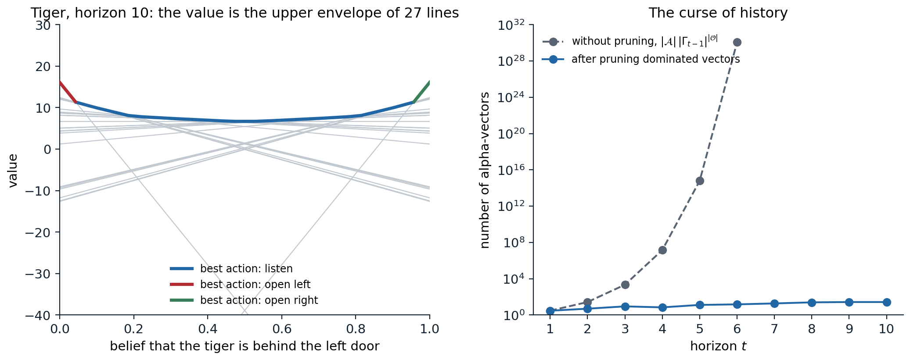
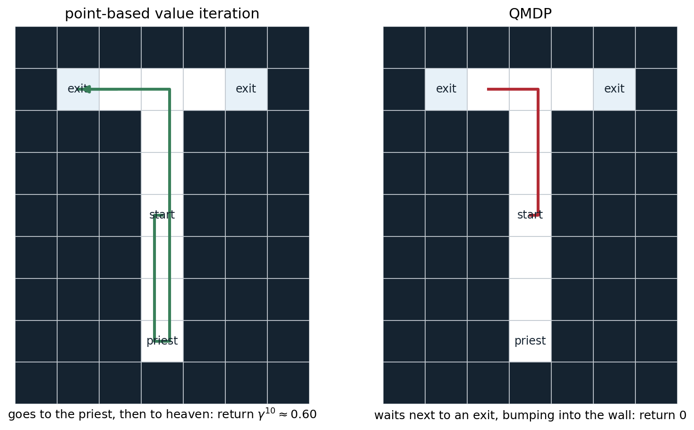

[ML Mastery Notes](../README.md) › [Reinforcement Learning](README.md)

# 14. Partially Observable Environments

[← 13. Policy Gradient and Actor-Critic Methods](13-policy-gradient-and-actor-critic-methods.md) · [15. Optimal Control and Trajectory Optimization →](15-optimal-control-and-trajectory-optimization.md)

## <a id="partial-observability"></a>Partial observability

### <a id="where-hidden-state-comes-from"></a>Where hidden state comes from

An agent that cannot see the whole state of its environment is the rule, not the exception. A robot's sensors have limited range and noise; a card player cannot see the other hands; a recommender system never observes the user's mood; a trading agent sees prices but not the intentions behind them; a driver cannot see around the truck ahead. Four sources of hidden state recur:

- **Limited or noisy sensors.** The observation is a noisy or partial function of the state, as with a robot's range finder or a single video frame that shows positions but not velocities.
- **Perceptual aliasing.** Different states produce the same observation, as with two identical corridors in a building ([Whitehead and Ballard, 1991](https://doi.org/10.1007/BF00058926)).
- **Unknown parameters.** Some fixed property of the environment is unknown: the mass of an object, the preferences of a user, which of two doors hides the tiger. Treating the unknown dynamics of an MDP as hidden state turns learning itself into a planning problem, the **Bayes-adaptive** view of the last section.
- **Other agents.** The intentions, information, and strategies of other agents are hidden, which makes multi-agent problems partially observable even when the physical state is not (chapter 27).

Chapter 1 introduced the formal model. A **partially observable MDP** (POMDP) is an MDP $`(\mathcal S,\mathcal A,p,r,\gamma)`$ together with a set of observations $`\mathcal O`$ and observation probabilities $`Z(o\mid s',a)=\Pr(O_{t+1}=o\mid S_{t+1}=s',A_t=a)`$. The agent sees only the observations and its own actions. This chapter covers what to do about it: planning when the model is known, learning when it is not, and the forms of uncertainty that are best understood as partial observability.

### <a id="agent-states"></a>Agent states

A policy can depend on anything the agent knows at time $`t`$, which is the **history** $`H_t=(O_0,A_0,O_1,\dots,A_{t-1},O_t)`$. The history is always sufficient, but it grows without bound. An **agent state** is a summary $`X_t=f(X_{t-1},A_{t-1},O_t)`$ computed incrementally from it. The choices differ in what they keep:

- **The observation** alone, $`X_t=O_t`$: a **memoryless** or **reactive** agent. It is optimal only if the observation is Markov.
- **A window** of the last $`k`$ observations and actions. This is the frame stacking of the Atari agents, which makes velocities visible (chapter 16). It captures dependencies up to $`k`$ steps back and no further, and the number of distinct windows grows exponentially with $`k`$.
- **The belief state** $`b_t(s)=\Pr(S_t=s\mid H_t)`$, the posterior over hidden states, updated by Bayes' rule:
  ```math
  b_{t+1}(s')=\frac{Z(o\mid s',a)\sum_sp(s'\mid s,a)\,b_t(s)}{\Pr(o\mid b_t,a)}.
  ```
  It is a **sufficient statistic** for the history: the optimal action depends on the history only through the belief ([Åström, 1965](https://doi.org/10.1016/0022-247X%2865%2990154-X)). It requires the model.
- **A learned state**, such as the hidden state of a recurrent network or a set of predictions about future observations. It is what agents without a model use.

The belief is the ideal that the others approximate. It turns a POMDP into a fully observed MDP over beliefs, the **belief MDP**, with the expected reward $`r(b,a)=\sum_sb(s)r(s,a)`$ and deterministic transitions to $`b'=\tau(b,a,o)`$ for each observation $`o`$, which occurs with probability $`\Pr(o\mid b,a)`$. Everything known about MDPs applies to it. Its difficulty is that its state space is the continuous simplex of distributions over $`\mathcal S`$, of dimension $`|\mathcal S|-1`$.

### <a id="what-memory-buys"></a>What memory buys

How much is lost by an agent without memory? Two results frame the answer ([Singh, Jaakkola, and Jordan, 1994](https://doi.org/10.1016/B978-1-55860-335-6.50042-8)):

- **Stochastic memoryless policies can be arbitrarily better than deterministic ones.** In the short corridor of exercise 1.6 and chapter 13, both deterministic policies never reach the goal, and the best stochastic one does in about 12 steps. With aliasing, randomization is a substitute for memory.
- **They can also be arbitrarily worse than policies with memory.** In the tiger problem of chapter 1, the best memoryless policy acts on the last growl alone, while the optimal policy counts.

The best memoryless policy is also hard to find: for deterministic memoryless policies, the problem is NP-hard ([Littman, 1994](https://doi.org/10.7551/mitpress/3117.003.0041)). Worse, the familiar algorithms may not find it. Q-learning applied to observations as if they were states can oscillate or converge to poor policies, since the Bellman equation it solves does not hold for aliased observations. Monte Carlo methods and policy gradient methods, which evaluate the consequences of the actual policy, are better behaved ([Jaakkola, Singh, and Jordan, 1994](https://papers.nips.cc/paper_files/paper/1994/hash/1c1d4df596d01da60385f0bb17a4a9e0-Abstract.html)). The last section of the chapter shows the same contrast for agents that learn their own memory.

## <a id="planning-with-a-known-model"></a>Planning with a known model

### <a id="the-value-function-over-beliefs"></a>The value function over beliefs

For a finite horizon, the optimal value of the belief MDP is **piecewise linear and convex** in the belief ([Smallwood and Sondik, 1973](https://doi.org/10.1287/opre.21.5.1071)): there is a finite set $`\Gamma_t`$ of vectors in $`\mathbb R^{|\mathcal S|}`$, the **alpha-vectors**, with

```math
V_t(b)=\max_{\boldsymbol\alpha\in\Gamma_t}\;\sum_sb(s)\,\alpha(s).
```

Each alpha-vector is the value, state by state, of one conditional plan: a first action followed by a plan for each observation that may follow, and so on to the horizon. The value of following a fixed plan is linear in the belief, and the optimal value picks the best plan for each belief ([Appendix A](#block-rl14-appendix-a)). For an infinite horizon with discounting, $`V^*`$ is the limit of the $`V_t`$; it is convex but need not be piecewise linear, although it can be approximated arbitrarily well by finitely many vectors ([Sondik, 1978](https://doi.org/10.1287/opre.26.2.282)). The convexity is the value of information: the value of a mixture of beliefs is at most the average of their values, so learning which of them holds can only help on average.

### <a id="exact-value-iteration"></a>Exact value iteration

The Bellman backup maps $`\Gamma_{t-1}`$ to $`\Gamma_t`$. For each action $`a`$ and observation $`o`$, each vector $`\boldsymbol\alpha\in\Gamma_{t-1}`$ is projected back one step,

```math
g_{a,o}^{\boldsymbol\alpha}(s)=\gamma\sum_{s'}p(s'\mid s,a)\,Z(o\mid s',a)\,\alpha(s'),
```

and a new vector is formed by choosing one projection for each observation: $`\boldsymbol\alpha_{\text{new}}=r(\cdot,a)+\sum_o g_{a,o}^{\boldsymbol\alpha_o}`$. All the choices give $`|\mathcal A|\,|\Gamma_{t-1}|^{|\mathcal O|}`$ vectors, most of which are **dominated**: they are the best at no belief, and can be removed. Deciding whether a vector is best somewhere is a linear program, one per vector. The classic algorithms differ in how they avoid generating dominated vectors in the first place: the enumeration of [Monahan (1982)](https://doi.org/10.1287/mnsc.28.1.1), Sondik's one-pass algorithm, the witness algorithm of [Kaelbling, Littman, and Cassandra (1998)](https://doi.org/10.1016/S0004-3702%2898%2900023-X), and incremental pruning, which prunes the cross-sum one observation at a time ([Cassandra, Littman, and Zhang, 1997](https://arxiv.org/abs/1302.1525)).

```python
import numpy as np
from scipy.optimize import linprog

# Exact value iteration for the tiger problem (Kaelbling, Littman, and Cassandra, 1998) with alpha-vectors.
# States: tiger left (0) or right (1). Actions: listen, open left, open right. Listening costs 1 and reports the
# tiger's side correctly with probability 0.85; opening the tiger's door costs 100, the other door pays 10, and
# either opening resets the problem with the tiger placed at random. gamma = 0.95.
gamma = 0.95
T = np.array([np.eye(2), np.full((2, 2), 0.5), np.full((2, 2), 0.5)])        # T[a, s, s']
O = np.array([[[0.85, 0.15], [0.15, 0.85]], np.full((2, 2), 0.5), np.full((2, 2), 0.5)])   # O[a, s', o]
R = np.array([[-1, -1], [-100, 10], [10, -100]], float)                     # R[a, s]


def prune(G):
    """Keep the vectors that are strictly best at some belief (Lark's filtering, one linear program each)."""
    G = np.unique(G.round(10), axis=0)
    grid = np.linspace(0, 1, 201)[:, None] * [1, -1] + [0, 1]              # beliefs (b, 1 - b) on a grid
    keep = set(np.argmax(grid @ G.T, axis=1))                              # winners at grid points are needed
    for i in range(len(G)):
        if i in keep:
            continue
        others = np.delete(G, i, axis=0)                                   # max d s.t. b.(a_i - a_j) >= d for all j
        res = linprog(c=[0, 0, -1], A_ub=np.hstack([others - G[i], np.ones((len(others), 1))]),
                      b_ub=np.zeros(len(others)), A_eq=[[1, 1, 0]], b_eq=[1], bounds=[(0, 1), (0, 1), (None, None)])
        if res.status == 0 and -res.fun > 1e-9:
            keep.add(i)
    return G[sorted(keep)]


def backup(G):
    """One exact backup: for each action, the cross-sum over observations of the projected vectors."""
    out = []
    for a in range(3):
        proj = [gamma * (T[a] * O[a][:, o]) @ G.T for o in range(2)]        # proj[o][s, k] = gamma sum_s' T O alpha_k
        cross = (proj[0].T[:, None, :] + proj[1].T[None, :, :]).reshape(-1, 2)
        out.append(prune(R[a] + cross))
    return prune(np.vstack(out))


G = np.zeros((1, 2)); b = np.array([0.5, 0.5])
for t in range(1, 11):
    G = backup(G)
    print(f"horizon {t:2d}: {len(G):2d} alpha-vectors, V(uniform belief) = {np.max(G @ b):7.3f}")
# horizon  1:  3 alpha-vectors, V(uniform belief) =  -1.000
# horizon  2:  5 alpha-vectors, V(uniform belief) =  -1.950
# horizon  3:  9 alpha-vectors, V(uniform belief) =   2.310
# horizon  4:  7 alpha-vectors, V(uniform belief) =   1.796
# horizon  5: 13 alpha-vectors, V(uniform belief) =   2.763
# horizon  6: 15 alpha-vectors, V(uniform belief) =   4.429
# horizon  7: 19 alpha-vectors, V(uniform belief) =   4.584
# horizon  8: 25 alpha-vectors, V(uniform belief) =   5.324
# horizon  9: 27 alpha-vectors, V(uniform belief) =   6.424
# horizon 10: 27 alpha-vectors, V(uniform belief) =   6.693
```

Pruning keeps the tiger's value function small, but it still grows with the horizon, and the value of the uniform belief is still far from its infinite-horizon limit, about 19.4, after ten backups. Without pruning, the count grows doubly exponentially: 3, 27, 2,187, and about $`1.4\times10^7`$ vectors after four steps. This is the **curse of history**, next to the curse of dimensionality of the belief simplex ([Pineau, Gordon, and Thrun, 2003](https://www.ijcai.org/Proceedings/03/Papers/147.pdf)). The complexity results match the experience: deciding whether a finite-horizon POMDP has a policy with a given value is PSPACE-complete ([Papadimitriou and Tsitsiklis, 1987](https://doi.org/10.1287/moor.12.3.441)), against P-complete for MDPs, and for infinite horizons, whether some policy reaches a given value is undecidable, with discounted or undiscounted total reward and with average reward ([Madani, Hanks, and Condon, 2003](https://doi.org/10.1016/S0004-3702%2802%2900378-8); [Appendix B](#block-rl14-appendix-b)).



*Left: the value function of the tiger problem at horizon 10, the upper envelope of 27 lines, one per conditional plan. The envelope is colored by the first action of the best plan: open a door when the belief is nearly certain, listen otherwise. Every line is the best at some belief, many only on intervals too narrow to see. Right: the number of alpha-vectors of exact value iteration, with and without pruning. Without pruning the count is $`|\mathcal A|\,|\Gamma_{t-1}|^{|\mathcal O|}`$, which exceeds $`10^{30}`$ at horizon 6.*

### <a id="heuristics-from-the-underlying-mdp"></a>Heuristics from the underlying MDP

The cheapest approximations solve the underlying MDP, as if the state were observed, and use its solution to act on the belief. **QMDP** ([Littman, Cassandra, and Kaelbling, 1995](https://doi.org/10.1016/B978-1-55860-377-6.50052-9)) averages the MDP's action values under the belief,

```math
Q_{\text{MDP}}(b,a)=\sum_sb(s)\,q_*(s,a),
```

and acts greedily. It assumes that all uncertainty will disappear after one step, so it overestimates: $`\max_aQ_{\text{MDP}}(b,a)\ge V^*(b)`$ (exercise 14.3). QMDP lets the next action depend on the next state; the **fast informed bound** of [Hauskrecht (2000)](https://doi.org/10.1613/jair.678) lets it depend on the next observation and the current state, but not on the next state, which gives a tighter upper bound. Upper bounds like these are useful in their own right, to guide search and to certify the quality of other solutions, as in HSVI and SARSOP below.

```python
import numpy as np

# Point-based value iteration and QMDP on the tiger problem (same model as above, gamma = 0.95).
gamma = 0.95
T = np.array([np.eye(2), np.full((2, 2), 0.5), np.full((2, 2), 0.5)])        # T[a, s, s']
O = np.array([[[0.85, 0.15], [0.15, 0.85]], np.full((2, 2), 0.5), np.full((2, 2), 0.5)])   # O[a, s', o]
R = np.array([[-1, -1], [-100, 10], [10, -100]], float)                     # R[a, s]
ACTIONS = ["listen", "open left", "open right"]


def pbvi_backup(G, B):
    """Point-based backup at each belief in B; returns the new vectors and the action each one starts with."""
    proj = gamma * np.einsum("ast,ato,kt->aosk", T, O, G)                   # proj[a, o, s, k]
    vecs, acts = [], []
    for b in B:
        cands = [R[a] + sum(proj[a, o][:, np.argmax(b @ proj[a, o])] for o in range(2)) for a in range(3)]
        a = int(np.argmax([b @ c for c in cands]))
        vecs.append(cands[a]); acts.append(a)
    vecs, idx = np.unique(np.array(vecs).round(9), axis=0, return_index=True)
    return vecs, np.array(acts)[idx]


B = np.stack([np.linspace(0, 1, 41), 1 - np.linspace(0, 1, 41)], 1)       # 41 beliefs (P(left), P(right))
G = np.full((1, 2), R.min() / (1 - gamma))                                  # start from a lower bound
for it in range(1, 3001):
    G_new, G_act = pbvi_backup(G, B)
    change = np.abs((B @ G_new.T).max(1) - (B @ G.T).max(1)).max()
    G = G_new
    if change < 1e-6:
        break
b0 = np.array([0.5, 0.5])
print(f"PBVI, 41 belief points: {it} backups, {len(G)} alpha-vectors, value of the uniform belief {(G @ b0).max():.2f}")

Q = np.zeros((3, 2))                                                        # QMDP: Q of the underlying MDP
for _ in range(3000):
    Q = R + gamma * T @ Q.max(0)
print(f"QMDP: MDP state values {Q.max(0).round(1)}; its estimate for the uniform belief {(Q @ b0).max():.2f}")

grid = np.linspace(0, 1, 1001)
for name, policy in [("PBVI", lambda b: G_act[np.argmax(b @ G.T, axis=-1)]), ("QMDP", lambda b: np.argmax(b @ Q.T, axis=-1))]:
    a = policy(np.stack([grid, 1 - grid], 1))
    opens = grid[a == 2]                                                    # beliefs P(left) at which it opens right
    print(f"{name} policy: listens while P(tiger left) is between {1 - opens.min():.3f} and {opens.min():.3f}")


def simulate(policy, episodes=20000, steps=300, seed=0):
    """Discounted return from the uniform belief, tracking the belief by Bayes' rule."""
    rng = np.random.default_rng(seed)
    s = rng.integers(2, size=episodes); b = np.tile(b0, (episodes, 1)); ret = np.zeros(episodes)
    for t in range(steps):
        a = policy(b)
        ret += gamma ** t * R[a, s]
        s = np.where(a == 0, s, rng.integers(2, size=episodes))
        o = np.where(rng.random(episodes) < np.where(a == 0, 0.85, 0.5), s, 1 - s)
        b = np.einsum("ns,nst->nt", b, T[a]) * O[a, :, o]                   # predict, then weight by the observation
        b /= b.sum(1, keepdims=True)
    return ret.mean(), ret.std() / np.sqrt(episodes)


for name, policy in [("PBVI", lambda b: G_act[np.argmax(b @ G.T, axis=-1)]), ("QMDP", lambda b: np.argmax(b @ Q.T, axis=-1)),
                     ("listen once, then open", lambda b: np.where(b.max(1) > 0.8, 2 - np.argmax(b, 1), 0))]:
    m, se = simulate(policy)
    print(f"simulated return of the {name} policy: {m:6.2f} +- {se:.2f}")
# PBVI, 41 belief points: 361 backups, 9 alpha-vectors, value of the uniform belief 19.37
# QMDP: MDP state values [200. 200.]; its estimate for the uniform belief 189.00
# PBVI policy: listens while P(tiger left) is between 0.039 and 0.961
# QMDP policy: listens while P(tiger left) is between 0.099 and 0.901
# simulated return of the PBVI policy:  19.40 +- 0.21
# simulated return of the QMDP policy:  19.40 +- 0.21
# simulated return of the listen once, then open policy: -72.83 +- 0.60
```

On the tiger, QMDP's estimate of its own value is ten times too high, 189 against 19.4, but its policy happens to be optimal: it opens a door at a belief of 0.90 instead of 0.96, and after two net growls in the same direction the belief is 0.97, which is past both thresholds. QMDP listens here only because it assumes that the state will be known after the next step: listening costs 1 and, under that fiction, removes the risk of losing 110 by opening the wrong door. An action that merely postponed the choice, without giving any information, would look just as good, and an action whose only value is information looks worthless. The heaven-and-hell problem below makes that failure complete.

### <a id="point-based-value-iteration"></a>Point-based value iteration

Most of the belief simplex is never visited. **Point-based value iteration** (PBVI) ([Pineau, Gordon, and Thrun, 2003](https://www.ijcai.org/Proceedings/03/Papers/147.pdf); [2006](https://doi.org/10.1613/jair.2078)) keeps one alpha-vector per belief in a finite set $`B`$ of beliefs reachable from the start, and backs up only at those points. The backup at a belief $`b`$ is cheap because the best projection for each observation can be chosen at $`b`$ alone:

```math
\boldsymbol\alpha_b=\arg\max_a\;b\cdot\Bigl(r(\cdot,a)+\sum_o\arg\max_{\boldsymbol\alpha\in\Gamma}\;b\cdot g_{a,o}^{\boldsymbol\alpha}\Bigr),
```

which costs $`O(|\mathcal A|\,|\mathcal O|\,|\Gamma|\,|\mathcal S|^2)`$ instead of an exponential number of vectors. Since each vector is the value of a real conditional plan, starting from a lower bound keeps every $`V_B`$ a lower bound on $`V^*`$, and the error is bounded by how densely $`B`$ covers the reachable beliefs: with $`\delta_B`$ the largest distance, in the 1-norm, from a reachable belief to the nearest point of $`B`$, the error is at most $`(R_{\max}-R_{\min})\,\delta_B/(1-\gamma)^2`$ ([Appendix B](#block-rl14-appendix-b)). PBVI alternates backups with expanding $`B`$ by simulating one step from each point and keeping the successors farthest from the set.

Several successors refined the choice of points and the order of backups:

- **Perseus** ([Spaan and Vlassis, 2005](https://doi.org/10.1613/jair.1659)) collects a large set of beliefs by random exploration and, in each iteration, backs up randomly chosen points only until no point's value has decreased, often covering the whole set with a few vectors.
- **HSVI** ([Smith and Simmons, 2004](https://arxiv.org/abs/1207.4166)) keeps both a lower bound (alpha-vectors) and an upper bound (a convex hull of point values, initialized with the values of the underlying MDP at the corners of the simplex), and explores the beliefs where the gap between them contributes most to the uncertainty about the start. It stops with a certified gap.
- **SARSOP** ([Kurniawati, Hsu, and Lee, 2008](https://doi.org/10.15607/RSS.2008.IV.009)) samples near the beliefs reachable under optimal policies, using the bounds to prune the rest; with the factored treatment of **mixed observability**, where some state variables are observed, as the position is in the next example ([Ong, Png, Hsu, and Lee, 2010](https://doi.org/10.1177/0278364910369861)), it solves large robotic planning problems.

The next experiment is a classic test of information gathering, often called **heaven and hell**. A T-shaped maze has two exits; one leads to heaven ($`+1`$) and the other to hell ($`-1`$), with equal prior probability. The agent always knows its position, but not which exit is which, until it visits a priest at the bottom of the maze, three steps away in the opposite direction.

```python
import numpy as np

# Heaven and hell: a T-shaped maze whose two exits lead to heaven (+1) or hell (-1), with equal prior probability
# of either arrangement. The agent sees its own position; at the priest's cell, it is also told which exit is
# heaven. Moves are deterministic, moving into a wall stays put, and entering an exit ends the episode.
MAP = ["#######",
       "#L.+.R#",
       "###.###",
       "###.###",
       "###S###",
       "###.###",
       "###.###",
       "###P###",
       "#######"]
gamma = 0.95
cells = [(r, c) for r, row in enumerate(MAP) for c, ch in enumerate(row) if ch != "#"]
index = {rc: i for i, rc in enumerate(cells)}
nC = len(cells); nS = 2 * nC + 1; END = nS - 1                  # state = (cell, heaven side) or the end
moves = [(-1, 0), (1, 0), (0, -1), (0, 1)]                          # up, down, left, right
T = np.zeros((4, nS, nS)); R = np.zeros((4, nS)); T[:, END, END] = 1
for (r, c), i in index.items():
    for side in range(2):                                           # side 0: heaven on the left
        s = 2 * i + side
        for a, (dr, dc) in enumerate(moves):
            nxt = (r + dr, c + dc) if MAP[r + dr][c + dc] != "#" else (r, c)
            ch = MAP[nxt[0]][nxt[1]]
            if MAP[r][c] in "LR":                                   # exits are left immediately
                T[a, s, END] = 1
            else:
                T[a, s, 2 * index[nxt] + side] = 1
            if MAP[r][c] not in "LR" and ch in "LR":
                R[a, s] = 1.0 if (ch == "L") == (side == 0) else -1.0
nO = 3 * nC + 1                                                     # observation: cell, and the priest's message
O = np.zeros((nS, nO)); O[END, nO - 1] = 1
for (r, c), i in index.items():
    for side in range(2):
        O[2 * i + side, 3 * i + (1 + side if MAP[r][c] == "P" else 0)] = 1
start = np.zeros(nS); start[2 * index[(4, 3)]] = start[2 * index[(4, 3)] + 1] = 0.5


def update(b, a, o):
    b = (b @ T[a]) * O[:, o]
    return b / b.sum()


# reachable beliefs, collected by random walks from the start
rng = np.random.default_rng(0)
B = {tuple(start.round(6))}
for _ in range(300):
    b, s = start.copy(), rng.choice(nS, p=start)
    for t in range(30):
        a = rng.integers(4); s = rng.choice(nS, p=T[a, s]); o = rng.choice(nO, p=O[s])
        b = update(b, a, o); B.add(tuple(b.round(6)))
B = np.array(sorted(B))


def pbvi(B, iters=300):
    G = np.zeros((1, nS)); acts = np.zeros(1, int)
    for _ in range(iters):
        proj = gamma * np.einsum("ast,to,kt->aosk", T, O, G)       # proj[a, o, s, k]
        vals = np.einsum("bs,aosk->baok", B, proj)                  # value of each continuation at each belief
        best = vals.argmax(3)                                        # best vector per (belief, action, observation)
        cont = proj[np.arange(4)[None, :, None], np.arange(nO)[None, None, :], :, best]   # (belief, a, o, s)
        cand = R[None] + cont.sum(2)                                # one candidate vector per belief and action
        a = np.einsum("bs,bas->ba", B, cand).argmax(1)
        G, idx = np.unique(cand[np.arange(len(B)), a].round(9), axis=0, return_index=True); acts = a[idx]
    return G, acts


G, acts = pbvi(B)
Q = np.zeros((4, nS))                                               # QMDP
for _ in range(500):
    Q = R + gamma * T @ Q.max(0)
print(f"{len(B)} reachable beliefs; PBVI value of the start {np.max(G @ start):.3f}; QMDP's estimate {np.max(Q @ start):.3f}")


def run(policy, steps=60, heaven=0):
    s = 2 * index[(4, 3)] + heaven; b = start.copy(); ret, path = 0.0, []
    for t in range(steps):
        a = policy(b); path.append("UDLR"[a])
        r = R[a, s]; ret += gamma ** t * r
        if r != 0:                                                  # entered an exit
            break
        s = int(np.argmax(T[a, s])); o = int(np.argmax(O[s])); b = update(b, a, o)
    return ret, "".join(path)


for name, policy in [("PBVI", lambda b: acts[np.argmax(G @ b)]), ("QMDP", lambda b: int(np.argmax(Q @ b)))]:
    for heaven in range(2):
        ret, path = run(policy, heaven=heaven)
        print(f"{name}, heaven on the {'left' if heaven == 0 else 'right'}: return {ret:.3f}, moves {path[:40]}{'...' if len(path) > 40 else ''}")
print(f"visiting the priest first and then going to heaven is worth gamma^10 = {gamma ** 10:.3f}")
# 30 reachable beliefs; PBVI value of the start 0.599; QMDP's estimate 0.815
# PBVI, heaven on the left: return 0.599, moves DDDUUUUUULL
# PBVI, heaven on the right: return 0.599, moves DDDUUUUUURR
# QMDP, heaven on the left: return 0.000, moves UUULUUUUUUUUUUUUUUUUUUUUUUUUUUUUUUUUUUUU...
# QMDP, heaven on the right: return 0.000, moves UUULUUUUUUUUUUUUUUUUUUUUUUUUUUUUUUUUUUUU...
# visiting the priest first and then going to heaven is worth gamma^10 = 0.599
```

PBVI walks down to the priest, back up, and to heaven, worth $`\gamma^{10}\approx0.60`$. QMDP never visits the priest: in the underlying MDP the agent already knows the answer, so the detour only delays the reward. It walks up to the junction and one step left, next to an exit, and stays there by walking into the wall, since entering either exit is worth 0 under its belief, while every other move is worth something under the fiction that the uncertainty will disappear. Its estimate of its own value, 0.82, is the value of an agent that knows where heaven is.



*Heaven and hell, with heaven on the left. The agent knows its position but not which exit is heaven, and only the priest can tell it. Point-based value iteration, over the 30 beliefs reached by random walks, visits the priest first; QMDP, which values the actions as if the state would become known after one step, never does.*

### <a id="online-planning"></a>Online planning

Offline solvers compute a policy for every belief the agent might reach. **Online planners** plan only for the belief the agent is in, by searching the tree of future actions and observations from it at every step, as the decision-time planners of chapter 10 do for MDPs ([Ross, Pineau, Paquet, and Chaib-draa, 2008](https://doi.org/10.1613/jair.2567)). The search tree alternates action nodes and observation nodes; its size is exponential in the depth, but it does not depend on the size of the state space if the beliefs and outcomes are sampled.

**POMCP** ([Silver and Veness, 2010](https://papers.nips.cc/paper_files/paper/2010/hash/edfbe1afcf9246bb0d40eb4d8027d90f-Abstract.html)) is Monte Carlo tree search in belief space. Its tree is indexed by histories of actions and observations. Each simulation starts from a state sampled from the current belief and runs the generative model down the tree, choosing actions with UCB, extending the tree by one node, and estimating the rest with a rollout policy, exactly as UCT does (AI chapter 4). The states that simulations carry through a node form a particle representation of its belief, so after a real action and observation, the chosen child's particles are the new belief and no explicit Bayes update is needed. POMCP needs only a simulator, not the probabilities, and it scales to problems with enormous state spaces, but it has two weaknesses. With few particles, the belief can lose support for the true state (**particle deprivation**), which it repairs by adding perturbed particles. With continuous or very many observations, each observation node is visited once, and the tree never deepens; **POMCPOW** ([Sunberg and Kochenderfer, 2018](https://arxiv.org/abs/1709.06196)) grows observation branches progressively to fix it. **DESPOT** ([Somani, Ye, Hsu, and Lee, 2013](https://papers.nips.cc/paper_files/paper/2013/hash/c2aee86157b4a40b78132f1e71a9e6f1-Abstract.html); [Ye, Somani, Hsu, and Lee, 2017](https://doi.org/10.1613/jair.5328)) searches a sparse tree over a fixed set of sampled scenarios, with regularization to avoid overfitting them, and comes with performance guarantees. Exercise 14.5 runs POMCP on the tiger.

### <a id="finite-state-controllers"></a>Finite-state controllers

A policy for a POMDP can also be represented directly as a **finite-state controller**: a graph whose nodes are labeled with actions and whose edges are labeled with observations. The agent's state is the current node; it acts, observes, and follows the edge. The optimal tiger policy is such a graph with five nodes (listen, and move by one node toward "open left" or "open right" with each growl). Policy iteration in the space of controllers ([Hansen, 1998](https://arxiv.org/abs/1301.7380)) and bounded policy iteration, which keeps the controller small ([Poupart and Boutilier, 2003](https://papers.nips.cc/paper_files/paper/2003/hash/4c5bcfec8584af0d967f1ab10179ca4b-Abstract.html)), search this space. Controllers are also the natural object for learning without a model: a controller with stochastic transitions is exactly an agent with a learned memory, as in the next section ([Meuleau, Peshkin, Kim, and Kaelbling, 1999](https://arxiv.org/abs/1301.6721)).

## <a id="learning-without-a-model"></a>Learning without a model

### <a id="windows-and-hand-designed-memory"></a>Windows and hand-designed memory

Without a model, no belief can be computed, and the agent must learn from its history directly. The simplest agent state is a **window** of recent observations, which is how DQN handles the velocities in Atari games. It works when the dependencies are short, and it fails silently when they are longer than the window. **Utile suffix memory** ([McCallum, 1995](https://doi.org/10.1016/B978-1-55860-377-6.50055-4)) grows the window only where the extra history changes the predicted return, a variable-length memory learned from data.

### <a id="learned-memory"></a>Learned memory

The more general solution is for the agent to learn what to remember. Early work gave the agent **external memory**, bits it can set with its actions, and learned to use them with reinforcement learning ([Peshkin, Meuleau, and Kaelbling, 1999](https://arxiv.org/abs/cs/0103003)). A memory the agent writes makes the agent state $`(o,m)`$ non-Markov unless the memory is used consistently, and one-step bootstrapping, which assumes that the value of $`(o,m)`$ does not depend on how the agent got there, fails to learn it; Monte Carlo and policy search methods succeed on short dependencies. **Recurrent networks** replace the bits by a continuous state trained by backpropagation through time (DL chapter 8), which passes gradient information through the memory: an LSTM trained with advantage learning solved T-mazes with long corridors ([Bakker, 2001](https://papers.nips.cc/paper_files/paper/2001/hash/a38b16173474ba8b1a95bcbc30d3b8a5-Abstract.html)).

```python
import random

# The T-maze (after Bakker, 2001): a corridor of length N; at its start the agent sees a cue, up or down, that
# says which way to turn at the far end. Elsewhere it sees only its position, so the cue is the one thing it
# must remember. At the junction, where the only actions are to turn up or down, turning the cued way pays +4
# and the other way -0.1, and either ends the episode; bumping into the wall behind the start costs 0.1, and
# gamma = 0.9. Tabular agents with epsilon-greedy exploration differ in their agent state: the current
# observation; the last k observations; the observation plus one bit of memory that the agent writes with its
# actions; and the observation plus the cue, which is the belief state here.
def tmaze(N, kind, k=1, method="q", episodes=3000, seed=0, eps=0.1, alpha=0.1, gamma=0.9):
    rnd = random.Random(seed)
    nA = 8 if kind == "memory" else 4                           # left, right, up, down (x write 0 or 1)
    Q = {}

    def agent_state(hist, mem, cue):
        return {"window": lambda: tuple(hist[-k:]), "memory": lambda: (hist[-1], mem),
                "belief": lambda: (hist[-1], cue), "obs": lambda: hist[-1]}[kind]()

    def run(learn):
        cue, pos, mem = rnd.randrange(2), 0, 0
        hist = [("cue", cue)]
        s, visited = agent_state(hist, mem, cue), []
        for t in range(N * N + 50):
            q = Q.setdefault(s, [0.0] * nA)
            valid = [i for i in range(nA) if (i % 4 >= 2) == (pos == N)]   # turn at the junction, else move
            if learn and rnd.random() < eps:
                a = rnd.choice(valid)
            else:
                m = max(q[i] for i in valid); a = rnd.choice([i for i in valid if q[i] == m])
            move, r, done = a % 4, 0.0, False
            if move >= 2:                                       # up (2) or down (3), at the junction
                r, done = (4.0 if move - 2 == cue else -0.1), True
            elif pos == 0 and move == 0:
                r = -0.1                                        # bumping into the wall behind the start
            else:
                pos += 2 * move - 1                             # left or right along the corridor
            if kind == "memory":
                mem = a // 4                                    # the bit the action wrote
            hist.append(("cue", cue) if pos == 0 else ("junction",) if pos == N else ("corridor", pos))
            s2 = agent_state(hist, mem, cue)
            visited.append((q, a, r))
            if learn and method == "q":                         # one-step Q-learning
                q2 = Q.setdefault(s2, [0.0] * nA)
                target = r if done else r + gamma * max(q2[i] for i in range(nA) if (i % 4 >= 2) == (pos == N))
                q[a] += alpha * (target - q[a])
            s = s2
            if done:
                break
        if learn and method == "mc":                            # every-visit Monte Carlo, constant step size
            G = 0.0
            for q, a, r in reversed(visited):
                G = r + gamma * G
                q[a] += alpha * (G - q[a])
        return done and r > 0

    for _ in range(episodes):
        run(learn=True)
    return sum(run(learn=False) for _ in range(100)) / 100


Ns = (2, 5, 10, 20)
print("success rate of the greedy policy after 3,000 episodes, average of 5 runs")
print("corridor length N:                         " + "".join(f"{N:>7d}" for N in Ns))
for label, kind, k, method in [("current observation", "obs", 1, "q"), ("last 4 observations", "window", 4, "q"),
                               ("last 12 observations", "window", 12, "q"),
                               ("observation + memory bit, Q-learning", "memory", 1, "q"),
                               ("observation + memory bit, Monte Carlo", "memory", 1, "mc"),
                               ("observation + cue (belief)", "belief", 1, "q")]:
    row = [sum(tmaze(N, kind, k, method, seed=s) for s in range(5)) / 5 for N in Ns]
    print(f"{label:41s}  " + "".join(f"{x:7.2f}" for x in row))
# success rate of the greedy policy after 3,000 episodes, average of 5 runs
# corridor length N:                               2      5     10     20
# current observation                           0.51   0.41   0.52   0.48
# last 4 observations                           1.00   0.52   0.48   0.52
# last 12 observations                          1.00   1.00   1.00   0.60
# observation + memory bit, Q-learning          0.57   0.52   0.52   0.53
# observation + memory bit, Monte Carlo         1.00   0.79   0.40   0.12
# observation + cue (belief)                    1.00   1.00   1.00   1.00
```

The table separates three things. Without memory, the agent turns correctly half the time, whatever the length. A window works only when it reaches back to the cue. A single bit of memory, the least that the task needs, is useless to one-step Q-learning at every length: its target at the junction, $`\max_a Q((\text{junction},m),a)`$, assumes that the bit means what it meant in other episodes, so writing the wrong bit looks as good as writing the right one. Monte Carlo evaluates what actually happened and learns to store the cue, reliably for a corridor of length 2 and less reliably as the corridor grows, since an exploratory action that overwrites the bit anywhere along the way spoils the lesson; for a corridor of 20, its greedy policy often does not even reach the junction. Given the belief state, here the observation and the cue, the problem is an MDP and every length is easy.

Deep RL agents for partially observable tasks are recurrent. **DRQN** ([Hausknecht and Stone, 2015](https://arxiv.org/abs/1507.06527)) replaced DQN's frame stack by an LSTM; **R2D2** ([Kapturowski et al., 2019](https://openreview.net/forum?id=r1lyTjAqYX)) showed how to train recurrent agents from replayed sequences, storing the recurrent state and warming it up on a prefix of each sequence before learning (chapter 18). Recurrent model-free agents, carefully tuned, are strong baselines across many partially observable benchmarks ([Ni, Eysenbach, and Salakhutdinov, 2022](https://arxiv.org/abs/2110.05038); [Morad et al., 2023](https://arxiv.org/abs/2303.01859)). **Transformers** over the history (DL chapter 9) can attend directly to an observation far in the past, which helps with long-term memory; gated variants stabilize their training in RL ([Parisotto et al., 2020](https://arxiv.org/abs/1910.06764)). But memory is not the only difficulty: transformers greatly improve tasks that need long memory but not tasks that need long-term credit assignment, where the reward for an action arrives long after it ([Ni et al., 2023](https://arxiv.org/abs/2307.03864)).

### <a id="learning-a-belief"></a>Learning a belief

A third approach learns a model of the observations and uses the model's own posterior as the agent state. **Predictive state representations** ([Littman, Sutton, and Singh, 2001](https://papers.nips.cc/paper_files/paper/2001/hash/1e4d36177d71bbb3558e43af9577d70e-Abstract.html)) represent the state by the probabilities of a set of future tests, sequences of actions and observations, which are observable quantities and can be estimated from data, unlike hidden states; any POMDP with $`n`$ states has a linear predictive state representation with at most $`n`$ tests. With neural networks, a **recurrent state-space model** learns a latent state that is filtered from observations and trained to predict future observations and rewards ([Hafner et al., 2019](https://arxiv.org/abs/1811.04551)); planning or policy learning then works on the latent belief. This is the architecture of the world-model agents of chapter 23. Variational methods learn a particle belief end to end ([Igl et al., 2018](https://arxiv.org/abs/1806.02426)).

### <a id="what-theory-says"></a>What theory says

Learning in POMDPs is hard in general: learning hidden Markov models is as hard as learning parity with noise, which is believed to be intractable ([Mossel and Roch, 2005](https://arxiv.org/abs/cs/0502076)), and planning is intractable even with the model. Recent theory identifies conditions under which it is not. In **rich-observation** problems, the observations are high-dimensional but determine a small latent state, as in a **block MDP** ([Krishnamurthy, Agarwal, and Langford, 2016](https://arxiv.org/abs/1602.02722); [Du et al., 2019](https://arxiv.org/abs/1901.09018)); the problem is then an MDP in disguise, and the difficulty is to discover the latent states. In **observable** POMDPs, beliefs that differ produce observation distributions that differ by a margin; under such conditions, planning takes quasi-polynomial time ([Golowich, Moitra, and Rohatgi, 2022](https://arxiv.org/abs/2201.04735)), and learning has polynomial sample complexity in undercomplete ([Jin, Kakade, Krishnamurthy, and Liu, 2020](https://arxiv.org/abs/2006.12484)) and weakly revealing problems ([Liu, Chung, Szepesvári, and Jin, 2022](https://arxiv.org/abs/2204.08967)). The common thread is that observations must eventually reveal the hidden state; when they never do, no algorithm can learn efficiently (chapter 30).

## <a id="uncertainty-as-partial-observability"></a>Uncertainty as partial observability

### <a id="bayes-adaptive-mdps"></a>Bayes-adaptive MDPs

An agent that does not know the dynamics of an MDP can treat them as hidden state. If the unknown parameters $`\phi`$ have a prior, the pair $`(s,\phi)`$ is the state of a POMDP whose observations are the transitions, and its belief is the current state together with the posterior over $`\phi`$. For discrete MDPs with Dirichlet priors, the posterior is a table of transition counts, the **Bayes-adaptive MDP** ([Duff, 2002](https://scholarworks.umass.edu/dissertations/AAI3039353)). Its optimal policy trades off exploration and exploitation exactly, by planning with the value of the information that each action provides. The Bayesian bandit of chapter 4 is the one-state case, and the Gittins index its solution. Computing the Bayes-optimal policy is intractable in general, but online planners adapted to it, such as **BAMCP** ([Guez, Silver, and Dayan, 2012](https://arxiv.org/abs/1205.3109)), which samples a model from the posterior at the root of each simulation, approximate it well in small problems. **Meta-reinforcement learning** learns an agent whose recurrent state implements the posterior and whose policy is approximately Bayes-optimal for a distribution of tasks (chapter 29).

### <a id="many-agents"></a>Many agents

When several agents act with their own observations, each one's optimal behavior depends on what the others know and do. A **decentralized POMDP** gives the agents a shared reward and private observations; finding its optimal policies is NEXP-complete even for two agents and finite horizons ([Bernstein, Givan, Immerman, and Zilberstein, 2002](https://doi.org/10.1287/moor.27.4.819.297)), so, unlike single-agent POMDPs, they provably have no polynomial-time algorithm, since P is strictly contained in NEXP. Games with private information, such as poker, add conflicting interests and call for the equilibrium methods of chapter 27.

### <a id="linear-dynamics-and-gaussian-noise"></a>Linear dynamics and Gaussian noise

One partially observable problem has an exact and efficient solution. With linear dynamics, Gaussian noise in the dynamics and the observations, and quadratic costs, the belief is Gaussian, its mean is computed by the Kalman filter (AI chapter 11), and the optimal controller applies the optimal feedback of the fully observed problem to the estimated mean, the **separation principle** of linear–quadratic–Gaussian control. It is the subject of chapter 15.

## <a id="exercises"></a>Exercises

### <a id="exercise-14-1-beliefs-in-the-tiger-problem"></a>Exercise 14.1 — Beliefs in the tiger problem

(a) Starting from the uniform belief, compute the belief that the tiger is behind the left door after hearing it on the left, the left, and the right. (b) Show that after any sequence of listens, the belief depends only on the difference $`d`$ between the numbers of growls heard on the left and on the right, and write it in closed form. (c) The optimal policy opens a door when the belief exceeds 0.961. After how many net growls does it open?


<details>
<summary><b>Solution</b></summary>


(a) Each growl heard on the left multiplies the odds of "left" by $`0.85/0.15=17/3`$, and each on the right divides them by it. From even odds: after L, $`0.85`$; after L, L, $`0.85^2/(0.85^2+0.15^2)=0.9698`$; after L, L, R, back to $`0.85`$.

(b) Listening does not move the tiger, so the likelihood of a sequence with $`n_L`$ left growls and $`n_R`$ right growls is $`0.85^{n_L}0.15^{n_R}`$ if the tiger is on the left and $`0.15^{n_L}0.85^{n_R}`$ if on the right. The posterior odds are $`(17/3)^{n_L-n_R}`$, so $`b=\bigl(1+(3/17)^d\bigr)^{-1}`$ with $`d=n_L-n_R`$.

(c) $`d=1`$ gives 0.85 and $`d=2`$ gives 0.9698, which exceeds 0.961, so the policy opens after two net growls on the same side. The belief is a sufficient statistic, and here it reduces to one integer, which is why a five-node controller implements the optimal policy.

</details>


### <a id="exercise-14-2-convexity-of-the-value-function"></a>Exercise 14.2 — Convexity of the value function

Show by induction that the finite-horizon value function $`V_t(b)`$ of a POMDP is piecewise linear and convex.


<details>
<summary><b>Solution</b></summary>


$`V_0=0`$ is linear. Suppose $`V_{t-1}(b)=\max_{\boldsymbol\alpha\in\Gamma_{t-1}}b\cdot\boldsymbol\alpha`$. Then

```math
V_t(b)=\max_a\Bigl[b\cdot r(\cdot,a)+\gamma\sum_o\Pr(o\mid b,a)\,V_{t-1}(\tau(b,a,o))\Bigr].
```

The updated belief is $`\tau(b,a,o)(s')=\sum_sb(s)p(s'\mid s,a)Z(o\mid s',a)/\Pr(o\mid b,a)`$, so the normalizer cancels: $`\Pr(o\mid b,a)\,V_{t-1}(\tau(b,a,o))=\max_{\boldsymbol\alpha}\sum_sb(s)\sum_{s'}p(s'\mid s,a)Z(o\mid s',a)\alpha(s')=\max_{\boldsymbol\alpha}b\cdot\mathbf g_{a,o}^{\boldsymbol\alpha}/\gamma`$. A maximum of linear functions of $`b`$ is piecewise linear and convex; a sum over $`o`$ of such functions is a maximum over choices of one vector per observation, so it is also piecewise linear and convex; adding the linear reward term and maximizing over $`a`$ preserves the property. The vectors of $`\Gamma_t`$ are exactly the $`r(\cdot,a)+\sum_o\mathbf g_{a,o}^{\boldsymbol\alpha_o}`$ of the chapter's backup.

</details>


### <a id="exercise-14-3-qmdp-is-an-upper-bound"></a>Exercise 14.3 — QMDP is an upper bound

(a) Show that $`V_{\text{MDP}}(b)=\sum_sb(s)v_*(s)\ge V^*(b)`$ for every belief. (b) Show that QMDP's action values satisfy the same inequality after one step: $`Q_{\text{MDP}}(b,a)\ge Q^*(b,a)`$. (c) When is QMDP optimal?


<details>
<summary><b>Solution</b></summary>


(a) An agent that observes the state can do anything an agent that sees only observations can do, since it can simulate the observations and ignore the state. So for every state, the optimal value with full observation is at least the value of any POMDP policy started in that state, and averaging over $`b`$ gives $`\sum_sb(s)v_*(s)\ge V^*(b)`$. Formally, the Bellman operator of the belief MDP applied to the linear function $`V_{\text{MDP}}`$ gives $`\max_a\sum_sb(s)[r(s,a)+\gamma\sum_{s'}p(s'\mid s,a)v_*(s')]\le\sum_sb(s)\max_aq_*(s,a)=V_{\text{MDP}}(b)`$, since the maximum of a sum is at most the sum of maxima. The operator is monotone and a contraction, so iterating it from $`V_{\text{MDP}}`$ gives a decreasing sequence converging to $`V^*`$.

(b) $`Q^*(b,a)=b\cdot r(\cdot,a)+\gamma\sum_o\Pr(o\mid b,a)V^*(\tau(b,a,o))`$. Replacing $`V^*`$ by the larger $`V_{\text{MDP}}`$ and using $`\sum_o\Pr(o\mid b,a)\tau(b,a,o)(s')=\sum_sb(s)p(s'\mid s,a)`$ gives $`b\cdot r(\cdot,a)+\gamma\sum_sb(s)\sum_{s'}p(s'\mid s,a)v_*(s')=Q_{\text{MDP}}(b,a)`$.

(c) QMDP is optimal when the state becomes known after every step, so that the assumption behind it is true, and more generally when the actions that are optimal under full observability are also optimal under the belief. It fails when information has value only because the state is hidden: the priest in heaven and hell, looking at a map, asking for directions. Its bound is loose in the same cases; the fast informed bound, which lets the continuation depend on the next observation, is tighter.

</details>


### <a id="exercise-14-4-randomization-as-a-substitute-for-memory"></a>Exercise 14.4 — Randomization as a substitute for memory

Two states $`A`$ and $`B`$ produce the same observation, and the agent starts in $`A`$. In $`A`$, action 1 moves to $`B`$ and action 2 stays in $`A`$; in $`B`$, action 2 moves to $`A`$ and action 1 stays in $`B`$. Every move between the states pays $`+1`$, and every step that stays costs $`-1`$. Compare the average reward of the best deterministic memoryless policy, the best stochastic memoryless policy, and the best policy with one bit of memory.


<details>
<summary><b>Solution</b></summary>


In $`A`$ the agent should take action 1 and in $`B`$ action 2, which requires knowing the state. A deterministic memoryless policy takes the same action in both: with action 1 it moves from $`A`$ to $`B`$ once and then stays in $`B`$ forever at $`-1`$ per step; with action 2 it stays in $`A`$ forever, also at $`-1`$ per step. Its average reward is $`-1`$. A stochastic policy that takes each action with probability $`1/2`$ moves with probability $`1/2`$ at each step, so its average reward is $`\tfrac12(+1)+\tfrac12(-1)=0`$; by symmetry this is the best memoryless policy. With one bit of memory the agent can alternate actions, starting with action 1: it then moves at every step, the states alternate with its actions, and its average reward is $`+1`$. So randomization recovers half the gap between the deterministic memoryless policy and the optimum, and memory recovers all of it; making staying costlier makes the deterministic policy arbitrarily worse, while the stochastic one still moves half the time.

</details>


### <a id="exercise-14-5-pomcp-on-the-tiger"></a>Exercise 14.5 — POMCP on the tiger

Implement POMCP for the tiger problem with a uniformly random rollout policy and with a rollout policy that always listens. Compare with the optimal policy over 12 real steps, for 10, 100, and 1,000 simulations per step.


<details>
<summary><b>Solution</b></summary>


```python
import math
import random

# POMCP (Silver and Veness, 2010) on the tiger problem: UCT over action-observation histories, with the belief
# at each node represented by the states that simulations passed through it. Two rollout policies: uniformly
# random, and always listening. Compared with the optimal policy (listen until two more growls on one side than
# the other) over 12 real steps, discounted with gamma = 0.95.
gamma, rnd = 0.95, random.Random(0)


def step(s, a):                                          # generative model: next state, observation, reward
    if a == 0:
        return s, (s if rnd.random() < 0.85 else 1 - s), -1.0
    r = 10.0 if a != s + 1 else -100.0                  # a = 1 opens the left door, a = 2 the right; s = 0: tiger left
    return rnd.randrange(2), rnd.randrange(2), r


class Node:
    def __init__(self):
        self.n, self.na, self.q, self.children, self.particles = 0, [0] * 3, [0.0] * 3, {}, []


def rollout(s, depth, policy):
    if policy == "listen":                                   # always listening: -1 per step, in closed form
        return -(1 - gamma ** depth) / (1 - gamma)
    total, disc = 0.0, 1.0
    for _ in range(depth):
        s, o, r = step(s, rnd.randrange(3)); total += disc * r; disc *= gamma
    return total


def simulate(node, s, depth, policy, c=110.0):
    if depth == 0:
        return 0.0
    if node.n == 0 and node is not ROOT[0]:
        node.n = 1
        return rollout(s, depth, policy)
    a = max(range(3), key=lambda a: math.inf if node.na[a] == 0 else node.q[a] + c * math.sqrt(math.log(node.n) / node.na[a]))
    s2, o, r = step(s, a)
    child = node.children.setdefault((a, o), Node())
    child.particles.append(s2)
    ret = r + gamma * simulate(child, s2, depth - 1, policy)
    node.n += 1; node.na[a] += 1; node.q[a] += (ret - node.q[a]) / node.na[a]
    return ret


ROOT = [None]


LEAD, AT_TWO = [0], []


def pomcp_episode(sims, policy, steps=12, depth=30):
    LEAD[0] = 0; s = rnd.randrange(2); ROOT[0] = Node(); ROOT[0].particles = [rnd.randrange(2) for _ in range(1000)]
    total = 0.0
    for t in range(steps):
        root = ROOT[0]
        for _ in range(sims):
            simulate(root, rnd.choice(root.particles), depth, policy)
        a = max(range(3), key=lambda a: root.q[a] if root.na[a] else -math.inf)
        if abs(LEAD[0]) == 2:
            AT_TWO.append(a != 0)                                # did it open with a lead of two growls?
        s, o, r = step(s, a); total += gamma ** t * r
        LEAD[0] = 0 if a else LEAD[0] + (1 if o == 0 else -1)
        child = root.children.get((a, o))
        if child is None or not child.particles:                 # no simulation saw this observation: reset
            child = Node(); child.particles = [rnd.randrange(2) for _ in range(1000)]
        ROOT[0] = child
    return total


def optimal_episode(steps=12):
    s, lead, total = rnd.randrange(2), 0, 0.0
    for t in range(steps):
        a = 0 if abs(lead) < 2 else (2 if lead > 0 else 1)      # lead > 0: more growls from the left
        s2, o, r = step(s, a); total += gamma ** t * r
        lead = 0 if a else lead + (1 if o == 0 else -1); s = s2
    return total


def report(label, res):
    m = sum(res) / len(res); ci = 1.96 * (sum((x - m) ** 2 for x in res) / len(res)) ** 0.5 / len(res) ** 0.5
    print(f"{label:45s} {m:7.2f} +- {ci:.2f}" + (f"; opens at a lead of two in {sum(AT_TWO) / len(AT_TWO):.0%} of cases" if AT_TWO else ""))


n = 100
report("optimal policy (20,000 episodes)", [optimal_episode() for _ in range(20000)])
for policy in ("random", "listen"):
    for sims in (10, 100, 1000):
        AT_TWO.clear()
        report(f"POMCP, {policy} rollouts, {sims:4d} simulations per step", [pomcp_episode(sims, policy) for _ in range(n)])
# optimal policy (20,000 episodes)                 7.94 +- 0.34
# POMCP, random rollouts,   10 simulations per step -167.73 +- 23.81; opens at a lead of two in 56% of cases
# POMCP, random rollouts,  100 simulations per step  -33.56 +- 12.50; opens at a lead of two in 45% of cases
# POMCP, random rollouts, 1000 simulations per step  -19.25 +- 11.15; opens at a lead of two in 37% of cases
# POMCP, listen rollouts,   10 simulations per step -124.20 +- 19.08; opens at a lead of two in 54% of cases
# POMCP, listen rollouts,  100 simulations per step   -1.56 +- 4.98; opens at a lead of two in 21% of cases
# POMCP, listen rollouts, 1000 simulations per step    3.66 +- 3.10; opens at a lead of two in 25% of cases
```

With 10 simulations per step, POMCP opens doors almost at random. With random rollouts, even 1,000 simulations leave it far below the optimum: random rollouts open doors two-thirds of the time, so the values at the leaves are dominated by large, noisy losses that say nothing about the current belief. A rollout policy that always listens returns a constant, which lets the tree itself determine when to open, and POMCP comes much closer to the optimum. It still listens too often, opening with a lead of two growls in only about a quarter of the cases, where the optimal policy always opens: at that belief, opening is worth only 0.7 more than listening once more, a difference its estimates cannot resolve with 1,000 simulations. A good rollout policy is domain knowledge, and it matters as much in POMCP as in any Monte Carlo tree search; [Silver and Veness (2010)](https://papers.nips.cc/paper_files/paper/2010/hash/edfbe1afcf9246bb0d40eb4d8027d90f-Abstract.html) used "preferred actions" for their larger problems.

</details>


### <a id="exercise-14-6-how-many-belief-points"></a>Exercise 14.6 — How many belief points?

Run point-based value iteration on the tiger problem with belief sets of 2 to 41 evenly spaced points, and compare the value it assigns to the uniform belief with the simulated return of its policy.


<details>
<summary><b>Solution</b></summary>


```python
import numpy as np

# Point-based value iteration on the tiger problem with belief grids of different sizes: the value it assigns
# to the uniform belief (a lower bound, since the backups start from a lower bound) and the simulated return of
# its policy from the uniform belief.
gamma = 0.95
T = np.array([np.eye(2), np.full((2, 2), 0.5), np.full((2, 2), 0.5)])
O = np.array([[[0.85, 0.15], [0.15, 0.85]], np.full((2, 2), 0.5), np.full((2, 2), 0.5)])
R = np.array([[-1, -1], [-100, 10], [10, -100]], float)


def pbvi(B, iters=1500):
    G = np.full((1, 2), R.min() / (1 - gamma)); acts = np.zeros(1, int)
    for _ in range(iters):
        proj = gamma * np.einsum("ast,ato,kt->aosk", T, O, G)
        cand = R[None] + sum(proj[:, o][np.arange(3)[None, :], :, np.einsum("bs,ask->bak", B, proj[:, o]).argmax(2)]
                             for o in range(2))                     # cand[b, a, s]
        a = np.einsum("bs,bas->ba", B, cand).argmax(1)
        G, idx = np.unique(cand[np.arange(len(B)), a].round(9), axis=0, return_index=True); acts = a[idx]
    return G, acts


def simulate(G, acts, episodes=20000, steps=300, seed=0):
    rng = np.random.default_rng(seed)
    s = rng.integers(2, size=episodes); b = np.full((episodes, 2), 0.5); ret = np.zeros(episodes)
    for t in range(steps):
        a = acts[np.argmax(b @ G.T, axis=1)]
        ret += gamma ** t * R[a, s]
        s = np.where(a == 0, s, rng.integers(2, size=episodes))
        o = np.where(rng.random(episodes) < np.where(a == 0, 0.85, 0.5), s, 1 - s)
        b = np.einsum("ns,nst->nt", b, T[a]) * O[a, :, o]; b /= b.sum(1, keepdims=True)
    return ret.mean()


for n in (2, 3, 5, 9, 41):
    p = np.linspace(0, 1, n) if n > 2 else np.array([0.3, 0.7])
    G, acts = pbvi(np.stack([p, 1 - p], 1))
    print(f"{n:2d} belief points: {len(G):2d} alpha-vectors, value of the uniform belief {(G @ [0.5, 0.5]).max():8.2f},"
          f" simulated return {simulate(G, acts):7.2f}")
#  2 belief points:  1 alpha-vectors, value of the uniform belief   -20.00, simulated return  -20.00
#  3 belief points:  3 alpha-vectors, value of the uniform belief   -20.00, simulated return   19.40
#  5 belief points:  3 alpha-vectors, value of the uniform belief    16.19, simulated return   19.40
#  9 belief points:  7 alpha-vectors, value of the uniform belief    19.37, simulated return   19.40
# 41 belief points:  9 alpha-vectors, value of the uniform belief    19.37, simulated return   19.40
```

With two points, at 0.3 and 0.7, no point is certain enough for opening to be the best action there, so the only vector is "listen forever", worth $`-20`$. With three points, the endpoints give vectors that open a door, and the policy is already optimal, although its value at the uniform belief is still the pessimistic $`-20`$ of the listening vector: the lower bound is poor between the points, but at the beliefs the policy actually reaches, the vectors rank the actions correctly. Nine points recover the exact value. A good policy needs points only where the decisions are made, which is why sampling the reachable beliefs, and especially those reachable under good policies, as SARSOP does, works much better than a uniform grid in high dimensions.

</details>


### <a id="exercise-14-7-particle-filters-and-deprivation"></a>Exercise 14.7 — Particle filters and deprivation

A particle filter represents a belief by $`N`$ sampled states: it propagates each through the dynamics, weights it by the likelihood of the observation, and resamples. (a) Why do particle filters fail when observations are nearly deterministic? (b) How does POMCP's belief at a node differ from a particle filter's, and what is lost when the real observation was never simulated?


<details>
<summary><b>Solution</b></summary>


(a) If the observation likelihood is sharply peaked, almost all particles get a negligible weight, and after resampling the belief consists of copies of the few that happened to be consistent with the observation, or of none. The effective sample size collapses, and without noise in the dynamics the copies stay identical. The remedies are to sample proposals that take the observation into account, to add artificial noise (jittering), or to use more particles in low-likelihood regions.

(b) POMCP does not weight particles; its belief at a node is the set of states that simulations carried through that node, which is a sample from the posterior only because the simulations sampled observations from the model, so each observation branch receives particles in proportion to their probability. The number of particles at a node deep in the tree is the number of simulations that reached it, which falls quickly with depth. If the real observation was never simulated, the child has no particles, and the planner has lost its belief; POMCP then adds particles by local transformations of the parent's states consistent with the observation, a form of the jittering in (a).

</details>


### <a id="exercise-14-8-why-one-step-learning-cannot-learn-memory"></a>Exercise 14.8 — Why one-step learning cannot learn memory

In the T-maze of the chapter, the agent with one bit of memory learns nothing with one-step Q-learning but learns to store the cue with Monte Carlo updates. Explain why, in terms of the Markov property of the agent state $`(o,m)`$.


<details>
<summary><b>Solution</b></summary>


Q-learning's target for writing bit $`w`$ in the corridor is $`\gamma\max_{a'}Q((o',w),a')`$, the value of the next agent state as estimated from all episodes that reached it. Its estimate at the junction, $`Q((\text{junction},w),\text{up})`$, averages over the cues of all the episodes that arrived with bit $`w`$. If the agent sometimes writes the right bit and sometimes not, both bits arrive with both cues, and the junction values of the two bits are equal; then writing either bit in the corridor has the same target, so there is no signal to prefer the right one, and the equality persists. The agent state $`(o,m)`$ is Markov only for a policy that uses the memory consistently, and one-step bootstrapping evaluates it as if it were Markov for every policy. Monte Carlo updates use the returns that actually followed each write, so writing the bit that later matches the cue earns more, and consistent use of the memory can emerge. The same distinction explains why recurrent agents are trained with multi-step returns or policy gradients through time rather than with one-step targets alone, and why R2D2 needs stored recurrent states and burn-in: the value of an agent state depends on the memory policy that produced it.

</details>


## <a id="appendices"></a>Appendices


<details>
<summary><a id="block-rl14-appendix-a"></a><b>A. Alpha-vectors as conditional plans</b></summary>


A $`t`$-step **conditional plan** $`\sigma`$ consists of an action $`a_\sigma`$ and, for each observation $`o`$, a $`(t-1)`$-step plan $`\sigma_o`$. Its value in state $`s`$ satisfies

```math
\alpha_\sigma(s)=r(s,a_\sigma)+\gamma\sum_{s'}p(s'\mid s,a_\sigma)\sum_oZ(o\mid s',a_\sigma)\,\alpha_{\sigma_o}(s'),
```

and the expected return of following $`\sigma`$ from belief $`b`$ is $`b\cdot\boldsymbol\alpha_\sigma`$, linear in $`b`$ because the plan does not depend on the belief. Any $`t`$-step policy from $`b`$ is some conditional plan, since the histories it can meet are finite, so $`V_t(b)=\max_\sigma b\cdot\boldsymbol\alpha_\sigma`$: piecewise linear and convex, with one vector per useful plan. The backup of the chapter builds $`\boldsymbol\alpha_\sigma`$ from the vectors of the continuation plans by exactly the formula above, with $`\mathbf g_{a,o}^{\boldsymbol\alpha}`$ collecting the terms for one observation. A vector can be removed if it is not strictly the best at any belief, which the linear program $`\max\,\delta`$ subject to $`b\cdot(\boldsymbol\alpha-\boldsymbol\alpha')\ge\delta`$ for all other $`\boldsymbol\alpha'`$ and $`b`$ in the simplex decides.

The optimal policy of a plan-based value function is read off at each belief: the action of the maximizing vector. For an infinite horizon, if value iteration's vectors stop changing, the plans they encode close into cycles and form a finite-state controller, as for the tiger; when they do not, the controllers grow with the horizon, and the policy is extracted greedily from the approximate value function.

</details>


<details>
<summary><a id="block-rl14-appendix-b"></a><b>B. Complexity and the point-based error bound</b></summary>


**Complexity.** For finite horizons, deciding whether a POMDP has a policy whose value exceeds a threshold is PSPACE-complete ([Papadimitriou and Tsitsiklis, 1987](https://doi.org/10.1287/moor.12.3.441)); the reduction encodes a quantified Boolean formula, whose alternation of quantifiers the policy must resolve without seeing the choices. For MDPs the same question is P-complete. For infinite horizons, [Madani, Hanks, and Condon (2003)](https://doi.org/10.1016/S0004-3702%2802%2900378-8) show that the policy-existence question is undecidable under discounted and undiscounted total reward and under average reward, through a connection with probabilistic finite automata; for the undiscounted criteria even approximation is undecidable. With discounting, a policy within $`\varepsilon`$ of optimal can be found by planning to a finite horizon $`H=O(\log(1/\varepsilon)/(1-\gamma))`$, but the plans grow exponentially with $`H`$. Finding the best memoryless deterministic policy is NP-hard ([Littman, 1994](https://doi.org/10.7551/mitpress/3117.003.0041)).

**The point-based error bound.** Let $`V_B`$ be the fixed point of point-based backups on a set $`B`$, started from a lower bound, and let $`\delta_B=\max_{b'\in\bar\Delta}\min_{b\in B}\|b-b'\|_1`$ be the density of $`B`$ in the set $`\bar\Delta`$ of reachable beliefs. Each backup at a point $`b`$ produces the exact backed-up vector at $`b`$; at a reachable belief $`b'`$ whose nearest point is $`b`$, the error of using the vector from $`b`$ instead of the one that would be best at $`b'`$ is at most $`(\boldsymbol\alpha'-\boldsymbol\alpha)\cdot(b'-b)\le\|\boldsymbol\alpha'-\boldsymbol\alpha\|_\infty\|b'-b\|_1`$. Alpha-vectors have entries between $`R_{\min}/(1-\gamma)`$ and $`R_{\max}/(1-\gamma)`$, so one backup adds at most $`(R_{\max}-R_{\min})\delta_B/(1-\gamma)`$, and the contraction of the backup by $`\gamma`$ accumulates these to

```math
\|V_B-V^*\|_\infty\le\frac{(R_{\max}-R_{\min})\,\delta_B}{(1-\gamma)^2}
```

over the reachable beliefs ([Pineau, Gordon, and Thrun, 2003](https://www.ijcai.org/Proceedings/03/Papers/147.pdf)). The bound is loose, as exercise 14.6 shows, but it explains why points should be added where they reduce $`\delta_B`$ the most, which is PBVI's rule for expanding $`B`$.

</details>

---

[← 13. Policy Gradient and Actor-Critic Methods](13-policy-gradient-and-actor-critic-methods.md) · [15. Optimal Control and Trajectory Optimization →](15-optimal-control-and-trajectory-optimization.md)
