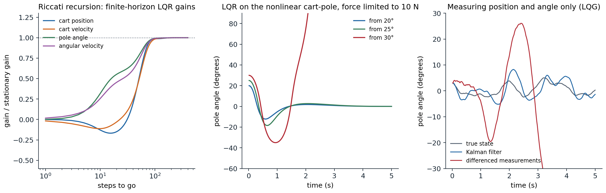
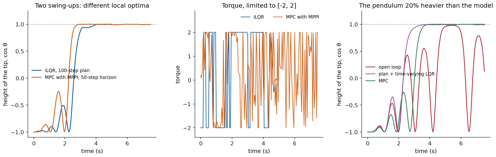

[Background Notes](../README.md) › [Reinforcement Learning](README.md)

# 15. Optimal Control and Trajectory Optimization

[← 14. Partially Observable Environments](14-partially-observable-environments.md) · [16. Deep Q-Learning →](16-deep-q-learning.md)

## <a id="from-reinforcement-learning-to-optimal-control"></a>From reinforcement learning to optimal control

### <a id="control-problems"></a>Control problems

Reinforcement learning and optimal control study the same problem from two directions. Control engineers write the state as $`\mathbf x`$, the action or **control** as $`\mathbf u`$, the dynamics as $`\mathbf x_{t+1}=f(\mathbf x_t,\mathbf u_t)`$, possibly with noise, and minimize a **cost** $`\sum_tc(\mathbf x_t,\mathbf u_t)`$ instead of maximizing a reward. The state and control are usually continuous vectors, the dynamics come from physics and are known, at least approximately, and the cost is designed. What control theory adds to the reinforcement learning of the earlier chapters is a set of problems that can be solved exactly or locally with very little computation, and a set of methods that exploit a known, differentiable model: the linear–quadratic regulator, trajectory optimization, and model predictive control. They matter to reinforcement learning in three ways. They solve many real control problems outright, without learning; they are the planners inside model-based agents ([chapter 23](23-model-based-rl-and-world-models.md)); and the linear–quadratic problem is the laboratory in which much of the theory of reinforcement learning with continuous states is worked out.

The Bellman equation is the same. With a finite horizon $`T`$, the optimal cost-to-go satisfies

```math
V_t(\mathbf x)=\min_{\mathbf u}\bigl[c(\mathbf x,\mathbf u)+V_{t+1}(f(\mathbf x,\mathbf u))\bigr],\qquad V_T(\mathbf x)=c_T(\mathbf x),
```

and in continuous time it becomes the **Hamilton–Jacobi–Bellman** equation, $`-\partial_tV=\min_{\mathbf u}[c(\mathbf x,\mathbf u)+\nabla_{\mathbf x}V\cdot f(\mathbf x,\mathbf u)]`$ with $`f`$ the continuous-time dynamics $`\dot{\mathbf x}=f(\mathbf x,\mathbf u)`$, a partial differential equation over the state space. Solving either on a grid suffers the curse of dimensionality that [chapter 2](02-dynamic-programming.md#the-curse-of-dimensionality) described. Control theory escapes it in two ways: by restricting the problem to linear dynamics and quadratic costs, where the value function is quadratic and the Bellman equation can be solved in closed form; and by giving up global solutions, and optimizing a single trajectory from the current state, which needs only local approximations of the dynamics and the value along it.

## <a id="the-linearquadratic-regulator"></a>The linear–quadratic regulator

### <a id="the-riccati-recursion"></a>The Riccati recursion

The **linear–quadratic regulator** (LQR) has linear dynamics and a quadratic cost,

```math
\mathbf x_{t+1}=A\mathbf x_t+B\mathbf u_t,\qquad c(\mathbf x,\mathbf u)=\mathbf x^\top Q\mathbf x+\mathbf u^\top R\mathbf u,
```

with $`Q\succeq0`$ and $`R\succ0`$. Suppose the cost-to-go from time $`t+1`$ is quadratic, $`V_{t+1}(\mathbf x)=\mathbf x^\top P_{t+1}\mathbf x`$. Then the cost of taking $`\mathbf u`$ in $`\mathbf x`$ and continuing optimally is a quadratic function of $`\mathbf u`$,

```math
\mathbf x^\top Q\mathbf x+\mathbf u^\top R\mathbf u+(A\mathbf x+B\mathbf u)^\top P_{t+1}(A\mathbf x+B\mathbf u),
```

minimized by setting its gradient to zero. The optimal control is linear feedback, $`\mathbf u=-K_t\mathbf x`$, with the **gain** $`K_t=(R+B^\top P_{t+1}B)^{-1}B^\top P_{t+1}A`$, and substituting it back shows that $`V_t`$ is quadratic too, with

```math
P_t=Q+A^\top P_{t+1}A-A^\top P_{t+1}B\,(R+B^\top P_{t+1}B)^{-1}B^\top P_{t+1}A,
```

the discrete-time **Riccati recursion**, run backward from $`P_T`$. It is value iteration, with the value function represented exactly by a matrix ([Appendix A](#block-rl15-appendix-a)). Kalman worked out the problem in 1960, in "Contributions to the theory of optimal control" (*Boletín de la Sociedad Matemática Mexicana*), together with its dual, the filtering problem ([Kalman, 1960](https://doi.org/10.1115/1.3662552)). Each step costs a few matrix products, whatever the size of the state space, which is continuous.

The next code balances Gymnasium's cart-pole, the task of [Lab 6](labs/lab-06-policy-gradient-and-actor-critic-methods-on-cartpole.md), with a continuous force instead of two pushes. The dynamics are nonlinear, so LQR works with their linearization at the upright equilibrium, computed here by finite differences.

```python
import numpy as np
from scipy.linalg import solve_discrete_are

# LQR for the cart-pole balanced upright, with the dynamics of Gymnasium's CartPole (Euler steps of 0.02 s) but a
# continuous force. Linearize at the upright equilibrium, compute the finite-horizon gains by the Riccati
# recursion, and compare with the stationary gain from the discrete algebraic Riccati equation.
g, mc, mp, l, dt = 9.8, 1.0, 0.1, 0.5, 0.02                    # l: half the pole's length


def step(x, u):
    """One Euler step of the cart-pole; x = (position, velocity, angle, angular velocity), u = force."""
    pos, vel, th, om = x
    total, pml = mc + mp, mp * l
    temp = (u + pml * om ** 2 * np.sin(th)) / total
    th_acc = (g * np.sin(th) - np.cos(th) * temp) / (l * (4 / 3 - mp * np.cos(th) ** 2 / total))
    x_acc = temp - pml * th_acc * np.cos(th) / total
    return np.array([pos + dt * vel, vel + dt * x_acc, th + dt * om, om + dt * th_acc])


def jacobians(x, u, eps=1e-6):
    A = np.column_stack([(step(x + eps * e, u) - step(x - eps * e, u)) / (2 * eps) for e in np.eye(4)])
    B = ((step(x, u + eps) - step(x, u - eps)) / (2 * eps))[:, None]
    return A, B


A, B = jacobians(np.zeros(4), 0.0)
Q, R = np.diag([1.0, 0.1, 10.0, 0.1]), np.array([[0.01]])
P, gains = Q.copy(), []
for k in range(1000):                                           # Riccati recursion, backward from the horizon
    K = np.linalg.solve(R + B.T @ P @ B, B.T @ P @ A)           # u = -K x
    P = Q + A.T @ P @ (A - B @ K)
    gains.append(K.ravel())
P_inf = solve_discrete_are(A, B, Q, R)
K_inf = np.linalg.solve(R + B.T @ P_inf @ B, B.T @ P_inf @ A).ravel()
print("A =\n", A.round(4), "\nB =", B.ravel().round(4))
for k in (1, 10, 50, 100, 300):
    print(f"gain with {k:3d} steps to go: {gains[k - 1].round(2)}")
print(f"stationary gain (DARE):     {K_inf.round(2)}")
print(f"eigenvalue magnitudes of A: {np.abs(np.linalg.eigvals(A)).round(3)}; of A - BK: {np.abs(np.linalg.eigvals(A - B @ K_inf[None])).round(3)}")

# the linear controller on the nonlinear cart-pole, with the force limited to 10 N as in Gymnasium and the track
# to [-2.4, 2.4], from increasing initial tilts
for deg in (5, 10, 15, 20, 25, 30):
    x, fate = np.array([0, 0, np.radians(deg), 0.0]), "balanced"
    for t in range(500):                                        # 10 s
        x = step(x, float(np.clip(-K_inf @ x, -10, 10)))
        if abs(x[2]) > np.pi / 2:
            fate = "the pole falls"; break
        if abs(x[0]) > 2.4:
            fate = "the cart leaves the track"; break
    print(f"initial tilt {deg:2d} degrees: {fate} (step {t + 1})")
# A =
#  [[ 1.      0.02    0.      0.    ]
#  [ 0.      1.     -0.0143  0.    ]
#  [ 0.      0.      1.      0.02  ]
#  [ 0.      0.      0.3155  1.    ]]
# B = [ 0.      0.0195  0.     -0.0293]
# gain with   1 steps to go: [ 0.    0.19 -0.09 -0.29]
# gain with  10 steps to go: [  1.11   1.21 -22.79  -4.45]
# gain with  50 steps to go: [ -4.08  -4.96 -55.64 -12.49]
# gain with 100 steps to go: [ -8.48 -10.6  -71.25 -17.21]
# gain with 300 steps to go: [ -8.59 -10.77 -71.74 -17.36]
# stationary gain (DARE):     [ -8.59 -10.77 -71.74 -17.36]
# eigenvalue magnitudes of A: [1.    1.    1.079 0.921]; of A - BK: [0.88  0.88  0.973 0.973]
# initial tilt  5 degrees: balanced (step 500)
# initial tilt 10 degrees: balanced (step 500)
# initial tilt 15 degrees: balanced (step 500)
# initial tilt 20 degrees: balanced (step 500)
# initial tilt 25 degrees: balanced (step 500)
# initial tilt 30 degrees: the pole falls (step 104)
```

The gains converge as the horizon grows, to within about 2% of the stationary gain after 100 steps (2 s). The upright equilibrium is unstable, with an eigenvalue of $`A`$ of magnitude 1.079, and the feedback makes every eigenvalue of the closed loop smaller than 1 in magnitude. On the nonlinear cart-pole, the linear controller balances the pole from tilts of up to 25°. From 10° on, the controller asks for more than the 10 N available and the force saturates for the first few steps; from 30° it stays saturated for most of the run, and the pole falls: the linearization and the gain are good near the equilibrium, and the region from which they succeed is limited by the nonlinearity and the constraints, which LQR ignores.

### <a id="the-infinite-horizon"></a>The infinite horizon

With an infinite horizon, the stationary solution satisfies the **discrete algebraic Riccati equation** (DARE), the fixed point of the recursion. If $`(A,B)`$ is **stabilizable** (every unstable mode can be influenced by the control) and $`(A,Q^{1/2})`$ is **detectable** (every unstable mode shows up in the cost), the DARE has a unique positive semidefinite solution, and its gain stabilizes the closed loop $`A-BK`$. The conditions are the control-theoretic version of a well-posed MDP: without them the optimal cost can be infinite, or be finite while the state diverges unseen.

Policy iteration applies too. A stabilizing gain $`K`$ is evaluated by solving the linear **Lyapunov equation** $`P_K=Q+K^\top RK+(A-BK)^\top P_K(A-BK)`$ for its cost matrix, and improved greedily, $`K\leftarrow(R+B^\top P_KB)^{-1}B^\top P_KA`$. This is **Hewer's algorithm** ([Hewer, 1971](https://doi.org/10.1109/TAC.1971.1099755); [Kleinman, 1968](https://doi.org/10.1109/TAC.1968.1098829), in continuous time). Every gain it produces is stabilizing, the costs decrease monotonically, and the convergence is quadratic, as expected of a method that [chapter 2](02-dynamic-programming.md#policy-iteration-as-newton-s-method) identified with Newton's method.

### <a id="noise-and-partial-observation"></a>Noise and partial observation

If the dynamics have additive noise, $`\mathbf x_{t+1}=A\mathbf x_t+B\mathbf u_t+\mathbf w_t`$ with zero mean and covariance $`W`$, the optimal gain does not change. The noise adds a constant, $`\operatorname{tr}(P_{t+1}W)`$, to the cost-to-go, which no control can reduce, and the controller that would be optimal without noise, the **certainty-equivalent** controller, remains optimal. Exercise 13.4 used this fact: the Gaussian exploration of a policy gradient method does not change the optimal gain of an LQR.

If the state is observed through noisy linear measurements, $`\mathbf y_t=C\mathbf x_t+\mathbf v_t`$, the problem is the linear–quadratic–Gaussian (LQG) problem, the one partially observable problem of [chapter 14](14-partially-observable-environments.md#linear-dynamics-and-gaussian-noise) with an exact and efficient solution. The belief is Gaussian; its mean is computed by the **Kalman filter** ([AI chapter 11](../ai/11-temporal-probabilistic-models.md#the-kalman-filter)), which predicts with the model and corrects with a gain $`L`$ times the measurement residual; and the optimal controller applies the LQR gain to the estimated mean. This is the **separation principle**: estimation and control can be designed separately, and the filter's gain comes from a Riccati equation of its own, the dual of the controller's with $`A^\top`$, $`C^\top`$, $`W`$, and $`V`$ in the roles of $`A`$, $`B`$, $`Q`$, and $`R`$ (exercise 15.4).

```python
import numpy as np
from scipy.linalg import solve_discrete_are

# Linear-quadratic-Gaussian control of the cart-pole near upright. The controller sees only noisy measurements of
# the cart's position and the pole's angle (standard deviations 2 cm and 1 degree), and random pushes perturb the
# velocities. Three controllers use the same LQR gain: one sees the true state (not possible in practice), one
# uses a Kalman filter, and one estimates the velocities by differencing the measurements.
rng = np.random.default_rng(0)
g, mc, mp, l, dt = 9.8, 1.0, 0.1, 0.5, 0.02


def step(x, u):
    pos, vel, th, om = x
    total, pml = mc + mp, mp * l
    temp = (u + pml * om ** 2 * np.sin(th)) / total
    th_acc = (g * np.sin(th) - np.cos(th) * temp) / (l * (4 / 3 - mp * np.cos(th) ** 2 / total))
    x_acc = temp - pml * th_acc * np.cos(th) / total
    return np.array([pos + dt * vel, vel + dt * x_acc, th + dt * om, om + dt * th_acc])


eps = 1e-6
A = np.column_stack([(step(eps * e, 0.0) - step(-eps * e, 0.0)) / (2 * eps) for e in np.eye(4)])
B = ((step(np.zeros(4), eps) - step(np.zeros(4), -eps)) / (2 * eps))[:, None]
Q, R = np.diag([1.0, 0.1, 10.0, 0.1]), np.array([[0.01]])
P = solve_discrete_are(A, B, Q, R); K = np.linalg.solve(R + B.T @ P @ B, B.T @ P @ A)
C = np.array([[1.0, 0, 0, 0], [0, 0, 1.0, 0]])                   # measured: position and angle
W = np.diag([0, 0.02, 0, 0.05]) ** 2                             # process noise on the velocities (per step)
V = np.diag([0.02, np.radians(1.0)]) ** 2                        # measurement noise
S = solve_discrete_are(A.T, C.T, W + 1e-12 * np.eye(4), V)       # stationary Kalman filter: the dual Riccati equation
L = S @ C.T @ np.linalg.inv(C @ S @ C.T + V)                     # Kalman gain
print(f"LQR gain K = {K.ravel().round(2)}; Kalman gain L =\n{L.round(3)}")


def run(mode, T=1000):
    x = np.array([0, 0, np.radians(3), 0.0]); xh = np.zeros(4); y_prev = C @ x; cost = 0.0
    for t in range(T):
        y = C @ x + rng.multivariate_normal(np.zeros(2), V)
        if mode == "true state":
            est = x
        elif mode == "Kalman filter":
            xh = xh + L @ (y - C @ xh); est = xh                   # correct with the new measurement
        else:                                                     # finite differences of the measurements
            est = np.array([y[0], (y[0] - y_prev[0]) / dt, y[1], (y[1] - y_prev[1]) / dt]); y_prev = y
        u = float(np.clip(-(K @ est)[0], -10, 10))
        cost += x @ Q @ x + R[0, 0] * u ** 2
        x = step(x, u) + rng.multivariate_normal(np.zeros(4), W)
        xh = A @ xh + B.ravel() * u                               # predict
        if abs(x[2]) > np.pi / 2 or abs(x[0]) > 2.4:
            return np.inf
    return cost / T


for mode in ("true state", "Kalman filter", "differenced measurements"):
    costs = np.array([run(mode) for _ in range(50)])
    ok = np.isfinite(costs)
    print(f"{mode:25s}: balanced in {ok.sum():2d} of 50 runs of 20 s" + (f"; average cost per step {costs[ok].mean():.3f}" if ok.any() else ""))
# LQR gain K = [ -8.59 -10.77 -71.74 -17.36]; Kalman gain L =
# [[ 1.810e-01 -0.000e+00]
#  [ 9.050e-01 -1.200e-02]
#  [-0.000e+00  2.970e-01]
#  [ 2.000e-03  2.638e+00]]
# true state               : balanced in 50 of 50 runs of 20 s; average cost per step 0.080
# Kalman filter            : balanced in 50 of 50 runs of 20 s; average cost per step 0.175
# differenced measurements : balanced in  0 of 50 runs of 20 s
```



*Left: the finite-horizon LQR gains of the cart-pole, each relative to its stationary value, as a function of the number of steps to go; they settle within about 100 steps. Middle: the stationary LQR controller on the nonlinear cart-pole with the force limited to 10 N, from three initial tilts; from all three the force saturates at first, and from 30° it stays saturated until the pole falls. Right: one run of each controller of the LQG experiment; with velocities estimated by differencing noisy measurements, the pole falls after about 3 s.*

With only the position and angle measured, the controller needs the velocities. Estimating them by differencing successive measurements divides the measurement noise by the 0.02-second time step, and the resulting noise in the force destabilizes the pole in every run. The Kalman filter uses the model to average over time and balances in every run, at about twice the cost of a controller that could see the true state. The separation principle comes with a warning: unlike continuous-time LQR with full state feedback, which is guaranteed to tolerate any increase of the actuators' gain, a halving of it, and 60° of phase error, LQG controllers can be arbitrarily fragile to small errors in the model, since optimality for one model says nothing about robustness to others ([Doyle, 1978](https://doi.org/10.1109/TAC.1978.1101812)). Robust control grew out of this observation.

### <a id="lqr-as-a-laboratory-for-reinforcement-learning"></a>LQR as a laboratory for reinforcement learning

Because its optimal solution is known exactly, the LQR is the standard test bed for questions about reinforcement learning with continuous states and actions ([Recht, 2019](https://arxiv.org/abs/1806.09460)):

- **Model-free learning.** The Q-function of a linear policy is quadratic in the state and action together, so it can be estimated by least squares from transitions and improved greedily, a model-free policy iteration that converges to the optimal gain ([Bradtke, Ydstie, and Barto, 1994](https://doi.org/10.1109/ACC.1994.735224); exercise 15.8).
- **Policy gradients.** The cost $`C(K)`$ of a gain is not convex, and the set of stabilizing gains is not even convex, yet gradient descent, the natural gradient, and a Gauss–Newton method (which is policy iteration) all converge to the global optimum from any stabilizing gain, because $`C`$ satisfies a gradient domination inequality like the one in [chapter 13](13-policy-gradient-and-actor-critic-methods.md#block-rl13-appendix-b) ([Fazel, Ge, Kakade, and Mesbahi, 2018](https://arxiv.org/abs/1801.05039); exercise 15.3).
- **Sample complexity.** An unknown system can be identified by least squares from random excitation, and the LQR gain for the estimated model used, **certainty equivalence**, or robustified against the estimation error. End-to-end bounds relate the number of samples to the suboptimality of the resulting controller, with nearly optimal dependence on the number of parameters ([Dean, Mania, Matni, Recht, and Tu, 2020](https://arxiv.org/abs/1710.01688)), and the plain certainty-equivalent controller has suboptimality that scales with the square of the estimation error, which makes it efficient ([Mania, Tu, and Recht, 2019](https://arxiv.org/abs/1902.07826)).

These results are a useful corrective to intuitions formed on finite MDPs. On the LQR, model-based methods that fit $`A`$ and $`B`$ and solve the Riccati equation need far fewer samples than model-free methods that learn Q-functions or policies directly, since a model with $`n(n+m)`$ parameters summarizes everything.

## <a id="trajectory-optimization"></a>Trajectory optimization

### <a id="shooting-and-collocation"></a>Shooting and collocation

For nonlinear dynamics and costs, a global solution is out of reach, but an optimal trajectory from a given state is not: it is a finite-dimensional optimization problem,

```math
\min_{\mathbf u_0,\dots,\mathbf u_{T-1}}\;\sum_{t=0}^{T-1}c(\mathbf x_t,\mathbf u_t)+c_T(\mathbf x_T)\quad\text{subject to}\quad\mathbf x_{t+1}=f(\mathbf x_t,\mathbf u_t),\;\mathbf x_0\text{ given}.
```

**Shooting** methods optimize over the controls only, computing the states by simulating the dynamics, so every iterate is a feasible trajectory; but the effect of an early control on the late states can be enormous for unstable systems, which makes the problem badly conditioned. **Collocation** methods optimize over states and controls together, with the dynamics as equality constraints that are satisfied only at convergence; the problem is larger but sparse and better conditioned, and it is solved by general nonlinear programming ([Kelly, 2017](https://doi.org/10.1137/16M1062569)). The classical necessary conditions for optimality in continuous time are **Pontryagin's maximum principle**, which describes the optimal control through costates that evolve backward in time; they are the continuous-time counterpart of the backward pass below, and of backpropagation through the dynamics ([Foundations chapter 3](../foundations/03-calculus-and-optimization.md#the-chain-rule-and-backpropagation)).

### <a id="differential-dynamic-programming-and-ilqr"></a>Differential dynamic programming and iLQR

**Differential dynamic programming** (DDP) ([Mayne, 1966](https://doi.org/10.1080/00207176608921369); Jacobson and Mayne, 1970) is a shooting method that uses dynamic programming to compute its steps. Around a nominal trajectory $`(\bar{\mathbf x}_t,\bar{\mathbf u}_t)`$, it expands the Bellman equation to second order in the deviations $`\delta\mathbf x`$ and $`\delta\mathbf u`$. With $`V'`$ the next step's cost-to-go, the quadratic model of the Q-function has coefficients

```math
Q_{\mathbf x}=c_{\mathbf x}+f_{\mathbf x}^\top V'_{\mathbf x},\quad Q_{\mathbf u}=c_{\mathbf u}+f_{\mathbf u}^\top V'_{\mathbf x},\quad Q_{\mathbf{xx}}=c_{\mathbf{xx}}+f_{\mathbf x}^\top V'_{\mathbf{xx}}f_{\mathbf x},\quad Q_{\mathbf{uu}}=c_{\mathbf{uu}}+f_{\mathbf u}^\top V'_{\mathbf{xx}}f_{\mathbf u},\quad Q_{\mathbf{ux}}=c_{\mathbf{ux}}+f_{\mathbf u}^\top V'_{\mathbf{xx}}f_{\mathbf x},
```

plus, in full DDP, terms with the second derivatives of the dynamics. Minimizing over $`\delta\mathbf u`$ gives a local controller $`\delta\mathbf u=\mathbf k_t+K_t\delta\mathbf x`$, with $`\mathbf k_t=-Q_{\mathbf{uu}}^{-1}Q_{\mathbf u}`$ and $`K_t=-Q_{\mathbf{uu}}^{-1}Q_{\mathbf{ux}}`$, and a quadratic model of $`V`$ at time $`t`$ to pass backward. The **forward pass** then simulates the new trajectory with $`\mathbf u_t=\bar{\mathbf u}_t+\alpha\mathbf k_t+K_t(\mathbf x_t-\bar{\mathbf x}_t)`$, where the step size $`\alpha`$ is chosen by a line search. Dropping the second derivatives of the dynamics gives **iLQR** ([Li and Todorov, 2004](https://doi.org/10.5220/0001143902220229)), which solves an LQR problem around the current trajectory at each iteration: a Gauss–Newton method, where DDP is a Newton-like method that converges quadratically near a solution ([Appendix B](#block-rl15-appendix-b)). Practical implementations add a regularization $`\mu I`$ to $`Q_{\mathbf{uu}}`$ or, as Tassa et al. recommend, to $`V'_{\mathbf{xx}}`$, adjusted like the damping of Levenberg–Marquardt, and handle bounds on the controls by squashing or by solving a small box-constrained problem at each step ([Tassa, Erez, and Todorov, 2012](https://doi.org/10.1109/IROS.2012.6386025); [Tassa, Mansard, and Todorov, 2014](https://doi.org/10.1109/ICRA.2014.6907001)).

The next code swings up Gymnasium's pendulum, whose torque limit is too small to lift it directly: it must pump energy by swinging back and forth.

```python
import numpy as np

# iLQR swing-up of Gymnasium's Pendulum-v1: theta'' = 3g/(2l) sin(theta) + 3/(m l^2) u with g = 10, m = l = 1,
# semi-implicit Euler steps of 0.05 s, torque limited to |u| <= 2, theta = 0 upright. From hanging still, a
# 100-step (5 s) trajectory minimizes sum 2(1 - cos theta) + 0.1 theta_dot^2 + 0.001 u^2, a smooth version of
# Gymnasium's cost. The torque limit is enforced by squashing, u = 2 tanh(v), and iLQR optimizes over v.
dt, T = 0.05, 100


def f(x, v):
    u = 2 * np.tanh(v)
    om = x[1] + (15 * np.sin(x[0]) + 3 * u) * dt
    return np.array([x[0] + om * dt, om])


def cost(x, v):
    u = 2 * np.tanh(v)
    return 2 * (1 - np.cos(x[0])) + 0.1 * x[1] ** 2 + 0.001 * u ** 2


def derivs(x, v):
    """Jacobians of the dynamics and gradients and Hessians of the cost, analytically."""
    u, du = 2 * np.tanh(v), 2 * (1 - np.tanh(v) ** 2)          # du/dv
    fx = np.array([[1 + 15 * np.cos(x[0]) * dt ** 2, dt], [15 * np.cos(x[0]) * dt, 1]])
    fu = np.array([3 * dt ** 2, 3 * dt]) * du
    lx = np.array([2 * np.sin(x[0]), 0.2 * x[1]])
    lxx = np.diag([2 * np.cos(x[0]), 0.2])
    d2u = -2 * np.tanh(v) * du                                   # d2u/dv2
    lu = 0.002 * u * du
    luu = 0.002 * (du ** 2 + u * d2u)
    return fx, fu, lx, lxx, lu, luu


def rollout(x0, vs):
    xs = [x0]
    for v in vs:
        xs.append(f(xs[-1], v))
    return np.array(xs), sum(cost(x, v) for x, v in zip(xs[:-1], vs)) + cost(xs[-1], 0.0)


def ilqr(x0, vs, iters=100, mu=1.0, verbose=False):
    xs, J = rollout(x0, vs); history = [J]
    for it in range(iters):
        Vx, Vxx = derivs(xs[-1], 0.0)[2:4]                      # terminal cost: the state part of the cost
        ks, Ks = np.zeros(T), np.zeros((T, 2))
        for t in range(T - 1, -1, -1):                          # backward pass
            fx, fu, lx, lxx, lu, luu = derivs(xs[t], vs[t])
            Qx, Qu = lx + fx.T @ Vx, lu + fu @ Vx
            Qxx, Quu, Qux = lxx + fx.T @ Vxx @ fx, luu + fu @ Vxx @ fu + mu, fu @ Vxx @ fx
            ks[t], Ks[t] = -Qu / Quu, -Qux / Quu
            Vx = Qx + Ks[t] * Quu * ks[t] + Ks[t] * Qu + Qux * ks[t]
            Vxx = Qxx + Quu * np.outer(Ks[t], Ks[t]) + np.outer(Ks[t], Qux) + np.outer(Qux, Ks[t])
            Vxx = 0.5 * (Vxx + Vxx.T)
        for alpha in (1.0, 0.5, 0.25, 0.1, 0.05, 0.01):         # forward pass with a line search
            x, new_vs = x0, np.zeros(T)
            for t in range(T):
                new_vs[t] = vs[t] + alpha * ks[t] + Ks[t] @ (x - xs[t])
                x = f(x, new_vs[t])
            new_xs, new_J = rollout(x0, new_vs)
            if new_J < J:
                break
        if new_J < J:                                           # accept, and trust the quadratic model more
            done = J - new_J < 1e-6 * J
            vs, xs, J, mu = new_vs, new_xs, new_J, max(mu / 2, 1e-6)
            history.append(J)
            if done:
                break
        else:                                                   # reject, and regularize more
            mu *= 10
            if mu > 1e8:
                break
    return vs, xs, Ks, history


x0 = np.array([np.pi, 0.0])
v_init = 0.1 * np.random.default_rng(0).standard_normal(T)   # small random torques: zero torque is a stationary point
vs, xs, Ks, hist = ilqr(x0, v_init)
print(f"iLQR from small random torques: cost {hist[0]:.1f} -> {hist[-1]:.2f} in {len(hist) - 1} accepted iterations")
for it in (1, 2, 5, 10, 20):
    if it < len(hist):
        print(f"  after {it:2d} accepted iterations: {hist[it]:7.2f}")
us = 2 * np.tanh(vs)
up = np.flatnonzero(np.cos(xs[:, 0]) < np.cos(np.radians(10)))[-1] + 1       # first step from which it stays up
swings = np.sum(np.diff(np.sign(xs[:up, 1][np.abs(xs[:up, 1]) > 1e-3])) != 0)
print(f"the pendulum swings back and forth {swings} times, then stays within 10 degrees of upright from step {up} (t = {up * dt:.2f} s)")
print(f"the torque is at its limit (|u| > 1.95) in {np.mean(np.abs(us) > 1.95):.0%} of the steps")
# iLQR from small random torques: cost 404.0 -> 243.45 in 59 accepted iterations
#   after  1 accepted iterations:  404.00
#   after  2 accepted iterations:  403.84
#   after  5 accepted iterations:  386.12
#   after 10 accepted iterations:  300.84
#   after 20 accepted iterations:  286.83
# the pendulum swings back and forth 7 times, then stays within 10 degrees of upright from step 79 (t = 3.95 s)
# the torque is at its limit (|u| > 1.95) in 86% of the steps
```

Starting from exactly zero torque would leave iLQR stuck, since the hanging state is an equilibrium at which the gradient of the cost with respect to every control vanishes; small random torques break the symmetry. The optimizer then discovers the pumping strategy on its own, with the torque at its limit most of the time, as the bound forces a bang-bang solution. The solution is only locally optimal: the swing-up has many local optima, one for each number and timing of swings, and iLQR converges to the one near its initialization. The MPC experiment below finds a better one.

### <a id="sampling-based-optimization"></a>Sampling-based optimization

Derivative-free methods optimize the control sequence by sampling. The **cross-entropy method** (CEM) ([Rubinstein, 1999](https://doi.org/10.1023/A:1010091220143); [de Boer, Kroese, Mannor, and Rubinstein, 2005](https://doi.org/10.1007/s10479-005-5724-z)) samples control sequences from a Gaussian, keeps the best few, the **elites**, and refits the Gaussian to them. **Model predictive path integral control** (MPPI) ([Williams et al., 2016](https://doi.org/10.1109/ICRA.2016.7487277); [Williams, Aldrich, and Theodorou, 2017](https://doi.org/10.2514/1.G001921)) instead averages all the samples with weights $`\propto e^{-J/\lambda}`$, the solution of a KL-regularized version of the problem (exercise 15.6). Both need only a simulator, handle discontinuous costs and dynamics, and parallelize trivially.

```python
import numpy as np

# Sampling-based trajectory optimization on the same pendulum swing-up (100 steps, |u| <= 2): the cross-entropy
# method and MPPI (model predictive path integral control), each run for 100 iterations of 500 sampled torque
# sequences, rolled out in parallel. The costs are directly comparable with iLQR's.
rng = np.random.default_rng(0)
dt, T, N = 0.05, 100, 500


def total_cost(U):
    """Cost of each row of U (sequences of torques), from hanging still."""
    th, om, J = np.full(len(U), np.pi), np.zeros(len(U)), np.zeros(len(U))
    for t in range(T):
        u = np.clip(U[:, t], -2, 2)
        J += 2 * (1 - np.cos(th)) + 0.1 * om ** 2 + 0.001 * u ** 2
        om = om + (15 * np.sin(th) + 3 * u) * dt; th = th + om * dt
    return J + 2 * (1 - np.cos(th)) + 0.1 * om ** 2


def cem(iters=100, elite=50, sigma0=1.0):
    mean, std, hist = np.zeros(T), np.full(T, sigma0), []
    for _ in range(iters):
        U = mean + std * rng.standard_normal((N, T))
        J = total_cost(U)
        E = U[np.argsort(J)[:elite]]                             # refit the sampling distribution to the elites
        mean, std = E.mean(0), E.std(0) + 1e-3
        hist.append(total_cost(mean[None])[0])
    return mean, hist


def mppi(iters=100, sigma=1.0, lam=1.0):
    mean, hist = np.zeros(T), []
    for _ in range(iters):
        U = mean + sigma * rng.standard_normal((N, T))
        J = total_cost(U)
        w = np.exp(-(J - J.min()) / lam); w /= w.sum()           # exponentiated costs as weights
        mean = w @ U
        hist.append(total_cost(mean[None])[0])
    return mean, hist


for name, (mean, hist) in [("cross-entropy method", cem()), ("MPPI, lambda = 1", mppi()), ("MPPI, lambda = 10", mppi(lam=10))]:
    print(f"{name:21s}: cost after 10, 30, 100 iterations: {hist[9]:6.1f} {hist[29]:6.1f} {hist[99]:6.1f}"
          f"  ({100 * N:,} rollouts)")
# cross-entropy method : cost after 10, 30, 100 iterations:  398.2  369.0  343.0  (50,000 rollouts)
# MPPI, lambda = 1     : cost after 10, 30, 100 iterations:  404.0  403.8  382.7  (50,000 rollouts)
# MPPI, lambda = 10    : cost after 10, 30, 100 iterations:  404.0  404.0  403.9  (50,000 rollouts)
```

Used as long-horizon optimizers, they are poor: after 50,000 rollouts, CEM's trajectory costs 343 and MPPI's 383, against 243 for iLQR after about 60 iterations. The search space has 100 dimensions, and random perturbations of a whole sequence mostly cancel. Their strength shows in the setting of the next section, where short horizons, warm starts, and a few iterations per step suffice.

## <a id="model-predictive-control"></a>Model predictive control

### <a id="the-receding-horizon"></a>The receding horizon

A trajectory computed offline is an open-loop plan. Executed as is, it fails at the first disturbance, and it cannot correct errors in the model. **Model predictive control** (MPC) closes the loop by re-planning: at every step, it optimizes a trajectory over a horizon of $`H`$ steps from the measured state, applies the first control, and discards the rest. The next step's optimization starts from the shifted previous solution, so a few iterations suffice. MPC is the most widely used advanced control method in industry, above all in the process industries ([Qin and Badgwell, 2003](https://doi.org/10.1016/S0967-0661%2802%2900186-7)), where it handles constraints on states and controls explicitly, and it is the planner in many model-based reinforcement learning agents ([Mayne, Rawlings, Rao, and Scokaert, 2000](https://doi.org/10.1016/S0005-1098%2899%2900214-9); [Rawlings, Mayne, and Diehl, 2017](https://sites.engineering.ucsb.edu/~jbraw/mpc/)). It is the decision-time planning of [chapter 10](10-planning-and-learning-with-tabular-models.md#decision-time-planning), in continuous spaces.

A cheaper way to close the loop around a plan is to track it with **time-varying LQR** (TVLQR): linearize the dynamics along the planned trajectory, solve the Riccati recursion backward along it, and apply $`\mathbf u_t=\bar{\mathbf u}_t-K_t(\mathbf x_t-\bar{\mathbf x}_t)`$. iLQR computes these gains as a by-product. Tracking corrects small deviations but cannot re-plan: if the state leaves the neighborhood where the linearization holds, or the plan itself is wrong for the true system, the controller fails.

```python
import numpy as np

# Model predictive control of the pendulum swing-up (|u| <= 2) when the model is wrong. The true pendulum is 20%
# heavier than the model, so the same torque accelerates it less, and random torque disturbances (standard
# deviation 0.1) act at every step. A nominal plan is made on the model by running MPPI-based MPC on it without
# disturbances. Compared over 150 steps (7.5 s): replaying the plan open loop; tracking it with time-varying LQR
# feedback; and MPC, which re-plans a 50-step trajectory with MPPI from the measured state at every step.
dt, H = 0.05, 50


def dyn(x, u, mass=1.0):
    om = x[..., 1] + (15 * np.sin(x[..., 0]) + 3 * u / mass) * dt
    return np.stack([x[..., 0] + om * dt, om], -1)


def c(x, u):
    return 2 * (1 - np.cos(x[..., 0])) + 0.1 * x[..., 1] ** 2 + 0.001 * u ** 2


def mppi(x0, U, rng, iters=3, n=300, sigma=1.0, lam=0.3):
    """A few MPPI iterations on the model from state x0, warm-started from the torque sequence U."""
    for _ in range(iters):
        E = sigma * rng.standard_normal((n, len(U))); S = np.clip(U + E, -2, 2)
        x, J = np.tile(x0, (n, 1)), np.zeros(n)
        for t in range(len(U)):
            J += c(x, S[:, t]); x = dyn(x, S[:, t])
        J += c(x, 0.0)
        w = np.exp(-(J - J.min()) / lam); w /= w.sum()
        U = np.clip(U + w @ (S - U), -2, 2)
    return U


def mpc_step(x, U, rng):
    U = mppi(x, U, rng)
    return U[0], np.append(U[1:], 0.0)                           # apply the first torque, shift the rest


def tvlqr(xs, us, Q=np.diag([1.0, 0.1]), R=0.01):
    """Time-varying LQR gains for tracking the nominal trajectory, from the Riccati recursion along it."""
    P, K = Q.copy(), np.zeros((len(us), 2))
    for t in range(len(us) - 1, -1, -1):
        A = np.array([[1 + 15 * np.cos(xs[t, 0]) * dt ** 2, dt], [15 * np.cos(xs[t, 0]) * dt, 1]])
        B = np.array([3 * dt ** 2, 3 * dt])
        K[t] = (B @ P @ A) / (R + B @ P @ B)
        P = Q + A.T @ P @ (A - np.outer(B, K[t]))
    return K


steps = 150
rng = np.random.default_rng(0)
x, U, xs, us = np.array([np.pi, 0.0]), np.zeros(H), [np.array([np.pi, 0.0])], []
for t in range(steps):                                           # the nominal plan
    u, U = mpc_step(x, U, rng); x = dyn(x, u); xs.append(x); us.append(u)
xs, us = np.array(xs), np.array(us); K = tvlqr(xs, us)
print(f"nominal plan: cost {c(xs[:-1], us).sum():.1f} ({c(xs[:100], us[:100]).sum() + c(xs[100], 0.0):.1f} for its first 100 steps), upright from step "
      f"{np.flatnonzero(np.cos(xs[:, 0]) < np.cos(np.radians(10)))[-1] + 1}, torque at the limit in {np.mean(np.abs(us) > 1.99):.0%} of steps")


def run(controller, seed, mass=1.2, noise=0.1):
    rng = np.random.default_rng(seed); x, U, total, up = np.array([np.pi, 0.0]), np.zeros(H), 0.0, 0
    for t in range(steps):
        if controller == "open loop":
            u = us[t]
        elif controller == "plan + feedback":
            u = float(np.clip(us[t] - K[t] @ (x - xs[t]), -2, 2))
        else:
            u, U = mpc_step(x, U, rng)
        total += c(x, u)
        x = dyn(x, u + noise * rng.standard_normal(), mass=mass)
        up += t >= steps - 50 and np.cos(x[0]) > np.cos(np.radians(10))
    return total, up / 50


for mass, noise in [(1.0, 0.1), (1.2, 0.1)]:
    print(f"true mass {mass}, disturbances {noise}:")
    for controller in ("open loop", "plan + feedback", "MPC"):
        res = np.array([run(controller, seed, mass, noise) for seed in range(1, 11)])
        print(f"  {controller:16s}: fraction of the last 50 steps within 10 degrees of upright {res[:, 1].mean():.2f};"
              f" average cost {res[:, 0].mean():6.1f}")
# nominal plan: cost 219.9 (219.2 for its first 100 steps), upright from step 56, torque at the limit in 34% of steps
# true mass 1.0, disturbances 0.1:
#   open loop       : fraction of the last 50 steps within 10 degrees of upright 0.07; average cost  747.8
#   plan + feedback : fraction of the last 50 steps within 10 degrees of upright 1.00; average cost  220.0
#   MPC             : fraction of the last 50 steps within 10 degrees of upright 1.00; average cost  257.5
# true mass 1.2, disturbances 0.1:
#   open loop       : fraction of the last 50 steps within 10 degrees of upright 0.07; average cost  567.5
#   plan + feedback : fraction of the last 50 steps within 10 degrees of upright 0.87; average cost  247.0
#   MPC             : fraction of the last 50 steps within 10 degrees of upright 1.00; average cost  302.2
```

Run as MPC, MPPI finds a swing-up that is better than iLQR's, upright at step 56 instead of 79 and cheaper over the first 100 steps (219 against 243), because re-planning from every state explores many swing patterns. Replaying this plan open loop fails even when the model is exact: the upright equilibrium is unstable, and disturbances of 0.1 in torque are enough to make the pendulum fall. Tracking with TVLQR succeeds with the exact model and keeps the pendulum up 87% of the final 50 steps when it is 20% heavier than the model. MPC keeps it up throughout the final 50 steps in both cases, at a higher average cost than tracking (258 against 220, and 302 against 247), since its re-planning is noisy, but without depending on a plan made for the wrong pendulum.



*Left and middle: the pendulum swing-up by iLQR, optimizing one 100-step plan, and by MPC with MPPI, re-planning 50 steps ahead at every step, both on the exact model. The height of the tip is $`\cos\theta`$, 1 when upright. Both pump energy by swinging, iLQR with the torque at its limits most of the time; MPC finds a faster swing-up, and its torque chatters because each step's plan comes from noisy samples. Right: one run on a pendulum 20% heavier than the model, with torque disturbances. Replaying the MPC plan open loop fails; tracking it with time-varying LQR and re-planning with MPC both succeed.*

### <a id="stability-constraints-and-terminal-costs"></a>Stability, constraints, and terminal costs

A finite horizon makes MPC myopic: it may steer into states from which no good continuation exists beyond the horizon. The theory of MPC guarantees stability and constraint satisfaction by adding a **terminal cost** that bounds the cost beyond the horizon, typically the value function of an LQR around the goal, and a **terminal constraint** that requires the planned trajectory to end in a region where that LQR is known to work ([Mayne, Rawlings, Rao, and Scokaert, 2000](https://doi.org/10.1016/S0005-1098%2899%2900214-9)). With linear dynamics, a quadratic cost, and linear constraints, each MPC step is a convex quadratic program, solved in microseconds to milliseconds by specialized solvers. The terminal cost is also the point of contact with reinforcement learning: a learned value function is a terminal cost, and MPC with a learned model and a learned value, as in TD-MPC ([Hansen, Wang, and Su, 2022](https://arxiv.org/abs/2203.04955)), uses planning for the short term and learning for the long term, as AlphaZero does with its search and its value network ([chapter 24](24-planning-with-learned-models.md)).

### <a id="funnels-of-feedback"></a>Funnels of feedback

Around a trajectory stabilized by TVLQR lies a region of initial states from which the tracking controller succeeds, a **funnel**. LQR-trees ([Tedrake, Manchester, Tobenkin, and Roberts, 2010](https://doi.org/10.1177/0278364910369189)) verify such funnels with sums-of-squares optimization and grow a tree of trajectories until their funnels cover the region of interest, producing a feedback policy for a whole region of the state space from local solutions. The idea of covering the state space with local controllers is also behind guided policy search, which trains a global neural network policy to imitate many trajectory optimizers ([Levine and Koltun, 2013](https://proceedings.mlr.press/v28/levine13.html); [Levine, Finn, Darrell, and Abbeel, 2016](https://jmlr.org/papers/v17/15-522.html)).

[Lab 7](labs/lab-07-system-identification-lqr-and-model-predictive-control.md) identifies the cart-pole from data and controls it with the LQR of the estimated model, swings up Gymnasium's pendulum with MPC, and replaces the pendulum's dynamics with learned models.

## <a id="control-and-reinforcement-learning"></a>Control and reinforcement learning

### <a id="where-each-applies"></a>Where each applies

Reinforcement learning is, in one description, direct adaptive optimal control ([Sutton, Barto, and Williams, 1992](https://doi.org/10.1109/37.126844)). The two fields divide the space of problems along a few axes:

- **Is a model available?** Control assumes one and exploits it heavily; model-free reinforcement learning assumes none. Model-based reinforcement learning learns one and then uses control methods ([chapter 23](23-model-based-rl-and-world-models.md)).
- **Is the model differentiable?** iLQR and collocation need derivatives; sampling methods and model-free learning do not. Contact, friction, and discrete events break differentiability, which is why contact-rich tasks favor sampling-based MPC and reinforcement learning, and why gradient-based MPC for legged robots usually fixes the sequence of contacts in advance.
- **Local or global?** Trajectory optimization and MPC compute actions for the current state at run time; reinforcement learning computes a policy for all states in advance, and acts cheaply. MPC is limited by the computation available at each step; a learned policy is limited by what it learned to generalize to.
- **How good must the solution be?** LQR is optimal for its problem; iLQR finds local optima; a learned policy is optimal only as far as learning succeeded.

### <a id="hybrids"></a>Hybrids

Much of modern practice combines the two. Model-based agents plan with CEM or MPPI in learned models, in the state space ([Chua, Calandra, McAllister, and Levine, 2018](https://arxiv.org/abs/1805.12114)) or in a learned latent space ([Hafner et al., 2019](https://arxiv.org/abs/1811.04551)); TD-MPC adds a learned terminal value. Differentiable simulators let policy gradients flow through the dynamics, the **pathwise** estimator of [chapter 13](13-policy-gradient-and-actor-critic-methods.md#deterministic-policy-gradients), which is efficient over short horizons but suffers from exploding gradients and nonsmooth contacts over long ones ([Xu et al., 2022](https://arxiv.org/abs/2204.07137)). And controllers from optimal control provide demonstrations, safety filters, and low-level tracking for learned high-level policies ([chapter 31](31-reinforcement-learning-in-the-real-world.md)).

## <a id="exercises"></a>Exercises

### <a id="exercise-15-1-the-regulator-of-exercise-13-4"></a>Exercise 15.1 — The regulator of exercise 13.4

The scalar system $`x'=x+a+\text{noise}`$ with reward $`-(x^2+a^2)`$ and $`\gamma=0.9`$ was solved by REINFORCE in exercise 13.4. (a) Write the discounted Riccati equation for $`V(x)=-px^2`$ and solve it in closed form. (b) Check the gain $`k^*=-0.588`$ that exercise 13.4 used.


<details>
<summary><b>Solution</b></summary>


(a) With $`V(x)=-px^2`$ up to a constant, the discounted Bellman equation is $`px^2=\min_a[x^2+a^2+\gamma p(x+a)^2]`$ (the noise adds only a constant). The minimizing action is $`a=-\gamma p\,x/(1+\gamma p)`$, and substituting gives $`p=1+\gamma p-\gamma^2p^2/(1+\gamma p)`$. In general, for $`x'=Ax+Ba`$ and cost $`Qx^2+Ra^2`$, $`p=Q+\gamma A^2p-(\gamma ABp)^2/(R+\gamma B^2p)`$; clearing the denominator gives the quadratic $`\gamma B^2p^2+\bigl(R(1-\gamma A^2)-\gamma B^2Q\bigr)p-QR=0`$, whose positive root is the solution.

```python
import numpy as np

# The discounted scalar LQR of exercise 13.4: x' = x + a + noise, reward -(x^2 + a^2), gamma = 0.9. The value
# is -p x^2 (plus a constant from the noise), where p solves the discounted Riccati equation
# p = Q + gamma A^2 p - (gamma A B p)^2 / (R + gamma B^2 p), a quadratic equation in p.
gamma, A, B, Q, R = 0.9, 1.0, 1.0, 1.0, 1.0
a2, a1, a0 = gamma * B ** 2, R * (1 - gamma * A ** 2) - gamma * B ** 2 * Q, -Q * R
p = (-a1 + np.sqrt(a1 ** 2 - 4 * a2 * a0)) / (2 * a2)           # the positive root
k = -gamma * A * B * p / (R + gamma * B ** 2 * p)
print(f"p = {p:.4f}, optimal gain k = {k:.4f} (the policy is a = k x)")
p_it = 0.0
for i in range(200):                                              # value iteration: the Riccati recursion
    p_it = Q + gamma * A ** 2 * p_it - (gamma * A * B * p_it) ** 2 / (R + gamma * B ** 2 * p_it)
print(f"the Riccati recursion from p = 0 gives p = {p_it:.4f} after 200 steps")
# p = 1.5884, optimal gain k = -0.5884 (the policy is a = k x)
# the Riccati recursion from p = 0 gives p = 1.5884 after 200 steps
```

(b) With $`A=B=Q=R=1`$ and $`\gamma=0.9`$, the quadratic is $`0.9p^2-0.8p-1=0`$, so $`p=1.5884`$ and $`k=-\gamma p/(1+\gamma p)=-0.5884`$, the gain that REINFORCE approached slowly in exercise 13.4. The Riccati recursion from $`p=0`$, value iteration, converges to the same value.

</details>


### <a id="exercise-15-2-deriving-the-riccati-recursion"></a>Exercise 15.2 — Deriving the Riccati recursion

(a) Derive the Riccati recursion and the optimal gain of the finite-horizon LQR from the Bellman equation. (b) Show that the optimal cost from $`\mathbf x_0`$ is $`\mathbf x_0^\top P_0\mathbf x_0`$. (c) What changes if the cost has a cross term $`2\mathbf x^\top N\mathbf u`$?


<details>
<summary><b>Solution</b></summary>


(a) With $`V_{t+1}(\mathbf x)=\mathbf x^\top P\mathbf x`$, the quantity to minimize is $`\mathbf x^\top Q\mathbf x+\mathbf u^\top R\mathbf u+(A\mathbf x+B\mathbf u)^\top P(A\mathbf x+B\mathbf u)`$. Its gradient in $`\mathbf u`$ is $`2R\mathbf u+2B^\top P(A\mathbf x+B\mathbf u)`$, zero at $`\mathbf u=-(R+B^\top PB)^{-1}B^\top PA\,\mathbf x`$, a minimum since $`R+B^\top PB\succ0`$. Writing $`K`$ for the gain, the minimized value is $`\mathbf x^\top\bigl[Q+K^\top RK+(A-BK)^\top P(A-BK)\bigr]\mathbf x`$, and expanding and using $`(R+B^\top PB)K=B^\top PA`$ reduces the bracket to $`Q+A^\top PA-A^\top PB(R+B^\top PB)^{-1}B^\top PA`$.

(b) By induction from $`V_T=\mathbf x^\top P_T\mathbf x`$, every $`V_t`$ is quadratic with matrix $`P_t`$, so the optimal cost from $`\mathbf x_0`$ is $`V_0(\mathbf x_0)=\mathbf x_0^\top P_0\mathbf x_0`$.

(c) The gradient gains a term $`2N^\top\mathbf x`$, so $`K=(R+B^\top PB)^{-1}(B^\top PA+N^\top)`$, and the recursion becomes $`P_t=Q+A^\top PA-(A^\top PB+N)(R+B^\top PB)^{-1}(B^\top PA+N^\top)`$. Cross terms arise naturally when a continuous-time problem is discretized.

</details>


### <a id="exercise-15-3-policy-gradient-for-lqr"></a>Exercise 15.3 — Policy gradient for LQR

For a gain $`K`$ that stabilizes $`A-BK`$, with $`\mathbf x_0`$ drawn with covariance $`I`$, the expected cost is $`C(K)=\operatorname{tr}P_K`$. (a) Show that $`\nabla C(K)=2E_K\Sigma_K`$, with $`E_K=(R+B^\top P_KB)K-B^\top P_KA`$ and $`\Sigma_K=\sum_t\mathbb E[\mathbf x_t\mathbf x_t^\top]`$. (b) Compare gradient descent, the natural gradient $`2E_K`$, and the Gauss–Newton step $`2(R+B^\top P_KB)^{-1}E_K`$ on the cart-pole. (c) Show that the set of stabilizing gains is not convex.


<details>
<summary><b>Solution</b></summary>


(a) Write $`C(K)=\sum_t\mathbb E[\mathbf x_t^\top(Q+K^\top RK)\mathbf x_t]`$ with $`\mathbf x_{t+1}=(A-BK)\mathbf x_t`$. Perturbing $`K`$ to $`K+\Delta`$ changes the cost of the first step by $`2\operatorname{tr}(\Delta^\top RK\,\mathbb E[\mathbf x_0\mathbf x_0^\top])`$ and the cost of the rest, $`\mathbf x_1^\top P_K\mathbf x_1`$, through $`\mathbf x_1`$, by $`-2\operatorname{tr}(\Delta^\top B^\top P_K(A-BK)\mathbb E[\mathbf x_0\mathbf x_0^\top])`$. Adding the same terms at every later step, as the policy gradient theorem adds them over visited states, gives $`\nabla C=2[(R+B^\top P_KB)K-B^\top P_KA]\Sigma_K`$. The factor $`\Sigma_K`$ is the state-visitation weighting of chapter 13's theorem, and $`E_K\mathbf x`$ is, up to a factor, the gradient of the Q-function with respect to the action at $`\mathbf u=-K\mathbf x`$.

(b) and (c):

```python
import numpy as np
from scipy.linalg import solve_discrete_are, solve_discrete_lyapunov

# Policy gradient for LQR (Fazel, Ge, Kakade, and Mesbahi, 2018) on the linearized cart-pole of the chapter.
# For u = -K x and x_0 with covariance I, the cost is C(K) = tr(P_K), where P_K solves the Lyapunov equation
# P = Q + K'RK + (A - BK)' P (A - BK); its gradient is 2 E_K Sigma_K with E_K = (R + B'P_K B) K - B'P_K A and
# Sigma_K the sum over time of the state covariances. Three methods, from the same stabilizing initial gain.
g, mc, mp, l, dt = 9.8, 1.0, 0.1, 0.5, 0.02


def step(x, u):
    pos, vel, th, om = x
    total, pml = mc + mp, mp * l
    temp = (u + pml * om ** 2 * np.sin(th)) / total
    th_acc = (g * np.sin(th) - np.cos(th) * temp) / (l * (4 / 3 - mp * np.cos(th) ** 2 / total))
    x_acc = temp - pml * th_acc * np.cos(th) / total
    return np.array([pos + dt * vel, vel + dt * x_acc, th + dt * om, om + dt * th_acc])


eps = 1e-6
A = np.column_stack([(step(eps * e, 0.0) - step(-eps * e, 0.0)) / (2 * eps) for e in np.eye(4)])
B = ((step(np.zeros(4), eps) - step(np.zeros(4), -eps)) / (2 * eps))[:, None]
Q, R = np.diag([1.0, 0.1, 10.0, 0.1]), np.array([[0.01]])
P_opt = solve_discrete_are(A, B, Q, R); C_opt = np.trace(P_opt)


def analyze(K):
    Acl = A - B @ K
    if np.abs(np.linalg.eigvals(Acl)).max() >= 1:
        return np.inf, None, None, None
    P = solve_discrete_lyapunov(Acl.T, Q + K.T @ R @ K)
    S = solve_discrete_lyapunov(Acl, np.eye(4))
    E = (R + B.T @ P @ B) @ K - B.T @ P @ A
    return np.trace(P), P, S, E


K0 = np.linalg.solve(np.array([[1.0]]) + B.T @ solve_discrete_are(A, B, np.eye(4), np.array([[1.0]])) @ B,
                     B.T @ solve_discrete_are(A, B, np.eye(4), np.array([[1.0]])) @ A)    # LQR gain for other weights
print(f"optimal cost {C_opt:.2f}; initial gain's cost {analyze(K0)[0]:.2f}")
print("relative gap to the optimal cost after 0, 10, 100, 1,000, and 10,000 updates:")
for name, eta in [("gradient descent, step 0.003", 3e-3), ("natural gradient, step 10", 10.0), ("Gauss-Newton, step 1/2", 0.5)]:
    K, gaps = K0.copy(), []
    for n in range(10001):
        C, P, S, E = analyze(K)
        if n in (0, 10, 100, 1000, 10000):
            gaps.append((C - C_opt) / C_opt)
        if name.startswith("gradient"):
            K = K - eta * 2 * E @ S                                  # the gradient
        elif name.startswith("natural"):
            K = K - eta * 2 * E                                      # the gradient without Sigma_K
        else:
            K = K - 2 * eta * np.linalg.solve(R + B.T @ P @ B, E)    # with eta = 1/2, policy iteration
    print(f"  {name:30s}" + "".join(f"{g:10.1e}" if g > 1e-12 else "    <1e-12" for g in gaps))
K = K0 - 0.01 * 2 * analyze(K0)[3] @ analyze(K0)[2]
print(f"(one gradient step of 0.01 from the initial gain gives a closed loop with spectral radius "
      f"{np.abs(np.linalg.eigvals(A - B @ K)).max():.2f}: unstable)")

# the set of stabilizing gains is not convex: two gains that stabilize, whose average does not
rng = np.random.default_rng(0)
A2, B2 = np.eye(3), np.eye(3)
for _ in range(100000):
    K1, K2 = rng.normal(0, 1, (3, 3)), rng.normal(0, 1, (3, 3))
    rho = lambda K: np.abs(np.linalg.eigvals(A2 - B2 @ K)).max()
    if rho(K1) < 1 and rho(K2) < 1 and rho((K1 + K2) / 2) > 1:
        print(f"x' = x + u in R^3: spectral radii of A - BK for K1, K2, and their average: "
              f"{rho(K1):.2f}, {rho(K2):.2f}, {rho((K1 + K2) / 2):.2f}")
        break
# optimal cost 548.44; initial gain's cost 1521.47
# relative gap to the optimal cost after 0, 10, 100, 1,000, and 10,000 updates:
#   gradient descent, step 0.003     1.8e+00   3.3e-01   2.1e-01   5.3e-02   5.2e-04
#   natural gradient, step 10        1.8e+00   2.0e-04    <1e-12    <1e-12    <1e-12
#   Gauss-Newton, step 1/2           1.8e+00    <1e-12    <1e-12    <1e-12    <1e-12
# (one gradient step of 0.01 from the initial gain gives a closed loop with spectral radius 1.06: unstable)
# x' = x + u in R^3: spectral radii of A - BK for K1, K2, and their average: 0.90, 0.88, 1.36
```

Gradient descent is limited by conditioning: the largest step size that does not destabilize the closed loop is small, and after 10,000 updates the cost is still 0.05% above the optimum. Removing $`\Sigma_K`$, the natural gradient in the sense of chapter 13, converges in about a hundred updates; the Gauss–Newton step with step size $`1/2`$ is exactly Hewer's policy iteration and converges in a handful. [Fazel et al. (2018)](https://arxiv.org/abs/1801.05039) prove global linear convergence for all three with suitable step sizes, through a gradient domination inequality: $`C(K)-C(K^*)`$ is bounded by a constant times $`\|\nabla C(K)\|^2`$, although $`C`$ is not convex.

(c) For $`\mathbf x'=\mathbf x+\mathbf u`$ in $`\mathbb R^3`$, the code finds two gains whose closed loops have spectral radii 0.90 and 0.88 but whose average gives 1.36: the average of two stabilizing controllers can be unstable, so the domain of $`C`$ is not convex, and neither is $`C`$.

</details>


### <a id="exercise-15-4-the-kalman-filter-as-a-dual-lqr"></a>Exercise 15.4 — The Kalman filter as a dual LQR

The stationary Kalman filter for $`\mathbf x_{t+1}=A\mathbf x_t+\mathbf w_t`$, $`\mathbf y_t=C\mathbf x_t+\mathbf v_t`$, with noise covariances $`W`$ and $`V`$, has prior covariance $`S=ASA^\top-ASC^\top(CSC^\top+V)^{-1}CSA^\top+W`$. (a) Show that this is the DARE of an LQR with $`(A^\top,C^\top,W,V)`$ in place of $`(A,B,Q,R)`$. (b) What do stabilizability and detectability mean for the filter?


<details>
<summary><b>Solution</b></summary>


(a) The LQR's DARE is $`P=Q+A^\top PA-A^\top PB(R+B^\top PB)^{-1}B^\top PA`$. Substituting $`A\to A^\top`$, $`B\to C^\top`$, $`Q\to W`$, $`R\to V`$ gives $`P=W+APA^\top-APC^\top(V+CPC^\top)^{-1}CPA^\top`$, which is the filter's equation with $`P=S`$. The code of the chapter computes the filter this way, calling the DARE solver with $`A^\top`$ and $`C^\top`$. The dual controller's gain is $`(V+CSC^\top)^{-1}CSA^\top`$, whose transpose is $`AL`$ with $`L=SC^\top(CSC^\top+V)^{-1}`$, the filter gain: the controller's gain and the filter's gain are the same matrix, up to transposition and the factor $`A`$ that turns a correction into a prediction.

(b) Stabilizability of $`(A^\top,C^\top)`$ is **detectability** of $`(A,C)`$: every unstable mode of the system must be visible in the measurements, or its estimate cannot be corrected. Detectability of $`(A^\top,W^{1/2})`$ is stabilizability of $`(A,W^{1/2})`$: the noise must excite every unstable mode, or the Riccati equation admits a solution with zero uncertainty, and zero gain, for that mode, and the filter's initial error in it then grows unchecked. Controllability and observability are dual in the same way, one of Kalman's founding observations.

</details>


### <a id="exercise-15-5-discounting-and-stability"></a>Exercise 15.5 — Discounting and stability

In exercise 15.8, the optimal gain of the cart-pole's LQR with $`\gamma=0.9`$ gives the undiscounted closed loop a spectral radius of 1.012. (a) Show that the discounted LQR with $`(A,B)`$ is the undiscounted LQR with $`(\sqrt\gamma A,\sqrt\gamma B)`$, and state when its gain stabilizes the original system. (b) Explain how a discounted LQR can prefer an unstable controller.


<details>
<summary><b>Solution</b></summary>


(a) With cost $`\sum_t\gamma^t(\mathbf x_t^\top Q\mathbf x_t+\mathbf u_t^\top R\mathbf u_t)`$, define $`\tilde{\mathbf x}_t=\gamma^{t/2}\mathbf x_t`$ and $`\tilde{\mathbf u}_t=\gamma^{t/2}\mathbf u_t`$. Then $`\tilde{\mathbf x}_{t+1}=\sqrt\gamma A\tilde{\mathbf x}_t+\sqrt\gamma B\tilde{\mathbf u}_t`$ and the cost is undiscounted in the tilde variables, so the optimal gain is that of the LQR for $`(\sqrt\gamma A,\sqrt\gamma B)`$. That gain makes $`\sqrt\gamma(A-BK)`$ stable, that is, it guarantees only that the spectral radius of $`A-BK`$ is below $`1/\sqrt\gamma`$, which is larger than 1. It stabilizes the original system exactly when the spectral radius of $`A-BK`$ is below 1, which holds for $`\gamma`$ close enough to 1 but not in general, as the cart-pole with $`\gamma=0.9`$ shows.

(b) A slowly growing mode, with growth factor between 1 and $`1/\sqrt\gamma`$, costs a discounted controller only a finite amount, while stabilizing it would require control effort now. The discounted optimum may therefore leave it unstable: here letting the cart drift away, a mode that grows by 1.2% per step while the pole stays balanced and leans only slightly, is cheaper, under $`\gamma=0.9`$, than the force needed to bring the cart back. Discounting, which makes learning easier by shortening the effective horizon (as exercise 15.8 shows), changes the problem, and in control that change can be the difference between a stable and an unstable system. Control engineers prefer undiscounted costs for this reason, and reinforcement learning on real systems needs care with $`\gamma`$ ([chapter 31](31-reinforcement-learning-in-the-real-world.md)).

</details>


### <a id="exercise-15-6-mppi-as-a-kl-regularized-problem"></a>Exercise 15.6 — MPPI as a KL-regularized problem

Let $`p`$ be the distribution of control sequences sampled around the current plan. Show that the distribution $`q`$ minimizing $`\mathbb E_q[J(\mathbf U)]+\lambda\,\mathrm{KL}(q\,\|\,p)`$ is $`q(\mathbf U)\propto p(\mathbf U)e^{-J(\mathbf U)/\lambda}`$, and explain MPPI's update and the role of $`\lambda`$.


<details>
<summary><b>Solution</b></summary>


The objective is $`\int q(J+\lambda\ln(q/p))`$, minimized over densities with $`\int q=1`$. The first-order condition with a Lagrange multiplier is $`J+\lambda\ln(q/p)+\lambda+\nu=0`$, so $`q\propto pe^{-J/\lambda}`$, the same Gibbs form as the softmax policy of exercise 13.8 and the free-energy principle behind path integral control. MPPI approximates the mean of $`q`$ by importance sampling: with samples $`\mathbf U_i\sim p`$, the weights are $`w_i\propto e^{-J(\mathbf U_i)/\lambda}`$, and the new plan is $`\sum_iw_i\mathbf U_i`$. Subtracting the smallest cost before exponentiating leaves the weights unchanged and avoids underflow. A small $`\lambda`$ makes the update greedy, close to picking the best sample, with high variance; a large $`\lambda`$ averages many samples and barely moves, as in the chapter's experiment with $`\lambda=10`$. CEM makes the same trade-off with its fraction of elites.

</details>


### <a id="exercise-15-7-ilqr-and-ddp-as-gaussnewton-and-newton"></a>Exercise 15.7 — iLQR and DDP as Gauss–Newton and Newton

(a) Explain why DDP converges like Newton's method applied to the cost as a function of the control sequence, when the problem has no constraints other than the dynamics. (b) Which terms does iLQR drop, and when does that matter?


<details>
<summary><b>Solution</b></summary>


(a) The cost $`J(\mathbf u_{0:T-1})`$ of a shooting method is a composition of the dynamics and the cost. Its Newton step solves $`\nabla^2J\,\delta\mathbf u=-\nabla J`$, a linear system with $`Tm`$ unknowns whose Hessian has a special structure: it is the Hessian of a quadratic program whose dynamics are the linearized dynamics and whose cost includes the second derivatives of both the cost and the dynamics, weighted by the costates. Dynamic programming solves that quadratic program backward in time in $`O(T)`$ operations instead of the $`O(T^3)`$ of a dense solve, so the exact Newton step can be computed by a backward recursion ([Dunn and Bertsekas, 1989](https://doi.org/10.1007/BF00940728)). DDP's backward pass solves nearly the same quadratic program; the difference is that its forward pass applies the feedback terms along the nonlinear rollout rather than along the linearization. The two steps agree to second order, and DDP inherits Newton's quadratic convergence near a solution.

(b) iLQR drops the second derivatives of the dynamics, the terms $`V'_{\mathbf x}\cdot f_{\mathbf{xx}}`$, $`V'_{\mathbf x}\cdot f_{\mathbf{uu}}`$, and $`V'_{\mathbf x}\cdot f_{\mathbf{ux}}`$, which makes it Gauss–Newton. The dropped terms are small when the dynamics are nearly linear over a step or when the costate $`V'_{\mathbf x}`$ is small, which is true near the optimum of a problem that ends at its goal. They matter far from the optimum in strongly nonlinear systems, where Newton converges in fewer iterations; but they are expensive, since $`f_{\mathbf{xx}}`$ is a third-order tensor, and iLQR's Hessian model is positive semidefinite whenever the cost's is, which makes it more robust. Most practical implementations use iLQR.

</details>


### <a id="exercise-15-8-model-free-lqr"></a>Exercise 15.8 — Model-free LQR

Implement policy iteration for the cart-pole's LQR without using $`A`$ and $`B`$: estimate the quadratic Q-function of the current gain from 400 transitions by least squares, improve greedily, and repeat. Run it on the linear model, and on the nonlinear cart-pole with states of size 0.01 and 0.05, and with $`\gamma=0.9`$.


<details>
<summary><b>Solution</b></summary>


```python
import numpy as np
from scipy.linalg import solve_discrete_are

# Model-free LQR by policy iteration on a quadratic Q-function (after Bradtke, Ydstie, and Barto, 1994), on the
# cart-pole near upright. For a policy u = -K x, Q_K(x, u) = z' H z with z = (x, u), and the Bellman equation
# z'Hz = x'Qx + u'Ru + gamma z1'H z1 with z1 = (x1, -K x1) is linear in H: each observed transition gives one
# linear equation, and least squares solves for H (LSTD-Q, as in LSPI). The improved policy is K = H_uu^-1 H_ux.
rng = np.random.default_rng(0)
g, mc, mp, l, dt = 9.8, 1.0, 0.1, 0.5, 0.02


def step(x, u):
    pos, vel, th, om = x
    total, pml = mc + mp, mp * l
    temp = (u + pml * om ** 2 * np.sin(th)) / total
    th_acc = (g * np.sin(th) - np.cos(th) * temp) / (l * (4 / 3 - mp * np.cos(th) ** 2 / total))
    x_acc = temp - pml * th_acc * np.cos(th) / total
    return np.array([pos + dt * vel, vel + dt * x_acc, th + dt * om, om + dt * th_acc])


eps = 1e-6
A = np.column_stack([(step(eps * e, 0.0) - step(-eps * e, 0.0)) / (2 * eps) for e in np.eye(4)])
B = ((step(np.zeros(4), eps) - step(np.zeros(4), -eps)) / (2 * eps))[:, None]
Q, R = np.diag([1.0, 0.1, 10.0, 0.1]), np.array([[0.01]])
P = solve_discrete_are(A, B, Q, R); K_opt = np.linalg.solve(R + B.T @ P @ B, B.T @ P @ A)
iu = np.triu_indices(5)


def features(z):                                                  # z'Hz = sum over i <= j of c_ij H_ij z_i z_j
    return (np.outer(z, z) * (2 - np.eye(5)))[iu]


def lstdq(K, system, gamma=1.0, n=400, noise=1.0, x_scale=0.05):
    """Fit H for the policy u = -K x from n transitions from random states with random exploratory actions."""
    Phi, y = [], []
    for _ in range(n):
        x = x_scale * rng.standard_normal(4); u = -K @ x + noise * rng.standard_normal(1)
        x1 = system(x, u[0])
        z, z1 = np.concatenate([x, u]), np.concatenate([x1, -K @ x1])
        Phi.append(features(z) - gamma * features(z1)); y.append(x @ Q @ x + R[0, 0] * u[0] ** 2)
    h = np.linalg.lstsq(np.array(Phi), np.array(y), rcond=None)[0]
    H = np.zeros((5, 5)); H[iu] = h; H = H + H.T - np.diag(np.diag(H))
    return H


K0 = np.array([[-1.0, -2.0, -30.0, -5.0]])                         # an arbitrary stabilizing gain
print(f"spectral radius of A - B K0: {np.abs(np.linalg.eigvals(A - B @ K0)).max():.3f}")
for label, system, scale, gamma in [("linear model, states of size 0.05", lambda x, u: A @ x + B.ravel() * u, 0.05, 1.0),
                                    ("cart-pole, states of size 0.01", step, 0.01, 1.0),
                                    ("cart-pole, states of size 0.05", step, 0.05, 1.0),
                                    ("cart-pole, states of size 0.05, gamma = 0.9", step, 0.05, 0.9)]:
    Pg = solve_discrete_are(np.sqrt(gamma) * A, np.sqrt(gamma) * B, Q, R)          # the discounted optimum
    Kg = np.linalg.solve(R + gamma * B.T @ Pg @ B, gamma * B.T @ Pg @ A)
    K, errs = K0.copy(), []
    for it in range(6):
        H = lstdq(K, system, gamma, x_scale=scale)
        K = np.linalg.solve(H[4:, 4:], H[4:, :4])                  # greedy improvement: argmin_u z'Hz
        errs.append(np.linalg.norm(K - Kg) / np.linalg.norm(Kg))
    print(f"{label:44s} relative error of the gain after iterations 1-6: " + " ".join(f"{e:.0e}" for e in errs))
print(f"the optimal gain for gamma = 0.9 gives the undiscounted closed loop a spectral radius of "
      f"{np.abs(np.linalg.eigvals(A - B @ Kg)).max():.3f}")
# spectral radius of A - B K0: 0.988
# linear model, states of size 0.05            relative error of the gain after iterations 1-6: 8e-01 2e-01 3e-02 2e-03 6e-06 8e-11
# cart-pole, states of size 0.01               relative error of the gain after iterations 1-6: 7e-01 2e-01 2e-02 4e-03 2e-03 1e-02
# cart-pole, states of size 0.05               relative error of the gain after iterations 1-6: 3e-01 3e-01 4e-01 5e-01 8e-01 6e-01
# cart-pole, states of size 0.05, gamma = 0.9  relative error of the gain after iterations 1-6: 2e-02 4e-03 4e-03 3e-03 3e-03 2e-03
# the optimal gain for gamma = 0.9 gives the undiscounted closed loop a spectral radius of 1.012
```

On the linear model, the estimated Q-function is exact, since the data satisfy the Bellman equation exactly, and the procedure is Hewer's algorithm: the error falls quadratically, to $`10^{-10}`$ in six iterations, from 400 transitions per iteration. On the nonlinear cart-pole, the Q-function of a linear policy is only approximately quadratic. With states of size 0.01, the fit is close and the gain is within about 1% of the optimum for the linearization. With states of size 0.05, still only 3°, the gain is off by tens of percent and does not settle. With $`\gamma=0.9`$ the same data give a gain within 0.3% of the discounted optimum. The difference is the effective horizon: undiscounted, the closed loop decays by only about 3% per step, so the Q-function sums dozens of steps, and a one-step least-squares fit of the Bellman equation compounds the small error of the quadratic model over all of them. This is the sensitivity of bootstrapped least-squares solutions to approximation error that [chapter 12](12-the-deadly-triad-and-gradient-td-methods.md) analyzed, with the effective horizon in place of $`1/(1-\gamma)`$. But the discounted gain is not stabilizing (exercise 15.5): discounting has bought accuracy by changing the problem.

</details>


## <a id="appendices"></a>Appendices


<details>
<summary><a id="block-rl15-appendix-a"></a><b>A. The Riccati equation and Hewer's algorithm</b></summary>


**Convergence of the recursion.** Let $`P_k`$ be the Riccati recursion from $`P_0=0`$, indexed by the number $`k`$ of steps to go. Since $`\mathbf x^\top P_k\mathbf x`$ is the optimal cost over $`k`$ steps with nonnegative costs, it increases with $`k`$; if $`(A,B)`$ is stabilizable, some stabilizing gain has finite infinite-horizon cost, which bounds it. So $`P_k`$ converges to a limit $`P`$ that satisfies the DARE. If $`(A,Q^{1/2})`$ is detectable, $`P`$ is the unique positive semidefinite solution and $`A-BK`$ is stable: a trajectory with finite cost must have $`Q^{1/2}\mathbf x_t\to0`$ and $`\mathbf u_t\to0`$, and detectability then forces $`\mathbf x_t\to0`$.

**Hewer's algorithm.** Start from a stabilizing $`K_0`$ and let $`P_i`$ solve the Lyapunov equation $`P_i=Q+K_i^\top RK_i+(A-BK_i)^\top P_i(A-BK_i)`$, the cost of $`K_i`$. The improved gain $`K_{i+1}=(R+B^\top P_iB)^{-1}B^\top P_iA`$ minimizes $`\mathbf x^\top Q\mathbf x+\mathbf u^\top R\mathbf u+(A\mathbf x+B\mathbf u)^\top P_i(A\mathbf x+B\mathbf u)`$ over linear feedback, so for every $`\mathbf x`$, the cost of acting with $`K_{i+1}`$ once and then with $`K_i`$ is at most the cost of $`K_i`$: the policy improvement theorem of [chapter 2](02-dynamic-programming.md#the-policy-improvement-theorem). Iterating it shows that $`K_{i+1}`$ has finite cost, hence, by detectability as above, is stabilizing, and that $`P_{i+1}\preceq P_i`$. The sequence decreases to the DARE solution. Writing the DARE as $`F(P)=0`$, one iteration of Hewer's algorithm is a Newton step on $`F`$, which gives the quadratic convergence seen in exercise 15.8.

</details>


<details>
<summary><a id="block-rl15-appendix-b"></a><b>B. The backward pass of DDP</b></summary>


Let $`V'`$ have the quadratic expansion $`V'(\bar{\mathbf x}'+\delta\mathbf x')\approx V'+V'_{\mathbf x}\cdot\delta\mathbf x'+\tfrac12\delta\mathbf x'^\top V'_{\mathbf{xx}}\delta\mathbf x'`$ around the nominal next state. The next state's deviation is, to second order, $`\delta\mathbf x'=f_{\mathbf x}\delta\mathbf x+f_{\mathbf u}\delta\mathbf u+\tfrac12(\text{second-order terms in }f)`$. Substituting into $`c(\bar{\mathbf x}+\delta\mathbf x,\bar{\mathbf u}+\delta\mathbf u)+V'(\cdot)`$ and collecting terms of first and second order gives the coefficients of the chapter, with, in full DDP, the additional terms $`V'_{\mathbf x}\cdot f_{\mathbf{xx}}`$ in $`Q_{\mathbf{xx}}`$, $`V'_{\mathbf x}\cdot f_{\mathbf{uu}}`$ in $`Q_{\mathbf{uu}}`$, and $`V'_{\mathbf x}\cdot f_{\mathbf{ux}}`$ in $`Q_{\mathbf{ux}}`$. Minimizing the quadratic in $`\delta\mathbf u`$ gives $`\delta\mathbf u=\mathbf k+K\delta\mathbf x`$, and substituting back gives the expansion of the cost-to-go at time $`t`$:

```math
V_{\mathbf x}=Q_{\mathbf x}+K^\top Q_{\mathbf{uu}}\mathbf k+K^\top Q_{\mathbf u}+Q_{\mathbf{ux}}^\top\mathbf k,\qquad V_{\mathbf{xx}}=Q_{\mathbf{xx}}+K^\top Q_{\mathbf{uu}}K+K^\top Q_{\mathbf{ux}}+Q_{\mathbf{ux}}^\top K,
```

and the expected change of the cost (negative: a decrease), $`\alpha\,\mathbf k^\top Q_{\mathbf u}+\tfrac{\alpha^2}2\mathbf k^\top Q_{\mathbf{uu}}\mathbf k`$ summed over time, which the line search compares with the actual decrease. The expansion is valid only near the nominal trajectory, which is why the step size and the regularization of $`Q_{\mathbf{uu}}`$ matter: if $`Q_{\mathbf{uu}}`$ is not positive definite, the quadratic model has no minimum, and the regularization $`\mu I`$ makes it positive definite, interpolating between Newton's method ($`\mu=0`$) and small gradient steps (large $`\mu`$). If the dynamics are linear and the cost quadratic, the expansion is exact, and one iteration with $`\alpha=1`$ and $`\mu=0`$ solves the LQR.

</details>

---

[← 14. Partially Observable Environments](14-partially-observable-environments.md) · [16. Deep Q-Learning →](16-deep-q-learning.md)
