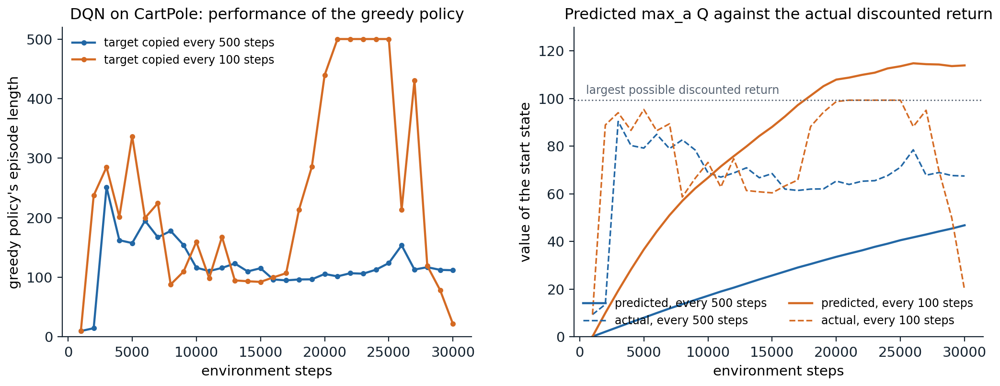
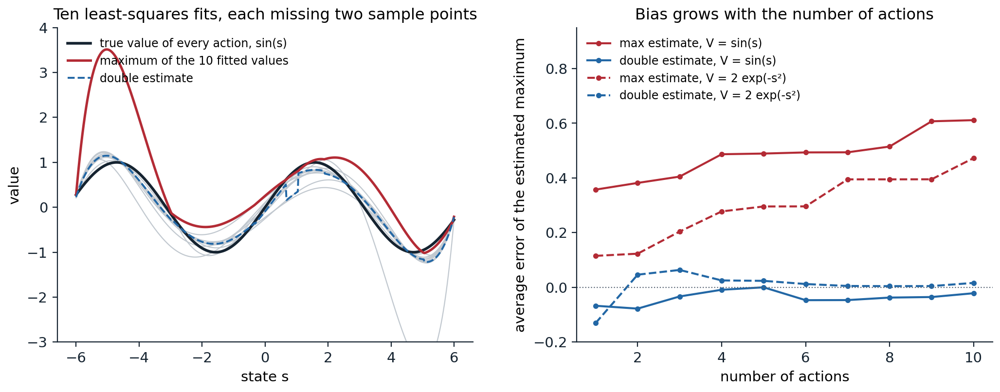

[Background Notes](../README.md) › [Reinforcement Learning](README.md)

# 16. Deep Q-Learning

[← 15. Optimal Control and Trajectory Optimization](15-optimal-control-and-trajectory-optimization.md) · [17. Distributional Reinforcement Learning →](17-distributional-reinforcement-learning.md)

## <a id="from-tabular-to-deep-q-learning"></a>From tabular to deep Q-learning

### <a id="learning-values-from-pixels"></a>Learning values from pixels

Part I of this module developed reinforcement learning with tables and with linear function approximation over hand-designed features. Part II replaces the features by deep neural networks, which learn their own representations from raw inputs, and follows the methods that made reinforcement learning work at scale: value-based agents in this chapter and the next two, policy-gradient and actor–critic agents in chapters 19 to 21, then exploration, models, imitation, offline data, many agents, language models, generalist agents, theory, and deployment in the real world.

Neural networks had been used as value functions long before. TD-Gammon learned backgammon with a network trained by TD(λ) (chapter 6), but attempts to repeat that success elsewhere mostly failed, and chapter 12 explained why: Q-learning combines function approximation, bootstrapping, and off-policy learning, the deadly triad, and with a nonlinear approximator its updates can diverge. The breakthrough was the **deep Q-network** (DQN) of [Mnih et al. (2013](https://arxiv.org/abs/1312.5602); [2015)](https://doi.org/10.1038/nature14236), which learned to play Atari 2600 games (seven in 2013, 49 in 2015) from the screen pixels and the score alone, with one architecture and one set of hyperparameters, at a level comparable to a professional human tester on many of them. Its test bed, the **Arcade Learning Environment** ([Bellemare, Naddaf, Veness, and Bowling, 2013](https://doi.org/10.1613/jair.3912)), became the standard benchmark of deep reinforcement learning for a decade.

### <a id="fitted-q-iteration-with-neural-networks"></a>Fitted Q iteration with neural networks

DQN's ancestor is **fitted Q iteration** (chapter 12): given a data set of transitions, repeatedly fit a function approximator to the targets $`r+\gamma\max_{a'}\hat q_k(s',a')`$ computed with the previous iterate, a sequence of supervised regressions. With trees it was introduced by [Ernst, Geurts, and Wehenkel (2005)](https://jmlr.org/papers/v6/ernst05a.html); **neural fitted Q iteration** (NFQ) ([Riedmiller, 2005](https://doi.org/10.1007/11564096_32)) fitted a multilayer network to the whole data set at each iteration and solved small control problems from few interactions. Each regression is stable because its targets are fixed while it is solved. DQN turns this batch procedure into an online agent that collects its data as it learns, keeping two of its ingredients: a large store of past transitions, and targets that are held fixed for a while.

## <a id="the-dqn-agent"></a>The DQN agent

### <a id="experience-replay"></a>Experience replay

DQN stores the agent's transitions $`(S_t,A_t,R_{t+1},S_{t+1})`$ in a **replay memory** of fixed capacity, the last million in the original, and updates the network on minibatches sampled uniformly from it, an idea due to [Lin (1992)](https://doi.org/10.1007/BF00992699). Replay does three things:

- **It decorrelates the updates.** Consecutive transitions are strongly correlated, and stochastic gradient descent on them is like training a classifier on data sorted by class: the network chases the recent past and forgets the rest.
- **It reuses data.** Each transition contributes to many updates instead of one, which improves sample efficiency.
- **It smooths the data distribution.** The behavior policy changes with every update, and learning only from the current policy's data can create feedback loops, where the policy's own mistakes dominate what it learns from. The replay memory mixes the data of many past policies.

Replay also makes the method off-policy by construction, since the stored transitions were generated by older policies; this is fine for one-step Q-learning, whose target does not depend on the behavior policy, and it is a complication for the multi-step targets of chapter 18.

### <a id="the-target-network"></a>The target network

The second ingredient is a separate **target network** $`\hat q(\cdot,\cdot;\mathbf w^-)`$, a copy of the online network whose weights are updated only every $`C`$ updates, 10,000 in the original. The targets are computed with it,

```math
y=r+\gamma\max_{a'}\hat q(s',a';\mathbf w^-),\qquad L(\mathbf w)=\mathbb E_{(s,a,r,s')\sim\mathcal D}\bigl[\ell\bigl(y-\hat q(s,a;\mathbf w)\bigr)\bigr],
```

so that between copies, the online network solves a fixed regression problem, as in fitted Q iteration. Without it, each update moves the targets in the direction of the update, and because the network generalizes, raising $`\hat q(s,a)`$ also raises $`\hat q(s',a')`$ for similar states, the bootstrapping loop that can spiral into divergence. An alternative to periodic copies is **Polyak averaging**, $`\mathbf w^-\leftarrow(1-\tau)\mathbf w^-+\tau\mathbf w`$ at every step with a small $`\tau`$ (0.001 in the original, 0.005 in later actor–critic methods), introduced for continuous control ([Lillicrap et al., 2016](https://arxiv.org/abs/1509.02971)) and standard in actor–critic methods (exercise 16.5).

The loss $`\ell`$ in the original was the squared error with the error term clipped to $`[-1,1]`$, which is equivalent to the **Huber loss**: quadratic for errors smaller than 1 and linear beyond, so that its gradient is the error, clipped (exercise 16.2). Large, occasional errors from bootstrapped targets then cannot dominate the updates.

### <a id="the-full-recipe"></a>The full recipe

The DQN of the 2015 paper has many further details, most of which became defaults:

- **Preprocessing.** Each frame is the maximum of two consecutive emulator frames (some games flicker), converted to grayscale and downsampled to $`84\times84`$; the network's input is a stack of the last 4 such frames, which makes motion visible (chapter 14).
- **Action repeat.** The agent chooses an action every 4 frames and repeats it in between, which quadruples the speed of play and makes decisions coarser.
- **Architecture.** Three convolutional layers (32 filters of $`8\times8`$ with stride 4, 64 of $`4\times4`$ with stride 2, 64 of $`3\times3`$ with stride 1) and a fully connected layer of 512 units, with ReLU activations, followed by one output per action, so that one forward pass gives all the action values.
- **Rewards.** Clipped to $`\{-1,0,+1\}`$, which lets one learning rate serve all games but changes what is optimized: the agent maximizes the number of rewarding events rather than the score (exercise 16.3).
- **Training.** RMSProp with step size 0.00025, minibatches of 32, one update every 4 actions, $`\gamma=0.99`$, and ε-greedy exploration with ε annealed from 1 to 0.1 over the first million steps; the replay memory is filled with 50,000 transitions before learning starts; training takes 50 million steps per game, which the paper calls frames: 200 million emulator frames with the action repeat, about 38 days of play.
- **Episodes.** During training, losing a life is treated as the end of an episode, which speeds learning in games with several lives; evaluation episodes start with a random number, up to 30, of no-op actions, so that the agent cannot memorize a single deterministic trajectory.

The whole algorithm, with its ε-greedy behavior, replay, and target network, fits in a few dozen lines. The next code runs it on Gymnasium's CartPole with a small network, once with the target network copied every 500 steps and once every 100.

```python
import gymnasium as gym
import numpy as np
import torch
import torch.nn as nn

# DQN on Gymnasium's CartPole-v1: a Q-network with two hidden layers of 64 units, experience replay (50,000
# transitions, minibatches of 64), a target network copied every 500 or every 100 steps, the Huber loss, Adam with step size
# 0.001, gamma = 0.99, and epsilon decaying from 1 to 0.05 over the first 10,000 steps. Every 5,000 steps: the
# average length of the last 10 training episodes, the greedy policy's average length over 10 test episodes,
# and its value predicted by the network at the start (max_a Q) against its actual discounted return, which is
# at most (1 - 0.99^500) / (1 - 0.99) = 99.3.
torch.set_num_threads(1)
env, test_env = gym.make("CartPole-v1"), gym.make("CartPole-v1")


def greedy_eval(q_net, episodes=10):
    lengths, predicted, actual = [], [], []
    for ep in range(episodes):
        s, _ = test_env.reset(seed=1000 + ep)
        with torch.no_grad():
            predicted.append(q_net(torch.as_tensor(s)).max().item())
        disc, total, n, done = 1.0, 0.0, 0, False
        while not done:
            with torch.no_grad():
                a = q_net(torch.as_tensor(s)).argmax().item()
            s, r, term, trunc, _ = test_env.step(a); done = term or trunc
            total += disc * r; disc *= 0.99; n += 1
        lengths.append(n); actual.append(total)
    return np.mean(lengths), np.mean(predicted), np.mean(actual)


for period in (500, 100):
    print(f"target network copied every {period} steps:")
    torch.manual_seed(0); rng = np.random.default_rng(0)
    q_net = nn.Sequential(nn.Linear(4, 64), nn.ReLU(), nn.Linear(64, 64), nn.ReLU(), nn.Linear(64, 2))
    target = nn.Sequential(nn.Linear(4, 64), nn.ReLU(), nn.Linear(64, 64), nn.ReLU(), nn.Linear(64, 2))
    target.load_state_dict(q_net.state_dict())
    opt = torch.optim.Adam(q_net.parameters(), lr=1e-3)
    N = 50000
    S, A, R, S2, D = np.zeros((N, 4), np.float32), np.zeros(N, np.int64), np.zeros(N, np.float32), np.zeros((N, 4), np.float32), np.zeros(N, np.float32)

    s, _ = env.reset(seed=0); episode, lengths = 0, []
    for t in range(30000):
        eps = max(0.05, 1 - 0.95 * t / 10000)
        if rng.random() < eps:
            a = int(rng.integers(2))
        else:
            with torch.no_grad():
                a = q_net(torch.as_tensor(s)).argmax().item()
        s2, r, term, trunc, _ = env.step(a)
        i = t % N
        S[i], A[i], R[i], S2[i], D[i] = s, a, r, s2, term           # a time-limit cutoff is not terminal
        s = s2; episode += 1
        if term or trunc:
            lengths.append(episode); episode = 0; s, _ = env.reset()
        if t >= 1000:                                                 # learn from a minibatch of replayed transitions
            idx = rng.integers(min(t + 1, N), size=64)
            with torch.no_grad():
                y = torch.as_tensor(R[idx]) + 0.99 * (1 - torch.as_tensor(D[idx])) * target(torch.as_tensor(S2[idx])).max(1).values
            q = q_net(torch.as_tensor(S[idx])).gather(1, torch.as_tensor(A[idx])[:, None]).squeeze(1)
            loss = nn.functional.smooth_l1_loss(q, y)
            opt.zero_grad(); loss.backward(); opt.step()
        if (t + 1) % period == 0:
            target.load_state_dict(q_net.state_dict())
        if (t + 1) % 5000 == 0:
            n, pred, actual = greedy_eval(q_net)
            print(f"  step {t + 1:6,d}: training episodes {np.mean(lengths[-10:]):5.1f} steps; greedy policy {n:5.1f} steps,"
                  f" predicted value {pred:6.1f}, actual discounted return {actual:5.1f}")
# target network copied every 500 steps:
#   step  5,000: training episodes  78.5 steps; greedy policy 157.5 steps, predicted value    8.0, actual discounted return  79.2
#   step 10,000: training episodes 124.3 steps; greedy policy 116.2 steps, predicted value   17.3, actual discounted return  68.9
#   step 15,000: training episodes 100.3 steps; greedy policy 115.3 steps, predicted value   25.8, actual discounted return  68.5
#   step 20,000: training episodes 108.6 steps; greedy policy 105.6 steps, predicted value   33.6, actual discounted return  65.4
#   step 25,000: training episodes 132.3 steps; greedy policy 123.9 steps, predicted value   40.6, actual discounted return  71.2
#   step 30,000: training episodes 103.1 steps; greedy policy 111.9 steps, predicted value   46.8, actual discounted return  67.5
# target network copied every 100 steps:
#   step  5,000: training episodes  49.3 steps; greedy policy 336.8 steps, predicted value   36.7, actual discounted return  95.4
#   step 10,000: training episodes 133.2 steps; greedy policy 159.5 steps, predicted value   66.8, actual discounted return  73.2
#   step 15,000: training episodes  82.8 steps; greedy policy  92.3 steps, predicted value   88.1, actual discounted return  60.4
#   step 20,000: training episodes 149.9 steps; greedy policy 439.6 steps, predicted value  108.0, actual discounted return  98.8
#   step 25,000: training episodes 471.0 steps; greedy policy 500.0 steps, predicted value  113.6, actual discounted return  99.3
#   step 30,000: training episodes  20.8 steps; greedy policy  21.7 steps, predicted value  113.9, actual discounted return  19.6
```

The two runs show the three characteristic behaviors of DQN. With copies every 500 steps, the predicted value of the start state rises slowly and steadily, to 47 after 30,000 steps, while the policy's actual discounted return is about 70: value information travels only about one step of bootstrapping per copy (58 copies support a value of about 44 from exact backups), so a target network that is too slow makes learning slow. With copies every 100 steps, the values catch up with the returns, and the greedy policy reaches the maximum of 500 steps after about 21,000 steps and holds it through 25,000. But its predicted value keeps rising, past the largest discounted return that any policy can obtain, about 99.3, to 114: the network overestimates. And at 30,000 steps the policy collapses to 22 steps per episode. A likely cause is that once the agent balances well, the replay memory fills with transitions from balanced states, the rare failures become a shrinking fraction of the minibatches (the memory holds 50,000 transitions, so in these 30,000 steps nothing is overwritten), and the network loses what it knew about how to avoid them: **catastrophic forgetting**, one of the reasons DQN's learning curves are notoriously unstable, and one of the reasons why evaluation should report the whole curve, not the best point on it.



*DQN on CartPole, the runs of the code above, evaluated every 1,000 steps. Left: the greedy policy's episode length (the maximum is 500). Right: the network's prediction $`\max_a\hat q(s_0,a)`$ of the value of the start state (solid) against the policy's actual discounted return (dashed). With a target network copied every 500 steps, the predictions lag far behind the returns. With copies every 100 steps they catch up, overshoot the largest possible return, and the policy collapses after reaching the maximum.*

### <a id="measuring-progress"></a>Measuring progress

On Atari, performance is summarized by the **human-normalized score** of each game, $`(\text{agent}-\text{random})/(\text{human}-\text{random})`$, and its median across games, which is less sensitive than the mean to a few games with enormous scores. DQN's median, with no-op starts, is about 94% over the 49 games of the original evaluation ([van Hasselt, Guez, and Silver, 2016](https://arxiv.org/abs/1509.06461)) and about 79% over the 57 games later adopted as the standard suite ([Wang et al., 2016](https://arxiv.org/abs/1511.06581)); its successors, in the next two chapters, exceed human performance on most of the 57 games of the standard suite. Two lessons about evaluation emerged over the following years. Deterministic emulators allow agents to exploit memorized action sequences, so evaluations add **sticky actions**, which repeat the previous action with probability 0.25 ([Machado et al., 2018](https://doi.org/10.1613/jair.5699)). And deep RL results vary enormously across random seeds and implementation details ([Henderson et al., 2018](https://arxiv.org/abs/1709.06560)), so comparisons need many runs and interval estimates of robust aggregates, such as the interquartile mean with bootstrap confidence intervals, rather than point estimates from a few seeds ([Agarwal et al., 2021](https://arxiv.org/abs/2108.13264)).

## <a id="overestimation-and-double-dqn"></a>Overestimation and double DQN

### <a id="where-overestimation-comes-from"></a>Where overestimation comes from

Chapter 7 showed that the maximum of noisy estimates is biased upward: if each $`\hat q(s,a)`$ has independent zero-mean error, $`\mathbb E[\max_a\hat q(s,a)]\ge\max_a q(s,a)`$, and the bias grows with the number of actions and the size of the errors (exercise 16.6). [Thrun and Schwartz (1993)](https://publications.ri.cmu.edu/issues-in-using-function-approximation-for-reinforcement-learning) pointed out that function approximation produces such errors even without noise in the rewards, and that bootstrapping propagates the bias from state to state. [van Hasselt, Guez, and Silver (2016)](https://arxiv.org/abs/1509.06461) showed that it occurs in DQN on Atari, where the estimated values of many games were far above the returns the policies achieved, and that it harms the policies.

```python
import numpy as np

# Overestimation from function approximation, in the spirit of van Hasselt, Guez, and Silver (2016, Figure 2).
# Every action has the same true value, Q(s, a) = V(s). Each action's value is approximated by a polynomial of
# degree 6 fitted by least squares (11 points, 7 coefficients), with no noise, to the true values at the integer
# states in [-6, 6], except two adjacent interior states that differ from action to action. The maximum over
# actions of the fitted values is compared with the true maximum, V(s); the double estimate picks the action with
# one set of fits and evaluates it with another, fitted with different pairs of states left out.
s = np.linspace(-6, 6, 601)
grid = np.arange(-6, 7)


def fits(V, n_actions, shift):
    out = []
    for a in range(n_actions):
        drop = {grid[1 + (a + shift) % 10], grid[2 + (a + shift) % 10]}             # two adjacent states left out
        pts = np.array([x for x in grid if x not in drop])
        out.append(np.polyval(np.polyfit(pts, V(pts), 6), s))
    return np.array(out)


for name, V in [("V(s) = sin(s)", np.sin), ("V(s) = 2 exp(-s^2)", lambda x: 2 * np.exp(-x ** 2))]:
    print(name)
    for n_actions in (2, 5, 10):
        QA, QB = fits(V, n_actions, 0), fits(V, n_actions, 5)
        single = QA.max(0) - V(s)                                                  # max over the same estimates
        double = QB[QA.argmax(0), np.arange(len(s))] - V(s)                         # choose with A, evaluate with B
        print(f"  {n_actions:2d} actions: average error of max_a Q(s, a) {single.mean():+.3f};"
              f" of the double estimate {double.mean():+.3f}; average absolute error of one fit {np.abs(QA[0] - V(s)).mean():.3f}")
# V(s) = sin(s)
#    2 actions: average error of max_a Q(s, a) +0.382; of the double estimate -0.078; average absolute error of one fit 0.420
#    5 actions: average error of max_a Q(s, a) +0.489; of the double estimate +0.000; average absolute error of one fit 0.420
#   10 actions: average error of max_a Q(s, a) +0.611; of the double estimate -0.021; average absolute error of one fit 0.420
# V(s) = 2 exp(-s^2)
#    2 actions: average error of max_a Q(s, a) +0.123; of the double estimate +0.047; average absolute error of one fit 0.316
#    5 actions: average error of max_a Q(s, a) +0.296; of the double estimate +0.024; average absolute error of one fit 0.316
#   10 actions: average error of max_a Q(s, a) +0.473; of the double estimate +0.016; average absolute error of one fit 0.316
```

In this experiment the regression targets are the exact true values, and there is no noise at all, yet the maximum over actions is too high on average, by 0.38 to 0.61 for sin(s) and by 0.12 to 0.47 for the bump, more with more actions. Each least-squares polynomial errs, slightly at its sample points and more between them, in different places for different actions, and the maximum picks up the positive errors. With one action, the error is that of a single fit; with more, it grows.



*Left: ten polynomial fits (gray) to the same true values, sin(s), each fitted by least squares to the exact true values at the integer states in $`[-6,6]`$ except two adjacent interior ones. The maximum over the fits (red) is far above the true maximum where some fit overshoots; the double estimate (dashed), which chooses the action with these fits and evaluates it with a second set fitted with different points left out, is nearly unbiased. Right: the average error of the two estimates of the maximum as the number of actions grows, for two true value functions. The left panel follows Figure 2 of van Hasselt, Guez, and Silver (2016).*

### <a id="double-dqn"></a>Double DQN

**Double Q-learning** (chapter 7) removes the bias by using one estimate to choose the maximizing action and an independent one to evaluate it. **Double DQN** ([van Hasselt, Guez, and Silver, 2016](https://arxiv.org/abs/1509.06461)) obtains the second estimate for free, from the networks DQN already has: the online network chooses and the target network evaluates,

```math
y=r+\gamma\,\hat q\Bigl(s',\arg\max_{a'}\hat q(s',a';\mathbf w);\mathbf w^-\Bigr).
```

The two networks are not independent, so the bias is reduced rather than removed, but the change of one line reduced the overestimates substantially on Atari and improved the scores on many games. Other remedies average several target networks ([Anschel, Baram, and Shimkin, 2017](https://arxiv.org/abs/1611.01929)) or take the minimum of two independent critics, the clipped double Q-learning of TD3 (chapter 21), which trades overestimation for a controlled underestimation.

## <a id="network-architectures-for-values"></a>Network architectures for values

### <a id="dueling-networks"></a>Dueling networks

In many states the choice of action matters little: in a racing game, when no car is near, every action has nearly the same value. The **dueling architecture** ([Wang et al., 2016](https://arxiv.org/abs/1511.06581)) splits the network after the shared convolutional layers into two streams, one estimating the state value $`V(s)`$ and one the advantages $`A(s,a)`$, and combines them as

```math
\hat q(s,a)=V(s)+\Bigl(A(s,a)-\frac1{|\mathcal A|}\sum_{b}A(s,b)\Bigr).
```

The subtraction makes the decomposition identifiable: without it, adding a constant to $`V`$ and subtracting it from every $`A`$ gives the same $`\hat q`$ (exercise 16.4). Every update then improves $`V(s)`$, which is shared by all actions, even though only one action's value is observed per transition, and the network learns which states are valuable without having to learn the effect of each action in each of them. Dueling networks improved DQN and double DQN on most Atari games, and the architecture is a standard component of later agents.

### <a id="other-heads-and-inputs"></a>Other heads and inputs

The output layer can represent more than one number per action. **Distributional** heads output a distribution over returns (chapter 17); **noisy** layers add learned, parameter-space noise for exploration; and **recurrent** layers replace frame stacking for partially observable tasks, as in DRQN and R2D2 (chapter 14; chapter 18).

## <a id="why-deep-q-learning-works-and-when-it-does-not"></a>Why deep Q-learning works, and when it does not

### <a id="the-deadly-triad-in-practice"></a>The deadly triad in practice

DQN has all three elements of the deadly triad (chapter 12), yet it rarely diverges outright. [van Hasselt et al. (2018)](https://arxiv.org/abs/1812.02648) trained 336 variants of deep Q-learning on each of 57 Atari games and found that unbounded divergence was rare, but that **soft divergence**, value estimates growing far beyond any possible return before coming back, was common, and that it was made more frequent by the absence of a target network, by stronger prioritization of replay, and, unexpectedly, by larger networks, and less frequent by double Q-learning and by multi-step returns, which bootstrap less. Target networks, replay, and double Q-learning are thus best understood as ways of keeping each regression close to fitted Q iteration, whose error propagation is understood ([Munos and Szepesvári, 2008](https://jmlr.org/papers/v9/munos08a.html); chapter 12). Theoretical analyses of DQN view it this way, bounding the error of the resulting policy by the error of each regression and a concentrability coefficient of the data distribution ([Fan, Wang, Xie, and Yang, 2020](https://arxiv.org/abs/1901.00137)).

### <a id="pathologies-of-deep-value-learning"></a>Pathologies of deep value learning

Deep value-based agents have characteristic failure modes, several of which recent work has diagnosed:

- **Overestimation**, as above, and the instability it feeds.
- **Catastrophic forgetting and interference.** A network trained on a changing distribution loses what it learned on the old one, as in the CartPole run above. The size of the replay memory and the ratio of updates to new data strongly affect performance, in ways that interact with the other components ([Fedus et al., 2020](https://arxiv.org/abs/2007.06700)).
- **Loss of representational capacity.** The features learned by bootstrapped regression tend to lose rank over training, **implicit under-parameterization** ([Kumar, Agarwal, Ghosh, and Levine, 2021](https://arxiv.org/abs/2010.14498)), and networks trained on a sequence of targets lose their ability to fit new ones, **capacity loss**, or loss of plasticity ([Lyle, Rowland, and Dabney, 2022](https://arxiv.org/abs/2204.09560)). Networks also overfit to early experience, the **primacy bias**, which periodically resetting some of their layers counters ([Nikishin et al., 2022](https://arxiv.org/abs/2205.07802)); chapter 18 shows how these fixes enabled far more sample-efficient agents.
- **Sensitivity.** Performance depends on many interacting hyperparameters, on implementation details, and on the random seed, which is why careful evaluation matters.

### <a id="continuous-actions"></a>Continuous actions

The maximization over actions in the target and in action selection is trivial for 18 discrete actions but is itself an optimization problem for continuous ones. Three answers exist: restrict the Q-function to a form whose maximum is known in closed form, as normalized advantage functions do with a quadratic in the action ([Gu, Lillicrap, Sutskever, and Levine, 2016](https://arxiv.org/abs/1603.00748)); maximize by sampling, as QT-Opt does with the cross-entropy method of chapter 15 for robotic grasping ([Kalashnikov et al., 2018](https://arxiv.org/abs/1806.10293)); or learn a policy network that outputs the maximizing action, which is the deterministic actor–critic of DDPG and TD3 (chapter 21).

Lab 8 trains two dozen DQN agents at once on the cart-pole to measure the effect of the target network, the replay window, double Q-learning, and the dueling architecture, and how far the values overshoot what any policy can earn; it then compares DQN and double DQN with a convolutional network on MinAtar's Space Invaders.

## <a id="exercises"></a>Exercises

### <a id="exercise-16-1-dqn-as-fitted-q-iteration"></a>Exercise 16.1 — DQN as fitted Q iteration

(a) Show that if the target network is copied only after the online network has fully minimized the loss on a fixed replay memory, DQN performs fitted Q iteration on that data set. (b) What changes when the memory keeps receiving new data, and when the copy period is short?


<details>
<summary><b>Solution</b></summary>


(a) With the target weights $`\mathbf w^-_k`$ fixed, the loss $`\mathbb E_{\mathcal D}[\ell(r+\gamma\max_{a'}\hat q(s',a';\mathbf w^-_k)-\hat q(s,a;\mathbf w))]`$ is a regression of the targets on the state–action pairs of the data set. Minimizing it fully gives $`\mathbf w_{k+1}`$, the approximator's best fit to the backed-up values of $`\hat q_k`$, and copying it to the target network starts the next regression: this is exactly fitted Q iteration with the network class as the regression method (with the Huber loss instead of the squared error).

(b) With new data arriving, the regression problem changes with the data distribution, and the procedure is fitted Q iteration on a moving data set, whose fixed point depends on the behavior of the agent itself. With a short copy period, each regression is only partially solved, and the method moves toward the semi-gradient Q-learning of chapter 12, in which the targets move with every update. The CartPole runs show both sides: copying every 500 steps propagates values one step per copy and is slow; copying every 100 steps propagates them faster, at the risk of instability.

</details>


### <a id="exercise-16-2-error-clipping-is-the-huber-loss"></a>Exercise 16.2 — Error clipping is the Huber loss

The Huber loss with threshold $`\delta`$ is $`\ell_\delta(e)=e^2/2`$ for $`|e|\le\delta`$ and $`\delta(|e|-\delta/2)`$ otherwise. (a) Compute its derivative. (b) Show that clipping the TD error to $`[-1,1]`$ in the gradient of the squared loss, as the DQN paper describes, is gradient descent on $`\ell_1`$. (c) What does the Huber loss estimate, when the targets are noisy?


<details>
<summary><b>Solution</b></summary>


(a) $`\ell'_\delta(e)=e`$ for $`|e|\le\delta`$ and $`\delta\,\mathrm{sign}(e)`$ otherwise: the error, clipped to $`[-\delta,\delta]`$.

(b) The gradient of $`\tfrac12(y-\hat q(s,a;\mathbf w))^2`$ with respect to $`\mathbf w`$ is $`-(y-\hat q)\nabla\hat q`$. Replacing the error by its clipped value gives $`-\mathrm{clip}(y-\hat q,-1,1)\nabla\hat q`$, which by (a) is the gradient of $`\ell_1(y-\hat q)`$.

(c) The minimizer of $`\mathbb E[\ell_\delta(Y-c)]`$ over $`c`$ is a robust location estimate between the mean (for large $`\delta`$) and the median (for small $`\delta`$). When the distribution of the target is skewed, the Huber loss does not estimate the mean, and so it does not estimate the expected return exactly; in practice $`\delta`$ is large relative to typical errors after reward clipping, and the difference is small, but it is one more way in which the practical algorithm departs from Q-learning.

</details>


### <a id="exercise-16-3-what-reward-clipping-optimizes"></a>Exercise 16.3 — What reward clipping optimizes

(a) In a game where one action sequence earns a single reward of 100 and another earns ten rewards of 1, which does an agent with clipped rewards prefer? (b) Why did DQN clip rewards, and what is the alternative?


<details>
<summary><b>Solution</b></summary>


(a) After clipping, the first sequence earns 1 and the second 10, so the agent prefers the second, although its score is ten times lower. With clipping, the agent maximizes the (discounted) number of positive events minus the number of negative ones, not the score.

(b) Rewards in Atari games range over several orders of magnitude, from 1 to thousands of points per event, and a single learning rate and a single network architecture had to work for all of them: without clipping, the gradients of games with large rewards would be enormous. The alternatives normalize the targets rather than the rewards. **Pop-Art** adaptively rescales the targets while preserving the network's outputs ([van Hasselt et al., 2016](https://arxiv.org/abs/1602.07714)); an invertible squashing function applied to the value, $`h(x)=\mathrm{sign}(x)(\sqrt{|x|+1}-1)+\epsilon x`$, used by R2D2 and its successors, compresses large values while preserving the greedy policy in deterministic environments ([Pohlen et al., 2018](https://arxiv.org/abs/1805.11593); chapter 18).

</details>


### <a id="exercise-16-4-identifiability-in-the-dueling-architecture"></a>Exercise 16.4 — Identifiability in the dueling architecture

(a) Show that $`Q(s,a)=V(s)+A(s,a)`$ does not determine $`V`$ and $`A`$. (b) With $`Q(s,a)=V(s)+A(s,a)-\max_bA(s,b)`$, what are $`V`$ and $`A`$ in terms of $`Q`$? (c) With the mean instead of the maximum?


<details>
<summary><b>Solution</b></summary>


(a) For any function $`c(s)`$, $`V+c`$ and $`A-c`$ give the same $`Q`$, so the two streams cannot be recovered from $`Q`$, and gradient descent may let them drift in opposite directions without changing any output.

(b) Maximizing both sides over $`a`$ gives $`\max_aQ(s,a)=V(s)`$, so the value stream estimates the optimal value, and $`A(s,a)-\max_bA(s,b)=Q(s,a)-V(s)`$, the advantage of $`a`$ relative to the best action, which is 0 for the greedy action. $`A`$ itself is still determined only up to a constant, but that constant cancels in $`Q`$.

(c) Averaging over $`a`$ gives $`V(s)=\frac1{|\mathcal A|}\sum_aQ(s,a)`$, the mean action value rather than the maximum, and the centered advantages sum to zero. The version with the maximum gives $`V`$ its intended meaning, but [Wang et al. (2016)](https://arxiv.org/abs/1511.06581) found that the mean made optimization more stable: the advantages only need to change as fast as their mean, not as fast as the maximum, which switches from one action to another.

</details>


### <a id="exercise-16-5-periodic-copies-and-polyak-averaging"></a>Exercise 16.5 — Periodic copies and Polyak averaging

(a) If the target network is copied every $`C`$ steps, how old, on average, are its weights? (b) With Polyak averaging, $`\mathbf w^-\leftarrow(1-\tau)\mathbf w^-+\tau\mathbf w`$, what is the average age of the weights it contains? (c) Which $`\tau`$ corresponds to $`C=500`$?


<details>
<summary><b>Solution</b></summary>


(a) Just after a copy, the target weights are from the current step; just before the next, they are $`C-1`$ steps old. Averaged over the period, their age is $`(C-1)/2`$ steps.

(b) Unrolling the update, $`\mathbf w^-_t=\sum_{k\ge0}\tau(1-\tau)^k\mathbf w_{t-k}`$ (plus a vanishing contribution of the initial weights), a geometric average of past weights with mean age $`\sum_kk\,\tau(1-\tau)^k=(1-\tau)/\tau`$ steps.

(c) Matching $`(1-\tau)/\tau=(C-1)/2`$ gives $`\tau=2/(C+1)\approx0.004`$ for $`C=500`$. The averaged target changes smoothly instead of jumping, which avoids the discontinuities in the regression problem at each copy, and the lag, not the mechanism, is what sets the speed at which value information propagates.

</details>


### <a id="exercise-16-6-how-large-is-the-maximization-bias"></a>Exercise 16.6 — How large is the maximization bias?

Let $`M`$ actions have true value 0 and estimates with independent $`\mathcal N(0,\sigma^2)`$ errors. (a) Compute $`\mathbb E[\max_a\hat q(a)]`$ for $`\sigma=1`$, and compare with $`\sqrt{2\ln M}`$. (b) Show that the double estimator is unbiased when all true values are equal, and negatively biased otherwise.


<details>
<summary><b>Solution</b></summary>


```python
import numpy as np
from scipy import integrate, stats

# The bias of the maximum of M noisy estimates of equal true values (all 0), with independent N(0, 1) errors:
# E[max] computed exactly by integration, the approximation sqrt(2 ln M), and Monte Carlo estimates of the
# single and double estimators. The double estimator picks the argmax of one set and reads a second,
# independent set of estimates, so its bias is 0 here; with unequal true values it is negative.
rng = np.random.default_rng(0)
print("   M   E[max] exactly   sqrt(2 ln M)   single (sampled)   double (sampled)")
for M in (2, 4, 10, 18, 100, 1000):
    exact = integrate.quad(lambda x: x * M * stats.norm.pdf(x) * stats.norm.cdf(x) ** (M - 1), -10, 10)[0]
    A, B = rng.standard_normal((100000, M)), rng.standard_normal((100000, M))
    double = B[np.arange(100000), A.argmax(1)].mean()
    print(f"{M:5d}   {exact:14.3f}   {np.sqrt(2 * np.log(M)):12.3f}   {A.max(1).mean():16.3f}   {double:16.3f}")
# unequal values: two actions with true values 0 and -1, the same noise
A = np.array([0.0, -1.0]) + rng.standard_normal((100000, 2)); B = np.array([0.0, -1.0]) + rng.standard_normal((100000, 2))
print(f"true values (0, -1): single estimator bias {A.max(1).mean():+.3f}, double estimator bias {B[np.arange(100000), A.argmax(1)].mean():+.3f}")
#    M   E[max] exactly   sqrt(2 ln M)   single (sampled)   double (sampled)
#     2            0.564          1.177              0.567              0.000
#     4            1.029          1.665              1.030              0.005
#    10            1.539          2.146              1.537             -0.005
#    18            1.820          2.404              1.821             -0.003
#   100            2.508          3.035              2.506              0.006
#  1000            3.241          3.717              3.241             -0.004
# true values (0, -1): single estimator bias +0.201, double estimator bias -0.240
```

(a) The expected maximum of $`M`$ standard normals is $`\int x\,M\phi(x)\Phi(x)^{M-1}dx`$: $`1/\sqrt\pi\approx0.564`$ for two actions, 1.54 for ten, and 1.82 for Atari's 18. It grows like $`\sqrt{2\ln M}`$, which it approaches slowly from below. The bias is proportional to $`\sigma`$, so it matters most where the estimates are least accurate, which early in training is everywhere, and bootstrapping carries it from state to state.

(b) The double estimator reads $`\hat q_B(a^*)`$ with $`a^*=\arg\max_a\hat q_A(a)`$ chosen from independent estimates, so $`\mathbb E[\hat q_B(a^*)\mid a^*]=q(a^*)`$ and $`\mathbb E[\hat q_B(a^*)]=\mathbb E[q(a^*)]\le\max_aq(a)`$, with equality when all true values are equal. With values 0 and $`-1`$, the double estimator sometimes chooses the worse action, and its expectation, $`-0.24`$, is below the true maximum, while the single estimator's is $`+0.20`$ above it ([van Hasselt, 2010](https://papers.nips.cc/paper_files/paper/2010/hash/091d584fced301b442654dd8c23b3fc9-Abstract.html)).

</details>


### <a id="exercise-16-7-losing-a-life"></a>Exercise 16.7 — Losing a life

DQN treats the loss of a life as the end of an episode during training, but not during evaluation. (a) What does the agent's value function estimate, and how does it differ from the value of the game? (b) Why does it help, and when could it hurt?


<details>
<summary><b>Solution</b></summary>


(a) With a life loss treated as terminal, the target at that transition is $`r`$ with no bootstrapped continuation, so the value function estimates the discounted reward until the next loss of a life, not until the end of the game. The two differ by the discounted value of the remaining lives.

(b) It helps because losing a life is usually bad, and the terminal signal makes that immediately visible in the targets, without waiting for bootstrapping to propagate the lower value of the states with fewer lives. It can hurt in games where losing a life is sometimes the best move, for example to reposition, since the agent then undervalues it; and it makes the state non-Markov if the number of remaining lives, which changes the value, is not visible. [Machado et al. (2018)](https://doi.org/10.1613/jair.5699) recommend against it as a source of game-specific knowledge in evaluations.

</details>


### <a id="exercise-16-8-counting-frames-steps-and-updates"></a>Exercise 16.8 — Counting frames, steps, and updates

DQN trained for 50 million agent steps per game, each repeating an action for 4 emulator frames, with one update every 4 steps and minibatches of 32. (a) How many updates is that, and how many times is each transition replayed on average? (b) How long would the same amount of play take in real time at 60 frames per second?


<details>
<summary><b>Solution</b></summary>


(a) 50 million steps are 50 million transitions, and one update every 4 steps gives 12.5 million updates of 32 transitions, 400 million sampled transitions: each transition is replayed 8 times on average, a **replay ratio** of one update per 4 steps with minibatches of 32. The memory holds the last million transitions, so each transition stays in it for a million steps, during which it is sampled with probability $`32/10^6`$ at each of 250,000 updates, again 8 times on average.

(b) With the action repeat, 50 million steps are 200 million emulator frames, which at 60 frames per second take about 3.3 million seconds: 926 hours, or 38.6 days of continuous play per game, the paper's 38 days. The human testers practiced for about two hours per game. This gap in sample efficiency, rather than in final performance, drives much of chapter 18, and it is why later papers state their budgets carefully in emulator frames or in agent steps.

</details>


## <a id="appendices"></a>Appendices


<details>
<summary><a id="block-rl16-appendix-a"></a><b>A. The DQN algorithm</b></summary>


Initialize the online network $`\hat q(\cdot,\cdot;\mathbf w)`$ and the target network with $`\mathbf w^-=\mathbf w`$, and an empty replay memory $`\mathcal D`$ of capacity $`N`$. For each step $`t`$:

1. Observe the preprocessed state $`S_t`$ (the stack of the last frames). With probability $`\varepsilon_t`$ choose a random action, otherwise $`A_t=\arg\max_a\hat q(S_t,a;\mathbf w)`$. Repeat it for the fixed number of frames, receive the total reward, clipped, and observe $`S_{t+1}`$ and whether the episode (or a life) ended.
2. Store $`(S_t,A_t,R_{t+1},S_{t+1},\text{done}_{t+1})`$ in $`\mathcal D`$, overwriting the oldest transition when it is full.
3. Every $`k`$ steps, once $`\mathcal D`$ holds enough transitions, sample a minibatch $`\{(s_j,a_j,r_j,s'_j,d_j)\}`$ uniformly from $`\mathcal D`$, compute $`y_j=r_j+\gamma(1-d_j)\max_{a'}\hat q(s'_j,a';\mathbf w^-)`$ (or the double DQN target), and take a gradient step on $`\frac1B\sum_j\ell\bigl(y_j-\hat q(s_j,a_j;\mathbf w)\bigr)`$ with respect to $`\mathbf w`$.
4. Every $`C`$ updates, set $`\mathbf w^-\leftarrow\mathbf w`$.

Only true terminations set $`d_j=1`$: an episode cut off by a time limit is not over, and its last transition must bootstrap (Lab 6 shows what goes wrong otherwise). The memory stores frames, not stacks: storing each frame once and assembling the stacks when sampling reduces the memory of a million transitions from about 56 GB to about 7 GB.

</details>


<details>
<summary><a id="block-rl16-appendix-b"></a><b>B. Why a target network stabilizes: a linear example</b></summary>


Consider linear function approximation, $`\hat q(s,a)=\boldsymbol\phi(s,a)^\top\mathbf w`$, and expected updates on a fixed data distribution $`\mu`$. Without a target network, semi-gradient Q-learning for a fixed greedy policy is the linear system $`\mathbf w\leftarrow\mathbf w+\alpha(\mathbf b-M\mathbf w)`$ with $`M=\Phi^\top D(\Phi-\gamma P_\pi\Phi)`$, which converges only if the eigenvalues of $`M`$ have positive real parts, a condition that off-policy distributions can violate (chapter 12). With a target network updated every $`C`$ steps and the regression solved exactly in between, the update of the target weights becomes $`\mathbf w^-\leftarrow(\Phi^\top D\Phi)^{-1}\Phi^\top D(\mathbf r+\gamma P_\pi\Phi\mathbf w^-)`$, the projected Bellman operator $`\Pi_\mu T_\pi`$ in weight space. It converges if $`\Pi_\mu T_\pi`$ is a contraction, which holds for the on-policy distribution and for averagers (chapter 12), and can fail otherwise, as the least-squares example of Tsitsiklis and Van Roy (1996) in chapter 12 shows. So the target network does not remove the deadly triad; it replaces the conditions for the stability of a stochastic approximation by those of fitted value iteration. The price is speed: information propagates one Bellman backup per copy.

</details>

---

[← 15. Optimal Control and Trajectory Optimization](15-optimal-control-and-trajectory-optimization.md) · [17. Distributional Reinforcement Learning →](17-distributional-reinforcement-learning.md)
